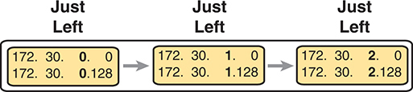
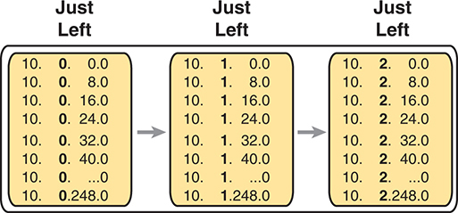

# Appendix G

## Practice for Chapter 15: Subnet Design

This appendix exists as two halves to match the two major sections of the chapter. The first half lists mask design problems, and then the answers to those problems. The second half lists problems where you need to find the subnet ID, but with less than 8 subnet bits and with more than 8 subnet bits.

To solve these problems, use the processes explained in [Chapter 15](vol1_ch15.md#ch15) of *CCNA 200-301 Official Cert Guide, Volume 1*, Second Edition, the current edition of this book you are reading.

### Mask Design Practice Problems

This section lists problems with a short set of requirements regarding how a particular classful network should be subnetted. The requirements include the classful network, the number of subnets the design must support, and the number of hosts in each subnet. For each problem, supply the following information:

* The minimum number of subnet and host bits needed in the mask to support the design requirements
* The dotted-decimal format mask(s) that meet the requirements
* The mask you would choose if the problem said to maximize the number of subnets
* The mask you would choose if the problem said to maximize the number of hosts per subnet

Also note that you should assume that the two special subnets in each network--the zero subnet and broadcast subnet--are allowed to be used for these questions.

When doing the problems, the information in [Table G-1](vol1_appg.md#appgtab01) can be helpful. Note that [Appendix A](vol1_appa.md#appa), "[Numeric Reference Tables](vol1_appa.md#appa)," in the printed book, also includes this table.

**Table G-1** Powers of 2

| Number of Bits | 2X | Number of Bits | 2X | Number of Bits | 2X | Number of Bits | 2X |
| --- | --- | --- | --- | --- | --- | --- | --- |
| 1 | 2 | 5 | 32 | 9 | 512 | 13 | 8192 |
| 2 | 4 | 6 | 64 | 10 | 1024 | 14 | 16,384 |
| 3 | 8 | 7 | 128 | 11 | 2048 | 15 | 32,768 |
| 4 | 16 | 8 | 256 | 12 | 4096 | 16 | 65,536 |

Find the key facts for these sets of requirements:

1. Network 10.0.0.0, need 50 subnets, need 200 hosts/subnet
2. Network 172.32.0.0, need 125 subnets, need 125 hosts/subnet
3. Network 192.168.44.0, need 15 subnets, need 6 hosts/subnet
4. Network 10.0.0.0, need 300 subnets, need 500 hosts/subnet
5. Network 172.32.0.0, need 500 subnets, need 15 hosts/subnet
6. Network 172.16.0.0, need 2000 subnets, need 2 hosts/subnet

### Mask Design Answers

This section includes the answers to the six problems listed in this appendix. The answer section for each problem explains how to use the process outlined in [Chapter 15](vol1_ch15.md#ch15), "[Subnet Design](vol1_ch15.md#ch15)," to find the answers.

#### Answer to Mask Design Problem 1

Problem 1 shows a Class A network, with 8 network bits, with a minimum of 6 subnet bits and 8 host bits to meet the required number of subnets and hosts/subnet. The following masks all meet the requirements in this problem, with the masks that maximize the number of hosts/subnet and the number of subnets noted:

* 255.252.0.0 (maximizes the number of hosts per subnet)
* 255.254.0.0
* 255.255.0.0
* 255.255.128.0
* 255.255.192.0
* 255.255.224.0
* 255.255.240.0
* 255.255.248.0
* 255.255.252.0
* 255.255.254.0
* 255.255.255.0 (maximizes the number of subnets)

As for the process to find the answers, the following list explains the details:

Note

The following explanation uses step numbers that match the process listed in [Chapter 15](vol1_ch15.md#ch15), but only the steps from that process that apply to this problem. As a result, the step numbers in the explanation are not sequential.

Step 1. The question lists Class A network 10.0.0.0, so there are 8 network bits.

Step 2. The question states that 50 subnets are needed. A mask with 5 subnet bits supplies only 25 (32) subnets, but a mask with 6 subnet bits supplies 26 (64) subnets. So, the mask needs at least 6 subnet bits.

Step 3. The question states that 200 hosts are needed per subnet. A mask with 7 host bits supplies only 27 - 2 (126) hosts per subnet, but a mask with 8 host bits supplies 28 - 2 (254) hosts per subnet. So, the mask needs at least 8 host bits.

Step 6A. With N=8, a minimum S=6, and a minimum H=8, multiple masks exist. The first mask, with the minimum number of subnet bits, is /14, found by adding N (8) to the minimum value of S (6). This mask maximizes the number of host bits and therefore maximizes the number of hosts/subnet.

Step 6B. The minimum value of H, the number of host bits, is 8. So, the mask with the fewest H bits, maximizing the number of subnets, is 32 - H = 32 - 8 = /24.

Step 6C. All masks between /14 and /24 also meet the requirements.

#### Answer to Mask Design Problem 2

Problem 2 shows a Class B network, with 16 network bits, with a minimum of 7 subnet bits and 7 host bits to meet the required number of subnets and hosts/subnet. The following masks all meet the requirements in this problem, with the masks that maximize the number of hosts/subnet and the number of subnets noted:

* 255.255.254.0 (maximizes the number of hosts/subnet)
* 255.255.255.0
* 255.255.255.128 (maximizes the number of subnets)

As for the process to find the answers, the following list explains the details:

Step 1. The question lists Class B network 172.32.0.0, so there are 16 network bits.

Step 2. The question states that 125 subnets are needed. A mask with 6 subnet bits supplies only 26 (64) subnets, but a mask with 7 subnet bits supplies 27 (128) subnets. So, the mask needs at least 7 subnet bits.

Step 3. The question states that 125 hosts are needed per subnet. A mask with 6 host bits supplies only 26 - 2 (62) hosts per subnet, but a mask with 7 host bits supplies 27 - 2 (126) hosts per subnet. So, the mask needs at least 7 host bits.

Step 6A. With N=16, a minimum S=7, and a minimum H=7, multiple masks exist. The first mask, with the minimum number of subnet bits, is /23, found by adding N (16) to the minimum value of S (7). This mask maximizes the number of host bits and therefore maximizes the number of hosts/subnet.

Step 6B. The minimum value of H, the number of host bits, is 7. So, the mask with the fewest H bits, maximizing the number of subnets, is 32 - H = 32 - 7 = /25.

Step 6C. All masks between /23 and /25 also meet the requirements (/23, /24, and /25).

#### Answer to Mask Design Problem 3

Problem 3 shows a Class C network, with 24 network bits, with a minimum of 4 subnet bits and 3 host bits to meet the required number of subnets and hosts/subnet. The following masks all meet the requirements in this problem, with the masks that maximize the number of hosts/subnet and the number of subnets noted:

* 255.255.255.240 (maximizes the number of hosts/subnet)
* 255.255.255.248 (maximizes the number of subnets)

As for the process to find the answers, the following list explains the details:

Step 1. The question lists Class C network 192.168.44.0, so there are 24 network bits.

Step 2. The question states that 15 subnets are needed. A mask with 3 subnet bits supplies only 23 (8) subnets, but a mask with 4 subnet bits supplies 24 (16) subnets. So, the mask needs at least 4 subnet bits.

Step 3. The question states that 6 hosts are needed per subnet. A mask with 2 host bits supplies only 22 - 2 (2) hosts per subnet, but a mask with 3 host bits supplies 23 - 2 (6) hosts per subnet. So, the mask needs at least 3 host bits.

Step 6A. With N=24, a minimum S=4, and a minimum H=3, multiple masks exist. The first mask, with the minimum number of subnet bits, is /28, found by adding N (24) to the minimum value of S (4). This mask maximizes the number of host bits and therefore maximizes the number of hosts/subnet.

Step 6B. The minimum value of H, the number of host bits, is 3. So, the mask with the fewest H bits, maximizing the number of subnets, is 32 - H = 32 - 3 = /29.

Step 6C. Only masks /28 and /29 meet the requirements.

#### Answer to Mask Design Problem 4

Problem 4 shows a Class A network, with 8 network bits, with a minimum of 9 subnet bits and 9 host bits to meet the required number of subnets and hosts/subnet. The following masks all meet the requirements in this problem, with the masks that maximize the number of hosts/subnet and the number of subnets noted:

* 255.255.128.0 (maximizes the number of hosts/subnet)
* 255.255.192.0
* 255.255.224.0
* 255.255.240.0
* 255.255.248.0
* 255.255.252.0
* 255.255.254.0 (maximizes the number of subnets)

As for the process to find the answers, the following list explains the details:

Step 1. The question lists Class A network 10.0.0.0, so there are 8 network bits.

Step 2. The question states that 300 subnets are needed. A mask with 8 subnet bits supplies only 28 (256) subnets, but a mask with 9 subnet bits supplies 29 (512) subnets. So, the mask needs at least 9 subnet bits.

Step 3. The question states that 500 hosts are needed per subnet. A mask with 8 host bits supplies only 28 - 2 (254) hosts per subnet, but a mask with 9 host bits supplies 29 - 2 (510) hosts per subnet. So, the mask needs at least 9 host bits.

Step 6A. With N=8, a minimum S=9, and a minimum H=9, multiple masks exist. The first mask, with the minimum number of subnet bits, is /17, found by adding N (8) to the minimum value of S (9). This mask maximizes the number of host bits and therefore maximizes the number of hosts/subnet.

Step 6B. The minimum value of H, the number of host bits, is 9. So, the mask with the fewest H bits, maximizing the number of subnets, is 32 - H = 32 - 9 = /23.

Step 6C. All masks between /17 and /23 also meet the requirements (/17, /18, /19, /20, /21, /22, /23).

#### Answer to Mask Design Problem 5

Problem 5 shows a Class B network, with 16 network bits, with a minimum of 9 subnet bits and 5 host bits to meet the required number of subnets and hosts/subnet. The following masks all meet the requirements in this problem, with the masks that maximize the number of hosts/subnet and the number of subnets noted:

* 255.255.255.128 (maximizes the number of hosts/subnet)
* 255.255.255.192
* 255.255.255.224 (maximizes the number of subnets)

As for the process to find the answers, the following list explains the details:

Step 1. The question lists Class B network 172.32.0.0, so there are 16 network bits.

Step 2. The question states that 500 subnets are needed. A mask with 8 subnet bits supplies only 28 (256) subnets, but a mask with 9 subnet bits supplies 29 (512) subnets. So, the mask needs at least 9 subnet bits.

Step 3. The question states that 15 hosts are needed per subnet. A mask with 4 host bits supplies only 24 - 2 (14) hosts per subnet, but a mask with 5 host bits supplies 25 - 2 (30) hosts per subnet. So, the mask needs at least 5 host bits.

Step 6A. With N=16, a minimum S=9, and a minimum H=5, multiple masks exist. The first mask, with the minimum number of subnet bits, is /25, found by adding N (16) to the minimum value of S (9). This mask maximizes the number of host bits and therefore maximizes the number of hosts/subnet.

Step 6B. The minimum value of H, the number of host bits, is 5. So, the mask with the fewest H bits, maximizing the number of subnets, is 32 - H = 32 - 5 = /27.

Step 6C. All masks between /25 and /27 also meet the requirements (/25, /26, /27).

#### Answer to Mask Design Problem 6

Problem 6 shows a Class B network, with 16 network bits, with a minimum of 11 subnet bits and 2 host bits to meet the required number of subnets and hosts/subnet. The following masks all meet the requirements in this problem, with the masks that maximize the number of hosts/subnet and the number of subnets noted:

* 255.255.255.224 (maximizes the number of hosts/subnet)
* 255.255.255.240
* 255.255.255.248
* 255.255.255.252 (maximizes the number of subnets)

As for the process to find the answers, the following list explains the details:

Step 1. The question lists Class B network 172.16.0.0, so there are 16 network bits.

Step 2. The question states that 2000 subnets are needed. A mask with 10 subnet bits supplies only 210 (1024) subnets, but a mask with 11 subnet bits supplies 211 (2048) subnets. So, the mask needs at least 11 subnet bits.

Step 3. The question states that 2 hosts are needed per subnet. A mask with 2 host bits supplies 22 - 2 (2) hosts per subnet. So, the mask needs at least 2 host bits.

Step 6A. With N=16, a minimum S=11, and a minimum H=2, multiple masks exist. The first mask, with the minimum number of subnet bits, is /27, found by adding N (16) to the minimum value of S (11). This mask maximizes the number of host bits and therefore maximizes the number of hosts/subnet.

Step 6B. The minimum value of H, the number of host bits, is 2. So, the mask with the fewest H bits, maximizing the number of subnets, is 32 - H = 32 - 2 = /30.

Step 6C. All masks between /27 and /30 also meet the requirements (/27, /28, /29, /30).

### Practice Finding All Subnet IDs

The remainder of this [Chapter 15](vol1_ch15.md#ch15)ists two sets of problems. Both problem sets list an IP network and mask; your job is to list all the subnet IDs for each network/mask combination. The first problem set includes problems that happen to have 8 or fewer subnet bits, and the second problem set includes problems that happen to have more than 8 subnet bits. In particular, for each problem, find the following:

* All subnet numbers
* The subnet that is the zero subnet
* The subnet that is the broadcast subnet

To find this information, you can use the processes explained in [Chapter 15](vol1_ch15.md#ch15).

#### Find Subnet IDs, Problem Set 1: 8 or Fewer Subnet Bits

The problems, which consist of a classful network and static-length mask, are as follows:

1. 172.32.0.0/22
2. 200.1.2.0/28
3. 10.0.0.0/15
4. 172.20.0.0/24

#### Find Subnet IDs, Problem Set 2: More Than 8 Subnet Bits

The problems, which consist of a classful network and static-length mask, are as follows:

1. 172.32.0.0/25
2. 10.0.0.0/21

#### Answers to Find Subnet IDs, Problem Set 1

This section includes the answers to the four problems listed in Problem Set 1.

##### Problem Set 1, Answer 1: 172.32.0.0/22

The answer is as follows:

* 172.32.0.0 (zero subnet)
* 172.32.4.0
* 172.32.8.0
* 172.32.12.0
* 172.32.16.0
* 172.32.20.0
* 172.32.24.0

  (Skipping many subnets; each new subnet is the same as the previous subnet, after adding 4 to the third octet.)
* 172.32.248.0
* 172.32.252.0 (broadcast subnet)

The process to find all subnets depends on three key pieces of information:

* The mask has fewer than 8 subnet bits (6 bits), because the network is a Class B network (16 network bits), and the mask has 22 binary 1s in it--implying 10 host bits and leaving 6 subnet bits.
* The mask in dotted-decimal format is 255.255.252.0. The interesting octet is the third octet because the subnet bits are all in the third octet.
* Each successive subnet number is 4 higher than the previous subnet number, in the interesting octet, because the magic number is 256 - 252 = 4.

As a result, in this case, all the subnets begin with 172.32, have a multiple of 4 in the third octet, and end in 0.

[Table G-2](vol1_appg.md#appgtab02) shows the results of the various steps of the process, as outlined in [Chapter 15](vol1_ch15.md#ch15).

**Table G-2** 8 or Fewer Subnet Bits, Question 1: Answer Table

|  | Octet 1 | Octet 2 | Octet 3 | Octet 4 |
| --- | --- | --- | --- | --- |
| **Subnet Mask (Step 1)** | 255 | 255 | 252 | 0 |
| **Magic Number (Step 3)** |  |  | 256 - 252 = 4 |  |
| **Zero Subnet Number (Step 4)** | 172 | 32 | 0 | 0 |
| **Next Subnet (Step 5)** | 172 | 32 | 4 | 0 |
| **Next Subnet (Step 5)** | 172 | 32 | 8 | 0 |
| **Next Subnet (Step 5)** | 172 | 32 | 12 | 0 |
| **Next Subnet (Step 5)** | 172 | 32 | 16 | 0 |
| **(You might need many more such rows.)** | 172 | 32 | X | 0 |
| **Next Subnet** | 172 | 32 | 244 | 0 |
| **Next Subnet (Step 5)** | 172 | 32 | 248 | 0 |
| **Broadcast Subnet (Step 6)** | 172 | 32 | 252 | 0 |
| **Out of Range--Stop Process (Step 6)** |  |  | 256 |  |

##### Problem Set 1, Answer 2: 200.1.2.0/28

The answer is as follows:

* 200.1.2.0 (zero subnet)
* 200.1.2.16
* 200.1.2.32
* 200.1.2.48
* 200.1.2.64
* 200.1.2.80

  (Skipping many subnets; each new subnet is the same as the previous subnet, after adding 16 to the fourth octet.)
* 200.1.2.224
* 200.1.2.240 (broadcast subnet)

The process to find all subnets depends on three key pieces of information, as follows:

* The mask has fewer than 8 subnet bits (4 bits), because the network is a Class C network (24 network bits), and the mask has 28 binary 1s in it, which implies 4 host bits and leaves 4 subnet bits.
* The mask in dotted-decimal format is 255.255.255.240. The interesting octet is the fourth octet, because all the subnet bits are in the fourth octet.
* Each successive subnet number is 16 higher than the previous subnet number, in the interesting octet, because the magic number is 256 - 240 = 16.

As a result, in this case, all the subnets begin with 200.1.2 and have a multiple of 16 in the fourth octet.

[Table G-3](vol1_appg.md#appgtab03) shows the results of the various steps of the process, as outlined in [Chapter 15](vol1_ch15.md#ch15).

**Table G-3** Problem Set 1, Question 2: Answer Table

|  | Octet 1 | Octet 2 | Octet 3 | Octet 4 |
| --- | --- | --- | --- | --- |
| **Subnet Mask (Step 1)** | 255 | 255 | 255 | 240 |
| **Magic Number (Step 3)** |  |  |  | 256 - 240 = 16 |
| **Zero Subnet Number (Step 4)** | 200 | 1 | 2 | 0 |
| **Next Subnet (Step 5)** | 200 | 1 | 2 | 16 |
| **Next Subnet (Step 5)** | 200 | 1 | 2 | 32 |
| **Next Subnet (Step 5)** | 200 | 1 | 2 | 48 |
| **(You might need many more such rows.) (Step 5)** | 200 | 1 | 2 | X |
| **Next Subnet (Step 5)** | 200 | 1 | 2 | 224 |
| **Broadcast Subnet (Step 6)** | 200 | 1 | 2 | 240 |
| **Out of Range--Stop Process (Step 6)** |  |  |  | 256 |

##### Problem Set 1, Answer 3: 10.0.0.0/15

The answer is as follows:

* 10.0.0.0 (zero subnet)
* 10.2.0.0
* 10.4.0.0
* 10.6.0.0

  (Skipping many subnets; each new subnet is the same as the previous subnet, after adding 2 to the second octet.)
* 10.252.0.0
* 10.254.0.0 (broadcast subnet)

The process to find all subnets depends on three key pieces of information:

* The mask has fewer than 8 subnet bits (7 subnet bits), because the network is a Class A network (8 network bits), and the mask has 15 binary 1s in it, which implies 17 host bits and leaves 7 subnet bits.
* The mask in dotted-decimal format is 255.254.0.0. The interesting octet is the second octet, because all the subnet bits exist in the second octet.
* Each successive subnet number is 2 higher than the previous subnet number, in the interesting octet, because the magic number is 256 - 254 = 2.

As a result, in this case, all the subnets begin with 10, have a multiple of 2 in the second octet, and end in 0.0.

[Table G-4](vol1_appg.md#appgtab04) shows the results of the various steps of the process, as outlined in [Chapter 15](vol1_ch15.md#ch15).

**Table G-4** Problem Set 1, Question 3: Answer Table

|  | Octet 1 | Octet 2 | Octet 3 | Octet 4 |
| --- | --- | --- | --- | --- |
| **Subnet Mask (Step 1)** | 255 | 254 | 0 | 0 |
| **Magic Number (Step 3)** |  | 256 - 254 = 2 |  |  |
| **Zero Subnet Number (Step 4)** | 10 | 0 | 0 | 0 |
| **Next Subnet (Step 5)** | 10 | 2 | 0 | 0 |
| **Next Subnet (Step 5)** | 10 | 4 | 0 | 0 |
| **Next Subnet (Step 5)** | 10 | 6 | 0 | 0 |
| **(You might need many more such rows.) (Step 5)** | 10 | X | 0 | 0 |
| **Next Subnet (Step 5)** | 10 | 252 | 0 | 0 |
| **Broadcast Subnet (Step 6)** | 10 | 254 | 0 | 0 |
| **Out of Range--Stop Process (Step 6)** |  | 256 |  |  |

##### Problem Set 1, Answer 4: 172.20.0.0/24

This problem has an 8-bit subnet field, meaning that 28, or 256, possible subnets exist. The following list shows some of the subnets, which should be enough to see the trends in how to find all subnet numbers:

* 172.20.0.0 (zero subnet)
* 172.20.1.0
* 172.20.2.0
* 172.20.3.0
* 172.20.4.0

  (Skipping many subnets; each new subnet is the same as the previous subnet, after adding 1 to the third octet.)
* 172.20.252.0
* 172.20.253.0
* 172.20.254.0
* 172.20.255.0 (broadcast subnet)

The process to find all subnets depends on three key pieces of information:

* The mask has exactly 8 subnet bits, specifically all bits in the third octet, making the third octet the interesting octet.
* The magic number is 256 - 255 = 1, because the mask's value in the interesting (third) octet is 255.
* Beginning with the network number of 172.20.0.0, which is the same value as the zero subnet, just add the magic number (1) in the interesting octet.

Essentially, you just count by 1 in the third octet until you reach the highest legal number (255). The first subnet, 172.20.0.0, is the zero subnet, and the last subnet, 172.20.255.0, is the broadcast subnet.

#### Answers to Find Subnet IDs, Problem Set 2

##### Problem Set 2, Answer 1: 172.32.0.0/25

This problem has a 9-bit subnet field, meaning that 29, or 512, possible subnets exist. The following list shows some of the subnets, which should be enough to see the trends in how to find all subnet numbers:

* 172.32.0.0 (zero subnet)
* 172.32.0.128
* 172.32.1.0
* 172.32.1.128
* 172.32.2.0
* 172.32.2.128
* 172.32.3.0
* 172.32.3.128

  (Skipping many subnets; the subnets occur in blocks of two, with either 0 or 128 in the fourth octet, with each successive block being one greater in the third octet.)
* 172.32.254.0
* 172.32.254.128
* 172.32.255.0
* 172.32.255.128 (broadcast subnet)

The process to find all subnets depends on three key pieces of information, as follows:

* The mask has more than 8 subnet bits (9 bits), because the network is a Class B network (16 network bits), and the mask has 25 binary 1s in it, which implies 7 host bits and leaves 9 subnet bits.
* Using the terminology in [Chapter 15](vol1_ch15.md#ch15), octet 4 is the *interesting* octet, where the counting occurs based on the magic number. Octet 3 is the "just left" octet, in which the process counts by 1, from 0 to 255.
* The magic number, which will be used to calculate each successive subnet number, is 256 - 128 = 128.

To calculate the first subnet block, use the same six-step process as used in the simpler problems that have 8 or fewer subnet bits. In this case, with only 1 subnet bit in octet 4, only two subnets exist in each subnet block. [Table G-5](vol1_appg.md#appgtab05) shows the steps as compared to the six-step process to find the subnets in a subnet block.

**Table G-5** Creating the First Subnet Block

|  | Octet 1 | Octet 2 | Octet 3 | Octet 4 |
| --- | --- | --- | --- | --- |
| **Subnet Mask (Step 1)** | 255 | 255 | 255 | 128 |
| **Magic Number (Step 3)** |  |  |  | 256 - 128 = 128 |
| **Zero Subnet Number (Step 4)** | 172 | 32 | 0 | 0 |
| **Next Subnet (Step 5)** | 172 | 32 | 0 | 128 |
| **Step 6 Needs to Be Used Here (Sum of 256 in the 4th Octet)** | 172 | 32 | 0 | 256 |

The table represents the logic, but to make sure that the answer is clear, the first subnet block includes the following:

172.32.0.0

172.32.0.128

The next major task--to create subnet blocks for all possible values in the "just left" octet--completes the process. Essentially, create 256 blocks like the previous list. The first has a value of 0, in the "just left" octet; the next has a value of 1; the next, a value of 2; and so on, through a block that begins with 172.30.255. [Figure G-1](vol1_appg.md#appgfig01) shows the concept.

**Figure G-1** *Creating Subnet Blocks by Adding 1 in the "Just Left" Octet*

Three subnet blocks with subnet IDs of 10.0.0.0, 10.0.1.0, and 10.0.255.0 with octets 1, 2, and just-left repeated four times in a row, while interesting octet increases by the magic number 64 in each row until reaching 192.

##### Problem Set 2, Answer 2: 10.0.0.0/21

This problem has a 13-bit subnet field, meaning that 213, or 8192, possible subnets exist. The following list shows some of the subnets, which should be enough to see the trends in how to find all subnet numbers:

* 10.0.0.0 (zero subnet)
* 10.0.8.0
* 10.0.16.0
* 10.0.24.0

  (Skipping several subnets)
* 10.0.248.0
* 10.1.0.0
* 10.1.8.0
* 10.1.16.0

  (Skipping several subnets)
* 10.1.248.0
* 10.2.0.0
* 10.2.8.0
* 10.2.16.0

  (Skipping several subnets)
* 10.255.232.0
* 10.255.240.0
* 10.255.248.0 (broadcast subnet)

The process to find all subnets depends on three key pieces of information, as follows:

* The mask has more than 8 subnet bits (13 bits), because the network is a Class A network (8 network bits), and the mask has 21 binary 1s in it, which implies 11 host bits and leaves 13 subnet bits.
* Using the terminology in [Chapter 15](vol1_ch15.md#ch15), octet 3 is the interesting octet, where the counting occurs based on the magic number. Octet 2 is the "just left" octet, in which the process counts by 1, from 0 to 255.
* The magic number, which will be used to calculate each successive subnet number, is 256 - 248 = 8.

To calculate the first subnet block, use the same six-step process as used in the simpler problems that have 8 or fewer subnet bits. In this case, with 5 subnet bits in octet 3, 32 subnets exist in each subnet block. [Table G-6](vol1_appg.md#appgtab06) shows the steps as compared to the six-step process to find the subnets in a subnet block.

**Table G-6** Creating the First Subnet Block

|  | Octet 1 | Octet 2 | Octet 3 | Octet 4 |
| --- | --- | --- | --- | --- |
| **Subnet Mask (Step 1)** | 255 | 255 | 248 | 0 |
| **Magic Number (Step 3)** |  |  | 256 - 248 = 8 |  |
| **Zero Subnet Number (Step 4)** | 10 | 0 | 0 | 0 |
| **Next Subnet (Step 5)** | 10 | 0 | 8 | 0 |
| **(Skipping several subnets)** | 10 | 0 | X | 0 |
| **Next Subnet (Step 5)** | 10 | 0 | 248 | 0 |
| **Step 6 Needs to Be Used Here (Sum of 256 in the 3rd Octet)** | 10 | 0 | 256 | 0 |

The table represents the logic, but to make sure that the answer is clear, the first subnet block includes the following:

10.0.0.0

10.0.8.0

10.0.16.0

10.0.24.0

10.0.32.0

10.0.40.0

10.0.48.0

10.0.56.0

10.0.64.0

And so on…

10.0.248.0

The next major task--to create subnet blocks for all possible values in the "just left" octet--completes the process. Essentially, create 256 blocks like the previous list. The first has a value of 0, in the "just left" octet; the next has a value of 1; the next, a value of 2; and so on, through a block that begins with 10.255. [Figure G-2](vol1_appg.md#appgfig02) shows the concept.

**Figure G-2** *Creating Subnet Blocks by Adding 1 in the "Just Left" Octet*

The first block shows the subnet I Ds of 130.4.0.0 with octets 1, 2, and just-left repeated four times in a row, while interesting octet increases by the magic number 64 in each row until reaching 192. The second block shows the subnet I Ds of 130.4.1.0 with octets 1, 2, and just-left repeated four times in a row, while interesting octet increases by the magic number 64 in each row until reaching 192. The third block shows the subnet IDs of 130.4.2.0 with octets 1, 2, and just-left repeated four times in a row, while interesting octet increases by the magic number 64 in each row until reaching 192.