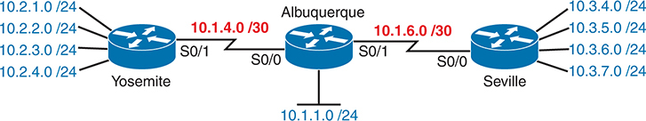
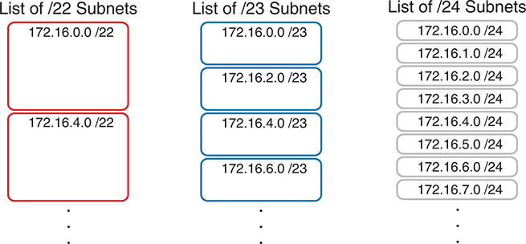
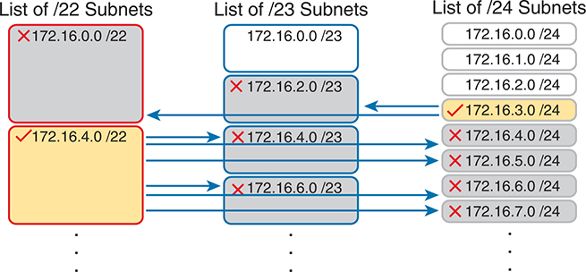
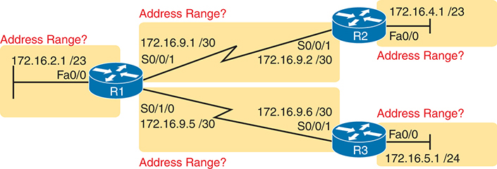
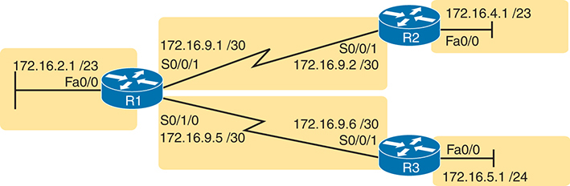

# Appendix M


## Variable-Length Subnet Masks

Note

This appendix contains content that was published as a chapter in one of the past editions of this book or a related book. The author includes this appendix with the current edition as extra reading for anyone interested in learning more. However, note that the content in this appendix has not been edited since it was published in the earlier edition, so references to exams and exam topics, and to other chapters, will be outdated. This appendix was previously published as [Chapter 22](vol1_ch22.md#ch22) of the book *CCENT/CCNA ICND1 100-105 Official Cert Guide*, published in 2016.

IPv4 addressing and subnetting use a lot of terms, a lot of small math steps, and a lot of concepts that fit together. While learning those concepts, it helps to keep things as simple as possible. One way this book has kept the discussion simpler so far was to show examples that use one mask only inside a single Class A, B, or C network.

This chapter removes that restriction by introducing variable-length subnet masks (VLSM). VLSM simply means that the subnet design uses more than one mask in the same classful network. VLSM has some advantages and disadvantages, but when learning, the main challenge is that a subnetting design that uses VLSM requires more math, and it requires that you think about some other issues as well. This chapter walks you through the concepts, the issues, and the math.

### Foundation Topics

### VLSM Concepts and Configuration

VLSM occurs when an internetwork uses more than one mask for different subnets of a single Class A, B, or C network. [Figure M-1](vol1_appm.md#appmfig01) shows an example of VLSM used in Class A network 10.0.0.0.




**Figure M-1** *VLSM in Network 10.0.0.0: Masks /24 and /30*

Fred, with the destination MAC address 0200.3333.3333, enters port F0/1 and is forwarded out through port G0/1 of Switch 1. Similarly, Barney, with MAC address 0200.2222.2222, enters port F0/2 and is forwarded out through port G0/2 of Switch 1. Wilma and Betty, with MAC addresses 0200.3333.3333 and 0200.4444.4444 respectively, are forwarded out ports F0/3 and F0/4 of Switch 2. Address tables for both switches display MAC addresses and their corresponding output ports, illustrating the forwarding decisions made by each switch to ensure efficient data transmission within the network.

[Figure M-1](vol1_appm.md#appmfig01) shows a typical choice of using a /30 prefix (mask 255.255.255.252) on point-to-point serial links, with mask /24 (255.255.255.0) on the LAN subnets. All subnets are of Class A network 10.0.0.0, with two masks being used, therefore meeting the definition of VLSM.

Oddly enough, a common mistake occurs when people think that VLSM means "using more than one mask in some internetwork" rather than "using more than one mask *in a single classful network*." For example, if in one internetwork diagram, all subnets of network 10.0.0.0 use a 255.255.240.0 mask, and all subnets of network 11.0.0.0 use a 255.255.255.0 mask, the design uses two different masks. However, Class A network 10.0.0.0 uses only one mask, and Class A network 11.0.0.0 uses only one mask. In that case, the design does not use VLSM.

VLSM provides many benefits for real networks, mainly related to how you allocate and use your IP address space. Because a mask defines the size of the subnet (the number of host addresses in the subnet), VLSM allows engineers to better match the need for addresses with the size of the subnet. For example, for subnets that need fewer addresses, the engineer uses a mask with fewer host bits, so the subnet has fewer host IP addresses. This flexibility reduces the number of wasted IP addresses in each subnet. By wasting fewer addresses, more space remains to allocate more subnets.

VLSM can be helpful for both public and private IP addresses, but the benefits are more dramatic with public networks. With public networks, the address savings help engineers avoid having to obtain another registered IP network number from regional IP address assignment authorities. With private networks, as defined in RFC 1918, running out of addresses is not as big a negative, because you can always grab another private network from RFC 1918 if you run out.

#### Classless and Classful Routing Protocols

Before you can deploy a VLSM design, you must first use a routing protocol that supports VLSM. To support VLSM, the routing protocol must advertise the mask along with each subnet. Without mask information, the router receiving the update would be confused.

For example, if a router learned a route for 10.1.8.0, but with no mask information, what does that mean? Is that subnet 10.1.8.0/24? 10.1.8.0/23? 10.1.8.0/30? The dotted-decimal number 10.1.8.0 happens to be a valid subnet number with a variety of masks, and because multiple masks can be used with VLSM, the router has no good way to make an educated guess. To effectively support VLSM, the routing protocol needs to advertise the correct mask along with each subnet so that the receiving router knows the exact subnet that is being advertised.

By definition, *classless routing protocols* advertise the mask with each advertised route, and *classful routing protocols* do not. The classless routing protocols, as noted in [Table M-1](vol1_appm.md#appmtab01), are the newer, more advanced routing protocols. Not only do these more advanced classless routing protocols support VLSM, but they also support manual route summarization, which allows a routing protocol to advertise one route for a larger subnet instead of multiple routes for smaller subnets.

**Table M-1** Classless and Classful Interior IP Routing Protocols

| Routing Protocol | Is It Classless? | Sends Mask in Updates? | Supports VLSM? | Supports Manual Route Summarization? |
| --- | --- | --- | --- | --- |
| RIPv1 | No | No | No | No |
| RIPv2 | Yes | Yes | Yes | Yes |
| EIGRP | Yes | Yes | Yes | Yes |
| OSPF | Yes | Yes | Yes | Yes |

Beyond VLSM itself, the routing protocols do not have to be configured to support VLSM or to be classless. There is no command to enable or disable the fact that classless routing protocols include the mask with each route. The only configuration choice you must make is to use a classless routing protocol.

#### VLSM Configuration and Verification

Cisco routers do not configure VLSM, enable or disable it, or need any configuration to use it. From a configuration perspective, VLSM is simply a side effect of using the **ip address** interface subcommand. Routers collectively configure VLSM by virtue of having IP addresses in the same classful network but with different masks.

For example, [Example M-1](vol1_appm.md#exam_1) shows two of the interfaces from router Yosemite from [Figure M-1](vol1_appm.md#appmfig01). The example shows the IP address assignments on two interfaces, one with a /24 mask and one with a /30 mask, both with IP addresses in Class A network 10.0.0.0.

**Example M-1** *Configuring Two Interfaces on Yosemite, Resulting in VLSM*

[Click here to view code image](vol1_appm_images.md#appm-1)

```
Yosemite# configure terminal
Yosemite(config)# interface Fa0/0
Yosemite(config-if)# ip address 10.2.1.1 255.255.255.0
Yosemite(config-if)# interface S0/1
Yosemite(config-if)# ip address 10.1.4.1 255.255.255.252
```

The use of VLSM can also be detected by a detailed look at the output of the **show ip route** command. This command lists routes in groups, by classful network, so that you see all the subnets of a single Class A, B, or C network all in a row. Just look down the list, and look to see, if any, how many different masks are listed. For example, [Example M-2](vol1_appm.md#exam_2) lists the routing table on Albuquerque from [Figure M-1](vol1_appm.md#appmfig01); Albuquerque uses masks /24 and /30 inside network 10.0.0.0, as noted in the highlighted line in the example.

**Example M-2** *Albuquerque Routing Table with VLSM*

[Click here to view code image](vol1_appm_images.md#appm-2)

```
Albuquerque# show ip route
! Legend omitted for brevity

     10.0.0.0/8 is variably subnetted, 14 subnets, 3 masks
D       10.2.1.0/24 [90/2172416] via 10.1.4.1, 00:00:34, Serial0/0
D       10.2.2.0/24 [90/2172416] via 10.1.4.1, 00:00:34, Serial0/0
D       10.2.3.0/24 [90/2172416] via 10.1.4.1, 00:00:34, Serial0/0
D       10.2.4.0/24 [90/2172416] via 10.1.4.1, 00:00:34, Serial0/0
D       10.3.4.0/24 [90/2172416] via 10.1.6.2, 00:00:56, Serial0/1
D       10.3.5.0/24 [90/2172416] via 10.1.6.2, 00:00:56, Serial0/1
D       10.3.6.0/24 [90/2172416] via 10.1.6.2, 00:00:56, Serial0/1
D       10.3.7.0/24 [90/2172416] via 10.1.6.2, 00:00:56, Serial0/1
C       10.1.1.0/24 is directly connected, FastEthernet0/0
L       10.1.1.1/32 is directly connected, FastEthernet0/0
C       10.1.6.0/30 is directly connected, Serial0/1
L       10.1.6.1/32 is directly connected, Serial0/1
C       10.1.4.0/30 is directly connected, Serial0/0
L       10.1.4.1/32 is directly connected, Serial0/0
```

Note

For the purposes of understanding whether a design uses VLSM, ignore the /32 "local" routes that a router automatically creates for its own interface IP addresses.

So ends the discussion of VLSM as an end to itself. This chapter is devoted to VLSM, but it took a mere three to four pages to fully describe it. Why the entire VLSM chapter? Well, to work with VLSM, to find problems with it, to add subnets to an existing design, and to design using VLSM from scratch--in other words, to apply VLSM to real networks--takes skill and practice. To do these same tasks on the exam requires skill and practice. The rest of this chapter examines the skills to apply VLSM and provides some practice for these two key areas:

* Finding VLSM overlaps
* Adding new VLSM subnets without overlaps

### Finding VLSM Overlaps

Regardless of whether a design uses VLSM, the subnets used in any IP internetwork design should not overlap their address ranges. When subnets in different locations overlap their addresses, a router's routing table entries overlap. As a result, hosts in different locations can be assigned the same IP address. Routers clearly cannot route packets correctly in these cases. In short, a design that uses overlapping subnets is considered to be an incorrect design and should not be used.

This section begins with a short discussion about VLSM design, to drive home the ideas behind VLSM overlaps. It then gets into an operational and troubleshooting approach to the topic, by looking at existing designs and trying to find any existing overlaps.

#### Designing Subnetting Plans with VLSM

When creating a subnetting plan using VLSM, you have to be much more careful in choosing what subnets to use. First, whatever masks you use in a VLSM design, each subnet ID must be a valid subnet ID given the mask that you use for that subnet.

For example, consider a subnet plan for Class B network 172.16.0.0. To create a subnet with a /24 mask, the subnet ID must be a subnet ID that you could choose if you subnetted the whole Class B network with that same mask. [Appendix L](vol1_appl.md#appl), "[Subnet Design](vol1_appl.md#appl)," discusses how to find those subnets in depth, but with a Class B network and a /24 mask, the possible subnet IDs should be easy to calculate by now: 172.16.0.0 (the zero subnet), then 172.16.1.0, 172.16.2.0, 172.16.3.0, 172.16.4.0, and so on, up through 172.16.255.0.

Note

Subnet IDs must always follow this important binary rule as noted back in [Chapter 14](vol1_ch14.md#ch14), "[Analyzing Existing Subnets](vol1_ch14.md#ch14)": In binary, each subnet ID has a host field of all binary 0s. If you use the math and processes to find all subnet IDs per [Appendix L](vol1_appl.md#appl), all those subnet IDs happen to have binary 0s in the host fields.

Now expand your thinking about subnet IDs to a VLSM design. To begin, you would decide that you need some subnets with one mask, other subnets with another mask, and so on, to meet the requirements for different sizes of different subnets. For instance, imagine you start with a brand-new VLSM design, with Class B network 172.16.0.0. You plan to have some subnets with /22 masks, some with /23, and some with /24. You might develop then a planning diagram, or at least draw the ideas, with something like [Figure M-2](vol1_appm.md#appmfig02).




**Figure M-2** *Possible Subnet IDs of Network 172.16.0.0, with /22, /23, and /24 Masks*

Fred, with the destination MAC address 0200.3333.3333, enters port F0/1 and is forwarded out through port F0/3 of Switch 2. Similarly, Barney, with MAC address 0200.2222.2222, enters port F0/2 and is forwarded out through port F0/4 of Switch 2. Wilma and Betty, with MAC addresses 0200.3333.3333 and 0200.4444.4444 respectively, are forwarded out ports F0/3 and F0/4 of Switch 2. Address tables for both switches display MAC addresses and their corresponding output ports, illustrating the forwarding decisions made by each switch to ensure efficient data transmission within the network.

The drawing shows the first few subnet IDs available with each mask, but you cannot use all subnets from all three lists in a design. As soon as you choose to use one subnet from any column, you remove some subnets from the other lists because subnets cannot overlap. Overlapping subnets are subnets whose range of addresses include some of the same addresses.

As an example, [Figure M-3](vol1_appm.md#appmfig03) shows the same list of the first few possible /22, /23, and /24 subnets of Class B network 172.16.0.0. However, it shows a check mark beside two subnets that have been allocated for use; that is, on paper, the person making the subnetting plan has decided to use these two subnets somewhere in the network. The subnets with a dark gray shading and an *X* in them can no longer be used because they have some overlapping addresses with the subnets that have check marks (172.16.3.0/24 and 172.16.4.0/22).




**Figure M-3** *Selecting Two Subnets Disallows Other Subnets in Different Columns*

The depiction includes two initial entries on the switch: Fred with MAC address 0200.1111.1111 connected to port F0/1 and Barney with MAC address 0200.2222.2222 connected to port F0/2. Subsequently, Wilma with MAC address 0200.3333.3333 is added to port F0/3, and Betty with MAC address 0200.4444.4444 is added to port F0/4. The address table, initially empty, populates as frames are sent. Before any frame is sent, the address table remains empty. After Frame 1 (Fred to Barney), the address table records Fred's MAC address and outputs it to port F0/1. After Frame 2 (Barney to Fred), both Fred's and Barney's MAC addresses are in the address table, and the outputs are directed to their respective ports, F0/1 and F0/2.

Just to complete the example, first look at subnet 172.16.4.0 on the lower left. That subnet includes addresses from the subnet ID of 172.16.4.0 through the subnet broadcast address of 172.16.7.255. As you can see just by looking at the subnet IDs to the right, all the subnets referenced with the arrowed lines are within that same range of addresses.

Now look to the upper right of the figure, to subnet 172.16.3.0/24. The subnet has a range of 172.16.3.0-172.16.3.255 including the subnet ID and subnet broadcast address. That subnet overlaps with the two subnets referenced to the left. For instance, subnet 172.16.0.0/22 includes the range from 172.16.0.0-172.16.3.255. But because there is some overlap, once the design has allocated the 172.16.3.0/24 subnet, the 172.16.2.0/23 and 172.16.0.0/22 subnets could not be used without causing problems, because:

A subnetting design, whether using VLSM or not, should not allow subnets whose address ranges overlap. If overlapping subnets are implemented, routing problems occur and some hosts simply cannot communicate outside their subnets.

These address overlaps are easier to see when not using VLSM. When not using VLSM, overlapped subnets have identical subnet IDs, so to find overlaps, you just have to look at the subnet IDs. With VLSM, overlapped subnets may not have the same subnet ID, as was the case in this most recent example with the subnets across the top of [Figure M-3](vol1_appm.md#appmfig03). To find these overlaps, you have to look at the entire range of addresses in each subnet, from subnet ID to subnet broadcast address, and compare the range to the other subnets in the design.

#### An Example of Finding a VLSM Overlap

For example, imagine that a practice question for the CCENT exam shows [Figure M-4](vol1_appm.md#appmfig04). It uses a single Class B network (172.16.0.0), with VLSM, because it uses three different masks: /23, /24, and /30.





**Figure M-4** *VLSM Design with Possible Overlap*

The illustration depicts initial entries on the switch: Fred with MAC address 0200.1111.1111 connected to port F0/1 and Barney with MAC address 0200.2222.2222 connected to port F0/2. Subsequently, Wilma with MAC address 0200.3333.3333 is added to port F0/3, and Betty with MAC address 0200.4444.4444 is added to port F0/4. The address table, initially empty, remains devoid of entries.

Now imagine that the exam question shows you the figure, and either directly or indirectly asks whether overlapping subnets exist. This type of question might simply tell you that some hosts cannot ping each other, or it might not even mention that the root cause could be that some of the subnets overlap. To answer such a question, you could follow this simple but possibly laborious process:

Step 1. Calculate the subnet ID and subnet broadcast address of each subnet, which gives you the range of addresses in that subnet.

Step 2. List the subnet IDs in numerical order (along with their subnet broadcast addresses).

Step 3. Scan the list from top to bottom, comparing each pair of adjacent entries, to see whether their range of addresses overlaps.

For example, [Table M-2](vol1_appm.md#appmtab02) completes the first two steps based on [Figure M-4](vol1_appm.md#appmfig04), listing the subnet IDs and subnet broadcast addresses, in numerical order based on the subnet IDs.

**Table M-2** Subnet IDs and Broadcast Addresses, in Numerical Order, from [Figure M-4](vol1_appm.md#appmfig04)

| Subnet | Subnet Number | Broadcast Address |
| --- | --- | --- |
| R1 LAN | 172.16.2.0 | 172.16.3.255 |
| R2 LAN | 172.16.4.0 | 172.16.5.255 |
| R3 LAN | 172.16.5.0 | 172.16.5.255 |
| R1-R2 serial | 172.16.9.0 | 172.16.9.3 |
| R1-R3 serial | 172.16.9.4 | 172.16.9.7 |

The VLSM design is invalid in this case because of the overlap between R2's LAN subnet and R3's LAN subnet. As for the process, Step 3 states the somewhat obvious step of comparing the address ranges to see whether any overlaps occur. Note that, in this case, none of the subnet numbers are identical, but two entries (highlighted) do overlap. The design is invalid because of the overlap, and one of these two subnets would need to be changed.

As far as the three-step process works, note that if two adjacent entries in the list overlap, compare three entries at the next step. The two subnets already marked as overlapped can overlap with the next subnet in the list. For example, the three subnets in the following list overlap in that the first subnet overlaps with the second and third subnets in the list. If you followed the process shown here, you would have first noticed the overlap between the first two subnets in the list, so you would then also need to check the next subnet in the list to find out if it overlapped.

10.1.0.0/16 (subnet ID 10.1.0.0, broadcast 10.1.255.255)

10.1.200.0/24 (subnet ID 10.1.200.0, broadcast 10.1.200.255)

10.1.250.0/24 (subnet ID 10.1.250.0, broadcast 10.1.250.255)

#### Practice Finding VLSM Overlaps

As typical of anything to do with applying IP addressing and subnetting, practice helps. To that end, [Table M-3](vol1_appm.md#appmtab03) lists three practice problems. Just start with the five IP addresses listed in a single column, and then follow the three-step process outlined in the previous section to find any VLSM overlaps. The answers can be found near the end of this chapter, in the section "[Answers to Earlier Practice Problems](vol1_appm.md#appmlev1sec5)."

**Table M-3** VLSM Overlap Practice Problems

| Problem 1 | Problem 2 | Problem 3 |
| --- | --- | --- |
| 10.1.34.9/22 | 172.16.126.151/22 | 192.168.1.253/30 |
| 10.1.29.101/23 | 172.16.122.57/27 | 192.168.1.113/28 |
| 10.1.23.254/22 | 172.16.122.33/30 | 192.168.1.245/29 |
| 10.1.17.1/21 | 172.16.122.1/30 | 192.168.1.125/30 |
| 10.1.1.1/20 | 172.16.128.151/20 | 192.168.1.122/30 |

### Adding a New Subnet to an Existing VLSM Design

The task described in this section happens frequently in real networks: choosing new subnets to add to an existing design. In real life, you can use IP Address Management (IPAM) tools that help you choose a new subnet so that you do not cause an overlap. However, for the CCNA exam, you need to be ready to do the mental process and math of choosing a subnet that does not create an overlapped VLSM subnet condition. In other words, you need to pick a new subnet and not make a mistake!

For example, consider the internetwork shown earlier in [Figure M-2](vol1_appm.md#appmfig02), with classful network 172.16.0.0. An exam question might suggest that a new subnet, with a /23 prefix length, needs to be added to the design. The question might also say, "Pick the numerically lowest subnet number that can be used for the new subnet." In other words, if both 172.16.4.0 and 172.16.6.0 would work, use 172.16.4.0.

So, you really have a couple of tasks: To find all the subnet IDs that could be used, rule out the ones that would cause an overlap, and then check to see whether the question guides you to pick either the numerically lowest (or highest) subnet ID. This list outlines the specific steps:

Step 1. Pick the subnet mask (prefix length) for the new subnet, based on the design requirements (if not already listed as part of the question).

Step 2. Calculate all possible subnet numbers of the classful network using the mask from Step 1, along with the subnet broadcast addresses.

Step 3. Make a list of existing subnet IDs and matching subnet broadcast addresses.

Step 4. Compare the existing subnets to the candidate new subnets to rule out overlapping new subnets.

Step 5. Choose the new subnet ID from the remaining subnets identified at Step 4, paying attention to whether the question asks for the numerically lowest or numerically highest subnet ID.

#### An Example of Adding a New VLSM Subnet

For example, [Figure M-5](vol1_appm.md#appmfig05) shows an existing internetwork that uses VLSM. (The figure uses the same IP addresses as shown in [Figure M-4](vol1_appm.md#appmfig04), but with R3's LAN IP address changed to fix the VLSM overlap shown in [Figure M-4](vol1_appm.md#appmfig04).) In this case, you need to add a new subnet to support 300 hosts. Imagine that the question tells you to use the smallest subnet (least number of hosts) to meet that requirement. You use some math and logic you learned earlier in your study to choose mask /23, which gives you 9 host bits, for 29 - 2 = 510 hosts in the subnet.




**Figure M-5** *Internetwork to Which You Need to Add a /23 Subnet, Network 172.16.0.0*

The network consists of three routers labelled R 1, R 2, and R 3. Each router has two Gigabit Ethernet interfaces used for connecting multiple devices. A Serial interface labelled S 0/0/0 and S 0/0/1 on Router 1 and Router 2, used for point-to-point connections. The network is further divided into four subnets labelled Subnet 1, Subnet 2, Subnet 3, Subnet 12 and Subnet 13. Each subnet is connected to a router through an interface. The subnet mask for each subnet is also provided /64. A subnet mask is used to differentiate between the network part of an IP address and the host part.

At this point, just follow the steps listed before [Figure M-5](vol1_appm.md#appmfig05). For Step 1, you have already been given the mask (/23). For Step 2, you need to list all the subnet numbers and broadcast addresses of 172.16.0.0, assuming the /23 mask. You will not use all these subnets, but you need the list for comparison to the existing subnets. [Table M-4](vol1_appm.md#appmtab04) shows the results, at least for the first five possible /23 subnets.

**Table M-4** First Five Possible /23 Subnets

| Subnet | Subnet Number | Subnet Broadcast Address |
| --- | --- | --- |
| First (zero) | 172.16.0.0 | 172.16.1.255 |
| Second | 172.16.2.0 | 172.16.3.255 |
| Third | 172.16.4.0 | 172.16.5.255 |
| Fourth | 172.16.6.0 | 172.16.7.255 |
| Fifth | 172.16.8.0 | 172.16.9.255 |

Next, at Step 3, list the existing subnet numbers and broadcast addresses, as shown earlier in [Figure M-5](vol1_appm.md#appmfig05). To do so, do the usual math to take an IP address/mask to then find the subnet ID and subnet broadcast address. [Table M-5](vol1_appm.md#appmtab05) summarizes that information, including the locations, subnet numbers, and subnet broadcast addresses.


**Table M-5** Existing Subnet IDs and Broadcast Addresses from [Figure M-5](vol1_appm.md#appmfig05)

| Subnet | Subnet Number | Subnet Broadcast Address |
| --- | --- | --- |
| R1 LAN | 172.16.2.0 | 172.16.3.255 |
| R2 LAN | 172.16.4.0 | 172.16.5.255 |
| R3 LAN | 172.16.6.0 | 172.16.6.255 |
| R1-R2 serial | 172.16.9.0 | 172.16.9.3 |
| R1-R3 serial | 172.16.9.4 | 172.16.9.7 |

At this point, you have all the information you need to look for the overlap at Step 4. Simply compare the range of numbers for the subnets in the previous two tables. Which of the possible new /23 subnets ([Table M-4](vol1_appm.md#appmtab04)) overlap with the existing subnets ([Table M-5](vol1_appm.md#appmtab05))? In this case, the second through fifth subnets in [Table M-4](vol1_appm.md#appmtab04) overlap, so rule those out as candidates to be used. ([Table M-4](vol1_appm.md#appmtab04) denotes those subnets with gray highlights.)

Step 5 has more to do with the exam than with real network design, but it is still worth listing as a separate step. Multiple-choice questions sometimes need to force you into a single answer, and asking for the numerically lowest or highest subnet does that. This particular example asks for the numerically lowest subnet number, which in this case is 172.16.0.0/23.

Note

The answer, 172.16.0.0/23, happens to be a zero subnet. For the exam, the zero subnet should be avoided if (a) the question implies the use of classful routing protocols or (b) the routers are configured with the **no ip subnet-zero** global configuration command. Otherwise, assume that the zero subnet can be used.

### Answers to Earlier Practice Problems

### Answers to Practice Finding VLSM Overlaps

This section lists the answers to the three practice problems in the section "[Practice Finding VLSM Overlaps](vol1_appm.md#appmlev2sec5)," as listed earlier in [Table M-3](vol1_appm.md#appmtab03). Note that the tables that list details of the answer reordered the subnets as part of the process.

In Problem 1, the second and third subnet IDs listed in [Table M-6](vol1_appm.md#appmtab06) happen to overlap. The second subnet's range completely includes the range of addresses in the third subnet.

**Table M-6** VLSM Overlap Problem 1 Answers (Overlaps Highlighted)

| Reference | Original Address and Mask | Subnet ID | Broadcast Address |
| --- | --- | --- | --- |
| 1 | 10.1.1.1/20 | 10.1.0.0 | 10.1.15.255 |
| 2 | 10.1.17.1/21 | 10.1.16.0 | 10.1.23.255 |
| 3 | 10.1.23.254/22 | 10.1.20.0 | 10.1.23.255 |
| 4 | 10.1.29.101/23 | 10.1.28.0 | 10.1.29.255 |
| 5 | 10.1.34.9/22 | 10.1.32.0 | 10.1.35.255 |

In Problem 2, again the second and third subnet IDs (listed in [Table M-7](vol1_appm.md#appmtab07)) happen to overlap, and again, the second subnet's range completely includes the range of addresses in the third subnet. Also, the second and third subnet IDs are the same value, so the overlap is more obvious.

**Table M-7** VLSM Overlap Problem 2 Answers (Overlaps Highlighted)

| Reference | Original Address and Mask | Subnet ID | Broadcast Address |
| --- | --- | --- | --- |
| 1 | 172.16.122.1/30 | 172.16.122.0 | 172.16.122.3 |
| 2 | 172.16.122.57/27 | 172.16.122.32 | 172.16.122.63 |
| 3 | 172.16.122.33/30 | 172.16.122.32 | 172.16.122.35 |
| 4 | 172.16.126.151/22 | 172.16.124.0 | 172.16.127.255 |
| 5 | 172.16.128.151/20 | 172.16.128.0 | 172.16.143.255 |

In Problem 3, three subnets overlap. Subnet 1's range completely includes the range of addresses in the second and third subnets, as shown in [Table M-8](vol1_appm.md#appmtab08). Note that the second and third subnets do not overlap with each other, so for the process in this book to find all the overlaps, after you find that the first two subnets overlap, you should compare the next entry in the table (3) with both of the two known-to-overlap entries (1 and 2).

**Table M-8** VLSM Overlap Problem 3 Answers (Overlaps Highlighted)

| Reference | Original Address and Mask | Subnet ID | Broadcast Address |
| --- | --- | --- | --- |
| 1 | 192.168.1.113/28 | 192.168.1.112 | 192.168.1.127 |
| 2 | 192.168.1.122/30 | 192.168.1.120 | 192.168.1.123 |
| 3 | 192.168.1.125/30 | 192.168.1.124 | 192.168.1.127 |
| 4 | 192.168.1.245/29 | 192.168.1.240 | 192.168.1.247 |
| 5 | 192.168.1.253/30 | 192.168.1.252 | 192.168.1.255 |