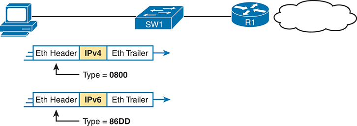

# Chapter 2

## Fundamentals of Ethernet LANs

This chapter covers the following exam topics:

1.0 Network Fundamentals

1.1 Explain the role and function of network components

1.1.b Layer 2 and Layer 3 switches

1.2 Describe characteristics of network topology architectures

1.2.e Small office/home office (SOHO)

1.3 Compare physical interface and cabling types

1.3.a Single-mode fiber, multimode fiber, copper

1.3.b Connections (Ethernet shared media and point-to-point)

Most enterprise computer networks can be separated into two general types of technology: local-area networks (LANs) and wide-area networks (WANs). LANs typically connect nearby devices: devices in the same room, in the same building, or in a campus of buildings. In contrast, WANs connect devices that are typically relatively far apart. Together, LANs and WANs create a complete enterprise computer network, working together to do the job of a computer network: delivering data from one device to another.

Many types of LANs have existed over the years, but today's networks use two general types of LANs: Ethernet LANs and wireless LANs. Ethernet LANs happen to use cables for the links between nodes, and because many types of cables use copper wires, Ethernet LANs are often called [wired LANs](vol1_gloss.md#gloss_445). Ethernet LANs also make use of fiber-optic cabling, which includes a fiberglass core that devices use to send data using light. In comparison to Ethernet, [wireless LANs](vol1_gloss.md#gloss_446) do not use wires or cables, instead using radio waves for the links between nodes; [Part I](vol1_part01.md#part01) of the *CCNA 200-301 Official Cert Guide, Volume 2*, Second Edition, discusses wireless LANs at length.

This chapter introduces Ethernet LANs, with more detailed coverage in [Parts II](vol1_part02.md#part02) and [III](vol1_part03.md#part03) of this book.

### "Do I Know This Already?" Quiz

Take the quiz (either here or use the PTP software) if you want to use the score to help you decide how much time to spend on this chapter. The letter answers are listed at the bottom of the page following the quiz. [Appendix C](vol1_appc.md#appc), found both at the end of the book as well as on the companion website, includes both the answers and explanations. You can also find both answers and explanations in the PTP testing software.

**Table 2-1** "Do I Know This Already?" Foundation Topics Section-to-Question Mapping

| Foundation Topics Section | Questions |
| --- | --- |
| An Overview of LANs | 1-2 |
| Building Physical Ethernet LANs with UTP | 3-4 |
| Building Physical Ethernet LANs with Fiber | 5 |
| Sending Data in Ethernet Networks | 6-9 |

**[1](vol1_ch02.md#ques2_1a).** Some end-user devices connect to a LAN using a cable while others use wireless. Which answer best characterizes which devices use Ethernet to connect to the LAN?

1. Only the end-user devices that use cables are using Ethernet.
2. Only the end-user devices that use wireless are using Ethernet.
3. Both the end-user devices using cables and those using wireless are using Ethernet.
4. Neither the end-user devices using cables nor those using wireless are using Ethernet.

**[2](vol1_ch02.md#ques2_2a).** Which of the following Ethernet standards defines Gigabit Ethernet over UTP cabling?

1. 10GBASE-T
2. 100BASE-T
3. 1000BASE-T
4. None of the other answers are correct.

**[3](vol1_ch02.md#ques2_3a).** Which of the following is true about Ethernet crossover cables for Fast Ethernet?

1. Pins 1 and 2 are reversed on the other end of the cable.
2. Pins 1 and 2 on one end of the cable connect to pins 3 and 6 on the other end of the cable.
3. Pins 1 and 2 on one end of the cable connect to pins 3 and 4 on the other end of the cable.
4. The cable can be up to 1000 meters long to cross over between buildings.
5. None of the other answers are correct.

**[4](vol1_ch02.md#ques2_4a).** Each answer lists two types of devices used in a 100BASE-T network. If these devices were connected with UTP Ethernet cables, which pairs of devices would require a straight-through cable? (Choose three answers.)

1. PC and router
2. PC and switch
3. Hub and switch
4. Router and hub
5. Wireless access point (Ethernet port) and switch

**[5](vol1_ch02.md#ques2_5a).** Which of the following are advantages of using multimode fiber for an Ethernet link instead of UTP or single-mode fiber? (Choose two answers.)

1. To achieve the longest distance possible for that single link.
2. To extend the link beyond 100 meters while keeping initial costs as low as possible.
3. To make use of an existing stock of laser-based SFP/SFP+ modules.
4. To make use of an existing stock of LED-based SFP/SFP+ modules.

**[6](vol1_ch02.md#ques2_6a).** Which of the following is true about the CSMA/CD algorithm?

1. The algorithm never allows collisions to occur.
2. Collisions can happen, but the algorithm defines how the computers should notice a collision and how to recover.
3. The algorithm works with only two devices on the same Ethernet.
4. None of the other answers are correct.

**[7](vol1_ch02.md#ques2_7a).** Which of the following is true about the Ethernet FCS field?

1. Ethernet uses FCS for error recovery.
2. It is 2 bytes long.
3. It resides in the Ethernet trailer, not the Ethernet header.
4. It is used for encryption.

**[8](vol1_ch02.md#ques2_8a).** Which of the following are true about the format of Ethernet addresses? (Choose three answers.)

1. Each manufacturer puts a unique OUI code into the first 2 bytes of the address.
2. Each manufacturer puts a unique OUI code into the first 3 bytes of the address.
3. Each manufacturer puts a unique OUI code into the first half of the address.
4. The part of the address that holds the manufacturer's code is called the MAC.
5. The part of the address that holds the manufacturer's code is called the OUI.
6. The part of the address that holds the manufacturer's code has no specific name.

**[9](vol1_ch02.md#ques2_9a).** Which of the following terms describe Ethernet addresses that can be used to send one frame that is delivered to multiple devices on the LAN? (Choose two answers.)

1. Burned-in address
2. Unicast address
3. Broadcast address
4. Multicast address

Answers to the "Do I Know This Already?" quiz:

**[1](vol1_appc.md#ques2_1)** A

**[2](vol1_appc.md#ques2_2)** C

**[3](vol1_appc.md#ques2_3)** B

**[4](vol1_appc.md#ques2_4)** B, D, and E

**[5](vol1_appc.md#ques2_5)** B and D

**[6](vol1_appc.md#ques2_6)** B

**[7](vol1_appc.md#ques2_7)** C

**[8](vol1_appc.md#ques2_8)** B, C, and E

**[9](vol1_appc.md#ques2_9)** C and D

### Foundation Topics

### An Overview of LANs

The term [Ethernet](vol1_gloss.md#gloss_131) refers to a family of LAN standards that together define the physical and data-link layers of the world's most popular wired LAN technology. The standards, defined by the Institute of Electrical and Electronics Engineers ([IEEE](vol1_gloss.md#gloss_182)), define the cabling, the connectors on the ends of the cables, the protocol rules, and everything else required to create an Ethernet LAN.

#### Typical SOHO LANs

To begin, first think about a small office/home office (SOHO) LAN today, specifically a LAN that uses only Ethernet LAN technology. First, the LAN needs a device called an Ethernet *LAN switch*, which provides many physical ports into which cables can be connected. An Ethernet uses *Ethernet cables*, which is a general reference to any cable that conforms to any of several Ethernet standards. The LAN uses Ethernet cables to connect different Ethernet devices or nodes to one of the switch's Ethernet ports.

[Figure 2-1](vol1_ch02.md#ch02fig01) shows a drawing of a SOHO Ethernet LAN. The figure shows a single LAN switch, five cables, and five other Ethernet nodes: three PCs, a printer, and one network device called a *router*. (The router connects the LAN to the WAN, in this case to the Internet.)

**Figure 2-1** *Typical Small Ethernet-Only SOHO LAN*

The schematic shows a network layout with a router and a switch. The router is connected to the Internet. Below the router, a switch is connected to the router. Four devices are connected to the switch via lines labeled F 0/1, F 0/2, F 0/3, and F 0/4, indicating the ports on the switch to which they are connected.

Although [Figure 2-1](vol1_ch02.md#ch02fig01) shows the switch and router as separate devices, many SOHO Ethernet LANs today combine the router and switch into a single device. Vendors sell consumer-grade integrated networking devices that work as a router and Ethernet switch, as well as doing other functions. These devices typically have "router" on the packaging, but many models also have four-port or eight-port Ethernet LAN switch ports built into the device.

Typical SOHO LANs today also support wireless LAN connections. You can build a single SOHO LAN that includes both Ethernet LAN technology as well as wireless LAN technology, which is also defined by the IEEE. Wireless LANs, defined by the IEEE using standards that begin with 802.11, use radio waves to send the bits from one node to the next.

Most wireless LANs rely on yet another networking device: a wireless LAN access point (AP). The AP acts somewhat like an Ethernet switch, in that all the wireless LAN nodes communicate with the wireless AP. If the network uses an AP that is a separate physical device, the AP then needs a single Ethernet link to connect the AP to the Ethernet LAN, as shown in [Figure 2-2](vol1_ch02.md#ch02fig02).

Note that [Figure 2-2](vol1_ch02.md#ch02fig02) shows the router, Ethernet switch, and wireless LAN access point as three separate devices so that you can better understand the different roles. However, most SOHO networks today would use a single device, often labeled as a "wireless router," that does all these functions.

**Figure 2-2** *Typical Small Wired and Wireless SOHO LAN*

The schematic shows a router connected to the internet. The router is connected to a switch in the bottom. The switch is further connected with two devices on the left via lines labeled as F 0/1, and F 0/2 and also connects to an access point on the right. There are two tablets, shown with wireless signals on the right, indicating wirelessly connected to the access point.

#### Typical Enterprise LANs

Enterprise networks have similar needs compared to a SOHO network, but on a much larger scale. For example, enterprise Ethernet LANs begin with LAN switches installed in a wiring closet behind a locked door on each floor of a building. The electricians install the Ethernet cabling from that wiring closet to cubicles and conference rooms where devices might need to connect to the LAN. At the same time, most enterprises also support wireless LANs in the same space, to allow people to roam around and still work and to support a growing number of devices that do not have an Ethernet LAN interface.

[Figure 2-3](vol1_ch02.md#ch02fig03) shows a conceptual view of a typical enterprise LAN in a three-story building. Each floor has an Ethernet LAN switch and a wireless LAN AP. To allow communication between floors, each per-floor switch connects to one centralized distribution switch. For example, PC3 can send data to PC2, but it would first flow through switch SW3 to the first floor to the distribution switch (SWD) and then back up through switch SW2 on the second floor.

**Figure 2-3** *Single-Building Enterprise Wired and Wireless LAN*

The schematic with different network components switches S W 1, S W 2, S W 3 and a wireless device S W D, connected to P C 1, P C 2, and P C 3 on each floor respectively. Lines indicate the connections between these components and their integration into the broader enterprise network. An arrow points from the first floor indicating connection "To Rest of Enterprise Network". All switches are interconnected with lines indicating wired connections.

The figure also shows the typical way to connect a LAN to a WAN using a router. LAN switches and wireless access points work to create the LAN itself. Routers connect to both the LAN and the WAN. To connect to the LAN, the router simply uses an Ethernet LAN interface and an Ethernet cable, as shown on the lower right of [Figure 2-3](vol1_ch02.md#ch02fig03).

The rest of this chapter focuses on Ethernet in particular.

#### The Variety of Ethernet Physical Layer Standards

The term *Ethernet* refers to an entire family of standards. Some standards define the specifics of how to send data over a particular type of cabling, and at a particular speed. Other standards define protocols, or rules, that the Ethernet nodes must follow to be a part of an Ethernet LAN. All these Ethernet standards come from the IEEE and include the number 802.3 as the beginning part of the standard name.

Ethernet supports a large variety of options for physical Ethernet links given its long history over the last 40 or so years. Today, Ethernet includes many standards for different kinds of optical and copper cabling, and for speeds from 10 megabits per second (Mbps) up to 400 gigabits per second (Gbps). The standards also differ as far as the types and length of the cables.

The most fundamental cabling choice has to do with the materials used inside the cable for the physical transmission of bits: either copper wires or glass fibers. Devices using unshielded twisted-pair (UTP) cabling transmit data over electrical circuits via the copper wires inside the cable. Fiber-optic cabling, the more expensive alternative, allows Ethernet nodes to send light over glass fibers in the center of the cable. Although more expensive, optical cables typically allow longer cabling distances between nodes.

To be ready to choose the products to purchase for a new Ethernet LAN, a network engineer must know the names and features of the different Ethernet standards supported in Ethernet products. The IEEE defines Ethernet physical layer standards using a couple of naming conventions. The formal name begins with 802.3 followed by some suffix letters. The IEEE also uses more meaningful shortcut names that identify the speed, as well as a clue about whether the cabling is UTP (with a suffix that includes *T*) or fiber (with a suffix that includes *X*). [Table 2-2](vol1_ch02.md#ch02tab02) lists a few Ethernet physical layer standards. First, the table lists enough names so that you get a sense of the IEEE naming conventions.

**Table 2-2** Examples of Types of Ethernet

| Speed | Common Name | Informal IEEE Standard Name | Formal IEEE Standard Name | Cable Type, Maximum Length |
| --- | --- | --- | --- | --- |
| 10 Mbps | Ethernet | 10BASE-T | 802.3 | Copper, 100 m |
| 100 Mbps | Fast Ethernet | 100BASE-T | 802.3u | Copper, 100 m |
| 1000 Mbps | Gigabit Ethernet | 1000BASE-LX | 802.3z | Fiber, 5000 m |
| 1000 Mbps | Gigabit Ethernet | 1000BASE-T | 802.3ab | Copper, 100 m |
| 10 Gbps | 10 Gig Ethernet | 10GBASE-T | 802.3an | Copper, 100 m |

Note

Fiber-optic cabling contains long thin strands of fiberglass. The attached Ethernet nodes send light over the glass fiber in the cable, encoding the bits as changes in the light.

Note

You might expect that a standard that began at the IEEE over 40 years ago would be stable and unchanging, but the opposite is true. The IEEE, along with active industry partners, continue to develop new Ethernet standards with longer distances, different cabling options, and faster speeds. Check out the Ethernet Alliance web page ([www.EthernetAlliance.org](http://www.EthernetAlliance.org)) and look for the roadmap for some great graphics and tables about the latest happenings with Ethernet.

#### Consistent Behavior over All Links Using the Ethernet Data-Link Layer

Although Ethernet includes many physical layer standards, Ethernet acts like a single LAN technology because it uses the same data-link layer standard over all types of Ethernet physical links. That standard defines a common Ethernet header and trailer. (As a reminder, the header and trailer are bytes of overhead data that Ethernet uses to do its job of sending data over a LAN.) No matter whether the data flows over a UTP cable or any kind of fiber cable, and no matter the speed, the data-link header and trailer use the same format.

While the physical layer standards focus on sending bits over a cable, the Ethernet data-link protocols focus on sending an [Ethernet frame](vol1_gloss.md#gloss_133) from source to destination Ethernet node. From a data-link perspective, nodes build and forward frames. As first defined in [Chapter 1](vol1_ch01.md#ch01), "[Introduction to TCP/IP Networking](vol1_ch01.md#ch01)," the term *frame* specifically refers to the header and trailer of a data-link protocol, plus the data encapsulated inside that header and trailer. The various Ethernet nodes simply forward the frame, over all the required links, to deliver the frame to the correct destination.

[Figure 2-4](vol1_ch02.md#ch02fig04) shows an example of the process. In this case, PC1 sends an Ethernet frame to PC3. The frame travels over a UTP link to Ethernet switch SW1, then over fiber links to Ethernet switches SW2 and SW3, and finally over another UTP link to PC3. Note that the bits actually travel at four different speeds in this example: 10 Mbps, 1 Gbps, 10 Gbps, and 100 Mbps, respectively.

**Figure 2-4** *Ethernet LAN Forwards a Data-Link Frame over Many Types of Links*

The schematic features three switches, namely S W 1, S W 2, and S W 3, connected in sequence. The first switch, S W 1, is connected to two Ethernet segments labeled "Eth" and "Data" via a 10 megabits per second. U T P connection. S W 1 is linked to the second switch, S W 2, via 200 meters, 1 gigabit per second fiber connection. S W 2, which also has a 1 gigabit per second U T P connection, is linked to the third switch, S W 3, via a 1 kilometers, 10 gigabits per second fiber connection. S W 3, which has a 100 megabits per second U T P connection, is connected to three Ethernet segments labeled "Eth," "Data," and "Eth."

So, what is an Ethernet LAN? It is a combination of user devices, LAN switches, and different kinds of cabling. Each link can use different types of cables, at different speeds. However, they all work together to deliver Ethernet frames from the one device on the LAN to some other device.

The rest of this chapter takes these concepts a little deeper. The next section examines how to build a physical Ethernet network using UTP cabling, followed by a similar look at using fiber cabling to build Ethernet LANs. The chapter ends with some discussion of the rules for forwarding frames through an Ethernet LAN.

### Building Physical Ethernet LANs with UTP

The next section of this chapter focuses on the individual physical links between any two Ethernet nodes, specifically those that use unshielded twisted-pair (UTP) cabling. Before the Ethernet network as a whole can send Ethernet frames between user devices, each node must be ready and able to send data over an individual physical link.

This section focuses on the three most commonly used Ethernet standards: [10BASE-T](vol1_gloss.md#gloss_003) (Ethernet), [100BASE-T](vol1_gloss.md#gloss_004) ([Fast Ethernet](vol1_gloss.md#gloss_141), or FE), and [1000BASE-T](vol1_gloss.md#gloss_005) ([Gigabit Ethernet](vol1_gloss.md#gloss_159), or GE). Specifically, this section looks at the details of sending data in both directions over a UTP cable. It then examines the specific wiring of the UTP cables used for 10-Mbps, 100-Mbps, and 1000-Mbps Ethernet.

#### Transmitting Data Using Twisted Pairs

While it is true that Ethernet sends data over UTP cables, the physical means to send the data uses electricity that flows over the wires inside the UTP cable. To better understand how Ethernet sends data using electricity, break the idea down into two parts: how to create an electrical circuit and then how to make that electrical signal communicate 1s and 0s.

First, to create one electrical circuit, Ethernet defines how to use the two wires inside a single twisted pair of wires, as shown in [Figure 2-5](vol1_ch02.md#ch02fig05). The figure does not show a UTP cable between two nodes, but instead shows two individual wires that are inside the UTP cable. An electrical circuit requires a complete loop, so the two nodes, using circuitry on their Ethernet ports, connect the wires in one pair to complete a loop, allowing electricity to flow.

**Figure 2-5** *Creating One Electrical Circuit over One Pair to Send in One Direction*

The schematic exhibits the process of electrical current transmission between two nodes. The first node represents "Transmitter" denoted by "Node 1", sends an electrical current via a wire labeled as "one wire in a pair" to the second node which is represents "Receiver" denoted by "Node 2". The other wire in the same pair labeled as "Other Wire, Same Pair", runs parallel to the first wire. Both wires connect Node 1 and Node 2, completing the circuit. The direction of the electrical current from the transmitter to the receiver is indicated by an arrow in a anticlockwise direction.

To send data, the two devices follow some rules called an *encoding scheme*. The idea works a lot like when two people talk using the same language: The speaker says some words in a particular language, and the listener, because she speaks the same language, can understand the spoken words. With an encoding scheme, the transmitting node changes the electrical signal over time, while the other node, the receiver, using the same rules, interprets those changes as either 0s or 1s. (For example, 10BASE-T uses an encoding scheme that encodes a binary 0 as a transition from higher voltage to lower voltage during the middle of a 1/10,000,000th-of-a-second interval.)

Note that in an actual UTP cable, the wires will be twisted together, instead of being parallel, as shown in [Figure 2-5](vol1_ch02.md#ch02fig05). The twisting helps solve some important physical transmission issues. When electrical current passes over any wire, it creates [electromagnetic interference (EMI)](vol1_gloss.md#gloss_119) that interferes with the electrical signals in nearby wires, including the wires in the same cable. (EMI between wire pairs in the same cable is called *crosstalk*.) Twisting the wire pairs together helps cancel out most of the EMI, so most networking physical links that use copper wires use twisted pairs.

#### Breaking Down a UTP Ethernet Link

The term [Ethernet link](vol1_gloss.md#gloss_135) refers to any physical cable between two Ethernet nodes. To learn about how a UTP Ethernet link works, it helps to break down the physical link into those basic pieces, as shown in [Figure 2-6](vol1_ch02.md#ch02fig06): the cable itself, the connectors on the ends of the cable, and the matching ports on the devices into which the connectors will be inserted.

**Figure 2-6** *Basic Components of an Ethernet Link*

The schematic features two nodes, each equipped with an R J-45 port. These nodes are connected by a cable, which is labeled as "Cable with Wires Inside." The cable has R J-45 connectors at both ends, which are plugged into the R J-45 ports of the nodes.

First, think about the UTP cable itself. The cable holds some copper wires, grouped as twisted pairs. The 10BASE-T and 100BASE-T standards require two pairs of wires, while the 1000BASE-T standard requires four pairs. Each wire has a color-coded plastic coating, with the wires in a pair having a color scheme. For example, for the blue wire pair, one wire's coating is all blue, while the other wire's coating is blue-and-white striped.

Many Ethernet UTP cables use an RJ-45 connector on both ends. The [RJ-45](vol1_gloss.md#gloss_336) connector has eight physical locations into which the eight wires in the cable can be inserted, called *pin positions*, or simply *pins*. These pins create a place where the ends of the copper wires can touch the electronics inside the nodes at the end of the physical link so that electricity can flow.

Note

If available, find a nearby Ethernet UTP cable and examine the connectors closely. Look for the pin positions and the colors of the wires in the connector.

To complete the physical link, the nodes each need an RJ-45 [Ethernet port](vol1_gloss.md#gloss_137) that matches the RJ-45 connectors on the cable so that the connectors on the ends of the cable can connect to each node. PCs often include this RJ-45 Ethernet port as part of a [network interface card (NIC)](vol1_gloss.md#gloss_276), which can be an expansion card on the PC or can be built into the system itself. Switches typically have many RJ-45 ports because switches give user devices a place to connect to the Ethernet LAN. [Figure 2-7](vol1_ch02.md#ch02fig07) shows photos of the cables, connectors, and ports.

**Figure 2-7** *RJ-45 Connectors and Ports*

The figure shows a connector on the left and ports on the right. The left shows the eight pin positions in the end of the RJ-45 connector. The upper right shows an Ethernet NIC that is not yet installed in a computer. The lower-right part of the figure shows the side of a Cisco switch, with multiple RJ-45 ports, allowing multiple devices to easily connect to the Ethernet network.

Finally, while RJ-45 connectors with UTP cabling can be common, Cisco LAN switches often support other types of connectors as well. When you buy one of the many models of Cisco switches, you need to think about the mix and numbers of each type of physical ports you want on the switch.

To give its customers flexibility as to the type of Ethernet links, even after the customer has bought the switch, Cisco switches include some physical ports whose port hardware (the [transceiver](vol1_gloss.md#gloss_411)) can be changed later, after you purchase the switch.

For example, [Figure 2-8](vol1_ch02.md#ch02fig08) shows a photo of a Cisco switch with one of the swappable transceivers. In this case, the figure shows an enhanced small form-factor pluggable plus (SFP+) transceiver, which runs at 10 Gbps, just outside two SFP+ slots on a Cisco 3560CX switch. The SFP+ itself is the silver-colored part below the switch, with a black cable connected to it.

**Figure 2-8** *10-Gbps SFP+ with Cable Sitting Just Outside a Catalyst 3560CX Switch*

**Gigabit Ethernet Interface Converter (GBIC):** The original form factor for a removable transceiver for Gigabit interfaces; larger than SFPs.

**Small Form-Factor Pluggable (SFP):** The replacement for GBICs, used on Gigabit interfaces, with a smaller size, taking less space on the side of the networking card or switch.

**Small Form-Factor Pluggable Plus (SFP+):** Same size as the SFP, but used on 10-Gbps interfaces. (The Plus refers to the increase in speed compared to SFPs.)

#### UTP Cabling Pinouts for 10BASE-T and 100BASE-T

So far in this section, you have learned about the equivalent of how to drive a truck on a 1000-acre ranch: You could drive the truck all over the ranch, any place you wanted to go, and the police would not mind. However, as soon as you get on the public roads, the police want you to behave and follow the rules. Similarly, so far this chapter has discussed the general principles of how to send data, but it has not yet detailed some important rules for Ethernet cabling: the rules of the road so that all the devices send data using the right wires inside the cable.

This next topic discusses some of those rules, specifically for the 10-Mbps 10BASE-T and the 100-Mbps 100BASE-T. Both use UTP cabling in similar ways (including the use of only two wire pairs). A short comparison of the wiring for 1000BASE-T (Gigabit Ethernet), which uses four pairs, follows.

##### Straight-Through Cable Pinout

10BASE-T and 100BASE-T use two pairs of wires in a UTP cable, one for each direction, as shown in [Figure 2-9](vol1_ch02.md#ch02fig09). The figure shows four wires, all of which sit inside a single UTP cable that connects a PC and a LAN switch. In this example, the PC on the left transmits using the top pair, and the switch on the right transmits using the bottom pair.

**Figure 2-9** *Using One Pair for Each Transmission Direction with 10- and 100-Mbps Ethernet*

The schematic features two blocks, one representing a "PC" and the other a "Switch". Inside the PC, there's a "Transmitter" at the top and a "Receiver" at the bottom. Conversely, inside the Switch, the "Receiver" is at the top and the "Transmitter" is at the bottom. The transmitter in PC sends an electrical current via a wire labeled as "one twisted pair" to the Receiver of Switch. The other wire of in the same pair runs parallel to the first wire denoted by a dotted line is connects Transmitter and Receiver and complete the circuit. An arrow in the middle of the circuit labeled as "Data Flow" is denotes towards the right. The Receiver in PC sends an electrical current via a wire labeled as "one twisted pair" to the transmitter of Switch. The other wire of in the same pair runs parallel to the first wire denoted by a dotted line is connects Transmitter and Receiver and complete the circuit. An arrow in the middle of the circuit labeled as "Data Flow" is denotes towards the left.

For correct transmission over the link, the wires in the UTP cable must be connected to the correct pin positions in the RJ-45 connectors. For example, in [Figure 2-9](vol1_ch02.md#ch02fig09), the transmitter on the PC on the left must know the pin positions of the two wires it should use to transmit. Those two wires must be connected to the correct pins in the RJ-45 connector on the switch so that the switch's receiver logic can use the correct wires.

To understand the wiring of the cable--which wires need to be in which pin positions on both ends of the cable--you need to first understand how the NICs and switches work. As a rule, Ethernet NIC transmitters use the pair connected to pins 1 and 2; the NIC receivers use a pair of wires at pin positions 3 and 6. LAN switches, knowing those facts about what Ethernet NICs do, do the opposite: Their receivers use the wire pair at pins 1 and 2, and their transmitters use the wire pair at pins 3 and 6. The switch effectively reverses the transmit and receive logic of the endpoint device.

To make the preceding logic work, the UTP cable must use a [straight-through cable](vol1_gloss.md#gloss_380) *pinout* convention. The term *pinout* refers to the wiring of which color wire is placed in each of the eight numbered pin positions in the RJ-45 connector. An Ethernet straight-through cable connects the wire at pin 1 on one end of the cable to pin 1 at the other end of the cable; the wire at pin 2 needs to connect to pin 2 on the other end of the cable; pin 3 on one end connects to pin 3 on the other, and so on. [Figure 2-10](vol1_ch02.md#ch02fig10) shows the concept of straight-through pinout with two pairs--one pair at pins 1,2 and another at pins 3,6, as used by 10BASE-T and 100BASE-T.

**Figure 2-10** *10BASE-T and 100BASE-T Straight-Through Cable Pinout*

The schematic showcases two sets of ports and connectors, each numbered from 1 to 8, representing the pins on both ends of the cable. The external part is labeled as "Ports", while the internal part is labeled as "Connectors". Solid and dotted lines connect corresponding numbers between both sets of connectors to illustrate the pin out arrangement.

They effectively reverse or cross over the transmit and receive functions, so that for links between a switch and an endpoint device, the cable can use the straight-through pinout shown in [Figure 2-9](vol1_ch02.md#ch02fig09).

A straight-through cable works correctly when the nodes use opposite pairs for transmitting data, as seen in [Figure 2-9](vol1_ch02.md#ch02fig09). However, when connecting two devices that transmit on the same pins, you then need another type of cabling pinout called a [crossover cable](vol1_gloss.md#gloss_082) pinout. The crossover cable pinout crosses the pair at the transmit pins on each device to the receive pins on the opposite device.

While that previous sentence is true, this concept is much clearer with a figure such as [Figure 2-11](vol1_ch02.md#ch02fig11). The figure shows what happens on a link between two switches. The two switches both transmit on the pair at pins 3 and 6, and they both receive on the pair at pins 1 and 2. So, the cable must connect a pair at pins 3 and 6 on each side to pins 1 and 2 on the other side, connecting to the other node's receiver logic.

**Figure 2-11** *Crossover Ethernet Cable Pinouts*

The schematic showcases two sets of ports and connectors, each numbered from 1 to 8, representing the pins on both ends of the cable. The external part is labeled as "Ports", while the internal part is labeled as "Connectors". Solid and dotted lines connect corresponding numbers between both sets of connectors to illustrate the pin out arrangement.

##### Choosing the Right Cable Pinouts

For the exam, you should be well prepared to choose which type of cable (straight-through or crossover) is needed in each part of the network. The key is to know whether a device acts like a PC NIC, transmitting at pins 1 and 2, or like a switch, transmitting at pins 3 and 6. Then, just apply the following logic:

**Crossover cable:** If the endpoints transmit on the same pin pair

**Straight-through cable:** If the endpoints transmit on different pin pairs

[Table 2-3](vol1_ch02.md#ch02tab03) lists the devices and the pin pairs they use, assuming that they use 10BASE-T and 100BASE-T.

**Table 2-3** 10BASE-T and 100BASE-T Pin Pairs Used

| Transmits on Pins 1,2 | Transmits on Pins 3,6 |
| --- | --- |
| PC NICs | Hubs |
| Routers | Switches |
| Wireless access point (Ethernet interface) | -- |

For example, [Figure 2-12](vol1_ch02.md#ch02fig12) shows a campus LAN in a single building. In this case, several straight-through cables are used to connect PCs to switches. In addition, the cables connecting the switches require *crossover cables*.

**Figure 2-12** *Typical Uses for Straight-Through and Crossover Ethernet Cables*

The schematic illustrates a network setup between two buildings, Building 1 and Building 2, each equipped with two switches. Within Building 1, Switch 11 and Switch 12 are interconnected using a straight-through Ethernet cable. Similarly, in Building 2, Switch 21 and Switch 22 are linked via a straight-through Ethernet cable. A crossover Ethernet cable establishes a connection between Switch 11 in Building 1 and Switch 21 in Building 2, with Ethernet cables bridging Switch 12 to Switch 22.

##### Automatic Rewiring with Auto-MDIX

Using the wrong cabling pinout with a UTP cable happens to be one of the more common implementation mistakes. Back in 1998, with the introduction of Gigabit Ethernet, the IEEE added a new feature to Ethernet that defines how any device can use electrical pulses to sense if the cable has the wrong cable pinout. For instance, if the link needs a crossover cable, but the installer connected a straight-through cable, this feature can sense the incorrect pinout, and then redirect the electrical signals to the correct pairs to compensate so that the link works. The Ethernet standard calls this feature *automatic medium-dependent interface crossover* ([auto-MDIX](vol1_gloss.md#gloss_033)).

Auto-MDIX allows sites to use straight-through pinouts on all cables. For instance, the entire cable plant could use a straight-through pinout. On the links that need a crossover pinout, the auto-MDIX on the switch port will sense the use of the straight-through pinout and then internally swap the pairs used by the transceiver to make the link work. (Additionally, most installations use four-pair UTP cables that support Gigabit Ethernet so that all links support 10-, 100-, or 1000-Mbps Ethernet.)

#### UTP Cabling Pinouts for 1000BASE-T

*1000BASE-T* (*Gigabit Ethernet*) differs from 10BASE-T and 100BASE-T as far as the cabling and pinouts. First, 1000BASE-T requires four wire pairs. Second, it uses more advanced electronics that allow both ends to transmit and receive simultaneously on each wire pair. However, the wiring pinouts for 1000BASE-T work almost identically to the earlier standards, adding details for the additional two pairs.

The straight-through cable for 1000BASE-T uses the four wire pairs to create four circuits, but the pins need to match. It uses the same pinouts for two pairs as do the 10BASE-T and 100BASE-T standards, and it adds a pair at pins 4 and 5 and another pair at pins 7 and 8, as shown in [Figure 2-13](vol1_ch02.md#ch02fig13).

**Figure 2-13** *Four-Pair Straight-Through Cable to 1000BASE-T*

The schematic illustrates the data flow in a four-pair straight-through cable connecting a P C to a switch. Each pair, labeled A to D, consists of two wires with pin numbers from 1 to 8. Arrows indicate the direction of data transmission between corresponding pins on the P C and switch sides. In a four-pair straight-through cable connecting a P C to a switch, each pair of wires (A to D) connects corresponding pins on the PC and switch sides. The direction of data flow is indicated by arrows.

Just as with 10BASE-T and 100BASE-T, 1000BASE-T (Gigabit Ethernet) uses straight-through cable pinout for some links but crossover cables in other cases. The Gigabit Ethernet crossover cable crosses pairs A and B in the figure (the pairs at pins 1,2 and 3,6) and also pairs C and D (the pair at pins 4,5 with the pair at pins 7,8). You need a crossover cable pinout in the same cases listed earlier in [Table 2-3](vol1_ch02.md#ch02tab03)--for instance, between two switches.

### Building Physical Ethernet LANs with Fiber

The capability of many UTP-based Ethernet standards to use a cable length up to 100 meters means that the majority of Ethernet cabling in an enterprise uses UTP cables. The distance from an Ethernet switch to every endpoint on the floor of a building will likely be less than 100m. In some cases, however, an engineer might prefer to use fiber cabling for some links in an Ethernet LAN, first to reach greater distances, but for other reasons as well. This next section examines a few of the tradeoffs after discussing the basics of how to transmit data over fiber cabling.

#### Fiber Cabling Transmission Concepts

*Fiber-optic cabling* uses glass as the medium through which light passes, varying that light over time to encode 0s and 1s. It might seem strange at first to use glass given that most of us think of glass in windows. Window glass is hard, unbending, and if you hit or bend it enough, the glass will probably shatter--all bad characteristics for a cabling material.

Instead, fiber-optic cables use fiberglass, which allows a manufacturer to spin a long thin string (fiber) of flexible glass. A [fiber-optic cable](vol1_gloss.md#gloss_142) holds the fiber in the middle of the cable, allowing the light to pass through the glass--which is a very important attribute for the purposes of sending data.

Although sending data through a glass fiber works well, the glass fiber by itself needs some help. The glass could break, so the glass fiber needs some protection and strengthening. [Figure 2-14](vol1_ch02.md#ch02fig14) shows a cutout with the components of a fiber cable for perspective.

**Figure 2-14** *Components of a Fiber-Optic Cable*

The three outer layers of the cable protect the interior of the cable and make the cables easier to install and manage, while the inner [cladding](vol1_gloss.md#gloss_063) and [core](vol1_gloss.md#gloss_081) work together to create the environment to allow transmission of light over the cable. A light source, called the *optical transmitter*, shines a light into the core. Light can pass through the core; however, light reflects off the cladding back into the core. [Figure 2-15](vol1_ch02.md#ch02fig15) shows an example with a light-emitting diode (LED) transmitter. You can see how the cladding reflects the light back into the core as it travels through the core.

**Figure 2-15** *Transmission on Multimode Fiber with Internal Reflection*

The schematic features an L E D emitting light rays into the fiber optic cable. The cable comprises an inner core and an outer cladding. The core, where light rays travel, is depicted with multiple arrows showing various paths due to internal reflection. The cladding surrounds the core, containing the light. Arrows indicate the direction of light transmission from the L E D through the core.

The figure shows the normal operation of a [multimode fiber](vol1_gloss.md#gloss_262), characterized by the fact that the cable allows for multiple angles (modes) of light waves entering the core.

In contrast, [single-mode fiber](vol1_gloss.md#gloss_365) uses a smaller-diameter core, around one-fifth the diameter of common multimode cables (see [Figure 2-16](vol1_ch02.md#ch02fig16)). To transmit light into a much smaller core, a laser-based transmitter sends light at a single angle (hence the name *single-mode*).

**Figure 2-16** *Transmission on Single-Mode Fiber with Laser Transmitter*

In the schematic, the laser is placed on the left. This laser directs light towards a long cylindrical structure representing the fiber optic cable. The center of this cable is marked as "Core". Surrounding this core is another layer called "Cladding". An arrow indicates the light from the laser enters and travels through the core of the cable.

Both multimode and single-mode cabling have important roles in Ethernet and meet different needs. Multimode improves the maximum distances over UTP, and it uses less expensive transmitters as compared with single-mode. Standards do vary; for instance, the standards for 10 Gigabit Ethernet over Fiber allow for distances up to 400m, which would often allow for connection of devices in different buildings in the same office park. Single-mode allows distances into the tens of kilometers, but with slightly more expensive SFP/SFP+ hardware.

To transmit between two devices, you need two cables, one for each direction, as shown in [Figure 2-17](vol1_ch02.md#ch02fig17). The concept works much like having two electrical circuits with the original UTP Ethernet standards. Note that the transmit port on one device connects to a cable that connects to a receive port on the other device, and vice versa with the other cable.

**Figure 2-17** *Two Fiber Cables with Tx Connected to Rx on Each Cable*

#### Using Fiber with Ethernet

To use fiber with Ethernet switches, you need to use a switch with either built-in ports that support a particular optical Ethernet standard, or a switch with modular ports that allow you to change the Ethernet standard used on the port. Refer back to [Figure 2-8](vol1_ch02.md#ch02fig08), which shows a photo of a switch with two SFP+ ports, into which you could insert any of the supported SFP+ modules. Those SFP+ ports support a variety of 10-Gbps standards like those listed in [Table 2-4](vol1_ch02.md#ch02tab04).

**Table 2-4** A Sampling of IEEE 802.3 10-Gbps Fiber Standards

| Standard | Cable Type | Max Distance[\*](vol1_ch02.md#tfn2_4a) |
| --- | --- | --- |
| 10GBASE-S | MM | 400m |
| 10GBASE-LX4 | MM | 300m |
| 10GBASE-LR | SM | 10km |
| 10GBASE-E | SM | 30km |

[\*](vol1_ch02.md#tfn2_4) The maximum distances are based on the IEEE standards with no repeaters.

For instance, to build an Ethernet LAN in an office park, you might need to use some multimode and single-mode fiber links. In fact, many office parks might already have fiber cabling installed for the expected future use by the tenants in the buildings. If each building was within a few hundred meters of at least one other building, you could use multimode fiber between the buildings and connect switches to create your LAN.

Note

Outside of the need to study for CCNA, if you need to look more deeply at fiber Ethernet and SFP/SFP+, check out [tmgmatrix.cisco.com](http://tmgmatrix.cisco.com) as a place to search for and learn about compatible SFP/SFP+ hardware from Cisco.

Although distance might be the first criterion to consider when thinking about whether to use UTP or fiber cabling, a few other tradeoffs exist as well. UTP wins again on cost, because the cost goes up as you move from UTP, to multimode, and then to single-mode, due to the extra cost for the transmitters like the SFP and SFP+ modules. UTP has some negatives, however. First, UTP might work poorly in some electrically noisy environments such as factories, because UTP can be affected by electromagnetic interference (EMI). Also, UTP cables emit a faint signal outside the cable, so highly secure networks may choose to use fiber, which does not create similar emissions, to make the network more secure. [Table 2-5](vol1_ch02.md#ch02tab05) summarizes these tradeoffs.

**Table 2-5** Comparisons Between UTP, MM, and SM Ethernet Cabling

| Criteria | UTP | Multimode | Single-Mode |
| --- | --- | --- | --- |
| Relative Cost of Cabling | Low | Medium | Medium |
| Relative Cost of a Switch Port | Low | Medium | High |
| Approximate Max Distance | 100m | 500m | 40km |
| Relative Susceptibility to Interference | Some | None | None |
| Relative Risk of Copying from Cable Emissions | Some | None | None |

### Sending Data in Ethernet Networks

Although physical layer standards vary quite a bit, other parts of the Ethernet standards work the same regardless of the type of physical Ethernet link. Next, this final major section of this chapter looks at several protocols and rules that Ethernet uses regardless of the type of link. In particular, this section examines the details of the Ethernet data-link layer protocol, plus how Ethernet nodes, switches, and hubs forward Ethernet frames through an Ethernet LAN.

#### Ethernet Data-Link Protocols

One of the most significant strengths of the Ethernet family of protocols is that these protocols use the same data-link standard. In fact, the core parts of the data-link standard date back to the original Ethernet standards.

The Ethernet data-link protocol defines the Ethernet frame: an Ethernet header at the front, the encapsulated data in the middle, and an Ethernet trailer at the end. Ethernet actually defines a few alternate formats for the header, with the frame format shown in [Figure 2-18](vol1_ch02.md#ch02fig18) being commonly used today.

**Figure 2-18** *Commonly Used Ethernet Frame Format*

The frame is divided into two main sections: Header and Trailer. The Header consists of several fields including Preamble, S F D, Destination, Source, and Type. The section includes Data and Pad ranging from 46 to 1500 bytes, followed by F C S which is 4 bytes long and comes under Trailer section.

While all the fields in the frame matter, some matter more to the topics discussed in this book. [Table 2-6](vol1_ch02.md#ch02tab06) lists the fields in the header and trailer and a brief description for reference, with the upcoming pages including more detail about a few of these fields.

**Table 2-6** IEEE 802.3 Ethernet Header and Trailer Fields

| Field | Bytes | Description |
| --- | --- | --- |
| **Preamble** | 7 | Synchronization. |
| **Start Frame Delimiter (SFD)** | 1 | Signifies that the next byte begins the Destination MAC Address field. |
| **Destination MAC Address** | 6 | Identifies the intended recipient of this frame. |
| **Source MAC Address** | 6 | Identifies the sender of this frame. |
| **Type** | 2 | Defines the type of protocol listed inside the frame; today, most likely identifies IP version 4 (IPv4) or IP version 6 (IPv6). |
| **Data and Pad***[\*](vol1_ch02.md#tfn2_6a)* | 46- 1500 | Holds data from a higher layer, typically an L3PDU (usually an IPv4 or IPv6 packet). The sender adds padding to meet the minimum length requirement for this field (46 bytes). |
| **Frame Check Sequence (FCS)** | 4 | Provides a method for the receiving NIC to determine whether the frame experienced transmission errors. |

[\*](vol1_ch02.md#tfn2_6) The IEEE 802.3 specification limits the data portion of the 802.3 frame to a minimum of 46 and a maximum of 1500 bytes. The term *maximum transmission unit* (MTU) defines the maximum Layer 3 packet that can be sent over a medium. Because the Layer 3 packet rests inside the data portion of an Ethernet frame, 1500 bytes is the largest IP MTU allowed over an Ethernet.

##### Ethernet Addressing

The source and destination Ethernet address fields play a huge role in how Ethernet LANs work. The general idea for each is relatively simple: The sending node puts its own address in the source address field and the intended Ethernet destination device's address in the destination address field. The sender transmits the frame, expecting that the Ethernet LAN, as a whole, will deliver the frame to that correct destination.

[Ethernet addresses](vol1_gloss.md#gloss_132), also called *Media Access Control (MAC) addresses*, are 6-byte-long (48-bit-long) binary numbers. For convenience, most computers list MAC addresses as 12-digit hexadecimal numbers. Cisco devices typically add some periods to the number for easier readability as well; for example, a Cisco switch might list a MAC address as 0000.0C12.3456.

Most MAC addresses represent a single NIC or other Ethernet port, so these addresses are often called a *unicast* Ethernet address. The term *unicast* is simply a formal way to refer to the fact that the address represents one interface to the Ethernet LAN. (This term also contrasts with two other types of Ethernet addresses, *broadcast* and *multicast*, which will be defined later in this section.)

The entire idea of sending data to a destination unicast MAC address works well, but it works only if all the unicast MAC addresses are unique. If two NICs tried to use the same MAC address, there could be confusion. (The problem would be like the confusion caused to the postal service if you and I both tried to use the same mailing address. Would the postal service deliver mail to your house or mine?) If two PCs on the same Ethernet tried to use the same MAC address, to which PC should frames sent to that MAC address be delivered?

Ethernet solves this problem using an administrative process so that, at the time of manufacture, all Ethernet devices are assigned a universally unique MAC address. Before a manufacturer can build Ethernet products, it must ask the IEEE to assign the manufacturer a universally unique 3-byte code, called the organizationally unique identifier (OUI). The manufacturer agrees to give all NICs (and other Ethernet products) a MAC address that begins with its assigned 3-byte OUI. The manufacturer also assigns a unique value for the last 3 bytes, a number that manufacturer has never used with that OUI. As a result, the MAC address of every device in the universe is unique.

Note

The IEEE also calls these universal MAC addresses *global MAC addresses*.

[Figure 2-19](vol1_ch02.md#ch02fig19) shows the structure of the unicast MAC address, with the OUI.

**Figure 2-19** *Structure of Unicast Ethernet Addresses*

The schematic is divided into two main parts: "Organizationally Unique Identifier (O U I)" and the "Vendor Assigned (N I C Cards, Interfaces)". Each part is represented as being 24 bits in size, or equivalently, 6 hex digits. Example values are provided for each part, with "00 60 2 F" for the O U I and "3A 07 B C" for the Vendor Assigned section.

Ethernet addresses go by many names: LAN address, Ethernet address, hardware address, burned-in address, physical address, universal address, or MAC address. For example, the term burned-in address (BIA) refers to the idea that a permanent MAC address has been encoded (burned into) the ROM chip on the NIC. As another example, the IEEE uses the term *universal address* to emphasize the fact that the address assigned to a NIC by a manufacturer should be unique among all MAC addresses in the universe.

In addition to unicast addresses, Ethernet also uses group addresses. *Group addresses* identify more than one LAN interface card. A frame sent to a group address might be delivered to a small set of devices on the LAN, or even to all devices on the LAN. In fact, the IEEE defines two general categories of group addresses for Ethernet:

**Broadcast address:** Frames sent to this address should be delivered to all devices on the Ethernet LAN. It has a value of FFFF.FFFF.FFFF.

**Multicast addresses:** Frames sent to a multicast Ethernet address will be copied and forwarded to a subset of the devices on the LAN that volunteers to receive frames sent to a specific multicast address.

[Table 2-7](vol1_ch02.md#ch02tab07) summarizes most of the details about MAC addresses.

**Table 2-7** LAN MAC Address Terminology and Features

| LAN Addressing Term or Feature | Description |
| --- | --- |
| [MAC address](vol1_gloss.md#gloss_251) | Media Access Control. 802.3 (Ethernet) defines the MAC sublayer of IEEE Ethernet. |
| Ethernet address, NIC address, LAN address | Other names often used instead of MAC address. These terms describe the 6-byte address of the LAN interface card. |
| Burned-in address | The 6-byte address assigned by the vendor making the card. |
| [Unicast address](vol1_gloss.md#gloss_420) | A term for a MAC address that represents a single LAN interface. |
| [Broadcast address](vol1_gloss.md#gloss_051) | An address that means "all devices that reside on this LAN right now." |
| Multicast address | On Ethernet, a multicast address implies some subset of all devices currently on the Ethernet LAN. |

##### Identifying Network Layer Protocols with the Ethernet Type Field

While the Ethernet header's address fields play an important and more obvious role in Ethernet LANs, the Ethernet Type field plays a much less obvious role. The Ethernet Type field, or EtherType, sits in the Ethernet data-link layer header, but its purpose is to directly help the network processing on routers and hosts. Basically, the Type field identifies the type of network layer (Layer 3) packet that sits inside the Ethernet frame.

First, think about what sits inside the data part of the Ethernet frame shown earlier in [Figure 2-19](vol1_ch02.md#ch02fig19). Typically, it holds the network layer packet created by the network layer protocol on some device in the network. Over the years, those protocols have included IBM Systems Network Architecture (SNA), Novell NetWare, Digital Equipment Corporation's DECnet, and Apple Computer's AppleTalk. Today, the most common network layer protocols are both from TCP/IP: IP version 4 (IPv4) and IP version 6 (IPv6).

The original host has a place to insert a value (a hexadecimal number) to identify the type of packet encapsulated inside the Ethernet frame. However, what number should the sender put in the header to identify an IPv4 packet as the type? Or an IPv6 packet? As it turns out, the IEEE manages a list of EtherType values, so that every network layer protocol that needs a unique EtherType value can have a number. The sender just has to know the list. (Anyone can view the list; just go to [www.ieee.org](http://www.ieee.org) and search for *EtherType*.)

For example, a host can send one Ethernet frame with an IPv4 packet and the next Ethernet frame with an IPv6 packet. Each frame would have a different Ethernet Type field value, using the values reserved by the IEEE, as shown in [Figure 2-20](vol1_ch02.md#ch02fig20).

**Figure 2-20** *Use of Ethernet Type Field*

The schematic shows a computer connected to a switch labeled S W 1, which is then connected to a router labeled R 1, and finally to an internet cloud. Two horizontal bars in the below, each divided into three segments. The segments are labeled from left to right as "Eth Header", "I P version 4" or "I P version 6", and "Eth Trailer". Above each bar, an arrow points downwards to indicate the type of I P protocol used. For the I P version 4 schematic, the type is indicated as "0800", and for the I P version 6 schematic, the type is indicated as "86 D D".

##### Error Detection with FCS

Ethernet also defines a way for nodes to find out whether a frame's bits changed while crossing over an Ethernet link. (Usually, the bits could change because of some kind of electrical interference, or a bad NIC.) Ethernet, like most data-link protocols, uses a field in the data-link trailer for the purpose of error detection.

The Ethernet [Frame Check Sequence](vol1_gloss.md#gloss_153) *(FCS)* field in the Ethernet trailer--the only field in the Ethernet trailer--gives the receiving node a way to compare results with the sender, to discover whether errors occurred in the frame. The sender applies a complex math formula to the frame before sending it, storing the result of the formula in the FCS field. The receiver applies the same math formula to the received frame. The receiver then compares its own results with the sender's results. If the results are the same, the frame did not change; otherwise, an error occurred and the receiver discards the frame.

Note that *error detection* does not also mean *error recovery*. Ethernet defines that the errored frame should be discarded, but Ethernet does not attempt to recover the lost frame. Other protocols, notably TCP, recover the lost data by noticing that it is lost and sending the data again.

#### Sending Ethernet Frames with Switches and Hubs

Ethernet LANs behave slightly differently depending on whether the LAN has mostly modern devices, in particular, LAN switches instead of some older LAN devices called LAN hubs. Basically, the use of more modern switches allows the use of full-duplex logic, which is much faster and simpler than half-duplex logic, which is required when using hubs. The final topic in this chapter looks at these basic differences.

##### Sending in Modern Ethernet LANs Using Full Duplex

Modern Ethernet LANs use a variety of Ethernet physical standards, but with standard Ethernet frames that can flow over any of these types of physical links. Each individual link can run at a different speed, but each link allows the attached nodes to send the bits in the frame to the next node. They must work together to deliver the data from the sending Ethernet node to the destination node.

The process is relatively simple, on purpose; the simplicity lets each device send a large number of frames per second. [Figure 2-21](vol1_ch02.md#ch02fig21) shows an example in which PC1 sends an Ethernet frame to PC2.

**Figure 2-21** *Example of Sending Data in a Modern Ethernet LAN*

In this design, the core switches: Core1 and Core2 and distributions: D 11, D 12, D 21, and D 22 perform Layer 3 switching with routed interfaces and Point-to-Point access. The access switches labeled A 11, A 12, A 13, A 14, A 21, A 22, A 23, and A 24 perform only Layer 2 switching using S V Is.

Following the steps in the figure:

1. PC1 builds and sends the original Ethernet frame, using its own MAC address as the source address and PC2's MAC address as the destination address.
2. Switch SW1 receives and forwards the Ethernet frame out its G0/1 interface (short for Gigabit interface 0/1) to SW2.
3. Switch SW2 receives and forwards the Ethernet frame out its F0/2 interface (short for Fast Ethernet interface 0/2) to PC2.
4. PC2 receives the frame, recognizes the destination MAC address as its own, and processes the frame.

The Ethernet network in [Figure 2-21](vol1_ch02.md#ch02fig21) uses full duplex on each link, but the concept might be difficult to see.

Full duplex means that the NIC or switch port has no half-duplex restrictions. So, to understand full duplex, you need to understand half duplex, as follows:

**Half duplex:** The device must wait to send if it is currently receiving a frame; in other words, it cannot send and receive at the same time.

**Full duplex:** The device does not have to wait before sending; it can send and receive at the same time.

So, with all PCs and LAN switches, and no LAN hubs, all the nodes can use full duplex. All nodes can send and receive on their port at the same instant in time. For example, in [Figure 2-21](vol1_ch02.md#ch02fig21), PC1 and PC2 could send frames to each other simultaneously, in both directions, without any half-duplex restrictions.

##### Using Half Duplex with LAN Hubs

To understand the need for half-duplex logic in some cases, you have to understand a little about an older type of networking device called a LAN hub. When the IEEE first introduced 10BASE-T in 1990, Ethernet switches did not exist yet; instead, networks used a device called a LAN hub. Like a switch, a LAN hub provided a number of RJ-45 ports as a place to connect links to PCs; however, hubs used different rules for forwarding data.

LAN hubs forward data using physical layer standards rather than data-link standards and are therefore considered to be Layer 1 devices. When an electrical signal comes in one hub port, the hub repeats that electrical signal out all other ports (except the incoming port). By doing so, the data reaches all the rest of the nodes connected to the hub, so the data hopefully reaches the correct destination. The hub has no concept of Ethernet frames, of addresses, making decisions based on those addresses, and so on.

The downside of using LAN hubs is that if two or more devices transmitted a signal at the same instant, the electrical signals collide and become garbled. The hub repeats all received electrical signals, even if it receives multiple signals at the same time. For example, [Figure 2-22](vol1_ch02.md#ch02fig22) shows the idea, with PCs Archie and Bob sending an electrical signal at the same instant of time (at Steps 1A and 1B) and the hub repeating both electrical signals out toward Larry on the left (Step 2).

**Figure 2-22** *Collision Occurring Because of LAN Hub Behavior*

In this design, the core switches: Core1 and Core2 and distributions: D 11, D 12, D 21, and D 22 perform Layer 3 switching with routed interfaces and Point-to-Point access. Two links between each distribution and core switches are prominent. The access switches labeled A 11, A 12, A 13, A 14, A 21, A 22, A 23, and A 24 perform only Layer 2 switching using S V Is.

Note

For completeness, note that the hub floods each frame out all other ports (except the incoming port). So, Archie's frame goes to both Larry and Bob; Bob's frame goes to Larry and Archie.

If you replace the hub in [Figure 2-22](vol1_ch02.md#ch02fig22) with a LAN switch, the switch prevents the collision on the left. The switch operates as a Layer 2 device, meaning that it looks at the data-link header and trailer. A switch would look at the MAC addresses, and even if the switch needed to forward both frames to Larry on the left, the switch would send one frame and queue the other frame until the first frame was finished.

Now back to the issue created by the hub's logic: collisions. To prevent these collisions, the Ethernet nodes must use half-duplex logic instead of full-duplex logic. A problem occurs only when two or more devices send at the same time; half-duplex logic tells the nodes that if someone else is sending, wait before sending.

For example, back in [Figure 2-22](vol1_ch02.md#ch02fig22), imagine that Archie began sending his frame early enough so that Bob received the first bits of that frame before Bob tried to send his own frame. Bob, at Step 1B, would notice that he was receiving a frame from someone else, and using half-duplex logic, would simply wait to send the frame listed at Step 1B.

Nodes that use half-duplex logic actually use a relatively well-known algorithm called carrier sense multiple access with collision detection (CSMA/CD). The algorithm takes care of the obvious cases but also the cases caused by unfortunate timing. For example, two nodes could check for an incoming frame at the exact same instant, both realize that no other node is sending, and both send their frames at the exact same instant, causing a collision. CSMA/CD covers these cases as well, as follows:

Step 1. A device with a frame to send listens until the Ethernet is not busy.

Step 2. When the Ethernet is not busy, the sender begins sending the frame.

Step 3. The sender listens while sending to discover whether a collision occurs; collisions might be caused by many reasons, including unfortunate timing. If a collision occurs, all currently sending nodes do the following:

1. They send a jamming signal that tells all nodes that a collision happened.
2. They independently choose a random time to wait before trying again, to avoid unfortunate timing.
3. The next attempt starts again at Step 1.

Although most modern LANs do not often use hubs and therefore do not need to use half duplex, enough old hubs still exist in enterprise networks so that you need to be ready to understand duplex issues. Each NIC and switch port has a duplex setting. For all links between PCs and switches, or between switches, use full duplex. However, for any link connected to a LAN hub, the connected LAN switch and NIC port should use half duplex. Note that the hub itself does not use half-duplex logic, instead just repeating incoming signals out every other port.

[Figure 2-23](vol1_ch02.md#ch02fig23) shows an example, with full-duplex links on the left and a single LAN hub on the right. The hub then requires SW2's F0/2 interface to use half-duplex logic, along with the PCs connected to the hub.

**Figure 2-23** *Full and Half Duplex in an Ethernet LAN*

The schematic shows two layer 3 switches, SW1 and SW2, connected via a port-channel interface (Po12). Each switch has a specific IP address and a subnet mask of 255.255.255.0, and they are not configured as switch ports (no switch port). SW1, on the left, has an IP address of 10.1.12.1 and is connected to VLAN 2 with a subnet of 10.1.2.0/24 through interfaces G1/0/1 and G1/0/2. SW2, on the right, has an IP address of 10.1.12.2 and is connected to VLAN 3 with a subnet of 10.1.3.0/24 through interfaces G1/0/3 and G1/0/4. The connections between the SW1 and SW2 switches include their respective Po12 interfaces.

Before I close the chapter, note that the discussion of full and half duplex connects to two specific terms from CCNA exam topic 1.3.b, but those connections may not be obvious. First, the term *Ethernet shared media* (from the exam topic) refers to designs that use hubs, require CSMA/CD, and therefore share the bandwidth. The idea behind the term comes from the fact that the devices connected to the hub share the network because they must use CSMA/CD, and CSMA/CD enforces rules that allow only one device to successfully send a frame at any point in time.

By contrast, the term *Ethernet point-to-point* in that same exam topic emphasizes the fact that in a network built with switches, each (point-to-point) link works independently of the others. Because of the full-duplex logic discussed in this section, a frame can be sent on every point-to-point link in an Ethernet at the same time.

### Chapter Review

One key to doing well on the exams is to perform repetitive spaced review sessions. Review this chapter's material using either the tools in the book or interactive tools for the same material found on the book's companion website. Refer to the "[Your Study Plan](vol1_pref10.md#pref10)" element for more details. [Table 2-8](vol1_ch02.md#ch02tab08) outlines the key review elements and where you can find them. To better track your study progress, record when you completed these activities in the second column.

**Table 2-8** Chapter Review Tracking

| Review Element | Review Date(s) | Resource Used |
| --- | --- | --- |
| Review key topics |  | Book, website |
| Review key terms |  | Book, website |
| Answer DIKTA questions |  | Book, PTP |
| Review memory tables |  | Book, website |

### Review All the Key Topics

**Table 2-9** Key Topics for [Chapter 2](vol1_ch02.md#ch02)

| Key Topic Element | Description | Page Number |
| --- | --- | --- |
| [Figure 2-3](vol1_ch02.md#ch02fig03) | Drawing of a typical wired and wireless enterprise LAN | [40](vol1_ch02.md#page_40) |
| [Table 2-2](vol1_ch02.md#ch02tab02) | Several types of Ethernet LANs and some details about each | [41](vol1_ch02.md#page_41) |
| [Figure 2-9](vol1_ch02.md#ch02fig09) | Conceptual drawing of transmitting in one direction each over two different electrical circuits between two Ethernet nodes | [47](vol1_ch02.md#page_47) |
| [Figure 2-10](vol1_ch02.md#ch02fig10) | 10- and 100-Mbps Ethernet straight-through cable pinouts | [47](vol1_ch02.md#page_47) |
| [Figure 2-11](vol1_ch02.md#ch02fig11) | 10- and 100-Mbps Ethernet crossover cable pinouts | [48](vol1_ch02.md#page_48) |
| [Table 2-3](vol1_ch02.md#ch02tab03) | List of devices that transmit on wire pair 1,2 and pair 3,6 | [48](vol1_ch02.md#page_48) |
| [Figure 2-12](vol1_ch02.md#ch02fig12) | Typical uses for straight-through and crossover Ethernet cables | [49](vol1_ch02.md#page_49) |
| [Figure 2-15](vol1_ch02.md#ch02fig15) | Physical transmission concepts in a multimode cable | [51](vol1_ch02.md#page_51) |
| [Table 2-5](vol1_ch02.md#ch02tab05) | Comparison between UTP, MM, and SM Ethernet cabling | [53](vol1_ch02.md#page_53) |
| [Figure 2-19](vol1_ch02.md#ch02fig19) | Format of Ethernet MAC addresses | [55](vol1_ch02.md#page_55) |
| List | Definitions of half duplex and full duplex | [58](vol1_ch02.md#page_58) |
| [Figure 2-23](vol1_ch02.md#ch02fig23) | Examples of which interfaces use full duplex and which interfaces use half duplex | [59](vol1_ch02.md#page_59) |

### Key Terms You Should Know

[10BASE-T](vol1_ch02.md#key_009)

[100BASE-T](vol1_ch02.md#key_010)

[1000BASE-T](vol1_ch02.md#key_011)

[auto-MDIX](vol1_ch02.md#key_012)

[broadcast address](vol1_ch02.md#key_013)

[cladding](vol1_ch02.md#key_014)

[core](vol1_ch02.md#key_015)

[crossover cable](vol1_ch02.md#key_016)

[electromagnetic interference (EMI)](vol1_ch02.md#key_017)

[Ethernet](vol1_ch02.md#key_018)

[Ethernet address](vol1_ch02.md#key_019)

[Ethernet frame](vol1_ch02.md#key_020)

[Ethernet link](vol1_ch02.md#key_021)

[Ethernet port](vol1_ch02.md#key_022)

[Fast Ethernet](vol1_ch02.md#key_023)

[fiber-optic cable](vol1_ch02.md#key_024)

[Frame Check Sequence](vol1_ch02.md#key_025)

[Gigabit Ethernet](vol1_ch02.md#key_026)

[IEEE](vol1_ch02.md#key_027)

[MAC address](vol1_ch02.md#key_028)

[multimode fiber](vol1_ch02.md#key_029)

[network interface card (NIC)](vol1_ch02.md#key_030)

[RJ-45](vol1_ch02.md#key_031)

[single-mode fiber](vol1_ch02.md#key_032)

[straight-through cable](vol1_ch02.md#key_033)

[transceiver](vol1_ch02.md#key_034)

[unicast address](vol1_ch02.md#key_035)

[wired LAN](vol1_ch02.md#key_036)

[wireless LAN](vol1_ch02.md#key_037)