# Chapter 3

## Fundamentals of WANs and IP Routing

This chapter covers the following exam topics:

1.0 Network Fundamentals

1.1 Explain the role and function of network components

1.1.a Routers

1.2 Describe characteristics of network topology architectures

1.2.d WAN

This chapter introduces WANs and the various features of the TCP/IP network layer.

First, for WANs, note that the current CCNA blueprint does not examine WANs in detail as an end to themselves. However, to understand IP routing, you need to understand the basics of the two types of WAN links introduced in the first major section of this chapter: serial links and Ethernet WAN links. In their most basic form, these WAN links connect routers that sit at sites that can be miles to hundreds of miles apart, allowing communications between remote sites.

The rest of the chapter then turns to the TCP/IP Network layer, with IP as the center of the discussion. The second section of the chapter discusses the major features of IP: routing, addressing, and routing protocols. The final section of the chapter examines a few protocols other than IP that also help the TCP/IP Network layer create a network that allows end-to-end communication between endpoints.

### "Do I Know This Already?" Quiz

Take the quiz (either here or use the PTP software) if you want to use the score to help you decide how much time to spend on this chapter. The letter answers are listed at the bottom of the page following the quiz. [Appendix C](vol1_appc.md#appc), found both at the end of the book as well as on the companion website, includes both the answers and explanations. You can also find both answers and explanations in the PTP testing software.

**Table 3-1** "Do I Know This Already?" Foundation Topics Section-to-Question Mapping

| Foundation Topics Section | Questions |
| --- | --- |
| Wide-Area Networks | 1, 2 |
| IP Routing | 3-6 |
| Other Network Layer Features | 7 |

**[1](vol1_ch03.md#ques3_1a).** Which of the following terms is not commonly used to describe a serial link?

1. Private line
2. Point-to-point link
3. Leased circuit
4. E-line

**[2](vol1_ch03.md#ques3_2a).** Two routers, R1 and R2, connect using an Ethernet WAN service. The service provides point-to-point service between these two routers only, as a Layer 2 Ethernet service. Which of the following are the most likely to be true about this WAN? (Choose two answers.)

1. R1 will connect to a physical Ethernet link, with the other end of the cable connected to R2.
2. R1 will connect to a physical Ethernet link, with the other end of the cable connected to a device at the WAN service provider point of presence.
3. R1 will forward data-link frames to R2 using an HDLC header/trailer.
4. R1 will forward data-link frames to R2 using an Ethernet header/trailer.

**[3](vol1_ch03.md#ques3_3a).** Imagine a network in which PC1 connects to the same Ethernet LAN as Router1, PC2 connects to the same LAN as Router2, and the two routers connect to each other with a PPP serial link. When PC1 sends data to PC2, and Router1 removes the Ethernet header and trailer, which of the following is true?

1. Router1 does not use the removed Ethernet header/trailer again.
2. Router1 re-encapsulates the packet in a PPP frame that uses the Ethernet addresses from the removed header.
3. Router1 also removes the IP header before forwarding the data to Router2.
4. Router1 re-encapsulates the packet in a new Ethernet frame before forwarding the packet to Router2.

**[4](vol1_ch03.md#ques3_4a).** Which of the following does a router normally use when making a decision about routing TCP/IP packets?

1. Destination MAC address
2. Source MAC address
3. Destination IP address
4. Source IP address
5. Destination MAC and IP addresses

**[5](vol1_ch03.md#ques3_5a).** Which of the following are true about a LAN-connected TCP/IP host and its IP routing (forwarding) choices?

1. The host always sends packets to its default gateway.
2. The host never sends packets to its default gateway.
3. The host sends packets to its default gateway if the destination IP address is in a different subnet than the host.
4. The host sends packets to its default gateway if the destination IP address is in the same subnet as the host.

**[6](vol1_ch03.md#ques3_6a).** Which of the following are functions of a routing protocol? (Choose two answers.)

1. Advertising known routes to neighboring routers
2. Learning routes to directly connected subnets
3. Learning routes as advertised to the router by neighboring routers
4. Forwarding IP packets based on a packet's destination IP address

**[7](vol1_ch03.md#ques3_7a).** A company implements a TCP/IP network, with PC1 sitting on an Ethernet LAN. Which of the following protocols and features requires PC1 to learn information from some other server device?

1. ARP
2. ping
3. DNS
4. None of these answers are correct.

Answers to the "Do I Know This Already?" quiz:

**[1](vol1_appc.md#ques3_1)** D

**[2](vol1_appc.md#ques3_2)** B, D

**[3](vol1_appc.md#ques3_3)** A

**[4](vol1_appc.md#ques3_4)** C

**[5](vol1_appc.md#ques3_5)** C

**[6](vol1_appc.md#ques3_6)** A, C

**[7](vol1_appc.md#ques3_7)** C

### Foundation Topics

### Wide-Area Networks

Imagine a typical day at the branch office at some enterprise. The user sits at some endpoint device: a PC, tablet, phone, and so on. It connects to a LAN, either via an Ethernet cable or using a wireless LAN. However, the user happens to be checking information on a website, and that web server sits at the home office of the company. To make that work, the data travels over one or more [wide-area network (WAN)](vol1_gloss.md#gloss_442) links.

WAN technologies define the physical (Layer 1) standards and data-link (Layer 2) protocols used to communicate over long distances. This first section examines two WAN technologies: leased-line WANs and Ethernet WANs. Leased-line WANs have been an option since the 1960s, but are seldom used today. However, because leased-line WANs have been around many years, and have been a part of CCNA for its entire history, you need to know the basics of leased-line WANs for the current CCNA.

Conversely, companies use *Ethernet WAN* links much more often today as compared to leased lines. Those links use the same Ethernet data-link protocols as discussed in the previous chapter, but they use physical layer Ethernet standards that work over the much longer distances required for WANs. The next few pages examine leased-line WANs first, followed by Ethernet WANs.

#### Leased-Line WANs

To connect LANs using a WAN, the internetwork uses a router connected to each LAN, with a WAN link between the routers. For the WAN link, the enterprise's network engineer must do some planning and then order some kind of WAN link from a WAN service provider. That provider installs the WAN link between the two routers, as shown in [Figure 3-1](vol1_ch03.md#ch03fig01). Note that drawings of leased-line WAN links represent the link with a crooked line (a lightning bolt) to imply the WAN link is a leased line.

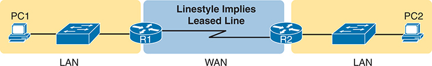

**Figure 3-1** *Small Enterprise Network with One Leased Line*

A network consisting of three routers: R5, R2, and R3. R5 is connected to both R2 and R3. R5 is connected to R2 through the IP address 10.1.12.1 and interface G0/1, while it is connected to R3 through the IP address 10.1.13.1 and interface G0/2. Both the connected routers have a unique Router ID (R I D); R I D 2.2.2 for router R2, R I D 3.3.3.3 for router R3.

This section begins by examining the physical details of leased lines, followed by a discussion of the two common data-link protocols for leased lines, HDLC and PPP.

##### Physical Details of Leased Lines

The [leased line](vol1_gloss.md#gloss_230) service, a physical layer service, delivers bits in both directions, at a predetermined speed, using full-duplex logic. In fact, conceptually it acts as if you had a full-duplex crossover Ethernet link between two routers, as shown in [Figure 3-2](vol1_ch03.md#ch03fig02). The leased line uses two pairs of wires, one pair for each direction of sending data, which allows full-duplex operation.

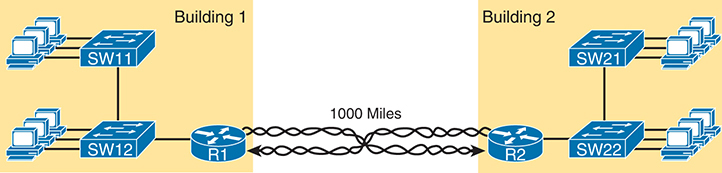

**Figure 3-2** *Conceptual View of the Leased-Line Service*

The network design features four routers labeled R1, R2, R3, and R4. R1 and R3 contain a unique Router ID (R I D): R I D 1.1.1.1 for R1 and R I D 1.1.1.1 (should be 3.3.3.3) for R3. The routers are interconnected via interfaces. R1 has subnet 10.1.11.1/24 connected via the G0/1 interface and subnet 10.1.1.1/24 connected via the G0/0 interface. R2 has subnet 10.1.22.2/24 connected via the G0/1 interface and subnet 10.1.1.2/24 connected via the G0/0 interface in the Incorrect Configuration: Area 1 with Intended Design: Area 0 Only. R3 has subnet 10.1.1.3/24 connected via the G0/0 interface and subnet 10.1.33.3/24 connected via the G0/1 interface. R4 has subnet 10.1.1.4/24 connected via the G0/0 interface indicating Hello/Dead equals 5/20 and subnet 10.1.44.4/24 connected via the G0/1 interface.

To create a leased line, some physical path must exist between the two routers on the ends of the link. The physical cabling must leave the customer buildings where each router sits; however, the [telco](vol1_gloss.md#gloss_404) does not simply install one cable between the two buildings. Instead, it uses what is typically a large and complex network that creates the appearance of a cable between the two routers.

[Figure 3-3](vol1_ch03.md#ch03fig03) shows a conceptual view of a small part of the telco network. Telcos put their equipment in buildings called central offices (COs). The telco installs cables from the CO to most every other building in the city, expecting to sell services to the people in those buildings one day. The telco would then configure its switches to use some of the capacity on each cable to send data in both directions, creating the equivalent of a crossover cable between the two routers.

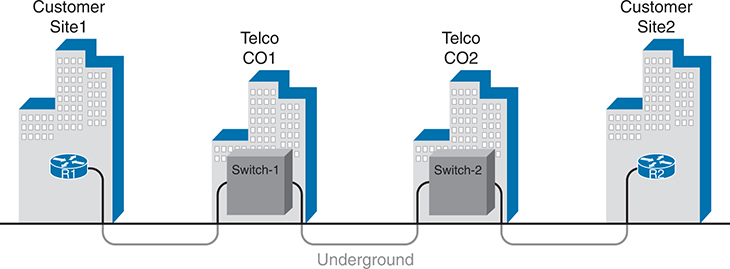

**Figure 3-3** *Possible Cabling Inside a Telco for a Short Leased Line*

The schematic shows four buildings are labeled "Customer Site 1," "Telco C O 1," "Telco C O 2," and "Customer Site 2." Customer site 1 and Customer site 2 has routers labeled as "R 1" and "R 2." The Telco CO1 and Telco CO2 has switches labeled as "Switch-1" and "Switch-2". The connections between the routers and switches are shown by lines, indicating cabling.

Given the long history of leased lines, the industry uses a variety of terms to refer to the same kind of WAN link. For instance, the term *leased line* emphasizes the fact that the telco leases the use of the leased line to a customer, but the customer does not permanently own the line. [Table 3-2](vol1_ch03.md#ch03tab02) lists some of the many names for leased lines, mainly so that in a networking job, you have a chance to translate from the terms each person uses with a basic description as to the meaning of the name.

**Table 3-2** Different Names for a Leased Line

| Name | Meaning or Reference |
| --- | --- |
| Leased circuit, Circuit | The words *line* and *circuit* are often used as synonyms in telco terminology; *circuit* makes reference to the electrical circuit between the two endpoints. |
| Serial link, Serial line | The words *link* and *line* are also often used as synonyms. *Serial* in this case refers to the fact that the bits flow serially and that routers use [serial interfaces](vol1_ch03.md#key_053a). |
| Point-to-point link, Point-to-point line | These terms refer to the fact that the topology stretches between two points, and two points only. (Some older leased lines allowed more than two devices.) |
| T1 | This specific type of leased line transmits data at 1.544 megabits per second (1.544 Mbps). |
| WAN link, Link | Both of these terms are very general, with no reference to any specific technology. |
| Private line | This term refers to the fact that the data sent over the line cannot be copied by other telco customers, so the data is private. |

##### Data-Link Details of Leased Lines

A leased line provides a Layer 1 service. In other words, it promises to deliver bits between the devices connected to the leased line. However, the leased line itself does not define a data-link layer protocol to be used on the leased line. So, to make use of the leased line, the routers on the ends of the line use one of two data-link protocols: High-Level Data Link Control ([HDLC](vol1_gloss.md#gloss_163)) or Point-to-Point Protocol (PPP).

All data-link protocols perform a similar role: to control the correct delivery of data over a physical link of a particular type. For example, the Ethernet data-link protocol uses a destination address field to identify the correct device that should receive the data and an FCS field that allows the receiving device to determine whether the data arrived correctly. The WAN data-link protocols HDLC and PPP provide similar functions.

HDLC and PPP have even less work to do than Ethernet because of the simple point-to-point topology of a leased line. Using HDLC as an example, when one router sends an HDLC frame over a leased line, the frame can go to only one destination device: to the router on the other end of the link. So, while HDLC has an address field, the destination is implied, and the actual address value is unimportant. The idea is sort of like when I have lunch with my friend Gary, and only Gary. I do not need to start every sentence with "Hey, Gary." He knows I am talking to him.

[Figure 3-4](vol1_ch03.md#ch03fig04) shows the HDLC frame format as an example, with [Table 3-3](vol1_ch03.md#ch03tab03) that follows describing the fields. However, note that HDLC and PPP have a similar frame format, although the newer PPP (defined in the 1990s) has more features and functions (plus additional optional headers) than the older HDLC (defined in the 1970s.)

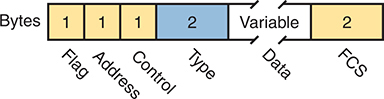

**Figure 3-4** *HDLC Framing*

The structure is divided into six sections, each representing a different part of the frame for distinction. From left to right, the sections are: Flag 1 byte, Address 1 byte, Control 1 byte, Type 2 bytes, Data variable bytes, and F C S 2 bytes. The number of bytes required for each part is indicated above the respective section.

**Table 3-3** Comparing HDLC and PPP Header Fields to Ethernet

| HDLC & PPP Field | Ethernet Equivalent | Description |
| --- | --- | --- |
| Flag | Preamble, SFD | Lists a recognizable bit pattern so that the receiving nodes realize that a new frame is arriving. |
| Address | Destination Address | Identifies the destination device, but not interesting for leased line point-to-point topologies. |
| Control | N/A | No longer of use today for links between routers. |
| Type | Type | Identifies the type of Layer 3 packet encapsulated inside the data portion of the frame. |
| FCS | FCS | Identifies a field used by the error detection process. (It is the only trailer field in this table.) |

##### How Routers Use a WAN Data Link

Leased lines connect to routers, and routers focus on delivering packets to a destination host. However, routers physically connect to both LANs and WANs, with those LANs and WANs requiring that data be sent inside data-link frames. So, now that you know a little about HDLC and PPP, it helps to think about how routers use these data-link protocols when sending data.

First, the TCP/IP network layer focuses on forwarding [IP packets](vol1_gloss.md#gloss_207) from the sending host to the destination host. The underlying LANs and WANs just act as a way to move the packets to the next router or end-user device. [Figure 3-5](vol1_ch03.md#ch03fig05) shows that network layer perspective.

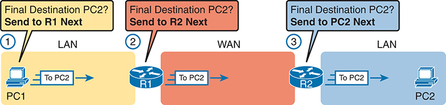

**Figure 3-5** *IP Routing Logic over LANs and WANs*

P C 1's network layer logic directs the packet to the nearest router, R 1. Router R 1 employs its network layer logic to determine the optimal route, forwarding the packet via a leased line to Router R 2. Router R 2's network layer logic comes into play, identifying the LAN link as the appropriate path to P C 2. Each step in this process underscores the essence of I P routing.

Following the steps in the figure, for a packet sent by PC1 to PC2's IP address:

1. PC1's network layer (IP) logic tells it to send the packet to a nearby router (R1).
2. Router R1's network layer logic tells it to forward (route) the packet out the leased line to Router R2 next.
3. Router R2's network layer logic tells it to forward (route) the packet out the LAN link to PC2 next.

While [Figure 3-5](vol1_ch03.md#ch03fig05) shows the network layer logic, the PCs and routers must rely on the LANs and WANs in the figure to actually move the bits in the packet. [Figure 3-6](vol1_ch03.md#ch03fig06) shows the same figure, with the same packet, but this time showing some of the data-link layer logic used by the hosts and routers. Basically, three separate data-link layer steps encapsulate the packet, inside a data-link frame, over three hops through the internetwork: from PC1 to R1, from R1 to R2, and from R2 to PC2.

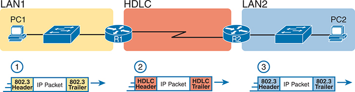

**Figure 3-6** *General Concept of Routers De-encapsulating and Re-encapsulating IP Packets*

P C 1 encapsulates the I P packet within an Ethernet frame destined for Router R 1. Upon reception, Router R 1 de-encapsulates the I P packet from the Ethernet frame and re-encapsulates it into an H D L C frame, forwarding it to Router R 2. Router R 2 then de-encapsulates the packet from the H D L C frame and re-encapsulates it into an Ethernet frame addressed to P C 2.

Following the steps in the figure, again for a packet sent by PC1 to PC2's IP address:

1. To send the IP packet to Router R1 next, PC1 encapsulates the IP packet in an Ethernet frame that has the destination MAC address of R1.
2. Router R1 de-encapsulates (removes) the IP packet from the Ethernet frame, encapsulates (inserts) the packet into an HDLC frame using an HDLC header and trailer, and forwards the HDLC frame to Router R2 next.
3. Router R2 de-encapsulates (removes) the IP packet from the HDLC frame, encapsulates (inserts) the packet into an Ethernet frame that has the destination MAC address of PC2, and forwards the Ethernet frame to PC2.

In summary, a leased line with HDLC creates a WAN link between two routers so that they can forward packets for the devices on the attached LANs. The leased line itself provides the physical means to transmit the bits, in both directions. The HDLC frames provide the means to encapsulate the network layer packet correctly so that it crosses the link between routers. Similarly, if the routers use PPP instead of HDLC, then the routers encapsulate the packets in PPP frames rather than HDLC frames.

Leased lines have many benefits that have led to their relatively long life in the WAN marketplace. These lines are simple for the customer, are widely available, are of high quality, and are private. However, they do have some negatives as well compared to newer WAN technologies, including a higher cost and typically longer lead times to get the service installed. Additionally, by today's standards, leased-line WAN links are slow, with the fastest leased line speeds in the tens of megabits per second (Mbps). Newer and faster WAN technology has moved the WAN market away from leased lines, with Ethernet WANs being common here in the 2020s.

#### Ethernet as a WAN Technology

For the first several decades of the existence of Ethernet, Ethernet was only appropriate for LANs. The restrictions on cable lengths and devices might allow a LAN that stretched a kilometer or two, to support a campus LAN, but that was the limit.

As time passed, the IEEE improved Ethernet standards in ways that made Ethernet a reasonable WAN technology. For example, the 1000BASE-LX standard uses single-mode fiber cabling, with support for a 5-km cable length; the 1000BASE-ZX standard supports an even longer 70-km cable length. As time went by, and as the IEEE improved cabling distances for fiber Ethernet links, Ethernet became a reasonable WAN technology.

Today, many WAN service providers (SP) offer WAN services that take advantage of Ethernet. SPs offer a wide variety of these Ethernet WAN services, with many different names. But all of them use a similar model, with Ethernet used between the customer site and the SP's network, as shown in [Figure 3-7](vol1_ch03.md#ch03fig07).

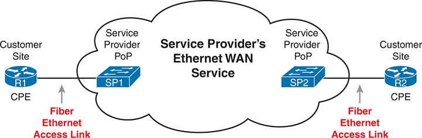

**Figure 3-7** *Fiber Ethernet Link to Connect a CPE Router to a Service Provider's WAN*

The schematic shows the connection between a Customer Premises Equipment (C P E) router at R 1's site and the service provider's WAN via a fiber Ethernet link. The connection extends from R 1's C P E router through the fiber Ethernet access link to the Service Provider Point of Presence (P o P) S P 1, representing the service provider's Ethernet WAN service. Similarly, another connection extends from Service Provider P o P S P 2 to R 2's C P E router at another customer site, also facilitated through a fiber Ethernet access link.

The model shown in [Figure 3-7](vol1_ch03.md#ch03fig07) has many of the same ideas of how a telco creates a leased line, as shown earlier in [Figure 3-3](vol1_ch03.md#ch03fig03), but now with Ethernet links and devices. The customer connects to an Ethernet link using a router interface. The (fiber) Ethernet link leaves the customer building and connects to some nearby SP location called a point of presence (PoP). Instead of a telco switch as shown in [Figure 3-3](vol1_ch03.md#ch03fig03), the SP uses an Ethernet switch. Inside the SP's network, the SP uses any technology that it wants to create the specific Ethernet WAN services.

##### Ethernet WANs That Create a Layer 2 Service

Ethernet WAN services include a variety of specific services that vary in ways that change how routers use those services. However, for the purposes of CCNA, you just need to understand the most basic Ethernet WAN service, one that works much like an Ethernet crossover cable--just over a WAN. In other words:

* Logically, behaves like a point-to-point connection between two routers
* Physically, behaves as if a physical fiber Ethernet link existed between the two routers

This book refers to this particular Ethernet WAN service with a couple of the common names:

[Ethernet WAN](vol1_gloss.md#gloss_440)**:** A generic name to differentiate it from an Ethernet LAN.

**Ethernet point-to-point link:** A term that emphasizes the topology of a typical Ethernet WAN link that has exactly two endpoints: the routers on the two ends of the link.

[Ethernet Line Service (E-Line)](vol1_gloss.md#gloss_134)**:** A term from the Metro Ethernet Forum (MEF) for the kind of point-to-point Ethernet WAN service shown throughout this book.

**Ethernet over MPLS (EoMPLS):** A term that refers to Multiprotocol Label Switching (MPLS), a technology that can be used to create the Ethernet service for the customer.

So, if you can imagine two routers, with a single Ethernet link between the two routers, you understand what this particular Ethernet WAN service does, as shown in [Figure 3-8](vol1_ch03.md#ch03fig08). In this case, the two routers, R1 and R2, connect with an Ethernet WAN service instead of a serial link. The routers use Ethernet interfaces, and they can send data in both directions at the same time. Physically, each router actually connects to some SP PoP, as shown earlier in [Figure 3-7](vol1_ch03.md#ch03fig07), but logically, the two routers can send Ethernet frames to each other over the link.

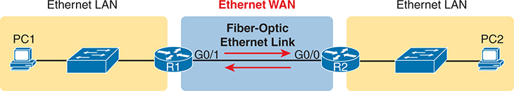

**Figure 3-8** *Ethernet WAN Acting Like a Simple Ethernet Link Between Two Routers*

P C 1 is connected to R 1 via an Ethernet LAN, and R 1 is linked to R 2 through a fiber-optic Ethernet link on interface G 0/1. R 2 is connected to P C 2 via another Ethernet LAN.

##### How Routers Route IP Packets Using Ethernet WAN Links

WANs, by their very nature, give IP routers a way to forward IP packets from a LAN at one site, over the WAN, and to another LAN at another site. The routing logic works the same whether the WAN link happens to be a serial link or an Ethernet WAN link, with the encapsulation details being slightly different. With an Ethernet WAN link, the link uses Ethernet for both Layer 1 and Layer 2 functions, so the routers encapsulate using the familiar Ethernet header and trailer, as shown in the middle of [Figure 3-9](vol1_ch03.md#ch03fig09). Also, note that the figure shows a small cloud over the Ethernet link as a way to tell us that the link is an Ethernet WAN link, rather than an Ethernet LAN link.

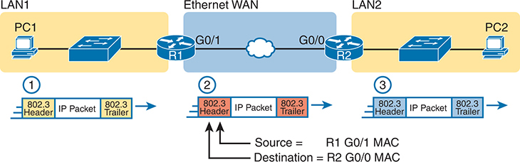

**Figure 3-9** *Routing over an Ethernet WAN Link*

P C 1 encapsulates an I P packet within an Ethernet frame, incorporating an 802.3 header and trailer. The source MAC address is set to R 1's G 0/1 MAC, and the destination MAC address is R 2's G 0/0 MAC. Upon receiving the frame, R 1 re-encapsulates the packet with R 2's MAC as the destination and its own as the source, adding a new 802.3 header and trailer. R 1 then forwards this modified frame to R 2 over the Ethernet WAN service. R 2, upon reception, de-encapsulates the I P packet and encapsulates it into another Ethernet frame with P C 2's MAC as the destination, completing the routing process.

Note

The 802.3 headers/trailers in the figure are different at each stage! Make sure to notice the reasons in the step-by-step explanations that follow.

The figure shows the same three routing steps as shown with the serial link in the earlier [Figure 3-6](vol1_ch03.md#ch03fig06). In this case, all three routing steps use the same Ethernet (802.3) protocol. However, note that each frame's data-link header and trailer are different. Each router discards the old data-link header/trailer and adds a new set, as described in these steps. Focus mainly on Step 2, because compared to the similar example shown in [Figure 3-6](vol1_ch03.md#ch03fig06), Steps 1 and 3 are unchanged:

1. To send the IP packet to Router R1 next, PC1 encapsulates (inserts) the IP packet in an Ethernet frame that has the destination MAC address of R1.
2. Router R1 de-encapsulates (removes) the IP packet from the Ethernet frame and encapsulates (inserts) the packet into a new Ethernet frame, with a new Ethernet header and trailer. The destination MAC address is R2's G0/0 MAC address, and the source MAC address is R1's G0/1 MAC address. R1 forwards this frame over the Ethernet WAN service to R2 next.
3. Router R2 de-encapsulates (removes) the IP packet from the Ethernet frame, encapsulates (inserts) the packet into an Ethernet frame that has the destination MAC address of PC2, and forwards the Ethernet frame to PC2.

Throughout this book, the WAN links (serial and Ethernet) will connect routers as shown here, with the focus being on the LANs and IP routing. The rest of the chapter turns our attention to a closer look at IP routing.

### IP Routing

Many protocol models have existed over the years, but today the TCP/IP model dominates. And at the network layer of TCP/IP, two options exist for the main protocol around which all other network layer functions revolve: IP version 4 (IPv4) and IP version 6 (IPv6). Both IPv4 and IPv6 define the same kinds of network layer functions, but with different details. This chapter introduces these network layer functions for IPv4, leaving the IPv6 details for [Part VII](vol1_part07.md#part07) of this book.

Note

All references to IP in this chapter refer to the older and more established IPv4, and all use of the term [IP address](vol1_gloss.md#gloss_203) refers to an IPv4 address.

Internet Protocol (IP) focuses on the job of routing data, in the form of IP packets, from the source host to the destination host. IP does not concern itself with the physical transmission of data, instead relying on the lower TCP/IP layers for those functions. Instead, IP concerns itself with the logical details, rather than physical details, of delivering data. In particular, the network layer specifies how packets travel end to end over a TCP/IP network, even when the packet crosses many different types of LAN and WAN links.

This next major section of the chapter examines IP routing in more depth. First, IP defines what it means to route an IP packet from sending host to destination host, while using successive data-link protocols. This section then examines how IP addressing rules help to make IP routing much more efficient by grouping addresses into subnets. This section closes by looking at the role of IP [routing protocols](vol1_gloss.md#gloss_197), which give routers a means by which to learn routes to all the IP subnets in an internetwork.

#### Network Layer Routing (Forwarding) Logic

Routers and end-user computers (called *hosts* in a TCP/IP network) work together to perform IP routing. The host operating system (OS) has TCP/IP software, including the software that implements the network layer. Hosts use that software to choose where to send IP packets, often to a nearby router. Those routers make choices of where to send the IP packet next. Together, the hosts and routers deliver the IP packet to the correct destination, as shown in the example in [Figure 3-10](vol1_ch03.md#ch03fig10).

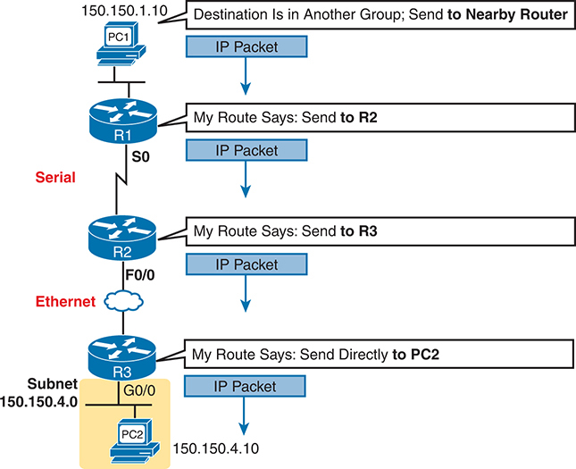

**Figure 3-10** *Routing Logic: PC1 Sending an IP Packet to PC2*

The process begins with P C 1, which intends to send an I P packet to P C 2, located in another group. P C 1 sends the packet to the nearby router, identified as 150.150.1.10. The I P packet is then routed through a series of routers. Router R 1 receives the packet and determines that it should be sent to Router R 2. Router R 2 receives the packet on its Serial 0 interface and determines it should be sent to Router R 3. Router R 3 receives the packet on its Ethernet interface (F 0/0) and decides to send it directly to P C 2, located at subnet 150.150.4.0 with the I P address 150.150.4.10. P C 2 receives the I P packet, completing the routing process.

The IP packet, created by PC1, goes from the top of the figure all the way to PC2 at the bottom of the figure. The next few pages discuss the network layer routing logic used by each device along the path.

Note

The term *path selection* is sometimes used to refer to the routing process shown in [Figure 3-10](vol1_ch03.md#ch03fig10). At other times, it refers to routing protocols, specifically how routing protocols select the best route among the competing routes to the same destination.

##### Host Forwarding Logic: Send the Packet to the Default Router

In this example, PC1 does some basic analysis and then chooses to send the IP packet to the router so that the router will forward the packet. PC1 analyzes the destination address and realizes that PC2's address (150.150.4.10) is not on the same LAN as PC1. So PC1's logic tells it to send the packet to a device whose job it is to know where to route data: a nearby router, on the same LAN, called PC1's [default router](vol1_gloss.md#gloss_090).

To send the IP packet to the default router, the sender sends a data-link frame across the medium to the nearby router; this frame includes the packet in the data portion of the frame. That frame uses data-link layer (Layer 2) addressing in the data-link header to ensure that the nearby router receives the frame.

Note

The *default router* is also referred to as the *default gateway*.

##### R1 and R2's Logic: Routing Data Across the Network

All routers use the same general process to route the packet. Each router keeps an *IP* [routing table](vol1_gloss.md#gloss_208). This table lists IP address *groupings*, called [IP networks](vol1_gloss.md#gloss_206) and [IP subnets](vol1_gloss.md#gloss_209). When a router receives a packet, it compares the packet's destination IP address to the entries in the routing table and makes a match. This matching entry also lists directions that tell the router where to forward the packet next.

In [Figure 3-10](vol1_ch03.md#ch03fig10), R1 would have matched the destination address (150.150.4.10) to a routing table entry, which in turn told R1 to send the packet to R2 next. Similarly, R2 would have matched a routing table entry that told R2 to send the packet, over an Ethernet WAN link, to R3 next.

The routing concept works a little like driving down the freeway when approaching a big interchange. You look up and see signs for nearby towns, telling you which exits to take to go to each town. Similarly, the router looks at the IP routing table (the equivalent of the road signs) and directs each packet over the correct next LAN or WAN link (the equivalent of a road).

##### R3's Logic: Delivering Data to the End Destination

The final router in the path, R3, uses almost the same logic as R1 and R2, but with one minor difference. R3 needs to forward the packet directly to PC2, not to some other router. On the surface, that difference seems insignificant. In the next section, when you read about how the network layer uses LANs and WANs, the significance of the difference will become obvious.

#### How Network Layer Routing Uses LANs and WANs

While the network layer routing logic ignores the physical transmission details, the bits still have to be transmitted. To do that work, the network layer logic in a host or router must hand off the packet to the data-link layer protocols, which, in turn, ask the physical layer to actually send the data. The data-link layer adds the appropriate header and trailer to the packet, creating a frame, before sending the frames over each physical network.

The routing process forwards the network layer packet from end to end through the network, while each data-link frame only takes a smaller part of the trip. Each successive data-link layer frame moves the packet to the next device that thinks about network layer logic. In short, the network layer thinks about the bigger view of the goal, like "Send this packet to the specified next router or host…," while the data-link layer thinks about the specifics, like "Encapsulate the packet in a data-link frame and transmit it." The following list summarizes the major steps in a router's internal network layer routing for each packet beginning with the frame arriving in a router interface:

Step 1. Use the data-link Frame Check Sequence (FCS) field to ensure that the frame had no errors; if errors occurred, discard the frame.

Step 2. Assuming that the frame was not discarded at Step 1, discard the old data-link header and trailer, leaving the IP packet.

Step 3. Compare the IP packet's destination IP address to the routing table, and find the route that best matches the destination address. This route identifies the outgoing interface of the router and possibly the next-hop router IP address.

Step 4. Encapsulate the IP packet inside a new data-link header and trailer, appropriate for the outgoing interface, and forward the frame.

[Figure 3-11](vol1_ch03.md#ch03fig11) works through a repeat example of a packet sent by PC1 to PC2, followed by a detailed analysis of each device's routing logic. Each explanation includes the details about how PC1 and each of the three routers builds the appropriate new data-link headers.

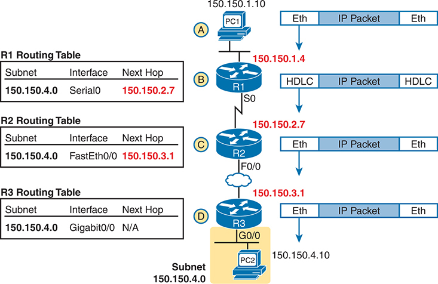

**Figure 3-11** *Network Layer and Data-Link Layer Encapsulation*

Step A: P C 1 with I P address 150.150.1.10 encapsulates an I P packet within an Ethernet frame. Step B: Router R 1 receives the Ethernet frame, encapsulates it in H D L C, and consults its routing table to determine the next hop for the packet, which is 150.150.2.7 via the Serial 0 interface. Step C: Router R 2 receives the H D L C frame, encapsulates it back into an Ethernet frame, and forwards it based on its routing table to 150.150.3.1 via Fast Ethernet 0/0 interface. Step D: Router R3 receives the Ethernet frame, forwards it, and routes the packet to P C 2 via the Gigabit Ethernet 0/0 interface. This step includes examining the routing table for the subnet 150.150.4.0 and the absence of a next hop. P C 2 resides within the same subnet, denoted by 150.150.4.0.

The following list explains the forwarding logic at each router, focusing on how the routing integrates with the data link.

Step A. **PC1 sends the packet to its default router.** PC1's network layer logic builds the IP packet, with a destination address of PC2's IP address (150.150.4.10). The network layer also performs the analysis to decide that 150.150.4.10 is not in the local IP subnet, so PC1 needs to send the packet to R1 (PC1's default router). PC1 places the IP packet into an Ethernet data-link frame, with a destination Ethernet address of R1's Ethernet address. PC1 sends the frame on to the Ethernet.

Step B. **R1 processes the incoming frame and forwards the packet to R2.** Because the incoming Ethernet frame has a destination MAC of R1's Ethernet MAC, R1 decides to process the frame. R1 checks the frame's FCS for errors, and if none, R1 discards the Ethernet header and trailer. Next, R1 compares the packet's destination address (150.150.4.10) to its routing table and finds the entry for subnet 150.150.4.0. Because the destination address of 150.150.4.10 is in that subnet, R1 forwards the packet out the interface listed in that matching route (Serial0) to next-hop Router R2 (150.150.2.7). R1 must first encapsulate the IP packet into an HDLC frame.

Step C. **R2 processes the incoming frame and forwards the packet to R3.** R2 repeats the same general process as R1 when R2 receives the HDLC frame. R2 checks the FCS field and finds that no errors occurred and then discards the HDLC header and trailer. Next, R2 compares the packet's destination address (150.150.4.10) to its routing table and finds the entry for subnet 150.150.4.0, a route that directs R2 to send the packet out interface Fast Ethernet 0/0 to next-hop router 150.150.3.1 (R3). But first, R2 must encapsulate the packet in an Ethernet header. That header uses R2's MAC address and R3's MAC address on the Ethernet WAN link as the source and destination MAC address, respectively.

Step D. **R3 processes the incoming frame and forwards the packet to PC2.** Like R1 and R2, R3 checks the FCS, discards the old data-link header and trailer, and matches its own route for subnet 150.150.4.0. R3's routing table entry for 150.150.4.0 shows that the outgoing interface is R3's Ethernet interface, but there is no next-hop router because R3 is connected directly to subnet 150.150.4.0. All R3 has to do is encapsulate the packet inside a new Ethernet header and trailer, but with a destination Ethernet address of PC2's MAC address.

Because the routers build new data-link headers and trailers, and because the new headers contain data-link addresses, the PCs and routers must have some way to decide what data-link addresses to use. An example of how the router determines which data-link address to use is the IP Address Resolution Protocol (ARP). *ARP dynamically learns the data-link address of an IP host connected to a LAN*. For example, at the last step, at the bottom of [Figure 3-11](vol1_ch03.md#ch03fig11), Router R3 would use ARP once to learn PC2's MAC address before sending any packets to PC2.

#### How IP Addressing Helps IP Routing

IP defines network layer addresses that identify any host or router interface that connects to a TCP/IP network. The idea basically works like a postal address: Any interface that expects to receive IP packets needs an IP address, just like you need a postal address before receiving mail from the postal service. This next short topic introduces the idea of IP networks and subnets, which are the groups of addresses defined by IP.

Note

IP defines the word *network* to mean a very specific concept. To avoid confusion when writing about IP addressing, this book (and others) often avoids using the term *network* for other uses. In particular, this book uses the term *internetwork* to refer more generally to a network made up of routers, switches, cables, and other equipment.

##### Rules for Groups of IP Addresses (Networks and Subnets)

TCP/IP groups IP addresses together so that IP addresses used on the same physical network are part of the same group. IP calls these address groups an *IP network* or an *IP subnet*. Using that same postal service analogy, each IP network and IP subnet works like a postal code (or in the United States, a ZIP code). All nearby postal addresses are in the same postal code (ZIP code), while all nearby IP addresses must be in the same IP network or IP subnet.

IP defines specific rules about which IP address should be in the same IP network or IP subnet. Numerically, the addresses in the same group have the same value in the first part of the addresses. For example, [Figures 3-10](vol1_ch03.md#ch03fig10) and [3-11](vol1_ch03.md#ch03fig11) could have used the following conventions:

* Hosts on the top Ethernet: Addresses start with 150.150.1
* Hosts on the R1-R2 serial link: Addresses start with 150.150.2
* Hosts on the R2-R3 Ethernet WAN link: Addresses start with 150.150.3
* Hosts on the bottom Ethernet: Addresses start with 150.150.4

From the perspective of IP routing, the grouping of IP addresses means that the routing table can be much smaller. A router can list one routing table entry for each IP network or subnet, representing a group of addresses, instead of one entry for every single IP address.

While the list shows just one example of how IP addresses may be grouped, the rules for how to group addresses using subnets will require some work to master the concepts and math. [Part IV](vol1_part04.md#part04) of this book details IP addressing and subnetting, along with other subnetting videos and practice questions. However, the brief version of two of the foundational rules of [subnetting](vol1_gloss.md#gloss_394) can be summarized as follows:

* Two IP addresses, not separated from each other by a router, must be in the same group (subnet).
* Two IP addresses, separated from each other by at least one router, must be in different groups (subnets).

It's similar to the USPS ZIP code system and how it requires local governments to assign addresses to new buildings. It would be ridiculous to have two houses next door to each other with different postal/ZIP codes. Similarly, it would be silly to have people who live on opposite sides of the country to have addresses with the same postal/ZIP code.

##### The IP Header

The routing process also makes use of the IPv4 header, as shown in [Figure 3-12](vol1_ch03.md#ch03fig12). The header lists a 32-bit source IP address, as well as a 32-bit destination IP address. The header, of course, has other fields, a few of which matter for other discussions in this book. The book will refer to this figure as needed, but otherwise, be aware of the 20-byte IP header and the existence of the source and destination IP address fields. Note that in the examples so far in this chapter, while routers remove and add data-link headers each time they route a packet, the IP header remains, with the IP addresses unchanged by the IP routing process.

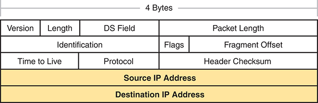

**Figure 3-12** *IPv4 Header, Organized as 4 Bytes Wide for a Total of 20 Bytes*

Layer 1 of the I P v 4 header comprises the version, length, D S field, and packet length, arranged into 4-byte segments. Layer 22 of the I P v 4 header comprises the identification, flags, and fragment offset, arranged into 4-byte segments. Layer 3 of the I P v 4 header comprises the time to live, protocol header, and checksum, arranged into 4-byte segments. Layers 4 and 5 comprise the source I P address and the destination I P address arranged into 4-byte segments.

#### How IP Routing Protocols Help IP Routing

For routing logic to work on both hosts and routers, each host and router needs to know something about the TCP/IP internetwork. Hosts need to know the IP address of their default router so that hosts can send packets to remote destinations. Routers, however, need to know routes so they forward packets to each and every reachable IP network and IP subnet.

The best method for routers to know all the useful routes is to configure the routers to use the same IP routing protocol. If you enable the same routing protocol on all the routers in a TCP/IP internetwork, with the correct settings, the routers will send routing protocol messages to each other. As a result, all the routers will learn routes for all the IP networks and subnets in the TCP/IP internetwork.

IP supports a small number of different IP routing protocols. All use some similar ideas and processes to learn IP routes, but different routing protocols do have some internal differences. All the routing protocols use the same general steps for learning routes:

Step 1. Each router, independent of the routing protocol, adds a route to its routing table for each subnet directly connected to the router.

Step 2. Each router's routing protocol tells its neighbors about the routes in its routing table, including the directly connected routes and routes learned from other routers.

Step 3. Each router's routing protocol listens to messages from neighboring routers and learns routes, with the next-hop router of that route typically being the neighbor from which the route was learned.

Also, note that at the final step, routers may have to choose between multiple routes to reach a single subnet. When that happens, routers place the best currently available route to reach a subnet (based on a measurement called a metric) into the routing table.

[Figure 3-13](vol1_ch03.md#ch03fig13) shows an example of how a routing protocol works, using the same diagram as in [Figures 3-10](vol1_ch03.md#ch03fig10) and [3-11](vol1_ch03.md#ch03fig11). In this case, IP subnet 150.150.4.0, which consists of all addresses that begin with 150.150.4.0, sits on the Ethernet at the bottom of the figure. The figure shows the advertisement of routes for subnet 150.150.4.0 from bottom to top, as described in detail following the figure.

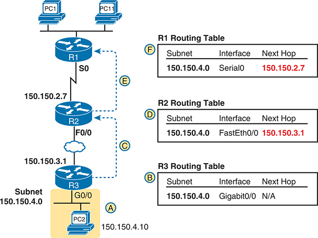

**Figure 3-13** *Example of How Routing Protocols Advertise About Networks and Subnets*

At the bottom of the figure, Subnet 150.150.4.0 is shown as connected to Router R 3. Independently, R 3 adds a connected route for 150.150.4.0 to its I P routing table. R 3 then initiates a routing protocol message, a routing update, to inform Router R 2 about Subnet 150.150.4.0. Upon receipt, R 2 updates its routing table accordingly. Subsequently, R 2 forwards a similar routing update to Router R 1, enabling R 1 to learn about Subnet 150.150.4.0. Finally, R 1 adds a route for Subnet 150.150.4.0 to its routing table, indicating its own Serial 0 interface as the outgoing interface and designating R 2's I P address (150.150.2.7) as the next-hop router.

Follow items A through F shown in the figure to see how each router learns its route to 150.150.4.0.

Step A. Subnet 150.150.4.0 exists as a subnet at the bottom of the figure, connected to Router R3.

Step B. R3 adds a connected route for 150.150.4.0 to its IP routing table; this happens without help from the routing protocol.

Step C. R3 sends a routing protocol message, called a *routing update*, to R2, causing R2 to learn about subnet 150.150.4.0.

Step D. R2 adds a route for subnet 150.150.4.0 to its routing table.

Step E. R2 sends a similar routing update to R1, causing R1 to learn about subnet 150.150.4.0.

Step F. R1 adds a route for subnet 150.150.4.0 to its routing table. The route lists R1's own Serial0 as the outgoing interface and R2 as the next-hop router IP address (150.150.2.7).

### Other Network Layer Features

The TCP/IP network layer defines many functions beyond IP. Sure, IP plays a huge role in networking today, defining IP addressing and IP routing. However, other protocols and standards, defined in other Requests For Comments (RFC), play an important role for network layer functions as well. For example, routing protocols like Open Shortest Path First (OSPF) exist as separate protocols, defined in separate RFCs.

This last short section of the chapter introduces three other network layer features that should be helpful to you when reading through the rest of this book. These last three topics just help fill in a few holes, helping to give you some perspective and helping you make sense of later discussions as well. The three topics are

* Domain Name System (DNS)
* Address Resolution Protocol (ARP)
* Ping

#### Using Names and the Domain Name System

Can you imagine a world in which every time you used an application, you had to refer to it by IP address? Instead of using easy names like [google.com](http://google.com) or [cisco.com](http://cisco.com), you would have to remember and type IP addresses, like 64.233.177.100. (At press time, 64.233.177.100 was an address used by Google, and you could reach Google's website by typing that address in a browser.) Certainly, asking users to remember IP addresses would not be user friendly and could drive some people away from using computers at all.

Thankfully, TCP/IP defines a way to use [hostnames](vol1_gloss.md#gloss_175) to identify other computers. The user either never thinks about the other computer or refers to the other computer by name. Then, protocols dynamically discover all the necessary information to allow communications based on that name.

For example, when you open a web browser and type in the hostname **[www.google.com](http://www.google.com)**, your computer does not send an IP packet with destination IP address [www.google.com](http://www.google.com); it sends an IP packet to an IP address used by the web server for Google. TCP/IP needs a way to let a computer find the IP address used by the listed hostname, and that method uses the Domain Name System ([DNS](vol1_gloss.md#gloss_108)).

Enterprises use the DNS process to resolve names into the matching IP address, as shown in the example in [Figure 3-14](vol1_ch03.md#ch03fig14). In this case, PC11, on the left, needs to connect to a server named Server1. At some point, the user either types in the name Server1 or some application on PC11 refers to that server by name. At Step 1, PC11 sends a DNS message--a DNS query--to the DNS server. At Step 2, the DNS server sends back a DNS reply that lists Server1's IP address. At Step 3, PC11 can now send an IP packet to destination address 10.1.2.3, the address used by Server1.

Note that the example in [Figure 3-14](vol1_ch03.md#ch03fig14) shows a cloud for the TCP/IP network because the details of the network, including routers, do not matter to the name resolution process. Routers treat the DNS messages just like any other IP packet, routing them based on the destination IP address. For example, at Step 1 in the figure, the DNS query will list the DNS server's IP address as the destination address, which any routers will use to forward the packet.

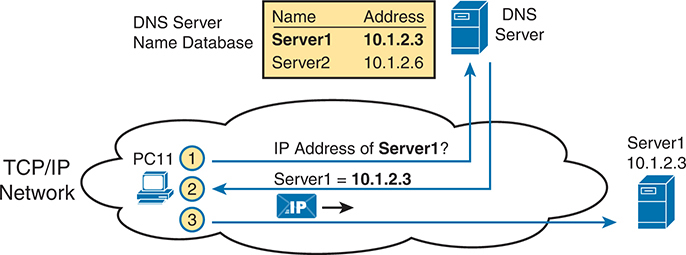

**Figure 3-14** *Basic DNS Name Resolution Request*

In a basic Domain Name System (D N S) name resolution request within a T C P/I P network, P C 11 initiates the process by querying for the I P address of Server 1. The D NS server, responsible for maintaining a database correlating domain names with I P addresses, receives the request. It consults its database, finding the corresponding entry for Server 1, associated with the I P address 10.1.2.3. It consults its database, which includes entries for Server1 and Server2, mapping to I P addresses 10.1.2.3 and 10.1.2.6, respectively. Upon resolution, the D N S server responds to P C 11, providing the requested I P address.

Finally, DNS defines much more than just a few messages. DNS defines protocols, as well as standards for the text names used throughout the world, and a worldwide set of distributed DNS servers. The domain names that people use every day when web browsing, which look like [www.example.com](http://www.example.com), follow the DNS naming standards. Also, no single DNS server knows all the names and matching IP addresses, but the information is distributed across many DNS servers. So, the DNS servers of the world work together, forwarding queries to each other, until the server that knows the answer supplies the desired IP address information.

#### The Address Resolution Protocol

As discussed in depth throughout this chapter, IP routing logic requires that hosts and routers encapsulate IP packets inside data-link layer frames. For Ethernet interfaces, how does a router know what MAC address to use for the destination? It uses [ARP](vol1_gloss.md#gloss_025).

On Ethernet LANs, whenever a host or router needs to encapsulate an IP packet in a new Ethernet frame, the host or router knows all the important facts to build that header--except for the destination MAC address. The host knows the IP address of the next device, either another host IP address or the default router IP address. A router knows the IP route used for forwarding the IP packet, which lists the next router's IP address. However, the hosts and routers do not know those neighboring devices' MAC addresses beforehand.

TCP/IP defines the Address Resolution Protocol (ARP) as the method by which any host or router on a LAN can dynamically learn the MAC address of another IP host or router on the same LAN. ARP defines a protocol that includes the *ARP Request*, which is a message that makes the simple request "if this is your IP address, please reply with your MAC address." ARP also defines the *ARP Reply* message, which indeed lists both the original IP address and the matching MAC address.

[Figure 3-15](vol1_ch03.md#ch03fig15) shows an example that uses the same router and host from the bottom part of the earlier [Figure 3-13](vol1_ch03.md#ch03fig13). The figure shows the ARP Request sent by router R3, on the left of the figure, as a LAN broadcast. All devices on the LAN will then process the received frame. On the right, at Step 2, host PC2 sends back an ARP Reply, identifying PC2's MAC address. The text beside each message shows the contents inside the ARP message itself, which lets PC2 learn R3's IP address and matching MAC address, and R3 learn PC2's IP address and matching MAC address.

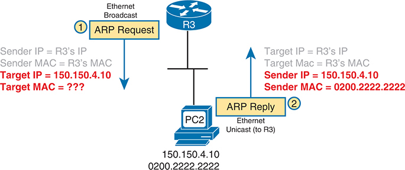

**Figure 3-15** *Sample ARP Process*

The sequence unfolds as follows: First, an A R P request is broadcasted over the Ethernet network by Router 3 (R 3). The sender's I P address and MAC address are set to R 3's respective identifiers, while the target I P address is specified as 150.150.4.10, although the target MAC address is yet to be determined. Subsequently, in response to the A R P request, an ARP reply is unicast back to R 3. The target I P and MAC addresses are now identified as R 3's, while the sender I P is set to 150.150.4.10, and the sender MAC is revealed as 0200.2222.2222.

Note that hosts and routers remember the ARP results, keeping the information in their *ARP cache* or *ARP table*. A host or router only needs to use ARP occasionally, to build the ARP cache the first time. Each time a host or router needs to send a packet encapsulated in an Ethernet frame, it first checks its ARP cache for the correct IP address and matching MAC address. Hosts and routers will let ARP cache entries time out to clean up the table, so occasional ARP Requests can be seen.

Note

You can see the contents of the ARP cache on most PC operating systems by using the **arp -a** command from a command prompt.

#### ICMP Echo and the ping Command

After you have implemented a TCP/IP internetwork, you need a way to test basic IP connectivity without relying on any applications to be working. The primary tool for testing basic network connectivity is the **ping** command.

[Ping](vol1_gloss.md#gloss_304) uses the Internet Control Message Protocol (ICMP), sending a message called an *ICMP echo request* to another IP address. The computer with that IP address should reply with an *ICMP echo reply*. If that works, you successfully have tested the IP network. In other words, you know that the network can deliver a packet from one host to the other and back. ICMP does not rely on any application, so it really just tests basic IP connectivity--Layers 1, 2, and 3 of the OSI model. [Figure 3-16](vol1_ch03.md#ch03fig16) outlines the basic process.

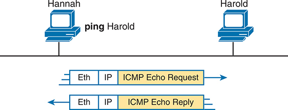

**Figure 3-16** *Sample Network, **ping** Command*

Hannah initiates a ping command directed towards Harold. The process involves the generation of an Ethernet frame encapsulating an Internet Protocol (I P) packet containing an Internet Control Message Protocol (I C M P) Echo Request by Hannah. This request is transmitted across the Ethernet network to reach Harold. Upon receiving the I C M P Echo Request, Harold responds with an I C M P Echo Reply, encapsulated within an I P packet and an Ethernet frame.

Note that while the **ping** command uses ICMP, ICMP does much more. ICMP defines many messages that devices can use to help manage and control the IP network.

### Chapter Review

The "[Your Study Plan](vol1_pref10.md#pref10)" element, just before [Chapter 1](vol1_ch01.md#ch01), discusses how you should study and practice the content and skills for each chapter before moving on to the next chapter. That element introduces the tools used here at the end of each chapter. If you haven't already done so, take a few minutes to read that section. Then come back here and do the useful work of reviewing the chapter to help lock into memory what you just read.

Review this chapter's material using either the tools in the book or interactive tools for the same material found on the book's companion website. [Table 3-4](vol1_ch03.md#ch03tab04) outlines the key review elements and where you can find them. To better track your study progress, record when you completed these activities in the second column.

**Table 3-4** Chapter Review Tracking

| Review Element | Review Date(s) | Resource Used |
| --- | --- | --- |
| Review key topics |  | Book, website |
| Review key terms |  | Book, website |
| Answer DIKTA questions |  | Book, PTP |
| Review memory tables |  | Book, website |

### Review All the Key Topics

**Table 3-5** Key Topics for [Chapter 3](vol1_ch03.md#ch03)

| Key Topic Element | Description | Page Number |
| --- | --- | --- |
| [Figure 3-6](vol1_ch03.md#ch03fig06) | Router de-encapsulation and re-encapsulation | [68](vol1_ch03.md#page_68) |
| [Figure 3-7](vol1_ch03.md#ch03fig07) | Ethernet WAN--physical connections | [69](vol1_ch03.md#page_69) |
| List | Common terms to describe an Ethernet WAN link | [70](vol1_ch03.md#page_70) |
| List | Four-step process of how routers route (forward) packets | [74](vol1_ch03.md#page_74) |
| [Figure 3-11](vol1_ch03.md#ch03fig11) | IP Routing and Encapsulation | [74](vol1_ch03.md#page_74) |
| List | Two statements about how IP expects IP addresses to be grouped into networks or subnets | [76](vol1_ch03.md#page_76) |
| List | Three-step process of how routing protocols learn routes | [77](vol1_ch03.md#page_77) |
| [Figure 3-13](vol1_ch03.md#ch03fig13) | IP Routing Protocol Basic Process | [78](vol1_ch03.md#page_78) |
| [Figure 3-14](vol1_ch03.md#ch03fig14) | Example that shows the purpose and process of DNS name resolution | [80](vol1_ch03.md#page_80) |
| [Figure 3-15](vol1_ch03.md#ch03fig15) | Example of the purpose and process of ARP | [81](vol1_ch03.md#page_81) |

### Key Terms You Should Know

[ARP](vol1_ch03.md#key_038)

[default router (default gateway)](vol1_ch03.md#key_039)

[DNS](vol1_ch03.md#key_040)

[Ethernet Line Service (E-Line)](vol1_ch03.md#key_041)

[Ethernet WAN](vol1_ch03.md#key_042)

[HDLC](vol1_ch03.md#key_043)

[hostname](vol1_ch03.md#key_044)

[IP address](vol1_ch03.md#key_045)

[IP network](vol1_ch03.md#key_046)

[IP packet](vol1_ch03.md#key_047)

[IP subnet](vol1_ch03.md#key_048)

[leased line](vol1_ch03.md#key_049)

[ping](vol1_ch03.md#key_050)

[routing protocol](vol1_ch03.md#key_051)

[routing table](vol1_ch03.md#key_052)

[serial interface](vol1_ch03.md#key_053)

[subnetting](vol1_ch03.md#key_054)

[telco](vol1_ch03.md#key_055)

[wide-area network (WAN)](vol1_ch03.md#key_056)