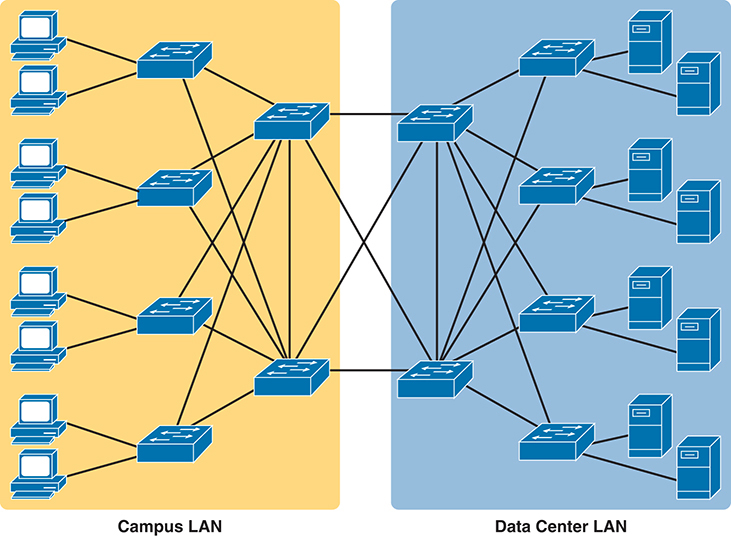
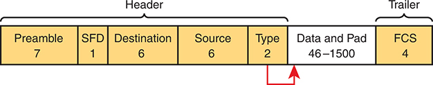
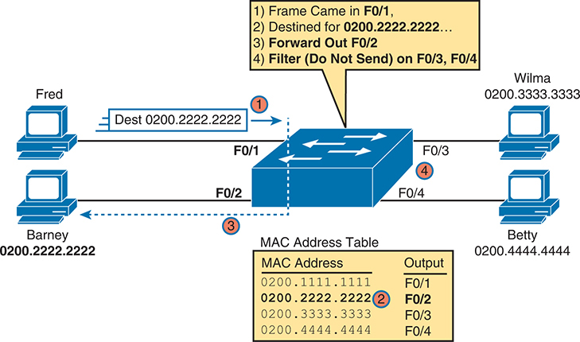
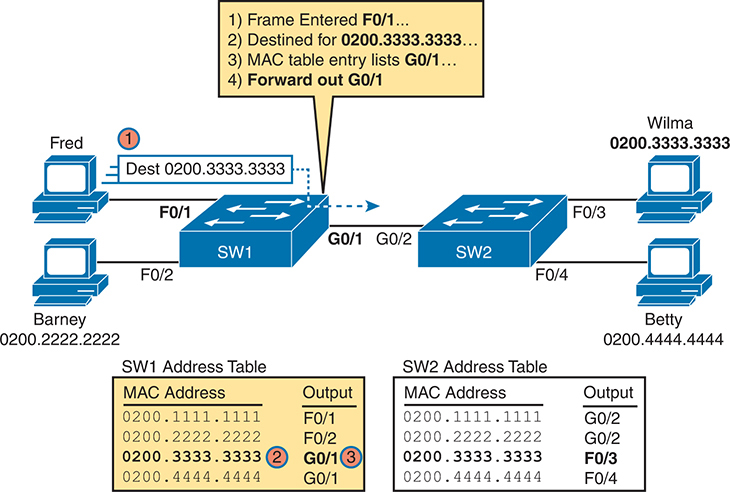
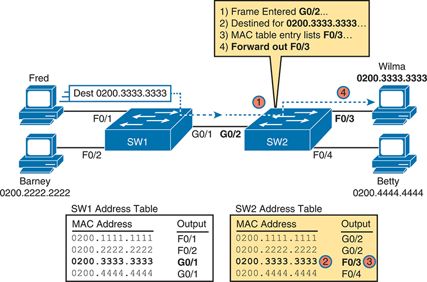
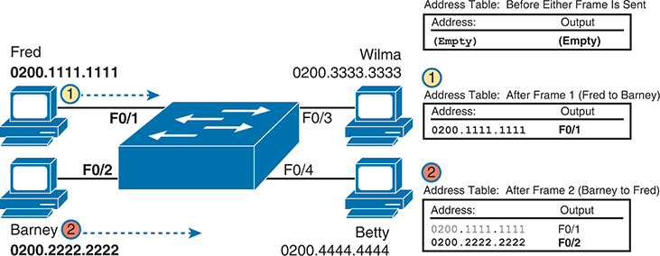
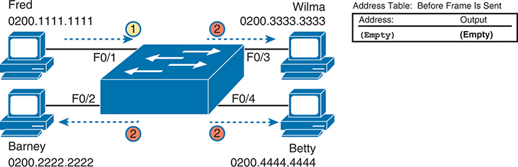
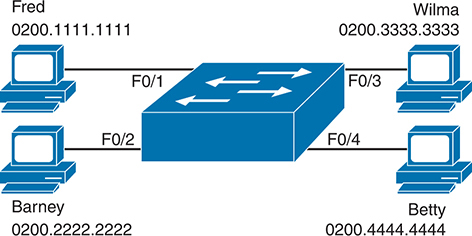
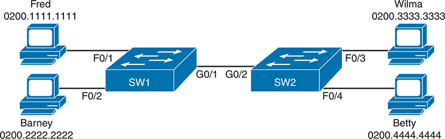

# Chapter 5


## Analyzing Ethernet LAN Switching

This chapter covers the following exam topics:

1.0 Network Fundamentals

1.1 Explain the role and function of network components

1.1.b Layer 2 and Layer 3 switches

1.13 Describe switching concepts

1.13.a MAC learning and aging

1.13.b Frame switching

1.13.c Frame flooding

1.13.d MAC address table

2.0 Network Access

2.5 Interpret basic operations of Spanning Tree Protocols

When you buy a Cisco Catalyst Ethernet switch, the switch is ready to work. All you have to do is take it out of the box, power on the switch by connecting the power cable to the switch and a power outlet, and connect hosts to the switch using the correct unshielded twisted-pair (UTP) cables. You do not have to configure anything else, or connect to the console and login, or do anything: the switch just starts forwarding Ethernet frames.

In [Part II](vol1_part02.md#part02) of this book, you will learn how to build, configure, and verify the operation of Ethernet LANs. In [Chapter 4](vol1_ch04.md#ch04), "[Using the Command-Line Interface](vol1_ch04.md#ch04)," you learned how to move around in the CLI, issue commands, and configure the switch. This chapter takes a short but important step in that journey by explaining the logic a switch uses when forwarding Ethernet frames.

This chapter breaks the content into two major sections. The first reviews and then further develops the concepts behind LAN switching, which were first introduced back in [Chapter 2](vol1_ch02.md#ch02), "[Fundamentals of Ethernet LANs](vol1_ch02.md#ch02)." The second section then uses IOS **show** commands to verify that Cisco switches actually learned the MAC addresses, built its MAC address table, and forwarded frames.

### "Do I Know This Already?" Quiz

Take the quiz (either here or use the PTP software) if you want to use the score to help you decide how much time to spend on this chapter. The letter answers are listed at the bottom of the page following the quiz. [Appendix C](vol1_appc.md#appc), found both at the end of the book as well as on the companion website, includes both the answers and explanations. You can also find both answers and explanations in the PTP testing software.


**Table 5-1** "Do I Know This Already?" Foundation Topics Section-to-Question Mapping

| Foundation Topics Section | Questions |
| --- | --- |
| LAN Switching Concepts | 1-4 |
| Verifying and Analyzing Ethernet Switching | 5-6 |

**[1](vol1_ch05.md#ques5_1a).** Which of the following statements describes part of the process of how a switch decides to forward a frame destined for a known unicast MAC address?

1. It compares the unicast destination address to the bridging, or MAC address, table.
2. It compares the unicast source address to the bridging, or MAC address, table.
3. It forwards the frame out all interfaces in the same VLAN except for the incoming interface.
4. It compares the destination IP address to the destination MAC address.
5. It compares the frame's incoming interface to the source MAC entry in the MAC address table.

**[2](vol1_ch05.md#ques5_2a).** Which of the following statements best describes the forwarding logic that a LAN switch, with all interfaces assigned to VLAN 1 as per default settings, uses for an incoming frame with a destination MAC address of FFFF.FFFF.FFFF?

1. It forwards the frame out all switch ports.
2. It forwards the frame out all switch ports except the arrival port.
3. It forwards the frame out all ports that had earlier registered to ask to receive broadcasts.
4. It discards the frame.

**[3](vol1_ch05.md#ques5_3a).** Which of the following statements best describes what a switch does with a frame destined for an unknown unicast address?

1. It forwards out all interfaces in the same VLAN except for the incoming interface.
2. It forwards the frame out the one interface identified by the matching entry in the MAC address table.
3. It compares the destination IP address to the destination MAC address.
4. It compares the frame's incoming interface to the source MAC entry in the MAC address table.

**[4](vol1_ch05.md#ques5_4a).** Which of the following comparisons does a switch make when deciding whether a new MAC address should be added to its MAC address table?

1. It compares the unicast destination address to the bridging, or MAC address, table.
2. It compares the unicast source address to the bridging, or MAC address, table.
3. It compares the VLAN ID to the bridging, or MAC address, table.
4. It compares the destination IP address's ARP cache entry to the bridging, or MAC address, table.

**[5](vol1_ch05.md#ques5_5a).** A Cisco Catalyst switch has 24 10/100 ports, numbered 0/1 through 0/24. Ten PCs connect to the ten lowest numbered ports, with those PCs working and sending data over the network. The other ports are not connected to any device. Which of the following answers lists facts displayed by the **show interfaces status** command?

1. Port Ethernet 0/1 is in a connected state.
2. Port Fast Ethernet 0/11 is in a connected state.
3. Port Fast Ethernet 0/5 is in a connected state.
4. Port Ethernet 0/15 is in a notconnected state.

**[6](vol1_ch05.md#ques5_6a).** Consider the following output from a Cisco Catalyst switch:

[Click here to view code image](vol1_ch05_images.md#f0114-01)

```
SW1# show mac address-table dynamic
          Mac Address Table
-------------------------------------------

Vlan    Mac Address       Type        Ports
----    -----------       --------    -----
   1    02AA.AAAA.AAAA    DYNAMIC     Gi0/1
   1    02BB.BBBB.BBBB    DYNAMIC     Gi0/2
   1    02CC.CCCC.CCCC    DYNAMIC     Gi0/3
Total Mac Addresses for this criterion: 3
```

Which of the following answers is true about this switch?

1. The output proves that port Gi0/2 connects directly to a device that uses address 02BB.BBBB.BBBB.
2. The switch has learned three MAC addresses since the switch powered on.
3. The three listed MAC addresses were learned based on the destination MAC address of frames forwarded by the switch.
4. Address 02CC.CCCC.CCCC was learned from the source MAC address of a frame that entered port Gi0/3.

Answers to the "Do I Know This Already?" quiz:

**[1](vol1_appc.md#ques5_1)** A

**[2](vol1_appc.md#ques5_2)** B

**[3](vol1_appc.md#ques5_3)** A

**[4](vol1_appc.md#ques5_4)** B

**[5](vol1_appc.md#ques5_5)** C

**[6](vol1_appc.md#ques5_6)** D

### Foundation Topics

### LAN Switching Concepts

A modern Ethernet LAN connects user devices as well as servers into some switches, with the switches then connecting to each other, sometimes in a design like [Figure 5-1](vol1_ch05.md#ch05fig01). Part of the LAN, called a campus LAN, supports the end-user population as shown on the left of the figure. End-user devices connect to LAN switches, which in turn connect to other switches so that a path exists to the rest of the network. The campus LAN switches sit in wiring closets close to the end users. On the right, the servers used to provide information to the users also connect to the LAN. Those servers and switches often sit in a closed room called a *data center*, with connections to the campus LAN to support traffic to/from the users.




**Figure 5-1** *Campus LAN and Data Center LAN, Conceptual Drawing*

The Campus LAN encompasses networking infrastructure within a university, business campus, or similar environment, facilitating communication among devices such as computers and printers. The Data Center LAN focuses on networking infrastructure within a centralized data center facility, supporting the storage, processing, and distribution of data and applications.

To forward traffic from a user device to a server and back, each switch performs the same kind of logic, independently from each other. The first half of this chapter examines the logic--how a switch chooses to forward an Ethernet frame, when the switch chooses to not forward the frame, and so on.

#### Overview of Switching Logic

Ultimately, the role of a LAN switch is to forward Ethernet frames. LANs exist as a set of user devices, servers, and other devices that connect to switches, with the switches connected to each other. The LAN switch has one primary job: to forward frames to the correct destination (MAC) address. And to achieve that goal, switches use logic--logic based on the source and destination MAC address in each frame's Ethernet header.

LAN switches receive Ethernet frames and then make a switching decision: either forward the frame out some other ports or ignore the frame. To accomplish this primary mission, switches perform three actions:


1. Deciding when to forward a frame or when to filter (not forward) a frame, based on the destination MAC address
2. Preparing to forward future frames by learning the source MAC address of each frame received by the switch
3. Cooperating with all switches to prevent the endless looping of frames by using Spanning Tree Protocol (STP)

The first action is the switch's primary job, whereas the other two items are overhead functions.

Note

Throughout this book's discussion of LAN switches, the terms *switch port* and *switch interface* are synonymous.

Most of the upcoming discussions and figures about Ethernet switching focus on the use of the ever-present destination and source MAC address fields in the header. Both are 6 bytes long (represented as 12 hex digits in the book) and are a key part of the switching logic discussed in this section. Refer back to [Chapter 2](vol1_ch02.md#ch02)'s section titled "[Ethernet Data-Link Protocols](vol1_ch02.md#ch02lev2sec11)" for a discussion of the header in detail for more info on the rest of the Ethernet frame. [Figure 5-2](vol1_ch05.md#ch05fig02) repeats the frame format here for reference.




**Figure 5-2** *IEEE 802.3 Ethernet Frame (One Variation)*

The frame consists of a header section comprising the Destination Address (6 bytes), Type (2 bytes), Start Frame Delimiter (S F D - 1 byte), and Source Address (6 bytes), preceded by a Preamble (7 bytes) for synchronization. Following the header is the Data and Pad section, ranging from 46 to 1500 bytes, accommodating payload data. Finally, the frame concludes with a Frame Check Sequence (F C S - 4 bytes) and Trailer, ensuring data integrity during transmission.

Now on to the details of how Ethernet switching works!

#### Forwarding Known Unicast Frames

To decide whether to forward a frame, a switch uses a dynamically built table that lists MAC addresses and outgoing interfaces. Switches compare the frame's destination MAC address to this table to decide whether the switch should forward a frame or simply ignore it. For example, consider the simple network shown in [Figure 5-3](vol1_ch05.md#ch05fig03), with Fred sending a frame to Barney.





**Figure 5-3** *Sample Switch Forwarding and Filtering Decision*

Fred, with the destination MAC address of 0200.2222.2222, arrives on port F0/1 and is subsequently forwarded out through port F0/2, while filtering prevents transmission on ports F0/3 and F0/4. Wilma and Barney, with MAC addresses 0200.3333.3333 and 0200.2222.2222 respectively, are forwarded out ports F0/4 and F0/2. Betty's MAC address, 0200.4444.4444, results in output through port F0/3. The MAC addresses and their corresponding output ports are detailed, demonstrating the switch's decision-making process for frame forwarding and filtering, crucial for efficient network traffic management.

In this figure, Fred sends a frame with destination address 0200.2222.2222 (Barney's MAC address). The switch compares the destination MAC address (0200.2222.2222) to the MAC address table, matching the bold table entry. That matched table entry tells the switch to forward the frame out port F0/2, and only port F0/2.

Note

A switch's [MAC address table](vol1_gloss.md#gloss_252) is also called the *switching table*, or *bridging table*, or even the *content-addressable memory (CAM) table*, in reference to the type of physical memory used to store the table.

A switch's MAC address table lists the location of each MAC relative to that one switch. In LANs with multiple switches, each switch makes an independent forwarding decision based on its own MAC address table. Together, they forward the frame so that it eventually arrives at the destination.

For example, [Figure 5-4](vol1_ch05.md#ch05fig04) shows the first switching decision in a case in which Fred sends a frame to Wilma, with destination MAC 0200.3333.3333. The topology has changed versus the previous figure, this time with two switches, and Fred and Wilma connected to two different switches. [Figure 5-4](vol1_ch05.md#ch05fig04) shows the first switch's logic, in reaction to Fred sending the original frame. Basically, the switch receives the frame in port F0/1, finds the destination MAC (0200.3333.3333) in the MAC address table, sees the outgoing port of G0/1, so SW1 forwards the frame out its G0/1 port.




**Figure 5-4** *Forwarding Decision with Two Switches: First Switch*

Fred, with the destination MAC address 0200.3333.3333, enters port F0/1 and is forwarded out through port G0/1 of Switch 1. Similarly, Barney, with MAC address 0200.2222.2222, enters port F0/2 and is forwarded out through port G0/2 of Switch 1. Wilma and Betty, with MAC addresses 0200.3333.3333 and 0200.4444.4444 respectively, are forwarded out ports F0/3 and F0/4 of Switch 2. Address tables for both switches display MAC addresses and their corresponding output ports, illustrating the forwarding decisions made by each switch to ensure efficient data transmission within the network.

That same frame, after being forwarded by switch SW1, arrives at switch SW2, entering SW2's G0/2 interface. As shown in [Figure 5-5](vol1_ch05.md#ch05fig05), SW2 uses the same logic steps, but using SW2's table. The MAC table lists the forwarding instructions for that switch only. In this case, switch SW2 forwards the frame out its F0/3 port, based on SW2's MAC address table.





**Figure 5-5** *Forwarding Decision with Two Switches: Second Switch*

Fred, with the destination MAC address 0200.3333.3333, enters port F0/1 and is forwarded out through port F0/3 of Switch 2. Similarly, Barney, with MAC address 0200.2222.2222, enters port F0/2 and is forwarded out through port F0/4 of Switch 2. Wilma and Betty, with MAC addresses 0200.3333.3333 and 0200.4444.4444 respectively, are forwarded out ports F0/3 and F0/4 of Switch 2. Address tables for both switches display MAC addresses and their corresponding output ports, illustrating the forwarding decisions made by each switch to ensure efficient data transmission within the network.

Note

The term *forward-versus-filter decision* emphasizes the switch's choice to forward the frame out some ports but not forward (filter) the frame from being sent out other ports.

The examples so far use switches that happen to have a MAC table with all the MAC addresses listed. As a result, the destination MAC address in the frame is known to the switch. The frames are called [known unicast frames](vol1_gloss.md#gloss_222), or simply known unicasts, because the destination address is a unicast address, and the destination is known. As shown in these examples, switches forward known unicast frames out one port: the port as listed in the MAC table entry for that MAC address.

#### Learning MAC Addresses

Thankfully, the networking staff does not have to type in all those MAC table entries. Instead, the switches do their second main function: to learn the MAC addresses and interfaces to put into its address table. With a complete MAC address table, the switch can make accurate forwarding and filtering decisions as just discussed.

Switches build the address table by listening to incoming frames and examining the *source MAC address* in the frame. If a frame enters the switch and the source MAC address is not in the MAC address table, the switch creates an entry in the table. That table entry lists the interface from which the frame arrived. Switch learning logic is that simple.

[Figure 5-6](vol1_ch05.md#ch05fig06) depicts the same single-switch topology network as [Figure 5-3](vol1_ch05.md#ch05fig03), but before the switch has built any address table entries. The figure shows the first two frames sent in this network: first a frame from Fred addressed to Barney, and then Barney's response, addressed to Fred.





**Figure 5-6** *Switch Learning: Empty Table and Adding Two Entries*

The depiction includes two initial entries on the switch: Fred with MAC address 0200.1111.1111 connected to port F0/1 and Barney with MAC address 0200.2222.2222 connected to port F0/2. Subsequently, Wilma with MAC address 0200.3333.3333 is added to port F0/3, and Betty with MAC address 0200.4444.4444 is added to port F0/4. The address table, initially empty, populates as frames are sent. Before any frame is sent, the address table remains empty. After Frame 1 (Fred to Barney), the address table records Fred's MAC address and outputs it to port F0/1. After Frame 2 (Barney to Fred), both Fred's and Barney's MAC addresses are in the address table, and the outputs are directed to their respective ports, F0/1 and F0/2.

The figure does not show lines for where the frames flow, focusing instead on the arrival of the frames into the switch.

Focus on the learning process and how the MAC table grows at each step as shown on the right side of the figure. The switch begins with an empty MAC table, as shown in the upper-right part of the figure. Then Fred sends his first frame (labeled "1") to Barney, so the switch adds an entry for 0200.1111.1111, Fred's MAC address, associated with interface F0/1. Why F0/1? The frame sent by Fred entered the switch's F0/1 port. SW1's logic runs something like this: "The source is MAC 0200.1111.1111, the frame entered F0/1, so from my perspective, 0200.1111.1111 must be reachable out my port F0/1."

Continuing the example, when Barney replies in Step 2, the switch adds a second entry, this one for 0200.2222.2222, Barney's MAC address, along with interface F0/2. Why F0/2? The frame Barney sent entered the switch's F0/2 interface. Learning always occurs by looking at the source MAC address in the frame and adds the incoming interface as the associated port.

#### Flooding Unknown Unicast and Broadcast Frames

Now again turn your attention to the forwarding process, using the topology in [Figure 5-5](vol1_ch05.md#ch05fig05). What do you suppose the switch does with Fred's first frame, the one that occurred when there were no entries in the MAC address table? As it turns out, when there is no matching entry in the table, switches [forward](vol1_gloss.md#gloss_148) the frame out all interfaces (except the incoming interface) using a process called *flooding*. And the frame whose destination address is unknown to the switch is called an [unknown unicast frame](vol1_gloss.md#gloss_424), or simply an *unknown unicast*.

Switches [flood](vol1_gloss.md#gloss_147) unknown unicast frames. Flooding means that the switch forwards copies of the frame out all ports, except the port on which the frame was received. The idea is simple: if you do not know where to send it, send it everywhere, to deliver the frame. And, by the way, that device will likely then send a reply--and then the switch can learn that device's MAC address and forward future frames out one port as a known unicast frame.

Switches also flood LAN [broadcast frames](vol1_gloss.md#gloss_053) (frames destined to the Ethernet broadcast address of FFFF.FFFF.FFFF) because this process helps deliver a copy of the frame to all devices in the LAN.

[Figure 5-7](vol1_ch05.md#ch05fig07) shows the same scenario as in [Figure 5-6](vol1_ch05.md#ch05fig06), with the first frame sent by Fred, when the switch's MAC table is empty--but focusing on switch forwarding. At Step 1, Fred sends the frame. At Step 2, the switch floods a copy of the frame out all three of the other interfaces.





**Figure 5-7** *Switch Flooding: Unknown Unicast Arrives, Floods Out Other Ports*

The illustration depicts initial entries on the switch: Fred with MAC address 0200.1111.1111 connected to port F0/1 and Barney with MAC address 0200.2222.2222 connected to port F0/2. Subsequently, Wilma with MAC address 0200.3333.3333 is added to port F0/3, and Betty with MAC address 0200.4444.4444 is added to port F0/4. The address table, initially empty, remains devoid of entries.

#### Avoiding Loops Using Spanning Tree Protocol

The third primary feature of LAN switches is loop prevention, as implemented by the [Spanning Tree Protocol (STP)](vol1_gloss.md#gloss_369). Without STP, any flooded frames would loop for an indefinite period of time in Ethernet networks with physically redundant links. To prevent looping frames, STP blocks some ports from forwarding frames so that only one active path exists between any pair of LAN segments.

A simple example makes the need for STP more obvious. Remember, switches flood unknown unicast frames and broadcast frames. [Figure 5-8](vol1_ch05.md#ch05fig08) shows an unknown unicast frame, sent by Larry to Bob, which loops forever because the network has redundancy but no STP. Note that the figure shows one direction of the looping frame only, just to reduce clutter, but a copy of the frame would also loop the other direction.


**Figure 5-8** *Network with Redundant Links but Without STP: The Frame Loops Forever*

The flooding of this frame would cause the frame to rotate around the three switches; because none of the switches list Bob's MAC address in their address tables, each switch floods the frame. And while the flooding process is a good mechanism for forwarding unknown unicasts and broadcasts, the continual flooding of traffic frames as in the figure can completely congest the LAN to the point of making it unusable.

A topology like [Figure 5-8](vol1_ch05.md#ch05fig08), with redundant links, is good, but we need to prevent the bad effect of those looping frames. To avoid Layer 2 loops, all switches need to use STP. STP causes each interface on a switch to settle into either a blocking state or a forwarding state. *Blocking* means that the interface cannot forward or receive data frames, while *forwarding* means that the interface can send and receive data frames. If a correct subset of the interfaces is blocked, only a single currently active logical path exists between each pair of LANs.

[Chapter 9](vol1_ch09.md#ch09) of this book, "[Spanning Tree Protocol Concepts](vol1_ch09.md#ch09)," examines STP in depth, including how STP prevents loops.

#### LAN Switching Summary

Switches use Layer 2 logic, examining the Ethernet data-link header to choose how to process frames. In particular, switches make decisions to forward and filter frames, learn MAC addresses, and use STP to avoid loops, as follows:


Step 1. Switches forward frames based on the destination MAC address:

1. If the destination MAC address is a broadcast, multicast, or unknown destination unicast (a unicast not listed in the MAC table), the switch floods the frame.
2. If the destination MAC address is a known unicast address (a unicast address found in the MAC table):

   1. If the outgoing interface listed in the MAC address table is different from the interface in which the frame was received, the switch forwards the frame out the outgoing interface.
   2. If the outgoing interface is the same as the interface in which the frame was received, the switch filters the frame, meaning that the switch simply ignores the frame and does not forward it.

Step 2. Switches learn MAC address table entries based on the source MAC address:

1. For each received frame, note the source MAC address and incoming interface ID.
2. If not yet in the MAC address table, add an entry listing the MAC address and incoming interface.

Step 3. Switches use STP to prevent loops by causing some interfaces to block, meaning that they do not send or receive frames.

### Verifying and Analyzing Ethernet Switching

A Cisco Catalyst switch comes from the factory ready to switch frames. All you have to do is connect the power cable, plug in the Ethernet cables, and the switch starts switching incoming frames. Connect multiple switches together, and they are ready to forward frames between the switches as well. And the big reason behind this default behavior has to do with the default settings on the switches.

Cisco Catalyst switches come ready to get busy switching frames because of settings like these:

* The interfaces are enabled by default, ready to start working once a cable is connected.
* All interfaces are assigned to VLAN 1.
* 10/100 and 10/100/1000 interfaces use autonegotiation by default.
* The MAC learning, forwarding, flooding logic all works by default.
* STP is enabled by default.

This second section of the chapter examines how switches will work with these default settings, showing how to verify the Ethernet learning and forwarding process.

#### Demonstrating MAC Learning

To see a switch's MAC address table, use the **show mac address-table** command. With no additional parameters, this command lists all known MAC addresses in the MAC table, including some overhead static MAC addresses that you can ignore. To see all the dynamically learned MAC addresses only, instead use the **show mac address-table dynamic** command, as seen in [Example 5-1](vol1_ch05.md#exa5_1).


**Example 5-1** ***show mac address-table dynamic** for [Figure 5-9](vol1_ch05.md#ch05fig09)*

[Click here to view code image](vol1_ch05_images.md#f0122-01)

```
SW1# show mac address-table dynamic
          Mac Address Table
-------------------------------------------

Vlan    Mac Address       Type        Ports
----    -----------       --------    -----
   1    0200.1111.1111    DYNAMIC     Fa0/1
   1    0200.2222.2222    DYNAMIC     Fa0/2
   1    0200.3333.3333    DYNAMIC     Fa0/3
   1    0200.4444.4444    DYNAMIC     Fa0/4
Total Mac Addresses for this criterion: 4
SW1#
```

First, focus on two columns of the table: the MAC Address and Ports columns of the table. The values should look familiar: they match the earlier single-switch example, as repeated here as [Figure 5-9](vol1_ch05.md#ch05fig09). Note the four MAC addresses listed, along with their matching ports, as shown in the figure.




**Figure 5-9** *Single Switch Topology Used in Verification Section*

The illustration includes entries indicating Fred with MAC address 0200.1111.1111 connected to port F0/1 and Barney with MAC address 0200.2222.2222 connected to port F0/2. Additionally, Wilma with MAC address 0200.3333.3333 is connected to port F0/3, and Betty with MAC address 0200.4444.4444 is connected to port F0/4.

Next, look at the Type field in the heading of the output table. The column tells us how the switch learned the MAC address as described earlier in this chapter; in this case, the switch learned all MAC addresses dynamically. You can also statically predefine MAC table entries using a couple of different features, including port security, and those would appear as Static in the Type column.

Finally, the VLAN column of the output gives us a chance to briefly discuss how virtual LANs (VLANs) impact switching logic. LAN switches forward Ethernet frames inside a VLAN. What that means is if a frame enters via a port in VLAN 1, then the switch will forward or flood that frame out other ports in VLAN 1 only, and not out any ports that happen to be assigned to another VLAN. [Chapter 8](vol1_ch08.md#ch08), "[Implementing Ethernet Virtual LANs](vol1_ch08.md#ch08)," looks at all the details of how switches forward frames when using VLANs.

#### Switch Interfaces

The first example assumes that you installed the switch and cabling correctly, and that the switch interfaces work. You can easily check the status of those interfaces with the **show interfaces status** command, as shown in [Example 5-2](vol1_ch05.md#exa5_2).

**Example 5-2** ***show interfaces status** on Switch SW1*

[Click here to view code image](vol1_ch05_images.md#f0123-01)

```
SW1# show interfaces status

Port      Name               Status      Vlan       Duplex  Speed  Type
Fa0/1                        connected   1          a-full  a-100 10/100BaseTX
Fa0/2                        connected   1          a-full  a-100 10/100BaseTX
Fa0/3                        connected   1          a-full  a-100 10/100BaseTX
Fa0/4                        connected   1          a-full  a-100 10/100BaseTX
Fa0/5                        notconnect  1          auto     auto 10/100BaseTX
Fa0/6                        notconnect  1          auto     auto 10/100BaseTX
Fa0/7                        notconnect  1          auto     auto 10/100BaseTX
Fa0/8                        notconnect  1          auto     auto 10/100BaseTX
Fa0/9                        notconnect  1          auto     auto 10/100BaseTX
Fa0/10                       notconnect  1          auto     auto 10/100BaseTX
Fa0/11                       notconnect  1          auto     auto 10/100BaseTX
Fa0/12                       notconnect  1          auto     auto 10/100BaseTX
Fa0/13                       notconnect  1          auto     auto 10/100BaseTX
Fa0/14                       notconnect  1          auto     auto 10/100BaseTX
Fa0/15                       notconnect  1          auto     auto 10/100BaseTX
Fa0/16                       notconnect  1          auto     auto 10/100BaseTX
Fa0/17                       notconnect  1          auto     auto 10/100BaseTX
Fa0/18                       notconnect  1          auto     auto 10/100BaseTX
Fa0/19                       notconnect  1          auto     auto 10/100BaseTX
Fa0/20                       notconnect  1          auto     auto 10/100BaseTX
Fa0/21                       notconnect  1          auto     auto 10/100BaseTX
Fa0/22                       notconnect  1          auto     auto 10/100BaseTX
Fa0/23                       notconnect  1          auto     auto 10/100BaseTX
Fa0/24                       notconnect  1          auto     auto 10/100BaseTX
Gi0/1                        notconnect  1          auto     auto 10/100/1000BaseTX
Gi0/2                        notconnect  1          auto     auto 10/100/1000BaseTX
```

Focus on the Port column for a moment. As a reminder, Cisco Catalyst switches name their ports based on the fastest specification supported, so in this case, the switch has 24 interfaces named FastEthernet and two named GigabitEthernet. Many commands abbreviate those terms, this time as Fa for FastEthernet and Gi for GigabitEthernet. (The example happens to come from a Cisco Catalyst switch that has 24 10/100 ports and two 10/100/1000 ports.)

The Status column, of course, tells us the status or state of the port. In this case, the lab switch had cables and devices connected to ports F0/1-F0/4 only, with no other cables connected. As a result, those first four ports have a state of connected, meaning that the ports have a cable and are functional. The notconnect state means that the port is not yet functioning. It may mean that there is no cable installed, but other problems may exist as well. (The section "[Analyzing Switch Interface Status and Statistics](vol1_ch07.md#ch07lev1sec5)," in [Chapter 7](vol1_ch07.md#ch07), "[Configuring and Verifying Switch Interfaces](vol1_ch07.md#ch07)," works through the details of what causes a switch interface to fail.)

Note

You can see the status for a single interface in a couple of ways. For instance, for F0/1, the command **show interfaces f0/1 status** lists the status in a single line of output as in [Example 5-2](vol1_ch05.md#exa5_2). The **show interfaces f0/1** command (without the **status** keyword) displays a detailed set of messages about the interface.

The **show interfaces** command has a large number of options. One particular option, the **counters** option, lists statistics about incoming and outgoing frames on the interfaces. In particular, it lists the number of unicast, multicast, and broadcast frames (both the in and out directions), and a total byte count for those frames. [Example 5-3](vol1_ch05.md#exa5_3) shows an example, again for interface F0/1.

**Example 5-3** ***show interfaces f0/1 counters** on Switch SW1*

[Click here to view code image](vol1_ch05_images.md#f0124-01)

```
SW1# show interfaces f0/1 counters

Port            InOctets    InUcastPkts      InMcastPkts      InBcastPkts
Fa0/1            1223303          10264              107               18

Port           OutOctets    OutUcastPkts    OutMcastPkts     OutBcastPkts
Fa0/1            3235055           13886           22940              437
```

#### Finding Entries in the MAC Address Table

With a single switch and only four hosts connected to them, you can just read the details of the MAC address table and find the information you want to see. However, in real networks, with lots of interconnected hosts and switches, just reading the output to find one MAC address can be hard to do. You might have hundreds of entries--page after page of output--with each MAC address looking like a random string of hex characters. (The book uses easy-to-recognize MAC addresses to make it easier to learn.)

Thankfully, Cisco IOS supplies several more options on the **show mac address-table** command to make it easier to find individual entries. First, if you know the MAC address, you can search for it--just type in the MAC address at the end of the command, as shown in [Example 5-4](vol1_ch05.md#exa5_4). All you have to do is include the **address** keyword, followed by the actual MAC address. If the address exists, the output lists the address. Note that the output lists the exact same information in the exact same format, but it lists only the line for the matching MAC address.

**Example 5-4** ***show mac address-table dynamic** with the **address** Keyword*

[Click here to view code image](vol1_ch05_images.md#f0125-01)

```
SW1# show mac address-table dynamic address 0200.1111.1111
          Mac Address Table
-------------------------------------------

Vlan    Mac Address       Type        Ports
----    -----------       --------    -----
   1    0200.1111.1111    DYNAMIC     Fa0/1
Total Mac Addresses for this criterion: 1
```

While this information is useful, often the engineer troubleshooting a problem does not know the MAC addresses of the devices connected to the network. Instead, you might be troubleshooting while looking at a network topology diagram and want to look at all the MAC addresses learned off a particular port. IOS supplies that option with the **show mac address-table dynamic interface** command. [Example 5-5](vol1_ch05.md#exa5_5) shows one example, for switch SW1's F0/1 interface.

**Example 5-5** ***show mac address-table dynamic** with the **interface** Keyword*

[Click here to view code image](vol1_ch05_images.md#f0125-02)

```
SW1# show mac address-table dynamic interface fastEthernet 0/1
          Mac Address Table
-------------------------------------------

Vlan    Mac Address       Type        Ports
----    -----------       --------    -----
   1    0200.1111.1111    DYNAMIC     Fa0/1
Total   Mac Addresses for this criterion: 1
```

Finally, you may also want to find the MAC address table entries for one VLAN. You guessed it--you can add the **vlan** parameter, followed by the VLAN number. [Example 5-6](vol1_ch05.md#exa5_6) shows two such examples from the same switch SW1 from [Figure 5-9](vol1_ch05.md#ch05fig09)--one for VLAN 1, where all four devices reside, and one for a nonexistent VLAN 2.

**Example 5-6** *The **show mac address-table vlan** command*

[Click here to view code image](vol1_ch05_images.md#f0125-03)

```
SW1# show mac address-table dynamic vlan 1
          Mac Address Table
-------------------------------------------

Vlan    Mac Address       Type        Ports
----    -----------       --------    -----
   1    0200.1111.1111    DYNAMIC     Fa0/1

   1    0200.2222.2222    DYNAMIC     Fa0/2
   1    0200.3333.3333    DYNAMIC     Fa0/3
   1    0200.4444.4444    DYNAMIC     Fa0/4
Total Mac Addresses for this criterion: 4
SW1#
SW1# show mac address-table dynamic vlan 2
          Mac Address Table
-------------------------------------------

Vlan    Mac Address       Type        Ports
----    -----------       --------    -----
SW1#
```

#### Managing the MAC Address Table (Aging, Clearing)

This chapter closes with a few comments about how switches manage their MAC address tables. MAC addresses do not remain in the table indefinitely. The switch will remove the entries due to age, due to the table filling, and you can remove entries using a command.

First, for aging out MAC table entries, switches remove entries that have not been used for a defined number of seconds (default of 300 seconds). To do that, switches keep a timer for each MAC table entry that increases over time. However, the switch resets the timer to 0 when it receives another frame with that same source MAC address. Timers that have not been reset continue to grow, and once a timer reaches the aging setting, the switch removes the MAC table entry.

[Example 5-7](vol1_ch05.md#exa5_7) shows the aging timer setting for the entire switch. The aging time can be configured to a different time, globally and per-VLAN using the **mac address-table aging-time** *time-in-seconds* **[vlan** *vlan-number***]** global configuration command. The example shows a case with all defaults, with the global setting of 300 seconds, and no per-VLAN overrides.

**Example 5-7** *The MAC Address Default Aging Timer Displayed*

[Click here to view code image](vol1_ch05_images.md#f0126-01)

```
SW1# show mac address-table aging-time
Global Aging Time:  300
Vlan    Aging Time
----    ----------
SW1#

SW1# show mac address-table count

Mac Entries for Vlan 1:
---------------------------
Dynamic Address Count  : 4
Static  Address Count  : 0
Total Mac Addresses    : 4

Total Mac Address Space Available: 7299
```

Each switch also removes the oldest table entries, even if they are younger than the aging time setting, if the table fills. The MAC address table uses content-addressable memory (CAM), a physical memory that has great table lookup capabilities. However, the size of the table depends on the size of the CAM in a particular model of switch and based on some configurable settings in the switch. When a switch tries to add a new MAC table entry and finds the table full, the switch removes the oldest table entry to make space. For perspective, the end of [Example 5-7](vol1_ch05.md#exa5_7) lists the size of a Cisco Catalyst switch's MAC table at about 8000 entries--the same four existing entries from the earlier examples, with space for 7299 more.

Finally, you can remove the dynamic entries from the MAC address table with the **clear mac address-table dynamic** command. Note that the **show** commands in this chapter can be executed from user and enable mode, but the **clear** command happens to be an enable mode command. The command also allows parameters to limit the types of entries cleared, as follows:

* **By VLAN: clear mac address-table dynamic vlan** *vlan-number*
* **By Interface: clear mac address-table dynamic interface** *interface-id*
* **By MAC address: clear mac address-table dynamic address** *mac-address*

#### MAC Address Tables with Multiple Switches

Finally, to complete the discussion, it helps to think about an example with multiple switches, just to emphasize how MAC learning, forwarding, and flooding happen independently on each LAN switch.

Consider the topology in [Figure 5-10](vol1_ch05.md#ch05fig10), and pay close attention to the port numbers. The ports were purposefully chosen so that neither switch used any of the same ports for this example. That is, switch SW2 does have a port F0/1 and F0/2, but I did not plug any devices into those ports when making this example. Also note that all ports are in VLAN 1, and as with the other examples in this chapter, all default configuration is used other than the hostname on the switches.




**Figure 5-10** *Two-Switch Topology Example*

It depicts entries indicating Fred with MAC address 0200.1111.1111 connected to port F0/1 and Barney with MAC address 0200.2222.2222 connected to port F0/2 on Switch S W 1. Switch S W 1 is connected to Switch S W 2 via ports G0/1 and G0/2. Wilma with MAC address 0200.3333.3333 is connected to port F0/3 on S W 1, and Betty with MAC address 0200.4444.4444 is connected to port F0/4 on S W 2.

Think about a case in which both switches learn all four MAC addresses. For instance, that would happen if the hosts on the left communicate with the hosts on the right. SW1's MAC address table would list SW1's own port numbers (F0/1, F0/2, and G0/1) because SW1 uses that information to decide where SW1 should forward frames. Similarly, SW2's MAC table lists SW2's port numbers (F0/3, F0/4, G0/2 in this example). [Example 5-8](vol1_ch05.md#exa5_8) shows the MAC address tables on both switches for that scenario.

**Example 5-8** *The MAC Address Table on Two Switches*

[Click here to view code image](vol1_ch05_images.md#f0128-01)

```
SW1# show mac address-table dynamic
          Mac Address Table
-------------------------------------------

Vlan    Mac Address       Type        Ports
----    -----------       --------    -----
   1    0200.1111.1111    DYNAMIC     Fa0/1
   1    0200.2222.2222    DYNAMIC     Fa0/2
   1    0200.3333.3333    DYNAMIC     Gi0/1
   1    0200.4444.4444    DYNAMIC     Gi0/1
Total Mac Addresses for this criterion: 4
```

```
! The next output is from switch SW2
SW2# show mac address-table dynamic
   1    0200.1111.1111    DYNAMIC     Gi0/2
   1    0200.2222.2222    DYNAMIC     Gi0/2
   1    0200.3333.3333    DYNAMIC     Fa0/3
   1    0200.4444.4444    DYNAMIC     Fa0/4
Total Mac Addresses for this criterion: 4
```

### Chapter Review

Review this chapter's material using either the tools in the book or interactive tools for the same material found on the book's companion website. [Table 5-2](vol1_ch05.md#ch05tab02) outlines the key review elements and where you can find them. To better track your study progress, record when you completed these activities in the second column.

**Table 5-2** Chapter Review Tracking

| Review Element | Review Date(s) | Resource Used |
| --- | --- | --- |
| Review key topics |  | Book, website |
| Review key terms |  | Book, website |
| Answer DIKTA questions |  | Book, PTP |
| Do labs |  | Book, Sim Lite, blog |
| Review command tables |  | Book |
| Watch video |  | Website |

### Review All the Key Topics


**Table 5-3** Key Topics for [Chapter 5](vol1_ch05.md#ch05)

| Key Topic Element | Description | Page Number |
| --- | --- | --- |
| List | Three main functions of a LAN switch | [115](vol1_ch05.md#page_115) |
| [Figure 5-3](vol1_ch05.md#ch05fig03) | Process to forward a known unicast frame | [116](vol1_ch05.md#page_116) |
| [Figure 5-5](vol1_ch05.md#ch05fig05) | Process to forward a known unicast, second switch | [118](vol1_ch05.md#page_118) |
| [Figure 5-6](vol1_ch05.md#ch05fig06) | Process to learn MAC addresses | [119](vol1_ch05.md#page_119) |
| List | Summary of switch forwarding logic | [121](vol1_ch05.md#page_121) |
| [Example 5-1](vol1_ch05.md#exa5_1) | The **show mac address-table dynamic** command | [122](vol1_ch05.md#page_122) |

### Do Labs

The Sim Lite software is a version of Pearson's full simulator learning product with a subset of the labs, included free with this book. The subset of labs mostly relates to this part of the book, so take the time to try some of the labs.

As always, also check the author's blog site pages for configuration exercises (Config Labs) at <http://www.certskills.com>.

### Key Terms You Should Know

[broadcast frame](vol1_ch05.md#key_068)

[flood](vol1_ch05.md#key_069)

[forward](vol1_ch05.md#key_070)

[known unicast frame](vol1_ch05.md#key_071)

[MAC address table](vol1_ch05.md#key_072)

[Spanning Tree Protocol (STP)](vol1_ch05.md#key_073)

[unknown unicast frame](vol1_ch05.md#key_074)

### Command References

[Table 5-4](vol1_ch05.md#ch05tab04) lists the verification commands used in this chapter. As an easy review exercise, cover the left column, read the right, and try to recall the command without looking. Then repeat the exercise, covering the right column, and try to recall what the command does.

**Table 5-4** [Chapter 5](vol1_ch05.md#ch05) EXEC Command Reference

| Command | Mode/Purpose/Description |
| --- | --- |
| **show mac address-table** | Shows all MAC table entries of all types |
| **show mac address-table dynamic** | Shows all dynamically learned MAC table entries |
| **show mac address-table dynamic vlan** *vlan-id* | Shows all dynamically learned MAC table entries in that VLAN |
| **show mac address-table dynamic address** *mac-address* | Shows the dynamically learned MAC table entries with that MAC address |
| **show mac address-table dynamic interface** *interface-id* | Shows all dynamically learned MAC table entries associated with that interface |
| **show mac address-table count** | Shows the number of entries in the MAC table and the total number of remaining empty slots in the MAC table |
| **show mac address-table aging-time** | Shows the global and per-VLAN aging timeout for inactive MAC table entries |
| **show interfaces** *id* **counters** | Lists packet counters for the listed interface ID |
| **show interfaces status** | Lists one line per interface on the switch, with basic status and operating/ information for each |
| **clear mac address-table dynamic [vlan** *vlan-number***] [interface** *interface-id***] [address** *mac-address***]** | Clears (removes) dynamic MAC table entries: either all (with no parameters), or a subset based on VLAN ID, interface ID, or a specific MAC address |

Note that this chapter also includes reference to one configuration command, so it does not call for the use of a separate table. For review, the command is

**mac address-table aging-time** *time-in-seconds* [**vlan** *vlan-number*]