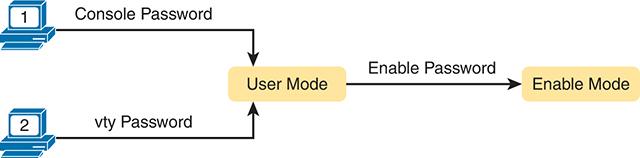
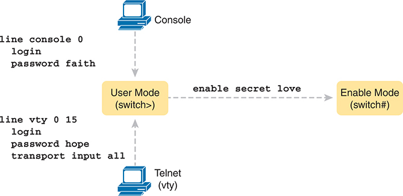
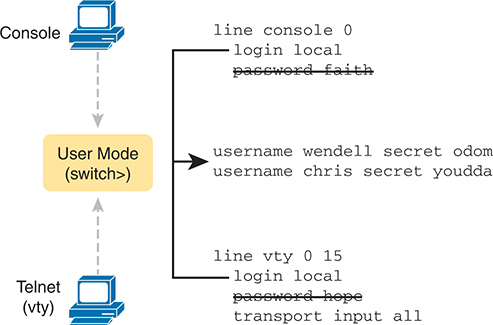
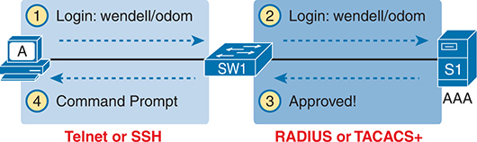
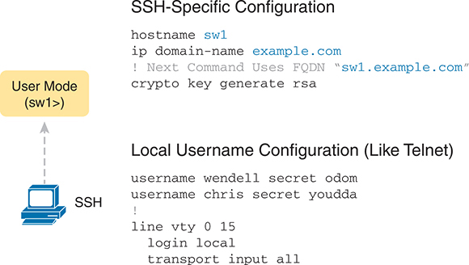
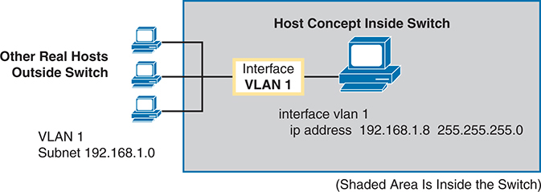
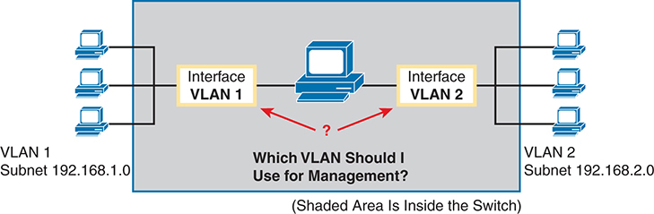
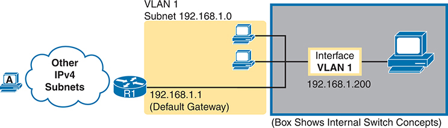

# Chapter 6


## Configuring Basic Switch Management

This chapter covers the following exam topics:

1.0 Network Fundamentals

1.6 Configure and verify IPv4 addressing and subnetting

2.0 Network Access

2.8 Describe network device management access (Telnet, SSH, HTTP, HTTPS, console, RADIUS/TACACS+)

4.0 IP Services

4.6 Configure and verify DHCP client and relay

4.8 Configure network devices for remote access using SSH

5.0 Security Fundamentals

5.3 Configure device access control using local passwords

The tasks of a switch fall into a small set of categories called planes. The data plane includes the process of forwarding frames received by the switch. The control plane refers to the processes that control and change the switch's data plane. The control plane includes configuration to enable or disable an interface, to control the speed used by each interface, and the dynamic processes of Spanning Tree to block some ports to prevent loops, and so on. The third plane, the management plane, refers to device management features. Those include Telnet and SSH, used to connect to the CLI, and other management features.

This chapter discusses the most basic management plane features in a Cisco switch. The first section of the chapter discusses configuring different kinds of login security for console, Telnet, and SSH users. The second section shows how to enable remote switch management by configuring switch IPv4 settings. The last section then explains a few practical matters that can make your life in the lab a little easier.

### "Do I Know This Already?" Quiz

Take the quiz (either here or use the PTP software) if you want to use the score to help you decide how much time to spend on this chapter. The letter answers are listed at the bottom of the page following the quiz. [Appendix C](vol1_appc.md#appc), found both at the end of the book as well as on the companion website, includes both the answers and explanations. You can also find both answers and explanations in the PTP testing software.


**Table 6-1** "Do I Know This Already?" Foundation Topics Section-to-Question Mapping

| Foundation Topics Section | Questions |
| --- | --- |
| Securing the Switch CLI | 1-3 |
| Enabling IPv4 for Remote Access | 4-5 |
| Miscellaneous Settings Useful in the Lab | 6 |

**[1](vol1_ch06.md#ques6_1a).** Imagine that you have configured the **enable secret** command, followed by the **enable password** command, from the console. You log out of the switch and log back in at the console. Which command defines the password that you had to enter to access privileged mode?

1. **enable password**
2. **enable secret**
3. Neither
4. The **password** command, if it is configured

**[2](vol1_ch06.md#ques6_2a).** An engineer wants to set up simple password protection with no usernames for some switches in a lab, for the purpose of keeping curious coworkers from logging in to the lab switches from their desktop PCs. Which of the following commands would be a useful part of that configuration?

1. A **login** vty mode subcommand
2. A **password** *password* console subcommand
3. A **login local** vty subcommand
4. A **transport input ssh** vty subcommand

**[3](vol1_ch06.md#ques6_3a).** An engineer had formerly configured a Cisco 2960 switch to allow Telnet access so that the switch expected a password of **mypassword** from the Telnet user. The engineer then changed the configuration to support Secure Shell. Which of the following commands could have been part of the new configuration? (Choose two answers.)

1. A **username** *name* **secret** *password* vty mode subcommand
2. A **username** *name* **secret** *password* global configuration command
3. A **login local** vty mode subcommand
4. A **transport input ssh** global configuration command

**[4](vol1_ch06.md#ques6_4a).** An engineer's desktop PC connects to a switch at the main site. A router at the main site connects to each branch office through a serial link, with one small router and switch at each branch. Which of the following commands must be configured on the branch office switches, in the listed configuration mode, to allow the engineer to telnet to the branch office switches and supply only a password to log in? (Choose three answers.)

1. The **ip address** command in interface configuration mode
2. The **ip address** command in global configuration mode
3. The **ip default-gateway** command in VLAN configuration mode
4. The **ip default-gateway** command in global configuration mode
5. The **password** command in console line configuration mode
6. The **password** command in vty line configuration mode

**[5](vol1_ch06.md#ques6_5a).** A Layer 2 switch configuration places all its physical ports into VLAN 2. An attached router uses address/mask 172.16.2.254/24. The IP address plan calls for the switch to use address/mask 172.16.2.250/24 and to use the router as its default gateway. The switch needs to support SSH connections into the switch from any subnet in the network. Which of the following commands are part of the required configuration in this case? (Choose two answers.)

1. The **ip address 172.16.2.250 255.255.255.0** command in interface vlan 1 configuration mode.
2. The **ip address 172.16.2.250 255.255.255.0** command in interface vlan 2 configuration mode.
3. The **ip default-gateway 172.16.2.254** command in global configuration mode.
4. The switch cannot support SSH because all its ports connect to VLAN 2, and the IP address must be configured on interface VLAN 1.

**[6](vol1_ch06.md#ques6_6a).** Which of the following line subcommands tells a switch to wait until a show command's output has completed before displaying log messages on the screen?

1. **logging synchronous**
2. **no ip domain-lookup**
3. **exec-timeout 0 0**
4. **history size 15**

Answers to the "Do I Know This Already?" quiz:

**[1](vol1_appc.md#ques6_1)** B

**[2](vol1_appc.md#ques6_2)** A

**[3](vol1_appc.md#ques6_3)** B, C

**[4](vol1_appc.md#ques6_4)** A, D, F

**[5](vol1_appc.md#ques6_5)** B, C

**[6](vol1_appc.md#ques6_6)** A

### Foundation Topics

### Securing the Switch CLI

By default, a user can connect to the console and reach [enable mode](vol1_gloss.md#gloss_120) with no security checks and no passwords required. In contrast, the default settings disallow all [Telnet](vol1_gloss.md#gloss_405) and [Secure Shell (SSH)](vol1_gloss.md#gloss_360) users from even seeing a login prompt. Those defaults make sense, given that if you can get to the console port of the switch, you already have control over the switch physically. But clearly, protecting the console makes sense, as does opening up SSH and Telnet access to appropriate users.

This first topic in the chapter examines how to configure login security for a Cisco Catalyst switch. Securing the CLI includes protecting access to enable mode, because from enable mode, an attacker could reload the switch or change the configuration. Protecting user mode is also important, because attackers can see the status of the switch, learn about the network, and find new ways to attack the network.

In particular, this section covers the following login security topics:

* Securing user mode and privileged mode with simple passwords
* Securing user mode access with local usernames
* Securing user mode access with external authentication servers
* Securing remote access with Secure Shell (SSH)

Note that all remote management protocols, like Telnet and SSH, require IP configuration on the switch, which is not discussed until the second major section of this chapter, "[Enabling IPv4 for Remote Access](vol1_ch06.md#ch06lev1sec4)."

#### Securing User Mode and Privileged Mode with Simple Passwords

The defaults work great for a brand new switch, but in production, you will want to secure access through the console as well as enable remote login via Telnet and/or SSH so you can sit at your desk and log in to all the switches in the LAN. Keep in mind, however, that you should not open the switch for just anyone to log in and change the configuration, so some type of secure login should be used.

Most people use a simple shared password for access to lab gear. This method uses a password only--with no username--with one password for console users and a different password for Telnet users. Console users must supply the *console password*, as configured in console line configuration mode. Telnet users must supply the *Telnet password*, also called the vty password, so called because the configuration sits in vty line configuration mode. [Figure 6-1](vol1_ch06.md#ch06fig01) summarizes these options for using shared passwords from the perspective of the user logging in to the switch.




**Figure 6-1** *Simple Password Security Concepts*

Note

This section refers to several passwords as *shared* passwords. Users share these passwords in that all users must know and use that same password. In other words, each user does not have a unique username/password to use, but rather, all the appropriate staff knows and uses the same password.

In addition, Cisco switches protect enable mode (also called privileged mode) with yet another shared password called the *enable password*. From the perspective of the network engineer connecting to the CLI of the switch, once in user mode, the user types the **enable** EXEC command. This command prompts the user for this enable password; if the user types the correct password, IOS moves the user to enable mode.

[Example 6-1](vol1_ch06.md#exa6_1) shows an example of the user experience of logging in to a switch from the console when the shared console password and the shared enable password have both been set. Note that before this example began, the user started the terminal emulator, physically connected a laptop to the console cable, and then pressed the Enter key to make the switch respond as shown at the top of the example.

**Example 6-1** *Console Login and Movement to Enable Mode*

[Click here to view code image](vol1_ch06_images.md#f0136-01)

```
(User now presses enter to start the process. This line of text does not appear.)

User Access Verification

Password: faith
Switch> enable
Password: love
Switch#
```

Note that the example shows the password text as if typed (faith and love), along with the **enable** command that moves the user from user mode to enable mode. In reality, the switch hides the passwords when typed, to prevent someone from reading over your shoulder to see the passwords.

To configure the shared passwords for the console, Telnet, and for enable mode, you need to configure several commands. However, the parameters of the commands can be pretty intuitive. [Figure 6-2](vol1_ch06.md#ch06fig02) shows the configuration of all three of these passwords.




**Figure 6-2** *Simple Password Security Configuration*

In the console, the command "console 0 login password faith" sets the login password for console line 0 to "faith." In the Telnet (v t y) configuration, the command "v t y 0 15 login password hope transport input all" establishes the login password "hope" for Telnet lines 0 to 15, allowing all transport input methods. In User Mode (switch right angle bracket), the command "enable secret love" sets the secret password to "love" for entering Enable Mode, indicated by the prompt (switch hash symbol).

The configuration for these three passwords does not require a lot of work. First, the console and vty password configuration sets the password based on the context: console mode for the console (**line con 0**), and vty line configuration mode for the Telnet password (**line vty 0 15**). Then inside console mode and vty mode, respectively, the two commands in each mode are as follows:

**password** *password-value***:** Defines the actual password used on the console or vty

**login:** Tells IOS to enable the use of a simple shared password (with no username) on this line (console or vty), so that the switch asks the user for a password

The configured enable password, shown on the right side of the figure, applies to all users, no matter whether they connect to user mode via the console, Telnet, or otherwise. The command to configure the enable password is a global configuration command: **enable secret** *password-value*.

Note

Older IOS versions used the command **enable password** *password-value* to set the enable password, and that command still exists in IOS. However, the **enable secret** command is much more secure. In real networks, use **enable secret**. [Chapter 10](vol1_ch10.md#ch10), "[Securing Network Devices](vol1_ch10.md#ch10)," in the *CCNA 200-301 Official Cert Guide*, *Volume 2*, Second Edition, explains more about the security levels of various password mechanisms, including a comparison of the **enable secret** and **enable password** commands.

To help you follow the process, and for easier study later, use the configuration checklist before the example. The configuration checklist collects the required and optional steps to configure a feature as described in this book. The configuration checklist for shared passwords for the console, Telnet, and enable passwords is


Step 1. Configure the enable password with the **enable secret** *password-value* command.

Step 2. Configure the console password:

1. Use the **line con 0** command to enter console configuration mode.
2. Use the **password** *password-value* subcommand to set the value of the console password.
3. Use the **login** subcommand to enable console password security using a simple password.

Step 3. Configure the Telnet (vty) password:

1. Use the **line vty 0 15** command to enter vty configuration mode for all 16 vty lines (numbered 0 through 15).
2. Use the **password** *password-value* subcommand to set the value of the vty password.
3. Use the **login** subcommand to enable console password security using a simple password.
4. Use the **transport input all** subcommand (or similar) to enable Telnet as an input protocol for the vty lines.

Note

The section "[Securing Remote Access with Secure Shell](vol1_ch06.md#ch06lev2sec4)," later in this chapter, provides more detail about the **transport input** subcommand.

[Example 6-2](vol1_ch06.md#exa6_2) shows the configuration process as noted in the configuration checklist, along with setting the enable secret password. Note that the lines which begin with a ! are comment lines; they are there to guide you through the configuration.

[Example 6-3](vol1_ch06.md#exa6_3) shows the resulting configuration in the switch per the **show running-config** command. The gray lines highlight the new configuration. Note that many unrelated lines of output have been deleted from the output to keep focused on the password configuration.


**Example 6-2** *Configuring Basic Passwords*

[Click here to view code image](vol1_ch06_images.md#f0138-01)

```
! Enter global configuration mode and set the enable password.
!
Switch# configure terminal
Switch(config)# enable secret love
!
! At Step 2 in the checklist, enter console configuration mode, set the
! password value to "faith" and enable simple passwords for the console.
! The exit command moves the user back to global config mode.
!
Switch#(config)# line console 0
Switch#(config-line)# password faith
Switch#(config-line)# login
Switch#(config-line)# exit
!
! The next few lines do basically the same configuration, except it is
! for the vty lines. Telnet users will use "hope" to login.
!
Switch#(config)# line vty 0 15
Switch#(config-line)# password hope
Switch#(config-line)# login
Switch#(config-line)# transport input all
Switch#(config-line)# end
Switch#
```

**Example 6-3** *Resulting Running-Config File (Subset) per [Example 6-2](vol1_ch06.md#exa6_2) Configuration*

[Click here to view code image](vol1_ch06_images.md#f0138-02)

```
Switch# show running-config
!
Building configuration...

Current configuration: 1333 bytes
!
version 12.2
!
enable secret 5 $1$OwtI$A58c2XgqWyDNeDnv51mNR.
!
interface FastEthernet0/1
!
interface FastEthernet0/2
!
! Several lines have been omitted here - in particular, lines for
! FastEthernet interfaces 0/3 through 0/23.
!
interface FastEthernet0/24
!
interface GigabitEthernet0/1
!
interface GigabitEthernet0/2
!
line con 0
 password faith
login
!
line vty 0 4
 password hope
 login
 transport input all
!
line vty 5 15
 password hope
 login
 transport input all
```

Note

For historical reasons, the output of the **show running-config** command, in the last six lines of [Example 6-3](vol1_ch06.md#exa6_3), separates the first five vty lines (0 through 4) from the rest (5 through 15).

#### Securing User Mode Access with Local Usernames and Passwords

Cisco switches support two other login security methods that both use per-user username/password pairs instead of a shared password with no username. One method, referred to as [local usernames](vol1_gloss.md#gloss_244) and passwords, configures the username/password pairs locally--that is, in the switch's configuration. Switches support this local username/password option for the console, for Telnet, and even for SSH, but do not replace the enable password used to reach enable mode.

The configuration to migrate from using the simple shared passwords to instead using local usernames/passwords requires only some small configuration changes, as shown in [Figure 6-3](vol1_ch06.md#ch06fig03).




**Figure 6-3** *Configuring Switches to Use Local Username Login Authentication*

In the console, the command "console 0 login password faith" sets the login password for console line 0 to "faith." The password is removed. In the Telnet (v t y) configuration, the command "v t y 0 15 login password hope transport input all" establishes the login password "hope" for Telnet lines 0 to 15. The password is removed. This leads to the user mode. In User Mode (switch right angle bracket), the usernames are assigned to Wendell secret Odom and Chris secret youdda.

Working through the configuration in the figure, first, the switch of course needs to know the list of username/password pairs. To create these, repeatedly use the **username** *name* **secret** *password* global configuration command. Then, to enable this different type of console or Telnet security, simply enable this login security method with the **login local** line. Basically, this command means "use the local list of usernames for login." You can also use the **no password** command (without even typing in the password) to clean up any remaining password subcommands from console or vty mode because these commands are not needed when using local usernames and passwords.

The following checklist details the commands to configure local username login, mainly as a method for easier study and review:


Step 1. Use the **username** *name* **secret** *password* global configuration command to add one or more username/password pairs on the local switch.

Step 2. Configure the console to use locally configured username/password pairs:

1. Use the **line con 0** command to enter console configuration mode.
2. Use the **login local** subcommand to enable the console to prompt for both username and password, checked versus the list of local usernames/passwords.
3. (Optional) Use the **no password** subcommand to remove any existing simple shared passwords, just for good housekeeping of the configuration file.

Step 3. Configure Telnet (vty) to use locally configured username/password pairs.

1. Use the **line vty 0 15** command to enter vty configuration mode for all 16 vty lines (numbered 0 through 15).
2. Use the **login local** subcommand to enable the switch to prompt for both username and password for all inbound Telnet users, checked versus the list of local usernames/passwords.
3. (Optional) Use the **no password** subcommand to remove any existing simple shared passwords, just for good housekeeping of the configuration file.
4. Use the **transport input all** subcommand (or similar) to enable Telnet as an input protocol for the vty lines.

When a Telnet user connects to the switch configured as shown in [Figure 6-3](vol1_ch06.md#ch06fig03), the user will be prompted first for a username and then for a password, as shown in [Example 6-4](vol1_ch06.md#exa6_4). The username/password pair must be from the list of local usernames; otherwise, the login is rejected.

**Example 6-4** *Telnet Login Process After Applying Configuration in [Figure 6-3](vol1_ch06.md#ch06fig03)*

[Click here to view code image](vol1_ch06_images.md#f0140-01)

```
SW2# telnet 10.9.9.19
Trying 10.9.9.19 ... Open


User Access Verification

Username: wendell
Password:
SW1> enable
Password:
SW1# configure terminal
Enter configuration commands, one per line. End with CNTL/Z.
SW1(config)#^Z
SW1#
*Mar 1 02:00:56.229: %SYS-5-CONFIG_I: Configured from console by wendell on vty0 
(10.9.9.19)
```

Note

For historical reasons, the output of the **show running-config** command, in the last six lines of [Example 6-3](vol1_ch06.md#exa6_3), separates the first five vty lines (0 through 4) from the rest (5 through 15).

#### Securing User Mode Access with External Authentication Servers

The end of [Example 6-4](vol1_ch06.md#exa6_4) points out one of the many security improvements when requiring each user to log in with their own username. The end of the example shows the user entering configuration mode (**configure terminal**) and then immediately leaving (**end**). Note that when a user exits configuration mode, the switch generates a [log message](vol1_gloss.md#gloss_255). If the user logged in with a username, the log message identifies that username; note the "wendell" in the log message.

However, using a username/password configured directly on the switch causes some administrative headaches. For instance, every switch and router needs the configuration for all users who might need to log in to the devices. Then, when any changes need to happen, like an occasional change to the passwords for good security practices, the configuration of all devices must be changed.

A better option would be to use tools like those used for many other IT login functions. Those tools allow for a central place to securely store all username/password pairs, with tools to make users change their passwords regularly, tools to revoke users when they leave their current jobs, and so on.

Cisco switches allow exactly that option using an external server called an authentication, authorization, and accounting ([AAA](vol1_gloss.md#gloss_008)) server. These servers hold the usernames/passwords. Typically, these servers allow users to do self-service and forced maintenance to their passwords. Many production networks use AAA servers for their switches and routers today.

The underlying login process requires some additional work on the part of the switch for each user login, but once set up, the username/password administration is much less. When an [AAA server](vol1_gloss.md#gloss_009) is used for authentication, the switch (or router) simply sends a message to the AAA server asking whether the username and password are allowed, and the AAA server replies. [Figure 6-4](vol1_ch06.md#ch06fig04) shows an example, with the user first supplying a username/password, the switch asking the AAA server, and the server replying to the switch stating that the username/password is valid.





**Figure 6-4** *Basic Authentication Process with an External AAA Server*

Step 1 involves logging in with the username "Wendell" and password "Odom" on device S W 1 through Telnet or Secure Shell (S S H). Step 2 repeats the login process on device S 1 with A A A. Step 3 indicates approval from the A A A server. Step 4 shows the command prompt. Steps 1 and 4 occur within the Telnet or S S H protocol, while steps 2 and 3 involve the Remote Authentication Dial-In User Service (R A D I U S) or Terminal Access Controller Access-Control System Plus (T A C A C S plus).

While the figure shows the general idea, note that the information flows with a couple of different protocols. On the left, the connection between the user and the switch or router uses Telnet or SSH. On the right, the switch and AAA server typically use either the RADIUS or TACACS+ protocol, both of which encrypt the passwords as they traverse the network.

#### Securing Remote Access with Secure Shell

So far, this chapter has focused on the console and on Telnet, mostly ignoring SSH. Telnet has one serious disadvantage: all data in the Telnet session flows as clear text, including the password exchanges. So, anyone who can capture the messages between the user and the switch (in what is called a man-in-the-middle attack) can see the passwords. SSH encrypts all data transmitted between the SSH client and server, protecting the data and passwords.

SSH can use the same local login authentication method as Telnet, with the locally configured username and password. (SSH cannot rely on authentication methods that do not include a username, like shared passwords.) So, the configuration to support local usernames for Telnet, as shown previously in [Figure 6-3](vol1_ch06.md#ch06fig03), also enables local username authentication for incoming SSH connections.

[Figure 6-5](vol1_ch06.md#ch06fig05) shows one example configuration of what is required to support SSH. The figure repeats the local username configuration as shown earlier in [Figure 6-3](vol1_ch06.md#ch06fig03), as used for Telnet. [Figure 6-5](vol1_ch06.md#ch06fig05) shows three additional commands required to complete the configuration of SSH on the switch.





**Figure 6-5** *Adding SSH Configuration to Local Username Configuration*

In the S S H section, local username configurations similar to Telnet are provided: "Wendell" with the secret password "Odom" and "Chris" with the secret password "youda". Following the username configurations, the VTY lines from 0 to 15 are configured to utilize local authentication and allow all transport inputs. In user mode (s w 1), S S H-specific configurations include setting the hostname as "s w 1", defining the domain name as "example.com", and generating a Rivest-Shamir-Adleman (R S A) cryptographic key using the fully qualified domain name (F Q D N) "s w 1 dot example dot com".

IOS uses the three SSH-specific configuration commands in the figure to create the SSH encryption keys. The SSH server uses the fully qualified domain name (FQDN) of the switch as input to create that key. The switch creates the FQDN from the hostname and domain name of the switch. [Figure 6-5](vol1_ch06.md#ch06fig05) begins by setting both values (just in case they are not already configured). Then the third command, the **crypto key generate rsa** command, generates the SSH encryption keys.

Seeing the configuration happen in configuration mode, step by step, can be particularly helpful with SSH configuration. Note in particular that in this example, the **crypto key** command prompts the user for the key modulus; you could also add the parameters **modulus** *modulus-value* to the end of the **crypto key** command to add this setting on the command. [Example 6-5](vol1_ch06.md#exa6_5) shows the commands in [Figure 6-5](vol1_ch06.md#ch06fig05) being configured, with the encryption key as the final step.

**Example 6-5** *SSH Configuration Process to Match [Figure 6-5](vol1_ch06.md#ch06fig05)*

[Click here to view code image](vol1_ch06_images.md#f0143-01)

```
SW1# configure terminal
Enter configuration commands, one per line. End with CNTL/Z.
!
! Step 1 next. The hostname is already set, but it is repeated just
! to be obvious about the steps.
!
SW1(config)# hostname SW1
SW1(config)# ip domain name example.com
SW1(config)# crypto key generate rsa
The name for the keys will be: SW1.example.com

Choose the size of the key modulus in the range of 512 to 2048 for your
  General Purpose Keys. Choosing a key modulus greater than 512 may take 
  a few minutes.

How many bits in the modulus [1024]: 1024
% Generating 1024 bit RSA keys, keys will be non-exportable...
[OK] (elapsed time was 4 seconds)
SW1(config)#
!
! Optionally, set the SSH version to version 2 (only) - preferred
!
SW1(config)# ip ssh version 2
!
! Next, configure the vty lines for local username support, just like
! with Telnet
!
SW1(config)# line vty 0 15
SW1(config-line)# login local
SW1(config-line)# transport input all
SW1(config-line)# exit
!
! Define the local usernames, just like with Telnet
!
SW1(config)# username wendell secret odom
SW1(config)# username chris secret youdaman
SW1(config)# ^Z
SW1#
```

Note

Older IOS versions used the syntax **ip domain-name** *domain-name* rather than the newer **ip domain name** *domain-name* (with a space instead of a dash.)

Both the Telnet and SSH examples throughout this chapter so far list the **transport input all** subcommand in vty configuration mode. The **transport input** command identifies the protocols allowed in the vty ports, with the **all** keyword including SSH and Telnet. Using **transport input all** lets you support everything when getting started learning, but for production devices you might want to instead choose some different options, like not supporting Telnet at all due to its poor security. Some common options include

**transport input all** or **transport input telnet ssh:** Support both Telnet and SSH

**transport input none:** Support neither

**transport input telnet:** Support only Telnet

**transport input ssh:** Support only SSH

Over the years, the default settings for this command have varied a bit based on device type, OS, and OS version. As a result, for production devices, it makes sense to pick the setting you want and configure it, rather than relying on your memory of a default setting for a particular device and software version. For instance, many companies prefer to disable any possibility of Telnet access, but allow SSH, using **transport input ssh**.

For the exams, be ready to look for the **transport input** setting to ensure it supports SSH, or Telnet, or both, depending on the scenario. As a strategy for the exam, look for the command to confirm its settings when looking at any Telnet or SSH configuration. Also, be aware of the traditional defaults: Many older switches defaulted to **transport input all**, while older routers defaulted to **transport input none**, with more recent Cisco switches and routers now defaulting to the more-secure **transport input ssh**.

To complete this section about SSH, the following configuration checklist details the steps for one method to configure a Cisco switch to support SSH using local usernames. (SSH support in IOS can be configured in several ways; this checklist shows one simple way to configure it.) The process shown here ends with a comment to configure local username support on vty lines, as was discussed earlier in the section titled "[Securing User Mode Access with Local Usernames and Passwords](vol1_ch06.md#ch06lev2sec2)."


Step 1. Configure the switch to generate a matched public and private key pair to use for encryption:

1. If not already configured, use the **hostname** *name* in global configuration mode to configure a hostname for this switch.
2. If not already configured, use the **ip domain name** *name* in global configuration mode to configure a domain name for the switch, completing the switch's FQDN.
3. Use the **crypto key generate rsa** command in global configuration mode (or the **crypto key generate rsa modulus** *modulus-value* command to avoid being prompted for the key modulus) to generate the keys. (Use at least a 768-bit key to support SSH version 2.)

Step 2. (Optional) Use the **ip ssh version 2** command in global configuration mode to override the default of supporting both versions 1 and 2, so that only SSHv2 connections are allowed.

Step 3. (Optional) If not already configured with the setting you want, configure the vty lines to accept SSH and whether to also allow Telnet:

1. Use the **transport input ssh** command in vty line configuration mode to allow SSH only.
2. Use the **transport input all** command or **transport input telnet ssh** command in vty line configuration mode to allow both SSH and Telnet.

Step 4. Use various commands in vty line configuration mode to configure local username login authentication as discussed earlier in this chapter.

Two key commands give some information about the status of SSH on the switch. First, the **show ip ssh** command lists status information about the SSH server itself. The **show ssh** command then lists information about each SSH client currently connected to the switch. [Example 6-6](vol1_ch06.md#exa6_6) shows samples of each, with user wendell currently connected to the switch.

**Example 6-6** *Displaying SSH Status*

[Click here to view code image](vol1_ch06_images.md#f0145-01)

```
SW1# show ip ssh
SSH Enabled - version 2.0
Authentication timeout: 120 secs; Authentication retries: 3

SW1# show ssh
Connection Version Mode  Encryption    Hmac             State               Username
0          2.0     IN    aes126-cbc    hmac-sha1        Session started     wendell
0          2.0     OUT   aes126-cbc    hmac-sha1        Session started     wendell
%No SSHv1 server connections running.
```

#### Enabling and Securing the WebUI

The section "[Accessing the CLI with the WebUI](vol1_ch04.md#ch04lev3sec5)" in [Chapter 4](vol1_ch04.md#ch04) shows examples of the WebUI user interface but does not discuss any configurations. Next, you will discover how to configure the most common settings to support this feature and to secure it using a **username** command--but with a new twist.

The HTTP server, the WebUI, has a long history as an integrated IOS feature in switches and routers. Over time, Cisco changed the user interface and some configuration commands. So, rather than focus on the trivial matters, focus on these steps that would be a common-sense configuration in a switch (or router) today:

* Use the **no ip http server** global command to disable the HTTP server (port 80) (traditionally enabled by default).
* Use the **ip http secure-server** global command to enable the HTTPS server (port 443, uses TLS) (traditionally enabled by default).
* Use the **ip http authentication local** global command to define the authentication method to use locally defined usernames (traditionally defaults to use the enable password).
* Use the **username** *name* **priority 15 password** *pass-value* global command to define one or more usernames with privilege level 15.

Talking through the items in the list, IOS has long used defaults that enable both the HTTP and HTTPS servers. With both enabled, users can connect from browsers by typing URLs that begin http:// (therefore not encrypting the traffic) or https:// (therefore encrypting the traffic). For better security, Cisco recommends disabling the HTTP server.

The HTTP server has long allowed three options to log in to a device from a web browser:

* Using the enable password
* Using a local username/password
* Using the AAA settings on the device

More recent IOS versions move away from the **enable** option. Also, using both a username and a password makes more sense from a security perspective.

To access all the features of the HTTP server (the WebUI), when using local usernames for authentication, you must configure a privilege level of 15 for the user. IOS internally defines user privilege levels, by default creating two levels, 0 and 15. IOS assigns user mode to level 0 and privileged mode (enable mode) to level 15. When CLI users move from user mode to enable mode, they improve their priority level from 0 to 15.

For the WebUI, if you log in using a username with the **privilege 15** option, you receive access to all WebUI features, including the ability to use the CLI configuration mode, install new software, erase the configuration, and reload the router. So, the **username** *name* **priority 15 password** *pass-value* global command creates a way to enter privileged mode immediately. (If you omit the **priority 15** option and log in to the WebUI with that username you can log in, but you cannot do advanced features, including using the CLI to configure or verify a feature.)

### Enabling IPv4 for Remote Access

To allow Telnet, SSH, or WebUI access to the switch, and to allow other IP-based management protocols (for example, Simple Network Management Protocol, or SNMP) to function as intended, the switch needs an IP address, as well as a few other related settings. The IP address has nothing to do with how switches forward Ethernet frames; it simply exists to support overhead management traffic (control plane traffic).

This next topic begins by explaining the IPv4 settings needed on a switch, followed by the configuration. Note that although switches can be configured with IPv6 addresses with commands similar to those shown in this chapter, this chapter focuses solely on IPv4. All references to IP in this chapter imply IPv4.

#### Host and Switch IP Settings

A switch needs the same kind of IP settings as a PC with a single Ethernet interface. For perspective, a PC has a CPU, with the operating system running on the CPU. It has an Ethernet network interface card (NIC). The OS configuration includes an IP address associated with the NIC, either configured or learned dynamically with Dynamic Host Configuration Protocol (DHCP).

A switch uses the same ideas, except that the switch needs to use a virtual NIC inside the switch. Like a PC, a switch has a real CPU, running an OS (called IOS). The switch obviously has lots of Ethernet ports, but instead of assigning its management IP address to any of those ports, the switch then uses a NIC-like concept called a switch virtual interface (SVI), or more commonly, a [VLAN interface](vol1_gloss.md#gloss_434), that acts like the switch's own NIC. Then the settings on the switch look something like a host, with the switch configuration assigning IP settings, like an IP address, to this VLAN interface, as shown in [Figure 6-6](vol1_ch06.md#ch06fig06).




**Figure 6-6** *Switch Virtual Interface (SVI) Concept Inside a Switch*

Three real hosts are depicted outside the switch, connected to Interface Virtual Local Area Network (V L A N) 1. V L A N 1 is configured with the subnet 192.168.1.0. The switch's S V I for V L A N 1 is assigned the I P address 192.168.1.8 with a subnet mask of 255.255.255.0. The hosts are connected to the host concept through the interface V L A N 1.

By using interface VLAN 1 for the IP configuration, the switch can then send and receive frames on any of the ports in VLAN 1. In a Cisco switch, by default, all ports are assigned to VLAN 1.

In most networks, switches configure many VLANs, so the network engineer has a choice of where to configure the IP address. That is, the management IP address does not have to be configured on the VLAN 1 interface (as configured with the **interface vlan 1** command seen in [Figure 6-6](vol1_ch06.md#ch06fig06)).

A Layer 2 Cisco LAN switch needs only one IP address for management purposes. However, you can choose to use any VLAN to which the switch connects. The configuration then includes a VLAN interface for that VLAN number, with an appropriate IP address.

For example, [Figure 6-7](vol1_ch06.md#ch06fig07) shows a Layer 2 switch with some physical ports in two different VLANs (VLANs 1 and 2). The figure also shows the subnets used on those VLANs. The network engineer could choose to use either

* Interface VLAN 1, with an IP address in subnet 192.168.1.0
* Interface VLAN 2, with an IP address in subnet 192.168.2.0





**Figure 6-7** *Choosing One VLAN on Which to Configure a Switch IP Address*

Three real hosts are depicted outside the switch, connected to Interface Virtual Local Area Network (V L A N) 1. V L A N 1 is configured with the subnet 192.168.1.0. Three more real hosts are depicted outside the switch, connected to Interface Virtual Local Area Network (V L A N) 2. V L A N 2 is configured with the subnet 192.168.2.0. The switch's S V I raises the following question "Which V L A N Should I Use for Management?"

Note that you should not try to use a VLAN interface for which there are no physical ports assigned to the same VLAN. If you do, the VLAN interface will not reach an up/up state, and the switch will not have the physical ability to communicate outside the switch.

Note

Some Cisco switches can be configured to act as either a Layer 2 switch or a Layer 3 switch. When acting as a Layer 2 switch, a switch forwards Ethernet frames as discussed in depth in [Chapter 5](vol1_ch05.md#ch05), "[Analyzing Ethernet LAN Switching](vol1_ch05.md#ch05)." Alternatively, a switch can also act as a *multilayer switch* or *Layer 3 switch*, which means the switch can do both Layer 2 switching and Layer 3 IP routing of IP packets, using the Layer 3 logic normally used by routers. This chapter assumes all switches are Layer 2 switches. [Chapter 18](vol1_ch18.md#ch18), "[IP Routing in the LAN](vol1_ch18.md#ch18)," discusses Layer 3 switching in depth along with using multiple VLAN interfaces at the same time.

Configuring the IP address (and mask) on one VLAN interface allows the switch to send and receive IP packets with other hosts in a subnet that exists on that VLAN; however, the switch cannot communicate outside the local subnet without another configuration setting called the [default gateway](vol1_gloss.md#gloss_090). The reason a switch needs a default gateway setting is the same reason that hosts need the same setting--because of how hosts think when sending IP packets. Specifically:

* To send IP packets to hosts in the same subnet, send them directly
* To send IP packets to hosts in a different subnet, send them to the local router; that is, the default gateway

[Figure 6-8](vol1_ch06.md#ch06fig08) shows the ideas. In this case, the switch (on the right) will use IP address 192.168.1.200 as configured on interface VLAN 1. However, to communicate with host A, on the far left of the figure, the switch must use Router R1 (the default gateway) to forward IP packets to host A. To make that work, the switch needs to configure a default gateway setting, pointing to Router R1's IP address (192.168.1.1 in this case). Note that the switch and router both use the same mask, 255.255.255.0, which puts the addresses in the same subnet.





**Figure 6-8** *The Need for a Default Gateway*

User A and other I P v 4 subnets are connected to Router 1 (R 1) with the default gateway I P address 192.168.1.1. The router connects virtual local area network 1. Two users reside in virtual local area network 1 with the subnet 192.168.1.0. The interface virtual local area network 1 is assigned the I P address 192.168.1.200. The virtual local area network 1 resides inside a box that shows the internal switch components.

#### Configuring IPv4 on a Switch

A switch configures its IPv4 address and mask on this special NIC-like *VLAN interface*. The following steps list the commands used to configure IPv4 on a switch, assuming that the IP address is configured to be in VLAN 1, with [Example 6-7](vol1_ch06.md#exa6_7) that follows showing an example configuration.


Step 1. Use the **interface vlan 1** command in global configuration mode to enter interface VLAN 1 configuration mode.

Step 2. Use the **ip address** *ip-address mask* command in interface configuration mode to assign an IP address and mask.

Step 3. Use the **no shutdown** command in interface configuration mode to enable the VLAN 1 interface if it is not already enabled.

Step 4. Add the **ip default-gateway** *ip-address* command in global configuration mode to configure the default gateway.

Step 5. (Optional) Add the **ip name-server** *ip-address1 ip-address2 …* command in global configuration mode to configure the switch to use the Domain Name System ([DNS](vol1_gloss.md#gloss_108)) to resolve names into their matching IP address.

**Example 6-7** *Switch Static IP Address Configuration*

[Click here to view code image](vol1_ch06_images.md#f0149-01)

```
Emma# configure terminal
Emma(config)# interface vlan 1
Emma(config-if)# ip address 192.168.1.200 255.255.255.0
Emma(config-if)# no shutdown
00:25:07: %LINK-3-UPDOWN: Interface Vlan1, changed state to up
00:25:08: %LINEPROTO-5-UPDOWN: Line protocol on Interface Vlan1, changed
 state to up
Emma(config-if)# exit
Emma(config)# ip default-gateway 192.168.1.1
```

On a side note, this example shows a particularly important and common command: the [**no**] **shutdown** command. To administratively enable an interface on a switch, use the **no shutdown** interface subcommand; to disable an interface, use the **shutdown** interface subcommand. This command can be used on the physical Ethernet interfaces that the switch uses to switch Ethernet messages in addition to the VLAN interface shown here in this example.

Also, pause long enough to look at the messages that appear just below the **no shutdown** command in [Example 6-7](vol1_ch06.md#exa6_7). Those messages are syslog messages generated by the switch stating that the switch did indeed enable the interface. Switches (and routers) generate syslog messages in response to a variety of events, and by default, those messages appear at the console. [Chapter 13](vol1_ch13.md#ch13), "[Device Management Protocols](vol1_ch13.md#ch13)," in the *CCNA 200-301 Official Cert Guide, Volume 2*, Second Edition, discusses syslog messages in more detail.

#### Configuring a Switch to Learn Its IP Address with DHCP

The switch can also use Dynamic Host Configuration Protocol (DHCP) to dynamically learn its IPv4 settings. (Typically, engineers do not do so, instead statically configuring switch IP addresses, but this section covers the concept to be complete as compared to the exam topics.) Basically, all you have to do is tell the switch to use DHCP on the interface and enable the interface. Assuming that DHCP works in this network, the switch will learn all its settings. The following list details the steps, again assuming the use of interface VLAN 1, with [Example 6-8](vol1_ch06.md#exa6_8) that follows showing an example:


Step 1. Enter VLAN 1 configuration mode using the **interface vlan 1** global configuration command, and enable the interface using the **no shutdown** command as necessary.

Step 2. Assign an IP address and mask using the **ip address dhcp** interface subcommand.

**Example 6-8** *Switch Dynamic IP Address Configuration with DHCP*

[Click here to view code image](vol1_ch06_images.md#f0150-01)

```
Emma# configure terminal
Enter configuration commands, one per line. End with CNTL/Z.
Emma(config)# interface vlan 1
Emma(config-if)# ip address dhcp
Emma(config-if)# no shutdown
Emma(config-if)# ^Z
Emma#
00:38:20: %LINK-3-UPDOWN: Interface Vlan1, changed state to up
00:38:21: %LINEPROTO-5-UPDOWN: Line protocol on Interface Vlan1, changed state to up
```

#### Verifying IPv4 on a Switch

The switch IPv4 configuration can be checked in several places. First, you can always look at the current configuration using the **show running-config** command. Second, you can look at the IP address and mask information using the **show interfaces vlan** *x* command, which shows detailed status information about the VLAN interface in VLAN *x*. Finally, if using DHCP, use the **show dhcp lease** command to see the (temporarily) leased IP address and other parameters. (Note that the switch does not store the DHCP-learned IP configuration in the running-config file.) [Example 6-9](vol1_ch06.md#exa6_9) shows sample output from these commands to match the configuration in [Example 6-8](vol1_ch06.md#exa6_8).

**Example 6-9** *Verifying DHCP-Learned Information on a Switch*

[Click here to view code image](vol1_ch06_images.md#f0151-01)

```
Emma# show dhcp lease
Temp IP addr: 192.168.1.101   for peer on Interface: Vlan1
Temp sub net mask: 255.255.255.0
   DHCP Lease server: 192.168.1.1, state: 3 Bound
   DHCP transaction id: 1966
   Lease: 86400 secs,  Renewal: 43200 secs,  Rebind: 75600 secs
Temp default-gateway addr: 192.168.1.1
   Next timer fires after: 11:59:45
   Retry count: 0   Client-ID: cisco-0019.e86a.6fc0-Vl1
   Hostname: Emma
Emma# show interfaces vlan 1
Vlan1 is up, line protocol is up
  Hardware is EtherSVI, address is 0019.e86a.6fc0 (bia 0019.e86a.6fc0)
  Internet address is 192.168.1.101/24
  MTU 1500 bytes, BW 1000000 Kbit, DLY 10 usec,
     reliability 255/255, txload 1/255, rxload 1/255
! lines omitted for brevity
Emma# show ip default-gateway
192.168.1.1
```

The output of the **show interfaces vlan 1** command lists two important details related to switch IP addressing. First, this **show** command lists the interface status of the VLAN 1 interface--in this case, "up and up." If the VLAN 1 interface is not up, the switch cannot use its IP address to send and receive management traffic. Notably, if you forget to issue the **no shutdown** command, the VLAN 1 interface remains in its default shutdown state and is listed as "administratively down" in the **show** command output.

Second, note that the output lists the interface's IP address on the third line. If you statically configure the IP address, as in [Example 6-7](vol1_ch06.md#exa6_7), the IP address will always be listed; however, if you use DHCP and DHCP fails, the **show interfaces vlan** *x* command will not list an IP address here. When DHCP works, you can see the IP address with the **show interfaces vlan 1** command, but that output does not remind you whether the address is either statically configured or DHCP leased. So it does take a little extra effort to make sure you know whether the address is statically configured or DHCP-learned on the VLAN interface.

### Miscellaneous Settings Useful in the Lab

This last short section of the chapter touches on a couple of commands that can help you be a little more productive when practicing in a lab.

#### History Buffer Commands

When you enter commands from the CLI, the switch saves the last several commands in the [history buffer](vol1_gloss.md#gloss_169). Then, as mentioned in [Chapter 4](vol1_ch04.md#ch04), "[Using the Command-Line Interface](vol1_ch04.md#ch04)," you can use the up-arrow key or press Ctrl+P to move back in the history buffer to retrieve a command you entered a few commands ago. This feature makes it easy and fast to use a set of commands repeatedly. [Table 6-2](vol1_ch06.md#ch06tab02) lists some of the key commands related to the history buffer.


**Table 6-2** Commands Related to the History Buffer

| Command | Description |
| --- | --- |
| **show history** | An EXEC command that lists the commands currently held in the history buffer. |
| **terminal history size** *x* | From EXEC mode, this command allows a single user to set, just for this one login session, the size of his or her history buffer. |
| **history size** *x* | A configuration command that, from console or vty line configuration mode, sets the default number of commands saved in the history buffer for the users of the console or vty lines, respectively. |

#### The logging synchronous, exec-timeout, and no ip domain-lookup Commands

These next three configuration commands have little in common, other than the fact that they can be useful settings to reduce your frustration when using the console of a switch or router.

The console automatically receives copies of all unsolicited syslog messages on a switch. The idea is that if the switch needs to tell the network administrator some important and possibly urgent information, the administrator might be at the console and might notice the message.

Unfortunately, IOS (by default) displays these syslog messages on the console's screen at any time--including right in the middle of a command you are entering, or in the middle of the output of a **show** command. Having a bunch of text show up unexpectedly can be a bit annoying.

You could simply disable the feature that sends these messages to the console and then re-enable the feature later using the **no logging console** and **logging console** global configuration commands. For example, when working from the console, if you want to temporarily not be bothered by log messages, you can disable the display of these messages with the **no logging console** global configuration command, and then when finished, enable them again.

However, IOS supplies a reasonable compromise, telling the switch to display syslog messages only at more convenient times, such as at the end of output from a **show** command. To do so, just configure the **logging synchronous** console line subcommand, which basically tells IOS to synchronize the syslog message display with the messages requested using **show** commands.

Another way to improve the user experience at the console is to control timeouts of the login session from the console or when using Telnet or SSH. By default, the switch automatically disconnects console and vty (Telnet and SSH) users after 5 minutes of inactivity. The **exec-timeout** *minutes seconds* line subcommand enables you to set the length of that inactivity timer. In the lab (but not in production), you might want to use the special value of 0 minutes and 0 seconds, meaning "never time out."

Finally, IOS has an interesting combination of features that can make you wait for a minute or so when you mistype a command. First, IOS tries to use DNS [name resolution](vol1_gloss.md#gloss_263) on IP hostnames--a generally useful feature. If you mistype a command, however, IOS thinks you want to telnet to a host by that name. With all default settings in the switch, the switch tries to resolve the hostname, cannot find a DNS server, and takes about a minute to time out and give you control of the CLI again.

To avoid this problem, configure the **no ip domain-lookup** global configuration command, which disables IOS's attempt to resolve the hostname into an IP address.

[Example 6-10](vol1_ch06.md#exa6_10) collects all these commands into a single example, as a template for some good settings to add in a lab switch to make you more productive.

**Example 6-10** *Commands Often Used in the Lab to Increase Productivity*

```
no ip domain-lookup
!
line console 0
 exec-timeout 0 0
 logging synchronous
 history size 20
!
line vty 0 15
 exec-timeout 0 0
 logging synchronous
 history size 20
```

### Chapter Review

One key to doing well on the exams is to perform repetitive spaced review sessions. Review this chapter's material using either the tools in the book or interactive tools for the same material found on the book's companion website. Refer to the "[Your Study Plan](vol1_pref10.md#pref10)" element section titled "[Step 2: Build Your Study Habits Around the Chapter](vol1_pref10.md#pref10lev2sec2)" for more details. [Table 6-3](vol1_ch06.md#ch06tab03) outlines the key review elements and where you can find them. To better track your study progress, record when you completed these activities in the second column.

**Table 6-3** Chapter Review Tracking

| Review Element | Review Date(s) | Resource Used |
| --- | --- | --- |
| Review key topics |  | Book, website |
| Review key terms |  | Book, website |
| Answer DIKTA questions |  | Book, PTP |
| Review config checklists |  | Book, website |
| Do labs |  | Sim Lite, blog |
| Review command tables |  | Book |
| Watch video |  | Website |

### Review All the Key Topics


**Table 6-4** Key Topics for [Chapter 6](vol1_ch06.md#ch06)

| Key Topic Element | Description | Page Number |
| --- | --- | --- |
| [Example 6-2](vol1_ch06.md#exa6_2) | Example of configuring password login security (no usernames) | [138](vol1_ch06.md#page_138) |
| [Figure 6-5](vol1_ch06.md#ch06fig05) | SSH configuration commands with related username login security | [142](vol1_ch06.md#page_142) |

### Key Terms You Should Know

[AAA](vol1_ch06.md#key_075)

[AAA server](vol1_ch06.md#key_076)

[default gateway](vol1_ch06.md#key_077)

[DNS](vol1_ch06.md#key_078)

[enable mode](vol1_ch06.md#key_079)

[history buffer](vol1_ch06.md#key_080)

[local username](vol1_ch06.md#key_081)

[log message](vol1_ch06.md#key_082)

[name resolution](vol1_ch06.md#key_083)

[Secure Shell (SSH)](vol1_ch06.md#key_084)

[Telnet](vol1_ch06.md#key_085)

[VLAN interface](vol1_ch06.md#key_086)

### Do Labs

The Sim Lite software is a version of Pearson's full simulator learning product with a subset of the labs, included with this book for free. The subset of labs mostly relates to this chapter. Take the time to try some of the labs. As always, also check the author's blog site pages for configuration exercises (Config Labs) at <https://www.certskills.com>.

### Command References

[Tables 6-5](vol1_ch06.md#ch06tab05), [6-6](vol1_ch06.md#ch06tab06), [6-7](vol1_ch06.md#ch06tab07), and [6-8](vol1_ch06.md#ch06tab08) list configuration and verification commands used in this chapter. As an easy review exercise, cover the left column in a table, read the right column, and try to recall the command without looking. Then repeat the exercise, covering the right column, and try to recall what the command does.

**Table 6-5** Login Security Commands

| Command | Mode/Purpose/Description |
| --- | --- |
| **line console 0** | Changes the context to console configuration mode. |
| **line vty** *1st-vty last-vty* | Changes the context to vty configuration mode for the range of vty lines listed in the command. |
| **login** | Console and vty configuration mode. Tells IOS to prompt for a password. |
| **password** *pass-value* | Console and vty configuration mode. Lists the password required if the **login** command (with no other parameters) is configured. |
| **login local** | Console and vty configuration mode. Tells IOS to prompt for a username and password, to be checked against locally configured **username** global configuration commands on this switch or router. |
| **username** *name* **secret** *pass-value* | Global command. Defines one of possibly multiple usernames and associated passwords, used for user authentication. Used when the **login local** line configuration command has been used. |
| **crypto key generate rsa** [**modulus** *512..2048*] | Global command. Creates and stores (in a hidden location in flash memory) the keys required by SSH. |
| **transport input** {**telnet** | **ssh** | **all** | **none**} | vty line configuration mode. Defines whether Telnet/SSH access is allowed into this switch. Both values can be configured on one command to allow both Telnet and SSH access (the default). |
| **ip domain name** *fqdn* | Global command. Defines the fully-qualified domain name (*fqdn*) for the DNS domain in which the switch or router resides. |
| **hostname** *name* | Global command. Sets the *name* that the device uses for itself, which is also used at the initial text in the command prompt. |
| **ip ssh version 2** | Global command. Sets the SSH server to use only version 2, rather than the default of supporting both versions 1 and 2. |


**Table 6-6** Switch IPv4 Configuration

| Command | Mode/Purpose/Description |
| --- | --- |
| **interface vlan** *number* | Changes the context to VLAN interface mode. For VLAN 1, allows the configuration of the switch's IP address. |
| **ip address** *ip-address subnet-mask* | VLAN interface mode. Statically configures the switch's IP address and mask. |
| **ip address dhcp** | VLAN interface mode. Configures the switch as a DHCP client to discover its IPv4 address, mask, and default gateway. |
| **ip default-gateway** *address* | Global command. Configures the switch's default gateway IPv4 address. Not required if the switch uses DHCP. |
| **ip name-server** *server-ip-1 server-ip-2 …* | Global command. Configures the IPv4 addresses of DNS servers, so any commands when logged in to the switch will use the DNS for name resolution. |


**Table 6-7** Other Switch Configuration

| Command | Mode/Purpose/Description |
| --- | --- |
| **hostname** *name* | Global command. Sets this switch's hostname, which is also used as the first part of the switch's command prompt. |
| **enable secret** *pass-value* | Global command. Sets this switch's password that is required for any user to reach enable mode. |
| **history size** *length* | Line config mode. Defines the number of commands held in the history buffer, for later recall, for users of those lines. |
| **logging synchronous** | Console or vty mode. Tells IOS to send log messages to the user at natural break points between commands rather than in the middle of a line of output. |
| **[no] logging console** | Global command. Disables or enables the display of log messages to the console. |
| **exec-timeout** *minutes* [*seconds*] | Console or vty mode. Sets the inactivity timeout so that after the defined period of no action, IOS closes the current user login session. |
| **no ip domain-lookup** | Global command. Disables the use of the DNS client on the switch. |


**Table 6-8** [Chapter 6](vol1_ch06.md#ch06) EXEC Command Reference

| Command | Purpose |
| --- | --- |
| **show running-config** | Lists the currently used configuration. |
| **show running-config | begin line vty** | Pipes (sends) the command output to the **begin** command, which only lists output beginning with the first line that contains the text "line vty." |
| **show dhcp lease** | Lists any information the switch acquires as a DHCP client. This includes IP address, subnet mask, and default gateway information. |
| **show crypto key mypubkey rsa** | Lists the public and shared key created for use with SSH using the **crypto key generate rsa** global configuration command. |
| **show ip ssh** | Lists status information for the SSH server, including the SSH version. |
| **show ssh** | Lists status information for current SSH connections into and out of the local switch. |
| **show interfaces vlan** *number* | Lists the interface status, the switch's IPv4 address and mask, and much more. |
| **show ip default-gateway** | Lists the switch's setting for its IPv4 default gateway. |
| **terminal history size** *x* | Changes the length of the history buffer for the current user only, only for the current login to the switch. |
| **show history** | Lists the commands in the current history buffer. |