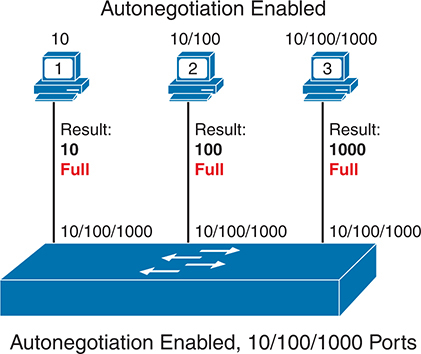
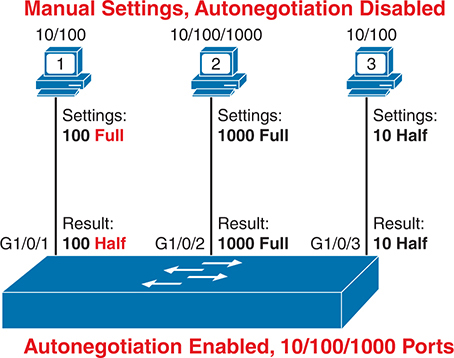
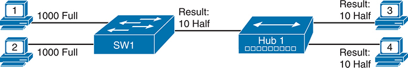
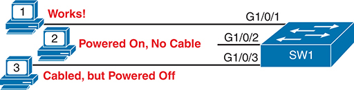
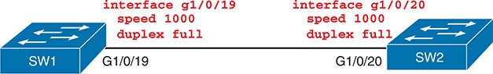
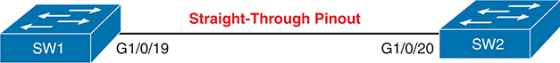
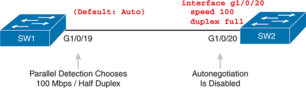

# Chapter 7


## Configuring and Verifying Switch Interfaces

This chapter covers the following exam topics:

1.0 Network Fundamentals

1.1 Explain the role and function of network components

1.1.b Layer 2 and Layer 3 switches

1.3 Compare physical interface and cabling types

1.3.b Connections (Ethernet shared media and point-to-point)

1.4 Identify interface and cable issues (collisions, errors, mismatch duplex, and/or speed)

The chapters in [Part II](vol1_part02.md#part02) of this book move back and forth between switch administration and core switch functions. In [Chapter 4](vol1_ch04.md#ch04), "[Using the Command-Line Interface](vol1_ch04.md#ch04)," you read about the fundamentals of the command-line interface (CLI) and how to use commands that configure and verify switch features. In [Chapter 5](vol1_ch05.md#ch05), "[Analyzing Ethernet LAN Switching](vol1_ch05.md#ch05)," you learned about the primary purpose of a switch--forwarding Ethernet frames--and how to see that process in action by looking at the switch MAC address table. [Chapter 6](vol1_ch06.md#ch06), "[Configuring Basic Switch Management](vol1_ch06.md#ch06)," then moved back to more administrative tasks, where you learned a few management plane features, like how to configure the switch to support Telnet and Secure Shell (SSH) by configuring IP address and login security.

This chapter focuses on more core switch features, specifically how to configure switch interfaces so that they work. The first section shows how to configure switch interfaces to use the correct speed and duplex, primarily by using IEEE autonegotiation. The second section examines some administrative settings on switches, including how to disable and re-enable an interface. The final section then focuses on how to use **show** commands on a switch to verify switch interface status and interpret the output to find some of the more common issues with switch interfaces.

### "Do I Know This Already?" Quiz

Take the quiz (either here or use the PTP software) if you want to use the score to help you decide how much time to spend on this chapter. The letter answers are listed at the bottom of the page following the quiz. [Appendix C](vol1_appc.md#appc), found both at the end of the book and on the companion website, includes answers and explanations. You can also find both answers and explanations in the PTP testing software.


**Table 7-1** "Do I Know This Already?" Foundation Topics Section-to-Question Mapping

| Foundation Topics Section | Questions |
| --- | --- |
| Configuring Switch Interface Speed and Duplex | 1-3 |
| Managing Switch Interface Configuration | 4-5 |
| Analyzing Switch Interface Status and Statistics | 6-8 |

**[1](vol1_ch07.md#ques7_1a).** Switch SW1 connects its G1/0/1 port to PC1. Both devices use IEEE autonegotiation and have 10/100/1000 ports. Which answer describes how the switch chooses its G1/0/1 speed and duplex settings? (Choose two answers.)

1. Speed by comparing capabilities per received autonegotiation messages
2. Speed by analyzing the electrical signal of incoming Ethernet frames from PC1
3. Duplex by comparing capabilities per received autonegotiation messages
4. Duplex by analyzing the electrical signal of incoming Ethernet frames from PC1
5. Duplex by choosing a default based on the chosen speed

**[2](vol1_ch07.md#ques7_2a).** In which of the following modes of the CLI could you configure the duplex setting for interface Fast Ethernet 0/5?

1. User mode
2. Enable mode
3. Global configuration mode
4. VLAN mode
5. Interface configuration mode

**[3](vol1_ch07.md#ques7_3a).** Switch SW1 connects its G1/0/1 port to PC1. Both devices are 10/100/1000 ports. While the switch port uses IEEE autonegotiation, PC1 has disabled it. Which answer describes how the switch chooses its G1/0/1 speed and duplex settings?

1. Speed by comparing capabilities per received autonegotiation messages
2. Speed by analyzing the electrical signal of incoming Ethernet frames from PC1
3. Duplex by comparing capabilities per received autonegotiation messages
4. Duplex by analyzing the electrical signal of incoming Ethernet frames from PC1
5. Duplex by choosing a default based on the chosen speed

**[4](vol1_ch07.md#ques7_4a).** Switch interface G1/0/5 has been cabled correctly in anticipation of some weekend work. However, the engineer needs to prevent the interface from being used until she enables it remotely during a change window this weekend. Which action helps achieve that goal?

1. Unplug the cable.
2. Issue the **shutdown g1/0/5** global configuration command.
3. Issue the **shutdown** interface subcommand under interface **g1/0/5**.
4. Issue the **disable g1/0/5** global configuration command.
5. Issue the **enable** interface subcommand under interface **g1/0/5**.

**[5](vol1_ch07.md#ques7_5a).** An engineer configures Cisco switch SW1 with the commands **interface range G1/0/10-20** and then **description connected to endpoint device**. The engineer exits configuration mode and issues a **show running-config** command. Which answers best describe the related output? (Choose two answers.)

1. The output includes the **interface range** command.
2. The output does not include the **interface range** command.
3. The output lists one **description connected to endpoint device** interface subcommand.
4. The output lists 11 **description connected to endpoint device** interface subcommands.

**[6](vol1_ch07.md#ques7_6a).** The output from the switch command **show interfaces status** shows interface Fa0/1 in a "disabled" state. Which of the following is true about interface Fa0/1? (Choose three answers.)

1. The interface is configured with the **shutdown** command.
2. The **show interfaces fa0/1** command will list the interface with two status codes of administratively down and line protocol down.
3. The **show interfaces fa0/1** command will list the interface with two status codes up and down.
4. The interface cannot currently be used to forward frames.
5. The interface can currently be used to forward frames.

**[7](vol1_ch07.md#ques7_7a).** Switch SW1 Gigabit 1/0/1 connects to switch SW2's Gigabit 1/0/2 interface, both 10/100/1000 ports. The switch SW2 configuration includes the **speed** and **duplex** commands, the combination of which happens to disable autonegotiation on that port. Which combination of settings in SW2's **speed** and **duplex** commands results in a duplex mismatch between SW1 and SW2? (Choose two answers.)

1. **speed 100** and **duplex full**
2. **speed 100** and **duplex half**
3. **speed 10** and **duplex full**
4. **speed 10** and **duplex half**

**[8](vol1_ch07.md#ques7_8a).** Switch SW1 connects via a cable to switch SW2's G1/0/1 port. Which of the following conditions is the most likely to cause SW1's late collision counter to continue to increment?

1. SW2's G1/0/1 has been configured with a **shutdown** interface subcommand.
2. The two switches have been configured with different values on the **speed** interface subcommand.
3. A duplex mismatch exists with SW1 set to full duplex.
4. A duplex mismatch exists with SW1 set to half duplex.

Answers to the "Do I Know This Already?" quiz:

**[1](vol1_appc.md#ques7_1)** A, C

**[2](vol1_appc.md#ques7_2)** E

**[3](vol1_appc.md#ques7_3)** B, E

**[4](vol1_appc.md#ques7_4)** C

**[5](vol1_appc.md#ques7_5)** B, D

**[6](vol1_appc.md#ques7_6)** A, B, D

**[7](vol1_appc.md#ques7_7)** A, C

**[8](vol1_appc.md#ques7_8)** D

### Foundation Topics

### Configuring Switch Interface Speed and Duplex

When physically creating an Ethernet LAN, you must consider the cabling and connectors that match the dozens of physical layer Ethernet standards that help you meet the physical requirements for the LAN. Once chosen and installed, any interfaces connected to fiber cabling require no additional configuration; however, UTP cabling can have different pinouts, and UTP supports different speeds and duplex settings. So once installed, interfaces that use UTP cabling may need additional configuration.

This first major section of the chapter examines interface speed and duplex settings, along with the IEEE autonegotiation process. It also discusses auto-MDIX, a feature that deals with pinout issues. Finally, this entire chapter continues the goal of helping you learn more about CLI navigation and conventions.

#### IEEE Autonegotiation Concepts

Ethernet NICs and switch ports often support multiple standards and therefore support multiple speeds. For instance, you will see designations like these:

[10/100](vol1_gloss.md#gloss_001)**:** A port that supports 10- and 100-Mbps Ethernet

[10/100/1000](vol1_gloss.md#gloss_002)**:** A port that supports 10-, 100-, and 1000-Mbps Ethernet

Using hardware that supports multiple standards and speeds allows for much easier growth and migration over time--mainly because the devices can automatically sense the fastest speed using the IEEE autonegotiation feature. For instance, many switches today have many 10/100/1000 ports. Many newer end-user devices also have a 10/100/1000 Ethernet NIC, so the PC and switch can autonegotiate to 1000 Mbps (1 Gbps). Older devices, and some specialized devices that might not need faster speeds, might support only 10 Mbps or 100 Mbps. [Autonegotiation](vol1_gloss.md#gloss_034) gives the devices on each link the means to agree to use the best speed without manually configuring the speed on each switch port.

IEEE autonegotiation defines a process by which both devices on each link tell the neighboring device their capabilities. Once both endpoints learn about the other, they use the standard with the fastest speed. Autonegotiation also defines [full duplex](vol1_gloss.md#gloss_154) as the preferred option over [half duplex](vol1_gloss.md#gloss_162), assuming both devices support that option.

##### Autonegotiation Under Working Conditions

With IEEE autonegotiation, a device declares its capabilities by sending a series of Fast Link Pulses (FLPs). The data in the FLP messages include bits that identify the Ethernet standards supported by the device and the duplex ability supported, in effect declaring the speeds and duplex settings supported by the device.

The FLPs work even before the endpoints choose a physical layer standard. FLPs use out-of-band electrical signaling, independent of the various physical layer standards for Ethernet frame transmission. Any device that supports autonegotiation supports using these out-of-band FLP messages. The FLPs solve the problem of how the devices can send information to each other even before the link is up and working for normal data transmission.

[Figure 7-1](vol1_ch07.md#ch07fig01) shows three examples of autonegotiation working as intended. First, the company installs cabling that supports 10BASE-T, 100BASE-T, and 1000BASE-T, that is, cabling with four wire pairs of appropriate quality. In the three examples, the PC and switch both use autonegotiation. The cables work with correct straight-through pinouts. The switch, in this case, has all 10/100/1000 ports, while the PC NICs support different options (10 only, 10/100, and 10/100/1000), as per the figure.




**Figure 7-1** *IEEE Autonegotiation Results with Both Nodes Working Correctly*

Autonegotiation is enabled for all users. User 1's connection results in 10 M b p s Full Duplex, supporting speeds of 10/100/1000 M b p s, connected to a switch with Autonegotiation enabled, featuring 10/100/1000 M b p s ports. User 2's connection yields 100 M b p s Full Duplex, supporting speeds of 10/100/1000 M b p s, also connected to a switch with Autonegotiation enabled and 10/100/1000 M b p s ports. User 3's connection achieves 1000 M b p s Full Duplex, supporting speeds of 10/100/1000 M b p s, likewise connected to a switch with Autonegotiation enabled and 10/100/1000 M b p s ports.

The following list breaks down the logic, one PC at a time:

* **PC1:** PC1 sends autonegotiation FLPs that declare support for 10 Mbps only (not 100 or 1000 Mbps) and support for both full and half duplex. The switch announces support for 10, 100, and 1000 Mbps and both duplex settings. As a result, both the PC and the switch choose the fastest speed (10 Mbps) and the best duplex (full) that both support.
* **PC2:** PC2 declares support for 10 and 100 Mbps and both full and half duplex. The switch again claims support for 10, 100, and 1000 Mbps and both full and half duplex. Both devices use the best common speed and duplex (100 Mbps and full duplex).
* **PC3:** PC3 uses a 10/100/1000 NIC, supporting all three speeds, so both the NIC and switch port choose 1000 Mbps and full duplex.

Summarizing, the following list details autonegotiation rules when both endpoints use it:


* Both endpoints send messages, out-of-band compared to any specific data transmission standard, using Fast Link Pulses (FLPs).
* The messages declare all supported speed and duplex combinations.
* After hearing from the link partner, each device chooses the fastest speed supported by both devices and the best duplex (full being better than half duplex).

##### Autonegotiation Results When Only One Node Uses Autonegotiation

With both devices using autonegotiation, the result is obvious. Both devices use the fastest speed and best duplex supported by both devices.

Cisco repeatedly recommends using autonegotiation on both ends of all Ethernet links that support it--but if you must disable it, make sure to configure both speed and duplex on both ends of the link. For instance, some installations prefer to predefine the speed and duplex on links between two switches. To do so, use commands such as **speed 1000** (meaning 1000 Mbps, or 1 Gbps) and **duplex full**. If configured with these same values on both ends of the link, the link will work due to matching settings of 1000BASE-T with full duplex.

However, many devices have the capability to disable autonegotiation, which means an engineer can make the poor choice to disable autonegotiation on one end of the link but not the other. In real networks, do not do that, because it can cause problems like a *duplex mismatch* and *late collisions*.

To understand what happens, first consider the device with autonegotiation disabled. It must use some physical layer standard (typically due to a static configuration setting), so it begins sending Ethernet frames that conform to that standard--but it does not send FLPs. The other device (the one that uses autonegotiation) sends FLPs, but receives none. Once the device that is attempting autonegotiation realizes it is not receiving FLPs, it can examine the incoming electrical signal of those Ethernet frames and notice the differences between the signals used for 10BASE-T, 100BASE-T, and so on in the incoming signals. Knowing that, it uses the same standard, solving the question of what speed to use.

The choice of duplex requires using a default. If the speed is 10 or 100 Mbps, the device attempting autonegotiation uses half duplex. Otherwise, it chooses full duplex.

The IEEE refers to the logic used by autonegotiation when the other device has disabled autonegotiation as [parallel detection](vol1_gloss.md#gloss_298), summarized as follows:


* **Speed:** Detect the neighboring device's physical layer standard by analyzing the neighbor's incoming frames. Use that speed.
* **Duplex:** Make a default choice based on speed--half duplex if the speed is 10 or 100 Mbps, and full duplex if faster.

Note

Ethernet interfaces using speeds more than 1 Gbps always use full duplex.

[Figure 7-2](vol1_ch07.md#ch07fig02) shows three examples of autonegotiation parallel detection logic. In each case, the PC configuration has disabled autonegotiation while the switch (with all 10/100/1000 ports) continues to use autonegotiation. The top of the figure shows the configured settings on each PC NIC, with the choices made by the switch listed next to each switch port.





**Figure 7-2** *IEEE Autonegotiation Results Using Parallel Detection Logic*

Autonegotiation is disabled for all users under manual settings. User 1's connection results in 10/100 M b p s Full Duplex, supporting speeds of 10/100/1000 M b p s, connected to a switch with Autonegotiation enabled, featuring 10/100/1000 M b p s ports. The interface of the connection is G 1/0/1. The insert settings are at 100 M b p s full duplex, which results in 100 M b p s half duplex. User 2's connection results in 10/100/1000 M b p s Full Duplex, supporting speeds of 10/100/1000 M b p s, connected to a switch with Autonegotiation enabled, featuring 10/100/1000 M b p s ports. The interface of the connection is G 1/0/2. The insert settings are at 1000 M b p s full duplex, which results in 1000 M b p s full duplex. User 3's connection results in 10/100 M b p s Full Duplex, supporting speeds of 10/100/1000 M b p s, connected to a switch with Autonegotiation enabled, featuring 10/100/1000 M b p s ports. The interface of the connection is G 1/0/3. The insert settings are at 10 M b p s half duplex, which results in a 10 M b p s half duplex.

Reviewing each link, left to right:

* **PC1:** The PC uses 100 Mbps and full duplex settings. The switch receives no autonegotiation FLP messages on port G1/0/1, instead sensing that PC1 is sending frames at 100 Mbps. Then the switch chooses to use half duplex per the defaults (half duplex if the speed is 10 or 100 Mbps).
* **PC2:** The switch uses the same steps and logic as for the link to PC1. Switch port G1/0/2 senses the use of 1000BASE-T signaling, with a speed of 1 Gbps, and chooses a full duplex per the speed-based defaults.
* **PC3:** The PC uses the worst settings possible, with the slower speed (10 Mbps) and the worse duplex setting (half). The switch port receives no FLP messages, so it senses the use of 10BASE-T per the incoming frames, uses 10 Mbps, and chooses half duplex per the speed-based defaults.

Take a closer look at the PC1 example: It shows a poor result called a [duplex mismatch](vol1_gloss.md#gloss_115). The two nodes (PC1 and SW1's port G1/0/1) both use the same 100 Mbps so that they can send data. However, PC1, using full duplex, does not attempt to use carrier sense multiple access with collision detection (CSMA/CD) logic and sends frames at any time. Switch port G1/0/1, using half duplex, does use CSMA/CD. As a result, switch port G1/0/1 will believe collisions occur on the link if, when sending a frame, PC1 also sends a frame. When that happens, the switch port will stop transmitting, back off, resend frames, and so on. As a result, the link is up, but it performs poorly. The upcoming section titled "[The Duplex Mismatch Issue](vol1_ch07.md#ch07lev2sec8)" will explore this problem with a focus on how to recognize the symptoms of a duplex mismatch.

Note

To emphasize, in real networks, use autonegotiation. If you have specific reasons not to use it, ensure you configure the devices on both ends of the link and use the same settings.

##### Autonegotiation and LAN Hubs

LAN hubs also impact how autonegotiation works. Hubs do not participate in autonegotiation, they do not generate FLP messages, and they do not forward the autonegotiation FLP messages sent by connected devices. As a result, devices connected to a hub receive no FLP messages and use only IEEE autonegotiation parallel detection rules. That can work, but it often results in the devices using 10 Mbps and half duplex.

[Figure 7-3](vol1_ch07.md#ch07fig03) shows an example of a small Ethernet LAN that uses an old 10BASE-T hub. The devices on the right (PC3 and PC4) sense the speed as 10 Mbps per the incoming signal, and then they choose to use the default duplex when using 10 Mbps of half duplex. Using 10 Mbps and half duplex works well in this case: The PCs on the right need to use half duplex because the hub requires any attached devices to use half duplex to avoid collisions.




**Figure 7-3** *IEEE Autonegotiation with a LAN Hub*

User 1 and User 2 achieve a connection speed of 1000 megabits per second (M b p s) in full duplex mode. The users connect to Switch 1 (S W 1) and the switch connects to the hub, resulting in a speed negotiation of 10 M b p s in half-duplex mode. Hub 1 connects User 3 and User 4, both operating at a speed of 10 M b p s in half-duplex mode.

#### Configuring Autonegotiation, Speed, and Duplex

For an Ethernet link to work correctly, the link needs a working cable, and the endpoints need to use the same physical layer standard and duplex setting. With Cisco switches, the default switch setting to use autonegotiation should make the switch use the right speed and duplex so that the link works. The following pages show how to verify the autonegotiation process to see what a switch has chosen to use on an interface, along with how to manually set the speed and duplex with some other related commands.

##### Using Autonegotiation on Cisco Switches

[Figure 7-4](vol1_ch07.md#ch07fig04) shows a small network used in the next few examples. The figure shows a working link with an installed cable, a powered-on device (PC1), and both devices using IEEE autonegotiation. The other two links do not work because, in one case, no cable has been connected, and in the other, the cable is installed, but the device is powered off.




**Figure 7-4** *Network Topology to Match [Examples 7-1](vol1_ch07.md#exa7_1) Through [7-4](vol1_ch07.md#exa7_4)*

User 1 is operational and connected to port Gigabit Ethernet 1/0/1 on Switch 1 (S W 1). User 2 is powered on but lacks a cable connection, occupying port Gigabit Ethernet 1/0/2 on Switch 1 (S W 1). User 3 is cabled but powered off, utilizing port Gigabit Ethernet 1/0/3 on Switch 1 (S W 1).

The switch (SW1) uses the default autonegotiation settings in the first few examples. To configure those settings overtly, you would configure the interface subcommands **speed auto** and **duplex auto**. However, because the **show running-config** and **show startup-config** commands generally do not show default configuration commands, the absence of the **speed** and **duplex** commands in [Example 7-1](vol1_ch07.md#exa7_1) confirms the interfaces use autonegotiation.


**Example 7-1** *Confirming All Default Settings on the Switch Interfaces in [Figure 7-1](vol1_ch07.md#ch07fig01)*

[Click here to view code image](vol1_ch07_images.md#f0166-01)

```
SW1# show running-config
! Lines omitted for brevity
interface GigabitEthernet1/0/1
!
interface GigabitEthernet1/0/2
!
interface GigabitEthernet1/0/3
!
! Lines omitted for brevity
SW1#
```

[Example 7-2](vol1_ch07.md#exa7_2) shows how you can overcome your doubts about whether the absence of the **speed auto** and **duplex auto** interface subcommands confirms those settings. The example shows the commands configured on an interface. Even after configuring the commands, the **show running-config** command does not display them, confirming them as the default settings. (You can use that process for any configuration command, by the way.)

**Example 7-2** *Confirming Autonegotiation Is the Default Setting*

[Click here to view code image](vol1_ch07_images.md#f0166-02)

```
SW1# configure terminal
SW1(config)# interface gigabitEthernet 1/0/1
SW1(config-if)# speed auto
SW1(config-if)# duplex auto
SW1(config-if)# ^Z
SW1# show running-config interface gigabitEthernet 1/0/1
Building configuration...

Current configuration : 38 bytes
!
interface GigabitEthernet1/0/1
end
SW1#
```

Also, as a quick way to check interface configuration, note the **show running-config interface GigabitEthernet1/0/1** command at the end of the example. It is a supported command that shows only the configuration for the listed interface.

The better way to confirm the operation of autonegotiation on a switch interface relies on the **show interfaces status** command. [Example 7-3](vol1_ch07.md#exa7_3) shows the output based on the state from [Figure 7-4](vol1_ch07.md#ch07fig04). In particular, note the Duplex and Speed columns of the output, with the following list identifying the meaning:

**a-full:** Full duplex, with the a- meaning the switch learned the value using autonegotiation.

**a-1000:** 1000 Mbps (1 Gbps), with the a- meaning the switch learned the setting using autonegotiation.

**auto:** The interface will use autonegotiation when the link physically works.


**Example 7-3** *Interpreting Autonegotiation Clues Before/After Completion*

[Click here to view code image](vol1_ch07_images.md#f0167-01)

```
SW1# show interfaces status
Port       Name           Status       Vlan       Duplex  Speed Type
Gi1/0/1                   connected    1          a-full a-1000 10/100/1000BaseTX
Gi1/0/2                   notconnect   1          auto     auto 10/100/1000BaseTX
Gi1/0/3                   notconnect   1          auto     auto 10/100/1000BaseTX
Gi1/0/4                   notconnect   1          auto     auto 10/100/1000BaseTX
Gi1/0/5                   notconnect   1          auto     auto 10/100/1000BaseTX
Gi1/0/6                   notconnect   1          auto     auto 10/100/1000BaseTX
Gi1/0/7                   notconnect   1          auto     auto 10/100/1000BaseTX
Gi1/0/8                   notconnect   1          auto     auto 10/100/1000BaseTX
Gi1/0/9                   notconnect   1          auto     auto 10/100/1000BaseTX
Gi1/0/10                  notconnect   1          auto     auto 10/100/1000BaseTX
Gi1/0/11                  notconnect   1          auto     auto 10/100/1000BaseTX
Gi1/0/12                  notconnect   1          auto     auto 10/100/1000BaseTX
Gi1/0/13                  notconnect   1          auto     auto 10/100/1000BaseTX
Gi1/0/14                  notconnect   1          auto     auto 10/100/1000BaseTX
Gi1/0/15                  notconnect   1          auto     auto 10/100/1000BaseTX
Gi1/0/16                  notconnect   1          auto     auto 10/100/1000BaseTX
Gi1/0/17                  notconnect   1          auto     auto 10/100/1000BaseTX
Gi1/0/18                  notconnect   1          auto     auto 10/100/1000BaseTX
Gi1/0/19                  notconnect   1          auto     auto 10/100/1000BaseTX
Gi1/0/20                  notconnect   1          auto     auto 10/100/1000BaseTX
Gi1/0/21                  notconnect   1          auto     auto 10/100/1000BaseTX
Gi1/0/22                  notconnect   1          auto     auto 10/100/1000BaseTX
Gi1/0/23                  notconnect   1          auto     auto 10/100/1000BaseTX
Gi1/0/24                  notconnect   1          auto     auto 10/100/1000BaseTX
Te1/1/1                   connected    1          full      10G SFP-10GBase-SR
Te1/1/2                   notconnect   1          auto     auto unknown
Te1/1/3                   notconnect   1          auto     auto unknown
Te1/1/4                   notconnect   1          auto     auto unknown
```

The first few output lines in [Example 7-3](vol1_ch07.md#exa7_3) confirm that port G1/0/1 works with autonegotiation. Given the highlighted values in the duplex and speed columns, you can see that port G1/0/1 uses 1000BASE-T and full duplex, as learned by autonegotiation (per the a- prefix).

The output lines for ports G1/0/2 and G1/0/3 show the normal state for a nonworking port. The notconnect state per the Status column means that the link is not functional--in PC2's case because no cable exists and in PC3's case because PC3 is powered off. Autonegotiation can work only if the physical link works.

Beyond the **show interfaces status**, the **show interfaces** command also gives some autonegotiation data. [Example 7-4](vol1_ch07.md#exa7_4) shows the output for working interface G1/0/1 from [Figure 7-4](vol1_ch07.md#ch07fig04). Note the highlighted text about seven lines into the example, which shows the speed and duplex used on the link; however, note that this command on working interface G1/0/1 lists no information on whether it used autonegotiation.


**Example 7-4** ***show interfaces** Command Autonegotiation Clues*

[Click here to view code image](vol1_ch07_images.md#f0168-01)

```
SW1# show interfaces gigabitEthernet 1/0/1
GigabitEthernet1/0/1 is up, line protocol is up (connected)
  Hardware is Gigabit Ethernet, address is 4488.165a.f201 (bia 4488.165a.f201)
  MTU 1500 bytes, BW 1000000 Kbit/sec, DLY 10 usec,
     reliability 255/255, txload 1/255, rxload 1/255
  Encapsulation ARPA, loopback not set
  Keepalive set (10 sec)
  Full-duplex, 1000Mb/s, media type is 10/100/1000BaseTX
  input flow-control is on, output flow-control is unsupported
  ARP type: ARPA, ARP Timeout 04:00:00
  Last input 00:00:01, output 00:00:00, output hang never
  Last clearing of "show interface" counters never
  Input queue: 0/2000/0/0 (size/max/drops/flushes); Total output drops: 0
  Queueing strategy: fifo
  Output queue: 0/40 (size/max)
  5 minute input rate 0 bits/sec, 0 packets/sec
  5 minute output rate 0 bits/sec, 0 packets/sec
     14228 packets input, 1870879 bytes, 0 no buffer
     Received 14223 broadcasts (14222 multicasts)
     0 runts, 0 giants, 0 throttles
     0 input errors, 0 CRC, 0 frame, 0 overrun, 0 ignored
     0 watchdog, 14222 multicast, 0 pause input
     0 input packets with dribble condition detected
     56865 packets output, 7901974 bytes, 0 underruns
     Output 17109 broadcasts (0 multicasts)
     0 output errors, 0 collisions, 2 interface resets
     0 unknown protocol drops
     0 babbles, 0 late collision, 0 deferred
     0 lost carrier, 0 no carrier, 0 pause output
     0 output buffer failures, 0 output buffers swapped out

SW1# show interfaces g1/0/2
GigabitEthernet1/0/2 is down, line protocol is down (notconnect)
  Hardware is Gigabit Ethernet, address is 4488.165a.f202 (bia 4488.165a.f202)
  MTU 1500 bytes, BW 1000000 Kbit/sec, DLY 10 usec,
     reliability 255/255, txload 1/255, rxload 1/255
  Encapsulation ARPA, loopback not set
  Keepalive set (10 sec)
  Auto-duplex, Auto-speed, media type is 10/100/1000BaseTX
! Lines omitted for brevity
```

However, the **show interfaces** command does give some insight into autonegotiation for a nonworking interface such as G1/0/2, as seen at the end of [Example 7-4](vol1_ch07.md#exa7_4). On an interface with default settings **speed auto** and **duplex auto**, the command output implies those settings with the auto-duplex and auto-speed text. However, the output shows those specific settings if configured to a specific speed or duplex.

##### Setting Speed and Duplex Manually

The switch **speed** and **duplex** interface subcommands can set an interface's specific speed and duplex. Risking being repetitive: In production networks, use and trust autonegotiation. However, for exam preparation, to cover all the combinations, if you want to configure the settings instead, Cisco recommends that you configure both devices on the ends of the link (to the same values, of course).

[Figure 7-5](vol1_ch07.md#ch07fig05) and [Example 7-5](vol1_ch07.md#exa7_5) show an example of manually configuring the speed and duplex on a link between two switches. As per the recommendation, the engineer configures both devices with the same settings, and the link works.




**Figure 7-5** *Configuring Speed and Duplex on a Switch-to-Switch Link*

Two switches are connected. Switch 1 (S W 1) sets the speed to 1000 megabits per second (M b p s) and duplex to full-on interface Gigabit Ethernet 1/0/19 (G 1/0/19). This interface is connected to Switch 2 (S W 2), which also configures its speed to 1000 M b p s and duplex to full-on interface Gigabit Ethernet 1/0/20 (G1/0/20).


**Example 7-5** *Configuring Speed and Duplex on Both Ends of a Link*

[Click here to view code image](vol1_ch07_images.md#f0169-01)

```
SW1# show running-config interface g1/0/19
Building configuration...

Current configuration : 63 bytes
!
interface GigabitEthernet1/0/19
 speed 1000
 duplex full
end
```

```
! Now, on switch SW2
SW2# show running-config interface g1/0/20
Building configuration...

Current configuration : 64 bytes
!
interface GigabitEthernet1/0/20
 speed 1000
 duplex full
end
SW1#
```

In the scenario shown in [Example 7-5](vol1_ch07.md#exa7_5), the two switches set both the speed and duplex, so they do not need to use autonegotiation. In this case, they just begin using the 1000BASE-T standard with full duplex, and the link works.

[Example 7-6](vol1_ch07.md#exa7_6) shows a hidden gem in the output of the **show interfaces status** command that tells you the switch did not use autonegotiation in this case. First, note that switch SW1's G1/0/19 interface reaches a connected state, so the link works. The Duplex and Speed columns list full and 1000 without the "a-" prefix. The absence of the "a-" means that the interface did not use autonegotiation to choose the setting, instead using the configuration. (See [Example 7-3](vol1_ch07.md#exa7_3) for the earlier example showing values of a-full and a-1000.)


**Example 7-6** ***show interfaces status** Without Using Autonegotiation*

[Click here to view code image](vol1_ch07_images.md#f0170-01)

```
SW1# show interfaces g1/0/20 status

Port         Name             Status       Vlan       Duplex  Speed Type
Gi1/0/19                      connected    1            full   1000
10/100/1000BaseTX

SW1# show interfaces g1/0/19
GigabitEthernet1/0/19 is up, line protocol is up (connected)
  Hardware is Gigabit Ethernet, address is 4488.165a.f213 (bia 4488.165a.f213)
  MTU 1500 bytes, BW 1000000 Kbit/sec, DLY 10 usec,
     reliability 255/255, txload 1/255, rxload 1/255
  Encapsulation ARPA, loopback not set
  Keepalive set (10 sec)
  Full-duplex, 1000Mb/s, media type is 10/100/1000BaseTX
! Lines omitted for brevity
```

Note

On some Cisco Catalyst switch ports, configuring both speed and duplex disables autonegotiation on that port. On others, it does not. In real networks, should you ever need to configure both the speed and duplex to specific values, take extra care to confirm that the speed and duplex match on both ends of the link.

#### Using Auto-MDIX on Cisco Switches

For switch interfaces to work, meaning they reach a connected state, the engineer should install a correct cable between the switch port and some other connected device. For UTP cabling, the cables often terminate with RJ-45 connectors. The cables must also conform to a straight-through or crossover cable pinout, as discussed in the section, "[Building Physical Ethernet LANs with UTP](vol1_ch02.md#ch02lev1sec4)," in [Chapter 2](vol1_ch02.md#ch02), "[Fundamentals of Ethernet LANs](vol1_ch02.md#ch02)."

[Chapter 2](vol1_ch02.md#ch02) also introduced a related concept called [auto-MDIX](vol1_gloss.md#gloss_033), or automatic medium-dependent interface crossover. Auto-MDIX, when enabled, gives an Ethernet interface the ability to sense when the attached cable uses the wrong cable pinout and to overcome the problem. For instance, a link between two switches should use a crossover cable pinout. If the cable has a straight-through pinout, the auto-MDIX feature can sense the issue and swap pairs in the interface electronics, achieving the same effect as a crossover cable.

[Figure 7-6](vol1_ch07.md#ch07fig06) and [Examples 7-7](vol1_ch07.md#exa7_7) and [7-8](vol1_ch07.md#exa7_8) demonstrate auto-MDIX. The figure shows a case with two switches connected with a straight-through cable. Cisco Catalyst switches use auto-MDIX by default, with a default interface subcommand of **mdix auto**. As with the **speed** and **duplex** commands earlier in this chapter, the default interface subcommand **mdix auto** command does not appear in the configuration. [Example 7-7](vol1_ch07.md#exa7_7) confirms the absence of the **mdix auto** subcommand but confirms that the link reaches a connected state.





**Figure 7-6** *Switch-Switch Link That Needs Crossover but Uses Straight-Through Cable*

Two switches are connected. Switch 1 (S W 1) has a full-on interface Gigabit Ethernet 1/0/19 (G 1/0/19). This interface is connected to Switch 2 (S W 2), through a straight-through pin out, which has a full-on interface Gigabit Ethernet 1/0/20 (G1/0/20).

**Example 7-7** *Switch-Switch Link Works with All Default Settings*

[Click here to view code image](vol1_ch07_images.md#f0171-01)

```
SW1# running-config interface GigabitEthernet 1/0/19
Building configuration...

Current configuration : 39 bytes
!
interface GigabitEthernet1/0/19
end

SW1# show interfaces 1/0/19 status

Port        Name            Status       Vlan       Duplex  Speed Type
Gi1/0/19                    connected    1          a-full a-1000 10/100/1000BaseTX
```

Auto-MDIX works if either one or both endpoints on the link enable auto-MDIX. In [Example 7-7](vol1_ch07.md#exa7_7), both switches default to auto-MDIX, but only one needs to swap the wire pairs. If you disable auto-MDIX on just one side, the other side swaps the pairs. To prevent auto-MDIX from doing its valuable work, disable it on both ends of the link using the **no mdix auto** interface subcommand.

[Example 7-8](vol1_ch07.md#exa7_8) shows just that example. Before the example, the engineer configured switch SW2 with the **no mdix auto** interface subcommand. The example shows the process to disable it on switch SW1. As a result, neither switch uses auto-MDIX, and the interface fails to a notconnect state.

**Example 7-8** *Switch-Switch Link Fails with Auto-MDIX Disabled on Both Ends*

[Click here to view code image](vol1_ch07_images.md#f0171-02)

```
SW1# running-config interface GigabitEthernet 1/0/19
SW1# config t
Enter configuration commands, one per line.  End with CNTL/Z.
SW1(config)# int g1/0/19
SW1(config-if)# no mdix auto
SW1(config-if)#
*Oct  5 12:50:22.177: %LINEPROTO-5-UPDOWN: Line protocol on Interface
GigabitEthernet1/0/19, changed state to down
*Oct  5 12:50:23.175: %LINK-3-UPDOWN: Interface GigabitEthernet1/0/19, changed state
to down
SW1(config-if)# ^Z
SW1#
SW1# show interfaces g1/0/19 status

Port        Name            Status       Vlan       Duplex  Speed Type
Gi1/0/19                    notconnect   1            auto   auto 10/100/1000BaseTX
```

On a side note, IOS supports many valid abbreviations for the **interface GigabitEthernet 1/0/19** global configuration command, including the **int g1/0/19** command shown in the example.

### Managing Switch Interface Configuration

This next section of the chapter examines a small number of additional interface subcommands, specifically the **description** and **shutdown** commands. The first gives you the ability to document facts about each interface, while the second gives you the means to disable and enable the interface administratively.

This section also explains more about the mechanisms of the IOS CLI for interfaces, with some discussion and examples of removing configuration from an interface using the **no** command.

#### The Description and Interface Range Commands

The **description** *text* interface subcommand lets you add a text description to the interface. For the text, you can use keyboard characters, including spaces, with Cisco switches typically supporting around 200 characters of description text. For instance, if you want to store some information in the switch about the interface and the device connected to it, you could document the details with the **description** interface subcommand.

[Example 7-9](vol1_ch07.md#exa7_9) demonstrates the mechanics of the process with a simple description added to interface G1/0/1 from [Figure 7-4](vol1_ch07.md#ch07fig04). The example shows the configuration plus the output from some **show** commands that repeat the detail. Note that the **show interfaces status** command does not leave enough space for the entire **description** command's text, but the **show interface** command does.


**Example 7-9** *Configuring and Verifying the **description** Command on Switch SW1*

[Click here to view code image](vol1_ch07_images.md#f0172-01)

```
SW1# configure terminal
Enter configuration commands, one per line. End with CNTL/Z.
SW1(config)# interface GigabitEthernet 1/0/1
SW1(config-if)# description Link to PC1, using autonegotiation
SW1(config-if)# ^Z
SW1# show interfaces g1/0/1 status

Port         Name               Status       Vlan     Duplex  Speed Type
Gi1/0/1      Link to PC1, using connected    1        a-full a-1000 10/100/1000BaseTX
SW1# show interfaces g1/0/1
GigabitEthernet1/0/1 is up, line protocol is up (connected)
  Hardware is Gigabit Ethernet, address is 4488.165a.f201 (bia 4488.165a.f201)
  Description: Link to PC1, using autonegotiation
! Lines omitted for brevity
SW1#
```

[Example 7-10](vol1_ch07.md#exa7_10) demonstrates how to configure the same interface subcommand on multiple interfaces simultaneously, saving effort. The example uses the **description** command again but after the **interface range GigabitEthernet 1/0/2 - 10** command. The **interface range** command tells IOS to apply subsequent subcommands to multiple interfaces, in this case, Gi1/0/2 through Gi1/0/10.

**Example 7-10** *Configuring Multiple Interfaces Using the **interface range** Command*

[Click here to view code image](vol1_ch07_images.md#f0173-01)

```
SW1# configure terminal
SW1(config)# interface range g1/0/2 - 10
SW1(config-if-range)# description Interface not in use
SW1(config-if-range)# ^Z
SW1#
```

IOS does not put the **interface range** command into the configuration. Instead, it acts as if you had typed the subcommands under every single interface in the specified range. [Example 7-11](vol1_ch07.md#exa7_11) shows an excerpt from the **show running-config** command, listing the configuration of interfaces G1/0/2 -3 from the configuration in [Example 7-10](vol1_ch07.md#exa7_10). The example shows the same **description** command on both interfaces; to save space, the example does not bother to show all interfaces G1/0/2 through G1/0/10.

**Example 7-11** *How IOS Expands the Subcommands Typed After **interface range***

[Click here to view code image](vol1_ch07_images.md#f0173-02)

```
SW1# show running-config
! Lines omitted for brevity
interface GigabitEthernet1/0/2
 description Interface not in use
!
interface GigabitEthernet1/0/3
 description Interface not in use
! Lines omitted for brevity
SW1# show interfaces description
Interface                  Status         Protocol Description
Vl1                        up             up
Gi0/0                      admin down     down
Gi1/0/1                    up             up       Link to PC1, using
autonegotiation
Gi1/0/2                    down           down     Interface not in use
Gi1/0/3                    down           down     Interface not in use
! Lines omitted for brevity
```

#### Administratively Controlling Interface State with shutdown

As you might imagine, network engineers need a way to enable and disable an interface using a command. In an odd turn of phrase, Cisco switches use the **shutdown** command to disable an interface and the **no shutdown** command to enable an interface. While the **no shutdown** command might seem like an odd command to enable an interface at first, you will use this command a lot in the lab, and it will become second nature. (Most people use the abbreviations **shut** and **no shut**.)

[Example 7-12](vol1_ch07.md#exa7_12) shows an example of disabling an interface using the **shutdown** subcommand. In this case, switch SW1 has a working interface G1/0/1. The user connects to the switch console and disables the interface. IOS generates a log message each time an interface fails or recovers, and log messages appear at the console, as shown in the example.


**Example 7-12** *Administratively Disabling an Interface with **shutdown***

[Click here to view code image](vol1_ch07_images.md#f0174-01)

```
SW1# configure terminal
Enter configuration commands, one per line. End with CNTL/Z.
SW1(config)# interface GigabitEthernet 1/0/1
SW1(config-if)# shutdown
*Oct  6 16:33:14.911: %LINK-5-CHANGED: Interface GigabitEthernet1/0/1, changed state
to administratively down
*Oct  6 16:33:15.911: %LINEPROTO-5-UPDOWN: Line protocol on Interface
GigabitEthernet1/0/1, changed state to down
SW1(config-if)#
```

To bring the interface back up again, you must follow the same process but use the **no shutdown** command instead.

Before leaving the simple but oddly named **shutdown**/**no shutdown** commands, examine the new status codes in the output in [Example 7-13](vol1_ch07.md#exa7_13). The **show interfaces status** command lists one line of output per interface and, when shut down, lists the interface status as "disabled." That makes logical sense to most people. The **show interfaces** command (without the **status** keyword) lists many lines of output per interface, giving a much more detailed picture of interface status and statistics. With that command, the interface status comes in two parts, with one part using the phrase "administratively down," matching the highlighted log message in [Example 7-12](vol1_ch07.md#exa7_12).


**Example 7-13** *Interface Status When Configured with the **shutdown** Command*

[Click here to view code image](vol1_ch07_images.md#f0174-02)

```
SW1# show interfaces g1/0/1 status

Port         Name               Status       Vlan     Duplex  Speed Type
Gi1/0/1      Link to PC1, using disabled     1          auto   auto 10/100/1000BaseTX

SW1# show interfaces g1/0/1
GigabitEthernet1/0/1 is administratively down, line protocol is down (disabled)
  Hardware is Gigabit Ethernet, address is 4488.165a.f201 (bia 4488.165a.f201)
  Description: Link to PC1, using autonegotiation
! Lines omitted for brevity
```

#### Removing Configuration with the no Command

The chapters in [Part II](vol1_part02.md#part02) of this book have two broad goals: to help you learn some specific topics about LAN switches and to also learn about how to use the switch CLI. Some examples have more to do with learning about the CLI, which is the case for the examples that follow.

For any IOS configuration command that you might configure, you also need to consider this question: How can you remove that configuration? With some IOS configuration commands (but not all), you can revert to the default setting by issuing a **no** version of the command. What does that mean? Let me give you a few examples:

* If you configured **speed 1000** on an interface, the **no speed** command on that same interface reverts to the default speed setting (which happens to be **speed auto**).
* Similarly, if you configured an earlier **duplex half** or **duplex full** command, the **no duplex** command in interface mode for the same interface reverts the configuration to the default **duplex auto**.
* If you configured a **description** command with some text, to go back to the default state of having no **description** command for that interface, you can use the **no description** command when in interface configuration mode for that same interface.

[Example 7-14](vol1_ch07.md#exa7_14) shows a sample interface configuration with four interface subcommands configured. [Example 7-15](vol1_ch07.md#exa7_15) demonstrates the configuration's removal using various **no** commands.

**Example 7-14** *Existing Configuration on Switch SW1 Interface G1/0/21*

[Click here to view code image](vol1_ch07_images.md#f0175-01)

```
SW1# show running-config interface g1/0/21
Building configuration...

Current configuration : 96 bytes
!
interface GigabitEthernet1/0/21
 description link to switch SW2
 speed 1000
 duplex full
 shutdown
end
```

**Example 7-15** *Removing Various Configuration Settings Using the **no** Command*

[Click here to view code image](vol1_ch07_images.md#f0175-02)

```
SW1# configure terminal
Enter configuration commands, one per line. End with CNTL/Z.
SW1(config)# interface gigabitethernet 1/0/21
SW1(config-if)# no speed
SW1(config-if)# no duplex
SW1(config-if)# no description
SW1(config-if)# no shutdown
SW1(config-if)# ^Z
SW1#
SW1# show running-config interface g1/0/21
Building configuration...

Current configuration : 39 bytes
!
interface GigabitEthernet1/0/21
end
SW1#
```

In particular, interface g1/0/21 has no interface subcommands at the bottom of [Example 7-15](vol1_ch07.md#exa7_15).

Note

The **show running-config** and **show startup-config** commands typically do not display default configuration settings. Hence, the absence of interface subcommands under an interface means that all possible subcommands use default values. You can see the configured and default settings using the **show running-config all** command. (Be warned, the **show running-config all** command lists many commands, about ten times the output of the **show running-config** command.)

Alternatively, if the goal is to revert all interface subcommands to their default settings, later IOS versions provide a single command: the **default interface** *interface-id* global configuration command. For instance, if switch SW1 had the configuration shown in [Example 7-14](vol1_ch07.md#exa7_14) again, the global configuration command **default interface g1/0/21** would accomplish the same result as the list of **no** commands seen in [Example 7-15](vol1_ch07.md#exa7_15), resulting in all default configuration on the interface.

### Analyzing Switch Interface Status and Statistics

This final major section of the chapter examines how to verify the interfaces work correctly. This section also looks at those more unusual cases in which the interface is working but not working well, as revealed by different interface status codes and statistics.

#### Interface Status Codes

Cisco switches use two different sets of interface status codes. The switch **show interfaces** and **show interfaces description** commands list a two-code status named the *line status* and *protocol status*. Together, these two status values identify the state of the interface. Generally, the line status refers to whether the Layer 1 standard works, while the protocol status refers to whether Layer 2 works.

Note

This book refers to these two status codes in shorthand by just listing the two codes with a slash between them, such as *up/up* or *down/down*.

Other commands, like the **show interfaces status** command, use a single-code interface status. The single-word status words correlate to different combinations of the two-code interface status codes, as seen in [Table 7-2](vol1_ch07.md#ch07tab02). For example, the **show interfaces status** command lists the *connected* state for working interfaces, while the **show interfaces** and **show interfaces description** commands list an *up/up* state.


**Table 7-2** LAN Switch Interface Status Codes

| Line Status | Protocol Status | Interface Status | Typical Root Cause |
| --- | --- | --- | --- |
| administratively down | down | disabled | The **shutdown** command is configured on the interface. |
| down | down | notconnect | No cable; bad cable; wrong cable pinouts with MDIX disabled; speed mismatch; the neighboring device is (a) powered off, (b) **shutdown**, or (c) error disabled. |
| up | down | notconnect | Not expected on LAN switch physical interfaces. |
| down | down (err-disabled) | err-disabled | Port security (or other feature) has disabled the local interface. |
| up | up | connected | The interface is working. |

Examining the notconnect state for a moment, note that this state has many causes. For example, this state includes the more obvious cases, like a missing or broken cable. Some examples of the root causes of cabling problems that result in a notconnect state include the following:

* The installation of any equipment that uses electricity, even non-IT equipment, can interfere with the transmission on the cabling and link fail.
* The cable could be damaged, for example, if it lies under the carpet. The electrical signal can eventually degrade if the user's chair squashes the cable.
* Although optical cables do not suffer from electromagnetic interference (EMI), someone can try to be helpful and move a fiber-optic cable out of the way--by bending it too much. A bend into too tight a shape can prevent the cable from transmitting bits (called *macrobending*).

#### The Duplex Mismatch Issue

You might think the up/up (connected) state means everything works. Indeed, you want your switch interfaces in that state; however, a variety of problems can occur on a working interface in that state, one being a *duplex mismatch*, as discussed next.

If the devices on the ends of a link use the same physical layer standard with a working cable, the interfaces reach the up/up (connected) state. However, the endpoints can also have opposite duplex settings (a duplex mismatch), with full on one side and half on the other. The interfaces remain up/up and data flows; however, the device that uses half duplex experiences unnecessary errors and retransmissions.

You should remember the recommendation by now: Avoid problems like duplex mismatches by using autonegotiation on both devices on each link. However, because the CCNA exam topics have mentioned the duplex mismatch problem for most of its history, take a closer look at how a duplex mismatch can occur.

[Figure 7-7](vol1_ch07.md#ch07fig07) shows a classic case that results in a duplex mismatch with some Cisco switch ports. Some Cisco switch ports disable autonegotiation on interfaces configured with both a specific speed and duplex setting. The device that uses autonegotiation uses parallel detection rules to discover the speed and then uses a default duplex based on that speed, but that default duplex setting may not match the device on the other end.




**Figure 7-7** *Classic Case for Duplex Mismatch Between Switches*

Two switches are connected. Switch 1 (S W 1) is set to default settings or auto and has a full-on interface Gigabit Ethernet 1/0/19 (G 1/0/19). The parallel detection chooses 100 M b p s at Half Duplex. This interface is connected to Switch 2 (S W 2), which configures its speed to 100 M b p s and duplex to full-on interface Gigabit Ethernet 1/0/20 (G1/0/20). Auto-negotiation Is disabled at switch 2.

[Figure 7-7](vol1_ch07.md#ch07fig07) shows that scenario, with switch SW2's G1/0/20 interface configured with **speed 100** and **duplex full**, disabling autonegotiation. The logic runs like this:

1. Switch SW2 sets speed 100 and duplex full.
2. SW2 disables autonegotiation FLP messages.
3. Because it receives no FLP messages, switch SW1 moves on to use autonegotiation parallel detection logic:

   1. SW1 senses that SW2 uses 100 Mbps speed.
   2. SW1 chooses to use half duplex based on the default table (half duplex if the speed is 10 or 100 Mbps; otherwise, full duplex).

Finding a duplex mismatch can be much more difficult than finding a speed mismatch because speed mismatches result in a failed link, but a duplex mismatch does not. In the duplex mismatch case as shown in [Figure 7-7](vol1_ch07.md#ch07fig07), *if the duplex settings do not match on the ends of an Ethernet segment, the switch interface will still be in a connected state.*

To identify duplex mismatch problems, you have to check the duplex setting on each end of the link to see if the values mismatch. You can also watch for incrementing collision and late collision counters, as explained in the next section.

Note

Some Cisco switch ports do not disable autonegotiation when configured with both **speed** and **duplex** as shown in [Figure 7-7](vol1_ch07.md#ch07fig07). It appears that switch ports that support Power over Ethernet (PoE) do not disable autonegotiation, while ports that do not support PoE do disable autonegotiation, as shown in the figure. However, I found these facts only from experimentation, and not from any Cisco documentation, so be cautious and test if you decide to configure both speed and duplex. Also, the fact that some ports disable autonegotiation when configured with both speed and duplex, but some do not, provides yet another reason to simply use autonegotiation on both ends of the link.

On switch ports that continue using autonegotiation, even after you configure the speed and duplex commands, a duplex mismatch should not occur, because autonegotiation works. Working through the [Figure 7-7](vol1_ch07.md#ch07fig07) example again, but assuming a port that does not disable autonegotiation, consider this sequence:

1. Switch SW2 sets speed 100 and duplex full.
2. SW2 continues to send autonegotiation FLP messages, declaring it can support only 100 Mbps and full duplex.
3. SW1, using autonegotiation, receives SW2's FLPs, and agrees to use 100 Mbps and full duplex--avoiding the duplex mismatch.

#### Common Layer 1 Problems on Working Interfaces

When the interface reaches the connected (up/up) state, the switch considers the interface to be working. The switch, of course, tries to use the interface, and at the same time, the switch keeps various interface counters. These interface counters can help identify problems that can occur even though the interface reaches a connected state, like issues related to the just-completed duplex mismatch problem. This section explains some of the related concepts and a few of the most common problems.

The receiving device might receive a frame whose bits have changed values whenever the physical transmission has problems. These frames do not pass the error detection logic as implemented in the FCS field in the Ethernet trailer, as covered in [Chapter 2](vol1_ch02.md#ch02). The receiving device discards the frame and counts it as an *input error*. Cisco switches list this error as a CRC error, as highlighted in [Example 7-16](vol1_ch07.md#exa7_16). (Cyclic redundancy check [CRC] is a term related to how the frame check sequence [FCS] math detects an error.)

**Example 7-16** *Interface Counters for Layer 1 Problems*

[Click here to view code image](vol1_ch07_images.md#f0179-01)

```
SW1# show interfaces gi1/0/1
! lines omitted for brevity
     Received 3943 broadcasts (3941 multicasts)
     0 runts, 0 giants, 0 throttles
     0 input errors, 0 CRC, 0 frame, 0 overrun, 0 ignored
     0 watchdog, 3941 multicast, 0 pause input
     0 input packets with dribble condition detected
     18843 packets output, 1726956 bytes, 0 underruns
     Output 10 broadcasts (16378 multicasts)
     0 output errors, 0 collisions, 3 interface resets
     0 unknown protocol drops
     0 babbles, 0 late collision, 0 deferred
     0 lost carrier, 0 no carrier, 0 pause output
     0 output buffer failures, 0 output buffers swapped out
```

The numbers of input and CRC errors are just a few of the counters in the output of the **show interfaces** command. The challenge is to decide which counters you need to think about, which ones show that a problem is happening, and which ones are normal and of no concern.

The example highlights several counters as examples so that you can start to understand which ones point to problems and which ones are just counting everyday events that are not problems. The following list shows a short description of each highlighted counter in the order shown in the example:


**Runts:** Frames that did not meet the minimum frame size requirement (64 bytes, including the 18-byte destination MAC, source MAC, type, and FCS). Collisions can cause it.

**Giants:** Frames that exceed the maximum frame size requirement (default 1518 bytes, including the 18-byte destination MAC, source MAC, type, and FCS).

**Input Errors:** A total of many counters, including runts, giants, no buffer, CRC, frame, overrun, and ignored counts.

**CRC:** Received frames that did not pass the FCS math; can be caused by collisions.

**Frame:** Received frames that have an illegal format, for example, ending with a partial byte, can be caused by collisions.

**Packets Output:** Total number of packets (frames) forwarded out the interface.

**Output Errors:** Total number of packets (frames) that the switch port tried to transmit but for which some problem occurred.

**Collisions:** Counter of all collisions that occur when the interface is transmitting a frame.

**Late Collisions:** The subset of all collisions that happen after the 64th byte of the frame has been transmitted. (In a properly working Ethernet LAN, collisions should occur within the first 64 bytes; [late collisions](vol1_gloss.md#gloss_073) today often point to a duplex mismatch.)

Note that many of these counters increment on a properly working interface that uses the CSMA/CD process to implement half duplex. So, a switch interface with an increasing collision counter might not have a problem. However, one problem, called late collisions, points to the classic duplex mismatch problem.

If a LAN design follows cabling guidelines, all collisions should occur by the end of the 64th byte of any frame. When a half-duplex switch interface has already sent 64 bytes of a frame and receives a frame on that same interface, the switch senses a collision. In this case, the collision is a late collision, and the switch increments the late collision counter in addition to the usual CSMA/CD actions to send a jam signal, wait a random time, and try again.

With a duplex mismatch, like the mismatch between SW1 and SW2 in [Figure 7-7](vol1_ch07.md#ch07fig07), the half-duplex interface will likely see the late collisions counter increment. Why? The half-duplex interface sends a frame (SW1), but the full-duplex neighbor (SW2) sends at any time, even after the 64th byte of the frame sent by the half-duplex switch. So, just keep repeating the **show interfaces** command, and if you see the late collisions counter incrementing on a half-duplex interface, you might have a duplex mismatch problem.

A working interface (in an up/up state) can also suffer from issues related to the physical cabling. The cabling problems might not be bad enough to cause a complete failure, but the transmission failures result in some frames failing to pass successfully over the cable. For example, excessive interference on the cable can cause the various input error counters to keep growing, especially the CRC counter. In particular, if the CRC errors grow, but the collision counters do not, the problem might simply be interference on the cable.

### Chapter Review

One key to doing well on the exams is to perform repetitive spaced review sessions. Review this chapter's material using either the tools in the book or interactive tools for the same material found on the book's companion website. Refer to the "[Your Study Plan](vol1_pref10.md#pref10)" element section titled "[Step 2: Build Your Study Habits Around the Chapter](vol1_pref10.md#pref10lev2sec2)" for more details. [Table 7-3](vol1_ch07.md#ch07tab03) outlines the key review elements and where you can find them. To better track your study progress, record when you completed these activities in the second column.

**Table 7-3** Chapter Review Tracking

| Review Element | Review Date(s) | Resource Used |
| --- | --- | --- |
| Review key topics |  | Book, website |
| Review key terms |  | Book, website |
| Answer DIKTA questions |  | Book, PTP |
| Review command tables |  | Book |
| Review memory tables |  | Book, website |
| Do labs |  | Sim Lite, blog |

### Review All the Key Topics


**Table 7-4** Key Topics for [Chapter 7](vol1_ch07.md#ch07)

| Key Topic Element | Description | Page Number |
| --- | --- | --- |
| List | IEEE autonegotiation rules when both link partners participate | [162](vol1_ch07.md#page_162) |
| List | IEEE autonegotiation rules when only one link partner participates (parallel detection) | [163](vol1_ch07.md#page_163) |
| [Example 7-1](vol1_ch07.md#exa7_1) | Confirming All Default Settings on the Switch Interfaces | [166](vol1_ch07.md#page_166) |
| [Example 7-3](vol1_ch07.md#exa7_3) | Interpreting Autonegotiation Clues Before/After Completion | [167](vol1_ch07.md#page_167) |
| [Example 7-4](vol1_ch07.md#exa7_4) | **show interfaces** Command Autonegotiation Clues | [168](vol1_ch07.md#page_168) |
| [Example 7-5](vol1_ch07.md#exa7_5) | Configuring Speed and Duplex on Both Ends of a Link | [169](vol1_ch07.md#page_169) |
| [Example 7-6](vol1_ch07.md#exa7_6) | **show interfaces status** Without Using Autonegotiation | [170](vol1_ch07.md#page_170) |
| [Example 7-9](vol1_ch07.md#exa7_9) | Configuring and Verifying the **description** Command on Switch SW1 | [172](vol1_ch07.md#page_172) |
| [Example 7-12](vol1_ch07.md#exa7_12) | Administratively Disabling an Interface with **shutdown** | [174](vol1_ch07.md#page_174) |
| [Example 7-13](vol1_ch07.md#exa7_13) | Interface Status When Configured with the **shutdown** Command | [174](vol1_ch07.md#page_174) |
| [Table 7-2](vol1_ch07.md#ch07tab02) | Two types of interface state terms and their meanings | [176](vol1_ch07.md#page_176) |
| List | Explanations of different error statistics on switch interfaces | [179](vol1_ch07.md#page_179) |

### Key Terms You Should Know

[10/100](vol1_ch07.md#key_087)

[10/100/1000](vol1_ch07.md#key_088)

[auto-MDIX](vol1_ch07.md#key_089)

[autonegotiation](vol1_ch07.md#key_090)

[duplex mismatch](vol1_ch07.md#key_091)

[full duplex](vol1_ch07.md#key_092)

[half duplex](vol1_ch07.md#key_093)

[late collisions](vol1_ch07.md#key_094)

[parallel detection](vol1_ch07.md#key_095)

### Do Labs

The Sim Lite software is a version of Pearson's full simulator learning product with a subset of the labs, included free with this book. The subset of labs mostly relates to this part. Take the time to try some of the labs. As always, also check the author's blog site pages for configuration exercises (Config Labs) at <https://www.certskills.com>.

### Command References

[Tables 7-5](vol1_ch07.md#ch07tab05) and [7-6](vol1_ch07.md#ch07tab06) list configuration and verification commands used in this chapter. As an easy review exercise, cover the left column in a table, read the right column, and try to recall the command without looking. Then repeat the exercise, covering the right column, and try to recall what the command does.


**Table 7-5** Switch Interface Configuration

| Command | Mode/Purpose/Description |
| --- | --- |
| **interface** *type port-number* | Changes context to interface mode. The type is typically Fast Ethernet or Gigabit Ethernet. The possible port numbers vary depending on the model of switch--for example, Fa0/1, Fa0/2, and so on. |
| **interface range** *type port-number - end-port-number* | Changes the context to interface mode for a range of consecutively numbered interfaces. The subcommands that follow then apply to all interfaces in the range. |
| **shutdown** | **no shutdown** | Interface mode. Disables or enables the interface, respectively. |
| **speed** {**10** | **100** | **1000** | **auto**} | Interface mode. Manually sets the speed to the listed speed or, with the auto setting, automatically negotiates the speed. |
| **duplex** {**auto** | **full** | **half**} | Interface mode. Manually sets the duplex to half or full, or to autonegotiate the duplex setting. |
| **description** *text* | Interface mode. Lists any information text the engineer wants to track for the interface, such as the expected device on the other end of the cable. |
| **no duplex**  **no speed**  **no description** | Reverts to the default setting for each interface subcommand of **speed auto**, **duplex auto**, and the absence of a **description** command. |
| **default interface** *interface-id* | Reverts to the default setting for all interface subcommands on an interface. |
| **[no] mdix auto** | Interface subcommand. Enables (**auto mdix**) or disables (**no auto mdix**) the auto-MDIX feature. |


**Table 7-6** [Chapter 7](vol1_ch07.md#ch07) EXEC Command Reference

| Command | Purpose |
| --- | --- |
| **show running-config** | Lists the currently used configuration while omitting most default settings |
| **show running-config interface** *type number* | Displays the running-configuration excerpt of the listed interface and its subcommands only |
| **show running-config all** | Displays the running-configuration while including all default settings |
| **show interfaces** [*type number*] **status** | Lists one output line per interface (or for only the listed interface if included), noting the description, operating state, and settings for duplex and speed on each interface |
| **show interfaces** [*type number*] | Lists detailed status and statistical information about all interfaces (or the listed interface only) |
| **show interfaces description** | Displays one line of information per interface, with a two-item status (similar to the **show interfaces** command status), and includes any description configured on the interfaces |