# Chapter 9

## Spanning Tree Protocol Concepts

This chapter covers the following exam topics:

2.0 Network Access

2.4 Configure and verify (Layer 2/Layer 3) EtherChannel (LACP)

2.5 Interpret basic operations of Rapid PVST+ Spanning Tree Protocol

2.5.a Root port, root bridge (primary/secondary), and other port names

2.5.b Port states and roles

2.5.c PortFast

2.5.d Root Guard, loop guard, BPDU filter, and BPDU guard

Spanning Tree Protocol (STP) allows Ethernet LANs to have redundant links in a LAN while overcoming the known problems that occur when adding those extra links. Using redundant links in a LAN design allows the LAN to keep working even when some links fail or even when some entire switches fail. Proper LAN design should add enough redundancy so that no single point of failure crashes the LAN; STP allows the design to use redundancy without causing other problems.

Historically, the IEEE first standardized STP as part of the IEEE 802.1D standard back in 1990, with pre-standard versions working even before that time. Over time, the industry and IEEE improved STP, with the eventual replacement of STP with an improved protocol: Rapid Spanning Tree Protocol (RSTP). The IEEE first released RSTP as amendment 802.1w and, in 2004, integrated RSTP into the 802.1D standard.

Today, most networks use RSTP rather than STP; however, STP and RSTP share many of the same mechanisms, and RSTP's improvements can be best understood in comparison to STP. For that reason, this chapter presents some details that apply only to STP, as a learning tool to help you understand RSTP.

This chapter organizes the material into four sections. The first section presents some core concepts about how both STP and RSTP discover a tree made of nodes (switches) and links so that no loops exist in a network. The second section then takes a brief look at the area in which STP differs the most from RSTP: in how STP reacts to changes in the network. The third section then shows how RSTP works much better than STP when reacting to changes. The final section touches on a variety of small optional STP and RSTP features.

Finally, be warned that this chapter, as well as [Chapter 10](vol1_ch10.md#ch10), are a little longer than expected. If you like to think of each chapter as one study session, you might need to think about splitting this chapter into two study sessions. For the first study session, you should stop at the section, "[Rapid STP Concepts](vol1_ch09.md#ch09lev1sec5)." The second study session would consist of the "[Rapid STP Concepts](vol1_ch09.md#ch09lev1sec5)" and "[Optional STP Features](vol1_ch09.md#ch09lev1sec6)" sections.

### "Do I Know This Already?" Quiz

Take the quiz (either here or use the PTP software) if you want to use the score to help you decide how much time to spend on this chapter. The letter answers are listed at the bottom of the page following the quiz. [Appendix C](vol1_appc.md#appc), found both at the end of the book as well as on the companion website, includes both the answers and explanations. You can also find both answers and explanations in the PTP testing software.

**Table 9-1** "Do I Know This Already?" Foundation Topics Section-to-Question Mapping

| Foundation Topics Section | Questions |
| --- | --- |
| STP and RSTP Basics | 1-2 |
| Details Specific to STP (and Not RSTP) | 3-4 |
| Rapid STP Concepts | 5-6 |
| Optional STP Features | 7-8 |

**[1](vol1_ch09.md#ques9_1a).** Which of the following port states are stable states used when STP has completed convergence? (Choose two answers.)

1. Blocking
2. Forwarding
3. Listening
4. Learning
5. Discarding

**[2](vol1_ch09.md#ques9_2a).** Which of the following bridge IDs wins election as root, assuming that the switches with these bridge IDs are in the same network?

1. 32769:0200.1111.1111
2. 32769:0200.2222.2222
3. 4097:0200.1111.1111
4. 4097:0200.2222.2222
5. 40961:0200.1111.1111

**[3](vol1_ch09.md#ques9_3a).** Which of the following are transitory port states used only during the process of STP convergence? (Choose two answers.)

1. Blocking
2. Forwarding
3. Listening
4. Learning
5. Discarding

**[4](vol1_ch09.md#ques9_4a).** Which of the following facts determines how often a nonroot bridge or switch sends an STP Hello BPDU message?

1. The Hello timer as configured on that switch.
2. The Hello timer as configured on the root switch.
3. It is always every 2 seconds.
4. The switch reacts to BPDUs received from the root switch by sending another BPDU 2 seconds after receiving the root BPDU.

**[5](vol1_ch09.md#ques9_5a).** Which of the following RSTP port states have the same name and purpose as a port state in traditional STP? (Choose two answers.)

1. Blocking
2. Forwarding
3. Listening
4. Learning
5. Discarding

**[6](vol1_ch09.md#ques9_6a).** RSTP adds features beyond STP that enable ports to be used for a role if another port on the same switch fails. Which of the following statements correctly describe a port role that is waiting to take over for another port role? (Choose two answers.)

1. An alternate port waits to become a root port.
2. A backup port waits to become a root port.
3. An alternate port waits to become a designated port.
4. A backup port waits to become a designated port.

**[7](vol1_ch09.md#ques9_7a).** What STP/RSTP feature causes an interface to be placed in the forwarding state as soon as the interface is physically active?

1. STP
2. EtherChannel
3. Root Guard
4. PortFast

**[8](vol1_ch09.md#ques9_8a).** Which optional STP feature reacts to a subset of incoming STP BPDUs to disable the port, but allows and processes some other STP BPDUs?

1. Loop Guard
2. BPDU Guard
3. Root Guard
4. PortFast

Answers to the "Do I Know This Already?" quiz:

**[1](vol1_appc.md#ques9_1)** A, B

**[2](vol1_appc.md#ques9_2)** C

**[3](vol1_appc.md#ques9_3)** C, D

**[4](vol1_appc.md#ques9_4)** B

**[5](vol1_appc.md#ques9_5)** B, D

**[6](vol1_appc.md#ques9_6)** A, D

**[7](vol1_appc.md#ques9_7)** D,

**[8](vol1_appc.md#ques9_8)** C

### Foundation Topics

### STP and RSTP Basics

Without some mechanism like [Spanning Tree Protocol (STP)](vol1_gloss.md#gloss_369) or [Rapid STP (RSTP)](vol1_gloss.md#gloss_327), a LAN with redundant links would cause Ethernet frames to loop for an indefinite period of time. With STP or RSTP enabled, some switches block ports so that these ports do not forward frames. STP and RSTP intelligently choose which ports block, with two goals in mind:

* All devices in a VLAN can send frames to all other devices. In other words, STP or RSTP does not block too many ports, cutting off some parts of the LAN from other parts.
* Frames have a short life and do not loop around the network indefinitely.

STP and RSTP strike a balance, allowing frames to be delivered to each device, without causing the problems that occur when frames loop through the network over and over again.

Note

This first major section of the chapter explains details of both STP and RSTP, so this section uses the term *STP/RSTP* to refer to these protocols together. Note that this term is just a convenient shorthand. Later in the chapter, the text will point out differences between STP and RSTP and begin using the terms *STP* and *RSTP* separately, referring to only the specific protocol.

STP/RSTP prevents looping frames by adding an additional check on each interface before a switch uses it to send or receive user traffic. That check: If the port is in STP/RSTP [forwarding state](vol1_gloss.md#gloss_151) in that VLAN, use it as normal; if it is in STP/RSTP [blocking state](vol1_gloss.md#gloss_044), however, block all user traffic and do not send or receive user traffic on that interface in that VLAN.

Note that these STP/RSTP states do not change the other information you already know about switch interfaces. The interface's state of connected/notconnect does not change. The interface's operational state as either an access or trunk port does not change. STP/RSTP adds this additional state, with the blocking state basically disabling the interface.

In many ways, the preceding two paragraphs sum up what STP/RSTP does. However, the details of how STP/RSTP does its work can take a fair amount of study and practice. This first major section of the chapter begins by explaining the need for STP/RSTP and the basic ideas of what STP/RSTP does to solve the problem of looping frames. The majority of this section then looks at how STP/RSTP goes about choosing which switch ports to block to accomplish its goals.

#### The Need for Spanning Tree

STP/RSTP prevents three common problems in Ethernet LANs. All three problems occur as a side effect of one fact: without STP/RSTP, some Ethernet frames would loop around the network for a long time (hours, days, literally forever if the LAN devices and links never failed).

Just one looping frame causes what is called a *broadcast storm*. Broadcast storms happen when any kind of Ethernet frames--broadcast frames, multicast frames, or unknown-destination unicast frames--loop around a LAN indefinitely. Broadcast storms can saturate all the links with copies of that one single frame, crowding out good frames, as well as significantly impacting end-user device performance by making the PCs process too many broadcast frames.

To help you understand how this occurs, [Figure 9-1](vol1_ch09.md#ch09fig01) shows a sample network in which Bob sends a broadcast frame. The dashed lines show how the switches forward the frame when STP/RSTP does not exist.

Remember that LAN switch? That logic tells switches to flood broadcasts out all interfaces in the same VLAN except the interface in which the frame arrived. In [Figure 9-1](vol1_ch09.md#ch09fig01), that means SW3 forwards Bob's frame to SW2, SW2 forwards the frame to SW1, SW1 forwards the frame back to SW3, and SW3 forwards it back to SW2 again.

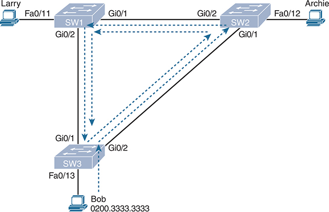

**Figure 9-1** *Broadcast Storm*

P C Larry is connected to switch S W 1 via interface Fast Ethernet 0/11, while P C Archie is connected to switch S W 2 via interface Fast Ethernet 0/12. Additionally, P C Bob with MAC address 0200.3333.3333 is connected to switch S W 3 via interface Fast Ethernet 0/13. The switches are interconnected as follows: S W 1 to S W 2 through interfaces Gigabit Ethernet 0/1 and Gigabit Ethernet 0/2, S W 2 to S W 3 through interfaces Gigabit Ethernet 0/1 and Gigabit Ethernet 0/2, and S W 1 to S W 3 through interfaces Gigabit Ethernet 0/2 and Gigabit Ethernet 0/1. This configuration creates multiple paths for broadcast traffic, potentially leading to a broadcast storm.

When broadcast storms happen, frames like the one in [Figure 9-1](vol1_ch09.md#ch09fig01) keep looping until something changes--someone shuts down an interface, reloads a switch, or does something else to break the loop. Also note that the same event happens in the opposite direction. When Bob sends the original frame, SW3 also forwards a copy to SW1, SW1 forwards it to SW2, and so on.

The storm also causes a much more subtle problem called *MAC table instability*. MAC table instability means that the switches' MAC address tables keep changing because frames with the same source MAC arrive on different ports. To see why, follow this example, in which SW3 begins [Figure 9-1](vol1_ch09.md#ch09fig01) with a MAC table entry for Bob, at the bottom of the figure, associated with port Fa0/13:

0200.3333.3333     Fa0/13     VLAN 1

However, now think about the switch-learning process that occurs when the looping frame goes to SW2, then SW1, and then back into SW3's Gi0/1 interface. SW3 thinks, "Hmm…the source MAC address is 0200.3333.3333, and it came in my Gi0/1 interface. Update my MAC table!" This results in the following entry on SW3, with interface Gi0/1 instead of Fa0/13:

0200.3333.3333     Gi0/1     VLAN 1

At this point, SW3 itself cannot correctly deliver frames to Bob's MAC address. At that instant, if a frame arrives at SW3 destined for Bob--a different frame than the looping frame that causes the problems--SW3 incorrectly forwards the frame out Gi0/1 to SW1, creating even more congestion.

The looping frames in a broadcast storm also cause a third problem: multiple copies of the frame arrive at the destination. Consider a case in which Bob sends a frame to Larry but none of the switches know Larry's MAC address. Switches flood frames sent to unknown destination unicast MAC addresses. When Bob sends the frame destined for Larry's MAC address, SW3 sends a copy to both SW1 and SW2. SW1 and SW2 also flood the frame, causing copies of the frame to loop. SW1 also sends a copy of each frame out Fa0/11 to Larry. As a result, Larry gets multiple copies of the frame, which may result in an application failure, if not more pervasive networking problems.

[Table 9-2](vol1_ch09.md#ch09tab02) summarizes the main three classes of problems that occur when STP/RSTP is not used in a LAN that has redundancy.

**Table 9-2** Three Classes of Problems Caused by Not Using STP in Redundant LANs

| Problem | Description |
| --- | --- |
| Broadcast storms | The forwarding of a frame repeatedly on the same links, consuming significant parts of the links' capacities |
| MAC table instability | The continual updating of a switch's MAC address table with incorrect entries, in reaction to looping frames, resulting in frames being sent to the wrong locations |
| Multiple frame transmission | A side effect of looping frames in which multiple copies of one frame are delivered to the intended host, confusing the host |

#### What Spanning Tree Does

STP/RSTP prevents loops by placing each switch port in either a forwarding state or a blocking state. Interfaces in the forwarding state act as normal, forwarding and receiving frames. However, interfaces in a blocking state do not process any frames except STP/RSTP messages (and some other overhead messages). Interfaces that block do not forward user frames, do not learn MAC addresses of received frames, and do not process received user frames.

[Figure 9-2](vol1_ch09.md#ch09fig02) shows a simple STP/RSTP tree that solves the problem shown in [Figure 9-1](vol1_ch09.md#ch09fig01) by placing one port on SW3 in the blocking state.

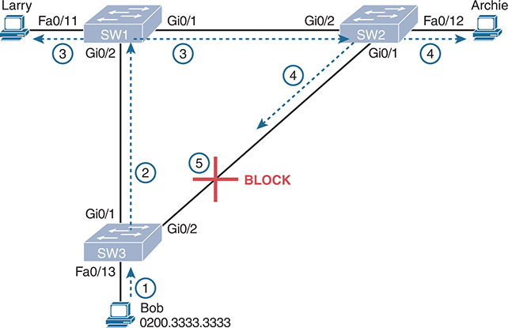

**Figure 9-2** *What STP/RSTP Does: Blocks a Port to Break the Loop*

P C Larry is connected to switch S W 1 via interface Fast Ethernet 0/11, while P C Archie is connected to switch S W 2 via interface Fast Ethernet 0/12. Additionally, P C Bob with MAC address 0200.3333.3333 is connected to switch S W 3 via interface Fast Ethernet 0/13. The switches are interconnected as follows: S W 1 to S W 2 through interfaces Gigabit Ethernet 0/1 and Gigabit Ethernet 0/2, S W 2 to S W 3 through interfaces Gigabit Ethernet 0/1 and Gigabit Ethernet 0/2, and S W 1 to S W 3 through interfaces Gigabit Ethernet 0/2 and Gigabit Ethernet 0/1. This configuration creates multiple paths for broadcast traffic, potentially leading to a broadcast storm. To prevent a network loop, the connection between S W 2 and S W 3 is blocked, ensuring network stability and preventing broadcast storms.

Now when Bob sends a broadcast frame, the frame does not loop. As shown in the steps in the figure:

Step 1. Bob sends the frame to SW3.

Step 2. SW3 forwards the frame only to SW1, but not out Gi0/2 to SW2, because SW3's Gi0/2 interface is in a blocking state.

Step 3. SW1 floods the frame out both Fa0/11 and Gi0/1.

Step 4. SW2 floods the frame out Fa0/12 and Gi0/1.

Step 5. SW3 physically receives the frame, but it ignores the frame received from SW2 because SW3's Gi0/2 interface is in a blocking state.

With the STP/RSTP topology in [Figure 9-2](vol1_ch09.md#ch09fig02), the switches simply do not use the link between SW2 and SW3 for traffic in this VLAN, which is the minor negative side effect of STP. However, if either of the other two links fails, STP/RSTP converges so that SW3 forwards instead of blocks on its Gi0/2 interface.

Note

The term *STP convergence* refers to the process by which the switches collectively realize that something has changed in the LAN topology and determine whether they need to change which ports block and which ports forward.

That completes the description of what STP/RSTP does, placing each port into either a forwarding or blocking state. The more interesting question, and the one that takes a lot more work to understand, is how and why STP/RSTP makes its choices. How does STP/RSTP manage to make switches block or forward on each interface? And how does it converge to change state from blocking to forwarding to take advantage of redundant links in response to network outages? The following pages answer these questions.

#### How Spanning Tree Works

The STP/RSTP algorithm creates a spanning tree of interfaces that forward frames. The tree structure of forwarding interfaces creates a single path to and from each Ethernet link, just like you can trace a single path in a living, growing tree from the base of the tree to each leaf.

Note

STP existed before LAN switches, with the STP processes performed by devices called bridges. Some terms and command output still use the older term *bridge*, so when working with STP/RSTP, consider the terms *bridge* and *switch* synonymous.

The process used by STP, sometimes called the *spanning-tree algorithm* (STA), chooses the interfaces that should be placed into a forwarding state. For any interfaces not chosen to be in a forwarding state, STP/RSTP places the interfaces in a blocking state. In other words, STP/RSTP simply picks which interfaces should forward, and any interfaces left over go to a blocking state.

STP/RSTP uses three criteria to choose whether to put an interface in a forwarding state:

* STP/RSTP elects a [root switch](vol1_gloss.md#gloss_345). STP puts all working interfaces on the root switch in a forwarding state.
* Each nonroot switch calculates the least-cost path between itself and the root switch based on STP/RSTP interface costs. The switch port that begins that least-cost path is its *root port* (RP), and the cost is the switch's [root cost](vol1_gloss.md#gloss_342).
* In a modern Ethernet that uses switches, each physical link connects two devices only. With two switches on a link, the switch with the lowest root cost becomes the *designated switch,* and its port connected to that link is the [designated port](vol1_gloss.md#gloss_094) (DP) on the link.

Note

A root switch places all interfaces into a forwarding state because each port on the root switch always wins its designated port (DP) election. However, it is easier to just remember that all the root switches' working interfaces will forward frames.

All other interfaces are placed in a blocking state. [Table 9-3](vol1_ch09.md#ch09tab03) summarizes the reasons STP/RSTP places a port in a forwarding or blocking state.

**Table 9-3** STP/RSTP: Reasons for Forwarding or Blocking

| Characterization of Port | STP State | Description |
| --- | --- | --- |
| All the root switch's ports | Forwarding | The root switch is always the designated switch on all connected segments. |
| Each nonroot switch's root port | Forwarding | The port through which the switch has the least cost to reach the root switch (lowest root cost). |
| Each LAN's designated port | Forwarding | The switch forwarding the Hello on to the segment, with the lowest root cost, is the designated switch for that segment. |
| All other working ports | Blocking | The port is not used for forwarding user frames, nor are any frames received on these interfaces considered for forwarding. |

Note

STP/RSTP should not use nonworking interfaces in the working STP/RSTP topology. To remove all nonworking interfaces from consideration--that is, all that are not in a connected (up/up) interface state--STP/RSTP assigns nonworking ports with the *disabled port role*. STP/RSTP does not consider these ports as potential RP or DP ports. STP also places these ports into a [disabled state](vol1_gloss.md#gloss_103) (much like blocking).

##### The STP Bridge ID and Hello BPDU

The STA begins with an election of one switch to be the root switch. To better understand this election process, you need to understand the STP/RSTP messages sent between switches as well as the concept and format of the identifier used to uniquely identify each switch.

The STP/RSTP [bridge ID](vol1_gloss.md#gloss_049) (BID) is an 8-byte value unique to each switch. The bridge ID consists of a 2-byte priority field and a 6-byte system ID, with the system ID being based on a universal (burned-in) MAC address in each switch. Using a burned-in MAC address ensures that each switch's bridge ID will be unique.

STP/RSTP defines messages called [bridge protocol data units (BPDU)](vol1_gloss.md#gloss_050), also called configuration BPDUs, which switches use to exchange information with each other. The most common BPDU, called a [Hello BPDU](vol1_gloss.md#gloss_166), lists many details, including the sending switch's BID. By listing its own unique BID, switches can tell which switch sent which Hello BPDU. [Table 9-4](vol1_ch09.md#ch09tab04) lists some of the key information in the Hello BPDU.

**Table 9-4** Fields in the STP Hello BPDU

| Field | Description |
| --- | --- |
| Root bridge ID | The bridge ID of the switch that the sender of this Hello currently believes to be the root switch |
| Sender's bridge ID | The bridge ID of the switch sending this Hello BPDU |
| Sender's root cost | The STP/RSTP cost between this switch and the current root |
| Timer values on the root switch | Includes the Hello timer, MaxAge timer, and [forward delay](vol1_gloss.md#gloss_149) timer |

For the time being, just keep the first three items from [Table 9-4](vol1_ch09.md#ch09tab04) in mind as the following sections work through the three steps in how STP/RSTP chooses the interfaces to place into a forwarding state. Next, the text examines the three main steps in the STP/RSTP process.

##### Electing the Root Switch

Switches elect a root switch based on the BIDs in the BPDUs. The root switch is the switch with the lowest numeric value for the BID. Because the two-part BID starts with the priority value, essentially the switch with the lowest priority becomes the root. For example, if one switch has priority 4096, and another switch has priority 8192, the switch with priority 4096 wins, regardless of what MAC address was used to create the BID for each switch.

If a tie occurs based on the priority portion of the BID, the switch with the lowest MAC address portion of the BID is the root. No other tiebreaker should be needed because switches use one of their own universal (burned-in) MAC addresses as the second part of their BIDs. So, if the priorities tie, and one switch uses a MAC address of 0200.0000.0000 as part of the BID and the other uses 0811.1111.1111, the first switch (MAC 0200.0000.0000) becomes the root switch.

STP/RSTP elects a root switch in a manner not unlike a political election. The process begins with all switches claiming to be the root by sending Hello BPDUs listing their own BID as the root BID. If a switch hears a Hello that lists a better (lower) BID, that switch stops advertising itself as root and starts forwarding the superior Hello. The Hello sent by the better switch lists the better switch's BID as the root. It works like a political race in which a less-popular candidate gives up and leaves the race, throwing his support behind the more popular candidate. Eventually, everyone agrees which switch has the best (lowest) BID, and everyone supports the elected switch--which is where the political race analogy falls apart.

Note

A better Hello, meaning that the listed root's BID is better (numerically lower), is called a *superior Hello*; a worse Hello, meaning that the listed root's BID is not as good (numerically higher), is called an *inferior Hello*.

[Figure 9-3](vol1_ch09.md#ch09fig03) shows the beginning of the root election process. In this case, SW1 has advertised itself as root, as have SW2 and SW3. However, SW2 now believes that SW1 is a better root, so SW2 is now forwarding the Hello originating at SW1. So, at this point, the figure shows SW1 is saying Hello, claiming to be root; SW2 agrees and is forwarding SW1's Hello that lists SW1 as root; but SW3 is still claiming to be best, sending its own Hello BPDUs, listing SW3's BID as the root.

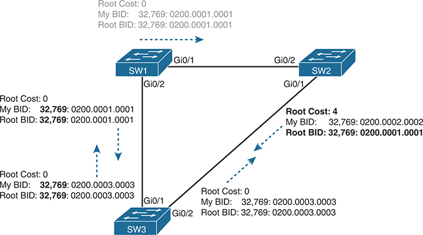

**Figure 9-3** *Beginnings of the Root Election Process*

P C Larry is connected to switch S W 1 via interface Fast Ethernet 0/11, while P C Archie is connected to switch S W 2 via interface Fast Ethernet 0/12. Additionally, P C Bob with MAC address 0200.3333.3333 is connected to switch S W 3 via interface Fast Ethernet 0/13. The switches are interconnected as follows: S W 1 to S W 2 through interfaces Gigabit Ethernet 0/1 and Gigabit Ethernet 0/2, S W 2 to S W 3 through interfaces Gigabit Ethernet 0/1 and Gigabit Ethernet 0/2, and S W 1 to S W 3 through interfaces Gigabit Ethernet 0/2 and Gigabit Ethernet 0/1. This configuration creates multiple paths for broadcast traffic, potentially leading to a broadcast storm. The root cost from S W 1 to S W 2 is 0. S W 1's Bridge I D (B I D) is 32,769 with a MAC address of 0200.0001.0001, matching the Root Bridge I D, indicating S W 1 as the root bridge for the network segment. The root cost from S W 2 to S W 3 is 4. S W 2's B I D is 32,769 with a MAC address of 0200.0002.0002, while the Root BI D is 32,769 with a MAC address of 0200.0001.0001, indicating S W 1 as the root bridge. The root cost from S W 3 to S W 2 and S W 1 is 0. S W 3's BI D is 32,769 with a MAC address of 0200.0003.0003, matching the Root B I D for both switches, indicating S W 3 as the root bridge for these network segments.

Two candidates still exist in [Figure 9-3](vol1_ch09.md#ch09fig03): SW1 and SW3. So, who wins? Well, from the BID, the lower-priority switch wins; if a tie occurs, the lower MAC address wins. As shown in the figure on the left, the switch priority values (32,769) tie, but SW1 has a lower BID (32,769:0200.0001.0001) than SW3 (32,769:0200.0003.0003) due to its lower MAC address. SW1 wins, and SW3 now also believes that SW1 is the better switch. [Figure 9-4](vol1_ch09.md#ch09fig04) shows the resulting Hello messages sent by the switches.

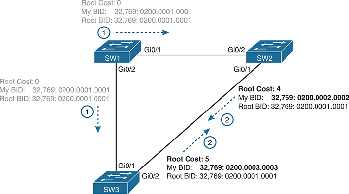

**Figure 9-4** *SW1 Wins the Election*

P C Larry is connected to switch S W 1 via interface Fast Ethernet 0/11, while P C Archie is connected to switch S W 2 via interface Fast Ethernet 0/12. Additionally, P C Bob with MAC address 0200.3333.3333 is connected to switch S W 3 via interface Fast Ethernet 0/13. The switches are interconnected as follows: S W 1 to S W 2 through interfaces Gigabit Ethernet 0/1 and Gigabit Ethernet 0/2, S W 2 to S W 3 through interfaces Gigabit Ethernet 0/1 and Gigabit Ethernet 0/2, and S W 1 to S W 3 through interfaces Gigabit Ethernet 0/2 and Gigabit Ethernet 0/1. This configuration creates multiple paths for broadcast traffic, potentially leading to a broadcast storm. The root cost from S W 1 to S W 2 is 0. S W 1's Bridge I D (BI D) is 32,769 with a MAC address of 0200.0001.0001, matching the Root Bridge I D, indicating S W 1 as the root bridge for the network segment. The root cost from S W 2 to S W 3 and S W 3 to S W 2 is 4. S W 2's BI D is 32,769 with a MAC address of 0200.0002.0002, while the Root BI D is 32,769 with a MAC address of 0200.0001.0001, indicating S W 1 as the root bridge. The root cost from S W 1 to S W 3 is 0. S W 3's BI D is 32,769 with a MAC address of 0200.0003.0003, matching the Root BI D, indicating S W 1 as the root bridge for this network segment.

Summarizing, the root election happens through each switch claiming to be root, with the best switch being elected based on the numerically lowest BID. Breaking down the BID into its components, the comparisons can be made as:

* The lowest priority
* If that ties, the lowest switch MAC address

##### Choosing Each Switch's Root Port

The second part of the STP/RSTP process occurs when each nonroot switch chooses its one and only *root port (RP)*. A switch's RP is its interface through which it has the least STP/RSTP cost to reach the root switch (least root cost).

You can easily see the idea behind a switch's cost to reach the root. Just look at a network diagram that shows the root switch, lists the STP/RSTP cost associated with each switch port, and identifies the nonroot switch in question. Switches use a different process than you can see by looking at a network diagram, of course, but using a diagram can make it easier to learn the idea.

[Figure 9-5](vol1_ch09.md#ch09fig05) shows just such a figure, with the same three switches shown in the last several figures. SW1 has already won the election as root, and the figure considers the cost from SW3's perspective. (Note that the figure uses some nondefault cost settings.)

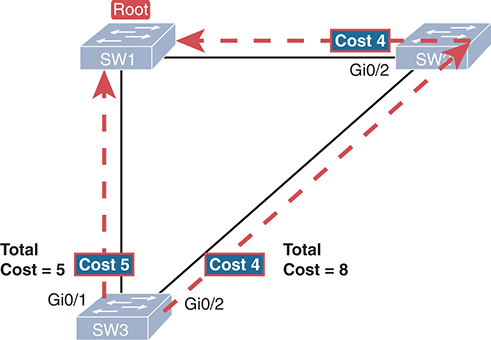

**Figure 9-5** *How a Human Might Calculate STP/RSTP Cost from SW3 to the Root (SW1)*

S W 1 is connected to S W 2 through interfaces Gigabit Ethernet 0/1 and Gigabit Ethernet 0/2. S W 2 is connected to S W 3 through interfaces Gigabit Ethernet 0/1 and Gigabit Ethernet 0/2. S W 1 is also directly connected to S W 3 through interfaces Gigabit Ethernet 0/2 and Gigabit Ethernet 0/1. Given that S W 1 is the root bridge, the cost from S W 3 to S W 1 is 5, indicating that S W 3's port costs 5 units to reach the root bridge. When considering the path through S W 2, the cost from S W 3 to S W 2 is 4, and the cost from S W 2 to S W 1 is 4, resulting in a total cost of 8 units to reach the root bridge via S W 2.

SW3 has two possible physical paths to send frames to the root switch: the direct path to the left and the indirect path to the right through switch SW2. The cost is the sum of the costs of all the *switch ports the frame would exit* if it flowed over that path. (The calculation ignores the inbound ports.) As you can see, the cost over the direct path out SW3's G0/1 port has a total cost of 5, and the other path has a total cost of 8. SW3 picks its G0/1 port as root port because it is the port that is part of the least-cost path to send frames to the root switch.

Switches come to the same conclusion but using a different process. Instead, they add their local interface STP/RSTP cost to the root cost listed in each received Hello BPDU. The STP/RSTP port cost is simply an integer value assigned to each interface, per VLAN, for the purpose of providing an objective measurement that allows STP/RSTP to choose which interfaces to add to the STP/RSTP topology. The switches also look at their neighbor's root cost, as announced in Hello BPDUs received from each neighbor.

[Figure 9-6](vol1_ch09.md#ch09fig06) shows an example of how switches calculate their best root cost and then choose their root port, using the same topology and STP/RSTP costs as shown in [Figure 9-5](vol1_ch09.md#ch09fig05). STP/RSTP on SW3 calculates its cost to reach the root over the two possible paths by adding the advertised cost (in Hello messages) to the interface costs listed in the figure.

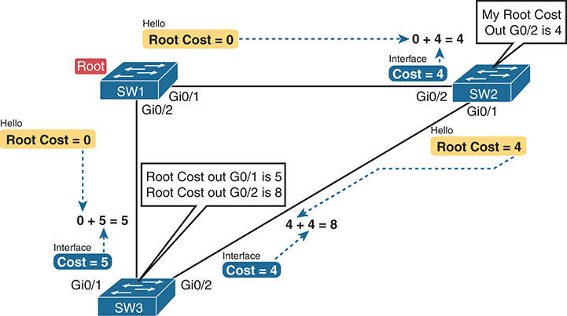

**Figure 9-6** *How STP/RSTP Actually Calculates the Cost from SW3 to the Root*

S W 1 is connected to S W 2 through interfaces Gigabit Ethernet 0/1 and Gigabit Ethernet 0/2. S W 2 is connected to S W 3 through interfaces Gigabit Ethernet 0/1 and Gigabit Ethernet 0/2. S W 1 is also directly connected to S W 3 through interfaces Gigabit Ethernet 0/2 and Gigabit Ethernet 0/1. As S W 1 is the root bridge, the cost from S W 1 to S W 3 is initially zero. When calculating the cost from S W 2 to S W 3, the hello root cost from S W 2 to S W 3 is zero, and adding the port cost of 4 to reach S W 2 results in a total cost of 4. Similarly, when calculating the cost from S W 1 to S W 2, the hello root cost from S W 1 to S W 2 is zero, and adding the port cost of 4 to reach S W 1 results in a total cost of 4.

Focus on the process for a moment. The root switch sends Hellos, with a listed root cost of 0. The idea is that the root's cost to reach itself is 0.

Next, look on the left of the figure. SW3 takes the received cost (0) from the Hello sent by SW1 and adds the interface cost (5) of the interface on which that Hello was received. SW3 calculates that the cost to reach the root switch, out that port (G0/1), is 5.

On the right side, SW2 has realized its best cost to reach the root is cost 4. So, when SW2 forwards the Hello toward SW3, SW2 lists a root cost 4. SW3's STP/RSTP port cost on port G0/2 is 4, so SW3 determines a total cost to reach root out its G0/2 port of 8.

As a result of the process depicted in [Figure 9-6](vol1_ch09.md#ch09fig06), SW3 chooses Gi0/1 as its RP because the cost to reach the root switch through that port (5) is lower than the other alternative (Gi0/2, cost 8). Similarly, SW2 chooses Gi0/2 as its RP, with a cost of 4 (SW1's advertised cost of 0 plus SW2's Gi0/2 interface cost of 4). Each switch places its root port into a forwarding state.

Switches need a tiebreaker to use in case the best root cost ties for two or more paths. If a tie occurs, the switch applies these three tiebreakers to the paths that tie, in order, as follows:

1. Choose based on the lowest neighbor bridge ID.
2. Choose based on the lowest neighbor port priority.
3. Choose based on the lowest neighbor internal port number.

##### Choosing the Designated Port on Each LAN Segment

The final STP/RSTP step determines the designated port on each LAN segment. The switch with the lowest root cost wins the competition. With two switches on the ends of a link, the switch with the lower cost to reach the root becomes the designated switch, with its port on that link becoming the DP on that segment. On a link with a switch and a second device that does not use STP/RSTP (for instance, a router or PC), the switch becomes the DP.

The process to choose the DP begins with the switch(es) forwarding Hellos onto the link. The Hello messages include a field to list the root cost of the switch that forwarded the Hello. Determining which switch has the lowest root cost requires a simple comparison. Once a switch port becomes the DP, it continues to forward Hellos onto the link.

For example, earlier [Figure 9-4](vol1_ch09.md#ch09fig04) shows in bold text the parts of the Hello messages from both SW2 and SW3 that determine the choice of DP on that segment. Note that both SW2 and SW3 list their respective root cost (cost 4 on SW2 and cost 5 on SW3). SW2 lists the lower cost, so SW2's Gi0/1 port is the designated port on that LAN segment.

All DPs are placed into a forwarding state; in this case, SW2's Gi0/1 interface will be in a forwarding state.

If the advertised costs tie, the switches break the tie by choosing the switch with the lower BID. In this case, SW2 would also have won, with a BID of 32769:0200.0002.0002 versus SW3's 32769:0200.0003.0003.

Note

Two additional tiebreakers are needed in some cases, although these would be unlikely today. A single switch can connect two or more interfaces to the same collision domain by connecting to a hub. In that case, the one switch hears its own BPDUs. So, if a switch ties with itself, two additional tiebreakers are used: the lowest interface STP/RSTP priority and, if that ties, the lowest internal interface number.

The only interface that does not have a reason to be in a forwarding state on the three switches in the examples shown in [Figures 9-3](vol1_ch09.md#ch09fig03) through [9-6](vol1_ch09.md#ch09fig06) is SW3's Gi0/2 port. So, the STP/RSTP process is now complete. [Table 9-5](vol1_ch09.md#ch09tab05) outlines the state of each port and shows why it is in that state.

**Table 9-5** State of Each Interface

| Switch Interface | State | Reason Why the Interface Is in Forwarding State |
| --- | --- | --- |
| SW1, Gi0/1 | Forwarding | The interface is on the root switch, so it becomes the DP on that link. |
| SW1, Gi0/2 | Forwarding | The interface is on the root switch, so it becomes the DP on that link. |
| SW2, Gi0/2 | Forwarding | The root port of SW2. |
| SW2, Gi0/1 | Forwarding | The designated port on the LAN segment to SW3. |
| SW3, Gi0/1 | Forwarding | The root port of SW3. |
| SW3, Gi0/2 | Blocking | Not the root port and not the designated port. |

Note that the examples in this section focus on the links between the switches, but switch ports connected to endpoint devices should become DPs and settle into a forwarding state. Working through the logic, each switch will forward BPDUs on each port as part of the process to determine the DP on that LAN. Endpoints should ignore those messages because they do not run STP/RSTP, so the switch will win and become the DP on every access port.

#### Configuring to Influence the STP Topology

STP/RSTP works by default on Cisco switches, so all the settings needed by a switch have a useful default. Switches have a default BID, based on a default priority value and adding a universal MAC address that comes with the switch hardware. Additionally, switch interfaces have default STP/RSTP costs based on the current operating speed of the switch interfaces.

Network engineers often want to change the STP/RSTP settings to then change the choices STP/RSTP makes in a given LAN. Two main tools available to the engineer are to configure the bridge ID and to change STP/RSTP port costs.

First, to change the BID, the engineer can set the priority used by the switch, while continuing to use the universal MAC address as the final 48 bits of the BID. For instance, giving a switch the lowest priority value among all switches will cause that switch to win the root election.

Port costs also have default values, per port, per VLAN. You can configure these port costs, which will in turn impact many switch's calculations of the root cost. For instance, to favor one link, give the ports on that link a lower cost, or to avoid a link, give the ports a higher cost.

[Table 9-6](vol1_ch09.md#ch09tab06) lists the default port costs suggested by IEEE. IOS on Cisco switches has long used the default settings as defined as far back as the 1998 version of the STP standard. The latest IEEE standards suggest values that are more useful when using links faster than 10 Gbps. You can configure a switch to use the old (short) or new (long) defaults using the global command (**spanning-tree pathcost method** {**short** | **long**})--but it makes sense to use the same setting on all switches in the same campus.

**Table 9-6** Default Port Costs According to IEEE

| Ethernet Speed | IEEE Cost: 1998 (and Before) | IEEE Cost: 2004 (and After) |
| --- | --- | --- |
| 10 Mbps | 100 | 2,000,000 |
| 100 Mbps | 19 | 200,000 |
| 1 Gbps | 4 | 20,000 |
| 10 Gbps | 2 | 2000 |
| 100 Gbps | N/A | 200 |
| 1 Tbps | N/A | 20 |

Also, be aware that Cisco switches choose the default cost based on the operating speed of the link, not the maximum speed. That is, if a 10/100/1000 port runs at 10 Mbps for some reason, its default STP cost on a Cisco switch is 100.

### Details Specific to STP (and Not RSTP)

As promised in the introduction to this chapter, the first section showed features that apply to both STP and RSTP. This next heading acts as the turning point, with the next several pages being about STP only. The upcoming section titled "[Rapid STP Concepts](vol1_ch09.md#ch09lev1sec5)" then shows details specific to RSTP, in contrast to STP.

Once the engineer has finished all STP configuration, the STP topology should settle into a stable state and not change, at least until the network topology changes. This section examines the ongoing operation of STP while the network is stable, and then it covers how STP converges to a new topology when something changes.

Note that almost all the differences between STP and RSTP revolve around the activities of waiting for and reacting to changes in the topology. STP performed well for the era and circumstances in which it was created. The "rapid" in RSTP refers to the improvements to how fast RSTP could react when changes occur--so understanding how STP reacts will be useful to understand why RSTP reacts faster. These next few pages show the specifics of STP (and not RSTP) and how STP reacts to and manages convergence when changes happen in an Ethernet LAN.

#### STP Activity When the Network Remains Stable

When the network remains stable, the root switch generates a new Hello BPDU, with the nonroot switches forwarding copies of the Hello so that the Hellos traverse the spanning tree. The root generates a new Hello every Hello time (default 2 seconds), with each nonroot switch forwarding the Hello out any interfaces in a forwarding state after updating the Hello. The following steps summarize the steady-state operation when nothing is currently changing in the STP topology:

Step 1. The root creates and sends a Hello BPDU, with a root cost of 0, out all its working interfaces (those in a forwarding state).

Step 2. The nonroot switches receive the Hello on their root ports. After changing the Hello to list their own BID as the sender's BID and listing that switch's root cost, the switch forwards the Hello out all designated ports.

Step 3. Steps 1 and 2 repeat every Hello time until something changes.

When a switch fails to receive a Hello in its root port, it knows a problem might be occurring in the network. Each switch relies on these periodically received Hellos from the root as a way to know that its path to the root is still working. When a switch ceases to receive the Hellos, or receives a Hello that lists different details, something has failed, so the switch reacts and starts the process of changing the spanning-tree topology.

#### STP Timers That Manage STP Convergence

For various reasons, the STP convergence process requires the use of three timers, listed in [Table 9-7](vol1_ch09.md#ch09tab07). Note that all switches use the timers as dictated by the root switch, which the root lists in its periodic Hello BPDU messages.

**Table 9-7** STP Timers

| Timer | Default Value | Description |
| --- | --- | --- |
| Hello | 2 seconds | The time period between Hellos created by the root. |
| MaxAge | 10 times Hello | How long any switch should wait, after ceasing to hear Hellos, before trying to change the STP topology. |
| Forward delay | 15 seconds | Delay that affects the process that occurs when an interface changes from a blocking state to a forwarding state. A port stays in an interim [listening state](vol1_gloss.md#gloss_239), and then an interim [learning state](vol1_gloss.md#gloss_229)*,* for the number of seconds defined by the forward delay timer. |

If a switch does not get one expected Hello BPDU within the Hello time, the switch continues as normal. However, if the Hellos do not show up again within MaxAge time, the switch reacts by taking steps to change the STP topology. With default settings, MaxAge is 20 seconds (ten times the default Hello timer of 2 seconds). So, a switch would go 20 seconds without hearing a Hello before reacting.

After MaxAge expires, the switch essentially makes all its STP choices again, based on any Hellos it receives from other switches. It reevaluates which switch should be the root switch. If the local switch is not the root, it chooses its RP. And it determines whether it is the DP on each of its other links.

The best way to describe STP convergence is to show an example using the same familiar topology. [Figure 9-7](vol1_ch09.md#ch09fig07) shows the same familiar figure, with SW3's Gi0/2 in a blocking state, but SW1's Gi0/2 interface has just failed.

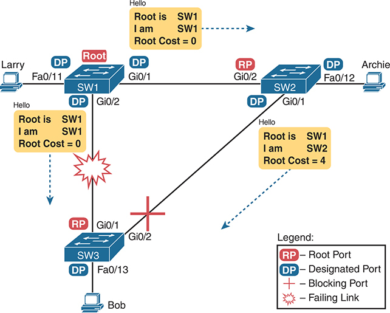

**Figure 9-7** *Initial STP State Before SW1-SW3 Link Fails*

P C Larry connects to switch S W 1 via interface Fast Ethernet 0/11 designated port (DP), P C Archie connects to S W 2 via interface Fast Ethernet 0/12 DP, and P C Bob connects to S W 3 via interface Fast Ethernet 0/13 DP. S W 1 is connected to S W 2 through interfaces Gigabit Ethernet 0/1 designated port (DP) and Gigabit Ethernet 0/2 root port (RP). S W 2 is connected to S W 3 through interfaces Gigabit Ethernet 0/1 DP and Gigabit Ethernet 0/2 RP. S W 1 is also directly connected to S W 3 through interfaces Gigabit Ethernet 0/2 DP and Gigabit Ethernet 0/1 RP. As S W 1 is the root bridge, the hello messages indicate that the root bridge is S W 1, and the root cost from S W 1 to S W 3 is 0. Similarly, the root cost from S W 1 to S W 2 is 0. However, the root cost from S W 2 to S W 3 is 4. The connection between S W 1 and S W 3 fails.

In the scenario shown in the figure, SW3 reacts to the change because SW3 fails to receive its expected Hellos on its Gi0/1 interface. However, SW2 does not need to react because SW2 continues to receive its periodic Hellos in its Gi0/2 interface. In this case, SW3 reacts either when [MaxAge](vol1_gloss.md#gloss_253) time passes without hearing the Hellos, or as soon as SW3 notices that interface Gi0/1 has failed. (If the interface fails, the switch can assume that the Hellos will not be arriving in that interface anymore.)

Now that SW3 can act, it begins by reevaluating the choice of root switch. SW3 still receives the Hellos from SW2, as forwarded from the root (SW1). SW1 still has a lower BID than SW3; otherwise, SW1 would not have already been the root. So, SW3 decides that SW1 wins the root election and that SW3 is not the root.

Next, SW3 reevaluates its choice of RP. At this point, SW3 is receiving Hellos on only one interface: Gi0/2. Whatever the calculated root cost, Gi0/2 becomes SW3's new RP. (The cost would be 8, assuming the same STP costs in earlier [Figures 9-5](vol1_ch09.md#ch09fig05) and [9-6](vol1_ch09.md#ch09fig06).)

SW3 then reevaluates its role as DP on any other interfaces. In this example, no real work needs to be done. SW3 was already the DP on interface Fa0/13, and it continues to be the DP because no other switches connect to that port.

#### Changing Interface States with STP

STP uses the idea of roles and states. *Roles*, like root port role and designated port role, relate to how STP analyzes the LAN topology. *States*, like forwarding and blocking, tell a switch whether to send or receive frames. When STP converges, a switch chooses new port roles, and the port roles determine the state (forwarding or blocking).

Switches using STP can simply move immediately from a forwarding to a blocking state, but they must take extra time to transition from a blocking state to a forwarding state. For instance, when switch SW3 in [Figure 9-7](vol1_ch09.md#ch09fig07) formerly used port G0/1 as its RP (a role), that port was in a forwarding state. After convergence, G0/1 might be neither an RP nor a DP; the switch can immediately move that port to a blocking state.

However, when a port that formerly blocked needs to transition to forwarding, the switch first puts the port through two intermediate interface states. These temporary STP states help prevent temporary loops:

* **Listening:** Like the blocking state, the interface does not forward frames. The switch removes old stale (unused) MAC table entries for which no frames are received from each MAC address during this period. These stale MAC table entries could be the cause of the temporary loops.
* **Learning:** Interfaces in this state still do not forward frames, but the switch begins to learn the MAC addresses of frames received on the interface.

STP moves an interface from blocking to listening, then to learning, and then to a forwarding state. STP leaves the interface in each interim state for a time equal to the forward delay timer, which defaults to 15 seconds. As a result, a convergence event that causes an interface to change from blocking to forwarding requires 30 seconds to transition from blocking to forwarding. In addition, a switch might have to wait MaxAge seconds (default 20 seconds) before even choosing to move an interface from a blocking to a forwarding state.

For example, follow what happens with an initial STP topology as shown in [Figures 9-3](vol1_ch09.md#ch09fig03) through [9-6](vol1_ch09.md#ch09fig06), with the SW1-to-SW3 link failing as shown in [Figure 9-7](vol1_ch09.md#ch09fig07). If SW1 simply quit sending Hello messages to SW3, but the link between the two did not fail, SW3 would wait MaxAge seconds before reacting (20 seconds is the default). SW3 would actually quickly choose its ports' STP roles, but then wait 15 seconds each in listening and learning states on interface Gi0/2, resulting in a 50-second convergence delay.

[Table 9-8](vol1_ch09.md#ch09tab08) summarizes spanning tree's various interface states for easier review.

**Table 9-8** IEEE STP (not RSTP) States

| State | Forwards Data Frames? | Learns MACs Based on Received Frames? | Transitory or Stable State? |
| --- | --- | --- | --- |
| Blocking | No | No | Stable |
| Listening | No | No | Transitory |
| Learning | No | Yes | Transitory |
| Forwarding | Yes | Yes | Stable |
| Disabled | No | No | Stable |

### Rapid STP Concepts

The original STP worked well given the assumptions about networks and networking devices in that era. However, as with any computing or networking standard, as time passes, hardware and software capabilities improve, so new protocols emerge to take advantage of those new capabilities. For STP, one of the most significant improvements over time has been the introduction of Rapid Spanning Tree Protocol (RSTP), introduced as standard IEEE 802.1w.

Note

Just to make sure you are clear about the terminology: Throughout the rest of the chapter, *STP* refers to the original STP standard only, and use of the term *RSTP* does not include STP.

Before getting into the details of RSTP, it helps to make sense of the standards numbers a bit: 802.1w was actually an amendment to the 802.1D standard. The IEEE first published 802.1D in 1990, and anew in 1998. After the 1998 version of 802.1D, the IEEE published the 802.1w amendment to 802.1D in 2001, which first standardized RSTP.

Over the years, other meaningful changes happened in the standards as well, although those changes probably do not impact most networkers' thinking when it comes to working with STP or RSTP. But to be complete, the IEEE replaced STP with RSTP in the revised 802.1D standard in 2004. In another move, in 2011 the IEEE moved all the RSTP details into a revised 802.1Q standard. As it stands today, RSTP actually sits in the 802.1Q standards document.

As a result, when reading about RSTP, you will see documents, books, videos, and the like that refer to RSTP and include various references to 802.1w, 802.1D, and 802.1Q--and they might all be correct based on timing and context. At the same time, many people refer to RSTP as 802.1w because that was the first IEEE document to define it. However, for the purposes of this book, focus instead on the RSTP acronym rather than the IEEE standards numbers used with RSTP over its history.

Note

The IEEE sells its standards, but through the "Get IEEE 802" program, you can get free PDFs of the current 802 standards. To read about RSTP today, you will need to download the 802.1Q standard and then look for the sections about RSTP.

Now on to the details about RSTP in this chapter. As discussed throughout this chapter, RSTP and STP have many similarities, so this section next compares and contrasts the two. Following that, the rest of this section discusses the concepts unique to RSTP that are not found in STP--alternate root ports, different port states, backup ports, and the port roles used by RSTP.

#### Comparing STP and RSTP

RSTP works just like STP in several ways, as discussed in the first major section of the chapter. To review:

* RSTP and STP elect the root switch using the same rules and tiebreakers.
* RSTP and STP switches select their root ports with the same rules.
* RSTP and STP elect designated ports on each LAN segment with the same rules and tiebreakers.
* RSTP and STP place each port in either forwarding or blocking state, although RSTP calls the blocking state the [discarding state](vol1_gloss.md#gloss_104).

In fact, RSTP works so much like STP that they can both be used in the same network. RSTP and STP switches can be deployed in the same network, with RSTP features working in switches that support it and traditional STP features working in the switches that support only STP.

With all these similarities, you might be wondering why the IEEE bothered to create RSTP in the first place. The overriding reason is convergence. STP takes a relatively long time to converge (50 seconds with the default settings when all the wait times must be followed). RSTP improves network convergence when topology changes occur, usually converging within a few seconds (or in slow conditions, in about 10 seconds).

RSTP changes and adds to STP in ways that avoid waiting on STP timers, resulting in quick transitions from forwarding to discarding (blocking) state and vice versa. Specifically, RSTP, compared to STP, defines more cases in which the switch can avoid waiting for a timer to expire, such as the following:

* RSTP adds a mechanism by which a switch can replace its root port, without any waiting to reach a forwarding state (in some conditions).
* RSTP adds a new mechanism to replace a designated port, without any waiting to reach a forwarding state (in some conditions).
* RSTP lowers waiting times for cases in which RSTP must wait for a timer.

For instance, imagine a failure case in which a link remains up, but for some reason, a nonroot switch stops hearing the Hello BPDUs it had been hearing in the past. STP requires a switch to wait for MaxAge seconds, which STP defines based on ten times the Hello timer, or 20 seconds, by default. RSTP shortens this timer, defining MaxAge as three times the Hello timer. Additionally, RSTP can send messages to the neighboring switch to inquire whether a problem has occurred rather than wait for timers.

The best way to get a sense for these mechanisms is to see how the RSTP alternate port role and the backup port role both work. RSTP uses the term *alternate port* to refer to a switch's other ports that could be used as the root port if the root port ever fails. The *backup port* concept provides a backup port on the local switch for a designated port. (Note that backup ports apply only to designs that use hubs, so they are unlikely to be useful today.) However, both are instructive about how RSTP works. [Table 9-9](vol1_ch09.md#ch09tab09) lists these RSTP port roles.

**Table 9-9** Port Roles in RSTP

| Function | Port Role |
| --- | --- |
| Nonroot switch's best path to the root | [Root port](vol1_gloss.md#gloss_344) |
| Port that will be used to replace the root port when the root port fails | [Alternate port](vol1_gloss.md#gloss_021) |
| Switch port designated to forward onto a collision domain | [Designated port](vol1_gloss.md#gloss_094) |
| Port that will be used to replace a designated port when a designated port fails | [Backup port](vol1_gloss.md#gloss_040) |
| Port in a nonworking interface state--that is, anything other than connected (up/up) | [Disabled port](vol1_gloss.md#gloss_102) |

RSTP differs from STP in a few other ways as well. For instance, with STP, the root switch creates a Hello, with all other switches updating and forwarding the Hello. With RSTP, each switch independently generates its own Hellos. Additionally, RSTP allows for queries between neighbors, rather than waiting on timers to expire, as a means to avoid waiting to learn information. These types of protocol changes help RSTP-based switches isolate what has changed in a network and react quickly to choose a net RSTP topology.

The next few pages work through some of those overt RSTP features that differ from STP.

#### RSTP and the Alternate (Root) Port Role

With STP, each nonroot switch places one port in the STP root port (RP) role. RSTP follows that same convention, with the same exact rules for choosing the RP. RSTP then takes another step beyond STP, naming other possible RPs, identifying them as *alternate ports*.

To be an alternate port, both the RP and the alternate port must receive Hellos that identify the same root switch. For instance, in [Figure 9-8](vol1_ch09.md#ch09fig08), SW1 is the root. SW3 will receive Hello BPDUs on two ports: G0/1 and G0/2. Both Hellos list SW1's bridge ID (BID) as the root switch, so whichever port is not the root port meets the criteria to be an alternate port. SW3 picks G0/1 as its root port in this case and then makes G0/2 an alternate port.

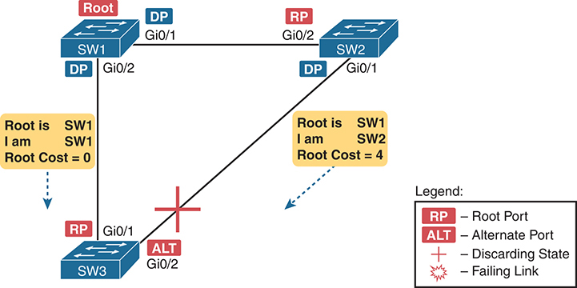

**Figure 9-8** *Example of SW3 Making G0/2 Become an Alternate Port*

S W 1 is connected to S W 2 through interfaces Gigabit Ethernet 0/1 designated port (DP) and Gigabit Ethernet 0/2 root port (RP). S W 2 is connected to S W 3 through interfaces Gigabit Ethernet 0/1 DP and Gigabit Ethernet 0/2 RP. S W 1 is also directly connected to S W 3 through interfaces Gigabit Ethernet 0/2 DP and Gigabit Ethernet 0/1 RP. S W 1 is the root bridge. The STP hello messages indicate that the root bridge is S W 1, and the root cost from S W 1 to S W 3 is 0. The root cost from S W 2 to S W 3 is 4. The connection between S W 2 and S W 3 is blocked to prevent loops in the network.

An alternate port basically works like the second-best option for the root port. The alternate port can take over for the former root port, often very rapidly, without requiring a wait in other interim RSTP states. For instance, when the root port fails, the switch changes the former root port's role and state: (a) the role from root port to a *disabled port* (because the interface failed), and (b) the state from forwarding to discarding (RSTP uses the discarding state for ports in the disabled port role). Then, without waiting on any timers, the switch changes the alternate port to be the root port and immediately changes its port state from discarding to forwarding.

Notably, the new root port also does not need to spend time in other states, such as the learning state, instead moving immediately to the forwarding state.

[Figure 9-9](vol1_ch09.md#ch09fig09) shows an example of RSTP convergence. SW3's root port before the failure shown in this figure is SW3's G0/1, the link connected directly to SW1 (the root switch). Then SW3's link to SW1 fails as shown in Step 1 of the figure.

Following the steps in [Figure 9-9](vol1_ch09.md#ch09fig09):

Step 1. The link between SW1 and SW3 fails, so SW3's current root port (Gi0/1) fails.

Step 2. SW3 and SW2 exchange RSTP messages to confirm that SW3 will now transition its former alternate port (Gi0/2) to be the root port. This action causes SW2 to flush the required MAC table entries.

Step 3. SW3 transitions G0/1 to the disabled port role and G0/2 to the root port role.

Step 4. SW3 transitions G0/2 to a forwarding state immediately, without using the learning state, because this is one case in which RSTP knows the transition will not create a loop.

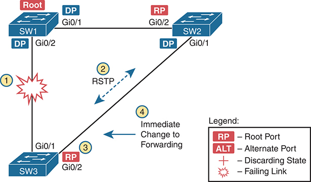

**Figure 9-9** *Convergence Events with SW3 G0/1 Failure*

S W 1 is connected to S W 2 through interfaces Gigabit Ethernet 0/1 designated port (DP) and Gigabit Ethernet 0/2 root port (RP). S W 2 is connected to S W 3 through interfaces Gigabit Ethernet 0/1 DP and Gigabit Ethernet 0/2 RP. S W 1 is also directly connected to S W 3 through interfaces Gigabit Ethernet 0/2 DP and Gigabit Ethernet 0/1 RP. S W 1 is the root bridge. The connection between S W 2 and S W 3 is Rapid Spanning Tree Protocol (RSTP), and immediately changed to forwarding, ensuring rapid convergence and optimal traffic flow. However, the connection between S W 1 and S W 3 is failing, indicating a convergence event where the network protocol adapts to the failure by rerouting traffic and maintaining network connectivity.

As soon as SW3 realizes its G0/1 interface has failed, the process shown in the figure takes very little time. None of the processes rely on timers, so as soon as the work can be done, the convergence completes. (This particular convergence example takes about 1 second in a lab.)

#### RSTP States and Processes

The depth of the previous example does not point out all the details of RSTP, of course; however, the example does show enough details to discuss RSTP states and internal processes.

Both STP and RSTP use *port states*; however, RSTP differs from STP in a few of the details. Both use the forwarding state for the same purpose. For the two interim states used by STP during convergence (listening and learning), RSTP does not use the listening state, considering it unnecessary, but it uses the learning state for the same purpose as STP. Finally, RSTP uses the *discarding* state instead of the STP *blocking* state.

To be complete, note that both RSTP and STP have port roles and states related to ports that are not currently working. Those rules are

* Both STP and RSTP define and use a disabled port role for any port in a nonworking interface state. (For instance, interfaces with no cable installed or interfaces configured with the **shutdown** command configured.)
* STP uses the disabled state for such ports. RSTP does not have a separate disabled state but instead uses the discarding state.

Honestly, the intricacies of the disabled role and states probably do not matter much; it seems obvious that nonworking interfaces cannot be a useful part of a working spanning tree. Regardless, [Table 9-10](vol1_ch09.md#ch09tab10) shows the list of STP and RSTP states for comparison and easier study.

**Table 9-10** Port States Compared: STP and RSTP

| Function | STP State | RSTP State |
| --- | --- | --- |
| Port is not in a working (connected) state, either due to failure or due to shutdown | Disabled | Discarding |
| Stable state that ignores incoming data frames and is not used to forward data frames | Blocking | Discarding |
| Interim state without MAC learning and without forwarding | Listening | Not used |
| Interim state with MAC learning and without forwarding | Learning | Learning |
| Stable state that allows MAC learning and forwarding of data frames | Forwarding | Forwarding |

RSTP uses different internal processes compared to STP in an effort to speed convergence. As an example, consider what happens when STP changes a port's role, resulting in the need to move from a blocking to a forwarding state:

1. The switch changes the timer it uses to timeout MAC table entries to be equal to the STP forward delay timer (default 15 seconds).
2. The switch transitions the interface to the listening state, remaining there for the forward delay time (default 15 seconds).
3. After the forward delay time passes:

   1. All MAC table entries affected by this topology change will have been timed out of the table, removing the possibility of loops.
   2. The switch can now transition the port to the learning state, remaining there for the forward delay time.
4. After spending the forward delay time in the learning state, the switch transitions the port to the forwarding state.

To converge more quickly, RSTP avoids relying on timers. RSTP switches tell each other (using messages) that the topology has changed. Those messages also direct neighboring switches to flush the contents of their MAC tables in a way that removes all the potentially loop-causing entries, without a wait. As a result, RSTP creates more scenarios in which a formerly discarding port can immediately transition to a forwarding state, without waiting, and without using the learning state, as shown in the example in [Figure 9-9](vol1_ch09.md#ch09fig09).

#### RSTP and the Backup (Designated) Port Role

The RSTP backup port role also improves convergence. It provides fast failover for the designated port role, but only in designs like [Figure 9-10](vol1_ch09.md#ch09fig10), when one switch connects with multiple ports to the same hub. Because moderns LANs do not use hubs, you will be unlikely to see this RSTP feature in practice, but to be ready for all RSTP features, consider this example.

[Figure 9-10](vol1_ch09.md#ch09fig10) shows a design in which switch SW3 connects with one port and SW4 connects with two ports to the same hub. SW4's port F0/1 happens to win the election as designated port (DP). In this topology, switch SW4's port F0/2 can act as a backup port.

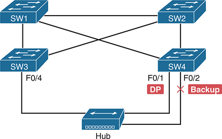

**Figure 9-10** *RSTP Backup Port Example*

S W 1, S W 2, S W 3, and S W 4 are interconnected switches. S W 1 connects to a hub through the interface Fast Ethernet 0/1 designated port (DP) and Fast Ethernet 0/2 backup port. S W 3 connects to the hub through the interface Fast Ethernet 0/4. The backup line, denoted by an X, signifies redundancy in the network topology, ensuring failover capability in case of link failure or congestion.

With a backup port, if the current designated port fails, SW4 can start using the backup port as the new designated port with rapid convergence. For instance, if SW4's F0/1 interface were to fail, SW4 could transition F0/2 to the designated port role, without any delay in moving from the discarding state to a forwarding state.

#### RSTP Port Types

The final RSTP concept included here relates to some terms RSTP uses to refer to different types of ports and the links that connect to those ports.

To begin, consider the basic image in [Figure 9-11](vol1_ch09.md#ch09fig11). It shows several links between two switches. RSTP considers these links to be point-to-point links and the ports connected to them to be point-to-point ports because the link connects exactly two devices (points).

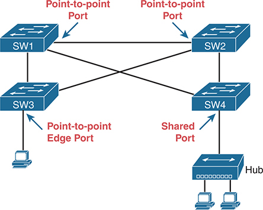

**Figure 9-11** *RSTP Link Types*

S W 1 connects to a hub through the interface Fast Ethernet 0/1 designated port (D P). S W 3 connects to a P C through a point-to-point edge port, facilitating direct communication between the switch and the end device. S W 1 connects to S W 2 through a point-to-point port, establishing a direct link between the switches. On the other hand, S W 4 connects to a hub through a shared port, where the hub branches out to two P Cs, indicating a shared link where multiple devices communicate through the same medium.

RSTP further classifies point-to-point ports into two categories. Point-to-point ports that connect two switches are not at the edge of the network and are simply called *point-to-point ports*. Ports that instead connect to a single endpoint device at the edge of the network, like a PC or server, are called *point-to-point edge ports*, or simply *edge ports*. In [Figure 9-11](vol1_ch09.md#ch09fig11), SW3's switch port connected to a PC is an edge port.

Finally, RSTP defines the term *shared* to describe ports connected to a hub. The term *shared* comes from the fact that hubs create a shared Ethernet; hubs also force the attached switch port to use half-duplex logic. RSTP assumes that all half-duplex ports may be connected to hubs, treating ports that use half duplex as shared ports. RSTP converges more slowly on shared ports as compared to all point-to-point ports.

### Optional STP Features

To close out the chapter, the last major section describes optional features that make STP work even better or be more secure: EtherChannel, PortFast, BPDU Guard, Root Guard, and Loop Guard.

#### EtherChannel

One of the best ways to lower STP's convergence time is to avoid convergence altogether. [EtherChannel](vol1_gloss.md#gloss_129) provides a way to prevent STP convergence from being needed when only a single port or cable failure occurs.

EtherChannel combines multiple parallel segments of equal speed (up to eight) between the same pair of switches, bundled into an EtherChannel. The switches treat the EtherChannel as a single interface with regard to STP. As a result, if one of the links fails, but at least one of the links is up, STP convergence does not have to occur. For example, [Figure 9-12](vol1_ch09.md#ch09fig12) shows the familiar three-switch network, but now with two Gigabit Ethernet connections between each pair of switches.

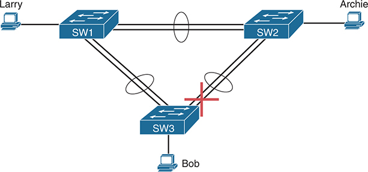

**Figure 9-12** *Two-Segment EtherChannels Between Switches*

Larry connects to S W 1, Archie connects to S W 2, and Bob also connects to S W 2. The connections are represented by two lines with an ellipse surrounding them, indicating bundled links forming Ether Channels between switches. The connection between S W 2 and S W 3 is blocked.

With each pair of Ethernet links configured as an EtherChannel, STP treats each EtherChannel as a single link. In other words, both links to the same switch must fail for a switch to need to cause STP convergence. Without EtherChannel, if you have multiple parallel links between two switches, STP blocks all the links except one. With EtherChannel, all the parallel links can be up and working simultaneously while reducing the number of times STP must converge, making the network more available.

The current CCNA exam blueprint includes a topic for configuring both Layer 2 EtherChannels (as described here) and Layer 3 EtherChannels. [Chapter 10](vol1_ch10.md#ch10), "[RSTP and EtherChannel Configuration](vol1_ch10.md#ch10)," shows how to configure Layer 2 EtherChannels, while [Chapter 18](vol1_ch18.md#ch18), "[IP Routing in the LAN](vol1_ch18.md#ch18)," shows how to configure Layer 3 EtherChannels. Note that Layer 2 EtherChannels combine links that switches use as switch ports, with the switches using Layer 2 switching logic to forward and receive Ethernet frames over the EtherChannels. Layer 3 EtherChannels also combine links, but the switches use Layer 3 routing logic to forward packets over the EtherChannels.

#### PortFast

Switch ports that connect directly to endpoints rather than to other switches eventually use the designated port (DP) role and a forwarding state. However, with default port settings, they go through some interim steps:

1. After the interface reaches the connected (up/up) state, the switch STP logic initially places the port in the STP discarding (blocking) state.
2. The switch begins sending BPDUs out of the port and listens for incoming BPDUs, to decide whether the switch port should take on a root port (RP) or a DP role.
3. Because the connected device is not a switch, the local switch receives no incoming BPDUs. As a result, the switch port wins the DP election and becomes a DP.
4. The switch takes interim steps to transition to a forwarding state:

   1. STP moves the port first to the listening state, then to the learning state, and then to the forwarding state. The interim states require 15 seconds each by default (per the default Forward Delay timer).
   2. RSTP follows the same process, except it has no listening state. It moves from discarding to learning to forwarding.

[PortFast](vol1_gloss.md#gloss_309) bypasses the process. After the interface reaches a connected state, STP PortFast immediately moves the port to the DP role and the forwarding state without delay. As long as the interface remains up, the STP role remains as DP with a forwarding state.

PortFast exists to support access links connected to endpoints, as shown in [Figure 9-13](vol1_ch09.md#ch09fig13). You know the switch always wins the DP election on those links because the endpoints do not use STP. Those endpoints can include single computers, phones with connected computers, or a trunk connected to a server.

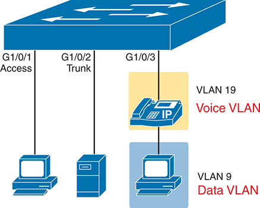

**Figure 9-13** *Access Ports Appropriate for the PortFast Feature*

A switch is connected to a P C through port G1/0/1, designated as an access port, ensuring direct connectivity for end devices. Another connection from the switch to a server is established through port G1/0/2, configured as a trunk port, facilitating the transmission of multiple V L A Ns between devices. Additionally, the switch connects to an I P telephone, configured with V L A N 19 for voice traffic, through port G1/0/3. This port configuration enables the prioritization of voice traffic through the designated voice V L A N. Moreover, the voice V L A N is connected to a P C, configured with V L A N 9 for data traffic.

As you might guess from the fact that PortFast speeds convergence, STP did not include the PortFast feature, but RSTP included it as one of its rapid convergence optimizations. You might recall the mention of RSTP port types, particularly point-to-point edge port types, around [Figure 9-11](vol1_ch09.md#ch09fig11). RSTP, by design of the protocol, converges quickly on these ports of type point-to-point edge by bypassing the learning state. Note that Cisco introduced this idea with its PortFast years before the IEEE finalized RSTP, which is why we still call the feature PortFast many decades later. In practice, Cisco switches enable RSTP point-to-point edge ports by enabling PortFast on the port.

While very useful and popular, PortFast also introduces the risk of creating loops. PortFast ports should never connect to bridges or switches. With PortFast enabled, the port ignores incoming BPDUs, always acts as a designated port, and always forwards. As a result, an unexpected or rogue switch connected to a PortFast-enabled port can create a forwarding loop.

#### BPDU Guard

PortFast creates an exposure: the possibility of a forwarding loop if an unexpected switch connects to a PortFast port. The Cisco [BPDU Guard](vol1_gloss.md#gloss_047) feature helps defeat these kinds of problems by disabling a port if it receives any BPDUs in the port. So, this feature is handy on ports that should be used only as an access port and never connected to another switch.

[Figure 9-14](vol1_ch09.md#ch09fig14) shows the basic idea. The device on the right should be an endpoint device such as a PC. Instead, a new switch named Rogue-1 connects to the legitimate switch SW3--a switch that uses BPDU Guard to protect against this scenario. At Step 2, as soon as switch Rogue-1 sends a BPDU into SW3, SW3's BPDU Guard logic reacts, disabling the port.

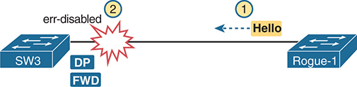

**Figure 9-14** *Basic Logic of BPDU Guard*

The connection between switch S W 3 and rogue switch 1 is shown as disabled, indicating the activation of the B P D U Guard. Rogue switch 1 attempts to send Hello B P D Us to S W 3, but the connection is blocked, preventing potential loops in the network. The status of the connection is denoted as designated port (D P) and forwarding (F W D), illustrating that the B P D U Guard effectively detects and disables unauthorized switches or devices.

Most switch access port configurations combine PortFast and BPDU Guard, although both can be used independently. Using PortFast without protection against the scenario in [Figure 9-14](vol1_ch09.md#ch09fig14) risks a loop. Using BPDU Guard on these same ports makes sense because if another switch connects to such a port, the local switch can disable the port to prevent a loop.

#### BPDU Filter

The [BPDU Filter](vol1_gloss.md#gloss_048) feature defines two different functions under one named feature. Both fall under the name BPDU filter because, behind the scenes, they filter (discard) STP BPDUs.

First, the BPDU Filter feature can be used as an alternative to BPDU Guard when used along with PortFast. Both BPDU Guard and BPDU Filter prevent loops when unexpected BPDUs arrive in a PortFast-enabled port. However, BPDU Filter reacts to those incoming BPDUs by disabling PortFast logic (which creates the possibility of a forwarding loop) and restoring normal STP logic on the port (which prevents the possibility of a forwarding loop).

The other BPDU Filter feature disables STP on an interface. When enabled, BPDU Filter discards all sent and received BPDUs on an interface.

The following pages take a closer look at each logic branch.

##### BPDU Filter to Prevent Loops on PortFast Ports

Most campus LANs make widespread use of PortFast, both on access ports and on server ports that use trunking. However, with PortFast alone but with no other features, you risk someone unplugging those devices and replacing them with switches to create a forwarding loop. [Figure 9-15](vol1_ch09.md#ch09fig15) shows such a case, where switch SW1's two ports use PortFast but the endpoints were replaced with two rogue switches.

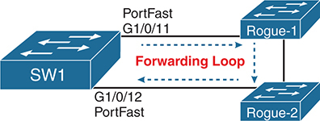

**Figure 9-15** *Possible Loop on PortFast Ports with Rogue Switches*

In the setup, there are switches S W 1 and rogue switches Rogue 1 and Rogue 2. Rogue 1 is connected to S W 1 via Port Fast G 1/0/11, and Rogue 2 is connected to S W 2 via Port Fast G 1/0/12. The rogue switches are interconnected, forming a forwarding loop that spans from S W 1 and back to S W 1.

To protect against such a case, you can use either BPDU Guard or BPDU Filter. Ports that use PortFast should not receive BPDUs under normal circumstances, but nothing prevents people from replacing devices as shown in [Figure 9-15](vol1_ch09.md#ch09fig15). If that happens, BPDU Filter reacts by disabling PortFast on the port. The port then reverts to normal STP rules. STP will then determine a new port role and status as needed, use STP rules, and prevent any forwarding loop. The port may block or forward, depending on the results of that normal STP logic.

The previous paragraph gets at the reason why an engineer might choose this BPDU Filter feature; however, the following list details the specific steps, which includes some BPDU filtering.

1. To enable this branch of BPDU Filter logic, use the related global command **spanning-tree portfast bpdufilter default**.
2. IOS finds all ports that currently use PortFast and enables conditional BPDU Filter on those ports.
3. When any such port comes up:

   1. BPDU Filter allows STP to send BPDUs as normal for 10 × Hello Time (2 × 10 seconds, or 20 seconds total by default).
   2. If the port receives zero BPDUs in that time, BPDU Filter begins filtering (discarding) sent BPDUs.
4. BPDU Filter monitors to notice any incoming BPDUs. If they begin to arrive:

   1. It disables PortFast on the port.
   2. It reverts the port to use STP with normal STP rules.

##### BPDU Filter to Disable STP on a Port

The BPDU Filter feature can be configured to enable a completely different style of logic. As you will see in [Chapter 10](vol1_ch10.md#ch10)'s section titled "[BPDU Filter](vol1_ch09.md#ch09lev2sec16)," the configuration does not make it obvious which style the configuration enables. However, when enabled with an interface subcommand, BPDU Filter does just what the name says: It filters (discards) all BPDUs on the ports, both outgoing and incoming.

Using BPDU Filter in this way effectively disables STP on the port. Using this feature is dangerous: Do not use it in production until you fully test and understand it.

As an example of why you might want to use BPDU Filter to disable STP on a port, consider the scenario in [Figure 9-16](vol1_ch09.md#ch09fig16). Two IT groups build networks inside the same company. They want to connect their LANs together, but the two groups (Left and Right) do not want the other group's STP to influence theirs--for example, which switch would be allowed to win the root election, a left or a right switch? The two groups meet and decide to keep their STP topologies separate. To do so, they filter all BPDUs sent between the two using BPDU Filter, disabling STP on the one link that connects the two LANs.

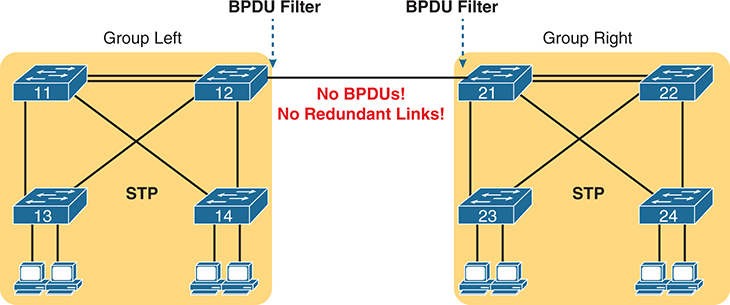

**Figure 9-16** *A Scenario to Consider Disabling STP on a Link (BPDU Filtering)*

In the left group, switches 11, 12, 13, and 14 are interconnected through STP. Switches 13 and 14 each connect to two P Cs. Similarly, in the right group, switches 21, 22, 23, and 24 are interconnected through STP, with switches 13 and 14 connecting to two P Cs each. Notably, switches 12 and 21 are directly connected, and B P D U filtering is enabled on this link, resulting in the absence of Bridge Protocol Data Units (B P D Us).

#### Root Guard

The [Root Guard](vol1_gloss.md#gloss_343) feature monitors incoming BPDUs on a port and reacts if the received BPDU would change the root switch in the VLAN. To understand why that might be useful, consider the topology with six switches in [Figure 9-17](vol1_ch09.md#ch09fig17). The notation by each switch defines how good the priority is on each switch. If you configure the switches with different priorities, you know and control which switches will become the root switch, with switches SW5 and SW6 being the least likely.

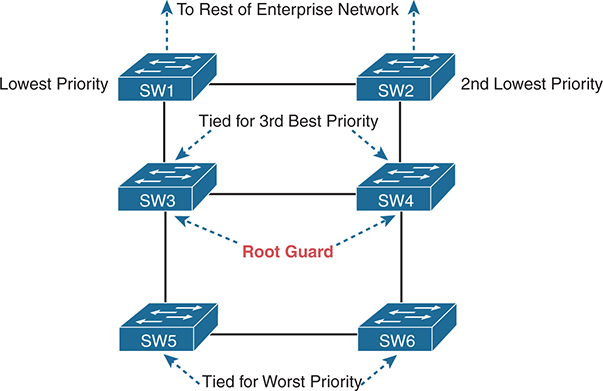

**Figure 9-17** *Larger LAN Showing Most and Least Likely Root Switches*

Switches S W 1 and S W 2 connect to S W 3 and S W 4, respectively, and interconnect amidst them. S W 1 has the lowest priority, and S W 2 has the second lowest priority. These switches serve as the entry points to the rest of the enterprise network. S W 3 and S W 4 connect to S W 5 and S W 6, respectively, and interconnect. These switches are tied for the third-best priority and serve as the root guards. Finally, S W 5 and S W 6 are interconnected and tied for the worst priority in the network hierarchy.

Now imagine that your organization planned the design in the figure, but you directly control switches SW1 through SW4 while another organization controls switches SW5 and SW6. Both groups agree that SW1 should be the root switch, with SW2 taking over if SW2 fails; however, that agreement does not prevent a configuration mistake on switch SW5 or SW6.

For example, someone in the other group could configure switch SW5 with a priority lower than SW1's priority, and SW5 would become the root switch, creating a suboptimal STP topology. Switch SW5 would send a superior BPDU into the network if such an unplanned configuration occurred. With this topology, SW3 would receive the superior BPDU. Similarly, SW4 might receive a superior BPDU from SW6 if someone lowered switch SW6's priority.

Root Guard, enabled per port, enables the port to operate normally with STP except in this one special case: when it receives a [superior BPDU](vol1_gloss.md#gloss_396) in the port. So, you enable Root Guard on ports connected to other switches, usually trunks, and STP works normally; however, Root Guard on a port also prevents the election of a different root switch that is reachable through that port. Root Guard achieves that by listening for incoming Hellos on the port, and if it is a superior Hello, the switch disables the port by using a special STP port state (the [broken state](vol1_gloss.md#gloss_056)). Root Guard recovers the port automatically when the superior Hellos no longer occur.

The choice to use Root Guard begins with a close analysis of the topology. You must agree which switches should never become root and which ports should never receive superior BPDUs.

#### Loop Guard

The final optional tool mentioned here, Loop Guard, protects against a specific case in an STP topology. This feature helps protect the worst priority switch (highest BID) in a typical STP design, such as switch SW3 in [Figure 9-18](vol1_ch09.md#ch09fig18). The mechanisms apply to regular operation in a typical STP design, forcing some review of topics from earlier in the chapter.

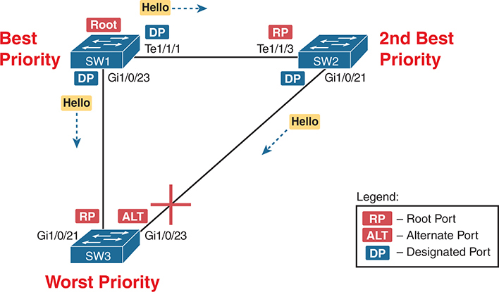

**Figure 9-18** *Typical STP Design*

S W 1 has port Te1/1/1 designated as a designated port (D P) and port Te1/1/3 as a root port (RP) towards S W 2, sending a Hello message. S W 2 designates port Gi1/0/21 as a designated port (D P) and port Gi1/0/23 as an alternate (A L T) towards S W 3, with the connection blocked. S W 1 designates port Gi1/0/21 as a root port (R P) and port Gi1/0/23 as a designated port (D P) towards S W 3, sending a Hello message. S W 1 is the highest priority, S W 2 is the second-highest priority, and S W 3 is the lowest priority.

A typical STP design uses one switch as the known root under normal circumstances. To achieve that, you assign that switch the lowest priority. Another switch has the role of being the best backup, so you assign it the second-best priority value. Switches SW1 and SW2 play those roles in [Figure 9-18](vol1_ch09.md#ch09fig18). All the other switches have a lower priority than SW1 and SW2, such as switch SW3.

Next, consider an observation about this design, about the worst switch (SW3). SW3's ports on its switch-to-switch links seldom become designated ports. Why? STP determines the DP based on lowest root cost of the switches on the link, and breaks ties based on the better (lower) BID. SW3 loses the DP election tiebreaker in this scenario.

However, SW3's ports have other roles, just not the DP role, as follows:

* One link will be its root port (G1/0/21 in [Figure 9-18](vol1_ch09.md#ch09fig18)) and settle into a forwarding state.
* The other will be an alternate port (G1/0/23 in [Figure 9-18](vol1_ch09.md#ch09fig18)) and settle into a discarding state.

The second meaningful observation is that the worst switch (SW3) receives repeated Hellos in both switch-to-switch links. The figure shows the Hellos. The rule is that switches forward Hellos out designated ports every Hello time (the default is 2 seconds).

The third fact that helps you understand Loop Guard involves unidirectional links. [Figure 9-19](vol1_ch09.md#ch09fig19) shows the idea. The interfaces on the ends of a fiber link will be up and in a connected state, but one of the two fibers has a problem. The problem could prevent frames from arriving at the other end of the fiber. [Figure 9-19](vol1_ch09.md#ch09fig19) shows such a case, with only the right-to-left direction working.

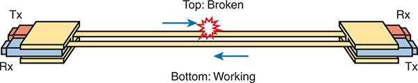

**Figure 9-19** *Unidirectional Fiber Link*

The left interface, labeled T x (transmitter), and the right interface, labeled R x (receiver), are depicted, with two lines representing the connection. The top line indicates a broken connection from left to right, while the bottom line signifies a functional connection from right to left.

To summarize, Loop Guard relies on these underlying facts:

* A switch with the worst (highest) priority in a design has switch-to-switch ports in the root port (RP) and alternate port (ALT) roles but seldom the designated port (DP) role.
* Those same ports normally receive Hellos every Hello time because each link's neighboring switch is the DP.
* A [unidirectional link](vol1_gloss.md#gloss_422) can occur, in which the interface state remains up (connected) on both ends but frames cannot flow in one direction.

The [Loop Guard](vol1_gloss.md#gloss_247) feature takes advantage of the above observations to protect against a class of failures that, without Loop Guard, results in one of switch SW3's switch-switch links becoming a DP. [Figure 9-20](vol1_ch09.md#ch09fig20) shows an adjustment to [Figure 9-18](vol1_ch09.md#ch09fig18) for one scenario, with the SW2-SW3 link becoming unidirectional:

1. The SW2-SW3 link's fiber for transmitting from SW2 to SW3 fails.
2. Because SW2's G1/0/21 and SW3's G1/0/23 ports remain in a connected state, there is no interface failure to influence STP.
3. SW3 ceases to receive incoming Hello messages on its G1/0/23 port.
4. After the appropriate timeouts, SW3 believes it is the only switch on the link connected to its G1/0/23 interface, so it changes the port to a DP and moves toward a forwarding state.

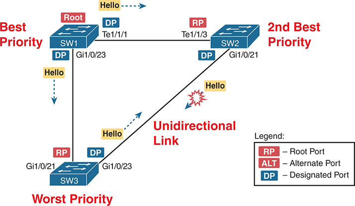

**Figure 9-20** *SW3's ALT Port Becomes DP, Forwards; All Links Forward, Create Loop*

S W 1 has port Te1/1/1 designated as a designated port (D P) and port Te1/1/3 as a root port (RP) towards S W 2, sending a Hello message. S W 2 designates port Gi1/0/21 as a designated port (D P) and port Gi1/0/23 as DP towards S W 3, with the connection blocked. S W 1 designates port Gi1/0/21 as a root port (R P) and port Gi1/0/23 as a designated port (D P) towards S W 3, sending a Hello message. S W 1 is the highest priority, S W 2 is the second-highest priority, and S W 3 is the lowest priority. The hello message from S W 2 to S W 3 is broken.

Take a moment and look at the ends of the switch-to-switch links. All ports are either an RP or DP, both of which use a forwarding state. As a result, a forwarding loop exists. Note that with the unidirectional link between switches SW2 and SW3, broken in the direction from SW2 to SW3, the forwarding loop exists only in the opposite (counter-clockwise) direction.

Finally, you can now appreciate the Loop Guard feature. You enable it on an interface and it takes the following actions:

If the port is a root or alternate port, prevent it from becoming a designated port by moving it to the special broken STP state.

As with Root Guard, you must work through the underlying concepts to decide the ports on which to enable Loop Guard. Generally, you need it only on fiber-optic links connected to other switches. You should also only choose ports on switches with a poor (high) STP priority, so they normally have switch-to-switch ports in the RP or ALT roles but not the DP role.

### Chapter Review

One key to doing well on the exams is to perform repetitive spaced review sessions. Review this chapter's material using either the tools in the book or interactive tools for the same material found on the book's companion website. Refer to the "[Your Study Plan](vol1_pref10.md#pref10)" element for more details. [Table 9-11](vol1_ch09.md#ch09tab11) outlines the key review elements and where you can find them. To better track your study progress, record when you completed these activities in the second column.

**Table 9-11** Chapter Review Tracking

| Review Element | Review Date(s) | Resource Used |
| --- | --- | --- |
| Review key topics |  | Book, website |
| Review key terms |  | Book, website |
| Answer DIKTA questions |  | Book, PTP |
| Review memory tables |  | Website |

### Review All the Key Topics

**Table 9-12** Key Topics for [Chapter 9](vol1_ch09.md#ch09)

| Key Topic Element | Description | Page Number |
| --- | --- | --- |
| [Table 9-2](vol1_ch09.md#ch09tab02) | Lists the three main problems that occur when not using STP in a LAN with redundant links | [227](vol1_ch09.md#page_227) |
| [Figure 9-2](vol1_ch09.md#ch09fig02) | How STP blocks to break a loop | [227](vol1_ch09.md#page_227) |
| [Table 9-3](vol1_ch09.md#ch09tab03) | Lists the reasons why a switch chooses to place an interface into forwarding or blocking state | [229](vol1_ch09.md#page_229) |
| [Table 9-4](vol1_ch09.md#ch09tab04) | Lists the most important fields in Hello BPDU messages | [230](vol1_ch09.md#page_230) |
| List | Logic for the root switch election | [231](vol1_ch09.md#page_231) |
| [Figure 9-6](vol1_ch09.md#ch09fig06) | Shows how switches calculate their root cost | [233](vol1_ch09.md#page_233) |
| [Table 9-6](vol1_ch09.md#ch09tab06) | Lists the original and current default STP port costs for various interface speeds | [236](vol1_ch09.md#page_236) |
| Step list | A summary description of steady-state STP operations | [236](vol1_ch09.md#page_236) |
| [Table 9-7](vol1_ch09.md#ch09tab07) | STP timers | [237](vol1_ch09.md#page_237) |
| List | Definitions of what occurs in the listening and learning states | [239](vol1_ch09.md#page_239) |
| [Table 9-8](vol1_ch09.md#ch09tab08) | Summary of STP and RSTP states | [239](vol1_ch09.md#page_239) |
| List | Key similarities between 802.1D STP and 802.1w RSTP | [240](vol1_ch09.md#page_240) |
| List | RSTP mechanisms for faster convergence compared to STP | [241](vol1_ch09.md#page_241) |
| [Table 9-9](vol1_ch09.md#ch09tab09) | List of 802.1w port roles | [241](vol1_ch09.md#page_241) |
| [Table 9-10](vol1_ch09.md#ch09tab10) | Comparisons of port states with 802.1D and 802.1w | [244](vol1_ch09.md#page_244) |
| [Figure 9-14](vol1_ch09.md#ch09fig14) | Basic logic for BPDU Guard | [248](vol1_ch09.md#page_248) |
| [Figure 9-15](vol1_ch09.md#ch09fig15) | An example forwarding loop risk with PortFast | [249](vol1_ch09.md#page_249) |
| List | Conditional BPDU Filter logic applied to PortFast ports | [249](vol1_ch09.md#page_249) |
| [Figure 9-17](vol1_ch09.md#ch09fig17) | Locations to apply Root Guard | [250](vol1_ch09.md#page_250) |
| Paragraph | Loop Guard rules | [253](vol1_ch09.md#page_253) |

### Key Terms You Should Know

[alternate port (role)](vol1_ch09.md#key_111)

[backup port (role)](vol1_ch09.md#key_112)

[blocking state](vol1_ch09.md#key_113)

[BPDU Filter](vol1_ch09.md#key_114)

[BPDU Guard](vol1_ch09.md#key_115)

[bridge ID](vol1_ch09.md#key_116)

[bridge protocol data unit (BPDU)](vol1_ch09.md#key_117)

[broken state](vol1_ch09.md#key_118)

[designated port](vol1_ch09.md#key_119)

[designated port (role)](vol1_ch09.md#key_120)

[disabled port (role)](vol1_ch09.md#key_121)

[disabled state](vol1_ch09.md#key_122)

[discarding state](vol1_ch09.md#key_123)

[EtherChannel](vol1_ch09.md#key_124)

[forward delay](vol1_ch09.md#key_125)

[forwarding state](vol1_ch09.md#key_126)

[Hello BPDU](vol1_ch09.md#key_127)

[learning state](vol1_ch09.md#key_128)

[listening state](vol1_ch09.md#key_129)

[Loop Guard](vol1_ch09.md#key_130)

[MaxAge](vol1_ch09.md#key_131)

[PortFast](vol1_ch09.md#key_132)

[Rapid STP (RSTP)](vol1_ch09.md#key_133)

[root cost](vol1_ch09.md#key_134)

[Root Guard](vol1_ch09.md#key_135)

[root port (role)](vol1_ch09.md#key_136)

[root switch](vol1_ch09.md#key_137)

[Spanning Tree Protocol (STP)](vol1_ch09.md#key_138)

[superior BPDU](vol1_ch09.md#key_139)

[unidirectional link](vol1_ch09.md#key_140)