# Chapter 10


## RSTP and EtherChannel Configuration

This chapter covers the following exam topics:

2.0 Network Access

2.4 Configure and verify (Layer 2/Layer 3) EtherChannel (LACP)

2.5 Interpret basic operations of Rapid PVST+ Spanning Tree Protocol

2.5.a Root port, root bridge (primary/secondary), and other port names

2.5.b Port states and roles

2.5.c PortFast

2.5.d Root guard, loop guard, BPDU filter, and BPDU guard

This chapter shows how to configure Rapid Spanning Tree Protocol (RSTP) and Layer 2 EtherChannels.

The first two sections take a little different approach than many other CLI-focused parts of the book, based on exam topic 2.5. That exam topic begins with the phrase "interpret basic operations," which emphasizes the concepts behind what happens in the CLI. The first major section examines STP concepts using some configuration, with much focus on interpreting **show** command output. The second major section, about exam topics 2.5.c and 2.5.d, takes the same approach.

The EtherChannel content, in the final major section of the chapter, follows a typical flow for most configuration/verification topics in a certification guide: it reviews concepts, shows configurations, followed by **show** commands that point out the configuration settings and operational state. The details include how to manually configure a channel, how to cause a switch to dynamically create a channel, and how EtherChannel load distribution works.

I encourage you to practice and experiment with STP from the CLI. If you're looking for lab exercises, check out the Config Labs at my blog site related to this chapter, as detailed in the introduction to this book. (Or, just go to [certskills.com/config-labs](http://certskills.com/config-labs) for more info.)

Finally, like [Chapter 9](vol1_ch09.md#ch09), this chapter is longer than I prefer. If you like to think of each chapter as one study session, you might need to think about splitting this chapter into two study sessions. Stop the first study session just as you reach the third major section, titled "[Configuring Layer 2 EtherChannel](vol1_ch10.md#ch10lev1sec5)." The second study session would consist of the "[Configuring Layer 2 EtherChannel](vol1_ch10.md#ch10lev1sec5)" section.

### "Do I Know This Already?" Quiz

Take the quiz (either here or use the PTP software) if you want to use the score to help you decide how much time to spend on this chapter. The letter answers are listed at the bottom of the page following the quiz. [Appendix C](vol1_appc.md#appc), found both at the end of the book as well as on the companion website, includes both the answers and explanations. You can also find both answers and explanations in the PTP testing software.

**Table 10-1** "Do I Know This Already?" Foundation Topics Section-to-Question Mapping

| Foundation Topics Section | Questions |
| --- | --- |
| Understanding RSTP Through Configuration | 1-3 |
| Identifying Optional STP Features | 4-5 |
| Configuring Layer 2 EtherChannel | 6-8 |

**[1](vol1_ch10.md#ques10_1a).** Which type value on the **spanning-tree mode** *type* global command enables the use of RSTP?

1. **rapid-pvst**
2. **pvst**
3. **rstp**
4. **rpvst**

**[2](vol1_ch10.md#ques10_2a).** Examine the following output from the **show spanning-tree vlan 5** command, which describes a root switch in a LAN. Which answers accurately describe facts related to the root's bridge ID? (Choose two answers.)

[Click here to view code image](vol1_ch10_images.md#f0257-01)

```
SW1# show spanning-tree vlan 5

VLAN0005
   Spanning tree enabled protocol rstp
   Root ID Priority 32773
            Address     1833.9d7b.0e80
            Cost        15
            Port        25 (GigabitEthernet0/1)
            Hello Time 2 sec Max Age 20 sec Forward Delay 15 sec
```

1. The system ID extension value, in decimal, is 5.
2. The root's configured priority value is 32773.
3. The root's configured priority value is 32768.
4. The system ID extension value, in hexadecimal, is 1833.9d7b.0e80.

**[3](vol1_ch10.md#ques10_3a).** With Cisco's RPVST+, which of the following actions does a switch take to identify which VLAN is described by a BPDU? (Choose three answers.)

1. Adds a VLAN tag when forwarding a BPDU on trunks
2. Adds the VLAN ID in an extra TLV in the BPDU
3. Lists the VLAN ID as the middle 12 bits of the System ID field of the BPDU
4. Lists the VLAN ID in the System ID Extension field of the BPDU

**[4](vol1_ch10.md#ques10_4a).** A switch port in access mode connects to a single laptop. An attacker replaces the laptop with a LAN switch that uses STP. Which combination of features, enabled on the access port, results in the switch changing the port's interface state to err-disabled? (Choose two answers.)

1. PortFast enabled but BPDU Guard not enabled
2. PortFast and BPDU Guard enabled
3. PortFast disabled but BPDU Guard enabled
4. PortFast and BPDU Guard disabled

**[5](vol1_ch10.md#ques10_5a).** Root Guard has acted to disable port G1/0/1. An engineer uses the **show interfaces status** and **show spanning-tree vlan 1** commands to investigate the current status. Which answers list facts expected due to Root Guard's actions? (Choose two answers.)

1. The STP port state per **show spanning-tree vlan 1** shows BKN (broken).
2. The interface state per **show interfaces status** shows err-disabled.
3. The STP port state per **show spanning-tree vlan 1** shows FWD (forwarding).
4. The STP port state per **show spanning-tree vlan 1** shows BLK (blocking).
5. The interface state per **show interfaces status** shows connected.

**[6](vol1_ch10.md#ques10_6a).** An engineer configures a switch to put interfaces G0/1 and G0/2 into the same Layer 2 EtherChannel. Which of the following terms is used in the configuration commands?

1. **EtherChannel**
2. **PortChannel**
3. **Ethernet-Channel**
4. **Channel-group**

**[7](vol1_ch10.md#ques10_7a).** Which combinations of keywords on the **channel-group** interface subcommand on two neighboring switches will cause the switches to use LACP and attempt to add the link to the EtherChannel? (Choose two answers.)

1. **desirable** and **active**
2. **passive** and **active**
3. **active** and **auto**
4. **active** and **active**

**[8](vol1_ch10.md#ques10_8a).** A Cisco Catalyst switch needs to send frames over a Layer 2 EtherChannel. Which answer best describes how the switch balances the traffic over the four active links in the channel?

1. Breaks each frame into fragments of approximately one-fourth of the original frame, sending one fragment over each link
2. Sends the entire frame over one link, alternating links in sequence for each successive frame
3. Sends the entire frame over one link, choosing the link by applying some math to fields in each frame's headers
4. Sends the entire frame over one link, using the link with the lowest percent utilization as the next link to use

Answers to the "Do I Know This Already?" quiz:

**[1](vol1_appc.md#ques10_1)** A

**[2](vol1_appc.md#ques10_2)** A, C

**[3](vol1_appc.md#ques10_3)** A, B, D

**[4](vol1_appc.md#ques10_4)** B, C

**[5](vol1_appc.md#ques10_5)** A, E

**[6](vol1_appc.md#ques10_6)** D

**[7](vol1_appc.md#ques10_7)** B, D

**[8](vol1_appc.md#ques10_8)** C

### Foundation Topics

### Understanding RSTP Through Configuration

Cisco IOS switches today typically default to using RSTP rather than STP, with default settings so that RSTP works with no configuration. You can buy some Cisco switches and connect them with Ethernet cables in a redundant topology, and RSTP will ensure that frames do not loop. And even if some switches use RSTP and some use STP, the switches can interoperate and still build a working spanning tree--and you never even have to think about changing any settings!

Although RSTP works without any configuration, most medium-size to large-size campus LANs benefit from some RSTP configuration. For instance, [Figure 10-1](vol1_ch10.md#ch10fig01) shows a typical LAN design model, with two distribution layer switches (D1 and D2). The design may have dozens of access layer switches that connect to end users; the figure shows just three access switches (A1, A2, and A3). For a variety of reasons, most network engineers make the distribution layer switches be the root.


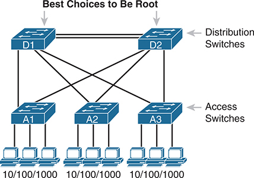


**Figure 10-1** *Typical Configuration Choice: Making Distribution Switch Be Root*

The distribution switches (D 1 and D 2) are connected to access switches (A 1, A 2, and A 3). The distribution switches serve as the root of the spanning tree protocol (S T P). Access switch A 1 connects three P Cs with 10/100/1000 M b p s Ethernet, as does A 2 and A 3. The best choices to be the root switches are D 1 and D 2.

Note

Cisco uses the term *access switch* to refer to switches used to connect to endpoint devices. The term *distribution switch* refers to switches that do not connect to endpoints but rather connect to each access switch, providing a means to distribute frames throughout the LAN. The term *uplink* refers to the switch-to-switch links, usually trunks, between access and distribution switches. If you want to read more about LAN design concepts and terms, refer to the *CCNA 200-301 Official Cert Guide, Volume 2*, Second Edition, [Chapter 17](vol1_ch17.md#ch17), "[LAN Architecture](vol1_ch17.md#ch17)."

As discussed in the introduction to this chapter, this first section of the chapter examines a variety of STP/RSTP configuration topics, but with a goal of revealing a few more details about how STP/RSTP operate. Following this opening section about STP/RSTP configuration, the next section examines how to configure Layer 2 EtherChannels and how that impacts STP/RSTP.

#### The Need for Multiple Spanning Trees

The IEEE first standardized STP as the IEEE 802.1D standard, first published back in 1990. To put some perspective on that date, Cisco did not have a LAN switch product line at the time, and virtual LANs did not exist yet. Instead of multiple VLANs in a physical Ethernet LAN, the physical Ethernet LAN existed as one single broadcast domain, with one instance of STP.

By the mid-1990s, VLANs had appeared on the scene, along with LAN switches. The emergence of VLANs posed a challenge for STP--the only type of STP available at the time--because STP defined a single common spanning tree (CST) topology for the entire LAN. The IEEE needed an option to create multiple spanning trees so that traffic could be balanced across the available links, as shown in [Figure 10-2](vol1_ch10.md#ch10fig02). With two different STP instances, SW3 could block on a different interface in each VLAN, as shown in the figure.


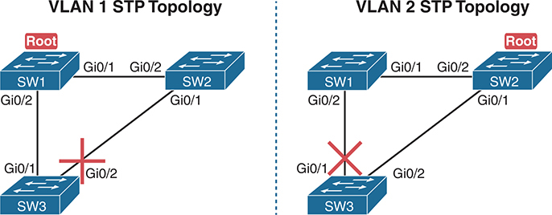


**Figure 10-2** *Load Balancing with One Tree for VLAN 1 and Another for VLAN 2*

For V L A N 1, the topology includes S W 1 as the root, with Gi0/1 connecting to S W 2, S W 2's Gi0/1 connecting to S W 3's Gi0/2, and S W 3's Gi0/1 connecting back to S W 1's Gi0/1. The connection between S W 2 and S W 3 is blocked to prevent loops. For V L A N 2, the topology is similar, with S W 1 remaining as the root, connecting to S W 2's Gi0/1, which further connects to S W 3's Gi0/2. S W 3's Gi0/1 connects back to S W 1's Gi0/1. This time, the connection between S W 1 and S W 3 is blocked to maintain network stability.

#### STP Modes and Standards

Because of the sequence of events over the history of the various STP family of protocols, vendors like Cisco needed to create their own proprietary features to create the per-VLAN spanning tree concept shown in [Figure 10-2](vol1_ch10.md#ch10fig02). That sequence resulted in the following:

* When STP was the only STP standard back in the 1990s with 802.1D, Cisco created the STP-based Per VLAN Spanning Tree Plus ([PVST+](vol1_gloss.md#gloss_322)) protocol, which creates one spanning tree instance per VLAN.
* When the IEEE introduced RSTP (in 802.1D amendment 802.1w, in 2001), they again defined it as a means to create a single spanning tree.
* When Cisco added support for RSTP to its switches, it created the [Rapid PVST+](vol1_gloss.md#gloss_325) (RPVST+) protocol. RPVST+ provided more features than standardized RSTP, including one tree per VLAN.
* To create multiple spanning trees, the IEEE did not adopt Cisco's PVST+ or RPVST+. Instead, the IEEE created a different method: Multiple Spanning Tree Protocol (MSTP), originally defined in 802.1Q amendment 802.1s.

[Figure 10-3](vol1_ch10.md#ch10fig03) shows the features as a timeline for perspective.

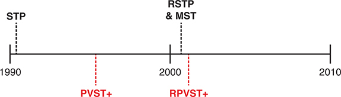


**Figure 10-3** *Timeline of Per-VLAN and Multiple STP Features*

In 1990, the Per-V L A N Spanning Tree Plus (P V S T plus) feature was introduced. Around 2000, the Rapid Spanning Tree Protocol (R S T P) emerged. By 2010, the Multiple Spanning Tree Protocol (M S T) and the Rapid Per-V L A N Spanning Tree Plus (R P V S T plus) were introduced.

Today, Cisco Catalyst switches give us three options to configure on the **spanning-tree mode** command, which tells the switch which type of STP to use. Note that the switches do not support STP or RSTP with the single tree (CST). They can use either the Cisco-proprietary and STP-based PVST+, Cisco-proprietary and RSTP-based RPVST+, or the IEEE standard MSTP. [Table 10-2](vol1_ch10.md#ch10tab02) summarizes some of the facts about these standards and options, along with the keywords used on the **spanning-tree mode** global configuration command. [Example 10-1](vol1_ch10.md#exa10_1), which follows, shows the command options in global configuration mode.


**Table 10-2** STP Standards and Configuration Options

| Name | Based on STP or RSTP? | # Trees | Original IEEE Standard | Config Parameter |
| --- | --- | --- | --- | --- |
| STP | STP | 1 (CST) | 802.1D | N/A |
| PVST+ | STP | 1/VLAN | 802.1D | **pvst** |
| RSTP | RSTP | 1 (CST) | 802.1w | N/A |
| Rapid PVST+ | RSTP | 1/VLAN | 802.1w | **rapid-pvst** |
| MSTP | RSTP | 1 or more[\*](vol1_ch10.md#tfn10_2a) | 802.1s | **mst** |

[\*](vol1_ch10.md#tfn10_2) MSTP allows the definition of as many instances (multiple spanning tree instances, or MSTIs) as chosen by the network designer but does not require one per VLAN.

**Example 10-1** *Cisco Switch Spanning Tree modes*

[Click here to view code image](vol1_ch10_images.md#f0261-01)

```
SW1(config)# spanning-tree mode ?
  mst         Multiple spanning tree mode
  pvst        Per-Vlan spanning tree mode
  rapid-pvst  Per-Vlan rapid spanning tree mode
SW1(config)#
```

#### The Bridge ID and System ID Extension

To support the idea of multiple spanning trees, whether one per VLAN or simply multiple as created with MSTP, the protocols must consider the VLANs and VLAN trunking. (That's one reason why RSTP and MSTP now exist as part of the 802.1Q standard, which defines VLANs and VLAN trunking.) To help make that work, the IEEE redefined the format of the original BID value to help make per-VLAN instances of STP/RSTP become a reality.

Originally, a switch's BID was formed by combining the switch's 2-byte priority and its 6-byte MAC address. The IEEE later revised the 2-byte priority field as shown in [Figure 10-4](vol1_ch10.md#ch10fig04) as a 4-bit priority field and a 12-bit subfield called the [system ID extension](vol1_gloss.md#gloss_401) (which represents the VLAN ID).


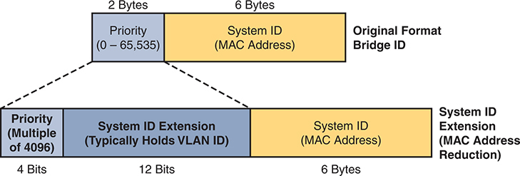


**Figure 10-4** *STP System ID Extension*

In the original format, the Bridge I D comprises the Priority field, ranging from 0 to 65,535 (2 bytes), and the System I D, consisting of the MAC Address (6 bytes). With the Priority expansion, the Priority field becomes a multiple of 4096 (4 bits), and the System I D Extension, typically holding the V L A N I D, occupies 12 bits. The System I D still includes the MAC Address (6 Bytes).

Cisco switches enable you to configure only the priority part of the BID. The switch fills in its universal (burned-in) MAC address as the system ID. It also plugs in the VLAN ID of a VLAN in the 12-bit system ID extension field; you cannot change that behavior either.

However, configuring the priority field may be one of the strangest things to configure on a Cisco router or switch. Focusing on the top of [Figure 10-4](vol1_ch10.md#ch10fig04), the priority field was originally a 16-bit number, which represented a decimal number from 0 to 65,535. Because of that history, the configuration command (**spanning-tree vlan** *vlan-id* **priority** *x*) requires a decimal number between 0 and 65,535. However, because the modern use of this field reserves the final 12 bits for the VLAN ID, IOS restricts the command to multiples of 4096. [Table 10-3](vol1_ch10.md#ch10tab03) shows the reason: The allowed decimal values, when viewed as 16-bit binary values, have all zeros in the final 12 bits.

**Table 10-3** STP/RSTP Configurable Priority Values

| Decimal Value | 16-bit Binary Equivalent | Decimal Value | 16-bit Binary Equivalent |
| --- | --- | --- | --- |
| 0 | `0000 0000 0000 0000` | 32768 | `1000 0000 0000 0000` |
| 4096 | `0001 0000 0000 0000` | 36864 | `1001 0000 0000 0000` |
| 8192 | `0010 0000 0000 0000` | 40960 | `1010 0000 0000 0000` |
| 12288 | `0011 0000 0000 0000` | 45056 | `1011 0000 0000 0000` |
| 16384 | `0100 0000 0000 0000` | 49152 | `1100 0000 0000 0000` |
| 20480 | `0101 0000 0000 0000` | 53248 | `1101 0000 0000 0000` |
| 24576 | `0110 0000 0000 0000` | 57344 | `1110 0000 0000 0000` |
| 28672 | `0111 0000 0000 0000` | 61440 | `1111 0000 0000 0000` |

[Example 10-2](vol1_ch10.md#exa10_2) shows how to configure the priority setting for each VLAN. Note that switches default to a base priority of 32,768.

**Example 10-2** *Help Shows Requirements for Using Increments of 4096 for Priority*

[Click here to view code image](vol1_ch10_images.md#f0262-01)

```
SW1(config)# spanning-tree vlan 1 priority ?
  <0-61440>  bridge priority in increments of 4096  
SW1(config)#
```

#### Identifying Switch Priority and the Root Switch

Cisco Catalyst switches configure the priority value using a number that represents a 16-bit value; however, the system ID extension exists as the low-order 12 bits of that same number. This next topic works through connecting those ideas.

When the switch builds its BID to use for RSTP in a VLAN, it must combine the configured priority with the VLAN ID of that VLAN. Interestingly, the configured priority results in a 16-bit priority that always ends with 12 binary 0s. That fact makes the process of combining values to create the BID a little simpler for the switch and possibly a little simpler for network engineers once you understand it all.

First, consider the process shown in [Figure 10-5](vol1_ch10.md#ch10fig05). The top shows the configured priority value (decimal 32768), in 16-bit binary form, with a System ID Extension of 12 zeros. Moving down the figure, you see the binary version of a VLAN ID (decimal 9). At the last step, the switch replaces those last 12 bits of the System ID Extension with the value that matches the VLAN ID and uses that value as the first 16 bits of the BID.

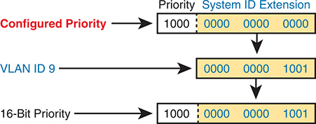


**Figure 10-5** *Configured Priority (16-Bit) and System ID Extension (12-Bit) Added*

In the first scenario, the Configured Priority is set to Priority: 1000, with a System I D Extension of 0000 0000 0000. In the second scenario, V L A N I D 9 is assigned, resulting in a System I D Extension of 0000 0000 1001. Lastly, the 16-Bit Priority is shown with a Priority of 1000 and a System I D Extension of 0000 0000 1001.

##### Switch Priority and Identifying the Root Switch

In most STP designs, you favor two switches to become the root switch. Often, the design calls for one switch to be the root switch, with a second switch ready to take over as root if the first switch fails. [Figure 10-6](vol1_ch10.md#ch10fig06) shows the idea, with switch SW1 as the primary and switch SW2 as the secondary. Additionally, note that the figure uses the interface type abbreviation of Te for TenGigabitEthernet. Also, the switch shows only links between switches to simplify the discussion.

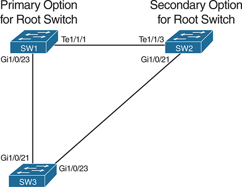


**Figure 10-6** *Sample Network for Root Switch Election Configuration*

S W 1 is designated as the primary option for the root switch, while S W 2 serves as the secondary option. In the network configuration described, Switch 1 (S W 1) is connected to Switch 2 (S W 2) via port Te1/1/1, while Switch 2 (S W 2) is connected to Switch 1 (S W 1) through port Te1/1/3. Switch 2 (S W 2) is linked to Switch 3 (S W 3) via port Gi1/0/21, indicating a Gigabit Ethernet (Gi) connection, while Switch 3 (S W 3) connects back to Switch 2 (S W 2) through port Gi1/0/23. Switch 3 (S W 3) establishes a connection to Switch 1 (S W 1) via port Gi1/0/21, with Switch 1 (S W 1) reciprocating the link through port Gi1/0/23.

Cisco switches default to use a default base priority of 32,768. To achieve the STP goals in the figure, the engineer needs to lower switch SW2's priority to lower than the default value and the value on switch SW1 to even lower. For example, to do just that for the STP instance for VLAN 9, the engineer could do the following:

* **On SW1:** Configure the **spanning-tree vlan 9 priority 24576** global command.
* **On SW2:** Configure the **spanning-tree vlan 9 priority 28672** global command.
* **On SW3:** Rely on the default base priority of 32,768.

The **show spanning-tree vlan 9** command, featured in [Example 10-3](vol1_ch10.md#exa10_3), shows many facts about STP operation. Of particular importance, it lists about five lines of output about the root switch, starting with the line that begins with "Root ID." Following that, it lists several lines about the local switch: the switch on which this command was run. In this case, the output comes from nonroot switch SW3, so the section about the root switch refers to another switch (SW1).

**Example 10-3** *Examining the 16-bit Priority from Nonroot Switch SW3*

[Click here to view code image](vol1_ch10_images.md#f0264-01)

```
SW3# show spanning-tree vlan 9
VLAN0009
  Spanning tree enabled protocol rstp
  Root ID    Priority    24585
             Address     4488.165a.f200
             Cost        4
             Port        21 (GigabitEthernet1/0/21)
             Hello Time   2 sec  Max Age 20 sec  Forward Delay 15 sec

  Bridge ID  Priority    32777  (priority 32768 sys-id-ext 9)
             Address     5cfc.6608.2880
             Hello Time   2 sec  Max Age 20 sec  Forward Delay 15 sec
             Aging Time  300 sec

Interface           Role Sts Cost      Prio.Nbr Type
------------------- ---- --- --------- -------- --------------------------------
Gi1/0/1             Desg FWD 4         128.1    P2p
Gi1/0/2             Desg FWD 4         128.2    P2p
Gi1/0/3             Desg FWD 4         128.3    P2p
Gi1/0/21            Root FWD 4         128.21   P2p
Gi1/0/23            Altn BLK 4         128.23   P2p
```

Look closely at those early message groups that begin with Root ID (about the root switch) and bridge ID (about the local switch). Both sections identify a bridge ID in two parts: the priority and MAC address. The output for the local switch breaks the priority down into the base priority and the VLAN ID. You can also confirm that the local switch is not the root switch based on two different facts:

* The bridge ID values (priority plus MAC address) in the two message sections differ, with the one in the root ID section identifying the root switch.
* The "Root ID" section lists a line with a port number (G1/0/21). That line identifies the local switch's root port. Only nonroot switches have a root port, confirming the local switch is not the root switch.

The output also notes the priority of the root switch and the local switch. The highlighted line for the local switch shows a priority of 32,777, broken down in the same line as a base priority of the (default) value of 32,768 and the system ID extension, or VLAN, of 9 in this case. Earlier, the section about the root switch lists a priority of 24,585. Knowing the output is about VLAN 9, subtract 9 to get the base priority of 24,576.

Consider the output in [Example 10-4](vol1_ch10.md#exa10_4) from root switch SW1 for comparison. Of note:

* The sections about the root switch and the local switch both list the same priority and MAC address, confirming the local switch is the root switch.
* The section about the root switch does not list a root port; root switches do not have root ports.
* The section about the root switch states, "This bridge is the root."

**Example 10-4** *Examining the 16-bit Priority from Root Switch SW1*

[Click here to view code image](vol1_ch10_images.md#f0265-01)

```
SW1# show spanning-tree vlan 9
VLAN0009
  Spanning tree enabled protocol rstp
  Root ID    Priority    24585
             Address     4488.165a.f200
             This bridge is the root
             Hello Time   2 sec  Max Age 20 sec  Forward Delay 15 sec

  Bridge ID  Priority    24585  (priority 24576 sys-id-ext 9)
             Address     4488.165a.f200
             Hello Time   2 sec  Max Age 20 sec  Forward Delay 15 sec
             Aging Time  300 sec

Interface           Role Sts Cost      Prio.Nbr Type
------------------- ---- --- --------- -------- --------------------------------
Gi1/0/23            Desg FWD 4         128.23   P2p
Te1/1/1             Desg FWD 2         128.25   P2p
```

Finally, for one more fact of many in the detailed output from this command, note that the first highlighted line in [Examples 10-3](vol1_ch10.md#exa10_3) and [10-4](vol1_ch10.md#exa10_4) both show the phrase "protocol rstp." That phrase occurs when using PVST+, per the **spanning-tree mode rapid-pvst** global command.

##### Switch Priority Using Root Primary and Secondary

[Examples 10-3](vol1_ch10.md#exa10_3) and [10-4](vol1_ch10.md#exa10_4) relied on the direct configuration of the best priority in switch SW1 (24,576) and second best in switch SW2 (28,672). However, knowing that most STP designs identify the best and second-best switches to use as the root switch, Cisco provides two related commands that mirror that idea. To configure two switches to be the two most likely switches to be the root switch, simply configure

**spanning-tree vlan** *x* **root primary** (on the switch that should be primary)

**spanning-tree vlan** *x* **root secondary** (on the switch that should be secondary)

Both of these commands use some different IOS logic compared to most configuration commands. Both commands cause IOS to choose a priority value when the command is added to the configuration. Then, IOS does not store the above commands; instead, it stores the priority setting in the **spanning-tree vlan** *x* **priority** *value* command. The command with **root primary** or **root secondary** does not appear in the configuration.

When configuring **root primary**, the switch looks at the priority of the current root switch and chooses either (a) 24,576 or (b) 4096 less than the current root's priority (if the current root's priority is 24,576 or less). The **root secondary** option always results in that switch using a priority of 28,672; the value will be less (better) than other switches that use the default of 32,768 and higher (worse) than any switch configured as **root primary**.

#### RSTP (One Tree) and RPVST+ (One Tree Per VLAN)

To complete some of the conceptual discussion about the bridge ID, focus on the standard RSTP and its Cisco-proprietary cousin RPVST+. Both use the RSTP mechanisms as discussed in [Chapter 9](vol1_ch09.md#ch09), "[Spanning Tree Protocol Concepts](vol1_ch09.md#ch09)," but RPVST+ uses the mechanisms for every VLAN, while standard RSTP does not. So how do their methods differ?


* RSTP creates one tree--the common spanning tree (CST)--while RPVST+ creates one tree for each and every VLAN.
* RSTP sends one set of RSTP messages (BPDUs) in the network, while RPVST+ sends one set of messages per VLAN.
* RSTP sends messages to multicast address 0180.C200.0000 (per the IEEE standard), while RPVST+ uses multicast address 0100.0CCC.CCCD (an address chosen by Cisco).
* On VLAN trunks, RSTP sends all BPDUs in the native VLAN without a VLAN header/tag. RPVST+ sends BPDUs for each VLAN, respectively. For instance, BPDUs about VLAN 9 have an 802.1Q header that lists VLAN 9.
* RSTP sets the BID's VLAN field (extended system ID) value to 0000.0000.0000, meaning "no VLAN," while RPVST+ uses the VLAN ID.

In other words, standard RSTP behaves as if VLANs do not exist, while Cisco's RPVST+ integrates VLAN information into the entire process.

Note

Some documents refer to the feature of sending BPDUs over trunks with VLAN tags matching the same VLAN as *BPDU tunneling*.

#### Identifying Port Cost, Role, and State

Only the bridge ID values impact the root switch choice, and that choice has a direct impact on the STP topology. However, changes to STP interface costs change each nonroot switch's calculation of its root cost. The root cost then impacts the choice of root port and designated ports, which can impact the STP topology.

To explore those concepts, configure [Figure 10-7](vol1_ch10.md#ch10fig07). It repeats the topology of [Figure 10-6](vol1_ch10.md#ch10fig06), assuming that switch SW1 is the root switch and all port costs in VLAN 9 use default values. The figure focuses the discussion on switch SW3, which calculates possible root costs over two paths. The lower root cost, which uses SW3's port G1/0/21, becomes SW3's root port. SW3's G1/0/23 loses the designated port election due to SW3's root cost of 4 versus SW2's root cost of 2.

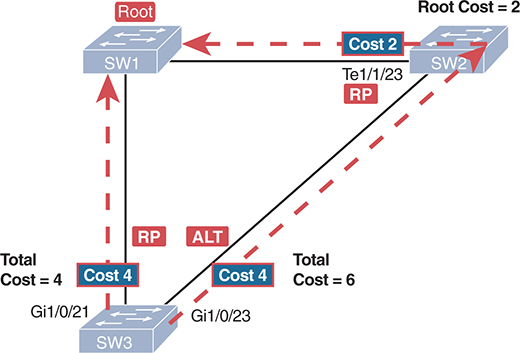


**Figure 10-7** *Sample Network for Root Switch Election Configuration*

Switch 1 (S W 1) is designated as the root switch and connects to Switch 3 (S W 3) via port Te1/1/23, operating as the root port (RP). The link between S W 1 and S W 3 has a cost of 2. Switch 2 (S W 2) has a root cost of 2, with S W 1 being the root bridge. S W 2 connects to S W 3 through port Gi1/0/23, functioning as an alternate port (ALT), with a cost of 4, resulting in a total cost of 6 for S W 2. Lastly, S W 1 connects to S W 3 via port Gi1/0/21, serving as the root port, with S W 2 having a cost of 4 and a total cost of 4 for S W 1.

The **show spanning-tree vlan 9** command identifies those same facts. [Example 10-5](vol1_ch10.md#exa10_5) shows an excerpt, with only the two interfaces that connect to other switches listed. The Role column lists the STP roles of Root and Altn (Alternate), while the abbreviated Sts heading refers to the State or Status. (Note that even though the switch uses RSTP, the output still uses the term BLK for blocking rather than the correct RSTP term of discarding.) Finally, the output lists the STP interface cost.

**Example 10-5** *Switch SW3 Port Costs, Roles, and States with Default Costs*

[Click here to view code image](vol1_ch10_images.md#f0267-01)

```
SW1# show spanning-tree vlan 9 | begin Interface
Interface           Role Sts Cost      Prio.Nbr Type
------------------- ---- --- --------- -------- --------------------------------
Gi1/0/21            Root FWD 4         128.21   P2p
Gi1/0/23            Altn BLK 4         128.23   P2p
```

As for the root cost, look back to [Example 10-3](vol1_ch10.md#exa10_3), which also shows output from switch SW3. Find the initial section about the root switch and the line that shows "Cost 4"--that line identifies switch SW3's root cost rather than an interface's cost.

The STP topology shown in [Figure 10-7](vol1_ch10.md#ch10fig07) works well and you would likely not want to change it. But just to show how to do so, consider [Example 10-6](vol1_ch10.md#exa10_6). It changes SW3's post cost on its root port (G1/0/21) from 4 to 10. As a result, the path out SW3's G1/0/23 port toward switch SW2 has a lower root cost. The example begins with a **debug** command, so you can see interesting facts about the actions IOS takes with this straightforward configuration.

**Example 10-6** *Changing SW3 Port Cost Setting Triggers New Root and Alternate Port Choices*

[Click here to view code image](vol1_ch10_images.md#f0268-01)

```
SW3# debug spanning-tree events
Spanning Tree event debugging is on

SW3# conf t
Enter configuration commands, one per line.  End with CNTL/Z.
SW3(config)# int g1/0/21
SW3(config-if)# spanning-tree vlan 9 cost 10
SW3(config-if)#
Oct 19 11:34:38.983: RSTP(9): updt roles, received superior bpdu on Gi1/0/23
Oct 19 11:34:38.983: RSTP(9): Gi1/0/23 is now root port
Oct 19 11:34:38.987: RSTP(9): Gi1/0/21 blocked by re-root
Oct 19 11:34:38.987: RSTP(9): Gi1/0/21 is now alternate
Oct 19 11:34:38.987: STP[9]: Generating TC trap for port GigabitEthernet1/0/23
SW3(config-if)# end
SW3# show spanning-tree vlan 9
VLAN0009
  Spanning tree enabled protocol rstp
  Root ID    Priority    24585
             Address     4488.165a.f200
             Cost        6
             Port        23 (GigabitEthernet1/0/23)
             Hello Time   2 sec  Max Age 20 sec  Forward Delay 15 sec

  Bridge ID  Priority    32777  (priority 32768 sys-id-ext 9)
             Address     5cfc.6608.2880
             Hello Time   2 sec  Max Age 20 sec  Forward Delay 15 sec
             Aging Time  300 sec

Interface           Role Sts Cost      Prio.Nbr Type
------------------- ---- --- --------- -------- --------------------------------
Gi1/0/21            Altn BLK 10        128.21   P2p
Gi1/0/23            Root FWD 4         128.23   P2p
```

Comparing the output from [Example 10-6](vol1_ch10.md#exa10_6) to [Example 10-5](vol1_ch10.md#exa10_5), you can see that switch SW3's ports swapped roles. G1/0/21 now blocks, with G1/0/23 now in a FWD or forwarding state. Also, in the highlighted lines toward the top of the **show spanning-tree vlan 9** output, you see the updated root cost of 6 and another reference to the root port, G1/0/23.

Author's Note

Alternately, you can configure the STP port cost on an interface, for all VLANs, with the **spanning-tree cost** *value* interface subcommand. Doing so sets that value as the cost on that interface for any VLANs for which the interface does not also have a VLAN-specific version of the command (as shown in [Example 10-6](vol1_ch10.md#exa10_6)).

### Identifying Optional STP Features

[Chapter 9](vol1_ch09.md#ch09)'s section titled "[Optional STP Features](vol1_ch09.md#ch09lev1sec6)" introduced the concepts behind four STP features: PortFast, BPDU Guard, Root Guard, and Loop Guard. This next major section, with a similar title, focuses on identifying the presence of each feature and the results of using it. Along the way, you will also learn the basics of how to configure each.

#### PortFast and BPDU Guard

As discussed back in [Chapter 9](vol1_ch09.md#ch09), PortFast provides both a useful feature but also a notable risk. Once the interface reaches a connected state, PortFast logic moves a port immediately to the STP designated port (DP) role and to a forwarding state. However, that behavior can cause a forwarding loop if the port becomes connected to a switch (with other connections to the rest of the network) instead of to an endpoint device. By combining PortFast with BPDU Guard, you prevent loops by disabling the port if any BPDUs arrive in the port. So, it makes sense to examine both features together.

##### PortFast and BPDU Guard on an Access Port with One Endpoint

First, consider the classic case to use both features: a switch port (G1/0/1) connected to a PC. [Example 10-7](vol1_ch10.md#exa10_7) shows the configuration for both features on that port. Take time to read the long warning messages IOS generates in response to the **spanning-tree portfast** interface subcommand, basically suggesting the use of BPDU Guard.

**Example 10-7** *Enabling PortFast and BPDU Guard on Access Port G1/0/1*

[Click here to view code image](vol1_ch10_images.md#f0269-01)

```
SW1# configure terminal
Enter configuration commands, one per line.  End with CNTL/Z.
SW1(config)#
SW1(config)# interface g1/0/1
SW1(config-if)# switchport mode access
SW1(config-if)# switchport access vlan 9
SW1(config-if)# spanning-tree portfast
%Warning: portfast should only be enabled on ports connected to a single
 host. Connecting hubs, concentrators, switches, bridges, etc... to this
 interface  when portfast is enabled, can cause temporary bridging loops.
 Use with CAUTION

%Portfast has been configured on GigabitEthernet1/0/1 but will only 
have effect when the interface is in a non-trunking mode.
SW1(config-if)# spanning-tree bpduguard ?
  disable  Disable BPDU guard for this interface
  enable   Enable BPDU guard for this interface

SW1(config-if)# spanning-tree bpduguard enable
SW1(config-if)#
```

First, the **spanning-tree portfast** subcommand (with no additional keywords) tells IOS to enable PortFast logic only on an access port. If the port operates as a trunk, IOS does not apply PortFast logic. In fact, the highlighted portion of the long message that IOS generates when you configure the command reminds you of that fact.

As for BPDU Guard, the **spanning-tree bpduguard enable** interface subcommand applies BPDU Guard logic to the port regardless of whether operating as an access or trunk port and regardless of whether PortFast is used. Once enabled, BPDU Guard uses the following trigger, action, and recovery steps:


* **Trigger:** Any BPDU arrives in a port that has BPDU Guard enabled.
* **Actions:**

  * IOS places the interface into an error disabled (err-disabled) interface state.
  * STP removes the interface from the STP instance because the interface fails--that it, it is no longer up (connected).
* **Recovery:**

  * By default, the interface must be configured first with a **shutdown** command and then with a **no shutdown** command.
  * Alternately, and not discussed here, you can configure error disable recovery parameters to automatically recover the port after some time.

[Example 10-8](vol1_ch10.md#exa10_8) shows a before-and-after example. It begins with switch SW1 port G1/0/1 as configured in [Example 10-7](vol1_ch10.md#exa10_7), with both PortFast and BPDU Guard enabled. [Example 10-8](vol1_ch10.md#exa10_8) begins with port G1/0/1 in an STP port role of Desg (designated) and a port state of FWD (forwarding), as consistent with a port in PortFast mode. It also reveals an interface state of connected. Also, in that first command's output, the highlighted port type of "P2p Edge" has great importance: the word "Edge" appears only if PortFast is both configured and enabled, so it confirms that the port uses PortFast.

**Example 10-8** *Example of BPDU Guard Disabling a Port*

[Click here to view code image](vol1_ch10_images.md#f0270-01)

```
SW1# show spanning-tree interface g1/0/1
Vlan                Role Sts Cost      Prio.Nbr Type
------------------- ---- --- --------- -------- --------------------------------
VLAN0009            Desg FWD 4         128.1    P2p Edge

SW1# show interfaces g1/0/1 status

Port         Name             Status       Vlan       Duplex  Speed Type
Gi1/0/1      Host A           connected    9          a-full a-1000
10/100/1000BaseTX
SW1#
SW1# ! The cable was removed from the PC and connected to a LAN switch.
SW1#
*Jan 30 17:08:19.024: %LINEPROTO-5-UPDOWN: Line protocol on Interface GigabitEther-
net1/0/1, changed state to down
*Jan 30 17:08:20.024: %LINK-3-UPDOWN: Interface GigabitEthernet1/0/1, changed state
to down
*Jan 30 17:08:30.364: %SPANTREE-2-BLOCK_BPDUGUARD: Received BPDU on port Gi1/0/1 
with BPDU Guard enabled. Disabling port.
*Jan 30 17:08:30.364: %PM-4-ERR_DISABLE: bpduguard error detected on Gi1/0/1, put-
ting Gi1/0/1 in err-disable state
SW1#
SW1# show spanning-tree interface g1/0/1
no spanning tree info available for GigabitEthernet1/0/1

SW1# show interfaces g1/0/1 status

Port         Name             Status       Vlan       Duplex  Speed Type
Gi1/0/1      Host A           err-disabled 9            auto   auto
10/100/1000BaseTX
```

In the middle of the example we replaced the attached PC with a switch. The log messages reveal SW1's port G1/0/1 failing and recovering. As soon as the port came up again, BPDU Guard noticed the incoming BPDUs from the neighboring switch--and disabled the port, as seen in the highlighted log messages.

The bottom of the example repeats the same two **show** commands as the top of the example, revealing the actions taken. The interface state of err-disabled (error disabled) confirms BPDU Guard disabled the interface due to errors. The response from the **show spanning tree interface g1/0/1** command no longer lists information about this port, implying that the interface is no longer part of that spanning tree.

##### PortFast on VLAN Trunks and Voice Pseudo-Trunks

Cisco IOS also supports PortFast on trunk ports. You should not use PortFast on trunk ports connected to other switches, but you can use it on trunk ports connected to endpoints, as seen in the center of [Figure 10-8](vol1_ch10.md#ch10fig08). You can also use it on the pseudo-trunk created for voice ports connected to IP phones, as seen in port G1/0/3 in the figure. (For a review of voice VLAN configuration, refer to [Chapter 8](vol1_ch08.md#ch08)'s section titled "[Data and Voice VLAN Configuration and Verification](vol1_ch08.md#ch08lev3sec8).")

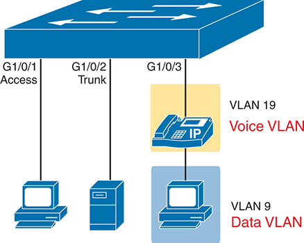


**Figure 10-8** *Three Different Scenarios for Portfast and BPDU Guard*

A switch is connected to a P C through port G1/0/1, designated as an access port, ensuring direct connectivity for end devices. Another connection from the switch to a server is established through port G1/0/2, configured as a trunk port, facilitating the transmission of multiple V L A Ns between devices. Additionally, the switch connects to an I P telephone, configured with V L A N 19 for voice traffic, through port G1/0/3. This port configuration enables the prioritization of voice traffic through the designated voice V L A N. Moreover, the voice V L A N is connected to a P C, configured with V L A N 9 for data traffic.

The PortFast configuration for the voice port looks identical to the access ports. The only small difference happens with IOS automatically adding the **spanning-tree portfast** interface subcommand when you first configure the voice VLAN using the **switchport voice vlan** *vlan-id* interface subcommand.

Note that the **spanning-tree portfast** interface subcommand requires IOS to decide whether to apply PortFast logic or not, based on whether the command does or does not include the **trunk** keyword. The logic is:

**spanning-tree portfast:** Use PortFast if the port operates as an access port.

**spanning-tree portfast trunk:** Use PortFast if the port operates as a trunk.

[Example 10-9](vol1_ch10.md#exa10_9) shows the configuration for switch SW1 port G1/0/2, attached via a trunk to a server. Note the different warning message in [Example 10-9](vol1_ch10.md#exa10_9) versus [Example 10-7](vol1_ch10.md#exa10_7)'s sample configuration.

**Example 10-9** *Configuring Portfast and BPDU Guard on a Trunk*

[Click here to view code image](vol1_ch10_images.md#f0272-01)

```
SW1# configure terminal
Enter configuration commands, one per line.  End with CNTL/Z.
SW1(config)# interface g1/0/2
SW1(config-if)# switchport mode trunk
SW1(config-if)# spanning-tree portfast trunk
%Warning: portfast should only be enabled on ports connected to a single
 host. Connecting hubs, concentrators, switches, bridges, etc... to this
 interface  when portfast is enabled, can cause temporary bridging loops.
 Use with CAUTION
SW1(config-if)# spanning-tree bpduguard enable
SW1(config-if)#
```

You must be ready to discover whether IOS decided to apply PortFast logic to a port. To do so, use the **show spanning-tree** command (without the **interface** keyword) as seen in [Example 10-10](vol1_ch10.md#exa10_10). The lower part of the command output lists one line per interface for all interfaces active in that spanning tree, including both access and trunk links. The value under the Type heading in the **show spanning-tree** command output reveals whether PortFast is being used:

* **P2p Edge:** Port operates with PortFast logic
* **P2p (without "Edge"):** Port does not use PortFast logic

**Example 10-10** *Confirming Portfast with Port Type Edge*

[Click here to view code image](vol1_ch10_images.md#f0272-02)

```
SW1# show spanning-tree vlan 9 | begin Interface
Interface           Role Sts Cost      Prio.Nbr Type
------------------- ---- --- --------- -------- --------------------------------
Gi1/0/1             Desg FWD 4         128.1    P2p Edge
Gi1/0/2             Desg FWD 4         128.2    P2p Edge
Gi1/0/3             Desg FWD 4         128.3    P2p Edge
Gi1/0/23            Desg FWD 4         128.23   P2p
Te1/1/1             Desg FWD 2         128.25   P2p
```

##### Global Configuration of PortFast and BPDU Guard

The configuration examples so far use interface subcommands that override any global settings. IOS defaults to global settings whose values disable both features per port; however, you can enable each feature globally. For interfaces with no related subcommands, IOS enables the feature on the interface. Then, you should identify the interfaces for which the feature should be disabled and use another interface subcommand to disable the feature per interface, as needed.

For example, consider an access layer switch with 48 access ports connected to endpoints, plus two trunk ports connected to other switches. You probably want to enable both PortFast and BPDU Guard on all 48 access ports. Rather than requiring the interface subcommands on all 48 of those ports, enable both the features globally, and then disable them on the uplink ports.

First, consider PortFast. Configuring the **spanning-tree portfast default** global command tells IOS to apply PortFast to some ports, based on the following conditions:

* Enable PortFast on ports operating as access ports only.
* Ignore ports configured to disable PortFast with the **spanning-tree portfast disable** interface subcommand.

To see that logic in action, work through the examples in [Figure 10-9](vol1_ch10.md#ch10fig09). The switch uses the global command **spanning-tree portfast default**. Port G1/0/11 has no **spanning-tree portfast** subcommands and is configured to be an access port, so IOS applies PortFast to that port. However, port G1/0/12 has a **spanning-tree portfast disable** subcommand, so IOS does not apply PortFast. Port G1/0/13 fails to meet the required conditions because it uses trunking.

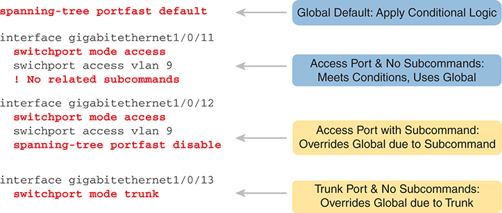


**Figure 10-9** *Conditional PortFast Global Configuration Logic*

By default, the global setting "spanning-tree port fast default" applies conditional logic. For an access port with no subcommands, such as interface gigabitethernet1/0/11, meeting conditions, it utilizes the global setting. Similarly, another access port (interface gigabitethernet1/0/12) with subcommands overrides the global configuration due to the presence of the "spanning-tree port fast disable" subcommand. However, for a trunk port without any subcommands (interface gigabitethernet1/0/13), the configuration overrides the global setting due to its trunk nature.

IOS also supports a similar configuration process for BPDU Guard, but with this configuration, BPDU Guard is tied to PortFast. You configure the **spanning-tree portfast bpduguard default** global command. Doing so asks IOS to enable BPDU Guard under these conditions:

* Enable BPDU Guard on ports that currently use PortFast.
* Ignore ports configured to disable BPDU Guard with the **spanning-tree bpduguard disable** interface subcommand.

For the exam, interpreting **show** command output might be more important than the intricacies of the configuration. For example, exam topic 2.5, the only one that mentions STP features, uses the verb *interpret* rather than *configure* or *verify*. So, be ready to interpret **show** command output and even predict the related configuration.

As an example of determining the configuration from the **show** commands, consider interfaces G1/0/7 and G1/0/8 on switch SW1. The configuration (not shown) uses this convention:

* **G1/0/7:** Uses interface subcommands **spanning-tree portfast** and **spanning-tree bpduguard enable**, not relying on the global configuration commands.
* **G1/0/8:** Uses no relevant interface subcommands, instead relying on the global configuration commands **spanning-tree portfast default** and **spanning-tree portfast bpduguard default**.

[Example 10-11](vol1_ch10.md#exa10_11) shows truncated output from the **show spanning-tree interface** command for both interfaces. Compare the highlighted lines about PortFast and BPDU Guard to see the different information. On port G1/0/8, the phrase "by default" confirms that G1/0/8 uses the default setting per the global command. The absence of "by default" in the output for port G1/0/7 means those settings come from interface subcommands.

**Example 10-11** *Interpreting the Source of PortFast and BPDU Guard Configuration*

[Click here to view code image](vol1_ch10_images.md#f0274-01)

```
SW1# show spanning-tree interface g1/0/7 detail | begin portfast
   The port is in the portfast mode
   Link type is point-to-point by default
   Bpdu guard is enabled
   BPDU: sent 387, received 0

SW1# show spanning-tree interface g1/0/8 detail | begin portfast
   The port is in the portfast mode by default
   Link type is point-to-point by default
   Bpdu guard is enabled by default
   BPDU: sent 774, received 0
```

#### BPDU Filter

In [Chapter 9](vol1_ch09.md#ch09)'s section about this same topic, also titled "[BPDU Filter](vol1_ch09.md#ch09lev2sec16)," you learned about the two different logic branches of this feature. To review:

1. Using a global configuration command, enable BPDU Filter, after which IOS applies BPDU Filter on PortFast ports only. While applied, it monitors for incoming BPDUs. When incoming BPDUs occur, BPDU Filter disables PortFast logic, so that the port then uses normal STP logic on the port.
2. Using an interface subcommand, enable BPDU filter on the port. BPDU Filter discards all outgoing and incoming BPDUs on the port, effectively disabling STP on the port.

This section examines both logic branches in order.

##### Conditional BPDU Filtering with Global Configuration

To enable the conditional logic of BPDU Filter, you must toggle from the default global setting of **no spanning-tree portfast bpdufilter enable** to the same command without the **no** option: the **spanning-tree portfast bpdufilter enable** global command.

Similar to the effect of the **spanning-tree portfast bpduguard enable** global command, the **spanning-tree portfast bpdufilter enable** global command asks IOS to enable BPDU Filter under these conditions:

* Enable BPDU Filter on ports that currently use PortFast.
* Ignore ports configured to disable BPDU Filter with the **spanning-tree bpdufilter disable** interface subcommand.

[Example 10-12](vol1_ch10.md#exa10_12) shows a straightforward scenario on switch SW1 port G1/0/23. It shows a classic access port, in VLAN 9, with PortFast enabled with an interface subcommand--along with conditional BPDU Filter enabled globally.

**Example 10-12** *BPDU Filter as Global Default, Applied to Port G1/0/23*

[Click here to view code image](vol1_ch10_images.md#f0275-01)

```
spanning-tree portfast bpdufilter enable
!
interface GigabitEthernet1/0/23
  switchport mode access
  switchport access vlan 9
  spanning-tree portfast
  ! No BPDU Filter subcommands present
```

You should be ready to think about the configuration and understand the rules IOS applies--and to also see the evidence of the choices in IOS command output. First, to review how IOS interprets and applies the configuration:

* The combination of port G1/0/23 as an access port (from the **switchport mode access** subcommand), with the command to enable PortFast on access ports (the **spanning-tree portfast** subcommand without the **trunk** keyword), enables PortFast.
* The one global command tells IOS to find current PortFast ports (no matter whether access or trunk port) and enable BPDU Filter conditional logic.

[Example 10-13](vol1_ch10.md#exa10_13) shows evidence of these listed results, while an endpoint connects to the port rather than a rogue switch. Look for the following:

1. The first command, **show spanning-tree**, lists interfaces in the tree for that VLAN. It lists the port type for G1/0/23 as P2p Edge--the word Edge confirms that the port currently uses Portfast.
2. The final command, in the final line, lists a counter of 11 sent BPDUs and 0 received. That confirms the switch sent 11 Hellos before BPDU Filter stopped sending them after 20 seconds. If nothing changes, the received BPDU counter remains at 0 because the attached endpoint device does not send BPDUs to the switch.
3. The phrase at the end of the example "Bpdu filter is enabled by default," at the end of the **show spanning-tree interface** command, reveals that the BPDU Filter configuration uses a global command. This command's output includes the phrase "by default" when the global configuration setting is the reason the feature is enabled.
4. Conversely, that same **show spanning-tree interface** command output reveals that the PortFast configuration uses an interface subcommand. The phrase "by default" does not occur at the end of the line about PortFast, implying the configuration comes from an interface subcommand.

**Example 10-13** *Key Status Values When an Endpoint Connects to Port G1/0/23*

[Click here to view code image](vol1_ch10_images.md#f0276-01)

```
SW1# show spanning-tree vlan 9 | begin Interface
Interface           Role Sts Cost      Prio.Nbr Type
------------------- ---- --- --------- -------- --------------------------------
Gi1/0/1             Desg FWD 4         128.1    P2p Edge
Gi1/0/2             Desg FWD 4         128.2    P2p Edge
Gi1/0/3             Desg FWD 4         128.3    P2p Edge
Gi1/0/23            Desg FWD 4         128.23   P2p Edge
Te1/1/1             Desg FWD 2         128.25   P2p

SW1# show spanning-tree interface g1/0/23

Vlan                Role Sts Cost      Prio.Nbr Type
------------------- ---- --- --------- -------- --------------------------------
VLAN0009            Desg FWD 4         128.23   P2p Edge

SW1# show spanning-tree interface g1/0/23 detail | begin portfast
   The port is in the portfast mode
   Link type is point-to-point by default
   Bpdu filter is enabled by default
   BPDU: sent 11, received 0
```

As configured using the global command, IOS applies conditional BPDU Filter logic. To see that in action, [Example 10-14](vol1_ch10.md#exa10_14) begins with the replacement of the attached PC with a rogue switch. The example does not show the related log messages, but know that the interface fails and recovers. The example repeats the same **show** commands as in the previous example, but with these differences:

1. The first command, **show spanning-tree**, lists the port type for G1/0/23 as P2p but without the word Edge. That output change is what confirms IOS no longer applies PortFast logic to this port.
2. The final command, in the final line, lists BPDU counters. In this case, the neighboring switch becomes root and continues to send BPDUs into port G1/0/23. The received BPDU counter will continue to increment over time.
3. The **show spanning-tree interface** command no longer includes the line that mentions the BPDU Filter feature.

**Example 10-14** *SW1 Port G1/0/23 Connects to a Rogue Switch*

[Click here to view code image](vol1_ch10_images.md#f0277-01)

```
! Someone disconnects the endpoint off SW1's G1/0/23 and attaches a switch:
! G1/0/23 fails and recovers…

SW1# show spanning-tree vlan 9 | begin Interface
Interface           Role Sts Cost      Prio.Nbr Type
------------------- ---- --- --------- -------- --------------------------------
Gi1/0/23            Root FWD 4         128.23   P2p

SW1# show spanning-tree interface g1/0/23 detail | begin portfast
   The port is in the portfast mode
   Link type is point-to-point by default
   BPDU: sent 6, received 138
! Line "bpdu filter is enabled by default" does not appear above.
```

##### Disabling STP with BPDU Filter Interface Configuration

The other type of BPDU Filter logic always filters all outgoing and incoming BPDUs on a port, in effect disabling STP on the interface. To configure it, simply configure the **spanning-tree bpdufilter enable** interface subcommand.

Note

That previous statement ought to scare you--one simple command can disable STP on one link. With redundant links in the LAN, that one command, on one port, can create a forwarding loop that makes the entire LAN unusable. That is not an exaggeration. Be very careful before using this command!

[Example 10-15](vol1_ch10.md#exa10_15) shows a typical configuration. This feature makes sense on links between switches, so it would likely be a trunk port.

**Example 10-15** *Disabling STP on a Port Between STP Domains*

[Click here to view code image](vol1_ch10_images.md#f0277-02)

```
interface TenGigabitEthernet 1/1/1
  switchport mode trunk
  spanning-tree bpdufilter enable
```

[Example 10-16](vol1_ch10.md#exa10_16) shows just a few lines of output that are the keys to confirming the feature works. The end of the **show spanning-tree interface** command has a line that confirms the BPDU Filter feature is enabled; however, that line does not end with "by default" as seen near the end of [Example 10-14](vol1_ch10.md#exa10_14). That tiny difference in the text signals a huge difference in logic! The absence of "by default" means IOS enables BPDU Filter in this case due to an interface subcommand, which means IOS applies the absolute filtering logic of BPDU Filter--disabling STP on the interface.

**Example 10-16** *Typical Evidence of BPDU Filter to Disable STP*

[Click here to view code image](vol1_ch10_images.md#f0277-03)

```
SW1# show spanning-tree vlan 9 interface te1/1/1 detail | begin Bpdu
   Bpdu filter is enabled
   BPDU: sent 0, received 0
```

To support the claim that IOS applies absolute filtering of all outgoing and incoming BPDUs on the port, note that the counters in the final output line show 0s. Over time, it will continue to show 0s, because BPDU Filter discards all BPDUs on the port.

#### Root Guard

The most challenging part of working with Root Guard involves analyzing the STP design to decide which ports might benefit from using it. [Chapter 9](vol1_ch09.md#ch09)'s section with this same title, "[Root Guard](vol1_ch09.md#ch09lev2sec17)," discusses the logic, but to summarize, you consider only ports connected to other switches. Then you look for special cases of switch ports that should never receive a superior Hello from a new root switch based on the intended STP design. Root Guard then monitors for incoming superior Hellos, disabling the port when that occurs. Root Guard may not apply to any ports for some networks, but the choice of ports begins by thinking about the STP design, as discussed in [Chapter 9](vol1_ch09.md#ch09).

If ports need to use Root Guard, the implementation and verification take a few short steps. The configuration uses a single option: the **spanning-tree guard root** interface subcommand. There is no global command to change the default, with the default being not to use Root Guard on an interface.

As for the actions taken by Root Guard, [Chapter 9](vol1_ch09.md#ch09) described the big concepts, but the following list provides more detail that you will see in the upcoming CLI examples.


* **Trigger:** Root Guard acts after receiving a superior BPDU in the port.
* **Actions:** Once triggered, Root Guard takes these actions:

  * The actions occur per VLAN, based on the VLAN of the superior Hello.
  * STP places the port in a broken (BRK) state for that VLAN, which discards all traffic (like the discarding and blocking states).
  * STP describes the port as being in a root inconsistent state in the port type information in show commands.
* **Recovery:** When the incoming superior BPDUs cease for a time, STP reverts to its prior STP state without any operator intervention.

[Examples 10-17](vol1_ch10.md#exa10_17) and [10-18](vol1_ch10.md#exa10_18) combine to show an example of Root Guard in action. First, [Example 10-17](vol1_ch10.md#exa10_17) shows the simple configuration, with the log message that confirms IOS enabled the feature.

**Example 10-17** *Configuring Root Guard on Switch SW3 Port G1/0/11*

[Click here to view code image](vol1_ch10_images.md#f0278-01)

```
SW3# configure terminal
Enter configuration commands, one per line.  End with CNTL/Z.
SW3(config)# interface g1/0/11
SW3(config-if)# spanning-tree guard root
SW3(config-if)#
Oct 21 11:02:31.145: %SPANTREE-2-ROOTGUARD_CONFIG_CHANGE: Root guard enabled on port
GigabitEthernet1/0/11.
SW3#
```

To see Root Guard in action, look for log messages, the BRK (broken) port state, and the root inconsistent state. [Example 10-18](vol1_ch10.md#exa10_18) does just that, as follows:

1. The first two commands confirm port G1/0/11's interface state (connected), STP role (Desg, or designated), STP forwarding state (FWD), and port type (P2P).
2. A log message reveals that Root Guard blocked the port. (Just before that, but not shown, I lowered the priority of the neighboring switch.)
3. The last two commands at the bottom of the example reveal:

   1. No change in in port G1/0/11's interface state (connected) or STP role (designated).
   2. A change to the STP forwarding state BKN, meaning broken, and port type P2p ROOT Inc, meaning Root Inconsistent.

**Example 10-18** *Identifying Root Guard Root Inconsistent State*

[Click here to view code image](vol1_ch10_images.md#f0279-01)

```
SW3# show interfaces g1/0/11 status

Port      Name               Status       Vlan       Duplex  Speed Type
Gi1/0/11                     connected    trunk      a-full a-1000 10/100/1000BaseTX

SW3# show spanning-tree vlan 9 int g1/0/11

Vlan                Role Sts Cost      Prio.Nbr Type
------------------- ---- --- --------- -------- --------------------------------
VLAN0009            Desg FWD 4         128.11   P2p

SW3#! Neighboring switch priority was lowered so it sends a superior BPDU.

Oct 21 11:03:14.472: %SPANTREE-2-ROOTGUARD_BLOCK: Root guard blocking port 
GigabitEthernet1/0/11 on VLAN0009.

SW3# show interfaces g1/0/11 status
Port      Name               Status       Vlan       Duplex  Speed Type
Gi1/0/11                     connected    trunk      a-full a-1000 10/100/1000BaseTX

SW3# show spanning-tree vlan 9 int g1/0/11

Vlan                Role Sts Cost      Prio.Nbr Type
------------------- ---- --- --------- -------- --------------------------------
VLAN0009            Desg BKN*4         128.11   P2p *ROOT_Inc
```

#### Loop Guard

[Chapter 9](vol1_ch09.md#ch09)'s section with this same title, "[Loop Guard](vol1_ch09.md#ch09lev2sec18)," discusses the compound factors that lead to the specific scenario where you can apply Loop Guard. Understanding those conditions and choosing ports that can effectively use Loop Guard takes some effort. However, the configuration takes only a little effort once chosen, as seen in the following list. You can either enable it directly on the interface or change the global default to enable it on all switch interfaces--but then disable it on selected interfaces as needed. Use these steps.


Step 1. Use the **spanning-tree guard loop** interface subcommand to enable Loop Guard on the interfaces selected to use the feature.

Step 2. To use the global default:

1. Use the **spanning-tree loopguard default** global command to change the Loop Guard default from disabled to enabled on all point-to-point switch interfaces.
2. Use the **no spanning-tree guard loop** interface subcommand to disable Loop Guard on the interfaces selected not to use the feature.

[Example 10-19](vol1_ch10.md#exa10_19) shows the simple configuration on a single port. The **show spanning-tree interface** command then confirms that Loop Guard is enabled, with the absence of the "by default" phrase implying it was configured using an interface subcommand.

**Example 10-19** *Configuring Loop Guard on a Port*

[Click here to view code image](vol1_ch10_images.md#f0280-01)

```
SW3# configure terminal
Enter configuration commands, one per line.  End with CNTL/Z.
SW3(config)# interface g1/0/21
SW3(config-if)# spanning-tree guard loop
SW3(config-if)#

SW3# show spanning-tree vlan 9 int g1/0/21 detail
 Port 21 (GigabitEthernet1/0/21) of VLAN0009 is root forwarding
   Port path cost 4, Port priority 128, Port Identifier 128.21.
   Designated root has priority 24585, address 4488.165a.f200
   Designated bridge has priority 24585, address 4488.165a.f200
   Designated port id is 128.23, designated path cost 0
   Timers: message age 16, forward delay 0, hold 0
   Number of transitions to forwarding state: 7
   Link type is point-to-point by default
   Loop guard is enabled on the port
   BPDU: sent 139, received 165425

! Link becomes unidirectional; switch SW3 G1/0/21 ceases to receive BPDUs
*Feb 23 17:11:19.087: %SPANTREE-2-LOOPGUARD_BLOCK: Loop guard blocking port 
GigabitEthernet1/0/23 on VLAN0009.
SW3# show spanning-tree vlan 9 int g1/0/21 detail | include 1/0/21
 Port 21 (GigabitEthernet1/0/21) of VLAN0009 is broken  (Loop Inconsistent)
```

The example ends by showing what happens when a unidirectional link occurs on this port. The end of the example shows a comment to show when the failure occurs and the log message noting the Loop Guard acted for VLAN 9. The final output shows how Loop Guard moved the port to a broken state (Loop Inconsistent) in that VLAN, similar to the Root Inconsistent state used by Root Guard. Loop Guard also recovers automatically when Hellos begin to arrive in the port again.

### Configuring Layer 2 EtherChannel

As introduced in [Chapter 9](vol1_ch09.md#ch09), "[Spanning Tree Protocol Concepts](vol1_ch09.md#ch09)," two neighboring switches can treat multiple parallel links between each other as a single logical link called an *EtherChannel*. Without EtherChannel, a switch treats each physical port as an independent port, applying MAC learning, forwarding, and STP logic per physical port. With EtherChannel, the switch applies all those same processes to a group of physical ports as one entity: the EtherChannel. Without EtherChannel, with parallel links between two switches, STP/RSTP would block all links except one, but with EtherChannel, the switch can use all the links, load balancing the traffic over the links.

Note

All references to EtherChannel in this chapter refer to Layer 2 EtherChannels, not to Layer 3 EtherChannels (as discussed in [Chapter 18](vol1_ch18.md#ch18), "[IP Routing in the LAN](vol1_ch18.md#ch18)"). CCNA 200-301 exam topics include both Layer 2 and Layer 3 EtherChannels.

EtherChannel might be one of the most challenging switch features to make work. First, the configuration has several options, so you have to remember the details of which options work together. Second, the switches also require a variety of other interface settings to match among all the links in the channel, so you have to know those settings as well.

This section shows how to configure a Layer 2 EtherChannel, first through manual (static) configuration and then by allowing dynamic protocols to create the channel. Cisco recommends using the dynamic method, but the static method can be a little easier to learn initially, so we begin with the static or manual option. This section closes with some information about some common configuration issues that occur with Layer 2 EtherChannels.

#### Configuring a Manual Layer 2 EtherChannel

To configure a Layer 2 EtherChannel so that all the ports always attempt to be part of the channel, simply add the correct **channel-group** configuration command to each physical interface, on each switch, all with the **on** keyword, and all with the same number. The **on** keyword tells the switches to place a physical interface into an EtherChannel, and the number identifies the PortChannel interface number that the interface should be a part of.

Before getting into the configuration and verification, however, you need to start using three terms as synonyms: [EtherChannel](vol1_gloss.md#gloss_224), [PortChannel](vol1_gloss.md#gloss_308), and [Channel-group](vol1_gloss.md#gloss_057). Oddly, IOS uses the **channel-group** configuration command, but then to display its status, IOS uses the **show etherchannel** command. Then the output of this **show** command refers to neither an "[EtherChannel](vol1_ch09.md#ch09lev2sec13)" nor a "Channel-group," instead using "PortChannel." So, pay close attention to these three terms in the example.

To configure an EtherChannel manually, follow these steps:


Step 1. Add the **channel-group** *number* **mode on** command in interface configuration mode under each physical interface that should be in the channel to add it to the channel.


Step 2. Use the same number for all commands on the same switch, but the channel-group number on the neighboring switch can differ.

[Example 10-20](vol1_ch10.md#exa10_20) shows a simple example, with two links between switches SW1 and SW2, as shown in [Figure 10-10](vol1_ch10.md#ch10fig10). The example begins with all default interface configuration on the interfaces used for the EtherChannel. The configuration first shows the ports being configured as VLAN trunks and then manually configured to be in channel-group 1 (SW1) and channel-group 2 (SW2).

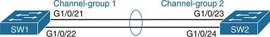


**Figure 10-10** *Sample LAN Used in EtherChannel Example*

Two connections are established between the switches, with the top connection configured as follows: S W 1's GigabitEthernet1/0/21 is grouped into Channel-group 1, connecting to S W 2's GigabitEthernet1/0/23, which is grouped into Channel-group 2. Additionally, S W 1's GigabitEthernet1/0/22 connects directly to S W 2's GigabitEthernet1/0/24.

**Example 10-20** *Configuring EtherChannel--Both SW1 and SW2*

[Click here to view code image](vol1_ch10_images.md#f0282-01)

```
! First, on switch SW1
SW1# configure terminal
Enter configuration commands, one per line. End with CNTL/Z.
SW1(config)# interface range g1/0/21-22
SW1(config-if-range)# switchport mode trunk
SW1(config-if-range)# channel-group 1 mode on
```

```
! Next, on switch SW2
SW2# configure terminal
Enter configuration commands, one per line. End with CNTL/Z.
SW2(config)# interface range g1/0/23-24
SW2(config-if-range)# switchport mode trunk
SW2(config-if-range)# channel-group 2 mode on
```

Interestingly, IOS reacts to the **channel-group** interface subcommands to create a matching port-channel interface on the switch. [Example 10-21](vol1_ch10.md#exa10_21) shows an excerpt from the **show running-config** command on switch SW1, listing the new port-channel 1 interface in the configuration, along with the two physical interfaces.

**Example 10-21** *Configuration Results from [Example 10-20](vol1_ch10.md#exa10_20)*

[Click here to view code image](vol1_ch10_images.md#f0282-02)

```
SW1# show running-config
! Lines omitted for brevity
!
interface Port-channel1
 switchport mode trunk
!
! Lines omitted for brevity
interface GigabitEthernet1/0/21
 switchport mode trunk
 channel-group 1 mode on
!
interface GigabitEthernet1/0/22
 switchport mode trunk
 channel-group 1 mode on

SW1# show interfaces portchannel 1
Port-channel1 is up, line protocol is up (connected)
  Hardware is EtherChannel, address is 4488.165a.f215 (bia 4488.165a.f215)
  MTU 1500 bytes, BW 2000000 Kbit/sec, DLY 10 usec,
     reliability 255/255, txload 1/255, rxload 1/255
  Encapsulation ARPA, loopback not set
  Keepalive set (10 sec)
  Full-duplex, 1000Mb/s, link type is auto, media type is N/A
  input flow-control is on, output flow-control is unsupported
  Members in this channel: Gi1/0/21 Gi1/0/22
  ARP type: ARPA, ARP Timeout 04:00:00
  Last input 02:12:51, output 00:00:00, output hang never
  Last clearing of "show interface" counters never
! Interface statistics output removed for brevity
```

The end of [Example 10-21](vol1_ch10.md#exa10_21) gives more insight into the portchannel interface in the output of the **show interfaces portchannel 1** command. Like all output from the **show interfaces** command, the output lists both an interface and protocol state ("up" and "up" in this case), and the interface bandwidth, noted with the text "BW." However, the output shows the bandwidth as 2,000,000 Kbps, or 2 Gbps, because the portchannel has two active 1-Gbps links. Also, in the final highlighted line, the output lists the currently active interfaces in the portchannel.

The **show etherchannel** command, shown at the top of [Example 10-22](vol1_ch10.md#exa10_22), lists basic configuration information about the channel per earlier [Example 10-20](vol1_ch10.md#exa10_20). In this case, it identifies the configured portchannel number (1), with two ports configured to be in the channel. It lists the protocol as a dash (-), meaning that it does not use LACP or PAgP, implying the use of the **channel-group mode on** command. Note that this command does not list status information, only configuration information.

**Example 10-22** *Exploring SW1 PortChannel Configuration and Status*

[Click here to view code image](vol1_ch10_images.md#f0283-01)

```
SW1# show etherchannel
                 Channel-group listing:
                 ----------------------

Group: 1
----------
Group state = L2
Ports: 2   Maxports = 8
Port-channels: 1 Max Port-channels = 1
Protocol:    -
Minimum Links: 0

SW1# show etherchannel summary
Flags:  D - down        P - bundled in port-channel
        I - stand-alone s - suspended
        H - Hot-standby (LACP only)
        R - Layer3      S - Layer2
        U - in use      f - failed to allocate aggregator

        M - not in use, minimum links not met
        u - unsuitable for bundling
        w - waiting to be aggregated
        d - default port

        A - formed by Auto LAG

Number of channel-groups in use: 1
Number of aggregators:           1

Group  Port-channel  Protocol    Ports
------+-------------+-----------+-----------------------------------------------
1      Po1(SU)          -        Gi1/0/21(P)    Gi1/0/22(P)
```

The **show etherchannel summary** command at the end of [Example 10-22](vol1_ch10.md#exa10_22) provides status information. The output begins with an extensive status code legend. The lines at the bottom list each PortChannel along with the ports and their status. In the lowest line of output with highlights, note the code P, which means that both of those ports are bundled (working) in the channel. A status of (SU), per the legend, means the channel is in use and acts as a Layer 2 EtherChannel (rather than a Layer 3 EtherChannel).

#### Configuring Dynamic EtherChannels

Cisco switches also support two different configuration options that use a dynamic protocol to negotiate whether a particular link becomes part of an EtherChannel or not. Basically, the configuration enables a protocol for a particular channel-group number. At that point, the switch can use the protocol to send messages to/from the neighboring switch and discover whether their configuration settings pass all checks. If a given physical link passes, the link is added to the EtherChannel and used; if not, it is placed in a down state, and not used, until the configuration inconsistency can be resolved.

Most Cisco Catalyst switches support the Cisco-proprietary Port Aggregation Protocol ([PAgP](vol1_gloss.md#gloss_297)) and the IEEE standard Link Aggregation Control Protocol ([LACP](vol1_gloss.md#gloss_223)). Although differences exist between the two, to the depth discussed here, they both accomplish the same task: negotiate so that only links that pass the configuration checks are actually used in an EtherChannel. (Note that the IEEE originally defined LACP in amendment 802.3ad but now defines it in IEEE standard 802.1AX.)

One difference of note is that LACP does support more links in a channel--16--as compared to PaGP's maximum of 8. With LACP, only 8 can be active at one time, with the others waiting to be used should any of the other links fail.

To configure either protocol, a switch uses the **channel-group** configuration commands on each switch, but with a keyword that either means "use this protocol and begin negotiations" or "use this protocol and wait for the other switch to begin negotiations." As shown in [Figure 10-11](vol1_ch10.md#ch10fig11), the **desirable** and **auto** keywords enable PAgP, and the **active** and **passive** keywords enable LACP. With these options, at least one side has to begin the negotiations. In other words, with PAgP, at least one of the two sides must use **desirable**, and with LACP, at least one of the two sides must use **active**.

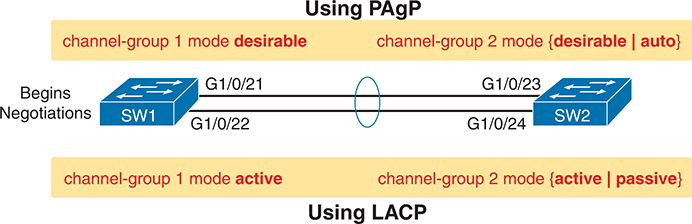


**Figure 10-11** *Correct EtherChannel Configuration Combinations*

Using P A g P (Port Aggregation Protocol). S W 1 is configured with channel-group 1 mode desirable, initiating negotiations. S W 2 is configured with channel-group 2 mode set to either desirable or auto. S W 1 establishes negotiations, connecting its GigabitEthernet1/0/21 to S W 2's GigabitEthernet1/0/23. Using L A C P (Link Aggregation Control Protocol). S W 1 is configured with channel-group 1 mode set to active. S W 2 is configured with channel-group 2 mode set to either active or passive. S W 1 initiates the setup, connecting its GigabitEthernet1/0/22 to S W 2's GigabitEthernet1/0/24.

Note

Do not use the **on** parameter on one end, and either **auto** or **desirable** (or for LACP, **active** or **passive**) on the neighboring switch. The **on** option uses neither PAgP nor LACP, so a configuration that uses **on**, with PAgP or LACP options on the other end, would prevent the EtherChannel from working.

As an example, consider the topology in [Figure 10-11](vol1_ch10.md#ch10fig11), which uses the same switches and ports as [Figure 10-10](vol1_ch10.md#ch10fig10) and the last several examples. However, the next example starts fresh, with the manual EtherChannel no longer configured and no interface commands on any of the interfaces in use. [Example 10-23](vol1_ch10.md#exa10_23) shows a dynamic configuration with LACP on both switches, with the **channel-group 1 mode active** interface subcommand on SW1 and **channel-group 2 mode passive** on SW2.

**Example 10-23** *Configuring an LACP Dynamic EtherChannel--Both SW1 and SW2*

[Click here to view code image](vol1_ch10_images.md#f0285-01)

```
! First, on switch SW1
SW1# configure terminal
Enter configuration commands, one per line. End with CNTL/Z.
SW1(config)# interface range g1/0/21-22
SW1(config-if-range)# switchport mode trunk
SW1(config-if-range)# channel-group 1 mode active
```

```
! Next, on switch SW2
SW2# configure terminal
Enter configuration commands, one per line. End with CNTL/Z.
SW2(config)# interface range g1/0/23-24
SW2(config-if-range)# switchport mode trunk
SW2(config-if-range)# channel-group 2 mode passive
```

As with the manual configuration and verification in [Examples 10-20](vol1_ch10.md#exa10_20) and [10-21](vol1_ch10.md#exa10_21), the switch creates a portchannel interface in reaction to the configuration shown in [Example 10-23](vol1_ch10.md#exa10_23). [Example 10-24](vol1_ch10.md#exa10_24) confirms the related settings, with group or portchannel 1, two ports in the channel, specifically SW1's G1/0/21 and G1/0/22. Also, note that the output lists the protocol as LACP, because the configuration commands in [Example 10-23](vol1_ch10.md#exa10_23) use keywords **active** and **passive**, both of which enable LACP.

**Example 10-24** *EtherChannel Verification: SW1 with LACP Active Mode*

[Click here to view code image](vol1_ch10_images.md#f0286-01)

```
SW1# show etherchannel port-channel
                 Channel-group listing:
                 ----------------------

Group: 1
----------
                 Port-channels in the group:
                 ---------------------------

Port-channel: Po1    (Primary Aggregator)

------------

Age of the Port-channel   = 0d:00h:11m:35s
Logical slot/port   = 31/1          Number of ports = 2
HotStandBy port = null
Port state          = Port-channel Ag-Inuse
Protocol            =   LACP
Port security       = Disabled
Fast-switchover     = disabled
Fast-switchover Dampening = disabled

Ports in the Port-channel:

Index   Load   Port        EC state        No of bits
------+------+------+------------------+-----------
  0     00     Gi1/0/21       Active             0
  0     00     Gi1/0/22       Active             0

Time since last port bundled:    0d:00h:02m:17s     Gi1/0/22
Time since last port Un-bundled: 0d:00h:02m:25s     Gi1/0/22
```

Before leaving the core EtherChannel configuration and verification topics, think about EtherChannels and Spanning Tree together. STP/RSTP prefers the better links based on STP/RSTP link costs. An EtherChannel may have more than one working link, and the number of active links changes as links fail and recover. So, by default, IOS calculates the default STP cost for EtherChannel based on the number of active links.

For example, the STP/RSTP default costs prefer 10 Gbps over EtherChannels with 1 Gbps links, and EtherChannels of multiple 1 Gbps links over a single 1 Gbps link, with the following default port costs:

* **Default Cost 4:** EtherChannels with one active 1 Gbps link and any single 1 Gbps link (without an EtherChannel)
* **Default Cost 3:** EtherChannels with 2 to 8 active 1 Gbps links
* **Default Cost 2:** A single 10 Gbps link

[Example 10-25](vol1_ch10.md#exa10_25) shows the default STP cost on a couple of 1 Gbps interfaces along with interface PortChannel 1, whose configuration resides earlier in [Example 10-23](vol1_ch10.md#exa10_23).

**Example 10-25** *EtherChannel Verification: SW1 with LACP Active Mode*

[Click here to view code image](vol1_ch10_images.md#f0287-01)

```
SW1# show spanning-tree vlan 1 | begin Interface
Interface           Role Sts Cost      Prio.Nbr Type
------------------- ---- --- --------- -------- --------------------------------
Gi1/0/23            Desg FWD 4         128.23   P2p
Gi1/0/24            Desg FWD 4         128.24   P2p
Po1                 Desg FWD 3         128.456  P2p
```

#### Interface Configuration Consistency with EtherChannels

Even when the **channel-group** commands have all been configured correctly, other configuration settings can prevent a switch from using a physical port in an EtherChannel--even physical ports manually configured to be part of the channel. The next topic examines those reasons.

First, before using a physical port in a dynamic EtherChannel, the switch compares the new physical port's configuration to the existing ports in the channel. That new physical interface's settings must be the same as the existing ports' settings; otherwise, the switch does not add the new link to the list of approved and working interfaces in the channel. That is, the physical interface remains configured as part of the PortChannel, but it is not used as part of the channel, often being placed into some nonworking state.

The list of items the switch checks includes the following:


* Speed
* Duplex
* Operational access or trunking state (all must be access, or all must be trunks)
* If an access port, the access VLAN
* If a trunk port, the allowed VLAN list (per the **switchport trunk allowed** command)
* If a trunk port, the native VLAN

[Example 10-26](vol1_ch10.md#exa10_26) shows a failure of one link in the EtherChannel due to a purposeful mis-configuration of the native VLAN on SW1's G1/0/21 port. [Example 10-26](vol1_ch10.md#exa10_26) begins with the configuration of VLAN 21 as the native VLAN on port G1/0/21; port G1/0/22 defaults to native VLAN 1. The log messages following that configuration show the interface failing, with the **show interfaces g1/0/21** command listing a "down (suspended)" protocol state for that interface. The usual **show etherchannel port-channel** command lists only one port as bundled in the channel.

**Example 10-26** *Native VLAN Mismatch Removes SW1 G1/0/21 from EtherChannel*

[Click here to view code image](vol1_ch10_images.md#f0288-01)

```
SW1# configure terminal
Enter configuration commands, one per line.  End with CNTL/Z.
SW1(config)# interface g1/0/21
SW1(config-if)# switchport trunk native vlan 21
SW1(config-if)# ^Z
SW1#
Jun 17 16:11:34.217: %EC-5-CANNOT_BUNDLE2: Gi1/0/21 is not compatible with Gi1/0/22 
and will be suspended (native vlan of Gi1/0/21 is 21, Gi1/0/22 id 1)
Jun 17 16:11:35.220: %LINEPROTO-5-UPDOWN: Line protocol on Interface
GigabitEthernet1/0/21, changed state to down

SW1# show interfaces gigabitethernet 1/0/21
GigabitEthernet1/0/21 is up, line protocol is down (suspended)
  Hardware is Gigabit Ethernet, address is 4488.165a.f215 (bia 4488.165a.f215)
! lines omitted for brevity

SW1# show etherchannel port-channel
                 Channel-group listing:
                 ----------------------

Group: 1
----------
                 Port-channels in the group:
                 ---------------------------

Port-channel: Po1    (Primary Aggregator)

------------

Age of the Port-channel   = 0d:05h:26m:48s
Logical slot/port   = 31/1          Number of ports = 1
HotStandBy port = null
Port state          = Port-channel Ag-Inuse
Protocol            =   LACP
Port security       = Disabled
Fast-switchover     = disabled
Fast-switchover Dampening = disabled

Ports in the Port-channel:

Index   Load   Port        EC state        No of bits
------+------+------+------------------+-----------
  0     00     Gi1/0/22       Active             0

Time since last port bundled:    0d:00h:05m:44s     Gi1/0/22
Time since last port Un-bundled: 0d:00h:01m:09s     Gi1/0/21
```

The output in [Example 10-26](vol1_ch10.md#exa10_26) closes with two useful messages at the end of the **show etherchannel port-channel** command output: the interface ID and the timing of the most recent ports bundled and unbundled with the EtherChannel. In this case, it shows the most recent addition of the still-working G1/0/22 interface and the just-suspended G1/0/21 interface.

#### EtherChannel Load Distribution

When using Layer 2 EtherChannels, a switch's MAC learning process associates MAC addresses with the PortChannel interfaces and not the underlying physical ports. Later, when a switch makes a forwarding decision to send a frame out a PortChannel interface, the switch must do more work: to decide which specific physical port to use to forward the frame. IOS documentation refers to those rules as [EtherChannel load distribution](vol1_gloss.md#gloss_130) or *load balancing*. [Figure 10-12](vol1_ch10.md#ch10fig12) shows the main idea.

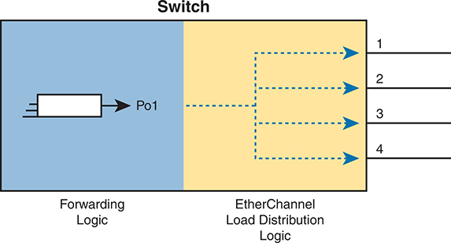


**Figure 10-12** *Forwarding Concepts from Outgoing PortChannel to Physical Interfaces*

In Layer 2 Ether Channels, MAC learning associates MAC addresses with Port Channel interfaces instead of individual physical ports. The switch forwards frames based on the Port Channel interface header, utilizing Ether Channel load distribution logic, which typically includes four output options labeled 1, 2, 3, and 4.

EtherChannel load distribution makes the choice for each frame based on various numeric values found in the Layer 2, 3, and 4 headers. The process uses one configurable setting as input: the load distribution method as defined with the **port-channel load-balance** *method* global command. The process then performs some match against the fields identified by the configured method.

[Table 10-4](vol1_ch10.md#ch10tab04) lists the most common methods. However, note that some switches may support only MAC-based methods, or only MAC- and IP-based methods, depending on the model and software version.


**Table 10-4** EtherChannel Load Distribution Methods

| Configuration Keyword | Math Uses… | Layer |
| --- | --- | --- |
| **src-mac** | Source MAC address | 2 |
| **dst-mac** | Destination MAC address | 2 |
| **src-dst-mac** | Both source and destination MAC | 2 |
| **src-ip** | Source IP address | 3 |
| **dst-ip** | Destination IP address | 3 |
| **src-dst-ip** | Both source and destination IP | 3 |
| **src-port** | Source TCP or UDP port | 4 |
| **dst-port** | Destination TCP or UDP port | 4 |
| **src-dst-port** | Both source and destination TCP or UDP port | 4 |

To appreciate why you might want to use different methods, you need to consider the results of how switches make their choice. (The discussion here focuses on the result, and not the logic, because the logic remains internal to the switch, and Cisco does not document how each switch model or IOS version works internally.) However, the various load distribution algorithms do share some common goals:

* To cause all messages in a single application flow to use the same link in the channel, rather than being sent over different links. Doing so means that the switch will not inadvertently reorder the messages sent in that application flow by sending one message over a busy link that has a queue of waiting messages, while immediately sending the next message out an unused link.
* To integrate the load distribution algorithm work into the hardware forwarding ASIC so that load distribution works just as quickly as the work to forward any other frame.
* To use all the active links in the EtherChannel, adjusting to the addition and removal of active links over time.
* Within the constraints of the other goals, balance the traffic across those active links.

In short, the algorithms first intend to avoid message reordering, make use of the switch forwarding ASICs, and use all the active links. However, the algorithm does not attempt to send the exact same number of bits over each link over time. The algorithm does try to balance the traffic, but always within the constraints of the other goals.

Whatever load distribution method you choose, the method identifies fields in the message headers. Any messages in the same application flow will then have the same values in the fields used by the load distribution algorithm and will always be forwarded over the same link. For example, when a user connects to a website, that web server may return thousands of packets to the client. Those thousands of packets should flow over the same link in the EtherChannel.

For instance, with the load distribution method of **src-mac** (meaning source MAC address), all frames with the same MAC address flow over one link. [Figure 10-13](vol1_ch10.md#ch10fig13) shows the idea with pseudo (generic) MAC addresses, with the load distribution sending frames with source MAC 1 over link 1, source MAC 2 over link 2, and source MAC 3 over link 3.


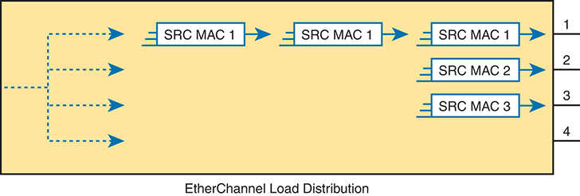


**Figure 10-13** *Distributing All Frames with the Same MAC Out the Same Interface*

The load distribution logic involves four output options: Frames with the same source MAC address (S R C M A C 1) are directed through link 1. Frames with the same source MAC address (S R C M A C 1) are directed through link 2. Frames with the same source MAC address (S R C M A C 1) are directed through link 3. Link 4 remains unlinked.

Cisco provides a variety of load distribution options so that the engineer can examine the flows in the network with the idea of finding which fields have the most variety in their values: source and destination MAC, or IP address, or transport layer port numbers. The more variety in the values in the fields, the better the balancing effects, and the lower the chance of sending disproportionate amounts of traffic over one link.

Note

The algorithm focuses on the low-order bits in the fields in the headers because the low-order bits typically differ the most in real networks, while the high-order bits do not differ much. By focusing on the lower-order bits, the algorithm achieves better balancing of traffic over the links.

### Chapter Review

One key to doing well on the exams is to perform repetitive spaced review sessions. Review this chapter's material using either the tools in the book or interactive tools for the same material found on the book's companion website. Refer to the "[Your Study Plan](vol1_pref10.md#pref10)" element for more details. [Table 10-5](vol1_ch10.md#ch10tab05) outlines the key review elements and where you can find them. To better track your study progress, record when you completed these activities in the second column.

**Table 10-5** Chapter Review Tracking

| Review Element | Review Date(s) | Resource Used |
| --- | --- | --- |
| Review key topics |  | Book, website |
| Review key terms |  | Book, website |
| Answer DIKTA questions |  | Book, PTP |
| Review config checklists |  | Book, website |
| Review command tables |  | Book |
| Review memory tables |  | Website |
| Do labs |  | Blog |
| Watch video |  | Website |

### Review All the Key Topics


**Table 10-6** Key Topics for [Chapter 10](vol1_ch10.md#ch10)

| Key Topic Element | Description | Page Number |
| --- | --- | --- |
| [Figure 10-1](vol1_ch10.md#ch10fig01) | Typical design choice for which switches should be made to be root | [259](vol1_ch10.md#page_259) |
| [Figure 10-2](vol1_ch10.md#ch10fig02) | Conceptual view of load-balancing benefits of PVST+ | [260](vol1_ch10.md#page_260) |
| [Table 10-2](vol1_ch10.md#ch10tab02) | STP Standards and Configuration Options | [261](vol1_ch10.md#page_261) |
| [Figure 10-4](vol1_ch10.md#ch10fig04) | Shows the format of the system ID extension of the STP priority field | [262](vol1_ch10.md#page_262) |
| List | Facts about RPVST+'s methods versus RSTP | [266](vol1_ch10.md#page_266) |
| List | Trigger, actions, and recovery for BPDU Guard | [270](vol1_ch10.md#page_270) |
| List | Trigger, actions, and recovery for Root Guard | [278](vol1_ch10.md#page_278) |
| List | Configuration options with Loop Guard | [280](vol1_ch10.md#page_280) |
| List | Steps to manually configure an EtherChannel | [281](vol1_ch10.md#page_281) |
| List | Items a switch compares in a new physical port's configuration to the existing ports in the channel | [287](vol1_ch10.md#page_287) |

### Key Terms You Should Know

[Channel-group](vol1_ch10.md#key_141)

[EtherChannel](vol1_ch10.md#key_142)

[EtherChannel load distribution](vol1_ch10.md#key_143)

[LACP](vol1_ch10.md#key_144)

[PAgP](vol1_ch10.md#key_145)

[PortChannel](vol1_ch10.md#key_146)

[PVST+](vol1_ch10.md#key_147)

[Rapid PVST+](vol1_ch10.md#key_148)

[system ID extension](vol1_ch10.md#key_149)

### Command References

[Tables 10-7](vol1_ch10.md#ch10tab07) and [10-8](vol1_ch10.md#ch10tab08) list configuration and verification commands used in this chapter. As an easy review exercise, cover the left column in a table, read the right column, and try to recall the command without looking. Then repeat the exercise, covering the right column, and try to recall what the command does.

**Table 10-7** [Chapter 10](vol1_ch10.md#ch10) Configuration Command Reference

| Command | Description |
| --- | --- |
| **spanning-tree mode** {**pvst** | **rapid-pvst** | **mst**} | Global configuration command to set the STP mode. |
| **spanning-tree** [**vlan** *vlan-number*] **root primary** | Global configuration command that changes this switch to the root switch. The switch's priority is changed to the lower of either 24,576 or 4096 less than the priority of the current root bridge when the command was issued. |
| **spanning-tree** [**vlan** *vlan-number*] **root secondary** | Global configuration command that sets this switch's STP base priority to 28,672. |
| **spanning-tree vlan** *vlan-id* **priority** *priority* | Global configuration command that changes the bridge priority of this switch for the specified VLAN. |
| **spanning-tree** [**vlan** *vlan-number*] **cost** *cost* | Interface subcommand that changes the STP cost to the configured value. |
| **spanning-tree** [**vlan** *vlan-number*] **port-priority** *priority* | Interface subcommand that changes the STP port priority in that VLAN (0 to 240, in increments of 16). |
| **spanning-tree portfast** | Interface subcommand that enables PortFast if the port is also an access port. |
| **spanning-tree portfast trunk** | Interface subcommand that enables PortFast if the port is also a trunk port. |
| **spanning-tree bpduguard enable** | Interface subcommand that enables BPDU Guard on the interface under all conditions. |
| **spanning-tree portfast disable** | Interface subcommand that reverses the **spanning-tree portfast** command. |
| **spanning-tree bpduguard disable** | Interface subcommand that reverses the **spanning-tree bpduguard enable** command. |
| **spanning-tree portfast enable** | Global command that changes the default interface setting to the same logic as if the **spanning-tree portfast** interface subcommand were configured. |
| **spanning-tree portfast bpduguard default** | Global command that changes the default interface setting to enable BPDU Guard if the port is also actively using PortFast. |
| **spanning-tree bpdufilter enable** | Interface subcommand that enables BPDU Filter on the interface under all conditions, disabling STP on the interface. |
| **spanning-tree portfast bpdufilter default** | Global command that directs IOS to enable BPDU Filter conditional logic, which toggles away from using PortFast as needed if the port is also actively using PortFast. |
| **[no] spanning-tree guard root** | Interface subcommand to enable or disable (with the **no** option) Root Guard. |
| **[no] spanning-tree guard loop** | Interface subcommand to enable or disable (with the **no** option) Loop Guard. |
| **spanning-tree loopguard default** | Global command to change the default setting on interfaces to enable Loop Guard. |
| **channel-group** *channel-group-number* **mode** {**auto** | **desirable** | **active** | **passive** | **on**} | Interface subcommand that enables EtherChannel on the interface. |


**Table 10-8** [Chapter 10](vol1_ch10.md#ch10) EXEC Command Reference

| Command | Description |
| --- | --- |
| **show spanning-tree** | Lists details about the state of STP on the switch, including the state of each port. |
| **show spanning-tree vlan** *vlan-id* | Lists STP information for the specified VLAN. |
| **show spanning-tree vlan** *vlan-id* **interface** *interface-id* **[detail]** | Lists STP information for the specified VLAN about the specific interface. |
| **show etherchannel** [*channel-group-number*] {**brief** | **detail** | **port** | **port-channel** | **summary**} | Lists information about the state of EtherChannels on this switch. |
| **show interfaces portchannel** *number* | Lists information typical of the **show interfaces** command and also lists the interfaces included in the EtherChannel. |
| **show etherchannel** | Displays configuration settings for each EtherChannel. |
| **show etherchannel** [*number*] {**summary** | **portchannel** | **detail**} | Displays status information about all EtherChannels, or the one specific EtherChannel. The final parameter suggests the briefest option (**summary**) to the most detailed (detail). |