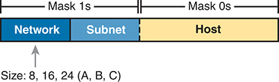

# Chapter 13

## Analyzing Subnet Masks

This chapter covers the following exam topics:

1.0 Network Fundamentals

1.6 Configure and verify IPv4 addressing and subnetting

The subnet mask used in one or many subnets in an IP internetwork says a lot about the intent of the subnet design. First, the mask divides addresses into two parts: *prefix* and *host*, with the host part defining the size of the subnet (that is, the number of hosts in the subnet). Then, the class (A, B, or C) further divides the structure of addresses in a subnet, breaking the prefix part into the *network* and *subnet* parts. The subnet part defines the number of subnets that could exist inside one classful IP network, assuming that one mask is used throughout the classful network.

The subnet mask holds the key to understanding several important subnetting design points. However, to analyze a subnet mask, you first need some basic math skills with masks. The math converts masks between the three different formats used to represent a mask:

* Binary
* Dotted-decimal notation (DDN)
* Prefix (also called classless interdomain routing [CIDR])

This chapter has two major sections. The first focuses on the mask formats and the math used to convert between the three formats. The second section explains how to take an IP address and its subnet mask and analyze those values. In particular, it shows how to determine the three-part format of the IPv4 address and describes the facts about the subnetting design that are implied by the mask.

Note

The majority of the chapter assumes subnetting of a Class A, B, or C network. The end of the chapter provides some discussion of the similar case of subnetting a public CIDR block.

### "Do I Know This Already?" Quiz

Take the quiz (either here or use the PTP software) if you want to use the score to help you decide how much time to spend on this chapter. The letter answers are listed at the bottom of the page following the quiz. [Appendix C](vol1_appc.md#appc), found both at the end of the book as well as on the companion website, includes both the answers and explanations. You can also find both answers and explanations in the PTP testing software.

**Table 13-1** "Do I Know This Already?" Foundation Topics Section-to-Question Mapping

| Foundation Topics Section | Questions |
| --- | --- |
| Subnet Mask Conversion | 1-3 |
| Identifying Subnet Design Choices Using Masks | 4-7 |

**[1](vol1_ch13.md#ques13_1a).** Which of the following answers lists the prefix (CIDR) format equivalent of 255.255.254.0?

1. /19
2. /20
3. /23
4. /24
5. /25

**[2](vol1_ch13.md#ques13_2a).** Which of the following answers lists the prefix (CIDR) format equivalent of 255.255.255.240?

1. /26
2. /28
3. /27
4. /30
5. /29

**[3](vol1_ch13.md#ques13_3a).** Which of the following answers lists the dotted-decimal notation (DDN) equivalent of /30?

1. 255.255.255.192
2. 255.255.255.252
3. 255.255.255.240
4. 255.255.254.0
5. 255.255.255.0

**[4](vol1_ch13.md#ques13_4a).** Working at the help desk, you receive a call and learn a user's PC IP address and mask (10.55.66.77, mask 255.255.255.0). When thinking about this using classful logic, you determine the number of network (N), subnet (S), and host (H) bits. Which of the following is true in this case?

1. N=12
2. S=12
3. H=8
4. S=8
5. N=24

**[5](vol1_ch13.md#ques13_5a).** Working at the help desk, you receive a call and learn a user's PC IP address and mask (192.168.9.1/27). When thinking about this using classful logic, you determine the number of network (N), subnet (S), and host (H) bits. Which of the following is true in this case?

1. N=24
2. S=24
3. H=8
4. H=7

**[6](vol1_ch13.md#ques13_6a).** Which of the following statements is true about classless IP addressing concepts?

1. Uses a 128-bit IP address
2. Applies only for Class A and B networks
3. Separates IP addresses into network, subnet, and host parts
4. Ignores Class A, B, and C network rules

**[7](vol1_ch13.md#ques13_7a).** Which of the following masks, when used as the only mask within a Class B network, would supply enough subnet bits to support 100 subnets? (Choose two answers.)

1. /24
2. 255.255.255.252
3. /20
4. 255.255.252.0

Answers to the "Do I Know This Already?" quiz:

**[1](vol1_appc.md#ques13_1)** C

**[2](vol1_appc.md#ques13_2)** B

**[3](vol1_appc.md#ques13_3)** B

**[4](vol1_appc.md#ques13_4)** C

**[5](vol1_appc.md#ques13_5)** A

**[6](vol1_appc.md#ques13_6)** D

**[7](vol1_appc.md#ques13_7)** A, B

### Foundation Topics

### Subnet Mask Conversion

This section describes how to convert between different formats for the subnet mask. You can then use these processes when you practice. If you already know how to convert from one format to the other, go ahead and move to the section "[Practice Converting Subnet Masks](vol1_ch13.md#ch13lev2sec5)," later in this chapter.

#### Three Mask Formats

Subnet masks can be written as 32-bit binary numbers, but not just any binary number. In particular, the binary subnet mask must follow these rules:

* The value must not interleave 1s and 0s.
* If 1s exist, they are on the left.
* If 0s exist, they are on the right.

For example, the following values would be illegal. The first is illegal because the value interleaves 0s and 1s, and the second is illegal because it lists 0s on the left and 1s on the right:

`10101010 01010101 11110000 00001111`

`00000000 00000000 00000000 11111111`

The following two binary values meet the requirements, in that they have all 1s on the left, followed by all 0s, with no interleaving of 1s and 0s:

`11111111 00000000 00000000 00000000`

`11111111 11111111 11111111 00000000`

Two alternative subnet mask formats exist so that we humans do not have to work with 32-bit binary numbers. One format, [dotted-decimal notation (DDN)](vol1_gloss.md#gloss_113), converts each set of 8 bits into the decimal equivalent. For example, the two previous binary masks would convert to the following DDN subnet masks because binary 11111111 converts to decimal 255, and binary 00000000 converts to decimal 0:

255.0.0.0

255.255.255.0

Although the DDN format has been around since the beginning of IPv4 addressing, the third mask format was added later, in the early 1990s: the *prefix* format. This format takes advantage of the rule that the subnet mask starts with some number of 1s, and then the rest of the digits are 0s. Prefix format lists a slash (/) followed by the number of binary 1s in the [binary mask](vol1_gloss.md#gloss_042). Using the same two examples as earlier in this section, the prefix format equivalent masks are as follows:

/8

/24

Note that although the terms *prefix* or [prefix mask](vol1_gloss.md#gloss_314) can be used, the terms [CIDR mask](vol1_gloss.md#gloss_060) or *slash mask* can also be used. This newer prefix style mask was created around the same time as the classless interdomain routing (CIDR) specification back in the early 1990s, and the acronym CIDR grew to be used for anything related to CIDR, including prefix-style masks. In addition, the term *slash mask* is sometimes used because the value includes a slash mark (/).

You need to get comfortable working with masks in different formats. The rest of this section examines how to convert between the three formats.

#### Converting Between Binary and Prefix Masks

Converting between binary and prefix masks should be relatively intuitive after you know that the prefix value is simply the number of binary 1s in the binary mask. For the sake of completeness, the processes to convert in each direction are

**Binary to prefix:** Count the number of binary 1s in the binary mask, and write the total, in decimal, after a /.

**Prefix to binary:** Write P binary 1s, where P is the prefix value, followed by as many binary 0s as required to create a 32-bit number.

[Tables 13-2](vol1_ch13.md#ch13tab02) and [13-3](vol1_ch13.md#ch13tab03) show some examples.

**Table 13-2** Example Conversions: Binary to Prefix

| Binary Mask | Logic | Prefix Mask |
| --- | --- | --- |
| `11111111 11111111 11000000 00000000` | Count 8 + 8 + 2 = 18 binary 1s | /18 |
| `11111111 11111111 11111111 11110000` | Count 8 + 8 + 8 + 4 = 28 binary 1s | /28 |
| `11111111 11111000 00000000 00000000` | Count 8 + 5 = 13 binary 1s | /13 |

**Table 13-3** Example Conversions: Prefix to Binary

| Prefix Mask | Logic | Binary Mask |
| --- | --- | --- |
| /18 | Write 18 1s, then 14 0s, total 32 | `11111111 11111111 11000000 00000000` |
| /28 | Write 28 1s, then 4 0s, total 32 | `11111111 11111111 11111111 11110000` |
| /13 | Write 13 1s, then 19 0s, total 32 | `11111111 11111000 00000000 00000000` |

#### Converting Between Binary and DDN Masks

By definition, a dotted-decimal number (DDN) used with IPv4 addressing contains four decimal numbers, separated by dots. Each decimal number represents 8 bits. So, a single DDN shows four decimal numbers that together represent some 32-bit binary number.

Conversion from a DDN mask to the binary equivalent is relatively simple to describe but can be laborious to perform. First, to do the conversion, the process is as follows:

For each octet, perform a decimal-to-binary conversion.

However, depending on your comfort level with doing decimal-to-binary conversions, that process can be difficult or time-consuming. If you want to think about masks in binary for the exam, consider picking one of the following methods to do the conversion and practicing until you can do it quickly and accurately:

* Do the decimal-binary conversions, but practice your decimal-binary conversions to get fast. If you choose this path, consider the Cisco Binary Game, which you can find by searching its name at the Cisco Learning Network (CLN), or try this link: <https://learningnetwork.cisco.com/s/binary-game>.
* Use the decimal-binary conversion chart in [Appendix A](vol1_appa.md#appa), "[Numeric Reference Tables](vol1_appa.md#appa)." This lets you find the answer more quickly now, but you cannot use the chart on exam day.
* Memorize the nine possible decimal values that can be in a [decimal mask](vol1_gloss.md#gloss_088), and practice using a reference table with those values.

The third method, which is the method recommended in this book, takes advantage of the fact that any and every DDN mask octet must be one of only nine values. Why? Well, remember how a binary mask cannot interleave 1s and 0s, and the 0s must be on the right? It turns out that only nine different 8-bit binary numbers conform to these rules. [Table 13-4](vol1_ch13.md#ch13tab04) lists the values, along with other relevant information.

**Table 13-4** Nine Possible Values in One Octet of a Subnet Mask

| Binary Mask Octet | Decimal Equivalent | Number of Binary 1s |
| --- | --- | --- |
| `00000000` | 0 | 0 |
| `10000000` | 128 | 1 |
| `11000000` | 192 | 2 |
| `11100000` | 224 | 3 |
| `11110000` | 240 | 4 |
| `11111000` | 248 | 5 |
| `11111100` | 252 | 6 |
| `11111110` | 254 | 7 |
| `11111111` | 255 | 8 |

Many subnetting processes can be done with or without binary math. Some of those processes--mask conversion included--use the information in [Table 13-4](vol1_ch13.md#ch13tab04). You should plan to memorize the information in the table. I recommend making a copy of the table to keep handy while you practice. (You will likely memorize the contents of this table simply by practicing the conversion process enough to get both good and fast at the conversion.)

Using the table, the conversion processes in each direction with binary and decimal masks are as follows:

**Binary to decimal:** Organize the bits into four sets of eight. For each octet, find the binary value in the table and write down the corresponding decimal value.

**Decimal to binary:** For each octet, find the decimal value in the table and write down the corresponding 8-bit binary value.

[Tables 13-5](vol1_ch13.md#ch13tab05) and [13-6](vol1_ch13.md#ch13tab06) show some examples.

**Table 13-5** Conversion Example: Binary to Decimal

| Binary Mask | Logic | Decimal Mask |
| --- | --- | --- |
| `11111111 11111111 11000000 00000000` | `11111111` maps to 255  `11000000` maps to 192  `00000000` maps to 0 | 255.255.192.0 |
| `11111111 11111111 11111111 11110000` | `11111111` maps to 255  `11110000` maps to 240 | 255.255.255.240 |
| `11111111 11111000 00000000 00000000` | `11111111` maps to 255  `11111000` maps to 248  `00000000` maps to 0 | 255.248.0.0 |

**Table 13-6** Conversion Examples: Decimal to Binary

| Decimal Mask | Logic | Binary Mask |
| --- | --- | --- |
| 255.255.192.0 | 255 maps to `11111111`  192 maps to `11000000`  0 maps to `00000000` | `11111111 11111111 11000000 00000000` |
| 255.255.255.240 | 255 maps to `11111111`  240 maps to `11110000` | `11111111 11111111 11111111 11110000` |
| 255.248.0.0 | 255 maps to `11111111`  248 maps to `11111000`  0 maps to `00000000` | `11111111 11111000 00000000 00000000` |

#### Converting Between Prefix and DDN Masks

When you are learning, the best way to convert between the prefix and decimal formats is to first convert to binary. For example, to move from decimal to prefix, first convert decimal to binary and then from binary to prefix.

For the exams, set a goal to master these conversions doing the math in your head. While learning, you will likely want to use paper. To train yourself to do all this without writing it down, instead of writing each octet of binary, just write the number of binary 1s in that octet.

[Figure 13-1](vol1_ch13.md#ch13fig01) shows an example with a prefix-to-decimal conversion. The left side shows the conversion to binary as an interim step. For comparison, the right side shows the binary interim step in shorthand that just lists the number of binary 1s in each octet of the binary mask.

**Figure 13-1** *Conversion from Prefix to Decimal: Full Binary Versus Shorthand*

On the left side, the conversion to binary is demonstrated as an interim step. Converting from forward slash 0 to forward slash 32 mask to forward slash 18 involves representing the binary mask as 11111111 11111111 11000000 00000000, corresponding to the decimal mask of 255.255.192.0. On the right side, the binary interim step is displayed in shorthand, which indicates the number of binary 1s in each octet of the binary mask. For instance, forward slash 18 translates to 8 plus 8 plus 2 plus 0, resulting in the decimal mask of 255.255.192.0.

Similarly, when converting from decimal to prefix, mentally convert to binary along the way, and as you improve, just think of the binary as the number of 1s in each octet. [Figure 13-2](vol1_ch13.md#ch13fig02) shows an example of such a conversion.

**Figure 13-2** *Conversion from Decimal to Prefix: Full Binary Versus Shorthand*

On the left side, the conversion to binary is demonstrated as an interim step. Converting from the decimal mask of 255.248.0.0 to binary involves representing it as 11111111 11111000 00000000 00000000, which corresponds to the prefix forward slash 13. On the right side, the binary interim step is displayed in shorthand, indicating the number of binary 1s in each octet of the binary mask. For example, the decimal mask of 255.248.0.0 translates to 8 plus 5 plus 0 plus 0 in terms of binary 1s, resulting in the prefix forward slash 13.

Note that [Appendix A](vol1_appa.md#appa) has a table that lists all 33 legal subnet masks, with all three formats shown.

#### Practice Converting Subnet Masks

Before moving to the second half of this chapter, and thinking about what these subnet masks mean, first do some practice. Practice the processes discussed in this chapter until you get the right answer most of the time. Later, before taking the exam, practice more until you master the topics in this chapter and can move pretty fast, as outlined in the right column of [Table 13-7](vol1_ch13.md#ch13tab07).

**Table 13-7** Keep-Reading and Take-Exam Goals for This Chapter's Topics

| Time Frame | Before Moving to the Next Section | Before Taking the Exam |
| --- | --- | --- |
| **Focus On…** | Learning how | Being correct and fast |
| **Tools Allowed** | All | Your brain and a notepad |
| **Goal: Accuracy** | 90% correct | 100% correct |
| **Goal: Speed** | Any speed | 10 seconds |

[Table 13-8](vol1_ch13.md#ch13tab08) lists eight practice problems. The table has three columns, one for each mask format. Each row lists one mask, in one format. Your job is to find the mask's value in the other two formats for each row. [Table 13-12](vol1_ch13.md#ch13tab12), located in the section "[Answers to Earlier Practice Problems](vol1_ch13.md#ch13lev1sec9)," later in this chapter, lists the answers.

**Table 13-8** Practice Problems: Find the Mask Values in the Other Two Formats

| Prefix | Binary Mask | Decimal |
| --- | --- | --- |
|  | `11111111 11111111 11000000 00000000` |  |
|  |  | `255.255.255.252` |
| /25 |  |  |
| /16 |  |  |
|  |  | `255.0.0.0` |
|  | `11111111 11111111 11111100 00000000` |  |
|  |  | `255.254.0.0` |
| /27 |  |  |

### Identifying Subnet Design Choices Using Masks

Subnet masks have many purposes. In fact, if ten experienced network engineers were independently asked, "What is the purpose of a subnet mask?" the engineers would likely give a variety of true answers. The subnet mask plays several roles.

This chapter focuses on one particular use of a subnet mask: defining the prefix part of the IP addresses in a subnet. The prefix part must be the same value for all addresses in a subnet. In fact, a single subnet can be defined as all IPv4 addresses that have the same value in the prefix part of their IPv4 addresses.

While the previous paragraph might sound a bit formal, the idea is relatively basic, as shown in [Figure 13-3](vol1_ch13.md#ch13fig03). The right side of the figure shows a subnet of all addresses that begin with 172.16.2 and another subnet made of all addresses that begin with 172.16.3. In this example, the prefix--the part that has the same value in all the addresses in the subnet--is the first three octets.

**Figure 13-3** *Simple Subnet Design, with Mask /24*

This schematic illustrates the network topology and connectivity of devices within the subnet, utilizing the forward slash 24 subnet mask for address assignment. A server connects to Router 1 (R 1) through the network 172.16.1.0 forward slash 24. Router 1 (R 1) connects to Router 2 (R 2) via the network 172.16.4.0 forward slash 24. Router 1 (R 1) establishes a connection with Router 3 (R3) through a cloud, utilizing the network 172.16.5.0 forward slash 24. Router 2 (R 2) connects to two P Cs with the I P addresses 172.16.2.101 and 172.16.2.102, both belonging to the subnet 172.16.2.0 forward slash 24. Router 2 (R 2) also connects to two additional P Cs with the I P addresses 172.16.3.101 and 172.16.3.102, both part of the subnet 172.16.3.0 forward slash 24.

While people can sit around a conference table and talk about how a prefix is three octets long, computers communicate that same concept using a subnet mask. In this case, the subnets use a subnet mask of /24, which means that the prefix part of the addresses is 24 bits (3 octets) long.

This section explains more about how to use a subnet mask to understand this concept of a prefix part of an IPv4 address, along with these other uses for a subnet mask. Note that this section discusses the first five items in the list.

* Defines the size of the prefix (combined network and subnet) part of the addresses in a subnet
* Defines the size of the host part of the addresses in the subnet
* Can be used to calculate the number of hosts in the subnet
* Provides a means for the network designer to communicate the design details--the number of subnet and host bits--to the devices in the network
* Under certain assumptions, can be used to calculate the number of subnets in the entire classful network
* Can be used in binary calculations of both the subnet ID and the subnet broadcast address

#### Masks Divide the Subnet's Addresses into Two Parts

The subnet mask subdivides the IP addresses in a subnet into two parts: the *prefix*, or *subnet part*, and the *host part*.

The prefix part identifies the addresses that reside in the same subnet because all IP addresses in the same subnet have the same value in the prefix part of their addresses. The idea is much like the postal code (ZIP codes in the United States) in mailing addresses. All mailing addresses in the same town have the same postal code. Likewise, all IP addresses in the same subnet have identical values in the prefix part of their addresses.

The host part of an address identifies the host uniquely inside the subnet. If you compare any two IP addresses in the same subnet, their host parts will differ, even though the prefix parts of their addresses have the same value. To summarize these key comparisons:

**Prefix (subnet) part:** Equal in all addresses in the same subnet

**Host part:** Different in all addresses in the same subnet

For example, imagine a subnet that, in concept, includes all addresses whose first three octets are 10.1.1. So, the following list shows several addresses in this subnet:

10.1.1.**1**

10.1.1.**2**

10.1.1.**3**

In this list, the prefix or subnet parts (the first three octets of 10.1.1) are equal. The host part (the last octet [in bold]) is different. So, the prefix or subnet part of the address identifies the group, and the host part identifies the specific member of the group.

The subnet mask defines the dividing line between the prefix and the host part. To do so, the mask creates a conceptual line between the binary 1s in the binary mask and the binary 0s in the mask. In short, if a mask has P binary 1s, the prefix part is P bits long and the rest of the bits are host bits. [Figure 13-4](vol1_ch13.md#ch13fig04) shows the concept.

**Figure 13-4** *Prefix (Subnet) and Host Parts Defined by Mask 1s and 0s*

The visual representation elucidates how the arrangement of 1s and 0s in the subnet mask defines the division between the network and host parts of an I P address. A rectangle is divided into two parts: Prefix (P) and Host (H), representing the network and host portions of an I P address, respectively. The rectangle encompasses 32 bits, the standard length for I P v 4 addresses. Mask 1 s are allocated for the Prefix, indicating the bits dedicated to identifying the network portion of the address. Mask 0 s denote the Host, representing the bits designated for identifying individual devices within the network.

[Figure 13-5](vol1_ch13.md#ch13fig05), shows a specific example using mask 255.255.255.0. Mask 255.255.255.0 (/24) has 24 binary 1s, for a prefix length of 24 bits.

**Figure 13-5** *Mask 255.255.255.0: P=24, H=8*

The visual representation illustrates how the allocation of bits in the subnet mask determines the division between the network and host parts of an I P address. The rectangle is divided into two parts: Prefix (P) and Host (H), representing the network and host portions of an I P address, respectively. The Prefix is allocated 24 bits, indicating the portion of the address dedicated to identifying the network. The Host part consists of 8 bits, designating the bits used for identifying individual devices within the network. The subnet mask 255.255.255.0, in binary form 11111111 11111111 11111111 00000000, signifies that the first 24 bits are dedicated to the network (represented by 1s), while the remaining 8 bits are reserved for hosts (represented by 0s).

#### Masks and Class Divide Addresses into Three Parts

In addition to the two-part view of IPv4 addresses, you can also think about IPv4 addresses as having three parts. When subnetting a class A, B, or C network, just apply Class A, B, and C rules to the address format to define the network part at the beginning of the address. This added logic divides the prefix into two parts: the *network* part and the *subnet* part. The class defines the length of the network part, with the subnet part simply being the rest of the prefix. [Figure 13-6](vol1_ch13.md#ch13fig06) shows the idea.

**Figure 13-6** *Class Concepts Applied to Create Three Parts*

A schematic demonstrates the application of Class Concepts to create three parts: Network, Subnet, and Host. The parts are defined by the subnet mask 255.255.255.0, where Prefix (P) is 24 bits and Host (H) is 8 bits. The rectangle is divided into three sections: Network, Subnet, and Host, each representing different aspects of an I P address. The allocation of bits within these sections is based on the subnet mask, where 1s are designated for the Network and Subnet parts, while 0s represent the Host. The Network portion, determined by the size of the network, is categorized into three classes: A, B, and C, with sizes of 8, 16, and 24 bits, respectively.

The combined network and subnet parts act like the prefix because all addresses in the same subnet must have identical values in the network and subnet parts. The size of the host part remains unchanged, whether viewing the addresses as having two parts or three parts.

To be complete, [Figure 13-7](vol1_ch13.md#ch13fig07) shows the same example as in the previous section, with the subnet of "all addresses that begin with 10.1.1." In that example, the subnet uses mask 255.255.255.0, and the addresses are all in Class A network 10.0.0.0. The class defines 8 network bits, and the mask defines 24 prefix bits, meaning that 24 - 8 = 16 subnet bits exist. The host part remains as 8 bits per the mask.

**Figure 13-7** *Subnet 10.1.1.0, Mask 255.255.255.0: N=8, S=16, H=8*

This representation illustrates how Class Concepts are applied to divide an I P address into Network, Subnet, and Host parts. The rectangle is divided into three sections: Network, Subnet, and Host, representing different components of an I P address. The Network and Subnet portions, totaling 16 bits, are determined by subtracting the Network size (N) from the total size of the address space (24 bits). Meanwhile, the Host portion consists of 8 bits. The subnet mask 255.255.255.0, in binary form 11111111 11111111 11111111 00000000, designates 1s for the Network and Subnet parts and 0s for the Host part.

#### Classless and Classful Addressing

The terms [classless addressing](vol1_gloss.md#gloss_067) and [classful addressing](vol1_gloss.md#gloss_064) refer to the two different ways to think about IPv4 addresses as described so far in this chapter. Classful addressing means that you think about Class A, B, and C rules, so the prefix is separated into the network and subnet parts, as shown in [Figures 13-6](vol1_ch13.md#ch13fig06) and [13-7](vol1_ch13.md#ch13fig07). Classless addressing means that you ignore the Class A, B, and C rules and treat the prefix part as one part, as shown in [Figures 13-4](vol1_ch13.md#ch13fig04) and [13-5](vol1_ch13.md#ch13fig05). The following more formal definitions are listed for reference and study:

**Classless addressing:** The concept that an IPv4 address has two parts--the prefix part plus the host part--as defined by the mask, with *no consideration of the class* (A, B, or C).

**Classful addressing:** The concept that an IPv4 address has three parts--network, subnet, and host--as defined by the mask *and Class A, B, and C rules*.

Note

Unfortunately, the networking world uses the terms *classless* and *classful* in a couple of different ways. In addition to the classless and classful addressing described here, each routing protocol can be categorized as either a *classless routing protocol* or a *classful routing protocol*. In another use, the terms *classless routing* and *classful routing* refer to some details of how Cisco routers forward (route) packets using the default route in some cases. As a result, these terms can be easily confused and misused. So, when you see the words *classless* and *classful*, be careful to note the context: addressing, routing, or routing protocols.

#### Calculations Based on the IPv4 Address Format

After you know how to break an address down using both classless and classful addressing rules, you can easily calculate a couple of important facts using some basic math formulas.

First, for any subnet, after you know the number of host bits, you can calculate the number of host IP addresses in the subnet. Next, if you know the number of subnet bits (using classful addressing concepts) and you know that only one subnet mask is used throughout the network, you can also calculate the number of subnets in the network. The formulas just require that you know the powers of 2:

**Hosts in the subnet:** 2*H* - 2, where H is the number of host bits.

**Subnets in the network:** 2*S*, where S is the number of subnet bits. Only use this formula if only one mask is used throughout the network.

Note

The section "[Choose the Mask](vol1_ch11.md#ch11lev2sec8)" in [Chapter 11](vol1_ch11.md#ch11), "[Perspectives on IPv4 Subnetting](vol1_ch11.md#ch11)," details many concepts related to masks, including comments about this assumption of one mask throughout a single Class A, B, or C network.

The sizes of the parts of IPv4 addresses can also be calculated. The math is basic, but the concepts are important. Keeping in mind that IPv4 addresses are 32 bits long, the two parts with classless addressing must add up to 32 (P + H = 32), and with classful addressing, the three parts must add up to 32 (N + S + H = 32). [Figure 13-8](vol1_ch13.md#ch13fig08) shows the relationships.

**Figure 13-8** *Relationship Between /P, N, S, and H*

It depicts the relationship between the prefix length (forward slash P), Network (N), Subnet (S), and Host (H) portions of an I P address. The rectangle is divided into three sections, each representing a different aspect of an I P address: Network, Subnet, and Host. The Class Concepts dictate the size of the Network portion (N), with Class A networks having an N value of 8, Class B networks having an N value of 16, and Class C networks having an N value of 24. The prefix length (forward slash P) is indicated as 32, representing the total number of bits in the address space. The allocation of bits for the Network (N) and Subnet (S) portions is determined by the prefix length (forward slash P). For example, in a Class A network, if forward slash P is allocated as 8, then the Network (N) portion would be 8 bits, leaving the remaining bits for the Subnet (S) and Host (H) portions.

You often begin with an IP address and mask, both when answering questions on the CCNA exam and when examining problems that occur in real networks. Based on the information in this chapter and earlier chapters, you should be able to find all the information in [Figure 13-8](vol1_ch13.md#ch13fig08) and then calculate the number of hosts/subnet and the number of subnets in the network. For reference, the following process spells out the steps:

Step 1. Convert the mask to prefix format (/P) as needed. (See the earlier section "[Practice Converting Subnet Masks](vol1_ch13.md#ch13lev2sec5)" for review.)

Step 2. Determine N based on the class. (See [Chapter 12](vol1_ch12.md#ch12), "[Analyzing Classful IPv4 Networks](vol1_ch12.md#ch12)," for review.)

Step 3. Calculate S = P - N.

Step 4. Calculate H = 32 - P.

Step 5. Calculate hosts/subnet: 2*H* - 2.

Step 6. Calculate number of subnets: 2*S*.

For example, consider the case of IP address 8.1.4.5 with mask 255.255.0.0 by following this process:

Step 1. 255.255.0.0 = /16, so P=16.

Step 2. 8.1.4.5 is in the range 1-126 in the first octet, so it is Class A; so N=8.

Step 3. S = P - N = 16 - 8 = 8.

Step 4. H = 32 - P = 32 - 16 = 16.

Step 5. 2*16* - 2 = 65,534 hosts/subnet.

Step 6. 2*8* = 256 subnets.

[Figure 13-9](vol1_ch13.md#ch13fig09) shows a visual analysis of the same problem.

**Figure 13-9** *Visual Representation of Problem: 8.1.4.5, 255.255.0.0*

It showcases the relationship between the prefix length (forward slash P), Network (N), Subnet (S), and Host (H) parts of an I P address, using the example of I P address 8.1.4.5 with subnet mask 255.255.0.0. The rectangle is divided into three sections, each representing a different aspect of an I P address: Network, Subnet, and Host. The Class Concepts determine the size of the Network portion (N), with Class A networks having an N value of 8. The subnet mask, 255.255.0.0, indicates that 16 bits are allocated for both the Network (N) and Subnet (S) portions, leaving 16 bits for the Host (H) portion. In binary form, the subnet mask 255.255.0.0 is represented as 1111111111111111 00000000, with the first 16 bits being 1s for the Network (N) and Subnet (S) portions, and the remaining bits set to 0 for the Host (H) portion.

For another example, consider address 200.1.1.1, mask 255.255.255.252 by following this process:

Step 1. 255.255.255.252 = /30, so P=30.

Step 2. 200.1.1.1 is in the range 192-223 in the first octet, so it is Class C; so N=24.

Step 3. S = P - N = 30 - 24 = 6.

Step 4. H = 32 - P = 32 - 30 = 2.

Step 5. 2*2* - 2 = 2 hosts/subnet.

Step 6. 2*6* = 64 subnets.

This example uses a popular mask for serial links because serial links require only two host addresses, and the mask supports only two host addresses.

#### Practice Analyzing Subnet Masks

As with the other subnetting math in this book, using a two-phase approach may help. Take time now to practice until you feel as though you understand the process. Then, before the exam, make sure you master the math. [Table 13-9](vol1_ch13.md#ch13tab09) summarizes the key concepts and suggestions for this two-phase approach.

**Table 13-9** Keep-Reading and Take-Exam Goals for This Chapter's Topics

| Time Frame | Before Moving to the Next Chapter | Before Taking the Exam |
| --- | --- | --- |
| **Focus On…** | Learning how | Being correct and fast |
| **Tools Allowed** | All | Your brain and a notepad |
| **Goal: Accuracy** | 90% correct | 100% correct |
| **Goal: Speed** | Any speed | 15 seconds |

On a piece of scratch paper, answer the following questions. In each case:

* Determine the structure of the addresses in each subnet based on the class and mask, using classful IP addressing concepts. In other words, find the size of the network, subnet, and host parts of the addresses.
* Calculate the number of hosts in the subnet.
* Calculate the number of subnets in the network, assuming that the same mask is used throughout.

  1. 8.1.4.5, 255.255.254.0
  2. 130.4.102.1, 255.255.255.0
  3. 199.1.1.100, 255.255.255.0
  4. 130.4.102.1, 255.255.252.0
  5. 199.1.1.100, 255.255.255.224

The answers are listed in the section "[Answers to Earlier Practice Problems](vol1_ch13.md#ch13lev1sec9)," later in this chapter.

#### Masks and CIDR Blocks

As described in the Introduction, most of this chapter, particularly the second major section, expects the more typical case of subnetting a Class A, B, or C network. However, in some cases, a company will use a large public *CIDR block* instead of a classful public IP network or a classful private IP network. While more common today for enterprises to use private Class A, B, and C IP networks for the addresses for most of their hosts, it still helps to understand how you would subnet if using a large public CIDR block instead.

First, the classless addressing view of the mask need not change. However, the classful view of the mask, which interprets the address structure with a network field length based on Class A, B, and C rules, needs to be adjusted. Thankfully, the concepts are straightforward and do not require new processes or math. In short:

Formerly, you defined a network field based on Class A, B, and C rules. With a CIDR block, instead, use the prefix length specified by the CIDR block.

To explain a little more, note that a CIDR block assignment lists a prefix ID and length. The prefix ID represents the group, like a network ID or subnet ID, and is the numerically lowest number in the CIDR block. The CIDR block's prefix length acts like the block's default mask. For example, the numbers 1.1.0.0/16 imply "all addresses that begin with 1.1." The /16 mask means that all addresses in the CIDR block have the same value in their first 16 bits.

To summarize using [Figure 13-10](vol1_ch13.md#ch13fig10), instead of using Class A, B, or C rules to create an 8-, 16-, or 24-bit network field, begin with a CIDR field based on the prefix length of the CIDR field (16 bits in the previous example).

**Figure 13-10** *CIDR and Subnet Masks Divide Addresses into Three Parts*

The representation illustrates how C I D R and Subnet Masks facilitate the division of I P addresses into C I D R, Subnet, and Host parts, enabling efficient routing and addressing in I P networks. The rectangle is divided into three sections, each representing a distinct aspect of an I P address: C I D R, Subnet, and Host. C I D R and Subnet Masks determine the size of the CI DR and Subnet parts, respectively. Within the subnet mask, 1s designate the C I D R and Subnet portions, while 0s represent the Host portion. C I D R size refers to the size of the C I D R block, typically denoted by a prefix length. This prefix length determines the number of bits allocated for the CI DR part of the address.

Just as with the classful view of the address structure, when subnetting the CIDR block, the width of the CIDR field remains the same. When you choose a mask, the more binary 1s, the more subnet bits and subnets in the design. The more host bits in the mask, the more hosts/subnet.

### Chapter Review

One key to doing well on the exams is to perform repetitive spaced review sessions. Review this chapter's material using either the tools in the book or interactive tools for the same material found on the book's companion website. Refer to the "[Your Study Plan](vol1_pref10.md#pref10)" element for more details. [Table 13-10](vol1_ch13.md#ch13tab10) outlines the key review elements and where you can find them. To better track your study progress, record when you completed these activities in the second column.

**Table 13-10** Chapter Review Tracking

| Review Element | Review Date(s) | Resource Used |
| --- | --- | --- |
| Review key topics |  | Book, website |
| Review key terms |  | Book, website |
| Answer DIKTA questions |  | Book, PTP |
| Review memory tables |  | Website |
| Practice analyzing subnet masks |  | Website, [Appendix E](vol1_appe.md#appe) |
| Watch video |  | Website |

### Review All the Key Topics

**Table 13-11** Key Topics for [Chapter 13](vol1_ch13.md#ch13)

| Key Topic Element | Description | Page Number |
| --- | --- | --- |
| List | Rules for binary subnet mask values | [340](vol1_ch13.md#page_340) |
| List | Rules to convert between binary and prefix masks | [341](vol1_ch13.md#page_341) |
| [Table 13-4](vol1_ch13.md#ch13tab04) | Nine possible values in a decimal subnet mask | [342](vol1_ch13.md#page_342) |
| List | Rules to convert between binary and DDN masks | [343](vol1_ch13.md#page_343) |
| List | Some functions of a subnet mask | [346](vol1_ch13.md#page_346) |
| List | Comparisons of IP addresses in the same subnet | [347](vol1_ch13.md#page_347) |
| [Figure 13-4](vol1_ch13.md#ch13fig04) | Two-part classless view of an IP address | [347](vol1_ch13.md#page_347) |
| [Figure 13-6](vol1_ch13.md#ch13fig06) | Three-part classful view of an IP address | [348](vol1_ch13.md#page_348) |
| List | Definitions of classful addressing and classless addressing | [348](vol1_ch13.md#page_348) |
| List | Formal steps to analyze masks and calculate values | [349](vol1_ch13.md#page_349) |

### Key Terms You Should Know

[binary mask](vol1_ch13.md#key_172)

[CIDR mask](vol1_ch13.md#key_173)

[classful addressing](vol1_ch13.md#key_174)

[classless addressing](vol1_ch13.md#key_175)

[decimal mask](vol1_ch13.md#key_176)

[dotted-decimal notation (DDN)](vol1_ch13.md#key_177)

[prefix mask](vol1_ch13.md#key_178)

### Additional Practice for This Chapter's Processes

You can do more practice with the processes in this chapter with a pair of practice sets. One focuses on interpreting existing masks, while the other gives you practice with converting between mask formats. You may do each practice set using the following tools:

**Application:** From the companion website, in the section titled "Memory Tables and Practice Exercises," use the "[Analyzing Subnet Masks](vol1_ch13.md#ch13)" and "Converting Masks" applications, listed under the Chapter Review for this chapter.

**PDF:** Practice the same problems found in both these apps using companion website [Appendix E](vol1_appe.md#appe), "[Practice for Chapter 13: Analyzing Subnet Masks](vol1_appe.md#appe)."

### Answers to Earlier Practice Problems

[Table 13-8](vol1_ch13.md#ch13tab08), shown earlier, listed several practice problems for converting subnet masks; [Table 13-12](vol1_ch13.md#ch13tab12) lists the answers.

**Table 13-12** Answers to Problems in [Table 13-8](vol1_ch13.md#ch13tab08)

| Prefix | Binary Mask | Decimal |
| --- | --- | --- |
| /18 | `11111111 11111111 11000000 00000000` | `255.255.192.0` |
| /30 | `11111111 11111111 11111111 11111100` | `255.255.255.252` |
| /25 | `11111111 11111111 11111111 10000000` | `255.255.255.128` |
| /16 | `11111111 11111111 00000000 00000000` | `255.255.0.0` |
| /8 | `11111111 00000000 00000000 00000000` | `255.0.0.0` |
| /22 | `11111111 11111111 11111100 00000000` | `255.255.252.0` |
| /15 | `11111111 11111110 00000000 00000000` | `255.254.0.0` |
| /27 | `11111111 11111111 11111111 11100000` | `255.255.255.224` |

[Table 13-13](vol1_ch13.md#ch13tab13) lists the answers to the practice problems from the earlier section "[Practice Analyzing Subnet Masks](vol1_ch13.md#ch13lev2sec10)."

**Table 13-13** Answers to Problems from Earlier in the Chapter

|  | Problem | /P | Class | N | S | H | 2*S* | 2*H* - 2 |
| --- | --- | --- | --- | --- | --- | --- | --- | --- |
| 1 | 8.1.4.5 255.255.254.0 | 23 | A | 8 | 15 | 9 | 32,768 | 510 |
| 2 | 130.4.102.1 255.255.255.0 | 24 | B | 16 | 8 | 8 | 256 | 254 |
| 3 | 199.1.1.100 255.255.255.0 | 24 | C | 24 | 0 | 8 | N/A | 254 |
| 4 | 130.4.102.1 255.255.252.0 | 22 | B | 16 | 6 | 10 | 64 | 1022 |
| 5 | 199.1.1.100 255.255.255.224 | 27 | C | 24 | 3 | 5 | 8 | 30 |

The following list reviews the problems:

1. For 8.1.4.5, the first octet (8) is in the 1-126 range, so it is a Class A address, with 8 network bits. Mask 255.255.254.0 converts to /23, so P - N = 15, for 15 subnet bits. H can be found by subtracting /P (23) from 32, for 9 host bits.
2. The address 130.4.102.1 is in the 128-191 range in the first octet, making it a Class B address, with N = 16 bits. The 255.255.255.0 converts to /24, so the number of subnet bits is 24 - 16 = 8. With 24 prefix bits, the number of host bits is 32 - 24 = 8.
3. The third problem purposely shows a case where the mask does not create a subnet part of the address. The address, 199.1.1.100, has a first octet between 192 and 223, making it a Class C address with 24 network bits. The prefix version of the mask is /24, so the number of subnet bits is 24 - 24 = 0. The number of host bits is 32 minus the prefix length (24), for a total of 8 host bits. So in this case, the mask shows that the network engineer is using the default mask, which creates no subnet bits and no subnets.
4. With the same address as the second problem, 130.4.102.1 is a Class B address with N = 16 bits. This problem uses a different mask, 255.255.252.0, which converts to /22. This makes the number of subnet bits 22 - 16 = 6. With 22 prefix bits, the number of host bits is 32 - 22 = 10.
5. With the same address as the third problem, 199.1.1.100 is a Class C address with N = 24 bits. This problem uses a different mask, 255.255.255.224, which converts to /27. This makes the number of subnet bits 27 - 24 = 3. With 27 prefix bits, the number of host bits is 32 - 27 = 5.