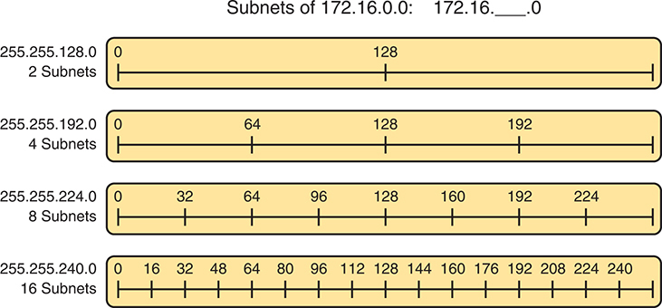

# Chapter 14

## Analyzing Existing Subnets

This chapter covers the following exam topics:

1.0 Network Fundamentals

1.6 Configure and verify IPv4 addressing and subnetting

Often, a networking task begins with the discovery of the IP address and mask used by some host. Then, to understand how the internetwork routes packets to that host, you must find key pieces of information about the subnet, specifically the following:

* Subnet ID
* Subnet broadcast address
* Subnet's range of usable unicast IP addresses

This chapter discusses the concepts and math to take a known IP address and mask, and then fully describe a subnet by finding the values in this list. These specific tasks might well be the most important IP skills in the entire IP addressing and subnetting topics in this book because they might be the most commonly used tasks when operating and troubleshooting real networks. Also note that as with the other chapters, this chapter shows examples that subnet a Class A, B, or C network, rather than a CIDR block.

### "Do I Know This Already?" Quiz

Take the quiz (either here or use the PTP software) if you want to use the score to help you decide how much time to spend on this chapter. The letter answers are listed at the bottom of the page following the quiz. [Appendix C](vol1_appc.md#appc), found both at the end of the book as well as on the companion website, includes both the answers and explanations. You can also find both answers and explanations in the PTP testing software.

**Table 14-1** "Do I Know This Already?" Foundation Topics Section-to-Question Mapping

| Foundation Topics Section | Questions |
| --- | --- |
| Defining a Subnet | 1 |
| Analyzing Existing Subnets: Binary | 2 |
| Analyzing Existing Subnets: Decimal | 3-6 |

**[1](vol1_ch14.md#ques14_1a).** When you think about an IP address using classful addressing rules, an address can have three parts: network, subnet, and host. If you examined all the addresses in one subnet, in binary, which of the following answers correctly states which of the three parts of the addresses will be equal among all addresses? (Choose the best answer.)

1. Network part only
2. Subnet part only
3. Host part only
4. Network and subnet parts
5. Subnet and host parts

**[2](vol1_ch14.md#ques14_2a).** Which of the following statements are true regarding the binary subnet ID, subnet broadcast address, and host IP address values in any single subnet? (Choose two answers.)

1. The host part of the broadcast address is all binary 0s.
2. The host part of the subnet ID is all binary 0s.
3. The host part of a usable IP address can have all binary 1s.
4. The host part of any usable IP address must not be all binary 0s.

**[3](vol1_ch14.md#ques14_3a).** Which of the following is the resident subnet ID for IP address 10.7.99.133/24?

1. 10.0.0.0
2. 10.7.0.0
3. 10.7.99.0
4. 10.7.99.128

**[4](vol1_ch14.md#ques14_4a).** Which of the following is the resident subnet for IP address 192.168.44.97/30?

1. 192.168.44.0
2. 192.168.44.64
3. 192.168.44.96
4. 192.168.44.128

**[5](vol1_ch14.md#ques14_5a).** Which of the following is the subnet broadcast address for the subnet in which IP address 172.31.77.201/27 resides?

1. 172.31.201.255
2. 172.31.255.255
3. 172.31.77.223
4. 172.31.77.207

**[6](vol1_ch14.md#ques14_6a).** A fellow engineer tells you to configure the DHCP server to lease the last 100 usable IP addresses in subnet 10.1.4.0/23. Which of the following IP addresses could be leased as a result of your new configuration?

1. 10.1.4.156
2. 10.1.4.254
3. 10.1.5.200
4. 10.1.7.200
5. 10.1.255.200

Answers to the "Do I Know This Already?" quiz:

**[1](vol1_appc.md#ques14_1)** D

**[2](vol1_appc.md#ques14_2)** B, D

**[3](vol1_appc.md#ques14_3)** C

**[4](vol1_appc.md#ques14_4)** C

**[5](vol1_appc.md#ques14_5)** C

**[6](vol1_appc.md#ques14_6)** C

### Foundation Topics

### Defining a Subnet

An IP subnet is a subset of a classful network, created by choice of some network engineer. However, that engineer cannot pick just any arbitrary subset of addresses; instead, the engineer must follow certain rules, such as the following:

* The subnet contains a set of consecutive numbers.
* The subnet holds 2*H* numbers, where H is the number of host bits defined by the subnet mask.
* Two special numbers in the range cannot be used as IP addresses:

  * The first (lowest) number acts as an identifier for the subnet (subnet ID).
  * The last (highest) number acts as a *subnet broadcast address*.
* The remaining addresses, whose values sit between the subnet ID and subnet broadcast address, are used as *unicast IP addresses*.

This section reviews and expands the basic concepts of the subnet ID, subnet broadcast address, and range of addresses in a subnet.

#### An Example with Network 172.16.0.0 and Four Subnets

Imagine that you work at the customer support center, where you receive all initial calls from users who have problems with their computer. You coach the user through finding her IP address and mask: 172.16.150.41, mask 255.255.192.0. One of the first and most common tasks you will do based on that information is to find the subnet ID of the subnet in which that address resides. (In fact, this subnet ID is sometimes called the [resident subnet](vol1_gloss.md#gloss_331) because the IP address exists in or resides in that subnet.)

Before getting into the math, examine the mask (255.255.192.0) and classful network (172.16.0.0) for a moment. From the mask, based on what you learned in [Chapter 13](vol1_ch13.md#ch13), "[Analyzing Subnet Masks](vol1_ch13.md#ch13)," you can find the structure of the addresses in the subnet, including the number of host and subnet bits. That analysis tells you that two subnet bits exist, meaning that there should be four (2*2*) subnets. [Figure 14-1](vol1_ch14.md#ch14fig01) shows the idea.

**Figure 14-1** *Address Structure: Class B Network, /18 Mask*

This visual representation elucidates the structure of a Class B Network with a forward slash 18 Mask, showcasing the allocation of bits for Network, Subnet, and Host parts, as well as the calculation of subnets and hosts within the network. The rectangle is partitioned into three sections, each representing a component of the I P address: N equals 16 bits, S equals 2 bits, and H equals 14 bits. Subnets (S) are calculated as 2-squared, resulting in 4 subnets. Hosts (H) are determined as 2 superscript 14 minus 2, where the subtraction of 2 accounts for the network address and broadcast address within each subnet. The prefix length (forward slash P) is calculated by summing the Network (N) and Subnet (S) sizes, resulting in forward slash 18.

Note

This chapter, like the others in this part of the book, assumes that one mask is used throughout an entire classful network.

Because each subnet uses a single mask, all subnets of this single IP network must be the same size, because all subnets have the same structure. In this example, all four subnets will have the structure shown in the figure, so all four subnets will have 2*14* - 2 host addresses.

Next, consider the big picture of what happens with this example subnet design: the one Class B network now has four subnets of equal size. Conceptually, if you represent the entire Class B network as a number line, each subnet consumes one-fourth of the number line, as shown in [Figure 14-2](vol1_ch14.md#ch14fig02). Each subnet has a subnet ID--the numerically lowest number in the subnet--so it sits on the left of the subnet. And each subnet has a [subnet broadcast address](vol1_gloss.md#gloss_384)--the numerically highest number in the subnet--so it sits on the right side of the subnet.

**Figure 14-2** *Network 172.16.0.0, Divided into Four Equal Subnets*

The rest of this chapter focuses on how to take one IP address and mask and discover the details about that one subnet in which the address resides. In other words, you see how to find the resident subnet of an IP address. Again, using IP address 172.16.150.41 and mask 255.255.192.0 as an example, [Figure 14-3](vol1_ch14.md#ch14fig03) shows the resident subnet, along with the subnet ID and subnet broadcast address that bracket the subnet.

**Figure 14-3** *Resident Subnet for 172.16.150.41, 255.255.192.0*

#### Subnet ID Concepts

A subnet ID is simply a number used to succinctly represent a subnet. When listed along with its matching subnet mask, the subnet ID identifies the subnet and can be used to derive the subnet broadcast address and range of addresses in the subnet. Rather than having to write down all these details about a subnet, you simply need to write down the subnet ID and mask, and you have enough information to fully describe the subnet.

The subnet ID appears in many places, but it is seen most often in IP routing tables. For example, when an engineer configures a router with its IP address and mask, the router calculates the subnet ID and puts a route into its routing table for that subnet. The router typically then advertises the subnet ID/mask combination to neighboring routers with some IP routing protocol. Eventually, all the routers in an enterprise learn about the subnet--again using the subnet ID and subnet mask combination--and display it in their routing tables. (You can display the contents of a router's IP routing table using the **show ip route** command.)

Unfortunately, the terminology related to subnets can sometimes cause problems. First, the terms [subnet ID](vol1_gloss.md#gloss_385), [subnet number](vol1_gloss.md#gloss_389), and [subnet address](vol1_gloss.md#gloss_383) are synonyms. In addition, people sometimes simply say *subnet* when referring to both the idea of a subnet and the number that is used as the subnet ID. When talking about routing, people sometimes use the term *prefix* instead of *subnet*. The term *prefix* refers to the same idea as *subnet*; it just uses terminology from the classless addressing way to describe IP addresses, as discussed in [Chapter 13](vol1_ch13.md#ch13)'s section "[Classless and Classful Addressing](vol1_ch13.md#ch13lev2sec8)."

The biggest terminology confusion arises between the terms *network* and *subnet*. In the real world, people often use these terms synonymously, and that is perfectly reasonable in some cases. In other cases, the specific meaning of these terms, and their differences, matter to what is being discussed.

For example, people often might say, "What is the network ID?" when they really want to know the subnet ID. In another case, they might want to know the Class A, B, or C network ID. So, when one engineer asks something like, "What's the net ID for 172.16.150.41 slash 18?" use the context to figure out whether he wants the literal classful network ID (172.16.0.0, in this case) or the literal subnet ID (172.16.128.0, in this case).

For the exams, be ready to notice when the terms *subnet* and *network* are used, and then use the context to figure out the specific meaning of the term in that case.

[Table 14-2](vol1_ch14.md#ch14tab02) summarizes the key facts about the subnet ID, along with the possible synonyms, for easier review and study.

**Table 14-2** Summary of Subnet ID Key Facts

|  |  |
| --- | --- |
| **Definition** | Number that represents the subnet |
| **Numeric Value** | First (smallest) number in the subnet |
| **Literal Synonyms** | Subnet number, subnet address, prefix, resident subnet |
| **Common-Use Synonyms** | Network, network ID, network number, network address |
| **Typically Seen In…** | Routing tables, documentation |

#### Subnet Broadcast Address

The subnet broadcast address has two main roles: to be used as a destination IP address for the purpose of sending packets to all hosts in the subnet, and as a means to find the high end of the range of addresses in a subnet.

The original purpose for the subnet broadcast address was to give hosts a way to send one packet to all hosts in a subnet and to do so efficiently. For example, a host in subnet A could send a packet with a destination address of subnet B's subnet broadcast address. The routers would forward this one packet just like a unicast IP packet sent to a host in subnet B. After the packet arrives at the router connected to subnet B, that last router would then forward the packet to all hosts in subnet B, typically by encapsulating the packet in a data-link layer broadcast frame. As a result, all hosts in host B's subnet would receive a copy of the packet.

The subnet broadcast address also helps you find the range of addresses in a subnet because the subnet broadcast address is the last (highest) number in a subnet's range of addresses. To find the low end of the range, calculate the subnet ID; to find the high end of the range, calculate the subnet broadcast address.

[Table 14-3](vol1_ch14.md#ch14tab03) summarizes the key facts about the subnet broadcast address, along with the possible synonyms, for easier review and study.

**Table 14-3** Summary of Subnet Broadcast Address Key Facts

|  |  |
| --- | --- |
| **Definition** | A reserved number in each subnet that, when used as the destination address of a packet, causes the device to forward the packet to all hosts in that subnet |
| **Numeric Value** | Last (highest) number in the subnet |
| **Literal Synonyms** | Directed broadcast address |
| **Broader-Use Synonyms** | Network broadcast |
| **Typically Seen In…** | Calculations of the range of addresses in a subnet |

#### Range of Usable Addresses

The engineers implementing an IP internetwork need to know the range of unicast IP addresses in each subnet. Before you can plan which addresses to use as statically assigned IP addresses, which to configure to be leased by the DHCP server, and which to reserve for later use, you need to know the range of usable addresses.

To find the range of usable IP addresses in a subnet, first find the subnet ID and the subnet broadcast address. Then, just add 1 to the fourth octet of the subnet ID to get the first (lowest) usable address, and subtract 1 from the fourth octet of the subnet broadcast address to get the last (highest) usable address in the subnet.

For example, [Figure 14-3](vol1_ch14.md#ch14fig03) showed subnet ID 172.16.128.0, mask /18. The first usable address is simply one more than the subnet ID (in this case, 172.16.128.1). That same figure showed a subnet broadcast address of 172.16.191.255, so the last usable address is one less, or 172.16.191.254.

Now that this section has described the concepts behind the numbers that collectively define a subnet, the rest of this chapter focuses on the math used to find these values.

### Analyzing Existing Subnets: Binary

What does it mean to "analyze a subnet"? For this book, it means that you should be able to start with an IP address and mask and then define key facts about the subnet in which that address resides. Specifically, that means discovering the subnet ID, subnet broadcast address, and range of addresses. The analysis can also include the calculation of the number of addresses in the subnet as discussed in [Chapter 13](vol1_ch13.md#ch13), but this chapter does not review those concepts.

Many methods exist to calculate the details about a subnet based on the address/mask. This section begins by discussing some calculations that use binary math, with the next section showing alternatives that use only decimal math. Although many people prefer the decimal method for going fast on the exams, the binary calculations ultimately give you a better understanding of IPv4 addressing. In particular, if you plan to move on to attain Cisco certifications beyond CCNA, you should take the time to understand the binary methods discussed in this section, even if you use the decimal methods for the exams.

#### Finding the Subnet ID: Binary

The two following statements summarize the logic behind the binary value of any subnet ID:

All numbers in the subnet (subnet ID, subnet broadcast address, and all usable IP addresses) have the same value in the prefix part of the numbers.

The subnet ID is the lowest numeric value in the subnet, so its host part, in binary, is all 0s.

To find the subnet ID in binary, you take the IP address in binary and change all host bits to binary 0. To do so, you need to convert the IP address to binary. You also need to identify the prefix and host bits, which can be easily done by converting the mask (as needed) to prefix format. [Figure 14-4](vol1_ch14.md#ch14fig04) shows the idea, using the same address/mask as in the earlier examples in this chapter: 172.16.150.41, mask /18.

**Figure 14-4** *Binary Concept: Convert the IP Address to the Subnet ID*

The process involves four steps. In Step 1, the subnet mask forward slash 18 is represented as PPPPPPPP PPPPPPPP PP HHHHHH HHHHHHHH in binary format, where P denotes the network portion and H denotes the host portion. Step 2 converts the I P address 172.16.150.41 to binary form, resulting in 10101100 00010000 00101001. Step 3 involves copying the prefix to the subnet I DF, yielding 10101100 00010000. In Step 4, the host portion is set to 0, transforming 010110 00101001 to 000000 00000000.

Starting at the top of [Figure 14-4](vol1_ch14.md#ch14fig04), the format of the IP address is represented with 18 prefix (P) and 14 host (H) bits in the mask (Step 1). The second row (Step 2) shows the binary version of the IP address, converted from the dotted-decimal notation (DDN) value 172.16.150.41.

The next two steps show the action to copy the IP address's prefix bits (Step 3) and give the host bits a value of binary 0 (Step 4). This resulting number is the subnet ID (in binary).

The last step, not shown in [Figure 14-4](vol1_ch14.md#ch14fig04), is to convert the subnet ID from binary to decimal. This book shows that conversion as a separate step, in [Figure 14-5](vol1_ch14.md#ch14fig05), mainly because many people make a mistake at this step in the process. When converting a 32-bit number (like an IP address or IP subnet ID) back to an IPv4 DDN, you must follow this rule:

Convert 8 bits at a time from binary to decimal, regardless of the line between the prefix and host parts of the number.

**Figure 14-5** *Converting the Subnet ID from Binary to DDN*

The process involves five steps. In Step 1, the subnet mask /18 is represented in binary format as PPPPPPPP PPPPPPPP PP HHHHHH HHHHHHHH, where P denotes the network portion and H denotes the host portion. Step 2 involves converting the I P address 172.16.150.41 into binary: 10101100 00010000 00101001. Step 3 entails copying the prefix to the subnet I D, resulting in 10101100 00010000. In Step 4, the host portion is set to 0, transforming 010110 00101001 into 000000 00000000. In Step 5, the Subnet I D is converted from binary to decimal dotted notation (D D N), yielding 172.16.128.0.

[Figure 14-5](vol1_ch14.md#ch14fig05) shows this final step. Note that the third octet (the third set of 8 bits) has 2 bits in the prefix and 6 bits in the host part of the number, but the conversion occurs for all 8 bits.

Note

You can do the numeric conversions in [Figures 14-4](vol1_ch14.md#ch14fig04) and [14-5](vol1_ch14.md#ch14fig05) by relying on the conversion table in [Appendix A](vol1_appa.md#appa), "[Numeric Reference Tables](vol1_appa.md#appa)." To convert from DDN to binary, for each octet, find the decimal value in the table and then write down the 8-bit binary equivalent. To convert from binary back to DDN, for each octet of 8 bits, find the matching binary entry in the table and write down the corresponding decimal value. For example, 172 converts to binary 10101100, and 00010000 converts to decimal 16.

#### Finding the Subnet Broadcast Address: Binary

Finding the subnet broadcast address uses a similar process. To find the subnet broadcast address, use the same binary process used to find the subnet ID, but instead of setting all the host bits to the lowest value (all binary 0s), set the host part to the highest value (all binary 1s). [Figure 14-6](vol1_ch14.md#ch14fig06) shows the concept.

The process in [Figure 14-6](vol1_ch14.md#ch14fig06) demonstrates the same first three steps shown in [Figure 14-4](vol1_ch14.md#ch14fig04). Specifically, it shows the identification of the prefix and host bits (Step 1), the results of converting the IP address 172.16.150.41 to binary (Step 2), and the copying of the prefix bits (first 18 bits, in this case) at Step 3. The difference occurs in the host bits on the right at Step 4, changing all host bits (the last 14, in this case) to the largest possible value (all binary 1s). Step 5 then converts the 32-bit subnet broadcast address to DDN format. Also, remember that with any conversion from DDN to binary or vice versa, the process always converts using 8 bits at a time. In particular, in this case, the entire third octet of binary 10111111 is converted to decimal 191.

**Figure 14-6** *Finding a Subnet Broadcast Address: Binary*

In Step 1, the subnet mask /18 is represented in binary format as PPPPPPPP PPPPPPPP PP HHHHHH HHHHHHHH, where P denotes the network portion and H denotes the host portion. Step 2 involves converting the I P address 172.16.150.41 into binary: 10101100 00010000 00101001. Step 3 entails copying the prefix to the Broadcast Address, resulting in 10101100 00010000. Then, in Step 4, the host portion is set to all ones, transforming 010110 00101001 into 111111 11111111. Finally, in Step 5, the Broadcast Address is converted from binary to decimal dotted notation, yielding 172.16.191.255.

#### Binary Practice Problems

[Figures 14-4](vol1_ch14.md#ch14fig04) and [14-5](vol1_ch14.md#ch14fig05) demonstrate a process to find the subnet ID using binary math. The following process summarizes those steps in written form for easier reference and practice:

Step 1. Convert the mask to prefix format to find the length of the prefix (/P) and the length of the host part (32 - P).

Step 2. Convert the IP address to its 32-bit binary equivalent.

Step 3. Copy the prefix bits of the IP address.

Step 4. Write down 0s for the host bits.

Step 5. Convert the resulting 32-bit number, 8 bits at a time, back to decimal.

The process to find the subnet broadcast address is exactly the same, except in Step 4, you set the bits to 1s, as shown in [Figure 14-6](vol1_ch14.md#ch14fig06).

Take a few moments and run through the following five practice problems on scratch paper. In each case, find both the subnet ID and subnet broadcast address. Also, record the prefix style mask:

1. 8.1.4.5, 255.255.0.0
2. 130.4.102.1, 255.255.255.0
3. 199.1.1.100, 255.255.255.0
4. 130.4.102.1, 255.255.252.0
5. 199.1.1.100, 255.255.255.224

[Tables 14-4](vol1_ch14.md#ch14tab04) through [14-8](vol1_ch14.md#ch14tab08) show the results for the five different examples. The tables show the host bits in bold, and they include the binary version of the address and mask and the binary version of the subnet ID and subnet broadcast address.

**Table 14-4** Subnet Analysis for Subnet with Address 8.1.4.5, Mask 255.255.0.0

|  |  |  |
| --- | --- | --- |
| **Prefix Length** | /16 | `11111111 11111111 00000000 00000000` |
| **Address** | 8.1.4.5 | `00001000 00000001 00000100 00000101` |
| **Subnet ID** | 8.1.0.0 | `00001000 00000001 00000000 00000000` |
| **Broadcast Address** | 8.1.255.255 | `00001000 00000001 11111111 11111111` |

**Table 14-5** Subnet Analysis for Subnet with Address 130.4.102.1, Mask 255.255.255.0

|  |  |  |
| --- | --- | --- |
| **Prefix Length** | /24 | `11111111 11111111 11111111 00000000` |
| **Address** | 130.4.102.1 | `10000010 00000100 01100110 00000001` |
| **Subnet ID** | 130.4.102.0 | `10000010 00000100 01100110 00000000` |
| **Broadcast Address** | 130.4.102.255 | `10000010 00000100 01100110 11111111` |

**Table 14-6** Subnet Analysis for Subnet with Address 199.1.1.100, Mask 255.255.255.0

|  |  |  |
| --- | --- | --- |
| **Prefix Length** | /24 | `11111111 11111111 11111111 00000000` |
| **Address** | 199.1.1.100 | `11000111 00000001 00000001 01100100` |
| **Subnet ID** | 199.1.1.0 | `11000111 00000001 00000001 00000000` |
| **Broadcast Address** | 199.1.1.255 | `11000111 00000001 00000001 11111111` |

**Table 14-7** Subnet Analysis for Subnet with Address 130.4.102.1, Mask 255.255.252.0

|  |  |  |
| --- | --- | --- |
| **Prefix Length** | /22 | `11111111 11111111 11111100 00000000` |
| **Address** | 130.4.102.1 | `10000010 00000100 01100110 00000001` |
| **Subnet ID** | 130.4.100.0 | `10000010 00000100 01100100 00000000` |
| **Broadcast Address** | 130.4.103.255 | `10000010 00000100 01100111 11111111` |

**Table 14-8** Subnet Analysis for Subnet with Address 199.1.1.100, Mask 255.255.255.224

|  |  |  |
| --- | --- | --- |
| **Prefix Length** | /27 | `11111111 11111111 11111111 11100000` |
| **Address** | 199.1.1.100 | `11000111 00000001 00000001 01100100` |
| **Subnet ID** | 199.1.1.96 | `11000111 00000001 00000001 01100000` |
| **Broadcast Address** | 199.1.1.127 | `11000111 00000001 00000001 01111111` |

#### Shortcut for the Binary Process

The binary process described in this section so far requires that all four octets be converted to binary and then back to decimal. However, you can easily predict the results in at least three of the four octets, based on the DDN mask. You can then avoid the binary math in all but one octet and reduce the number of binary conversions you need to do.

First, consider an octet, and that octet only, whose DDN mask value is 255. The mask value of 255 converts to binary 11111111, which means that all 8 bits are prefix bits. Thinking through the steps in the process, at Step 2, you convert the address to some number. At Step 3, you copy the number. At Step 4, you convert the same 8-bit number back to decimal. All you did in those three steps, in this one octet, is convert from decimal to binary and convert the same number back to the same decimal value!

In short, for any mask octet of value 255, the subnet ID and subnet broadcast address octet equal the IP address's value in that same octet.

For example, the resident subnet ID for 172.16.150.41, mask 255.255.192.0 is 172.16.128.0. The first two mask octets are 255. Rather than think about the binary math, you could just start by copying the address's value in those two octets: 172.16.

Another shortcut exists for octets whose DDN mask value is decimal 0, or binary 00000000. With a decimal mask value of 0, the math always results in a decimal 0 for the subnet ID, no matter the beginning value in the IP address. Specifically, just look at Steps 4 and 5 in this case: At Step 4, you would write down 8 binary 0s, and at Step 5, you would convert 00000000 back to decimal 0.

The following revised process steps take these two shortcuts into account. However, when the mask is neither 0 nor 255, the process requires the same conversions. At most, you have to do only one octet of the conversions. To find the subnet ID, apply the logic in these steps for each of the four octets:

Step 1. If the mask = 255, copy the decimal IP address for that octet.

Step 2. If the mask = 0, write down a decimal 0 for that octet.

Step 3. If the mask is neither 0 nor 255 in this octet, use the same binary logic as shown in the section "[Finding the Subnet ID: Binary](vol1_ch14.md#ch14lev2sec5)," earlier in this chapter.

[Figure 14-7](vol1_ch14.md#ch14fig07) shows an example of this process, again using 172.16.150.41, 255.255.192.0.

**Figure 14-7** *Binary Shortcut Example*

The provided Decimal Dotted Notation (D D N) Mask is 255.255.192.0, covering the range from 0 to 255. The action involves copying binary zeros to create the subnet. The given I P Address is 172.16.150.41, with the Subnet I D of 172.16.0.0.

To find the subnet broadcast address, you can use a decimal shortcut similar to the one used to find the subnet ID: for DDN mask octets equal to decimal 0, set the decimal subnet broadcast address value to 255 instead of 0, as noted in the following list:

Step 1. If the mask = 255, copy the decimal IP address for that octet.

Step 2. If the mask = 0, write down a decimal 255 for that octet.

Step 3. If the mask is neither 0 nor 255 in this octet, use the same binary logic as shown in the section "[Finding the Subnet Broadcast Address: Binary](vol1_ch14.md#ch14lev2sec6)," earlier in this chapter.

#### A Brief Note About Boolean Math

So far, this chapter has described how humans can use binary math to find the subnet ID and subnet broadcast address. However, computers typically use an entirely different binary process to find the same values, using a branch of mathematics called *Boolean algebra*. Computers already store the IP address and mask in binary form, so they do not have to do any conversions to and from decimal. Then, certain Boolean operations allow the computers to calculate the subnet ID and subnet broadcast address with just a few CPU instructions.

You do not need to know Boolean math to have a good understanding of IP subnetting. However, in case you are interested, computers use the following Boolean logic to find the subnet ID and subnet broadcast address, respectively:

Perform a *Boolean AND* of the IP address and mask. This process converts all host bits to binary 0s.

Invert the mask and then perform a *Boolean OR* of the IP address and inverted subnet mask. This process converts all host bits to binary 1s.

#### Finding the Range of Addresses

Finding the range of usable addresses in a subnet, after you know the subnet ID and subnet broadcast address, requires only simple addition and subtraction. To find the first (lowest) usable IP address in the subnet, simply add 1 to the fourth octet of the subnet ID. To find the last (highest) usable IP address, simply subtract 1 from the fourth octet of the subnet broadcast address.

### Analyzing Existing Subnets: Decimal

Analyzing existing subnets using the binary process works well. However, some of the math takes time for most people, particularly the decimal-binary conversions. And you need to do the math quickly for the Cisco CCNA exam. For the exam, you really should be able to take an IP address and mask, and calculate the subnet ID and range of usable addresses within about 15 seconds. When using binary methods, most people require a lot of practice to be able to find these answers, even when using the abbreviated binary process.

This section discusses how to find the subnet ID and subnet broadcast address using only decimal math. Most people can find the answers more quickly using this process, at least after a little practice, as compared with the binary process. However, the decimal process does not tell you anything about the meaning behind the math. So, if you have not read the earlier section "[Analyzing Existing Subnets: Binary](vol1_ch14.md#ch14lev1sec4)," it is worthwhile to read it for the sake of understanding subnetting. This section focuses on getting the right answer using a method that, after you have practiced, should be faster.

#### Analysis with Easy Masks

With three easy subnet masks in particular, finding the subnet ID and subnet broadcast address requires only easy logic and literally no math. Three easy masks exist:

255.0.0.0

255.255.0.0

255.255.255.0

These easy masks have only 255 and 0 in decimal. In comparison, difficult masks have one octet that has neither a 255 nor a 0 in the mask, which makes the logic more challenging.

Note

The terms *easy mask* and *difficult mask* are created for use in this book to describe the masks and the level of difficulty when working with each.

When the problem uses an easy mask, you can quickly find the subnet ID based on the IP address and mask in DDN format. Just use the following process for each of the four octets to find the subnet ID:

Step 1. If the mask octet = 255, copy the decimal IP address.

Step 2. If the mask octet = 0, write a decimal 0.

A similar simple process exists to find the subnet broadcast address, as follows:

Step 1. If the mask octet = 255, copy the decimal IP address.

Step 2. If the mask octet = 0, write a decimal 255.

Before moving to the next section, take some time to fill in the blanks in [Table 14-9](vol1_ch14.md#ch14tab09). Check your answers against [Table 14-15](vol1_ch14.md#ch14tab15) in the section "[Answers to Earlier Practice Problems](vol1_ch14.md#ch14lev1sec11)," later in this chapter. Complete the table by listing the subnet ID and subnet broadcast address.

**Table 14-9** Practice Problems: Find Subnet ID and Broadcast, Easy Masks

|  | IP Address | Mask | Subnet ID | Broadcast Address |
| --- | --- | --- | --- | --- |
| 1 | 10.77.55.3 | 255.255.255.0 |  |  |
| 2 | 172.30.99.4 | 255.255.255.0 |  |  |
| 3 | 192.168.6.54 | 255.255.255.0 |  |  |
| 4 | 10.77.3.14 | 255.255.0.0 |  |  |
| 5 | 172.22.55.77 | 255.255.0.0 |  |  |
| 6 | 1.99.53.76 | 255.0.0.0 |  |  |

#### Predictability in the Interesting Octet

Although three masks are easier to work with (255.0.0.0, 255.255.0.0, and 255.255.255.0), all other subnet masks make the decimal math a little more difficult, so we call these masks *difficult masks*. With difficult masks, one octet has a value of neither a 0 nor a 255. To bring attention to the one octet with the most difficult value, this book refers to that octet as the *interesting octet*.

If you take some time to think about different problems and focus on the interesting octet, you will begin to see a pattern. This section takes you through that examination so that you can learn how to predict the pattern, in decimal, and find the subnet ID.

First, the subnet ID value has a predictable decimal value because of the assumption that a single subnet mask is used for all subnets of a single classful network. The chapters in this part of the book assume that, for a given classful network, the design engineer chooses to use a single subnet mask for all subnets. (See the section "[One Size Subnet Fits All--Or Not](vol1_ch11.md#ch11lev2sec6)" in [Chapter 11](vol1_ch11.md#ch11), "[Perspectives on IPv4 Subnetting](vol1_ch11.md#ch11)," for more details.)

To see that predictability, consider some planning information written down by a network engineer, as shown in [Figure 14-8](vol1_ch14.md#ch14fig08). The figure shows four different masks the engineer is considering using in an IPv4 network, along with Class B network 172.16.0.0. The figure shows the third-octet values for the subnet IDs that would be created when using masks 255.255.128.0, 255.255.192.0, 255.255.224.0, and 255.255.240.0, from top to bottom in the figure.

**Figure 14-8** *Numeric Patterns in the Interesting Octet*

Starting with the base network address of 172.16.0.0, the octet undergoes division to form various subnets. For 2 subnets, the subnet mask 255.255.128.0 divides the timeline into segments of 0 and 128. Moving to 4 subnets with the subnet mask 255.255.192.0, the timeline is segmented into 0, 64, 128, and 192. For 8 subnets, using the subnet mask 255.255.224.0, the timeline is divided into 0, 32, 64, 96, 128, 160, 192, and 224. Finally, for 16 subnets with the subnet mask 255.255.240.0, the timeline marks segments at 0, 16, 32, 48, 64, 80, 96, 112, 128, 144, 160, 176, 192, 208, 224, and 240.

First, to explain the figure further, look at the top row of the figure. If the engineer uses 255.255.128.0 as the mask, the mask creates two subnets, with subnet IDs 172.16.0.0 and 172.16.128.0. If the engineer uses mask 255.255.192.0, the mask creates four subnets, with subnet IDs 172.16.0.0, 172.16.64.0, 172.16.128.0, and 172.16.192.0.

If you take the time to look at the figure, the patterns become obvious. In this case:

Mask: 255.255.128.0      Pattern: Multiples of 128

Mask: 255.255.192.0      Pattern: Multiples of 64

Mask: 255.255.224.0      Pattern: Multiples of 32

Mask: 255.255.240.0      Pattern: Multiples of 16

To find the subnet ID, you just need a way to figure out what the pattern is. If you start with an IP address and mask, just find the subnet ID closest to the IP address, without going over, as discussed in the next section.

#### Finding the Subnet ID: Difficult Masks

The following written process lists all the steps to find the subnet ID, using only decimal math. This process adds to the earlier process used with easy masks. For each octet:

Step 1. If the mask octet = 255, copy the decimal IP address.

Step 2. If the mask octet = 0, write a decimal 0.

Step 3. If the mask is neither, refer to this octet as the *interesting octet*:

1. Calculate the *magic number* as 256 - mask.
2. Set the subnet ID's value to the multiple of the magic number that is closest to the IP address without going over.

The process uses two new terms created for this book: *magic number* and *interesting octet*. The term *interesting octet* refers to the octet identified at Step 3 in the process; in other words, it is the octet with the mask that is neither 255 nor 0. Step 3A then uses the term *magic number*, which is derived from the DDN mask. Conceptually, the magic number is the number you add to one subnet ID to get the next subnet ID in order, as shown in [Figure 14-8](vol1_ch14.md#ch14fig08). Numerically, it can be found by subtracting the DDN mask's value, in the interesting octet, from 256, as mentioned in Step 3A.

The best way to learn this process is to see it happen. In fact, if you can, stop reading now, use the companion website for this book, and watch the videos about finding the subnet ID with a difficult mask. These videos demonstrate this process. You can also use the examples on the next few pages that show the process being used on paper. Then follow the practice opportunities outlined in the section "[Practice Analyzing Existing Subnets](vol1_ch14.md#ch14lev1sec6)," later in this chapter.

##### Resident Subnet Example 1

For example, consider the requirement to find the resident subnet for IP address 130.4.102.1, mask 255.255.240.0. The process does not require you to think about prefix bits versus host bits, convert the mask, think about the mask in binary, or convert the IP address to and from binary. Instead, for each of the four octets, choose an action based on the value in the mask. [Figure 14-9](vol1_ch14.md#ch14fig09) shows the results; the circled numbers in the figure refer to the step numbers in the written process to find the subnet ID, as listed in the previous few pages.

**Figure 14-9** *Find the Subnet ID: 130.4.102.1, 255.255.240.0*

The Decimal Dotted Notation (D D N) Mask ranges from 0 to 255, with the subnet mask specified as 255.255.240.0. The action involves copying the magic zero, where 256 minus 240 equals 16, indicating the number of subnets. The given I P address is 130.4.102.1, resulting in a Subnet I D of 130.4.96.0. Notably, the multiples are marked at intervals of 16, including 16, 32, 48, 64, 80, 96, 112, 128, with 96 representing the third subnet I D.

First, examine the three uninteresting octets (1, 2, and 4, in this example). The process keys on the mask, and the first two octets have a mask value of 255, so simply copy the IP address to the place where you intend to write down the subnet ID. The fourth octet has a mask value of 0, so write down a 0 for the fourth octet of the subnet ID.

The most challenging logic occurs in the interesting octet, which is the third octet in this example, because of the mask value 240 in that octet. For this octet, Step 3A asks you to calculate the magic number as 256 - mask. That means you take the mask's value in the interesting octet (240, in this case) and subtract it from 256: 256 - 240 = 16. The subnet ID's value in this octet must be a multiple of decimal 16, in this case.

Step 3B then asks you to find the multiples of the magic number (16, in this case) and choose the one closest to the IP address without going over. Specifically, that means that you should mentally calculate the multiples of the magic number, starting at 0. (Do not forget to start at 0!) Count, starting at 0: 0, 16, 32, 48, 64, 80, 96, 112, and so on. Then, find the multiple closest to the IP address value in this octet (102, in this case), without going over 102. So, as shown in [Figure 14-9](vol1_ch14.md#ch14fig09), you make the third octet's value 96 to complete the subnet ID of 130.4.96.0.

##### Resident Subnet Example 2

Consider another example: 192.168.5.77, mask 255.255.255.224. [Figure 14-10](vol1_ch14.md#ch14fig10) shows the results.

**Figure 14-10** *Resident Subnet for 192.168.5.77, 255.255.255.224*

The Decimal Dotted Notation (D D N) Mask ranges from 0 to 255, with the subnet mask specified as 255.255.255.224. The action involves copying the magic zero, where 256 minus 224 equals 32, indicating the number of subnets. The given I P address is 192.168.5.77, resulting in a Subnet I D of 192.168.5.64. The multiples are marked at intervals of 32, including 16, 32, 48, 64, 80, 96, 112, 128, with 64 representing the last subnet I D.

The three uninteresting octets (1, 2, and 3, in this case) require only a little thought. For each octet, each with a mask value of 255, just copy the IP address.

For the interesting octet, at Step 3A, the magic number is 256 - 224 = 32. The multiples of the magic number are 0, 32, 64, 96, and so on. Because the IP address value in the fourth octet is 77, in this case, the multiple must be the number closest to 77 without going over; therefore, the subnet ID ends with 64, for a value of 192.168.5.64.

##### Resident Subnet Practice Problems

Before moving to the next section, take some time to fill in the blanks in [Table 14-10](vol1_ch14.md#ch14tab10). Check your answers against [Table 14-16](vol1_ch14.md#ch14tab16) in the section "[Answers to Earlier Practice Problems](vol1_ch14.md#ch14lev1sec11)," later in this chapter. Complete the table by listing the subnet ID in each case. The text following [Table 14-16](vol1_ch14.md#ch14tab16) also lists explanations for each problem.

**Table 14-10** Practice Problems: Find Subnet ID, Difficult Masks

| Problem | IP Address | Mask | Subnet ID |
| --- | --- | --- | --- |
| 1 | 10.77.55.3 | 255.248.0.0 |  |
| 2 | 172.30.99.4 | 255.255.192.0 |  |
| 3 | 192.168.6.54 | 255.255.255.252 |  |
| 4 | 10.77.3.14 | 255.255.128.0 |  |
| 5 | 172.22.55.77 | 255.255.254.0 |  |
| 6 | 1.99.53.76 | 255.255.255.248 |  |

#### Finding the Subnet Broadcast Address: Difficult Masks

To find a subnet's broadcast address, you can use a similar process. For simplicity, this process begins with the subnet ID, rather than the IP address. If you happen to start with an IP address instead, use the processes in this chapter to first find the subnet ID, and then use the following process to find the subnet broadcast address for that same subnet. For each octet:

Step 1. If the mask octet = 255, copy the subnet ID.

Step 2. If the mask octet = 0, write 255.

Step 3. If the mask is neither, identify this octet as the *interesting octet*:

1. Calculate the *magic number* as 256 - mask.
2. Take the subnet ID's value, add the magic number, and subtract 1 (ID + magic - 1).

##### Subnet Broadcast Example 1

The first example continues the first example from the section "[Finding the Subnet ID: Difficult Masks](vol1_ch14.md#ch14lev2sec13)," earlier in this chapter, as demonstrated in [Figure 14-9](vol1_ch14.md#ch14fig09). That example started with the IP address/mask of 130.4.102.1, 255.255.240.0, and showed how to find subnet ID 130.4.96.0. [Figure 14-11](vol1_ch14.md#ch14fig11) now begins with that subnet ID and the same mask.

**Figure 14-11** *Find the Subnet Broadcast: 130.4.96.0, 255.255.240.0*

The Decimal Dotted Notation (D D N) Mask ranges from 0 to 255, with the subnet mask specified as 255.255.240.0. The action involves copying the magic number 255. Since the subnet mask is 240, subtracting it from 256 gives 16, indicating the number of subnets. The given I P address is 130.4.96.0. By adding 255 to the last octet of the I P address, the Subnet Broadcast Address is found to be 130.4.111.256.

First, examine the three uninteresting octets (1, 2, and 4). The process keys on the mask, and the first two octets have a mask value of 255, so simply copy the subnet ID to the place where you intend to write down the subnet broadcast address. The fourth octet has a mask value of 0, so write down a 255 for the fourth octet.

The logic related to the interesting octet occurs in the third octet in this example because of the mask value 240. First, Step 3A asks you to calculate the magic number, as 256 - mask. (If you had already calculated the subnet ID using the decimal process in this book, you should already know the magic number.) At Step 3B, you take the subnet ID's value (96), add the magic number (16), and subtract 1, for a total of 111. That makes the subnet broadcast address 130.4.111.255.

##### Subnet Broadcast Example 2

Again, this example continues an earlier example, from the section "[Resident Subnet Example 2](vol1_ch14.md#ch14lev3sec2)," as demonstrated in [Figure 14-10](vol1_ch14.md#ch14fig10). That example started with the IP address/mask of 192.168.5.77, mask 255.255.255.224 and showed how to find subnet ID 192.168.5.64. [Figure 14-12](vol1_ch14.md#ch14fig12) now begins with that subnet ID and the same mask.

**Figure 14-12** *Find the Subnet Broadcast: 192.168.5.64, 255.255.255.224*

The Decimal Dotted Notation (D D N) Mask ranges from 0 to 255, with the subnet mask specified as 255.255.255.224. The action involves copying the magic number, which is derived by subtracting the subnet mask value from 256, resulting in 32. The given I P address is 192.168.5.64. By subtracting 1 from the magic number and adding it to the last octet of the I P address, the Subnet Broadcast Address is found to be 192.168.5.95.

First, examine the three uninteresting octets (1, 2, and 3). The process keys on the mask, and the first three octets have a mask value of 255, so simply copy the subnet ID to the place where you intend to write down the subnet broadcast address.

The interesting logic occurs in the interesting octet, the fourth octet in this example, because of the mask value 224. First, Step 3A asks you to calculate the magic number, as 256 - mask. (If you had already calculated the subnet ID, it is the same magic number because the same mask is used.) At Step 3B, you take the subnet ID's value (64), add magic (32), and subtract 1, for a total of 95. That makes the subnet broadcast address 192.168.5.95.

##### Subnet Broadcast Address Practice Problems

Before moving to the next section, take some time to do several practice problems on a scratch piece of paper. Go back to [Table 14-10](vol1_ch14.md#ch14tab10), which lists IP addresses and masks, and practice by finding the subnet broadcast address for all the problems in that table. Then check your answers against [Table 14-17](vol1_ch14.md#ch14tab17) in the section "[Answers to Earlier Practice Problems](vol1_ch14.md#ch14lev1sec11)," later in this chapter.

### Practice Analyzing Existing Subnets

As with the other subnetting math in this book, using a two-phase approach may help. Take time now to practice until you feel like you understand the process. Then, before the exam, make sure you master the math. [Table 14-11](vol1_ch14.md#ch14tab11) summarizes the key concepts and suggestions for this two-phase approach.

**Table 14-11** Keep-Reading and Take-Exam Goals for This Chapter's Topics

| Time Frame | Before Moving to the Next Chapter | Before Taking the Exam |
| --- | --- | --- |
| **Focus On…** | Learning how | Being correct and fast |
| **Tools Allowed** | All | Your brain and a notepad |
| **Goal: Accuracy** | 90% correct | 100% correct |
| **Goal: Speed** | Any speed | 20-30 seconds |

#### A Choice: Memorize or Calculate

As described in this chapter, the decimal processes to find the subnet ID and subnet broadcast address do require some calculation, including the calculation of the magic number (256 - mask). The processes also use a DDN mask, so if an exam question gives you a prefix-style mask, you need to convert to DDN format before using the process in this book.

Over the years, some people have told me they prefer to memorize a table to find the magic number. These tables could list the magic number for different DDN masks and prefix masks, so you avoid converting from the prefix mask to DDN. [Table 14-12](vol1_ch14.md#ch14tab12) shows an example of such a table. Feel free to ignore this table, use it, or make your own.

**Table 14-12** Reference Table: DDN Mask Values, Binary Equivalent, Magic Numbers, and Prefixes

|  |  |  |  |  |  |  |  |  |
| --- | --- | --- | --- | --- | --- | --- | --- | --- |
| Prefix, interesting octet 2 | /9 | /10 | /11 | /12 | /13 | /14 | /15 | /16 |
| Prefix, interesting octet 3 | /17 | /18 | /19 | /20 | /21 | /22 | /23 | /24 |
| Prefix, interesting octet 4 | /25 | /26 | /27 | /28 | /29 | /30 |  |  |
| Magic number | 128 | 64 | 32 | 16 | 8 | 4 | 2 | 1 |
| DDN mask in the interesting octet | 128 | 192 | 224 | 240 | 248 | 252 | 254 | 255 |

### Chapter Review

One key to doing well on the exams is to perform repetitive spaced review sessions. Review this chapter's material using either the tools in the book or interactive tools for the same material found on the book's companion website. Refer to the "[Your Study Plan](vol1_pref10.md#pref10)" element for more details. [Table 14-13](vol1_ch14.md#ch14tab13) outlines the key review elements and where you can find them. To better track your study progress, record when you completed these activities in the second column.

**Table 14-13** Chapter Review Tracking

| Review Element | Review Date(s) | Resource Used |
| --- | --- | --- |
| Review key topics |  | Book, website |
| Review key terms |  | Book, website |
| Answer DIKTA questions |  | Book, PTP |
| Review memory tables |  | Website |
| Practice mask analysis |  | Website, [Appendix F](vol1_appf.md#appf) |
| Practice analyzing existing subnets |  | Website, [Appendix F](vol1_appf.md#appf) |
| Watch video |  | Website |

### Review All the Key Topics

**Table 14-14** Key Topics for [Chapter 14](vol1_ch14.md#ch14)

| Key Topic Element | Description | Page Number |
| --- | --- | --- |
| List | Definition of a subnet's key numbers | [358](vol1_ch14.md#page_358) |
| [Table 14-2](vol1_ch14.md#ch14tab02) | Key facts about the subnet ID | [360](vol1_ch14.md#page_360) |
| [Table 14-3](vol1_ch14.md#ch14tab03) | Key facts about the subnet broadcast address | [361](vol1_ch14.md#page_361) |
| List | Steps to use binary math to find the subnet ID | [364](vol1_ch14.md#page_364) |
| List | General steps to use binary and decimal math to find the subnet ID | [366](vol1_ch14.md#page_366) |
| List | Steps to use decimal and binary math to find the subnet broadcast address | [366](vol1_ch14.md#page_366) |
| List | Steps to use only decimal math to find the subnet ID | [369](vol1_ch14.md#page_369) |
| List | Steps to use only decimal math to find the subnet broadcast address | [372](vol1_ch14.md#page_372) |

### Key Terms You Should Know

[resident subnet](vol1_ch14.md#key_179)

[subnet address](vol1_ch14.md#key_180)

[subnet broadcast address](vol1_ch14.md#key_181)

[subnet ID](vol1_ch14.md#key_182)

[subnet number](vol1_ch14.md#key_183)

### Additional Practice for This Chapter's Processes

You can do more practice with the processes in this chapter with a pair of practice sets. Both give you practice at analyzing existing subnets. You may do each practice set using the following tools:

**Application:** From the companion website, in the section titled "Memory Tables and Practice Exercises," use the "[Analyzing Existing Subnets](vol1_ch14.md#ch14)" exercises 1 and 2, listed under the Chapter Review for this chapter.

**PDF:** Practice the same problems found in these apps using companion website [Appendix F](vol1_appf.md#appf), "[Practice for Chapter 14: Analyzing Existing Subnets](vol1_appf.md#appf)."

### Answers to Earlier Practice Problems

This chapter includes practice problems spread around different locations in the chapter. The answers are located in [Tables 14-15](vol1_ch14.md#ch14tab15), [14-16](vol1_ch14.md#ch14tab16), and [14-17](vol1_ch14.md#ch14tab17).

**Table 14-15** Answers to Problems in [Table 14-9](vol1_ch14.md#ch14tab09)

|  | IP Address | Mask | Subnet ID | Broadcast Address |
| --- | --- | --- | --- | --- |
| 1 | 10.77.55.3 | 255.255.255.0 | 10.77.55.0 | 10.77.55.255 |
| 2 | 172.30.99.4 | 255.255.255.0 | 172.30.99.0 | 172.30.99.255 |
| 3 | 192.168.6.54 | 255.255.255.0 | 192.168.6.0 | 192.168.6.255 |
| 4 | 10.77.3.14 | 255.255.0.0 | 10.77.0.0 | 10.77.255.255 |
| 5 | 172.22.55.77 | 255.255.0.0 | 172.22.0.0 | 172.22.255.255 |
| 6 | 1.99.53.76 | 255.0.0.0 | 1.0.0.0 | 1.255.255.255 |

**Table 14-16** Answers to Problems in [Table 14-10](vol1_ch14.md#ch14tab10)

|  | IP Address | Mask | Subnet ID |
| --- | --- | --- | --- |
| 1 | 10.77.55.3 | 255.248.0.0 | 10.72.0.0 |
| 2 | 172.30.99.4 | 255.255.192.0 | 172.30.64.0 |
| 3 | 192.168.6.54 | 255.255.255.252 | 192.168.6.52 |
| 4 | 10.77.3.14 | 255.255.128.0 | 10.77.0.0 |
| 5 | 172.22.55.77 | 255.255.254.0 | 172.22.54.0 |
| 6 | 1.99.53.76 | 255.255.255.248 | 1.99.53.72 |

The following list explains the answers for [Table 14-16](vol1_ch14.md#ch14tab16):

1. The second octet is the interesting octet, with magic number 256 - 248 = 8. The multiples of 8 include 0, 8, 16, 24, …, 64, 72, and 80. Here, 72 is closest to the IP address value in that same octet (77) without going over, making the subnet ID 10.72.0.0.
2. The third octet is the interesting octet, with magic number 256 - 192 = 64. The multiples of 64 include 0, 64, 128, and 192. Here, 64 is closest to the IP address value in that same octet (99) without going over, making the subnet ID 172.30.64.0.
3. The fourth octet is the interesting octet, with magic number 256 - 252 = 4. The multiples of 4 include 0, 4, 8, 12, 16, …, 48, 52, and 56. Here, 52 is the closest to the IP address value in that same octet (54) without going over, making the subnet ID 192.168.6.52.
4. The third octet is the interesting octet, with magic number 256 - 128 = 128. Only two multiples exist that matter: 0 and 128. Here, 0 is the closest to the IP address value in that same octet (3) without going over, making the subnet ID 10.77.0.0.
5. The third octet is the interesting octet, with magic number 256 - 254 = 2. The multiples of 2 include 0, 2, 4, 6, 8, and so on--essentially all even numbers. Here, 54 is closest to the IP address value in that same octet (55) without going over, making the subnet ID 172.22.54.0.
6. The fourth octet is the interesting octet, with magic number 256 - 248 = 8. The multiples of 8 include 0, 8, 16, 24, …, 64, 72, and 80. Here, 72 is closest to the IP address value in that same octet (76) without going over, making the subnet ID 1.99.53.72.

**Table 14-17** Answers to Problems in the Section "[Subnet Broadcast Address Practice Problems](vol1_ch14.md#ch14lev3sec6)"

|  | Subnet ID | Mask | Broadcast Address |
| --- | --- | --- | --- |
| 1 | 10.72.0.0 | 255.248.0.0 | 10.79.255.255 |
| 2 | 172.30.64.0 | 255.255.192.0 | 172.30.127.255 |
| 3 | 192.168.6.52 | 255.255.255.252 | 192.168.6.55 |
| 4 | 10.77.0.0 | 255.255.128.0 | 10.77.127.255 |
| 5 | 172.22.54.0 | 255.255.254.0 | 172.22.55.255 |
| 6 | 1.99.53.72 | 255.255.255.248 | 1.99.53.79 |

The following list explains the answers for [Table 14-17](vol1_ch14.md#ch14tab17):

1. The second octet is the interesting octet. Completing the three easy octets means that the broadcast address in the interesting octet will be 10.\_\_\_.255.255. With magic number 256 - 248 = 8, the second octet will be 72 (from the subnet ID), plus 8, minus 1, or 79.
2. The third octet is the interesting octet. Completing the three easy octets means that the broadcast address in the interesting octet will be 172.30.\_\_\_.255. With magic number 256 - 192 = 64, the interesting octet will be 64 (from the subnet ID), plus 64 (the magic number), minus 1, for 127.
3. The fourth octet is the interesting octet. Completing the three easy octets means that the broadcast address in the interesting octet will be 192.168.6.\_\_\_. With magic number 256 - 252 = 4, the interesting octet will be 52 (the subnet ID value), plus 4 (the magic number), minus 1, or 55.
4. The third octet is the interesting octet. Completing the three easy octets means that the broadcast address will be 10.77.\_\_\_.255. With magic number 256 - 128 = 128, the interesting octet will be 0 (the subnet ID value), plus 128 (the magic number), minus 1, or 127.
5. The third octet is the interesting octet. Completing the three easy octets means that the broadcast address will be 172.22.\_\_\_.255. With magic number 256 - 254 = 2, the broadcast address in the interesting octet will be 54 (the subnet ID value), plus 2 (the magic number), minus 1, or 55.
6. The fourth octet is the interesting octet. Completing the three easy octets means that the broadcast address will be 1.99.53.\_\_\_. With magic number 256 - 248 = 8, the broadcast address in the interesting octet will be 72 (the subnet ID value), plus 8 (the magic number), minus 1, or 79.