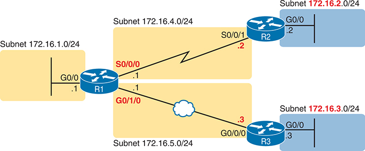
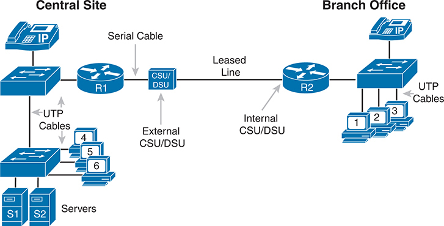
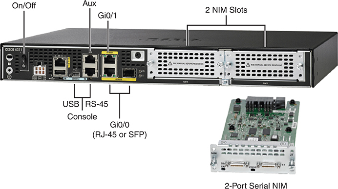
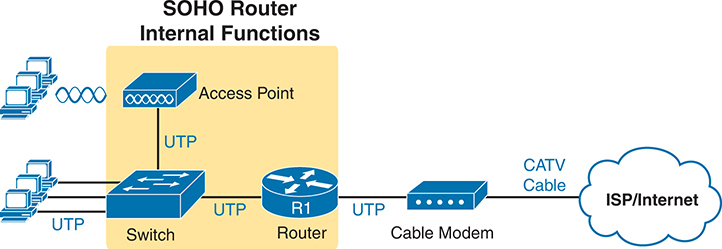
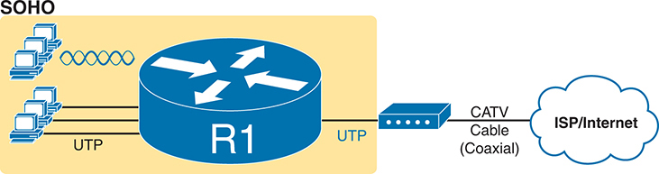
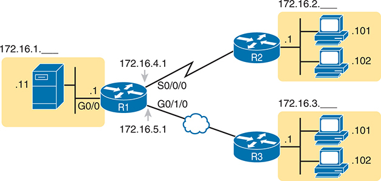
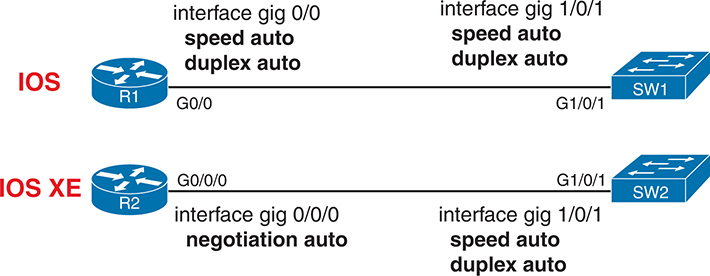
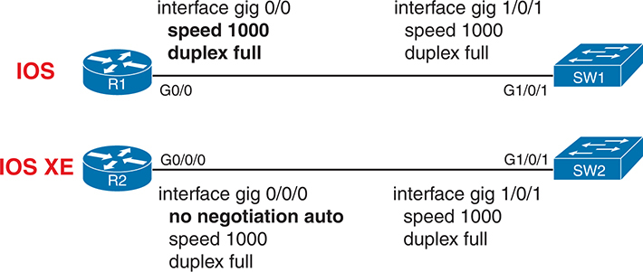

# Chapter 16


## Operating Cisco Routers

This chapter covers the following exam topics:

1.0 Network Fundamentals

1.1 Explain the role and function of network components

1.1.a Routers

1.2 Describe characteristics of network topology architectures

1.2.e Small office/home office (SOHO)

1.6 Configure and verify IPv4 addressing and subnetting

This chapter begins a series of chapters that focus on specific Cisco router features. It begins by discussing Cisco routers: hardware, operating system, interfaces, and other components that comprise a router. This first section helps give you concrete examples of interfaces and devices before getting into the many concept and topology drawings to come.

The second section of the chapter then discusses the command-line interface (CLI) on a Cisco router, which has the same look and feel as the Cisco switch CLI. However, unlike switches, routers require some minimal configuration before they will do their primary job: to forward IP packets. The second section of this chapter discusses the concepts and commands to configure a router so it begins forwarding IP packets on its interfaces.

### "Do I Know This Already?" Quiz

Take the quiz (either here or use the PTP software) if you want to use the score to help you decide how much time to spend on this chapter. The letter answers are listed at the bottom of the page following the quiz. [Appendix C](vol1_appc.md#appc), found both at the end of the book as well as on the companion website, includes both the answers and explanations. You can also find both answers and explanations in the PTP testing software.

**Table 16-1** "Do I Know This Already?" Foundation Topics Section-to-Question Mapping

| Foundation Topics Section | Questions |
| --- | --- |
| Installing Cisco Routers | 1 |
| Enabling IPv4 Support on Cisco Router Interfaces | 2-6 |

**[1](vol1_ch16.md#ques16_1a).** Which operating systems run on Cisco enterprise routers and use a CLI that works much like the CLI on Cisco LAN switches? (Choose two answers.)

1. CatOS
2. IOS
3. Windows
4. IOS XE

**[2](vol1_ch16.md#ques16_2a).** Which action would you expect to be true of a router CLI interaction that is not true when configuring a LAN switch that performs only Layer 2 switching functions?

1. Moving from global to physical interface configuration mode
2. Configuring an IP address in physical interface configuration mode
3. Configuring a 10/100/1000 port's settings related to speed and autonegotiation
4. Configuring a console password

**[3](vol1_ch16.md#ques16_3a).** Which answers list a task that could be helpful in making a router interface G0/0 ready to route packets? (Choose two answers.)

1. Configuring the **ip address** *address mask* command in G0/0 configuration mode
2. Configuring the **ip address** *address* and **ip mask** *mask* commands in G0/0 configuration mode
3. Configuring the **no shutdown** command in G0/0 configuration mode
4. Setting the interface **description** in G0/0 configuration mode

**[4](vol1_ch16.md#ques16_4a).** The output of the **show ip interface brief** command on R1 lists interface status codes of "down" and "down" for interface GigabitEthernet 0/0. The interface connects to a LAN switch with a UTP straight-through cable. Which of the following could be true?

1. The **shutdown** command is currently configured for router interface G0/0.
2. The **shutdown** command is currently configured for the switch interface on the other end of the cable.
3. The router was never configured with an **ip address** command on the interface.
4. The router was configured with the **no ip address** command.

**[5](vol1_ch16.md#ques16_5a).** Which of the following commands list the IP address but not the subnet mask of an interface?

1. **show running-config**
2. **show protocols** *type number*
3. **show ip interface brief**
4. **show interfaces**

**[6](vol1_ch16.md#ques16_6a).** Which of the following is different on the Cisco switch CLI for a Layer 2 switch as compared with the Cisco router CLI?

1. The commands used to configure simple password checking for the console
2. The number of IP addresses configured
3. The configuration of the device's hostname
4. The configuration of an interface description

Answers to the "Do I Know This Already?" quiz:

**[1](vol1_appc.md#ques16_1)** B, D

**[2](vol1_appc.md#ques16_2)** B

**[3](vol1_appc.md#ques16_3)** A, C

**[4](vol1_appc.md#ques16_4)** B

**[5](vol1_appc.md#ques16_5)** C

**[6](vol1_appc.md#ques16_6)** B

### Foundation Topics

### Installing Cisco Routers

Routers collectively provide the main feature of the network layer--the capability to forward packets end to end through a network. As introduced in [Chapter 3](vol1_ch03.md#ch03), "[Fundamentals of WANs and IP Routing](vol1_ch03.md#ch03)," routers forward packets by connecting to various physical network links, like Ethernet LAN, Ethernet WAN, and serial WAN links, then using Layer 3 routing logic to choose where to forward each packet. As a reminder, [Chapter 2](vol1_ch02.md#ch02), "[Fundamentals of Ethernet LANs](vol1_ch02.md#ch02)," covered the details of making those physical connections to Ethernet networks, while [Chapter 3](vol1_ch03.md#ch03) covered the basics of cabling with WAN links.

This section examines some of the details of router installation and cabling, first from the enterprise perspective and then from the perspective of connecting a typical small office/home office (SOHO) to an ISP using high-speed Internet.

#### Installing Enterprise Routers

A typical enterprise network has a few centralized sites as well as lots of smaller remote sites. To support devices at each site (the computers, IP phones, printers, and other devices), the network includes at least one LAN switch at each site. In addition, each site has a router, which connects to the LAN switch and to some WAN link. The WAN link provides connectivity from each remote site, back to the central site, and to other sites through the connection to the central site.

[Figures 16-1](vol1_ch16.md#ch16fig01) and [16-2](vol1_ch16.md#ch16fig02) show a couple of different kinds of network diagrams that might be used to represent an enterprise network. The style of [Figure 16-1](vol1_ch16.md#ch16fig01) supports discussions about Layer 3 topics, showing the subnet IDs, masks, and interface IP addresses in shorthand. The figure also keeps the physical and data-link details to a minimum with these conventions:

**Ethernet LAN:** Simple straight lines with one or more LAN switches implied but not shown.

**Ethernet WAN:** Shown as a straight line, often with a cloud over it, with some kind of Ethernet interface identifier shown by the router (in this case, G0/1/0 and G0/0/0, which refers to GigabitEthernet interfaces).

**Serial WAN:** A line with a crooked part in the middle (a "lightning bolt") represents a typical point-to-point serial link as introduced in [Chapter 3](vol1_ch03.md#ch03).




**Figure 16-1** *Generic Enterprise Network Diagram*

A host with subnet 172.16.1.0/24 sends a packet to other host, through R 1, G0/0, and the .1 beside the icon. R 1 with subnet 172.16.4.0/24 and S0/0/0, passes the packet to R 2, S0/0/1 and .2, through serial line. The R 2 passes the packet to the host with subnet 172.16.2.0/24. The host again sends a packet to other host, through R 1, G0/0, and the .1 beside the icon. R 1 with subnet 172.16.5.0/24 and G0/1/0, passes the packet to R 3, G0/0/0 and .3, through Ethernet W A N. The R 3 passes the packet to the host with Subnet 172.16.3.0/24.





**Figure 16-2** *More Detailed Cabling Diagram for the Same Enterprise Network*

At the central site, an I P phone connects to a switch, which in turn connects to another switch via U T B cables. The first switch is linked to a router using U T P cables, and the router is connected to an external C S U/D S U via a serial cable. A leased line connects the external C S U/D S U to the internal R2 C S U/D S U, which then connects to an IP phone, a switch, and three personal computers via U T P cables. The second switch is connected to two servers labeled S1 and S2, as well as three sets of personal computers, all through U T P cables.

In comparison, [Figure 16-2](vol1_ch16.md#ch16fig02) shows the same network, with more detail about the physical cabling but with IP details removed. Focusing on the LANs, all the lines connected to the LAN switches could be the standard UTP cabling with RJ-45 connectors.

Next, consider the hardware on the ends of the serial link between the two routers. In a real serial link that runs through a service provider, the link terminates at a channel service unit/data service unit (CSU/DSU). The CSU/DSU can either sit outside the router as a separate device (as shown on the left at Router R1) or integrated into the router's serial interface hardware (as shown on the right).

As for cabling, the service provider will run the cable into the enterprise's wiring closet and often put an RJ-48 connector (same size as an RJ-45 connector) on the end of the cable. That cable should connect to the CSU/DSU. With an internal CSU/DSU (as with Router R2 in [Figure 16-2](vol1_ch16.md#ch16fig02)), the router serial port has an RJ-48 port to which the serial cable should connect. With an external CSU/DSU, the CSU/DSU must be connected to the router's serial card via a short serial cable.

##### The Cisco Router Operating Systems

All routers have the usual components found in a computer: a CPU, RAM, permanent memory (usually flash memory), and other electronics. They also run an operating system (OS), which goes by the name [IOS](vol1_gloss.md#gloss_201). The original Cisco routers used IOS; even today, some current router products use IOS. However, Cisco has created other enterprise-class router product families that use a different variation of IOS named [IOS XE](vol1_gloss.md#gloss_202).

Cisco created IOS XE in the 2000s to improve the IOS software architecture. Those improvements may not be evident to the casual observer, but to name a few, IOS XE reduces unplanned and planned downtime, better protects against cyberattacks, and aids network automation. For instance, IOS XE devices can support upgrading the OS while continuing to forward frames and packets, while IOS cannot.

Thankfully, IOS XE uses the same familiar CLI as IOS. Both use the same commands, for the most part, the same command syntax, navigation and modes, and so on. If you learned the CLI using an IOS router, you might not even notice when using a router that runs IOS XE later.

Because the differences between IOS and IOS XE do not matter in most cases in this book, the book uses the term *IOS* almost exclusively to refer to the router OS. When differences in IOS versus IOS XE matter, the text will note the differences.

##### Cisco Integrated Services Routers

Product vendors, including Cisco, typically provide several different types of router hardware. Today, routers often do much more work than simply routing packets; in fact, they serve as a device or platform from which to provide many network services.

As an example, consider the networking functions needed at a typical branch office. A typical enterprise branch office needs a router for WAN/LAN connectivity, and a LAN switch to provide a high-performance local network and connectivity into the router and WAN. Many branches also need voice-over-IP (VoIP) services to support IP phones, and several security services as well. Plus, it is hard to imagine a site with users that does not have Wi-Fi access today. So, rather than require multiple separate devices at one site, as shown in [Figure 16-2](vol1_ch16.md#ch16fig02), Cisco offers single devices that act as both router and switch and provide other functions as well.

For the sake of learning and understanding the different functions, this book focuses on using a separate switch and separate router, which provides a much cleaner path for learning the basics. However, most Cisco products and product families support a variety of functions in one device.

The Cisco [Integrated Services Router (ISR)](vol1_gloss.md#gloss_192) product families include routers that perform much more than routing. Cisco introduced the first ISRs in the mid-2000s, with some ISR families still in existence in the early 2020s when this chapter was most recently updated. The name itself emphasizes the role of being a router, while also integrating other functions (services).

[Figure 16-3](vol1_ch16.md#ch16fig03) shows a Cisco 4321 ISR, with some of the more important features highlighted. The top part of the figure shows a full view of the back of the router. This model comes with two built-in Gigabit Ethernet interfaces and two modular slots that allow you to add small cards called Network Interface Modules (NIMs). The bottom of the figure shows one sample NIM (a NIM that provides two serial interfaces). The router has other items as well, including both an RJ-45 and USB console port.




**Figure 16-3** *Photos of a Model 4321 Cisco Integrated Services Router (ISR)*

The device with labeled buttons and ports includes on/off switches, Aux, Gi0/1, 2 N I M Slots, U S B, Console, R S-45, Gi0/0 (R J-45 or S F P), and 2-Port Serial N I M.

The figure shows an important feature for using routers to connect to both Ethernet LANs and Ethernet WAN services. Look closely at [Figure 16-3](vol1_ch16.md#ch16fig03)'s Gigabit interfaces. G0/1 refers to interface GigabitEthernet0/1 and is an RJ-45 port that supports UTP cabling only. However, interface G0/0 (short for GigabitEthernet0/0) has some interesting features:

* The router has two ports for one interface (G0/0).
* You can use one or the other at any point in time, but not both.
* One physical port is an RJ-45 port that supports copper cabling (implying that it is used to connect to a LAN).
* The other G0/0 physical port is a small form pluggable (SFP) port that would support various fiber Ethernet standards, allowing the port to be used for Ethernet WAN purposes.

Cisco commonly makes one or more of the Ethernet ports on its Enterprise class routers support SFPs so that the engineer can choose an SFP that supports the type of Ethernet cabling provided by the Ethernet WAN service provider.

Note

When building a lab network to study for CCNA or CCNP, because your devices will be in the same place, you can create Ethernet WAN links by using the RJ-45 ports and a UTP cable without the need to purchase an SFP for each router.

##### The Cisco Catalyst Edge Platform

In 2020, Cisco announced a new router family with the [Cisco Catalyst Edge Platform](vol1_gloss.md#gloss_062) branding, a departure from the previous ISR branding. The new family includes models in the 8000 series, such as the 8200, 8300, and 8500. These new models replaced some existing Cisco ISR families in the Cisco product lineup, but not all.

If the ISR brand emphasized the multifunction nature of modern routers, the *Catalyst Edge Platform* emphasizes that point even more. First, the name does not even use the word *router*, even though the devices use IOS XE and act primarily as routers. The word *platform* emphasizes that the device serves as a platform to run various network services.

Also, note that the new branding uses the term *Catalyst*, a term historically used only for switches. Before the Catalyst 8000 series, the term *Catalyst* always referred to switches, but now Cisco uses the term more broadly. Just be aware in your travels outside of your CCNA studies that when you come across the Catalyst 8000 series devices, think of them as routers.

As for exam preparation, this chapter provides information about ISRs and Catalyst 8000s to provide some context. However, the exam topics do not mention specific Cisco product families. But knowing something about router models and families can help you connect the more generalized topics in CCNA to the devices in your network at work.

##### Physical Installation

Armed with the cabling details in images like [Figure 16-2](vol1_ch16.md#ch16fig02) and the router hardware details in photos like [Figure 16-3](vol1_ch16.md#ch16fig03), you can physically install a router. To install a router, follow these steps:


Step 1. For any Ethernet LAN interface, connect the RJ-45 connector of an appropriate copper Ethernet cable between the RJ-45 Ethernet port on the router and one of the LAN switch ports.

Step 2. For any serial WAN ports:

Step A. If using an external CSU/DSU, connect the router's serial interface to the CSU/DSU and the CSU/DSU to the line from the telco.

Step B. If using an internal CSU/DSU, connect the router's serial interface to the line from the telco.

Step 3. For any Ethernet WAN ports:

Step A. When ordering the Ethernet WAN service, confirm the required Ethernet standard and SFP type required to connect to the link, and order the SFPs.

Step B. Install the SFPs into the routers, and connect the Ethernet cable for the Ethernet WAN link to the SFP on each end of the link.

Step 4. Connect the router's console port to a PC (as discussed in [Chapter 4](vol1_ch04.md#ch04), "[Using the Command-Line Interface](vol1_ch04.md#ch04)"), as needed, to configure the router.

Step 5. Connect a power cable from a power outlet to the power port on the router.

Step 6. Power on the router using the on/off switch.

Note that Cisco enterprise routers typically have an on/off switch, while switches do not.

#### Installing SOHO Routers

The terms [enterprise router](vol1_gloss.md#gloss_123) and *small office/home office (SOHO) router* act as a pair of contrasting categories for routers, both in terms of how vendors like Cisco provide to the market, and how enterprises use and configure those devices. The term *enterprise router* typically refers to a router that a company would use in a permanent business location, while a [SOHO router](vol1_gloss.md#gloss_367) would reside at an employee's home or at a small permanent site with just a few people. However, as you might guess, the line between a router acting as an enterprise router and a SOHO router is blurry, so use these terms as general categories.

Even with that general comparison, SOHO routers typically have two features that an enterprise router would be less likely to have:

* SOHO routers almost always use the Internet and virtual private network (VPN) technology for its WAN connection to send data back and forth to the rest of the enterprise.
* SOHO routers almost always use a multifunction device that does routing, LAN switching, VPN, wireless, and maybe other features.

For instance, at an enterprise business location, the building may contain enterprise routers, separate Ethernet switches, and separate wireless access points (APs), all connected together. At a permanent business site with four employees and 10 total devices in the network, one SOHO router could provide all those same features in one device.

For instance, [Figure 16-4](vol1_ch16.md#ch16fig04) shows a typical SOHO site. The three icons that represent a router, switch, and access point all exist inside one box; the figure shows them separately to emphasize the fact that the one SOHO router provides several functions. On the left, the SOHO router provides wired and wireless LAN servers, and on the right, it provides WAN access through a cable Internet connection.




**Figure 16-4** *Devices in a SOHO Network with High-Speed CATV Internet*

schematic showing a simplified S O H O Router setup: Computer setups representing digital spaces with a cloud symbol for I S P/Internet. C A T V cable connects cable modem to the I S P/internet. U T P connects cable modem to router labeled R 1. R 1 connects to switch via U T P, which connects to computer setups and access point. Access point connects to other setups via Wireless network.

[Figure 16-4](vol1_ch16.md#ch16fig04) does not reflect the physical reality of a SOHO router, so [Figure 16-5](vol1_ch16.md#ch16fig05) shows one cabling example. The figure shows user devices on the left, connecting to the router via wireless or via Ethernet UTP cabling. On the right in this case, the router uses an external cable modem to connect to the coaxial cable provided by the ISP. Then the router must use a normal UTP Ethernet port to connect a short Ethernet cable between the SOHO router and the cable modem.




**Figure 16-5** *SOHO Network, Using Cable Internet and an Integrated Device*

schematic showing a simplified S O H O Router setup: Computer setups representing digital spaces with a cloud symbol for I S P/Internet. C A T V cable (coaxial) connects cable modem to internet. U T P connects cable modem to router labeled R 1, which connects to computer setups via U T P and Wireless network.

### Enabling IPv4 Support on Cisco Router Interfaces

Routers support a relatively large number of features, with a large number of configuration and EXEC commands to support those features. You will learn about many of these features throughout the rest of this book.

Note

For perspective, the Cisco router documentation includes a command reference, with an index to every single router command. A quick informal count listed over 5000 CLI commands.

This second section of the chapter focuses on commands related to router interfaces. To make routers work--that is, to route IPv4 packets--the interfaces must be configured. This section introduces the most common commands that configure interfaces, make them work, and give the interfaces IP addresses and masks.

#### Accessing the Router CLI

The router command-line interface (CLI) works much like a switch. In fact, rather than repeat the detail in [Chapter 4](vol1_ch04.md#ch04), just assume the CLI details from that chapter also apply to routers. If the details from [Chapter 4](vol1_ch04.md#ch04) are not fresh in your memory, it might be worthwhile to spend a few minutes briefly reviewing that chapter as well as [Chapter 7](vol1_ch07.md#ch07), "[Configuring and Verifying Switch Interfaces](vol1_ch07.md#ch07)," before reading further. The following list reviews some of the basic CLI features in common between switches and routers:


* User and Privileged (enable) mode
* Entering and exiting configuration mode, using the **configure terminal**, **end**, and **exit** commands and the Ctrl+Z key sequence
* Configuration of console, Telnet (vty), and enable secret passwords
* Configuration of Secure Shell (SSH) encryption keys and username/password login credentials
* Configuration of the hostname and interface description
* Configuration of an interface to be administratively disabled (**shutdown**) and administratively enabled (**no shutdown**)
* Navigation through different configuration mode contexts using commands like **line console 0** and **interface** *type number*
* CLI help, command editing, and command recall features
* The meaning and use of the startup-config (in NVRAM), running-config (in RAM), and external servers (like TFTP), along with how to use the **copy** command to copy the configuration files and IOS images

The most significant differences in the CLI between Cisco routers and switches come from the primary functions of each device: Layer 2 LAN switching by switches and Layer 3 IP routing by routers. LAN switches consider physical interfaces *Layer 2 interfaces*, or *switched interfaces*, meaning the switch should receive Ethernet frames on the interface and pass those into the LAN switching logic. Routers consider their physical interfaces to be *Layer 3 interfaces* or *routed interfaces*. Layer 3 interfaces expect to receive frames, then de-encapsulate the packet found inside the frame, and pass the packet off to the internal routing processes of the router.

The best way to become comfortable with the differences between switches and routers is to learn more and more commands on each. The chapters from here to the end of this book, and several in *CCNA 200-301 Official Cert Guide, Volume 2,* Second Edition, reveal more detail about router features and the related commands. Here are a few of the router CLI topics you will learn about for routers, with one sample command each:


* Configuring interface IP addresses (**ip address** *address mask*)
* Configuring IP routing protocols (e.g., OSPF) (**router ospf** *process-id*)
* Verifying the IP routing table (**show ip route**)
* Configuring static IP routes (**ip route** *subnet mask next-hop-address*)

Note

Modern routers and switches often support both routing and switching features. Network engineers can then decide whether they need a switch in a particular location in a network design (usually when stronger switching features are required) or a router (when stronger routing features are needed). When studying for CCNA, be aware that routers and switches often support commands for both routing and switching, commands that you might otherwise expect to see only in one or the other.

Cisco routers require the same commands to secure Telnet and SSH, so take some time to review the "[Securing the Switch CLI](vol1_ch06.md#ch06lev1sec3)" section in [Chapter 6](vol1_ch06.md#ch06), "[Configuring Basic Switch Management](vol1_ch06.md#ch06)." Additionally, take extra care with one command related to Telnet and SSH configuration: the **transport input** line subcommand. The command has different defaults on switches and routers, and the default has migrated to a new setting as well. For instance, older enterprise-class routers using IOS (not IOS XE) often default to use **transport input none**, meaning the router supported neither Telnet nor SSH. Enterprise-class routers running IOS XE often default to **transport input ssh**, supporting SSH but not Telnet.

#### Router Interfaces

One minor difference between Cisco switches and routers is that routers support a much wider variety of interfaces. Today, LAN switches support only Ethernet interfaces of various speeds. Routers support a variety of other types of interfaces, including serial interfaces, cable TV, 4G/5G wireless, and others not mentioned in this book.

Most Cisco routers have at least one Ethernet interface of some type. Many of those Ethernet interfaces support multiple speeds and use autonegotiation, so for consistency, the router IOS refers to these interfaces based on the fastest speed. For example, a 10-Mbps-only Ethernet interface would be configured with the **interface ethernet** *number* configuration command, a 10/100 interface with the **interface fastethernet** *number* command, and a 10/100/1000 interface with the **interface gigabitethernet** *number* command. However, when discussing these interfaces all together, engineers would simply call them *ethernet interfaces*, regardless of the maximum speed.

Some Cisco routers have serial interfaces. As you might recall from [Chapter 3](vol1_ch03.md#ch03), Cisco routers use serial interfaces to connect to a serial link. Each point-to-point serial link can then use High-Level Data Link Control (HDLC, the default) or Point-to-Point Protocol (PPP).

Router commands refer to interfaces first by the type of interface (Ethernet, Fast Ethernet, Gigabit Ethernet, Serial, and so on) and then with a unique interface identifier (a number) on that router. Depending on the router model, the interface identifiers might be a single number, two numbers separated by a slash, or three numbers separated by slashes. For example, all of the following configuration commands are correct on at least one model of Cisco router:

[Click here to view code image](vol1_ch16_images.md#f0415-01)

```
interface ethernet 0
interface fastethernet 0/1
interface gigabitethernet 0/0
interface gigabitethernet 0/1/0
interface serial 1/0/1
interface cellular 0/0/1
```

Two of the most common commands to display the interfaces, and their status, are the **show ip interface brief** and **show interfaces** commands. The first of these commands displays a list with one line per interface, with some basic information, including the interface IP address and interface status. The second command lists the interfaces, but with a large amount of information per interface. [Example 16-1](vol1_ch16.md#exa16_1) shows a sample of each command. The output comes from an ISR router that has both a GigabitEthernet0/0 interface and a GigabitEthernet0/1/0 interface, showing a case with both two-digit and three-digit interface identifiers.

**Example 16-1** *Listing the Interfaces in a Router*

[Click here to view code image](vol1_ch16_images.md#f0416-01)

```
R1# show ip interface brief
Interface                  IP-Address     OK? Method Status                Protocol
Embedded-Service-Engine0/0 unassigned     YES NVRAM  administratively down down
GigabitEthernet0/0         172.16.1.1     YES NVRAM  down                  down
GigabitEthernet0/1         unassigned     YES NVRAM  administratively down down
Serial0/0/0                172.16.4.1     YES manual up                    up
Serial0/0/1                unassigned     YES unset  administratively down down
GigabitEthernet0/1/0       172.16.5.1     YES NVRAM  up                    up

R1# show interfaces gigabitEthernet 0/1/0
GigabitEthernet0/1/0 is up, line protocol is up
  Hardware is EHWIC-1GE-SFP-CU, address is 0201.a010.0001 (bia 30f7.0d29.8570)
  Description: Link in lab to R3's G0/0/0
  Internet address is 172.16.5.1/24
  MTU 1500 bytes, BW 1000000 Kbit/sec, DLY 10 usec,
     reliability 255/255, txload 1/255, rxload 1/255
  Encapsulation ARPA, loopback not set
  Keepalive set (10 sec)
  Full Duplex, 1Gbps, media type is RJ45
  output flow-control is XON, input flow-control is XON
  ARP type: ARPA, ARP Timeout 04:00:00
  Last input 00:00:29, output 00:00:08, output hang never
  Last clearing of "show interface" counters never
  Input queue: 0/75/0/0 (size/max/drops/flushes); Total output drops: 0
  Queueing strategy: fifo
  Output queue: 0/40 (size/max)
  5 minute input rate 0 bits/sec, 0 packets/sec
  5 minute output rate 0 bits/sec, 0 packets/sec
     12 packets input, 4251 bytes, 0 no buffer
     Received 12 broadcasts (0 IP multicasts)
     0 runts, 0 giants, 0 throttles
     0 input errors, 0 CRC, 0 frame, 0 overrun, 0 ignored
     0 watchdog, 0 multicast, 0 pause input
     55 packets output, 8098 bytes, 0 underruns
     0 output errors, 0 collisions, 0 interface resets
     0 unknown protocol drops
     0 babbles, 0 late collision, 0 deferred
     0 lost carrier, 0 no carrier, 0 pause output
     0 output buffer failures, 0 output buffers swapped out
```

Note

Commands that refer to router interfaces can be significantly shortened by truncating the words. For example, **sh int gi0/0** or **sh int g0/0** can be used instead of **show interfaces gigabitethernet0/0**. In fact, many network engineers, when looking over someone's shoulder, would say something like "just do a show int G-I-oh-oh command" in this case, rather than speaking the long version of the command.

Also, note that the **show interfaces** command lists a text interface description on about the third line, if configured. In this case, interface G0/1/0 had been previously configured with the **description Link in lab to R3's G0/0/0** command in interface configuration mode for interface G0/1/0. The **description** interface subcommand provides an easy way to keep small notes about what router interfaces connect to which neighboring devices, with the **show interfaces** command listing that information.

##### Interface Status Codes

Each interface has two *interface status codes*. To be usable, the two interface status codes must be in an "up" state. The first status code refers to whether Layer 1 is working, and the second status code generally (but not always) refers to whether the data-link layer protocol is working. [Table 16-2](vol1_ch16.md#ch16tab02) summarizes these two status codes.


**Table 16-2** Interface Status Codes and Their Meanings

| Name | Location | General Meaning |
| --- | --- | --- |
| Line status | First status code | Refers to the Layer 1 status. (For example, is the cable installed, is it the right/wrong cable, is the device on the other end powered on?) |
| Protocol status | Second status code | Refers generally to the Layer 2 status. It is always down if the line status is down. If the line status is up, a protocol status of down is usually caused by a mismatched data-link layer configuration. |

Several combinations of interface status codes exist, as summarized in [Table 16-3](vol1_ch16.md#ch16tab03). The table lists the status codes in order, from being disabled on purpose by the configuration to a fully working state.


**Table 16-3** Typical Combinations of Interface Status Codes

| Line Status | Protocol Status | Typical Reasons |
| --- | --- | --- |
| Administratively down | Down | The interface has a **shutdown** command configured on it. |
| Down | Down | The interface is not **shutdown**, but the physical layer has a problem. For example, no cable has been attached to the interface, or with Ethernet, the switch interface on the other end of the cable is shut down, or the switch is powered off, or the devices on the ends of the cable use a different transmission speed. |
| Up | Down | Almost always refers to data-link layer problems, most often configuration problems. For example, serial links have this combination when one router was configured to use PPP and the other defaults to use HDLC. |
| Up | Up | Both Layer 1 and Layer 2 of this interface are functioning. |

For some examples, look back at [Example 16-1](vol1_ch16.md#exa16_1)'s **show ip interface brief** command, to the three interfaces in the following list. The interfaces in this list each have a different combination of interface status codes; the list details the specific reasons for this status code in the lab used to create this example for the book.

**G0/0:** The interface is down/down, in this case because no cable was connected to the interface.

**G0/1:** The interface is administratively down/down, because the configuration includes the **shutdown** command under the G0/1 interface.

**S0/0/0:** The interface is up/up because a serial cable is installed, is connected to another router in a lab, and is working.

##### Router Interface IP Addresses

Cisco enterprise routers require at least some configuration beyond the default configuration before they will do their primary job: routing IP packets. First, default router behavior may place an interface in a disabled (shutdown) state. Second, routers use a default interface command of **no ip address**, meaning the interface has no IP address or mask configured. For a router interface to function for routing packets, the interface must be up and configured with an IP address and mask.

To configure the address and mask, simply use the **ip address** *address mask* interface subcommand and ensure that the interface is enabled by using the **no shutdown** command. [Figure 16-6](vol1_ch16.md#ch16fig06) shows a simple IPv4 network with IPv4 addresses on Router R1, with [Example 16-2](vol1_ch16.md#exa16_2) showing the matching configuration.




**Figure 16-6** *IPv4 Addresses Used in [Example 16-2](vol1_ch16.md#exa16_2)*

A server with incomplete subnet 172.16.1. and the .1 beside the server icon sends a packet to personal computers, through R 1, G0/0, and the .1 beside the icon. R 1 with IP 172.16.4.1 and S0/0/0, passes the packet to R 2 through serial line. The R 2 passes the packet to the hosts with incomplete subnet 172.16.2. and the .101 and .102 beside the host icons. The server again sends a packet to other personal computers, through R 1, G0/0, and the .1 beside the icon. R 1 with IP 172.16.5.1 and G0/1/0, passes the packet to R 3 through Ethernet W A N. The R 3 passes the packet to the hosts with Subnet 172.16.3. and the .101 and .102 beside the host icons.

**Example 16-2** *Configuring IP Addresses on Cisco Routers*

[Click here to view code image](vol1_ch16_images.md#f0419-01)

```
R1# configure terminal
Enter configuration commands, one per line. End with CNTL/Z.
R1config)# interface G0/0
R1(config-if)# ip address 172.16.1.1 255.255.255.0
R1(config-if)# no shutdown
R1(config-if)# interface S0/0/0
R1(config-if)# ip address 172.16.4.1 255.255.255.0
R1(config-if)# no shutdown
R1(config-if)# interface G0/1/0
R1(config-if)# ip address 172.16.5.1 255.255.255.0
R1(config-if)# no shutdown
R1(config-if)# ^Z
R1#
```

The **show protocols** command in [Example 16-3](vol1_ch16.md#exa16_3) confirms the state of each of the three R1 interfaces in [Figure 16-6](vol1_ch16.md#ch16fig06) and the IP address and mask configured on those same interfaces.

**Example 16-3** *Verifying IP Addresses on Cisco Routers*

[Click here to view code image](vol1_ch16_images.md#f0419-02)

```
R1# show protocols
Global values:
   Internet Protocol routing is enabled
Embedded-Service-Engine0/0 is administratively down, line protocol is down
GigabitEthernet0/0 is up, line protocol is up
   Internet address is 172.16.1.1/24
GigabitEthernet0/1 is administratively down, line protocol is down
Serial0/0/0 is up, line protocol is up
   Internet address is 172.16.4.1/24
Serial0/0/1 is administratively down, line protocol is down
GigabitEthernet0/1/0 is up, line protocol is up
   Internet address is 172.16.5.1/24
```

One of the first actions to take when verifying whether a router is working is to find the interfaces, check the interface status, and check to see whether the correct IP addresses and masks are used. [Examples 16-1](vol1_ch16.md#exa16_1) and [16-3](vol1_ch16.md#exa16_3) showed samples of the key **show** commands, while [Table 16-4](vol1_ch16.md#ch16tab04) summarizes those commands and the types of information they display.


**Table 16-4** Key Commands to List Router Interface Status

| Command | Lines of Output per Interface | IP Configuration Listed | Interface Status Listed? |
| --- | --- | --- | --- |
| **show ip interface brief** | 1 | Address | Yes |
| **show protocols** [*type number*] | 1 or 2 | Address/mask | Yes |
| **show interfaces** [*type number*] | Many | Address/mask | Yes |

##### Ethernet Interface Autonegotiation

The first step to make a router Ethernet interface reach an up/up state requires the installation of the correct cable. For instance, for Ethernet WAN links, the physical standard may need to support distances of several kilometers, so the interface hardware typically requires fiber-optic cabling. Router LAN interfaces often use UTP cabling that connects to nearby LAN switches, with the expected straight-through cable pinout.

For Ethernet interfaces that allow multiple standards and speeds, you also need to ensure the interfaces use autonegotiation or use correct static settings. IOS routers use the same concepts and commands as Cisco switches, as discussed in the section, "[Configuring Autonegotiation, Speed, and Duplex](vol1_ch07.md#ch07lev2sec2)," in [Chapter 7](vol1_ch07.md#ch07). IOS XE routers use the same autonegotiation processes but with different commands, so read the next few pages to work through those differences.

First, for the familiar, the top part of [Figure 16-7](vol1_ch16.md#ch16fig07) shows an example with an IOS Router R1 connected to a Cisco switch. The figure shows all the default settings on both the router and the switch, which cause both devices to perform IEEE autonegotiation.





**Figure 16-7** *Default Ethernet Autonegotiation Configuration: IOS and IOS XE*

The I O S connection shows R 1, interface gig 0/0 speed auto duplex auto is connected to S W 1, interface gig 1/0/1 speed auto duplex auto. The I O S X E connection shows R 2, interface gig 0/0/0 negotiation auto is connected to S W 2, interface gig 1/0/1 speed auto duplex auto.

The bottom half of the figure focuses on the different configuration in IOS XE Router R2. The IOS XE default interface subcommand, **negotiation auto**, does just what it appears to do--it enables IEEE autonegotiation. As a result, both devices use autonegotiation to choose the link speed and duplex.

The **show interfaces** EXEC command reveals the chosen duplex and speed. For an IOS (not IOS XE) example, refer to [Example 16-1](vol1_ch16.md#exa16_1), about nine lines into the **show interfaces** command output, to see the speed (1Gbps) and duplex (full) listed. However, none of the IOS **show** commands specifically note that the router used autonegotiation.

For the IOS XE case, several commands reveal the use of IEEE autonegotiation, as seen in [Example 16-4](vol1_ch16.md#exa16_4)'s output from IOS XE Router R2 from [Figure 16-7](vol1_ch16.md#ch16fig07). The **show interfaces** command (in the highlighted line) confirms the speed and duplex. The highlighted line also lists "link type is auto," meaning it autonegotiated the values.

**Example 16-4** *Verifying IOS XE Autonegotiation Results (Default)*

[Click here to view code image](vol1_ch16_images.md#f0421-01)

```
! Output below is from IOS XE router R2
R2# show interfaces g0/0/0
GigabitEthernet0/0/0 is up, line protocol is up
  Hardware is C1111-2x1GE, address is 0200.1111.1111 (bia 2436.dadf.5680)
  Internet address is 10.1.1.1/24
  MTU 1500 bytes, BW 1000000 Kbit/sec, DLY 10 usec,
     reliability 255/255, txload 1/255, rxload 1/255
  Encapsulation ARPA, loopback not set
  Keepalive not supported
  Full Duplex, 1000Mbps, link type is auto, media type is RJ45
! Lines omitted for brevity
R2# show interfaces g0/0/0 controller | include Autoneg
Admin State Up MTU 1500 Speed 1000mbps Duplex full Autoneg On Stats Interval 5
```

The IOS XE **show interfaces g0/0/0 controller** command at the end of the example filters the output to show only the subset of lines that include the text "Autoneg." That line also confirms the use of autonegotiation.

Whether you are using IOS or IOS XE, the recommendations for using autonegotiation on router Ethernet interfaces mirror the recommendations for switch interfaces, summarized here as follows:

* Use autonegotiation on both ends of an Ethernet link.
* If you must set the speed or duplex, ensure you configure the devices on both ends of the link to use the same speed and duplex.
* Avoid configuring speed and duplex on one end while relying on autonegotiation on the other.

If you must manually configure the settings, IOS and IOS XE differ slightly in how to configure speed and duplex manually. IOS routers use the same conventions as switches: just configure both the **speed** and **duplex** interface subcommands to specific settings, as shown in the left of [Figure 16-8](vol1_ch16.md#ch16fig08). With IOS routers, configuring both speed and duplex also disables autonegotiation.





**Figure 16-8** *Router Ethernet Speed, Duplex, and Autonegotiation Configuration*

The I O S connection shows R 1, interface gig 0/0 speed 1000 duplex full is connected to S W 1, interface gig 1/0/1 speed 1000 duplex full. The I O S X E connection shows R 2, interface gig 0/0/0 no negotiation auto speed 1000 duplex full is connected to S W 2, interface gig 1/0/1 speed 1000 duplex full.

IOS XE requires the commands shown by Router R2 in the figure, with [Example 16-5](vol1_ch16.md#exa16_5) demonstrating those same configuration steps. The example begins by showing how IOS XE does not allow the configuration of the **speed** or **duplex** commands until you disable autonegotiation with the **no negotiation auto** interface subcommand. After disabling autonegotiation, IOS XE allows setting the specific **speed** and **duplex** values. The example then shows log messages informing you that the interface failed and then recovered, which is common when using new speed and duplex settings, with approximately ten seconds to work through the process.

**Example 16-5** *IOS XE Router: Setting Speed and Duplex*

[Click here to view code image](vol1_ch16_images.md#f0422-01)

```
R2# configure terminal
Enter configuration commands, one per line.  End with CNTL/Z.
R2(config)# interface g0/0/0
R2(config-if)# speed 1000
Auto-negotiation is enabled. Speed cannot be set

R2(config-if)# no negotiation auto
R2(config-if) # speed 1000
R2(config-if) # duplex full
*Oct 14 12:24:16.014: %LINEPROTO-5-UPDOWN: Line protocol on Interface 
GigabitEthernet0/0/0, changed state to down
*Oct 14 12:24:24.207: %LINEPROTO-5-UPDOWN: Line protocol on Interface 
GigabitEthernet0/0/0, changed state to up
R2(config-if)# ^Z
*Oct 14 12:19:10.210: %LINK-3-UPDOWN: Interface GigabitEthernet0/0/0, changed state
to up
R2#
R2# show interfaces g0/0/0 controller
GigabitEthernet0/0/0 is up, line protocol is up
  Hardware is C1111-2x1GE, address is 0200.1111.1111 (bia 2436.dadf.5680)
  Internet address is 10.1.1.1/24
  MTU 1500 bytes, BW 1000000 Kbit/sec, DLY 10 usec,
     reliability 255/255, txload 1/255, rxload 1/255
  Encapsulation ARPA, loopback not set
  Keepalive not supported
  Full Duplex, 1000Mbps, link type is force-up, media type is RJ45
  output flow-control is on, input flow-control is on
! Lines omitted for brevity
Driver Configuration Block:
Admin State Up MTU 1500 Speed 1000mbps Duplex full Autoneg Off Stats Interval 5
! More lines omitted for brevity
```

The highlighted text near the end of [Example 16-5](vol1_ch16.md#exa16_5) confirms the resulting speed and duplex. It also identifies that autonegotiation was not used, with the phrase "link type is force-up," in contrast to the "link type is auto" text in the autonegotiation in [Example 16-4](vol1_ch16.md#exa16_4). Later in the output, one line explicitly lists the fact that autonegotiation is off.

Note

On IOS XE routers, the [**no**] **negotiation auto** command controls autonegotiation. In IOS routers, configuring **speed** and **duplex** to specific values disables autonegotiation.

##### Bandwidth and Clock Rate on Serial Interfaces

Cisco included serial WAN topics in the CCNA exam topic from its inception in 1998 until the CCNA 200-301 Version 1.0 blueprint in early 2020. Even though Cisco no longer mentions serial links in the exam topics, the exam might show them with the expectation that you at least understand the basics, such as the fact that two routers can send data over a serial link if the router interfaces on both ends are up/up and the routers have IP addresses in the same subnet.

However, some of you will want to make serial links work in a lab because you have some serial interface cards in your lab. If so, take the time to look at a few pages in the section titled "[Bandwidth and Clock Rate on Serial Interfaces](vol1_ch16.md#ch16lev3sec8)," in [Appendix K](vol1_appk.md#appk), "[Topics from Previous Editions](vol1_appk.md#appk)," which shows how to cable and configure a WAN serial link in the lab.

#### Router Auxiliary Port

Both routers and switches have a console port to allow administrative access, but most Cisco routers have an extra physical port called an auxiliary (Aux) port. The Aux port typically serves as a means to make a phone call to connect into the router to issue commands from the CLI.

The Aux port works like the console port, except that the Aux port is typically connected through a cable to an external analog modem, which in turn connects to a phone line. Then, the engineer uses a PC, terminal emulator, and modem to call the remote router. After being connected, the engineer can use the terminal emulator to access the router CLI, starting in user mode as usual.

Aux ports can be configured beginning with the **line aux 0** command to reach aux line configuration mode. From there, all the commands for the console line, covered mostly in [Chapter 6](vol1_ch06.md#ch06), can be used. For example, the **login** and **password** *password* subcommands on the aux line could be used to set up simple password checking when a user dials in.

### Chapter Review

One key to doing well on the exams is to perform repetitive spaced review sessions. Review this chapter's material using either the tools in the book or interactive tools for the same material found on the book's companion website. Refer to the "[Your Study Plan](vol1_pref10.md#pref10)" element for more details. [Table 16-5](vol1_ch16.md#ch16tab05) outlines the key review elements and where you can find them. To better track your study progress, record when you completed these activities in the second column.

**Table 16-5** Chapter Review Tracking

| Review Element | Review Date(s) | Resource Used |
| --- | --- | --- |
| Review key topics |  | Book, website |
| Review key terms |  | Book, website |
| Answer DIKTA questions |  | Book, PTP |
| Review command tables |  | Book |
| Review memory tables |  | Website |
| Do labs |  | Blog |
| Watch video |  | Website |

### Review All the Key Topics


**Table 16-6** Key Topics for [Chapter 16](vol1_ch16.md#ch16)

| Key Topic | Description | Page Number |
| --- | --- | --- |
| List | Steps required to install a router | [412](vol1_ch16.md#page_412) |
| List | Similarities between a router CLI and a switch CLI | [414](vol1_ch16.md#page_414) |
| List | IOS features typical of routers (and all devices that perform routing) | [414](vol1_ch16.md#page_414) |
| [Table 16-2](vol1_ch16.md#ch16tab02) | Router interface status codes and their meanings | [417](vol1_ch16.md#page_417) |
| [Table 16-3](vol1_ch16.md#ch16tab03) | Combinations of the two interface status codes and the likely reasons for each combination | [417](vol1_ch16.md#page_417) |
| [Table 16-4](vol1_ch16.md#ch16tab04) | Commands useful to display interface IPv4 addresses, masks, and interface status | [419](vol1_ch16.md#page_419) |
| [Figure 16-7](vol1_ch16.md#ch16fig07) | Comparison of default autonegotiation configuration, routers with IOS and IOS XE | [420](vol1_ch16.md#page_420) |
| [Figure 16-8](vol1_ch16.md#ch16fig08) | Comparison of configuration to disable autonegotiation and use a set speed/duplex, routers with IOS and IOS XE | [421](vol1_ch16.md#page_421) |

### Key Terms You Should Know

[Cisco Catalyst Edge Platform](vol1_ch16.md#key_187)

[enterprise router](vol1_ch16.md#key_188)

[Integrated Services Router (ISR)](vol1_ch16.md#key_189)

[IOS](vol1_ch16.md#key_190)

[IOS XE](vol1_ch16.md#key_191)

[SOHO router](vol1_ch16.md#key_192)

### Command References

[Tables 16-7](vol1_ch16.md#ch16tab07) and [16-8](vol1_ch16.md#ch16tab08) list configuration and verification commands used in this chapter. As an easy review exercise, cover the left column in a table, read the right column, and try to recall the command without looking. Then repeat the exercise, covering the right column, and try to recall what the command does.

**Table 16-7** [Chapter 16](vol1_ch16.md#ch16) Configuration Command Reference

| Command | Description |
| --- | --- |
| **interface** *type number* | Global command that moves the user into configuration mode of the named interface. |
| **ip address** *address mask* | Interface subcommand that sets the router's IPv4 address and mask. |
| **[no] shutdown** | Interface subcommand that enables (**no shutdown**) or disables (**shutdown**) the interface. |
| **duplex** {**full** | **half** | **auto**} | IOS (not XE) interface command that sets the duplex, or sets the use of IEEE autonegotiation, for router LAN interfaces that support multiple speeds. |
| **speed** {**10** | **100** | **1000** | **auto**} | IOS (not XE) interface command for router Gigabit (10/100/1000) interfaces that sets the speed at which the router interface sends and receives data, or sets the use of IEEE autonegotiation. |
| **description** *text* | An interface subcommand with which you can type a string of text to document information about that particular interface. |
| **[no] negotiation auto** | IOS XE (not IOS) interface command that enables or disables (**y**) the use of IEEE autonegotiation on the interface. There is no equivalent for routers that use IOS. |
| **duplex** {**full** | **half** } | IOS XE (not IOS) interface command that sets the duplex, allowed only if the interface is already configured with the **no negotiation auto** subcommand. |
| **speed** {**10** | **100** | **1000**} | IOS XE (not IOS) interface command that sets the speed, allowed only if the interface is already configured with the **no negotiation auto** subcommand. |


**Table 16-8** [Chapter 16](vol1_ch16.md#ch16) EXEC Command Reference

| Command | Purpose |
| --- | --- |
| **show interfaces** [*type number*] | Lists a large set of informational messages about each interface, or about the one specifically listed interface. |
| **show ip interface brief** | Lists a single line of information about each interface, including the IP address, line and protocol status, and the method with which the address was configured (manual or Dynamic Host Configuration Protocol [DHCP]). |
| **show protocols** [*type number*] | Lists information about the listed interface (or all interfaces if the interface is omitted), including the IP address, mask, and line/protocol status. |
| **show interfaces** [*type number*] **controller** | IOS XE (not IOS) command that lists detail about interface hardware and driver behavior, including detail about Ethernet autonegotiation processes and results. |