# Chapter 18


## IP Routing in the LAN

This chapter covers the following exam topics:

1.0 Network Fundamentals

1.1 Explain the role and function of network components

1.1.a Routers

1.1.b Layer 2 and Layer 3 switches

1.6 Configure and verify IPv4 addressing and subnetting

2.0 Network Access

2.1 Configure and verify VLANs (normal range) spanning multiple switches

2.1.c InterVLAN connectivity

2.4 Configure and verify (Layer 2/Layer 3) EtherChannel (LACP)

The preceding two chapters showed how to configure an IP address and mask on a router interface, making the router ready to route packets to/from the subnet implied by that address/mask combination. While true and useful, all the examples so far ignored the LAN switches and the possibility of VLANs. In fact, the examples so far show the simplest possible cases: the attached switches as Layer 2 switches, using only one VLAN, with the router configured with one **ip address** command on its physical interface. This chapter takes a detailed look at how to configure routers so that they route packets to/from the subnets that exist on each and every VLAN.

Because Layer 2 switches do not forward Layer 2 frames between VLANs, a network must use a device that performs IP routing to route IP packets between subnets. That device can be a router, or it can be a switch that also includes routing features.

To review, Ethernet defines the concept of a VLAN, while IP defines the concept of an IP subnet, so a VLAN is not equivalent to a subnet. However, the devices in one VLAN typically use IP addresses in one subnet. By the same reasoning, devices in two different VLANs are normally in two different subnets. For two devices in different VLANs to communicate with each other, routers must connect to the subnets that exist on each VLAN, and then the routers forward IP packets between the devices in those subnets.

This chapter discusses multiple methods of routing between VLANs, all of which can be useful in different scenarios:

* **VLAN Routing with Router 802.1Q Trunks:** The first section discusses configuring a router to use VLAN trunking on a link connected to a Layer 2 switch. The router does the routing, with the switch creating the VLANs. The link between the router and switch uses VLAN trunking so that the router has an interface connected to each VLAN/subnet. This feature is known as routing over a VLAN trunk and also known as [router-on-a-stick (ROAS)](vol1_gloss.md#gloss_351).
* **VLAN Routing with Layer 3 Switch SVIs:** The second section discusses using a LAN switch that supports both Layer 2 switching and Layer 3 routing (called a [Layer 3 switch](vol1_gloss.md#gloss_227) or [multilayer switch](vol1_gloss.md#gloss_261)). To route, the Layer 3 switch configuration uses interfaces called switched virtual interfaces (SVIs), which are also called VLAN interfaces.
* **VLAN Routing with Layer 3 Switch Routed Ports:** The third major section of the chapter discusses an alternative to SVIs called [routed ports](vol1_gloss.md#gloss_346), in which the physical switch ports are made to act like interfaces on a router. This third section also introduces the concept of an EtherChannel as used as a routed port in a feature called [Layer 3 EtherChannel (L3 EtherChannel)](vol1_gloss.md#gloss_225)*.*
* **VLAN Routing on a Router's LAN Switch Ports:** The final major section discusses Cisco routers that include integrated LAN switch ports. For instance, rather than installing a small router plus a separate small switch at a branch office, you could install a router that has a small set of integrated switch ports. This section shows how to configure the router's switch ports and the internal logic, so the router routes packets for the subnets on those switch ports.

### "Do I Know This Already?" Quiz

Take the quiz (either here or use the PTP software) if you want to use the score to help you decide how much time to spend on this chapter. The letter answers are listed at the bottom of the page following the quiz. [Appendix C](vol1_appc.md#appc), found both at the end of the book as well as on the companion website, includes both the answers and explanations. You can also find both answers and explanations in the PTP testing software.

**Table 18-1** "Do I Know This Already?" Foundation Topics Section-to-Question Mapping

| Foundation Topics Section | Questions |
| --- | --- |
| VLAN Routing with Router 802.1Q Trunks | 1, 2 |
| VLAN Routing with Layer 3 Switch SVIs | 3, 4 |
| VLAN Routing with Layer 3 Switch Routed Ports | 5, 6 |
| VLAN Routing on a Router's LAN Switch Ports | 7 |

**[1](vol1_ch18.md#ques18_1a).** Router 1 has a Fast Ethernet interface 0/0 with IP address 10.1.1.1. The interface is connected to a switch. This connection is then migrated to use 802.1Q trunking. Which of the following commands could be part of a valid configuration for Router 1's Fa0/0 interface, assuming the trunk uses VLAN 4 as one of the supported VLANs? (Choose two answers.)

1. **interface fastethernet 0/0.4**
2. **dot1q enable**
3. **dot1q enable 4**
4. **trunking enable**
5. **trunking enable 4**
6. **encapsulation dot1q 4**

**[2](vol1_ch18.md#ques18_2a).** Router R1 has a router-on-a-stick (ROAS) configuration with two subinterfaces of interface G0/1: G0/1.1 and G0/1.2. Physical interface G0/1 is currently in a down/down state. The network engineer then configures a **shutdown** command when in interface configuration mode for G0/1.1 and a **no shutdown** command when in interface configuration mode for G0/1.2. Which answers are correct about the interface state for the subinterfaces? (Choose two answers.)

1. G0/1.1 will be in a down/down state.
2. G0/1.2 will be in a down/down state.
3. G0/1.1 will be in an administratively down state.
4. G0/1.2 will be in an up/up state.

**[3](vol1_ch18.md#ques18_3a).** A Layer 3 switch has been configured to route IP packets between VLANs 1, 2, and 3 using SVIs, which connect to subnets 172.20.1.0/25, 172.20.2.0/25, and 172.20.3.0/25, respectively. The engineer issues a **show ip route connected** command on the Layer 3 switch, listing the connected routes. Which of the following answers lists a piece of information that should be in at least one of the routes?

1. Interface Gigabit Ethernet 0/0.3
2. Next-hop router 172.20.2.1
3. Interface VLAN 2
4. Mask 255.255.255.0

**[4](vol1_ch18.md#ques18_4a).** An engineer has successfully configured a Layer 3 switch with SVIs for VLANs 2 and 3 with autostate enabled by default. Hosts in the subnets using VLANs 2 and 3 can ping each other with the Layer 3 switch routing the packets. The next week, the network engineer receives a call that those same users can no longer ping each other. If the problem is with the Layer 3 switching function, which of the following could have caused the problem? (Choose two answers.)

1. Six (or more) out of ten working VLAN 2 access ports failing due to physical problems
2. A **shutdown** command issued from interface VLAN 4 configuration mode
3. A **no vlan 2** command issued from global configuration mode
4. A **shutdown** command issued from VLAN 2 configuration mode

**[5](vol1_ch18.md#ques18_5a).** A LAN design uses a Layer 3 EtherChannel between two switches SW1 and SW2, with port-channel interface 1 used on both switches. SW1 uses ports G0/1, G0/2, G0/3, and G0/4 in the channel. Which of the following is true about SW1's configuration to enable the channel to route IPv4 packets correctly? (Choose two answers.)

1. The **ip address** command must be on the port-channel 1 interface.
2. The **ip address** command must be on interface G0/1 (lowest numbered port).
3. The port-channel 1 interface must be configured with the **no switchport** command.
4. Interface G0/1 must be configured with the **routedport** command.

**[6](vol1_ch18.md#ques18_6a).** A LAN design uses a Layer 3 EtherChannel between two switches: SW1 and SW2. An engineer adds SW1 port G0/1 to the channel successfully but later fails when adding SW1 port G0/2 to the channel. Which answers list a configuration setting on port G0/2 that would cause this issue? (Choose two answers.)

1. A different STP cost (**spanning-tree cost** *value*)
2. A different speed (**speed** *value*)
3. A default setting for switchport (**switchport**)
4. A different access VLAN (**switchport access vlan** *vlan-id*)

**[7](vol1_ch18.md#ques18_7a).** A router has some routed and some switched physical ports. Which interface subcommands would you expect to be supported only on the switched ports?

1. The **switchport access vlan** *vlan-id* subcommand
2. The **ip address** *address mask* subcommand
3. The **description** *text* subcommand
4. The **hostname** *name* subcommand

Answers to the "Do I Know This Already?" quiz:

**[1](vol1_appc.md#ques18_1)** A, F

**[2](vol1_appc.md#ques18_2)** B, C

**[3](vol1_appc.md#ques18_3)** C

**[4](vol1_appc.md#ques18_4)** C, D

**[5](vol1_appc.md#ques18_5)** A, C

**[6](vol1_appc.md#ques18_6)** B, C

**[7](vol1_appc.md#ques18_7)** A

### Foundation Topics

### VLAN Routing with Router 802.1Q Trunks

Almost all enterprise networks use VLANs. To route IP packets in and out of those VLANs, some devices (either routers or Layer 3 switches) need to have an IP address in each subnet and have a connected route to each of those subnets. Then the IP addresses on those routers or Layer 3 switches can serve as the default gateways in those subnets.

This chapter breaks down the LAN routing options into five categories:

* Use a router, with one router LAN interface and cable connected to the switch for each and every VLAN (typically not used)
* Use a router, with a VLAN trunk connecting to a LAN switch (known as router-on-a-stick, or ROAS)
* Use a Layer 3 switch with switched virtual interfaces (SVIs)
* Use a Layer 3 switch with routed interfaces (which may or may not be Layer 3 EtherChannels)
* Use a router with integrated switch ports, configuring it much like a Layer 3 switch with SVIs

Of the items in the list, the first option works, but to be practical, it requires far too many interfaces. It is mentioned here only to make the list complete.

As for the other options, this chapter discusses each in turn. Real networks use these features, with the choice to use one or the other driven by the design and needs for a particular part of the network. [Figure 18-1](vol1_ch18.md#ch18fig01) shows cases in which these options could be used.


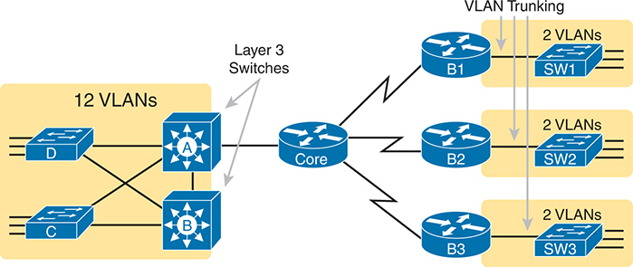


**Figure 18-1** *Layer 3 Switching at the Central Site, ROAS at Branch Offices*

The schematic shows two Layer 3 switches, A and B, connected to the core router at the central site. These switches facilitate routing between 12 V L A Ns. The core router extends connections to three branch offices: B1, B2, and B3, each equipped with a single router: SW1, SW2, and SW3 respectively, featuring two interfaces and V L A Ns. The connectivity between branch offices and routers is established via V L A N Trunking.

[Figure 18-1](vol1_ch18.md#ch18fig01) shows two switches, labeled A and B, which could act as Layer 3 switches--both with SVIs and routed interfaces. The figure shows a central site campus LAN on the left, with 12 VLANs. At the central site, two of the switches act as Layer 3 switches, combining the functions of a router and a switch, routing between all 12 subnets/VLANs. Those Layer 3 switches could use SVIs, routed interfaces, or both.

[Figure 18-1](vol1_ch18.md#ch18fig01) also shows a classic case for using a router with a VLAN trunk. Sites like the remote sites on the right side of the figure may have a WAN-connected router and a LAN switch. These sites might use ROAS to take advantage of the router's ability to route over an 802.1Q trunk.

Note that [Figure 18-1](vol1_ch18.md#ch18fig01) just shows an example. The engineer could use Layer 3 switching at each site or routers with VLAN trunking at each site.

#### Configuring ROAS

This next topic discusses how routers route packets to subnets associated with VLANs connected to a router 802.1Q trunk. That long description can be a bit of a chore to repeat each time someone wants to discuss this feature, so over time, the networking world has instead settled on a shorter and more interesting name for this feature: router-on-a-stick (ROAS).

ROAS uses router VLAN trunking configuration to give the router a logical interface connected to each VLAN. Because the router then has an interface connected to each VLAN, the router can also be configured with an IP address in the subnet that exists on each VLAN.

The router needs to have an IP address/mask associated with each VLAN on the trunk. However, the router has only one physical interface for the link connected to the trunk. Cisco solves this problem by creating multiple virtual router interfaces, one for each supported VLAN on that trunk. Cisco calls these virtual interfaces [subinterfaces](vol1_gloss.md#gloss_381), and the router configuration includes an **ip address** command for each subinterface.

[Figure 18-2](vol1_ch18.md#ch18fig02) shows the concept with Router B1, one of the branch routers from [Figure 18-1](vol1_ch18.md#ch18fig01). Because this router needs to route between only two VLANs, the figure also shows two subinterfaces, named G0/0/0.10 and G0/0/0.20, which create a new place in the configuration where the per-VLAN configuration settings can be made. The router treats frames tagged with VLAN 10 as if they came in or out of G0/0/0.10 and frames tagged with VLAN 20 as if they came in or out G0/0/0.20.


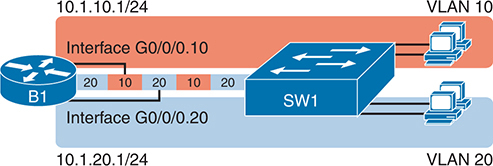


**Figure 18-2** *Subinterfaces on Router B1*

Router B1 with multiple sub interfaces configured. Each sub interface corresponds to a separate VLAN and IP address assignment. Interface G0/0/0.10 is associated with sub interface 10 of G0/0/0, assigned to VLAN 10 on SW1 with IP address 10.1.10.1/24. Interface G0/0/0.20 corresponds to sub interface 20 of G0/0/0, assigned to VLAN 20 on SW1 with IP address 10.1.20.1/24.

In addition, note that most Cisco routers do not attempt to negotiate trunking, so both the router and switch need to manually configure trunking. This chapter discusses the router side of that trunking configuration; the matching switch interface would need to be configured with the **switchport mode trunk** command.

[Example 18-1](vol1_ch18.md#exa18_1) shows a full example of the 802.1Q trunking configuration required on Router B1 in [Figure 18-2](vol1_ch18.md#ch18fig02). More generally, these steps detail how to configure 802.1Q trunking on a router:


Step 1. Use the **interface** *type number.subint* command in global configuration mode to create a unique subinterface for each VLAN that needs to be routed.

Step 2. Use the **encapsulation dot1q** *vlan\_id* command in subinterface configuration mode to enable 802.1Q and associate one specific VLAN with the subinterface.

Step 3. Use the **ip address** *address mask* command in subinterface configuration mode to configure IP settings (address and mask).

**Example 18-1** *Router 802.1Q Configuration per [Figure 18-2](vol1_ch18.md#ch18fig02)*

[Click here to view code image](vol1_ch18_images.md#f0459-01)

```
B1# show running-config
! Only pertinent lines shown
interface gigabitethernet 0/0/0
! No IP address or encapsulation up here!
!
interface gigabitethernet 0/0/0.10
 encapsulation dot1q 10
 ip address 10.1.10.1 255.255.255.0
!
interface gigabitethernet 0/0/0.20
 encapsulation dot1q 20
 ip address 10.1.20.1 255.255.255.0
```

First, look at the subinterface numbers. The subinterface number begins with the period, like .10 and .20 in this case. These numbers can be any number from 1 up through a very large number (over 4 billion). The number just needs to be unique among all subinterfaces associated with this one physical interface. In fact, the subinterface number does not even have to match the associated VLAN ID. (The **encapsulation** command, and not the subinterface number, defines the VLAN ID associated with the subinterface.)

Note

Although not required, most sites do choose to make the subinterface number match the VLAN ID, as shown in [Example 18-1](vol1_ch18.md#exa18_1), just to avoid confusion.

Each subinterface configuration lists two subcommands. One command (**encapsulation**) enables trunking and defines the VLAN the router associates with the frames entering and exiting the subinterface. The **ip address** command works the same way it does on any other router interface.

Now that the router has a working interface, with IPv4 addresses configured, the router can route IPv4 packets on these subinterfaces. That is, the router treats these subinterfaces like any physical interface in terms of adding connected routes, matching those routes, and forwarding packets to/from those connected subnets.

[Example 18-1](vol1_ch18.md#exa18_1) uses two VLANs, 10 and 20, neither of which is the native VLAN on the trunk. ROAS can make use of the native VLAN, with two variations in the configuration, so it requires a little extra thought. The native VLAN can be configured on a subinterface, or on the physical interface, or ignored as in [Example 18-1](vol1_ch18.md#exa18_1). Each 802.1Q trunk has one native VLAN, and if the router needs to route packets for a subnet that exists in the native VLAN, then the router needs some configuration to support that subnet. The two options to define a router interface for the native VLAN are


* Configure the **ip address** command on the physical interface, but without an **encapsulation** command; the router considers this physical interface to be using the native VLAN.
* Configure the **ip address** command on a subinterface and use the **encapsulation dot1q** *vlan-id* **native** subcommand to tell the router both the VLAN ID and the fact that it is the native VLAN.

[Example 18-2](vol1_ch18.md#exa18_2) shows both native VLAN configuration options with a small change to the same configuration in [Example 18-1](vol1_ch18.md#exa18_1). In this case, VLAN 10 becomes the native VLAN. The top part of the example shows the option to configure the router physical interface to use native VLAN 10. The second half of the example shows how to configure that same native VLAN on a subinterface. In both cases, the switch configuration also needs to be changed to make VLAN 10 the native VLAN.

**Example 18-2** *Two Configuration Options for Native VLAN 10 on Router B1*

[Click here to view code image](vol1_ch18_images.md#f0460-01)

```
! First option: put the native VLAN IP address on the physical interface
interface gigabitethernet 0/0/0
 ip address 10.1.10.1 255.255.255.0
!
interface gigabitethernet 0/0/0.20
 encapsulation dot1q 20
 ip address 10.1.20.1 255.255.255.0
```

```
! Second option: like Example 18-1, but add the native keyword
interface gigabitethernet 0/0/0.10
 encapsulation dot1q 10 native
 ip address 10.1.10.1 255.255.255.0
!
interface gigabitethernet 0/0/0.20
 encapsulation dot1q 20
 ip address 10.1.20.1 255.255.255.0
```

#### Verifying ROAS

Beyond using the **show running-config** command, ROAS configuration on a router can be best verified with two commands: **show ip route** [**connected**] and **show vlans**. As with any router interface, as long as the interface is in an up/up state and has an IPv4 address configured, IOS will put a connected (and local) route in the IPv4 routing table. So, a first and obvious check would be to see if all the expected connected routes exist. [Example 18-3](vol1_ch18.md#exa18_3) lists the connected routes per the configuration shown in [Example 18-1](vol1_ch18.md#exa18_1).

**Example 18-3** *Connected Routes Based on [Example 18-1](vol1_ch18.md#exa18_1) Configuration*

[Click here to view code image](vol1_ch18_images.md#f0461-01)

```
B1# show ip route connected
Codes: L - local, C - connected, S - static, R - RIP, M - mobile, B - BGP
! Legend omitted for brevity

      10.0.0.0/8 is variably subnetted, 4 subnets, 2 masks
C        10.1.10.0/24 is directly connected, GigabitEthernet0/0/0.10
L        10.1.10.1/32 is directly connected, GigabitEthernet0/0/0.10
C        10.1.20.0/24 is directly connected, GigabitEthernet0/0/0.20
L        10.1.20.1/32 is directly connected, GigabitEthernet0/0/0.20
```

As for interface and subinterface state, note that the ROAS subinterface state does depend to some degree on the physical interface state. In particular, the subinterface state cannot be better than the state of the matching physical interface. For instance, so far, the physical interface and related subinterfaces on Router B1 rested in an up/up state. If you unplugged the cable from that physical port, the physical and subinterfaces all fail to a down/down state. Or, if you shut down the physical interface, the physical and subinterfaces move to an administratively down state, as seen in [Example 18-4](vol1_ch18.md#exa18_4).

**Example 18-4** *Subinterface State Tied to Physical Interface State*

[Click here to view code image](vol1_ch18_images.md#f0461-02)

```
B1# configure terminal
Enter configuration commands, one per line. End with CNTL/Z.
B1(config)# interface g0/0/0
B1(config-if)# shutdown
B1(config-if)# ^Z
B1# show ip interface brief | include 0/0/0
GigabitEthernet0/0/0         unassigned      YES manual administratively down down
GigabitEthernet0/0/0.10      10.1.10.1       YES manual administratively down down
GigabitEthernet0/0/0.20      10.1.20.1       YES manual administratively down down
```

Additionally, the subinterface state can also be enabled and disabled independently from the physical interface, using the **no shutdown** and **shutdown** commands in subinterface configuration mode. For instance, the physical interface and subinterface .10 can remain up/up, while subinterface .20 can be independently shut down.

Another useful ROAS verification command, **show vlans**, spells out which router trunk interfaces use which VLANs, which VLAN is the native VLAN, plus some packet statistics. The fact that the packet counters are increasing can be useful when verifying whether traffic is happening or not. [Example 18-5](vol1_ch18.md#exa18_5) shows a sample, based on the Router B1 configuration in [Example 18-2](vol1_ch18.md#exa18_2) (bottom half), in which native VLAN 10 is configured on subinterface G0/0/0.10. Note that the output identifies VLAN 1 associated with the physical interface, VLAN 10 as the native VLAN associated with G0/0/0.10, and VLAN 20 associated with G0/0/0.20. It also lists the IP addresses assigned to each interface/subinterface.

**Example 18-5** *Router **show vlans** Command Reveals Router ROAS Configuration*

[Click here to view code image](vol1_ch18_images.md#f0462-01)

```
B1# show vlans
VLAN ID: 1 (IEEE 802.1Q Encapsulation)

   Protocols Configured:          Received:        Transmitted:

VLAN trunk interfaces for VLAN ID 1:
GigabitEthernet0/0/0

GigabitEthernet0/0/0 (1)
      Total 5 packets, 330 bytes input
      Total 20 packets, 3134 bytes output

VLAN ID: 10 (IEEE 802.1Q Encapsulation)

 This is configured as native Vlan for the following interface(s) :
GigabitEthernet0/0/0    Native-vlan Tx-type: Untagged

   Protocols Configured:          Received:        Transmitted:
                     IP                  0                   0

VLAN trunk interfaces for VLAN ID 10:
GigabitEthernet0/0/0.10

GigabitEthernet0/0/0.10 (10)
                     IP: 10.1.10.1
      Total 38 packets, 5696 bytes input
      Total 2 packets, 128 bytes output

VLAN ID: 20 (IEEE 802.1Q Encapsulation)
   Protocols Configured:          Received:        Transmitted:
                     IP                  0                   0

VLAN trunk interfaces for VLAN ID 20:
GigabitEthernet0/0/0.20

GigabitEthernet0/0/0.20 (20)
                     IP: 10.1.20.1
      Total 0 packets, 0 bytes input
      Total 2 packets, 128 bytes output
```

#### Troubleshooting ROAS

The biggest challenge when troubleshooting ROAS has to do with the fact that if you misconfigure only the router or misconfigure only the switch, the other device on the trunk has no way to know that the other side is misconfigured. That is, the router configuration might be correct, but routing might still fail because of problems on the attached switch. So, troubleshooting ROAS often begins with checking the configuration on both the router and switch because there is no status output on either device that tells you where the problem might be.

First, to check ROAS on the router, you need to start with the intended configuration and ask questions about the configuration:


1. Is each non-native VLAN configured on the router with an **encapsulation dot1q** *vlan-id* command on a subinterface?
2. Do those same VLANs exist on the trunk on the neighboring switch (**show interfaces trunk**), and are they in the allowed list, not VTP pruned, and not STP blocked?
3. Does each router ROAS subinterface have an IP address/mask configured per the planned configuration?
4. If using the native VLAN, is it configured correctly on the router either on a subinterface (with an **encapsulation dot1q** *vlan-id* **native** command) or implied on the physical interface?
5. Is the same native VLAN configured on the neighboring switch's trunk in comparison to the native VLAN configured on the router?
6. Are the router physical or ROAS subinterfaces configured with a **shutdown** command?

For some of these steps, you need to be ready to investigate possible VLAN trunking issues on the LAN switch. Many Cisco router interfaces do not negotiate trunking. As a result, ROAS relies on static trunk configuration on both the router and switch. If the switch has any problems with VLANs or the VLAN trunking configuration on its side of the trunk, the router has no way to realize that the problem exists.

For example, imagine you configured ROAS on a router just like in [Example 18-1](vol1_ch18.md#exa18_1) or [Example 18-2](vol1_ch18.md#exa18_2). However, the switch on the other end of the link had no matching configuration. For instance, maybe the switch did not even define VLANs 10 and 20. Maybe the switch did not configure trunking on the port connected to the router. Even with blatant misconfiguration or missing configuration on the switch, the router still shows up/up ROAS interfaces and subinterfaces, IP routes in the output of **show ip route**, and meaningful configuration information in the output of the **show vlans** command. The router will forward packets (encapsulated inside frames) to the switch, but the switch's configuration does not give it enough information to forward the frame correctly.

### VLAN Routing with Layer 3 Switch SVIs

Using a router with ROAS to route packets makes sense in some cases, particularly at small remote sites. In sites with a larger LAN, network designers choose to use Layer 3 switches for most inter-VLAN routing.

A Layer 3 switch (also called a multilayer switch) is one device, but it executes logic at two layers: Layer 2 LAN switching and Layer 3 IP routing. The Layer 2 switch function forwards frames inside each VLAN, but it will not forward frames between VLANs. The Layer 3 forwarding (routing) logic forwards IP packets between VLANs by applying IP routing logic to IP packets sent by the devices in those VLANs.

Layer 3 switches typically support two configuration options to enable IPv4 routing inside the switch, specifically to enable IPv4 on switch interfaces. This section explains one option, an option that uses switched virtual interfaces (SVI). The following major section of the chapter deals with the other option for configuring IPv4 addresses on Layer 3 switches: routed interfaces.

#### Configuring Routing Using Switch SVIs

The configuration of a Layer 3 switch mostly looks like the Layer 2 switching configuration shown back in [Parts II](vol1_part02.md#part02) and [III](vol1_part03.md#part03) of this book, with a small bit of configuration added for the Layer 3 functions. The Layer 3 switching function needs a virtual interface connected to each VLAN internal to the switch. These [VLAN interfaces](vol1_gloss.md#gloss_434) act like router interfaces, with an IP address and mask. The Layer 3 switch has an IP routing table, with connected routes off each of these VLAN interfaces. Cisco refers to these virtual interfaces as [switched virtual interfaces (SVIs)](vol1_gloss.md#gloss_400).

To show the concept of Layer 3 switching with SVIs, the following example uses the same branch office with two VLANs shown in the earlier examples, but now the design will use Layer 3 switching in the LAN switch. [Figure 18-3](vol1_ch18.md#ch18fig03) details the physical connections, subnets, and VLAN IDs. [Figure 18-4](vol1_ch18.md#ch18fig04) then shows the internal routing logic and SVIs.


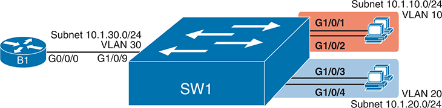


**Figure 18-3** *Physical Interfaces and Subnets for Layer 3 Switching Example*

Router B 1 is connected to the S W 1 from G0/0/0 interface to G1/0/9 with the Subnet 10.1.30.0/24 and V L A N 30. Switch S W 1 has four physical Gigabit Ethernet interfaces: G1/0/1, G1/0/2, G1/0/3, and G1/0/4. Each interface is configured with a V L A N and an IP subnet. Interface G1/0/1 and G1/0/2 are assigned to V L A N 10 and subnet 10.1.10.0/24. Interface G1/0/3 and G1/0/4 are assigned to V L A N 20 and subnet 10.1.20.0/24.


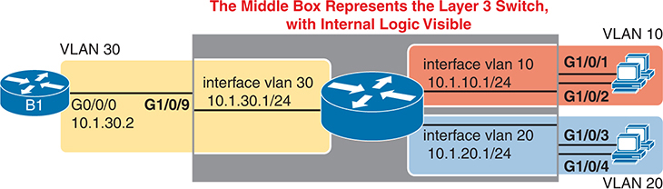


**Figure 18-4** *Internal VLAN Interfaces for Layer 3 Switching Example*

Router B 1 is connected to another router from interface G0/0/0, 10.1.30.2 to interface G1/0/9 with the Subnet 10.1.30.1/24 and interface vlan 30. The router has four physical Gigabit Ethernet interfaces: G1/0/1, G1/0/2, G1/0/3, and G1/0/4. Each interface is configured with a V L A N and an IP subnet. Interface G1/0/1 and G1/0/2 are assigned to interface V L A N 10 and subnet 10.1.10.1/24. Interface G1/0/3 and G1/0/4 are assigned to interface V L A N 20 and subnet 10.1.20.1/24. The middle box represents the layer 3 switch, with internal logic visible.

Note that [Figure 18-4](vol1_ch18.md#ch18fig04) represents the internals of the Layer 3 switch within the box in the middle of the figure. The branch still has two user VLANs (10 and 20), so the Layer 3 switch needs one VLAN interface (SVI) for each VLAN. The figure shows a router icon inside the gray box to represent the Layer 3 switching (routing) function, with two VLAN interfaces on the right side of that icon. In addition, the traffic still needs to get to Router B1 (a physical router) to access the WAN, so the switch uses a third VLAN (VLAN 30 in this case) for the link to Router B1. The switch treats the link between the Layer 3 switch and Router B1 as an access link; the router would be unaware of any VLANs and would not need VLAN trunking configuration.

The following steps show how to configure Layer 3 switching using SVIs.


Step 1. Enable IP routing on the switch, as needed:

1. (As needed) Use a model-specific command to change the switch forwarding ASIC settings to make space for IPv4 routes and reload the switch to make those settings take effect.
2. Use the **ip routing** command in global configuration mode to enable the IPv4 routing function in IOS software and to enable key commands like **show ip route**.

Step 2. Configure each SVI interface, one per VLAN for which routing should be done by this Layer 3 switch:

1. Use the **interface vlan** *vlan\_id* command in global configuration mode to create a VLAN interface and to give the switch's routing logic a Layer 3 interface connected into the VLAN of the same number.
2. Use the **ip address** *address mask* command in VLAN interface configuration mode to configure an IP address and mask on the VLAN interface, enabling IPv4 routing on that VLAN interface.
3. (As needed) Use the **no shutdown** command in interface configuration mode to enable the VLAN interface (if it is currently in a shutdown state).

Note

Regarding Step 1A, some older switch models do not support IP routing until you reprogram the switch's forwarding ASIC. For instance, the 2960 and 2960-XR switches popularly sold by Cisco in the 2010s required the **sdm prefer** global command followed by a reload of the switch. Newer Cisco switch models default to support IP routing and do not require similar steps.

[Example 18-6](vol1_ch18.md#exa18_6) shows the configuration to match [Figure 18-4](vol1_ch18.md#ch18fig04). In this case, the switch defaulted to support IP routing in the forwarding ASIC without any special commands. The example shows the related configuration on all three VLAN interfaces.

**Example 18-6** *VLAN Interface Configuration for Layer 3 Switching*

[Click here to view code image](vol1_ch18_images.md#f0466-01)

```
ip routing
!
interface vlan 10
 ip address 10.1.10.1 255.255.255.0
!
interface vlan 20
 ip address 10.1.20.1 255.255.255.0
!
interface vlan 30
 ip address 10.1.30.1 255.255.255.0
```

#### Verifying Routing with SVIs

With the VLAN configuration shown in the previous section, the switch is ready to route packets between the VLANs as shown in [Figure 18-4](vol1_ch18.md#ch18fig04). To support the routing of packets, the switch adds connected IP routes as shown in [Example 18-7](vol1_ch18.md#exa18_7); note that each route is listed as being connected to a different VLAN interface.

**Example 18-7** *Connected Routes on a Layer 3 Switch*

[Click here to view code image](vol1_ch18_images.md#f0466-02)

```
SW1# show ip route connected
! legend omitted for brevity

       10.0.0.0/8 is variably subnetted, 6 subnets, 2 masks
C         10.1.10.0/24 is directly connected, Vlan10
L         10.1.10.1/32 is directly connected, Vlan10
C         10.1.20.0/24 is directly connected, Vlan20
L         10.1.20.1/32 is directly connected, Vlan20
C         10.1.30.0/24 is directly connected, Vlan30
L         10.1.30.1/32 is directly connected, Vlan30
```

The switch would also need additional routes to the rest of the network (not shown in the figures in this chapter). The Layer 3 switch could use static routes or a routing protocol, depending on the capabilities of the switch. For instance, if you then enabled OSPF on the Layer 3 switch, the configuration and verification would work the same as it does on a router, as discussed in [Part VI](vol1_part06.md#part06), "[OSPF](vol1_part06.md#part06)." The routes that IOS adds to the Layer 3 switch's IP routing table list the VLAN interfaces as outgoing interfaces.

Note

Some models of Cisco enterprise switches, based on the specific model, IOS version, and IOS feature set, support different capabilities for IP routing and routing protocols. For use in real networks, check the capabilities of the switch model by using the Cisco Feature Navigator (CFN) tool at [www.cisco.com/go/cfn](http://www.cisco.com/go/cfn).

#### Troubleshooting Routing with SVIs

On a physical router, when using physical interfaces, the router can assign a state to the interface based on physical factors, like whether the cable is installed or if the router receives any electricity or light over the cable. However, SVIs act as a virtual interface for the routing function in a Layer 3 switch. The switch must use some other logic to decide whether to place the SVI into a working (up/up) state.

Layer 3 switches use one of two interface configuration settings to dictate the logic to determine interface state: either **autostate** or **no autostate**. The default setting on a VLAN interface, **autostate**, checks several factors about the underlying VLAN to determine the state of the VLAN interface. By configuring the **no autostate** VLAN interface subcommand, the switch instead uses much simpler logic with fewer checks. The following few pages explain both.

##### SVI Interface State with Autostate Enabled

The VLAN interface acts as the interface between the switch's routing function and the VLAN. For that VLAN interface to work properly, the VLAN must work properly. In particular, for a VLAN interface to be in an up/up state when using the autostate setting:


Step 1. The VLAN must be defined on the local switch (either explicitly or learned with VTP).

Step 2. The switch must have at least one up/up interface using the VLAN, including:

1. An up/up access interface assigned to that VLAN
2. A trunk interface for which the VLAN is in the allowed list, is STP forwarding, and is not VTP pruned

Step 3. The VLAN must be administratively enabled (that is, not **shutdown**).

Step 4. The VLAN interface must be administratively enabled (that is, not **shutdown**).

Do not miss this point: VLAN and the VLAN interface are related but separate ideas, each configured separately in the CLI. A VLAN interface, configured with the **interface vlan** *vlan-id* global command, creates a switch's Layer 3 interface connected to the VLAN. A VLAN, created with the **vlan** *vlan-id* global command, creates the VLAN. If you want to route packets for the subnets on VLANs 11, 12, and 13, using SVIs, you must configure the VLAN interfaces with those same VLAN IDs 11, 12, and 13. The VLANs with those same VLAN IDs must also exist.

IOS supports the function to disable and enable both a VLAN and a VLAN interface with the **shutdown** and **no shutdown** commands (as mentioned in Steps 3 and 4 in the preceding list). As part of the configuration checklist tasks, check the status to ensure that all the configuration enables all the related VLANs and VLAN interfaces.

[Example 18-8](vol1_ch18.md#exa18_8) shows three scenarios, each of which leads to one of the VLAN interfaces in the previous configuration example ([Figure 18-4](vol1_ch18.md#ch18fig04), [Example 18-6](vol1_ch18.md#exa18_6)) to fail. At the beginning of the example, all three VLAN interfaces are up/up. To begin the example, VLANs 10, 20, and 30 each have at least one access interface up and working. The example works through three scenarios:

* **Scenario 1:** The last access interface in VLAN 10 is shut down (G1/0/1), so IOS shuts down the VLAN 10 interface.
* **Scenario 2:** VLAN 20 (not VLAN interface 20, but VLAN 20) is deleted, which results in IOS then bringing down (not shutting down) the VLAN 20 interface.
* **Scenario 3:** VLAN 30 (not VLAN interface 30, but VLAN 30) is shut down, which results in IOS then bringing down (not shutting down) the VLAN 30 interface.

**Example 18-8** *Three Examples That Cause VLAN Interfaces to Fail*

[Click here to view code image](vol1_ch18_images.md#f0468-01)

```
SW1# show interfaces status
! Only ports related to the example are shown
Port      Name               Status       Vlan       Duplex  Speed Type
Gi1/0/1                      connected    10         a-full  a-100 10/100/1000BaseTX
Gi1/0/2                      notconnect   10           auto   auto 10/100/1000BaseTX
Gi1/0/3                      connected    20         a-full  a-100 10/100/1000BaseTX
Gi1/0/4                      connected    20         a-full  a-100 10/100/1000BaseTX
Gi1/0/9                      connected    30         a-full a-1000 10/100/1000BaseTX

SW1# configure terminal
Enter configuration commands, one per line. End with CNTL/Z.

! Case 1: Interface G1/0/1, the last up/up access interface in VLAN 10, is shutdown
SW1(config)# interface GigabitEthernet 1/0/1
SW1(config-if)# shutdown
SW1(config-if)#
*Apr 2 19:54:08.784: %LINEPROTO-5-UPDOWN: Line protocol on Interface Vlan10, changed 
state to down
*Apr 2 19:54:10.772: %LINK-5-CHANGED: Interface GigabitEthernet1/0/1, changed state
to administratively down
*Apr 2 19:54:11.779: %LINEPROTO-5-UPDOWN: Line protocol on Interface GigabitEther-
net1/0/1, changed state to down

! Case 2: VLAN 20 is deleted
SW1(config)# no vlan 20
SW1(config)#
*Apr 2 19:54:39.688: %LINEPROTO-5-UPDOWN: Line protocol on Interface Vlan20, changed 
state to down

! Case 3: VLAN 30, the VLAN from the switch to the router, is shutdown
SW1(config)# vlan 30
SW1(config-vlan)# shutdown
SW1(config-vlan)# exit
SW1(config)#
*Apr 2 19:55:25.204: %LINEPROTO-5-UPDOWN: Line protocol on Interface Vlan30, changed
state to down
! Final status of all three VLAN interfaces is below
SW1# show ip interface brief | include Vlan
Vlan1                  unassigned      YES manual administratively down down
Vlan10                 10.1.10.1       YES manual up                    down
Vlan20                 10.1.20.1       YES manual up                    down
Vlan30                 10.1.30.1       YES manual up                    down
```

Note that the example ends with the three VLAN interfaces in an up/down state per the **show ip interface brief** command.

##### SVI Interface State with Autostate Disabled

With autostate disabled, the switch checks only whether the VLAN is defined on the switch, either explicitly or learned by VTP. It ignores all the other checks performed when using autostate. If no matching VLAN exists, the switch places the VLAN interface in an up/down state.

[Example 18-9](vol1_ch18.md#exa18_9) shows how to determine whether autostate is enabled from the **show interfaces vlan** command output. In the example, the engineer already configured the **no autostate** command under interface VLAN 10, with interface VLAN 20 using the default setting of **autostate**.

**Example 18-9** *Recognizing the Autostate Setting on VLAN Interfaces*

[Click here to view code image](vol1_ch18_images.md#f0469-01)

```
SW1# show interfaces vlan 10
Vlan10 is up, line protocol is up , Autostate Disabled
! Lines omitted for brevity
SW1# show interfaces vlan 20
Vlan10 is up, line protocol is up , Autostate Enabled
! Lines omitted for brevity
```

### VLAN Routing with Layer 3 Switch Routed Ports

When Layer 3 switches use SVIs, the physical interfaces on the switches act like they always have: as Layer 2 interfaces. That is, the physical interfaces receive Ethernet frames, the switch learns the source MAC address of the frame, and the switch forwards the frame based on the destination MAC address. That logic occurs independently from any configured routing logic.

When using a Layer 3 switch, the switch acts as the default router for endpoint hosts. As usual, to send a packet to a default router, a host uses ARP to learn the default router's MAC address and then encapsulates the packet in a frame destined to the default router's MAC address. As a result, when using a Layer 3 switch with SVIs, hosts send their frames to the SVI's MAC address. Those frames arrive in a physical switch port, which forwards the frame based on the destination MAC address, but to the internal destination of the VLAN interface. That process triggers internal routing actions like stripping data-link headers, making a routing decision, and so on.

Alternately, the Layer 3 switch configuration can make a physical port act like a router interface instead of a switch interface. To do so, the switch configuration makes that port a routed port. On a *routed port*, the switch does not perform Layer 2 switching logic on that frame. Instead, frames arriving in a routed port trigger the Layer 3 routing logic, including

1. Stripping off the incoming frame's Ethernet data-link header/trailer
2. Making a Layer 3 forwarding decision by comparing the destination IP address to the IP routing table
3. Adding a new Ethernet data-link header/trailer to the packet
4. Forwarding the packet, encapsulated in a new frame

This third major section of the chapter examines routed interfaces as configured on Cisco Layer 3 switches, but with a particular goal in mind: to also discuss Layer 3 EtherChannels. L3 EtherChannels use routed ports, so before learning about L3 EtherChannels you must first understand routed ports.

#### Implementing Routed Interfaces on Switches

When a Layer 3 switch needs a Layer 3 interface connected to a subnet, and only one physical interface connects to that subnet, the design can use a routed port instead of an SVI. Stated differently, when routing over a point-to-point link connected to one other device only, using a routed port makes sense. Conversely, when the Layer 3 switch needs a Layer 3 interface connected to a subnet, and many physical interfaces on the switch connect to that subnet, the design must use an SVI.

To see why, consider the design in [Figure 18-5](vol1_ch18.md#ch18fig05), which repeats the same design from [Figure 18-4](vol1_ch18.md#ch18fig04), which was used in the SVI examples. In that design, the gray rectangle on the right represents the switch and its internals. On the right of the switch, at least two access ports sit in both VLAN 10 and VLAN 20. The Layer 3 switch must use SVIs as an interface into those VLANs because two or more ports connect to the VLAN.


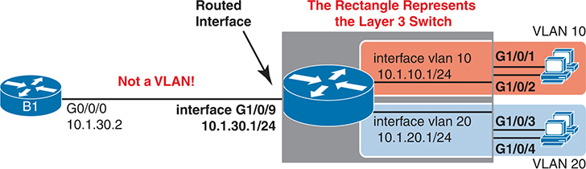


**Figure 18-5** *Routing on a Routed Interface on a Switch*

Router B 1 is connected to another router from interface G0/0/0, 10.1.30.2 to interface G1/0/9 (Routed Interface) with the Subnet 10.1.30.1/24. The router has four physical Gigabit Ethernet interfaces: G1/0/1, G1/0/2, G1/0/3, and G1/0/4. Each interface is configured with a V L A N and an IP subnet. Interface G1/0/1 and G1/0/2 are assigned to interface V L A N 10 and subnet 10.1.10.1/24. Interface G1/0/3 and G1/0/4 are assigned to interface V L A N 20 and subnet 10.1.20.1/24. The rectangle represents the layer 3 switch.

The link on the left of the figure connects from the switch to Router B1. The design needs routing between Router B1 and the switch. While earlier [Example 18-6](vol1_ch18.md#exa18_6) and [Example 18-7](vol1_ch18.md#exa18_7) show how to accomplish that routing with an access port and an SVI on the switch, using a routed port works as well, given that the design creates a point-to-point topology between the two devices.

Enabling a switch interface to be a routed interface instead of a switched interface is simple: just use the **no switchport** subcommand on the physical interface. Cisco switches capable of being a Layer 3 switch use a default of the **switchport** command to each switch physical interface. Think about the word *switchport* for a moment. With that term, Cisco tells the switch to treat the port like it is a port on a switch--that is, a Layer 2 port on a switch. To make the port stop acting like a switch port and instead act like a router port, use the **no switchport** command on the interface.

Once the port is acting as a routed port, think of it like a router interface. That is, configure the IP address on the physical port, as implied in [Figure 18-5](vol1_ch18.md#ch18fig05). [Example 18-10](vol1_ch18.md#exa18_10) shows a completed configuration for the interfaces configured on the switch in [Figure 18-5](vol1_ch18.md#ch18fig05). Note that the design uses the exact same IP subnets as the example that showed SVI configuration in [Example 18-6](vol1_ch18.md#exa18_6), but now, the port connected to subnet 10.1.30.0 has been converted to a routed port. All you have to do is add the **no switchport** command to the physical interface and configure the IP address on the physical interface.

**Example 18-10** *Configuring Interface G0/1 on Switch SW1 as a Routed Port*

[Click here to view code image](vol1_ch18_images.md#f0471-01)

```
ip routing
!
interface vlan 10
 ip address 10.1.10.1 255.255.255.0
!
interface vlan 20
 ip address 10.1.20.1 255.255.255.0
!
interface gigabitethernet 1/0/9
 no switchport
 ip address 10.1.30.1 255.255.255.0
```

Once configured, the routed interface will show up differently in command output in the switch. In particular, for an interface configured as a routed port with an IP address, like interface GigabitEthernet1/0/9 in the previous example:


**show interfaces:** Similar to the same command on a router, the output will display the IP address of the interface. (Conversely, for switch ports, this command does not list an IP address.)

**show interfaces status:** Under the "VLAN" heading, instead of listing the access VLAN or the word *trunk*, the output lists the word *routed*, meaning that it is a routed port.

**show ip route:** Lists the routed port as an outgoing interface in routes.

**show interfaces** *type number* **switchport:** If a routed port, the output is short and confirms that the port is not a switch port. (If the port is a Layer 2 port, this command lists many configuration and status details.)

[Example 18-11](vol1_ch18.md#exa18_11) shows samples of all four of these commands as taken from the switch as configured in [Example 18-10](vol1_ch18.md#exa18_10).

**Example 18-11** *Verification Commands for Routed Ports on Switches*

[Click here to view code image](vol1_ch18_images.md#f0472-01)

```
SW1# show interfaces g1/0/9
GigabitEthernet1/0/9 is up, line protocol is up (connected)
  Hardware is Gigabit Ethernet, address is 4488.165a.f277 (bia 4488.165a.f277)
  Internet address is 10.1.30.1/24 
! lines omitted for brevity

SW1# show interfaces status
! Only ports related to the example are shown; the command lists physical only
Port      Name               Status       Vlan       Duplex  Speed Type
Gi1/0/1                      connected    10         a-full a-1000 10/100/1000BaseTX
Gi1/0/2                      connected    10         a-full a-1000 10/100/1000BaseTX
Gi1/0/3                      connected    20         a-full a-1000 10/100/1000BaseTX
Gi1/0/4                      connected    20         a-full a-1000 10/100/1000BaseTX
Gi1/0/9                      connected    routed     a-full a-1000 10/100/1000BaseTX

SW1# show ip route
! legend omitted for brevity

       10.0.0.0/8 is variably subnetted, 6 subnets, 2 masks
C         10.1.10.0/24 is directly connected, Vlan10
L         10.1.10.1/32 is directly connected, Vlan10
C         10.1.20.0/24 is directly connected, Vlan20
L         10.1.20.1/32 is directly connected, Vlan20
C         10.1.30.0/24 is directly connected, GigabitEthernet1/0/9
L         10.1.30.1/32 is directly connected, GigabitEthernet1/0/9

SW1# show interfaces g0/1 switchport
Name: Gi1/0/9
Switchport: Disabled
```

So, with two options--SVI and routed ports--where should you use each?

For any topologies with a point-to-point link between two devices that do routing, a routed interface works better. For any other topology, you must use SVIs.

[Figure 18-6](vol1_ch18.md#ch18fig06) shows an example of where to use SVIs and where to use routed ports in a typical core/distribution/access design. In this design, the core (Core1, Core2) and distribution (D11, D12, D21, D22) switches perform Layer 3 switching. The access switches (labeled A11, A12, and so on) perform only Layer 2 switching. All the ports that are links directly between the Layer 3 switches can be routed interfaces. For VLANs for which many interfaces (access and trunk) connect to the VLAN, SVIs make sense because the SVIs can send and receive traffic out multiple ports in the same VLAN on the same switch. In this design, all the ports on Core1 and Core2 will be routed ports, while the four distribution switches will use some routed ports and some SVIs.


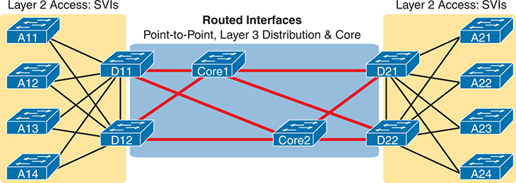


**Figure 18-6** *Using Routed Interfaces for Core and Distribution Layer 3 Links*

In this design, the core switches: Core1 and Core2 and distributions: D 11, D 12, D 21, and D 22 perform Layer 3 switching with routed interfaces and Point-to-Point access. The access switches labeled A 11, A 12, A 13, A 14, A 21, A 22, A 23, and A 24 perform only Layer 2 switching using S V Is.

#### Implementing Layer 3 EtherChannels

So far, this section has stated that routed interfaces can be used with a single point-to-point link between pairs of Layer 3 switches, or between a Layer 3 switch and a router. However, in most designs, the network engineers use at least two links between each pair of distribution and core switches, as shown in [Figure 18-7](vol1_ch18.md#ch18fig07).

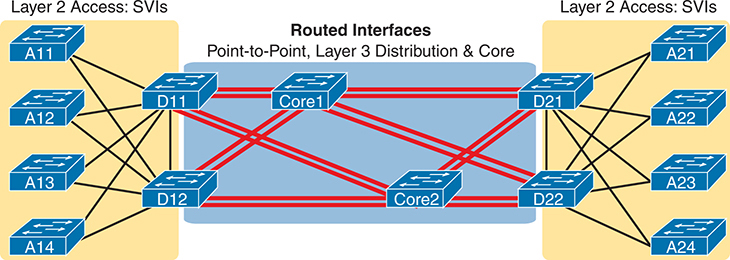


**Figure 18-7** *Two Links Between Each Distribution and Core Switch*

In this design, the core switches: Core1 and Core2 and distributions: D 11, D 12, D 21, and D 22 perform Layer 3 switching with routed interfaces and Point-to-Point access. Two links between each distribution and core switches are prominent. The access switches labeled A 11, A 12, A 13, A 14, A 21, A 22, A 23, and A 24 perform only Layer 2 switching using S V Is.

While each individual port in the distribution and core could be treated as a separate routed port, it is better to combine each pair of parallel links into a Layer 3 EtherChannel. Without using EtherChannel, you can still make each port on each switch in the center of the figure be a routed port. It works. However, once you enable a routing protocol but don't use EtherChannels, each Layer 3 switch will now learn two IP routes with the same neighboring switch as the next hop--one route over one link, another route over the other link.

Using a Layer 3 EtherChannel makes more sense with multiple parallel links between two switches. By doing so, each pair of links acts as one Layer 3 link. So, each pair of switches has one routing protocol neighbor relationship with the neighbor, and not two. Each switch learns one route per destination per pair of links, and not two. IOS then balances the traffic, often with better balancing than the balancing that occurs with the use of multiple IP routes to the same subnet. Overall, the Layer 3 EtherChannel approach works much better than leaving each link as a separate routed port and using Layer 3 balancing.

Compared to what you have already learned, configuring a Layer 3 EtherChannel takes only a little more work. [Chapter 10](vol1_ch10.md#ch10), "[RSTP and EtherChannel Configuration](vol1_ch10.md#ch10)," already showed you how to configure an EtherChannel. This chapter has already shown how to make a port a Layer 3 routed port. Next, you have to combine the two ideas by combining both the EtherChannel and routed port configuration. The following checklist shows the steps, assuming a static definition for the EtherChannel.


Step 1. Configure the physical interfaces as follows, in interface configuration mode:

1. Add the **no switchport** command to make each physical port a routed port.
2. Add the **channel-group** *number* **mode on** command to add it to the channel. Use the same number for all physical interfaces on the same switch, but the number used (the channel-group number) can differ on the two neighboring switches.

Step 2. Configure the PortChannel interface:

1. Use the **interface port-channel** *number* command to move to port-channel configuration mode for the same channel number configured on the physical interfaces.
2. Add the **no switchport** command to make sure that the port-channel interface acts as a routed port. (IOS may have already added this command.)
3. Use the **ip address** *address mask* command to configure the address and mask.

Note

Cisco uses the term *EtherChannel* in concepts discussed in this section and then uses the term *PortChannel*, with command keyword **port-channel**, when verifying and configuring EtherChannels. For the purposes of understanding the technology, you may treat these terms as synonyms. However, it helps to pay close attention to the use of the terms *PortChannel* and *EtherChannel* as you work through the examples in this section because IOS uses both.

[Example 18-12](vol1_ch18.md#exa18_12) shows an example of the configuration for a Layer 3 EtherChannel for switch SW1 in [Figure 18-8](vol1_ch18.md#ch18fig08). The EtherChannel defines port-channel interface 12 and uses subnet 10.1.12.0/24. The design makes use of TenGigabit interfaces between the two switches.


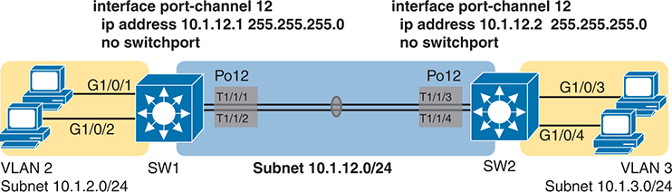


**Figure 18-8** *Design Used in EtherChannel Configuration Examples*

The schematic shows two layer 3 switches, SW1 and SW2, connected via a port-channel interface (Po12). Each switch has a specific IP address and a subnet mask of 255.255.255.0, and they are not configured as switch ports (no switch port). SW1, on the left, has an IP address of 10.1.12.1 and is connected to VLAN 2 with a subnet of 10.1.2.0/24 through interfaces G1/0/1 and G1/0/2. SW2, on the right, has an IP address of 10.1.12.2 and is connected to VLAN 3 with a subnet of 10.1.3.0/24 through interfaces G1/0/3 and G1/0/4. The connections between the SW1 and SW2 switches include their respective Po12 interfaces.

**Example 18-12** *Layer 3 EtherChannel Configuration on Switch SW1*

[Click here to view code image](vol1_ch18_images.md#f0475-01)

```
interface TenGigabit1/1/1
 no switchport
 no ip address
 channel-group 12 mode on
!
interface TenGigabit1/1/2
 no switchport
 no ip address
 channel-group 12 mode on
!
interface Port-channel12
 no switchport
 ip address 10.1.12.1 255.255.255.0
```

Of particular importance, note that although the physical interfaces and PortChannel interface are all routed ports, the IP address should be placed on the PortChannel interface only. In fact, when the **no switchport** command is configured on an interface, IOS adds the **no ip address** command to the interface. Then configure the IP address on the PortChannel interface only.

Once configured, the PortChannel interface appears in several commands, as shown in [Example 18-13](vol1_ch18.md#exa18_13). The commands that list IP addresses and routes refer to the PortChannel interface. Also, note that the **show interfaces status** command lists the fact that the physical ports and the port-channel 12 interface are all routed ports.

**Example 18-13** *Verification Commands Listing Interface Port-Channel12 from Switch SW1*

[Click here to view code image](vol1_ch18_images.md#f0475-02)

```
SW1# show interfaces port-channel 12
Port-channel12 is up, line protocol is up (connected)
  Hardware is EtherChannel, address is 4488.165a.f26c (bia 4488.165a.f26c)
  Internet address is 10.1.12.1/24
! lines omitted for brevity

SW1# show interfaces status
! Only ports related to the example are shown.
Port        Name            Status       Vlan      Duplex  Speed Type
Te1/1/1                     connected    routed      full    10G SFP-10GBase-SR
Te1/1/2                     connected    routed      full    10G SFP-10GBase-SR
Po12                        connected    routed    a-full    a-10G N/A

SW1# show ip route
! legend omitted for brevity
       10.0.0.0/8 is variably subnetted, 4 subnets, 2 masks
C         10.1.2.0/24 is directly connected, Vlan2
L         10.1.2.1/32 is directly connected, Vlan2
C         10.1.12.0/24 is directly connected, Port-channel12
L         10.1.12.1/32 is directly connected, Port-channel12
```

For a final bit of verification, you can examine the EtherChannel directly with the **show etherchannel summary** command as listed in [Example 18-14](vol1_ch18.md#exa18_14). Note in particular that it lists a flag legend for characters that identify key operational states, such as whether a port is bundled (included) in the PortChannel (P) and whether it is acting as a routed (R) or switched (S) port.

**Example 18-14** *Verifying the EtherChannel*

[Click here to view code image](vol1_ch18_images.md#f0476-01)

```
SW1# show etherchannel 12 summary
Flags:  D - down        P - bundled in port-channel
        I - stand-alone s - suspended
        H - Hot-standby (LACP only)
        R - Layer3      S - Layer2
        U - in use      f - failed to allocate aggregator

        M - not in use, minimum links not met
        u - unsuitable for bundling
        w - waiting to be aggregated
        d - default port

        A - formed by Auto LAG


Number of channel-groups in use: 1
Number of aggregators:           1

Group  Port-channel  Protocol    Ports
------+-------------+-----------+-----------------------------------------------
12     Po12(RU)         -          Te1/1/1(P)      Te1/1/2(P)
```

#### Troubleshooting Layer 3 EtherChannels

When you are troubleshooting a Layer 3 EtherChannel, there are two main areas to consider. First, you need to look at the configuration of the **channel-group** command, which enables an interface for an EtherChannel. Second, you should check a list of settings that must match on the interfaces for a Layer 3 EtherChannel to work correctly.

As for the **channel-group** interface subcommand, this command can enable EtherChannel statically or dynamically. If dynamic, this command's keywords imply either Port Aggregation Protocol (PAgP) or Link Aggregation Control Protocol (LACP) as the protocol to negotiate between the neighboring switches whether they put the link into the EtherChannel.

If all this sounds vaguely familiar, it is the exact same configuration covered way back in the [Chapter 10](vol1_ch10.md#ch10) section "[Configuring Dynamic EtherChannels](vol1_ch10.md#ch10lev2sec12)." The configuration of the **channel-group** subcommand is exactly the same, with the same requirements, whether configuring Layer 2 or Layer 3 EtherChannels. So, it might be a good time to review those EtherChannel configuration details from [Chapter 10](vol1_ch10.md#ch10). Regardless of when you review and master those commands, note that the configuration of the EtherChannel (with the **channel-group** subcommand) is the same, whether Layer 2 or Layer 3.

Additionally, you must do more than just configure the **channel-group** command correctly for all the physical ports to be bundled into the EtherChannel. Layer 2 EtherChannels have a longer list of requirements, but Layer 3 EtherChannels also require a few consistency checks between the ports before they can be added to the EtherChannel. The following is the list of requirements for Layer 3 EtherChannels:


**no switchport:** The PortChannel interface must be configured with the **no switchport** command, and so must the physical interfaces. If a physical interface is not also configured with the **no switchport** command, it will not become operational in the EtherChannel.

**Speed:** The physical ports in the channel must use the same speed.

**duplex:** The physical ports in the channel must use the same duplex.

### VLAN Routing on a Router's LAN Switch Ports

The earlier major sections of this chapter all show designs with hosts connected to a switch. The switch might do the routing, or a router connected to the switch might do the routing, but the hosts are connected via a cable to the switch.

This last major section discusses a design with only a router, specifically one whose hardware includes a set of LAN switch ports. In effect, the router hardware embeds a LAN switch into the hardware. As a result, the router needs to implement both routing and switching.

Designs that include small branch offices can make good use of a router with embedded switch ports. Those sites need a router that can route over the WAN and may need only a few LAN ports. Many vendors (Cisco included) offer router products that include a small set of LAN switch ports for such cases. Many consumer-grade routers, like the one you have at home for Internet access, also embed a small number of switch ports.

As an example of the hardware, [Figure 18-9](vol1_ch18.md#ch18fig09) shows photos of an ISR1K router and a Catalyst 8200L edge router. Some ISR1Ks, positioned by Cisco as enterprise-class routers for smaller sites, include a few routed ports plus a set of [switched ports](vol1_gloss.md#gloss_399). The routed ports act like ports on routers, as discussed so far in this book, receiving and forwarding IP packets while requiring the configuration of an IP address and mask. The switch ports work like ports on a LAN switch, forwarding and receiving Ethernet frames, with the router's switching logic learning entries for a MAC address table.

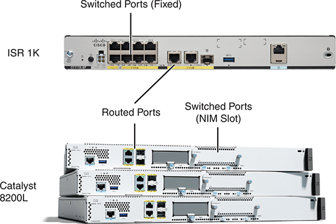


**Figure 18-9** *Cisco ISR 1000 and Catalyst 8200L Routers*

The Cisco ISR 1000 Series Integrated Services Router with fixed switched ports and routed ports displayed on the top. Cisco Catalyst 8200L Series Edge Platform with Routed Ports and Switched Ports (N I M Slot).

The bottom of the figure shows a photo of three Catalyst 8200 edge platforms (routers). The models in the figure each support four fixed routed Ethernet ports (two RJ-45 and two modular SFP slots). The Network Interface Module (NIM) slot allows for expansion with modular NIMs, including NIMs with four and eight LAN switch ports.

#### Configuring Routing for Embedded Switch Ports

Routers that have switch ports implement both routing and switching. To make that work, configure LAN switching commands on the switch ports and routing commands for the routed interfaces. To stitch the logic together, use a concept familiar from multilayer switch configuration: SVI interfaces.

[Figures 18-10](vol1_ch18.md#ch18fig10) and [Figure 18-11](vol1_ch18.md#ch18fig11) give the context for an example. [Figure 18-10](vol1_ch18.md#ch18fig10) shows Router B1, at a branch office, with four switch ports connected to some PCs. The design calls for two VLANs with the same VLAN IDs and subnets, as in several earlier examples in this chapter. The router (the same model of ISR1K shown in [Figure 18-9](vol1_ch18.md#ch18fig09)) uses routed port G0/0/1 to connect to the WAN.


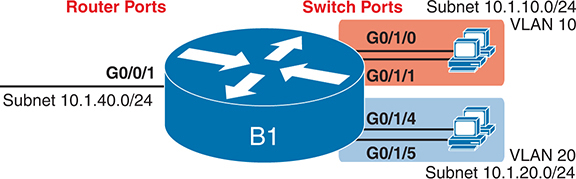


**Figure 18-10** *Physical Representation of Router with Routed and Switched Ports*

Router B 1 with Subnet 10.1.40.0/24 and interface G0/0/1 (Routed ports). The router has four physical Gigabit Ethernet interfaces (Switch Ports): G0/1/0, G0/1/1, G0/1/4, and G0/1/5. Each interface is configured with a V L A N and an IP subnet. Interface G0/1/0 and G0/1/1 are assigned to interface V L A N 10 and subnet 10.1.10.0/24. Interface G0/1/4 and G0/1/5 are assigned to interface V L A N 20 and subnet 10.1.20.0/24.

[Figure 18-11](vol1_ch18.md#ch18fig11) shows the internal logic using SVIs that give the routing process inside Router B1 interfaces that connect directly to the subnets that reside on VLANs 10 and 20. The concepts should look familiar; the internal concepts work like a Layer 3 switch.


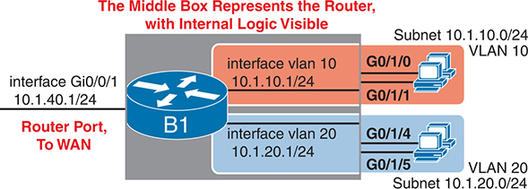


**Figure 18-11** *Configuration View of a Router with Routed and Switched Ports*

Router B 1 with Subnet 10.1.40.1/24 and interface Gi0/0/1 (Router Port, To WAN). The ports of B 1 contain the subnets: 10.1.10.1/24 and 10.1.20.1/24, connected to four physical Gigabit Ethernet interfaces: G0/1/0, G0/1/1, G0/1/4, and G0/1/5. Each interface is configured with a V L A N and an IP subnet. Interface G0/1/0 and G0/1/1 are assigned to interface V L A N 10 and subnet 10.1.10.0/24. Interface G0/1/4 and G0/1/5 are assigned to interface V L A N 20 and subnet 10.1.20.0/24. The middle box represents the router, with internal logic visible.

The configuration steps include familiar tasks for the LAN switch, other familiar tasks for IP routing and the routed ports, and the additional task of configuring the SVIs. To review, the following configuration checklist lists a minimal set of tasks, beginning with a default configuration, to enable IP on the three interfaces so that the router has connected routes to all three subnets and can route packets between those connected subnets.


Step 1. Configure VLANs and assign access VLANs to the switch ports.

1. Use the **vlan** *vlan-number* command in global configuration mode to create each VLAN.
2. Use the **switchport access vlan** *vlan-id* command in interface configuration mode on the switched interfaces to assign the correct access VLAN.
3. (As needed) Use the **no shutdown** command in interface configuration mode to enable the interface.

Step 2. Configure an SVI interface for each VLAN used by the switch ports.

1. Use the **interface vlan** *vlan\_id* command in global configuration mode to create a VLAN interface. Use the same number as the VLAN ID.
2. Use the **ip address** *address mask* command in VLAN interface configuration mode to assign an IP address and mask to the interface, enabling IPv4 processing on the interface.
3. (As needed) Use the **no shutdown** command in interface configuration mode to enable the VLAN interface.

Step 3. Configure any routed interfaces with IP addresses.

1. Use the **ip address** *address mask* command in interface configuration mode to assign an IP address and mask to the interface, enabling IPv4 processing.
2. Configure any routing protocols as needed.

[Example 18-15](vol1_ch18.md#exa18_15) shows a sample configuration to match [Figure 18-11](vol1_ch18.md#ch18fig11). The top of the configuration adds VLANs 10 and 20, assigning them as access VLANs to the ports per the figure. The **interface vlan** commands create the SVIs, with IP address configuration added to each. The final interface, G0/0/1, a routed port, shows traditional router interface configuration with an **ip address** command but without a **switchport access** subcommand.

**Example 18-15** *VLAN Interface Configuration for Routing to/from Switch Port VLANs*

[Click here to view code image](vol1_ch18_images.md#f0480-01)

```
vlan 10
vlan 20
!
interface GigabitEthernet0/1/0
 switchport access vlan 10
!
interface GigabitEthernet0/1/1
 switchport access vlan 10
!
interface GigabitEthernet0/1/4
 switchport access vlan 20
!
interface GigabitEthernet0/1/5
 switchport access vlan 20
!
interface vlan 10
 ip address 10.1.10.1 255.255.255.0
!
interface vlan 20
 ip address 10.1.20.1 255.255.255.0
!
interface gigabitEthernet0/0/1
 description physical, routed interface

ip address 10.1.40.1 255.255.255.0
```

#### Verifying Routing for Embedded Switch Ports

With the VLAN configuration shown in the previous section, the router is ready to route packets between the subnets as shown in [Figure 18-11](vol1_ch18.md#ch18fig11). The output in [Example 18-16](vol1_ch18.md#exa18_16) lists two routes as connected to different VLAN interfaces, with one route connected to the one routed interface (G0/0/1). Beyond those routes, the router also needs routes to remote subnets. The router could use static routes or a routing protocol.

**Example 18-16** *Connected Routes on Router B1 from [Example 18-15](vol1_ch18.md#exa18_15)*

[Click here to view code image](vol1_ch18_images.md#f0480-02)

```
B1# show ip route connected
Codes: L - local, C - connected, S - static, R - RIP, M - mobile, B - BGP
       D - EIGRP, EX - EIGRP external, O - OSPF, IA - OSPF inter area
! Remaining legend omitted for brevity

      10.0.0.0/8 is variably subnetted, 13 subnets, 2 masks
C        10.1.10.0/24 is directly connected, Vlan10
L        10.1.10.1/32 is directly connected, Vlan10
C        10.1.20.0/24 is directly connected, Vlan20
L        10.1.20.1/32 is directly connected, Vlan20
C        10.1.30.0/24 is directly connected, GigabitEthernet0/0/1
L        10.1.30.1/32 is directly connected, GigabitEthernet0/0/1
```

The router adds the connected routes when the related interface reaches an up/up state. For SVIs, the state varies based on rules related to the state of the underlying VLAN and the ports in that VLAN. Those rules work just as described in this chapter's earlier section titled "[Troubleshooting Routing with SVIs](vol1_ch18.md#ch18lev2sec6)."

The router performs LAN switching with the same conventions you learned about LAN switches in [Parts II](vol1_part02.md#part02) and [III](vol1_part03.md#part03) of this book. For instance, the router supports the exact commands you expect to find on LAN switches to support the LAN switch ports. [Example 18-17](vol1_ch18.md#exa18_17) shows the MAC addresses learned on the four switch ports shown in the most recent figures. It confirms that addresses learned on ports G0/1/0 and G0/1/1 exist in VLAN 10 while those learned on ports G0/1/4 and G0/1/5 exist in VLAN 20.

**Example 18-17** *MAC Address Table on the Router*

[Click here to view code image](vol1_ch18_images.md#f0481-01)

```
B1# show mac address-table dynamic
          Mac Address Table
-------------------------------------------

Vlan    Mac Address       Type        Ports
----    -----------       --------    -----
  10    0200.aaaa.aaaa    DYNAMIC     Gi0/1/0
  10    0200.bbbb.bbbb    DYNAMIC     Gi0/1/1
  20    0200.cccc.cccc    DYNAMIC     Gi0/1/4
  20    0200.dddd.dddd    DYNAMIC     Gi0/1/5
Total Mac Addresses for this criterion: 4
```

Note

Switches use the **show vlan** [**brief**] command to display VLAN configuration. Routers with embedded switch ports have a command that mimics the switch command: **show vlan-switch** [**brief**] (IOS) and **show vlan** [**brief**] (IOS XE). As a reminder, the similar **show vlans** command on routers does not list VLANs but rather ROAS configuration.

#### Identifying Switched Ports in Routers

When you look at a router or use the CLI of a router, how do you know which Ethernet ports happen to be routed ports and which are switch ports? Finding the answer can be difficult. This last short section tells you how.

First, you do not configure a router port's role as a routed or switch port. Instead, Cisco creates router interfaces that act as one or the other. You can research the router model and family at [www.cisco.com](http://www.cisco.com) and learn about the fixed ports that come with each model. That documentation also identifies modular options for cards like NIMs.

You can also discover the router's switched ports from the CLI, but the conventions are not obvious. Most **show** commands do not help, but a few do. Of note:


**show running-config, show startup-config:** These commands do not identify routed versus switched ports.

**show interfaces, show interfaces description, show ip interface brief, show protocols:** All these commands list all interfaces, routed and switched, with no notation of which is which.

**show interfaces status:** This command lists only switched ports.

Using **show interfaces status** to identify the switch ports makes the most sense.

Additionally, you can confirm which ports act as routed versus switched ports by trying to configure commands supported only on one or the other. For instance, routed ports accept the **ip address** *address mask* subcommand but reject the **switchport access vlan** *vlan-id* subcommand. Switched ports accept the opposite.

[Example 18-18](vol1_ch18.md#exa18_18) shows a few cases of identifying routed and switched ports using Router B1 from the previous examples. It first shows only the switched ports G0/1/0-G0/1/7 in the **show interfaces status** command output. Note the output follows the format from LAN switches, identifying the access VLAN assigned to each interface. Following that, the output shows a switched port rejecting the **ip address** interface subcommand.

**Example 18-18** *Displaying Switched Interfaces but Omitting Routed Interfaces*

[Click here to view code image](vol1_ch18_images.md#f0482-01)

```
B1# show interfaces status

Port         Name            Status       Vlan       Duplex  Speed Type
Gi0/1/0                      connected    10         a-full a-1000 10/100/1000BaseTX
Gi0/1/1                      connected    10         a-full a-1000 10/100/1000BaseTX
Gi0/1/2                      notconnect   1            auto   auto 10/100/1000BaseTX
Gi0/1/3                      notconnect   1            auto   auto 10/100/1000BaseTX
Gi0/1/4                      connected    20         a-full a-1000 10/100/1000BaseTX
Gi0/1/5                      connected    20         a-full a-1000 10/100/1000BaseTX
Gi0/1/6                      notconnect   1            auto   auto 10/100/1000BaseTX
Gi0/1/7                      notconnect   1            auto   auto 10/100/1000BaseTX
B1# configure terminal
Enter configuration commands, one per line.  End with CNTL/Z.
B1(config)# interface g0/1/7
B1(config-if)# ip address 10.1.90.1 255.255.255.0
               ^
% Invalid input detected at '^' marker.
B1(config-if)#
```

### Chapter Review

One key to doing well on the exams is to perform repetitive spaced review sessions. Review this chapter's material using either the tools in the book or interactive tools for the same material found on the book's companion website. Refer to the "[Your Study Plan](vol1_pref10.md#pref10)" element for more details. [Table 18-2](vol1_ch18.md#ch18tab02) outlines the key review elements and where you can find them. To better track your study progress, record when you completed these activities in the second column.


**Table 18-2** Chapter Review Tracking

| Review Element | Review Date(s) | Resource Used |
| --- | --- | --- |
| Review key topics |  | Book, website |
| Review key terms |  | Book, website |
| Answer DIKTA questions |  | Book, PTP |
| Review config checklists |  | Book, website |
| Review command tables |  | Book |
| Do labs |  | Blog |
| Watch video |  | Website |

### Review All the Key Topics


**Table 18-3** Key Topics for [Chapter 18](vol1_ch18.md#ch18)

| Key Topic Element | Description | Page Number |
| --- | --- | --- |
| [Figure 18-2](vol1_ch18.md#ch18fig02) | Concept of VLAN subinterfaces on a router | [459](vol1_ch18.md#page_459) |
| List | Two alternative methods to configure the native VLAN in a ROAS configuration | [460](vol1_ch18.md#page_460) |
| List | Troubleshooting suggestions for ROAS configuration | [463](vol1_ch18.md#page_463) |
| [Figure 18-3](vol1_ch18.md#ch18fig03) | Layer 3 switching with SVIs concept and configuration | [464](vol1_ch18.md#page_464) |
| [Figure 18-4](vol1_ch18.md#ch18fig04) | Layer 3 switching with routed ports concept and configuration | [465](vol1_ch18.md#page_465) |
| List | Troubleshooting suggestions for correct operation of a Layer 3 switch that uses SVIs | [467](vol1_ch18.md#page_467) |
| [Figure 18-5](vol1_ch18.md#ch18fig05) | A figure showing the concepts behind IP routing on a routed interface on a switch | [470](vol1_ch18.md#page_470) |
| List | **show** commands that list Layer 3 routed ports in their output | [471](vol1_ch18.md#page_471) |
| [Figure 18-8](vol1_ch18.md#ch18fig08) | Layer 3 EtherChannel concept and configuration | [474](vol1_ch18.md#page_474) |
| List | List of configuration settings that must be consistent before IOS will bundle a link with an existing Layer 3 EtherChannel | [477](vol1_ch18.md#page_477) |
| [Figure 18-10](vol1_ch18.md#ch18fig10) | A concept diagram showing a router with routed and switched ports | [478](vol1_ch18.md#page_478) |
| [Figure 18-11](vol1_ch18.md#ch18fig11) | Conceptual view of the configuration for a router with integrated LAN switch ports | [479](vol1_ch18.md#page_479) |
| List | Router commands and whether they list routed ports, switched ports, or both | [481](vol1_ch18.md#page_481) |

### Key Terms You Should Know

[Layer 3 EtherChannel (L3 EtherChannel)](vol1_ch18.md#key_204)

[Layer 3 switch](vol1_ch18.md#key_205)

[multilayer switch](vol1_ch18.md#key_206)

[routed port](vol1_ch18.md#key_207)

[router-on-a-stick (ROAS)](vol1_ch18.md#key_208)

[subinterfaces](vol1_ch18.md#key_209)

[switched port](vol1_ch18.md#key_210)

[switched virtual interface (SVI)](vol1_ch18.md#key_211)

[VLAN interface](vol1_ch18.md#key_212)

### Command References

[Tables 18-4](vol1_ch18.md#ch18tab04) and [18-5](vol1_ch18.md#ch18tab05) list configuration and verification commands used in this chapter. As an easy review exercise, cover the left column in a table, read the right column, and try to recall the command without looking. Then repeat the exercise, covering the right column, and try to recall what the command does.

**Table 18-4** [Chapter 18](vol1_ch18.md#ch18) Configuration Command Reference

| Command | Description |
| --- | --- |
| **interface** *type number.subint* | Router global command to create a subinterface and to enter configuration mode for that subinterface |
| **encapsulation dot1q** *vlan-id* [**native**] | Router subinterface subcommand that tells the router to use 802.1Q trunking, for a particular VLAN, and with the **native** keyword, to not encapsulate in a trunking header |
| [**no**] **ip routing** | Global command that enables (**ip routing**) or disables (**no ip routing**) the routing of IPv4 packets on a router or Layer 3 switch |
| **interface vlan** *vlan-id* | Global command to create a VLAN interface and to enter VLAN interface configuration mode; valid on Layer 3 switches and on routers that have embedded LAN switch ports |
| [**no**] **switchport** | Layer 3 switch subcommand that makes the port act as a Layer 2 port (**switchport**) or Layer 3 routed port (**no switchport**) |
| **interface port-channel** *channel-number* | A switch command to enter PortChannel configuration mode and also to create the PortChannel if not already created |
| **channel-group** *channel-number* **mode** {**auto** | **desirable** | **active** | **passive** | **on**} | Interface subcommand that enables EtherChannel on the interface |
| **[no] autostate** | Interface subcommand on VLAN interfaces that enables (**autostate**) or disables (**no autostate**) the autostate feature. |
| **vlan** *vlan-id* | Global config command that both creates the VLAN and puts the CLI into VLAN configuration mode |
| **name** *vlan-name* | VLAN subcommand that names the VLAN |
| [**no**] **shutdown** | VLAN mode subcommand that enables (**no shutdown**) or disables (**shutdown**) the VLAN |


**Table 18-5** [Chapter 18](vol1_ch18.md#ch18) EXEC Command Reference

| Command | Description |
| --- | --- |
| **show ip route** | Lists the router's entire routing table |
| **show ip route** [**connected**] | Lists a subset of the IP routing table |
| **show vlans** | Lists VLAN configuration and statistics for VLAN trunks configured on routers |
| **show interfaces** [**interface** *type number*] | Lists detailed status and statistical information, including IP address and mask, about all interfaces (or the listed interface only) |
| **show interfaces** [**interface** *type number*] **status** | Among other facts, for switch ports, lists the access VLAN or the fact that the interface is a trunk; or, for routed ports, lists "routed" |
| **show interfaces** *interface-id* **switchport** | For switch ports, lists information about any interface regarding administrative settings and operational state; for routed ports, the output simply confirms the port is a routed (not switched) port |
| **show interfaces vlan** *number* | Lists the interface status, the switch's IPv4 address and mask, and much more |
| **show etherchannel** [*channel-group-number*] **summary** | Lists information about the state of EtherChannels on this switch, including whether the channel is a Layer 2 or Layer 3 EtherChannel |
| **show mac address-table dynamic** | Shows all dynamically learned MAC table entries on LAN switches and on routers that have embedded switch ports |
| **show vlan-switch** [**brief**] | (IOS only) On a router with embedded LAN switch ports, lists the VLAN configuration |
| **show vlan** [**brief**] | (IOS XE only) On a router with embedded LAN switch ports, lists the VLAN configuration |