# Chapter 19


## IP Addressing on Hosts

This chapter covers the following exam topics:

1.0 Network Fundamentals

1.10 Verify IP parameters for Client OS (Windows, Mac OS, Linux)

4.0 IP Services

4.3 Explain the role of DHCP and DNS within the network

4.6 Configure and verify DHCP client and relay

In the world of TCP/IP, the word *host* refers to any device with an IP address: your phone, your tablet, a PC, a server, a router, a switch--any device that uses IP to provide a service or just needs an IP address to be managed. The term *host* includes some less-obvious devices as well: the electronic advertising video screen at the mall, your electrical power meter that uses the same technology as mobile phones to submit your electrical usage information for billing, your new car.

No matter the type of host, any host that uses IPv4 needs four IPv4 settings to work properly:

* IP address
* Subnet mask
* Default routers
* DNS server IP addresses

This chapter discusses these basic IP settings on hosts. The chapter begins by discussing how a host can dynamically learn these four settings using the Dynamic Host Configuration Protocol (DHCP). The second half of this chapter then shows how to find the settings on hosts and the key facts to look for when displaying the settings.

### "Do I Know This Already?" Quiz

Take the quiz (either here or use the PTP software) if you want to use the score to help you decide how much time to spend on this chapter. The letter answers are listed at the bottom of the page following the quiz. [Appendix C](vol1_appc.md#appc), found both at the end of the book as well as on the companion website, includes both the answers and explanations. You can also find both answers and explanations in the PTP testing software.


**Table 19-1** "Do I Know This Already?" Foundation Topics Section-to-Question Mapping

| Foundation Topics Section | Questions |
| --- | --- |
| Dynamic Host Configuration Protocol | 1-4 |
| Identifying Host IPv4 Settings | 5, 6 |

**[1](vol1_ch19.md#ques19_1a).** A PC connects to a LAN and uses DHCP to lease an IP address for the first time. Of the usual four DHCP messages that flow between the PC and the DHCP server, which ones `does` the client send? (Choose two answers.)

1. Acknowledgment
2. Discover
3. Offer
4. Request

**[2](vol1_ch19.md#ques19_2a).** Which of the following kinds of information are part of a DHCP server configuration? (Choose two answers.)

1. Ranges of IP addresses in subnets that the server should lease
2. Ranges of IP addresses to not lease per subnet
3. DNS server hostnames
4. The default router IP and MAC address in each subnet

**[3](vol1_ch19.md#ques19_3a).** Which answers list a criterion for choosing which router interfaces need to be configured as a DHCP relay agent? (Choose two answers.)

1. If the subnet off the interface does not include a DHCP server
2. If the subnet off the interface does include a DHCP server
3. If the subnet off the interface contains DHCP clients
4. If the router interface already has an **ip address dhcp** command

**[4](vol1_ch19.md#ques19_4a).** A router connects to an Internet service provider (ISP) using its G0/0/0 interface, with the **ip address dhcp** command configured. What does the router do with the DHCP-learned default gateway information?

1. The router ignores the default gateway value learned from the DHCP server.
2. The router uses the default gateway just like a host, ignoring its routing table.
3. The router forwards received packets based on its routing table but uses its default gateway setting to forward packets it generates itself.
4. The router adds a default route based on the default gateway to its IP routing table.

**[5](vol1_ch19.md#ques19_5a).** In the following excerpt from a command on a Mac, which of the following parts of the output represent information learned from a DHCP server? (Choose two answers.)

[Click here to view code image](vol1_ch19_images.md#f0487-01)

```
Macprompt$ ifconfig en0
En1: flags=8863<UP,BROADCAST,SMART,RUNNING,SIMPLEX,MULTICAST> mtu 1500
        options=10b<RXCSUM,TXCSUM,VLAN_HWTAGGING,AV>
        ether 00:6d:e7:b1:9a:11
        inet 172.16.4.2 netmask 0xffffff00 broadcast 172.16.4.255
```

1. 00:6d:e7:b1:9a:11
2. 172.16.4.2
3. 0xffffff00
4. 172.16.4.255

**[6](vol1_ch19.md#ques19_6a).** Which of the following commands on a Windows OS should list both the host's IP address and DNS servers' IP addresses as learned with DHCP?

1. **ifconfig**
2. **ipconfig**
3. **ifconfig /all**
4. **ipconfig /all**

Answers to the "Do I Know This Already?" quiz:

**[1](vol1_appc.md#ques19_1)** B, D

**[2](vol1_appc.md#ques19_2)** A, B

**[3](vol1_appc.md#ques19_3)** A, C

**[4](vol1_appc.md#ques19_4)** D

**[5](vol1_appc.md#ques19_5)** B, C

**[6](vol1_appc.md#ques19_6)** D

### Foundation Topics

### Dynamic Host Configuration Protocol

Dynamic Host Configuration Protocol (DHCP) provides one of the most commonly used services in a TCP/IP network. The vast majority of hosts in a TCP/IP network are user devices, and the vast majority of user devices learn their IPv4 settings using DHCP.

Using DHCP has several advantages over the other option of manually configuring IPv4 settings. The configuration of host IP settings sits in a DHCP server, with each client learning these settings using DHCP messages. As a result, the host IP configuration is controlled by the IT staff, rather than on local configuration on each host, resulting in fewer user errors. DHCP allows the permanent assignment of host addresses, but more commonly, a temporary lease of IP addresses. With these leases, the [DHCP server](vol1_gloss.md#gloss_099) can reclaim IP addresses when a device is removed from the network, making better use of the available addresses.

DHCP also enables mobility. For example, every time a user moves to a new location with a tablet computer--to a coffee shop, a client location, or back at the office--the user's device can connect to another wireless LAN, use DHCP to lease a new IP address in that LAN, and begin working on the new network. Without DHCP, the user would have to ask for information about the local network and configure settings manually, with more than a few users making mistakes.

Although DHCP works automatically for user hosts, it does require some preparation from the network, with some configuration on routers. In some enterprise networks, that router configuration can be a single command on many of the router's LAN interfaces (**ip helper-address** *server-ip*), which identifies the DHCP server by its IP address. In other cases, the router acts as the DHCP server. Regardless, the routers have some role to play.

This first major section of the chapter takes a tour of DHCP, including concepts and the router configuration to enable the routers to work well with a separate DHCP server.

#### DHCP Concepts

Sit back for a moment and think about the role of DHCP for a host computer. The host acts as a [DHCP client](vol1_gloss.md#gloss_097). As a DHCP client, the host begins with no IPv4 settings--no IPv4 address, no mask, no default router, and no [DNS server](vol1_gloss.md#gloss_111) IP addresses. But a DHCP client does have knowledge of the DHCP protocol, so the client can use that protocol to (a) discover a DHCP server and (b) request to lease an IPv4 address.

DHCP uses the following four messages between the client and server. (Also, to help remember the messages, note that the first letters spell DORA):

**Discover:** Sent by the DHCP client to find a willing DHCP server

**Offer:** Sent by a DHCP server to offer to lease to that client a specific IP address (and inform the client of its other parameters)

**Request:** Sent by the DHCP client to ask the server to lease the IPv4 address listed in the Offer message

**Acknowledgment:** Sent by the DHCP server to assign the address and to list the mask, default router, and DNS server IP addresses

DHCP clients, however, have a somewhat unique problem: they do not have an IP address yet, but they need to send these DHCP messages inside IP packets. To make that work, DHCP messages make use of two special IPv4 addresses that allow a host that has no IP address to still be able to send and receive messages on the local subnet:


**0.0.0.0:** An address reserved for use as a source IPv4 address for hosts that do not yet have an IP address.

**255.255.255.255:** The local broadcast IP address. Packets sent to this destination address are broadcast on the local data link, but routers do not forward them.

To see how these addresses work, [Figure 19-1](vol1_ch19.md#ch19fig01) shows an example of the IP addresses used between a host (A) and a DHCP server on the same LAN. Host A, a client, sends a Discover message, with source IP address of 0.0.0.0 because Host A does not have an IP address to use yet. Host A sends the packet to destination 255.255.255.255, which is sent in a LAN broadcast frame, reaching all hosts in the subnet. The client hopes that there is a DHCP server on the local subnet. Why? Packets sent to 255.255.255.255 only go to hosts in the local subnet; Router R1 will not forward this packet.

Note

[Figure 19-1](vol1_ch19.md#ch19fig01) shows one example of the addresses that can be used in a DHCP request. This example shows details assuming the DHCP client chooses to use a DHCP option called the *broadcast flag*; all examples in this book assume the broadcast flag is used.

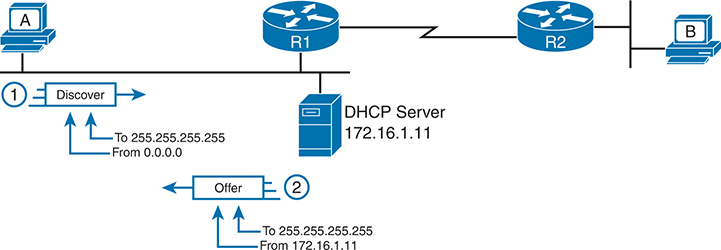


**Figure 19-1** *DHCP Discover and Offer*

Host A initiates the D H C P process by sending a Discover message to the broadcast address 255.255.255.255 from the unspecified address 0.0.0.0. The D H C P server with I P address 172.16.1.11 receives the Discover message and in response, it sends an Offer message to the broadcast address 255.255.255.255 from I P address 172.16.1.11. R 1 helps propagate the Discover message from host A throughout the network until it reaches host B via R 2.

Now look at the Offer message sent back by the DHCP server. The server sets the destination IP address to 255.255.255.255 again. Why? Host A still does not have an IP address, so the server cannot send a packet directly to host A. So, the server sends the packet to "all local hosts in the subnet" address (255.255.255.255). (The packet is also encapsulated in an Ethernet broadcast frame.)

Note that all hosts in the subnet receive the Offer message. However, the original Discover message lists a number called the client ID, which includes the host's MAC address, that identifies the original host (Host A in this case). As a result, Host A knows that the Offer message is meant for host A. The rest of the hosts will receive the Offer message, but notice that the message lists another device's DHCP client ID, so the rest of the hosts ignore the Offer message.

##### APIPA IP Addresses (169.254.x.x)

If the DHCP process fails for a DHCP client, hosts have a default means to self-assign an IP address using a feature called Automatic Private IP Addressing ([APIPA](vol1_gloss.md#gloss_023)). When the DHCP process fails, the DHCP client self-assigns an APIPA IP address from within a subset of the 169.254.0.0 Class B network, along with default mask 255.255.0.0.

Using an APIPA address does not help devices work like a normal host. For instance, hosts do not know of a default router or learn a list of DNS servers. The host can send packets only to other APIPA hosts on the same LAN.

The APIPA process works like this:

1. The client chooses any IP address from network 169.254.0.0 (actual address range: 169.54.1.0 - 169.254.254.255).
2. The DHCP client discovers if any other host on the same link already uses the APIPA address it chose by using ARP to perform Duplicate Address Detection (DAD). If another host already uses the same address, the client stops using the address and chooses another.
3. The client can send/receive packets on the local network only.

##### Supporting DHCP for Remote Subnets with DHCP Relay

Network engineers have a major design choice to make with DHCP: Do they put a DHCP server in every LAN subnet or locate a DHCP server in a central site? The question is legitimate. Cisco routers can act as the DHCP server, so a distributed design could use the router at each site as the DHCP server. With a DHCP server in every subnet, as shown in [Figure 19-1](vol1_ch19.md#ch19fig01), the protocol flows stay local to each LAN.

However, a centralized DHCP server approach has advantages as well. In fact, some Cisco design documents suggest a centralized design as a best practice, in part because it allows for centralized control and configuration of all the IPv4 addresses assigned throughout the enterprise.

With a centralized DHCP server, those DHCP messages that flowed only on the local subnet in [Figure 19-1](vol1_ch19.md#ch19fig01) somehow need to flow over the IP network to the centralized DHCP server and back. To make that work, the routers connected to the remote LAN subnets need an interface subcommand: the **ip helper-address** *server-ip* command.

The **ip helper-address** *server-ip* subcommand tells the router to do the following for the messages coming in an interface, from a DHCP client:


1. Watch for incoming DHCP messages, with destination IP address 255.255.255.255.
2. Change that packet's source IP address to the router's incoming interface IP address.
3. Change that packet's destination IP address to the address of the DHCP server (as configured in the **ip helper-address** command).
4. Route the packet to the DHCP server.

This command gets around the "do not route local subnet broadcast packets sent to address 255.255.255.255" rule by changing the destination IP address. Once the destination has been set to match the DHCP server's IP address, the network can route the packet to the server.

Note

This feature, by which a router relays DHCP messages by changing the IP addresses in the packet header, is called *DHCP relay*.

[Figure 19-2](vol1_ch19.md#ch19fig02) shows an example of the process. Host A sits on the left, as a DHCP client. The DHCP server (172.16.2.11) sits on the right. R1 has an **ip helper-address 172.16.2.11** command configured, under its G0/0 interface. At Step 1, Router R1 notices the incoming DHCP packet destined for 255.255.255.255. Step 2 shows the results of changing both the source and destination IP address, with R1 routing the packet.


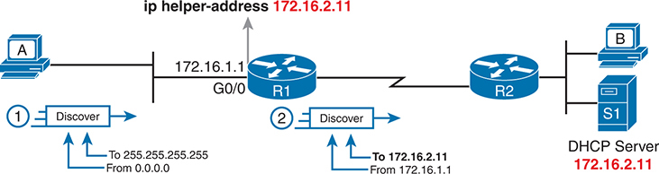


**Figure 19-2** *IP Helper Address Effect*

Host A initiates the D H C P process by sending a Discover message, which is broadcasted to the network with the source address 0.0.0.0 to the destination address 255.255.255.255. Router R1 receives this broadcast at its interface G0/0 with IP address 172.16.1.1 (ip helper-address 172.16.2.11). R1 Forwards the Discover message to host B and the address 172.16.2.11, which belongs to the D H C P server (S1) through R2.

The router uses a similar process for the return DHCP messages from the server. First, for the return packet from the DHCP server, the server simply reverses the source and destination IP address of the packet received from the router (relay agent). For example, in [Figure 19-2](vol1_ch19.md#ch19fig02), the Discover message lists source IP address 172.16.1.1, so the server sends the Offer message back to destination IP address 172.16.1.1.

When a router receives a DHCP message addressed to one of the router's own IP addresses, the router realizes the packet might be part of the DHCP relay feature. When that happens, the [DHCP relay agent](vol1_gloss.md#gloss_098) (Router R1) needs to change the destination IP address so that the real DHCP client (host A), which does not have an IP address yet, can receive and process the packet.

[Figure 19-3](vol1_ch19.md#ch19fig03) shows one example of how these addresses work, when R1 receives the DHCP Offer message sent to R1's own 172.16.1.1 address. R1 changes the packet's destination to 255.255.255.255 and forwards it out G0/0, because the packet was destined to G0/0's 172.16.1.1 IP address. As a result, all hosts in that LAN (including the DHCP client A) will receive the message.

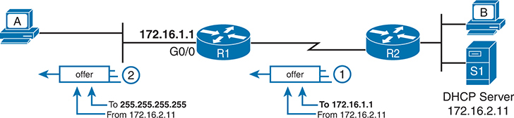


**Figure 19-3** *IP Helper Address for the Offer Message Returned from the DHCP Server*

Host B and the address 172.16.2.11, which belongs to the D H C P server (S1) initiates the D H C P process by sending an offer message to router R1. Router R1 receives this broadcast at its interface G0/0 with IP address 172.16.1.1 through router R2. R1 sends the offer to host A with the destination address 255.255.255.255 from the source address 172.16.2.11.

Many enterprise networks use a centralized DHCP server, so the normal router configuration includes an **ip helper-address** command on every LAN interface/subinterface. With that standard configuration, user hosts off any router LAN interface can always reach the DHCP server and lease an IP address.

##### Information Stored at the DHCP Server

A DHCP server might sound like some large piece of hardware, sitting in a big locked room with lots of air conditioning to keep the hardware cool. However, like most servers, the server is actually software, running on some server OS. The DHCP server could be a piece of software downloaded for free and installed on an old PC. However, because the server needs to be available all the time, to support new DHCP clients, most companies install the software on a very stable and highly available data center, with high availability features. The DHCP service is still created by software, however.

To be ready to answer DHCP clients and to supply them with an IPv4 address and other information, the DHCP server (software) needs configuration. DHCP servers organize these IPv4 settings per subnet, listing an address pool and a default router setting--settings that differ from subnet to subnet. The following list shows the types of settings the DHCP server needs to know to support DHCP clients:

**Subnet ID and mask:** The DHCP server can use this information to know all addresses in the subnet. (The DHCP server knows to not lease the subnet ID or subnet broadcast address.)

**Reserved (excluded) addresses:** The server needs to know which addresses in the subnet to *not* lease. This list allows the engineer to reserve addresses to be used as static IP addresses. For example, most router and switch IP addresses, server addresses, and addresses of most anything other than user devices use a statically assigned IP address. Most of the time, engineers use the same convention for all subnets, either reserving the lowest IP addresses in all subnets or reserving the highest IP addresses in all subnets.

**Default router(s):** This is the IP address of the router on that subnet.

**DNS IP address(es):** This is a list of DNS server IP addresses.

[Figure 19-4](vol1_ch19.md#ch19fig04) shows the concept behind the preconfiguration on a DHCP server for two LAN-based subnets: 172.16.1.0/24 and 172.16.2.0/24. The DHCP server sits on the right. For each subnet, the server defines all the items in the list. In this case, the configuration reserves the lowest IP addresses in the subnet to be used as static addresses.

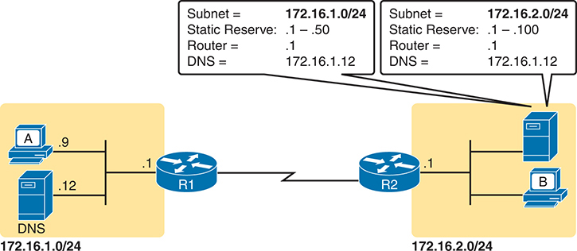


**Figure 19-4** *Preconfiguration on a DHCP Server*

Router R1, with an IP address of 172.16.1.0/24, has static reserves from .1 to .50, and is connected to a DNS server with an Subnet 172.16.1.12 and to host A with an IP address ending in .9. Router R2, with Subnet 172.16.2.0/24, has static reserves from .1 to .100, and is connected to a DNS server with an IP address of 172.16.1.12 and to host B. Both the routers are interconnected with a serial line.

The configuration can list other parameters as well. For example, it can set the time limit for leasing an IP address. The server leases an address for a time (usually a number of days), and then the client can ask to renew the lease. If the client does not renew, the server can reclaim the IP address and put it back in the pool of available IP addresses. The server configuration sets the maximum time for the lease.

DHCP uses three allocation modes, based on small differences in the configuration at the DHCP server. *Dynamic allocation* refers to the DHCP mechanisms and configuration described throughout this chapter. Another method, *automatic allocation*, sets the DHCP lease time to infinite. As a result, once the server chooses an address from the pool and assigns the IP address to a client, the IP address remains with that same client indefinitely. A third mode, *static allocation*, preconfigures the specific IP address for a client based on the client's MAC address. That specific client is the only client that then uses the IP address. (Note that this chapter shows examples and configuration for dynamic allocation only.)

Additionally, the DHCP server can be configured to supply some other useful configuration settings. For instance, a server can supply the IP address of a Trivial File Transfer Protocol (TFTP) server. TFTP servers provide a basic means of storing files that can then be transferred to a client host. For instance, Cisco IP phones rely on TFTP to retrieve several configuration files when the phone initializes. DHCP plays a key role by supplying the IP address of the TFTP server that the phones should use.

#### Configuring DHCP Features on Routers and Switches

Cisco routers and switches support a variety of features. Routers can be configured to act as a DHCP server with just a few straightforward commands--a feature useful in the lab and in some limited cases. More commonly, the enterprise uses a centralized DHCP server (that does not run on a router) but with the DHCP relay feature on most every router interface. Finally, Cisco routers and switches can also act as DHCP clients, learning their IP addresses from a DHCP server.

This section discusses the DHCP configuration topics mentioned for the CCNA 200-301 V1.1 exam blueprint. Those include the router DHCP relay feature and the configuration to enable DHCP client services on both switches and routers.

Note

The CCNA 200-301 V1.1 exam blueprint does not mention the DHCP server function, but many people like to use the IOS DHCP server in the lab for testing with DHCP. If interested in how to configure a DHCP server on a router, refer to [Appendix K](vol1_appk.md#appk), "[Topics from Previous Editions](vol1_appk.md#appk)."

##### Configuring DHCP Relay

Configuring DHCP relay requires a simple decision and a single straightforward configuration command. First, you must identify the interfaces that need the feature. The DHCP relay feature must be configured for any router interface that connects to a subnet where


* DHCP clients exist in the subnet
* DHCP servers do not exist in the subnet

Once such interfaces have been identified, the configuration requires the **ip helper-address** interface subcommand on each of those interfaces. For instance, in the topology of the previous three figures, R1's G0/0 interface needs to be configured with the **ip helper-address 172.16.2.11** interface subcommand. Once enabled on an interface, the IOS DHCP relay agent makes changes in the incoming DHCP messages' addresses as described earlier in the chapter. Without the DHCP relay agent, the DHCP request never arrives at the server.

To verify the relay agent, you can use the **show running-config** command and look for the single configuration command or use the **show ip interface g0/0** command as shown in [Example 19-1](vol1_ch19.md#exa19_1). The highlighted line confirms the configured setting. Note that if there were no **ip helper-address** commands configured on the interface, the highlighted line would instead read "Helper address is not set."

**Example 19-1** *Listing the Current Helper Address Setting with **show ip interface***

[Click here to view code image](vol1_ch19_images.md#f0494-01)

```
R1# show ip interface g0/0
GigabitEthernet0/0 is up, line protocol is up
 Internet address is 172.16.1.1/24
 Broadcast address is 255.255.255.255
 Address determined by non-volatile memory
 MTU is 1500 bytes
 Helper address is 172.16.2.11
! Lines omitted for brevity
```

##### Configuring a Switch as DHCP Client

A switch can act as a DHCP client to lease its management IP address. In most cases, you will want to instead use a static IP address so that the staff can more easily identify the switch's address for remote management. However, as an example of how a DHCP client can work, this next topic shows how to configure and verify DHCP client operations on a switch.

Note

[Chapter 6](vol1_ch06.md#ch06), "[Configuring Basic Switch Management](vol1_ch06.md#ch06)," also shows this same example of how to configure a switch to be a DHCP client. This chapter repeats the example here so you can see all the related DHCP configuration details in a single place in this volume.

To configure a switch to use DHCP to lease an address, configure a switch's IP address as normal, but with the **ip address dhcp** interface subcommand. [Example 19-2](vol1_ch19.md#exa19_2) shows a sample.

**Example 19-2** *Switch Dynamic IP Address Configuration with DHCP*

[Click here to view code image](vol1_ch19_images.md#f0495-01)

```
Emma# configure terminal
Enter configuration commands, one per line. End with CNTL/Z.
Emma(config)# interface vlan 1
Emma(config-if)# ip address dhcp
Emma(config-if)# no shutdown
Emma(config-if)# ^Z
Emma#
00:38:20: %LINK-3-UPDOWN: Interface Vlan1, changed state to up
00:38:21: %LINEPROTO-5-UPDOWN: Line protocol on Interface Vlan1, changed state to up
```

To verify that DHCP worked, start with the traditional way to check IP addresses on switch VLAN interfaces: the **show interfaces vlan** *x* command as demonstrated in [Example 19-3](vol1_ch19.md#exa19_3). First, check the interface state, because the switch does not attempt DHCP until the VLAN interface reaches an up/up state. Notably, if you forget to issue the **no shutdown** command, the VLAN 1 interface will remain in a shutdown state and be listed as "administratively down" in the **show** command output. Then, if DHCP has not yet worked, you will see the highlighted line shown in the upper part of the example. Once the switch leases an IP address, you will see the different text shown in the bottom half of the example.

**Example 19-3** *Verifying DHCP-Learned IP Address on a Switch*

[Click here to view code image](vol1_ch19_images.md#f0495-02)

```
! First, output when the switch has not yet leased an IP address
Emma# show interfaces vlan 1
Vlan1 is up, line protocol is up, Autostate Enabled
 Hardware is Ethernet SVI, address is 4488.165a.f247 (bia 4488.165a.f247)
 Internet address will be negotiated using DHCP
! lines omitted for brevity
! Next, the output after DHCP works
Emma# show interfaces vlan 1
Vlan1 is up, line protocol is up, Autostate Enabled
 Hardware is Ethernet SVI, address is 4488.165a.f247 (bia 4488.165a.f247)
 Internet address is 192.168.1.101/24
! lines omitted for brevity
```

Interestingly, output line three, which lists the address, appears the same whether you configure the address explicitly or whether the switch leases the address. For instance, the latter half of [Example 19-3](vol1_ch19.md#exa19_3) lists 192.168.1.101 as the address, but with no information to identify whether the IP address is a static or DHCP-learned IP address.

To see more details specific to DHCP, instead use the **show dhcp lease** command to see the (temporarily) leased IP address and other parameters. (Note that the switch does not store the DHCP-learned IP configuration in the running-config file.) [Example 19-4](vol1_ch19.md#exa19_4) shows sample output. Note also that the switch learns its default-gateway setting using DHCP as well.


**Example 19-4** *Verifying DHCP-Learned Information on a Switch*

[Click here to view code image](vol1_ch19_images.md#f0496-01)

```
Emma# show dhcp lease
Temp IP addr: 192.168.1.101 for peer on Interface: Vlan1
Temp sub net mask: 255.255.255.0
 DHCP Lease server: 192.168.1.1, state: 3 Bound
 DHCP transaction id: 1966
 Lease: 86400 secs, Renewal: 43200 secs, Rebind: 75600 secs
Temp default-gateway addr: 192.168.1.1
 Next timer fires after: 11:59:45
 Retry count: 0 Client-ID: cisco-0019.e86a.6fc0-Vl1
 Hostname: Emma

Emma# show ip default-gateway
192.168.1.1
```

##### Configuring a Router as DHCP Client

Just as with switches, you can configure router interfaces to lease an IP address using DHCP rather than using a static IP address, although those cases will be rare. In most every case it makes more sense to statically configure router interface IP addresses with the address listed in the **ip address** *address mask* interface subcommand. However, configuring a router to lease an address using DHCP makes sense in some cases with a router connected to the Internet; in fact, most every home-based router does just that.

A router with a link to the Internet can learn its IP address and mask with DHCP and also learn the neighboring ISP router's address as the [default gateway](vol1_gloss.md#gloss_090). [Figure 19-5](vol1_ch19.md#ch19fig05) shows an example, with three routers on the left at one enterprise site. Router R1 uses DHCP to learn its IP address (192.0.2.2) from the ISP router over a connection to the Internet.

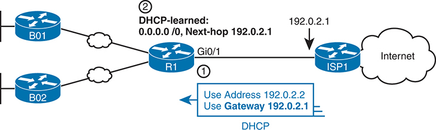


**Figure 19-5** *Enterprise Router Building and Advertising Default Routes with DHCP Client*

R1 is connected to two switches, B01 and B02 with Ethernet W A N. The D H C P client provides R1 with an IP address of 192.0.2.2 and a gateway of 192.0.2.1 to access ISP1, which is connected to the internet, symbolized by a cloud icon. The D H C P-learned route is 0.0.0.0/0 with a next hop at 192.0.2.1, enabling R1's connection to I S P 1 and subsequently the internet.

The DHCP process supplies a default gateway IP address to Router R1, but routers do not normally use a default gateway setting; only hosts use a default gateway setting. However, the router takes advantage of that information by turning that default gateway IP address into the basis for a default route. For instance, in [Figure 19-5](vol1_ch19.md#ch19fig05), Router R1 dynamically adds a default route to its routing table with the default gateway IP address from the DHCP message--which is the ISP router's IP address--as the next-hop address. At that point, R1 has a good route to use to forward packets into the Internet.

Additionally, Router R1 can distribute that default route to the rest of the routers using an interior routing protocol like OSPF. See the section "[OSPF Default Routes](vol1_ch23.md#ch23lev2sec4)" in [Chapter 23](vol1_ch23.md#ch23), "[Implementing Optional OSPF Features](vol1_ch23.md#ch23)," for more information.

[Example 19-5](vol1_ch19.md#exa19_5) shows the configuration on Router R1 to match [Figure 19-5](vol1_ch19.md#ch19fig05). Note that it begins with R1 configuring its G0/1 interface to use DHCP to learn the IP address to use on the interface, using the **ip address dhcp** command.

**Example 19-5** *Learning an Address and Default Static Route with DHCP*

[Click here to view code image](vol1_ch19_images.md#f0497-01)

```
R1# configure terminal
R1(config)# interface gigabitethernet0/1
R1(config-if)# ip address dhcp
R1(config-if)# end
R1#
R1# show ip route static
! Legend omitted
Gateway of last resort is 192.0.2.1 to network 0.0.0.0

S* 0.0.0.0/0 [254/0] via 192.0.2.1
```

The end of the example shows the resulting default route. Oddly, IOS displays this route as a static route (destination 0.0.0.0/0), although the route is learned dynamically based on the DHCP-learned default gateway. To recognize this route as a DHCP-learned default route, look to the administrative distance value of 254. IOS uses a default administrative distance of 1 for static routes configured with the **ip route** configuration command but a default of 254 for default routes added because of DHCP.

### Identifying Host IPv4 Settings

Whether learned using DHCP or not, every host that uses IP version 4 needs to have some settings to work correctly. This second major section of the chapter examines those settings and shows examples of those settings on Windows, Linux, and macOS.

#### Host Settings for IPv4

To work correctly, an IPv4 host needs to know these values:


* DNS server IP addresses
* Default gateway (router) IP address
* Device's own IP address
* Device's own subnet mask

To review the basics, the host must know the IP address of one or more DNS servers to send the servers' name resolution requests. For enterprises, the servers may reside in the enterprise, as shown in [Figure 19-6](vol1_ch19.md#ch19fig06). The host on the left (sometimes called an endpoint) typically knows the addresses of at least two DNS servers for redundancy. If the first DNS fails to respond, the endpoint can then attempt name resolution with the next DNS server.

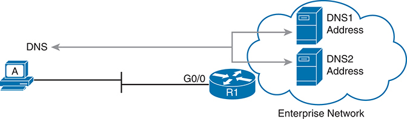


**Figure 19-6** *Host A Needs to Know the IP Address of the DNS Servers*

Host A is connected to a router R1 via interface G0/0. The router is connected to two DNS servers labeled "DNS1 Address" and "DNS2 Address". These connections are depicted with arrows pointing from the router to the DNS server, host A. The DNS setup is encapsulated within a cloud shape labeled "Enterprise Network".

Each endpoint needs to know the IP address of a router that resides in the same subnet. The endpoint uses that router as its default router or default gateway, as shown in [Figure 19-7](vol1_ch19.md#ch19fig07). From a host logic perspective, the host can then forward packets destined for addresses outside the subnet to the default router, with that router then forwarding the packet based on its routing table.

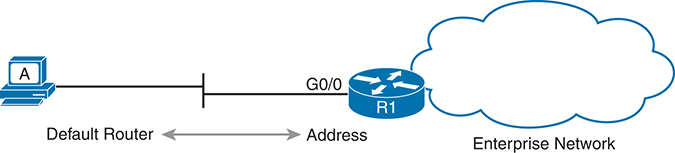


**Figure 19-7** *Host Default Router Setting Should Equal Router Interface Address*

Host A connected to Default Router R1 via Interface G0/0. Router R1 is depicted connected to an enterprise network represented by a cloud icon. A double-faced arrow indicates the connection, with 'Default Router' labeled on the left and the 'Address' labeled on the right.

Of course, each device needs its own IP address and subnet mask. Equally as important, note that the host and the default router must agree on the addresses inside the subnet. The host will use the address and mask to do the math to determine which addresses are in the same subnet and which are in other subnets. For routing to work correctly, the default router's interface address and mask should result in the same definition of the subnet with the same addresses, as shown in [Figure 19-8](vol1_ch19.md#ch19fig08).

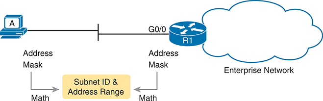


**Figure 19-8** *The Need for Subnet Agreement Between Host and Default Router*

Host A connected to Default Router R1 via Interface G0/0. Router R1 is depicted connected to an enterprise network represented by a cloud icon. The 'Address Mask' of both the host and router indicates "subnet ID and address ranges".

The rest of this section shows examples of these settings in the graphical user interface (GUI) and command-line interface (CLI) of three different host operating systems. The examples for the remainder of the chapter use hosts in subnet 10.1.1.0/24, as shown on the left side of [Figure 19-9](vol1_ch19.md#ch19fig09).

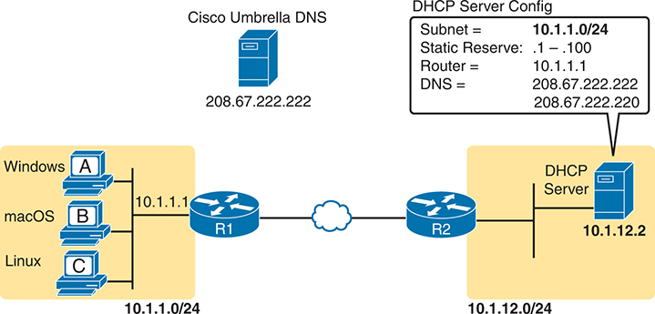


**Figure 19-9** *Subnet 10.1.1.0/24 Used for the Upcoming Host Examples*

The schematic includes three hosts labeled A, B, and C, representing Windows, macOS, and Linux operating systems respectively. Each computer is connected to a router labeled R1 with an IP address of 10.1.1.1/24. R1 is connected to another router, labeled R2, through Ethernet W A N, which is connected to a D H C P Server with an IP address of 10.1.1.2/24 and is connected to Cisco Umbrella DNS with an IP address of 208.67.222.222. The D H C P Server Config details are also displayed, including the subnet 10.1.1.0/24, static reserve .1 - .100, router 10.1.1.1, and D N S 208.67.222.222.

#### Host IP Settings on Windows

Almost every OS in the world--certainly the more common OSs people work with every day--have a fairly easy-to-reach settings window that lists most if not all the IPv4 settings in one place.

For example, [Figure 19-10](vol1_ch19.md#ch19fig10) shows the Network configuration screen from a Windows host from the network area of the Windows Control Panel. This image shows the four significant settings: address, mask, router, and DNS. Note that this host, Windows Host A in [Figure 19-9](vol1_ch19.md#ch19fig09), uses DHCP to learn its settings from the DHCP server in that figure.

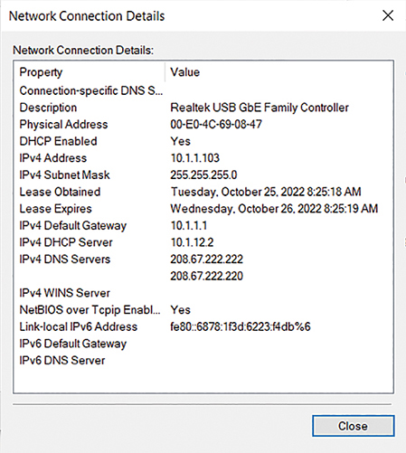


**Figure 19-10** *Windows DHCP Client IP Address, Mask, and Default Router Settings*

The screenshot displays various properties and their corresponding values related to the network connection. The properties include "Connection-specific DNS Suffix", "Description", "Physical Address", "DHCP Enabled", "IPv4 Address", "IPv4 Subnet Mask", "Lease Obtained", "Lease Expires", "IPv4 Default Gateway", "IPv4 DHCP Server", "IPv4 DNS Servers", "IPv4 WINS Servers", "NetBIOS over Tcpip Enabled", "Link-local IPv6 Address", "IPv6 Default Gateway", and "IPv6 DNS Server". The values for these properties are also displayed, providing specific details about the network connection. The Close button is at the bottom.

However, beyond the GUI, most OSs have a variety of networking commands available from a command line. For many decades and Windows versions, the **ipconfig** and **ipconfig /all** commands supply the most direct help, as shown in [Example 19-6](vol1_ch19.md#exa19_6). As you can see, both list the address, mask, and default gateway. The **ipconfig /all** command lists much more detail, including the [DNS server list](vol1_gloss.md#gloss_112), confirmation that the host used DHCP, along with the IP address of the DHCP server.


**Example 19-6** ***ipconfig** and **ipconfig /all** (Windows)*

[Click here to view code image](vol1_ch19_images.md#f0500-01)

```
Windows_A> ipconfig
! Lines omitted for brevity
Ethernet adapter Ethernet 5:

   Connection-specific DNS Suffix . :
   Link-local IPv6 Address . . . . . : fe80::6878:1f3d:6223:f4db%6
   IPv4 Address. . . . . . . . . . . : 10.1.1.103
   Subnet Mask . . . . . . . . . . . : 255.255.255.0
   Default Gateway . . . . . . . . . : 10.1.1.1

Windows_A> ipconfig /all
! Lines omitted for brevity
Ethernet adapter Ethernet 5:

   Connection-specific DNS Suffix .  :
   Description . . . . . . . . . . . : Realtek USB GbE Family Controller
   Physical Address. . . . . . . . . : 00-E0-4C-69-08-47
   DHCP Enabled. . . . . . . . . . . : Yes
   Autoconfiguration Enabled . . . . : Yes
   Link-local IPv6 Address . . . . . : fe80::6878:1f3d:6223:f4db%6(Preferred)
   IPv4 Address. . . . . . . . . . . : 10.1.1.103(Preferred)
   Subnet Mask . . . . . . . . . . . : 255.255.255.0
   Lease Obtained. . . . . . . . . . : Tuesday, October 25, 2022 8:25:19 AM
   Lease Expires . . . . . . . . . . : Wednesday, October 26, 2022 8:25:19 AM
   Default Gateway . . . . . . . . . : 10.1.1.1
   DHCP Server . . . . . . . . . . . : 10.1.12.2
   DHCPv6 IAID . . . . . . . . . . . : 100720716
   DHCPv6 Client DUID. . . . . . . . : 00-01-00-01-19-A0-DC-F0-24-FD-52-CB-50-C9
   DNS Servers . . . . . . . . . . . : 208.67.222.222
                                       208.67.222.220
   NetBIOS over Tcpip. . . . . . . . : Enabled
```

While [Example 19-6](vol1_ch19.md#exa19_6) shows the traditional **ipconfig** Windows command, [Example 19-7](vol1_ch19.md#exa19_7) shows a similar command as part of the Windows network shell. The network shell commands replace some of the older Windows command-line commands like **ipconfig**.

**Example 19-7** *Windows Network Shell **show config** Command*

[Click here to view code image](vol1_ch19_images.md#f0501-01)

```
Windows_A> netsh interface ip show config

Configuration for interface "Ethernet 5"
   DHCP enabled:                        Yes
   IP Address:                          10.1.1.103
   Subnet Prefix:                       10.1.1.0/24 (mask 255.255.255.0)
   Default Gateway:                     10.1.1.1
   Gateway Metric:                      0
   InterfaceMetric:                     25
   DNS servers configured through DHCP: 208.67.222.222
                                        208.67.222.220
   Register with which suffix:          Primary only
   WINS servers configured through DHCP: None

! Next, use the network shell to allow repeated commands.
Windows_A> netsh
netsh> interface ip
netsh interface ip> show config

Configuration for interface "Ethernet 5"
   DHCP enabled:                        Yes
   IP Address:                          10.1.1.103
   Subnet Prefix:                       10.1.1.0/24 (mask 255.255.255.0)
! Remaining lines omitted; same output as at the top of the example.

netsh interface ip> show dnsservers

Configuration for interface "Ethernet 5"
   DNS servers configured through DHCP: 208.67.222.222
                                        208.67.222.220
   Register with which suffix:          Primary only
```

Interestingly, you can issue network shell commands as a single command (as seen at the top of [Example 19-7](vol1_ch19.md#exa19_7)) or by navigating within the network shell interface. The example shows the use of the **netsh** command and then **interface ip** so that you reach a mode where you can use short versions of many IP-related commands, like the **show config** and **show dnsservers** commands. (Note that all output has been edited to show only the entries related to the Ethernet interface used in the example.)

You should also look at the host's IP routing table, focusing on two routes that direct most routing in the host. When using DHCP, the host creates these routes based on information learned from the DHCP server:

* A default route, with the default gateway as the next-hop address, with the destination subnet and mask listed as 0.0.0.0 and 0.0.0.0.
* A route to the subnet connected to the working interface, subnet 10.1.1.0/24 in this case, calculated from the interface IP address and mask.

[Example 19-8](vol1_ch19.md#exa19_8) displays Windows host A's routing table with two commands: the older **netstat -rn** command and the newer **netsh interface ip show route** command. The example has been edited to list only routes related to subnet 10.1.1.0/24 and the Ethernet LAN interface used in the example. Note that a gateway of "on-link" means that the PC thinks the destination is on the local subnet (link).


**Example 19-8** *Windows Host IPv4 Routes*

[Click here to view code image](vol1_ch19_images.md#f0502-01)

```
Windows_A> netstat -rn
IPv4 Route Table
===========================================================================
Active Routes:
Network Destination         Netmask    Gateway    Interface  Metric
           0.0.0.0          0.0.0.0    10.1.1.1   10.1.1.103     25
          10.1.1.0    255.255.255.0    On-link    10.1.1.103    281
        10.1.1.103  255.255.255.255    On-link    10.1.1.103    281
        10.1.1.255  255.255.255.255    On-link    10.1.1.103    281
! Lines omitted for brevity
Windows_A> netsh interface ip show route
Publish Type     Met Prefix                   Idx Gateway/Interface Name
------- -------- --- ------------------------ --- ------------------------
No     Manual    0   0.0.0.0/0                6 10.1.1.1
No     System    256 10.1.1.0/24              6 Ethernet 5
No     System    256 10.1.1.103/32            6 Ethernet 5
No     System    256 10.1.1.255/32            6 Ethernet 5
!      Lines     omitted for brevity
```

#### Host IP Settings on macOS

Although the details vary as compared to Windows, macOS has a graphical interface to see network settings and a variety of network commands. This section shows examples of each, beginning with [Figure 19-11](vol1_ch19.md#ch19fig11). It shows the network settings in macOS for an Ethernet interface, with the address, mask, default router, and DNS server addresses. Also note the setting states that the interface is using DHCP.

Both macOS and Linux support the **ifconfig** command to list information similar to the Windows **ipconfig /all** command. However, the **ifconfig** command lacks an option like **/all,** listing no information about the default gateway or DNS servers. [Example 19-9](vol1_ch19.md#exa19_9) gives an example of the **ifconfig** command from Mac Host B in [Figure 19-11](vol1_ch19.md#ch19fig11), along with another command that lists the default router.


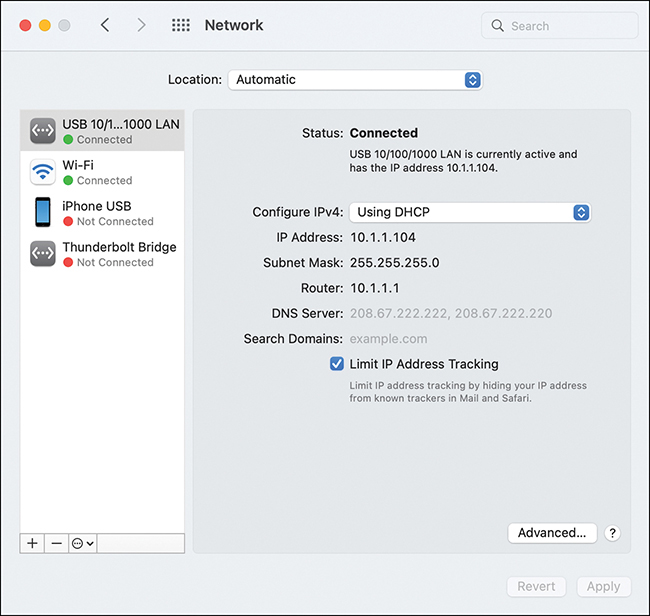


**Figure 19-11** *macOS DHCP Client IP Address, Mask, and Default Router Settings*

The screenshot displays Network settings interface on a macOS operating system, showing a list of network connections on the left panel, including a connected "USB 10/100/1000 LAN". On the right panel, the status indicates "Connected", "USB 10/100/1000 LAN is currently active and has the IP address 10.1.10.104". The configuration for IPv4 is set to "Using DHCP", with an IP Address of "10.1.10.104", Subnet Mask of "255.255.255.0",and Router at "10.1.1.1". DNS Server addresses and a Search Domains field are also displayed.


**Example 19-9** ***ifconfig** and **networksetup -getinfo** (macOS)*

[Click here to view code image](vol1_ch19_images.md#f0503-01)

```
Mac_B$ ifconfig en8
 en8: flags=8863<UP,BROADCAST,SMART,RUNNING,SIMPLEX,MULTICAST> mtu 1500
       options=6467<RXCSUM,TXCSUM,VLAN_MTU,TSO4,TSO6,CHANNEL_IO,PARTIAL_CSUM,
       ZEROINVERT_CSUM>
          ether 00:e0:4c:68:1f:26 
          inet6 fe80::184c:56f9:fd3b:d6e7%en8 prefixlen 64 secured scopeid 0x14
          inet 10.1.1.104 netmask 0xffffff00 broadcast 10.1.1.255
          nd6 options=201<PERFORMNUD,DAD>
          media: autoselect (1000baseT <full-duplex>)
          status: active

Mac_B$ networksetup -getinfo "USB 10/100/1000 LAN"
DHCP Configuration
IP address: 10.1.1.104
Subnet mask: 255.255.255.0
Router: 10.1.1.1
Client ID:

IPv6: Automatic
IPv6 IP address: none
IPv6 Router: none
Ethernet Address: 00:e0:4c:68:1f:26
```

Focusing on the **ifconfig** command, it lists the subnet mask in hex, listing 0xffffff00 in the example. To convert the mask to dotted decimal, convert each pair of hex digits to binary and then from binary to the decimal equivalent, giving you four octets for the dotted-decimal mask. In this case, the 0xffffff00 begins with three pairs of ff, which convert to binary 11111111. Each binary 11111111 converts to decimal 255: the last hex pair, 00, converts to binary 00000000, which converts to decimal 0. The final decimal mask is the familiar value 255.255.255.0.

The **networksetup** command in [Example 19-9](vol1_ch19.md#exa19_9) lists more detail than the older **ifconfig** command. It lists the usual IP settings, other than the DNS server list. Note that the **networksetup** macOS command has a large variety of options.

Like Windows, macOS adds a default route to its host routing table based on the default gateway and a route to the local subnet calculated based on the IP address and mask. And like Windows, macOS uses the **netstat -rn** command to list those routes--but with several differences in the output. Of note, in the macOS sample shown in [Example 19-10](vol1_ch19.md#exa19_10), the output represents the default route using the word *default* rather than the destination subnet and mask of 0.0.0.0 and 0.0.0.0. The example highlights the default route and the route to the connected subnet. As usual, the example aids readability by limiting the output to those routes related to network 10.0.0.0.

**Example 19-10** ***netstat -rn** Command (macOS)*

[Click here to view code image](vol1_ch19_images.md#f0504-01)

```
Mac_B> netstat -rn
Routing tables

Internet:
Destination      Gateway            Flags        Netif Expire
default          10.1.1.1           UGScg        en8
10.1.1/24        link#20            UCS          en8        !
10.1.1.1/32      link#20            UCS          en8        !
10.1.1.1         2:0:11:11:11:11    UHLWIir      en8      385
10.1.1.104/32    link#20            UCS          en8        !
! lines omitted for brevity
```

#### Host IP Settings on Linux

As with the other desktop OSs, Linux shows networking settings from the GUI as well as with commands. However, be aware that the Linux world includes many different Linux distributions. Additionally, the Linux architecture separates the OS from the desktop (the graphical interface). So, other Linux users may use different GUI administration tools and commands to see network settings.

[Figure 19-12](vol1_ch19.md#ch19fig12) shows an example from the Ubuntu Linux distribution using the Mate desktop ([www.ubuntu-mate.org](http://www.ubuntu-mate.org)). The host, Host C in [Figure 19-9](vol1_ch19.md#ch19fig09), uses DHCP and learns an address in subnet 10.1.1.0/24. [Figure 19-12](vol1_ch19.md#ch19fig12) shows IP details about an Ethernet adapter and includes the IPv4 address, mask, default router, and DNS IP addresses.

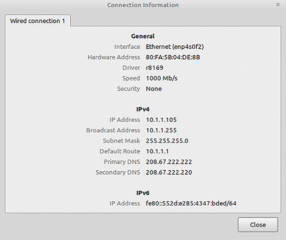


**Figure 19-12** *Linux DHCP Client IP Address, Mask, and Default Router Settings*

The screenshot provides a detailed information about the D H C P client I P address, mask, and default router settings. The "General" section shows that the interface is Ethernet (enp4s0f2) with a hardware address of 80:FA:5B:04:DE:B8, and the driver is r8169. The connection speed is 1000 Megabyte per second with no security enabled. The "IPv4" section displays an IP address of 10.1.1.105, a broadcast address of 10.1.1.255, a subnet mask of 255.255.255.0, and a default route of 10.1.1.1. The primary DNS is 208:67:222:222 and the secondary DNS is 208:67:220:220.

Linux hosts often support a large set of commands from the command line. However, an older set of commands, referenced together as *net-tools*, has been deprecated in Linux to the point that some Linux distributions do not include net-tools. (You can easily add net-tools to most Linux distributions.) The net-tools library has popular commands like **ifconfig** and **netstat -rn**. To replace those tools, Linux uses the *iproute* library, which includes a set of replacement commands and functions, many performed with the **ip** command and some parameters.

[Example 19-11](vol1_ch19.md#exa19_11) shows a sample of the Linux **ifconfig** command and the replacement command **ip address** for the same interface detailed in [Figure 19-12](vol1_ch19.md#ch19fig12). Both commands list the Ethernet MAC and IPv4 addresses, along with the subnet mask.

**Example 19-11** ***ifconfig** and **ip address** Commands (Linux)*

[Click here to view code image](vol1_ch19_images.md#f0505-01)

```
Linux_C$ ifconfig
enp4s0f2: flags=4163<UP,BROADCAST,RUNNING,MULTICAST> mtu 1500
        inet 10.1.1.105 netmask 255.255.255.0 broadcast 10.1.1.255
        inet6 fe80::552d:e285:4347:bded prefixlen 64 scopeid 0x20<link>
        ether 80:fa:5b:04:de:8b txqueuelen 1000 (Ethernet)
        RX packets 4958 bytes 384498 (384.4 KB)
        RX errors 0 dropped 0 overruns 0 frame 0
        TX packets 16270 bytes 1320108 (1.3 MB)
        TX errors 0 dropped 0 overruns 0 carrier 0 collisions 0
Linux_C$ ip address
2: enp4s0f2: <BROADCAST,MULTICAST,UP,LOWER_UP> mtu 1500 qdisc fq_codel state UP
group default qlen 1000
    link/ether 80:fa:5b:04:de:8b brd ff:ff:ff:ff:ff:ff
    inet 10.1.1.105/24 brd 10.1.1.255 scope global dynamic noprefixroute enp4s0f2
      valid_lft 81056sec preferred_lft 81056sec
    inet6 fe80::552d:e285:4347:bded/64 scope link noprefixroute
      valid_lft forever preferred_lft forever
```

[Example 19-12](vol1_ch19.md#exa19_12) shows another pair of older and newer Linux commands: the **netstat -rn** and **ip route** commands. The **netstat -rn** command lists the default route with a style that shows the destination and mask both as 0.0.0.0. As usual, the default route uses the learned default gateway IP address (10.1.1.1) as the next-hop IP address. The **netstat -rn** output also lists a route to the local subnet (10.1.1.0/24). The **ip route** command lists those same routes but with much different formatting and phrasing.

**Example 19-12** ***netstat -rn** and **ip route** Commands (Linux)*

[Click here to view code image](vol1_ch19_images.md#f0506-01)

```
Linux_C$ netstat -rn
Kernel IP routing table
Destination       Gateway     Genmask         Flags   MSS Window irtt Iface
0.0.0.0           10.1.1.1    0.0.0.0         UG        0 0         0 enp4s0f2
10.1.1.0          0.0.0.0     255.255.255.0   U         0 0         0 enp4s0f2
! Lines omitted for brevity

Linux_C$ ip route
default via 10.1.1.1 dev enp4s0f2 proto dhcp metric 20100
10.1.1.0/24 dev enp4s0f2 proto kernel  scope link  src 10.1.1.105 metric 100
! Lines omitted for brevity
```

#### Troubleshooting Host IP Settings

The examples for Windows, macOS, and Linux shown over the last few pages show the successful results for DHCP clients A, B, and C per [Figure 19-9](vol1_ch19.md#ch19fig09). To round out your perspective, the final few examples in this section show a few different scenarios with the resulting output from the popular Windows **ipconfig /all** command. The scenarios, all from Windows Host A in the figure, are as follows:

1. Host A with static IP configuration, using correct settings.
2. Host A as a DHCP client, but with a network issue that prevents the DHCP client and server from communicating.
3. Host A as a DHCP client with a working network so that DHCP works, but with the DHCP server supplying some incorrect information (wrong default gateway address).

##### A Working Windows Host with Static IP Configuration

[Example 19-13](vol1_ch19.md#exa19_13) shows the first scenario. Someone has disabled DHCP on Windows Host A and configured all IP settings manually. They chose well, using correct values per [Figure 19-9](vol1_ch19.md#ch19fig09). In particular, the figure shows addresses .1 - .100 reserved for static addresses, so the person who manually configured Host A assigned 10.1.1.99.


**Example 19-13** *Working Windows Host with Static IP Setting (No DHCP)*

[Click here to view code image](vol1_ch19_images.md#f0507-01)

```
Windows_A> ipconfig /all
! Showing only the Ethernet adapter connected to subnet 10.1.1.0/24
Ethernet adapter Ethernet 5:

   Connection-specific DNS Suffix .  :
   Description . . . . . . . . . . . : Realtek USB GbE Family Controller
   Physical Address. . . . . . . . . : 00-E0-4C-69-08-47
   DHCP Enabled. . . . . . . . . . . : No
   Autoconfiguration Enabled . . . . : Yes
   Link-local IPv6 Address . . . . . : fe80::6878:1f3d:6223:f4db%6(Preferred)
   IPv4 Address. . . . . . . . . . . : 10.1.1.99(Preferred)
   Subnet Mask . . . . . . . . . . . : 255.255.255.0
   Default Gateway . . . . . . . . . : 10.1.1.1
   DHCPv6 IAID . . . . . . . . . . . : 100720716
   DHCPv6 Client DUID. . . . . . . . : 00-01-00-01-19-A0-DC-F0-24-FD-52-CB-50-C9
   DNS Servers . . . . . . . . . . . : 208.67.222.222
                                       208.67.222.220
   NetBIOS over Tcpip. . . . . . . . : Enabled
```

The **ipconfig /all** command output in [Example 19-13](vol1_ch19.md#exa19_13) implies that the host uses static settings by noting that DHCP is disabled (per the first highlighted line). Take a moment to compare that line to the same line back in [Example 19-7](vol1_ch19.md#exa19_7), in which Host A acts as a DHCP client.

The output here in [Example 19-13](vol1_ch19.md#exa19_13) also signals that the host uses a static setting rather than DHCP, but it tells us that by the absence of several lines of output usually shown for DHCP clients, omitting the lines for

* DHCP Enabled
* Lease Obtained
* Lease Expires

Knowing those facts, you should be able to distinguish between cases in which the Windows host does and does not use DHCP.

##### A Failed Windows DHCP Client Due to IP Connectivity Issues

The following example, again taken from Windows Host A, shows a case in which the host similarly acts as a DHCP client to follow the design from [Figure 19-9](vol1_ch19.md#ch19fig09). However, any problem that prevents the DHCP DORA messages from flowing between the client and DHCP server results in a failure of the DHCP process. The client does not lease an address or learn the other IP details from the DHCP server, but it self-assigns an APIPA address and uses the APIPA default mask of 255.255.0.0. (For a review of APIPA, see the section titled "[APIPA IP Addresses (169.254.x.x)](vol1_ch19.md#ch19lev3sec1)" earlier in this chapter.)

[Example 19-14](vol1_ch19.md#exa19_14) shows the resulting **ipconfig /all** command. The output confirms the client enables DHCP. However, the following facts identify that the process failed:

* It omits the output line that would list the DHCP server's IP address.
* It omits the two output lines that list DHCP lease details.
* It shows an APIPA IP address that begins 169.254.
* It lists no IPv4 default gateway address.
* It lists no IPv4 DNS servers.

**Example 19-14** *Windows DHCP Client Fails Due to IP Connectivity Failure*

[Click here to view code image](vol1_ch19_images.md#f0508-01)

```
Windows_A> ipconfig /all
! Showing only the Ethernet adapter connected to subnet 10.1.1.0/24
Ethernet adapter Ethernet 5:

   Connection-specific DNS Suffix .  :
   Description . . . . . . . . . . . : Realtek USB GbE Family Controller
   Physical Address. . . . . . . . . : 00-E0-4C-69-08-47
   DHCP Enabled. . . . . . . . . . . : Yes
   Autoconfiguration Enabled . . . . : Yes
   Link-local IPv6 Address . . . . . : fe80::6878:1f3d:6223:f4db%6(Preferred)
   Autoconfiguration IPv4 Address. . : 169.254.244.219(Preferred)
   Subnet Mask . . . . . . . . . . . : 255.255.0.0
   Default Gateway . . . . . . . . . :
   DHCPv6 IAID . . . . . . . . . . . : 100720716
   DHCPv6 Client DUID. . . . . . . . : 00-01-00-01-19-A0-DC-F0-24-FD-52-CB-50-C9
   DNS Servers . . . . . . . . . . . : fec0:0:0:ffff::1%1
                                       fec0:0:0:ffff::2%1
                                       fec0:0:0:ffff::3%1
   NetBIOS over Tcpip. . . . . . . . : Enabled
```

##### A Working Windows DHCP Client with Incorrect Settings

For one final scenario, imagine a case in which the DHCP process works but the server configuration is incorrect. As a result, the DHCP client can learn incorrect information and not be able to communicate in some cases. For instance, the DHCP process could complete with the client learning these inaccurate or incomplete settings:

* Wrong subnet mask
* Wrong or missing default gateway
* Wrong or missing DNS server list

[Example 19-15](vol1_ch19.md#exa19_15) shows a case with the incorrect default gateway (10.1.1.254) configured in the DHCP server's settings for subnet 10.1.1.0/24. The correct default gateway per the design is Router R1 (10.1.1.1). The **ipconfig /all** output in [Example 19-15](vol1_ch19.md#exa19_15) shows the usual indications that DHCP worked, showing it as enabled, with a lease start and end time. It also shows the host's IP address, mask, default gateway, and DNS servers. But compared to the intended design, the output shows that the host learned a default gateway setting for a nonexistent router.

**Example 19-15** *Windows DHCP Client Learns Incorrect Default Gateway*

[Click here to view code image](vol1_ch19_images.md#f0509-01)

```
Windows_A> ipconfig /all

Ethernet adapter Ethernet 5:

   Connection-specific DNS Suffix  . :
   Description . . . . . . . . . . . : Realtek USB GbE Family Controller
   Physical Address. . . . . . . . . : 00-E0-4C-69-08-47
   DHCP Enabled. . . . . . . . . . . : Yes
   Autoconfiguration Enabled . . . . : Yes
   Link-local IPv6 Address . . . . . : fe80::6878:1f3d:6223:f4db%6(Preferred)
   IPv4 Address. . . . . . . . . . . : 10.1.1.103(Preferred)
   Subnet Mask . . . . . . . . . . . : 255.255.255.0
   Lease Obtained. . . . . . . . . . : Tuesday, October 25, 2022 7:54:17 AM
   Lease Expires . . . . . . . . . . : Wednesday, October 26, 2022 7:54:16 AM
   Default Gateway . . . . . . . . . : 10.1.1.254 
   DHCP Server . . . . . . . . . . . : 10.1.12.2
   DHCPv6 IAID . . . . . . . . . . . : 100720716
   DHCPv6 Client DUID. . . . . . . . : 00-01-00-01-19-A0-DC-F0-24-FD-52-CB-50-C9
   DNS Servers . . . . . . . . . . . : 208.67.222.222
                                       208.67.222.220
   NetBIOS over Tcpip. . . . . . . . : Enabled

Windows_A> netstat -rn

IPv4 Route Table
===========================================================================
Active Routes:
Network Destination          Netmask      Gateway     Interface  Metric
           0.0.0.0           0.0.0.0   10.1.1.254     10.1.1.103     25
          10.1.1.0     255.255.255.0      On-link     10.1.1.103    281
! Lines omitted for brevity
```

The underlying solution to this problem is to fix the configuration mistake in the DHCP server. For the exam, the more likely scenario would be for you to think about the design and notice a difference between what the DHCP client learned and the correct settings. Also, note that the next chapter, "[Troubleshooting IPv4 Routing](vol1_ch20.md#ch20)," gives some insights into how to explore different symptoms for problems in an IP network.

### Chapter Review

One key to doing well on the exams is to perform repetitive spaced review sessions. Review this chapter's material using either the tools in the book or interactive tools for the same material found on the book's companion website. Refer to the "[Your Study Plan](vol1_pref10.md#pref10)" element for more details. [Table 19-2](vol1_ch19.md#ch19tab02) outlines the key review elements and where you can find them. To better track your study progress, record when you completed these activities in the second column.

**Table 19-2** Chapter Review Tracking

| Review Element | Review Date(s) | Resource Used |
| --- | --- | --- |
| Review key topics |  | Book, website |
| Review key terms |  | Book, website |
| Answer DIKTA questions |  | Book, PTP |
| Review command tables |  | Book |
| Watch video |  | Website |

### Review All the Key Topics


**Table 19-3** Key Topics for [Chapter 19](vol1_ch19.md#ch19)

| Key Topic Element | Description | Page Number |
| --- | --- | --- |
| List | Definitions of special IPv4 addresses 0.0.0.0 and 255.255.255.255 | [489](vol1_ch19.md#page_489) |
| List | Four logic steps created by the **ip helper-address** command | [491](vol1_ch19.md#page_491) |
| [Figure 19-2](vol1_ch19.md#ch19fig02) | What the **ip helper-address** command changes in a DHCP Discover message | [491](vol1_ch19.md#page_491) |
| List | The two facts that must be true about a subnet for a router to need to be a DHCP relay agent for that subnet | [494](vol1_ch19.md#page_494) |
| [Example 19-4](vol1_ch19.md#exa19_4) | Switch commands that confirm the details of DHCP client operations based on the **ip address dhcp** interface subcommand | [496](vol1_ch19.md#page_496) |
| List | The IPv4 settings expected on an end-user host | [497](vol1_ch19.md#page_497) |
| [Example 19-6](vol1_ch19.md#exa19_6) | Output from a Windows **ipconfig /all** command when the host successfully uses DHCP | [500](vol1_ch19.md#page_500) |
| [Example 19-8](vol1_ch19.md#exa19_8) | IP routes on a Windows host | [502](vol1_ch19.md#page_502) |
| [Example 19-9](vol1_ch19.md#exa19_9) | Output from a macOS **ifconfig** command plus two **networksetup** commands | [503](vol1_ch19.md#page_503) |
| [Example 19-13](vol1_ch19.md#exa19_13) | Output from a Windows **ipconfig /all** command when the host uses static IP configuration | [507](vol1_ch19.md#page_507) |

### Key Terms You Should Know

[APIPA](vol1_ch19.md#key_213)

[default gateway](vol1_ch19.md#key_214)

[DHCP client](vol1_ch19.md#key_215)

[DHCP relay agent](vol1_ch19.md#key_216)

[DHCP server](vol1_ch19.md#key_217)

[DNS server](vol1_ch19.md#key_218)

[DNS server list](vol1_ch19.md#key_219)

### Command References

[Tables 19-4](vol1_ch19.md#ch19tab04), [19-5](vol1_ch19.md#ch19tab05), and [19-6](vol1_ch19.md#ch19tab06) list configuration and verification commands used in this chapter. As an easy review exercise, cover the left column in a table, read the right column, and try to recall the command without looking. Then repeat the exercise, covering the right column, and try to recall what the command does.

**Table 19-4** [Chapter 19](vol1_ch19.md#ch19) Configuration Command Reference

| Command | Description |
| --- | --- |
| **ip helper-address** *IP-address* | An interface subcommand that tells the router to notice local subnet broadcasts (to 255.255.255.255) that use UDP, and change the source and destination IP address, enabling DHCP servers to sit on a remote subnet |
| **ip address dhcp** | An interface subcommand that tells the router or switch to use DHCP to attempt to lease a DHCP address from a DHCP server |


**Table 19-5** [Chapter 19](vol1_ch19.md#ch19) EXEC Command Reference

| Command | Description |
| --- | --- |
| **show arp**, **show ip arp** | Command that lists the router's IPv4 ARP table |
| **show dhcp lease** | Switch command that lists information about addresses leased because of the configuration of the **ip address dhcp** command |
| **show ip default-gateway** | Switch command that lists the switch's default gateway setting, no matter whether learned by DHCP or statically configured |


**Table 19-6** [Chapter 19](vol1_ch19.md#ch19) Generic Host Networking Command Reference

| Command | Description |
| --- | --- |
| **ipconfig /all** | (Windows) Lists IP address, mask, gateway, and DNS servers |
| **ifconfig** | (Mac, Linux) Lists IP address and mask for an interface |
| **networksetup -getinfo** *interface* | (Mac) Lists IP settings including default router |
| **netstat -rn** | (Windows, Mac, Linux) Lists the host's routing table, including a default route that uses the DHCP-learned default gateway |
| **arp -a** | (Windows, Mac, Linux) Lists the host's ARP table |
| **ip address** | (Linux) Lists IP address and mask information for interfaces; the Linux replacement for **ifconfig** |
| **ip route** | (Linux) Lists routes, including the default route and a route to the local subnet; the Linux replacement for **netstat -rn** |
| **netsh interface ip show addresses** | (Windows) Windows network shell command to list interface IP address configuration settings; a replacement for the **ipconfig /all** command |
| **netsh interface ip show route** | (Windows) Windows network shell command to list IPv4 routes; a replacement for the **netstat -rn** command |