# Code Snippets

[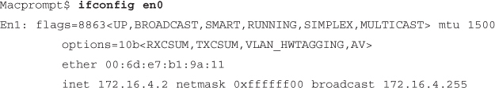](vol1_ch19.md#f0487-01a)

[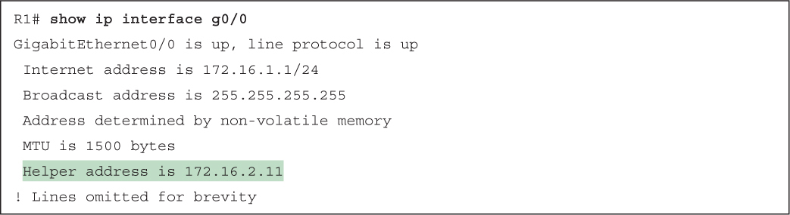](vol1_ch19.md#f0494-01a)

[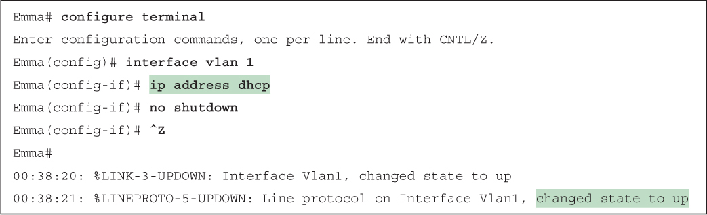](vol1_ch19.md#f0495-01a)

[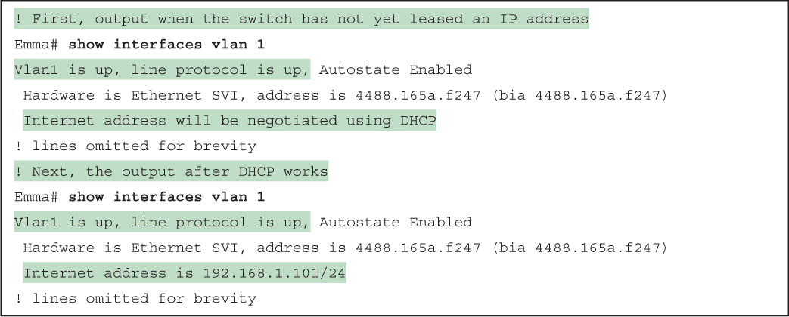](vol1_ch19.md#f0495-02a)

[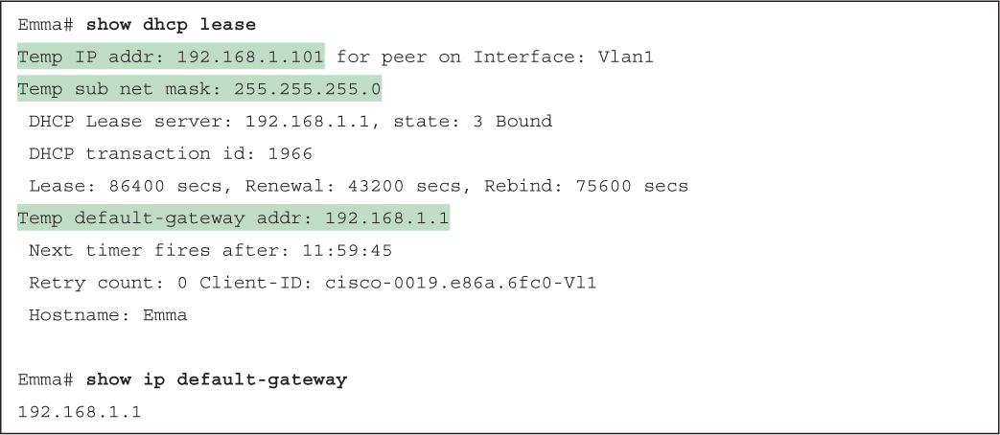](vol1_ch19.md#f0496-01a)

[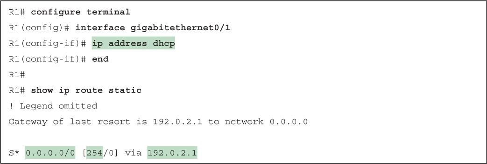](vol1_ch19.md#f0497-01a)

[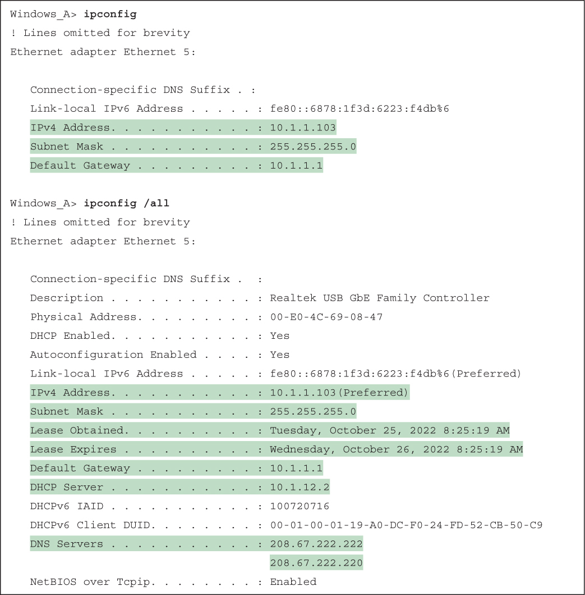](vol1_ch19.md#f0500-01a)

[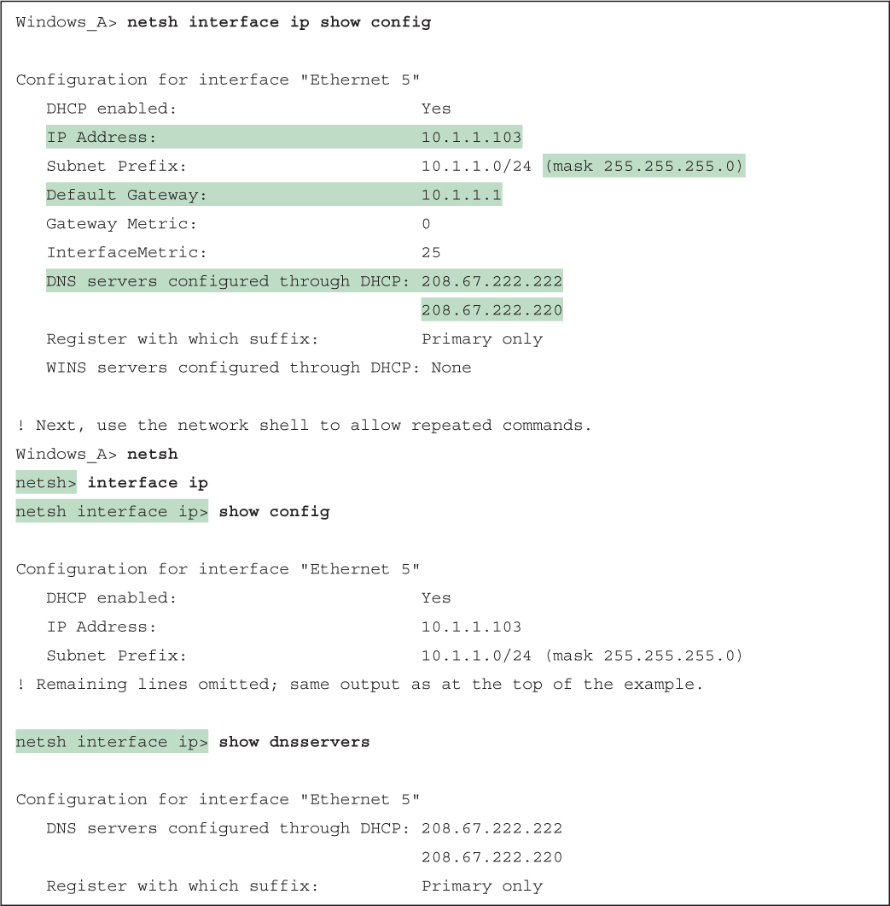](vol1_ch19.md#f0501-01a)

[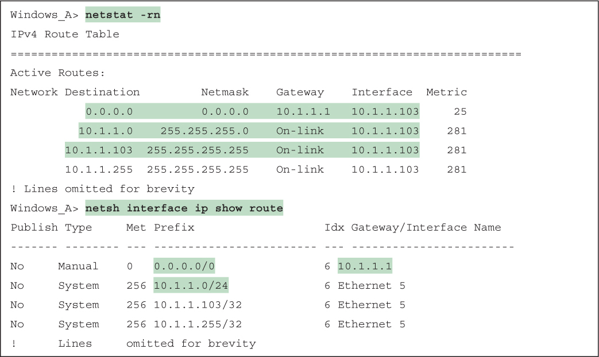](vol1_ch19.md#f0502-01a)

[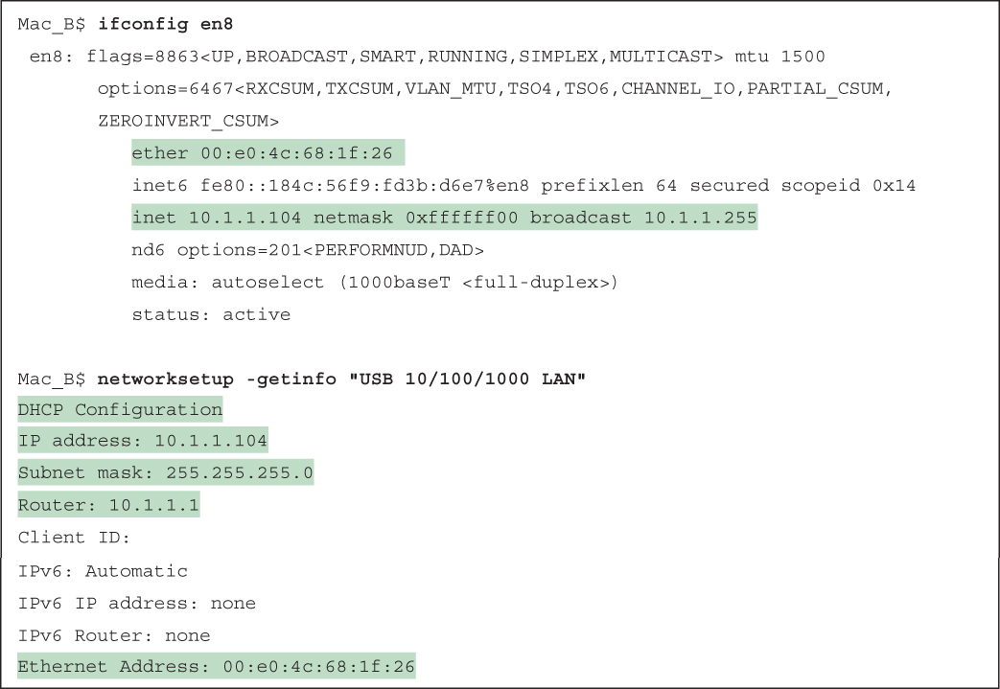](vol1_ch19.md#f0503-01a)

[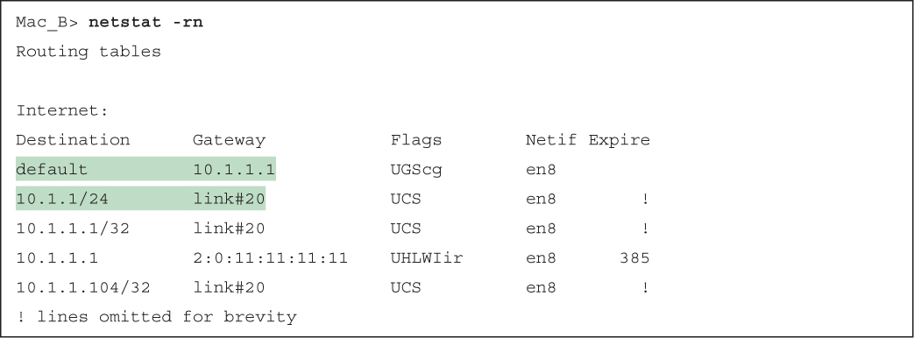](vol1_ch19.md#f0504-01a)

[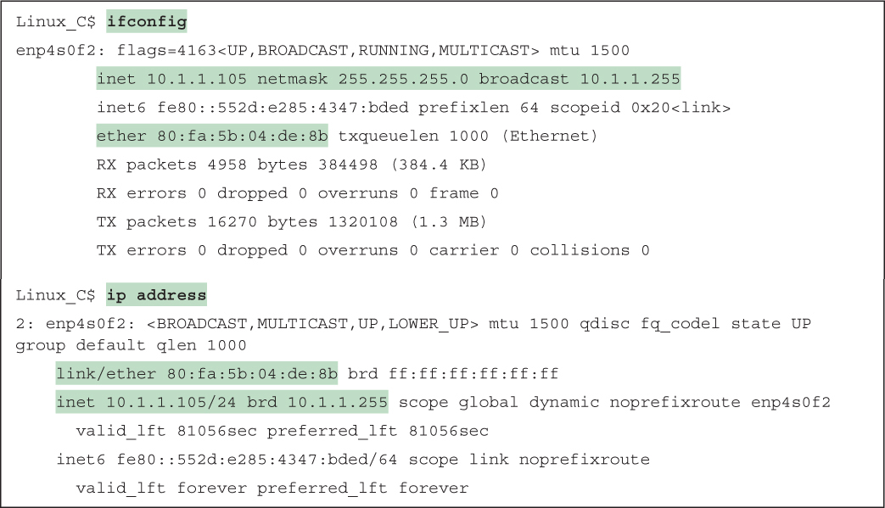](vol1_ch19.md#f0505-01a)

[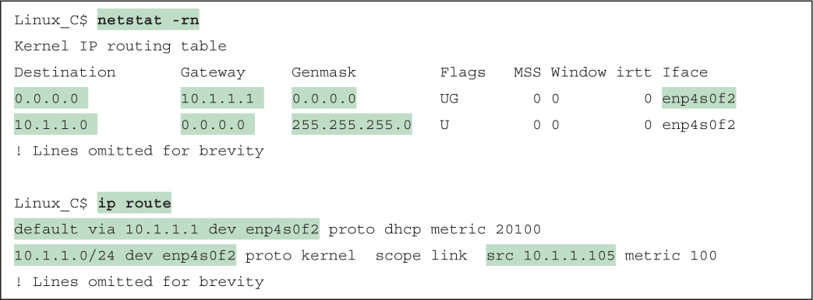](vol1_ch19.md#f0506-01a)

[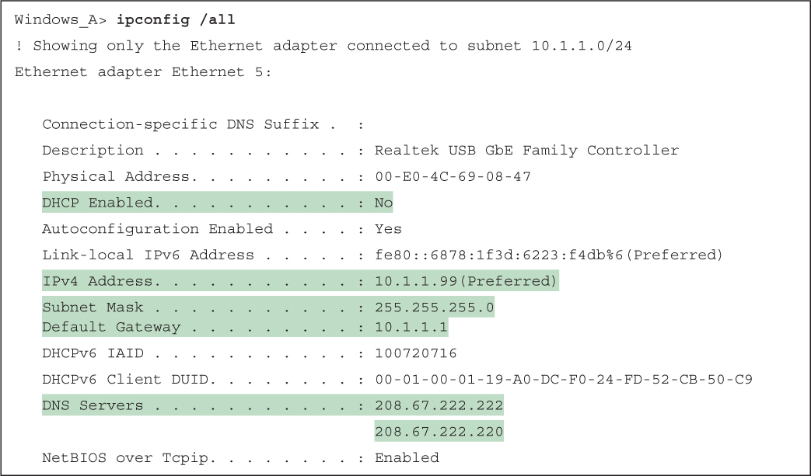](vol1_ch19.md#f0507-01a)

[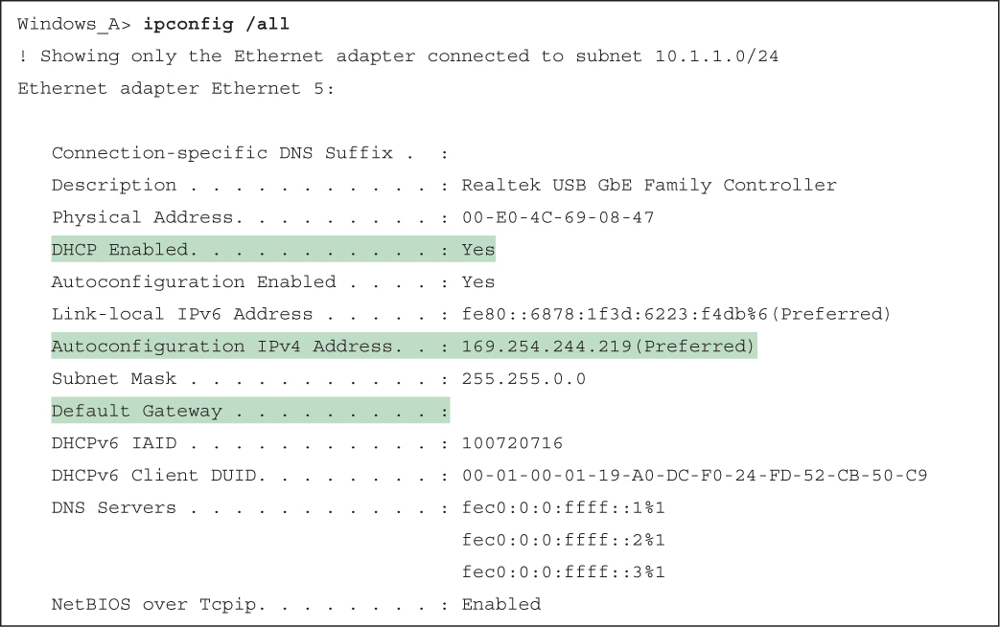](vol1_ch19.md#f0508-01a)

[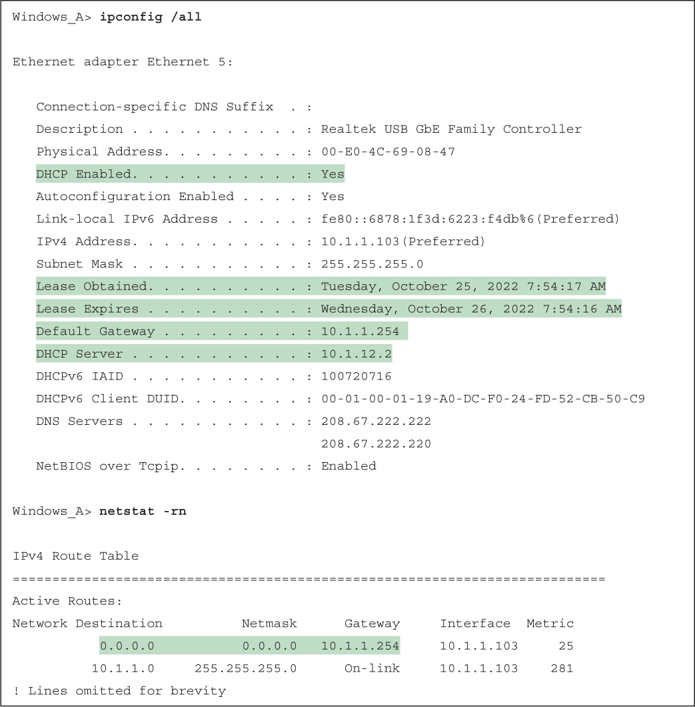](vol1_ch19.md#f0509-01a)