# Chapter 20


## Troubleshooting IPv4 Routing

This chapter covers the following exam topics:

2.0 Network Access

2.8 Describe network device management access (Telnet, SSH, HTTP, HTTPS, console, TACACS+/RADIUS, and cloud managed)

3.0 IP Connectivity

3.3 Configure and verify IPv4 and IPv6 static routing

3.3.a Default route

3.3.b Network route

3.3.c Host route

3.3.d Floating static

This chapter turns our attention to routing from end-to-end across an entire enterprise network. How do you troubleshoot an IPv4 network? How do you verify correct operation, identify root causes, and fix those for various IP routing features? How do you do that in the presence of an IP addressing and subnetting plan, requiring you to apply all that subnetting math from [Part IV](vol1_part04.md#part04) of this book and the basic address/mask and static route configuration from the other chapters here in [Part V](vol1_part05.md#part05)? This chapter answers some of those questions.

In particular, this chapter focuses on two tools and how to use them: *ping* and *traceroute*. Both tools test the IPv4 data plane; that is, the ability of each networking device to route or forward IPv4 packets. This chapter devotes a major section each to **ping** and **traceroute**. The chapter then ends with a short discussion of two other router tools that can also be useful for troubleshooting: Telnet and Secure Shell (SSH).

### "Do I Know This Already?" Quiz

I put DIKTA quizzes in most of the chapters as a tool to help you decide how to approach reading a chapter. However, this chapter does not have a DIKTA quiz because I think you should read it regardless of your prior knowledge. As with all chapters in this book, this chapter introduces new concepts, but it also acts as a tool to review and deepen your understanding of IP routing. Hope you enjoy the perspectives on using **ping** and **traceroute** in this chapter.

### Foundation Topics

### Problem Isolation Using the ping Command

Someone sends you an email or text, or a phone message, asking you to look into a user's network problem. You Secure Shell (SSH) to a router and issue a **ping** command that works. What does that result rule out as a possible reason for the problem? What does it rule in as still being a possible root cause?

Then you issue another **ping** to another address, and this time the ping fails. Again, what does the failure of that **ping** command tell you? What parts of IPv4 routing may still be a problem, and what parts do you now know are not a problem?

The **ping** command gives us one of the most common network troubleshooting tools. When the **ping** command succeeds, it confirms many individual parts of how IP routing works, ruling out some possible causes of the current problem. When a **ping** command fails, it often helps narrow down where in the internetwork the root cause of the problem may be happening, further isolating the problem.

This section begins with a brief explanation of how ping works. It then moves on to some suggestions and analysis of how to use the **ping** command to isolate problems by removing some items from consideration.

#### Ping Command Basics

The **ping** command tests connectivity by sending packets to an IP address, expecting the device at that address to send packets back. The command sends packets that mean "if you receive this packet, and it is addressed to you, send a reply back." Each time the **ping** command sends one of these packets and receives the message sent back by the other host, the **ping** command knows a packet made it from the source host to the destination and back.

More formally, the **ping** command uses the Internet Control Message Protocol (ICMP), specifically the [ICMP echo request](vol1_gloss.md#gloss_181) and [ICMP echo reply](vol1_gloss.md#gloss_180) messages. ICMP defines many other messages as well, but these two messages were made specifically for connectivity testing by commands like **ping**. As a protocol, ICMP does not rely on TCP or UDP, and it does not use any application layer protocol. It functions as part of Layer 3, as a control protocol to assist IP by helping manage the IP network functions.

[Figure 20-1](vol1_ch20.md#ch20fig01) shows the ICMP messages, with IP headers, in an example. In this case, the user at host A opens a command prompt and issues the **ping 172.16.2.101** command, testing connectivity to host B. The command sends one echo request and waits (Step 1); host B receives the messages and sends back an echo reply (Step 2).

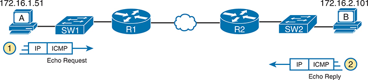


**Figure 20-1** *Concept Behind **ping 172.16.2.101** on Host A*

The schematic shows Host A with an I P address of 172.16.1.51 sending an Internet Control Message Protocol (I C M P) echo request. This request travels through a switch labeled SW1 and a router labeled R1, then reaches another router labeled R2 and a switch labeled SW2, before finally reaching Host B, which has an IP address of 172.16.2.101. Host B responds by sending an I C M P echo reply back through the same path. The flow of data is indicated by arrows, with the request and reply labeled accordingly.

The **ping** command is supported on many different devices and many common operating systems. The command has many options: the name or IP address of the destination, how many times the command should send an echo request, how long the command should wait (timeout) for an echo reply, how big to make the packets, and many other options. [Example 20-1](vol1_ch20.md#exa20_1) shows a sample from host A, with the same command that matches the concept in [Figure 20-1](vol1_ch20.md#ch20fig01): a **ping 172.16.2.101** command on host A.

**Example 20-1** *Sample Output from Host A's **ping 172.16.2.101** Command*

[Click here to view code image](vol1_ch20_images.md#f0514-01)

```
Mac_A$ ping 172.16.2.101
PING 172.16.2.101 (172.16.2.101): 56 data bytes
64 bytes from 172.16.2.101: icmp_seq=0 ttl=64 time=1.112 ms
64 bytes from 172.16.2.101: icmp_seq=1 ttl=64 time=0.673 ms
64 bytes from 172.16.2.101: icmp_seq=2 ttl=64 time=0.631 ms
64 bytes from 172.16.2.101: icmp_seq=3 ttl=64 time=0.674 ms
64 bytes from 172.16.2.101: icmp_seq=4 ttl=64 time=0.642 ms
64 bytes from 172.16.2.101: icmp_seq=5 ttl=64 time=0.656 ms
^C
--- 172.16.2.101 ping statistics ---
6 packets transmitted, 6 packets received, 0.0% packet loss
round-trip min/avg/max/stddev = 0.631/0.731/1.112/0.171 ms
```

#### Strategies and Results When Testing with the ping Command

Often, the person handling initial calls from users about problems (often called a customer support rep, or CSR) cannot issue **ping** commands from the user's device. In some cases, talking users through typing the right commands and making the right clicks on their machines can be a problem. Or the user just might not be available. As an alternative, using different **ping** commands from different routers can help isolate the problem.

The problem with using **ping** commands from routers, instead of from the host that has the problem, is that no single router **ping** command can exactly replicate a **ping** command done from the user's device. However, each different **ping** command can help isolate a problem further. The rest of this section of **ping** commands discusses troubleshooting IPv4 routing by using various **ping** commands from the command-line interface (CLI) of a router.

##### Testing Longer Routes from Near the Source of the Problem

Most problems begin with some idea like "host X cannot communicate with host Y." A great first troubleshooting step is to issue a **ping** command from X for host Y's IP address. However, assuming the engineer does not have access to host X, the engineer can instead issue the **ping** from the router nearest X, typically the router acting as host X's default gateway.

For instance, in [Figure 20-1](vol1_ch20.md#ch20fig01), imagine that the user of host A had called IT support with a problem related to sending packets to host B. A **ping 172.16.2.101** command on host A would be a great first troubleshooting step, but the CSR cannot access host A or get in touch with the user of host A. So, the CSR telnets to Router R1 and pings host B from there, as shown in [Example 20-2](vol1_ch20.md#exa20_2).

**Example 20-2** *Router R2 Pings Host B (Two Commands)*

[Click here to view code image](vol1_ch20_images.md#f0515-01)

```
R1# ping 172.16.2.101
Type escape sequence to abort.
Sending 5, 100-byte ICMP Echos to 172.16.2.101, timeout is 2 seconds:
.!!!!
Success rate is 80 percent (4/5), round-trip min/avg/max = 1/2/4 ms
R1# ping 172.16.2.101
Type escape sequence to abort.
Sending 5, 100-byte ICMP Echos to 172.16.2.101, timeout is 2 seconds:
!!!!!
Success rate is 100 percent (5/5), round-trip min/avg/max = 1/2/4 ms
```

First, take a moment to review the output of the first IOS **ping** command. By default, the Cisco IOS **ping** command sends five echo messages, with a timeout of 2 seconds. If the command does not receive an echo reply within 2 seconds, the command considers that message to be a failure, and the command lists a period. If a successful reply is received within 2 seconds, the command displays an exclamation point. So, in this first command, the first echo reply timed out, whereas the other four received a matching echo reply within 2 seconds.

As a quick aside, the example shows a common and normal behavior with **ping** commands: the first **ping** command shows one failure to start, but then the rest of the messages work. This usually happens because some device in the end-to-end route is missing an ARP table entry.

Now think about troubleshooting and what a working **ping** command tells us about the current behavior of this internetwork. First, focus on the big picture for a moment:

* R1 can send ICMP echo request messages to host B (172.16.2.101).
* R1 sends these messages from its outgoing interface's IP address (by default), 172.16.4.1 in this case.
* Host B can send ICMP echo reply messages to R1's 172.16.4.1 IP address (hosts send echo reply messages to the IP address from which the echo request was received).

[Figure 20-2](vol1_ch20.md#ch20fig02) shows the packet flow.

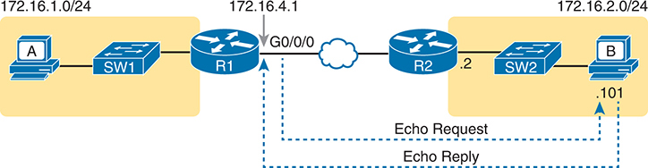


**Figure 20-2** *Standard **ping 172.6.2.101** Command Using the Source Interface IP Address*

The schematic shows a host A with an IP address of 172.16.1.0/24 connected to a switch (SW1). This switch is connected to a router (R1) with an IP address of 172.16.4.1. On the other side, a host B with an IP address of 172.16.2.101 is connected to another switch (SW2). This switch is linked to another router (R2). The router R1 interface G0/0/0 is connected to R2 through Ethernet W A N. The schematic shows an echo request from Router R1 to host B and an echo reply towards R1 from host B.

Next, think about IPv4 routing. In the forward direction, R1 must have a route that matches host B's address (172.16.2.101); this route will be either a static route or one learned with a routing protocol. R2 also needs a route for host B's address, in this case a connected route to B's subnet (172.16.2.0/24), as shown in the top arrow lines in [Figure 20-3](vol1_ch20.md#ch20fig03).

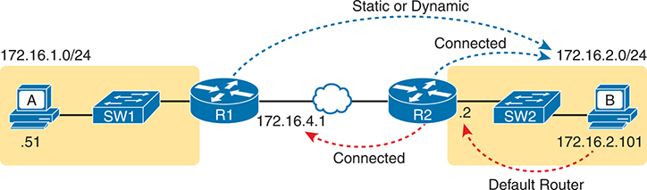


**Figure 20-3** *Layer 3 Routes Needed for R1's **ping 172.16.2.101** to Work*

The schematic shows two hosts, labeled A and B, connected to their respective switches, SW1 and SW2. Host A, with an IP address of 172.16.0.51/24, is connected to Router R1 through SW1. Similarly, host B with an IP address of 172.16.2.101/24 is connected to Router R2 through SW2. Routers R1 and R2 are interconnected via an Ethernet W A N, with IP addresses 172.16.4.1 and 172.16.4.2 respectively. The schematic indicates three types of connections: "Connected" for the direct links between R1 to R2 and R2 to host B; "Static or Dynamic" for the route from R1 to host B; and "Default Router" for a direct route from R2 to host B.

The arrow lines on the bottom of [Figure 20-3](vol1_ch20.md#ch20fig03) show the routes needed to forward the ICMP echo reply message back to Router R1's 172.16.4.1 interface. First, host B must have a valid default router setting because 172.16.4.1 sits in a different subnet than host B. R2 must also have a route that matches destination 172.16.4.1 (in this case, likely to be a connected route).

The working **ping** commands in [Example 20-2](vol1_ch20.md#exa20_2) also require the data-link and physical layer details to be working. The WAN link must be working: The router interfaces must be up/up, which typically indicates that the link can pass data. On the LAN, R2's LAN interface must be in an up/up state. In addition, everything discussed about Ethernet LANs must be working because the **ping** confirmed that the packets went all the way from R1 to host B and back. In particular

* The switch interfaces in use are in a connected (up/up) state.
* Port security (discussed in the *CCNA 200-301 Official Cert Guide, Volume 2*, Second Edition) does not filter frames sent by R2 or host B.
* STP has placed the right ports into a forwarding state.

The **ping 172.16.2.101** command in [Example 20-2](vol1_ch20.md#exa20_2) also confirms that IP access control lists (ACLs) did not filter the ICMP messages. One ACL contains a set of matching rules and actions: some matched packets are filtered (discarded), while others can continue on their path as normal. ACLs can examine packets as they enter or exit a router interface, so [Figure 20-4](vol1_ch20.md#ch20fig04) shows the various locations on routers R1 and R2 where an ACL could have filtered (discarded) the ICMP messages. (Note that an outbound ACL on Router R1 would not filter packets created on R1, so there is no rightward-facing arrow over R1.)

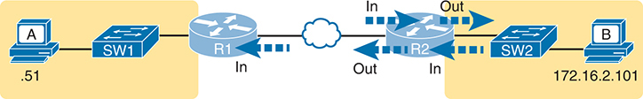


**Figure 20-4** *Locations Where IP ACLs Could Have Filtered the Ping Messages*

The schematic shows two hosts, labeled A and B, connected to their respective switches, SW1 and SW2. Host A, marked with an IP address ending in .51, is connected to SW1, which is linked to Router R1. Router R1 has incoming and outgoing data flows represented by arrows labeled In and Out respectively. The Router R1 is connected to Router R2 through Ethernet W A N. Router R2 also has incoming and outgoing data flows before connecting to SW2. Host B marked with an IP address of 172.16.2.101 is connected to SW2.

Finally, the working **ping 172.16.2.101** command on R1 can also be used to reasonably predict that ARP worked and that switch SW2 learned MAC addresses for its MAC address table. R2 and host B need to know each other's MAC addresses so that they can encapsulate the IP packet inside an Ethernet frame, which means both must have a matching ARP table entry. The switch learns the MAC address used by R2 and by host B when it sends the ARP messages or when it sends the frames that hold the IP packets. [Figure 20-5](vol1_ch20.md#ch20fig05) shows the type of information expected in those tables.


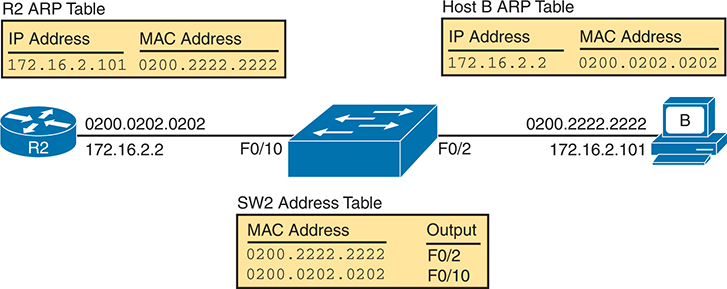


**Figure 20-5** *Router and Host ARP Tables, with the Switch MAC Address Table*

The router, labeled as R2, has an IP address of 172.16.2.2 associated with the M A C address 0200.0202.0202. The R2 A R P table contains entries: I P address 172.16.2.101 with M A C Address 0200.2222.2222. The host B has the I P address of 172.16.2.101 linked to the M A C address 0200.2222.2222. The host B A R P table contains entries: IP address 172.16.2.2 with M A C Address 0200.0202.0202. The switch SW2, has a M A C address table showing two entries: one for the M A C address 0200.2222.2222 with output F0/10, and another for the MAC address 0200.0202.0202 with output F0/10.

As you can see from the last few pages, a strategy of using a **ping** command from near the source of the problem can rule out a lot of possible root causes of any problems between two hosts--assuming the **ping** command succeeds. However, this **ping** command does not act exactly like the same **ping** command on the actual host. To overcome some of what is missing in the **ping** command from a nearby router, the next several examples show some strategies for testing other parts of the path between the two hosts that might have a current problem.

##### Using Extended Ping to Test the Reverse Route

Pinging from the default router, as discussed in the past few pages, misses an opportunity to test IP routes more fully. Such tests check the [forward route](vol1_gloss.md#gloss_150), that is, the route toward the destination. However, a ping from the default route does not test the [reverse route](vol1_gloss.md#gloss_332) back toward the original host.

For instance, referring to the internetwork in [Figure 20-2](vol1_ch20.md#ch20fig02) again, note that the reverse routes do not point to an address in host A's subnet. When R1 processes the **ping 172.16.2.101** command, R1 has to pick a source IP address to use for the echo request, and routers choose the *IP address of the outgoing interface*. The echo request from R1 to host B flows with source IP address 172.16.4.1 (R1's G0/0/0 IP address). The echo reply flows back to that same address (172.16.4.1).

A standard ping often does not test the reverse route that you need to test. In this case, the standard **ping 172.16.2.101** command on R1 does not test whether the routers can route back to subnet 172.16.1.0/24, instead testing their routes for subnet 172.16.4.0. A better ping test would test the route back to host A's subnet; an *extended ping* from R1 can cause that test to happen. An extended ping allows R1's **ping** command to use R1's LAN IP address from within subnet 172.16.1.0/24. Then, the echo reply messages would flow to host A's subnet, as shown in [Figure 20-6](vol1_ch20.md#ch20fig06).


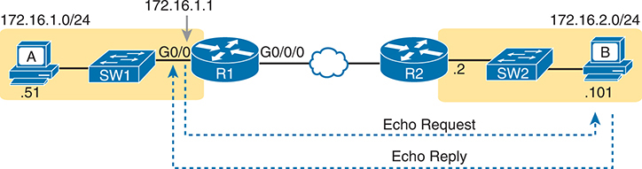


**Figure 20-6** *Extended Ping Command Tests the Route to 172.16.1.51 (Host A)*

On the left, host A with an IP address of 172.16.1.0/24 and .51 underneath it is connected to a switch, SW1. The switch is connected to a router, R1 via interface G0/0, which has an IP address of 172.16.1.1. Router R1 is connected to another router, R2, via port G0/0/0 and Ethernet WAN. R2 is connected to SW2, which is connected to host B with the IP address of 172.16.2.0/24 and .101 underneath it. The schematic includes arrows indicating the data flow for 'Echo Request' from R1 to host B and 'Echo Reply', from host B to R 1, demonstrating the process of sending and receiving pings during the test.

The extended **ping** command does allow the user to type all the parameters on a potentially long command, but it also allows users to simply issue the **ping** command, press Enter, with IOS then asking the user to answer questions to complete the command, as shown in [Example 20-3](vol1_ch20.md#exa20_3). The example shows the **ping** command on R1 that matches the logic in [Figure 20-6](vol1_ch20.md#ch20fig06). This same command could have been issued from the command line as **ping 172.16.2.101 source 172.16.1.1**.

**Example 20-3** *Testing the Reverse Route Using the Extended Ping*

[Click here to view code image](vol1_ch20_images.md#f0518-01)

```
R1# ping
Protocol [ip]:
Target IP address: 172.16.2.101
Repeat count [5]:
Datagram size [100]:
Timeout in seconds [2]:
Extended commands [n]: y
Source address or interface: 172.16.1.1
Type of service [0]:
Set DF bit in IP header? [no]:
Validate reply data? [no]:
Data pattern [0xABCD]:
Loose, Strict, Record, Timestamp, Verbose[none]:
Sweep range of sizes [n]:
Type escape sequence to abort.
Sending 5, 100-byte ICMP Echos to 172.16.2.101, timeout is 2 seconds:
Packet sent with a source address of 172.16.1.1
!!!!!
Success rate is 100 percent (5/5), round-trip min/avg/max = 1/2/4 ms
```

This particular extended **ping** command tests the same routes for the echo request going to the right, but it forces a better test of routes pointing back to the left for the ICMP echo reply. For that direction, R2 needs a route that matches address 172.16.1.1, which is likely to be a route for subnet 172.16.1.0/24--the same subnet in which host A resides.

From a troubleshooting perspective, using both standard and extended **ping** commands can be useful. However, neither can exactly mimic a **ping** command created on the host itself because the routers cannot send packets with the host's IP address. For instance, the extended **ping** in [Example 20-3](vol1_ch20.md#exa20_3) uses source IP address 172.16.1.1, which is not host A's IP address. As a result, neither the standard nor extended **ping** commands in these two examples so far in this chapter can test for some kinds of problems, such as the following:

* IP ACLs that discard packets based on host A's IP address but allow packets that match the router's IP address
* LAN switch port security that filters A's frames (based on A's MAC address)
* IP routes on routers that happen to match host A's 172.16.1.51 address, with different routes that match R1's 172.16.1.1 address
* Problems with host A's default router setting

Note

IP ACLs and LAN switch port security are covered in the *CCNA 200-301 Official Cert Guide, Volume 2*, Second Edition. For now, know that IP ACLs can filter packets on routers, focusing on the Layer 3 and 4 headers. Port security can be enabled on Layer 2 switches to filter based on source MAC addresses.

##### Testing LAN Neighbors with Standard Ping

Testing using a **ping** of another device on the LAN can quickly confirm whether the LAN can pass packets and frames. Specifically, a working **ping** rules out many possible root causes of a problem. For instance, [Figure 20-7](vol1_ch20.md#ch20fig07) shows the ICMP messages that occur if R1 issues the command **ping 172.16.1.51**, pinging host A, which sits on the same VLAN as R1.


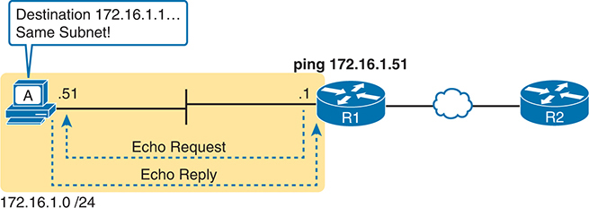


**Figure 20-7** *Standard **ping** Command Confirms That the LAN Works*

Host A with an IP address of 172.16.1.51 on subnet 172.16.1.0/24 sends an echo reply to a router R1 with an IP address of .1, upon sending the echo request. The destination is confirmed to be on the same subnet as indicated at the top of the host. Router R1 sends a ping to 172.16.1.51. An echo reply confirms that the Local Area Network (L A N) is operational.

If the ping works, it confirms the following, which rules out some potential issues:

* The host with address 172.16.1.51 replied.
* The LAN can pass unicast frames from R1 to host 172.16.1.51 and vice versa.
* You can reasonably assume that the switches learned the MAC addresses of the router and the host, adding those to the MAC address tables.
* Host A and Router R1 completed the ARP process and list each other in their respective Address Resolution Protocol (ARP) tables.

The failure of a ping, even with two devices on the same subnet, can point to a variety of problems, like those mentioned in this list. For instance, if the **ping 172.16.1.51** on R1 fails (refer to [Figure 20-7](vol1_ch20.md#ch20fig07)), that result points to this list of potential root causes:


* **IP addressing problem:** Host A or the router could be configured with the wrong IP address.
* **IP mask problem:** Using an incorrect subnet mask on either the host or the router would change their calculation view of the range of addresses in the attached subnet, which would affect their forwarding logic. For example, the host, with address 172.16.1.51 but incorrect mask 255.255.255.240, would think that the router's address of 172.16.1.1 is in a different subnet.
* **DHCP problems:** If you are using Dynamic Host Configuration Protocol (DHCP), many problems could exist. [Chapter 19](vol1_ch19.md#ch19), "[IP Addressing on Hosts](vol1_ch19.md#ch19)," discusses those possibilities in some depth.
* **VLAN trunking problems:** The router could be configured for 802.1Q trunking, when the switch is not (or vice versa).
* **LAN problems:** A wide variety of issues could exist with the Layer 2 switches, preventing any frames from flowing between host A and the router.

So, whether the ping works or fails, simply pinging a LAN host from a router can help further isolate the problem.

##### Testing LAN Neighbors with Extended Ping

A standard ping of a LAN host from a router does not test that host's default router setting. However, an extended ping can test the host's default router setting. Both tests can be useful, especially for problem isolation, because


* If a standard ping of a local LAN host works…
* But an extended ping of the same LAN host fails…
* The problem likely relates somehow to the host's default router setting.

First, to understand why the standard and extended ping results have different effects, consider first the standard **ping 172.16.1.51** command on R1, as shown previously in [Figure 20-7](vol1_ch20.md#ch20fig07). As a standard **ping** command, R1 used its LAN interface IP address (172.16.1.1) as the source of the ICMP Echo. So, when the host (A) sent back its ICMP echo reply, host A considered the destination of 172.16.1.1 as being on the same subnet. Host A's ICMP echo reply message, sent back to 172.16.1.1, would work even if host A did not have a default router setting at all!

In comparison, [Figure 20-8](vol1_ch20.md#ch20fig08) shows the difference when using an extended ping on Router R1. An extended ping from local Router R1, using R1's WAN IP address of 172.16.4.1 as the source of the ICMP echo request, means that host A's ICMP echo reply will flow to an address in another subnet, which makes host A use its default router setting.


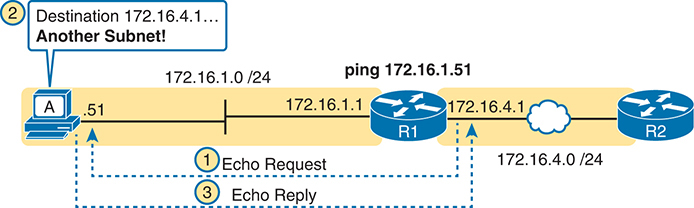


**Figure 20-8** *Extended **ping** Command Does Test Host A's Default Router Setting*

A network setup of host A with an IP address of .51 on subnet 172.16.1.0/24 sends an echo reply to a router labeled 'R1' with an IP address of 172.16.1.1 upon receiving the request from it. Router R1 then attempts to ping another router, labeled R2, with an IP address of 172.16.4.1 located in another subnet. Both routers are connected through Ethernet WAN (172.16.1/24 and 172.16.4/24). The process involves three steps: Echo Request from R1 to host A, pinging from R1 to R2 at IP address 172.16.4. and Echo Reply back to R1.

The comparison between the previous two figures shows one of the most classic mistakes when troubleshooting networks. Sometimes, the temptation is to connect to a router and ping the host on the attached LAN, and it works. So, the engineer moves on, thinking that the network layer issues between the router and host work fine, when the problem still exists with the host's default router setting.

##### Testing WAN Neighbors with Standard Ping

As with a standard ping test across a LAN, a standard ping test between routers over a serial or Ethernet WAN link tests whether the link can pass IPv4 packets. With a properly designed IPv4 addressing plan, two routers on the same serial or Ethernet WAN link should have IP addresses in the same subnet. A ping from one router to the IP address of the other router confirms that an IP packet can be sent over the link and back, as shown in the **ping 172.16.4.2** command on R1 in [Figure 20-9](vol1_ch20.md#ch20fig09).

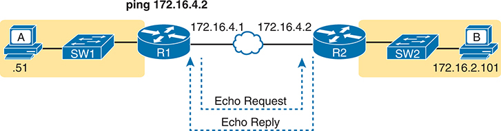


**Figure 20-9** *Pinging Across a WAN Link*

A network setup of host A with the last section of the IP address of .51 connected to SW 1, which is connected to router R1. R1 with an IP address of 172.16.4.1 sends an echo request to a router R2 with an IP address of 172.16.4.2. Router R1 then attempts to ping 172.16.4.2 subnet. Both routers are connected through Ethernet WAN. R2 is connected to host B with an IP address of 172.16.2.101.

A successful ping of the IP address on the other end of an Ethernet WAN link that sits between two routers confirms several specific facts, such as the following:

* Both routers' WAN interfaces are in an up/up state.
* The Layer 1 and 2 features of the link work.
* The routers believe that the neighboring router's IP address is in the same subnet.
* Inbound ACLs on both routers do not filter the incoming packets, respectively.
* The remote router is configured with the expected IP address (172.16.4.2 in this case).

Pinging the other neighboring router does not test many other features. However, although the test is limited in scope, it does let you rule out WAN links as having a Layer 1 or 2 problem, and it rules out some basic Layer 3 addressing problems.

#### Using Ping with Names and with IP Addresses

All the ping examples so far in this chapter show a ping of an IP address. However, the **ping** command can use [hostnames](vol1_gloss.md#gloss_175), and pinging a hostname allows the network engineer to further test whether the Domain Name System ([DNS](vol1_gloss.md#gloss_108)) process works.

First, most every TCP/IP application uses hostnames rather than IP addresses to identify the other device. No one opens a web browser and types in 72.163.4.185. Instead, they type in a web address, like <https://www.cisco.com>, which includes the hostname [www.cisco.com](http://www.cisco.com). Then, before a host can send data to a specific IP address, the host must first ask a DNS server to resolve that hostname into the matching IP address.

For example, in the small internetwork used for several examples in this chapter, a **ping B** command on host A tests A's DNS settings, as shown in [Figure 20-10](vol1_ch20.md#ch20fig10). When host A sees the use of a hostname (B), it first looks in its local DNS name cache to find out whether it has already resolved the name B. If not, host A first asks the DNS to supply (resolve) the name into its matching IP address (Step 1 in the figure). Only then does host A send a packet to 172.16.2.101, host B's IP address (Step 2).

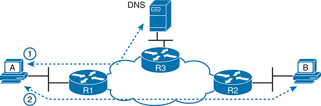


**Figure 20-10** *DNS Name Resolution by Host A*

Host A initiates the process, sending a query to Router R1. R1 then forwards the query to Router R3, which is connected to the DNS server. The DNS server processes the query and sends back the response to R3. R3 routes the response back through Router R1 before it reaches Host A. In the second step, host A sends a query to Router R1. R1 then forwards the query to Router R2, which is connected to the host B. Host B processes the query and sends back the response to Host A through R2 and R1.

When troubleshooting, testing from the host by pinging using a hostname can be very helpful. The command, of course, tests the host's own DNS client settings. For instance, a classic comparison is to first ping the destination host using the hostname, which requires a DNS request. Then, repeat the same test, but use the destination host's IP address instead of its name, which does not require the DNS request. If the ping of the hostname fails but the ping of the IP address works, the problem usually has something to do with DNS.

Routers and switches can also use name resolution for commands that refer to hosts, such as the **ping** and **traceroute** commands. The networking device can use DNS, locally defined hostnames, or both. [Example 20-4](vol1_ch20.md#exa20_4) shows an example DNS configuration on Router R1 from the most recent examples. In particular:


* The **ip domain lookup** command tells the router to attempt to use a DNS server.
* The **ip name-server** {*address* [*address address*]} command defines the list of DNS server IP addresses.
* The **ip domain name** *domain-name* command defines the domain used by the device.

In the example, note that once configured to use DNS, the **ping hostB** command works. The command output shows the IP address the DNS resolution process found for name hostB, 172.16.2.101.

**Example 20-4** *Configuring to Use DNS (Router R1), DNS Has hostB Name*

[Click here to view code image](vol1_ch20_images.md#f0523-01)

```
R1# configure terminal
Enter configuration commands, one per line.  End with CNTL/Z.
R1(config)# ip domain lookup
R1(config)# ip domain name example.com
R1(config)# ip name-server 8.8.8.8 8.8.8.4
R1(config)# ^Z
R1#
R1# ping hostB
Type escape sequence to abort.
Sending 5, 100-byte ICMP Echos to 172.16.2.101, timeout is 2 seconds:
!!!!!
Success rate is 100 percent (5/5), round-trip min/avg/max = 1/1/4 ms
```

Note

Older IOS versions used a syntax of **ip domain-name** *domain-name* rather than the newer **ip domain name** *domain-name* (with a space instead of a dash).

Note

When practicing, you might want to disable DNS resolution, particularly in lab devices, using the **no ip domain lookup** command. Cisco routers and switches enable DNS resolution by default with a setting of **ip domain lookup**, but with no name servers identified with the **ip name-server** command. The result of these two default settings causes the router or switch to perform name resolution on a name by broadcasting for a DNS server on each connected subnet. Additionally, if you mistype the first word of a command, IOS thinks you mean that word to be a hostname, and it attempts to perform name resolution on the mistyped command. The result: for any typo of the first word in a command, the default name resolution settings cause a few minutes wait until you get control of the CLI again.

In a lab environment, when not expecting to use DNS, disable DNS resolution with the **no ip domain lookup** command.

You can also configure the router or switch to use locally configured hostnames (or to use both locally configured names and DNS). Use a configuration like that in [Example 20-5](vol1_ch20.md#exa20_5), adding the **ip host** *name address* global configuration command for each hostname. The router or switch will look for local hostnames whether you use DNS or have the **ip domain lookup** command configured.

**Example 20-5** *Configuring to Use Local Hostnames, R1 Config Has hostB Name*

[Click here to view code image](vol1_ch20_images.md#f0523-02)

```
R1# configure terminal
Enter configuration commands, one per line.  End with CNTL/Z.
R1(config)# ip host hostB 172.16.2.101
R1(config)# ^Z
R1#
R1# show hosts
Default domain is example.com
Name servers are 8.8.8.8, 8.8.8.4
NAME  TTL  CLASS   TYPE      DATA/ADDRESS
-----------------------------------------
 101.2.16.172.in-addr.arpa        10       IN       PTR     hostB
 hostB                            10       IN       A       172.16.2.101
```

### Problem Isolation Using the traceroute Command

Like **ping**, the **traceroute** command helps network engineers isolate problems. Here is a comparison of the two:


* Both send messages in the network to test connectivity.
* Both rely on other devices to send back a reply.
* Both have wide support on many different operating systems.
* Both can use a hostname or an IP address to identify the destination.
* On routers, both have a standard and extended version, allowing better testing of the reverse route.

The biggest differences relate to the more detailed results in the output of the **traceroute** command and the extra time and effort it takes **traceroute** to build that output. This next major section examines how traceroute works; plus it provides some suggestions on how to use this more detailed information to more quickly isolate IP routing problems.

#### traceroute Basics

Imagine some network engineer or CSR starts to troubleshoot some problem. The engineer pings from the user's host, pings from a nearby router, and after a few commands, convinces herself that the host can indeed send and receive IP packets. The problem might not be solved yet, but the problem does not appear to be a network problem.

Now imagine the next problem comes along, and this time the **ping** command fails. It appears that some problem does exist in the IP network. Where is the problem? Where should the engineer look more closely? Although the **ping** command can prove helpful in isolating the source of the problem, the **traceroute** command may be a better option. The **traceroute** command systematically helps pinpoint routing problems by showing how far a packet goes through an IP network before being discarded.

The **traceroute** command identifies the routers in the forward route from source host to destination host. Specifically, it lists the next-hop IP address of each router that would be in each of the individual routes. For instance, a **traceroute 172.16.2.101** command on host A in [Figure 20-11](vol1_ch20.md#ch20fig11) would identify an IP address on Router R1, another on Router R2, and then host B, as shown in the figure. [Example 20-6](vol1_ch20.md#exa20_6), which follows, lists the output of the command, taken from host A.


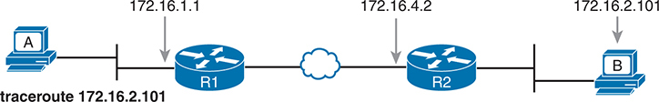


**Figure 20-11** *IP Addresses Identified by a Successful **traceroute 172.16.2.101** Command*

Host A initiates the traceroute command, which passes through two routers, R1 and R2, with IP addresses 172.16.1.1 and 172.16.4.2 respectively. The two routers are connected through Ethernet W A N. The traceroute command ends at a host B with the IP address 172.16.2.101, which is the destination of the traceroute.

**Example 20-6** *Output from **traceroute 172.16.2.101** on Host A*

[Click here to view code image](vol1_ch20_images.md#f0525-01)

```
Mac_A$ traceroute 172.16.2.101
traceroute to 172.16.2.101, 64 hops max, 52 byte packets
  1 172.16.1.1 (172.16.1.1) 0.870 ms 0.520 ms 0.496 ms
  2 172.16.4.2 (172.16.4.2) 8.263 ms 7.518 ms 9.319 ms
  3 172.16.2.101 (172.16.2.101) 16.770 ms 9.819 ms 9.830 ms
```

##### How the traceroute Command Works

The **traceroute** command gathers information by generating packets that trigger error messages from routers; these messages identify the routers, letting the **traceroute** command list the routers' IP addresses in the output of the command. That error message is the ICMP Time-to-Live Exceeded (TTL Exceeded) message, originally meant to notify hosts when a packet had been looping around a network.

Ignoring traceroute for a moment and instead focusing on IP routing, IPv4 routers defeat routing loops in part by discarding looping IP packets. To do so, the IPv4 header holds a field called Time To Live (TTL). The original host that creates the packet sets an initial TTL value. Then each router that forwards the packet decrements the TTL value by 1. When a router decrements the TTL to 0, the router perceives the packet is looping, and the router discards the packet. The router also notifies the host that sent the discarded packet by sending an ICMP TTL Exceeded message.

Now back to traceroute. Traceroute sends messages with low TTL values to make the routers send back a TTL Exceeded message. Specifically, a **traceroute** command begins by sending several packets (usually three), each with the header TTL field equal to 1. When that packet arrives at the next router--host A's default Router R1 in the example of [Figure 20-12](vol1_ch20.md#ch20fig12)--the router decrements TTL to 0 and discards the packet. The router then sends host A the TTL Exceeded message, which identifies the router's IP address to the **traceroute** command.

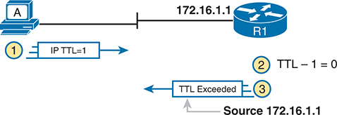


**Figure 20-12** *How **traceroute** Identifies the First Router in the Route*

Host A sending an IP packet with a TTL value of 1 to a router R1 with an IP address of 172.16.1.1. Upon receiving the packet, R1 decreases the TTL value by 1, resulting in a TTL of 0. Consequently, R1 sends a "TTL Exceeded" message back to host A from source 172.16.1.1.

The **traceroute** command sends several TTL=1 packets, checking them to see whether the TTL Exceeded messages flow from the same router, based on the source IP address of the TTL Exceeded message. Assuming the messages come from the same router, the **traceroute** command lists that IP address as the next line of output on the command.

To find all the routers in the path, and finally confirm that packets flow all the way to the destination host, the **traceroute** command sends a small set of packets with TTL=1, then a small set with TTL=2, then 3, 4, and so on, until the destination host replies. [Figure 20-13](vol1_ch20.md#ch20fig13) shows the packet from the second set with TTL=2. In this case, one router (R1) actually forwards the packet, while another router (R2) happens to decrement the TTL to 0, causing a TTL Exceeded message to be sent back to host A.

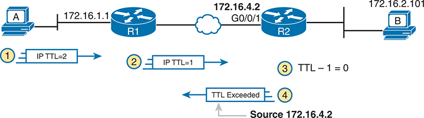


**Figure 20-13** *TTL=2 Message Sent by **traceroute***

Host A with an IP address of 172.16.1.1 sending an IP packet with a T T L value of 2. The packet first reaches a router R1, where the T T L value is decremented to 1. The packet then proceeds to a second router R2 with an interface labeled G0/0/1 and an IP address of 172.16.4.2. Here, the T T L value is further decremented, reaching 0. R2 sends a "T T L Exceeded" message back to the source, host A. R2 is connected to host B with the IP address 172.16.2.101.

The figure shows these four steps:

1. The **traceroute** command sends a packet from the second set with TTL=2.
2. Router R1 processes the packet and decrements TTL to 1. R1 forwards the packet.
3. Router R2 processes the packet and decrements TTL to 0. R2 discards the packet.
4. R2 notifies the sending host of the discarded packet by sending a TTL Exceeded ICMP message. The source IP address of that message is 172.16.4.2.

Finally, the choice of source IP address to use on the time-exceeded message returned by routers has a big impact on the output of the **traceroute** command. Most routers use simpler logic that also makes command output like **traceroute** more consistent and meaningful. That logic: choose the TTL Exceeded message's source IP address based on the interface in which the discarded original message arrived. In the example in [Figure 20-13](vol1_ch20.md#ch20fig13), the original message at Step 2 arrived on R2's G0/0/1 interface, so at Step 3, R2 uses G0/0/1's IP address as the source IP address of the TTL Exceeded message, and as the interface out which to send the message.

##### Standard and Extended traceroute

The standard and extended options for the **traceroute** command give you many of the same options as the **ping** command. For instance, [Example 20-7](vol1_ch20.md#exa20_7) lists the output of a standard **traceroute** command on Router R1. Like the standard **ping** command, a standard **traceroute** command chooses an IP address based on the outgoing interface for the packet sent by the command. So, in this example, the packets sent by R1 come from source IP address 172.16.4.1, R1's G0/0/0 IP address.

**Example 20-7** *Standard **traceroute** Command on R1*

[Click here to view code image](vol1_ch20_images.md#f0527-01)

```
R1# traceroute 172.16.2.101
Type escape sequence to abort.
Tracing the route to 172.16.2.101
VRF info: (vrf in name/id, vrf out name/id)
   1 172.16.4.2 0 msec 0 msec 0 msec
   2 172.16.2.101 0 msec 0 msec *
```

The extended **traceroute** command, as shown in [Example 20-8](vol1_ch20.md#exa20_8), follows the same basic command structure as the extended **ping** command. The user can type all the parameters on one command line, but it is much easier to just type **traceroute**, press Enter, and let IOS prompt for all the parameters, including the source IP address of the packets (172.16.1.1 in this example).

**Example 20-8** *Extended **traceroute** Command on R1*

[Click here to view code image](vol1_ch20_images.md#f0527-02)

```
R1# traceroute
Protocol [ip]:
Target IP address: 172.16.2.101
Source address: 172.16.1.1
Numeric display [n]:
Timeout in seconds [3]:
Probe count [3]:
Minimum Time to Live [1]:
Maximum Time to Live [30]:
Port Number [33434]:
Loose, Strict, Record, Timestamp, Verbose[none]:
Type escape sequence to abort.
Tracing the route to 172.16.2.101
VRF info: (vrf in name/id, vrf out name/id)
   1 172.16.4.2 0 msec 0 msec 0 msec
   2 172.16.2.101 0 msec 0 msec *
```

Both the **ping** and **traceroute** commands exist on most operating systems, including Cisco IOS. However, some operating systems use a slightly different syntax for **traceroute**. For example, most Windows operating systems support **tracert** and **pathping**, and not **traceroute**. Linux and OS X support the **traceroute** command.

Note

Host OS **traceroute** commands usually create ICMP echo requests. The Cisco IOS **traceroute** command instead creates IP packets with a UDP header. This bit of information may seem trivial at this point. However, note that an ACL may actually filter the traffic from a host's **traceroute** messages but not the router **traceroute** command, or vice versa.

### Telnet and SSH

The **ping** and **traceroute** commands do give networkers two great tools to begin isolating the cause of an IP routing problem. However, these two commands tell us nothing about the operation state inside the various network devices. Once you begin to get an idea of the kinds of problems and the possible locations of the problems using **ping** and **traceroute**, the next step is to look at the status of various router and switch features. One way to do that is to use Telnet or Secure Shell (SSH) to log in to the devices.

#### Common Reasons to Use the IOS Telnet and SSH Client

Normally, a network engineer would log in to the remote device using a Telnet or SSH client on a PC, tablet, or any other user device. In fact, often, the same software package does both Telnet and SSH. However, in some cases, you might want to take advantage of the Telnet and SSH client built in to IOS on the routers and switches to Telnet/SSH from one Cisco device to the next.

To understand why, consider the example shown in [Figure 20-14](vol1_ch20.md#ch20fig14). The figure shows arrowed lines to three separate IP addresses on three separate Cisco routers. PC1 has attempted to Telnet to each address from a different tab in PC1's Telnet/SSH client. However, R2 happens to have an error in its routing protocol configuration, so R1, R2, and R3 fail to learn any routes from each other. As a result, PC1's Telnet attempt to both 10.1.2.2 (R2) and 10.1.3.3 (R3) fails.

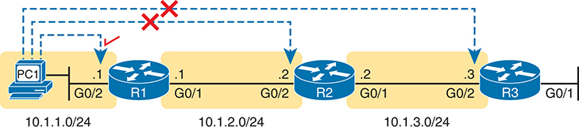


**Figure 20-14** *Telnet Works from PC1 to R1 but Not to R2 or R3*

A network scenario where a host "PC1" with an IP address of 10.1.1.0/24 is connected to a router "R1" via Telnet. However, the Telnet connection from R1 to another router "R2" with an IP address of 10.1.2.0/24 is marked with a cross, indicating a failed connection. The connection from "R2" to router "R3" with an IP address of 10.1.3.0/24 is also implied to be unsuccessful via a cross mark.

In some cases, like this one, a Telnet or SSH login from the network engineer's device can fail, while you could still find a way to log in using the **telnet** and **ssh** commands to use the Telnet and SSH clients on the routers or switches. With this particular scenario, all the individual data links work; the problem is with the routing protocol exchanging routes. PC1 can ping R1's 10.1.1.1 IP address, R1 can ping R2's 10.1.2.2 address, and R2 can ping R3's 10.1.3.3 address. Because each link works, and each router can send and receive packets with its neighbor on the shared data link, you could Telnet/SSH to each successive device.

[Figure 20-15](vol1_ch20.md#ch20fig15) shows the idea. PC1 begins with a Telnet/SSH connection into Router R1, as shown on the left. Then the user issues the **telnet 10.1.2.2** command from R1 to Telnet to R2. Once logged in to R2, the user can issue commands on R2. Then from R2, the user could issue the **telnet 10.1.3.3** command to Telnet to R3, from which the user could issue commands on R3.

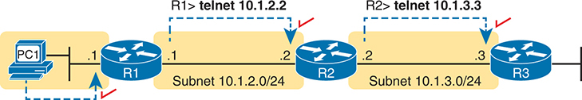


**Figure 20-15** *Successive Telnet Connections: PC1 to R1, R1 to R2, and R2 to R3*

On the left, the host PC1 initiates a Telnet connection to a router R1, indicated by an arrow. R1 has a Telnet connection of 10.1.2.2 with the subnet 10.1.2.0/24. From R1, another Telnet connection is established to a second router, R2, shown by an arrow. R2 has a Telnet connection of 10.1.3.3 and belongs to subnet 10.1.3.0/24. A third Telnet connection is made from R2 to router, R3, represented by an arrow. The entire process illustrates the concept of successive Telnet connections: PC1 to R1, R1 to R2, and R2 to R3.

The Telnet connections shown in [Figure 20-15](vol1_ch20.md#ch20fig15) work because each Telnet in this case uses source and destination addresses in the same subnet. For example, R1's **telnet 10.1.2.2** command uses 10.1.2.2 as the destination, of course. R1 uses the outgoing interface IP address used to send packets to 10.1.2.2, 10.1.2.1 in this case. Because each of these **telnet** commands connects to an IP address in a connected subnet, the routing protocol could be completely misconfigured, and you could still Telnet/SSH to each successive device to troubleshoot and fix the problem.

Network engineers also use the IOS Telnet and SSH client just for preference. For instance, if you need to log in to several Cisco devices, you could open several windows and tabs on your PC, and log in from your PC (assuming the network was not having problems). Or you could log in from your PC to some nearby Cisco router or switch, and from there Telnet or SSH to other Cisco devices.

#### IOS Telnet and SSH Examples

Using the IOS Telnet client via the **telnet** *host* command is pretty simple. Just use the IP address or hostname to identify the host to which you want to connect, and press Enter. [Example 20-9](vol1_ch20.md#exa20_9) shows an example based on [Figure 20-15](vol1_ch20.md#ch20fig15), with R1 using Telnet to connect to 10.1.2.2 (R2).

**Example 20-9** *Telnet from R1 to R2 to View Interface Status on R2*

[Click here to view code image](vol1_ch20_images.md#f0529-01)

```
R1# telnet 10.1.2.2
Trying 10.1.2.2 ... Open

User Access Verification

Username: wendell
Password:
R2>
R2> show ip interface brief
Interface                  IP-Address      OK? Method Status                Protocol
GigabitEthernet0/0         unassigned      YES unset  administratively down down
GigabitEthernet0/1         10.1.3.2        YES manual up                    up
GigabitEthernet0/2         10.1.2.2        YES manual up                    up
GigabitEthernet0/3         unassigned      YES unset  administratively down down
```

Take the time to pay close attention to the command prompts. The example begins with the user logged in to Router R1, with the R1# command prompt. After the user issues the **telnet 10.1.2.2** command, R2 asks the user for both a username and password because Router R2 uses local username authentication, which requires those credentials. The **show ip interfaces brief** command at the end of the output shows Router R2's interfaces and IP addresses again per [Example 20-9](vol1_ch20.md#exa20_9) and [Figure 20-15](vol1_ch20.md#ch20fig15).

The **ssh -l** *username host* command in [Example 20-10](vol1_ch20.md#exa20_10) follows the same basic ideas as the **telnet** *host* command, but with an SSH client. The **-l** flag means that the next parameter is the login username. In this case, the user begins logged in to Router R1 and then uses the **ssh -l wendell 10.1.2.2** command to SSH to Router R2. R2 expects a username/password of wendell/odom, with wendell supplied in the command and odom supplied when R2 prompts the user.

**Example 20-10** *SSH Client from R1 to R2 to View Interface Status on R2*

[Click here to view code image](vol1_ch20_images.md#f0530-01)

```
R1# ssh -l wendell 10.1.2.2

Password:

R2>
Interface                  IP-Address      OK? Method Status                Protocol
GigabitEthernet0/0         unassigned      YES unset  administratively down down
GigabitEthernet0/1         10.1.3.2        YES manual up                    up
GigabitEthernet0/2         10.1.2.2        YES manual up                    up
GigabitEthernet0/3         unassigned      YES unset  administratively down down
```

When you have finished using the other router, you can log out from your Telnet or SSH connection using the **exit** or **quit** command.

Finally, note that IOS supports a mechanism to use hotkeys to move between multiple Telnet or SSH sessions from the CLI. Basically, starting at one router, you could telnet or SSH to a router, do some commands, and instead of using the **exit** command to end your connection, you could keep the connection open while still moving back to the command prompt of the original router. For instance, if starting at Router R1, you could telnet to R2, R3, and R4, suspending but not exiting those Telnet connections. Then you could easily move between the sessions to issue new commands with a few keystrokes.

### Chapter Review

One key to doing well on the exams is to perform repetitive spaced review sessions. Review this chapter's material using either the tools in the book or interactive tools for the same material found on the book's companion website. Refer to the "[Your Study Plan](vol1_pref10.md#pref10)" element for more details. [Table 20-1](vol1_ch20.md#ch20tab01) outlines the key review elements and where you can find them. To better track your study progress, record when you completed these activities in the second column.

**Table 20-1** Chapter Review Tracking

| Review Element | Review Date(s) | Resource Used |
| --- | --- | --- |
| Review key topics |  | Book, website |
| Review key terms |  | Book, website |

### Review All the Key Topics


**Table 20-2** Key Topics for [Chapter 20](vol1_ch20.md#ch20)

| Key Topic Element | Description | Page Number |
| --- | --- | --- |
| [Figure 20-5](vol1_ch20.md#ch20fig05) | ARP tables on Layer 3 hosts, with MAC address tables on Layer 2 switch | [517](vol1_ch20.md#page_517) |
| [Figure 20-6](vol1_ch20.md#ch20fig06) | How extended ping in IOS performs a better test of the reverse route | [518](vol1_ch20.md#page_518) |
| [Figure 20-7](vol1_ch20.md#ch20fig07) | Why a standard ping over a LAN does not exercise a host's default router logic | [519](vol1_ch20.md#page_519) |
| List | Network layer problems that could cause a ping to fail between a router and host on the same LAN subnet | [520](vol1_ch20.md#page_520) |
| List | Testing a host's default router setting using extended ping | [520](vol1_ch20.md#page_520) |
| List | DNS configuration commands | [522](vol1_ch20.md#page_522) |
| List | Comparisons between the **ping** and **traceroute** commands | [524](vol1_ch20.md#page_524) |

### Key Terms You Should Know

[DNS](vol1_ch20.md#key_220)

[extended ping](vol1_gloss.md#gloss_140)

[forward route](vol1_ch20.md#key_222)

[hostname](vol1_ch20.md#key_223)

[ICMP echo reply](vol1_ch20.md#key_224)

[ICMP echo request](vol1_ch20.md#key_225)

[ping](vol1_gloss.md#gloss_304)

[reverse route](vol1_ch20.md#key_227)

[traceroute](vol1_gloss.md#gloss_409)

### Command References

[Tables 20-3](vol1_ch20.md#ch20tab03) and [20-4](vol1_ch20.md#ch20tab04) list configuration and verification commands used in this chapter. As an easy review exercise, cover the left column in a table, read the right column, and try to recall the command without looking. Then repeat the exercise, covering the right column, and try to recall what the command does.

**Table 20-3** [Chapter 20](vol1_ch20.md#ch20) Configuration Command Reference

| Command | Description |
| --- | --- |
| **[no] ip domain lookup** | Router/switch global command to enable or disable (**no**) the device from using DNS resolution when commands use a hostname |
| **ip domain name** *name* | Router/switch global command to define the DNS domain used by this device |
| **ip name-server** *address* [*address*...] | Global command to define one or more DNS server IP addresses |
| **ip host** *name address* | Global command that defines a hostname available on the local device |


**Table 20-4** [Chapter 20](vol1_ch20.md#ch20) EXEC Command Reference

| Command | Description |
| --- | --- |
| **ping** {*hostname* | *address*} | EXEC command that sends ICMP Echo Request packets to the address, expecting the distant host to send ICMP Echo Reply messages in return |
| **traceroute** {*hostname* | *address*} | EXEC command that messages to a distance host, expecting to force intermediate routes to send ICMP destination unreachable messages, to identify the routers in the path to the distant host |
| **show host** | Command to list the device's known hostnames and corresponding IP addresses |
| **show ip interface brief** | A router command that lists its interfaces and IP addresses, plus a few more facts, with one line per interface |
| **telnet** {*hostname* | *address*} | Command to initiate a Telnet connection to a remote host |
| **ssh -l** *username* {*hostname* | *address*} | Command to initiate an SSH connection, for the listed username, to a remote host |