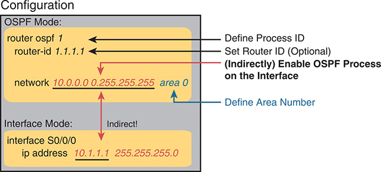
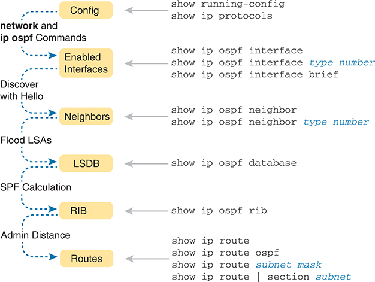
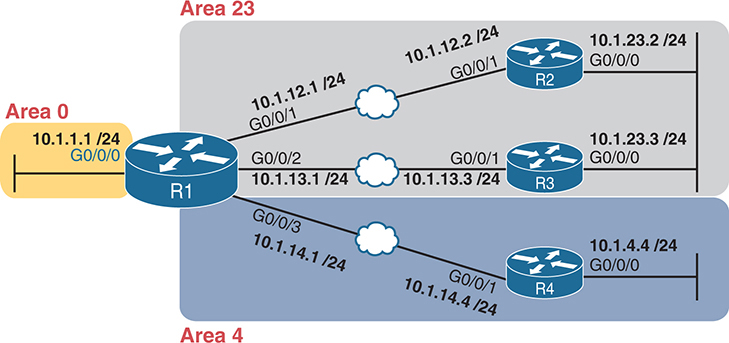
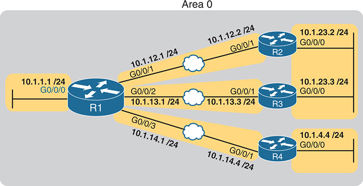

# Chapter 22


## Implementing Basic OSPF Features

This chapter covers the following exam topics:

3.0 IP Connectivity

3.2 Determine how a router makes a forwarding decision by default

3.2.b Administrative distance

3.2.c Routing protocol metric

3.4 Configure and verify single area OSPFv2

3.4.a Neighbor adjacencies

3.4.b Point-to-point

3.4.c Broadcast (DR/BR selection)

3.4.d Router ID

OSPFv2 requires only a few configuration commands if you rely on default settings. To use OSPF, all you need to do is enable OSPF on each interface you intend to use in the network, and OSPF uses messages to discover neighbors and learn routes through those neighbors. OSPF performs many background tasks, and you can discover details about that work using a large number of OSPF **show** commands. However, configuring OSPF, using mostly default settings for all the optional features, requires only a few commands. This chapter sets about to help you learn those minimal settings.

The first major section of this chapter focuses on traditional OSPFv2 configuration using the **network** command, along with the large variety of associated **show** commands. This section teaches you how to make OSPFv2 operate with default settings and convince yourself that it really is working through use of those **show** commands.

The second major section shows an alternative configuration option called OSPF interface mode, in contrast with the traditional OSPF configuration shown in the first section of the chapter. This mode uses the **ip ospf** *process-id* **area** *area-number* configuration command instead of the **network** command.

Along the way, the first major section includes the detail of how to set the OSPF router ID (RID). While optional, configuring a predictable and stable OSPF RID allows easier operation and troubleshooting of OSPF and may be the most important of the optional OSPF settings.

### "Do I Know This Already?" Quiz

Take the quiz (either here or use the PTP software) if you want to use the score to help you decide how much time to spend on this chapter. The letter answers are listed at the bottom of the page following the quiz. [Appendix C](vol1_appc.md#appc), found both at the end of the book as well as on the companion website, includes both the answers and explanations. You can also find both answers and explanations in the PTP testing software.

**Table 22-1** "Do I Know This Already?" Foundation Topics Section-to-Question Mapping

| Foundation Topics Section | Questions |
| --- | --- |
| Implementing OSPFv2 Using network Commands | 1-4 |
| Implementing OSPFv2 Using Interface Subcommands | 5, 6 |

**[1](vol1_ch22.md#ques22_1a).** Which of the following **network** commands, following the command **router ospf 1**, enables OSPF on interfaces whose IP addresses are 10.1.1.1, 10.1.100.1, and 10.1.120.1?

1. **network 10.0.0.0 0.0.0.0 area 0**
2. **network 10.0.0.0 0.255.255.255 area 0**
3. **network 10.0.0.0 0.0.0.255 area 0**
4. **network 10.0.0.0 0.0.255.255 area 0**

**[2](vol1_ch22.md#ques22_2a).** Which of the following **network** commands, following the command **router ospf 1**, tells this router to start using OSPF on interfaces whose IP addresses are 10.1.1.1, 10.1.100.1, and 10.1.120.1?

1. **network 10.1.0.0 0.0.255.255 area 0**
2. **network 10.0.0.0 0.255.255.0 area 0**
3. **network 10.1.1.0 0.x.1x.0 area 0**
4. **network 10.1.1.0 255.0.0.0 area 0**

**[3](vol1_ch22.md#ques22_3a).** Which of the following commands list the OSPF neighbors off interface serial 0/0? (Choose two answers.)

1. **show ip ospf neighbor**
2. **show ip ospf interface brief**
3. **show ip neighbor**
4. **show ip interface**
5. **show ip ospf neighbor serial 0/0**

**[4](vol1_ch22.md#ques22_4a).** When reloading and choosing a new OSPF router ID (RID), a router had working interfaces loopback 1 with IP address 10.8.8.8, loopback 2 with address 10.7.7.7, and GigabitEthernet0/0/0 with 10.9.9.9. The router did not have a **router-id** command in the OSPF process configuration. What RID did the router choose?

1. 10.7.7.7
2. 10.8.8.8
3. 10.9.9.9
4. The router would fail to choose an RID.

**[5](vol1_ch22.md#ques22_5a).** An engineer migrates from a more traditional OSPFv2 configuration that uses **network** commands in OSPF configuration mode to instead use OSPFv2 interface configuration. Which of the following commands configures the area number assigned to an interface in this new configuration?

1. The **area** command in interface configuration mode
2. The **ip ospf** command in interface configuration mode
3. The **router ospf** command in interface configuration mode
4. The **network** command in interface configuration mode

**[6](vol1_ch22.md#ques22_6a).** An enterprise avoids using the OSPF **network** command, instead preferring to enable OSPF per-interface with the **ip ospf** *process-id* **area** *area-id* interface subcommand. Which **show** command identifies whether an interface has been configured with the **ip ospf** *process-id* **area** *area-id* interface subcommand? (Choose two answers.)

1. The **show ip ospf interface** command
2. The **show ip ospf interface brief** command
3. The **show ip ospf neighbor** command
4. The **show ip protocols** command

Answers to the "Do I Know This Already?" quiz:

**[1](vol1_appc.md#ques22_1)** B

**[2](vol1_appc.md#ques22_2)** A

**[3](vol1_appc.md#ques22_3)** A, E

**[4](vol1_appc.md#ques22_4)** B

**[5](vol1_appc.md#ques22_5)** B

**[6](vol1_appc.md#ques22_6)** A, D

### Foundation Topics

### Implementing OSPFv2 Using network Commands

After an OSPF design has been chosen--a task that can be complex in larger IP internetworks--the configuration can be as simple as enabling OSPF on each router interface and placing that interface in the correct OSPF area. This first major section of the chapter focuses on the required configuration using the traditional OSPFv2 **network** command along with one optional configuration setting: how to set the [OSPF router-id](vol1_gloss.md#gloss_291). Additionally, this section works through how to show the various lists and tables that confirm how OSPF is working.

For reference and study, the following list outlines the configuration steps covered in this first major section of the chapter:

Step 1. Use the **router ospf** *process-id* global command to enter OSPF configuration mode for a particular OSPF process.


Step 2. (Optional) Configure the OSPF router ID by doing the following:

1. Use the **router-id** *id-value* router subcommand to define the router ID, or
2. Use the **interface loopback** *number* global command, along with an **ip address** *address mask* command, to configure an IP address on a loopback interface (chooses the highest IP address of all working loopbacks), or
3. Rely on an interface IP address (chooses the highest IP address of all working nonloopbacks).

Step 3. Use one or more **network** *ip-address wildcard-mask* **area** *area-id* router subcommands to enable OSPFv2 on any interfaces matched by the configured address and mask, enabling OSPF on the interface for the listed area.

[Figure 22-1](vol1_ch22.md#ch22fig01) shows the relationship between the OSPF configuration commands, with the idea that the configuration creates a routing process in one part of the configuration, and then indirectly enables OSPF on each interface. The configuration does not name the interfaces on which OSPF is enabled, instead requiring IOS to apply some logic by comparing the OSPF **network** command to the interface **ip address** commands. The upcoming example discusses more about this logic.





**Figure 22-1** *Organization of OSPFv2 Configuration with the **network** Command*

The schematic is divided into two sections: OSPF Mode and Interface Mode. In OSPF Mode, the command "router ospf 1" is used to define the Process ID, "router-id 1.1.1.1" sets an optional Router ID, and "network 10.0.0.0 255.255.255 area 0" defines the Area Number. The Interface Mode is shown as being indirectly linked, where the command "interface S0/0/0" initiates the interface configuration mode and "ip address 10.1.1.1 255.255.255.0" assigns an IP address to the interface.

#### OSPF Single-Area Configuration

[Figure 22-2](vol1_ch22.md#ch22fig02) shows a sample network that will be used for most examples throughout this chapter. All links reside in area 0, making the area design a single-area design, with four routers. You can think of Router R1 as a router at a central site, with WAN links to each remote site. Routers R2 and R3 might be at one large remote site that needs two WAN links and two routers for WAN redundancy, with both routers connected to the LAN at that remote site. Router R4 might be a typical smaller remote site with a single router needed for that site.


**Figure 22-2** *Sample Network for OSPF Single-Area Configuration*

The network infrastructure consists of four routers, labeled R1 through R4. R1, with interface G0/0/0, is connected to subnet 10.1.1.1/24. R1 also has subnet 10.1.12.1/24 with interface G0/0/1, which is connected to R2 with subnet 10.1.12.2/24 and interface G0/0/1 via Ethernet W A N. R2 is connected to subnet 10.1.23.2/24 through interface G0/0/0. Furthermore, R1, with subnet 10.1.13.1/24 and interface G0/0/2, is connected to R3 with subnet 10.1.13.3/24 and interface G0/0/1 via Ethernet W A N. R3 is connected to subnet 10.1.23.3/24 through interface G0/0/0. Lastly, R1, with subnet 10.1.14.1/24 and interface G0/0/3, is connected to R4 with subnet 10.1.14.4/24 and interface G0/0/1 via Ethernet W A N. R4 is connected to subnet 10.1.4.4/24 through interface G0/0/0.

[Example 22-1](vol1_ch22.md#exa22_1) shows the IPv4 addressing configuration on Router R1, before getting into the OSPF detail.

**Example 22-1** *IPv4 Address Configuration on R1*

[Click here to view code image](vol1_ch22_images.md#f0566-01)

```
interface GigabitEthernet0/0/0
 ip address 10.1.1.1 255.255.255.0
!
interface GigabitEthernet0/0/1
 ip address 10.1.12.1 255.255.255.0
!
interface GigabitEthernet0/0/2
 ip address 10.1.13.1 255.255.255.0
!
interface GigabitEthernet0/0/3
 ip address 10.1.14.1 255.255.255.0
```

The OSPF configuration begins with the **router ospf** *process-id* global command, which puts the user in OSPF configuration mode, and sets the OSPF *process-id* value. The *process-id* number just needs to be unique on the local router, matching between various commands in a router. The *process-id* does not need to match between neighboring routers or other routers in the same area. The value can be any integer between 1 and 65,535.

Second, the configuration needs one or more **network** commands in OSPF mode. These commands tell the router to find its local interfaces that match the first two parameters on the **network** command. Then, for each matched interface, the router enables OSPF on those interfaces, discovers neighbors, creates neighbor relationships, and assigns the interface to the area listed in the **network** command. (Note that the area can be configured as either an integer or a dotted-decimal number, but this book makes a habit of configuring the area number as an integer. The integer area numbers range from 0 through 4,294,967,295.)

[Example 22-2](vol1_ch22.md#exa22_2) shows an example configuration on Router R1 from [Figure 22-2](vol1_ch22.md#ch22fig02). The **router ospf 1** command enables OSPF process 1, and the single **network** command enables OSPF on all interfaces shown in the figure.

**Example 22-2** *OSPF Single-Area Configuration on R1 Using One **network** Command*

[Click here to view code image](vol1_ch22_images.md#f0566-02)

```
router ospf 1
 network 10.0.0.0 0.255.255.255 area 0
```

For the specific **network** command in [Example 22-2](vol1_ch22.md#exa22_2), any matched interfaces are assigned to area 0. However, the first two parameters--the *ip\_address* and *wildcard\_mask* parameter values of 10.0.0.0 and 0.255.255.255--need some explaining. In this case, the command matches all interfaces shown for Router R1; the next topic explains why.

#### Wildcard Matching with the network Command

The key to understanding the traditional OSPFv2 configuration shown in this first example is to understand the OSPF **network** command. The OSPF **network** command compares the first parameter in the command to each interface IP address on the local router, trying to find a match. However, rather than comparing the entire number in the **network** command to the entire IPv4 address on the interface, the router can compare a subset of the octets, based on the wildcard mask, as follows:

**Wildcard 0.0.0.0:** Compare all four octets. In other words, the numbers must exactly match.


**Wildcard 0.0.0.255:** Compare the first three octets only. Ignore the last octet when comparing the numbers.

**Wildcard 0.0.255.255:** Compare the first two octets only. Ignore the last two octets when comparing the numbers.

**Wildcard 0.255.255.255:** Compare the first octet only. Ignore the last three octets when comparing the numbers.

**Wildcard 255.255.255.255:** Compare nothing; this wildcard mask means that all addresses will match the **network** command.

Basically, a wildcard mask value of decimal 0 in an octet tells IOS to compare to see if the numbers match, and a value of 255 tells IOS to ignore that octet when comparing the numbers.

The **network** command provides many flexible options because of the wildcard mask. For example, in Router R1, many **network** commands could be used, with some matching all interfaces, and some matching a subset of interfaces. [Table 22-2](vol1_ch22.md#ch22tab02) shows a sampling of options, with notes.

**Table 22-2** Example OSPF **network** Commands on R1, with Expected Results

| Command | Logic in Command | Matched Interfaces |
| --- | --- | --- |
| **network 10.1.0.0 0.0.255.255** | Match addresses that begin with 10.1 | G0/0/0  G0/0/1  G0/0/1  G0/0/2 |
| **network 10.0.0.0 0.255.255.255** | Match addresses that begin with 10 | G0/0/0  G0/0/1  G0/0/1  G0/0/2 |
| **network 0.0.0.0 255.255.255.255** | Match all addresses | G0/0/0  G0/0/1  G0/0/1  G0/0/2 |
| **network 10.1.13.0 0.0.0.255** | Match addresses that begin with 10.1.13 | G0/0/2 |
| **network 10.1.13.1 0.0.0.0** | Match one address: 10.1.13.1 | G0/0/2 |

The wildcard mask gives the local router its rules for matching its own interfaces. To show examples of the different options, [Example 22-3](vol1_ch22.md#exa22_3) shows the configuration on routers R2, R3, and R4, each using different wildcard masks. Note that all three routers (R2, R3, and R4) enable OSPF on all the interfaces shown in [Figure 22-2](vol1_ch22.md#ch22fig02).

**Example 22-3** *OSPF Configuration on Routers R2, R3, and R4*

[Click here to view code image](vol1_ch22_images.md#f0568-01)

```
! R2 configuration next - one network command enables OSPF on both interfaces
interface GigabitEthernet0/0/0
 ip address 10.1.23.2 255.255.255.0
!
interface GigabitEthernet0/0/1
 ip address 10.1.12.2 255.255.255.0
!
router ospf 1
 network 10.0.0.0 0.255.255.255 area 0
```

```
! R3 configuration next - One network command per interface
interface GigabitEthernet0/0/0
 ip address 10.1.23.3 255.255.255.0
!
interface GigabitEthernet0/0/1
 ip address 10.1.13.3 255.255.255.0
!
router ospf 1
 network 10.1.13.3 0.0.0.0 area 0
 network 10.1.23.3 0.0.0.0 area 0
```

```
! R4 configuration next - One network command per interface with wildcard 0.0.0.255
interface GigabitEthernet0/0/0
 ip address 10.1.4.4 255.255.255.0
!
interface GigabitEthernet0/0/1
 ip address 10.1.14.4 255.255.255.0
!
router ospf 1
 network 10.1.14.0 0.0.0.255 area 0
 network 10.1.4.0 0.0.0.255 area 0
```

Finally, note that OSPF uses the same wildcard mask logic as defined by Cisco IOS access control lists. The section titled "Finding the Right Wildcard Mask to Match a Subnet" section in [Chapter 6](vol1_ch06.md#ch06) of the *CCNA 200-301 Official Cert Guide, Volume 2*, Second Edition, provides more detail about wildcard masks.

Note

If the wildcard mask octet in a **network** command is 255, the matching address octet should be configured as a 0. Interestingly, IOS will accept a **network** command that breaks this rule, but if you configure a wildcard mask octet as 255, then IOS changes the corresponding address octet to a 0 before putting it into the running configuration file. For example, IOS will change a typed command that begins with **network 1.2.3.4 0.0.255.255** to **network 1.2.0.0 0.0.255.255**.

#### Verifying OSPF Operation

As mentioned in [Chapter 21](vol1_ch21.md#ch21), "[Understanding OSPF Concepts](vol1_ch21.md#ch21)," OSPF routers use a three-step process to eventually add OSPF-learned routes to the IP routing table. First, they create neighbor relationships. Then they build and flood LSAs between those neighbors so each router in the same area has a copy of the same LSDB. Finally, each router independently computes its own IP routes using the SPF algorithm and adds them to its routing table. This next topic works through how to display the results of each of those steps, which lets you confirm whether OSPF has worked correctly or not.

The **show ip ospf neighbor**, **show ip ospf database**, and **show ip route** commands display information to match each of these three steps, respectively. [Figure 22-3](vol1_ch22.md#ch22fig03) summarizes the commands you can use (and others) when verifying OSPF.





**Figure 22-3** *OSPF Verification Commands*

schematic illustrating the configuration and operation of an O S P F network. The chart depicts a sequence of steps starting with "Config" leading to "Enabled Interfaces" through "network and ip ospf Commands." "Enabled Interfaces" then connects to "Neighbors" via "Discover with Hello," followed by a connection from "Neighbors" to "L S D B" through "Flood L S As." "L S D B" is linked to "R I B" through "S P F Calculation," and "R I B" connects to "Routes" via "Admin Distance." Dotted arrows indicate the progression from one step to another.

Many engineers begin OSPF verification by looking at the output of the **show ip ospf neighbor** command. For instance, [Example 22-4](vol1_ch22.md#exa22_4) shows a sample from Router R1, which should have one neighbor relationship each with routers R2, R3, and R4. [Example 22-4](vol1_ch22.md#exa22_4) shows all three.


**Example 22-4** *OSPF Neighbors on Router R1 from [Figure 22-2](vol1_ch22.md#ch22fig02)*

[Click here to view code image](vol1_ch22_images.md#f0569-01)

```
R1# show ip ospf neighbor
Neighbor ID     Pri   State          Dead Time   Address       Interface
2.2.2.2           1   FULL/DR        00:00:37    10.1.12.2     GigabitEthernet0/0/1
3.3.3.3           1   FULL/DR        00:00:37    10.1.13.3     GigabitEthernet0/0/2
4.4.4.4           1   FULL/BDR       00:00:34    10.1.14.4     GigabitEthernet0/0/3
```

The detail in the output mentions several important facts, and for most people, working right to left works best in this case. For example, look at the headings:

**Interface:** This is the local router's interface connected to the neighbor. For example, the first neighbor in the list is reachable through R1's G0/0/1 interface.

**Address:** This is the neighbor's IP address on that link. Again, this first neighbor, the neighbor, which is R2, uses IP address 10.1.12.2.

**State:** While many possible states exist, for the details discussed in this chapter, FULL is the correct and fully working state in this case.

**Neighbor ID:** This is the router ID of the neighbor.

Note

[Examples 22-4](vol1_ch22.md#exa22_4) through [22-8](vol1_ch22.md#exa22_8) use configuration not shown here that sets the RID values to easily identify the routers, using 2.2.2.2 for Router R2, 3.3.3.3 for Router R3, and so on. The upcoming section "[Configuring the OSPF Router ID](vol1_ch22.md#ch22lev2sec5)" shows how to set the RID.

Once OSPF convergence has completed, a router should list each neighbor. On links that use a designated router (DR), the state will also list the role of the neighboring router after the / (DR, BDR, or DROther). As a result, the normal working states will be:

**FULL/ -:** The neighbor state is full, with the "-" instead of letters meaning that the link does not use a DR/BDR.


**FULL/DR:** The neighbor state is full, and the neighbor is the DR.

**FULL/BDR:** The neighbor state is full, and the neighbor is the backup DR (BDR).

**FULL/DROTHER:** The neighbor state is full, and the neighbor is neither the DR nor BDR. (It also implies that the local router is a DR or BDR because the state is FULL.)

**2WAY/DROTHER:** The neighbor state is 2-way, and the neighbor is neither the DR nor BDR--that is, a DROther router. (It also implies that the local router is also a DROther router because otherwise the state would reach a full state.)

Once a router's OSPF process forms a working neighbor relationship, the routers exchange the contents of their LSDBs, either directly or through the DR on the subnet. [Example 22-5](vol1_ch22.md#exa22_5) shows the contents of the LSDB on Router R1. Interestingly, with a single-area design, all the routers will have the same LSDB contents once all neighbors are up and all LSAs have been exchanged. So, the **show ip ospf database** command in [Example 22-5](vol1_ch22.md#exa22_5) should list the same exact information, no matter on which of the four routers it is issued.

**Example 22-5** *OSPF Database on Router R1 from [Figure 22-2](vol1_ch22.md#ch22fig02)*

[Click here to view code image](vol1_ch22_images.md#f0570-01)

```
R1# show ip ospf database

            OSPF Router with ID (1.1.1.1) (Process ID 1)


                 Router Link States (Area 0)
Link ID         ADV Router      Age         Seq#       Checksum Link count
1.1.1.1         1.1.1.1         431         0x8000008F 0x00DCCA 5
2.2.2.2         2.2.2.2         1167        0x8000007F 0x009DA1 2
3.3.3.3         3.3.3.3         441         0x80000005 0x002FB1 1
4.4.4.4         4.4.4.4         530         0x80000004 0x007F39 2


                Net Link States (Area 0)

Link ID         ADV Router      Age         Seq#       Checksum
10.1.12.2       2.2.2.2         1167        0x8000007C 0x00BBD5
10.1.13.3       3.3.3.3         453         0x80000001 0x00A161
10.1.14.1       4.4.4.4         745         0x8000007B 0x004449
10.1.23.3       3.3.3.3         8           0x80000001 0x00658F
```

For the purposes of this book, do not be concerned about the specifics in the output of this command. However, for perspective, note that the LSDB should list one "Router Link State" (Type 1 Router LSA) for each of the routers in the same area, so with the design based on [Figure 22-2](vol1_ch22.md#ch22fig02), the output lists four Type 1 LSAs. Also, with all default settings in this design, the routers will create a total of four Type 2 Network LSAs as shown, one each for the subnets that have a DR and contain at least two routers in that subnet (the three WAN links plus the LAN to which both R2 and R3 connect).

Next, [Example 22-6](vol1_ch22.md#exa22_6) shows R4's IPv4 routing table with the **show ip route** command. As configured, with all links working, R4 has connected routes to two of those subnets and should learn OSPF routes to the other subnets.

**Example 22-6** *IPv4 Routes Added by OSPF on Router R4 from [Figure 22-2](vol1_ch22.md#ch22fig02)*

[Click here to view code image](vol1_ch22_images.md#f0571-01)

```
R4# show ip route
Codes: L - local, C - connected, S - static, R - RIP, M - mobile, B - BGP
       D - EIGRP, EX - EIGRP external, O - OSPF, IA - OSPF inter area
       N1 - OSPF NSSA external type 1, N2 - OSPF NSSA external type 2
       E1 - OSPF external type 1, E2 - OSPF external type 2
! Additional legend lines omitted for brevity

Gateway of last resort is not set

      10.0.0.0/8 is variably subnetted, 9 subnets, 2 masks
O        10.1.1.0/24 [110/2] via 10.1.14.1, 00:27:24, GigabitEthernet0/0/1
C        10.1.4.0/24 is directly connected, GigabitEthernet0/0/0
L        10.1.4.4/32 is directly connected, GigabitEthernet0/0/0
O        10.1.12.0/24 [110/2] via 10.1.14.1, 00:27:24, GigabitEthernet0/0/1
O        10.1.13.0/24 [110/2] via 10.1.14.1, 00:25:15, GigabitEthernet0/0/1
C        10.1.14.0/24 is directly connected, GigabitEthernet0/0/1
L        10.1.14.4/32 is directly connected, GigabitEthernet0/0/1
O        10.1.23.0/24 [110/3] via 10.1.14.1, 00:27:24, GigabitEthernet0/0/1
```

Any time you want to check OSPF on a router in a small design like the ones in the book, you can count all the subnets, then count the subnets connected to the local router, and know that OSPF should learn routes to the rest of the subnets. Then just use the **show ip route** command and add up how many connected and OSPF routes exist as a quick check of whether all the routes have been learned or not.

In this case, Router R4 has two connected subnets, but six subnets exist per the figure, so Router R4 should learn four OSPF routes. Next look for the code of "O" on the left, which identifies a route as being learned by OSPF. The output lists four such IP routes: one for the LAN subnet off Router R1, one for the LAN subnet connected to both R2 and R3, and one each for the WAN subnets from R1 to R2 and R1 to R3.

Next, examine the first route (to subnet 10.1.1.0/24). It lists the subnet ID and mask, identifying the subnet. It also lists two numbers in brackets. The first, 110, is the administrative distance of the route. All the OSPF routes in this example use the default of 110 (see [Table 24-4](vol1_ch24.md#ch24tab04) in [Chapter 24](vol1_ch24.md#ch24), "[OSPF Neighbors and Route Selection](vol1_ch24.md#ch24)," for the list of administrative distance values). The second number, 2, is the OSPF metric for this route. The route also lists the forwarding instructions: the next-hop IP address (10.1.14.1) and R4's outgoing interface (G0/0/1).

Note

The section "[Floating Static Routes](vol1_ch17.md#ch17lev2sec9)" in [Chapter 17](vol1_ch17.md#ch17), "[Configuring IPv4 Addresses and Static Routes](vol1_ch17.md#ch17)," introduced the concept of administrative distance; however, the section "[Multiple Routes Learned from Competing Sources](vol1_ch24.md#ch24lev2sec5)," in [Chapter 24](vol1_ch24.md#ch24) discusses the topic in more depth.

#### Verifying OSPF Configuration

Once you can configure OSPF with confidence, you will likely verify OSPF focusing on [OSPF neighbors](vol1_gloss.md#gloss_289) and the IP routing table as just discussed. However, if OSPF does not work immediately, you may need to circle back and check the configuration. To do so, you can use these steps:

* If you have enable mode access, use the **show running-config** command to examine the configuration.
* If you have only user mode access, use the **show ip protocols** command to re-create the OSPF configuration.
* Use the **show ip ospf interface [brief]** command to determine whether the router enabled OSPF on the correct interfaces or not based on the configuration.

The best way to verify the configuration begins with the **show running-config** command, of course. However, the **show ip protocols** command repeats the details of the OSPFv2 configuration and does not require enable mode access. [Example 22-7](vol1_ch22.md#exa22_7) does just that for Router R3.

**Example 22-7** *Router R3 Configuration and the **show ip protocols** Command*

[Click here to view code image](vol1_ch22_images.md#f0573-01)

```
R3# show running-config | section router ospf 1
router ospf 1
  network 10.1.13.3 0.0.0.0 area 0
  network 10.1.23.3 0.0.0.0 area 0
  router-id 3.3.3.3

R3# show ip protocols
*** IP Routing is NSF aware ***

Routing Protocol is "ospf 1"
  Outgoing update filter list for all interfaces is not set
  Incoming update filter list for all interfaces is not set
  Router ID 3.3.3.3
  Number of areas in this router is 1. 1 normal 0 stub 0 nssa
  Maximum path: 4
  Routing for Networks:
    10.1.13.3 0.0.0.0 area 0
    10.1.23.3 0.0.0.0 area 0
  Routing Information Sources:
    Gateway         Distance      Last Update
    1.1.1.1              110      02:05:26
    4.4.4.4              110      02:05:26
    2.2.2.2              110      01:51:16
  Distance: (default is 110)
```

The highlighted output emphasizes some of the configuration. The first highlighted line repeats the parameters on the **router ospf 1** global configuration command. (The second highlighted item points out the router's router ID, which will be discussed in the next section.) The third set of highlighted lines begins with a heading of "Routing for Networks:" followed by two lines that closely resemble the parameters on the configured **network** commands. In fact, closely compare those last two highlighted lines with the **network** configuration commands at the top of the example, and you will see that they mirror each other, but the **show** command just leaves out the word *network*. For instance:

Configuration: **network 10.1.13.3 0.0.0.0 area 0**

**show** Command: **10.1.13.3 0.0.0.0 area 0**

IOS interprets the **network** commands to choose interfaces on which to run OSPF, so it could be that IOS chooses a different set of interfaces than you predicted. To check the list of interfaces chosen by IOS, use the **show ip ospf interface brief** command, which lists all interfaces that have been enabled for OSPF processing. Verifying the interfaces can be a useful step if you have issues with OSPF neighbors because OSPF must first be enabled on an interface before a router will attempt to discover neighbors on that interface. [Example 22-8](vol1_ch22.md#exa22_8) shows a sample from Router R1.

**Example 22-8** *Router R1 **show ip ospf interface brief** Command*

[Click here to view code image](vol1_ch22_images.md#f0574-01)

```
R1# show ip ospf interface brief
Interface    PID   Area            IP Address/Mask    Cost  State Nbrs F/C
Gi0/0/0      1     0               10.1.1.1/24        1     DR    0/0
Gi0/0/1      1     0               10.1.12.1/24       1     BDR   1/1
Gi0/0/2      1     0               10.1.13.1/24       1     BDR   1/1
Gi0/0/3      1     0               10.1.14.1/24       1     DR    1/1
```

The **show ip ospf interface brief** command lists one line per interface, showing all the interfaces on which OSPF has been enabled. Each line identifies the OSPF process ID (per the **router ospf** *process-id* command), the area, the interface IP address, and the number of neighbors found via each interface.

You may use the command in [Example 22-8](vol1_ch22.md#exa22_8) quite often, but the **show ip ospf interface** command (without the **brief** keyword) gives much more detail about OSPF per-interface settings. [Example 23-4](vol1_ch23.md#exa23_4) in [Chapter 23](vol1_ch23.md#ch23), "[Implementing Optional OSPF Features](vol1_ch23.md#ch23)," shows an example of the entire output of that command.

#### Configuring the OSPF Router ID

While OSPF has many other optional features, most enterprise networks that use OSPF choose to configure each router's OSPF router ID. OSPF-speaking routers must have a router ID (RID) for proper operation. By default, routers will choose an interface IP address to use as the RID. However, many network engineers prefer to choose each router's router ID, so command output from commands like **show ip ospf neighbor** lists more recognizable router IDs.

To choose its RID, a Cisco router uses the following process when the router reloads and brings up the OSPF process. Note that the router stops looking for a router ID to use once one of the steps identifies a value to use.

1. If the **router-id** *rid* OSPF subcommand is configured, this value is used as the RID.

   
2. If any loopback interfaces have an IP address configured, and the interface has an interface status of up, the router picks the highest numeric IP address among these loopback interfaces.
3. The router picks the highest numeric IP address from all other interfaces whose interface status code (first status code) is up. (In other words, an interface in up/down state will be included by OSPF when choosing its router ID.)

The first and third criteria should make some sense right away: the RID is either configured or is taken from a working interface's IP address. However, this book has not yet explained the concept of a *loopback interface*, as mentioned in Step 2.

A loopback interface is a virtual interface that can be configured with the **interface loopback** *interface-number* command, where *interface-number* is an integer. Loopback interfaces are always in an "up and up" state unless administratively placed in a shutdown state. For example, a simple configuration of the command **interface loopback 0**, followed by **ip address 2.2.2.2 255.255.255.0**, would create a loopback interface and assign it an IP address. Because loopback interfaces do not rely on any hardware, these interfaces can be up/up whenever IOS is running, making them good interfaces on which to base an OSPF RID.

[Example 22-9](vol1_ch22.md#exa22_9) shows the configuration that existed in Routers R1 and R2 before the creation of the **show** command output earlier in this chapter. R1 set its router ID using the direct method, while R2 used a loopback IP address. [Example 22-10](vol1_ch22.md#exa22_10) that follows shows the output of the **show ip ospf** command on R1, which identifies the OSPF RID used by R1.

**Example 22-9** *OSPF Router ID Configuration Examples*

[Click here to view code image](vol1_ch22_images.md#f0575-01)

```
! R1 Configuration first
router ospf 1
 router-id 1.1.1.1
 network 10.1.0.0 0.0.255.255 area 0
```

```
! R2 Configuration next
!
interface Loopback2
 ip address 2.2.2.2 255.255.255.255
```

**Example 22-10** *Confirming the Current OSPF Router ID*

[Click here to view code image](vol1_ch22_images.md#f0575-02)

```
R1# show ip ospf
 Routing Process "ospf 1" with ID 1.1.1.1
! lines omitted for brevity
```

Routers need a stable OSPF RID because any change to the OSPF RID causes a router to close existing neighbor relationships and remove all routes learned through those neighbors. To keep the RID stable, a router chooses its RID when the router first initializes (at power-on or per the **reload** command). So the RID might change at the next reload when the router re-evaluates the RID choice rules based on the current conditions.

However, routers do support one scenario to update their RID without a **reload**, which can be useful for testing in lab. To do so, configure the OSPF **router-id** OSPF subcommand followed by the **clear ip ospf process** EXEC command.

#### Implementing Multiarea OSPF

Even though the current CCNA 200-301 V1.1 exam blueprint mentions single area but not multiarea OSPF, you only need to learn one more idea to know how to configure multiarea OSPF. So, this chapter takes a brief page to show how.

For example, consider a multiarea OSPF design as shown in [Figure 22-4](vol1_ch22.md#ch22fig04). It uses the same routers and IP addresses as shown earlier in [Figure 22-2](vol1_ch22.md#ch22fig02), on which all the examples in this chapter have been based so far. However, the design shows three areas instead of the single-area design shown in [Figure 22-2](vol1_ch22.md#ch22fig02).

Configuring the routers in a multiarea design is almost just like configuring OSPFv2 for a single area. To configure multiarea OSPF, all you need is a valid OSPF area design (for instance, like [Figure 22-4](vol1_ch22.md#ch22fig04)) and a configuration that places each router interface into the correct area per that design. For example, both of R4's interfaces connect to links in area 4, making R4 an internal router, so any **network** commands on Router R4 will list area 4.





**Figure 22-4** *Area Design for an Example Multiarea OSPF Configuration*

The schematic features three distinct areas: Area 0, Area 23, and Area 4. In Area 0, there is a router R1 with an IP address of 10.1.1.1/24 connected via the G0/0/0 interface. Router R1 with the G0/0/1 interface and an IP address of 10.1.12.1/24 is connected to router R2 with the G0/0/1 interface and an IP address of 10.1.12.2/24 in Area 23 via Ethernet W A N. Router R2 has an IP address of 10.1.23.2/24 on its G0/0/0 interface. Router R1 with the G0/0/2 interface and an IP address of 10.1.13.1/24 is connected to router R3 with the G0/0/1 interface and an IP address of 10.1.13.3/24 in Area 23 via Ethernet W A N. Router R3 has an IP address of 10.1.23.3/24 on its G0/0/0 interface. Router R1 with the G0/0/3 interface and an IP address of 10.1.14.1/24 is connected to router R4 with the G0/0/1 interface and an IP address of 10.1.14.4/24 in Area 4 via Ethernet W A N. Router R4 has an IP address of 10.1.4.4/24 on its G0/0/0 interface.

[Example 22-11](vol1_ch22.md#exa22_11) shows a sample configuration for Router R1. To make the configuration clear, it uses **network** commands with a wildcard mask of 0.0.0.0, meaning each **network** command matches a single interface. Each interface will be placed into either area 0, 23, or 4 to match the figure.

**Example 22-11** *OSPF Configuration on R1, Placing Interfaces into Different Areas*

[Click here to view code image](vol1_ch22_images.md#f0576-01)

```
router ospf 1
 network 10.1.1.1 0.0.0.0 area 0
 network 10.1.12.1 0.0.0.0 area 23
 network 10.1.13.1 0.0.0.0 area 23
 network 10.1.14.1 0.0.0.0 area 4
```

### Implementing OSPFv2 Using Interface Subcommands

From the earliest days of OSPFv2 support in Cisco routers, the configuration used the OSPF **network** command as discussed in this chapter. However, that configuration style can be confusing, and it does require some interpretation. As a result, Cisco added another option for OSPFv2 configuration called OSPF interface configuration.

The newer interface-style OSPF configuration still enables OSPF on interfaces, but it does so directly with the **ip ospf** interface subcommand. Instead of matching interfaces with indirect logic using **network** commands, you directly enable OSPFv2 on interfaces by configuring an interface subcommand on each interface.

#### OSPF Interface Configuration Example

To show how OSPF interface configuration works, this example basically repeats the example shown earlier in the chapter using the traditional OSPFv2 configuration with **network** commands. So, before looking at the OSPFv2 interface configuration, take a moment to look back to review traditional OSPFv2 configuration with [Figure 22-2](vol1_ch22.md#ch22fig02) and [Examples 22-2](vol1_ch22.md#exa22_2) and [22-3](vol1_ch22.md#exa22_3).

After reviewing the traditional configuration, consider this checklist, which details how to convert from the old-style configuration in [Example 22-2](vol1_ch22.md#exa22_2) and [Example 22-3](vol1_ch22.md#exa22_3) to use interface configuration:

Step 1. Use the **no network** *network-id* **area** *area-id* subcommands in OSPF configuration mode to remove the **network** commands.


Step 2. Add one **ip ospf** *process-id* **area** *area-id* command in interface configuration mode under each interface on which OSPF should operate, with the correct OSPF process (*process-id*) and the correct OSPF area number.

[Figure 22-5](vol1_ch22.md#ch22fig05) repeats the design for both the original examples in this chapter and for this upcoming interface configuration example.




**Figure 22-5** *Area Design Used in the Upcoming OSPF Interface Config Example*

The network infrastructure consists of four routers, labeled R1 through R4. R1, with interface G0/0/0, is connected to subnet 10.1.1.1/24. R1 also has subnet 10.1.12.1/24 with interface G0/0/1, which is connected to R2 with subnet 10.1.12.2/24 and interface G0/0/1 via Ethernet W A N. R2 is connected to subnet 10.1.23.2/24 through interface G0/0/0. Furthermore, R1, with subnet 10.1.13.1/24 and interface G0/0/2, is connected to R3 with subnet 10.1.13.3/24 and interface G0/0/1 via Ethernet W A N. R3 is connected to subnet 10.1.23.3/24 through interface G0/0/0. Lastly, R1, with subnet 10.1.14.1/24 and interface G0/0/3, is connected to R4 with subnet 10.1.14.4/24 and interface G0/0/1 via Ethernet W A N. R4 is connected to subnet 10.1.4.4/24 through interface G0/0/0.

[Example 22-2](vol1_ch22.md#exa22_2) shows a single **network** command: **network 10.0.0.0 0.255.255.255 area 0**. [Example 22-12](vol1_ch22.md#exa22_12) follows the steps in the migration checklist, beginning with the removal of the previous configuration using the **no network 10.0.0.0 0.255.255.255 area 0** command. The example then shows the addition of the **ip ospf 1 area 0** command on each of the interfaces on Router R1, enabling OSPF process 1 on the interface and placing each interface into area 0.

**Example 22-12** *Migrating to Use OSPF Interface Subcommand Configuration*

[Click here to view code image](vol1_ch22_images.md#f0577-01)

```
R1# configure terminal
Enter configuration commands, one per line.  End with CNTL/Z.
R1(config)# router ospf 1
R1(config-router)# no network 10.0.0.0 0.255.255.255 area 0
R1(config-router)#
*Apr  8 19:35:24.994: %OSPF-5-ADJCHG: Process 1, Nbr 2.2.2.2 on GigabitEthernet0/0/1
from FULL to DOWN, Neighbor Down: Interface down or detached
*Apr  8 19:35:24.994: %OSPF-5-ADJCHG: Process 1, Nbr 3.3.3.3 on GigabitEthernet0/0/2
from FULL to DOWN, Neighbor Down: Interface down or detached
*Apr  8 19:35:24.994: %OSPF-5-ADJCHG: Process 1, Nbr 4.4.4.4 on GigabitEthernet0/0/3
from FULL to DOWN, Neighbor Down: Interface down or detached
R1(config-router)# interface g0/0/0
R1(config-if)# ip ospf 1 area 0
R1(config-if)# interface g0/0/1
R1(config-if)# ip ospf 1 area 0
R1(config-if)#
*Apr  8 19:35:52.970: %OSPF-5-ADJCHG: Process 1, Nbr 2.2.2.2 on GigabitEthernet0/0/1 
from LOADING to FULL, Loading Done
R1(config-if)# interface g0/0/2
R1(config-if)# ip ospf 1 area 0
R1(config-if)#
*Apr  8 19:36:13.362: %OSPF-5-ADJCHG: Process 1, Nbr 3.3.3.3 on GigabitEthernet0/0/2
from LOADING to FULL, Loading Done
R1(config-if)# interface g0/0/3
R1(config-if)# ip ospf 1 area 0
R1(config-if)#
*Apr  8 19:37:05.398: %OSPF-5-ADJCHG: Process 1, Nbr 4.4.4.4 on GigabitEthernet0/0/3
from LOADING to FULL, Loading Done
R1(config-if)#
```

When reading the example, read from top to bottom, and also consider the details about the failed and recovered neighbor relationships shown in the log messages. Removing the network command disabled OSPF on all interfaces on Router R1, causing all three neighbor relationships to fail. The example then shows the addition of the **ip ospf 1 area 0** command on the LAN interface, which enables OSPF but does not cause a neighbor relationship to form, because no other OSPF routers exist in that subnet. Then the example shows the same command added to each of the WAN links in succession, and in each case, the OSPF neighbor available over that WAN link comes up (as noted in the log messages).

Note

A router's configuration can include both a **network** router subcommand and an **ip ospf** interface subcommand that enable OSPF on the same interface. If those commands refer to different area numbers, IOS uses the area number from the **ip ospf** interface subcommand. Additionally, multiple **network** commands can match the same interface. In that case, IOS uses the order in which the commands appear in OSPF configuration mode.

#### Verifying OSPF Interface Configuration

OSPF operates the same way whether you use the new style or old style of configuration. The OSPF area design works the same, neighbor relationships form the same way, routers negotiate to become the DR and BDR the same way, and so on. However, you can see a few small differences in **show** command output when using the newer OSPFv2 configuration if you look closely.

The **show ip protocols** command relists most of the routing protocol configuration, so it does list some different details if you use interface configuration versus the **network** command. With the **ip ospf** interface subcommands, the output lists the phrase "Interfaces Configured Explicitly," as highlighted in [Example 22-13](vol1_ch22.md#exa22_13). The example first shows the relevant parts of the **show ip protocols** command when using interface configuration on Router R1, and then lists the same portions of the command from when R1 used **network** commands.

**Example 22-13** *Differences in **show ip protocols** Output: Old- and New-Style OSPFv2 Configuration*

[Click here to view code image](vol1_ch22_images.md#f0579-01)

```
! First, with the new interface configuration
R1# show ip protocols
! … beginning lines omitted for brevity
  Routing for Networks:
  Routing on Interfaces Configured Explicitly (Area 0):
    GigabitEthernet0/0/0
    GigabitEthernet0/0/1
    GigabitEthernet0/0/2
    GigabitEthernet0/0/3
  Routing Information Sources:
    Gateway         Distance      Last Update
    4.4.4.4              110      00:09:30
    2.2.2.2              110      00:10:49
    3.3.3.3              110      05:20:07
  Distance: (default is 110)
```

```
! For comparison, the old results with the use of the OSPF network command
R1# show ip protocols
! … beginning lines omitted for brevity
  Routing for Networks:
    10.1.0.0 0.0.255.255 area 0
! … ending line omitted for brevity
```

Another small piece of different output exists in the **show ip ospf interface** [*interface*] command. The command lists details about OSPF settings for the interface(s) on which OSPF is enabled. The output also makes a subtle reference to whether that interface was enabled for OSPF with the old or new configuration style. [Example 22-14](vol1_ch22.md#exa22_14) also begins with output based on interface configuration on Router R1, followed by the output that would exist if R1 still used the old-style **network** command.


**Example 22-14** *Differences in **show ip ospf interface** Output with OSPFv2 Interface Configuration*

[Click here to view code image](vol1_ch22_images.md#f0579-02)

```
! First, with the new interface configuration
R1# show ip ospf interface g0/0/1
GigabitEthernet0/0/0 is up, line protocol is up
  Internet Address 10.1.12.1/24, Area 0, Attached via Interface Enable
! Lines omitted for brevity
```

```
! For comparison, the old results with the use of the OSPF network command
R1# show ip ospf interface g0/0/1
GigabitEthernet0/0/0 is up, line protocol is up
  Internet Address 10.1.12.1/24, Area 0, Attached via Network Statement
! … ending line omitted for brevity
```

Other than these small differences in a few **show** commands, the rest of the commands show nothing different depending on the style of configuration. For instance, the **show ip ospf interface brief** command does not change depending on the configuration style, nor do the **show ip ospf database**, **show ip ospf neighbor**, or **show ip route** commands.

### Chapter Review

One key to doing well on the exams is to perform repetitive spaced review sessions. Review this chapter's material using either the tools in the book or interactive tools for the same material found on the book's companion website. Refer to the "[Your Study Plan](vol1_pref10.md#pref10)" element for more details. [Table 22-3](vol1_ch22.md#ch22tab03) outlines the key review elements and where you can find them. To better track your study progress, record when you completed these activities in the second column.

**Table 22-3** Chapter Review Tracking

| Review Element | Review Date(s) | Resource Used |
| --- | --- | --- |
| Review key topics |  | Book, website |
| Review key terms |  | Book, website |
| Answer DIKTA questions |  | Book, PTP |
| Review Config Checklists |  | Book, website |
| Review command tables |  | Book |
| Do labs |  | Blog |
| Watch video |  | Website |

### Review All the Key Topics


**Table 22-4** Key Topics for [Chapter 22](vol1_ch22.md#ch22)

| Key Topic Element | Description | Page Number |
| --- | --- | --- |
| [Figure 22-1](vol1_ch22.md#ch22fig01) | Organization of OSPFv2 configuration with the **network** command | [565](vol1_ch22.md#page_565) |
| List | Example OSPF wildcard masks and their meaning | [567](vol1_ch22.md#page_567) |
| [Figure 22-3](vol1_ch22.md#ch22fig03) | OSPF verification commands | [569](vol1_ch22.md#page_569) |
| [Example 22-4](vol1_ch22.md#exa22_4) | Example of the **show ip ospf neighbor** command | [569](vol1_ch22.md#page_569) |
| List | Neighbor states and their meanings | [570](vol1_ch22.md#page_570) |
| List | Rules for setting the router ID | [574](vol1_ch22.md#page_574) |
| [Example 22-14](vol1_ch22.md#exa22_14) | Differences in **show ip ospf interface** output with OSPF interface configuration | [579](vol1_ch22.md#page_579) |

### Key Terms You Should Know

[OSPF neighbor](vol1_ch22.md#key_252)

[OSPF router-id](vol1_ch22.md#key_253)

### Command References

[Tables 22-5](vol1_ch22.md#ch22tab05) and [22-6](vol1_ch22.md#ch22tab06) list configuration and verification commands used in this chapter. As an easy review exercise, cover the left column in a table, read the right column, and try to recall the command without looking. Then repeat the exercise, covering the right column, and try to recall what the command does.

**Table 22-5** [Chapter 22](vol1_ch22.md#ch22) Configuration Command Reference

| Command | Description |
| --- | --- |
| **router ospf** *process-id* | Global command that enters OSPF configuration mode for the listed process |
| **network** *ip-address wildcard-mask* **area** *area-id* | Router subcommand that enables OSPF on interfaces matching the address/wildcard combination and sets the OSPF area |
| **ip ospf** *process-id* **area** *area-number* | Interface subcommand to enable OSPF on the interface and to assign the interface to a specific OSPF area |
| **ip ospf cost** *interface-cost* | Interface subcommand that sets the OSPF cost associated with the interface |
| **bandwidth** *bandwidth* | Interface subcommand that directly sets the interface bandwidth (Kbps) |
| **auto-cost reference-bandwidth** *number* | Router subcommand that tells OSPF the numerator in the Reference\_bandwidth/Interface\_bandwidth formula used to calculate the OSPF cost based on the interface bandwidth |
| **router-id** *id* | OSPF command that statically sets the router ID |
| **interface loopback** *number* | Global command to create a loopback interface and to navigate to interface configuration mode for that interface |


**Table 22-6** [Chapter 22](vol1_ch22.md#ch22) EXEC Command Reference

| Command | Description |
| --- | --- |
| **show ip ospf** | Lists information about the OSPF process running on the router, including the OSPF router ID, areas to which the router connects, and the number of interfaces in each area. |
| **show ip ospf interface brief** | Lists the interfaces on which the OSPF protocol is enabled (based on the **network** commands), including passive interfaces. |
| **show ip ospf interface** [*type number*] | Lists a long section of settings, status, and counters for OSPF operation on all interfaces, or on the listed interface, including the Hello and Dead Timers. |
| **show ip protocols** | Shows routing protocol parameters and current timer values. |
| **show ip ospf neighbor** [*type number*] | Lists brief output about neighbors, identified by neighbor router ID, including current state, with one line per neighbor; optionally, limits the output to neighbors on the listed interface. |
| **show ip ospf neighbor** *neighbor-ID* | Lists the same output as the **show ip ospf neighbor** detail command, but only for the listed neighbor (by neighbor RID). |
| **show ip ospf database** | Lists a summary of the LSAs in the database, with one line of output per LSA. It is organized by LSA type (first type 1, then type 2, and so on). |
| **show ip route** | Lists all IPv4 routes. |
| **show ip route ospf** | Lists routes in the routing table learned by OSPF. |
| **clear ip ospf process** | Resets the OSPF process, resetting all neighbor relationships and also causing the process to make a choice of OSPF RID. |