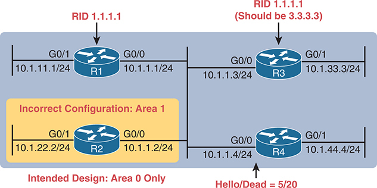
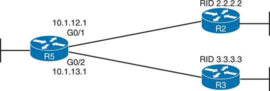
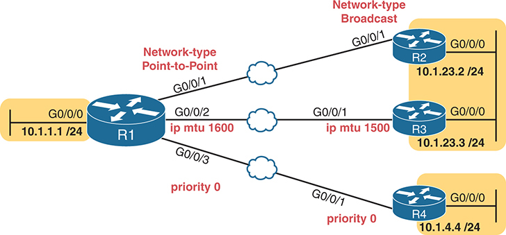
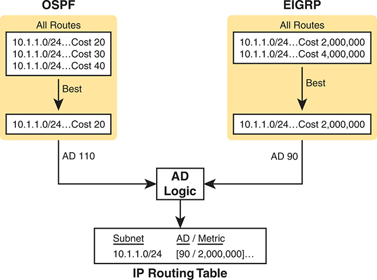
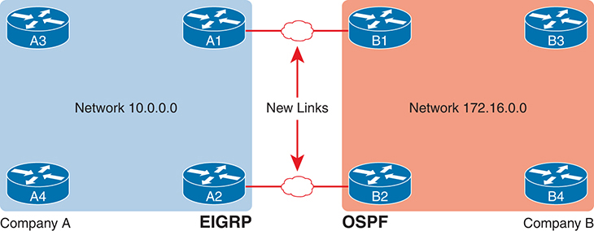
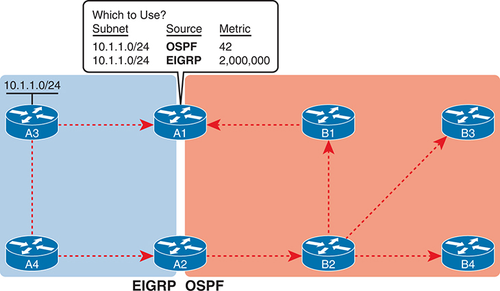
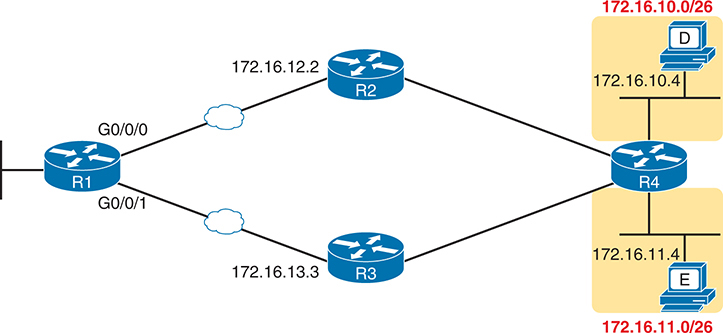
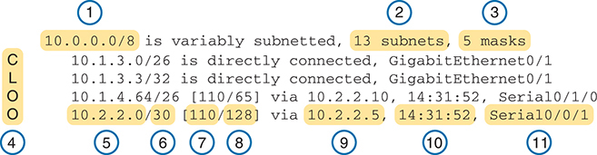

# Chapter 24


## OSPF Neighbors and Route Selection

This chapter covers the following exam topics:

3.0 IP Connectivity

3.1 Interpret the components of routing table

3.1.e Administrative distance

3.2 Determine how a router makes a forwarding decision by default

3.2.a Longest prefix match

3.2.b Administrative distance

3.2.c Routing protocol metric

3.4 Configure and verify single area OSPFv2

3.4.a Neighbor adjacencies

3.4.b Point-to-point

3.4.c Broadcast (DR/BDR selection)

3.4.d Router ID

[Chapter 21](vol1_ch21.md#ch21), "[Understanding OSPF Concepts](vol1_ch21.md#ch21)," and [Chapter 22](vol1_ch22.md#ch22), "[Implementing Basic OSPF Features](vol1_ch22.md#ch22)," discuss the required and most common optional OSPF configuration settings, along with the many verification commands to show how OSPF works with those settings. This chapter continues with more OSPF implementation topics, both to round out the discussion of OSPF and to focus even more on the specific CCNA 200-301 exam topics.

The first major section focuses on neighbors and neighbor adjacencies, as mentioned in yet another of the OSPF exam topics. OSPF routers cannot exchange LSAs with another router unless they first become neighbors. This section discusses the various OSPF features that can prevent OSPF routers from becoming neighbors and how you can go about discovering if those bad conditions exist--even if you do not have access to the running configuration.

The chapter closes with a section called "[Route Selection](vol1_ch24.md#ch24lev1sec4)," which discusses OSPF logic plus IP routing logic. This section tackles the question of what route the router should choose, focusing on the cases in which multiple routes exist. The text discusses how OSPF chooses between competing routes and how routers match packet destination addresses to the routes that already exist in the IP routing table.

### "Do I Know This Already?" Quiz

Take the quiz (either here or use the PTP software) if you want to use the score to help you decide how much time to spend on this chapter. The letter answers are listed at the bottom of the page following the quiz. [Appendix C](vol1_appc.md#appc), found both at the end of the book as well as on the companion website, includes both the answers and explanations. You can also find both answers and explanations in the PTP testing software.

**Table 24-1** "Do I Know This Already?" Foundation Topics Section-to-Question Mapping

| Foundation Topics Section | Questions |
| --- | --- |
| OSPF Neighbor Relationships | 1-3 |
| Route Selection | 4-7 |

**[1](vol1_ch24.md#ques24_1a).** An engineer connects Routers R11 and R12 to the same Ethernet LAN and configures them to use OSPFv2. Which answers describe a combination of settings that would prevent the two routers from becoming OSPF neighbors? (Choose two answers.)

1. R11's interface uses area 11 while R12's interface uses area 12.
2. R11's OSPF process uses process ID 11 while R12's uses process ID 12.
3. R11's interface uses OSPF priority 11 while R12's uses OSPF priority 12.
4. R11's interface uses an OSPF Hello timer value of 11 while R12's uses 12.

**[2](vol1_ch24.md#ques24_2a).** An engineer connects Routers R13 and R14 to the same Ethernet LAN and configures them to use OSPFv2. Which answers describe a combination of settings that would prevent the two routers from becoming OSPF neighbors?

1. Both routers' interface IP addresses reside in the same subnet.
2. Both routers' OSPF process uses process ID 13.
3. Both routers' OSPF process uses router ID 13.13.13.13.
4. Both routers' interfaces use an OSPF Dead interval of 40.

**[3](vol1_ch24.md#ques24_3a).** Router R15 has been a working part of a network that uses OSPFv2. An engineer then issues the **shutdown** command in OSPF configuration mode on R15. Which of the following occurs?

1. R15 empties its IP routing table of all OSPF routes but keeps its LSDB intact.
2. R15 empties its OSPF routes and LSDB but keeps OSPF neighbor relationships active.
3. R15 keeps OSPF neighbors open but does not accept new OSPF neighbors.
4. R15 keeps all OSPF configuration but ceases all OSPF activities (routes, LSDB, neighbors).

**[4](vol1_ch24.md#ques24_4a).** Using OSPF, Router R1 learns three routes to subnet 10.1.1.0/24. It first calculates a route through Router R2 with metric 15000, then a route through Router R3 with metric 15001, and then a route through Router R4 with metric 15000. Which routes does the router place into its routing table, assuming all default configuration settings for any features that would impact the answer?

1. Only the route with R2 as the next-hop router
2. Both routes with metric 15000
3. All three routes to subnet 10.1.1.0/24
4. Only the router with R3 as the next-hop router

**[5](vol1_ch24.md#ques24_5a).** Router R2 runs both EIGRP and OSPF. It learns two OSPF routes to subnet 172.16.1.0/24, one with metric 1000 and one with metric 2000. It learns two EIGRP routes with metrics 1,000,000 and 2,000,000. If using default settings for any settings that might impact the answer, which route(s) will the router place into the IP routing table?

1. The metric 1000 OSPF route and the metric 1,0000,000 EIGRP route
2. The metric 2000 OSPF route and the metric 2,0000,000 EIGRP route
3. The metric 1000 OSPF route only
4. The metric 1,0000,000 EIGRP route only

**[6](vol1_ch24.md#ques24_6a).** Router R3 receives a packet with destination IP address 172.20.89.100. How many of the address ranges defined in the routes per the **show ip route** command match the packet's destination address?

[Click here to view code image](vol1_ch24_images.md#f0610-01)

```
R3# show ip route
Gateway of last resort is 172.20.15.5 to network 0.0.0.0

O*E2  0.0.0.0/0 [110/1] via 172.20.15.5, 00:04:56, GigabitEthernet0/1
      172.20.0.0/16 is variably subnetted, 12 subnets, 4 masks
S        172.20.90.9/32 [1/0] via 172.20.11.1
O IA     172.20.88.0/23 [110/3] via 172.20.12.2, 00:03:44, GigabitEthernet0/0/2
O IA     172.20.80.0/20 [110/3] via 172.20.13.3, 00:04:55, GigabitEthernet0/0/3
O IA     172.20.0.0/16 [110/6] via 172.20.14.4, 00:02:14, GigabitEthernet0/0/4
```

1. 1
2. 2
3. 3
4. 4
5. 5

**[7](vol1_ch24.md#ques24_7a).** Router R3 receives a packet with destination IP address 172.20.90.1. Which next-hop IP address does Router R3 use when forwarding the packet?

[Click here to view code image](vol1_ch24_images.md#f0610-02)

```
R3# show ip route
Gateway of last resort is 172.20.15.5 to network 0.0.0.0

O*E2  0.0.0.0/0 [110/1] via 172.20.15.5, 00:04:56, GigabitEthernet0/1
      172.20.0.0/16 is variably subnetted, 12 subnets, 4 masks
S        172.20.90.9/32 [1/0] via 172.20.11.1
O IA     172.20.88.0/23 [110/3] via 172.20.12.2, 00:03:44, GigabitEthernet0/0/2
O IA     172.20.80.0/20 [110/3] via 172.20.13.3, 00:04:55, GigabitEthernet0/0/3
O IA     172.20.0.0/16 [110/6] via 172.20.14.4, 00:02:14, GigabitEthernet0/0/4
```

1. 172.20.11.1
2. 172.20.12.2
3. 172.20.13.3
4. 172.20.14.4
5. 172.20.15.5

Answers to the "Do I Know This Already?" quiz:

**[1](vol1_appc.md#ques24_1)** A, D

**[2](vol1_appc.md#ques24_2)** C

**[3](vol1_appc.md#ques24_3)** D

**[4](vol1_appc.md#ques24_4)** B

**[5](vol1_appc.md#ques24_5)** D

**[6](vol1_appc.md#ques24_6)** D

**[7](vol1_appc.md#ques24_7)** C

### Foundation Topics

### OSPF Neighbor Relationships

A router's OSPF configuration enables OSPF on a set of interfaces. IOS then attempts to discover other neighbors on those interfaces by sending and listening for OSPF Hello messages. However, once discovered, two routers may not become neighbors. They must have compatible values for several settings as listed in the Hellos exchanged between the two routers. This second major section of the chapter examines those reasons.

#### OSPF Neighbor Requirements

After an OSPF router hears a Hello from a new neighbor, the routing protocol examines the information in the Hello and compares that information with the local router's own settings. If the settings match, great. If not, the routers do not become neighbors. Because there is no formal term for all these items that a routing protocol considers, this book just calls them *neighbor requirements*. [Table 24-2](vol1_ch24.md#ch24tab02) lists the neighbor requirements for OSPF, with some comments about the various issues following the table.


**Table 24-2** Neighbor Requirements for OSPF

| Requirement | Required for OSPF | Neighbor Missing If Incorrect |
| --- | --- | --- |
| Interfaces must be in an up/up state. | Yes | Yes |
| Access control lists (ACL) must not filter routing protocol messages. | Yes | Yes |
| Interfaces must be in the same subnet. | Yes | Yes |
| Neighbors must pass routing protocol neighbor authentication (if configured). | Yes | Yes |
| Hello and dead timers must match. | Yes | Yes |
| Router IDs (RID) must be unique. | Yes | Yes |
| Neighbors must be in the same area. | Yes | Yes |
| OSPF process must not be shut down. | Yes | Yes |
| OSPF must not be shut down on the interface. | Yes | Yes |
| Neighboring interfaces must use same MTU setting. | Yes | No |
| Neighboring interfaces must use same OSPF network type. | Yes | No |
| Neighboring interfaces cannot both use priority 0. | Yes | No |

First, consider the meaning of the two rightmost columns. The column labeled "Required for OSPF" means that the item must be working correctly for the neighbor relationship to work correctly. The last column heading notes whether the neighbor will be missing ("yes") in the list of OSPF neighbors in commands like the **show ip ospf neighbor** command.

The table breaks into three sections. The first section lists non-OSPF configuration while the second lists OSPF configuration--all of which prevents OSPF neighbor relationships from forming. The third section lists settings that allow OSPF neighbor relationships, but with other related problems that prevent the addition of correct OSPF routes to the IP routing table.

For reference, [Table 24-3](vol1_ch24.md#ch24tab03) relists some of the requirements from [Table 24-2](vol1_ch24.md#ch24tab02), along with the most useful commands to find the related settings.


**Table 24-3** OSPF Neighbor Requirements and the Best **show**/**debug** Commands

| Requirement | Best show Command |
| --- | --- |
| Hello and dead timers must match. | **show ip ospf interface** |
| Neighbors must be in the same area. | **show ip ospf interface brief** |
| RIDs must be unique. | **show ip ospf** |
| Neighbors must pass any neighbor authentication. | **show ip ospf interface** |
| OSPF process must not be shut down. | **show ip ospf, show ip ospf interface** |

The rest of this section looks at some of the items from [Table 24-3](vol1_ch24.md#ch24tab03) in a little more detail.

Note

One configuration choice that people sometimes think is an issue, but is not, is the process ID as defined by the **router ospf** *process-id* command. Neighboring routers can use the same process ID values, or different process ID values, with no impact on whether two routers become OSPF neighbors.

#### Issues That Prevent Neighbor Adjacencies

The next few pages look at three neighbor issues from [Table 24-2](vol1_ch24.md#ch24tab02), using [Figure 24-1](vol1_ch24.md#ch24fig01)'s topology in the examples. R1 begins with all correct configuration as listed in [Example 24-1](vol1_ch24.md#exa24_1). However, later examples introduce configuration mistakes on Routers R2, R3, and R4 as follows:

* R2 has been reconfigured to place both LAN interfaces in area 1, whereas the other three routers' G0/0 interfaces remain in area 0.
* R3 has been reconfigured to use the same RID (1.1.1.1) as R1.
* R4 has been reconfigured with Hello/Dead timers of 5/20 on its G0/0 interface, instead of the default settings of 10/40 used by R1, R2, and R3.




**Figure 24-1** *Summary of Problems That Prevent OSPF Neighbors on the Central LAN*

The network design features four routers labeled R1, R2, R3, and R4. R1 and R3 contain a unique Router ID (R I D): R I D 1.1.1.1 for R1 and R I D 1.1.1.1 (should be 3.3.3.3) for R3. The routers are interconnected via interfaces. R1 has subnet 10.1.11.1/24 connected via the G0/1 interface and subnet 10.1.1.1/24 connected via the G0/0 interface. R2 has subnet 10.1.22.2/24 connected via the G0/1 interface and subnet 10.1.1.2/24 connected via the G0/0 interface in the Incorrect Configuration: Area 1 with Intended Design: Area 0 Only. R3 has subnet 10.1.1.3/24 connected via the G0/0 interface and subnet 10.1.33.3/24 connected via the G0/1 interface. R4 has subnet 10.1.1.4/24 connected via the G0/0 interface indicating Hello/Dead equals 5/20 and subnet 10.1.44.4/24 connected via the G0/1 interface.

**Example 24-1** *Router R1 Configuration with No Configuration Issues*

[Click here to view code image](vol1_ch24_images.md#f0613-01)

```
router ospf 1
 router-id 1.1.1.1
!
 interface gigabitEthernet0/0
 ip address 10.1.1.1 255.255.255.0
 ip ospf 1 area 0
!
interface gigabitEthernet0/1
 ip address 10.1.11.1 255.255.255.0
 ip ospf 1 area 0
```

##### Finding Area Mismatches

To create an area mismatch, the configuration on some router must place the interface into the wrong area per the design. [Figure 24-1](vol1_ch24.md#ch24fig01) shows the intent to make that mistake on Router R2, placing both its interfaces into area 1 instead of area 0. [Example 24-2](vol1_ch24.md#exa24_2) shows the configuration, which uses the correct syntax (and is therefore accepted by the router) but sets the wrong area number.

**Example 24-2** *Setting Area 1 on R2's Interfaces, When They Should Be in Area 0*

[Click here to view code image](vol1_ch24_images.md#f0613-02)

```
router ospf 1
 router-id 2.2.2.2
!
interface gigabitEthernet0/0
 ip address 10.1.1.2 255.255.255.0
 ip ospf 1 area 1
!
interface gigabitEthernet0/1
 ip address 10.1.22.2 255.255.255.0
 ip ospf 1 area 1
```

With an area mismatch error, the **show ip ospf neighbor** command will not list the neighbor. Because you see nothing in the OSPF neighbor table, to troubleshoot this problem, you need to find the area configuration on each interface on potentially neighboring routers. To do so:

* Check the output of **show running-config** to look for:

  * **ip ospf** *process-id* **area** *area-number* interface subcommands
  * **network** commands in OSPF configuration mode
* Use the **show ip ospf interface** [**brief**] command to list the area number

##### Finding Duplicate OSPF Router IDs

Next, [Example 24-3](vol1_ch24.md#exa24_3) shows R1 and R3 both trying to use RID 1.1.1.1. Due to the duplicate RIDs, neither router will list the other in the output of the **show ip ospf neighbor** command. Interestingly, both routers automatically generate a log message for the duplicate OSPF RID problem between R1 and R3; the end of [Example 24-3](vol1_ch24.md#exa24_3) shows one such message. For the exams, just use the **show ip ospf** commands on both R3 and R1 to easily list the RID on each router, noting that they both use the same value.

**Example 24-3** *Comparing OSPF Router IDs on R1 and R3*

[Click here to view code image](vol1_ch24_images.md#f0614-01)

```
! Next, on R3: R3 lists the RID of 1.1.1.1
!
R3# show ip ospf
Routing Process "ospf 1" with ID 1.1.1.1
Start time: 00:00:37.136, Time elapsed: 02:20:37.200
! lines omitted for brevity
```

```
! Back to R1: R1 also uses RID 1.1.1.1
R1# show ip ospf
Routing Process "ospf 1" with ID 1.1.1.1
Start time: 00:01:51.864, Time elapsed: 12:13:50.904
! lines omitted for brevity

*May 29 00:01:25.679: %OSPF-4-DUP_RTRID_NBR: OSPF detected duplicate router-id
1.1.1.1 from 10.1.1.3 on interface GigabitEthernet0/0
```

First, focus on the problem: the duplicate RIDs. The first line of the **show ip ospf** command on the two routers quickly shows the duplicate use of 1.1.1.1. To solve the problem, assuming R1 should use 1.1.1.1 and R3 should use another RID (maybe 3.3.3.3), change the RID on R3 and restart the OSPF process. To do so, use the **router-id 3.3.3.3** OSPF subcommand and the EXEC mode command **clear ip ospf process**. (OSPF will not begin using a new RID value until the process restarts, either via command or reload.) At that point, the routers should become neighbors again and be displayed in the output of the **show ip ospf neighbor** command.

Note

There are cases in which routers in different areas can use the same RID and cause no problems in OSPF. However, to be safe, use unique OSPF RIDs throughout the entire OSPF domain (that is, among all routers in your enterprise that use OSPF).

##### Finding OSPF Hello and Dead Timer Mismatches

First, as a reminder from chapters past:

* **Hello interval/timer:** The per-interface timer that tells a router how often to send OSPF Hello messages on an interface.
* **Dead interval/timer:** The per-interface timer that tells the router how long to wait without having received a Hello from a neighbor before believing that neighbor has failed. (Defaults to four times the Hello timer.)

Next, consider the problem created on R4, with the configuration of a different Hello timer and dead timer (5 and 20, respectively) as compared with the default settings on R1, R2, and R3 (10 and 40, respectively). A Hello or Dead interval mismatch prevents R4 from becoming neighbors with any of the other three OSPF routers. Routers list their Hello and Dead interval settings in their Hello messages and choose not to become neighbors if the values do not match. As a result, none of the routers become neighbors with Router R4 in this case.

[Example 24-4](vol1_ch24.md#exa24_4) shows the easiest way to find the mismatch using the **show ip ospf interface** command on both R1 and R4. This command lists the Hello and Dead timers for each interface, as highlighted in the example. Note that R1 uses 10 and 40 (Hello and Dead), whereas R4 uses 5 and 20.

**Example 24-4** *Finding Mismatched Hello/Dead Timers*

[Click here to view code image](vol1_ch24_images.md#f0615-01)

```
R1# show ip ospf interface G0/0
GigabitEthernet0/0 is up, line protocol is up
  Internet Address 10.1.1.1/24, Area 0, Attached via Network Statement
  Process ID 1, Router ID 1.1.1.1, Network Type BROADCAST, Cost: 1
  Topology-MTID  Cost  Disabled  Shutdown   Topology Name
        0         1       no        no         Base
  Transmit Delay is 1 sec, State DR, Priority 1
  Designated Router (ID) 1.1.1.1, Interface address 10.1.1.1
  No backup designated router on this network
  Timer intervals configured, Hello 10, Dead 40, Wait 40, Retransmit 5
! lines omitted for brevity
```

```
! Moving on to R4 next
!
R4# show ip ospf interface Gi0/0
GigabitEthernet0/0 is up, line protocol is up
   Internet Address 10.1.1.4/24, Area 0, Attached via Network Statement
   Process ID 4, Router ID 10.1.44.4, Network Type BROADCAST, Cost: 1
  Topology-MTID  Cost  Disabled  Shutdown   Topology Name
        0         1       no        no         Base
  Transmit Delay is 1 sec, State DR, Priority 1
  Transmit Delay is 1 sec, State DR, Priority 1
  Designated Router (ID) 10.1.44.4, Interface address 10.1.1.4
  No backup designated router on this network
  Timer intervals configured, Hello 5, Dead 20, Wait 20, Retransmit 5
! lines omitted for brevity
```

##### Shutting Down the OSPF Process

Like administratively disabling and enabling an interface, IOS also allows the OSPFv2 routing protocol process to be disabled and enabled with the **shutdown** and **no shutdown** router mode subcommands, respectively. When a routing protocol process is shut down, IOS does the following:

* Brings down all neighbor relationships and clears the OSPF neighbor table
* Clears the LSDB
* Clears the IP routing table of any OSPF-learned routes

At the same time, shutting down OSPF does retain some important details about OSPF, in particular:

* IOS retains all OSPF configuration.
* IOS still lists all OSPF-enabled interfaces in the OSPF interface list (**show ip ospf interface**) but in a DOWN state.

Shutting down the OSPF routing protocol process allows the network engineer to stop using the routing protocol on that router without having to remove all the configuration. Once the process is shut down, the **show ip ospf interface** [**brief**] command should still list some output, as will the **show ip ospf** command, but the rest of the commands will list nothing.

[Example 24-5](vol1_ch24.md#exa24_5) shows an example on Router R5, as shown in [Figure 24-2](vol1_ch24.md#ch24fig02). R5 is a different router than the one used in earlier examples, but it begins the example with two OSPF neighbors, R2 and R3, with Router IDs 2.2.2.2 and 3.3.3.3. The example shows the OSPF process being shut down, the neighbors failing, and those two key OSPF **show** commands: **show ip ospf neighbor** and **show ip ospf interface brief**.




**Figure 24-2** *Example Network to Demonstrate OSPF Process Shutdown*

A network consisting of three routers: R5, R2, and R3. R5 is connected to both R2 and R3. R5 is connected to R2 through the IP address 10.1.12.1 and interface G0/1, while it is connected to R3 through the IP address 10.1.13.1 and interface G0/2. Both the connected routers have a unique Router ID (R I D); R I D 2.2.2 for router R2, R I D 3.3.3.3 for router R3.

**Example 24-5** *Shutting Down an OSPF Process, and the Resulting Neighbor States*

[Click here to view code image](vol1_ch24_images.md#f0616-01)

```
R5# show ip ospf neighbor
Neighbor ID    Pri   State        Dead Time    Address         Interface
2.2.2.2          1   FULL/DR      00:00:35     10.1.12.2       GigabitEthernet0/1
3.3.3.3          1   FULL/DR      00:00:33     10.1.13.3       GigabitEthernet0/2
R5# configure terminal
Enter configuration commands, one per line. End with CNTL/Z.
R5(config)# router ospf 1
R5(config-router)# shutdown
R5(config-router)# ^Z
*Mar 23 12:43:30.634: %OSPF-5-ADJCHG: Process 1, Nbr 2.2.2.2 on GigabitEthernet0/1
from FULL to DOWN, Neighbor Down: Interface down or detached
*Mar 23 12:43:30.635: %OSPF-5-ADJCHG: Process 1, Nbr 3.3.3.3 on GigabitEthernet0/2
from FULL to DOWN, Neighbor Down: Interface down or detached
R5# show ip ospf interface brief
Interface    PID    Area        IP Address/Mask   Cost  State Nbrs F/C
Gi0/1        1      0           10.1.12.1/24      1     DOWN  0/0
Gi0/2        1      0           10.1.13.1/24      1     DOWN  0/0
R5# show ip ospf
 Routing Process "ospf 1" with ID 5.5.5.5
 Start time: 5d23h, Time elapsed: 1d04h
 Routing Process is shutdown

! lines omitted for brevity
R5# show ip ospf neighbor
R5#
R5# show ip ospf database
            OSPF Router with ID (3.3.3.3) (Process ID 1)
R5#
```

First, before the **shutdown**, the **show ip ospf neighbor** command lists two neighbors. After the **shutdown**, the same command lists no neighbors at all. Second, the **show ip ospf interface brief** command lists the interfaces on which OSPF is enabled, on the local router's interfaces. However, it lists a state of DOWN, which is a reference to the local router's state. Also, note that the **show ip ospf** command positively states that the OSPF process is in a shutdown state, while the **show ip ospf database** command output lists only a heading line, with no LSAs.

##### Shutting Down OSPF on an Interface

IOS also supports a feature to disable OSPF on an interface without having to remove any OSPF configuration to do so. The feature has the same motivations as the **shutdown** command in router configuration mode: to allow OSPF configuration to remain while stopping OSPF. However, shutting down OSPF on an interface ceases all OSPF operations on that interface rather than all OSPF operations on the router.

To shut down OSPF on an interface, use the **ip ospf shutdown** interface subcommand, and to enable it again, use the **no ip ospf shutdown** command. After you use the **ip ospf shutdown** command, the router changes as follows:

* The router stops sending Hellos on the interface, allowing existing OSPF neighbor relationships to time out.
* The neighbor failure(s) triggers OSPF reconvergence, resulting in the removal of any routes that use the interface as an outgoing interface.
* The router also stops advertising about the subnet on the link that is shut down.

If those ideas sound familiar, the feature works much like OSPF passive interfaces, except that when shut down, OSPF also stops advertising about the connected subnet.

Interestingly, using the **ip ospf shutdown** interface subcommand also does not change a few commands about interfaces. For instance, after you configure interface G0/0/0 with the **ip ospf shutdown** command, the **show ip ospf interface** and **show ip ospf interface brief** commands still show G0/0/0 in the list of interfaces.

#### Issues That Allow Neighbors but Prevent IP Routes

Some configuration mismatches prevent learning OSPF routes, but they do allow routers to become neighbors, as noted in the final section of [Table 24-2](vol1_ch24.md#ch24tab02). The issues are

* A mismatched MTU setting

  
* A mismatched OSPF network type
* Both neighbors using OSPF Priority 0

The next few pages explain the issues, with an example that shows all three misconfigurations along with the resulting **show** commands.

##### Mismatched MTU Settings

The maximum transmission unit (MTU) size defines a per-interface setting used by the router for its Layer 3 forwarding logic, defining the largest network layer packet that the router will forward out each interface. The IPv4 MTU size of an interface defines the maximum size IPv4 packet that the router can forward out an interface, and similarly, the IPv6 MTU size defines the largest IPv6 packet.

Routers often use a default IP MTU size of 1500 bytes, with the ability to set the value as well. The **ip mtu** *size* interface subcommand defines the IPv4 MTU setting, and the **ipv6 mtu** *size* command sets the equivalent for IPv6 packets.

Alternatively, you can set the MTU size for IPv4 and IPv6 using the **mtu** *size* interface subcommand. That command sets the MTU for IPv4 on the interface if the **ip mtu** *size* command does not appear and for IPv6 if the **ipv6 mtu** *size* command does not appear.

With different IPv4 MTU settings, two OSPFv2 routers become OSPF neighbors; however, they fail to complete regular OSPF database exchange, reaching other interim OSPF neighbor states and then failing to a down state. Over time, they repeat the process to become neighbors, try to exchange their LSDBs, fail, and fall back to a down state.

##### Mismatched OSPF Network Types

In the section, "[OSPF Network Types](vol1_ch23.md#ch23lev1sec3)," in [Chapter 23](vol1_ch23.md#ch23), "[Implementing Optional OSPF Features](vol1_ch23.md#ch23)," you read about the OSPF broadcast network type, which uses a DR/BDR, and the OSPF point-to-point network type, which does not. Interestingly, if you misconfigure network type settings such that one router uses broadcast, and the other uses point-to-point, the two routers become neighbors and reach a full state. They remain stable in a full state, which means they exchanged their LSDBs; however, neither router can use routes based on LSAs learned from the neighbor.

The reason for not adding the routes has to do with the details of LSAs and how the use of a DR (or not) changes those LSAs. Basically, the two routers expect different details in the LSAs, and the SPF algorithm notices those differences and cannot resolve those differences when calculating routes.

##### Both Neighbors Using OSPF Priority 0

OSPF interface priority allows us to influence which router wins a DR or BDR election when using the broadcast network type. The highest priority router wins the election, with 1 as the default setting and allowed values ranging from 0 to 255 decimal.

Priority 0 acts as a special case meaning that the router will not serve as DR or BDR. For instance, in a topology with many routers sharing the same subnet, you could choose to make some routers use priority 0, effectively refusing to become DR or BDR so that you have more predictability when operating the network.

A problem occurs when you make the poor configuration choice to make all routers on a subnet use priority 0. If making that mistake, you have a subnet that must have a DR but for which all routers refuse the role. The routers proceed as normal to use Hellos to discover each other. They list each other as neighbors and reach a 2WAY state. However, because no router serves as the DR, the database exchange process stops at that point. The typical symptom is a stable neighbor in a 2WAY/DROTHER state.

##### Examples That Show OSPF Neighbors but No Routes

[Figure 24-3](vol1_ch24.md#ch24fig03) shows a router topology used in an upcoming example. In this case, R1 uses poor configuration choices that cause the problems discussed in the previous few pages. In particular:

**R1 G0/0/1:** Uses network type point-to-point; R2 uses default setting broadcast.

**R1 G0/0/2:** Uses an IPv4 MTU of 1600; R3 uses the default setting 1500.

**R1 G0/0/3:** Both R1 and R4 use an OSPF priority of 0.




**Figure 24-3** *OSPF Mistakes: Neighbors Formed, but Routes Not Learned*

The network infrastructure consists of four routers, labeled R1 through R4. R1, with interface G0/0/0, is connected to subnet 10.1.1.1/24. R1 with interface G0/0/1 (Network-type Point-to-Point) is connected to R2 with interface G0/0/1 (Network-type Broadcast) via Ethernet W A N. R2 is connected to subnet 10.1.23.2/24 through interface G0/0/0. Furthermore, R1, with interface G0/0/2 (ip mtu 1600) is connected to R3 with interface G0/0/1 (ip mtu 1500) via Ethernet W A N. R3 is connected to subnet 10.1.23.3/24 through interface G0/0/0. Lastly, R1, with interface G0/0/3 (priority 0) is connected to R4 with interface G0/0/1 (priority 0) via Ethernet W A N. R4 is connected to subnet 10.1.4.4/24 through interface G0/0/0.

To begin, [Example 24-6](vol1_ch24.md#exa24_6) shows the Router R1 configuration to cause the problems shown in the figure. Routers R2, R3, and R4 use all default configuration related to these parameters other than R4, which also requires the **ip ospf priority 0** interface subcommand. The example shows only the relevant configuration.

[Example 24-7](vol1_ch24.md#exa24_7) shows the results. First, note that Routers R2, R3, and R4 use OSPF RIDs 2.2.2.2, 3.3.3.3, and 4.4.4.4, respectively. The example begins with a **show ip ospf neighbor** command at a time when the neighbor relationships reach their best states.

**Example 24-6** *OSPF Configuration Settings Matching [Figure 24-3](vol1_ch24.md#ch24fig03)*

[Click here to view code image](vol1_ch24_images.md#f0620-01)

```
R1# show running-config interface g0/0/1
! Neighboring router R2 defaults to network type broadcast
interface GigabitEthernet0/0/1
 ip address 10.1.12.1 255.255.255.0
 ip ospf network point-to-point
 ip ospf 1 area 0

R1# show running-config interface g0/0/2
! Neighboring router R3 defaults to IP MTU 1500
interface GigabitEthernet0/0/2
 ip address 10.1.13.1 255.255.255.0
 ip mtu 1600
 ip ospf 1 area 0

R1# show running-config interface g0/0/3
! Neighboring router R4 is also configured for OSPF priority 0
interface GigabitEthernet0/0/3
 ip address 10.1.14.1 255.255.255.0
 ip ospf priority 0
 ip ospf 1 area 0
```

**Example 24-7** *Resulting OSPF Neighbor Relationships on Router R1*

[Click here to view code image](vol1_ch24_images.md#f0620-02)

```
R1# show ip ospf neighbor

Neighbor ID     Pri   State           Dead Time   Address      Interface
4.4.4.4           0   2WAY/DROTHER    00:00:38    10.1.14.4    GigabitEthernet0/0/3
3.3.3.3           0   EXCHANGE/DROTHER00:00:38    10.1.13.3    GigabitEthernet0/0/2
2.2.2.2           0   FULL/  -        00:00:39    10.1.12.2    GigabitEthernet0/0/1
R1#

*Nov  2 21:38:34.046: %OSPF-5-ADJCHG: Process 1, Nbr 3.3.3.3 on GigabitEthernet0/0/2
from EXCHANGE to DOWN, Neighbor Down: Too many retransmissions

R1# show ip ospf neighbor

Neighbor ID     Pri   State           Dead Time   Address      Interface
4.4.4.4           0   2WAY/DROTHER    00:00:31    10.1.14.4    GigabitEthernet0/0/3
3.3.3.3           0   DOWN/DROTHER       -        10.1.13.3    GigabitEthernet0/0/2
2.2.2.2           0   FULL/  -        00:00:34    10.1.12.2    GigabitEthernet0/0/1
```

In this case, R1's neighbor relationship with Router R3 (3.3.3.3) cycles through different states. The middle of the example shows messages about how this neighbor relationship fails. Then the end of the example shows neighbor 3.3.3.3 now in a DOWN state. Over time, the neighbor relationship cycles through repeated attempts.

Note that none of the three neighbor relationships result in any IP routes. In this case, the **show ip route ospf** command on R1 lists zero routes.

### Route Selection

When OSPF calculates routes to a specific subnet, the competition between routes might be simple and obvious. A router might calculate a single route for a subnet and use that route. A router might calculate multiple routes to reach a subnet, so it finds the route with the lowest metric (cost), placing that route into the IP routing table.

However, other scenarios occur both inside and outside of OSPF, requiring more understanding of the logic used by a router. This final major section of the chapter discusses three topics that make us think about the following:

1. How one router chooses between multiple equal-cost OSPF routes for one subnet
2. How one router chooses between multiple routes for one subnet that were learned by different routing protocols
3. When forwarding packets, how routers match routes in the routing table, particularly when a packet's destination address matches more than one route

#### Equal-Cost Multipath OSPF Routes

Consider the routes that one OSPF router calculates for one destination subnet. When more than one route to that one subnet exists, one route may have the lowest metric, making OSPF's logic simple: Add that route to the IP routing table. However, when the metrics tie for multiple routes to the same subnet, the router applies different logic: It places multiple [equal-cost routes](vol1_gloss.md#gloss_125) in the routing table.

IOS limits the concurrent equal-cost OSPF routes for each destination subnet based on the **maximum-paths** *number* subcommand under **router ospf**. The default varies depending on the router platform, with a common default setting of four concurrent routes.

For example, consider the most recent [Figure 24-3](vol1_ch24.md#ch24fig03), but with all configuration errors fixed, all routers learn routes to all subnets. Router R1 has only one possible route to reach subnet 10.1.4.0/24, located off Router R4. However, R1 has two possible routes to reach subnet 10.1.23.0/24: one route through neighbor R2 and one through neighbor R3. If using OSPF costs 10 for all GigabitEthernet interfaces, both R1's routes to subnet 10.1.23.0/24 have a cost of 20. [Example 24-8](vol1_ch24.md#exa24_8) shows that result with a list of OSPF-learned routes on Router R1.

Take an extra moment to look closely at the last two lines of output. Note that the output does not repeat the subnet ID and mask, listing it once, but leaving spaces in that position in the last line. That format should help you identify cases like this of multiple routes for the same subnet. Also, note the second number within brackets lists the metric, 20 for both routes, confirming they have an equal metric (cost).

**Example 24-8** *OSPF Routes on Router R1 from [Figure 24-3](vol1_ch24.md#ch24fig03)*

[Click here to view code image](vol1_ch24_images.md#f0622-01)

```
R1# show ip route ospf
! Legend omitted for brevity

Gateway of last resort is not set

      10.0.0.0/8 is variably subnetted, 14 subnets, 2 masks
O        10.1.4.0/24 [110/20] via 10.1.14.4, 00:00:17, GigabitEthernet0/0/3
O        10.1.23.0/24 [110/20] via 10.1.13.3, 00:00:20, GigabitEthernet0/0/2
                      [110/20] via 10.1.12.2, 00:00:23, GigabitEthernet0/0/1
```

Now, think about packet forwarding instead of thinking about the logic of placing routes into the routing table. Which of the two routes to subnet 10.1.23.0/24 should R1 use? How should it take advantage of the two equal-cost routes? A router could load balance the packets on a per-packet basis, but that is a poor choice for a few reasons. Instead, by default, routers balance based on the individual destination address. The router sends packets for one destination IP address using one route, another destination address using the other route, and so on. Using destination-based load balancing allows for much less router overhead and avoids some of the problems that occur with per-packet load balancing.

Note

The logic in this section often goes by the name [equal-cost multipath (ECMP)](vol1_gloss.md#gloss_124).

#### Multiple Routes Learned from Competing Sources

A typical enterprise router first learns connected routes, based on interface IP addresses. Those routes happen to be the best routes to reach those subnets because those subnets connect directly to the router. Additionally, each enterprise router uses one routing protocol (for example, OSPF) to dynamically learn all other routes.

However, in several legitimate cases, one router learns routes using more than connected routes plus one routing protocol. For instance, some routers also have static routes, as discussed in [Chapter 17](vol1_ch17.md#ch17), "[Configuring IPv4 Addresses and Static Routes](vol1_ch17.md#ch17)." A router configuration could define a static route to a subnet, while the IGP also learns a route to that same subnet. Which route is better? In other cases, one router might run both OSPF and BGP. Again, if both learn a route to the same subnet, which is better? Or a router might use multiple IGPs, like both OSPF and EIGRP. Again, both might learn a route to the same subnet, begging the same question.

Note

To consider routes to be to the same subnet, they must refer to the same subnet ID and subnet mask.

Routing protocol metrics do not help a router choose between competing routes in these cases. For instance, EIGRP commonly assigns metrics with values in the millions and billions, with OSPF using hundreds or thousands. Additionally, connected and static routes have no metrics. So metrics cannot help the router choose the best route in these cases, so IOS needs another method to choose between routes from different sources.

When IOS must choose between routes learned using different routing protocols, IOS uses a concept called [administrative distance](vol1_gloss.md#gloss_216). Administrative distance (AD) is a number that denotes how believable an entire routing protocol is on a single router. The lower the number, the better, or more believable, the routing protocol. For example, RIP has a default administrative distance of 120, OSPF uses a default of 110, and EIGRP defaults to 90. When using OSPF and EIGRP, the router will believe the EIGRP route instead of the OSPF route (at least by default). The administrative distance values are configured on a single router and are not exchanged with other routers. [Table 24-4](vol1_ch24.md#ch24tab04) lists the various sources of routing information, along with the default administrative distances.


**Table 24-4** Default Administrative Distances

| Route Type | Administrative Distance |
| --- | --- |
| Connected | 0 |
| Static | 1 |
| BGP (external routes [eBGP]) | 20 |
| EIGRP (internal routes) | 90 |
| OSPF | 110 |
| IS-IS | 115 |
| RIP | 120 |
| EIGRP (external routes) | 170 |
| BGP (internal routes [iBGP]) | 200 |
| DHCP default route | 254 |
| Unusable | 255 |

Note

The **show ip route** command lists each route's administrative distance as the first of the two numbers inside the brackets. The second number in brackets is the metric.

[Figure 24-4](vol1_ch24.md#ch24fig04) shows what might happen inside each routing process and the choice to prefer the EIGRP route instead of the OSPF route. The left side shows how OSPF learns three routes to subnet 10.1.1.0/24, while EIGRP learns two routes to the same subnet. Each routing protocol chooses the lowest metric route to offer as the best route. However, an additional logic step then considers the administrative distance (AD) of the route. With default settings, the router chooses the EIGRP (AD 90) route instead of the OSPF (AD 110) route for subnet 10.1.1.0/24.

You might wonder at the choice to use more than one routing protocol. One classic case occurs when two companies merge into one company, as shown in [Figure 24-5](vol1_ch24.md#ch24fig05). Company A on the left uses EIGRP with addresses from private network 10.0.0.0. Company B on the right uses OSPF with addresses from private network 172.16.0.0. As a first step to connect the networks, the network engineers install new WAN links between the A1 and B1 router plus the A2 and B2 router as shown in the figure.





**Figure 24-4** *Logic: Choosing the Lowest AD Route Between OSPF and EIGRP*

On the left, the O S P F protocol with an A D of 110 has three routes having I P addresses with costs 20, 30, and 40, out of which the route with cost 20 is selected as the best. On the right, the E I G R P protocol with an A D of 90 has two routes having I P addresses with costs 2,000,000 and 4,000,000, out of which the route with cost 2,000,000 is chosen as the best. The A D Logic in the center compares these two best routes and selects the E I G R P's route for the IP Routing Table.

Next, the routers need to learn routes from both companies. The EIGRP routers on the left need to learn the company B routes known to OSPF on the right, and vice versa. To do that, the networking staff uses a feature called *route redistribution*, in which a *small set of routers run both routing protocols*. Internal to those routers, the router redistributes (takes routes from one protocol and advertises into the other), taking OSPF routes and advertising those subnets using EIGRP, and vice versa.




**Figure 24-5** *First Step: Adding WAN Links Between Existing Company A and B Routers*

Company A operates under the EIGRP protocol and includes routers labeled A1 to A4 within its network, which is labeled 10.0.0.0. Company B operates under the OSPF protocol and includes routers labeled B1 to B4 within its network, which is labeled 172.16.0.0. The new W A N links indicate a connection established between router A2 of Company A and router B2 of Company B and router A1 of Company A and router B1 of Company B.

[Figure 24-6](vol1_ch24.md#ch24fig06) shows the updated scenario, with Routers A1 and A2 performing route redistribution. Most routers continue to run only OSPF or only EIGRP; in this case, Routers B1, B2, B3, and B4 continue to use only OSPF, whereas A3 and A4 use only EIGRP. However, the redistribution process on Routers A1 and A2 advertises routes so that all learn routes to all subnets in network 10.0.0.0 and network 172.16.0.0.





**Figure 24-6** *Example: Router A1 Learns an EIGRP and OSPF Route to Subnet 10.1.1.0/24*

The schematic is divided into two sections: one labeled "EIGRP", which includes routers A1, A2, A3 (IP address 10.1.1.0/24), and A4, and another labeled "OSPF", which contains routers B1, B2, B3, and B4. Router A1 is centrally located between both sections and is depicted as learning routes from both networks. Route A1 has a table titled "Which to Use?", which compares the metrics for OSPF (42) and EIGRP (2,000,000) for reaching subnet 10.1.1.0/24.

The figure uses dashed lines to show the propagation of routing information about subnet 10.1.1.0/24. First, focusing on the left, all four EIGRP routers in former Company A learn a route for subnet 10.1.1.0/24 using EIGRP. Next, follow the dashed lines along the bottom of the drawing, with Router A2 redistributing a route for 10.1.1.0/24 into OSPF. The OSPF routers all learn routes for 10.1.1.0/24 using OSPF. Now Router A1 has a route for subnet 10.1.1.0/24 learned with EIGRP and another learned with OSPF, creating a real-life scenario in which it must use administrative distance.

Note

The CCNP Enterprise certification discusses route redistribution, both concept and configuration. However, the CCNA V1.1 blueprint does not. It is mentioned here only to show a realistic case when a router needs to use administrative distance.

Note

The section "[Floating Static Routes](vol1_ch17.md#ch17lev2sec9)" in [Chapter 17](vol1_ch17.md#ch17) discusses another example of how routers use the AD to choose routes. Take a moment to review that section if you do not recall the details.

#### IP Forwarding with the Longest Prefix Match

For the final few pages of this chapter, focus on how a router matches a packet's destination IP address to one of the routes already placed in the routing table. That process goes by a few terms, like *IP routing*, *forwarding*, or the *data plane*. Regardless, focus on the logic.

A router's IP routing process requires that the router compare the destination IP address of each packet with the existing contents of that router's IP routing table. Often, only one route matches a particular destination address. When only one route matches the packet's destination, the action is obvious: forward the packet based on the details listed in that route.

In some cases, multiple routes exist for the exact same subnet, that is, for the exact same subnet and mask. The earlier section, "[Equal-Cost Multipath OSPF Routes](vol1_ch24.md#ch24lev2sec4)," discussed how OSPF would choose to add these multiple routes to the routing table, and how a router will load balance packets that match those routes.

This section discusses a different case in which a set of routes lists different subnets whose address ranges overlap. In that case, some packets' destination addresses match multiple routes in the IP routing table. For instance, one route might list subnet 10.1.0.0/16, another 10.1.1.0/25, and another 10.1.1.1/32. The range of addresses in each of those subnets includes 10.1.1.1, so a packet sent to IP address 10.1.1.1 would match all those routes.

Many legitimate router features can cause these multiple overlapping routes to appear in a router's routing table, including

* Static routes (including host routes)
* Route autosummarization
* Manual route summarization
* Default routes

In this case, a router chooses the best route as follows:

When a particular destination IP address matches more than one route in a router's IPv4 routing table, and those routes list different rather than identical subnets (different subnet IDs and masks), the router uses [longest prefix match](vol1_gloss.md#gloss_246) logic to match the most specific route--the route with the longest prefix length mask.


##### Using Your Subnetting Math Skills to Predict the Choice of Best Route

One way to predict which route a router uses requires you to use your subnetting skills plus the output from the **show ip route** command. To see how it works, an upcoming example uses several overlapping routes learned by Router R1 in [Figure 24-7](vol1_ch24.md#ch24fig07). [Example 24-9](vol1_ch24.md#exa24_9) focuses on routes that match PC D's IP address (172.16.10.4), matching four routes on Router R1.




**Figure 24-7** *Topology, Interfaces, and Next-Hop Addresses Used with [Example 24-9](vol1_ch24.md#exa24_9)*

A network topology with four routers labeled R1, R2, R3, and R4. R1 is connected to both R2 and R3 via interfaces G0/0/0 with I P address 172.16.12.2 and G0/0/1 with I P address 172.16.13.3 respectively. R2 and R3 are connected to R4, which is connected to two additional next-hop addresses labeled host D and E with I P addresses of 172.16.10.4/26 and 172 .16 .11 .4/26 respectively.


**Example 24-9** ***show ip route** Command with Overlapping Routes*

[Click here to view code image](vol1_ch24_images.md#f0627-01)

```
R1# show ip route
Codes: L - local, C - connected, S - static, R - RIP, M - mobile, B - BGP
       D - EIGRP, EX - EIGRP external, O - OSPF, IA - OSPF inter area
       N1 - OSPF NSSA external type 1, N2 - OSPF NSSA external type 2
       E1 - OSPF external type 1, E2 - OSPF external type 2
       i - IS-IS, su - IS-IS summary, L1 - IS-IS level-1, L2 - IS-IS level-2
       ia - IS-IS inter area, * - candidate default, U - per-user static route
       o - ODR, P - periodic downloaded static route, H - NHRP, l - LISP
       + - replicated route, % - next hop override

Gateway of last resort is 172.16.13.3 to network 0.0.0.0

O*E2  0.0.0.0/0 [110/1] via 172.16.13.3, 00:04:56, GigabitEthernet0/1
      172.16.0.0/16 is variably subnetted, 12 subnets, 4 masks
S        172.16.10.4/32 [1/0] via 172.16.12.2
O IA     172.16.10.0/26 [110/3] via 172.16.13.3, 00:04:56, GigabitEthernet0/0/1
O IA     172.16.10.0/23 [110/6] via 172.16.12.2, 00:04:56, GigabitEthernet0/0/0
O IA     172.16.11.0/26 [110/3] via 172.16.13.3, 00:04:56, GigabitEthernet0/0/1
! Non-overlapping routes omitted for brevity
```

On the exam, or in real life, you would look at each route's subnet ID and mask and do the math to list the range of addresses in each subnet. [Table 24-5](vol1_ch24.md#ch24tab05) shows the result to ensure the math does not get in the way of your understanding the concepts. All the subnets listed in the table match the destination address 172.16.10.4 (PC D).

**Table 24-5** Analysis of Address Ranges for the Subnets in [Example 24-9](vol1_ch24.md#exa24_9)

| Subnet/Prefix of a Route | Address Range | Next-Hop |
| --- | --- | --- |
| 172.16.10.4/32 | 172.16.10.4 (just this one address) | 172.16.12.2 (R2) |
| 172.16.10.0/26 | 172.16.10.0-172.16.10.63 | 172.16.13.3 (R3) |
| 172.16.10.0/23 | 172.16.10.0-172.16.11.255 | 172.16.12.2 (R2) |
| 0.0.0.0/0 | 0.0.0.0-255.255.255.255 (all addresses) | 172.16.13.3 (R3) |

Note

The route listed as 0.0.0.0/0 is the default route.

Working through the logic, note that packet destination 172.16.10.4 matches all routes highlighted in [Example 24-9](vol1_ch24.md#exa24_9) (the routes also listed in [Table 24-5](vol1_ch24.md#ch24tab05)). The various prefix lengths (masks) range from /0 to /32. The longest prefix (largest /P value, meaning the best and most specific route) is /32. So, a packet sent to 172.16.10.4 uses the route to 172.16.10.4/32, not the other routes.

It helps to think through a few more examples. The list identifies other destination addresses and explains why the router matches a specific route in [Example 24-9](vol1_ch24.md#exa24_9).

**172.16.10.4:** PC D. Matches all four highlighted routes; the longest prefix is /32, the route to router 172.16.10.4/32.

**172.16.10.1:** A different host in PC D's subnet, this destination matches the default route (0 prefix length) and the routes with the /23 and /26 prefix lengths. R1 uses the /26 route for subnet 172.16.10.0/26.

**172.16.10.100:** Per [Table 24-5](vol1_ch24.md#ch24tab05), this address resides in the range of addresses for the /23 route, and it matches the default route as always. R1 uses the route with /23 prefix length for subnet 172.16.10.0/23.

**172.16.12.1:** Matches only the default route with /0 prefix length.

##### Using show ip route *address* to Find the Best Route

A second method to identify the route used by a router does not require you to use any subnetting math skills. Instead, use the **show ip route** *address* command, with the packet's destination IP address as the final parameter in the command. The router replies by listing its route when forwarding packets to that address.

For instance, [Example 24-10](vol1_ch24.md#exa24_10) lists the output of the **show ip route 172.16.10.1** command on the same router used in [Example 24-9](vol1_ch24.md#exa24_9). The first line of (highlighted) output lists the matched route: the route to 172.16.10.0/26. The rest of the output lists the details of that particular route, including the outgoing interface of GigabitEthernet0/0/1 and the next-hop router of 172.16.13.3.

**Example 24-10** ***show ip route** Command with Overlapping Routes*

[Click here to view code image](vol1_ch24_images.md#f0628-01)

```
R1# show ip route 172.16.10.1
Routing entry for 172.16.10.0/26
  Known via "ospf 1", distance 110, metric 3, type inter area
  Last update from 172.16.13.3 on GigabitEthernet0/0/1, 00:44:09 ago
  Routing Descriptor Blocks:
  * 172.16.13.3, from 3.3.3.3, 00:44:09 ago, via GigabitEthernet0/0/1
      Route metric is 3, traffic share count is 1
```

Certainly, if answering a lab question on the exam, use this command because it tells you what the router will choose without you doing the subnetting math.

##### Interpreting the IP Routing Table

Here at the end of three consecutive book parts about IP and IP routing, before moving on to [Part VII](vol1_part07.md#part07), "[IP Version 6](vol1_part07.md#part07)," this final topic reviews the most critical router command at the center of the discussion: the **show ip route** command. You have learned the various components of the command output through many examples. This final topic of the chapter pulls the concepts together in one place for easier reference and study.

[Figure 24-8](vol1_ch24.md#ch24fig08) shows the output of a sample **show ip route** command. The figure numbers various parts of the command output for easier reference, with [Table 24-6](vol1_ch24.md#ch24tab06) describing the output noted by each number.





**Figure 24-8** ***show ip route** Command Output Reference*

The output shows that the IP address "10.0.0.0/8" is variably subnetted with 13 subnets and 5 masks. It also shows that "10.1.3.0/26" is directly connected to GigabitEthernet0/1, and "10.1.3.3/32" is directly connected to GigabitEthernet0/1. The output indicates that "10.1.4.64/26" has metrics [110/65] and is routed via an additional IP address, time stamped at "14:31:52", and connected through Serial0/1/0. Lastly, it shows that "10.2.2.0/30" has metrics [110/128] and is routed via another IP address, time stamped at "14:31:52", and connected through Serial0/0/1. The Legend code C L O O displayed in the left.


**Table 24-6** Descriptions of the **show ip route** Command Output (refer to [Figure 24-8](vol1_ch24.md#ch24fig08))

| Item | Idea | Value in the Figure | Description |
| --- | --- | --- | --- |
| 1 | Classful network | 10.0.0.0/8 | The routing table is organized by classful network. This line is the heading line for classful network 10.0.0.0; it lists the default mask for Class A networks (/8). |
| 2 | Number of subnets | 13 subnets | The number of routes for subnets of the classful network known to this router, from all sources, including local routes--the /32 routes that match each router interface IP address. |
| 3 | Number of masks | 5 masks | The number of different masks used in all routes known to this router inside this classful network. |
| 4 | Legend code | C, L, O | A short code that identifies the source of the routing information. *O* is for OSPF, *D* for EIGRP, *C* for Connected, *S* for static, and *L* for local. (See [Example 24-11](vol1_ch24.md#exa24_11) for a sample of the legend.) |
| 5 | Prefix (Subnet ID) | 10.2.2.0 | The subnet number of this particular route. |
| 6 | Prefix length (Mask) | /30 | The prefix mask used with this subnet. |
| 7 | Administrative distance | 110 | If a router learns routes for the listed subnet from more than one source of routing information, the router uses the source with the lowest administrative distance (AD). |
| 8 | Metric | 128 | The metric for this route. |
| 9 | Next-hop router | 10.2.2.5 | For packets matching this route, the IP address of the next router to which the packet should be forwarded. |
| 10 | Timer | 14:31:52 | For OSPF and EIGRP routes, this is the time since the route was first learned. |
| 11 | Outgoing interface | Serial0/0/1 | For packets matching this route, the interface out which the packet should be forwarded. |

You should also have a good mastery of the most common codes found in the legend at the beginning of the output from the **show ip route** command. [Example 24-11](vol1_ch24.md#exa24_11) closes the chapter with one final example, showing the legend but without any routes. Make an effort to commit the highlighted codes to memory.

**Example 24-11** ***show ip route**--Most Common Legend Codes*

[Click here to view code image](vol1_ch24_images.md#f0630-01)

```
R1# show ip route
Codes: L - local, C - connected, S - static, R - RIP, M - mobile, B - BGP
       D - EIGRP, EX - EIGRP external, O - OSPF, IA - OSPF inter area
       N1 - OSPF NSSA external type 1, N2 - OSPF NSSA external type 2
       E1 - OSPF external type 1, E2 - OSPF external type 2, m - OMP
       n - NAT, Ni - NAT inside, No - NAT outside, Nd - NAT DIA
       i - IS-IS, su - IS-IS summary, L1 - IS-IS level-1, L2 - IS-IS level-2
       ia - IS-IS inter area, * - candidate default, U - per-user static route
       H - NHRP, G - NHRP registered, g - NHRP registration summary
       o - ODR, P - periodic downloaded static route, l - LISP
       a - application route
       + - replicated route, % - next hop override, p - overrides from PfR
       & - replicated local route overrides by connected
! Lines omitted for brevity
```

### Chapter Review

One key to doing well on the exams is to perform repetitive spaced review sessions. Review this chapter's material using either the tools in the book or interactive tools for the same material found on the book's companion website. Refer to the "[Your Study Plan](vol1_pref10.md#pref10)" element for more details. [Table 24-7](vol1_ch24.md#ch24tab07) outlines the key review elements and where you can find them. To better track your study progress, record when you completed these activities in the second column.

**Table 24-7** Chapter Review Tracking

| Review Element | Review Date(s) | Resource Used |
| --- | --- | --- |
| Review key topics |  | Book, website |
| Review command tables |  | Book |
| Review memory tables |  | Website |
| Watch video |  | Website |

### Review All the Key Topics


**Table 24-8** Key Topics for [Chapter 24](vol1_ch24.md#ch24)

| Key Topic Element | Description | Page Number |
| --- | --- | --- |
| [Table 24-2](vol1_ch24.md#ch24tab02) | OSPF neighbor requirements | [611](vol1_ch24.md#page_611) |
| [Table 24-3](vol1_ch24.md#ch24tab03) | **show** commands to display facts for OSPF neighbor requirements | [612](vol1_ch24.md#page_612) |
| List | Reasons why routers can become OSPF neighbors but fail to exchange routing information | [618](vol1_ch24.md#page_618) |
| [Table 24-4](vol1_ch24.md#ch24tab04) | Default Cisco router administrative distance settings | [623](vol1_ch24.md#page_623) |
| [Figure 24-4](vol1_ch24.md#ch24fig04) | Concept of how a router uses administrative distance to choose an EIGRP route over an OSPF route | [624](vol1_ch24.md#page_624) |
| Paragraph | Router logic when a packet's destination address matches multiple IP routes | [626](vol1_ch24.md#page_626) |
| [Example 24-9](vol1_ch24.md#exa24_9) | Example of an IP routing table with overlapping IP routes | [627](vol1_ch24.md#page_627) |
| [Figure 24-8](vol1_ch24.md#ch24fig08) | The Cisco IP routing table field reference | [629](vol1_ch24.md#page_629) |
| [Table 24-6](vol1_ch24.md#ch24tab06) | Explanations for [Figure 24-8](vol1_ch24.md#ch24fig08)'s IP routing table | [629](vol1_ch24.md#page_629) |

### Key Terms You Should Know

[administrative distance](vol1_ch24.md#key_262)

[equal-cost multipath (ECMP)](vol1_ch24.md#key_263)

[equal-cost route](vol1_ch24.md#key_264)

[longest prefix match](vol1_ch24.md#key_265)

### Command References

[Tables 24-9](vol1_ch24.md#ch24tab09) and [24-10](vol1_ch24.md#ch24tab10) list configuration and verification commands used in this chapter. As an easy review exercise, cover the left column in a table, read the right column, and try to recall the command without looking. Then repeat the exercise, covering the right column, and try to recall what the command does.

**Table 24-9** [Chapter 24](vol1_ch24.md#ch24) Configuration Command Reference

| Command | Description |
| --- | --- |
| **router ospf** *process-id* | Global command that enters OSPF configuration mode for the listed process |
| **ip ospf** *process-id* **area** *area-number* | Interface subcommand to enable OSPF on the interface and to assign the interface to a specific OSPF area |
| **router-id** *id* | OSPF command that statically sets the router ID |
| **ip ospf hello-interval** *seconds* | Interface subcommand that sets the interval for periodic Hellos |
| **ip ospf dead-interval** *number* | Interface subcommand that sets the OSPF dead timer |
| [**no**] **shutdown** | An OSPF configuration mode command to disable (**shutdown**) or enable (**no shutdown**) the OSPF process |
| [**no**] **ip ospf shutdown** | An interface subcommand to disable or enable OSPF functions on the selected interface |
| **mtu** *size* | An interface subcommand to set the largest packet size (MTU) for all Layer 3 protocols enabled on the interface |
| **ip mtu** *size* | An interface subcommand to set the largest packet size (MTU) for IPv4 packets on the interface, overriding the setting of the **mtu** *size* subcommand |
| **ip ospf priority** *value* | Interface subcommand that sets the OSPF priority, used when electing a new DR or BDR |
| **ip ospf network** {**broadcast** | **point-to-point**} | Interface subcommand used to set the OSPF network type on the interface |
| **maximum-paths** *number* | OSPF router subcommand that defines the maximum number of equal-cost multipath (ECMP) routes, learned by OSPF, to be added to the routing table at one time |


**Table 24-10** [Chapter 24](vol1_ch24.md#ch24) **show** Command Reference

| Command | Description |
| --- | --- |
| **show ip protocols** | Shows routing protocol parameters and current timer values, including an effective copy of the routing protocols' **network** commands and a list of passive interfaces |
| **show ip ospf interface brief** | Lists the interfaces on which the OSPF protocol is enabled (based on the **network** commands), including passive interfaces |
| **show ip ospf interface** [*type number*] | Lists detailed OSPF settings for all interfaces, or the listed interface, including Hello and Dead timers and OSPF area |
| **show ip ospf neighbor** | Lists neighbors and current status with neighbors, per interface |
| **show ip ospf** | Lists a group of messages about the OSPF process itself, listing the OSPF Router ID in the first line |
| **show interfaces** | Lists a long set of messages, per interface, that lists configuration, state, and counter information |
| **show ip ospf database** | Displays the contents of the router's OSPF LSDB |
| **show ip route** | Lists all IPv4 routes |
| **show ip route ospf** | Lists the OSPF-learned IPv4 routes in the routing table |
| **show ip route** *address* | Lists details about the one route this router would match for packets destined to the listed address |
| **clear ip ospf process** | Resets the OSPF process, resetting all neighbor relationships and also causing the process to make a choice of OSPF RID |