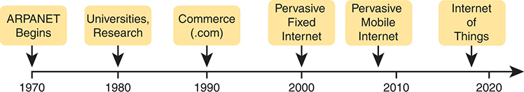
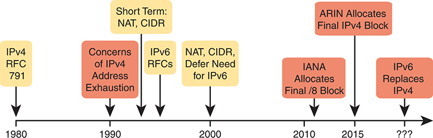
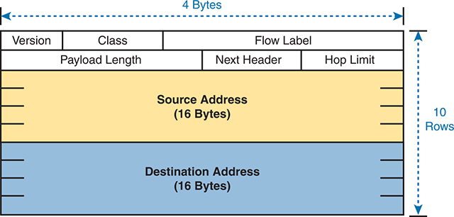
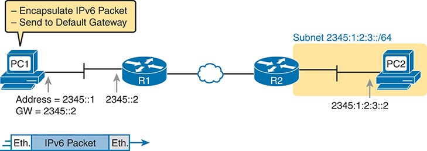
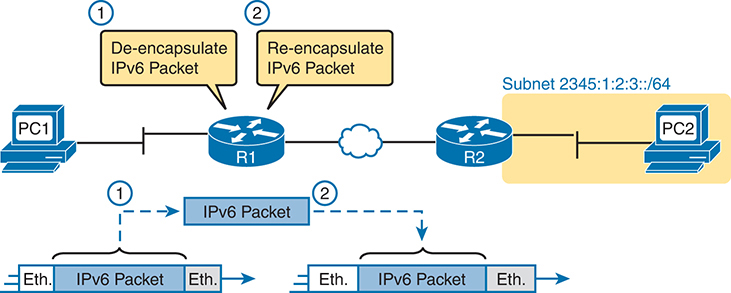
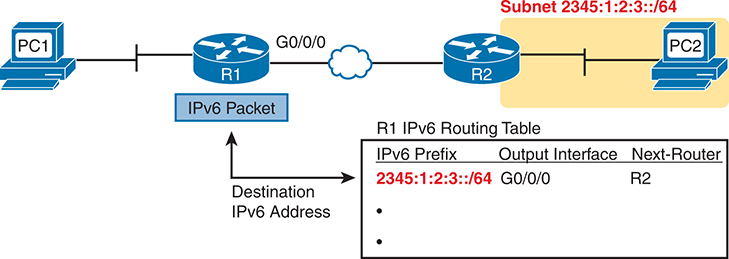
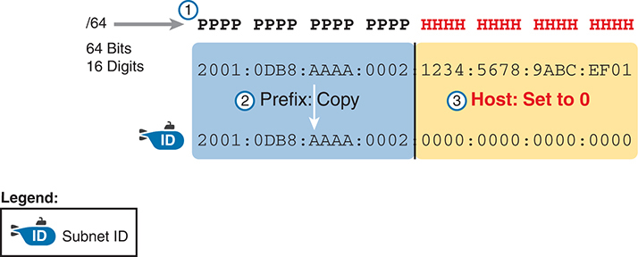

# Chapter 25


## Fundamentals of IP Version 6

This chapter covers the following exam topics:

1.0 Network Fundamentals

1.8 Configure and verify IPv6 addressing and prefix

1.9 Describe IPv6 address types

IPv4 has been a solid and highly useful part of the growth of TCP/IP and the Internet. For most of the long history of the Internet, and for most corporate networks that use TCP/IP, IPv4 is the core protocol that defines addressing and routing. However, although IPv4 has many great qualities, it has some shortcomings, creating the need for a replacement protocol: IP version 6 (IPv6).

IPv6 defines the same general functions as IPv4, but with different methods of implementing those functions. For example, both IPv4 and IPv6 define addressing, the concepts of subnetting larger groups of addresses into smaller groups, headers used to create an IPv4 or IPv6 packet, and the rules for routing those packets. At the same time, IPv6 handles the details differently; for example, using a 128-bit IPv6 address rather than the 32-bit IPv4 address.

This chapter focuses on the core network layer functions of addressing and routing. The first section of this chapter looks at the big concepts, while the second section looks at the specifics of how to write and type IPv6 addresses.

### "Do I Know This Already?" Quiz

Take the quiz (either here or use the PTP software) if you want to use the score to help you decide how much time to spend on this chapter. The letter answers are listed at the bottom of the page following the quiz. [Appendix C](vol1_appc.md#appc), found both at the end of the book as well as on the companion website, includes both the answers and explanations. You can also find both answers and explanations in the PTP testing software.

**Table 25-1** "Do I Know This Already?" Foundation Topics Section-to-Question Mapping

| Foundation Topics Section | Questions |
| --- | --- |
| Introduction to IPv6 | 1-2 |
| IPv6 Addressing Formats and Conventions | 3-6 |

**[1](vol1_ch25.md#ques25_1a).** Which of the following was a short-term solution to the IPv4 address exhaustion problem?

1. IP version 6
2. IP version 5
3. NAT/PAT
4. ARP

**[2](vol1_ch25.md#ques25_2a).** A router receives an Ethernet frame that holds an IPv6 packet. The router then decides to route the packet out an Ethernet WAN link. Which statement is true about how a router forwards an IPv6 packet?

1. The router discards the received frame's Ethernet data-link header and trailer.
2. The router makes the forwarding decision based on the packet's source IPv6 address.
3. The router keeps the incoming frame's Ethernet header, encapsulating the entire frame inside a new IPv6 packet before sending it over the outgoing Ethernet WAN link.
4. The router uses the IPv4 routing table when choosing where to forward the packet.

**[3](vol1_ch25.md#ques25_3a).** Which of the following is the shortest valid abbreviation for FE80:0000:0000:0000:0100:0000:0000:0123?

1. FE80::100::123
2. FE8::1::123
3. FE80::100:0:0:0:123:4567
4. FE80::100:0:0:123

**[4](vol1_ch25.md#ques25_4a).** Which of the following is the shortest valid abbreviation for 2000:0300:0040:0005:6000:0700:0080:0009?

1. 2:3:4:5:6:7:8:9
2. 2000:300:40:5:6000:700:80:9
3. 2000:300:4:5:6000:700:8:9
4. 2000:3:4:5:6:7:8:9

**[5](vol1_ch25.md#ques25_5a).** Which of the following is the unabbreviated version of IPv6 address 2001:DB8::200:28?

1. 2001:0DB8:0000:0000:0000:0000:0200:0028
2. 2001:0DB8::0200:0028
3. 2001:0DB8:0:0:0:0:0200:0028
4. 2001:0DB8:0000:0000:0000:0000:200:0028

**[6](vol1_ch25.md#ques25_6a).** Which of the following is the correct abbreviated subnet prefix for address 2000:0000:0000:0005:6000:0700:0080:0009, assuming a mask of /64?

1. 2000::5::/64
2. 2000::5:0:0:0:0/64
3. 2000:0:0:5::/64
4. 2000:0:0:5:0:0:0:0/64

Answers to the "Do I Know This Already?" quiz:

**[1](vol1_appc.md#ques25_1)** C

**[2](vol1_appc.md#ques25_2)** A

**[3](vol1_appc.md#ques25_3)** D

**[4](vol1_appc.md#ques25_4)** B

**[5](vol1_appc.md#ques25_5)** A

**[6](vol1_appc.md#ques25_6)** C

### Foundation Topics

### Introduction to IPv6

[IP version 6 (IPv6)](vol1_gloss.md#gloss_211) serves as the replacement protocol for IP version 4 (IPv4). To do so, the network can perform a slow migration that uses both, with IPv6 overcoming some of the issues that drove the need for a protocol to replace IPv4.

Unfortunately, that introductory statement creates more questions than it answers. Why does IPv4 need to be replaced? If IPv4 needs to be replaced, when will that happen--and will it happen quickly? What exactly happens when a company or the Internet replaces IPv4 with IPv6? And the list goes on.

While this introductory chapter cannot get into every detail of why IPv4 needs to eventually be replaced by IPv6, the clearest and most obvious reason for migrating TCP/IP networks to use IPv6 is growth. IPv4 uses a 32-bit address, which totals to a few billion addresses. Interestingly, that seemingly large number of addresses is too small. IPv6 increases the address to 128 bits in length. For perspective, IPv6 supplies more than 10,000,000,000,000,000,000,000,000,000 times as many addresses as IPv4. IPv4 supplies just under 10*10* addresses, while IPv6 supplies just under 10*38* addresses.

The fact that IPv6 uses a different size address field, with some different addressing rules, means that many other protocols and functions change as well. For example, IPv4 routing--in other words, the packet-forwarding process--relies on an understanding of IPv4 addresses. To support IPv6 routing, routers must understand IPv6 addresses and routing. To dynamically learn routes for IPv6 subnets, routing protocols must support these different IPv6 addressing rules, including rules about how IPv6 creates subnets. As a result, the migration from IPv4 to IPv6 is much more than changing one protocol (IP), but it impacts many protocols.

This first section of the chapter discusses some of the reasons for the change from IPv4 to IPv6, along with the protocols that must change as a result.

#### The Historical Reasons for IPv6

In the last 50+ years, the Internet has gone from its infancy to being a huge influence in the world. It first grew through research at universities, from the ARPANET beginnings of the Internet in the late 1960s into the 1970s. The Internet kept growing fast in the 1980s, with the Internet's fast growth still primarily driven by research and the universities that joined in that research.

By the early 1990s, the Internet allowed commercial use, driving Internet growth even higher. Eventually, fixed Internet access from home became common, followed by the pervasive use of the Internet from mobile devices like smartphones. Now the Internet of Things (IoT) fuels Internet growth, adding all kinds of devices throughout industry that can communicate through an IP network. [Figure 25-1](vol1_ch25.md#ch25fig01) shows some of these major milestones with general dates.





**Figure 25-1** *Some Major Events in the Growth of the Internet*

The timeline begins in 1970 with the inception of ARPANET. By 1980, the involvement of universities and research institutions expands the internet's reach and capabilities. In 1990, the emergence of commerce (.com) comes in the internet. The year 2000 marks the advent of pervasive fixed internet. In 2010, the shift is denoted by pervasive mobile internet. Finally, by 2020, the Internet of Things is marked.

The incredible growth of the Internet over a fairly long time created a big problem for public IPv4 addresses: the world was running out of addresses. As one example milestone, in 2011, the Internet Assigned Numbers Authority (IANA) allocated the final five /8 address blocks (the same size as a Class A network) to each of the five Regional Internet Registries (RIR). At that point, IANA had no more public IPv4 addresses to allocate to RIRs. The RIRs could no longer receive new allocations of public addresses from IANA but could continue to assign blocks from their remaining public address space.

In the 2010s, the five RIRs eventually assigned all of their public address space. For example, in late 2015, ARIN (North America) announced that it had exhausted its supply. All the RIRs have plans for how to deal with IPv4 address exhaustion, with all either being out of IPv4 address space or using a maintenance plan to reclaim unused IPv4 addresses for reassignment.

These events are significant in that the day has finally come in which new companies can attempt to connect to the Internet, but they can no longer simply use IPv4, ignoring IPv6. Their only option will be IPv6 because IPv4 has no public addresses left.

Note

You can track ARIN's progress through this interesting transition in the history of the Internet at its IPv4 address depletion site: <https://www.arin.net/resources/guide/ipv4/>. You can also see a summary report at <http://ipv4.potaroo.net>.

Even though the media has rightfully made a big deal about running out of IPv4 addresses, those who care about the Internet knew about this potential problem since the late 1980s. The problem, generally called the [IPv4 address exhaustion](vol1_gloss.md#gloss_213) problem, could literally have caused the huge growth of the Internet in the 1990s to have come to a screeching halt! Something had to be done.

The IETF came up with several short-term solutions to make IPv4 addresses last longer, and one long-term solution: IPv6. However, several other tools like Network Address Translation (NAT) and classless interdomain routing (CIDR) helped extend IPv4's life another couple of decades. IPv6 creates a more permanent and long-lasting solution, replacing IPv4, with a new IPv6 header and new IPv6 addresses. The address size supports a huge number of addresses, solving the address shortage problem for generations (we hope). [Figure 25-2](vol1_ch25.md#ch25fig02) shows some of the major IPv4 address exhaustion timing events.

The rest of this first section examines IPv6, comparing it to IPv4, focusing on the common features of the two protocols. In particular, this section compares the protocols (including addresses), routing, routing protocols, and miscellaneous other related topics.





**Figure 25-2** *Timeline for IPv4 Address Exhaustion and Short-/Long-Term Solutions*

The timeline begins in 1980 with the establishment of "IPv4 RFC 791." By 1990, concerns of "IPv4 Address Exhaustion" arose. After that year, short-term solutions like "NAT" and "CIDR" were introduced to mitigate these concerns, alongside the development of "IPv6 RFCs." In 2000, "NAT, CIDR, and Defer Need for IPv6" was marked. After 2010, "IANA Allocates Final /8 Block". By 2015, "ARIN Allocates Final IPv4 Block." The timeline extends into an unspecified date where it is anticipated that "IPv6 Replaces IPV4," indicating a transition.

Note

You might wonder why the next version of IP is not called IP version 5. There was an earlier effort to create a new version of IP, and it was numbered version 5. IPv5 did not progress to the standards stage. However, to prevent any issues, because version 5 had been used in some documents, the next effort to update IP was numbered as version 6.

#### The IPv6 Protocols

The primary purpose of the core IPv6 protocol mirrors the same purpose of the IPv4 protocol. That core IPv6 protocol, as defined in RFC 8200, defines a packet concept, addresses for those packets, and the role of hosts and routers. These rules allow the devices to forward packets sourced by hosts, through multiple routers, so that they arrive at the correct destination host. (IPv4 defines those same concepts for IPv4 back in RFC 791.)

However, because IPv6 impacts so many other functions in a TCP/IP network, many more RFCs must define details of IPv6. Some other RFCs define how to migrate from IPv4 to IPv6. Others define new versions of familiar protocols or replace old protocols with new ones. For example:

**Older OSPF Version 2 Upgraded to OSPF Version 3:** The older Open Shortest Path First (OSPF) version 2 works for IPv4, but not for IPv6, so a newer version, [OSPF version 3 (OSPFv3)](vol1_gloss.md#gloss_293), was created to support IPv6. (Note: OSPFv3 was later upgraded to support advertising both IPv4 and IPv6 routes.)

**ICMP Upgraded to ICMP Version 6:** Internet Control Message Protocol (ICMP) worked well with IPv4 but needed to be changed to support IPv6. The new name is ICMPv6.

**ARP Replaced by Neighbor Discovery Protocol:** For IPv4, Address Resolution Protocol (ARP) discovers the MAC address used by neighbors. IPv6 replaces ARP with a more general Neighbor Discovery Protocol (NDP).

Note

A huge number of Internet RFCs define IPv6. A recent search for "IPv6" at <https://www.rfc-editor.org> showed over 550 such RFCs.

Although the term *IPv6*, when used broadly, includes many protocols, the one specific protocol called IPv6 defines the new 128-bit IPv6 address. Of course, writing these addresses in binary would be a problem--they probably would not even fit on the width of a piece of paper! IPv6 defines a shorter hexadecimal format, requiring at most 32 hexadecimal digits (one hex digit per 4 bits), with methods to abbreviate the hexadecimal addresses as well.

For example, all of the following are IPv6 addresses, each with 32 or fewer hex digits.

[Click here to view code image](vol1_ch25_images.md#f0643-01)

```
2345:1111:2222:3333:4444:5555:6666:AAAA
2000:1:2:3:4:5:6:A
FE80::1
```

The upcoming section "[IPv6 Addressing Formats and Conventions](vol1_ch25.md#ch25lev1sec4)" discusses the specifics of how to represent IPv6 addresses, including how to legally abbreviate the hex address values.

Like IPv4, IPv6 defines a header, with places to hold both the source and destination address fields. Compared to IPv4, the IPv6 header does make some other changes besides simply making the address fields larger. However, even though the IPv6 header is larger than an IPv4 header, the IPv6 header is actually simpler (on purpose). [Figure 25-3](vol1_ch25.md#ch25fig03) shows the required 40-byte part of the IPv6 header.




**Figure 25-3** *IPv6 Header*

The schematic is divided into several fields and spans across 4 bytes and 10 rows. The header begins with the "Version" field, followed by "Class" and "Flow Label." Subsequently, there are fields for "Payload Length," "Next Header," and "Hop Limit." The middle section of the header is dedicated to the "Source Address," which occupies 16 bytes. Similarly, the "Destination Address" also takes up 16 bytes at the bottom part of the header.

#### IPv6 Routing

As with many functions of IPv6, IPv6 routing looks just like IPv4 routing from a general perspective, with the differences being clear only once you look at the specifics. Keeping the discussion general for now, IPv6 uses these ideas the same way as IPv4:

* To be able to build and send IPv6 packets out an interface, end-user devices need an IPv6 address on that interface.

  
* End-user hosts need to know the IPv6 address of a default router, to which the host sends IPv6 packets if the destination host is in a different subnet.
* IPv6 routers de-encapsulate and re-encapsulate each IPv6 packet when routing the packet.
* IPv6 routers make routing decisions by comparing the IPv6 packet's destination address to the router's IPv6 routing table; the matched route lists directions of where to send the IPv6 packet next.

Note

You could take the preceding list and replace every instance of IPv6 with IPv4, and all the statements would be true of IPv4 as well.

The next few figures show the concepts with an example. First, [Figure 25-4](vol1_ch25.md#ch25fig04) shows a few settings on a host. The host (PC1) has an address of 2345::1. PC1 also knows its default gateway of 2345::2. (Both values are valid abbreviations for real IPv6 addresses.) To send an IPv6 packet to host PC2, on another IPv6 subnet, PC1 creates an IPv6 packet and sends it to R1, PC1's default gateway.




**Figure 25-4** *IPv6 Host Building and Sending an IPv6 Packet*

Host PC1 with an address of 2345::1 and a default gateway of 2345::2, encapsulates the IPv6 packet and sends it to the default gateway, which is router R1 with an address of 2345::2. The packet travels through a W A N line to reach router R2 in subnet 2345:1:2:3::/64. Finally, it reaches its destination at host PC2 with an address of 2345:1:2:3::2.

The router (R1) has many small tasks to do when forwarding this IPv6 packet, but for now, focus on the work R1 does related to encapsulation. As seen in Step 1 of [Figure 25-5](vol1_ch25.md#ch25fig05), R1 receives the incoming data-link frame and extracts (de-encapsulates) the IPv6 packet from inside the frame, discarding the original data-link header and trailer. At Step 2, once R1 knows to forward the IPv6 packet to R2, R1 adds a correct outgoing data-link header and trailer to the IPv6 packet, encapsulating the IPv6 packet.




**Figure 25-5** *IPv6 Router Performing Routine Encapsulation Tasks When Routing IPv6*

The process begins with host PC1 sending an IPv6 packet to router R1. R1, upon receiving the packet, de-encapsulates it and then re-encapsulates it before sending it to router R2 via an Ethernet W A N. R2, which is connected to subnet 2345:1:2:3::/64, forwards the packet to its final destination, host PC2.

When a router like R1 de-encapsulates the packet from the data-link frame, it must also decide what type of packet sits inside the frame. To do so, the router must look at a protocol type field in the data-link header, which identifies the type of packet inside the data-link frame. Today, most data-link frames carry either an IPv4 packet or an IPv6 packet.

To route an IPv6 packet, a router must use its IPv6 routing table instead of the IPv4 routing table. The router must look at the packet's destination IPv6 address and compare that address to the router's current IPv6 routing table. The router uses the forwarding instructions in the matched IPv6 route to forward the IPv6 packet. [Figure 25-6](vol1_ch25.md#ch25fig06) shows the overall process.




**Figure 25-6** *Comparing an IPv6 Packet to R1's IPv6 Routing Table*

The schematic shows a network setup with two hosts (PC1 and PC2), two routers (R1 and R2), and an IPv6 Packet. PC1 is connected to Router R1, which receives the IPv6 Packet. The destination IPv6 address of the packet is compared with the IPv6 prefix in R1's routing table. The routing table, labeled as "R1 IPv6 Routing Table", contains columns for "IPv6 Prefix", "Output Interface", and "Next-Router". An entry in this routing table shows that for the prefix "2345:1:2:3::/64", the output interface is "G0/0/0" and the next router is "R2". Router R2 is connected to PC2 under the subnet "2345:1:2:3::/64".

Note that again, the process works like IPv4, except that the IPv6 packet lists IPv6 addresses, and the IPv6 routing table lists routing information for IPv6 subnets (called subnet *prefixes*).

Finally, in most enterprise networks, the routers will route both IPv4 and IPv6 packets at the same time. That is, your company will not decide to adopt IPv6, and then late one weekend night turn off all IPv4 and enable IPv6 on every device. Instead, IPv6 allows for a slow migration, during which some or all routers forward both IPv4 and IPv6 packets. (The migration strategy of running both IPv4 and IPv6 is called *dual stack*.) All you have to do is configure the router to route IPv6 packets, in addition to the existing configuration for routing IPv4 packets.

#### IPv6 Routing Protocols

IPv6 routers need to learn routes for all the possible IPv6 subnet prefixes. Just like with IPv4, IPv6 routers use routing protocols, with familiar names, and generally speaking, with familiar functions.

None of the IPv4 routing protocols could be used to advertise IPv6 routes originally. They all required some kind of update to add messages, protocols, and rules to support IPv6. Over time, Routing Information Protocol (RIP), Open Shortest Path First (OSPF), Enhanced Interior Gateway Routing Protocol (EIGRP), and Border Gateway Protocol (BGP) were all updated to support IPv6. [Table 25-2](vol1_ch25.md#ch25tab02) lists the names of these routing protocols, with a few comments.

**Table 25-2** IPv6 Routing Protocols

| Routing Protocol | Defined By | Notes |
| --- | --- | --- |
| RIPng (RIP next generation) | RFC | The "next generation" is a reference to a TV series, *Star Trek: The Next Generation*. |
| *OSPFv3* (OSPF version 3) | RFC | The OSPF you have worked with for IPv4 is actually OSPF version 2, so the new version for IPv6 is OSPFv3. |
| [EIGRPv6 (EIGRP for IPv6)](vol1_gloss.md#gloss_118) | Cisco | Cisco owns the rights to the EIGRP protocol, but Cisco also now publishes EIGRP as an informational RFC. |
| MP BGP-4 (Multiprotocol BGP version 4) | RFC | BGP version 4 was created to be highly extendable; IPv6 support was added to BGP version 4 through one such enhancement, MP BGP-4. |

In addition, these routing protocols also follow the same interior gateway protocol (IGP) and exterior gateway protocol (EGP) conventions as their IPv4 cousins. RIPng, EIGRPv6, and OSPFv3 act as interior gateway protocols, advertising IPv6 routes inside an enterprise.

As you can see from this introduction, IPv6 uses many of the same big ideas as IPv4. Both define headers with a source and destination address. Both define the routing of packets, with the routing process discarding old data-link headers and trailers when forwarding the packets. And routers use the same general process to make a routing decision, comparing the packet's destination IP address to the routing table.

The big differences between IPv4 and IPv6 revolve around the bigger IPv6 addresses. The next topic begins looking at the specifics of these IPv6 addresses.

### IPv6 Addressing Formats and Conventions

The CCNA exam requires some fundamental skills in working with IPv4 addresses. For example, you need to be able to interpret IPv4 addresses, like 172.21.73.14. You need to be able to work with prefix-style masks, like /25, and interpret what that means when used with a particular IPv4 address. And you need to be able to take an address and mask, like 172.21.73.14/25, and find the subnet ID.

This second major section of this chapter discusses these same ideas for IPv6 addresses. In particular, this section looks at

* How to write and interpret unabbreviated 32-digit IPv6 addresses
* How to abbreviate IPv6 addresses and how to interpret abbreviated addresses
* How to interpret the IPv6 prefix length (subnet mask)
* How to find the IPv6 subnet prefix ID based on an address and prefix length mask

The biggest challenge with these tasks lies in the sheer size of the numbers. Thankfully, the math to find the subnet ID--often a challenge for IPv4--is easier for IPv6, at least to the depth discussed in this book.

#### Representing Full (Unabbreviated) IPv6 Addresses

IPv6 uses a convenient hexadecimal (hex) format for addresses. To make it more readable, IPv6 uses a format with eight sets of four hex digits, with each set of four digits separated by a colon. For example:

[Click here to view code image](vol1_ch25_images.md#f0646-01)

```
2340:1111:AAAA:0001:1234:5678:9ABC:1234
```

Note

For convenience, this book uses the term [quartet](vol1_gloss.md#gloss_323) for one set of four hex digits, with eight quartets in each IPv6 address. Note that the IPv6 RFCs do not define an equivalent term.

IPv6 addresses also have a binary format, but thankfully, most of the time you do not need to look at the binary version of the addresses. However, in those cases, converting from hex to binary is relatively easy. Just change each hex digit to the equivalent 4-bit value listed in [Table 25-3](vol1_ch25.md#ch25tab03).

**Table 25-3** Hexadecimal/Binary Conversion Chart

| Hex | Binary | Hex | Binary |
| --- | --- | --- | --- |
| 0 | 0000 | 8 | 1000 |
| 1 | 0001 | 9 | 1001 |
| 2 | 0010 | A | 1010 |
| 3 | 0011 | B | 1011 |
| 4 | 0100 | C | 1100 |
| 5 | 0101 | D | 1101 |
| 6 | 0110 | E | 1110 |
| 7 | 0111 | F | 1111 |

#### Abbreviating and Expanding IPv6 Addresses

IPv6 also defines ways to abbreviate or shorten how you write or type an IPv6 address. Why? Although using a 32-digit hex number works much better than working with a 128-bit binary number, 32 hex digits are still a lot of digits to remember, recognize in command output, and type on a command line. The IPv6 address abbreviation rules let you shorten these numbers.

Computers and routers use the shortest abbreviation, even if you type all 32 hex digits of the address. So even if you would prefer to use the longer unabbreviated version of the IPv6 address, you need to be ready to interpret the meaning of an abbreviated IPv6 address as listed by a router or host. This section first looks at abbreviating addresses and then at expanding addresses.

##### Abbreviating IPv6 Addresses

Two basic rules let you, or any computer, shorten or abbreviate an IPv6 address:

1. Inside each quartet of four hex digits, remove up to three leading 0s in the three positions on the left. (Note: At this step, a quartet of 0000 will leave a single 0.)

   
2. Replace the longest set of two or more consecutive 0000 quartets with a double colon. The abbreviation :: means "two or more quartets of all 0s." However, you can use this replacement only once inside a single address--for the longest set of consecutive 0000 quartets (or the first such set if a tie).

For example, consider the following IPv6 address. The bold digits represent digits in which the address could be abbreviated.

[Click here to view code image](vol1_ch25_images.md#f0647-01)

```
2100:0000:0000:0001:0000:0000:0000:0056
```

Applying the first rule, you would look at all eight quartets independently. In each, remove all the leading 0s. Note that five of the quartets have four 0s, so for these, remove only three leading binary 0s, leaving the following value:

```
2100:0:0:1:0:0:0:56
```

While this abbreviation is valid, the address can be abbreviated further, using the second rule. In this case, two instances exist where more than one quartet in a row has only a 0. Pick the longest such sequence, and replace it with ::, giving you the shortest legal abbreviation:

```
2100:0:0:1::56
```

While 2100:0:0:1::56 is indeed the shortest abbreviation, this example happens to make it easier to see the two most common mistakes when abbreviating IPv6 addresses. First, never remove trailing 0s in a quartet (0s on the right side of the quartet). In this case, the first quartet of 2100 cannot be shortened at all because the two 0s trail. So, the following address, which begins now with only FE in the first quartet, is not a correct abbreviation of the original IPv6 address:

```
21:0:0:1::56
```

The second common mistake is to replace both sets of 0000 quartets with a double colon. For example, the following abbreviation would be incorrect for the original IPv6 address listed in this topic:

```
2100::1::56
```

The reason this abbreviation is incorrect is that now you do not know how many quartets of all 0s to substitute into each :: to find the original unabbreviated address.

##### Expanding Abbreviated IPv6 Addresses

To expand an IPv6 address back into its full unabbreviated 32-digit number, use two similar rules. The rules basically reverse the logic of the previous two rules:

1. In each quartet, add leading 0s as needed until the quartet has four hex digits.

   
2. If a double colon (::) exists, count the quartets currently shown; the total should be less than 8. Replace the :: with multiple quartets of 0000 so that eight total quartets exist.

The best way to get comfortable with these addresses and abbreviations is to do some yourself. [Table 25-4](vol1_ch25.md#ch25tab04) lists some practice problems, with the full 32-digit IPv6 address on the left and the best abbreviation on the right. The table gives you either the expanded or abbreviated address, and you need to supply the opposite value. The answers sit at the end of the chapter, in the section "[Answers to Earlier Practice Problems](vol1_ch25.md#ch25lev1sec9)."

**Table 25-4** IPv6 Address Abbreviation and Expansion Practice

| Full | Abbreviation |
| --- | --- |
| `2340:0000:0010:0100:1000:ABCD:0101:1010` |  |
|  | `30A0:ABCD:EF12:3456:ABC:B0B0:9999:9009` |
| `2222:3333:4444:5555:0000:0000:6060:0707` |  |
|  | `3210::` |
| `210F:0000:0000:0000:CCCC:0000:0000:000D` |  |
|  | `34BA:B:B::20` |
| `FE80:0000:0000:0000:DEAD:BEFF:FEEF:CAFE` |  |
|  | `FE80::FACE:BAFF:FEBE:CAFE` |

#### Representing the Prefix Length of an Address

IPv6 uses a mask concept, called the [prefix length](vol1_gloss.md#gloss_313), similar to IPv4 subnet masks. Similar to the IPv4 prefix-style mask, the IPv6 prefix length is written as a /, followed by a decimal number (there is no dotted-decimal equivalent mask for IPv6). The prefix length defines how many bits on the left side of an IPv6 address are the same value for all addresses within that subnet prefix. If you think of the ideas generically as prefix/length, all addresses in the subnet prefix begin with the same value in number of initial bits as defined by the length.

When writing an IPv6 address and prefix length in documentation, you can choose to leave a space before the /, or not, for readability. However, commands on Cisco devices typically do not allow spaces before or after the /.

[Click here to view code image](vol1_ch25_images.md#f0649-01)

```
2222:1111:0:1:A:B:C:D/64
2222:1111:0:1:A:B:C:D /64
```

Finally, note that the prefix length is a number of bits, so with IPv6, the legal value range is from 0 through 128, inclusive.

#### Calculating the IPv6 Subnet Prefix (Subnet ID)

With IPv4, you can take an IP address and the associated subnet mask, and calculate the subnet ID. With IPv6 subnetting, you can take an IPv6 address and the associated prefix length, and calculate the IPv6 equivalent of the subnet ID: an *IPv6* [subnet prefix](vol1_gloss.md#gloss_391).

Like with different IPv4 subnet masks, some IPv6 prefix lengths make for an easy math problem to find the IPv6 subnet prefix, while some prefix lengths make the math more difficult. This section looks at the easier cases, mainly because the size of the IPv6 address space lets us all choose to use IPv6 prefix lengths that make the math much easier.

#### Finding the IPv6 Subnet Prefix

In IPv6, a subnet prefix represents a group of IPv6 addresses. For now, this section focuses on the math, and only the math, for finding the number that represents that subnet prefix. [Chapter 26](vol1_ch26.md#ch26), "[IPv6 Addressing and Subnetting](vol1_ch26.md#ch26)," then starts putting more meaning behind the actual numbers.

Each IPv6 subnet prefix, or subnet if you prefer, has a number that represents the group. Many people just call it a subnet number or subnet ID, using the same terms as IPv4. As with IPv4, you can start with an IPv6 address and prefix length, and find the subnet prefix, with the same general rules that you use in IPv4. If the prefix length is /P, use these rules:

1. Copy the first P bits.

   
2. Change the rest of the bits to 0.

When using a prefix length that happens to be a multiple of 4, you do not have to think in terms of bits, but in terms of hex digits. A prefix length that is a multiple of 4 means that each hex digit is either copied or changed to hex 0. For example, a /44 prefix length implies 11 hex digits, a /48 prefix length implies 12 hex digits, and so on. Just for completeness, if the prefix length is indeed a multiple of 4, the process becomes

1. Identify the number of hex digits in the subnet prefix by dividing the prefix length (which is in bits) by 4.
2. Copy the hex digits determined to be in the subnet prefix per the first step.
3. Change the rest of the hex digits to 0.

[Figure 25-7](vol1_ch25.md#ch25fig07) shows an example, with a prefix length of 64. In this case, Step 1 looks at the /64 prefix length and calculates that the subnet prefix has 16 hex digits. Step 2 copies the first 16 digits of the IPv6 address, while Step 3 records hex 0s for the rest of the digits.




**Figure 25-7** *Creating the IPv6 Subnet Prefix from an Address/Length*

The process starts with a 64-bit, 16-digit IPv6 address (2001:0DB8:AAAA:0002:1234:5678:9ABC:EF01). This address is divided into two parts: the prefix (represented by 'P's) and the host bits (represented by 'H's). The first step involves copying the prefix of the address (2001:0DB8:AAAA:0002), which is highlighted and labeled as "Prefix Copy". In the second step, the host part of the address (1234:5678:9ABC:EF01) is set to zero, resulting in a subnet ID of 2001:0DB8:AAAA:0002:0000:0000:0000:0000.

After you find the IPv6 subnet prefix, you should also be ready to abbreviate the IPv6 subnet prefix using the same rules you use to abbreviate IPv6 addresses. However, you should pay extra attention to the end of the subnet prefix because it often has several octets of all 0 values. As a result, the abbreviation typically ends with two colons (::).

For example, consider the following IPv6 address that is assigned to a host on a LAN:

[Click here to view code image](vol1_ch25_images.md#f0650-01)

```
2000:1234:5678:9ABC:1234:5678:9ABC:1111/64
```

This example shows an IPv6 address that itself cannot be abbreviated. After you calculate the subnet prefix by zeroing out the last 64 bits (16 digits) of the address, you find the following subnet prefix value:

[Click here to view code image](vol1_ch25_images.md#f0650-02)

```
2000:1234:5678:9ABC:0000:0000:0000:0000/64
```

This value can be abbreviated, with four quartets of all 0s at the end, as follows:

```
2000:1234:5678:9ABC::/64
```

To get better at the math, take some time to work through finding the subnet prefix for several practice problems, as listed in [Table 25-5](vol1_ch25.md#ch25tab05). The answers sit at the end of the chapter, in the section "[Answers to Earlier Practice Problems](vol1_pref10.md#pref10)."


**Table 25-5** Finding the IPv6 Subnet Prefix from an Address/Length Value

| Address/Length | Subnet Prefix |
| --- | --- |
| `2340:0:10:100:1000:ABCD:101:1010/64` |  |
| `30A0:ABCD:EF12:3456:ABC:B0B0:9999:9009/64` |  |
| `2222:3333:4444:5555::6060:707/64` |  |
| `3210::ABCD:101:1010/64` |  |
| `210F::CCCC:B0B0:9999:9009/64` |  |
| `34BA:B:B:0:5555:0:6060:707/64` |  |
| `3124::DEAD:CAFE:FF:FE00:1/64` |  |
| `2BCD::FACE:BEFF:FEBE:CAFE/64` |  |

#### Working with More-Difficult IPv6 Prefix Lengths

In [Chapter 26](vol1_ch26.md#ch26), you will read more about IPv6 subnetting--a much simpler topic to learn as compared with IPv4 subnetting. One reason why IPv6 subnetting happens to be simple is that several RFCs, including RFC 4291, "IPv6 Addressing Architecture," recommends that all deployed subnets use a /64 prefix length.

You will also on occasion need to work with prefix lengths shorter than /64 when working through your enterprise's subnetting plan. To get ready for that, this last topic of the chapter provides some practice with other shorter prefix lengths, using the easier cases of prefix lengths that are multiples of 4.

For example, consider the following IPv6 address and prefix length:

[Click here to view code image](vol1_ch25_images.md#f0651-01)

```
2000:1234:5678:9ABC:1234:5678:9ABC:1111/56
```

Because this example uses a /56 prefix length, the subnet prefix includes the first 56 bits, or first 14 complete hex digits, of the address. The rest of the hex digits will be 0, resulting in the following subnet prefix:

[Click here to view code image](vol1_ch25_images.md#f0651-02)

```
2000:1234:5678:9A00:0000:0000:0000:0000/56
```

This value can be abbreviated, with four quartets of all 0s at the end, as follows:

```
2000:1234:5678:9A00::/56
```

This example shows an easy place to make a mistake. Sometimes, people look at the /56 and think of that as the first 14 hex digits, which is correct. However, they then copy the first 14 hex digits and add a double colon, showing the following:

```
2000:1234:5678:9A::/56
```

This abbreviation is not correct because it removes the trailing "00" at the end of the fourth quartet. If you later expanded this incorrect abbreviated value, it would begin with 2000:1234:5678:009A, not 2000:1234:5678:9A00. So, be careful when abbreviating when the boundary is not at the edge of a quartet.

Once again, some extra practice can help. [Table 25-6](vol1_ch25.md#ch25tab06) uses examples that have a prefix length that is a multiple of 4, but is not on a quartet boundary, just to get some extra practice. The answers sit at the end of the chapter, in the section "[Answers to Earlier Practice Problems](vol1_ch25.md#ch25lev1sec9)."


**Table 25-6** Finding the IPv6 Subnet Prefix from an Address/Length Value

| Address/Length | Subnet Prefix |
| --- | --- |
| `34BA:B:B:0:5555:0:6060:707/48` |  |
| `3124:1:20:DEAD:CAFE:FF:FE00:1/48` |  |
| `2BCD::FACE:BEFF:FEBE:CAFE/48` |  |
| `3FED:F:E0:D00:FACE:BAFF:FE00:0/48` |  |
| `210F:A:B:C:CCCC:B0B0:9999:9009/40` |  |
| `34BA:B:B:0:5555:0:6060:707/36` |  |
| `3124::DEAD:CAFE:FF:FE00:1/60` |  |
| `2BCD::FACE:1:BEFF:FEBE:CAFE/56` |  |

### Chapter Review

One key to doing well on the exams is to perform repetitive spaced review sessions. Review this chapter's material using either the tools in the book or interactive tools for the same material found on the book's companion website. Refer to the "[Your Study Plan](vol1_pref10.md#pref10)" element for more details. [Table 25-7](vol1_ch25.md#ch25tab07) outlines the key review elements and where you can find them. To better track your study progress, record when you completed these activities in the second column.

**Table 25-7** Chapter Review Tracking

| Review Element | Review Date(s) | Resource Used |
| --- | --- | --- |
| Review key topics |  | Book, website |
| Review key terms |  | Book, website |
| Answer DIKTA questions |  | Book, PTP |
| Review command tables |  | Book |
| Review memory table |  | Book, website |

### Review All the Key Topics


**Table 25-8** Key Topics for [Chapter 25](vol1_ch25.md#ch25)

| Key Topic Element | Description | Page Number |
| --- | --- | --- |
| List | Similarities between IPv4 and IPv6 | [643](vol1_ch25.md#page_643) |
| List | Rules for abbreviating IPv6 addresses | [647](vol1_ch25.md#page_647) |
| List | Rules for expanding an abbreviated IPv6 address | [648](vol1_ch25.md#page_648) |
| List | Process steps to find an IPv6 prefix, based on the IPv6 address and prefix length | [649](vol1_ch25.md#page_649) |

### Key Terms You Should Know

[EIGRP version 6 (EIGRPv6)](vol1_ch25.md#key_266)

[IP version 6 (IPv6)](vol1_ch25.md#key_267)

[IPv4 address exhaustion](vol1_ch25.md#key_268)

[OSPF version 3 (OSPFv3)](vol1_ch25.md#key_269)

[prefix length](vol1_ch25.md#key_270)

[quartet](vol1_ch25.md#key_271)

[subnet prefix](vol1_ch25.md#key_272)

### Additional Practice for This Chapter's Processes

For additional practice with IPv6 abbreviations, you may do the same set of practice problems based on [Appendix H](vol1_apph.md#apph), "[Practice for Chapter 25: Fundamentals of IP Version 6](vol1_apph.md#apph)." You have two options to use:

**PDF:** Navigate to the companion website and open the PDF for [Appendix H](vol1_apph.md#apph).

**Application:** Navigate to the companion website and use these applications:

"Practice Exercise: Abbreviating and Expanding Addresses"

"Practice Exercise: Calculating the IPv6 Subnet Prefix"

"Practice Exercise: Calculating the IPv6 Subnet Prefix Round 2"

### Answers to Earlier Practice Problems

This chapter includes practice problems spread around different locations in the chapter. The answers are located in [Tables 25-9](vol1_ch25.md#ch25tab09), [25-10](vol1_ch25.md#ch25tab10), and [25-11](vol1_ch25.md#ch25tab11).

**Table 25-9** Answers to Questions in the Earlier [Table 25-4](vol1_ch25.md#ch25tab04)

| Full | Abbreviation |
| --- | --- |
| `2340:0000:0010:0100:1000:ABCD:0101:1010` | `2340:0:10:100:1000:ABCD:101:1010` |
| `30A0:ABCD:EF12:3456:0ABC:B0B0:9999:9009` | `30A0:ABCD:EF12:3456:ABC:B0B0:9999:9009` |
| `2222:3333:4444:5555:0000:0000:6060:0707` | `2222:3333:4444:5555::6060:707` |
| `3210:0000:0000:0000:0000:0000:0000:0000` | `3210::` |
| `210F:0000:0000:0000:CCCC:0000:0000:000D` | `210F::CCCC:0:0:D` |
| `34BA:000B:000B:0000:0000:0000:0000:0020` | `34BA:B:B::20` |
| `FE80:0000:0000:0000:DEAD:BEFF:FEEF:CAFE` | `FE80::DEAD:BEFF:FEEF:CAFE` |
| `FE80:0000:0000:0000:FACE:BAFF:FEBE:CAFE` | `FE80::FACE:BAFF:FEBE:CAFE` |


**Table 25-10** Answers to Questions in the Earlier [Table 25-5](vol1_ch25.md#ch25tab05)

| Address/Length | Subnet Prefix |
| --- | --- |
| `2340:0:10:100:1000:ABCD:101:1010/64` | `2340:0:10:100::/64` |
| `30A0:ABCD:EF12:3456:ABC:B0B0:9999:9009/64` | `30A0:ABCD:EF12:3456::/64` |
| `2222:3333:4444:5555::6060:707/64` | `2222:3333:4444:5555::/64` |
| `3210::ABCD:101:1010/64` | `3210::/64` |
| `210F::CCCC:B0B0:9999:9009/64` | `210F::/64` |
| `34BA:B:B:0:5555:0:6060:707/64` | `34BA:B:B::/64` |
| `3124::DEAD:CAFE:FF:FE00:1/64` | `3124:0:0:DEAD::/64` |
| `2BCD::FACE:BEFF:FEBE:CAFE/64` | `2BCD::/64` |


**Table 25-11** Answers to Questions in the Earlier [Table 25-6](vol1_ch25.md#ch25tab06)

| Address/Length | Subnet Prefix |
| --- | --- |
| `34BA:B:B:0:5555:0:6060:707/48` | `34BA:B:B::/48` |
| `3124:1:20:DEAD:CAFE:FF:FE00:1/48` | `3124:1:20::/48` |
| `2BCD::FACE:BEFF:FEBE:CAFE/48` | `2BCD::/48` |
| `3FED:F:E0:D00:FACE:BAFF:FE00:0/48` | `3FED:F:E0::/48` |
| `210F:A:B:C:CCCC:B0B0:9999:9009/40` | `210F:A::/40` |
| `34BA:B:B:0:5555:0:6060:707/36` | `34BA:B::/36` |
| `3124::DEAD:CAFE:FF:FE00:1/60` | `3124:0:0:DEA0::/60` |
| `2BCD::FACE:1:BEFF:FEBE:CAFE/56` | `2BCD:0:0:FA00::/56` |