# Chapter 26


## IPv6 Addressing and Subnetting

This chapter covers the following exam topics:

1.0 Network Fundamentals

1.8 Configure and verify IPv6 addressing and prefix

1.9 Describe IPv6 address types

1.9.a Unicast (global, unique local, and link local)

The Internet Assigned Numbers Authority (IANA) assigns public IPv6 addresses using a process much like IPv4 with CIDR blocks. IANA first defines some IPv6 address space as unicast and other parts as multicast. The majority of the unicast address space serves as public addresses, with small parts of the address space reserved for particular purposes. IANA with the RIRs assign public address blocks as defined with a prefix length of any valid size, commonly in sizes that use /32 to /48 prefix lengths.

This chapter has two major sections. The first examines [global unicast addresses](vol1_gloss.md#gloss_161), which serve as public IPv6 addresses. This section also discusses subnetting in IPv6, which happens to be much simpler than with IPv4. The second major section looks at [unique local addresses](vol1_gloss.md#gloss_423), which serve as private IPv6 addresses.

### "Do I Know This Already?" Quiz

Take the quiz (either here or use the PTP software) if you want to use the score to help you decide how much time to spend on this chapter. The letter answers are listed at the bottom of the page following the quiz. [Appendix C](vol1_appc.md#appc), found both at the end of the book as well as on the companion website, includes both the answers and explanations. You can also find both answers and explanations in the PTP testing software.

**Table 26-1** "Do I Know This Already?" Foundation Topics Section-to-Question Mapping

| Foundation Topics Section | Questions |
| --- | --- |
| Global Unicast Addressing Concepts | 1-4 |
| Unique Local Unicast Addresses | 5 |

**[1](vol1_ch26.md#ques26_1a).** Which of the following IPv6 addresses appears to be a unique local unicast address based on its first few hex digits?

1. 3123:1:3:5::1
2. FE80::1234:56FF:FE78:9ABC
3. FDAD::1
4. FF00::5

**[2](vol1_ch26.md#ques26_2a).** Which of the following IPv6 addresses appears to be a global unicast address, based on its first few hex digits?

1. 3123:1:3:5::1
2. FE80::1234:56FF:FE78:9ABC
3. FDAD::1
4. FF00::5

**[3](vol1_ch26.md#ques26_3a).** When subnetting an IPv6 address block, an engineer shows a drawing that breaks the address structure into three pieces. Comparing this concept to a three-part IPv4 address structure, which part of the IPv6 address structure is most like the IPv4 network part of the address?

1. Subnet ID
2. Interface ID
3. Network ID
4. Global routing prefix
5. Subnet router anycast

**[4](vol1_ch26.md#ques26_4a).** When subnetting an IPv6 address block, an engineer shows a drawing that breaks the address structure into three pieces. Assuming that all subnets use the same /64 prefix length, which of the following answers lists the field's name on the far right side of the address?

1. Subnet ID
2. Interface ID
3. Network ID
4. Global routing prefix
5. Subnet router anycast

**[5](vol1_ch26.md#ques26_5a).** For the IPv6 address FD00:1234:5678:9ABC:DEF1:2345:6789:ABCD, which part of the address is considered the global ID of the unique local address?

1. None; this address has no global ID.
2. 00:1234:5678:9ABC
3. DEF1:2345:6789:ABCD
4. 00:1234:5678
5. FD00

Answers to the "Do I Know This Already?" quiz:

**[1](vol1_appc.md#ques26_1)** C

**[2](vol1_appc.md#ques26_2)** A

**[3](vol1_appc.md#ques26_3)** D

**[4](vol1_appc.md#ques26_4)** B

**[5](vol1_appc.md#ques26_5)** D

### Foundation Topics

### Global Unicast Addressing Concepts

This first major section of the chapter focuses on one type of unicast IPv6 addresses: global unicast addresses. As it turns out, many of the general concepts and processes behind these global unicast IPv6 addresses follow the original intent for public IPv4 addresses. So, this section begins with a review of some IPv4 concepts, followed by the details of how a company can use global unicast addresses.

This first section also discusses IPv6 subnetting and the entire process of taking a block of global unicast addresses and creating subnets for one company. This process takes a globally unique global routing prefix, creates IPv6 subnets, and assigns IPv6 addresses from within each subnet, much like with IPv4.

#### Public and Private IPv6 Addresses

The original plan for worldwide IPv4 addresses called for each organization connected to the Internet to be assigned a unique public IPv4 network. Each organization could then subnet that network and assign addresses from within that network so that every host in every organization used an IPv4 address unique in the universe. Unfortunately, because the IPv4 address space had too few addresses for that plan to work once every company, organization, and home wanted to connect to the Internet, those responsible for the IPv4 addressing updated their plan.

As part of that revised plan, in the 1990s, companies started using addresses from the private IPv4 address range, as defined in RFC 1918, along with Network Address Translation (NAT). Using NAT and private IPv4 addresses allowed one organization to share a few public globally unique IPv4 addresses for all host connections into the Internet.

IPv6 allows two similar options of public and private unicast addressing, beginning with *global unicast* addresses as the public IPv6 address space. Similar to public IPv4 addresses, IPv6 global unicast addresses rely on an administrative process that assigns each company a unique IPv6 address block. Each company then subnets this IPv6 address block and only uses addresses from within that block. The result is that each company uses addresses that are unique across the globe as well.

The second IPv6 option uses *unique local* IPv6 addresses, which work like the IPv4 private addresses. Companies that do not plan to connect to the Internet and companies that plan to use IPv6 NAT can use unique local addresses. With IPv4, an organization simply picked numbers from the private networks in RFC 1918. With IPv6, you choose by referencing RFC 4193, which suggests a process to randomly choose a unique local prefix. And just as when using private networks with IPv4, when using IPv6 unique local addresses (ULAs), to connect to the Internet, the organization would need a small set of public IPv6 addresses and would need to use NAT.

The following lists summarizes the comparisons between global unicast addresses and unique local addresses:

**Global Unicast Addresses (GUAs):** These addresses work like public IPv4 addresses. The organization that needs IPv6 addresses asks for a registered IPv6 address block, which is assigned as a global routing prefix. After that, only that organization uses the addresses inside that block of addresses--that is, the addresses that begin with the assigned prefix.


**Unique Local Addresses (ULAs):** These addresses work somewhat like private IPv4 addresses, with the possibility that multiple organizations use the exact same addresses, and with no requirement for registering with any numbering authority.

The rest of this first major section of the chapter examines global unicast addresses in more detail, while the second major section discusses unique local addresses.

#### The IPv6 Global Routing Prefix

IPv6 global unicast addresses (GUAs) allow IPv6 to work more like the original design of the IPv4 Internet. Each organization asks for a block of IPv6 addresses, which no one else can use. That organization further subdivides the address block into smaller chunks called *subnets*. Finally, the engineer chooses an address from the right subnet to assign for use by a host.

That reserved block of IPv6 addresses--a set of addresses only one company can use--is called a [global routing prefix](vol1_gloss.md#gloss_160). Each organization that wants to connect to the Internet and use IPv6 GUAs should ask for and receive a global routing prefix. In comparison, you can think of the global routing prefix like an IPv4 Class A, B, or C network number from the range of public IPv4 addresses, or think of it like a public CIDR block.

The term *global routing prefix* might not make you think of a block of IPv6 addresses at first. The term refers to the idea that Internet routers can have one route that refers to all the addresses inside the address block, without a need to have routes for smaller parts of that block. For example, [Figure 26-1](vol1_ch26.md#ch26fig01) shows three companies with three different IPv6 global routing prefixes; the router on the right (R4) inside the Internet has one IPv6 route for each global routing prefix.

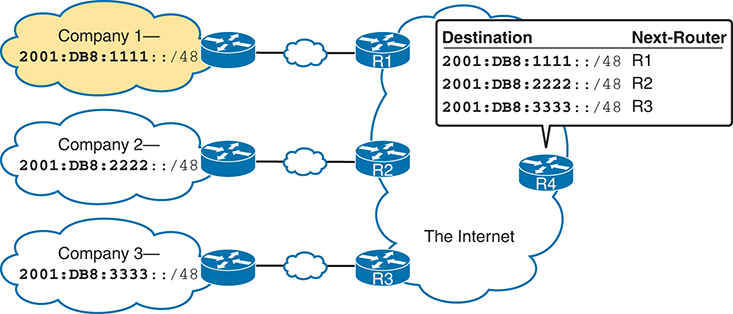


**Figure 26-1** *Three Global Routing Prefixes, with One Route per Prefix*

Company 1, labeled with the prefix "2001:DB8:1111::/48," is connected to Router R1 through Ethernet W A N. Company 2 has the prefix "2001:DB8:2222::/48" and is linked to Router R2 through Ethernet W A N. Company 3, associated with the prefix "2001:DB8:3333::/48," connects to Router R3 through Ethernet W A N. All three routers are interconnected and route their data to Router R4, labeled as "The Internet." The Destination and Next-Router columns on the right side list each company's Global Routing Prefix and corresponding router.

The figure shows three global routing prefixes, each defining a range of GUAs reserved for use by the three companies in the figure. Consider prefix 2001:DB8:1111::/48. The prefix length, 48, happens to equal 12\*4. So, the first phrase that follows gives a more literal and binary view of the meaning of "2001:DB8:1111::/48," while the second line shows the much easier hex view:

Addresses whose first 48 bits equal the first 48 bits of 2001:DB8:1111::

Addresses whose first 12 hex digits equal the first 12 hex digits of 2001:DB8:1111::

The address assignment process sets those IPv6 addresses apart for use by that one company, just like a public IPv4 network or a CIDR address block does in IPv4. All IPv6 addresses inside that company should begin with those first bits in the global routing prefix. No other companies should use IPv6 addresses with that same prefix. And thankfully, IPv6 has plenty of space to allow all companies to have a global routing prefix with plenty of addresses.

Both the IPv6 and IPv4 address assignment processes rely on the same organizations: IANA (along with ICANN), the Regional Internet Registries (RIR), and ISPs. For example, an imaginary company, Company1, received the assignment of a global routing prefix. The prefix means "All addresses whose first 12 hex digits are 2001:0DB8:1111," as represented by prefix 2001:0DB8:1111::/48. To receive that assignment, the process shown in [Figure 26-2](vol1_ch26.md#ch26fig02) happened.

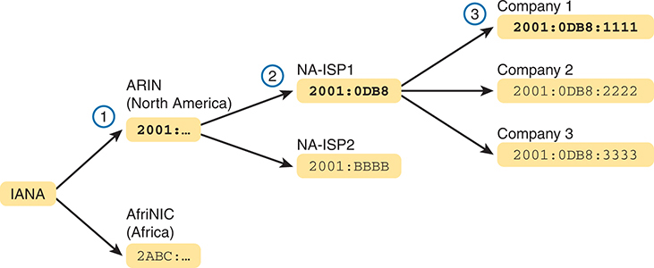


**Figure 26-2** *Prefix Assignment with IANA, RIRs, and ISPs*

IANA assigns a prefix "2001:" to ARIN (North America) and "2ABC:" to AfriNIC (Africa). ARIN further allocates "2001:0DB8" to NA-ISP1 and "2001:BBBB" to NA-ISP2. NA-ISP1 then assigns specific prefixes like "2001:0DB8:1111" to Company 1, "2001:0DB8:2222" to Company 2, and "2001:0DB8:3333" to Company 3.

The event timeline in the figure uses a left-to-right flow; in other words, the event on the far left must happen first. Following the flow from left to right in the figure:

1. **IANA allocates ARIN prefix 2001::/16:** ARIN (the RIR for North America) asks IANA to allocate a large block of addresses. In this imaginary example, IANA gives ARIN a prefix of "all addresses that begin 2001," or 2001::/16.
2. **ARIN allocates NA-ISP1 prefix 2001:0DB8::/32:** NA-ISP1, an imaginary ISP based in North America, asks ARIN for a new IPv6 prefix. ARIN takes a subset of its 2001::/16 prefix, specifically all addresses that begin with the 32 bits (8 hex digits) 2001:0DB8, and allocates it to the ISP.
3. **NA-ISP1 assigns Company 1 2001:0DB8:1111::/48:** Company 1 decides to start supporting IPv6, so it goes to its ISP, NA-ISP1, to ask for a block of GUAs. NA-ISP1 assigns Company 1 a "small" piece of NA-ISP1's address block, in this case, the addresses that begin with the 48 bits (12 hex digits) of 2001:0DB8:1111 (2001:0DB8:1111::/48).

Note

If you do not plan to connect to the Internet using IPv6 for a while and just want to experiment, you do not need to ask for an IPv6 global routing prefix to be assigned. Just make up IPv6 addresses and configure your devices, or use unique local addresses, as discussed toward the end of this chapter.

#### Address Ranges for Global Unicast Addresses

Global unicast addresses make up the majority of the IPv6 address space. However, unlike IPv4, the rules for which IPv6 addresses fall into which category are purposefully more flexible than they were with IPv4 and the rules for IPv4 Classes A, B, C, D, and E.

IANA allocates all IPv6 addresses that begin with hex 2 or 3 as global unicast addresses. The prefix 2000::/3 formally defines that range of numbers, meaning all addresses whose first three bits (per the /3 prefix length) match the first three bits of 2000::. To further explain:

* The first hex digit (2) is binary 0010.
* /3 means the number represents all addresses with the same first three bits as the listed prefix, or 001 binary in this case.
* The hex values whose first three bits are 001 are hex 2 and 3 but no others.
* Therefore, prefix 2000::/3 means all addresses that begin with hex 2 or 3.

IANA can expand the GUA address range beyond 2000::/3 over time if needed. RFC 4291, "IPv6 Addressing Architecture," which lays the foundation of IPv6 addressing, reserves all addresses not otherwise reserved for the GUA address space. However, by current policy, IANA allocates global unicasts only from the 2000::/3 range.

Note

For perspective, the 2000::/3 GUA address space, if allocated to organizations as only /48 prefixes, would provide more than 30 trillion /48 global routing prefixes. Each global routing prefix would allow for 65,536 subnets. IANA may never exhaust the 2000::/3 GUA address space.

[Table 26-2](vol1_ch26.md#ch26tab02) lists the address prefixes discussed in this book and their purpose.


**Table 26-2** Some Types of IPv6 Addresses and Their First Hex Digit(s)

| Address Type | First Hex Digits |
| --- | --- |
| Global unicast | 2 or 3 |
| Unique local | FD |
| Multicast | FF |
| Link local | FE80 |

#### IPv6 Subnetting Using Global Unicast Addresses

After an enterprise has a block of reserved GUAs--in other words, a global routing prefix--the company needs to subdivide that large address block into subnets.

Subnetting IPv6 addresses generally works like IPv4, but with mostly simpler math (hoorah!). Many IPv6 RFCs dictate that all subnets deployed in a network (that is, by configuration on endpoints and routers) use a /64 prefix length. Using /64 as the prefix length for all subnets makes the IPv6 subnetting math just as easy as using a /24 mask for all IPv4 subnets. In addition, the dynamic IPv6 address assignment process works better with a /64 prefix length as well; so in practice, and in this book, expect IPv6 designs to use a /64 prefix length for subnets.

This section progresses through the different parts of IPv6 subnetting while using examples that use a /64 prefix length. The discussion defines the rules about which addresses should be in the same subnet and which addresses need to be in different subnets. Plus, this section looks at how to analyze the global routing prefix and associated prefix length to find all the IPv6 subnet prefixes and the addresses in each subnet.

Note

If the IPv4 subnetting concepts are a little vague, you might want to reread [Chapter 11](vol1_ch11.md#ch11), "[Perspectives on IPv4 Subnetting](vol1_ch11.md#ch11)," which discusses the subnetting concepts for IPv4.

##### Deciding Where IPv6 Subnets Are Needed

First, IPv6 and IPv4 both use the same concepts about where a subnet is needed: one for each VLAN and one for each point-to-point WAN connection (serial and Ethernet). [Figure 26-3](vol1_ch26.md#ch26fig03) shows an example of the idea, using the small enterprise internetwork of Company 1. Company 1 has two LANs, with a point-to-point Ethernet WAN link connecting the sites. It also has an Ethernet WAN link connected to an ISP. Using the same logic you would use for IPv4, Company 1 needs four IPv6 subnets.

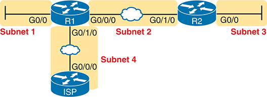


**Figure 26-3** *Locations for IPv6 Subnets*

The network configuration involves two routers (R1 and R2), an Internet Service Provider (I S P), and four subnets. R1 is connected to Subnet 1 via interface G0/0 through W A N line and to the I S P through interface G0/1/0 and the I S P is linked to Subnet 4 via port G0/0/0. R1 with interface G0/0/0 is connected to R2 with G0/1/0 via W A N line. R2 is connected to Subnet 3 through port G0/0. Both routers are interconnected via their respective ports G0/0/0, with Subnet 2 situated between them, connected through R2's port G0/1/0.

##### The Mechanics of Subnetting IPv6 Global Unicast Addresses

To understand how to subnet your one large block of IPv6 addresses, you need to understand some of the theories and mechanisms IPv6 uses. To learn those details, it can help to compare IPv6 with some similar concepts from IPv4.

With IPv4, without subnetting, an address has two parts: a network part and a host part. Class A, B, and C rules define the length of the network part, with the host part making up the rest of the 32-bit IPv4 address, as shown in [Figure 26-4](vol1_ch26.md#ch26fig04).

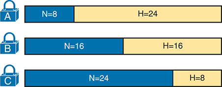


**Figure 26-4** *Classful View of Unsubnetted IPv4 Networks*

Three classes of IPv4 networks: Class A, Class B, and Class C are presented. Each class is represented by a horizontal bar divided into two sections, 'N' for network and 'H' for host, indicating the number of bits allocated to each. Class A has 8 bits for the network and 24 bits for the host, Class B equally divides the bits with 16 for the network and 16 for the host, while Class C allocates more bits to the network with 24 and only 8 bits for the host. Each class is also marked with a padlock icon indicating their respective classes.

To subnet an IPv4 Class A, B, or C network, the network engineer for the enterprise makes some choices. Conceptually, the engineer creates a three-part view of the addresses, adding a subnet field in the center while shortening the host field. (Many people call this "borrowing host bits.") The size of the network part stays locked per the Class A, B, and C rules, with the line between the subnet and host part being flexible, based on the choice of subnet mask. [Figure 26-5](vol1_ch26.md#ch26fig05) shows the field names and concepts idea for a subnetted Class B network.

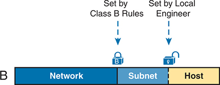


**Figure 26-5** *Classful View of Subnetted IPv4 Networks with Field Names*

The network is divided into three sections: "Network," "Subnet," and "Host". The "Network" section value is set according to Class B rules, while the "Subnet" and "Host" sections are configured by a local engineer, indicated by two padlock icons.

First, just think about the general idea with IPv6, comparing [Figure 26-6](vol1_ch26.md#ch26fig06) to [Figure 26-5](vol1_ch26.md#ch26fig05). The IPv6 global routing prefix (the prefix/length assigned by the RIR or ISP) acts like the IPv4 network part of the address structure. The IPv6 subnet ID acts like the IPv4 subnet field. And the right side of the IPv6 address, formally called the [interface ID](vol1_gloss.md#gloss_194) (short for interface identifier), or simply *IID*, acts like the IPv4 host field.


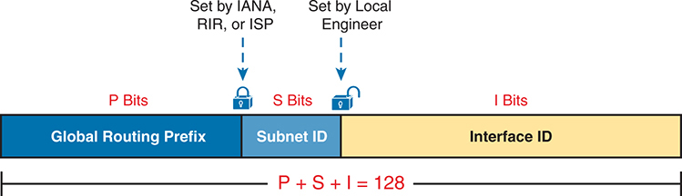


**Figure 26-6** *Structure of Subnetted IPv6 Global Unicast Addresses*

The address is divided into three sections: "Global Routing Prefix," "Subnet ID," and "Interface ID." The "Global Routing Prefix" is set by IANA, RIR, or ISP and contains P bits. The "Subnet ID" is determined by the local engineer and contains S bits. The "Interface ID" consists of I bits. A mathematical equation at the bottom, "P plus S plus I equals 128," indicates the sum up of these three segments together.

Now focus on the IPv6 global routing prefix and its prefix length. Unlike IPv4, IPv6 has no concept of address classes, so no preset rules determine the prefix length of the global routing prefix. When a company applies to an ISP, RIR, or any other organization that can assign a global routing prefix, that assignment includes both the prefix and the prefix length. After a company receives a global routing prefix and that prefix length, the length of the prefix typically does not change over time and is locked. (Note that the prefix length of the global routing prefix is often between /32 and /48, or possibly as long as /56.)

Next, look to the right side of [Figure 26-6](vol1_ch26.md#ch26fig06) to the interface ID (IID) field. Several RFCs (including RFC 4291, "IPv6 Addressing Architecture") state that IIDs should be 64 bits long. A 64-bit IID works well with the IPv6 methods for dynamic IPv6 address assignment.

Finally, look to the subnet ID field in [Figure 26-6](vol1_ch26.md#ch26fig06). This field creates a place with which to number IPv6 subnets. The subnet ID field length depends on two facts: the global routing prefix's length and the interface ID's length. Assuming the typical 64-bit IID, the subnet ID field is typically 64-P bits, with P being the length of the global routing prefix.

As an example, consider the structure of a specific global unicast IPv6 address, 2001:0DB8:1111:0001:0000:0000:0000:0001, as seen in [Figure 26-7](vol1_ch26.md#ch26fig07). In this case:

* The company was assigned global routing prefix 2001:0DB8:1111/48.

  
* The company uses the usual 64-bit interface ID and /64 prefix length for the subnet.
* The company has a subnet field of 16 bits, allowing for 2*16* IPv6 subnets.

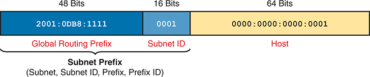


**Figure 26-7** *Address Structure for Company 1 Example*

The address is divided into three sections: "Global Routing Prefix," "Subnet ID," and "Host." The "Global Routing Prefix" is 48 bits long and contains the hexadecimal value "2001:0DB8:1111." The "Subnet ID" is 16 bits long and contains the value "0001." The "Host" section is 64 bits long and contains the value "0000:0000:0000:0001." Below the segmented bar, a label reads "Subnet Prefix (Subnet, Subnet ID, Prefix, Prefix ID)" indicating the combination of Global Routing Prefix and Subnet ID.

The example in [Figure 26-7](vol1_ch26.md#ch26fig07), along with a bit of math, shows one reason why so many companies embrace the recommendation of a 64-bit IID. With this structure, Company 1 can support 2*16* possible subnets (65,536). Few companies need that many subnets. However, RIRs and ISPs can be generous in approving much larger blocks of public IPv6 addresses, so even if 65,536 subnets are enough, a company might apply for and receive a global routing prefix assignment with a shorter length, like /32, or /40. That would give them many more subnets (2*32* and 2*24*, respectively), opening up many possibilities for their subnet design and subnet numbering plans, beyond just having enough subnets.

Each subnet has far more than enough hosts per subnet with 64 bits in the interface ID. The motivation for the 64-bit IID comes from supporting various RFCs, particularly those related to dynamic IPv6 address assignment, including DHCP and SLAAC.

##### Listing the IPv6 Subnet Prefix (Subnet ID)

When working with IPv6 in Cisco routers, you often work with the numbers representing the subnet. For IPv6, you will use these terms:

[Subnet prefix](vol1_gloss.md#gloss_391)**:** The formal term for the number representing the subnet, including both the global routing prefix and subnet ID shown in [Figure 26-7](vol1_ch26.md#ch26fig07).

[Subnet ID or Prefix ID](vol1_gloss.md#gloss_387)**:** Informal terms used as synonyms for subnet prefix.

While the term *subnet prefix* comes from the RFCs, people tend to use the term *subnet ID*, given the history of that term in IPv4. However, note the potential miscommunication between the formal meaning of subnet ID (the middle portion of the address structure per [Figure 26-7](vol1_ch26.md#ch26fig07)) or as a synonym for subnet prefix.

[Chapter 25](vol1_ch25.md#ch25), "[Fundamentals of IP Version 6](vol1_ch25.md#ch25)," already discussed finding the subnet prefix, given an IPv6 address and prefix length. The math works the same whether working with global unicast addresses or with the unique local addresses discussed later in the chapter. Just to review an example, the subnet prefix for the address in [Figure 26-7](vol1_ch26.md#ch26fig07) would be

```
2001:DB8:1111:1::/64
```

##### List All IPv6 Subnets

With IPv4, if you choose to use a single subnet mask for all subnets, you can find all the subnets of a Class A, B, or C network using that one subnet mask. With IPv6, the same ideas apply, and the /64 prefix length means you can find all subnets with no binary math.

To find all the subnet IDs, you simply need to find all the unique values that will fit inside the subnet ID part of the three-part IPv6 address, as shown in [Figure 26-6](vol1_ch26.md#ch26fig06) and [Figure 26-7](vol1_ch26.md#ch26fig07), basically following these rules:

* All subnet IDs begin with the global routing prefix.
* Use a different value in the subnet field to identify each subnet.
* All subnet IDs have all 0s in the interface ID.

As an example, take the IPv6 design shown in [Figure 26-7](vol1_ch26.md#ch26fig07), and think about all the subnet IDs. First, all subnets will use the commonly used /64 prefix length. This company uses a global routing prefix of 2001:0DB8:1111::/48, which defines the first 12 hex digits of all the subnet IDs. The list of all possible IPv6 subnet prefixes provides all binary combinations in the subnet ID field, in this case, the fourth quartet. Also, represent the last four 0000 quartets with a :: symbol. [Figure 26-8](vol1_ch26.md#ch26fig08) shows the beginning of just such a list.

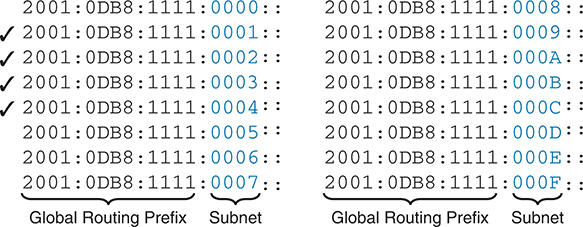


**Figure 26-8** *First 16 Possible Subnets with a 16-bit Subnet Field in This Example*

In the first 16 possible subnets of an IPv6 address with a 16-bit subnet field, each address starts with the consistent Global Routing Prefix "2001:0DB8:1111:" and is followed by a varying Subnet field ranging from "0000:" to "0009:" and "000A:" to "000F:" in hexadecimal format. From second to fifth IPv6 addresses are preceded by a check mark.

The example allows for 65,536 subnets, so clearly, the example will not list all the possible subnets. However, in that fourth quartet, all combinations of hex values would be allowed.

Note

Each IPv6 subnet ID, more formally called the [subnet router anycast address](vol1_gloss.md#gloss_392), is reserved and should not be used as an IPv6 address for any host.

##### Assign Subnets to the Internetwork Topology

After an engineer lists all the possible subnet IDs (based on the subnet design), the next step is to choose which subnet ID to use for each link that needs an IPv6 subnet. As with IPv4, each VLAN, each serial link, each Ethernet WAN link, and many other data-link instances need an IPv6 subnet.

[Figure 26-9](vol1_ch26.md#ch26fig09) shows an example using Company 1 again. The figure uses the four subnets from [Figure 26-8](vol1_ch26.md#ch26fig08) that have check marks beside them. The check marks are just a reminder not to use those four subnets in other locations.


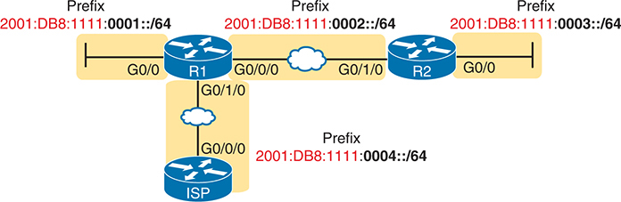


**Figure 26-9** *Subnets in Company 1, with Global Routing Prefix of 2001:0DB8:1111::/48*

The network includes two routers, R1 and R2, each connected to different network segments via interfaces. The connections represent different subnets, each labeled with their respective IPv6 addresses with prefixes: 2001:DB8:1111:0001::/64, 2001:DB8:1111:0002::/64, and 2001:DB8:11111:0003::/64. The first subnet is connected to router R1 via the G0/0 interface, the second subnet is linked between routers R1 and R2 through the G0/0/0 and G0/1/0 interfaces respectively, and the third subnet is connected to router R2 via the G0/0 interface. An ISP with a prefix of 2001:DB8:11111:0004::/64, is connected to router R1, via interfaces G0/0/0 to G0/1/0 through Ethernet W A N.

#### Assigning Addresses to Hosts in a Subnet

Now that the engineer has planned which IPv6 subnet to use in each location, the individual IPv6 addressing can be planned and implemented. Each address must be unique in that no other host interface uses the same IPv6 address. Also, the hosts cannot use the subnet ID itself.

The process of assigning IPv6 addresses to interfaces works similarly to IPv4. Addresses can be configured statically, along with the prefix length, default router, and Domain Name System (DNS) IPv6 addresses. Alternatively, hosts can learn these same settings dynamically, using either Dynamic Host Configuration Protocol (DHCP) or a built-in IPv6 mechanism called Stateless Address Autoconfiguration (SLAAC). [Chapter 28](vol1_ch28.md#ch28), "[Implementing IPv6 Addressing on Hosts](vol1_ch28.md#ch28)," discusses IPv6 address assignment in more depth.

For example, [Figure 26-10](vol1_ch26.md#ch26fig10) shows some static IP addresses chosen for the router interfaces based on the subnet choices shown in [Figure 26-9](vol1_ch26.md#ch26fig09). In each case, the router interfaces use an interface ID that is a relatively low number and easily remembered.

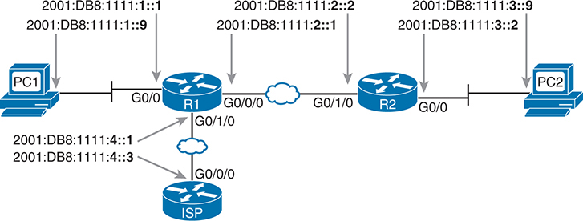


**Figure 26-10** *Example Static IPv6 Addresses Based on the Subnet Design of [Figure 26-9](vol1_ch26.md#ch26fig09)*

The network features two hosts, PC1 and PC2, two routers, R1 and R2, and an Internet Service Provider (ISP). PC1 is connected to router R1 via the G0/0 interface, with IPv6 addresses from 2001:DB8:1111:1::1 to ::9. Router R1 is connected to the ISP through the G0/1/0 interface to G0/0/0, with IPv6 addresses from 2001:DB8:111:4::1 to ::3. Routers R1 and R2 are interconnected through their G0/0/0 and G0/1/0 interfaces respectively, with IPv6 addresses from 2001:DB8:111:2::1 to ::2. PC2 is connected to router R2 via the G0/0 interface, with IPv6 addresses from 2001:DB8:111:3::2 to ::9.

This chapter puts off the details of how to configure the IPv6 addresses until [Chapter 27](vol1_ch27.md#ch27), "[Implementing IPv6 Addressing on Routers](vol1_ch27.md#ch27)."

### Unique Local Unicast Addresses

Unique local addresses (ULAs) act as private IPv6 unicast addresses. These addresses have many similarities with global unicast addresses, particularly in how to subnet. The biggest difference lies in the literal number (ULAs begin with hex FD) and with the administrative process: the ULA prefixes are not registered with any numbering authority and can be used by multiple organizations.

Although the network engineer creates unique local addresses without any registration or assignment process, the addresses still need to follow some rules, as follows:

* Use FD as the first two hex digits.

  
* Choose a unique 40-bit global ID.
* Append the global ID to FD to create a 48-bit prefix, used as the prefix for all your addresses.
* Use the next 16 bits as a subnet field.
* Note that the structure leaves a convenient 64-bit interface ID field.

[Figure 26-11](vol1_ch26.md#ch26fig11) shows the format of these unique local unicast addresses.


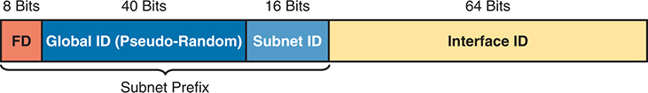


**Figure 26-11** *IPv6 Unique Local Unicast Address Format*

The format features a horizontal bar divided into four segments, each representing a different component of an IPv6 address. The first segment allocated 8 bits, is labeled "FD". Adjacent to it is allocated 40 bits labeled "Global ID (Pseudo-Random)". The third segment, allocated 16 bits is the "Subnet ID". The final segment with an allocation of 64 bits is labeled "Interface ID". A label "Subnet Prefix" runs underneath the first three segments.

Note

Just to be entirely exact, IANA reserves prefix FC00::/7, and not FD00::/8, as the address range for ULAs. FC00::/7 includes all addresses that begin with hex FC and FD. However, the ULA RFC (4193) also requires setting the eighth bit to 1, which means that all ULAs begin with their first two hex digits as FD.

#### Subnetting with Unique Local IPv6 Addresses

Subnetting ULAs works like subnetting GUAs, assuming you begin with a 48-bit global routing prefix. The differences lie in that you must be assigned the GUA global routing prefix and prefix length. With ULAs, you create a prefix locally, with a prefix of /48.

To choose your 48-bit (12 hex digit) ULA prefix, you begin with hex FD and choose ten hex digits via a random number process. Per the ULA RFC, you should use a defined pseudo-random algorithm to determine your global ID. When practicing in lab, you can just make up a number. For example, imagine you chose a 10-hex-digit value of hex 00 0001 0001 and prepend a hex FD, making the entire prefix FD00:0001:0001::/48, or FD00:1:1::/48 when abbreviated.

To create subnets, just as you did in the earlier examples with a 48-bit global routing prefix, treat the entire fourth quartet as the subnet ID field, as shown in [Figure 26-11](vol1_ch26.md#ch26fig11).

[Figure 26-12](vol1_ch26.md#ch26fig12) shows an example subnetting plan using unique local addresses. The example repeats the same topology shown earlier in [Figure 26-9](vol1_ch26.md#ch26fig09); that figure showed subnetting with a global unicast prefix. This example uses the exact same numbers for the fourth quartet's subnet field, simply replacing the 48-bit global unicast prefix with this new local unique prefix of FD00:1:1.

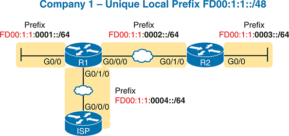


**Figure 26-12** *Subnetting Using Unique Local Addresses*

The network includes two routers, R1 and R2, each connected to different network segments via interfaces. The connections represent different subnets, each labeled with their respective IPv6 addresses with prefixes: FD00:1:1:0001::/64, FD00:1:1:0002::/64, and FD00:1:1:0003::/64. The first subnet is connected to router R1 via the G0/0 interface, the second subnet is linked between routers R1 and R2 through the G0/0/0 and G0/1/0 interfaces respectively via Ethernet W A N, and the third subnet is connected to router R2 via the G0/0 interface. An ISP with a prefix of FD00:1:1:0004::/64, is connected to router R1, via interfaces G0/0/0 to G0/1/0 through Ethernet W A N.

#### The Need for Globally Unique Local Addresses

The example in [Figure 26-12](vol1_ch26.md#ch26fig12) shows an easy-to-remember prefix of FD00:1:1::/48. I made up the easy-to-remember global ID in this example. What global ID would you choose for your company? Would you pick a number that you could not abbreviate and make it shorter? If you had to pick the IPv6 prefix for your ULAs from the options in the following list, which would you pick for your company?

* `FDE9:81BE:A059::/48`
* `FDF0:E1D2:C3B4::/48`
* `FD00:1:1::/48`

Given the freedom to choose, most people would pick an easy-to-remember, short-to-type prefix, like FD00:1:1::/48. And in a lab or other small network used for testing, making up an easy-to-use number is reasonable. However, for use in real corporate networks, you should not just make up any global ID you like. Instead, follow the ULA rules to make your ULAs unique in the universe--even without registering a prefix with an ISP or RIR.

RFC 4193 stresses the importance of choosing your global ID to make it statistically unlikely to be used by other companies. What is the result of unique global IDs at every company? It makes all these [ULA global IDs](vol1_gloss.md#gloss_419) unique across the globe. So, if you plan on using ULAs in a real network, use the random number generator logic listed in RFC 4193 to create your prefix.

One of the big reasons to attempt to use a unique prefix, rather than everyone using the same easy-to-remember prefixes, is to be ready for the day your company merges with or buys another company. Today, with IPv4, a high percentage of companies use private IPv4 network 10.0.0.0. When they merge their networks, the fact that both use network 10.0.0.0 makes the network merger more painful than if the companies had used different private IPv4 networks. With IPv6 ULAs, if both companies did the right thing and randomly chose a prefix, they will most likely be using completely different prefixes, making the merger much simpler. However, companies that take the seemingly easy way out and choose an easy-to-remember prefix like FD00:1:1 significantly increase their risk of requiring extra effort when merging with another company that also chose to use that same prefix.

### Chapter Review

One key to doing well on the exams is to perform repetitive spaced review sessions. Review this chapter's material using either the tools in the book or interactive tools for the same material found on the book's companion website. Refer to the "[Your Study Plan](vol1_pref10.md#pref10)" element for more details. [Table 26-3](vol1_ch26.md#ch26tab03) outlines the key review elements and where you can find them. To better track your study progress, record when you completed these activities in the second column.

**Table 26-3** Chapter Review Tracking

| Review Element | Review Date(s) | Resource Used |
| --- | --- | --- |
| Review key topics |  | Book, website |
| Review key terms |  | Book, website |
| Answer DIKTA questions |  | Book, PTP |
| Review memory table |  | Website |
| Watch video |  | Website |

### Review All the Key Topics


**Table 26-4** Key Topics for [Chapter 26](vol1_ch26.md#ch26)

| Key Topic Element | Description | Page Number |
| --- | --- | --- |
| List | Two types of IPv6 unicast addresses | [656](vol1_ch26.md#page_656) |
| [Table 26-2](vol1_ch26.md#ch26tab02) | Values of the initial hex digits of IPv6 addresses, and the address type implied by each | [659](vol1_ch26.md#page_659) |
| [Figure 26-6](vol1_ch26.md#ch26fig06) | Subnetting concepts for IPv6 global unicast addresses | [661](vol1_ch26.md#page_661) |
| List | Rules for how to find all IPv6 subnet IDs, given the global routing prefix, and prefix length used for all subnets | [662](vol1_ch26.md#page_662) |
| List | Rules for building unique local unicast addresses | [665](vol1_ch26.md#page_665) |
| [Figure 26-11](vol1_ch26.md#ch26fig11) | Subnetting concepts for IPv6 unique local addresses | [665](vol1_ch26.md#page_665) |

### Key Terms You Should Know

[global routing prefix](vol1_ch26.md#key_273)

[global unicast address](vol1_ch26.md#key_274)

[interface ID (IID)](vol1_ch26.md#key_275)

[subnet ID (prefix ID)](vol1_ch26.md#key_276)

[subnet prefix](vol1_ch26.md#key_277)

[subnet router anycast address](vol1_ch26.md#key_278)

[ULA global ID](vol1_ch26.md#key_279)

[unique local address](vol1_ch26.md#key_280)