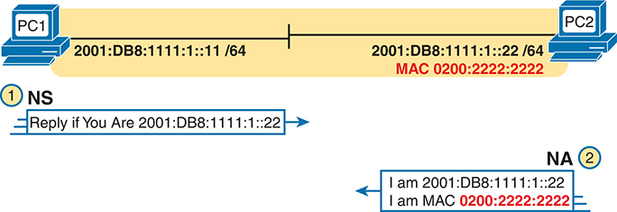
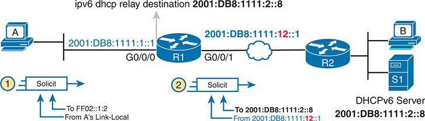
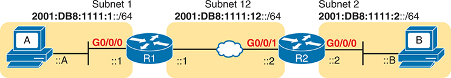

# Chapter 28


## Implementing IPv6 Addressing on Hosts

This chapter covers the following exam topics:

1.0 Network Fundamentals

1.8 Configure and verify IPv6 addressing and prefix

1.9 Describe IPv6 address types

1.9.a Unicast (global, unique local, and link local)

1.9.d Modified EUI 64

IPv6 hosts act like IPv4 hosts in many ways, using similar ideas, similar protocols, and even similar or identical commands for the same purpose. At the same time, IPv6 sometimes takes a different approach than IPv4, using a different solution with a new protocol or command. For example:

* Like IPv4, IPv6 hosts use a unicast address, prefix length (mask), default router, and DNS server.
* Like IPv4, IPv6 uses a protocol to dynamically learn the MAC addresses of other hosts in the same LAN-based subnet.
* Unlike IPv4, IPv6 hosts use the Neighbor Discovery Protocol (NDP) for many functions, including those done by IPv4's ARP.
* Like IPv4, IPv6 hosts can use DHCP to learn their four primary IPv6 settings.
* Unlike IPv4, IPv6 supports a dynamic address assignment process other than DHCP, called Stateless Address Autoconfiguration (SLAAC).

This chapter focuses on the four primary IPv6 settings on hosts: the address, prefix length, default router address, and DNS server address. However, to understand how hosts dynamically learn those addresses, this chapter begins its first major section devoted to NDP, which plays a crucial role in several IPv6 processes. The middle section of the chapter then focuses on how hosts dynamically learn their IPv6 settings with DHCP and SLAAC. The final major section of this chapter looks at the tools to verify a host's IPv6 settings, many of which use the same commands used for IPv4.

### "Do I Know This Already?" Quiz

Take the quiz (either here or use the PTP software) if you want to use the score to help you decide how much time to spend on this chapter. The letter answers are listed at the bottom of the page following the quiz. [Appendix C](vol1_appc.md#appc), found both at the end of the book as well as on the companion website, includes both the answers and explanations. You can also find both answers and explanations in the PTP testing software.

**Table 28-1** "Do I Know This Already?" Foundation Topics Section-to-Question Mapping

| Foundation Topics Section | Questions |
| --- | --- |
| The Neighbor Discovery Protocol | 1-4 |
| Dynamic Configuration of Host IPv6 Settings | 5-7 |
| Troubleshooting Host IPv6 Addressing | 8 |

**[1](vol1_ch28.md#ques28_1a).** PC1, PC2, and Router R1 all connect to the same VLAN and IPv6 subnet. PC1 wants to send its first IPv6 packet to PC2. What protocol message will PC1 use to begin the process of discovering PC2's MAC address?

1. ARP Request
2. NDP NS
3. NDP RS
4. SLAAC NS

**[2](vol1_ch28.md#ques28_2a).** Which of the following pieces of information does a router supply in an NDP Router Advertisement (RA) message? (Choose two answers.)

1. Router IPv6 address
2. Router hostname
3. IPv6 prefix(es) on the link
4. IPv6 address of DHCP server

**[3](vol1_ch28.md#ques28_3a).** Three routers (R1, R2, and R3) connect to the same VLAN and IPv6 subnet. All three routers have responded to various NDP RS messages with NDP RA messages. Which of the answers best describes the kind of NDP information held in the output of the **show ipv6 neighbors** command on R1?

1. IPv6 neighbors (both routers and hosts) plus their MAC addresses, without noting which are routers
2. IPv6 neighbors (both routers and hosts) plus their MAC addresses, also noting which are routers
3. IPv6 routers, with no information about nonrouters, with no MAC address info
4. IPv6 routers, with no information about nonrouters, but with MAC address info

**[4](vol1_ch28.md#ques28_4a).** PC1 and Router R1 connect to the same VLAN and IPv6 subnet. The user of PC1 pings the IPv6 address of a host that sits at a remote site so that the packets flow through R1, PC1's default router. PC1 learned all its IPv6 settings dynamically. Which of the following answers lists a protocol or message that PC1 could have used to learn what IPv6 address to use as its default router?

1. EUI-64
2. NDP NS
3. DAD
4. NDP RS

**[5](vol1_ch28.md#ques28_5a).** Host PC1 dynamically learns its IPv6 settings using Stateless Address Autocon-figuration (SLAAC). Which one of PC1's settings is most likely to be learned from the stateless DHCPv6 server?

1. Host address
2. Prefix length
3. Default router address
4. DNS server address(es)

**[6](vol1_ch28.md#ques28_6a).** Host PC1 dynamically learns its IPv6 settings using Stateless Address Autoconfiguration (SLAAC). Think about the host's unicast address as two parts: the subnet prefix and the interface ID. Which answers list a way that SLAAC learns or builds the value of the interface ID portion of the host's address? (Choose two answers.)

1. Learned from a DHCPv6 server
2. Built by the host using EUI-64 rules
3. Learned from a router using NDP RS/RA messages
4. Built by the host using a random value

**[7](vol1_ch28.md#ques28_7a).** An IPv6 host is configured to use DHCP to lease its IPv6 address. The DHCPv6 server is not on the same link but is located at another site. Which answer describes a mechanism the client and routers use to make the DHCPv6 messages flow between the client and server?

1. The client sends the DHCPv6 Solicit message to multicast address FF02:1:2.
2. The client sends the DHCPv6 Solicit message to broadcast address FFFF:FFFF:FFFF:FFFF:FFFF:FFFF:FFFF:FFFF.
3. The client must learn the DHCPv6 server's unicast address from a local router using NDP messages.
4. The routers use IPv6 multicast routing to forward the Solicit message, unchanged, to the DHCPv6 server.

**[8](vol1_ch28.md#ques28_8a).** All routers in the network have global unicast addresses (GUAs) configured on their interfaces. The user of PC1, on a LAN, issues a **traceroute** command for a distant host's address. The command succeeds, listing four lines with IPv6 addresses. Which answer best describes the addresses in the **traceroute** output and its use of link-local addresses (LLAs) and GUAs?

1. All lines list LLAs with no GUAs.
2. The first line lists an address that matches PC1's default route.
3. All lines list GUAs with no LLAs.
4. The last line lists the GUA of the final router in the route.

Answers to the "Do I Know This Already?" quiz:

**[1](vol1_appc.md#ques28_1)** B

**[2](vol1_appc.md#ques28_2)** A, C

**[3](vol1_appc.md#ques28_3)** A

**[4](vol1_appc.md#ques28_4)** D

**[5](vol1_appc.md#ques28_5)** D

**[6](vol1_appc.md#ques28_6)** B, D

**[7](vol1_appc.md#ques28_7)** A

**[8](vol1_appc.md#ques28_8)** C

### Foundation Topics

### The Neighbor Discovery Protocol

IPv4 and IPv6 define a wide range of control and management functions as part of the Internet Control Message Protocol (ICMP). To support similar features in IPv6, the Internet community created ICMPv6, which defines protocols appropriate for IPv6. (For easier comparison, ICMP for IPv4 is often called ICMPv4.)

The [Neighbor Discovery Protocol (NDP)](vol1_gloss.md#gloss_269), a part of ICMPv6 defined in RFC 4861, provides several vital functions in every IPv6 network. Notably, NDP defines the IPv6 equivalent of the IPv4 ARP function. Some of its functions are

**Neighbor MAC Discovery:** An IPv6 LAN-based host will need to learn the MAC address of other hosts in the same subnet. NDP replaces IPv4's ARP, providing messages that replace the ARP Request and Reply messages.


**Router Discovery:** Hosts learn the IPv6 addresses of the available IPv6 routers in the same subnet.

[Prefix Discovery](vol1_gloss.md#gloss_312)**:** Hosts learn the IPv6 subnet prefix and prefix length that the router(s) expect to exist on the link.

[Duplicate Address Detection (DAD)](vol1_gloss.md#gloss_116)**:** Before using an IPv6 address, hosts use NDP to perform a Duplicate Address Detection process to ensure no other host uses the same IPv6 address before attempting to use it.

The next few pages explain the listed features.

#### Discovering Neighbor Link Addresses with NDP NS and NA

NDP replaces IPv4 ARP using the *Neighbor Solicitation (NS)* and *Neighbor Advertisement (NA)* messages. The NS acts like an IPv4 ARP Request, asking the host with a particular unicast IPv6 address to send back a reply. The NA message acts like an IPv4 ARP Reply, listing that host's MAC address. The following list summarizes the functions:

[Neighbor Solicitation (NS)](vol1_gloss.md#gloss_270)**:** This message asks the host with a particular IPv6 address (the target address) to reply with an NA message that lists its MAC address.


[Neighbor Advertisement (NA)](vol1_gloss.md#gloss_268)**:** This message lists the sender's IPv6 and MAC addresses. It can be sent in reply to an NS message; if so, the packet is sent to the IPv6 unicast address of the host that sent the original NS message. A host can also send an unsolicited NA, announcing its IPv6 and MAC addresses, in which case the message is sent to the all-IPv6-hosts local-scope multicast address FF02::1.

Note

With NDP, the word *neighbor* refers to hosts on the same data link--for example, the same VLAN.

[Figure 28-1](vol1_ch28.md#ch28fig01) shows an example of how a host (PC1) uses an NS message to learn the MAC address used by another host. The NS message lists a target IPv6 unicast address with the implied question: "What is your link address?" The NA message, in this example, sent back to the original host that asked the question, lists that link address.

At Step 1 of this particular example, PC1 sends the solicitation to find PC2's MAC address. PC1 first looks in its NDP neighbor table, the equivalent of the IPv4 ARP cache, and does not find the MAC address for IPv6 address 2001:DB8:1111:1::22. So, at Step 1, PC1 sends the NDP NS message to the target.





**Figure 28-1** *Example NDP NS/NA Process to Find the Neighbor's Link Addresses*

The schematic features two computers, PC1 and PC2, communicating. PC1, with an IP address of 2001:DB8:1111:1::11/64, sends a Neighbor Solicitation (NS) message to PC2, asking "Reply if You Are 2001:DB8:1111:1::22". PC2, with an IP address of 2001:DB8:1111:1::22/64 and a MAC address of 0200:2222:2222, responds with a Neighbor Advertisement (NA) message confirming "I am 2001:DB8:1111:1::22 I am MAC 0200:2222:2222".

As a brief aside, be aware that NDP NS messages use a destination IPv6 address of the target's solicited-node multicast address, in this case PC2's solicited-node multicast address FF02::1:FF00:22. PC1 would then encapsulate the IPv6 packet in a frame destined to a multicast Ethernet address. If the network engineers at this company also enabled the multicast optimization feature MLD Snooping, the switches would forward the multicast NS message only to hosts that had earlier registered to receive packets sent to that specific multicast address. The other hosts on the link will never see the NS message. If the LAN switches do not implement MLD, then the switches still flood the frame so that it reaches the intended destination.

At Step 2, PC2 reacts to the received NS message. PC2 sends back an NA message, listing PC2's MAC address. PC1 records PC2's MAC address in PC1's NDP neighbor table.

[Example 28-1](vol1_ch28.md#exa28_1) shows an example of the [IPv6 neighbor table](vol1_gloss.md#gloss_219) on Router R1 based on [Figure 28-2](vol1_ch28.md#ch28fig02). In this case, R1 has learned the MAC addresses for Routers R2 and R3, associated with their respective LLAs. R1 has also learned PC A's LLA and GUA and the matching MAC address. (To connect the output to the figure, pay close attention to the interface column on the far right of the output.)


**Figure 28-2** *Sample Network with IPv6 Addresses*

Host A with subnet 1 2001:DB8:1111:1:: /64 and the ::A beside the host A icon sends a packet to host B, through R 1 with interface G0/0/0, and the ::1 beside the icon. R 1 with subnet 12 2001:DB8:1111:12:: /64 and interface G0/0/1, and ::1, passes the packet to R 2 interface G0/0/1, and ::2 through Ethernet W A N. The R 2 interface G0/0/0 passes the packet to host B with Subnet 2 2001:DB8:1111:2:: /64 and the :B beside the host B icon. Host A again sends a packet to host C, through R 1 with interface G0/0/0, and the ::1 beside the icon. R 1 with subnet 13 2001:DB8:1111:13:: /64, interface G0/0/2, and ::1, passes the packet to R 3 interface G0/0/1, and ::3 through Ethernet W A N. The R 3, G0/0/0, and ::3 passes the packet to host C with Subnet 3 2001:DB8:1111:3:: /64 and the :C beside the host C icon.

**Example 28-1** *IPv6 Neighbor Table on Router R1*

[Click here to view code image](vol1_ch28_images.md#f0701-01)

```
R1# show ipv6 neighbors
IPv6 Address                              Age Link-layer Addr State Interface
2001:DB8:1111:1::a                          0 0200.aaaa.aaaa  REACH Gi0/0/0
2001:DB8:1111:1:9EA:93AC:F7CE:D39F          0 3c8c.f8eb.710d  REACH Gi0/0/0
2001:DB8:1111:1:706A:5FDF:AA40:E576        16 3c8c.f8eb.710d  STALE Gi0/0/0
2001:DB8:1111:1:70D0:AE1F:4786:907D         0 80fa.5b04.de8b  STALE Gi0/0/0
2001:DB8:1111:1:7C6B:7B02:DB5C:873F        16 3c8c.f8eb.710d  STALE Gi0/0/0
2001:DB8:1111:1:90A1:C742:1B11:6F10         0 00e0.4c68.1f26  STALE Gi0/0/0
2001:DB8:1111:1:BD2C:9AA4:83E2:6D8F        16 3c8c.f8eb.710d  STALE Gi0/0/0
FE80::AAAA:AAAA                             0 0200.aaaa.aaaa  REACH Gi0/0/0
FE80::184C:56F9:FD3B:D6E7                   0 00e0.4c68.1f26  REACH Gi0/0/0
FE80::552D:E285:4347:BDED                   0 80fa.5b04.de8b  DELAY Gi0/0/0
FE80::706A:5FDF:AA40:E576                   0 3c8c.f8eb.710d  REACH Gi0/0/0
FE80::FF:FE01:2                             0 2436.dadf.9281  REACH Gi0/0/1
FE80::72EA:1AFF:FE9A:D301                   0 70ea.1a9a.d301  REACH Gi0/0/2
```

Note

To view a host's NDP neighbor table, use these commands: (Windows) **netsh interface ipv6 show neighbors**; (Linux) **ip -6 neighbor show**; (macOS) **ndp -an**.

[Example 28-2](vol1_ch28.md#exa28_2) shows an excerpt from a Windows host neighbor table of a host in the same IPv6 subnet as PC A and Router R1 in [Figure 28-2](vol1_ch28.md#ch28fig02). The beginning output shows network shell command **netsh interface ipv6 show neighbors**, as issued in layers (which makes it much easier to issue additional **netsh** commands later). The highlighted entry lists R1's G0/0/0 link-local address (LLA) and MAC address. Also, the highlighted text at the far right of the line identifies this entry as representing a router. The output also lists several solicited-node multicast addresses.

**Example 28-2** *Example Windows Neighbor Table with **netsh interface ipv6 show neighbors** Command*

[Click here to view code image](vol1_ch28_images.md#f0701-02)

```
C:\Users\Wendell> netsh
netsh> interface ipv6
netsh interface ipv6> show neighbors
Interface 7: En0

Internet Address                              Physical Address   Type
--------------------------------------------  -----------------  -----------
fe80::11ff:fe11:1111                          02-00-11-11-11-11  Reachable (Router)
ff02::1                                       33-33-00-00-00-01  Permanent
ff02::2                                       33-33-00-00-00-02  Permanent
ff02::1:ff11:1111                             33-33-ff-11-11-11  Permanent
! Lines omitted for brevity

! Next line shows a Powershell command

PS C:\Users\Wendell> get-NetNeighbor -AddressFamily IPv6
ifIndex IPAddress                     LinkLayerAddress      State       PolicyStore
------- ---------                     ----------------      -----       -----------
49      ff02::1:ff11:1111             33-33-FF-11-11-11     Permanent   ActiveStore
49      fe80::11ff:fe11:1111          02-00-11-11-11-11     Reachable   ActiveStore
49      ff02::2                       33-33-00-00-00-02     Permanent   ActiveStore
49      ff02::1                       33-33-00-00-00-01     Permanent   ActiveStore
! Lines omitted for brevity
```

The example ends with the PowerShell command equivalent to the **netsh interface ipv6 show neighbor** command: **get-NetNeighbor -AddressFamily IPv6**. The latter command lists the same info. Be aware that Microsoft favors using PowerShell commands over older commands like those from netshell.

#### Discovering Routers with NDP RS and RA

IPv4 hosts use the concept of an IPv4 default gateway or default router. When the host needs to send a packet to some IPv4 subnet other than the local subnet, the host sends the IPv4 packet to the default router, expecting the router to be able to route the packet to the destination. Note that IPv4 hosts either statically set the IP address of their default gateway or learn it from a server called a Dynamic Host Configuration Protocol (DHCP) server.

IPv6 uses the same concept of a default gateway, but it improves the process using NDP. With IPv6, IPv6 hosts use NDP to dynamically discover all IPv6 routers on the link, learning what routers it can use as a default router. NDP defines two messages that allow any host to discover all routers in the subnet:

[Router Solicitation (RS)](vol1_gloss.md#gloss_352)**:** Hosts send this message to the "all-IPv6-routers" local-scope multicast address of FF02::2 to ask all on-link routers to identify themselves.


[Router Advertisement (RA)](vol1_gloss.md#gloss_348)**:** Routers send this message in response to an RS message, listing many facts, including the link-local IPv6 address of the router. The message flows to the unicast address of the host that sent the RS. Routers also send unsolicited RA messages, not in response to an RS, but periodically, announcing the same details to all hosts on the link. Routers send unsolicited RA messages to the all-IPv6-hosts local-scope multicast address of FF02::1.

For example, [Figure 28-3](vol1_ch28.md#ch28fig03) shows how host PC A can learn R1's LLA. The process is simple, with PC A first asking and R1 replying.

IPv6 does not use broadcasts, but it does use multicasts to improve efficiency compared to IPv4. In this case, the RS message flows to the all-routers multicast address (FF02::2) so that all routers will receive the message. It has the same good effect as a broadcast with IPv4, without the negatives of a broadcast. In this case, only IPv6 routers will spend CPU cycles processing the RS message, and IPv6 hosts will ignore the message.


**Figure 28-3** *Example NDP RS/RA Process to Find the Default Routers*

The process shows a PCA on the left, sending a Router Solicitation (RS) message labeled "All Routers--Identify Yourselves" to a router, R1, on the right. The router R1 has an IPv6 link-local address of FE80::11FF:FE11:1111. In response to the RS message, R1 sends back a Router Advertisement (RA) message stating "I Am: FE80::11FF:FE11:1111 Prefix: 200:DB8:1111:1::/64".

Routers list any neighboring routers they learn about in NDP RA messages with the **show ipv6 routers** command. As an example, consider the topology in earlier [Figure 28-2](vol1_ch28.md#ch28fig02). No routers exist on the LAN connected to R1's G0/0/0 (on the left of the figure), but R1 should learn of both R2 and R3 on its WAN links. [Example 28-3](vol1_ch28.md#exa28_3) shows the output, highlighting the LLA of the router that sent the NDP RA message, the local R1 interface on which it was received, and the [on-link prefix](vol1_gloss.md#gloss_285) advertised by the neighboring router.

**Example 28-3** *Listing All Routers with the **show ipv6 routers** Command*

[Click here to view code image](vol1_ch28_images.md#f0703-01)

```
R1# show ipv6 routers
Router FE80::FF:FE01:2 on GigabitEthernet0/0/1, last update 2 min
  Hops 64, Lifetime 1800 sec, AddrFlag=0, OtherFlag=0, MTU=1500
  HomeAgentFlag=0, Preference=Medium
  Reachable time 0 (unspecified), Retransmit time 0 (unspecified)
  Prefix 2001:DB8:1111:12::/64 onlink autoconfig
    Valid lifetime 2592000, preferred lifetime 604800
Router FE80::72EA:1AFF:FE9A:D301 on GigabitEthernet0/0/2, last update 0 min
  Hops 64, Lifetime 1800 sec, AddrFlag=0, OtherFlag=0, MTU=1500
  HomeAgentFlag=0, Preference=Medium
  Reachable time 0 (unspecified), Retransmit time 0 (unspecified)
  Prefix 2001:DB8:1111:13::/64 onlink autoconfig
    Valid lifetime 2592000, preferred lifetime 604800
```

Note

To view the routers learned by a host, use these commands: (Windows) **netsh interface ipv6 show neighbors**; (Linux) **ip -6 neighbor**; (macOS) **ndp -rn**.

#### Discovering Prefixes with NDP RS and RA

Beyond identifying routers on a link, the NDP RA message also lists the IPv6 prefix and prefix length used on the link. As a result, hosts dynamically learn the subnet(s) that should exist on-link. For example, [Figure 28-3](vol1_ch28.md#ch28fig03) shows an RS/RA exchange example. The RA in the lower right of the figure not only shows the router identifying itself using its link-local address (LLA), but the message also lists one on-link prefix of 2001:db8:1111:1::/64.

IPv6 hosts use a routing table much like IPv4 hosts but build their routes differently. IPv4 hosts build a route for each on-link subnet, with that subnet calculated from the host's IPv4 address and mask. IPv6 hosts build a route for each on-link subnet, but hosts do no calculations. Instead, they rely on the prefixes advertised in the RA messages sent by routers. Routers can advertise multiple on-link prefixes, listing the subnet prefix and prefix length, with the hosts then considering destinations in those subnets as on-link. Also, hosts build a default route, using the information listed in the NDP RA message. To summarize, IPv6 hosts create two important routes based on the RA message, as follows:

* Create a route for each on-link prefix/length learned from a router in an NDP RA message. These on-link routes allow the host to forward packets directly to on-link destinations without using a router.

  
* Create a default route with a next-hop router address of the router LLA identified in the NDP RA message. The default route allows the host to forward packets destined off-link to the router that resides on-link.

[Example 28-4](vol1_ch28.md#exa28_4) shows excerpts from two hosts on the same subnet as PC A in [Figure 28-3](vol1_ch28.md#ch28fig03)--with the initial output from macOS and the latter output from a Windows PC. Both commands display the host's routing table entries for the default route and one on-link prefix. The example highlights each command's default route, the next-hop address ("gateway"), and on-link prefix 2001:db8:1111:1::/64.

**Example 28-4** *Example macOS Host Routing Table with **netstat -rn** Command*

[Click here to view code image](vol1_ch28_images.md#f0704-01)

```
Mac% netstat -rnf inet6
default                       fe80::11ff:fe11:1111%en8        UGcg           en8
2001:db8:1111:1::/64          link#20                         UC             en8
fe80::11ff:fe11:1111%en8      2:0:11:11:11:11                 UHLWIir        en8
! Lines omitted for brevity
```

```
Windows PC> netsh
netsh> interface ipv6
netsh interface ipv6> show route

Publish  Type      Met   Prefix                    Idx  Gateway/Interface Name
-------  --------  ---   ------------------------  ---  ------------------------
No       Manual    256   ::/0                      49   fe80::11ff:fe11:1111
No       Manual    256   2001:db8:1111:1::/64      49   Ethernet 6
! Lines omitted for brevity
```

You see some differences when looking closely at the output from macOS versus Windows. However, both hosts use information from RA messages from R1. Notably, macOS lists the default route with the word *default*, while Windows uses the numeric equivalent of ::/0, a number meant to represent all IPv6 addresses. Both list the router's LLA rather than its GUA as the next-hop address.

#### Discovering Duplicate Addresses Using NDP NS and NA

IPv6 hosts use the Duplicate Address Detection (DAD) process before they begin using a unicast address to ensure that no other node on that link is already using it. Hosts perform DAD when first using the address, and any time a host interface initializes. Hosts also use DAD, whether using static address configuration or any of the dynamic address configuration options. When performing DAD, if another host already uses that address, the first host simply does not use the address until the problem is resolved.

*DAD* refers to the function, but the function uses NDP NS and NA messages. A host sends an NS message for its own IPv6 address. No other host should be using that address, so no other host should send an NDP NA in reply. However, if another host already uses that address, that host will reply with an NA, identifying a duplicate use of the address.

[Figure 28-4](vol1_ch28.md#ch28fig04) shows an example of DAD. PC1 initializes and does a DAD check, but PC2 already uses the same address. The figure shows the following steps:

1. PC1, before using address 2001:DB8:1111:1::11, must use DAD.
2. PC1 sends an NS message, listing the address PC1 now wants to use (2001:DB8:1111:1::11) as the target.
3. PC2 receives the NS for the address PC2 currently uses, so PC2 sends back an NA.
4. PC1, on receiving the NA message for its IPv6 address, realizes a duplicate address exists.


**Figure 28-4** *Example Duplicate Address Detection (DAD) with NDP NS/NA*

The process shows PC1 on the left with the label ""Do DAD: Send NS for Myself"" initiating the process by sending an NS (Neighbor Solicitation) for itself, stating ""Reply if You Are 2001:DB8:1111:1::11"". PC2, on the right, having the same IP address and a MAC address "0200:2222:2222", responds with a NA (Neighbor Advertisement) message confirming ""I am 2001:DB8:1111:1::11 I am MAC 0200:2222:2222"". The process concludes with PC1 receiving the NA and recognizing the duplicate address, as indicated by the text "Got NA--Must be a Duplicate!" above PC1.

#### NDP Summary

This chapter explains some of the many important functions performed by NDP. Use [Table 28-2](vol1_ch28.md#ch28tab02) as a study reference for the four NDP features discussed here.


**Table 28-2** NDP Function Summary

| Function | Protocol Messages | Who Discovers Info | Who Supplies Info | Info Supplied |
| --- | --- | --- | --- | --- |
| Router discovery | RS and RA | Any IPv6 host | Any IPv6 router | Link-local IPv6 address of router |
| Prefix/length discovery | RS and RA | Any IPv6 host | Any IPv6 router | Prefix(es) and associated prefix lengths used on local link |
| Neighbor discovery | NS and NA | Any IPv6 host | Any IPv6 host | Link-layer address (for example, MAC address) used by a neighbor |
| Duplicate Address Detection | NS and NA | Any IPv6 host | Any IPv6 host | A simple confirmation of whether a unicast address is already in use |

### Dynamic Configuration of Host IPv6 Settings

Dynamic Host Configuration Protocol (DHCP) worked well for the dynamic assignment of IPv4 addresses. When the creators of IPv6 protocols looked for a solution for dynamic host address assignment, creating new DHCP protocols for IPv6 made perfect sense. Today, the DHCP Version 6 (DHCPv6) RFC 8415 defines one dynamic IPv6 address assignment method.

However, the creators of IPv6 also wanted another method to assign IPv6 addresses. DHCPv4 uses a server, requiring preconfiguration of the address pools used for each subnet. That model works well in some cases, but using the DHCPv4 model also requires the server to know all the address leases, keeping that information (called state information) about each host (client) and its address.

The creators of IPv6 made two methods for dynamic address assignment:

* **DHCPv6 (Stateful DHCPv6):** This method uses the same stateful model as DHCPv4 using a DHCP server.
* **Stateless Address Autoconfiguration (SLAAC):** The client self-assigns its IPv6 address. This method requires no preconfiguration of address pools and no need for servers to keep state information about the client.

This next major section of the chapter first looks at stateful DHCPv6, followed by SLAAC.

#### Using Stateful DHCP

DHCPv6 gives an IPv6 host a way to learn host IPv6 configuration settings using the same general concepts as DHCP for IPv4. The host exchanges messages with a DHCP server. The server supplies the host with configuration information, including a lease of an IPv6 address and DNS server address information.

More specifically, stateful DHCPv6 works like the more familiar DHCP for IPv4 in many other general ways, as follows:

* DHCP clients on a LAN send messages that flow only on the local LAN, hoping to find a DHCP server.

  
* If the DHCP server sits on the same LAN as the client, the client and server can exchange DHCP messages directly, without needing help from a router.
* If the DHCP server sits on another link as compared to the client, the client and server rely on a router to forward the DHCP messages.
* The router that forwards messages from one link to a server in a remote subnet must be configured as a DHCP relay agent, with knowledge of the DHCP server's IPv6 address.
* Servers have configuration that lists pools of addresses for each subnet from which the server allocates addresses.
* Servers offer a lease of an IP address to a client, from the pool of addresses for the client's subnet; the lease lasts a set time (usually days or weeks).
* The server tracks state information, specifically a client identifier (often based on the MAC address), along with the address currently leased to that client.

DHCPv6 defines two branches: [stateful DHCPv6](vol1_gloss.md#gloss_374) and [stateless DHCPv6](vol1_gloss.md#gloss_376). Stateful DHCPv6 works more like the DHCPv4 model, especially related to that last item in the list. A stateful DHCPv6 server tracks information about which client has a lease for what IPv6 address; the fact that the server knows information about a specific client is called state information, making the DHCP server a stateful DHCP server.

Stateless DHCP servers do not lease an address to the client, so a stateless DHCP server does not track any per-client information. The upcoming section, "[Using Stateless Address Autoconfiguration](vol1_ch28.md#ch28lev2sec7)," discusses how stateless DHCPv6 servers have an important role when a company decides to use SLAAC.

##### Differences Between Stateful DHCPv6 and DHCPv4

While stateful DHCPv6 has many similarities to DHCPv4, many particulars differ as well. [Figure 28-5](vol1_ch28.md#ch28fig05) shows the differences: Stateful DHCPv6 supplies the address and the DNS server list. However, the host already relies on NDP RA messages to learn the default router address and the prefix length to use, with enough information to build default and on-link routes. So, with stateful DHCPv6, the server does not supply a default router address or prefix length.

DHCPv6 also updates the protocol messages to use IPv6 packets instead of IPv4 packets, with new messages and fields. For example, [Figure 28-6](vol1_ch28.md#ch28fig06) shows the names of the DHCPv6 messages, which replace the DHCPv4 Discover, Offer, Request, and Acknowledgment (DORA) messages. Instead, DHCPv6 uses the Solicit, Advertise, Request, and Reply (SARR) messages.


**Figure 28-5** *Sources of Specific IPv6 Settings When Using Stateful DHCP*

The columns encompass D H C P version 4 under I P version 4, and Stateful D H C P version 6 and N D P under I P version 6. Within the D H C P version 4 the rows represent Unicast Address, Subnet Mask, Default Router, and D N S Servers. In the Stateful D H C P version 6, the rows include Unicast Address and D N S Servers. The N D P rows configure Prefix Length and Default Router.


**Figure 28-6** *Four Stateful DHCPv6 Messages Between Client and Server*

The process begins with step 1: the client initiates by sending a Solicit message requesting an IPversion 6 address, followed by step 2: the server responding with an Advertise message offering available prefixes. Step 3 occurs when the client sends a Request message specifying its preferred prefix, and finally, step 4 is when the server replies with a Reply message conveying the client's IPversion 6 address configuration parameters.

The four DHCPv6 messages work in two matched pairs with the same general flow as the similar DHCPv4 messages. The Solicit and Advertise messages complete the process of the client searching for the IPv6 address of a DHCPv6 server (the Solicit message) and the server advertising an address (and other configuration settings) for the client to possibly use (the Advertise message). The Request and Reply messages let the client ask to lease the address, with the server confirming the lease in the Reply message. (Note that stateful DHCPv6 supports a rapid commit option that completes the lease using only the Solicit and Reply messages.)

##### DHCPv6 Relay Agents

For enterprises that choose to use stateful DHCPv6, often the DHCP server sits at a central site, far away from many of the clients that use the DHCPv6 server. In those cases, the local router at each site must act as a DHCP relay agent.

The concepts of DHCPv6 relay work like DHCPv4 relay, as discussed in the section "[Configuring DHCP Relay](vol1_ch19.md#ch19lev3sec4)" in [Chapter 19](vol1_ch19.md#ch19), "[IP Addressing on Hosts](vol1_ch19.md#ch19)." The client sends a message that normally has a link-local scope so that routers do not forward the packet. By enabling DHCPv6 relay, the router then changes the source and destination IP address, forwarding the packet to the DHCP server. When the server sends a reply, it flows to an address on the router (the relay agent). The router again changes the addresses in the packet for correct delivery to the client.

The differences for IPv6 become more apparent when you look at some of the IPv6 addresses used in DHCPv6 messages, like the Solicit message used to lead off a DHCPv6 flow. As shown in [Figure 28-7](vol1_ch28.md#ch28fig07), the client uses the following addresses in the solicit message:

**Source of link-local:** The client uses its link-local address as the packet's source address.

**Destination address of "all-DHCP-agents" FF02::1:2:** The client sends the Solicit message to the link-local scope multicast address FF02::1:2. Only DHCP servers and routers acting as DHCP relay agents listen for these packets.

With a link-local scope multicast destination address, the Solicit message sent by a host would flow only on the local LAN. [Figure 28-7](vol1_ch28.md#ch28fig07) shows how R1, acting as a DHCPv6 relay agent, assists DHCPv6 clients like host A to deliver DHCPv6 packets to the DHCPv6 server.




**Figure 28-7** *DHCPv6 Relay Agent and DHCP IPv6 Addresses*

A router R 1 with interfaces G 0/0/0 and G 0/0/1, a switch S 1, and a D H C P version 6 server located on the subnet 2001:D B 8:1111:2: :/64 with the I P version 6 address 2001:D B 8:1111:2::8. An I P version 6 address 2001:D B 8:1111:12::1 and Link-local address A. The image also outlines the D H C P version 6 relay process: A D H C P version 6 client on subnet 2001:D B 8:1111:1: :/64 sends a D H C P version 6 solicitation message to the F F 02::1:2 all-routers multicast address. The router R 1 receives the D H C P version 6 solicitation message and relays it to the D H C P version 6 server at 2001:D B 8:1111:2::8 using a D H C P version 6 relay message, with the source address being the link-local address of Router R 1's interface G 0/0/1. The D H C P version 6 server processes the relayed message and responds with a D H C P version 6 advertisement message to Router R 1. The router R 1 forwards the D H C P version 6 advertisement message to the D H C P version 6 client on subnet 2001:D B 8:1111:1: :/64.

In the figure, Step 1 shows the DHCPv6 Solicit message, which would otherwise stay on the link due to the link-local scope of destination multicast address FF02::1:2. Step 2 then shows the action of the DHCP relay agent on Router R1. Router R1 changes the destination IPv6 address to the configured DHCP server's address (2001:DB8:1111:2::8). The DHCP relay agent also sets the source IPv6 address to the address of its outgoing interface (G0/0/1) as the source IPv6 address, which is slightly different from the DHCPv4 relay agent. R1 then forwards the Solicit message to the server.

Continuing the story beyond the figure, the server sends a reply, specifically a DHCPv6 Advertise message. That message reverses the IPv6 addresses used compared to the Solicit message, so the Advertise message uses a destination address of 2001:DB8:1111:12::1. The relay agent in Router R1 reacts by converting the destination address to host A's LLA and forwarding the packet out the interface toward the client.

[Example 28-5](vol1_ch28.md#exa28_5) shows the DHCPv6 relay agent configuration for R1 in [Figure 28-6](vol1_ch28.md#ch28fig06). The top of the example shows the **ipv6 dhcp relay** interface subcommand, with reference to the IPv6 address of the DHCPv6 server. The bottom of the figure shows the output of the **show ipv6 interface** command, which confirms that R1 is now listening for multicasts sent to the all-DHCP-agents multicast address FF02::1:2.

**Example 28-5** *Configuring Router R1 to Support Remote DHCPv6 Server*

[Click here to view code image](vol1_ch28_images.md#f0709-01)

```
interface GigabitEthernet0/0/0
 ipv6 dhcp relay destination 2001:DB8:1111:2::8

R1# show ipv6 interface g0/0/0
GigabitEthernet0/0/0 is up, line protocol is up
  IPv6 is enabled, link-local address is FE80::11FF:FE11:1111

  No Virtual link-local address(es):
  Global unicast address(es):
    2001:DB8:1111:1::1, subnet is 2001:DB8:1111:1::/64
  Joined group address(es):
    FF02::1
    FF02::2
    FF02::5
    FF02::6
    FF02::1:2
    FF02::1:FF00:1
    FF02::1:FF11:1111
! Lines omitted for brevity
```

As an aside, note that of the multicast addresses listed under the heading "Joined group address(es)," the first five are well-known multicast addresses (FF02::1, FF02::2, FF02::5, FF02::6, and FF02::1:2), with two solicited-node multicast addresses that begin with FF02::1:FF.

#### Using Stateless Address Autoconfiguration

Most companies extensively use DHCPv4, and stateful DHCPv6 makes sense for those same reasons; however, using a stateful DHCP process does have some negatives. Someone has to configure, administer, and manage the DHCP server(s). The configuration includes ranges of IP addresses for every subnet. Then, when a host (client) leases the address, the server notes which client is using which address. All these functions work well, and knowing the information in the DHCP server can be pretty valuable; however, the reliance on a stateful DHCP server requires some thought and attention from the IT staff.

IPv6's [Stateless Address Autoconfiguration (SLAAC)](vol1_gloss.md#gloss_375) provides an alternative method for dynamic IPv6 address assignment--without needing a stateful server. In other words, SLAAC does not require a server to assign or lease the IPv6 address, does not require the IT staff to preconfigure a pool of addresses per subnet, and does not require the server to track state information about which device uses which IPv6 address.

The term *SLAAC* refers to both a specific part of how a host learns one IPv6 setting--its IPv6 address--plus the overall process of learning all four key host IPv6 settings (address, prefix length, default router, and the list of DNS server addresses). This next topic begins by looking at the tasks done by SLAAC related to the IPv6 address. Then the text looks at the overall SLAAC process to find all four host settings--a process that also uses NDP and stateless DHCP.

##### Building an IPv6 Address Using SLAAC

When using SLAAC, a host does not lease its IPv6 address. Instead, the host learns part of the address from the nearby router--the prefix--and then makes up the rest of its IPv6 address. Specifically, a host using SLAAC to choose its IPv6 address uses the following steps:

1. Learn the IPv6 prefix used on the link from any router, using NDP RS/RA messages.
2. Choose its IPv6 address by making up the interface ID (IID) value to follow the just-learned IPv6 prefix.
3. Before using the address, use DAD to ensure that no other host is already using the same address.

[Figure 28-8](vol1_ch28.md#ch28fig08) depicts the first two steps while noting the two most common ways a host completes the address. Hosts can use modified EUI-64 rules, as discussed in the section, "[Generating a Unique Interface ID Using Modified EUI-64](vol1_ch27.md#ch27lev3sec4)," in [Chapter 27](vol1_ch27.md#ch27), "[Implementing IPv6 Addressing on Routers](vol1_ch27.md#ch27)," or a random number.


**Figure 28-8** *Host IPv6 Address Formation Using SLAAC*

It comprises two main sections: "Learned from Router (N D P R A)" and "Chosen by Host." In the "Learned from Router section, the host address is derived from the subnet prefix. In the "Chosen by Host" section, the host address is generated using a random interface identifier denoted as Interface ID, indicated as either E U I-64 or Random.

##### Combining SLAAC with Stateless DHCP

When using SLAAC, a host uses three tools to find its four IPv6 settings, as noted in [Figure 28-9](vol1_ch28.md#ch28fig09). SLAAC itself focuses on the IPv6 address only. The host then uses NDP messages to learn the prefix length and the IPv6 addresses of the default routers on the link. Finally, the host uses stateless DHCP to learn the IPv6 addresses of any DNS servers.


**Figure 28-9** *Sources of Specific IPv6 Settings When Using SLAAC*

The columns are labeled as Created, N D P, and Stateless D H C P version 6. Within the Created column, the rows represent I I D. The N D P rows configure Prefix Length and Default Router under Prefix. In the Stateless D H C P version 6, the rows include D N S Servers.

When SLAAC uses DHCP to supply the list of DNS servers, the server implements stateless DHCP. With stateless DHCPv6, the DHCPv6 server

* Needs simple configuration only, specifically the short list of DNS server addresses
* Needs no per-subnet configuration: no subnet list, no per-subnet address pools, no list of excluded addresses per subnet, and no per-subnet prefix lengths
* Has no need to track state information about DHCP leases--that is, which devices lease which IPv6 address--because the server does not lease addresses to any clients

[Table 28-3](vol1_ch28.md#ch28tab03) summarizes the key comparison points between stateful and stateless DHCP.


**Table 28-3** Comparison of Stateless and Stateful DHCPv6 Services

| Feature | Stateful DHCP | Stateless DHCP |
| --- | --- | --- |
| Remembers IPv6 address (state information) of clients | Yes | No |
| Leases IPv6 address to client | Yes | No |
| Supplies list of DNS server addresses | Yes | Yes |
| Commonly used with SLAAC | No | Yes |

##### Combining SLAAC with RA-Based DNS Server Configuration

SLAAC originally relied on a stateless DHCP server to supply the DNS server list. IPv6 now supports another option to deliver the DNS server list, called RA-based DNS configuration, which removes the need for a stateless DHCP server.

With RA-based DNS Server (RDNSS) configuration, you configure each router interface with the list of DNS servers. Then, when sending each NDP RA message, the router supplies the DNS list in its NDP RA (Router Advertisement) messages. As a result, RDNSS configuration provides a means for automatic assignment of all client IPv6 settings using router configuration only, with no DHCP server at all. However, note that it also requires configuration of the DNS server list on all routers that support IPv6 so that a centralized stateless DHCPv6 server may be more practical to manage.

#### Permanent and Temporary SLAAC Addresses

In practice, hosts use SLAAC to generate multiple unicast addresses, specifically a [permanent IPv6 address](vol1_gloss.md#gloss_303) plus a series of [temporary IPv6 addresses](vol1_gloss.md#gloss_406) over time. The permanent address remains unchanged over time. If that host runs as a server, the host will use the permanent address for all incoming connections. You would also typically add a DNS entry for that address in the DNS server so clients could easily connect.

Hosts use temporary addresses for client applications. For instance, when you open a web browser tab and connect to a website, your host connects using the temporary address rather than the permanent address.

Using temporary addresses makes hosts more secure, as detailed in a series of related RFCs that revolve around RFC 8981. Attackers may gather information and packets sent by a host through various attacks. If the captured packets over time have the same address, the attacker can more easily correlate the information to find a way to gain access to the host or deny services to it. By frequently changing the address, you can prevent the attacker's data analysis from giving them an edge in attacking your host.

When created, a host assigns all SLAAC-created addresses a [preferred lifetime](vol1_gloss.md#gloss_310) and [valid lifetime](vol1_gloss.md#gloss_429) setting. Each temporary address moves through stages called preferred, valid, and deprecated. During the preferred phase, the host uses the address for new connections. When the preferred lifetime expires, the address becomes valid. The host can continue using a valid address for existing connections but not for new ones. After the valid lifetime expires, the host considers the address deprecated and does not use the address again. [Figure 28-10](vol1_ch28.md#ch28fig10) shows the concepts.


**Figure 28-10** *SLAAC Preferred and Valid Lifetimes for One Temporary Address*

In the timeline, the preferred lifetime, denoted by "New: Yes" and "Old: Yes", signifies that both new and old clients are advised to utilize this timeframe. The valid lifetime, indicated as "New: No" and "Old: Yes". The deprecated lifetime, marked as "New: No" and "Old: No".

With temporary addresses, the preferred and valid lifetimes have short settings. A typical setting might be 24 hours for the preferred lifetime and one week for the valid lifetime. In that case, every 24 hours, the host would need a new temporary address because the last temporary address moves from a preferred to a valid state. Basically, at any one time, the host needs one temporary address in its preferred lifetime state. [Figure 28-11](vol1_ch28.md#ch28fig11) shows the idea, with the timelines for three consecutive temporary addresses appearing 24 hours after the previous one. At any point, the host has one temporary address with some preferred lifetime remaining, so the host can use the new preferred address for new application connections.


**Figure 28-11** *Creating New Temporary Addresses to Ensure One Has Preferred Life Remaining*

A timeline labeled 'Time' with three rows labeled as 1, 2, and 3 shows the address's state over time in three parts: 'Preferred,' 'Valid,' and 'Deprecated.' The 'Preferred' part is depicted with a solid line, indicating the recommended lifetime for a temporary address. The 'Valid' part displays a dotted line, signifying that this lifetime is no longer recommended for new clients but remains usable by older clients. The 'Deprecated' part is a solid line with a rightward extension (or right arrow), indicating that this lifetime should not be utilized by any clients.

You can see the permanent and temporary addresses in host commands like these:

macOS: **ifconfig en0 inet 6** or **ifconfig -aL inet6**

Linux: **ip -6 address**

Windows: **ipconfig /all** or **netsh interface ipv6 show address** (Windows netshell)

Windows: **Get-NetIPConfiguration -Detailed** (Windows PowerShell)

[Example 28-6](vol1_ch28.md#exa28_6) shows output from the **netsh interface ipv6 show address** command on Windows. The example shows an excerpt of the output for the one working wireless LAN interface. The output shows its permanent (public) address used for incoming connections, with an infinite valid and preferred lifetime. It also shows the current temporary address, with a preferred lifetime of just under 24 hours and a valid lifetime of just under one week. Also, examine the IIDs of the addresses for ff:fe--again, their absence signals that this host did not use EUI-64 but instead generated a random IID.

**Example 28-6** *Windows SLAAC Addresses with the **netsh interface ipv6 show address** Command*

[Click here to view code image](vol1_ch28_images.md#f0714-01)

```
C:\Users\Wendell> netsh
netsh> interface ipv6
netsh interface ipv6> show address

Interface 7: Wi-Fi

Addr Type  DAD State   Valid Life Pref. Life Address
---------  ----------- ---------- ---------- ------------------------
Temporary  Preferred  6d23h57m58s   23h49m3s 2001:db8:1111:1:c1cd:7a44:45a5:58f1
Public     Preferred     infinite   infinite 2001:db8:1111:1:f1f5:5cbb:f395:6c51
Other      Preferred     infinite   infinite fe80::f1f5:5cbb:f395:6c51%7
```

Note that upcoming [Example 28-7](vol1_ch28.md#exa28_7) shows a sample of similar commands for macOS.

### Troubleshooting Host IPv6 Addressing

This chapter's third and final major section examines a few commands to verify and troubleshoot IPv6 addressing configuration on hosts. Specifically, this section examines the host's IPv6 settings and then looks at the usual commands to test whether a host can send packets: **ping** and **traceroute**.

Note that this section lists some commands on different host OSs; however, be aware that this and other chapters do not attempt to show each variation of every networking command on every OS. Instead, the host command examples reinforce the concepts seen earlier in the chapter.

#### Verifying IPv6 Connectivity from Hosts

Most end-user OSs support a convenient way to look at IPv6 settings from the graphical user interface. In some cases, all four of the key IPv6 host settings can be on the same window, whereas in other cases, seeing all the settings might require navigation to multiple windows or tabs in the same window. The following few pages first focus on how to find the IPv6 addresses used by hosts, followed by how to test connectivity using the **ping** and **traceroute** commands.

##### Host Commands to Find IPv6 Interface Addresses

For example, [Figure 28-12](vol1_ch28.md#ch28fig12) shows a macOS window that lists three IPv6 host settings. The one missing setting, the DNS server setting, is in another tab (as seen near the top of the image).

Take a moment to look at the details in [Figure 28-12](vol1_ch28.md#ch28fig12)'s image. The image shows the IPv4 settings at the top. The lower half of the window shows the IPv6 settings as having been learned "Automatically," which means that the host will use either stateful DHCP or SLAAC. In this case, the host used SLAAC to give itself two IPv6 addresses inside the same 2001:DB8:1111:1::/64 subnet. However, the graphical interface does not identify the permanent and temporary addresses or lifetimes.


**Figure 28-12** *Three IPv6 Settings for Dynamic Address Assignment on macOS*

Under the T C P/I P tab, options for configuring I P version 4 and I P version 6 are visible. IPversion 4 settings include Configure I P version 4, I P version 4 address, Subnet Mask, and Router. I P version 6 settings include Configure I P version 6, with a table below showing I P version 6 address and Prefix. Additionally, on the right side, the D H C P client I D is displayed, along with an option to Renew D H C P lease.

Hosts support a range of commands to find more detail about the addresses, including lifetimes. [Example 28-6](vol1_ch28.md#exa28_6) earlier showed the **netsh interface ipv6 show address** command for Windows, for example, with Linux using the **show -6 address** command. [Example 28-7](vol1_ch28.md#exa28_7) shows these exact details on macOS with two commands. The first command, **ifconfig en8**, lists details about Ethernet, IPv4, and IPv6, on one specific interface (internally numbered as Ethernet number 8, or en8). The command also identifies the preferred address (using the keyword *secured*) and temporary address, as highlighted in the upper part of the example.

**Example 28-7** *Sample **ifconfig** Commands from a Mac*

[Click here to view code image](vol1_ch28_images.md#f0715-01)

```
Mac% ifconfig en8
en8: flags=8863<UP,BROADCAST,SMART,RUNNING,SIMPLEX,MULTICAST> mtu 1500
       options=6467<RXCSUM,TXCSUM,VLAN_MTU,TSO4,TSO6,CHANNEL_IO,PARTIAL_
CSUM,ZEROINVERT_CSUM>
        ether 00:e0:4c:68:1f:26
        inet6 fe80::184c:56f9:fd3b:d6e7%en8 prefixlen 64 secured scopeid 0x14
        inet6 2001:db8:1111:1:106a:dd3e:8e22:a6fb prefixlen 64 autoconf secured
        inet6 2001:db8:1111:1:ec69:15f9:b4fc:fe2c prefixlen 64 autoconf temporary 
        inet 192.168.1.120 netmask 0xffffffff broadcast 192.168.1.120
        nd6 options=201<PERFORMNUD,DAD>
        media: autoselect (1000baseT <full-duplex>)
        status: active

Mac% ifconfig -aL inet6
! Only interface en8 shown for brevity
en8: flags=8863<UP,BROADCAST,SMART,RUNNING,SIMPLEX,MULTICAST> mtu 1500
     options=6467<RXCSUM,TXCSUM,VLAN_MTU,TSO4,TSO6,CHANNEL_IO,PARTIAL_
CSUM,ZEROINVERT_CSUM>
     inet6 fe80::8ad:f140:a952:9a46%en8 prefixlen 64 secured scopeid 0xc
     inet6 2001:db8:1111:1:106a:dd3e:8e22:a6fb prefixlen 64 autoconf secured 
pltime 604654 vltime 2591854
     inet6 2001:db8:1111:1:a968:a6d9:7fbf:38a6 prefixlen 64 autoconf temporary 
pltime 85782 vltime 604654
     nd6 options=201<PERFORMNUD,DAD>
```

The lower part of the output shows how to find the preferred (pltime) and valid (vltime) lifetimes for each address using the **ifconfig -aL inet6** command. The output also lists the word *autoconf*, which implies the host used SLAAC. The output also identifies one permanent address (secured) and the other as the temporary address. Finally, note that the SLAAC-derived addresses appear to use random interface IDs, because the string ff:fe does not exist in the middle of the interface ID.

##### Testing IPv6 Connectivity with ping and traceroute

The **ping** and **traceroute** commands make for great connectivity testing tools for IPv4 as well as for IPv6. Some OSs (notably Microsoft Windows variants and Cisco routers and switches) let you use the same **ping** and **traceroute** commands used with IPv4. Some other OSs require a different command, like the **ping6** and **traceroute6** commands used with macOS and Linux. (The upcoming examples show both variations.)

As for the output of the **ping** and **traceroute** commands, most people who understand the commands as used with IPv4 need no coaching to use the commands with IPv6. The output is mostly unchanged compared to the IPv4 equivalents, other than the obvious differences with listing IPv6 addresses. For comparison, the upcoming examples use the internetwork displayed in [Figure 28-13](vol1_ch28.md#ch28fig13).




**Figure 28-13** *IPv6 Internetwork for **ping** and **traceroute** Examples*

It depicts three subnets, each with a /64 prefix: Subnet 1 (2001:D B 8:1111:1::/64), Subnet 12 (2001:D B 8:1111:12::/64), and Subnet 2 (2001:D B 8:1111:2::/64). Two routers, R 1 and R 2, connect the subnets. Router A interfaces with G 0/0/0, while Router R 1 connects to Subnet 1 via G 0/0/0 and to Router R 2 via G 0/0/1. Router R 2 interfaces with Router R 1 through G 0/0/0 and Subnet 2 through G0/0/1.

[Example 28-8](vol1_ch28.md#exa28_8) shows three **ping6** commands, taken from PC1, a Linux host. (Linux uses **ping6** and **traceroute6** commands for IPv6.) The first two commands show IPv6 pings, the first to R1's LAN IPv6 address, followed by PC1 pinging PC B's IPv6 address. The final command shows an IPv4 ping for comparison.


**Example 28-8** *The **ping6** Command from PC1, for R1 and PC2*

[Click here to view code image](vol1_ch28_images.md#f0717-01)

```
! An IPv6 ping, PC A pings R1's address in the same subnet
Linux_A:$ ping6 2001:db8:1111:1::1
PING 2001:db8:1111:1::1 (2001:db8:1111:1::1) 56 data bytes
64 bytes from 2001:db8:1111:1::1: icmp_seq=1 ttl=64 time=1.26 ms
64 bytes from 2001:db8:1111:1::1: icmp_seq=2 ttl=64 time=1.15 ms
^C
--- 2001:db8:1111:1::1 ping statistics ---
2 packets transmitted, 2 received, 0% packet loss, time 1001 ms
rtt min/avg/max/mdev = 1.156/1.210/1.263/0.062 ms

! An IPv6 ping next, ping of PC B from PC A
Linux_A:$ ping6 2001:db8:1111:2::b
PING 2001:db8:1111:2::b (2001:db8:1111:2::b) 56 data bytes
64 bytes from 2001:db8:1111:2::b: icmp_seq=1 ttl=64 time=2.33 ms
64 bytes from 2001:db8:1111:2::b: icmp_seq=2 ttl=64 time=2.59 ms
64 bytes from 2001:db8:1111:2::b: icmp_seq=3 ttl=64 time=2.03 ms
^C
--- 2001:db8:1111:2::b ping statistics ---
3 packets transmitted, 3 received, 0% packet loss, time 2003 ms
rtt min/avg/max/mdev = 2.039/2.321/2.591/0.225 ms

! An IPv4 ping next, for comparison - ping of PC B from PC A
Linux_A:$ ping 10.1.2.22
PING 10.1.3.22 (10.1.2.22) 56 data bytes
64 bytes from 10.1.2.22: icmp_seq=1 ttl=64 time=2.45 ms
64 bytes from 10.1.2.22: icmp_seq=2 ttl=64 time=2.55 ms
64 bytes from 10.1.2.22: icmp_seq=3 ttl=64 time=2.14 ms
^C
--- 10.1.3.22 ping statistics ---
3 packets transmitted, 3 received, 0% packet loss, time 2014 ms
rtt min/avg/max/mdev = 2.04/2.318/2.604/0.224 ms
```

[Example 28-9](vol1_ch28.md#exa28_9) shows a **traceroute6** command on PC A, finding the route to PC B. The output mirrors the style of output for most IPv4 **traceroute** commands, other than the obvious difference of listing IPv6 addresses. Note that the output lists R1's G0/0/0 IPv6 address, R2's G0/0/1 IPv6 address, and then PC B's address to end the output.

**Example 28-9** *The **traceroute6** Command from PC1, for PC2*

[Click here to view code image](vol1_ch28_images.md#f0717-02)

```
Linux_A:$ traceroute6 2001:db8:1111:2::b
traceroute to 2001:db8:1111:2::b (2001:db8:1111:2::b) from 2001:db8:1111:1::a,
   30 hops max, 24 byte packets
1  2001:db8:1111:1::1 (2001:db8:1111:1::1)  0.794 ms  0.648 ms  0.604 ms
2  2001:db8:1111:12::2 (2001:db8:1111:12::2)  1.606 ms  1.49 ms  1.497 ms
3  2001:db8:1111:2::b (2001:db8:1111:2::b)  2.038 ms  1.911 ms  1.899 ms
```

Note

The **traceroute/traceroute6** commands learn the addresses using the ICMPv6 time exceeded message. That mechanism results in the command output listing the GUA of the various routers and destination host.

#### Verifying Host Connectivity from Nearby Routers

For router verification commands for IPv6, some IPv6 features use the same command as with IPv4, but some substitute "ipv6" for "ip." And in some cases, particularly with functions that do not exist in IPv4 or have changed quite a bit, routers support brand-new commands. This section looks at a couple of router commands useful to verify IPv6 host connectivity, some old and some new for IPv6.

First, for connectivity testing, Cisco routers and switches support the **ping** and **traceroute** commands with the same basic features for IPv6 as with IPv4. The commands accept either an IPv4 or an IPv6 address as input for the standard version of the commands. For the extended versions of these commands, the first prompt question asks for the protocol. Just type **ipv6** instead of using the default of **ip**, and answer the rest of the questions.

Of course, an example helps, particularly for the extended commands. [Example 28-10](vol1_ch28.md#exa28_10) begins with an extended IPv6 **ping** from R1 to PC B from [Figure 28-13](vol1_ch28.md#ch28fig13), using R1's G0/0/0 interface as the source of the packets. The second command shows a standard IPv6 **traceroute** from R1 to PC B.


**Example 28-10** *Extended **ping** and Standard **traceroute** for IPv6 from Router R1*

[Click here to view code image](vol1_ch28_images.md#f0718-01)

```
R1# ping
Protocol [ip]: ipv6
Target IPv6 address: 2001:db8:1111:2::b
Repeat count [5]:
Datagram size [100]:
Timeout in seconds [2]:
Extended commands? [no]: yes
Source address or interface: GigabitEthernet0/0/0
UDP protocol? [no]:
Verbose? [no]:
Precedence [0]:
DSCP [0]:
Include hop by hop option? [no]:
Include destination option? [no]:
Sweep range of sizes? [no]:
Type escape sequence to abort.
Sending 5, 100-byte ICMP Echos to 2001:DB8:1111:2::b, timeout is 2 seconds:
Packet sent with a source address of 2001:DB8:1111:1::1
!!!!!
Success rate is 100 percent (5/5), round-trip min/avg/max = 0/1/4 ms

R1# traceroute 2001:db8:1111:2::b
Type escape sequence to abort.
Tracing the route to 2001:DB8:1111:2::b

  1 2001:DB8:1111:12::2 4 msec 0 msec 0 msec
  2 2001:DB8:1111:2::b 0 msec 4 msec 0 msec
```

Another way to verify host settings from a router is to look at the router's NDP neighbor table. All IPv6 hosts, routers included, keep an IPv6 neighbor table: a list of all neighboring IPv6 addresses and matching MAC addresses.

One way to verify whether a neighboring host is responsive is to determine whether it will send back an NDP NA when the router sends it an NDP NS (to discover the host's MAC address). To do so, the router could clear its neighbor table (**clear ipv6 neighbor**) and ping a host on some connected interface. The router will first need to send an NDP NS, and the host must send an NDP NA back. If the router shows that host's MAC address in the neighbor table, the host must have just replied with an NDP NA. [Example 28-11](vol1_ch28.md#exa28_11) shows a sample of an IPv6 neighbor table from Router R2 in [Figure 28-13](vol1_ch28.md#ch28fig13), using the **show ipv6 neighbors** command.

**Example 28-11** *The **show ipv6 neighbors** Command on Router R2*

[Click here to view code image](vol1_ch28_images.md#f0719-01)

```
R2# show ipv6 neighbors
IPv6 Address                              Age Link-layer Addr State Interface
2001:DB8:1111:2::B                          0 0200.bbbb.bbbb  STALE Gi0/0/0
FE80::BBFF:FEBB:BBBB                        0 0200.bbbb.bbbb  STALE Gi0/0/0
FE80::FF:FE01:1                             0 2436.dadf.5681  REACH Gi0/0/1
```

Finally, routers can also list information about the available routers on a LAN subnet, which impacts the connectivity available to hosts. As a reminder, routers send NDP RA messages to announce their willingness to act as an IPv6 router on a particular LAN subnet. Cisco routers watch for RA messages from other routers, typically receiving unsolicited RA messages that routers send to the FF02::1 all IPv6 hosts multicast address. The **show ipv6 routers** command lists any other routers but not the local router. Refer to earlier [Example 28-3](vol1_ch28.md#exa28_3) for a sample of the **show ipv6 routers** command output.

### Chapter Review

One key to doing well on the exams is to perform repetitive spaced review sessions. Review this chapter's material using either the tools in the book or interactive tools for the same material found on the book's companion website. Refer to the "[Your Study Plan](vol1_pref10.md#pref10)" element for more details. [Table 28-4](vol1_ch28.md#ch28tab04) outlines the key review elements and where you can find them. To better track your study progress, record when you completed these activities in the second column.


**Table 28-4** Chapter Review Tracking

| Review Element | Review Date(s) | Resource Used |
| --- | --- | --- |
| Review key topics |  | Book, website |
| Review key terms |  | Book, website |
| Answer DIKTA questions |  | Book, PTP |
| Review memory table |  | Book, website |
| Review command tables |  | Book |

### Review All the Key Topics


**Table 28-5** Key Topics for [Chapter 28](vol1_ch28.md#ch28)

| Key Topic Element | Description | Page Number |
| --- | --- | --- |
| List | Four functions for which NDP plays a major role | [699](vol1_ch28.md#page_699) |
| List | Descriptions of the NDP NS and NA messages | [699](vol1_ch28.md#page_699) |
| [Figure 28-1](vol1_ch28.md#ch28fig01) | Example use of NDP RS and RA | [700](vol1_ch28.md#page_700) |
| List | Descriptions of the NDP RS and RA messages | [702](vol1_ch28.md#page_702) |
| [Figure 28-3](vol1_ch28.md#ch28fig03) | Example use of NDP NS and NA | [703](vol1_ch28.md#page_703) |
| List | Two important routes created by IPv6 hosts based on the RA message | [704](vol1_ch28.md#page_704) |
| [Figure 28-4](vol1_ch28.md#ch28fig04) | Example use of NDP for Duplicate Address Detection (DAD) | [705](vol1_ch28.md#page_705) |
| [Table 28-2](vol1_ch28.md#ch28tab02) | Summary of NDP functions discussed in this chapter | [706](vol1_ch28.md#page_706) |
| List | Similarities between DHCP for IPv4 and stateful DHCP for IPv6 | [707](vol1_ch28.md#page_707) |
| [Figure 28-5](vol1_ch28.md#ch28fig05) | Sources of host IPv6 configuration when using stateful DHCPv6 | [708](vol1_ch28.md#page_708) |
| [Figure 28-8](vol1_ch28.md#ch28fig08) | SLAAC address creation concepts | [711](vol1_ch28.md#page_711) |
| [Figure 28-9](vol1_ch28.md#ch28fig09) | Sources of host IPv6 configuration when using SLAAC | [711](vol1_ch28.md#page_711) |
| [Example 28-8](vol1_ch28.md#exa28_8) | Examples of the **ping6** command | [717](vol1_ch28.md#page_717) |
| [Example 28-10](vol1_ch28.md#exa28_10) | Using extended **ping** and standard **traceroute** for IPv6 | [718](vol1_ch28.md#page_718) |

### Key Terms You Should Know

[Duplicate Address Detection (DAD)](vol1_ch28.md#key_295)

[IPv6 neighbor table](vol1_ch28.md#key_296)

[Neighbor Advertisement (NA)](vol1_ch28.md#key_297)

[Neighbor Discovery Protocol (NDP)](vol1_ch28.md#key_298)

[Neighbor Solicitation (NS)](vol1_ch28.md#key_299)

[on-link prefix](vol1_ch28.md#key_300)

[permanent IPv6 address](vol1_ch28.md#key_301)

[preferred lifetime](vol1_ch28.md#key_302)

[prefix discovery](vol1_ch28.md#key_303)

[Router Advertisement (RA)](vol1_ch28.md#key_304)

[Router Solicitation (RS)](vol1_ch28.md#key_305)

[stateful DHCPv6](vol1_ch28.md#key_306)

[Stateless Address Autoconfiguration (SLAAC)](vol1_ch28.md#key_307)

[stateless DHCPv6](vol1_ch28.md#key_308)

[temporary IPv6 address](vol1_ch28.md#key_309)

[valid lifetime](vol1_ch28.md#key_310)

### Command References

[Tables 28-6](vol1_ch28.md#ch28tab06), [28-7](vol1_ch28.md#ch28tab07), and [28-8](vol1_ch28.md#ch28tab08) list configuration and verification commands used in this chapter, respectively. As an easy review exercise, cover the left column in a table, read the right column, and try to recall the command without looking. Then repeat the exercise, covering the right column, and try to recall what the command does.


**Table 28-6** [Chapter 28](vol1_ch28.md#ch28) Configuration Command Reference

| Command | Description |
| --- | --- |
| **ipv6 dhcp relay destination** *server-address* | Interface subcommand that enables the IPv6 DHCP relay agent |


**Table 28-7** [Chapter 28](vol1_ch28.md#ch28) EXEC Command Reference

| Command | Description |
| --- | --- |
| **ping** {*host-name* | *ipv6-address*} | Tests IPv6 routes by sending an ICMP packet to the destination host |
| **traceroute** {*host-name* | *ipv6-address*} | Tests IPv6 routes by discovering the IP addresses of the routes between a router and the listed destination |
| **show ipv6 neighbors** | Lists the router's IPv6 neighbor table |
| **show ipv6 routers** | Lists any neighboring routers that advertised themselves through an NDP RA message |


**Table 28-8** [Chapter 28](vol1_ch28.md#ch28) Host Command Reference

| Command (Windows/macOS/Linux) | Description |
| --- | --- |
| **ipconfig / ifconfig / ifconfig** | (Windows/macOS/Linux) Lists interface settings, including IPv4 and IPv6 addresses |
| **ping / ping6 / ping6** | (Windows/macOS/Linux) Tests IP routes by sending an ICMPv6 packet to the destination host |
| **tracert / traceroute6 / traceroute6** | (Windows/macOS/Linux) Tests IP routes by discovering the IPv6 addresses of the routes between a router and the listed destination |
| **netsh interface ipv6 show neighbors / get-Neighbor -AddressFamily IPv6** | (Windows only) Lists IPv6 neighbors with network shell and PowerShell |
| **ndp -an / ip -6 neighbor show** | (macOS/Linux) Lists IPv6 neighbors |
| **netsh interface ipv6 show route / netstat -rnf inet6 / ip -6 route** | (Windows/macOS/Linux) Lists a host's IPv6 routing table |
| **netsh interface ipv6 show address / ifconfig -aL inet6 / ip -6 address** | (Windows/macOS/Linux) Lists a host's interface IPv6 addresses |