# Code Snippets

[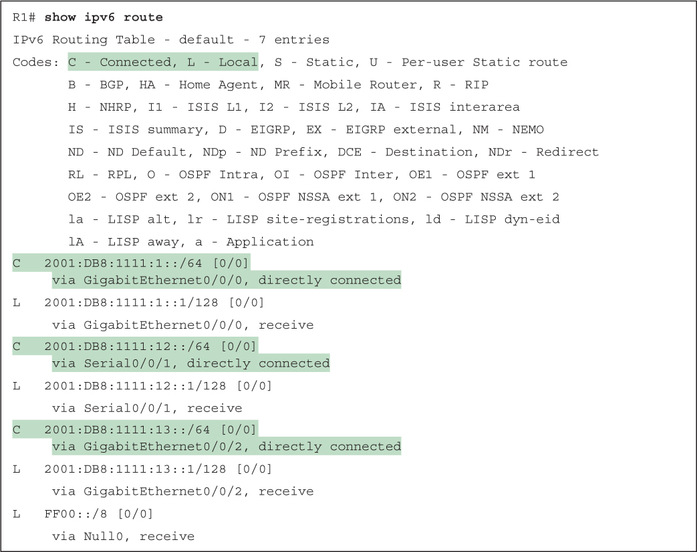](vol1_ch29.md#f0727-01a)

[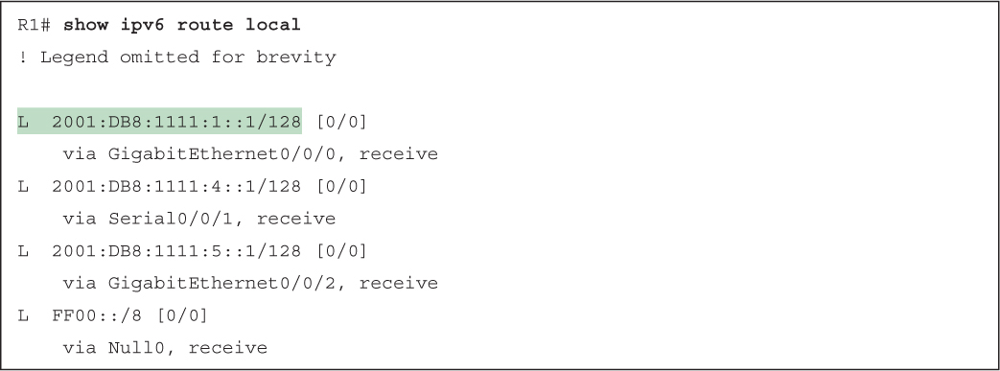](vol1_ch29.md#f0728-01a)

[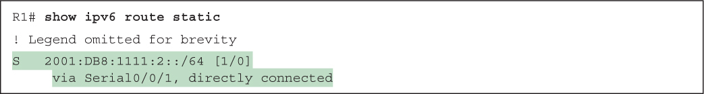](vol1_ch29.md#f0730-01a)

[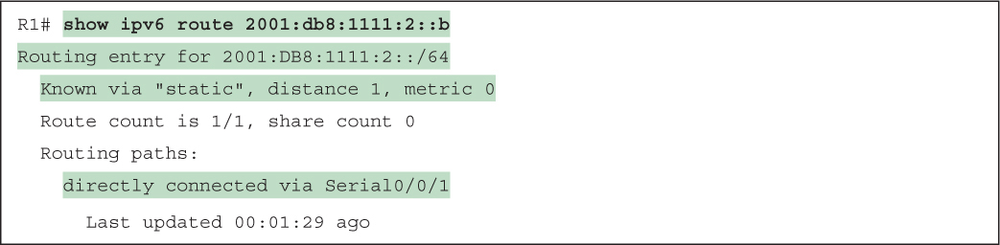](vol1_ch29.md#f0730-02a)

[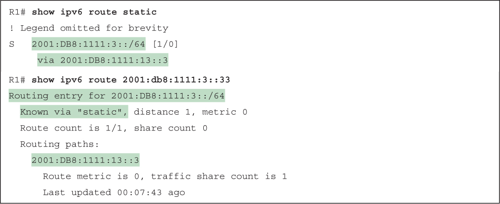](vol1_ch29.md#f0731-02a)

[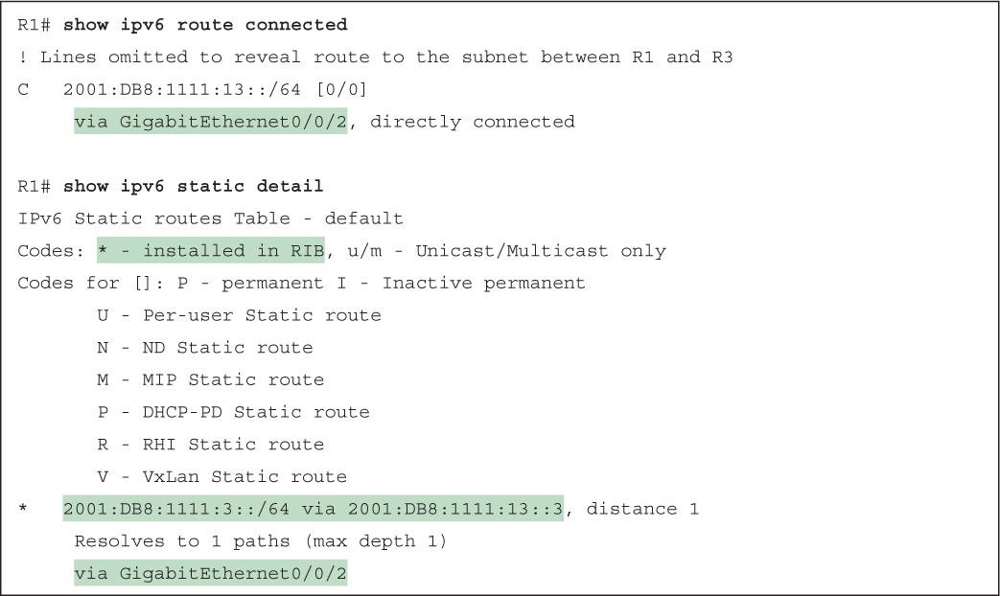](vol1_ch29.md#f0732-01a)

[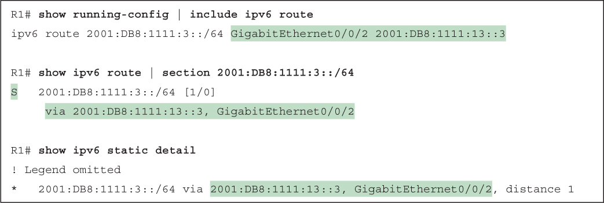](vol1_ch29.md#f0733-01a)

[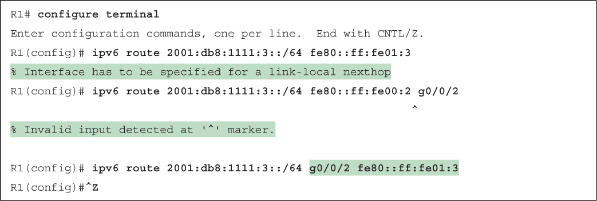](vol1_ch29.md#f0734-01a)

[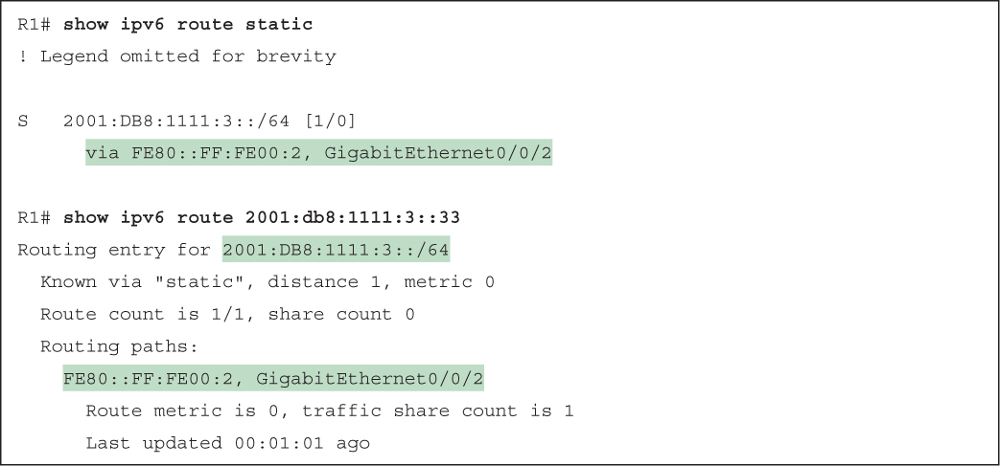](vol1_ch29.md#f0734-02a)

[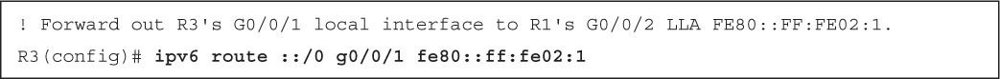](vol1_ch29.md#f0736-01a)

[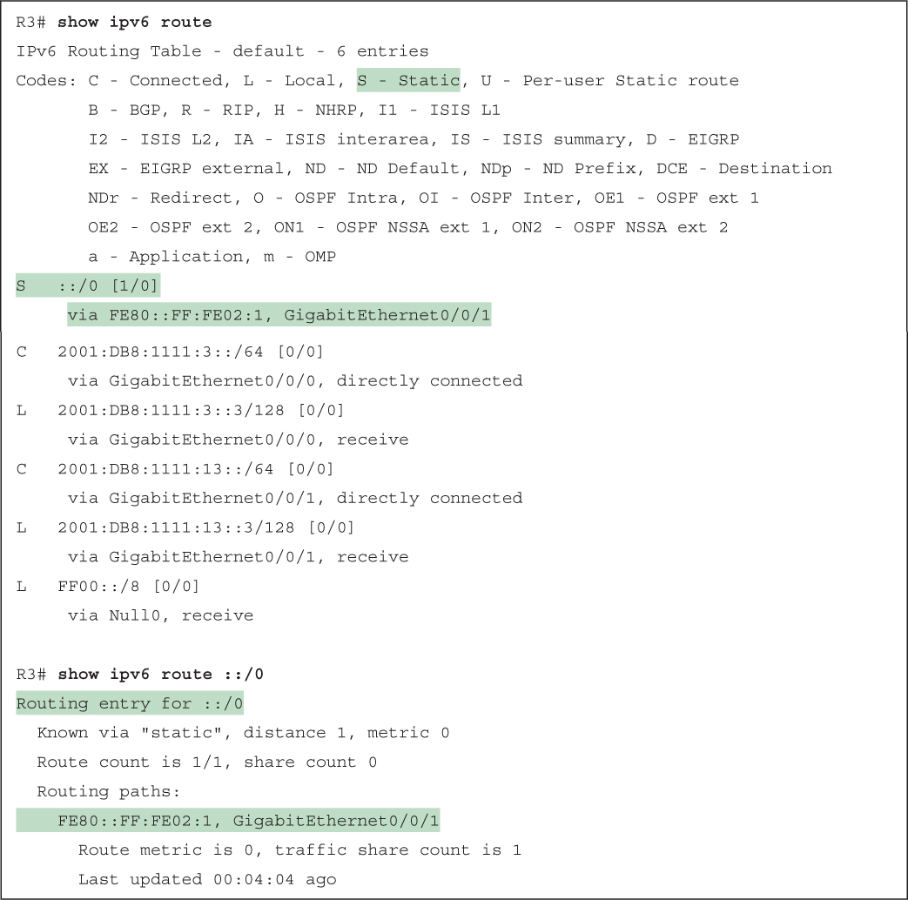](vol1_ch29.md#f0737-01a)

[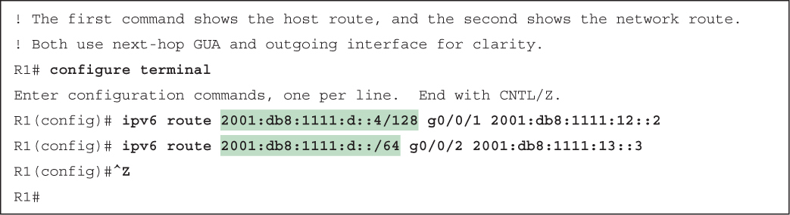](vol1_ch29.md#f0738-01a)

[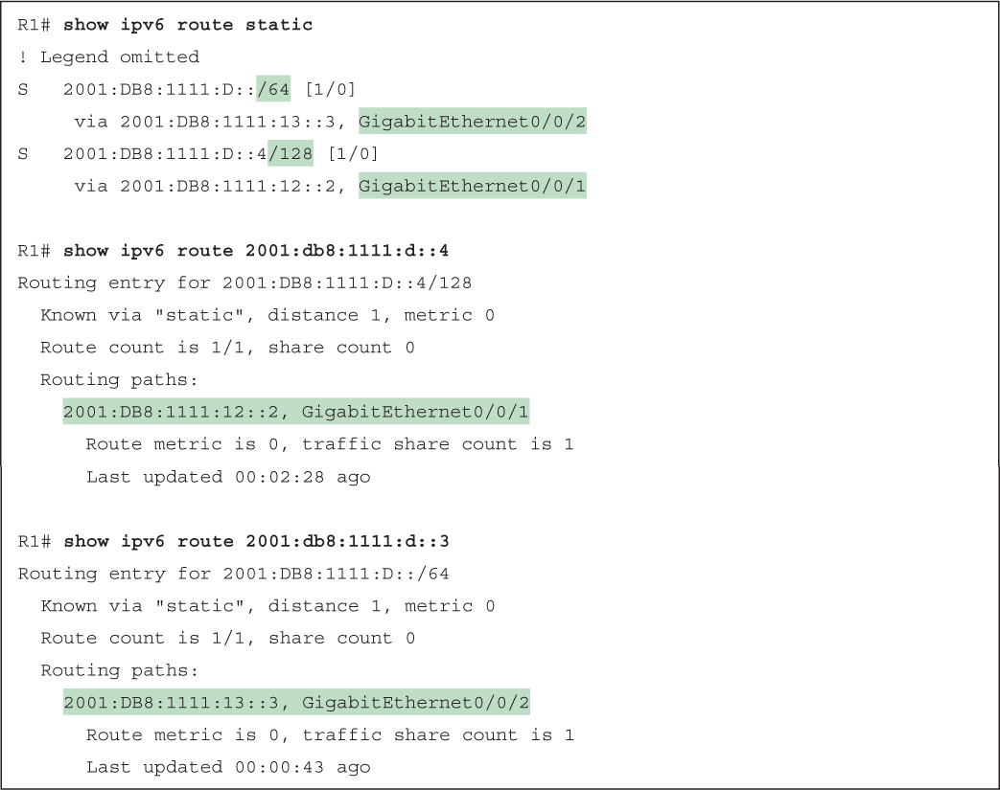](vol1_ch29.md#f0738-02a)

[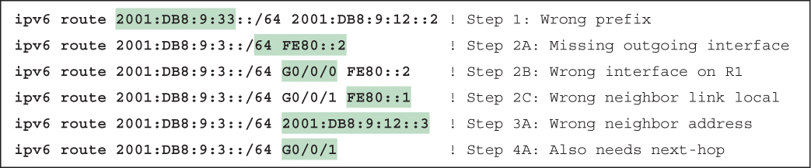](vol1_ch29.md#f0742-01a)