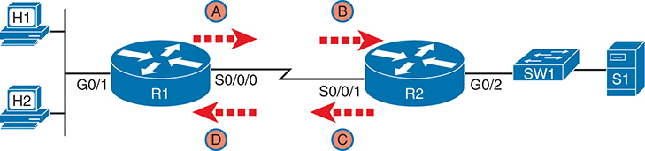
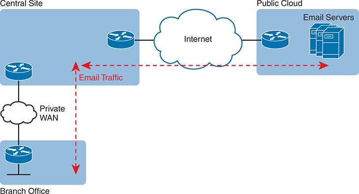

# Appendix D


## Topics from Previous Editions

Cisco changes the exams, renaming the exams on occasion, and changing the exam numbers every time it changes the exam with a new blueprint, even with a few name changes over the years. As a result, the current CCNA 200-301 exam, based on the version 1.1 blueprint, serves as the ninth separate version of CCNA in its 25-plus year history.

We base the books' contents on Cisco's exam topics; that is, the book attempts to cover the topics Cisco lists as exam topics. However, the book authoring process does create some challenges, particularly with the balance of what to include in the books and what to leave out.

For instance, when comparing a new exam to the old, I found Cisco had removed some topics--and I might want to keep the content in the book. There are a few reasons why. Sometimes I just expect that some readers will still want to read about that technology. Also, more than a few schools use these books as textbooks, and keeping some of the older-but-still-relevant topics can be a help. And keeping the old material available on each book's companion website takes only a little extra work, so we do just that.

Some of the older topics that I choose to keep on the companion website are small, so I collect them into this appendix. Other topics happen to have been an entire chapter in a previous edition of the books, so we include those topics each as a separate appendix. Regardless, the material exists here in this appendix, and in the appendices that follow, for your use if you have a need. But do not feel like you have to read this appendix for the current exam.

The topics in this appendix are as follows:

* Troubleshooting with IPv4 ACLs
* Implementing HSRP
* NTP Addendum
* Metro Ethernet Virtual Circuits
* MPLS VPNs and OSPF
* A Scenario: Branch Offices and the Public Cloud

The topics in this chapter follow.

Note

The content under the heading "[Troubleshooting with IPv4 ACLs](vol2_appd.md#appdlev1sec1)" was most recently published for the 200-105 Exam in 2016, in [Chapter 17](vol2_ch17.md#ch17) of the *Cisco CCNA ICND2 200-105 Official Cert Guide*.

### Troubleshooting with IPv4 ACLs

The use of IPv4 ACLs makes troubleshooting IPv4 routing more difficult. Any data plane troubleshooting process can include a catchall phrase to include checking for ACLs. A network can have all hosts working, DHCP settings correct, all LANs working, all router interfaces working, and all routers having learned all routes to all subnets--and ACLs can still filter packets. Although ACLs provide that important service of filtering some packets, ACLs can make the troubleshooting process that much more difficult.

This third of the three major sections of this chapter focuses on troubleshooting in the presence of IPv4 ACLs. It breaks the discussion into two parts. The first part gives advice about common problems you might see on the exam, and how to find those with **show** commands and some analysis. The second part then looks at how ACLs impact the **ping** command.

#### Analyzing ACL Behavior in a Network

ACLs cause some of the biggest challenges when troubleshooting problems in real networking jobs. The packets created by commands like **ping** and **traceroute** do not exactly match the fields in packets created by end users. The ACLs sometimes filter the **ping** and **traceroute** traffic, making the network engineer think some other kind of problems exists when no problems exist at all. Or the problem with the end-user traffic really is caused by the ACL, but the ping and traceroute traffic works fine, because the ACL matches the end-user traffic with a **deny** action but matches the ping and traceroute traffic with a **permit** action.

As a result, much of ACL troubleshooting requires thinking about ACL configuration versus the packets that flow in a network, rather than using a couple of IOS commands that identify the root cause of the problem. The **show** commands that help are those that give you the configuration of the ACL, and on what interfaces the ACL is enabled. You can also see statistics about which ACL statements have been matched. And using pings and traceroutes can help--as long as you remember that ACLs may apply different actions to those packets versus the end-user traffic.

The following phrases the ACL troubleshooting steps into a list for easier study. The list also expands on the idea of analyzing each ACL in Step 3. None of the ideas in the list are new compared to this chapter and the previous chapter, but it acts more as a summary of the common issues:

Step 1. Determine on which interfaces ACLs are enabled, and in which direction (**show running-config, show ip interfaces**).

Step 2. Find the configuration of each ACL (**show access-lists, show ip access-lists, show running-config**).

Step 3. Analyze the ACLs to predict which packets should match the ACL, focusing on the following points:

1. **Misordered ACLs:** Look for misordered ACL statements. IOS uses first-match logic when searching an ACL.
2. **Reversed source/destination addresses:** Analyze the router interface, the direction in which the ACL is enabled, compared to the location of the IP address ranges matched by the ACL statements. Make sure the source IP address field could match packets with that source IP address, rather than the destination, and vice versa for the destination IP address field.
3. **Reversed source/destination ports:** For extended ACLs that reference UDP or TCP port numbers, continue to analyze the location and direction of the ACL versus the hosts, focusing on which host acts as the server using a well-known port. Ensure that the ACL statement matches the correct source or destination port depending on whether the server sent or will receive the packet.
4. **Syntax:** Remember that extended ACL commands must use the **tcp** and **udp** keywords if the command needs to check the port numbers.
5. **Syntax:** Note that ICMP packets do not use UDP or TCP; ICMP is considered to be another protocol matchable with the **icmp** keyword (instead of **tcp** or **udp**).
6. **Explicit deny any:** Instead of using the implicit **deny any** at the end of each ACL, use an explicit configuration command to deny all traffic at the end of the ACL so that the **show** command counters increment when that action is taken.
7. **Dangerous inbound ACLs:** Watch for inbound ACLs, especially those with deny all logic at the end of the ACL. These ACLs may discard incoming overhead protocols, like routing protocol messages.
8. **Standard ACL location:** Standard ACLs enabled close to the source of matched addresses can discard the packets as intended, but also discard packets that should be allowed through. Always pay close attention to the requirements of the ACL in these cases.

The first two steps are important for Simlet questions in case you are not allowed to look at the configuration; you can use other **show** commands to determine all the relevant ACL configuration. The next few pages show some of the related commands and how they can uncover some of the issues described in the just-completed ACL troubleshooting checklist.

##### ACL Troubleshooting Commands

If you suspect ACLs are causing a problem, the first problem-isolation step is to find the location and direction of the ACLs. The fastest way to do this is to look at the output of the **show running-config** command and to look for **ip access-group** commands under each interface. However, in some cases, enable mode access may not be allowed, and **show** commands are required. Instead, use the **show ip interfaces** command to find which ACLs are enabled on which interfaces, as shown in [Example D-1](vol2_appd.md#exad_1).

**Example D-1** *Sample* **show ip interface** *Command*

[Click here to view code image](vol2_appd_images.md#fappd4-01)

```
R1> show ip interface s0/0/1
Serial0/0/1 is up, line protocol is up
 Internet address is 10.1.2.1/24
 Broadcast address is 255.255.255.255
 Address determined by setup command
 MTU is 1500 bytes
 Helper address is not set
 Directed broadcast forwarding is disabled
 Multicast reserved groups joined: 224.0.0.9
 Outgoing access list is not set
 Inbound access list is 102
! roughly 26 more lines omitted for brevity
```

Note that the command output lists whether an ACL is enabled, in both directions, and which ACL it is. The example shows an abbreviated version of the **show ip interface S0/0/1** command, which lists messages for just this one interface. The **show ip interface** command would list the same messages for every interface in the router.

Step 2 of the ACL troubleshooting checklist then says that the contents of the ACL must be found. Again, the quickest way to look at the ACL is to use the **show running-config** command. If it's not available, the **show access-lists** and **show ip access-lists** commands list the same details shown in the configuration. These commands also list a useful counter that lists the number of packets that have matched each line in the ACL. [Example D-2](vol2_appd.md#exad_2) shows an example.

**Example D-2** **show ip access-lists** *Command Example*

[Click here to view code image](vol2_appd_images.md#fappd4-02)

```
R1# show ip access-lists
Extended IP access list 102
 10 permit ip 10.1.2.0 0.0.0.255 10.1.4.0 0.0.1.255 (15 matches)
```

The counter can be very useful for troubleshooting. If you can generate traffic that you think should match a particular line in an ACL, then you should see the matches increment on that counter. If you keep generating traffic that should match, but that line's counter never goes up, then those packets do not match that line in that ACL. Those packets could be matching an earlier line in the same ACL, or might not even be reaching that router (for any reason).

After the locations, directions, and configuration details of the various ACLs have been discovered in Steps 1 and 2, the hard part begins--analyzing what the ACL really does. For example, one of the most common tasks you will do is to look at the address fields and decide the range of addresses matched by that field. Remember, for an ACL that sits in a router configuration, you can easily find the address range. The low end of the range is the address (the first number), and the high end of the range is the sum of the address and wildcard mask. For instance, with ACL 102 in [Example D-2](vol2_appd.md#exad_2), which is obviously configured in some router, the ranges are as follows:

**Source 10.1.2.0, wildcard 0.0.0.255:** Matches from 10.1.2.0 through 10.1.2.255

**Destination 10.1.4.0, wildcard 0.0.1.255:** Matches from 10.1.4.0 through 10.1.5.255

The next few pages work through some analysis of a few of the items from Step 3 in the troubleshooting checklist.

##### Example Issue: Reversed Source/Destination IP Addresses

IOS cannot recognize a case in which you attempt to match the wrong addresses in the source or destination address field. So, be ready to analyze the enabled ACLs and their direction versus the location of different subnets in the network. Then ask yourself about the packets that drive that ACL: what could the source and destination addresses of those packets be? And does the ACL match the correct address ranges, or not?

For example, consider [Figure D-1](vol2_appd.md#appdfig01), a figure that will be used in several troubleshooting examples in this chapter. The requirements for the next ACL follow the figure.


The network configuration includes four routers labeled R1 to R4, and a host. Each router has an I P address: R1 with 1.1.1.1, R2 with 2.2.2.2, R3 with 3.3.3.3, and R4 with 4.4.4.4. A message Confirms my Route to 5.5.5.5 from R1 and R2 with TTL equals 2 is sent towards the host at 5.5.5.5 but gets halted. This event is marked with an 'X'. Both R2 and R3 confirm their routes to 1.1.1.1, as indicated by a text. The final destination is the host, which has an IP address of 5.5.5.5.

**Figure D-1** *Example Network Used in IPv4 ACL Troubleshooting Examples*

For this next ACL, the requirements ask that you allow and prevent various flows, as follows:

* Allow hosts in subnet 10.3.3.0/25 and subnet 10.1.1.0/24 to communicate
* Prevent hosts in subnet 10.4.4.0/23 and subnet 10.1.1.0/24 from communicating
* Allow all other communications between hosts in network 10.0.0.0
* Prevent all other communications

[Example D-3](vol2_appd.md#exad_3) shows the ACL used in this case on R2. At first glance, it meets all those requirements straight down the list.

**Example D-3** *Troubleshooting Example 2 per Step 3B: Source and Destination Mismatch*

[Click here to view code image](vol2_appd_images.md#fappd5-01)

```
R2# show ip access-lists
Standard IP access list Step3B
 10 permit 10.3.3.0 0.0.0.127
 20 deny 10.4.4.0 0.0.1.255
 30 permit 10.0.0.0 0.255.255.255 (12 matches)
R2#
R2# show ip interface G0/1 | include Inbound
 Inbound access list is Step3B
```

The problem in this case is that the ACL has been enabled on R2's G0/1 interface, inbound. Per the figure, packets coming from a source address in subnets 10.3.3.0/25 and 10.4.4.0/23 should be forwarded out R2's G0/1 interface, rather than coming in that interface. So, do not let the matching logic in the ACL that perfectly mirrors the requirements fool you; make sure and check the location of the ACL, direction, and the location of the IP addresses.

Note that Step 3C suggests a similar issue regarding matching well-known ports with TCP and UDP. The earlier section in this chapter titled "[Matching TCP and UDP Port Numbers](vol2_ch07.md#ch07lev2sec4)" has already discussed those ideas in plenty of detail. Just make sure to check where the server sits versus the location and direction of the ACL.

##### Steps 3D and 3E: Common Syntax Mistakes

Steps 3D and 3E describe a couple of common syntax mistakes. First, to match a TCP port in an ACL statement, you must use a **tcp** protocol keyword instead of **ip** or any other value. Otherwise, IOS rejects the command as having incorrect syntax. Same issue with trying to match UDP ports: a **udp** protocol keyword is required.

To match ICMP, IOS includes an **icmp** protocol keyword to use instead of **tcp** or **udp**. In fact, the main conceptual mistake is to think of ICMP as an application protocol that uses either UDP or TCP; it uses neither. To match all ICMP messages, for instance, use the **permit icmp any any** command in an extended named ACL.

##### Example Issue: Inbound ACL Filters Routing Protocol Packets

A router bypasses outbound ACL logic for packets the router itself generates. That might sound like common sense, but it is important to stop and think about that fact in context. A router can have an outgoing ACL, and that ACL can and will discard packets that the router receives in one interface and then tries to forward out some other interface. But if the router creates the packet, for instance, for a routing protocol message, the router bypasses the outbound ACL logic for that packet.

However, a router does not bypass inbound ACL logic. If an ACL has an inbound ACL enabled, and a packet arrives in that interface, the router checks the ACL. Any and all IPv4 packets are considered by the ACL--including important overhead packets like routing protocol updates.

For example, consider a seemingly good ACL on a router, like the Step3G ACL in [Example D-4](vol2_appd.md#exad_4). That ACL lists a couple of **permit** commands, and has an implicit deny any at the end of the list. At first, it looks like any other reasonable ACL.

**Example D-4** *Troubleshooting Example 2 per Step 3G: Filtering RIP by Accident*

[Click here to view code image](vol2_appd_images.md#fappd6-01)

```
R1# show ip access-lists
Standard IP access list Step3G
 10 permit host 10.4.4.1
 20 permit 10.3.3.0 0.0.0.127 (12 matches)
! using the implicit deny to match everything else
R1#
! On router R1:
R1# show ip interface G0/2 | include Inbound
 Inbound access list is Step3G
```

Now look at the location and direction (inbound on R1, on R1's G0/2) and consider that location versus the topology in [Figure D-1](vol2_appd.md#appdfig01) for a moment. None of those **permit** statements match the RIP updates sent by R2, sent out R2's G0/1 interface toward R1. RIP messages use UDP (well-known port 520), and R2's G0/1 interface is 10.2.2.2 per the figure. R1 would match incoming RIP messages with the implicit deny all at the end of the list. The symptoms in this case, assuming only that one ACL exists, would be that R1 would not learn routes from R2, but R2 could still learn RIP routes from R1.

Of the three routing protocols discussed in the ICND1 and ICND2 books, RIPv2 uses UDP as a transport, while OSPF and EIGRP do not even use a transport protocol. As a result, to match RIPv2 packets with an ACL, you need the **udp** keyword and you need to match well-known port 520. OSPF and EIGRP can be matched with special keywords as noted in [Table D-1](vol2_appd.md#appdtab01). The table also list the addresses used by each protocol.

**Table D-1** Key Fields for Matching Routing Protocol Messages

| Protocol | Source IP Address | Destination IP Addresses | ACL Protocol Keyword |
| --- | --- | --- | --- |
| RIPv2 | Source interface | 224.0.0.9 | **udp** (port 520) |
| OSPF | Source interface | 224.0.0.5, 224.0.0.6 | **ospf** |
| EIGRP | Source interface | 224.0.0.10 | **eigrp** |

[Example D-5](vol2_appd.md#exad_5) shows a sample ACL with three lines, one to match each routing protocol, just to show the syntax. Note that in this case, the ACL matches the address fields with the **any** keyword. You could include lines like these in any inbound ACL to ensure that routing protocol packets would be permitted.

**Example D-5** *Example ACL That Matches All RIPv2, OSPF, and EIGRP with a Permit*

[Click here to view code image](vol2_appd_images.md#fappd7-01)

```
R1# show ip access-lists
ip access-list extended RoutingProtocolExample
 10 permit udp any any eq 520
 20 permit ospf any any
 30 permit eigrp any any
 remark a complete ACL would also need more statements here
R1#
```

#### ACL Interactions with Router-Generated Packets

Routers bypass outbound ACL logic for packets generated by that same router. This logic helps avoid cases in which a router discards its own overhead traffic. This logic applies to packets that a router creates for overhead processes like routing protocols, as well as for commands, like **ping** and **traceroute**. This section adds a few perspectives about how ACLs impact troubleshooting, and how this exception to outbound ACL logic applies, particularly commands used from the router CLI.

##### Local ACLs and a Ping from a Router

For the first scenario, think about a **ping** command issued by a router. The command generates packets, and the router sends those packets (holding the ICMP echo request messages) out one of the router interfaces, and typically some ICMP echo reply messages are received back. As it turns out, not all ACLs will attempt to filter those packets.

As a backdrop to discuss what happens, [Figure D-2](vol2_appd.md#appdfig02) illustrates a simple network topology with two routers connected to a serial link. Note that in this figure four IP ACLs exist, named A, B, C, and D, as noted by the thick arrows in the drawing. That is, ACL A is an outbound ACL on R1's S0/0/0, ACL B is an inbound ACL on R2's S0/0/1, and so on.




The network routing scenario involves four routers (R1 to R4) and a host, each assigned with specific I P addresses (from 1.1.1.1 to 5.5.5.5). The process begins at R1 and R2 with a T T L of 3, intending to use a working route to reach the host at 5.5.5.5 but encounters an issue leading to the query "Problem with Route to 5.5.5 question mark" at R3. A similar issue is depicted in the reverse direction where there's an attempt to use a working route from the host at address 5.5.5.5 back to R1 at address 1.1.1.1 but is met with "T T L Exceeded" and another query "Problem with Route to 1.1.1.1 question mark".

**Figure D-2** *Sample Network with IP ACLs in Four Locations*

As an example, consider a **ping** command issued from R1's CLI (after a user connects to R1's CLI using SSH). The **ping** command pings server S1's IP address. The IPv4 packets with the ICMP messages flow from R1 to S1 and back again. Which of those four ACLs could possibly filter the ICMP Echo Request toward S1, and the ICMP Echo Reply back toward R1?

Routers bypass their own outbound ACLs for packets generated by the router, as shown in [Figure D-3](vol2_appd.md#appdfig03). Even though ACL A exists as an outgoing ACL on Router R1, R1 bypasses its own outgoing ACL logic of ACL A for the ICMP Echo Requests generated by R1.


The network routing scenario involves an enterprise router (R1) connected to two network devices (B01 and B02) through ethernet W A N. The router R1 is configured to automatically obtain an IPv6 address using the command "ipv6 address autoconfig default". The router then sends an N D P Router Solicitation (R S) message to the Internet Service Provider (ISP1). In response, ISP1 with subnet 2001:DB8:1:12::1/64, sends an N D P Router Advertisement (RA) containing the prefix "2001:DB8:1:12::/64".

**Figure D-3** *R1 Ignores Outgoing ACL for Packets Created by Its Own **ping** Command*

##### Router Self-Ping of a Serial Interface IPv4 Address

The previous example uses a router's **ping** command when pinging a host. However, network engineers often need to ping router IP addresses, including using a self-ping. The term *self-ping* refers to a ping of a device's own IPv4 address. And for point-to-point serial links, a self-ping actually sends packets over the serial link, which causes some interesting effects with ACLs.

When a user issues a self-ping for that local router's serial IP address, the router actually sends the ICMP echo request out the link to the other router. The neighboring router then receives the packet and routes the packet with the ICMP echo request back to the original router. [Figure D-4](vol2_appd.md#appdfig04) shows an example of a self-ping (**ping 172.16.4.1**) of Router R1's own IP address on a point-to-point serial link, with the ICMP echo request out the link to Router R2. At Step 2, R2 treats it like any other packet not destined for one of R2's own IPv4 addresses: R2 routes the packet. Where? Right back to Router R1, as shown in the figure.


The network configuration includes four routers labeled R1 to R4, and a host. Each router has an I P address: R1 with 1.1.1.1, R2 with 2.2.2.2, R3 with 3.3.3.3, and R4 with 4.4.4.4. A message Confirms my Route to 5.5.5.5 from R1 with TTL equals 1 is sent towards the host at 5.5.5.5 but gets halted. This event is marked with an 'X'. R2 confirm its route to 1.1.1.1, as indicated by a text. The final destination is the host, which has an IP address of 5.5.5.5.

**Figure D-4** *The First Steps in a Self-Ping on R1, for R1's S0/0/0 IP Address*

Now think about those four ACLs in the earlier figures compared to [Figure D-4](vol2_appd.md#appdfig04). R1 generates the ICMP echo request, so R1 bypasses outbound ACL A. ACLs B, C, and D could filter the packet. Note that the packet sent by R2 back to R1 is not generated by R2 in this case; R2 is just routing R1's original packet back to R1.

A self-ping of a serial interface actually tests many parts of a point-to-point serial link, as follows:

* The link must work at Layers 1, 2, and 3. Specifically, both routers must have a working (up/up) serial interface, with correct IPv4 addresses configured.
* ACLs B, C, and D must permit the ICMP echo request and reply packets.

So, when troubleshooting, if you choose to use self-pings and they fail, but the serial interfaces are in an up/up state, do not forget to check to see whether the ACLs have filtered the Internet Control Management Protocol (ICMP) traffic.

##### Router Self-Ping of an Ethernet Interface IPv4 Address

A self-ping of a router's own Ethernet interface IP address works a little like a self-ping of a router's serial IP address, but with a couple of twists:

* Like with serial interfaces, the local router interface must be working (in an up/up state); otherwise, the ping fails.
* Unlike serial interfaces, the router does not forward the ICMP messages physically out the interface, so security features on neighboring switches (like port security) or routers (like ACLs) cannot possibly filter the messages used by the **ping** command.
* Like serial interfaces, an incoming IP ACL on the local router does process the router self-ping of an Ethernet-based IP address.

[Figure D-5](vol2_appd.md#appdfig05) walks through an example. In this case, R2 issues a **ping 172.16.2.2** command to ping its own G0/2 IP address. Just like with a self-ping on serial links, R2 creates the ICMP echo request. However, R2 basically processes the ping down its own TCP/IP stack and back up again, with the ICMP echo never leaving the router's Ethernet interface. R2 does check the Ethernet interface status, showing a failure if the interface is not up/up. R2 does not apply outbound ACL logic to the packet, because R2 created the packet, but R2 will apply inbound ACL logic to the packet, as if the packet had been physically received on the interface.


The network configuration includes four routers labeled R1 to R4, and a host. Each router has an I P address: R1 with 1.1.1.1, R2 with 2.2.2.2, R3 with 3.3.3.3, and R4 with 4.4.4.4. A message Confirms my Route to 5.5.5.5 from R1 with TTL equals 1 is sent towards the host at 5.5.5.5 but gets halted. This event is marked with an 'X'. R2 confirm its route to 1.1.1.1, as indicated by a text. The final destination is the host, which has an IP address of 5.5.5.5.

**Figure D-5** *Self-Ping of a Router's Ethernet Address*

Note

The content under the heading "[Implementing HSRP](vol2_appd.md#appdlev1sec2)" was most recently published for the 200-105 Exam in 2016, in [Chapter 20](vol2_ch20.md#ch20) of the *Cisco CCNA ICND2 200-105 Official Cert Guide*.

### Implementing HSRP

The goal of this section is to show enough of the operation of each tool to reinforce your understanding of configuring the basic functions of HSRP.

#### Configuring and Verifying Basic HSRP

HSRP configuration requires only one command on the two (or more) routers that want to share default router responsibilities with HSRP: the **standby** *group* **ip** *virtual-ip* interface subcommand. The first value defines the HSRP group number, which must match on both routers. The group number lets one router support multiple HSRP groups at a time on the same interface, and it allows the routers to identify each other based on the group. The command also configures the virtual IP address shared by the routers in the same group; the virtual IP address is the address the hosts in the VLAN use as their default gateway.

[Example D-6](vol2_appd.md#exad_6) shows a configuration example where both routers use group 1, with virtual IP address 10.1.1.1, with the **standby 1 ip 10.1.1.1** interface subcommand.

**Example D-6** *HSRP Configuration on R1 and R2, Sharing IP Address 10.1.1.1*

[Click here to view code image](vol2_appd_images.md#fappd10-01)

```
R1# show running-config
! Lines omitted for brevity
interface GigabitEthernet0/0
 ip address 10.1.1.9 255.255.255.0
 standby version 2
 standby 1 ip 10.1.1.1
 standby 1 priority 110
 standby 1 name HSRP-group-for-book
```

```
! The following configuration, on R2, is identical except for the HSRP priority and
! the interface IP address
R2# show running-config
! Lines omitted for brevity
interface GigabitEthernet0/0
 ip address 10.1.1.129 255.255.255.0
 standby version 2
 standby 1 ip 10.1.1.1
 standby 1 name HSRP-group-for-book
```

The configuration shows other optional parameters, as well. For instance, R1 has a priority of 110 in this group, and R2 defaults to 100. With HSRP, if the two routers are brought up at the same time, the router with the higher priority wins the election to become the active router. The configuration also shows a name that can be assigned to the group (when using **show** commands) and a choice to use HSRP Version 2. (This chapter provides more details on these settings in the coming pages.)

Once configured, the two routers negotiate the HSRP settings and choose which router will currently be active and which will be standby. With the configuration as shown, R1 will win the election and become active because of its higher (better) priority. Both routers reach the same conclusion, as confirmed with the output of the **show standby brief** command on both R1 and R2 in [Example D-7](vol2_appd.md#exad_7).

**Example D-7** *HSRP Status on R1 and R2 with* **show standby brief**

[Click here to view code image](vol2_appd_images.md#fappd11-01)

```
! First, the group status as seen from R1
R1# show standby brief
                     P indicates configured to preempt.
                     |
Interface   Grp Pri  P State   Active          Standby       Virtual IP
Gi0/0       1   110    Active  local           10.1.1.129    10.1.1.1
```

```
! The output here on R2 shows that R2 agrees with R1.
R2# show standby brief
                     P indicates configured to preempt.
                     |
Interface   Grp  Pri P State   Active          Standby       Virtual IP
Gi0/0       1    100   Standby 10.1.1.9        local         10.1.1.1
```

The **show standby brief** command packs a lot of detail in the output, so take your time and work through the highlighted fields. First, look at the Grp column for each command. This lists the HSRP group number, so when looking at output from multiple routers, you need to look at the lines with the same group number to make sure the data relates to that one HSRP group. In this case, both routers have only one group number (1), so it is easy to find the information.

Each line of output lists the local router's view of the HSRP status for that group. In particular, based on the headings, the **show standby brief** command identifies the following:

**Interface:** The local router's interface on which the HSRP group is configured

**Grp:** The HSRP group number

**Pri:** The local router's HSRP priority

**State:** The local router's current HSRP state

**Active:** The interface IP address of the currently active HSRP router (or "local" if the local router is HSRP active)

**Standby:** The interface IP address of the currently standby HSRP router (or "local" if the local router is HSRP standby)

**Virtual IP:** The virtual IP address defined by this router for this group

For instance, following the highlighted text in [Example D-7](vol2_appd.md#exad_7), R2 believes that its own current state is standby, that the router with interface address 10.1.1.9 is active (which happens to be Router R1), with a confirmation that the "local" router (R2, on which this command was issued) is the standby router.

In comparison, the **show standby** command (without the **brief** keyword) lists a more detailed description of the current state, while repeating many of the facts from the **show standby brief** command. [Example D-8](vol2_appd.md#exad_8) shows an example of the new information with the **show standby** command, listing several counters and timers about the HSRP protocol itself, plus the virtual MAC address 0000.0c9f.f001.

**Example D-8** *HSRP Status on R1 and R2 with* **show standby**

[Click here to view code image](vol2_appd_images.md#fappd12-01)

```
R1# show standby
GigabitEthernet0/0 - Group 1 (version 2)
  State is Active
    6 state changes, last state change 00:12:53
  Virtual IP address is 10.1.1.1
  Active virtual MAC address is 0000.0c9f.f001
    Local virtual MAC address is 0000.0c9f.f001 (v2 default)
  Hello time 3 sec, hold time 10 sec
    Next hello sent in 1.696 secs
  Preemption disabled
  Active router is local
  Standby router is 10.1.1.129, priority 100 (expires in 8.096 sec)
  Priority 110 (configured 110)
  Group name is "HSRP-group-for-book" (cfgd)
```

```
! The output here on R2 shows that R2 agrees with R1.
R2# show standby
GigabitEthernet0/0 - Group 1 (version 2)
  State is Standby

   4 state changes, last state change 00:12:05
 Virtual IP address is 10.1.1.1
 Active virtual MAC address is 0000.0c9f.f001
   Local virtual MAC address is 0000.0c9f.f001 (v2 default)
 Hello time 3 sec, hold time 10 sec
   Next hello sent in 0.352 secs
 Preemption disabled
 Active router is 10.1.1.9, priority 110 (expires in 9.136 sec)
   MAC address is 0200.0101.0101
 Standby router is local
 Priority 100 (default 100)
 Group name is "HSRP-group-for-book" (cfgd)
```

#### HSRP Active Role with Priority and Preemption

HSRP defines some rules to determine which router acts as the active HSRP router and which acts as standby. Those rules also define details about when a standby router should take over as active. The following list summarizes the rules; following the list, this section takes a closer look at those rules and the related configuration settings.

First, the HSRP rules. When a router (call it the local router) has an HSRP-enabled interface, and that interface comes up, the router sends HSRP messages to negotiate whether it should be active or standby. When it sends those messages, if it…

Step 1. …discovers no other HSRP routers in the subnet, the local router becomes the active router.

Step 2. …discovers an existing HSRP router, and both are currently negotiating to decide which should become the HSRP active router, the routers negotiate, with the router with the highest HSRP priority becoming the HSRP active router.

Step 3. …discovers an existing HSRP router in the subnet, and that router is already acting as the active router:

1. If configured with no preemption (the default; **no standby preempt**), the local router becomes a standby router, even if it has a better (higher) priority.
2. If configured with preemption (**standby preempt**), the local router checks its priority versus the active router; if the local router priority is better (higher), the local router takes over (preempts) the existing active router to become the new active HSRP router.

Steps 1 and 2 in the list are pretty obvious, but Steps 3A and 3B could use a little closer look. For instance, the examples so far in this chapter show R1's G0/0 with a priority of 110 versus R2's G0/0 with priority 100. The **show** commands in [Example D-7](vol2_appd.md#exad_7) show that R1 is currently the HSRP active router. That same example also lists a line for both R1 and R2 that confirms "preemption disabled," which is the default.

To show a test of Step 3A logic, [Example D-9](vol2_appd.md#exad_9) shows a process by which R1's G0/0 interface is disabled and then enabled again, but after giving Router R2 long enough to take over and become active. That is, R1 comes up but R2 is already HSRP active for group 1. The bottom of the example lists output from the **show standby brief** command from R2, confirming that R2 becomes HSRP active and R1 becomes standby (10.1.1.9), proving that R1 does not preempt R2 in this case.

**Example D-9** *Showing How No Preemption Keeps R1 as Standby After R1 Recovers*

[Click here to view code image](vol2_appd_images.md#fappd14-01)

```
! First, R1's G0/0 is disabled and enabled; the ending log message shows a standby
! state.
R1# configure terminal
Enter configuration commands, one per line. End with CNTL/Z.
R1(config)# interface gigabitEthernet 0/0
R1(config-if)# shutdown
*Mar 8 18:10:29.242: %HSRP-5-STATECHANGE: GigabitEthernet0/0 Grp 1 state Active ->
Init
*Mar 8 18:10:31.205: %LINK-5-CHANGED: Interface GigabitEthernet0/0, changed state to
administratively down
*Mar 8 18:10:32.205: %LINEPROTO-5-UPDOWN: Line protocol on Interface GigabitEther
net0/0, changed state to down
R1(config-if)#
R1(config-if)# no shutdown
R1(config-if)# ^Z
R1#
*Mar 8 18:11:08.355: %HSRP-5-STATECHANGE: GigabitEthernet0/0 Grp 1 state Speak ->
Standby
```

```
! Now from R2, note R2 is active, and 10.1.1.9 (R1) is standby
R2# show standby brief
                     P indicates configured to preempt.
                     |
Interface   Grp  Pri P State Active            Standby          Virtual IP
Gi0/1       1    100   Active local            10.1.1.9         10.1.1.1
```

If R1 had been configured with preemption for that previous scenario, R1 would have taken over from R2 when R1's interface came back up. [Example D-10](vol2_appd.md#exad_10) shows exactly that. Before the output in [Example D-10](vol2_appd.md#exad_10) was gathered, the network had been put back to the same beginning state as at the beginning of [Example D-9](vol2_appd.md#exad_9), with R1 active and R2 as standby. Within [Example D-10](vol2_appd.md#exad_10), R1's interface is shut down, then configured with preemption using the **standby 1 preempt** command, enabling preemption. Then, after enabling the interface again, R1 takes over as HSRP active, as shown at the bottom of the example's **show standby brief** command from R2. That output now shows the local router's state as Standby, and the active as 10.1.1.9 (R1).

**Example D-10** *Showing How Preemption Causes R1 to Take Over as Active Upon Recovery*

[Click here to view code image](vol2_appd_images.md#fappd15-01)

```
! First, R1's G0/0 is disabled and enabled; the ending log message shows a standby
 ! state.
R1# configure terminal
Enter configuration commands, one per line. End with CNTL/Z.
R1(config)# interface gigabitEthernet 0/0
R1(config-if)# shutdown
*Mar 8 18:10:29.242: %HSRP-5-STATECHANGE: GigabitEthernet0/0 Grp 1 state Active ->
  Init
*Mar 8 18:10:31.205: %LINK-5-CHANGED: Interface GigabitEthernet0/0, changed state to
  administratively down
*Mar 8 18:10:32.205: %LINEPROTO-5-UPDOWN: Line protocol on Interface GigabitEther
  net0/0, changed state to down
R1(config-if)# standby 1 preempt
R1(config-if)# no shutdown
R1(config-if)# ^Z
R1#
*Mar 8 18:19:14.355: %HSRP-5-STATECHANGE: GigabitEthernet0/0 Grp 1 state Listen ->
  Active
```

```
! Now from R2, note it is active, and 10.1.1.9 (R1) is standby

*Mar 8 18:18:55.948: %HSRP-5-STATECHANGE: GigabitEthernet0/0 Grp 1 state Standby ->
  Active
*Mar 8 18:19:14.528: %HSRP-5-STATECHANGE: GigabitEthernet0/0 Grp 1 state Active ->
  Speak
*Mar 8 18:19:26.298: %HSRP-5-STATECHANGE: GigabitEthernet0/0 Grp 1 state Speak ->
  Standby

R2# show standby brief
                     P indicates configured to preempt.
                     |
Interface    Grp Pri P State Active            Standby          Virtual IP
Gi0/0        1   100   Standby 10.1.1.9        local            10.1.1.1
```

Note that it is the preemption setting on the router that is taking over (preempting) that determines if preemption happens. For instance, in this case, R1 came up when R2 was active; R1 was set to preempt; so R1 preempted R2.

#### HSRP Versions

Cisco IOS on routers and Layer 3 switches supports two versions of HSRP: versions 1 and 2. The versions have enough differences, like multicast IP addresses used and message formats, so that routers in the same HSRP group must use the same version. If two routers configured to be in the same HSRP group mistakenly configure to use different versions, they will not understand each other and ignore each other for the purposes of HSRP.

To configure the version, each interface/subinterface uses the **standby version** {**1** | **2**} interface subcommand. Note that the HSRP group number is not included in the command, because it sets the version for all HSRP messages sent out that interface/subinterface.

There are some good reasons to want to use the more recent HSRP version 2 (HSRPv2). For example, HSRPv1 existed before IPv6 became popular. Cisco enhanced HSRP to version 2 in part to make IPv6 support possible. Today, to use HSRP with IPv6 requires HSRPv2.

As another example of a benefit of HSRPv2, HSRP uses a Hello message, similar in concept to routing protocols, so that HSRP group members can realize when the active router is no longer reachable. HSRPv2 allows for shorter Hello timer configuration (as low as a small number of milliseconds), while HSRPv1 typically had a minimum of 1 second. So, HSRPv2 can be configured to react more quickly to failures with a lower Hello timer.

Beyond IPv6 support and shorter Hello timer options, other differences for version 2 versus version 1 include a different virtual MAC address base value and a different multicast IP address used as the destination for all messages. [Table D-2](vol2_appd.md#appdtab02) lists the differences between HSRPv1 and HSRPv2.

**Table D-2** HSRPv1 Versus HSRPv2

| Feature | Version 1 | Version 2 |
| --- | --- | --- |
| IPv6 support | No | Yes |
| Smallest unit for Hello timer | Second | Millisecond |
| Range of group numbers | 0..255 | 0..4095 |
| MAC address used (xx or xxx is the hex group number) | 0000.0C07.ACxx | 0000.0C9F.Fxxx |
| IPv4 multicast address used | 224.0.0.2 | 224.0.0.102 |
| Does protocol use a unique identifier for each router? | No | Yes |

Of the details in the table, make sure to look at the MAC addresses for both versions 1 and 2. Cisco reserves the prefixes of 0000.0C07.AC for HSRPv1 and 0000.0C9F.F for HSRPv2. HSRPv1, with 256 possible HSRP groups per interface, then uses the last two hex digits to identify the HSRP group. For example, an HSRP group 1 using version 1 would use a virtual MAC address that ends in hex 01. Similarly, because HSRPv2 supports 4096 groups per interface, the MAC address reserves three hex digits to identify the group. An HSRP group 1 using version 2 would use a virtual MAC address that ends in hex 001.

Note

The content under the heading "[NTP Addendum](vol2_appd.md#appdlev1sec3)" was most recently published for the 200-301 Exam blueprint 1.0, in the 2019 book *Cisco CCNA 200-301 Official Cert Guide, Volume 2*, [Chapter 9](vol2_ch09.md#ch09), "[Device Management Protocols](vol2_ch09.md#ch09)."

### NTP Addendum

The following two topics go beyond the basic functions of NTP to discuss how to make NTP more available through redundancy features.

#### Redundant NTP Configuration

Instead of using a networking device as the reference clock for the enterprise, you can instead reference better time sources in the Internet or purchase a purpose-built NTP server that has better clocking hardware. For instance, an enterprise could reference NTP servers that use an atomic clock as their reference source, like the NTP primary servers in [Figure D-6](vol2_appd.md#appdfig06), which happen to be run by the US National Institute of Standards and Technology (NIST) (see [tf.nist.gov](http://tf.nist.gov)).


The network configuration includes four routers labeled R1 to R4, and a host. Each router has an I P address: R1 with 1.1.1.1, R2 with 2.2.2.2, R3 with 3.3.3.3, and R4 with 4.4.4.4. A message Confirms my Route to 5.5.5.5 from R1 and R2 with TTL equals 2 is sent towards the host at 5.5.5.5 but gets halted. This event is marked with an 'X'. Both R2 and R3 confirm their routes to 1.1.1.1, as indicated by a text. The final destination is the host, which has an IP address of 5.5.5.5.

**Figure D-6** *Stratum Levels When Using an Internet-based Stratum 1 NTP Server*

Note

While the common terms *NTP server mode* and *NTP client/server mode* are useful, the NTP RFCs (1305 and 5905) also use two other specific terms for similar ideas*: NTP primary server* and *NTP secondary server*. An NTP primary server acts only as a server, with a reference clock external to the device, and has a stratum level of 1, like the two NTP primary servers shown in [Figure D-6](vol2_appd.md#appdfig06). NTP secondary servers are servers that use client/server mode as described throughout this section, relying on synchronization with some other NTP server.

For good design, the enterprise NTP configuration ought to refer to at least two external NTP servers for redundancy. Additionally, just a few enterprise devices should refer to those external NTP servers and then act as both NTP client and server. The majority of the devices in the enterprise, like those shown at the bottom of the figure, would act as NTP clients. [Example D-11](vol2_appd.md#exad_11) shows the configuration on Router R1 and R2 in the figure to accomplish this design.

**Example D-11** *NTP Configuration on R1, R2 per [Figure D-6](vol2_appd.md#appdfig06)*

```
ntp server time-a-b-nist.gov
ntp server time-a-g.nist.gov
```

In addition to referencing redundant NTP primary servers, some routers in the enterprise need to be ready to supply clock data if those NTP primary servers become unreachable. An exposure exists with the configuration in [Example D-11](vol2_appd.md#exad_11) because if Routers R1 and R2 no longer hear NTP messages from the NTP servers in the Internet they will lose their only reference clock. After losing their reference clock, R1 and R2 could no longer be useful NTP servers to the rest of the enterprise.

To overcome this potential issue, the routers can also be configured with the **ntp master** command, resulting in this logic:

1. Establish an association with the NTP servers per the **ntp server** command.
2. Establish an association with your internal clock using the **ntp master** *stratum* command.
3. Set the stratum level of the internal clock (per the **ntp master** {*stratum-level*} command) to a higher (worse) stratum level than the Internet-based NTP servers.
4. Synchronize with the best (lowest) known time source, which will be one of the Internet NTP servers in this scenario

The logic has a few steps, but the configuration itself is simple, as shown in [Example D-12](vol2_appd.md#exad_12). Compared to [Example D-11](vol2_appd.md#exad_11), just add the **ntp master** command. The NTP servers used in this example have a stratum level of 1, so the use of the **ntp master 7** command, with a much higher stratum, will cause Routers R1 and R2 to use one of the NIST NTP servers when available and use the internal clock source only when connectivity to the NIST servers is lost.

**Example D-12** *NTP Configuration on R1 and R2 to Protect Against Internet Failures*

```
ntp server time-a-b-nist.gov
ntp server time-a-g.nist.gov
ntp master 7
```

#### NTP Using a Loopback Interface for Better Availability

An NTP server will accept NTP messages arriving to any of its IPv4 addresses by default. However, the clients reference a specific IP address on the NTP server. That creates an availability issue.

For instance, consider the topology in [Figure D-7](vol2_appd.md#appdfig07), with Router R3 on the right acting as NTP server and the other routers acting as clients. R3 has three IP addresses that the clients could put in their **ntp server** *address* commands. Now consider what happens when one interface on R3 fails, but only one. No matter which of the three interfaces fails, that IP address on that interface cannot be used to send and receive packets. In that case, for any NTP clients that had referred to that specific IP address

* There would likely still be a route to reach other R3 addresses.
* The NTP clients would fail to communicate with R3 because the configured NTP server address is down.


The network routing scenario involves four routers (R1 to R4) and a host, each assigned with specific I P addresses (from 1.1.1.1 to 5.5.5.5). The process begins at R1 and R2 with a T T L of 3, intending to use a working route to reach the host at 5.5.5.5 but encounters an issue leading to the query "Problem with Route to 5.5.5 question mark" at R3. A similar issue is depicted in the reverse direction where there's an attempt to use a working route from the host at address 5.5.5.5 back to R1 at address 1.1.1.1 but is met with "T T L Exceeded" and another query "Problem with Route to 1.1.1.1 question mark".

**Figure D-7** *The Availability Issue of Referencing an NTP Server's Physical Interface IP Address*

What is needed is a way to send a packet to R3 that is not tied to the state of any one interface. That is, NTP should work as long as there is some path to send packets to any of the R3 IP addresses. The goal is to avoid the case in which a single interface failure on Router R3 also causes NTP to fail.

Cisco uses the router loopback interface to meet that exact need. Loopback interfaces are virtual interfaces internal to Cisco IOS, created via the command **interface loopback** *number*, where the number is an integer. Once configured, that loopback interface exists inside that router and is not tied to any physical interface. A loopback interface can be assigned an IP address, routing protocols can advertise about the subnet, and you can ping/traceroute to that address. It acts like other physical interfaces in many ways, but once configured, it remains in an up/up state as long as

* The router remains up.
* You do not issue a **shutdown** command on that loopback interface.

Note

This discussion is not about the special IPv4 loopback address 127.0.0.1. The loopback interface discussed in this section is a different concept altogether.

[Example D-13](vol2_appd.md#exad_13) shows the small configuration change that adds the loopback interface to the NTP configuration based on [Figures D-7](vol2_appd.md#appdfig07) and [D-8](vol2_appd.md#appdfig08). In this case, R1, R2, and R4 all act as NTP clients pointing to R3's new loopback interface IP address of 172.16.9.9. R3 now has configuration for a new loopback interface (loopback 0) plus a command that tells it to use that loopback 0 interface's IP address as the source address when sending NTP packets.


The network routing scenario involves an enterprise router (R1) connected to two network devices (B01 and B02) through ethernet W A N. The router R1 is configured to automatically obtain an IPv6 address using the command "ipv6 address autoconfig default". The router then sends an N D P Router Solicitation (R S) message to the Internet Service Provider (ISP1). In response, ISP1 with subnet 2001:DB8:1:12::1/64, sends an N D P Router Advertisement (RA) containing the prefix "2001:DB8:1:12::/64".

**Figure D-8** *NTP Clients Referring to NTP Server R3's Loopback IP Address 172.16.9.9*

**Example D-13** *NTP Client/Server Configuration on R1 and R2 Using a Loopback Interface*

[Click here to view code image](vol2_appd_images.md#fappd20-01)

```
! Configuration on R1, R2, and R4, all NTP clients
ntp server 172.16.9.9
```

```
! Configuration on R3 for its server function
interface loopback 0
 ip address 172.16.9.9 255.255.255.0
!
ntp master 4
ntp source loopback 0
```

```
! Verification on router R3
R3# show interfaces loopback 0
Loopback0 is up, line protocol is up
 Hardware is Loopback
 Internet address is 172.16.9.9/24
! lines omitted for brevity
```

Loopback interfaces have a wide range of uses across IOS features. They are mentioned here with NTP because NTP is a feature that can benefit from using loopback interfaces. (As a reminder, OSPF happens to use loopback interfaces with OSPF configuration for a completely different purpose.)

Note

The content under the heading "[Metro Ethernet](vol2_appd.md#appdlev1sec4)" was most recently published for the 200-105 Exam in 2016, in [Chapter 14](vol2_ch14.md#ch14) of the *Cisco CCNA ICND2 200-105 Official Cert Guide*.

### Metro Ethernet

This section discusses virtual circuits in Ethernet WANs.

#### Ethernet Virtual Circuit Bandwidth Profiles

Before leaving MetroE to move on to MPLS, it helps to consider some ideas about data usage over the WAN links and a whole topic area related to EVC Bandwidth Profiles (BWP).

First, ignoring MetroE for a moment, anyone who has shopped for mobile phone data plans in the 2010s has already thought about data usage with carrier networks. With mobile phones, many carriers offer some kind of tiered pricing: the more data you want to send and receive, the more money you spend per month. Why do they charge more based on usage? The SP spends a lot of capital and a lot of ongoing operational expense to build and operate its network. It seems fair to charge those who use less of the network a little less money, and those who use more a little more money. Simple enough.

Most private WAN services use the same kind of usage-based pricing, and this last MetroE topic discusses some of the terminology and concepts.

The first big idea is this: The access links transmit bits at a set predefined speed based on Ethernet standards. Each Ethernet access link on a MetroE WAN uses a specific Ethernet standard that runs at a specific speed. Those speeds are 10 Mbps, 100 Mbps, 1000 Mbps (that is, 1 Gbps), 10 Gbps, and so on. And while the IEEE has begun adding some new speeds for Ethernet standards, speeds that are not a multiple of 10 versus the next slower speed, the point is this: If a site's MetroE access link is using an Ethernet standard that is a 100-Mbps standard, then the bits are transmitted at 100 Mbps.

At the same time, the MetroE SP wants to be able to charge customers based on usage, and to be a little more flexible than pricing based on the speed of the access links. These final few pages of the MetroE topics in this chapter show how a MetroE SP can charge for speeds other than the access link speeds.

##### Charging for the Data (Bandwidth) Used

Think through this scenario. A potential customer looks at a MetroE provider's pricing. This customer wants an E-Line service between two sites only. They know that they need at least 100 Mbps of capacity (that is, bandwidth) between the sites. But because the service has the word *Ethernet* in it, the potential customer thinks the service is either 10 Mbps, 100 Mbps, 1 Gbps, and so on. So they look up pricing for an E-Line service at those prices, and think

* **100 Mbps:** Reasonably good price, but we need more capacity
* **1000 Mbps:** More than we want to spend, it's enough capacity, but probably too much

As it turns out, what this customer really wants is 200 Mbps between the two sites. However, there is no Ethernet standard that runs at 200 Mbps, so there is no way to use access links that run at 200 Mbps. But there is a solution: an E-Line service, with a Bandwidth Profile that defines a 200-Mbps committed information rate (CIR) over the point-to-point EVC between the customer's two routers. [Figure D-9](vol2_appd.md#appdfig09) shows the ideas and terms.


The network scenario involves three switches, SW1, SW2, and SW3. SW1, identified as the root, has a Bridge ID of 32769:0200.0001.0001. SW2 has a Bridge ID of 32769:0200.0002.0002. All the switches are interconnected via paths with respective costs. The path from SW2 to SW1 has a cost of 4, from SW3 to SW1 has a total cost of 8, and from SW3 to SW2 has a total cost of 8.

**Figure D-9** *Example: 200-Mbps CIR Supported by 1-Gbps Access Links*

The big ideas are simple, although the methods to control the data are new. The SP, per the contract with the customer, agrees to not only forward Ethernet frames between the two E-Line sites but also commits to a CIR of 200 Mbps. That is, the carrier commits to pass 200 Mbps worth of Ethernet frames over time.

When a customer asks for a new E-Line with a 200-Mbps CIR, they could send lots more data than 200 Mbps. Remember, the literal transmission rate would be 1 Gbps in this example, because the access links are 1-Gbps links. But over time, if all the customers that asked for a 200-Mbps CIR E-Line sent lots more than 200 Mbps worth of data, the SP's network could become too congested. The SP builds its network to support the traffic it has committed to send, plus some extra for expected overuse, and some extra for growth. But it is too expensive to build a network that allows customers that ask for and pay for 200 Mbps to send at 1 Gbps all the time.

##### Controlling Overages with Policing and Shaping

To make the idea of fast access links with a slower CIR on the EVCs work, and work well, both the SP and the customer have to cooperate. The tools are two Quality of Service (QoS) tools called policing and shaping.

Historically, in some similar WAN services (like Frame Relay), the SP would actually let you send more data than your CIR, but MetroE networks typically use policing to discard the excess. A policer can watch incoming frames and identify the frames associated with each EVC. It counts the bytes in each frame, and determines a bit rate over time. When the customer has sent more bits than the CIR, the SP discards enough of the currently arriving frames to keep the rate down to the CIR. [Figure D-10](vol2_appd.md#appdfig10) shows the location of policing in the same example shown in [Figure D-9](vol2_appd.md#appdfig09).


The diagram shows two switches, SW1 and SW2 (root), each with a unique Bridge ID, "32769:0211.1111.1111" for SW1 and "32769:0200.0002.0002" for SW2. There are two connections between these switches, each labeled with its respective FastEthernet port, cost, and priority. The first connection is from Fa0/14 on SW1 to Fa0/16 on SW2, with a cost of 19 and a priority of 112, and is highlighted as the root port. The second connection is from Fa0/15 on SW1 to Fa0/17 on SW2, with a cost of 19 but a higher priority of 128.

**Figure D-10** *SP Polices Incoming Traffic to Discard Excess Beyond CIR*

Recapping this scenario, the customer decides to ask the MetroE SP for an E-Line. The customer's routers use a 1-Gbps access link that allows the E-Line to support a 200-Mbps CIR. To protect the SP's network, the SP now uses ingress policing to monitor the bits/second received over each end of the E-Line's point-to-point EVC. And the SP discards some incoming frames when the rate gets too high.

Having the SP discard a few frames is actually not that harmful if QoS is implemented correctly, but with MetroE, if the SP is policing as shown in [Figure D-10](vol2_appd.md#appdfig10), the customer needs to use the other QoS tool: shaping. Shaping, as implemented on the customer routers, lets the routers slow down. Shaping tells the routers, on the MetroE access link, to send some frames, and then wait; then send more, then wait; and to do that repeatedly. Shaping can be configured for that same rate as the CIR (200 Mbps in this case), so that the SP does not have to discard any traffic.

Summarizing some of these key points:

* MetroE uses the concept of an Ethernet Virtual Connection (EVC), tying a committed number of bits/second called the committed information rate (CIR) to the EVC.
* The access links need to be fast enough to handle the combined CIRs for all EVCs that cross the link.
* For each EVC, the SP commits to forward the bits/second defined as the CIR for that EVC.
* To protect its network from being overrun with too much traffic, the SP can use policing, monitoring the incoming traffic rate on each EVC and discarding traffic that goes beyond the CIR.
* To prevent too much of its traffic from being discarded by the SP, the customer slows down its rate of sending over the EVC to match that same CIR, using shaping on the customer router.

Note

The content under the heading "[MPLS VPNs](vol2_appd.md#appdlev1sec5)" was most recently published for the 200-105 Exam in 2016, in [Chapter 14](vol2_ch14.md#ch14) of the *Cisco CCNA ICND2 200-105 Official Cert Guide*.

### MPLS VPNs

This section discusses an OSPF design issue that exists when using MPLS VPNs.

#### OSPF Area Design with MPLS VPN

Now that you know the basics about what happens with routing protocols at the edge of an MPLS network, take a step back and ponder OSPF area design. For all the other WAN services discussed in the book, the WAN service is just one more data link, so the WAN sits inside one area. With MPLS, the MPLS service acts like a bunch of routers. If you use OSPF as the PE-CE routing protocol, some choices must be made about OSPF areas, and about which WAN links are in which area, and where the backbone area can and should be.

MPLS allows for a couple of variations on OSPF area design, but they all use an idea that was added to OSPF for MPLS VPNs, an idea that has come to be known informally as the OSPF *super backbone*. The idea is an elegant solution that meets OSPF needs and the requirement that the MPLS PEs, when using OSPF, must be in some OSPF area:

* The MPLS PEs form a backbone area by the name of a super backbone.
* Each PE-CE link can be any area--a non-backbone area or the backbone area.

Although the super backbone supports some functions and logic beyond the scope of this book, for the purposes of getting a basic understanding of OSPF's use with MPLS, you can think of the super backbone as simply the majority of an enterprise's OSPF backbone area, but with the option to make the backbone area larger. The CE routers at a customer site may not be part of the backbone area, or may be, at the choice of the customer network engineers.

For example, for a nice clean design, each of the four customer sites in [Figure D-11](vol2_appd.md#appdfig11) uses a different area. The PE-CE links are part of those individual areas. The OSPF backbone area still exists, and each area connects to the backbone area, but the backbone exists in the MPLS PE routers only.


The network topology involves four switches: SW1, SW2, SW3, and SW4. SW1, labeled as the "Root", is connected to the other switches via interfaces Fa0/2, Fa0/3, and Fa0/4. SW2 is connected to the other switches via interfaces Fa0/1, Fa0/3, and Fa0/4. SW3 is connected to the other switches via interfaces Fa0/1, Fa0/2, and Fa0/4. SW4 is connected to the other switches via interfaces Fa0/1, Fa0/3, and Fa0/3. Each switch, except for the root, displays a unique Bridge I D (B I D) and Root Cost. SW2 has a B I D of "28,682:0200.2222.2222" and a Root Cost of 20. SW3 has a B I D of "32,778:0200.3333.3333" and a Root Cost of 19. SW4 has a B I D of "32,778:0200.4444.4444" and a Root Cost of 19. Certain interfaces are further labeled as "DP" for Designated Port or "RP" for Root Port.

**Figure D-11** *MPLS Design with (Super Backbone) Area 0, Non-Backbone Area for Each Site*

The area design in [Figure D-11](vol2_appd.md#appdfig11) provides a clean OSPF area design. However, if migrating from some other type of WAN service, with an existing OSPF design, the network engineers may prefer to keep parts of an existing OSPF design, which means some sites may still need to include the backbone area. In fact, multiple WAN sites can be configured to be in the backbone area, and still function correctly. [Figure D-12](vol2_appd.md#appdfig12) shows one such example.


The left side of the diagram shows the S T P topology for V L A N 1, with SW1 as the root switch. It is connected to SW2 and SW3 via interfaces Gi0/1 and Gi0/2. SW3, is connected to SW1 through interface Gi0/1 and is connected to SW2 through interface Gi0/2, but this connection is marked with an 'X', indicating it's not active in this topology. A server labeled 'A' with M A C address 0200.AAAA.AAAA is connected to SW3 via interface Gi0/3. On the right side, the S T P topology for V L A N 2 is depicted, with SW2 as the root switch. It is connected to SW1 and SW3 via interfaces Gi0/2 and Gi0/1. In this topology, the connection between SW3 and SW1 through interfaces Gi0/1 and Gi0/2 is inactive, as indicated by an 'X'. A server labeled 'B' with M A C address 0200.BBBB.BBBB is connected to SW3 via interface Gi0/3.

**Figure D-12** *Using Area 0 on CE-PE Link, or for Entire Site*

In effect, the super backbone combines with the two other parts of the network configured as area 0 for one contiguous backbone area. Notice on the left side of [Figure D-12](vol2_appd.md#appdfig12) the two sites with area 0 noted. Normally, if both customer sites implement area 0, but there were links from some other area between them, the design would break OSPF design rules. However, the OSPF backbone (area 0) links on the left, plus the OSPF super backbone area 0 created by MPLS, act together in regard to OSPF design.

Next, focus on the site at the upper left. That site represents what might have existed before migrating to an MPLS design, with Router R1's links in area 0, and the links connected to Routers R2 and R3 in area 1. The enterprise network engineer may have decided to leave the OSPF area design alone when connecting to the MPLS network. To support those backbone area links off Router R1, the engineer put the CE1-PE1 link into area 0. As a result, the combined customer area 0 instances and the super backbone area 0 creates one contiguous backbone area.

Note

The content under the heading "[A Scenario: Branch Offices and the Public Cloud](vol2_appd.md#appdlev2sec10)" was most recently published for the 200-301 Exam blueprint 1.0, in the 2019 book *Cisco CCNA 200-301 Official Cert Guide, Volume 2,* [Chapter 15](vol2_ch15.md#ch15), "[Cloud Architecture](vol2_ch15.md#ch15)."

#### A Scenario: Branch Offices and the Public Cloud

So far in this major section about WAN design with public cloud, the enterprise has been shown as one entity, but most enterprise WANs have many sites. Those distributed enterprise sites impact some parts of WAN design for public cloud. The next discussion of WAN design issues with public cloud works through a scenario that shows an enterprise with a typical central site and branch office.

The example used in this section is a common one: the movement away from internal email servers, supported directly by the IT staff, to email delivered as a SaaS offering. Focus on the impact of the enterprise's remote sites like branch offices.

##### Migrating Traffic Flows When Migrating to Email SaaS

First, think of the traffic flow inside an enterprise before SaaS, when the company buys servers, licenses email server software, installs the hardware and software in an internal data center, and so on. The company may have hundreds or thousands of remote sites, like the branch office shown in [Figure D-13](vol2_appd.md#appdfig13). To check email, an employee at the branch office sends packets back and forth with the email server at the central site, as shown.


Two distinct S T P topologies for V L A N 1 and V L A N 2 on the same physical L A N. Each topology involves three switches: SW1, SW2, and SW3. In the V L A N 1 topology, SW1 is the root switch and is connected to SW2 and SW3 via two PortChannels labeled Po1 and Po2. The connection between SW3 and SW2 via Po3 is marked with an 'X', indicating they are blocked to prevent looping. A server labeled 'A' with M A C address 0200.AAAA.AAAA is connected to SW3 via the Gi0/3 port. In the V L A N 2 topology, SW2 is the root switch and is connected to both SW1 and SW3 via PortChannels labeled Po1 and Po3. The connection between SW1 and SW3 via Po2 is marked with an 'X', indicating it is blocked in this topology. A server labeled 'B' with M A C address 0200.BBBB.BBBB is connected to SW3.

**Figure D-13** *Traffic Flow: Private WAN, Enterprise Implements Email Services*

The company then looks at the many different costs for email in this old model versus the new SaaS model. For instance, Microsoft Exchange is a very popular software package to build those enterprise email servers. Microsoft, a major player in the public cloud space with its Microsoft Azure service, offers Exchange as a SaaS service. (During the writing of this book, this particular service could be found as part of Office 365 or as "Exchange Online.") So the enterprise considers the options and chooses to migrate an email SaaS offering.

Once migrated, the email servers run in the cloud, but as a SaaS service. The enterprise IT staff, who are the customers of the SaaS service, do not have to manage the servers. Just to circle back to some big ideas, with a SaaS service, the consumer does not worry about installing VMs, sizing them, installing Exchange or some other email server software, and so on. The consumer receives email service in this case. The company does have to do some migration work to move existing email, contacts, and so on, but once completed, all users now communicate with email servers that run in the cloud as a SaaS service.

Now think about that enterprise branch office user, and the traffic flows shown in [Figure D-14](vol2_appd.md#appdfig14), when a branch user sends or receives an email. For instance, think of an email with a large attachment, just to make the impact more dramatic. If the enterprise design connects branches to the central sites only, this is the net effect on WAN traffic:

* No reduction in private WAN traffic at all occurs because all the branch office email traffic flows to/from the central site.
* One hundred percent of the email traffic (even internal emails) that flows to/from branches now also flows over the Internet connection, consuming the bandwidth of the enterprise's Internet links.




The diagram features three routers labeled Yosemite, Albuquerque, and Seville connected in a linear topology. Yosemite connects four subnets labeled 10.2.1.0 /24, 10.2.2.0 /24, 10.2.3.0 /24, and 10.2.4.0 /24; it is connected to Albuquerque via interface S0/1 to S0/0 of subnet 10.1.4.0 /30; Albuquerque is connected to Seville via interface S0/1 to S0/0 of subnet 10.1.6.0 /30. Seville connects four subnets labeled as 10.3.4.0 /24, 10.3.5.0 /24, 10.3.6.0 /24, and 10.3.7.0 /24.

**Figure D-14** *Traffic Flow: Private WAN, Enterprise Implements Email Services*

Just to make the point, imagine two users at the same branch office. They can see each other across the room. One wants to share a file with the other, but the most convenient way they know to share a file is to email the file as an attachment. So one of them sends an email to the other, attaching the 20-MB file to the email. Before using SaaS, with an email server at the central site, that email and file would flow over the private WAN, to the email server, and then back to the second user's email client. With this new design, that email with the 20-MB attachment would flow over the private WAN, then over the Internet to the email server, and then back again over the Internet and over the private WAN when the second user downloads her email.

##### Branch Offices with Internet and Private WAN

For enterprises that place their Internet connections primarily at the central sites, this public cloud model can cause problems like the one just described. One way to deal with this particular challenge is to plan the right capacity for the Internet links; another is to plan capacity for some private WAN connections to the public cloud. Another option exists as well: redesign the enterprise WAN to a small degree, and consider placing direct Internet connections at the branch offices. Then all Internet traffic, including the email traffic to the new SaaS service, could be sent directly, and not consume the private WAN bandwidth or the central site Internet link bandwidth, as shown in [Figure D-15](vol2_appd.md#appdfig15).


The diagram showing two routers, R 1 and R 7, connected via primary routes using O S P F. The I P addresses for this connection are '2001:d b 8:1111:1::/64' for R 1 and '2001:d b 8:1111:7::/64' for R 7. A floating static route connects the routers through a 5 G / 4 G L T E cloud. Interfaces involved are labeled as follows: R 1 - G 0/0/1 (connected to O S P F) and cell 0/1/0 (connected to the floating static route); R 7 - G0/0/1 (connected to OSPF) and cell 0/1/0 (connected to the floating static route).

**Figure D-15** *Connecting Branches Directly to the Internet for Public Cloud Traffic*

The design in [Figure D-15](vol2_appd.md#appdfig15) has several advantages. The traffic flows much more directly. It does not waste the WAN bandwidth for the central site. And broadband Internet connections are relatively inexpensive today compared to private WAN connections.

However, when the per-branch Internet connections are added for the first time, the new Internet links create security concerns. One of the reasons an enterprise might use only a few Internet links, located at a central site, is to focus the security efforts at those links. Using an Internet connection at each branch changes that approach. But many enterprises not only use the Internet at each site but also rely on it as their only WAN connection, as shown with Internet VPNs back in [Chapter 19](vol2_ch19.md#ch19), "[WAN Architecture](vol2_ch19.md#ch19)."