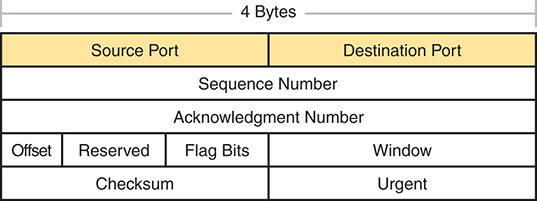

# Chapter 5

## Introduction to TCP/IP Transport and Applications

This chapter covers the following exam topics:

1.0 Network Fundamentals

1.5 Compare TCP to UDP

4.0 IP Services

4.3 Explain the role of DHCP and DNS in the network

The CCNA exam focuses mostly on functions at the lower layers of TCP/IP, which define how IP networks can send IP packets from host to host using LANs and WANs. This chapter explains the basics of a few topics that receive less attention on the exams: the TCP/IP transport layer and the TCP/IP application layer. The functions of these higher layers play a big role in real TCP/IP networks. Additionally, many of the security topics in [Parts I](vol2_part01.md#part01) and [II](vol2_part02.md#part02) of this book and some of the IP services topics in [Part III](vol2_part03.md#part03) require you to know the basics of how the transport and application layers of TCP/IP work. This chapter serves as that introduction.

This chapter begins by examining the functions of two transport layer protocols: Transmission Control Protocol (TCP) and User Datagram Protocol (UDP). The second major section of the chapter examines the TCP/IP application layer, including some discussion of how Domain Name System (DNS) name resolution works.

### "Do I Know This Already?" Quiz

Take the quiz (either here or use the PTP software) if you want to use the score to help you decide how much time to spend on this chapter. The letter answers are listed at the bottom of the page following the quiz. [Appendix C](vol2_appc.md#appc), found both at the end of the book as well as on the companion website, includes both the answers and explanations. You can also find both answers and explanations in the PTP testing software.

**Table 5-1** "Do I Know This Already?" Foundation Topics Section-to-Question Mapping

| Foundation Topics Section | Questions |
| --- | --- |
| TCP/IP Layer 4 Protocols: TCP and UDP | 1-4 |
| TCP/IP Applications | 5, 6 |

**[1](vol2_ch05.md#ques5_1a).** Which of the following header fields identify which TCP/IP application gets data received by the computer? (Choose two answers.)

1. Ethernet Type
2. SNAP Protocol Type
3. IP Protocol
4. TCP Port Number
5. UDP Port Number

**[2](vol2_ch05.md#ques5_2a).** Which of the following are typical functions of TCP? (Choose four answers.)

1. Flow control (windowing)
2. Error recovery
3. Multiplexing using port numbers
4. Routing
5. Encryption
6. Ordered data transfer

**[3](vol2_ch05.md#ques5_3a).** Which of the following functions is performed by both TCP and UDP?

1. Windowing
2. Error recovery
3. Multiplexing using port numbers
4. Routing
5. Encryption
6. Ordered data transfer

**[4](vol2_ch05.md#ques5_4a).** What do you call data that includes the Layer 4 protocol header, and data given to Layer 4 by the upper layers, not including any headers and trailers from Layers 1 to 3? (Choose two answers.)

1. L3PDU
2. Chunk
3. Segment
4. Packet
5. Frame
6. L4PDU

**[5](vol2_ch05.md#ques5_5a).** In the URI <http://www.certskills.com/config-labs>, which part identifies the web server?

1. http
2. [www.certskills.com](http://www.certskills.com)
3. [certskills.com](http://certskills.com)
4. <http://www.certskills.com>
5. The file [name.html](http:/name.md) includes the hostname.

**[6](vol2_ch05.md#ques5_6a).** Fred opens a web browser and connects to the [www.certskills.com](http://www.certskills.com) website. Which of the following are typically true about what happens between Fred's web browser and the web server? (Choose two answers.)

1. Messages flowing toward the server use UDP destination port 80.
2. Messages flowing from the server typically use RTP.
3. Messages flowing to the client typically use a source TCP port number of 80.
4. Messages flowing to the server typically use TCP.

Answers to the "Do I Know This Already?" quiz:

**[1](vol2_appc.md#ques5_1)** D, E

**[2](vol2_appc.md#ques5_2)** A, B, C, F

**[3](vol2_appc.md#ques5_3)** C

**[4](vol2_appc.md#ques5_4)** C, F

**[5](vol2_appc.md#ques5_5)** B

**[6](vol2_appc.md#ques5_6)** C, D

### Foundation Topics

### TCP/IP Layer 4 Protocols: TCP and UDP

The OSI transport layer (Layer 4) defines several functions, the most important of which are error recovery and flow control. Likewise, the TCP/IP transport layer protocols also implement these same types of features. Note that both the OSI model and the TCP/IP model call this layer the transport layer. But as usual, when referring to the TCP/IP model, the layer name and number are based on OSI, so any TCP/IP transport layer protocols are considered Layer 4 protocols.

The key difference between TCP and UDP is that TCP provides a wide variety of services to applications, whereas UDP does not. For example, routers discard packets for many reasons, including bit errors, congestion, and instances in which no correct routes are known. As you have read already, most data-link protocols notice errors (a process called [error detection](vol2_gloss.md#gloss_131)) but then discard frames that have errors. TCP provides retransmission ([error recovery](vol2_gloss.md#gloss_133)) and helps to avoid congestion ([flow control](vol2_gloss.md#gloss_146)), whereas UDP does not. As a result, many application protocols choose to use TCP.

However, do not let UDP's lack of services make you think that UDP is worse than TCP. By providing fewer services, UDP needs fewer bytes in its header compared to TCP, resulting in fewer bytes of overhead in the network. UDP software does not slow down data transfer in cases where TCP can purposefully slow down. Also, some applications, notably today voice over IP (VoIP) and video over IP, do not need error recovery, so they use UDP. So, UDP also has an important place in TCP/IP networks today.

[Table 5-2](vol2_ch05.md#ch05tab02) lists the main features supported by TCP/UDP. Note that only the first item listed in the table is supported by UDP, whereas all items in the table are supported by TCP.

**Table 5-2** TCP/IP Transport Layer Features

| Function | Description |
| --- | --- |
| Multiplexing using [ports](vol2_gloss.md#gloss_256) | Function that allows receiving hosts to choose the correct application for which the data is destined, based on the port number |
| Error recovery (reliability) | Process of numbering and acknowledging data with Sequence and Acknowledgment header fields |
| Flow control using windowing | Process that uses window sizes to protect buffer space and routing devices from being overloaded with traffic |
| Connection establishment and termination | Process used to initialize port numbers and Sequence and Acknowledgment fields |
| [Ordered data transfer](vol2_gloss.md#gloss_240) and data segmentation | Continuous stream of bytes from an upper-layer process that is "segmented" for transmission and delivered to upper-layer processes at the receiving device, with the bytes in the same order |

Next, this section describes the features of TCP, followed by a brief comparison to UDP.

#### Transmission Control Protocol

Each TCP/IP application typically chooses to use either TCP or UDP based on the application's requirements. For example, TCP provides error recovery, but to do so, it consumes more bandwidth and uses more processing cycles. UDP does not perform error recovery, but it takes less bandwidth and uses fewer processing cycles. Regardless of which of these two TCP/IP transport layer protocols the application chooses to use, you should understand the basics of how each of these transport layer protocols works.

TCP, as defined in Request For Comments (RFC) 9293, accomplishes the functions listed in [Table 5-2](vol2_ch05.md#ch05tab02) through mechanisms at the endpoint computers. TCP relies on IP for end-to-end delivery of the data, including routing issues. In other words, TCP performs only part of the functions necessary to deliver the data between applications. Also, the role that it plays is directed toward providing services for the applications that sit at the endpoint computers. Regardless of whether two computers are on the same Ethernet, or are separated by the entire Internet, TCP performs its functions the same way.

[Figure 5-1](vol2_ch05.md#ch05fig01) shows the fields in the TCP header. Although you don't need to memorize the names of the fields or their locations, the rest of this section refers to several of the fields, so the entire header is included here for reference.

The T C P header spans a total of 4 bytes. At the top, it includes two fields in yellow: the Source Port on the left and the Destination Port on the right. Directly below these fields is the Sequence Number, which occupies the entire width of the header. The Acknowledgment Number field is positioned beneath the Sequence Number, also spanning the entire width. The next row contains several fields: Offset on the left, followed by Reserved, Flag Bits, and Window, arranged from left to right. The bottom row includes the Checksum field on the left and the Urgent field on the right. Each field is delineated, ensuring the structured layout of the T C P header.

**Figure 5-1** *TCP Header Fields*

The message created by TCP that begins with the TCP header, followed by any application data, is called a TCP [segment](vol2_gloss.md#gloss_298). Alternatively, the more generic term *Layer 4 PDU*, or *L4PDU*, can also be used.

##### Multiplexing Using TCP Port Numbers

TCP and UDP both use a concept called *multiplexing*. Therefore, this section begins with an explanation of multiplexing with TCP and UDP. Afterward, the unique features of TCP are explored.

Multiplexing by TCP and UDP involves the process of how a computer thinks when receiving data. The computer might be running many applications, such as a web browser, an email package, or an Internet VoIP application (for example, Skype). TCP and UDP multiplexing tells the receiving computer to which application to give the received data.

Some examples will help make the need for multiplexing obvious. The sample network consists of two PCs, labeled Hannah and George. Hannah uses an application that she wrote to send advertisements that appear on George's screen. The application sends a new ad to George every 10 seconds. Hannah uses a second application, a wire-transfer application, to send George some money. Finally, Hannah uses a web browser to access the web server that runs on George's PC. The ad application and wire-transfer application are imaginary, just for this example. The web application works just like it would in real life.

[Figure 5-2](vol2_ch05.md#ch05fig02) shows the sample network, with George running three applications:

* A UDP-based advertisement application
* A TCP-based wire-transfer application
* A TCP web server application

The setup includes two computers, labeled Hannah and George, connected to a Web Server hosting both an Ad Application and a Wire Application. Hannah sends three distinct packets to George, each destined for a different application. Each packet is shown with its respective layers and protocols: The first packet contains Ad Data encapsulated with Ethernet, E T H, and Internet Protocol, I P, headers, and uses the User Datagram Protocol, U D P. This packet is intended for the Ad Application. The second packet contains Wire Transfer Data, encapsulated with E T H and I P headers, and uses the Transmission Control Protocol, T C P. This packet is intended for the Wire Application. The third packet contains Web Page Data, also encapsulated with E T H and I P headers, and uses T C P. This packet is intended for another application running on the Web Server. A note on the diagram states: I received three packets from the same source M A C and I P. Which of my applications gets the data in each? This indicates that despite the packets originating from the same source, the different protocols, U D P for Ad Data and T C P for Wire Transfer Data and Web Page Data, determine which application on George's side processes each packet.

**Figure 5-2** *Hannah Sending Packets to George, with Three Applications*

George needs to know which application to give the data to, but *all three packets are from the same Ethernet and IP address*. You might think that George could look at whether the packet contains a UDP or TCP header, but as you see in the figure, two applications (wire transfer and web) are using TCP.

TCP and UDP solve this problem by using a port number field in the TCP or UDP header, respectively. Each of Hannah's TCP and UDP segments uses a different *destination port number* so that George knows which application to give the data to. [Figure 5-3](vol2_ch05.md#ch05fig03) shows an example.

At the top of the image, two computer icons represent Hannah and George, each connected by lines that indicate the data transfer. Hannah's computer is associated with three applications: a Port 80 Web Server, a Port 800 Ad Server, and a Port 9876 Wire Application. Below this, three sets of data packets are depicted, each showing how the data is encapsulated and sent through the network: The first packet shows an Ethernet, E T H, frame containing an Internet Protocol, I P, packet, which in turn contains a User Datagram Protocol, U D P, segment. This segment is carrying Ad Data with a destination port of 800, indicating it is intended for the Ad Server. The second packet shows an E T H frame containing an I P packet with a Transmission Control Protocol, T C P, segment. This segment carries Wire Transfer Data with a destination port of 9876, indicating it is intended for the Wire Application. The third packet shows an E T H frame containing an I P packet with a T C P segment. This segment carries Web Page Data with a destination port of 80, indicating it is intended for the Web Server. On the right side of the image, a highlighted yellow box contains the text: I'll look in the U D P or T C P Destination port to identify the application! This emphasizes the importance of the destination port number in determining which application the data is intended for.

**Figure 5-3** *Hannah Sending Packets to George, with Three Applications Using Port Numbers to Multiplex*

Multiplexing relies on a concept called a *socket*. A socket consists of three things:

* An IP address
* A transport protocol
* A port number

So, for a web server application on George, the socket would be (10.1.1.2, TCP, port 80) because, by default, web servers use the well-known port 80. When Hannah's web browser connects to the web server, Hannah uses a socket as well--possibly one like this: (10.1.1.1, TCP, 49160). Why 49160? Well, Hannah just needs a port number that is unique on Hannah, so Hannah sees that port 49160.

The Internet Assigned Numbers Authority (IANA), the same organization that manages IP address allocation worldwide, subdivides the port number ranges into three main ranges. The first two ranges reserve numbers that IANA can then allocate to specific application protocols through an application and review process, with the third category reserving ports to be dynamically allocated as used for clients, as with the port 49160 example in the previous paragraph. The names and ranges of port numbers (as detailed in RFC 6335) are

* **Well Known (System) Ports:** Numbers from 0 to 1023, assigned by IANA, with a stricter review process to assign new ports than user ports.
* **User (Registered) Ports:** Numbers from 1024 to 49151, assigned by IANA with a less strict process to assign new ports compared to well-known ports.
* **Ephemeral (Dynamic, Private) Ports:** Numbers from 49152 to 65535, not assigned and intended to be dynamically allocated and used temporarily for a client application while the app is running.

[Figure 5-4](vol2_ch05.md#ch05fig04) shows an example that uses three ephemeral ports on the user device on the left, with the server on the right using two well-known ports and one user port. The computers use three applications at the same time; hence, three socket connections are open. Because a socket on a single computer should be unique, a connection between two sockets should identify a unique connection between two computers. This uniqueness means that you can use multiple applications at the same time, talking to applications running on the same or different computers. Multiplexing, based on sockets, ensures that the data is delivered to the correct applications.

Port numbers are a vital part of the socket concept. Servers use well-known ports (or user ports), whereas clients use dynamic ports. Applications that provide a service, such as FTP, Telnet, and web servers, open a socket using a well-known port and listen for connection requests. Because these connection requests from clients are required to include both the source and destination port numbers, the port numbers used by the servers must be known beforehand. Therefore, each service uses a specific well-known port number or user port number. Both well-known and user ports are listed at [www.iana.org/assignments/service-names-port-numbers/service-names-port-numbers.txt](http://www.iana.org/assignments/service-names-port-numbers/service-names-port-numbers.txt).

The image is divided into two main sections: User on the left and Server on the right. Each section shows applications and their associated ports, with connections represented by lines. User Section. Three applications are running, each with a specific port: Ad Application on Port 49159, Wire Application on Port 49153, and Web Browser on Port 49152. The User section's I P address is 10.1.1.1. The applications use both U D P, User Datagram Protocol, and T C P, Transmission Control Protocol. Ad Application uses U D P, connecting to Server I P 10.1.1.2, Port 800. Wire Application and Web Browser use T C P. Wire Application connects to Server I P 10.1.1.2, Port 9876. Web Browser connects to Server I P 10.1.1.2, Port 80. Server Section. The server hosts corresponding applications with specific ports: Ad Application on Port 800, Wire Application on Port 9876, and Web Server on Port 80. The Server section's I P address is 10.1.1.2. Connections. The Ad Application on the User device, 10.1.1.1, U D P, Port 49159, connects to the Ad Application on the Server, 10.1.1.2, U D P, Port 800. The Wire Application on the User device, 10.1.1.1, T C P, Port 49153, connects to the Wire Application on the Server, 10.1.1.2, T C P, Port 9876. The Web Browser on the User device, 10.1.1.1, T C P, Port 49152, connects to the Web Server on the Server, 10.1.1.2, T C P, Port 80.

**Figure 5-4** *Connections Between Sockets*

On client machines, where the requests originate, any locally unused port number can be allocated. The result is that each client on the same host uses a different port number, but a server uses the same port number for all connections. For example, 100 web browsers on the same host computer could each connect to a web server, but the web server with 100 clients connected to it would have only one socket and, therefore, only one port number (port 80, in this case). The server can tell which packets are sent from which of the 100 clients by looking at the source port of received TCP segments. The server can send data to the correct web client (browser) by sending data to that same port number listed as a destination port. The combination of source and destination sockets allows all participating hosts to distinguish between the data's source and destination. Although the example explains the concept using 100 TCP connections, the same port-numbering concept applies to UDP sessions in the same way.

Note

You can find all RFCs online at www.rfc-editor.org/rfc/rfc*xxxx*.txt, where *xxxx* is the number of the RFC. If you do not know the number of the RFC, you can try searching by topic at [www.rfc-editor.org](http://www.rfc-editor.org).

##### Popular TCP/IP Applications

Throughout your preparation for the CCNA exam, you will come across a variety of TCP/IP applications. You should at least be aware of some of the applications that can be used to help manage and control a network.

The World Wide Web (WWW) application exists through web browsers accessing the content available on web servers. Although it is often thought of as an end-user application, you can actually use WWW to manage a router or switch. You enable a web server function in the router or switch and use a browser to access the router or switch.

The Domain Name System (DNS) allows users to use names to refer to computers, with DNS being used to find the corresponding IP addresses. DNS also uses a client/server model, with [DNS servers](vol2_gloss.md#gloss_122) being controlled by networking personnel and DNS client functions being part of most any device that uses TCP/IP today. The client simply asks the DNS server to supply the IP address that corresponds to a given name.

Simple Network Management Protocol (SNMP) is an application layer protocol used specifically for network device management. For example, Cisco supplies a large variety of network management products, many of them in the Cisco Prime network management software product family. They can be used to query, compile, store, and display information about a network's operation. To query the network devices, Cisco Prime software mainly uses SNMP protocols.

Traditionally, to move files to and from a router or switch, Cisco used Trivial File Transfer Protocol (TFTP). TFTP defines a protocol for basic file transfer--hence the word *trivial*. Alternatively, routers and switches can use File Transfer Protocol (FTP), which is a much more functional protocol, to transfer files. Both work well for moving files into and out of Cisco devices. FTP allows many more features, making it a good choice for the general end-user population. TFTP client and server applications are very simple, making them good tools as embedded parts of networking devices.

Some of these applications use TCP, and some use UDP. For example, Simple Mail Transfer Protocol (SMTP) and Post Office Protocol version 3 (POP3), both used for transferring mail, require guaranteed delivery, so they use TCP.

Regardless of which transport layer protocol is used, applications use a well-known port number so that clients know which port to attempt to connect to. [Table 5-3](vol2_ch05.md#ch05tab03) lists several popular applications and their well-known port numbers.

**Table 5-3** Popular Applications and Their Well-Known Port Numbers

| Port Number | Protocol | Application |
| --- | --- | --- |
| 20 | TCP | FTP data |
| 21 | TCP | FTP control |
| 22 | TCP | SSH |
| 23 | TCP | Telnet |
| 25 | TCP | SMTP |
| 53 | UDP, TCP[\*](vol2_ch05.md#tfn5_3_1a) | DNS |
| 67 | UDP | DHCP Server |
| 68 | UDP | DHCP Client |
| 69 | UDP | TFTP |
| 80 | TCP | HTTP (WWW) |
| 110 | TCP | POP3 |
| 161 | UDP | SNMP |
| 443 | TCP, UDP | HTTPS |
| 514 | UDP | Syslog |

[\*](vol2_ch05.md#tfn5_3_1) DNS uses both UDP and TCP in different instances. It uses port 53 for both TCP and UDP.

##### Connection Establishment and Termination

TCP [connection establishment](vol2_gloss.md#gloss_090) occurs before any of the other TCP features can begin their work. Connection establishment refers to the process of initializing Sequence and Acknowledgment fields and agreeing on the port numbers used. [Figure 5-5](vol2_ch05.md#ch05fig05) shows an example of connection establishment flow.

The graphic depicts three steps of the T C P handshake, involving specific source and destination ports for each connection. On the left, there is an icon representing a Web Browser connected to Port 49155. On the right, an icon represents a Web Server connected to Port 80. The web browser initiates the connection by sending a S Y N, synchronize, packet to the web server. The packet has a destination port, D P O R T, of 80 and a source port, S P O R T, of 49155, illustrated as S Y N, D P O R T equals 80, S P O R T equals 49155. The web server responds with a S Y N, A C K, synchronize, acknowledge, packet back to the web browser. The packet has a destination port of 49155 and a source port of 80, shown as S Y N, A C K, D P O R T equals 49155, S P O R T equals 80. Finally, the web browser sends an A C K, acknowledge, packet to the web server to complete the handshake. The packet has a destination port of 80 and a source port of 49155, indicated as A C K, D P O R T equals 80, S P O R T equals 49155.

**Figure 5-5** *TCP Connection Establishment*

This three-way connection establishment flow (also called a three-way handshake) must complete before data transfer can begin. The connection exists between the two sockets, although the TCP header has no single socket field. Of the three parts of a socket, the IP addresses are implied based on the source and destination IP addresses in the IP header. TCP is implied because a TCP header is in use, as specified by the protocol field value in the IP header. Therefore, the only parts of the socket that need to be encoded in the TCP header are the port numbers.

TCP signals connection establishment using 2 bits inside the flag fields of the TCP header. Called the SYN and ACK flags, these bits have a particularly interesting meaning. SYN means "synchronize the sequence numbers," which is one necessary component in initialization for TCP.

[Figure 5-6](vol2_ch05.md#ch05fig06) shows TCP connection termination. This four-way termination sequence is straightforward and uses an additional flag, called the *FIN bit*. (FIN is short for "finished," as you might guess.) One interesting note: Before the device on the right sends the third TCP segment in the sequence, it notifies the application that the connection is coming down. It then waits on an acknowledgment from the application before sending the third segment in the figure. Just in case the application takes some time to reply, the PC on the right sends the second flow in the figure, acknowledging that the other PC wants to take down the connection. Otherwise, the PC on the left might resend the first segment repeatedly.

The diagram shows a sequence of four message exchanges required to terminate the T C P connection properly. The process begins with the P C on the left sending an A C K, F I N message to the P C on the right, initiating the termination sequence. The P C on the right responds with an A C K message, acknowledging the receipt of the termination request. Following this, the P C on the right sends its own A C K, F I N message back to the P C on the left, indicating its agreement to terminate the connection. Finally, the P C on the left sends an A C K message to acknowledge the receipt of the termination confirmation from the P C on the right. Each step in this sequence is represented by dashed lines with arrows indicating the direction of the messages, ensuring a clear understanding of the bidirectional communication involved in the T C P connection termination process.

**Figure 5-6** *TCP Connection Termination*

TCP establishes and terminates connections between the endpoints, whereas UDP does not. Many protocols operate under these same concepts, so the terms *connection-oriented* and *connectionless* are used to refer to the general idea of each. More formally, these terms can be defined as follows:

* **Connection-oriented protocol:** A protocol that requires an exchange of messages before data transfer begins, or that has a required pre-established correlation between two endpoints.
* **Connectionless protocol:** A protocol that does not require an exchange of messages and that does not require a pre-established correlation between two endpoints.

##### Error Recovery and Reliability

TCP provides for reliable data transfer, which is also called *reliability* or *error recovery*, depending on what document you read. To accomplish reliability, TCP numbers data bytes using the Sequence and Acknowledgment fields in the TCP header. TCP achieves reliability in both directions, using the Sequence Number field of one direction combined with the Acknowledgment field in the opposite direction.

[Figure 5-7](vol2_ch05.md#ch05fig07) shows an example of how the TCP Sequence and Acknowledgment fields allow the PC to send 3000 bytes of data to the server, with the server acknowledging receipt of the data. The TCP segments in the figure occur in order, from top to bottom. For simplicity's sake, all messages happen to have 1000 bytes of data in the data portion of the TCP segment. The first Sequence number is a nice round number (1000), again for simplicity's sake. The top of the figure shows three segments, with each sequence number being 1000 more than the previous, identifying the first of the 1000 bytes in the message. (That is, in this example, the first segment holds bytes 1000-1999; the second holds bytes 2000-2999; and the third holds bytes 3000-3999.)

The sequence of connections is as follows. The Web Browser sends a segment of 1000 Bytes of Data with a Sequence number of 1000 to the Web Server. The Web Browser sends a second segment of 1000 Bytes of Data with a Sequence number of 2000 to the Web Server. The Web Browser sends a third segment of 1000 Bytes of Data with a Sequence number of 3000 to the Web Server. The Web Server receives all three segments, totaling 3000 Bytes, and sends an acknowledgment back to the Web Browser. The acknowledgment from the Web Server is marked as No Data with an Acknowledgment number of 4000, indicating that it has successfully received all 3000 bytes of data and is now expecting the next byte in the sequence, which starts at 4000.

**Figure 5-7** *TCP Acknowledgment Without Errors*

The fourth TCP segment in the figure--the only one flowing back from the server to the web browser--acknowledges the receipt of all three segments. How? The acknowledgment value of 4000 means "I received all data with sequence numbers up through one less than 4000, so I am ready to receive your byte 4000 next." (Note that this convention of acknowledging by listing the next expected byte, rather than the number of the last byte received, is called [forward acknowledgment](vol2_ch05.md#key_073a).)

This first example does not recover from any errors, however; it simply shows the basics of how the sending host uses the sequence number field to identify the data, with the receiving host using forward acknowledgments to acknowledge the data. The more interesting discussion revolves around how to use these same tools to do error recovery. TCP uses the Sequence and Acknowledgment fields so that the receiving host can notice lost data, ask the sending host to resend, and then acknowledge that the re-sent data arrived.

Many variations exist for how TCP does error recovery. [Figure 5-8](vol2_ch05.md#ch05fig08) shows just one such example, with similar details compared to the previous figure. The web browser again sends three TCP segments, again 1000 bytes each, again with easy-to-remember sequence numbers. However, in this example, the second TCP segment fails to cross the network.

At the top left, there is an icon representing a web browser, and on the top right, there is an icon representing a web server. Three arrows, each labeled with 1000 Bytes of Data, Sequence equals 1000, 1000 Bytes of Data, Sequence equals 2000, and 1000 Bytes of Data, Sequence equals 3000 respectively, originate from the web browser and point towards the web server. The first arrow ends with the web server responding with I Received 1000 to 1999. Ask for 2000 Next! The second arrow ends with I Received 3000 to 3999. Ask for 4000 Next!, indicating that the packet with sequence number 2000 was lost. An arrow labeled No Data, Acknowledgment equals 2000 points back from the web server to the web browser, indicating the acknowledgment for the missing data. Below this, another set of arrows shows the retransmission process: the web browser sends 1000 Bytes of Data, Sequence equals 2000 again. The web server then responds with I Received 2000 to 2999. Already Have 3000 to 3999. Ask for 4000 Next! Another arrow labeled No Data, Acknowledgment equals 4000 points from the web server to the web browser, indicating successful receipt of all data packets up to sequence number 3999.

**Figure 5-8** *TCP Acknowledgment with Errors*

The figure points out three sets of ideas behind how the two hosts think. First, on the right, the server realizes that it did not receive all the data. The two received TCP segments contain bytes numbered 1000-1999 and 3000-3999. Clearly, the server did not receive the bytes numbered in between. The server then decides to acknowledge all the data up to the lost data--that is, to send back a segment with the Acknowledgment field equal to 2000.

The receipt of an acknowledgment that does not acknowledge all the data sent so far tells the sending host to resend the data. The PC on the left may wait a few moments to make sure no other acknowledgments arrive (using a timer called the retransmission timer), but will soon decide that the server means "I really do need 2000 next--resend it." The PC on the left does so, as shown in the fifth of the six TCP segments in the figure.

Finally, note that the server can acknowledge not only the re-sent data but also any earlier data that had been received correctly. In this case, the server received the re-sent second TCP segment (the data with sequence numbers 2000-2999), but the server had already received the third TCP segment (the data numbered 3000-3999). The server's next Acknowledgment field acknowledges the data in both of those segments, with an Acknowledgment field of 4000.

##### Flow Control Using Windowing

TCP implements flow control by using a window concept that is applied to the amount of data that can be outstanding and awaiting acknowledgment at any one point in time. The window concept lets the receiving host tell the sender how much data it can receive right now, giving the receiving host a way to make the sending host slow down or speed up. The receiver can slide the window size up and down--called a [sliding window](vol2_gloss.md#gloss_309) or *dynamic window*--to change how much data the sending host can send.

The sliding window mechanism makes much more sense with an example. The example, shown in [Figure 5-9](vol2_ch05.md#ch05fig09), uses the same basic rules as the examples in the previous few figures. In this case, none of the TCP segments have errors, and the discussion begins one TCP segment earlier than in the previous two figures.

The diagram is divided into two main sections: the Web Browser on the left and the Web Server on the right. Each section shows the flow of T C P segments and A C K s, including sequence numbers, S E Q, and window sizes. Web Browser (Left) Initial State: The Web Browser receives a new window size of 3000 (Window equals 3000). Data Transmission. S E Q equals 1000: The Web Browser sends a segment with sequence number 1000 to the Web Server. S E Q equals 2000: The Web Browser sends a segment with sequence number 2000 to the Web Server. S E Q equals 3000: The Web Browser sends a segment with sequence number 3000 to the Web Server. Waiting for A C K: The Web Browser waits for an acknowledgment, A C K, from the Web Server after sending the segments. A C K Reception: The Web Browser receives an acknowledgment with A C K equals 4000 and a new window size of 4000 (Window equals 4000). New Window: The Web Browser acknowledges receiving the A C K and the larger window size (Window equals 4000). Web Server (Right). Initial State: The Web Server receives the T C P segments with sequence numbers 1000, 2000, and 3000 from the Web Browser. A C K Transmission. A C K equals 1000: The Web Server sends an acknowledgment with A C K equals 1000 and a window size of 3000 (Window equals 3000). New Data Reception: Upon receiving all segments, S E Q equals 1000, S E Q equals 2000, S E Q equals 3000, the Web Server sends an A C K equals 4000 and grants a new window size of 4000 (Window equals 4000).

**Figure 5-9** *TCP Windowing*

Begin with the first segment, sent by the server to the PC. The Acknowledgment field should be familiar by now: it tells the PC that the server expects a segment with sequence number 1000 next. The new field, the window field, is set to 3000. Because the segment flows to the PC, this value tells the PC that the PC can send no more than 3000 bytes over this connection before receiving an acknowledgment. So, as shown on the left, the PC realizes it can send only 3000 bytes, and it stops sending, waiting on an acknowledgment, after sending three 1000-byte TCP segments.

Continuing the example, the server not only acknowledges receiving the data (without any loss) but also decides to slide the window size a little higher. Note that second message flowing right to left in the figure, this time with a window of 4000. When the PC receives this TCP segment, the PC realizes it can send another 4000 bytes (a slightly larger window than the previous value).

Note that while the last few figures show examples for the purpose of explaining how the mechanisms work, the examples might give you the impression that TCP makes the hosts sit there and wait for acknowledgments a lot. TCP does not want to make the sending host have to wait to send data. For instance, if an acknowledgment is received before the window is exhausted, a new window begins, and the sender continues sending data until the current window is exhausted. Often, in a network that has few problems, few lost segments, and little congestion, the TCP windows stay relatively large with hosts seldom waiting to send.

#### User Datagram Protocol

UDP provides a service for applications to exchange messages. Unlike TCP, UDP is connectionless and provides no reliability, no windowing, no reordering of the received data, and no segmentation of large chunks of data into the right size for transmission. However, UDP provides some functions of TCP, such as data transfer and multiplexing using port numbers, and it does so with fewer bytes of overhead and less processing required than TCP.

UDP data transfer differs from TCP data transfer in that no reordering or recovery is accomplished. Applications that use UDP are tolerant of the lost data, or they have some application mechanism to recover lost data. For example, VoIP uses UDP because if a voice packet is lost, by the time the loss could be noticed and the packet retransmitted, too much delay would have occurred, and the voice would be unintelligible. Also, DNS requests may use UDP because the user will retry an operation if the DNS resolution fails. As another example, the Network File System (NFS), a remote file system application, performs recovery with application layer code, so UDP features are acceptable to NFS.

[Figure 5-10](vol2_ch05.md#ch05fig10) shows the UDP header format. Most importantly, note that the header includes source and destination port fields, for the same purpose as TCP. However, the UDP has only 8 bytes, in comparison to the 20-byte TCP header shown in [Figure 5-1](vol2_ch05.md#ch05fig01). UDP needs a shorter header than TCP simply because UDP has less work to do.

The header is 8 bytes in total, divided into four fields, each 2 bytes, 16 bits, in length. These fields are arranged in a two-by-two matrix format. In the first row, the Source Port field specifies the port number of the source device sending the data, and the Destination Port field specifies the port number of the destination device receiving the data. In the second row, the Length field indicates the length of the U D P header and the encapsulated data, while the Checksum field is used for error-checking the header and data. The Source Port and Destination Port fields are highlighted in yellow.

**Figure 5-10** *UDP Header*

### TCP/IP Applications

The whole goal of building an enterprise network, or connecting a small home or office network to the Internet, is to use applications such as web browsing, text messaging, email, file downloads, voice, and video. This section examines one particular application--web browsing using Hypertext Transfer Protocol ([HTTP](vol2_gloss.md#gloss_161)).

The World Wide Web (WWW) consists of all the Internet-connected web servers in the world, plus all Internet-connected hosts with web browsers. [Web servers](vol2_gloss.md#gloss_375), which consist of web server software running on a computer, store information (in the form of *web pages*) that might be useful to different people. A *web browser*, which is software installed on an end user's computer, provides the means to connect to a web server and display the web pages stored on the web server.

Note

Although most people use the term *web browser*, or simply *browser*, web browsers are also called *web clients*, because they obtain a service from a web server.

For this process to work, several specific application layer functions must occur. The user must somehow identify the server, the specific web page, and the protocol used to get the data from the server. The client must find the server's IP address, based on the server's name, typically using DNS. The client must request the web page, which actually consists of multiple separate files, and the server must send the files to the web browser. Finally, for electronic commerce (e-commerce) applications, the transfer of data, particularly sensitive financial data, needs to be secure. The following sections address each of these functions.

#### Uniform Resource Identifiers

For a browser to display a web page, the browser must identify the server that has the web page, plus other information that identifies the particular web page. Most web servers have many web pages. For example, if you use a web browser to browse [www.cisco.com](http://www.cisco.com) and you click around that web page, you'll see another web page. Click again, and you'll see another web page. In each case, the clicking action identifies the server's IP address as well as the specific web page, with the details mostly hidden from you. (These clickable items on a web page, which in turn bring you to another web page, are called *links*.)

The browser user can identify a web page when you click something on a web page or when you enter a Uniform Resource Identifier ([URI](vol2_gloss.md#gloss_259)) in the browser's address area. Both options--clicking a link and typing a URI--refer to a URI, because when you click a link on a web page, that link actually refers to a URI.

Note

Most browsers support some way to view the hidden URI referenced by a link. In several browsers, hover the mouse pointer over a link, right-click, and select **Properties**. The pop-up window should display the URI to which the browser would be directed if you clicked that link.

In common speech, many people use the terms *web address* or the similar related terms *Universal Resource Locator* (or Uniform Resource Locator; URL) instead of URI, but URI is indeed the correct formal term. In fact, URL had been more commonly used than URI for more than a few years. However, the Internet Engineering Task Force, or IETF (the group that defines TCP/IP), along with the W3C consortium ([W3.org](http://W3.org), a consortium that develops web standards) has made a concerted effort to standardize the use of URI as the general term. See RFC 7595 for some commentary to that effect.

From a practical perspective, the URIs used to connect to a web server include three key components, as noted in [Figure 5-11](vol2_ch05.md#ch05fig11). The figure shows the formal names of the URI fields. More importantly to this discussion, note that the text before the :// identifies the protocol used to connect to the server, the text between the // and / identifies the server by name, and the text after the / identifies the web page.

In the center, a U R I h t t p colon forward slash forward slash w w w dot certskills dot com forward slash config-labs is prominently displayed in blue text. This U R I is divided into three main components: Scheme, Authority, and Path. The Scheme component is labeled with a downward arrow pointing to h t t p colon forward slash forward slash, indicating the protocol used. The Authority component, also indicated with a downward arrow, points to w w w dot certskills dot com, identifying the server's name. The Path component is marked by a downward arrow pointing to forward slash config-labs, specifying the web page being accessed. On the left side of the image, there are two sections. The top section uses the formal term U R I with an arrow pointing to Scheme, while the bottom section provides a practical example with Web pointing to Protocol. Additionally, Authority is aligned with Server's Name and Path is aligned with Web Page.

**Figure 5-11** *Structure of a URI Used to Retrieve a Web Page*

In this case, the protocol is Hypertext Transfer Protocol (HTTP), the hostname is [www.certskills.com](http://www.certskills.com), and the name of the web page is config-labs.

#### Finding the Web Server Using DNS

A host can use DNS to discover the IP address that corresponds to a particular hostname. URIs typically list the name of the server--a name that can be used to dynamically learn the IP address used by that same server. The web browser cannot send an IP packet to a destination name, but it can send a packet to a destination IP address. So, before the browser can send a packet to the web server, the browser typically needs to resolve the name inside the URI to that name's corresponding IP address.

To pull together several concepts, [Figure 5-12](vol2_ch05.md#ch05fig12) shows the DNS process as initiated by a web browser, as well as some other related information. From a basic perspective, the user enters the URI (in this case, <http://www.cisco.com/go/learningnetwork>), resolves the [www.cisco.com](http://www.cisco.com) name into the correct IP address, and starts sending packets to the web server.

First, human types the U R L h t t p colon forward slash forward slash w w w dot cisco dot com forward slash go forward slash learning network into a web browser on a client computer with the I P address 64.100.1.1, initiating a D N S resolution request to find the I P address of the domain w w w dot cisco dot com. Second, the client sends a D N S resolution request to a D N S server with the I P address 192.31.7.1. The request includes an I P header and a U D P, User Datagram Protocol, header, with the source port set to 49161 and the destination port set to 53, asking, What is the I P address of w w w dot cisco dot com? Third, the D N S server responds with a D N S name resolution reply, including an I P header and a U D P header, with the source port set to 53 and the destination port set to 49161, indicating that the I P address of w w w dot cisco dot com is 198.133.219.25. Fourth, the client uses the resolved I P address to initiate a T C P, Transmission Control Protocol, connection to the web server at 198.133.219.25, sending a T C P connection setup packet with an I P header and a T C P header, with the source port set to 49172 and the destination port set to 80. This packet is a S Y N, synchronized, packet, the first step in establishing a T C P connection.

**Figure 5-12** *DNS Resolution and Requesting a Web Page*

The steps shown in the figure are as follows:

1. The user enters the URI, <http://www.cisco.com/go/learningnetwork>, into the browser's address area.
2. The client sends a DNS request to the DNS server. Typically, the client learns the DNS server's IP address through DHCP. DNS supports using either TCP or UDP, with UDP in this example. In either case, the protocol uses the well-known port 53. (See [Table 5-3](vol2_ch05.md#ch05tab03), earlier in this chapter, for a list of popular well-known ports.)
3. The DNS server sends a reply, listing IP address 198.133.219.25 as [www.cisco.com](http://www.cisco.com)'s IP address. Note also that the reply shows a destination IP address of 64.100.1.1, the client's IP address. It also shows a UDP header, with source port 53; the source port is 53 because the data is sourced, or sent by, the DNS server.
4. The client begins the process of establishing a new TCP connection to the web server. Note that the destination IP address is the just-learned IP address of the web server. The packet includes a TCP header, because HTTP uses TCP. Also note that the destination TCP port is 80, the well-known port for HTTP. Finally, the SYN bit is shown, as a reminder that the TCP connection establishment process begins with a TCP segment with the SYN bit turned on (binary 1).

The example in [Figure 5-12](vol2_ch05.md#ch05fig12) shows what happens when the client host does not know the IP address associated with the hostname but the enterprise does know the address. However, hosts can cache the results of DNS requests so that for a time the client does not need to ask the DNS to resolve the name. Also, the DNS server can cache the results of previous DNS requests; for instance, the enterprise DNS server in [Figure 5-12](vol2_ch05.md#ch05fig12) would not normally have configured information about hostnames in domains outside that enterprise, so that example relied on the DNS having cached the address associated with hostname [www.cisco.com](http://www.cisco.com).

When the local DNS does not know the address associated with a hostname, it needs to ask for help. [Figure 5-13](vol2_ch05.md#ch05fig13) shows an example with the same client as in [Figure 5-12](vol2_ch05.md#ch05fig12). In this case, the enterprise DNS acts as a [recursive DNS server](vol2_gloss.md#gloss_285), sending repeated DNS messages in an effort to identify the authoritative DNS server.

The sequence of connections starts with a user initiating a D N S query from their computer to the Enterprise D N S server, requesting the I P address for a specific domain, such as cisco dot com. The Enterprise D N S server, not having the required information, forwards the query to the Root D N S server. The Root D N S server responds to the Enterprise D N S server with the address of the dot com Top-Level Domain, T L D, D N S server. The Enterprise D N S server then queries the dot com T L D D N S server for the I P address of the authoritative D N S server for cisco dot com. The dot com T L D D N S server responds with the address of the authoritative cisco dot com D N S server. The Enterprise D N S server queries the authoritative cisco dot com D N S server for the specific I P address of cisco dot com. The authoritative cisco dot com D N S server responds with the requested I P address. Finally, the Enterprise D N S server sends the I P address back to the user's computer, completing the recursive D N S lookup process and ensuring that the user's computer can connect to the correct I P address for the requested domain.

**Figure 5-13** *Recursive DNS Lookup*

The steps shown in the figure are as follows:

1. The client sends a DNS request for [www.cisco.com](http://www.cisco.com) to the DNS server it knows, which is the enterprise DNS server.
2. The (recursive) enterprise DNS server does not know the answer yet, but it does not reject the client's DNS request. Instead, it follows a repetitive (recursive) process (shown as steps 2, 3, and 4), beginning with the DNS request sent to a root DNS server. The root does not supply the address either, but it supplies the IP address of another DNS server, one responsible for the .com top-level domain.
3. The recursive enterprise DNS sends the next DNS request to the DNS server learned at the previous step--this time the TLD DNS server for the .com domain. This DNS also does not know the address, but it knows the DNS server that should be the authoritative DNS server for domain [cisco.com](http://cisco.com), so it supplies that DNS server's address.
4. The enterprise DNS sends another DNS request, to the DNS server whose address was learned in the previous step, again asking for resolution of the name [www.cisco.com](http://www.cisco.com). This DNS server, the authoritative server for [cisco.com](http://cisco.com), supplies the address.
5. The enterprise DNS server returns a DNS reply back to the client, supplying the IP address requested at step 1.

#### Transferring Files with HTTP

After a web client (browser) has created a TCP connection to a web server, the client can begin requesting the web page from the server. Most often, the protocol used to transfer the web page is HTTP. The HTTP application layer protocol, defined in RFC 7230, defines how files can be transferred between two computers. HTTP was specifically created for the purpose of transferring files between web servers and web clients.

HTTP defines several commands and responses, with the most frequently used being the HTTP GET request. To get a file from a web server, the client sends an HTTP GET request to the server, listing the filename. If the server decides to send the file, the server sends an HTTP GET response, with a return code of 200 (meaning OK), along with the file's contents.

Note

Many return codes exist for HTTP requests. For example, when the server does not have the requested file, it issues a return code of 404, which means "file not found." Most web browsers do not show the specific numeric HTTP return codes, instead displaying a response such as "page not found" in reaction to receiving a return code of 404.

Web pages typically consist of multiple files, called *objects*. Most web pages contain text as well as several graphical images, animated advertisements, and possibly voice or video. Each of these components is stored as a different object (file) on the web server. To get them all, the web browser gets the first file. This file can (and typically does) include references to other URIs, so the browser then also requests the other objects. [Figure 5-14](vol2_ch05.md#ch05fig14) shows the general idea, with the browser getting the first file and then two others.

The sequence begins with the user typing the U R L h t t p colon forward slash forward slash w w w dot cisco dot com forward slash go forward slash c c n a into the web browser on the client P C. The web browser sends an H T T P G E T request for the resource forward slash go forward slash c c n a to the web server at w w w dot cisco dot com. The server responds with an H T T P O K message, followed by the requested data for forward slash go forward slash c c n a. Next, the web browser sends another H T T P G E T request for the resource forward slash graphics forward slash logo1.gif. The server responds with an H T T P O K message and the data for logo 1 dot gif. This pattern repeats with the web browser sending an H T T P G E T request for the resource forward slash graphics forward slash ad1.gif, to which the server replies with an H T T P O K message and the data for a d 1 dot gif. Each request and response is represented by arrows showing the direction of data flow between the web server and the web browser client, with the requests labeled in yellow and the responses labeled in blue.

**Figure 5-14** *Multiple HTTP GET Requests/Responses*

In this case, after the web browser gets the first file--the one called "/go/ccna" in the URI--the browser reads and interprets that file. Besides containing parts of the web page, the file refers to two other files, so the browser issues two additional HTTP GET requests. Note that, even though it isn't shown in the figure, all these commands flow over one (or possibly more) TCP connection between the client and the server. This means that TCP would provide error recovery, ensuring that the data was delivered.

#### How the Receiving Host Identifies the Correct Receiving Application

This chapter closes with a discussion of the process by which a host, when receiving any message over any network, can decide which of its many application programs should process the received data.

As an example, consider host A shown on the left side of [Figure 5-15](vol2_ch05.md#ch05fig15). The host happens to have three different web browser windows open, each using a unique TCP port. Host A also has an email client and a chat window open, both of which use TCP. Both the email and chat applications use a unique TCP port number on host A as shown in the figure.

The left side of the image shows Host A, represented by a computer icon labeled A. It sends data encapsulated in several protocol layers: Ethernet (E T H), Internet Protocol (I P), Transmission Control Protocol (T C P) with the destination port, and Hypertext Transfer Protocol (H T T P) plus the data itself. On the right side, the image shows the Web Server, depicted by a server icon. The connection between Host A and the Web Server involves different applications on Host A, each using a specific T C P port: Browser: T C P port 49124. Browser: T C P port 49125. Browser: T C P port 49126. Email: T C P port 49127. Chat: T C P port 49128. The diagram explains that Host A uses the destination port in the T C P header to determine which application should receive the data. For example, data received on T C P port 49124 is directed to the browser application, while data on T C P port 49127 is directed to the email application.

**Figure 5-15** *Dilemma: How Host A Chooses the App That Should Receive This Data*

This chapter has shown several examples of how transport layer protocols use the destination port number field in the TCP or UDP header to identify the receiving application. For instance, if the destination TCP port value in [Figure 5-15](vol2_ch05.md#ch05fig15) is 49124, host A will know that the data is meant for the first of the three web browser windows.

Before a receiving host can even examine the TCP or UDP header, and find the destination port field, it must first process the outer headers in the message. If the incoming message is an Ethernet frame that encapsulates an IPv4 packet, the headers look like the details in [Figure 5-16](vol2_ch05.md#ch05fig16).

On the left side of the image, there is an icon representing a web browser, and on the right side, there is an icon representing a web server. Between these icons, there is a detailed breakdown of a data packet's structure. The data packet is divided into four sections, each enclosed in a rectangle. The first section, labeled Ethernet (Type), contains the value 0 times 0800, indicating the type of Ethernet frame. The second section, labeled I P v 4 (Protocol), has the value 6, which denotes the protocol number for I P v 4. The third section, labeled T C P (Destination Port), shows the value 49124, representing the destination port number used by the Transmission Control Protocol (T C P). The final section, labeled H T T P and Data, includes the actual H T T P data being transmitted. Red dashed arrows point from the values above each section to their respective labels, clearly linking them to the specific fields in the data packet.

**Figure 5-16** *Three Key Fields with Which to Identify the Next Header*

The receiving host needs to look at multiple fields, one per header, to identify the next header or field in the received message. For instance, host A uses an Ethernet NIC to connect to the network, so the received message is an Ethernet frame. The Ethernet Type field identifies the type of header that follows the Ethernet header--in this case, with a value of hex 0800, an IPv4 header.

The IPv4 header has a similar field called the IP Protocol field. The IPv4 Protocol field has a standard list of values that identify the next header, with decimal 6 used for TCP and decimal 17 used for UDP. In this case, the value of 6 identifies the TCP header that follows the IPv4 header. Once the receiving host realizes a TCP header exists, it can process the destination port field to determine which local application process should receive the data.

#### HTTP Versions

For much of the history of CCNA since its inception in 1998, you could ignore the details of HTTP versions and version differences. With the introduction of HTTP/3 around 2020, you need to be more aware of HTTP protocol versions. This section works through the versions and the differences that matter for CCNA.

##### HTTP 1.0 and 1.1

Web browsers and servers first came into existence in the early 1990s. Eventually, the IETF took ownership of the Hypertext Transfer Protocol (HTTP), used by web browsers and servers to transfer objects. In those early years, the IETF published HTTP RFCs for HTTP 0.9, [HTTP 1.0](vol2_gloss.md#gloss_162), and [HTTP 1.1](vol2_gloss.md#gloss_163), with various improvements at each version. However, differences exist in how the application protocol works, with the details unimportant to building the network infrastructure. For instance, they all use HTTP and TCP, with the same HTTP GET Request and Response methods discussed in the last several pages of this chapter.

These early HTTP versions use common networking features. They all use TCP for the transport protocol, with IANA reserving well-known TCP port 80 for the server. HTTP defines URLs with a scheme (protocol) of http, with URLs like <http://www.example.com>. The URL can specify a nondefault server port number, but if omitted (as is typical), the URL implies the default well-known port. Also, the http scheme means no additional security features, such as authentication or encryption, are used.

From using web browsers, you might notice that URLs do not typically reference any kind of version number. Instead, the web browser and web servers support many or most versions. They connect using details of one version and can then use application-layer headers to signal a change to use a different version. As a user, you do not notice the difference. As a network engineer, with these earlier versions, you did not need to be concerned about which was used.

##### HTTP/2 and TLS

Independent from the specific HTTP protocol versions, additional RFCs defined how to add security features to HTTP using Transport Layer Security (TLS). An RFC from the late 1990s defined [Secure HTTP](vol2_gloss.md#gloss_297), also called HTTP over TLS. Because it added security to existing protocols, Secure HTTP uses the initial sequence like any other browser session, beginning with a TCP connection between the client and server. However, before sending HTTP messages, the endpoints create a TLS connection per the TLS protocol, implementing security features such as server authentication and encryption. Only then do the HTTP messages flow.

To signal that the connection uses Secure HTTP, the RFC defines a new URI scheme (protocol) of https, with URLs like <https://www.example.com>. (Almost all URLs you use daily begin with *https* and use Secure HTTP.)

From a networking perspective, two differences exist with HTTP 1.1 without TLS. The URLs differ, as just noted. Also, IANA reserves well-known TCP port 443 for Secure HTTP, so a URL that begins *https* implies TCP port 443 as the server's well-known port.

Note

You might see references to HTTP versions as HTTP 1.1 or with a /, such as HTTP/1.1.

HTTP 1.1 and Secure HTTP/1.1 became the norm for many years, particularly into the 2000s and into the 2010s, with more and more traffic using the secure option over time. However, as time passed, many stakeholders saw issues with website performance with HTTP/1.1--particularly when transferring many objects with each web page. HTTP/2 and HTTP/3 attempt to address the performance issues with different approaches.

[HTTP/2](vol2_gloss.md#gloss_164), which reached RFC status in the mid-2010s, improves the inner workings of the HTTP application layer protocol while keeping the same URL schemes, TCP transport, well-known ports, and the same use of HTTP over TLS. The changes impact the details of the HTTP application layer protocol but not the networking or security details. So, while important in IT, the introduction of HTTP/2 did not introduce new complexities for most network engineering projects because HTTP/2 uses the same TCP transport protocol and well-known ports as the earlier HTTP versions.

##### HTTP 3.0

[HTTP/3](vol2_gloss.md#gloss_165) significantly shifts in HTTP performance with an approach that makes additional fundamental changes, including using UDP instead of TCP.

Google developed what has become HTTP/3 during the 2010s. While useful, Google's work found that TCP's error recovery and flow control features slowed performance for HTTP. To solve that problem, Google built a new transport protocol based on UDP called [QUIC](vol2_gloss.md#gloss_277) (not an acronym, just the name), now published in RFC 9369. QUIC also has some TCP-like features (error recovery, flow control), and it integrates the TLS work at the same time, reducing overhead flows. So, some HTTP/3 performance improvements come from migrating away from TCP plus TLS running independently to an approach that integrates UDP, QUIC, and TLS functions.

HTTP itself also changed. The IETF split some parts of the protocol into different RFCs in 2022 (RFCs 9110, 9111, and 9114), with HTTP/3 specifically in RFC 9114.

In the real world, HTTP/2 adoption showed slow growth, but HTTP/3 and its QUIC transport protocol have grown tremendously. According to some statistics from Cisco, Internet HTTP/3 traffic now exceeds HTTP/2 traffic. Many major Internet services, like Google, Facebook, YouTube, and Instagram, have embraced HTTP/3. Most of us have been using HTTP/3 without even being aware of it.

HTTP/3 changes several networking details compared to the other versions, most notably the headers. As discussed in the following few chapters, those changes impact what you can match with IP ACLs. While its RFC bills QUIC as a transport protocol, from a header perspective, it looks like another header that follows a UDP header. So, QUIC is an additional protocol that rides on UDP, as shown in [Figure 5-17](vol2_ch05.md#ch05fig17).

On the left side, the stack for H T T P slash 2 and Earlier with T L S is shown, consisting of four layers. From top to bottom, these layers are H T T P 1.0, 1.1, 2.0; T L S (Transport Layer Security); T C P (Transmission Control Protocol); and I P (Internet Protocol). On the right side, the stack for H T T P slash 3 is presented, also consisting of four layers. From top to bottom, these layers are H T T P 3; Q U I C and T L S (where Q U I C is Quick U D P Internet Connections); U D P (User Datagram Protocol); and I P (Internet Protocol). The comparison highlights that while earlier versions of H T T P use T C P for transport, H T T P slash 3 uses Q U I C over U D P, incorporating T L S directly into the Q U I C protocol for enhanced performance and security.

**Figure 5-17** *Comparing HTTP/3 with Earlier Versions*

Note

HTTP/3 always uses TLS, partly because QUIC integrates TLS features but partly because the security features of TLS make sense for web connections. IANA reserves UDP port 443 as the well-known port for web servers when using HTTP/3.

To summarize, as a user, you do not choose what HTTP version to use. The browser and server will begin using a version and optionally change to another version based on the information exchanged between the two. As a network engineer, you should be aware of the versions, aware that HTTP messages in your network today include traditional TCP-based HTTP/1.0, HTTP/1.1, and HTTP/2 traffic to well-known TCP ports 80 and 443, but they also include messages with UDP headers using UDP port 443.

Note

Web servers and most other server applications can use a port number other than their well-known reserved port. This chapter shows the predictable well-known ports.

### Chapter Review

One key to doing well on the exams is to perform repetitive spaced review sessions. Review this chapter's material using either the tools in the book or interactive tools for the same material found on the book's companion website. Refer to the "[Your Study Plan](vol2_appf.md#appf)" element for more details. [Table 5-4](vol2_ch05.md#ch05tab04) outlines the key review elements and where you can find them. To better track your study progress, record when you completed these activities in the second column.

**Table 5-4** Chapter Review Tracking

| Review Element | Review Date(s) | Resource Used |
| --- | --- | --- |
| Review key topics |  | Book, website |
| Review key terms |  | Book, website |
| Answer DIKTA questions |  | Book, PTP |
| Review memory tables |  | Book, website |

### Review All the Key Topics

**Table 5-5** Key Topics for [Chapter 5](vol2_ch05.md#ch05)

| Key Topic Element | Description | Page Number |
| --- | --- | --- |
| [Table 5-2](vol2_ch05.md#ch05tab02) | Functions of TCP and UDP | [94](vol2_ch05.md#page_94) |
| [Table 5-3](vol2_ch05.md#ch05tab03) | Well-known TCP and UDP port numbers | [99](vol2_ch05.md#page_99) |
| [Figure 5-5](vol2_ch05.md#ch05fig05) | Example of TCP connection establishment | [100](vol2_ch05.md#page_100) |
| List | Definitions of connection-oriented and connectionless | [101](vol2_ch05.md#page_101) |
| [Figure 5-12](vol2_ch05.md#ch05fig12) | DNS name resolution | [106](vol2_ch05.md#page_106) |
| [Figure 5-16](vol2_ch05.md#ch05fig16) | Header fields that identify the next header | [109](vol2_ch05.md#page_109) |

### Key Terms You Should Know

[connection establishment](vol2_ch05.md#key_068)

[DNS server](vol2_ch05.md#key_069)

[error detection](vol2_ch05.md#key_070)

[error recovery](vol2_ch05.md#key_071)

[flow control](vol2_ch05.md#key_072)

[forward acknowledgment](vol2_ch05.md#key_073)

[HTTP](vol2_ch05.md#key_074)

[HTTP/1.0](vol2_ch05.md#key_075)

[HTTP/1.1](vol2_ch05.md#key_076)

[HTTP/2](vol2_ch05.md#key_077)

[HTTP/3](vol2_ch05.md#key_078)

[ordered data transfer](vol2_ch05.md#key_079)

[port](vol2_ch05.md#key_080)

[QUIC](vol2_ch05.md#key_081)

[recursive DNS server](vol2_ch05.md#key_082)

[Secure HTTP](vol2_ch05.md#key_083)

[segment](vol2_ch05.md#key_084)

[sliding windows](vol2_ch05.md#key_085)

[URI](vol2_ch05.md#key_086)

[web server](vol2_ch05.md#key_087)