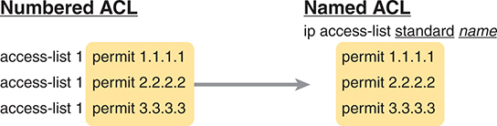
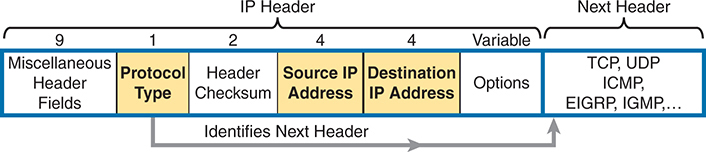
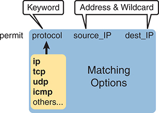
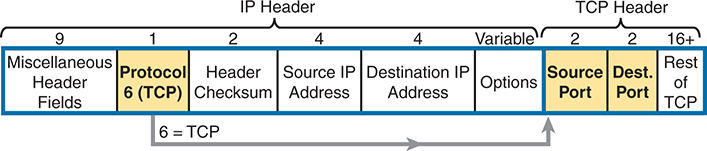
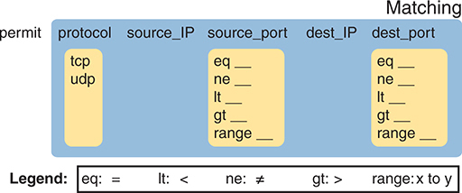
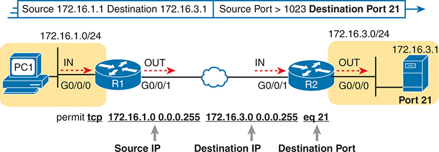
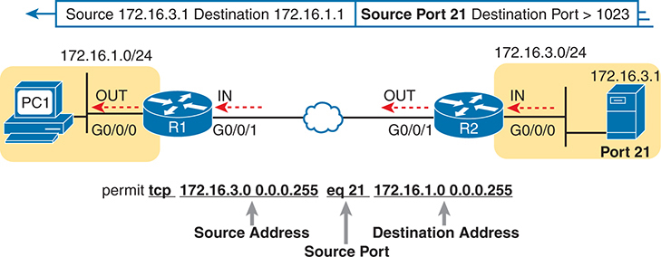
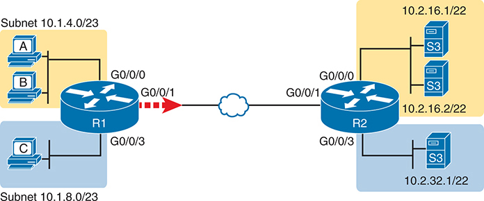
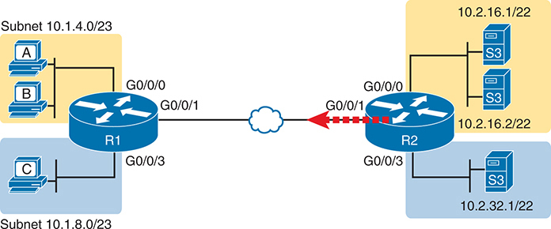

# Chapter 7


## Named and Extended IP ACLs

This chapter covers the following exam topics:

5.0 Security Fundamentals

5.6 Configure and verify access control lists

The previous chapter introduced basic IP ACL concepts and configuration using numbered standard IP ACLs. While understanding numbered standard IP ACLs is useful and important, most networks need the greater matching abilities of extended ACLs. Extended ACLs allow you to match various header fields in each line of the ACL (each access control entry, or ACE), making them more powerful.

Additionally, most networks use named ACLs instead of numbered ones. Identifying ACLs using names makes it easy to add information in the name that reminds all as to the purpose of the ACL. Additionally, from the first introduction of named ACLs into IOS decades ago, named ACLs used ACL configuration mode, with **permit** and **deny** subcommands, making the configuration clearer and easier to change over time.

This chapter begins by discussing named ACLs, using only standard ACL examples for simplicity. That first section also shows how to edit named ACLs and why that capability improves on the older editing features for numbered ACLs. The second major section then examines extended ACLs in detail, using named extended ACLs for the most part.

### "Do I Know This Already?" Quiz

Take the quiz (either here or use the PTP software) if you want to use the score to help you decide how much time to spend on this chapter. The letter answers are listed at the bottom of the page following the quiz. [Appendix C](vol2_appc.md#appc), found both at the end of the book as well as on the companion website, includes both the answers and explanations. You can also find both answers and explanations in the PTP testing software.

**Table 7-1** "Do I Know This Already?" Foundation Topics Section-to-Question Mapping

| Foundation Topics Section | Questions |
| --- | --- |
| Named ACLs and ACL Editing | 1, 2 |
| Extended IP Access Control Lists | 3-6 |

**[1](vol2_ch07.md#ques7_1a).** Which answer best compares named standard IP ACLs with numbered standard IP ACLs?

1. Uses a name instead of a number, but with no other configuration changes
2. Adds additional fields to match beyond standard numbered IP ACLs
3. Enables you to configure matching parameters and permit/deny action in ACL mode
4. Enables you to configure matching parameters and permit/deny action in interface mode

**[2](vol2_ch07.md#ques7_2a).** You just configured standard named ACL WAN\_ACL with commands that did not use sequence numbers. Which command, if typed in ACL configuration mode for this ACL, would become the third ACE in the ACL?

1. **15 permit 172.16.0.0 0.0.255.255**
2. **permit 16 172.16.0.0 0.0.255.255**
3. **21 permit 172.16.0.0 0.0.255.255**
4. **permit 29 172.16.0.0 0.0.255.255**

**[3](vol2_ch07.md#ques7_3a).** Which answers list a field that cannot be matched by an extended IP ACL? (Choose two answers.)

1. Protocol
2. Source IP address
3. Destination IP address
4. TCP source port
5. URL
6. Filename for FTP transfers

**[4](vol2_ch07.md#ques7_4a).** Which **access-list** commands permit packets from host 10.1.1.1 to all web servers whose IP addresses begin with 172.16.5? (Choose two answers.)

1. **access-list 101 permit tcp host 10.1.1.1 172.16.5.0 0.0.0.255 eq www**
2. **access-list 1951 permit ip host 10.1.1.1 172.16.5.0 0.0.0.255 eq www**
3. **access-list 2523 permit ip host 10.1.1.1 eq www 172.16.5.0 0.0.0.255**
4. **access-list 2523 permit tcp host 10.1.1.1 eq www 172.16.5.0 0.0.0.255**
5. **access-list 2523 permit tcp host 10.1.1.1 172.16.5.0 0.0.0.255 eq www**

**[5](vol2_ch07.md#ques7_5a).** Which of the following **access-list** commands permits packets going to any web client from all web servers whose IP addresses begin with 172.16.5?

1. **access-list 101 permit tcp host 10.1.1.1 172.16.5.0 0.0.0.255 eq www**
2. **access-list 1951 permit ip host 10.1.1.1 172.16.5.0 0.0.0.255 eq www**
3. **access-list 2523 permit tcp any eq www 172.16.5.0 0.0.0.255**
4. **access-list 2523 permit tcp 172.16.5.0 0.0.0.255 eq www 172.16.5.0 0.0.0.255**
5. **access-list 2523 permit tcp 172.16.5.0 0.0.0.255 eq www any**

**[6](vol2_ch07.md#ques7_6a).** Consider the following output from a **show access-list** command. Which ACEs match packets from 10.22.33.99 to 10.33.22.22 destined to any SSH server?

[Click here to view code image](vol2_ch07_images.md#f0137-01)

```
ip access-list extended sample
  10 permit tcp 10.22.33.0 0.0.0.63 10.33.22.0 0.0.0.127 eq 22
  20 permit tcp 10.22.33.0 0.0.0.127 eq 24 10.33.22.0 0.0.0.63
  30 permit tcp 10.22.33.0 0.0.0.127 10.33.22.0 0.0.0.127 eq 22
  40 permit tcp 10.22.33.0 0.0.0.255 10.33.22.0 0.0.0.31 eq 24
```

1. Line 10
2. Line 20
3. Line 30
4. Line 40

Answers to the "Do I Know This Already?" quiz:

**[1](vol2_appc.md#ques7_1)** C

**[2](vol2_appc.md#ques7_2)** C

**[3](vol2_appc.md#ques7_3)** E, F

**[4](vol2_appc.md#ques7_4)** A, E

**[5](vol2_appc.md#ques7_5)** E

**[6](vol2_appc.md#ques7_6)** C

### Foundation Topics

### Named ACLs and ACL Editing

From the earliest days of Cisco, IOS supported numbered ACLs. Over time, Cisco added support for [named access lists](vol2_gloss.md#gloss_219). This section details how to configure and use named ACLs, along with one of the key features enabled by named ACLs: ACL editing.

#### Named IP Access Lists

Named IP ACLs have many similarities with numbered IP ACLs. They function as packet filters but other IOS features use them for matching packets and taking other actions. They can also match the same fields: standard numbered ACLs can match the same fields as a standard named ACL, and extended numbered ACLs can match the same fields as an extended named ACL.

Of course, there are differences between named and numbered ACLs. Named ACLs originally had three significant differences compared to numbered ACLs:


* Using names instead of numbers to identify the ACL, making it easier to remember the reason for the ACL
* Using ACL mode subcommands, not global commands, to define the action and matching parameters
* Using ACL editing features that allow the CLI user to delete individual lines from the ACL and insert new lines

You can easily learn named ACL configuration by just converting numbered ACLs to use the equivalent named ACL configuration. [Figure 7-1](vol2_ch07.md#ch07fig01) shows just such a conversion, using a simple three-line standard ACL number 1. To create the three **permit** subcommands for the named ACL, you copy parts of the three numbered ACL commands, beginning with the **permit** keyword.




On the left side, the Numbered A C L configuration is shown with three lines: access-list 1 permit 1 dot 1 dot 1 dot 1, access-list 1 permit 2 dot 2 dot 2 dot 2, and access-list 1 permit 3 dot 3 dot 3 dot 3, all written on a yellow background. An arrow points from this configuration to the right side, indicating a transformation or translation process. On the right side, the Named A C L configuration is displayed with the header I P access-list standard name followed by the same permit statements: permit 1 dot 1 dot 1 dot 1, permit 2 dot 2 dot 2 dot 2, and permit 3 dot 3 dot 3 dot 3, also on a yellow background.

**Figure 7-1** *Named ACL Versus Numbered ACL Configuration*

The **ip access-list {standard | extended}** *name* global configuration command creates the ACL, defines its type, and defines its name. It also moves the user to ACL configuration mode, as shown in upcoming [Example 7-1](vol2_ch07.md#exa7_1). Once in ACL configuration mode, you configure **permit**, **deny**, and **remark** commands that mirror the syntax of numbered **access-list** global commands. If you're configuring a standard named ACL, these commands match the syntax of standard numbered ACLs; if you're configuring extended named ACLs, they match the syntax of extended numbered ACLs.

[Example 7-1](vol2_ch07.md#exa7_1) shows the configuration of a named standard ACL. Pay particular attention to the configuration mode prompts, which show standard named ACL configuration mode.

**Example 7-1** *Named Access List Configuration*

[Click here to view code image](vol2_ch07_images.md#f0139-01)

```
R2# configure terminal
Enter configuration commands, one per line. End with CNTL/Z.
R2(config)# ip access-list standard Hannah
R2(config-std-nacl)# remark A sample ACL, originally five lines
R2(config-std-nacl)# permit 10.1.1.2
R2(config-std-nacl)# deny 10.1.1.1
R2(config-std-nacl)# deny 10.1.3.0 0.0.0.255
R2(config-std-nacl)# deny 10.1.2.0 0.0.0.255
R2(config-std-nacl)# permit any
R2(config-std-nacl)# interface GigabitEthernet0/0/1
R2(config-if)# ip access-group Hannah out
R2(config-if)# ^Z
R2#
```

Reviewing the configuration, the **ip access-list standard Hannah** command creates the ACL, naming it Hannah, and placing the user in ACL configuration mode. This command also defines the ACL as a standard ACL. Next, five different **permit** and **deny** statements define the matching logic and resulting action when matched.

The names in named ACLs must follow these rules:


* They must begin with an alphabetic character.
* They cannot use spaces and quotation marks.
* The names are case sensitive.

[Example 7-2](vol2_ch07.md#exa7_2) shows the named ACL that results from the configuration in [Example 7-1](vol2_ch07.md#exa7_1). Both the **show running-config** and **show access-lists** commands list the ACEs from [Example 7-1](vol2_ch07.md#exa7_1) in the same order. The output also shows the automatically added sequence numbers on the **permit** and **deny** subcommands. When ignoring them during configuration, IOS adds sequence numbers, using 10 for the first ACE and incrementing by 10 for each successive ACE.

**Example 7-2** *Named Access List Verification (IOS XE)*

[Click here to view code image](vol2_ch07_images.md#f0139-02)

```
R2# show running-config
Building configuration...

Current configuration:
! lines omitted for brevity
interface GigabitEthernet0/0/1
 ip access-group Hannah out
!
ip access-list standard Hannah
 10 permit 10.1.1.2
 20 deny   10.1.1.1
 30 deny   10.1.3.0 0.0.0.255
 40 deny   10.1.2.0 0.0.0.255
 50 permit any

R2# show access-list
Standard IP access list Hannah
    10 permit 10.1.1.2 (3 matches)
    20 deny   10.1.1.1 (5 matches)
    30 deny   10.1.3.0, wildcard bits 0.0.0.255 (10 matches)
    40 deny   10.1.2.0, wildcard bits 0.0.0.255 (15 matches)
    50 permit any (1256 matches)
```

Note

The **show access-lists** and **show ip access-lists** commands list sequence numbers on both IOS and IOS XE. The **show running-config** and **show startup-config** commands reveal the sequence numbers only in IOS XE but not in IOS. The output in [Example 7-2](vol2_ch07.md#exa7_2) comes from a router running IOS XE.

For both exam preparation and real networking jobs, prepare so that you understand both numbered and named ACL syntax. Given a choice, most network engineers choose to use named ACLs. However, you may still find numbered ACLs used in production routers in enterprises, and the CCNA exam may ask about both styles. As shown in [Figure 7-1](vol2_ch07.md#ch07fig01), when you see a numbered ACL, you can mentally create the equivalent named ACL's subcommands by removing the **access-list** *number* prefix in the numbered global commands.

#### Editing ACLs

For CCNA exam preparation, you need to know some of the intricacies of ACL editing with both the old global commands and newer ACL mode commands. This section starts with named ACLs using ACL mode. Following that, the text describes the differences compared to numbered ACLs and some minor differences when using IOS versus IOS XE.

##### Editing Named ACLs

When Cisco created ACL mode and named ACLs, they created the ability to add and remove single ACEs from an ACL easily. IOS supports deleting individual ACEs, adding new ACEs to the end of the ACL, and even adding ACEs anywhere in the ACL using [ACL sequence numbers](vol2_gloss.md#gloss_027).

To delete one ACE, you first get into ACL configuration mode using the **ip access-list** {**standard** | **extended**} *name* global command. For any existing ACE, you have two options to delete specific subcommands:


* Repeat the entire **permit**, **deny**, or **remark** ACL subcommand without a line number but preceded with the **no** command.
* Use the **no** *sequence-number* command, without the rest of the command, to delete the ACE that uses the listed sequence number.

[Example 7-3](vol2_ch07.md#exa7_3) shows an example based on the five-line ACL Hannah in [Example 7-2](vol2_ch07.md#exa7_2). One deletes the fourth ACE in the ACL with the full command after the **no** command, and the other deletes the second ACE with the **no 20** subcommand.

**Example 7-3** *Demonstrating Both Methods to Remove an ACE from a Named ACL*

[Click here to view code image](vol2_ch07_images.md#f0141-01)

```
R2# configure terminal
Enter configuration commands, one per line. End with CNTL/Z.
R2(config)# ip access-list extended Hannah
R2(config-std-nacl)# no deny 10.1.2.0 0.0.0.255
R2(config-std-nacl)# no 20
R2(config-std-nacl)# ^Z
R2# show access-lists

Standard IP access list Hannah
    10 permit 10.1.1.2
    30 deny   10.1.3.0, wildcard bits 0.0.0.255
    50 permit any
```

The example also shows some important detail about the sequence numbers. The remaining ACEs have the same relative order as before--even though the sequence numbers of those lines did not change. The absolute values of the sequence numbers do not matter--only their relative values matter, as they confirm the order of the ACEs in the ACL. (The section, "[Resequencing ACL Sequence Numbers](vol2_ch08.md#ch08lev2sec7)" in [Chapter 8](vol2_ch08.md#ch08), "[Applied IP ACLs](vol2_ch08.md#ch08)," discusses how to renumber ACL sequence numbers to clean up the numbering.)

To add one ACE to an ACL, again from ACL configuration mode, use these options:


* To insert the ACE between lines, configure the **permit** or **deny** command preceded by a sequence number. The number dictates the new ACE's location in the ACL.
* To insert the ACE at the end of the ACL, configure the **permit** or **deny** command without a sequence number, and IOS will automatically add a sequence number to place the ACE at the end of the ACL.

For example, imagine you wanted to add the two ACEs you deleted to the same ACL (Hannah). [Example 7-4](vol2_ch07.md#exa7_4) shows the classic mistake of ignoring the sequence numbers, which results in the two new ACEs to the end of the ACL. As a reminder, ACL Hannah, at the end of [Example 7-3](vol2_ch07.md#exa7_3), has three ACEs numbered 10, 30, and 50.

**Example 7-4** *Demonstrating Adding ACEs to the End of the ACL*

[Click here to view code image](vol2_ch07_images.md#f0142-01)

```
R2# configure terminal
Enter configuration commands, one per line. End with CNTL/Z.
R2(config)# ip access-list extended Hannah
R2(config-std-nacl)# deny 10.1.2.0 0.0.0.255
R2(config-std-nacl)# deny 10.1.1.1
R2(config-std-nacl)# ^Z
R2# show access-lists

Standard IP access list Hannah
    10 permit 10.1.1.2
    30 deny   10.1.3.0, wildcard bits 0.0.0.255
    50 permit any
    60 deny 10.1.2.0 0.0.0.255
    70 deny 10.1.1.1
```

Forgetting about the sequence numbers--and adding ACEs to the end of the ACL--is seldom what you want to accomplish. In this case, adding those lines has no benefit. The two ACEs added in [Example 7-4](vol2_ch07.md#exa7_4) reside behind the explicit **permit any** command at line 50, so the ACL would never use the two lines added in the example.

To reinsert the two ACEs in their original locations, as the second and fourth ACEs, use sequence numbers to begin the commands. [Example 7-5](vol2_ch07.md#exa7_5) does that, again starting with the state at the end of [Example 7-3](vol2_ch07.md#exa7_3), with ACEs 10, 30, and 50 in the ACL. [Example 7-5](vol2_ch07.md#exa7_5) shows the two **deny** commands with sequence numbers 20 and 40.

**Example 7-5** *Demonstrating Inserting ACEs in Different ACL Positions*

[Click here to view code image](vol2_ch07_images.md#f0142-02)

```
R2# configure terminal
Enter configuration commands, one per line. End with CNTL/Z.
R2(config)# ip access-list extended Hannah
R2(config-std-nacl)# 40 deny 10.1.2.0 0.0.0.255
R2(config-std-nacl)# 20 deny 10.1.1.1
R2(config-std-nacl)# ^Z
R2# show access-lists

Standard IP access list Hannah
    10 permit 10.1.1.2
    20 deny   10.1.1.1
    30 deny   10.1.3.0, wildcard bits 0.0.0.255
    40 deny   10.1.2.0, wildcard bits 0.0.0.255
    50 permit any
```

Note

While [Example 7-5](vol2_ch07.md#exa7_5) used sequence numbers 20 and 40 for the configuration commands, any sequence number between the two existing ACEs would have worked. For instance, the **20 deny 10.1.1.1** ACL subcommand could have been either **11 deny 10.1.1.1** or **29 deny 10.1.1.1**, as the neighboring ACEs currently use sequence numbers 10 and 30.

##### Editing Numbered ACLs

In the history of IOS and its features, numbered ACLs came early in Cisco's history. They added named ACLs around the year 2000, so both styles have been around for a long time. When creating named ACLs, Cisco set about to improve some shortcomings with numbered ACLs--one of which was poor ACL editing features for numbered ACLs. The solution to that problem as it exists today is to allow the editing of numbered ACLs as if they were named ACLs by using ACL mode configuration commands.

To discuss numbered ACLs, [Example 7-6](vol2_ch07.md#exa7_6) provides a sample standard ACL 8 equivalent to ACL Hannah in the previous examples. The configuration uses **access-list** global commands (note the command prompts). As usual with numbered ACLs, the commands do not identify it as a standard ACL; instead, the number (8) implies it is a standard ACL per the number ranges for standard ACLs (1-99, 1300-1999).

**Example 7-6** *Numbered Access List Configuration with Global Commands*

[Click here to view code image](vol2_ch07_images.md#f0143-01)

```
R2# configure terminal
Enter configuration commands, one per line. End with CNTL/Z.
R2(config)# access-list 8 permit 10.1.1.2
R2(config)# access-list 8 deny 10.1.1.1
R2(config)# access-list 8 deny 10.1.3.0 0.0.0.255
R2(config)# access-list 8 deny 10.1.2.0 0.0.0.255
R2(config)# access-list 8 permit any
R2(config)# interface GigabitEthernet0/0/1
R2(config-if)# ip access-group 8 out
R2(config-if)# ^Z
R2#
```

Originally, most edits to a numbered ACL required deleting the ACL and reconfiguring the entire ACL. Those rules still apply today if you use the **access-list** global command:

* You cannot delete an individual ACE; any command that begins **no access-list** *acl-number* deletes the entire ACL.
* You cannot add an ACE to an existing ACL other than to the end of the ACL.

On the first point, the **no access-list** *number* global command deletes the entire ACL. But if you type that command with additional parameters, IOS ignores the additional parameters and deletes the whole ACL. For instance, if you issued the **no access-list 8 deny 10.1.1.1** global command for the ACL in [Example 7-6](vol2_ch07.md#exa7_6), to attempt to delete the second line in ACL 8, IOS would instead treat the command as the **no access-list 8** command and delete ACL 8.

As for adding ACEs, the global **access-list** command has no option for sequence numbers. You could add lines to the end of the ACL by typing additional **access-list** global commands. To insert a line anywhere other than the end of the ACL, you delete the ACL and reconfigure it.

Note

When you're editing any ACL, Cisco recommends disabling it from any interfaces before editing and re-enabling it after it is finished.

Today, you can overcome the old numbered ACL editing difficulties by instead editing them using the ACL mode. IOS allows you to configure and edit numbered ACLs using the ACL mode commands. As you have read over the last few pages, you can easily remove and add single ACEs using ACL mode. [Example 7-7](vol2_ch07.md#exa7_7) shows an example using the following sequence:

Step 1. The **show access-lists** command reveals the line numbers that IOS automatically added to each line in the numbered ACL as configured in [Example 7-6](vol2_ch07.md#exa7_6).

Step 2. Two **no** commands in ACL mode delete the second and fourth ACEs.

Step 3. The **show access-lists** command confirms the single-ACE deletions.

Step 4. The excerpt from the **show running-config** command reveals that even though the configuration process used ACL mode commands, IOS still stores the numbered ACL as **access-list** global commands.

**Example 7-7** *Removing ACEs from a Numbered ACL (IOS)*

[Click here to view code image](vol2_ch07_images.md#f0144-01)

```
R2# show access-lists 8
Standard IP access list 8
    10 permit 10.1.1.2
    20 deny   10.1.1.1
    30 deny   10.1.3.0, wildcard bits 0.0.0.255
    40 deny   10.1.2.0, wildcard bits 0.0.0.255
    50 permit any
R2# configure terminal
Enter configuration commands, one per line. End with CNTL/Z.
R2(config)# ip access-list standard 8
R2(config-std-nacl)# no deny 10.1.2.0 0.0.0.255
R2(config-std-nacl)# no 20
R2(config-std-nacl)# ^Z
R2# show access-lists 8
Standard IP access list 8
    10 permit 10.1.1.2
    30 deny   10.1.3.0, wildcard bits 0.0.0.255
    50 permit any

R2# show running-config
! Lines omitted for brevity
access-list 8 permit 10.1.1.2
access-list 8 deny   10.1.3.0 0.0.0.255
access-list 8 permit any
```

### Extended IP Access Control Lists

Extended IP ACLs work just like standard IP ACLs, except they can match multiple header fields in a single ACE. Just like standard IP ACLs, extended ACLs must be enabled on interfaces for a direction (in or out). IOS searches the list sequentially, using first-match logic, taking the permit or deny action per the first-matched ACE. The differences reduce to the variety and complexity of the matching logic.

One extended ACE (ACL statement) can examine multiple parts of the packet headers so that all matching parameters must match the packet for IOS to consider the ACE to match the packet. Each ACE must list matching parameters for a protocol, source address, and destination address, with additional optional fields. The powerful matching logic makes [extended access lists](vol2_gloss.md#gloss_137) more valuable and complex than standard IP ACLs. This major section of the chapter examines extended ACLs in some detail.

IOS and IOS XE support both numbered and named extended ACLs. The comparisons between numbered extended IP ACLs and named extended IP ACLs are the same as with standard ACLs.

#### Matching the Protocol, Source IP, and Destination IP

Like standard numbered IP ACLs, extended numbered IP ACLs also use the **access-list** global command. IOS identifies an ACL as extended by the number range, with extended ACL numbers being 100-199 or 2000-2699. Both support **permit** and **deny** actions. The big difference comes in the matching parameters, with the rest of this chapter and some of the next devoted to discussing extended ACL matching options.

As for extended named IP ACLs, the **permit** and **deny** subcommands follow the same syntax as the extended numbered IP ACLs.

The first matching parameter for extended ACLs refers to the protocol. The protocol keyword can be **ip**, referring to all IP packets. It can also refer to a subset of IP packets based on the protocol of the header that follows the IP header, as defined by the IP header's protocol type field. [Figure 7-2](vol2_ch07.md#ch07fig02) shows the location of the IP Protocol field, the concept of it pointing to the type of header that follows, along with some details of the IP header for reference.




From left to right, the sections include Miscellaneous Header Fields occupying 9 bits, Protocol Type occupying 1 bit, Header Checksum occupying 2 bits, Source I P Address occupying 4 bits, Destination I P Address occupying 4 bits, and Options occupying a variable length. The sections are color-coded with Protocol Type, Source I P Address, and Destination I P Address highlighted in yellow. The Protocol Type section specifies the protocol used, such as T C P, U D P, I C M P, E I G R P, and I G M P. The entire header is segmented into three main parts: I P Header, which encompasses the Protocol Type, Header Checksum, Source I P Address, and Destination I P Address; and Next Header, which includes Options and identifies the next header protocols. The detailed labeling and clear color distinctions aid in understanding the composition and functionality of each part of the I P header, particularly in the context of configuring Extended I P A C Ls.

**Figure 7-2** *IP Header, with Focus on Required Fields in Extended IP ACLs*

To match the protocol type, you simply use a keyword, such as **tcp**, **udp**, or **icmp**, matching IP packets that also happen to have a TCP, UDP, or ICMP header, respectively, following the IP header. Or you can use the keyword **ip**, which means "all IPv4 packets."

You also must configure parameters for the source and destination IP address fields that follow; these fields use the same syntax and options for matching the IP addresses as discussed in [Chapter 6](vol2_ch06.md#ch06), "[Basic IPv4 Access Control Lists](vol2_ch06.md#ch06)." [Figure 7-3](vol2_ch07.md#ch07fig03) shows the syntax.

Extended ACLs support two syntax options to match a single address, while standard ACLs support three. (The section "[Matching the Exact IP Address](vol2_ch06.md#ch06lev3sec1)" in the preceding chapter discussed the three options.) [Table 7-2](vol2_ch07.md#ch07tab02) summarizes the options supported. Of note, no matter the syntax you choose to use when configuring, IOS stores the command with a preferred syntax, as noted in the table.





The diagram is divided into sections to highlight the various components involved in the configuration. At the top left, there is a label Keyword pointing to the term permit. Moving rightwards, two more labels Address and Wildcard are pointing towards two distinct fields labeled source underscore I P and dest underscore I P. Below these labels, the diagram is divided into two main colored areas. The left section, highlighted in yellow, contains a list under the header protocol. The list includes I P, T C P (Transmission Control Protocol), U D P (User Datagram Protocol), I C M P (Internet Control Message Protocol), and others indicating additional protocols. The right section, colored blue, is titled Matching Options.

**Figure 7-3** *Extended ACL Syntax, with Required Fields*


**Table 7-2** Summary of Syntax Supported to Match One IP Address

| Syntax Options | address 0.0.0.0 | host address | address |
| --- | --- | --- | --- |
| **Standard ACLs** | Yes | Yes | Yes[\*](vol2_ch07.md#tfn7_2_1a) |
| **Extended ACLs** | Yes | Yes\* | No |

[\*](vol2_ch07.md#tfn7_2_1) IOS stores the command with this syntax no matter the configuration style.

[Table 7-3](vol2_ch07.md#ch07tab03) lists several sample **access-list** commands that use only the required matching parameters. As an exercise, hide the right column and predict the logic of the command in the left column. Then review the answer in the right column. Or just review the explanations on the right column to get an idea for the logic in some sample commands. Note that the table shows ACL mode subcommand for named ACLs, but the same syntax exists in the global commands used by numbered ACLs.

**Table 7-3** Extended **access-list** Commands and Logic Explanations

| access-list Statement | What It Matches |
| --- | --- |
| **deny tcp any any** | Any IP packet that has a TCP header |
| **deny udp any any** | Any IP packet that has a UDP header |
| **deny icmp any any** | Any IP packet that has an ICMP header |
| **deny ip host 1.1.1.1 host 2.2.2.2** | All IP packets from host 1.1.1.1 going to host 2.2.2.2, for all IP packets |
| **deny udp 1.1.1.0 0.0.0.255 any** | All IP packets that also have a UDP header, from subnet 1.1.1.0/24, and going to any destination |

The last entries in [Table 7-3](vol2_ch07.md#ch07tab03) help make an important point about how IOS processes extended ACLs:

In an extended ACL **access-list** command, all the matching parameters must match the packet for the packet to match the command.


For example, in that last example from [Table 7-3](vol2_ch07.md#ch07tab03), the command checks for UDP, a source IP address from subnet 1.1.1.0/24, and any destination IP address. If a router processed a packet with source IP address 1.1.1.1, it would match the source IP address check. However, if the packet also had a TCP header following the IP header, the router would fail to match the packet with that ACE. All parameters in an ACE must match the packet.

#### Matching TCP and UDP Port Numbers

Extended ACLs can also examine parts of the TCP and UDP headers, particularly the source and destination port number fields. The port numbers identify the application that sends or receives the data.

The most useful ports to check are the well-known ports used by servers. For example, web servers use well-known port 80 by default. [Figure 7-4](vol2_ch07.md#ch07fig04) shows the location of the port numbers in the TCP header, following the IP header.




The diagram effectively illustrates the sequential structure and the relationship between the I P and T C P headers, providing a clear understanding of how data is encapsulated and transmitted over a network. Starting from the left, the I P header is divided into several fields: the Miscellaneous Header Fields occupying 9 bits, followed by the Protocol 6 (T C P) field highlighted in yellow, which is 1 bit wide and indicates that the protocol number 6 corresponds to T C P. Next is the Header Checksum field, which is 2 bits wide and used for error-checking the header, followed by the Source I P Address and Destination I P Address fields, each 4 bits wide, specifying the sender's and receiver's I P addresses respectively. There is also a variable-length Options field that can include various optional settings. Moving to the T C P header, which begins immediately after the I P header, the first fields are the Source Port and Destination Port, both highlighted in yellow and each occupying 2 bits, specifying the source and destination ports of the T C P connection. Following these fields is the Rest of T C P field, which is 16 plus bits wide and contains additional T C P segment information, including sequence numbers, acknowledgment numbers, flags, and the payload data.

**Figure 7-4** *IP Header, Followed by a TCP Header and Port Number Fields*


When an extended ACL command includes either the **tcp** or **udp** keyword, that command can optionally reference the source and/or destination port. To make these comparisons, the syntax uses keywords for equal, not equal, less than, greater than, and for a range of port numbers. In addition, the command can use either the literal decimal port numbers or more convenient keywords for some well-known application ports. [Figure 7-5](vol2_ch07.md#ch07fig05) shows the positions of the source and destination port fields in the **access-list** command and these port number keywords.





The diagram is divided into sections, each representing different criteria for matching traffic. Starting from the left, the first section labeled protocol lists T C P and U D P, indicating the types of traffic that can be filtered. The next sections, labeled source underscore I P and source underscore port, specify the source I P address and port number, respectively. The source underscore port section includes various conditions such as equal, not equal, less than, greater than, and range with blank spaces for user input. Similarly, the dest underscore I P and dest underscore port sections follow, allowing users to specify destination I P addresses and port numbers with the same conditional options as source underscore port. At the bottom of the diagram, a legend explains the abbreviations: equal stands for equal, less than for less than, not equal for not equal, greater than for greater than, and range for specifying a range of port numbers. The overall layout is designed to visually guide the user through the process of defining criteria for permitting network traffic based on various parameters, enhancing the clarity and usability of Extended A C L configurations.

**Figure 7-5** *Extended ACL Syntax with TCP and UDP Port Numbers Enabled*

For example, consider the simple network shown in [Figure 7-6](vol2_ch07.md#ch07fig06). The FTP server sits on the right, with the client on the left. The figure shows the syntax of an ACL that matches the following:

* Packets that include a TCP header
* Packets sent from the client subnet
* Packets sent to the server subnet
* Packets with TCP destination port 21 (FTP server control port)





The diagram shows the network traffic flow from a source to a destination, beginning with a P C labeled P C 1 on the left, which is connected to a router labeled R 1 through interface G 0 slash 0 slash 0. The traffic moves in through the router R 1 and out through interface G 0 slash 0 slash 1, heading towards a network cloud, represented by a blue cloud icon. The network traffic then moves to another router labeled R 2 through interface G 0 slash 0 slash 0, where it enters in and exits out through interface G 0 slash 0 slash 1 towards a server on the right side, indicated by a server icon with the label Port 21. The I P addresses and subnet information show the source network as 172 dot 16 dot 1 dot 0 slash 24 and the destination network as 172 dot 16 dot 3 dot 0 slash 24. Above the network diagram, there is a text string specifying the filtering criteria: Source 172 dot 16 dot 1 dot 1 Destination 172 dot 16 dot 3 dot 1, Source Port greater than 1023 Destination Port 21. Below the diagram, there is an A C L statement permit T C P 172 dot 16 dot 1 dot 0 0 dot 0 dot 0 dot 255 172 dot 16 dot 3 dot 0 0 dot 0 dot 0 dot 255 equal 21, indicating the permission rule for T C P traffic. The components of this rule are further broken down with arrows pointing to Source I P, Destination I P, and Destination Port, providing a clear understanding of the filtering criteria based on the source I P address, destination I P address, and the specific destination port 21.

**Figure 7-6** *Filtering Packets Based on Destination Port*

To fully appreciate the matching of the destination port with the **eq 21** parameters, consider packets moving from left to right, from PC1 to the server. Assuming the server uses well-known port 21 (FTP control port), the packet's TCP header has a destination port value of 21. The ACL syntax includes the **eq 21** parameters after the destination IP address. The position after the destination address parameters is important: that position identifies the fact that the **eq 21** parameters should be compared to the packet's destination port. As a result, the ACL statement shown in [Figure 7-6](vol2_ch07.md#ch07fig06) would match this packet and the destination port of 21 if used in any of the four locations implied by the four dashed arrowed lines in the figure.

Conversely, [Figure 7-7](vol2_ch07.md#ch07fig07) shows the reverse flow, with a packet sent by the server back toward PC1. In this case, the packet's TCP header has a source port of 21, so the ACL must check the source port value of 21, and the ACL must be located on different interfaces. In this case, the **eq 21** parameters follow the source address field but come before the destination address field.




The diagram features two main routers, R 1 and R 2, connected via a cloud representing the network. On the left, there is a personal computer labeled P C 1 within the I P range 172 dot 16 dot 1 dot 0 slash 24, connected to router R 1's interface G 0 slash 0 slash 0. Router R 1 is connected to the cloud through interface G 0 slash 0 slash 1. On the right, router R 2 connects to the network through its G 0 slash 0 slash 1 interface and to a destination labeled Port 21 within the I P range 172 dot 16 dot 3 dot 0 slash 24 via interface G 0 slash 0 slash 0. The diagram indicates the directions of packet flow with arrows: packets go out from G 0 slash 0 slash 0 of R 1 and in through G 0 slash 0 slash 1, and similarly, packets go out from G 0 slash 0 slash 1 of R 2 and in through G 0 slash 0 slash 0. The top section of the image shows the packet filtering criteria with source I P 172 dot 16 dot 3 dot 1, destination I P 172 dot 16 dot 1 dot 1, source port 21, and destination port greater than 1023. The A C L rule at the bottom specifies permit T C P 172 dot 16 dot 3 dot 0 0 dot 0 dot 0 dot 255 equal 21 172 dot 16 dot 1 dot 0 0 dot 0 dot 0 dot 255, indicating that traffic from the source address 172 dot 16 dot 3 dot 0 slash 24 using source port 21 is permitted to the destination address 172 dot 16 dot 1 dot 0 slash 24.

**Figure 7-7** *Filtering Packets Based on Source Port*


When examining ACLs that match port numbers, first consider the location and direction to apply the ACL. That direction determines whether the packet is being sent to the server or from the server. You can then decide whether you need to check the source or destination port in the packet. For reference, [Tables 7-4](vol2_ch07.md#ch07tab04) and [7-5](vol2_ch07.md#ch07tab05) list many of the popular port numbers and their transport layer protocols and applications.

Note

You will likely want to memorize the ACL command keywords for the port numbers as well. Whether you use the keyword or a port number when configuring, IOS stores the keyword rather than the number when IOS has a defined keyword for that port.


**Table 7-4** IT Services Their Well-Known Port Numbers

| Port Number(s) | Protocol | Application | access-list and permit | deny Command Keywords |
| --- | --- | --- | --- |
| 20 | TCP | FTP data | **ftp-data** |
| 21 | TCP | FTP control | **ftp** |
| 22 | TCP | SSH | **--** |
| 23 | TCP | Telnet | **telnet** |
| 49 | UDP, TCP | TACACS+ | **--** |
| 53 | UDP, TCP | DNS | **domain** |
| 67 | UDP | DHCP Server | **bootps** |
| 68 | UDP | DHCP Client | **bootpc** |
| 69 | UDP | TFTP | **tftp** |
| 161 | UDP | SNMP | **snmp** |
| 514 | UDP | Syslog | **--** |
| 1645, 1646 | UDP | Radius (original) | **--** |
| 1812, 1813 | UDP | Radius (current) | **--** |


**Table 7-5** User Applications and Their Well-Known Port Numbers

| Port Number(s) | Protocol | Application | access-list and permit | deny Command Keywords |
| --- | --- | --- | --- |
| 25 | TCP | SMTP | **smtp** |
| 80 | TCP | HTTP (WWW) | **www** |
| 443 | TCP | HTTPS (w/ TLS) | **--** |
| 110 | TCP | POP3 (no TLS) | **pop3** |
| 995 | TCP | POP3 w/ TLS | **--** |
| 143 | TCP | IMAP (no TLS) | **--** |
| 993 | TCP | IMAP w/ TLS | **--** |
| 16,384-32,767 | UDP | RTP (voice, video) | **--** |

IOS has some surprising conventions when configuring well-known port numbers. First, you can always configure the port number. However, IOS supports a small set of well-known port keywords, as shown in the far-right column of [Table 7-4](vol2_ch07.md#ch07tab04). In the command you enter, you can type either the number or the keyword; for instance, you could use **80** or **www** to refer to well-known port 80.

However, be aware that if a text keyword exists, IOS stores the ACL command using that keyword. For example, a command typed with **permit tcp any any eq 80** becomes **permit tcp any any eq www** in the running-config.

[Table 7-6](vol2_ch07.md#ch07tab06) lists several sample **access-list** commands that match based on port numbers. Again, use the table as an exercise by covering the right column and analyzing the contents of the left column. Then check the right side of the table to see if you agree. As with [Tables 7-4](vol2_ch07.md#ch07tab04) and [7-5](vol2_ch07.md#ch07tab05), the table uses ACL mode subcommands used by named ACLs, but the same syntax exists within extended ACL global commands.

**Table 7-6** Extended **access-list** Command Examples and Logic Explanations

| access-list Statement | What It Matches |
| --- | --- |
| **deny tcp any gt 49151 host 10.1.1.1 eq 23** | Packets with a TCP header, any source IP address, with a source port greater than (**gt**) 49151, a destination IP address of exactly 10.1.1.1, and a destination port equal to (**eq**) 23. |
| **deny tcp any host 10.1.1.1 eq 23** | The same as the preceding example, but any source port matches because the command omits the source port parameters. |
| **deny tcp any host 10.1.1.1 eq telnet** | The same as the preceding example. The **telnet** keyword is used instead of port 23. |
| **deny udp 1.0.0.0 0.255.255.255 lt 1023 any** | A packet with a source in network 1.0.0.0/8, using UDP with a source port less than (**lt**) 1023, with any destination IP address. |

#### Extended IP ACL Configuration

Extended ACLs support far too many options to allow a single generic representation of the command syntax. However, the commands in [Table 7-7](vol2_ch07.md#ch07tab07) summarize the syntax options covered in this book. The first two rows show numbered ACL commands, with the final two rows showing the same syntax in the ACL mode **permit** and **deny** commands.

**Table 7-7** Extended IP Access List Configuration Commands

| Command | Configuration Mode and Description |
| --- | --- |
| **access-list** *access-list-number* {**deny** | **permit**} *protocol source source-wildcard destination destination-wildcard* [**log**] | Global command for extended numbered access lists. Use a number between 100 and 199 or 2000 and 2699, inclusive. |
| **access-list** *access-list-number* {**deny** | **permit**} {**tcp** | **udp**} *source source-wildcard* [*operator* [*port*]] *destination destination-wildcard* [*operator* [*port*]] [**log**] | A version of the **access-list** command with parameters specific to TCP and UDP. |
| **ip access-group** *number|name* **in|out** | Interface subcommand to enable an IP ACL on an interface for a direction. Used for numbered and named ACLs. |
| **ip access-list extended** *name* | A global command to create an extended ACL and move the user into ACL configuration mode. |
| {**deny** | **permit**} *protocol source source-wildcard destination destination-wildcard* [**log**] | ACL subcommand with the syntax to match the required parameters: protocol, plus source and destination IP address. |
| {**deny** | **permit**} {**tcp** | **udp**} *source source-wildcard* [*operator* [*port*]] *destination destination-wildcard* [*operator* [*port*]] [**log**] | ACL subcommand with parameters to match parameters specific to TCP and UDP. |

The configuration process for extended ACLs mostly matches the same process used for standard ACLs. You must choose the location and direction to enable the ACL so that you can characterize whether specific addresses and ports will be either the source or destination. Configure the ACL using **access-list** commands, and when complete, then enable the ACL using the same **ip access-group** command used with standard ACLs. All these steps mirror what you do with standard ACLs; however, when configuring, keep the following differences in mind:


* Place extended ACLs as close as possible to the source of the packets that the ACL needs to filter. Filtering close to the source of the packets saves some bandwidth.
* Remember that all fields in one ACE must match a packet for the router to consider the packet to match that ACE.
* For numbered ACLs, use numbers 100-199 and 2000-2699 on the **access-list** commands; no one number is inherently better than another.

##### Extended IP ACL Example 1: Packets to Web Servers

The two examples to close the first major section of the chapter focus on matching packets to web servers (in the first example) and from web servers (in the second example.) Both use the same topology and web servers, with a different direction in each case. [Figure 7-8](vol2_ch07.md#ch07fig08) shows the topology, IP subnets, and specific IP addresses as needed.




The diagram includes multiple network devices and connections labeled with specific network interface identifiers, I P addresses, and subnet information. On the left side, there are three computers labeled A, B, and C within two distinct subnets: Subnet 10 dot 1 dot 4 dot 0 slash 23 and Subnet 10 dot 1 dot 8 dot 0 slash 23. Computers A and B, located in Subnet 10 dot 1 dot 4 dot 0 slash 23, have I P addresses 10 dot 1 dot 4 dot x, while computer C, located in Subnet 10 dot 1 dot 8 dot 0 slash 23, has an I P address of 10 dot 1 dot 8 dot x. These computers connect to a router labeled R 1, which has three interfaces: G 0 slash 0 slash 0, G 0 slash 0 slash 1, and G 0 slash 0 slash 3. Interface G 0 slash 0 slash 0 connects to Subnet 10 dot 1 dot 4 dot 0 slash 23, and interface G 0 slash 0 slash 3 connects to Subnet 10 dot 1 dot 8 dot 0 slash 23. The G 0 slash 0 slash 1 interface of router R 1 is connected to another router, labeled R 2, through a network cloud representing a Wide Area Network link. Router R 2 has three interfaces: G 0 slash 0 slash 0, G 0 slash 0 slash 1, and G 0 slash 0 slash 3. Interface G 0 slash 0 slash 0 connects to Subnet 10 dot 2 dot 16 dot 1 slash 22, which includes servers labeled S 1, S 2, and S 3 with I P addresses 10 dot 2 dot 16 dot x. The G 0 slash 0 slash 1 interface of R 2 connects back to the Wide Area Network link from R 1, and interface G 0 slash 0 slash 3 connects to Subnet 10 dot 2 dot 32 dot 1 slash 22, which includes servers labeled S 4 and S 5 with I P addresses 10 dot 2 dot 32 dot x. The diagram uses standard network symbols to represent routers, computers, servers, subnets, and connections, and includes directional arrows indicating the flow of network traffic through the routers' interfaces.

**Figure 7-8** *Network Diagram for Extended Access List: Example 1*

Treat both examples as an exercise to understand the mechanics of extended ACLs. For that purpose, consider how to create an ACL for router R1, where users sit at a branch office. The ACL will be applied outbound on router R1's WAN link, that is, toward the servers. The matching requirements are

1. Permit traffic *sent by* the upper user subnet on the left (10.1.4.0/23) and *going to* the web servers in the subnet in the upper right of the drawing (at an internal data center.)
2. Permit traffic *sent by* the upper user subnet on the left (10.1.4.0/23) and *going to* the single web server 10.2.32.1 in the lower right of the figure.
3. In both cases, allow both HTTP and HTTPS protocols.
4. Deny all other traffic.

[Example 7-8](vol2_ch07.md#exa7_8) shows an extended named ACL that does just that. It has two pairs of **permit** statements. In each pair, the first matches the port number for HTTP (80) while the second matches the port number for HTTPS (443). The first pair matches packets to the upper-right subnet 10.2.16.0/22, while the second pair matches packets to host 10.2.32.1.

**Example 7-8** *R1's Extended Access List: Example 1*

[Click here to view code image](vol2_ch07_images.md#f0152-01)

```
R1# configure terminal
Enter configuration commands, one per line.  End with CNTL/Z.
R1(config)# ip access-list extended branch_WAN
R1(config-ext-nacl)# remark Example ACL to match HTTP/S
R1(config-ext-nacl)# permit tcp 10.1.4.0 0.0.1.255 10.2.16.0 0.0.3.255 eq 80
R1(config-ext-nacl)# permit tcp 10.1.4.0 0.0.1.255 10.2.16.0 0.0.3.255 eq 443
R1(config-ext-nacl)# permit tcp 10.1.4.0 0.0.1.255 host 10.2.32.1 eq 80
R1(config-ext-nacl)# permit tcp 10.1.4.0 0.0.1.255 host 10.2.32.1 eq 443
R1(config-ext-nacl)# interface gigabitethernet0/0/1
R1(config-if)# ip access-group branch_WAN out
R1(config-if)# ^Z
R1#
```

To emphasize some key points from earlier in this chapter, note that all four permit statements use **tcp** as the protocol type. HTTP and HTTPS both use TCP, and to match port numbers in the ACL, you must specify **tcp** or **udp** in the command. Also, in each command, take time to identify the parameters that define the address(es) for the source and destination address matching. Then note that the port number matching at the end of the **permit** commands all follow the destination address matching parameters--meaning that the statements all attempt to match the destination port number.

To complete the review, note that the configuration enables the ACL outbound on R1's G0/0/1 interface. Also, the ACL ends with an implied **deny any**, in effect, an implied final command of **deny ip any any**. Given the explicit lines in the ACL, the ACL permits only HTTP/HTTPS traffic, with limited source and destination address ranges, and denies all other traffic. (This ACL would be far too restrictive in a production network, but it provides enough detail to learn the syntax and logic.)

[Example 7-9](vol2_ch07.md#exa7_9) confirms that the ACL has been enabled, with statistics showing some usage of the first two lines in the ACL.

**Example 7-9** *Verifying the Extended ACL*

[Click here to view code image](vol2_ch07_images.md#f0153-01)

```
R1# show ip interface gigabitethernet0/0/1
GigabitEthernet0/0/1 is up, line protocol is up
  Internet address is 10.1.12.1/24
  Broadcast address is 255.255.255.255
  Address determined by non-volatile memory
  MTU is 1500 bytes
  Helper address is not set
  Directed broadcast forwarding is disabled
  Multicast reserved groups joined: 224.0.0.5 224.0.0.10 224.0.0.6
  Outgoing access list is branch_WAN
  Inbound access list is not set
! Lines omitted for brevity

R1# show access-list
Extended IP access list branch_WAN
    10 permit tcp 10.1.4.0 0.0.1.255 10.2.16.0 0.0.3.255 eq www (18 matches)
    20 permit tcp 10.1.4.0 0.0.1.255 10.2.16.0 0.0.3.255 eq 443 (416 matches)
    30 permit tcp 10.1.4.0 0.0.1.255 host 10.2.32.1 eq www
    40 permit tcp 10.1.4.0 0.0.1.255 host 10.2.32.1 eq 443
```

This example also demonstrates IOS's surprising habit of changing some numeric port numbers into text keywords, as discussed earlier in the text just before [Tables 7-4](vol2_ch07.md#ch07tab04) and [7-5](vol2_ch07.md#ch07tab05). Those tables list some of the more common TCP and UDP port numbers and the ACL keywords IOS supports. IOS uses keyword **www** for port 80, so it replaced the configured numeric 80 with the **www** keyword. However, IOS left port 443 as is because it has no ACL keyword for that port number.

##### Extended IP ACL Example 2: Packets from Web Servers

One of the most common mistakes when learning about extended ACLs relates to matching TCP and UDP ports. The syntax and the underlying concepts can be confusing. The earlier section "[Matching TCP and UDP Port Numbers](vol2_ch07.md#ch07lev2sec4)" explained the details, with this next example giving you a chance to think through the problem.

As an exercise, plan to create an ACL on router R2 instead of router R1 as in the previous example. You will achieve the same goals, but place the ACL on router R2, outgoing on its WAN link, as shown in [Figure 7-9](vol2_ch07.md#ch07fig09). Most importantly, note that this change means that the ACL matches the opposite direction versus the previous example.

Think about this example for yourself first, and even try creating the ACL in a text editor before reading further.




The diagram features two routers, labeled R 1 and R 2, connected by a network cloud symbolizing an unspecified Wide Area Network (W A N). Router R 1 is on the left side, connected to three devices labeled A, B, and C via its interfaces G 0 slash 0 slash 0, G 0 slash 0 slash 1, and G 0 slash 0 slash 3, respectively. These devices are part of the subnet 10 dot 1 dot 4 dot 0 slash 23. Router R 1 has another connection, G 0 slash 0 slash 3, to a device on subnet 10 dot 1 dot 8 dot 0 slash 23. Router R 2, positioned on the right side of the diagram, has multiple connections. Interface G 0 slash 0 slash 0 connects to subnet 10 dot 2 dot 16 dot 1 slash 22 with devices labeled S 3, and interface G 0 slash 0 slash 3 connects to subnet 10 dot 2 dot 32 dot 1 slash 22 with additional devices labeled S 3. The connection between routers R 1 and R 2 is highlighted with a dashed red line to indicate a significant link, specifically through interfaces G 0 slash 0 slash 1 on both routers. The subnets connected to Router R 2 are color-coded: 10 dot 2 dot 16 dot 1 slash 22 in yellow and 10 dot 2 dot 32 dot 1 slash 22 in blue.

**Figure 7-9** *Network Diagram for Extended Access List: Example 2*

The list that follows details a revised version of the ACL requirements listed just before [Example 7-8](vol2_ch07.md#exa7_8), for the previous example. The list reverses the logic so it matches packets flowing in the opposite direction: right to left in the figure.

1. Reversing original requirement 1, permit traffic *going to* the upper user subnet on the left (10.1.4.0/23) and *sent by* the web servers in the subnet in the upper right of the drawing (at an internal data center).
2. Reversing original requirement 2, permit traffic *going to* the upper user subnet on the left (10.1.4.0/23) and *sent by* the single web server 10.2.32.1 in the lower right of the figure.
3. As before, allow both HTTP and HTTPS protocols.
4. As before, deny all other traffic.

[Example 7-10](vol2_ch07.md#exa7_10) shows the resulting ACL on router R2. Note the highlighted matching fields for the port numbers that reside just after the source address parameters.

**Example 7-10** *Extended ACL on Router R2 to Match Packets Sent by the Web Servers*

[Click here to view code image](vol2_ch07_images.md#f0154-01)

```
R2# show running-config | section access-list
ip access-list extended DC_WAN
 10 permit tcp 10.2.16.0 0.0.3.255 eq www 10.1.4.0 0.0.1.255
 20 permit tcp 10.2.16.0 0.0.3.255 eq 443 10.1.4.0 0.0.1.255
 30 permit tcp host 10.2.32.1 eq www 10.1.4.0 0.0.1.255
 40 permit tcp host 10.2.32.1 eq 443 10.1.4.0 0.0.1.255
```

#### Adjusting ACLs for HTTP/3

In [Chapter 5](vol2_ch05.md#ch05), "[Introduction to TCP/IP Transport and Applications](vol2_ch05.md#ch05)," the section titled "[HTTP 3.0](vol2_ch05.md#ch05lev3sec8)" details how a relatively new version of HTTP, HTTP/3 (or HTTP 3.0), moves away from using TCP. Instead, it uses QUIC as the transport protocol, which itself uses a UDP header as the next header after the IP header. IANA reserves UDP port 443 as the well-known port for web servers using HTTP/3. So, not only can you match HTTP/3 traffic, but also consider updating existing ACLs to match HTTP/3 traffic as needed.

To show a specific example, reconsider the previous scenario, with ACL DC\_WAN as shown in [Example 7-10](vol2_ch07.md#exa7_10), but add this requirement:

5. Ensure the ACL matches not only TCP-based HTTP versions but also HTTP/3, which uses UDP and QUIC.

As a reminder, the previous ACL matches the source well-known port. The revised version in [Example 7-11](vol2_ch07.md#exa7_11) highlights the new lines that match UDP messages with well-known port 443. Note that you do not need to match UDP 80 as a well-known port because HTTP/3 always uses TLS (HTTPS) and defines well-known UDP port 443.

**Example 7-11** *Revised ACL from [Example 7-10](vol2_ch07.md#exa7_10) Now Matches HTTP/3*

[Click here to view code image](vol2_ch07_images.md#f0155-01)

```
R2# show running-config | section access-list
ip access-list extended DC_WAN
 10 permit tcp 10.2.16.0 0.0.3.255 eq www 10.1.4.0 0.0.1.255
 20 permit tcp 10.2.16.0 0.0.3.255 eq 443 10.1.4.0 0.0.1.255
 25 permit udp 10.2.16.0 0.0.3.255 eq 443 10.1.4.0 0.0.1.255
 30 permit tcp host 10.2.32.1 eq www 10.1.4.0 0.0.1.255
 40 permit tcp host 10.2.32.1 eq 443 10.1.4.0 0.0.1.255
 45 permit udp host 10.2.32.1 eq 443 10.1.4.0 0.0.1.255
```

#### Practice Building access-list Commands

[Table 7-8](vol2_ch07.md#ch07tab08) supplies a practice exercise to help you get comfortable with the syntax of extended ACL commands, particularly choosing the correct matching logic. Your job: create a one-line extended ACL that matches the packets and uses a permit action. You can use the syntax for a global **access-list** command or an ACL mode **permit** command. The answers are shown in the section "[Answers to Earlier Practice Problems](vol2_ch07.md#ch07lev1sec9)" at the end of this chapter. Note that if the criteria mention a particular application protocol, for example, "web client," that means to match for that application protocol specifically.

**Table 7-8** Building One-Line Extended ACLs: Practice

| Problem | Criteria |
| --- | --- |
| 1 | From web client 10.1.1.1, sent to a web server in subnet 10.1.2.0/24. |
| 2 | From Telnet client 172.16.4.3/25, sent to a Telnet server in subnet 172.16.3.0/25. Match all hosts in the client's subnet as well. |
| 3 | ICMP messages from the subnet in which 192.168.7.200/26 resides to all hosts in the subnet where 192.168.7.14/29 resides. |
| 4 | From web server 10.2.3.4/23's subnet to clients in the same subnet as host 10.4.5.6/22. |
| 5 | From Telnet server 172.20.1.0/24's subnet, sent to any host in the same subnet as host 172.20.44.1/23. |
| 6 | From web client 192.168.99.99/28, sent to a web server in subnet 192.168.176.0/28. Match all hosts in the client's subnet as well. |
| 7 | ICMP messages from the subnet in which 10.55.66.77/25 resides to all hosts in the subnet where 10.66.55.44/26 resides. |
| 8 | Any and every IPv4 packet. |

#### ACL Implementation Considerations

ACLs can be a great tool to enhance the security of a network, but engineers should think about some broader issues before simply configuring an ACL to fix a problem. To help, Cisco makes the following general recommendations:


* Place extended ACLs as close as possible to the packet's source. This strategy allows ACLs to discard the packets early.
* Place standard ACLs as close as possible to the packet's destination. This strategy avoids the mistake with standard ACLs (which match the source IPv4 address only) of unintentionally discarding packets.
* Place more specific statements early in the ACL and less specific statements later in the ACL.
* Disable an ACL from its interface (using the **no ip access-group** interface subcommand) before editing the ACL.
* Ensure the **ip access-group** interface refers to the ACL number or name you intended; take care to spell named ACLs correctly, using the correct case.

The first point deals with the concept of where to locate your ACLs. If you intend to filter a packet, filtering closer to the packet's source means that the packet takes up less bandwidth in the network, which seems to be more efficient--and it is. Therefore, Cisco suggests locating extended ACLs as close to the source as possible.

However, the second point seems to contradict the first point, at least for standard ACLs, to locate them close to the destination. Why? Because standard ACLs look only at the source IP address, they tend to filter more than you want filtered when placed close to the source. For instance, in [Figures 7-8](vol2_ch07.md#ch07fig08) and [7-9](vol2_ch07.md#ch07fig09), imagine an inbound ACL on router R1's LAN interface (G0/0/0) that discards packets from host A (10.1.4.1). That may be exactly what you need. However, if you want that host to be able to send packets to server S1 but not to S3, then that standard ACL cannot create that logic in that location in the network.

For the third item in the list, placing more specific matching parameters early in each list makes you less likely to make mistakes in the ACL. For example, imagine that the ACL first listed a command that permitted traffic coming from subnet 10.1.4.0/23, and the second command denied traffic coming from host 10.1.4.1. Packets sent by host 10.1.4.1 would match the first ACE and never match the more specific second command. Note that later IOS versions prevent this mistake during configuration in some cases.

You avoid issues with ACL in an interim state by disabling ACLs on the interfaces before you edit them. First, IOS does not filter any packets if you delete an entire ACL and leave the IP ACL enabled on an interface. However, as soon as you add one ACE to that enabled ACL, IOS starts filtering packets based on that ACL. Those interim ACL configurations could cause problems.

Finally, IOS does not complain if you configure the **ip access-group** interface subcommand with the number or name of an undefined ACL. IOS considers the ACL to have no ACEs (a null ACL), and IOS does not filter packets with a null ACL enabled on an interface. However, double-check your spelling of ACL names between the commands that define the ACL and the **ip access-group** command. It is easy to make a spelling mistake or use difference case. (ACL names are case sensitive.)

### Chapter Review

One key to doing well on the exams is to perform repetitive spaced review sessions. Review this chapter's material using either the tools in the book or interactive tools for the same material found on the book's companion website. Refer to the "[Your Study Plan](vol2_appf.md#appf)" element for more details. [Table 7-9](vol2_ch07.md#ch07tab09) outlines the key review elements and where you can find them. To better track your study progress, record when you completed these activities in the second column.

**Table 7-9** Chapter Review Tracking

| Review Element | Review Date(s) | Resource Used |
| --- | --- | --- |
| Review key topics |  | Book, website |
| Review key terms |  | Book, website |
| Answer DIKTA questions |  | Book, PTP |
| Review memory tables |  | Book, website |
| Review command tables |  | Book |

### Review All the Key Topics


**Table 7-10** Key Topics for [Chapter 7](vol2_ch07.md#ch07)

| Key Topic Element | Description | Page Number |
| --- | --- | --- |
| List | Differences between named and numbered ACLs | [138](vol2_ch07.md#page_138) |
| List | Naming conventions for named ACL names | [139](vol2_ch07.md#page_139) |
| List | Rules for deleting individual ACEs in ACL mode | [141](vol2_ch07.md#page_141) |
| List | Rules for adding individual ACEs in ACL mode | [141](vol2_ch07.md#page_141) |
| [Figure 7-3](vol2_ch07.md#ch07fig03) | Syntax and notes about the three required matching fields in the extended ACL **access-list** command | [146](vol2_ch07.md#page_146) |
| [Table 7-2](vol2_ch07.md#ch07tab02) | Options for matching a single IP address in an ACE | [146](vol2_ch07.md#page_146) |
| Paragraph | Summary of extended ACL logic that all parameters must match in a single **access-list** statement for a match to occur | [146](vol2_ch07.md#page_146) |
| [Figure 7-4](vol2_ch07.md#ch07fig04) | Drawing of the IP header followed by a TCP header | [147](vol2_ch07.md#page_147) |
| [Figure 7-5](vol2_ch07.md#ch07fig05) | Syntax and notes about matching TCP and UDP ports with extended ACL **access-list** commands | [147](vol2_ch07.md#page_147) |
| [Figure 7-7](vol2_ch07.md#ch07fig07) | Logic and syntax to match TCP source ports | [148](vol2_ch07.md#page_148) |
| [Table 7-4](vol2_ch07.md#ch07tab04) | Popular IT services and their well-known ports | [149](vol2_ch07.md#page_149) |
| [Table 7-5](vol2_ch07.md#ch07tab05) | Popular user applications and their well-known ports | [149](vol2_ch07.md#page_149) |
| List | Guidelines for using extended numbered IP ACLs | [151](vol2_ch07.md#page_151) |
| List | ACL implementation recommendations | [156](vol2_ch07.md#page_156) |

### Key Terms You Should Know

[ACL sequence number](vol2_ch07.md#key_092)

[extended access list](vol2_ch07.md#key_093)

[named access list](vol2_ch07.md#key_094)

### Command References

[Tables 7-11](vol2_ch07.md#ch07tab11) and [7-12](vol2_ch07.md#ch07tab12) list configuration and verification commands used in this chapter. As an easy review exercise, cover the left column in a table, read the right column, and try to recall the command without looking. Then repeat the exercise, covering the right column, and try to recall what the command does.

**Table 7-11** [Chapter 7](vol2_ch07.md#ch07) ACL Configuration Command Reference

| Command | Description |
| --- | --- |
| **access-list** *access-list-number* {**deny** | **permit**} *protocol source source-wildcard destination destination-wildcard* [**log**] | Global command for extended numbered access lists. Use a number between 100 and 199 or 2000 and 2699, inclusive. |
| **access-list** *access-list-number* {**deny** | **permit**} **tcp** *source source-wildcard* [*operator* [*port*]] *destination destination-wildcard* [*operator* [*port*]] [**log**] | A version of the **access-list** command with TCP-specific parameters. |
| **access-list** *access-list-number* **remark** *text* | Command that defines a remark to help you remember what the ACL is supposed to do. |
| **ip access-group** {*number* | *name* [**in** | **out**]} | Interface subcommand to enable access lists. |
| **ip access-list** {**standard** | **extended}** *name* | Global command to configure a named standard or extended ACL and enter ACL configuration mode. |
| {**deny** | **permit**} *source* [*source wildcard*] [**log**] | ACL mode subcommand to configure the matching details and action for a standard named ACL. |
| {**deny** | **permit**} *protocol source source-wildcard destination destination-wildcard* [**log**] | ACL mode subcommand to configure the matching details and action for an extended named ACL. |
| {**deny** | **permit**} **tcp|udp** *source source-wildcard* [*operator* [*port*]] *destination destination-wildcard* [*operator* [*port*]] [**log**] | ACL mode subcommand to configure the matching details and action for a named ACL that matches TCP or UDP messages. |
| **remark** *text* | ACL mode subcommand to configure a description of a named ACL. |
| **no** {**deny** | **permit**} *protocol source source-wildcard destination destination-wildcard* | ACL mode subcommand to delete a single ACE if an ACE exists with the exact same detail as in the **no** command. |
| **no** *sequence-number* | ACL mode subcommand to delete a single ACE if an ACE with that sequence number exists. |


**Table 7-12** [Chapter 7](vol2_ch07.md#ch07) EXEC Command Reference

| Command | Description |
| --- | --- |
| **show ip** *interface* [*type number*] | Includes a reference to the access lists enabled on the interface |
| **show access-lists** [*access-list-number* | *access-list-name*] | Shows details of configured access lists for all protocols |
| **show ip access-lists** [*access-list-number* | *access-list-name*] | Shows IP access lists, with the same information and format as the **show access-lists** command |

### Answers to Earlier Practice Problems

[Table 7-13](vol2_ch07.md#ch07tab13) lists the answers to the practice problems listed in [Table 7-8](vol2_ch07.md#ch07tab08). Note that for any question that references a client, you might have chosen to match port numbers greater than 49151, matching all dynamic ports. The answers in this table mostly ignore that option, but just to show one sample, the answer to the first problem lists one with reference to client ports greater than 49151 and one without. The remaining answers simply omit this part of the logic.

**Table 7-13** Building One-Line Extended ACLs: Answers

|  | Criteria |
| --- | --- |
| 1 | **permit tcp host 10.1.1.1 10.1.2.0 0.0.0.255 eq www**  or  **permit tcp host 10.1.1.1 gt 49151 10.1.2.0 0.0.0.255 eq www** |
| 2 | **permit tcp 172.16.4.0 0.0.0.127 172.16.3.0 0.0.0.127 eq telnet** |
| 3 | **permit icmp 192.168.7.192 0.0.0.63 192.168.7.8 0.0.0.7** |
| 4 | **permit tcp 10.2.2.0 0.0.1.255 eq www 10.4.4.0 0.0.3.255** |
| 5 | **permit tcp 172.20.1.0 0.0.0.255 eq 23 172.20.44.0 0.0.1.255** |
| 6 | **permit tcp 192.168.99.96 0.0.0.15 192.168.176.0 0.0.0.15 eq www** |
| 7 | **permit icmp 10.55.66.0 0.0.0.127 10.66.55.0 0.0.0.63** |
| 8 | **permit ip any any** |