# Chapter 12


## DHCP Snooping and ARP Inspection

This chapter covers the following exam topics:

5.0 Security Fundamentals

5.7 Configure and verify Layer 2 security features (DHCP snooping, dynamic ARP inspection, and port security)

To understand the kinds of risks that exist in modern networks, you have to first understand the rules. Then you have to think about how an attacker might take advantage of those rules in different ways. Some attacks might cause harm as part of a denial-of-service (DoS) attack, while a reconnaissance attack may gather more data to prepare for some other attack. For every protocol and function you learn in networking, there are possible methods to take advantage of those features to give an attacker an advantage.

This chapter discusses two switch features that help prevent some types of attacks that can result in the attacker getting copies of packets sent to/from a legitimate host. One of these features, DHCP Snooping, notices DHCP messages that fall outside the normal use of DHCP--messages that may be part of an attack--and discards those messages. It also watches the DHCP messages that flow through a LAN switch, building a table that lists the details of legitimate DHCP flows, so that other switch features can know what legitimate DHCP leases exist for devices connected to the switch.

The second such feature, Dynamic ARP Inspection (DAI), also helps prevent packets being redirected to an attacking host. Some ARP attacks try to convince hosts to send packets to the attacker's device instead of the true destination. The switch watches ARP messages as they flow through the switch. The switch checks incoming ARP messages, checking those against normal ARP operation as well as checking the details against other data sources, including the DHCP Snooping binding table. When the ARP message does not match the known information about the legitimate addresses in the network, the switch filters the ARP message.

This chapter examines DHCP Snooping concepts and configuration in the first major section and DAI in the second.

### "Do I Know This Already?" Quiz

Take the quiz (either here or use the PTP software) if you want to use the score to help you decide how much time to spend on this chapter. The letter answers are listed at the bottom of the page following the quiz. [Appendix C](vol2_appc.md#appc), found both at the end of the book as well as on the companion website, includes both the answers and explanations. You can also find both answers and explanations in the PTP testing software.


**Table 12-1** "Do I Know This Already?" Foundation Topics Section-to-Question Mapping

| Foundation Topics Section | Questions |
| --- | --- |
| DHCP Snooping | 1-4 |
| Dynamic ARP Inspection | 5-7 |

**[1](vol2_ch12.md#ques12_1a).** An engineer hears about DHCP Snooping and decides to implement it. Which of the following are the devices on which DHCP Snooping could be implemented? (Choose two answers.)

1. Layer 2 switches
2. Routers
3. Multilayer switches
4. End-user hosts

**[2](vol2_ch12.md#ques12_2a).** Layer 2 switch SW2 connects a Layer 2 switch (SW1), a router (R1), a DHCP server (S1), and three PCs (PC1, PC2, and PC3). All PCs are DHCP clients. Which of the following are the most likely DHCP Snooping trust state configurations on SW2 for the ports connected to the listed devices? (Choose two answers.)

1. The port connected to the router is untrusted.
2. The port connected to switch SW1 is trusted.
3. The port connected to PC1 is untrusted.
4. The port connected to PC3 is trusted.

**[3](vol2_ch12.md#ques12_3a).** Switch SW1 needs to be configured to use DHCP Snooping in VLAN 5 and only VLAN 5. Which commands must be included, assuming at least one switch port in VLAN 5 must be an untrusted port? (Choose two answers.)

1. **no ip dhcp snooping trust**
2. **ip dhcp snooping untrust**
3. **ip dhcp snooping**
4. **ip dhcp snooping vlan 5**

**[4](vol2_ch12.md#ques12_4a).** On a multilayer switch, a switch needs to be configured to perform DHCP Snooping on some Layer 2 ports in VLAN 3. Which command may or may not be needed depending on whether the switch also acts as a DHCP relay agent?

1. **no ip dhcp snooping information option**
2. **ip dhcp snooping limit rate 5**
3. **errdisable recovery cause dhcp-rate-limit**
4. **ip dhcp snooping vlan 3**

**[5](vol2_ch12.md#ques12_5a).** Switch SW1 has been configured to use Dynamic ARP Inspection with DHCP Snooping in VLAN 5. An ARP request arrives on port G0/1. Which answer describes two items DAI always compares regardless of the configuration?

1. The message's ARP sender hardware address and the message's Ethernet header source MAC address
2. The message's ARP sender hardware address and the DHCP Snooping binding table
3. The message's ARP target IP address and the DHCP Snooping binding table
4. The message's ARP target IP address and the switch's ARP table

**[6](vol2_ch12.md#ques12_6a).** Switch SW1 needs to be configured to use Dynamic ARP Inspection along with DHCP Snooping in VLAN 6 and only VLAN 6. Which commands must be included, assuming at least one switch port in VLAN 6 must be a trusted port? (Choose two answers.)

1. **no ip arp inspection untrust**
2. **ip arp inspection trust**
3. **ip arp inspection**
4. ip arp inspection vlan 6

**[7](vol2_ch12.md#ques12_7a).** A Layer 2 switch needs to be configured to use Dynamic ARP Inspection along with DHCP Snooping. Which command would make DAI monitor ARP message rates on an interface at an average rate of 4 received ARP messages per second? (Choose two answers.)

1. **ip arp inspection limit rate 4 burst interval 2**
2. **ip arp inspection limit rate 10 burst interval 2**
3. **ip arp inspection limit rate 16 burst interval 4**
4. **ip arp inspection limit rate 4**

Answers to the "Do I Know This Already?" quiz:

**[1](vol2_appc.md#ques12_1)** A, C

**[2](vol2_appc.md#ques12_2)** B, C

**[3](vol2_appc.md#ques12_3)** C, D

**[4](vol2_appc.md#ques12_4)** A

**[5](vol2_appc.md#ques12_5)** B

**[6](vol2_appc.md#ques12_6)** B, D

**[7](vol2_appc.md#ques12_7)** C, D

### Foundation Topics

### DHCP Snooping

DHCP servers play a vital role in most every network today, with almost every user endpoint using DHCP to learn its IP address, mask, default gateway, and DNS server IP addresses. [Chapter 19](vol2_ch19.md#ch19), "[IP Addressing on Hosts](vol2_ch19.md#ch19)," in the *CCNA 200-301 Official Certification Guide, Volume 1*, Second Edition, shows how DHCP should work under normal circumstances. This section now examines how attackers might use DHCP for their own ends and how two specific tools--DHCP Snooping and Dynamic ARP Inspection (DAI)--help defeat those attacks.

This section begins with an examination of the need for DHCP Snooping concepts, including the types of attacks it can try to prevent, followed by details of how to configure DHCP Snooping.

#### DHCP Snooping Concepts

[DHCP Snooping](vol2_gloss.md#gloss_109) on a switch acts like a firewall or an ACL in many ways. It analyzes incoming messages on the specified subset of ports in a VLAN. DHCP Snooping never filters non-DHCP messages, but it may choose to filter DHCP messages, applying logic to make a choice--to allow the incoming DHCP message or discard the message.

While DHCP itself provides a Layer 3 service, DHCP Snooping operates on LAN switches and is commonly used on Layer 2 LAN switches and enabled on Layer 2 ports. The reason to put DHCP Snooping on the switch is that the function needs to be performed between a typical end-user device--the type of device that acts as a DHCP client--and DHCP servers or DHCP relay agents.

[Figure 12-1](vol2_ch12.md#ch12fig01) shows a sample network that provides a good backdrop to discuss DHCP Snooping. First, all devices connect to Layer 2 switch SW2, with all ports as Layer 2 switch ports, all in the same VLAN. The typical DHCP clients sit on the right of the figure. The left shows other devices that could be the path through which to reach a DHCP server.

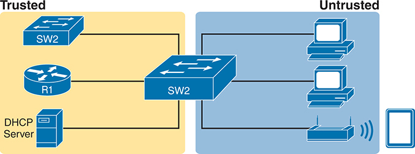


On the left side, representing the trusted network segment and highlighted in yellow, there is a switch labeled S W 2, a router labeled R 1, and a D H C P server that provides I P addresses to trusted devices. The right side of the image, representing the untrusted network segment and highlighted in blue, includes another switch labeled S W 2, several computers connected to this switch, and a wireless access point with an additional device connected wirelessly.

**Figure 12-1** *DHCP Snooping Basics: Client Ports Are Untrusted*

DHCP Snooping works first on all ports in a VLAN, but with each port being trusted or untrusted by DHCP Snooping. To understand why, consider this summary of the general rules used by DHCP Snooping. Note that the rules differentiate between messages normally sent by servers (like DHCPOFFER and DHCPACK) versus those normally sent by DHCP clients (DHCPDISCOVER and DHCPREQUEST):

* DHCP messages received on an [untrusted port](vol2_gloss.md#gloss_351), for messages normally sent by a server, will always be discarded.
* DHCP messages received on an untrusted port, as normally sent by a DHCP client, may be filtered if they appear to be part of an attack.
* DHCP messages received on a [trusted port](vol2_gloss.md#gloss_345) will be forwarded; trusted ports do not filter (discard) any DHCP messages.

##### A Sample Attack: A Spurious DHCP Server

To give you some perspective, [Figure 12-2](vol2_ch12.md#ch12fig02) shows a legitimate user's PC on the far right and the legitimate DHCP server on the far left. However, an attacker has connected a laptop to the LAN and started a DHCP attack by acting like a DHCP server. Following the steps in the figure, assume PC1 is attempting to lease an IP address while the attacker is making this attack:

1. PC1 sends a LAN broadcast with PC1's first DHCP message (DHCPDISCOVER).
2. The attacker's PC--acting as a spurious DHCP server--replies to the DHCPDISCOVER with a DHCPOFFER.

In this example, the DHCP server created and used by the attacker actually leases a useful IP address to PC1, in the correct subnet, with the correct mask. Why? The attacker wants PC1 to function, but with one twist. Notice the default gateway assigned to PC1: 10.1.1.2, which is the attacker's PC address, rather than 10.1.1.1, which is router R1's address. Now PC1 thinks it has all it needs to connect to the network, and it does--but now all the packets sent by PC1 to what it thinks is its default router flow first through the attacker's PC, creating a man-in-the-middle attack, as shown in [Figure 12-3](vol2_ch12.md#ch12fig03).

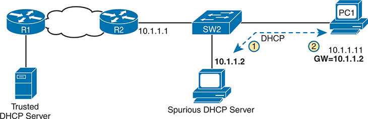


The network setup includes a trusted D H C P server connected to router R 1, which is connected to another router R 2 via a network cloud. R 2 connects to a switch labeled S W 2, which links to P C 1. A spurious D H C P server is also connected to the same switch (S W 2), indicating a potential attack. The process shows P C 1 sending a D H C P request, intercepted by the spurious D H C P server, which assigns the I P address 10 dot 1 dot 1 dot 2 with a gateway address of 10 dot 1 dot 1 dot 12 instead of the correct gateway 10 dot 1 dot 1 dot 1 from the trusted D H C P server.

**Figure 12-2** *DHCP Attack Supplies Good IP Address but Wrong Default Gateway*


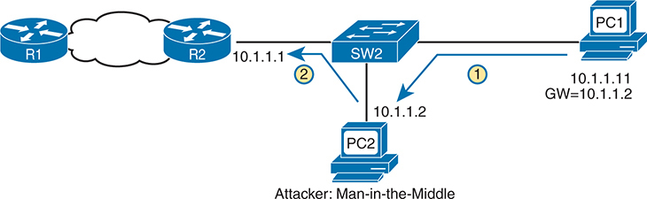


The network setup shows R 1 connected to R 2, R 2 connecting to switch S W 2, which links to P C 1, and an attacking computer, P C 2, connected to the same switch (S W 2), posing as a legitimate device. The process shows P C 1 sending a D H C P request, intercepted by P C 2 (the attacker), who assigns the I P address 10 dot 1 dot 1 dot 11 to P C 1 but sets the gateway to 10 dot 1 dot 1 dot 12, directing traffic through the attacker's computer.

**Figure 12-3** *Unfortunate Result: DHCP Attack Leads to Man-in-the-Middle*

Note that the legitimate DHCP also returns a DHCPOFFER message to host PC1, but most hosts use the first received DHCPOFFER, and the attacker will likely be first in this scenario.

The two steps in the figure show data flow once DHCP has completed. For any traffic destined to leave the subnet, PC1 sends its packets to its default gateway, 10.1.1.2, which happens to be the attacker. The attacker forwards the packets to R1. The PC1 user can connect to any and all applications just like normal, but now the attacker can keep a copy of anything sent by PC1.

##### DHCP Snooping Logic

The preceding example shows just one attack in which the attacker acts like a DHCP server (spurious DHCP server). DHCP Snooping defeats such attacks by making most ports untrusted, which by definition would filter the DHCP server messages that arrive on the untrusted ports. For instance, in [Figures 12-2](vol2_ch12.md#ch12fig02) and [12-3](vol2_ch12.md#ch12fig03), making the port connected to the attacker, a DHCP Snooping untrusted port defeats the attack.

To appreciate the broader set of DHCP Snooping rules and logic, it helps to have a handy reference of some of the more common DHCP messages and processes. For a quick review, the normal message flow includes this sequence: DISCOVER, OFFER, REQUEST, ACK (DORA). In particular:

* Clients send DISCOVER and REQUEST.
* Servers send OFFER and ACK.

Additionally, DHCP clients also use the DHCP RELEASE and DHCP DECLINE messages. When a client has a working lease for an address but no longer wants to use the address, the DHCP client can tell the DHCP server it no longer needs the address, releasing it back to the DHCP server, with the DHCP RELEASE message. Similarly, a client can send a DHCP DECLINE message to turn down the use of an IP address during the normal DORA flow on messages.

Now to the logic for DHCP Snooping untrusted ports. [Figure 12-4](vol2_ch12.md#ch12fig04) summarizes the ideas, with two switch ports. On the left, the switch port connects to a DHCP server, so it should be trusted; otherwise, DHCP would not work because the switch would filter all DHCP messages sent by the DHCP server. On the right, PC1 connects to an untrusted port with a DHCP client.

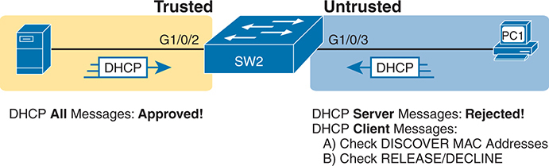


On the left side, within a yellow-shaded area labeled Trusted, there is a D H C P server connected to a switch port labeled G 1 slash 0 slash 2, with a D H C P message icon indicating D H C P All Messages: Approved! The right side, within a blue-shaded area labeled Untrusted, shows a computer labeled P C 1 connected to the switch port labeled G 1 slash 0 slash 3. This section features a D H C P message icon indicating that D H C P Server Messages: Rejected! and specifies checks for D H C P Client Messages, including A) checking DISCOVER M A C addresses and B) checking RELEASE slash DECLINE messages. The central switch labeled S W 2 connects these two segments.

**Figure 12-4** *Summary of Rules for DHCP Snooping*


The DHCP Snooping rules are as follows:


1. Examine all incoming DHCP messages.
2. If normally sent by servers, discard the message.
3. If normally sent by clients, filter as follows:

   1. For DISCOVER and REQUEST messages, check for MAC address consistency between the Ethernet frame and the DHCP message.
   2. For RELEASE or DECLINE messages, check the incoming interface plus IP address versus the DHCP Snooping binding table.
4. For messages allowed by DHCP Snooping, observe the details in the messages, and if they result in a DHCP lease, build a new entry to the DHCP Snooping binding table.

The next few pages complete the discussion of concepts by explaining a little more about steps 3 and 4 in the list.

##### Filtering DISCOVER Messages Based on MAC Address

DHCP Snooping does one straightforward check for the most common client-sent messages: DISCOVER and REQUEST. First, note that DHCP messages define the chaddr (client hardware address) field to identify the client. Hosts on LANs include the device's MAC address as part of chaddr. As usual, Ethernet hosts encapsulate the DHCP messages inside Ethernet frames, and those frames of course include a source MAC address--an address that should be the same MAC address used in the DHCP chaddr field. DHCP Snooping does a simple check to make sure those values match.

[Figure 12-5](vol2_ch12.md#ch12fig05) shows how an attacker could attempt to overload the DHCP server and lease all the addresses in the subnet. The attacker's PC uses pseudo MAC address A, so all three DISCOVER messages in the figure show a source Ethernet address of "A." However, each message (in the DHCP data) identifies a different MAC address in the chaddr value (shown as MAC1, MAC2, and MAC3 in the figure for brevity), so from a DHCP perspective, each message appears to be a different DHCP request. The attacker can attempt to lease every IP address in the subnet so that no other hosts could obtain a lease.

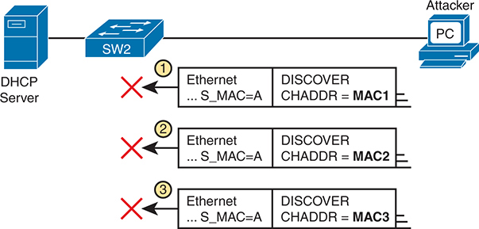


On the left, there is a D H C P server connected to a switch labeled S W 2. On the right, an attacker's computer labeled P C is also connected to the switch. Below these, three sequential network packets are depicted, each containing both Ethernet and D H C P DISCOVER headers. In each packet, the Ethernet header shows S underscore M A C equals A, indicating the source M A C address is 'A,' and the D H C P DISCOVER headers display different chaddr values: C H A D D R equals M A C 1, C H A D D R equals M A C 2, and C H A D D R equals M A C 3, respectively. Each packet is marked with a red X to indicate rejection. The numbers 1, 2, and 3 next to each packet highlight the sequence of checks performed by the switch to ensure the source M A C address matches the chaddr.

**Figure 12-5** *DHCP Snooping Checks chaddr and Ethernet Source MAC*

The core feature of DHCP Snooping defeats this type of attack on untrusted ports. It checks the Ethernet header source MAC address and compares that address to the MAC address in the DHCP header, and if the values do not match, DHCP Snooping discards the message.

##### Filtering Messages That Release IP Addresses

Before looking at the next bit of logic, you need to first understand the DHCP Snooping binding table.

DHCP Snooping builds the [DHCP Snooping binding table](vol2_gloss.md#gloss_110) for all the DHCP flows it sees that it allows to complete. That is, for any working legitimate DHCP flows, it keeps a list of some of the important facts. Then DHCP Snooping, and other features like Dynamic ARP Inspection, can use the table to make decisions.

As an example, consider [Figure 12-6](vol2_ch12.md#ch12fig06), which repeats the same topology as [Figure 12-4](vol2_ch12.md#ch12fig04), now with one entry in its DHCP Snooping binding table.

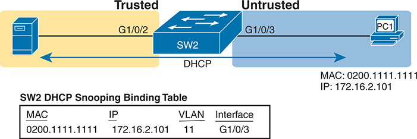


The network setup includes a switch labeled S W 2, which connects to two different zones: a Trusted zone on the left and an Untrusted zone on the right. In the Trusted zone, a server is connected to interface G 1 slash 0 slash 2 of S W 2. In the Untrusted zone, a P C labeled P C 1 is connected to interface G 1 slash 0 slash 3 of S W 2. The connection between the server and S W 2, and between P C 1 and S W 2, is highlighted with arrows indicating D H C P communication flow. The P C 1 has a Media Access Control (M A C) address of 0 2 0 0 dot 1 1 1 1 dot 1 1 1 1 and an Internet Protocol (I P) address of 172 dot 16 dot 2 dot 101. Below the diagram, there is a table titled S W 2 D H C P Snooping Binding Table which lists the details of the D H C P binding. The table includes four columns: M A C address, I P address, V L A N, and Interface. The entry shows the M A C address 0 2 0 0 dot 1 1 1 1 dot 1 1 1 1, the I P address 172 dot 16 dot 2 dot 101, V L A N 11, and Interface G 1 slash 0 slash 3, indicating that this binding entry has been created by D H C P snooping to associate the M A C address with the I P address and the specific V L A N and interface. The diagram illustrates the function of D H C P snooping in maintaining network security by ensuring that only legitimate D H C P clients receive I P addresses, thereby preventing D H C P spoofing attacks. The visual representation and accompanying table highlight the crucial elements of the D H C P snooping process and the details of the binding entry created for P C 1.

**Figure 12-6** *Legitimate DHCP Client with DHCP Binding Entry Built by DHCP Snooping*


In this simple network, the DHCP client on the right leases IP address 172.16.2.101 from the DHCP server on the left. The switch's DHCP Snooping feature combines the information from the DHCP messages, with information about the port (interface G1/0/3, assigned to VLAN 11 by the switch), and puts that in the DHCP Snooping binding table.

DHCP Snooping then applies additional filtering logic that uses the DHCP Snooping binding table: it checks client-sent messages like RELEASE and DECLINE that would cause the DHCP server to be allowed to release an address. For instance, a legitimate user might lease address 172.16.2.101, and at some point release the address back to the server; however, before the client has finished with its lease, an attacker could send a DHCP RELEASE message to release that address back into the pool. The attacker could then immediately try to lease that address, hoping the DHCP server assigns that same 172.16.2.101 address to the attacker.

[Figure 12-7](vol2_ch12.md#ch12fig07) shows an example. PC1 already has a DHCP address (172.16.2.101), with SW2 listing an entry in the DHCP Snooping binding table. The figure shows the action by which the attacker off port G1/0/5 attempts to release PC1's address. DHCP Snooping compares the incoming message, incoming interface, and matching table entry:

1. The attacker, PC A, sends a DHCP RELEASE message, received by switch SW2 in port G1/0/5. The message attempts to DHCP RELEASE address 172.16.2.101.
2. Switch SW2 compares the DHCP Snooping binding table to find the entry matching the listed address: 172.16.2.101.
3. Switch SW2 notes that the binding table lists the legitimate entry with port G1/0/3, but the new DHCP RELEASE arrived in port G1/0/5. As a result, DHCP Snooping discards the DHCP RELEASE message.

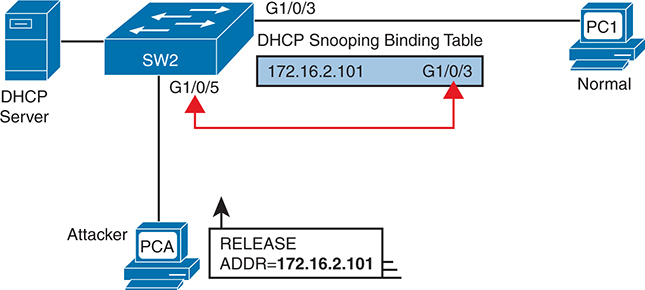


The diagram includes a D H C P Server connected to a switch labeled S W 2, which has multiple interfaces. Interface G 1 slash 0 slash 3 of S W 2 is connected to a legitimate client device labeled P C 1, which is indicated as Normal. This interface has an associated D H C P Snooping Binding Table entry with the I P address 172 dot 16 dot 2 dot 101. An attacker device, labeled P C A, is connected to interface G 1 slash 0 slash 5 of the same switch. The attacker attempts to release the I P address 172 dot 16 dot 2 dot 101, as indicated by the D H C P Release message shown in the diagram. However, due to D H C P snooping, the binding table on S W 2 identifies the correct mapping of I P addresses to legitimate interfaces, preventing the attacker's release message from affecting the legitimate client. The diagram uses arrows to indicate the flow of the D H C P Release message from the attacker device P C A to the switch S W 2 and highlights the binding table's role in maintaining the correct I P-to-interface mapping. This setup illustrates the protective mechanism of D H C P snooping, which ensures that only authorized D H C P messages from known devices on specific interfaces are accepted, effectively mitigating D H C P-related attacks such as unauthorized I P release attempts.

**Figure 12-7** *DHCP Snooping Defeats a DHCP RELEASE from Another Port*

#### DHCP Snooping Configuration

DHCP Snooping requires several configuration steps to make it work. First, you need to use a pair of associated global commands: one to enable DHCP Snooping and another to list the VLANs on which to use DHCP Snooping. Both must be included for DHCP Snooping to operate.

Second, while not literally required, you will often need to configure a few ports as trusted ports. Most switches that use DHCP Snooping for a VLAN have some trusted ports and some untrusted ports, and with a default of untrusted, you need to configure the trusted ports.

This section begins with an example that shows how to configure a typical Layer 2 switch to use DHCP Snooping, with required commands as just described, and with other optional commands.

##### Configuring DHCP Snooping on a Layer 2 Switch

The upcoming examples all rely on the topology illustrated in [Figure 12-8](vol2_ch12.md#ch12fig08), with Layer 2 switch SW2 as the switch on which to enable DHCP Snooping. The DHCP server sits on the other side of the WAN, on the left of the figure. As a result, SW2's port connected to router R2 (a DHCP relay agent) needs to be trusted. On the right, two sample PCs can use the default untrusted setting.

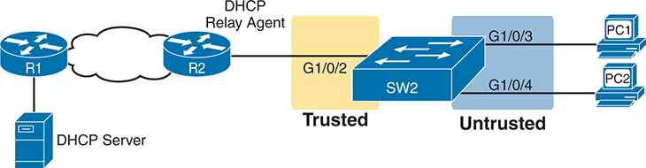


On the left side, the network starts with a D H C P server connected to a router labeled R 1. This connection is shown linking through a network cloud, symbolizing the broader network connectivity to another router labeled R 2. Router R 2 acts as a D H C P relay agent and is connected to a switch labeled S W 2 via interface G 1 slash 0 slash 2, which is marked as Trusted. The trusted link signifies that it can be trusted to receive D H C P server messages. The switch S W 2 has two other interfaces, G 1 slash 0 slash 3 and G 1 slash 0 slash 4, which are labeled as Untrusted, indicating they should only receive D H C P client requests. Connected to these untrusted interfaces are two P C s, labeled P C 1 and P C 2. The P C s are connected to the network through the untrusted interfaces on the switch S W 2, emphasizing their role as D H C P clients. The trusted connection from router R 2 ensures that only verified D H C P server messages are relayed through to the switch, while the untrusted ports are monitored for potential D H C P spoofing activities. This setup highlights the critical components involved in a D H C P snooping configuration, where S W 2 serves as a crucial point for differentiating between trusted and untrusted sources within the network, protecting against malicious D H C P traffic and ensuring proper assignment of I P addresses to the clients (P C 1 and P C 2) connected to the network.

**Figure 12-8** *Sample Network Used in DHCP Snooping Configuration Examples*

Switch SW2 places all the ports in the figure in VLAN 11. To enable DHCP Snooping in VLAN 11, SW2 requires two commands, as shown near the top of [Example 12-1](vol2_ch12.md#exa12_1): **ip dhcp snooping** and **ip dhcp snooping vlan 11**. Then, to change the logic on port G1/0/2 (connected to the router) to be trusted, the configuration includes the **ip dhcp snooping trust** interface subcommand.

**Example 12-1** *DHCP Snooping Configuration to Match [Figure 12-8](vol2_ch12.md#ch12fig08)*


[Click here to view code image](vol2_ch12_images.md#f0246-01)

```
ip dhcp snooping
ip dhcp snooping vlan 11
no ip dhcp snooping information option
!
interface GigabitEthernet1/0/2
 ip dhcp snooping trust
```

Note that the **no ip dhcp snooping information option** command in [Example 12-1](vol2_ch12.md#exa12_1) will be explained in a better context just after [Example 12-2](vol2_ch12.md#exa12_2) but is listed in [Example 12-1](vol2_ch12.md#exa12_1) to make the example complete.

With this configuration, the switch follows the logic steps detailed in the earlier section titled "[DHCP Snooping Logic](vol2_ch12.md#ch12lev3sec2)." To see some support for that claim, look at [Example 12-2](vol2_ch12.md#exa12_2), which shows the output from the **show ip dhcp snooping** command on switch SW2.

**Example 12-2** *SW2 DHCP Snooping Status*

[Click here to view code image](vol2_ch12_images.md#f0247-01)

```
SW2# show ip dhcp snooping
Switch DHCP snooping is enabled
Switch DHCP gleaning is disabled
DHCP snooping is configured on following VLANs:
11
DHCP snooping is operational on following VLANs:
11
Smartlog is configured on following VLANs:
none
Smartlog is operational on following VLANs:
none
DHCP snooping is configured on the following L3 Interfaces:

Insertion of option 82 is disabled
   circuit-id default format: vlan-mod-port
   remote-id: bcc4.938b.a180 (MAC)
Option 82 on untrusted port is not allowed
Verification of hwaddr field is enabled
Verification of giaddr field is enabled
DHCP snooping trust/rate is configured on the following Interfaces:

Interface                  Trusted    Allow option    Rate limit (pps)
-----------------------    -------    ------------    ----------------
GigabitEthernet1/0/2       yes        yes             unlimited
  Custom circuit-ids:
```

The highlighted lines in the example point out a few of the key configuration settings. Starting at the top, the first two confirm the configuration of the **ip dhcp snooping** and **ip dhcp snooping vlan 11** commands, respectively. Also, the highlighted lines at the bottom of the output show a section that lists trusted ports--in this case, only port G1/0/2.

Also, you might have noticed that highlighted line in the middle that states **Insertion of option 82 is disabled**. That line confirms the addition of the **no ip dhcp information option** command to the configuration back in [Example 12-1](vol2_ch12.md#exa12_1). To understand why the example includes this command, consider these facts about DHCP relay agents:

* DHCP relay agents add new fields to DHCP requests--defined as option 82 DHCP header fields (in RFC 3046).
* DHCP Snooping uses default settings that work well if the switch acts as a Layer 3 switch and as a DHCP relay agent, meaning that the switch should insert the DHCP option 82 fields into DHCP messages. In effect, the switch defaults to use **ip dhcp snooping information option**.
* When the switch does not also act as a DHCP relay agent, the default setting stops DHCP from working for end users. The switch sets fields in the DHCP messages as if it were a DHCP relay agent, but the changes to those messages cause most DHCP servers (and most DHCP relay agents) to ignore the received DHCP messages.
* The conclusion: To make DHCP Snooping work on a switch that is not also a DHCP relay agent, and to avoid the problem of preventing legitimate DHCP leases, disable the option 82 feature using the **no ip dhcp snooping information option** global command.

That concludes the DHCP Snooping configuration that is both required and that you will most often need to make the feature work. The rest of this section discusses a few optional DHCP Snooping features.

##### Limiting DHCP Message Rates

Knowing that DHCP Snooping prevents their attacks, what might attackers do in response? Devise new attacks, including attacking DHCP Snooping itself.

One way to attack DHCP Snooping takes advantage of the fact that it uses the general-purpose CPU in a switch. Knowing that, attackers can devise attacks to generate large volumes of DHCP messages in an attempt to overload the DHCP Snooping feature and the switch CPU itself. The goal can be as a simple denial-of-service attack or a combination of attacks that might cause DHCP Snooping to fail to examine every message, allowing other DHCP attacks to then work.

To help prevent this kind of attack, DHCP Snooping includes an optional feature that tracks the number of incoming DHCP messages. If the number of incoming DHCP messages exceeds that limit over a one-second period, DHCP Snooping treats the event as an attack and moves the port to an err-disabled state. Also, the feature can be enabled both on trusted and untrusted interfaces.

Although rate limiting DHCP messages can help, placing the port in an err-disabled state can itself create issues. As a reminder, once in the err-disabled state, the switch will not send or receive frames for the interface. However, the err-disabled state might be too severe an action because the default recovery action for an err-disabled state requires the configuration of a **shutdown** and then a **no shutdown** subcommand on the interface.

To help strike a better balance, you can enable DHCP Snooping rate limiting and then also configure the switch to automatically recover from the port's err-disabled state, without the need for a **shutdown** and then **no shutdown** command.

[Example 12-3](vol2_ch12.md#exa12_3) shows how to enable DHCP Snooping rate limits and err-disabled recovery. First, look at the lower half of the configuration, to the interfaces, to see the straightforward setting of the per-interface limits using the **ip dhcp snooping rate limit** *number* interface subcommands. The top of the configuration uses two global commands to tell IOS to recover from an err-disabled state if it is caused by DHCP Snooping, and to use a nondefault number of seconds to wait before recovering the interface. Note that the configuration in [Example 12-3](vol2_ch12.md#exa12_3) would rely on the core configuration for DHCP Snooping as shown in [Example 12-1](vol2_ch12.md#exa12_1).

**Example 12-3** *Configuring DHCP Snooping Message Rate Limits*

[Click here to view code image](vol2_ch12_images.md#f0249-01)

```
errdisable recovery cause dhcp-rate-limit
errdisable recovery interval 30
!
interface GigabitEthernet1/0/2
 ip dhcp snooping limit rate 10
!
interface GigabitEthernet1/0/3
 ip dhcp snooping limit rate 2
```

A repeat of the **show ip dhcp snooping** command now shows the rate limits near the end of the output, as noted in [Example 12-4](vol2_ch12.md#exa12_4).

**Example 12-4** *Confirming DHCP Snooping Rate Limits*

[Click here to view code image](vol2_ch12_images.md#f0249-02)

```
SW2# show ip dhcp snooping
! Lines omitted for brevity

Interface                  Trusted    Allow option    Rate limit (pps)
-----------------------    -------    ------------    ----------------
GigabitEthernet1/0/2       yes        yes             10
  Custom circuit-ids:
GigabitEthernet1/0/3       no         no              2
  Custom circuit-ids:
```

##### DHCP Snooping Configuration Summary

The following configuration checklist summarizes the commands included in this section about how to configure DHCP Snooping.

Step 1. Configure this pair of commands (both required):


1. Use the **ip dhcp snooping** global command to enable DHCP Snooping on the switch.
2. Use the **ip dhcp snooping vlan** *vlan-list* global command to identify the VLANs on which to use DHCP Snooping.

Step 2. **(Optional):** Use the **no ip dhcp snooping information option** global command on Layer 2 switches to disable the insertion of DHCP Option 82 data into DHCP messages, specifically on switches that do not act as a DHCP relay agent.

Step 3. Configure the **ip dhcp snooping trust** interface subcommand to override the default setting of not trusted.

Step 4. **(Optional):** Configure DHCP Snooping rate limits and err-disabled recovery:

Step A. **(Optional):** Configure the **ip dhcp snooping limit rate** *number* interface subcommand to set a limit of DHCP messages per second.

Step B. **(Optional):** Configure the **no ip dhcp snooping limit rate** *number* interface subcommand to remove an existing limit and reset the interface to use the default of no rate limit.

Step C. **(Optional):** Configure the **errdisable recovery cause dhcp-rate-limit** global command to enable the feature of automatic recovery from err-disabled mode, assuming the switch placed the port in err-disabled state because of exceeding DHCP Snooping rate limits.

Step D. **(Optional):** Configure the **errdisable recovery interval** *seconds* global commands to set the time to wait before recovering from an interface err-disabled state (regardless of the cause of the err-disabled state).

### Dynamic ARP Inspection

The [Dynamic ARP Inspection (DAI)](vol2_gloss.md#gloss_124) feature on a switch examines incoming ARP messages on untrusted ports to filter those it believes to be part of an attack. DAI's core feature compares incoming ARP messages with two sources of data: the DHCP Snooping binding table and any configured ARP ACLs. If the incoming ARP message does not match the tables in the switch, the switch discards the ARP message.

This section follows the same sequence as with the DHCP Snooping section, first examining the concepts behind DAI and ARP attacks, and then showing how to configure DAI with both required and optional features.

#### DAI Concepts

To understand the attacks DAI can prevent, you need to be ready to compare normal ARP operations with the abnormal use of ARP used in some types of attacks. This section uses that same flow, first reviewing a few important ARP details, and then showing how an attacker can just send an [ARP reply](vol2_gloss.md#gloss_040)--called a [gratuitous ARP](vol2_gloss.md#gloss_157)--triggering hosts to add incorrect ARP entries to their ARP tables.

##### Review of Normal IP ARP

If all you care about is how ARP works normally, with no concern about attacks, you can think of ARP to the depth shown in [Figure 12-9](vol2_ch12.md#ch12fig09). The figure shows a typical sequence. Host PC1 needs to send an IP packet to its default router (R2), so PC1 first sends an ARP request message in an attempt to learn the MAC address associated with R2's 172.16.2.2 address. Router R2 sends back an ARP reply, listing R2's MAC address (note the figure shows pseudo MAC addresses to save space).

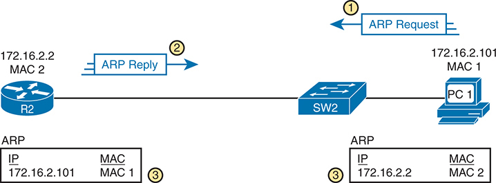


Starting from the right, P C 1 is shown with the I P address 172 dot 16 dot 2 dot 101 and M A C address M A C 1. It is connected to a network switch labeled S W 2. To the left of S W 2, the router R 2 is displayed with the I P address 172 dot 16 dot 2 dot 2 and M A C address M A C 2. The sequence of A R P communication is marked with three numbered steps. In step 1, P C 1 sends an A R P request, which is represented by a blue arrow pointing towards R 2. This request is to resolve the M A C address corresponding to the I P address 172 dot 16 dot 2 dot 2. In step 2, R 2 responds with an A R P reply, indicated by a blue arrow pointing back to P C 1. This reply contains the M A C address M A C 2 associated with the I P address 172 dot 16 dot 2 dot 2. The A R P table updates following this communication are shown at the bottom of the diagram in two separate boxes. The A R P table for P C 1 includes an entry with the I P address 172 dot 16 dot 2 dot 2 mapped to M A C address M A C 2. Similarly, the A R P table for R 2 includes an entry with the I P address 172 dot 16 dot 2 dot 101 mapped to M A C address M A C 1. Each A R P table is marked with the number 3, indicating the final step of the A R P process, where both devices update their tables with the newly acquired A R P information. The diagram uses standard network symbols to represent the P C, switch, and router, with directional arrows and labels to clearly illustrate the flow of A R P requests and replies. The A R P tables provide a visual representation of the final state of each device's A R P cache, showing the resolved I P-to-M A C address mappings.

**Figure 12-9** *Legitimate ARP Tables After PC1 DHCP and ARP with Router R2*

The ARP tables at the bottom of the figure imply an important fact: both hosts learn the other host's MAC address with this two-message flow. Not only does PC1 learn R2's MAC address based on the ARP reply (message 2), but router R2 learns PC1's IP and MAC address because of the ARP request (message 1). To see why, take a look at the more detailed view of those messages as shown in [Figure 12-10](vol2_ch12.md#ch12fig10).

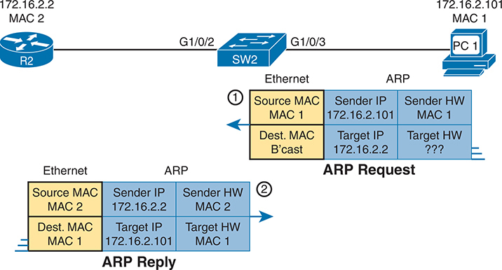


At the top of A diagram, there is a network segment with a router labeled R 2 on the left, identified by I P address 172 dot 16 dot 2 dot 2 and M A C address M A C 2. The router is connected via Ethernet to a switch labeled S W 2 through interface G 1 slash 0 slash 2. The switch is then connected to a personal computer labeled P C 1 on the right, with I P address 172 dot 16 dot 2 dot 101 and M A C address M A C 1, via interface G 1 slash 0 slash 3. The A R P process is depicted in two steps: the A R P Request and the A R P Reply. In the A R P Request step, shown with a label 1 in a circled number, the Ethernet frame includes a source M A C address M A C 1 and a destination M A C address set to broadcast (B'cast). The A R P packet within this frame contains the sender's hardware address (M A C 1) and I P address (172 dot 16 dot 2 dot 101), but the target hardware address is unknown (question marks), while the target I P address is 172 dot 16 dot 2 dot 2. In the A R P Reply step, labeled 2 in a circled number, the Ethernet frame now includes a source M A C address M A C 2 and a destination M A C address M A C 1. The A R P packet within this frame contains the sender's hardware address (M A C 2) and I P address (172 dot 16 dot 2 dot 2), as well as the target hardware address (M A C 1) and I P address (172 dot 16 dot 2 dot 101). This diagram effectively illustrates the process by which a device on the network (P C 1) determines the hardware address associated with an I P address (172 dot 16 dot 2 dot 2) through an A R P request and the subsequent reply from the router (R 2) providing the necessary M A C address information (M A C 2).

**Figure 12-10** *A Detailed Look at ARP Request and Reply*


The ARP messages define four related fields: the [sender hardware address](vol2_gloss.md#gloss_299), [sender protocol address](vol2_gloss.md#gloss_301), target hardware address, and target protocol address. Those terms use general wording, but the word hardware refers to MAC addresses and the word protocol refers to IP. So, you should expect to see many descriptions about ARP that use similar terms like sender MAC address and [sender IP address](vol2_gloss.md#gloss_300).

The sender fields of every ARP message list the sending device's IP address and MAC, no matter whether the message is an ARP reply or ARP request. For instance, message 1 in the figure, sent by PC1, lists PC1's IP and MAC addresses in the sender fields, which is why router R2 could learn that information. PC1 likewise learns of R2's MAC address per the sender address fields in the ARP reply.

##### Gratuitous ARP as an Attack Vector

Normally, a host uses ARP when it knows the IP address of another host and wants to learn that host's MAC address. However, for legitimate reasons, a host might also want to inform all the hosts in the subnet about its MAC address. That might be useful when a host changes its MAC address, for instance. So, ARP supports the idea of a gratuitous ARP message with these features:


* It is an ARP reply.
* It is sent without having first received an ARP request.
* It is sent to an Ethernet destination broadcast address so that all hosts in the subnet receive the message.

For instance, if a host's MAC address is MAC A, and it changes to MAC B, to cause all the other hosts to update their ARP tables, the host could send a gratuitous ARP that lists a sender MAC of MAC B.

Attackers can take advantage of gratuitous ARPs because they let the sending host make other hosts change their ARP tables. [Figure 12-11](vol2_ch12.md#ch12fig11) shows just such an example initiated by PC A (an attacker) with a gratuitous ARP. However, this ARP lists PC1's IP address but a different device's MAC address (PC A) at step 1, causing the router to update its ARP table (step 2).

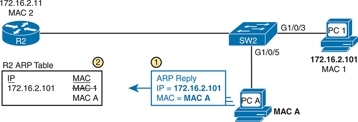


The setup includes a router labeled R 2 on the left, connected to a switch labeled S W 2, which in turn connects to two devices: P C 1 on interface G 1 slash 0 slash 3 and a malicious device labeled P C A on interface G 1 slash 0 slash 5. P C 1, located at the top right, has an I P address of 172 dot 16 dot 2 dot 101 and a M A C address labeled M A C 1. P C A, positioned below P C 1, has a M A C address labeled M A C A. The diagram shows an A R P reply message originating from P C A (step 1), stating I P equals 172 dot 16 dot 2 dot 101, M A C equals M A C A. This A R P reply is directed towards Router R 2, which updates its A R P table based on this information. As a result, the A R P table on Router R 2 incorrectly associates the I P address 172 dot 16 dot 2 dot 101 with M A C A instead of the correct M A C 1 (step 2). This manipulation is highlighted with two circular numbered steps indicating the sequence of events. The A R P table on R 2 shows the incorrect entry: I P 172 dot 16 dot 2 dot 101, M A C M A C A.

**Figure 12-11** *Nefarious Use of ARP Reply Causes Incorrect ARP Data on R2*

At this point, when R2 forwards IP packets to PC1's IP address (172.16.2.101), R2 will encapsulate them in an Ethernet frame with PC A as the destination rather than with PC1's MAC address. At first, this might seem to stop PC1 from working, but instead it could be part of a man-in-the-middle attack so that PC A can copy every message. [Figure 12-12](vol2_ch12.md#ch12fig12) shows the idea of what happens at this point:

1. PC1 sends messages to some server on the left side of router R2.
2. The server replies to PC1's IP address, but R2 forwards that packet to PC A's MAC address, rather than to PC1.
3. PC A copies the packet for later processing.
4. PC A forwards the packet inside a new frame to PC1 so that PC1 still works.

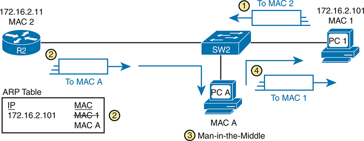


The network diagram features a switch labeled S W 2 connected to multiple devices. On the right side, there is a legitimate device labeled P C 1 with an I P address 172 dot 16 dot 2 dot 10 and M A C address M A C 1. On the left side, a router labeled R 2 is connected with an I P address 172 dot 16 dot 2 dot 11 and M A C address M A C 2. In the center, a malicious device labeled P C A, associated with the attacker, is connected to the switch and has a M A C address M A C A. The A R P table is shown at the bottom left, indicating an entry for the I P address 172 dot 16 dot 2 dot 101, which is mapped to multiple M A C addresses: M A C 1, M A C 2, and M A C A, highlighting the confusion created by the attack. The diagram uses numbered steps to depict the sequence of the attack. P C A sends a Gratuitous A R P message to S W 2, falsely associating its M A C address (M A C A) with the I P address 172 dot 16 dot 2 dot 101. The switch updates its A R P table to reflect the new (and incorrect) association, mapping I P 172 dot 16 dot 2 dot 101 to M A C A. This results in P C A being in the middle of communications between P C 1 and R 2, intercepting traffic meant for both. Traffic intended for M A C 1 (P C 1) or M A C 2 (R 2) is redirected to M A C A (P C A), allowing the attacker to capture and potentially manipulate data. This diagram effectively demonstrates the vulnerability in A R P protocol that can be exploited by sending Gratuitous A R P messages, leading to M I T M attacks. The visual representation includes all devices involved, their I P and M A C addresses, and the step-by-step process of how the attack is executed, providing a clear understanding of the mechanics behind this type of network security breach.

**Figure 12-12** *Man-in-the-Middle Attack Resulting from Gratuitous ARP*

##### Dynamic ARP Inspection Logic

DAI has a variety of features that can prevent these kinds of ARP attacks. To understand how, consider the sequence of a typical client host with regards to both DHCP and ARP. When a host does not have an IP address yet--that is, before the DHCP process completes--it does not need to use ARP. Once the host leases an IP address and learns its subnet mask, it needs to use ARP to learn the MAC addresses of other hosts or the default router in the subnet, so it sends some ARP messages. In short, DHCP happens first, then ARP.

DAI takes an approach for untrusted interfaces that confirms an ARP's correctness based on DHCP Snooping's data about the earlier DHCP messages. The correct normal DHCP messages list the IP address leased to a host as well as that host's MAC address. The DHCP Snooping feature also records those facts into the switch's DHCP Snooping binding table.

For any DAI untrusted ports, DAI compares the ARP message's sender IP and sender MAC address fields to the DHCP Snooping binding table. If found in the table, DAI allows the ARP through, but if not, DAI discards the ARP. For instance, [Figure 12-13](vol2_ch12.md#ch12fig13) shows step 1 in which the attacker at PC A attempts the gratuitous ARP shown earlier in [Figure 12-11](vol2_ch12.md#ch12fig11). At step 2, DAI makes a comparison to the DHCP Snooping binding table, not finding a match with MAC A along with IP address 172.16.2.101, so DAI would discard the message.

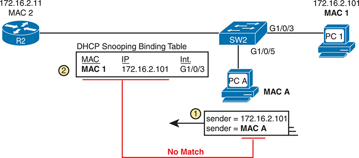


On the left side, a router labeled R 2 is connected to a switch labeled S W 2 via interface G 1 slash 0 slash 3. The network includes two P C s, labeled P C 1 and P C A, connected to switch S W 2 through interfaces G 1 slash 0 slash 3 and G 1 slash 0 slash 5, respectively. P C 1 has the I P address 172 dot 16 dot 2 dot 101 and the M A C address M A C 1, while P C A has the I P address 172 dot 16 dot 2 dot 110 and the M A C address M A C A. The D H C P snooping binding table within switch S W 2 stores an entry mapping M A C 1 to I P 172 dot 16 dot 2 dot 101 and interface G 1 slash 0 slash 3. The diagram highlights an A R P message sent by P C A, where the sender's I P address is 172 dot 16 dot 2 dot 101, but the sender's M A C address is M A C A. This A R P message is scrutinized against the D H C P snooping binding table by switch S W 2. The binding table does not match the sender's M A C address (M A C A) with the stored M A C address (M A C 1) for the I P address 172 dot 16 dot 2 dot 101. Consequently, the switch marks the A R P message as No Match and filters it out, thereby preventing potential A R P spoofing. This image effectively illustrates the role of D A I in enhancing network security by validating A R P messages against the D H C P snooping binding table to ensure that the M A C and I P addresses align with the recorded bindings, protecting the network from malicious A R P spoofing attacks.

**Figure 12-13** *DAI Filtering ARP Based on DHCP Snooping Binding Table*


DAI also works with a concept of trusted and untrusted ports, with the logic generally matching the logic used with DHCP Snooping. Ports connected to local DHCP clients can remain in the default DAI untrusted state. Configure all other switch ports as trusted for DAI.

Note that although DAI can use the DHCP Snooping table as shown here, it can also use similar statically configured data that lists correct pairs of IP and MAC addresses via a tool called *ARP ACLs*. Using ARP ACLs with DAI becomes useful for ports connected to devices that use static IP addresses rather than DHCP. Note that DAI looks for both the DHCP Snooping binding data and ARP ACLs.

Beyond that core feature, note that DAI can optionally perform other checks as well. For instance, the Ethernet header that encapsulates the ARP should have addresses that match the ARP sender and target MAC addresses. [Figure 12-14](vol2_ch12.md#ch12fig14) shows an example of the comparison of the Ethernet source MAC address and the ARP message sender hardware field.


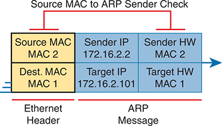


The diagram is divided into two main sections: the Ethernet Header and the A R P Message. The Ethernet Header contains the Source M A C address (M A C 2) and the Destination M A C address (M A C 1). The A R P Message section is further divided into four fields: Sender I P address (172 dot 16 dot 2 dot 2), Sender Hardware (H W) address (M A C 2), Target I P address (172 dot 16 dot 2 dot 101), and Target Hardware (H W) address (M A C 1). At the top of the diagram, a red arrow labeled Source M A C to A R P Sender Check indicates the verification process performed by the D A I. This check ensures that the Source M A C address in the Ethernet Header (M A C 2) matches the Sender Hardware address in the A R P Message (also M A C 2). The purpose of this check is to detect and prevent A R P spoofing attacks by validating the integrity of the A R P request or reply. The diagram uses color-coding to distinguish between the Ethernet Header and A R P Message fields, with a blue arrow on the right side representing the direction of the A R P message flow. The labels and layout clearly show the relationship between the Ethernet frame's M A C addresses and the corresponding fields within the A R P message, highlighting the critical points where D A I filtering checks are applied.

**Figure 12-14** *DAI Filtering Checks for Source MAC Addresses*

DAI can be enabled to make the comparisons shown in the figure, discarding these messages:

* Messages with an Ethernet header source MAC address that is not equal to the ARP sender hardware (MAC) address
* ARP reply messages with an Ethernet header destination MAC address that is not equal to the ARP target hardware (MAC) address
* Messages with unexpected IP addresses in the two ARP IP address fields

Finally, like DHCP Snooping, DAI does its work in the switch CPU rather than in the switch ASIC, meaning that DAI itself can be more susceptible to DoS attacks. The attacker could generate large numbers of ARP messages, driving up CPU usage in the switch. DAI can avoid these problems through rate limiting the number of ARP messages on a port over time.

#### Dynamic ARP Inspection Configuration

Configuring DAI requires just a few commands, with the usual larger variety of optional configuration settings. This section examines DAI configuration, first with mostly default settings and with reliance on DHCP Snooping. It then shows a few of the optional features, like rate limits, automatic recovery from err-disabled state, and how to enable additional checks of incoming ARP messages.

##### Configuring ARP Inspection on a Layer 2 Switch

Before configuring DAI, you need to think about the feature and make a few decisions based on your goals, topology, and device roles. The decisions include the following:

* Choose whether to rely on DHCP Snooping, ARP ACLs, or both.
* If using DHCP Snooping, configure it and make the correct ports trusted for DHCP Snooping.
* Choose the VLAN(s) on which to enable DAI.
* Make DAI trusted (rather than the default setting of untrusted) on select ports in those VLANs, typically for the same ports you trusted for DHCP Snooping.

All the configuration examples in this section use the same sample network used in the DHCP Snooping configuration topics, repeated here as [Figure 12-15](vol2_ch12.md#ch12fig15). Just as with DHCP Snooping, switch SW2 on the right should be configured to trust the port connected to the router (G1/0/2), but not trust the two ports connected to the PCs.


On the far left, there is a D H C P server connected to a router labeled R 1. This router is connected to another router labeled R 2 through an intermediary cloud symbolizing the wider network or internet. The router R 2 acts as a D H C P relay agent and is connected via Ethernet interface G 1 slash 0 slash 2 to a switch labeled S W 2. The area connecting router R 2 to the switch is marked as Trusted. The switch S W 2 is connected via Ethernet interfaces G 1 slash 0 slash 3 and G 1 slash 0 slash 4 to two personal computers labeled P C 1 and P C 2, respectively. This segment is labeled Untrusted. The trusted and untrusted zones indicate areas of the network with different levels of security or trust, which is crucial in A R P inspection configuration to prevent A R P spoofing attacks. The trusted segment allows A R P traffic from known, secure sources, while the untrusted segment is monitored more rigorously to prevent malicious A R P packets from compromising network security. This network setup effectively demonstrates the separation of trusted and untrusted zones and the role of various network components, including the D H C P server, routers, switch, and P C s, in A R P inspection configuration.

**Figure 12-15** *Sample Network Used in ARP Inspection Configuration Examples*

[Example 12-5](vol2_ch12.md#exa12_5) shows the required configuration to enable DAI on switch SW2 in [Figure 12-15](vol2_ch12.md#ch12fig15)--a configuration that follows a similar progression compared to DHCP Snooping. All ports in the figure connect to VLAN 11, so to enable DAI in VLAN 11, just add the **ip arp inspection vlan 11** global command. Then, to change the logic on port G1/0/2 (connected to the router) to be trusted by DAI, add the **ip arp inspection trust** interface subcommand.

**Example 12-5** *IP ARP Inspection Configuration to Match [Figure 12-15](vol2_ch12.md#ch12fig15)*

[Click here to view code image](vol2_ch12_images.md#f0255-01)

```
ip arp inspection vlan 11
!
interface GigabitEthernet1/0/2
 ip arp inspection trust
```

[Example 12-5](vol2_ch12.md#exa12_5) configures DAI, but it omits both DHCP Snooping and ARP ACLs. (If you were to configure a switch only with commands shown in [Example 12-5](vol2_ch12.md#exa12_5), the switch would filter all ARPs entering all untrusted ports in VLAN 11.) [Example 12-6](vol2_ch12.md#exa12_6) shows a complete and working DAI configuration that adds the DHCP Snooping configuration to match the DAI configuration in [Example 12-5](vol2_ch12.md#exa12_5). Note that [Example 12-6](vol2_ch12.md#exa12_6) combines [Example 12-1](vol2_ch12.md#exa12_1)'s earlier DHCP Snooping configuration for this same topology to the DAI configuration just shown in [Example 12-5](vol2_ch12.md#exa12_5), with highlights for the DAI-specific configuration lines.


**Example 12-6** *IP DHCP Snooping Configuration Added to Support DAI*

[Click here to view code image](vol2_ch12_images.md#f0255-02)

```
ip arp inspection vlan 11
ip dhcp snooping
ip dhcp snooping vlan 11
no ip dhcp snooping information option
!
interface GigabitEthernet1/0/2
 ip dhcp snooping trust
 ip arp inspection trust
```

Remember, DHCP occurs first with DHCP clients, and then they send ARP messages. With the configuration in [Example 12-6](vol2_ch12.md#exa12_6), the switch builds its DHCP Snooping binding table by analyzing incoming DHCP messages. Next, any incoming ARP messages on DAI untrusted ports must have matching information in that binding table.

[Example 12-7](vol2_ch12.md#exa12_7) confirms the key facts about correct DAI operation in this sample network based on the configuration in [Example 12-6](vol2_ch12.md#exa12_6). The **show ip arp inspection** command gives both configuration settings along with status variables and counters. For instance, the highlighted lines show the total ARP messages received on untrusted ports in that VLAN and the number of dropped ARP messages (currently 0).

**Example 12-7** *SW2 IP ARP Inspection Status*

[Click here to view code image](vol2_ch12_images.md#f0256-01)

```
SW2# show ip arp inspection

Source Mac Validation      : Disabled
Destination Mac Validation : Disabled
IP Address Validation      : Disabled

 Vlan     Configuration    Operation   ACL Match          Static ACL
 ----     -------------    ---------   ---------          ----------
   11     Enabled          Active

 Vlan     ACL Logging      DHCP Logging      Probe Logging
 ----     -----------      ------------      -------------
   11     Deny             Deny              Off

 Vlan      Forwarded        Dropped     DHCP Drops      ACL Drops
 ----      ---------        -------     ----------      ---------
   11             59              0              0              0

 Vlan   DHCP Permits    ACL Permits  Probe Permits   Source MAC Failures
 ----   ------------    -----------  -------------   -------------------
   11              7              0             49                     0

 Vlan   Dest MAC Failures   IP Validation Failures   Invalid Protocol Data
 ----   -----------------   ----------------------   ---------------------

 Vlan   Dest MAC Failures   IP Validation Failures   Invalid Protocol Data
 ----   -----------------   ----------------------   ---------------------
   11                   0                        0                       0
SW2# show ip dhcp snooping binding
MacAddress         IpAddress      Lease(sec) Type           VLAN  Interface
-----------------  -------------  ---------- -------------  ----  --------------------
02:00:11:11:11:11  172.16.2.101   86110      dhcp-snooping    11  GigabitEthernet1/0/3
02:00:22:22:22:22  172.16.2.102   86399      dhcp-snooping    11  GigabitEthernet1/0/4
Total number of bindings: 2
```

The end of [Example 12-7](vol2_ch12.md#exa12_7) shows an example of the **show ip dhcp snooping binding** command on switch SW2. Note that the first two columns list a MAC and IP address as learned from the DHCP messages. Then, imagine an ARP message arrives from PC1, a message that should list PC1's 0200.1111.1111 MAC address and 172.16.2.101 as the sender MAC and IP address, respectively. Per this output, the switch would find that matching data and allow the ARP message.

[Example 12-8](vol2_ch12.md#exa12_8) shows some detail of what happens when switch SW2 receives an invalid ARP message on port G1/0/4 in [Figure 12-15](vol2_ch12.md#ch12fig15). In this case, to create the invalid ARP message, PC2 in the figure was configured with a static IP address of 172.16.2.101 (which is PC1's DHCP-leased IP address). The highlights in the log message at the top of the example show PC2's claimed sender MAC and sender IP addresses in the ARP message. If you refer back to the bottom of [Example 12-7](vol2_ch12.md#exa12_7), you can see that this sender MAC/IP pair does not exist in the DHCP Snooping binding table, so DAI rejects the ARP message.

**Example 12-8** *Sample Results from an ARP Attack*

[Click here to view code image](vol2_ch12_images.md#f0257-01)

```
Jul 25 14:28:20.763: %SW_DAI-4-DHCP_SNOOPING_DENY: 1 Invalid ARPs (Req) on Gi1/0/4, vlan 11.([0200.2222.2222/172.16.2.101/0000.0000.0000/172.16.2.1/09:28:20 EST Thu Jul 25 2019])

SW2# show ip arp inspection statistics

 Vlan      Forwarded        Dropped     DHCP Drops      ACL Drops
 ----      ---------        -------     ----------      ---------
   11             59             17             17              0

 Vlan   DHCP Permits    ACL Permits  Probe Permits   Source MAC Failures
 ----   ------------    -----------  -------------   -------------------
   11              7              0             49                     0

 Vlan   Dest MAC Failures   IP Validation Failures   Invalid Protocol Data
 ----   -----------------   ----------------------   ---------------------
   11                   0                        0                    0
```

The statistics from the **show ip arp inspection** command also confirm that the switch has dropped some ARP messages. The highlighted lines in the middle of the table show 17 total dropped ARP messages in VLAN 11. That same highlighted line confirms that it dropped all 17 because of the DHCP Snooping binding table ("DHCP Drops"), with zero dropped due to an ARP ACL ("ACL Drops").

##### Limiting DAI Message Rates

Like DHCP Snooping, DAI can also be the focus of a DoS attack with the attacker generating a large number of ARP messages. Like DHCP Snooping, DAI supports the configuration of rate limits to help prevent those attacks, with a reaction to place the port in an err-disabled state, and with the ability to configure automatic recovery from that err-disabled state.

The DHCP Snooping and DAI rate limits do have some small differences in operation, defaults, and in configuration, as follows:

* DAI defaults to use rate limits for all interfaces (trusted and untrusted), with DHCP Snooping defaulting to not use rate limits.
* DAI allows the configuration of a burst interval (a number of seconds), so that the rate limit can have logic like "*x* ARP messages over *y* seconds" (DHCP Snooping does not define a burst setting).

It helps to look at DAI and DHCP Snooping rate limit configuration together to make comparisons, so [Example 12-9](vol2_ch12.md#exa12_9) shows both. The example repeats the exact same DHCP Snooping commands in earlier [Example 12-3](vol2_ch12.md#exa12_3) but adds the DAI configuration (highlighted). The configuration in [Example 12-7](vol2_ch12.md#exa12_7) could be added to the configuration shown in [Example 12-6](vol2_ch12.md#exa12_6) for a complete DHCP Snooping and DAI configuration.

**Example 12-9** *Configuring ARP Inspection Message Rate Limits*

[Click here to view code image](vol2_ch12_images.md#f0258-01)

```
errdisable recovery cause dhcp-rate-limit
errdisable recovery cause arp-inspection
errdisable recovery interval 30
!
interface GigabitEthernet1/0/2
 ip dhcp snooping limit rate 10
 ip arp inspection limit rate 8
!
interface GigabitEthernet1/0/3
 ip dhcp snooping limit rate 2
 ip arp inspection limit rate 8 burst interval 4
```

[Example 12-10](vol2_ch12.md#exa12_10) lists output that confirms the configuration settings. For instance, [Example 12-9](vol2_ch12.md#exa12_9) configures port G1/0/2 with a rate of 8 messages for each (default) burst of 1 second; the output in [Example 12-10](vol2_ch12.md#exa12_10) for interface G1/0/2 also lists a rate of 8 and burst interval of 1. Similarly, [Example 12-9](vol2_ch12.md#exa12_9) configures port G1/0/3 with a rate of 8 over a burst of 4 seconds, with [Example 12-10](vol2_ch12.md#exa12_10) confirming those same values for port G1/0/3. Note that the other two interfaces in [Example 12-10](vol2_ch12.md#exa12_10) show the default settings of a rate of 15 messages over a one-second burst.

**Example 12-10** *Confirming ARP Inspection Rate Limits*

[Click here to view code image](vol2_ch12_images.md#f0258-02)

```
SW2# show ip arp inspection interfaces
 Interface        Trust State     Rate (pps)    Burst Interval
 ---------------  -----------     ----------    --------------
 Gi1/0/1          Untrusted               15                 1
 Gi1/0/2          Trusted                  8                 1
 Gi1/0/3          Untrusted                8                 4
 Gi1/0/4          Untrusted               15                 1
! Lines omitted for brevity
```

##### Configuring Optional DAI Message Checks

As mentioned in the section titled "[Dynamic ARP Inspection Logic](vol2_ch12.md#ch12lev3sec10)," DAI always checks the ARP message's sender MAC and sender IP address fields versus some table in the switch, but it can also perform other checks. Those checks require more CPU, but they also help prevent other types of attacks.

[Example 12-11](vol2_ch12.md#exa12_11) shows how to configure those three additional checks. Note that you can configure one, two, or all three of the options: just configure the **ip arp inspection validate** command again with all the options you want in one command, and it replaces the previous global configuration command. The example shows the three options, with the **src-mac** (source mac) option configured.

**Example 12-11** *Confirming ARP Inspection Rate Limits*

[Click here to view code image](vol2_ch12_images.md#f0259-01)

```
SW2# configure terminal
Enter configuration commands, one per line.  End with CNTL/Z.

SW2(config)# ip arp inspection validate ?
  dst-mac  Validate destination MAC address
  ip       Validate IP addresses
  src-mac  Validate source MAC address

SW2(config)# ip arp inspection validate src-mac
SW2(config)# ^Z
SW2#
SW2# show ip arp inspection

Source Mac Validation      : Enabled
Destination Mac Validation : Disabled
IP Address Validation      : Disabled
```

##### IP ARP Inspection Configuration Summary

The following configuration checklist summarizes the commands included in this section about how to configure Dynamic IP ARP Inspection:

Step 1. Use the **ip arp inspection vlan** *vlan-list* global command to enable Dynamic ARP Inspection (DAI) on the switch for the specified VLANs.


Step 2. Separate from the DAI configuration, also configure DHCP Snooping and/or ARP ACLs for use by DAI.

Step 3. Configure the **ip arp inspection trust** interface subcommand to override the default setting of not trusted.

Step 4. **(Optional):** Configure DAI rate limits and err-disabled recovery:

Step A. **(Optional):** Configure the **ip arp inspection limit rate** *number* [**burst interval** *seconds*] interface subcommand to set a limit of ARP messages per second, or ARP messages for each configured interval.

Step B. **(Optional):** Configure the **ip arp inspection limit rate none** interface subcommand to disable rate limits.

Step C. **(Optional):** Configure the **errdisable recovery cause arp-inspection** global command to enable the feature of automatic recovery from err-disabled mode, assuming the switch placed the port in err-disabled state because of exceeding DAI rate limits.

Step D. **(Optional):** Configure the **errdisable recovery interval** *seconds* global commands to set the time to wait before recovering from an interface err-disabled state (regardless of the cause of the err-disabled state).

Step 5. **(Optional):** Configure the **ip arp inspection validate** {[**dst-mac**] [**src-mac**] [**ip**]} global command to enable optional items to validate with DAI on untrusted ports.

### Chapter Review

One key to doing well on the exams is to perform repetitive spaced review sessions. Review this chapter's material using either the tools in the book or interactive tools for the same material found on the book's companion website. Refer to the "[Your Study Plan](vol2_appf.md#appf)" element for more details. [Table 12-2](vol2_ch12.md#ch12tab02) outlines the key review elements and where you can find them. To better track your study progress, record when you completed these activities in the second column.

**Table 12-2** Chapter Review Tracking

| Review Element | Review Date(s) | Resource Used |
| --- | --- | --- |
| Review key topics |  | Book, website |
| Review key terms |  | Book, website |
| Answer DIKTA questions |  | Book, PTP |
| Review config checklists |  | Book, website |

### Review All the Key Topics


**Table 12-3** Key Topics for [Chapter 12](vol2_ch12.md#ch12)

| Key Topic Element | Description | Page Number |
| --- | --- | --- |
| [Figure 12-4](vol2_ch12.md#ch12fig04) | DHCP filtering actions on trusted and untrusted ports | [243](vol2_ch12.md#page_243) |
| List | DHCP Snooping logic | [243](vol2_ch12.md#page_243) |
| [Figure 12-6](vol2_ch12.md#ch12fig06) | DHCP Snooping Binding Table Concept | [244](vol2_ch12.md#page_244) |
| [Example 12-1](vol2_ch12.md#exa12_1) | DHCP Snooping configuration | [246](vol2_ch12.md#page_246) |
| List | DHCP Snooping configuration checklist | [249](vol2_ch12.md#page_249) |
| [Figure 12-10](vol2_ch12.md#ch12fig10) | Detail inside ARP messages with sender and target | [251](vol2_ch12.md#page_251) |
| List | Gratuitous ARP details | [251](vol2_ch12.md#page_251) |
| [Figure 12-13](vol2_ch12.md#ch12fig13) | Core Dynamic ARP Inspection logic | [253](vol2_ch12.md#page_253) |
| [Example 12-6](vol2_ch12.md#exa12_6) | Dynamic ARP Inspection configuration with associated DHCP Snooping configuration | [255](vol2_ch12.md#page_255) |
| List | Dynamic ARP Inspection checklist | [259](vol2_ch12.md#page_259) |

### Key Terms You Should Know

[ARP reply](vol2_ch12.md#key_138)

[DHCP Snooping](vol2_ch12.md#key_139)

[DHCP Snooping binding table](vol2_ch12.md#key_140)

[Dynamic ARP Inspection](vol2_ch12.md#key_141)

[gratuitous ARP](vol2_ch12.md#key_142)

[(ARP) sender hardware address](vol2_ch12.md#key_143)

[(ARP) sender IP address](vol2_ch12.md#key_144)

[(ARP) sender protocol address](vol2_ch12.md#key_145)

[trusted port](vol2_ch12.md#key_146)

[untrusted port](vol2_ch12.md#key_147)

### Command References

[Tables 12-4](vol2_ch12.md#ch12tab04) and [12-5](vol2_ch12.md#ch12tab05) list the configuration and verification commands used in this chapter. As an easy review exercise, cover the left column in a table, read the right column, and try to recall the command without looking. Then repeat the exercise, covering the right column, and try to recall what the command does.


**Table 12-4** [Chapter 12](vol2_ch12.md#ch12) Configuration Command Reference

| Command | Mode/Purpose/Description |
| --- | --- |
| **ip dhcp snooping** | Global command that enables DHCP Snooping if combined with enabling it on one or more VLANs |
| **ip dhcp snooping vlan** *vlan-list* | Global command that lists VLANs on which to enable DHCP Snooping, assuming the **ip dhcp snooping** command is also configured |
| [**no**] **ip dhcp snooping information option** | Command that enables (or disables with **no** option) the feature of inserting DHCP option 82 parameters by the switch when also using DHCP Snooping |
| [**no**] **ip dhcp snooping trust** | Interface subcommand that sets the DHCP Snooping trust state for an interface (default **no**, or untrusted) |
| **ip dhcp snooping limit rate** *number* | Interface subcommand that sets a limit to the number of incoming DHCP messages processed on an interface, per second, before DHCP Snooping discards all other incoming DHCP messages in that same second |
| **err-disable recovery cause dhcp-rate-limit** | Global command that enables the switch to automatically recover an err-disabled interface if set to that state because of exceeding a DHCP rate limit setting |
| **err-disable recovery interval** *seconds* | Global command that sets the number of seconds IOS waits before recovering any err-disabled interfaces which, per various configuration settings, should be recovered automatically |
| **err-disable recovery cause arp-inspection** | Global command that enables the switch to automatically recover an err-disabled interface if set to that state because of an ARP Inspection violation |
| **ip arp inspection vlan** *vlan-list* | Global command to enable Dynamic ARP Inspection (DAI) on the switch for the specified VLANs |
| **ip arp inspection trust** | Interface subcommand to override the default setting of not trusted |
| **ip arp inspection limit rate** *number* [**burst interval** *seconds*] | Interface subcommand to set a limit of ARP messages per second, or ARP messages for each configured interval |
| **ip arp inspection limit rate none** | Interface subcommand to disable rate limits |
| **ip arp inspection validate** {[**dst-mac**] [**src-mac**] [**ip**]} | Global command to enable optional items to validate with DAI on untrusted ports |


**Table 12-5** [Chapter 12](vol2_ch12.md#ch12) EXEC Command Reference

| Command | Purpose |
| --- | --- |
| **show ip dhcp snooping** | Lists a large variety of DHCP Snooping configuration settings |
| **show ip dhcp snooping statistics** | Lists counters regarding DHCP Snooping behavior on the switch |
| **show ip dhcp snooping binding** | Displays the contents of the dynamically created DHCP Snooping binding table |
| **show ip arp inspection** | Lists both configuration settings for Dynamic ARP Inspection (DAI) as well as counters for ARP messages processed and filtered |
| **show ip arp inspection statistics** | Lists the subset of the **show ip arp inspection** command output that includes counters |
| **show ip arp inspection interfaces** | Lists one line per DAI-enabled interface, listing trust state and rate limit settings |