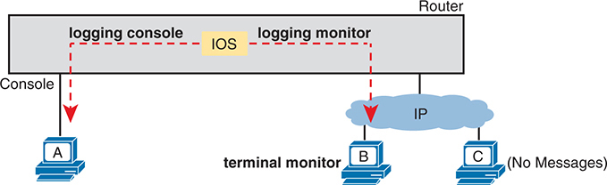
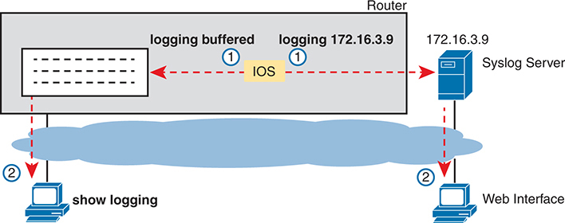
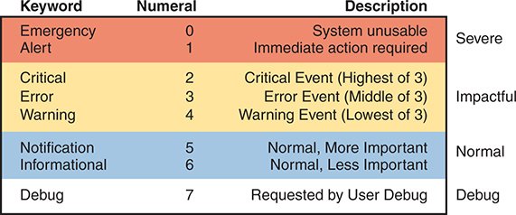
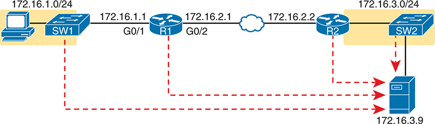
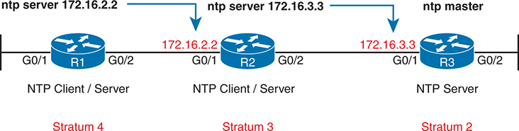
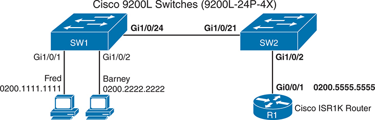
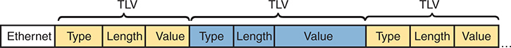
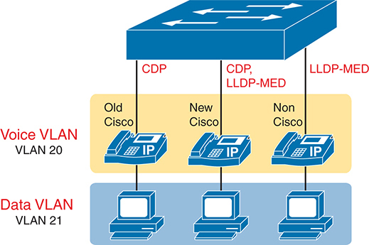

# Chapter 13


## Device Management Protocols

This chapter covers the following exam topics:

2.0 Network Access

2.3 Configure and verify Layer 2 discovery protocols (Cisco Discovery Protocol and LLDP)

4.0 IP Services

4.2 Configure and verify NTP operating in a client and server mode

4.5 Describe the use of syslog features including facilities and severity levels

This chapter begins [Part IV](vol2_part04.md#part04) with a discussion of the concepts, configuration, and verification of three functions found on Cisco routers and switches. These functions focus more on managing the network devices themselves than on managing the network that devices create.

The first major section of this chapter focuses on log messages and syslog. Most computing devices have a need to notify the administrator of any significant issue; generally, across the world of computing, messages of this type are called log messages. Cisco devices generate log messages as well. The first section shows how a Cisco device handles those messages and how you can configure routers and switches to ignore the messages or save them in different ways.

Next, different router and switch functions benefit from synchronizing their time-of-day clocks. Like most every computing device, routers and switches have an internal clock function to keep time. Network Time Protocol (NTP) provides a means for devices to synchronize their time, as discussed in the second section.

The final major section focuses on two protocols that do the same kinds of work: Cisco Discovery Protocol (CDP) and Link Layer Discovery Protocol (LLDP). Both provide a means for network devices to learn about neighboring devices, without requiring that IPv4 or IPv6 be working at the time.

### "Do I Know This Already?" Quiz

Take the quiz (either here or use the PTP software) if you want to use the score to help you decide how much time to spend on this chapter. The letter answers are listed at the bottom of the page following the quiz. [Appendix C](vol2_appc.md#appc), found both at the end of the book as well as on the companion website, includes both the answers and explanations. You can also find both answers and explanations in the PTP testing software.


**Table 13-1** "Do I Know This Already?" Foundation Topics Section-to-Question Mapping

| Foundation Topics Section | Questions |
| --- | --- |
| System Message Logging (Syslog) | 1, 2 |
| Network Time Protocol (NTP) | 3, 4 |
| Analyzing Topology Using CDP and LLDP | 5, 6 |

**[1](vol2_ch13.md#ques13_1a).** What level of logging to the console is the default for a Cisco device?

1. Informational
2. Errors
3. Warnings
4. Debugging

**[2](vol2_ch13.md#ques13_2a).** What command limits the messages sent to a syslog server to levels 4 through 0?

1. **logging trap 0-4**
2. **logging trap 0,1,2,3,4**
3. **logging trap 4**
4. **logging trap through 4**

**[3](vol2_ch13.md#ques13_3a).** Which of the following is accurate about the NTP client function on a Cisco router?

1. The client synchronizes its time-of-day clock based on the NTP server.
2. It counts CPU cycles of the local router CPU to keep time more accurately.
3. The client synchronizes all Ethernet interfaces to use the same speed.
4. The client must be connected to the same subnet as an NTP server.

**[4](vol2_ch13.md#ques13_4a).** The only NTP configuration on router R1 is the **ntp server 10.1.1.1** command. Which answer describes how NTP works on the router?

1. As an NTP server only
2. As an NTP client only
3. As an NTP server only after the NTP client synchronizes with NTP server 10.1.1.1
4. As an NTP server regardless of whether the NTP client synchronizes with NTP server 10.1.1.1

**[5](vol2_ch13.md#ques13_5a).** Imagine that a switch connects through an Ethernet cable to a router, and the router's host name is Hannah. Which of the following commands could tell you information about the IOS version on Hannah without establishing a Telnet connection to Hannah? (Choose two answers.)

1. **show neighbors Hannah**
2. **show cdp**
3. **show cdp neighbors**
4. **show cdp neighbors Hannah**
5. **show cdp entry Hannah**
6. **show cdp neighbors detail**

**[6](vol2_ch13.md#ques13_6a).** A switch is cabled to a router whose host name is Hannah. Which of the following LLDP commands could identify Hannah's enabled capabilities? (Choose two answers.)

1. **show neighbors**
2. **show neighbors Hannah**
3. **show lldp**
4. **show lldp interface**
5. **show lldp neighbors**
6. **show lldp entry Hannah**

Answers to the "Do I Know This Already?" quiz:

**[1](vol2_appc.md#ques13_1)** D

**[2](vol2_appc.md#ques13_2)** C

**[3](vol2_appc.md#ques13_3)** A

**[4](vol2_appc.md#ques13_4)** C

**[5](vol2_appc.md#ques13_5)** E, F

**[6](vol2_appc.md#ques13_6)** E, F

### Foundation Topics

### System Message Logging (Syslog)

It is amazing just how helpful Cisco devices try to be to their administrators. When major (and even not-so-major) events take place, these Cisco devices attempt to notify administrators with detailed system messages. As you learn in this section, these messages vary from the mundane to those that are incredibly important. Thankfully, administrators have a large variety of options for storing these messages and being alerted to those that could have the largest impact on the network infrastructure.

When an event happens that the device's OS thinks is interesting, how does the OS notify us humans? Cisco IOS can send the messages to anyone currently logged in to the device. It can also store the message so that a user can later look at the messages. The next few pages examine both topics.

Note

Included in the CCNA 200-301 exam topics is one about logging and syslog: "Describe the use of syslog features including facilities and severity levels." This exam topic does not require you to understand the related configuration. However, the configuration reveals many of the core concepts, so this section includes the configuration details as a means to help you understand how logging and syslog work.

#### Sending Messages in Real Time to Current Users

Cisco IOS running on a device at least tries to allow current users to see [log messages](vol2_gloss.md#gloss_198) when they happen. Not every router or switch may have users connected, but if some user is logged in, the router or switch benefits by making the network engineer aware of any issues.

By default, IOS shows log messages to console users for all severity levels of messages. That default happens because of the default **logging console** global configuration command. In fact, if you have been using a console port throughout your time reading this book, you likely have already noticed many syslog messages, like messages about interfaces coming up or going down.

For other users (that is, Telnet and SSH users), the device requires a two-step process before the user sees the messages. First, IOS has another global configuration setting--**logging monitor**--that tells IOS to enable the sending of log messages to all connected users. However, that default configuration is not enough to allow the user to see the log messages. The user must also issue the **terminal monitor** EXEC command during the login session, which tells IOS that this terminal session would like to receive log messages.

[Figure 13-1](vol2_ch13.md#ch13fig01) summarizes these key points about how IOS on a Cisco router or switch processes log messages for currently connected users. In the figure, user A sits at the console and always receives log messages. On the right, the fact that user B sees messages (because user B issued the **terminal monitor** EXEC command after login) and user C does not shows that users can individually control whether or not they receive log messages.




At the center of the diagram is the router, depicted as a gray box with I O S highlighted in yellow. There are three connected devices: A, B, and C, each representing different user scenarios. On the left side, device A is connected directly to the router's console port, labeled Console. A dashed red arrow labeled logging console points from the I O S to device A, indicating that log messages are being sent to the console user. In the middle, device B is connected to the router via an I P network, labeled terminal monitor. Another dashed red arrow labeled logging monitor points from the I O S to device B, showing that log messages are also being sent to this terminal monitor user. On the right side, device C is connected to the router via an I P network but has no log messages being sent to it. This is indicated by the label (No Messages) next to device C.

**Figure 13-1** *IOS Processing for Log Messages to Current Users*


#### Storing Log Messages for Later Review

With logging to the console and to terminals, when an event happens, IOS sends the messages to the console and terminal sessions, and then IOS can discard the message. However, clearly, it would be useful to keep a copy of the log messages for later review, so IOS provides two primary means to keep a copy.

IOS can store copies of the log messages in RAM by virtue of the **logging buffered** global configuration command. Then any user can come back later and see the old log messages by using the **show logging** EXEC command.

As a second option--an option used frequently in production networks--all devices store their log messages centrally to a [syslog server](vol2_gloss.md#gloss_337). RFC 5424 defines the Syslog protocol, which provides the means by which a device like a switch or router can use a UDP protocol to send messages to a syslog server for storage. All devices can send their log messages to the server. Later, a user can connect to the server (typically with a graphical user interface) and browse the log messages from various devices. To configure a router or switch to send log messages to a syslog server, add the **logging host {***address* **|** *hostname***}** global command, referencing the IP address or host name of the syslog server.

[Figure 13-2](vol2_ch13.md#ch13fig02) shows the ideas behind the buffered logging and syslog logging.




The diagram is divided into two main parts: the router running I O S and the syslog server. On the left, the router is configured with two logging commands: logging buffered and logging 172 dot 16 dot 3 dot 9. These commands are depicted with arrows pointing towards the respective logging destinations. The logging buffered command indicates that logs are stored in the router's buffer, while logging 172 dot 16 dot 3 dot 9 sends log messages to an external syslog server located at the I P address 172 dot 16 dot 3 dot 9. The router's buffer is represented with a box containing log entries, which can be accessed later for review. Below this, a command show logging is illustrated, which allows an administrator to view the buffered log messages on the router. On the right side, the syslog server, identified with the I P address 172 dot 16 dot 3 dot 9, is shown connected to the router. This server collects and stores log messages sent by the router. Additionally, a computer is connected to the syslog server via a web interface, enabling administrators to view and manage logs through a graphical user interface. The diagram uses arrows and annotations to show the flow of log messages from the router to both the internal buffer and the external Syslog server.

**Figure 13-2** *IOS Storing Log Messages for Later View: Buffered and Syslog Server*


#### Log Message Format

IOS defines the format of log messages. The message begins with some data fields about the message, followed by some text more easily read by humans. For example, take a close look at this sample message:

[Click here to view code image](vol2_ch13_images.md#f0272-01)

```
*Dec 18 17:10:15.079: %LINEPROTO-5-UPDOWN: Line protocol on Interface
FastEthernet0/0, changed state to down
```

Notice that by default on this particular device, we see the following:

**A timestamp:** \*Dec 18 17:10:15.079

**The facility on the router that generated the message:** %LINEPROTO

**The severity level:** 5

**A mnemonic for the message:** UPDOWN

**The description of the message:** Line protocol on Interface FastEthernet0/0, changed state to down

IOS dictates most of the contents of the messages, but you can at least toggle on and off the use of the timestamp (which is included by default) and a log message sequence number (which is not enabled by default). [Example 13-1](vol2_ch13.md#exa13_1) reverses those defaults by turning off timestamps and turning on sequence numbers.

**Example 13-1** *Disabling Timestamps and Enabling Sequence Numbers in Log Messages*

[Click here to view code image](vol2_ch13_images.md#f0272-02)

```
R1(config)# no service timestamps
R1(config)# service sequence-numbers
R1(config)# end
R1#
000011: %SYS-5-CONFIG_I: Configured from console by console
```

To see the change in format, look at the log message at the end of the example. As usual, when you exit configuration mode, the device issues yet another log message. Comparing this message to the previous example, you can see it now no longer lists the time of day but does list a sequence number.

#### Log Message Severity Levels

Log messages may just tell you about some mundane event, or they may tell you of some critical event. To help you make sense of the importance of each message, IOS assigns each message a severity level (as noted in the same messages in the preceding page or so). [Figure 13-3](vol2_ch13.md#ch13fig03) shows the severity levels: the lower the number, the more severe the event that caused the message. (Note that IOS commands use both the keywords and numbers from the figure.)





The table has three columns labeled Keyword, Numeral, and Description. In the first section, colored red and labeled Severe, the keywords are Emergency with a numeral of 0 and the description System unusable, and Alert with a numeral of 1 and the description Immediate action required. This section indicates the highest severity levels. The second section, colored yellow and labeled Impactful, includes Critical with a numeral of 2 and the description Critical Event (Highest of 3), Error with a numeral of 3 and the description Error Event (Middle of 3), and Warning with a numeral of 4 and the description Warning Event (Lowest of 3). This section represents events that significantly impact the system. The third section, colored blue and labeled Normal, consists of Notification with a numeral of 5 and the description Normal, More Important, and Informational with a numeral of 6 and the description Normal, Less Important. This section highlights routine operational messages. The fourth section, colored gray and labeled Debug, contains only Debug with a numeral of 7 and the description Requested by User Debug. This section is for debugging purposes requested by users.

**Figure 13-3** *Syslog Message Severity Levels by Keyword and Numeral*


[Figure 13-3](vol2_ch13.md#ch13fig03) breaks the eight severity levels into four sections just to make a little more sense of the meaning. The two top levels in the figure are the most severe. Messages from this level mean a serious and immediate issue exists. The next three levels, called Critical, Error, and Warning, also tell about events that impact the device, but they are not as immediate and severe. For instance, one common log message about an interface failing to a physically down state shows as a severity level 3 message.

Continuing down the figure, IOS uses the next two levels (5 and 6) for messages that are more about notifying the user rather than identifying errors. Finally, the last level in the figure is used for messages requested by the **debug** command, as shown in an example later in this chapter.

[Table 13-2](vol2_ch13.md#ch13tab02) summarizes the configuration commands used to enable logging and to set the severity level for each type. When the severity level is set, IOS will send messages of that severity level and more severe (lower severity numbers) to the service identified in the command. For example, the command **logging console 4** causes IOS to send severity level 0-4 messages to the console. Also, note that the command to disable each service is the **no** version of the command, with *no* in front of the command (**no logging console**, **no logging monitor**, and so on).


**Table 13-2** How to Configure Logging Message Levels for Each Log Service

| Service | To Enable Logging | To Set Message Levels |
| --- | --- | --- |
| Console | **logging console** | **logging console** *level-name* | *level-number* |
| Monitor | **logging monitor** | **logging monitor** *level-name* | *level-number* |
| Buffered | **logging buffered** | **logging buffered** *level-name* | *level-number* |
| Syslog | **logging host** *address* | *hostname* | **logging trap** *level-name* | *level-number* |

#### Configuring and Verifying System Logging

With the information in [Table 13-2](vol2_ch13.md#ch13tab02), configuring syslog in a Cisco IOS router or switch should be relatively straightforward. [Example 13-2](vol2_ch13.md#exa13_2) shows a sample, based on [Figure 13-4](vol2_ch13.md#ch13fig04). The figure shows a syslog server at IP address 172.16.3.9. Both switches and both routers will use the same configuration shown in [Example 13-2](vol2_ch13.md#exa13_2), although the example shows the configuration process on a single device, router R1.





On the left side, there is a personal computer connected to a switch labeled S W 1. The switch S W 1 is part of the subnet 172 dot 16 dot 1 dot 0 slash 24, with an I P address 172 dot 16 dot 1 dot 1 assigned to it. This switch connects to a router labeled R 1 through interface G 0 slash 1, which has an I P address of 172 dot 16 dot 1 dot 1. Router R 1 also has a second interface, G 0 slash 2, with an I P address of 172 dot 16 dot 2 dot 1, connecting to a Wide Area Network (W A N) cloud symbolizing the connection to another router. The second router, labeled R 2, is connected to the W A N cloud through interface G 0 slash 1, with an I P address of 172 dot 16 dot 2 dot 2. On the other side of R 2, interface G 0 slash 2 connects to another switch labeled S W 2, which is part of the subnet 172 dot 16 dot 3 dot 0 slash 24. This switch has an I P address of 172 dot 16 dot 3 dot 1. Additionally, a server is connected to switch S W 2, with the server's I P address being 172 dot 16 dot 3 dot 9. The diagram shows dotted red lines representing the flow of logged traffic from the personal computer through S W 1, R 1, the W A N cloud, R 2, S W 2, and finally to the server. These red lines illustrate the path taken by the traffic and are likely part of the logging process being depicted. The standard network symbols for switches, routers, and servers are used, along with solid and dotted lines to represent the connections and traffic flow within the network. The subnets are highlighted with different colored backgrounds to visually distinguish them.

**Figure 13-4** *Sample Network Used in Logging Examples*

**Example 13-2** *Syslog Configuration on R1*

```
logging console 7
logging monitor debug
logging buffered 4
logging host 172.16.3.9
logging trap warning
```

First, note that the example configures the same message level at the console and for terminal monitoring (level 7, or debug), and the same level for both buffered and logging to the syslog server (level 4, or warning). The levels may be set using the numeric severity level or the name as shown earlier in [Figure 13-3](vol2_ch13.md#ch13fig03).

The **show logging** command confirms those same configuration settings and also lists the log messages per the logging buffered configuration. [Example 13-3](vol2_ch13.md#exa13_3) shows a sample, with the configuration settings to match [Example 13-2](vol2_ch13.md#exa13_2) highlighted in gray.

**Example 13-3** *Viewing the Configured Log Settings per the Earlier Example*

[Click here to view code image](vol2_ch13_images.md#f0274-01)

```
R1# show logging
Syslog logging: enabled (0 messages dropped, 3 messages rate-limited, 0 flushes, 0 overruns, xml disabled, filtering disabled)

No Active Message Discriminator.

No Inactive Message Discriminator.

    Console logging: level debugging, 45 messages logged, xml disabled,
                     filtering disabled
    Monitor logging: level debugging, 0 messages logged, xml disabled,
                     filtering disabled
    Buffer logging: level warnings, 0 messages logged, xml disabled,
                    filtering disabled
    Exception Logging: size (8192 bytes)
    Count and timestamp logging messages: disabled
    Persistent logging: disabled
 No active filter modules.
    Trap logging: level warnings, 0 message lines logged
       Logging to 172.16.3.9 (udp port 514, audit disabled,
           link up),
           0 message lines logged,
           0 message lines rate-limited,
           0 message lines dropped-by-MD,
           xml disabled, sequence number disabled
           filtering disabled
       Logging Source-Interface: VRF Name:
    TLS Profiles:

Log Buffer (8192 bytes):
```

You might notice by now that knowing the names of all eight log message levels can be handy if you want to understand the output of the commands. Most of the **show** commands list the log message levels by name, not by number. As you can see in the gray highlights in this example, two levels list "debug," and two list "warning," even though some of the configuration commands referred to those levels by number.

Also, you cannot know this from the output, but in [Example 13-3](vol2_ch13.md#exa13_3), router R1 has no buffered log messages. (Note the counter value of 0 for buffered logging messages.) If any log messages had been buffered, the actual log messages would be listed at the end of the command. In this case, I had just booted the router, and no messages had been buffered yet. (You could also clear out the old messages from the log with the **clear logging** EXEC command.)

The next example shows the difference between the current severity levels. This example shows the user disabling interface G0/1 on R1 with the **shutdown** command and then re-enabling it with the **no shutdown** command. If you look closely at the highlighted messages, you will see several severity 5 messages and one severity 3 message. The **logging buffered 4** global configuration command on R1 (see [Example 13-2](vol2_ch13.md#exa13_2)) means that R1 will not buffer the severity level 5 log messages, but it will buffer the severity level 3 message. [Example 13-4](vol2_ch13.md#exa13_4) ends by showing that log message at the end of the output of the **show logging** command.

**Example 13-4** *Seeing Severity 3 and 5 Messages at the Console, and Severity 3 Only in the Buffer*

[Click here to view code image](vol2_ch13_images.md#f0275-01)

```
R1# configure terminal
Enter configuration commands, one per line. End with CNTL/Z.
R1(config)# interface g0/1
R1(config-if)# shutdown
R1(config-if)#
*Oct 21 20:07:07.244: %LINK-5-CHANGED: Interface GigabitEthernet0/1, changed state   to administratively down
*Oct 21 20:07:08.244: %LINEPROTO-5-UPDOWN: Line protocol on Interface   GigabitEthernet0/1, changed state to down
R1(config-if)# no shutdown
R1(config-if)#
*Oct 21 20:07:24.312: %LINK-3-UPDOWN: Interface GigabitEthernet0/1, changed state to up
*Oct 21 20:07:25.312: %LINEPROTO-5-UPDOWN: Line protocol on Interface   GigabitEthernet0/1, changed state to up
R1(config-if)# ^Z
R1#
*Oct 21 20:07:36.546: %SYS-5-CONFIG_I: Configured from console by console
R1# show logging
! Skipping about 20 lines, the same lines in Example 13-3, until the last few lines

Log Buffer (8192 bytes):

*Oct 21 20:07:24.312: %LINK-3-UPDOWN: Interface GigabitEthernet0/1, changed state to up
```

#### The debug Command and Log Messages

Of the eight log message severity levels, one level, debug level (7), has a special purpose: for messages generated as a result of a user logged in to the router or switch who issues a **debug** command.

The **debug** EXEC command gives the network engineer a way to ask IOS to monitor for certain internal events, with that monitoring process continuing over time, so that IOS can issue log messages when those events occur. The engineer can log in, issue the **debug** command, and move on to other work. The user can even log out of the device, and the debug remains enabled. IOS continues to monitor the request in that **debug** command and generate log messages about any related events. The debug remains active until some user issues the **no debug** command with the same parameters, disabling the debug.

Note

While the **debug** command is just one command, it has a huge number of options, much like the **show** command may be one command, but it also has many, many options.

The best way to see how the **debug** command works, and how it uses log messages, is to see an example. [Example 13-5](vol2_ch13.md#exa13_5) shows a sample debug of OSPF Hello messages for router R1 in [Figure 13-4](vol2_ch13.md#ch13fig04). The router (R1) enables OSPF on two interfaces and has established one OSPF neighbor relationship with router R2 (RID 2.2.2.2). The debug output shows one log message for the Hello messages sent on ports G0/1 and G0/2, plus one message for a received Hello arriving in port G0/2.

**Example 13-5** *Using **debug ip ospf hello** from R1's Console*

[Click here to view code image](vol2_ch13_images.md#f0276-01)

```
R1# debug ip ospf hello
OSPF hello debugging is on
R1#
*Aug 10 13:38:19.863: OSPF-1 HELLO Gi0/1: Send hello to 224.0.0.5 area 0 from
   172.16.1.1
*Aug 10 13:38:21.199: OSPF-1 HELLO Gi0/2: Rcv hello from 2.2.2.2 area 0 172.16.2.2
*Aug 10 13:38:22.843: OSPF-1 HELLO Gi0/2: Send hello to 224.0.0.5 area 0 from
   172.16.2.1
R1#
```

The console user sees the log messages created on behalf of that **debug** command after the **debug** command completes. Per the earlier configuration in [Example 13-2](vol2_ch13.md#exa13_2), R1's **logging console 7** command tells us that the console user will receive severity levels 0-7, which includes level 7 debug messages. Also, if you examine the log messages generated by the **debug** command, you will not find the severity level listed. So, the absence of a severity level number in a log message points to the message coming from the **debug** command.

Many companies may not want to keep copies of debug messages with the longer-term options to store log messages. For instance, with the current settings per [Example 13-2](vol2_ch13.md#exa13_2), these debug messages would not be in the local log message buffer (because of the level in the **logging buffered warning** command). The router would also not send debug messages to the syslog server (because of the level in the **logging trap 4** command).

Note that the console user automatically sees the log messages as shown in [Example 13-4](vol2_ch13.md#exa13_4). However, as noted in the text describing [Figure 13-1](vol2_ch13.md#ch13fig01), a user who connects to R1 using SSH or Telnet would need to also issue the **terminal monitor** command, even with the **logging monitor debug** command configured on router R1.

Note that all enabled debug options use router CPU, which can cause problems for the router. You can monitor CPU use with the **show process cpu** command, but you should use caution when using **debug** commands on production devices. Also, note the more CLI users who receive debug messages, the more CPU is consumed. So, some installations choose not to include debug-level log messages for console and terminal logging, requiring users to look at the logging buffer or syslog for those messages, just to reduce router CPU load.

### Network Time Protocol (NTP)

Each networking device has some concept of a date and a time-of-day clock. For instance, the log messages discussed in the first major section of this chapter had a timestamp with the date and time of day listed. Now imagine looking at all the log messages from all routers and switches stored at a syslog server. All those messages have a date and timestamp, but how do you make sure the timestamps are consistent? How do you make sure that all devices synchronize their time-of-day clocks so that you can make sense of all the log messages at the syslog server? How could you make sense of the messages for an event that impacted devices in three different time zones?

For example, consider the messages on two routers, R1 and R2, as shown in [Example 13-6](vol2_ch13.md#exa13_6). Routers R1 and R2 do not synchronize their NTP clocks. A problem keeps happening on the Ethernet WAN link between the two routers. A network engineer looks at all the log messages as stored on the syslog server. However, when seeing some messages from R1, at 13:38:39 (around 1:40 p.m.), the engineer does not think to look for messages from R2 that have a timestamp of around 9:45 a.m.

**Example 13-6** *Log Messages from Two Routers, Compared*

[Click here to view code image](vol2_ch13_images.md#f0277-01)

```
*Oct 19 13:38:37.568: %OSPF-5-ADJCHG: Process 1, Nbr 2.2.2.2 on GigabitEthernet0/2
from FULL to DOWN, Neighbor Down: Interface down or detached
*Oct 19 13:38:40.568: %LINEPROTO-5-UPDOWN: Line protocol on Interface
GigabitEthernet0/2, changed state to down
```

```
! These messages happened on router R2
Oct 19 09:44:09.027: %LINK-3-UPDOWN: Interface GigabitEthernet0/1, changed state to down
Oct 19 09:44:09.027: %OSPF-5-ADJCHG: Process 1, Nbr 1.1.1.1 on GigabitEthernet0/1
from FULL to DOWN, Neighbor Down: Interface down or detached
```

In reality, the messages in both parts of [Example 13-6](vol2_ch13.md#exa13_6) happened within 0.5 second of each other because I issued a **shutdown** command on router R1 (not shown). However, the two routers' time-of-day clocks were not synchronized, which makes the messages on the two routers look unrelated. With synchronized clocks, the two routers would have listed practically identical timestamps of almost the exact same time when these messages occurred, making it much easier to read and correlate messages.

Routers, switches, other networking devices, and pretty much every device known in the IT world has a time-of-day clock. For a variety of reasons, it makes sense to synchronize those clocks so that all devices have the same time of day, other than differences in time zone. The [Network Time Protocol (NTP)](vol2_gloss.md#gloss_225) provides the means to do just that.

NTP gives any device a way to synchronize its time-of-day clocks. NTP provides protocol messages that devices use to learn the timestamp of other devices. Devices send timestamps to each other with NTP messages, continually exchanging messages, with one device changing its clock to match the other, eventually synchronizing the clocks. As a result, actions that benefit from synchronized timing, like the timestamps on log messages, work much better.

This section works through a progression of topics that lead to the more common types of NTP configurations seen in real networks. The section begins with basic settings, like the time zone and initially configured time on a router or switch, followed by basic NTP configuration. The text then examines some NTP internals regarding how NTP defines the sources of time data (reference clocks) and how good each time source is (stratum). The section closes with more configuration that explains typical enterprise configurations, with multiple **ntp** commands for redundancy and the use of loopback interfaces for high availability.

#### Setting the Time and Time Zone

NTP's job is to synchronize clocks, but NTP works best if you set the device clock to a reasonably close time before enabling the [NTP client](vol2_gloss.md#gloss_232) function with the **ntp server** command. For instance, my wristwatch says 8:52 p.m. right now. Before starting NTP on a new router or switch so that it synchronizes with another device, I should set the time to 8:52 p.m., set the correct date and time zone, and even tell the device to adjust for daylight savings time--and then enable NTP. Setting the time correctly gives NTP a good start toward synchronizing.

[Example 13-7](vol2_ch13.md#exa13_7) shows how to set the date, time, time zone, and daylight savings time. Oddly, it uses two configuration commands (for the time zone and daylight savings time) and one EXEC command to set the date and time on the router.

**Example 13-7** *Setting the Date/Time with **clock set**, Plus Time Zone/DST*

[Click here to view code image](vol2_ch13_images.md#f0278-01)

```
R1# configure terminal
Enter configuration commands, one per line. End with CNTL/Z.
R1(config)# clock timezone EST -5
R1(config)# clock summer-time EDT recurring
R1(config)# ^Z
R1#
R1# clock set 12:32:00 19 January 2023
*Jan 19 17:32:00.005: %SYS-6-CLOCKUPDATE: System clock has been updated from
12:32:16 EST Thu Jan 19 2023 to 12:32:00 EST Thu Jan 19 2023, configured from
console by console.
R1# show clock
12:32:06.146 EST Thu Jan 19 2023
```

Focus on the two configuration commands first. You should set the first two commands before setting the time of day with the **clock set** EXEC command because the two configuration commands impact the time that is set. In the first command, the **clock timezone** part defines the command and a keyword. The next parameter, "EST" in this case, is any value you choose, but choose the name of the time zone of the device. This value shows up in **show** commands, so although you make up the value, the value needs to be meaningful to all. I chose EST, the acronym for US Eastern Standard Time. The "-5" parameter means that this device is 5 hours behind Universal Time Coordinated (UTC).

The **clock summer-time** part of the second command defines what to do, again with the "EDT" being a field in which you could have used any value. However, you should use a meaningful value. This is the value shown with the time in **show** commands when daylight savings time is in effect, so I chose EDT because it is the acronym for daylight savings time in that same EST time zone. Finally, the **recurring** keyword tells the router to spring forward an hour and fall back an hour automatically over the years.

The **clock set** EXEC command then sets the time, day of the month, month, and year. However, note that IOS interprets the time as typed in the command in the context of the time zone and daylight savings time. In the example, the **clock set** command lists a time of 20:52:49 (the command uses a time syntax with a 24-hour format, not with a 12-hour format plus a.m./p.m.). As a result of that time plus the two earlier configuration commands, the **show clock** command (issued seconds later) lists that time but also notes the time as EDT rather than UTC time.

#### Basic NTP Configuration

With NTP, servers supply information about the time of day to clients, and clients react by adjusting their clocks to match. The process requires repeated small adjustments over time to maintain that synchronization. The configuration itself can be simple, or it can be extensive once you add security configuration and redundancy.

Cisco supplies two **ntp** configuration commands that dictate how NTP works on a router or switch, as follows:


* **ntp master** {*stratum-level*}: NTP server mode--the device acts only as an [NTP server](vol2_gloss.md#gloss_234), and not as an NTP client. The device gets its time information from the internal clock on the device.
* **ntp server** {*address* | *hostname*}: NTP client/server mode--the device acts as both client and server. First, it acts as an NTP client, to adjust its time to synchronize time with another server. Once synchronized, the device can then act as an NTP server, to supply time to other NTP clients.

For an example showing the basic configuration syntax and **show** commands, consider [Figure 13-5](vol2_ch13.md#ch13fig05). With this simple configuration:

* R3 acts as an NTP server only.
* R2 acts in client/server mode--first as an NTP client to synchronize time with NTP server R3, then as a server to supply time to NTP client R1.
* R1 acts in client/server mode--first as an NTP client to synchronize time with NTP server R2. (R1 will be willing to act as a server, but no devices happen to reference R1 as an NTP server in this example.)




The network consists of three routers labeled R 1, R 2, and R 3 connected sequentially from left to right. On the left, router R 1 is connected via Ethernet interfaces G 0 slash 1 and G 0 slash 2. It is labeled as N T P Client / Server and is configured to synchronize its time from an N T P server at I P address 172 dot 16 dot 2 dot 2. The I P address of R 1 itself is 172 dot 16 dot 2 dot 2, marked in red. This router operates at Stratum 4 in the N T P hierarchy. In the center, router R 2 is connected via Ethernet interfaces G 0 slash 1 and G 0 slash 2 to both R 1 and R 3. R 2 serves a dual role as both an N T P client and server. It synchronizes its time from the N T P server at I P address 172 dot 16 dot 3 dot 3 and serves time to R 1. The I P address of R 2 is 172 dot 16 dot 3 dot 3, also marked in red. This router operates at Stratum 3 in the N T P hierarchy. On the right, router R 3 is connected via Ethernet interfaces G 0 slash 1 and G 0 slash 2. It is labeled as N T P Server and acts as the master time source for R 2. R 3 has the I P address 172 dot 16 dot 3 dot 3, marked in red, and is designated as Stratum 2, indicating a higher level of accuracy and reliability in the N T P hierarchy. Arrows between the routers show the direction of N T P time synchronization: R 1 receives time from R 2, which in turn receives time from R 3. The labels N T P server 172 dot 16 dot 2 dot 2, N T P server 172 dot 16 dot 3 dot 3, and N T P master indicate the sources from which each router synchronizes its time.

**Figure 13-5** *R1 as NTP Client, R2 as Client/Server, R3 as Server*

As you can see, NTP requires little configuration to make it work with a single configuration command on each device. [Example 13-8](vol2_ch13.md#exa13_8) collects the configuration from the devices shown in the figure for easy reference.

**Example 13-8** *NTP Client/Server Configuration*

```
! Configuration on R1:
ntp server 172.16.2.2
```

```
! Configuration on R2:
ntp server 172.16.3.3
```

```
! Configuration on R3:
ntp master 2
```

[Example 13-9](vol2_ch13.md#exa13_9) lists the output from the **show ntp status** command on R1, with the first line of output including a few important status items. First, it lists a status of synchronized, which confirms the NTP client has completed the process of changing its time to match the server's time. Any router acting as an NTP client will list "unsynchronized" in that first line until the [NTP synchronization](vol2_gloss.md#gloss_235) process completes with at least one server. It also confirms the IP address of the server--this device's *reference clock*--with the IP address configured in [Example 13-8](vol2_ch13.md#exa13_8) (172.16.2.2).

**Example 13-9** *Verifying NTP Client Status on R1 and R2*

[Click here to view code image](vol2_ch13_images.md#f0280-01)

```
R1# show ntp status
Clock is synchronized, stratum 4, reference is 172.16.2.2
nominal freq is 250.0000 Hz, actual freq is 250.0000 Hz, precision is 2**21
ntp uptime is 1553800 (1/100 of seconds), resolution is 4000
reference time is DA5E7147.56CADEA7 (15:24:38.694 EST Thu Jan 19 2023)
clock offset is 0.0986 msec, root delay is 2.46 msec
root dispersion is 22.19 msec, peer dispersion is 5.33 msec
loopfilter state is 'CTRL' (Normal Controlled Loop), drift is 0.000000009 s/s
system poll interval is 64, last update was 530 sec ago.
```

Next, look at the **show ntp associations** command output from both R1 and R2, as shown in [Example 13-10](vol2_ch13.md#exa13_10). This command lists all the NTP servers that the local device can attempt to use, with status information about the association between the local device (client) and the various NTP servers. Beginning with R1, note that it has one association (that is, relationship with an NTP server), based on the one **ntp server 172.16.2.2.2** configuration command on R1. The \* means that R1 has successfully contacted the server. You will see similar data from the same command output taken from router R2.

**Example 13-10** *Verifying NTP Client Status on R1 and R2*

[Click here to view code image](vol2_ch13_images.md#f0281-01)

```
R1# show ntp associations
! This output is taken from router R1, acting in client/server mode
   address   ref clock st when poll reach  delay  offset disp
*~172.16.2.2 10.1.3.3  3   50  64     377  1.223  0.090  4.469
 * sys.peer, # selected, + candidate, - outlyer, x falseticker, ~ configured
```

```
 R2# show ntp associations
! This output is taken from router R2, acting in client/server mode
 address      ref clock    st  when poll  reach  delay  offset  disp
*~172.16.3.3  127.127.1.1  2   49    64   377    1.220  -7.758  3.695
 * sys.peer, # selected, + candidate, - outlyer, x falseticker, ~ configured
```

#### NTP Reference Clock and Stratum

NTP servers must learn the time from some device. For devices acting in [NTP client/server mode](vol2_gloss.md#gloss_233), the device uses the NTP client function to learn the time. However, devices that act solely as an NTP server get their time from either internal device hardware or from some external clock using mechanisms other than NTP.

For instance, when configured with the **ntp master** command, a Cisco router/switch uses its internal device hardware to determine the time. All computers, networking devices included, need some means to keep time for a myriad of reasons, so they include both hardware components and software processes to keep time even over periods in which the device loses power.

Additionally, NTP servers and clients use a number to show the perceived accuracy of their reference clock data based on stratum level. The lower the stratum level, the more accurate the reference clock is considered to be. An NTP server that uses its internal hardware or external reference clock sets its own stratum level. Then, an NTP client adds 1 to the stratum level it learns from its NTP server, so that the stratum level increases the more hops away from the original clock source.

For instance, back in [Figure 13-5](vol2_ch13.md#ch13fig05), you can see the NTP primary server (R3) with a stratum of 2. R2, which references R3, adds 1 so it has a stratum of 3. R1 uses R2 as its NTP server, so R1 adds 1 to have a stratum of 4. These increasing stratum levels allow devices to refer to several NTP servers and then use time information from the best NTP server, *best* being the server with the lowest stratum level.

Routers and switches use the default stratum level of 8 for their internal reference clock based on the default setting of 8 for the stratum level in the **ntp master** [*stratum-level*] command. The command allows you to set a value from 1 through 15; in [Example 13-8](vol2_ch13.md#exa13_8), the **ntp master 2** command set router R3's stratum level to 2.

Note

NTP considers 15 to be the highest useful stratum level, so any devices that calculate its stratum as 16 consider the time data unusable and do not trust the time. So, avoid setting higher stratum values on the **ntp master** command.

To see the evidence, refer back to [Example 13-10](vol2_ch13.md#exa13_10), which shows two commands based on the same configuration in [Example 13-8](vol2_ch13.md#exa13_8) and [Figure 13-5](vol2_ch13.md#ch13fig05). The output highlights details about reference clocks and stratum levels, as follows:

**R1:** Per the configured **ntp server 172.16.2.2** command, the **show** command lists the same address (which is router R2's address). The ref clock (reference clock) and st (stratum) fields represent R2's reference clock as 172.16.3.3--in other words, the NTP server R2 uses, which is R3 in this case. The st field value of 3 shows R2's stratum.

**R2:** Per the configured **ntp server 172.16.3.3** command, the **show** command lists 172.16.3.3, which is an address on router R3. The output notes R3's ref clock as 127.127.1.1--an indication that the server (R3) gets its clock internally. It lists R3's st (stratum) value of 2--consistent with the configured **ntp master 2** command on R3 (per [Example 13-8](vol2_ch13.md#exa13_8)).

On the NTP primary server itself (R3 in this case), the output has more markers indicating the use of the internal clock. [Example 13-11](vol2_ch13.md#exa13_11) shows output from R3, with a reference clock of the 127.127.1.1 loopback address, used to refer to the fact that this router gets its clock data internally. Also, in the **show ntp associations** command output at the bottom, note that same address, along with a reference clock value of ".LOCL." In effect, R3, per the **ntp master** configuration command, has an association with its internal clock.

**Example 13-11** *Examining NTP Server, Reference Clock, and Stratum Data*

[Click here to view code image](vol2_ch13_images.md#f0282-01)

```
R3# show ntp status
Clock is synchronized, stratum 2, reference is 127.127.1.1
nominal freq is 250.0000 Hz, actual freq is 250.0000 Hz, precision is 2**20
ntp uptime is 595300 (1/100 of seconds), resolution is 4000
reference time is E0F9174C.87277EBB (15:27:54.252 EST Thu Jan 19 2023)
clock offset is 0.0000 msec, root delay is 0.00 msec
root dispersion is 0.33 msec, peer dispersion is 0.23 msec
loopfilter state is 'CTRL' (Normal Controlled Loop), drift is 0.000000000 s/s
system poll interval is 16, last update was 8 sec ago.

R3# show ntp associations
  address         ref clock       st   when   poll reach  delay  offset   disp
*~127.127.1.1     .LOCL.           1     15     16   377  0.000   0.000  0.232
 * sys.peer, # selected, + candidate, - outlyer, x falseticker, ~ configured
```

Note

[Appendix D](vol2_appd.md#appd), "[Topics from Previous Editions](vol2_appd.md#appd)," includes a few pages about adding redundancy to NTP. For those moving on to CCNP, you might want to read that topic when convenient. You can find [Appendix D](vol2_appd.md#appd) on this book's companion website.

### Analyzing Topology Using CDP and LLDP

The first two major sections of this chapter showed two features--syslog and NTP--that work the same way on both routers and switches. This final section shows yet another feature common to both routers and switches, with two similar protocols: the Cisco Discovery Protocol ([CDP](vol2_gloss.md#gloss_061)) and the Link Layer Discovery Protocol ([LLDP](vol2_gloss.md#gloss_195)). This section focuses on CDP, followed by LLDP.

#### Examining Information Learned by CDP

CDP discovers basic information about neighboring routers and switches without needing to know the passwords for the neighboring devices. To discover information, routers and switches send CDP messages out each of their interfaces. The messages essentially announce information about the device that sent the CDP message. Devices that support CDP learn information about others by listening for the advertisements sent by other devices.

CDP discovers several useful details from the neighboring Cisco devices:


* **Device identifier:** Typically the hostname
* **Address list:** Network and data-link addresses
* **Port identifier:** The interface on the remote router or switch on the other end of the link that sent the CDP advertisement
* **Capabilities list:** Information on what type of device it is (for example, a router or a switch)
* **Platform:** The model and OS level running on the device

CDP plays two general roles: to provide information to the devices to support some function and to provide information to the network engineers who manage the devices. For example, Cisco IP Phones use CDP to learn the data and voice VLAN IDs as configured on the access switch. For that second role, CDP has **show** commands that list information about neighboring devices, as well as information about how CDP is working. [Table 13-3](vol2_ch13.md#ch13tab03) describes the three **show** commands that list the most important CDP information.


**Table 13-3 show cdp** Commands That List Information About Neighbors

| Command | Description |
| --- | --- |
| **show cdp neighbors** [*type number*] | Lists one summary line of information about each neighbor or just the neighbor found on a specific interface if an interface was listed |
| **show cdp neighbors detail** | Lists one large set (approximately 15 lines) of information, one set for every neighbor |
| **show cdp entry** *name* | Lists the same information as the **show cdp neighbors detail** command, but only for the named neighbor (case sensitive) |

Note

Cisco routers and switches support the same CDP commands, with the same parameters and same types of output.

The next example shows the power of the information in CDP commands. The example uses the network shown in [Figure 13-6](vol2_ch13.md#ch13fig06), with [Example 13-12](vol2_ch13.md#exa13_12) listing the output of several **show cdp** commands.




The switches are labeled S W 1 and S W 2. S W 1 is on the left and has three connected devices. The first device, labeled Fred, is connected to interface G i 1 slash 0 slash 1 and has a M A C address of 0 2 0 0 dot 1 1 1 1 dot 1 1 1 1. The second device, labeled Barney, is connected to interface G i 1 slash 0 slash 2 and has a M A C address of 0 2 0 0 dot 2 2 2 2 dot 2 2 2 2. S W 1 is also connected to S W 2 through interface G i 1 slash 0 slash 24. On the right side, S W 2 is connected to S W 1 via interface G i 1 slash 0 slash 21. Additionally, S W 2 connects to a Cisco I S R 1 K router through interface G i 1 slash 0 slash 2. The router, labeled R 1, is connected to S W 2 via interface G 0 slash 0 slash 1 and has a M A C address of 0 2 0 0 dot 5 5 5 5 dot 5 5 5 5. This network diagram illustrates the interconnections between the switches and the router, highlighting the use of interfaces and M A C addresses for each device. It serves as a visual example for understanding how C D P can be used to discover and display information about directly connected Cisco devices, providing insights into the network topology and device relationships. The layout showcases the connectivity and configuration of a basic network setup utilizing Cisco 9200 L switches and an I S R 1 K router, facilitating the demonstration of C D P functionalities.

**Figure 13-6** *Small Network Used in CDP Examples*

**Example 13-12** ***show cdp neighbors** Command Examples: SW2*

[Click here to view code image](vol2_ch13_images.md#f0284-01)

```
SW2# show cdp neighbors
Capability Codes: R - Router, T - Trans Bridge, B - Source Route Bridge
                  S - Switch, H - Host, I - IGMP, r - Repeater, P - Phone,
                  D - Remote, C - CVTA, M - Two-port Mac Relay

Device ID        Local Intrfce     Holdtme    Capability  Platform  Port ID
SW1              Gig 1/0/21        155              S I   WS-C2960X Gig 1/0/24
R1               Gig 1/0/2         131             R S I  C1111-8P  Gig 0/0/1

Total cdp entries displayed : 2
```

The **show cdp neighbors** command lists one line per neighbor. (Look for the Device ID column and the list that includes SW1 and R1.) Each of those two lines lists the most important topology information about each neighbor: the neighbor's hostname (Device ID), the local device's interface, and the neighboring device's interface (under the Port heading).

Pay close attention to the local device's interface and the neighboring device's interface, comparing the example to the figure. For example, SW2's **show cdp neighbors** command lists an entry for SW1, with SW2's local interface of Gi1/0/21 (listed under the heading "Local Intrfce") and SW1's interface of Gi1/0/24 (listed under the heading "Port ID").

This command also lists the platform, identifying the specific model of the neighboring router or switch. So, even using this basic information, you could either construct a figure like [Figure 13-6](vol2_ch13.md#ch13fig06) or confirm that the details in the figure are correct.

[Figure 13-6](vol2_ch13.md#ch13fig06) and [Example 13-12](vol2_ch13.md#exa13_12) provide a good backdrop as to why devices learn about direct neighbors with CDP, but not other neighbors. First, CDP defines encapsulation that uses the data-link header, but no IP header. To ensure all devices receive a CDP message, the Ethernet header uses a multicast destination MAC address (0100.0CCC.CCCC). However, when any device that supports CDP receives a CDP message, the device processes the message and then discards it, rather than forwarding it. So, for instance, when router R1 sends a CDP message to Ethernet multicast address 0100.0CCC.CCCC, switch SW2 receives it, processes it, but does not forward it to switch SW1--so SW1 will not list router R1 as a CDP neighbor. Likewise, R1 will not list SW1 as a neighbor.

Next, consider the **show cdp neighbors detail** command as shown in [Example 13-13](vol2_ch13.md#exa13_13), again taken from switch SW2. This command lists more detail, as you might have guessed. The detail lists the full name of the switch model (C9200L-24P-4X) and the IP address configured on the neighboring device. You have to look closely, but the example has one long group of messages for each of the two neighbors, separated by a line of dashes.

**Example 13-13** ***show cdp neighbors detail** Command on SW2*

[Click here to view code image](vol2_ch13_images.md#f0285-01)

```
SW2# show cdp neighbors detail
-------------------------
Device ID: SW1
Entry address(es):
  IP address: 1.1.1.1
Platform: cisco C9200L-24P-4X,  Capabilities: Switch IGMP
Interface: GigabitEthernet1/0/21,  Port ID (outgoing port): GigabitEthernet1/0/24
Holdtime : 144 sec

Version :
Cisco IOS Software [Bengaluru], Catalyst L3 Switch Software (CAT9K_LITE_IOSXE),
Version 17.6.3, RELEASE SOFTWARE (fc4)
Technical Support: http://www.cisco.com/techsupport
Copyright (c) 1986-2022 by Cisco Systems, Inc.
Compiled Wed 30-Mar-22 21:23 by mcpre

advertisement version: 2
VTP Management Domain: 'fred'
Native VLAN: 1
Duplex: full
Management address(es):
  IP address: 1.1.1.1

-------------------------
Device ID: R1
Entry address(es):
  IP address: 10.12.25.5
Platform: cisco C1111-8P,  Capabilities: Router Switch IGMP
Interface: GigabitEthernet1/0/2,  Port ID (outgoing port): GigabitEthernet0/0/1
Holdtime : 151 sec

Version :
Cisco IOS Software [Fuji], ISR Software (ARMV8EB_LINUX_IOSD-UNIVERSALK9_IAS-M),
Version 16.8.1, RELEASE SOFTWARE (fc3)
Technical Support: http://www.cisco.com/techsupport
Copyright (c) 1986-2018 by Cisco Systems, Inc.
Compiled Tue 27-Mar-18 10:56 by mcpre

advertisement version: 2
VTP Management Domain: ''
Duplex: full
Management address(es):
  IP address: 10.12.25.5


Total cdp entries displayed : 2
```

Note

The **show cdp entry** *name* command lists the exact same details shown in the output of the **show cdp neighbors detail** command, but for only the one neighbor listed in the command. The *name* parameter must be a neighbor's case-sensitive name.

#### Configuring and Verifying CDP

Most of the work you do with CDP relates to what CDP can tell you with **show** commands. However, it is an IOS feature, so you can configure CDP and use some **show** commands to examine the status of CDP itself.

IOS typically enables CDP globally and on each interface by default. You can then disable CDP per interface with the **no cdp enable** interface subcommand and later re-enable it with the **cdp enable** interface subcommand. To disable and re-enable CDP globally on the device, use the **no cdp run** and **cdp run** global commands, respectively.

To examine the status of CDP itself, use the commands in [Table 13-4](vol2_ch13.md#ch13tab04).

**Table 13-4** Commands Used to Verify CDP Operations

| Command | Description |
| --- | --- |
| **show cdp** | States whether CDP is enabled globally and lists the default update and holdtime timers |
| **show cdp interface** [*type number*] | States whether CDP is enabled on each interface, or a single interface if the interface is listed, and states update and holdtime timers on those interfaces |
| **show cdp traffic** | Lists global statistics for the number of CDP advertisements sent and received |

[Example 13-14](vol2_ch13.md#exa13_14) lists sample output from each of the commands in [Table 13-4](vol2_ch13.md#ch13tab04), based on switch SW2 in [Figure 13-6](vol2_ch13.md#ch13fig06).

**Example 13-14** ***show cdp** Commands That Show CDP Status*

[Click here to view code image](vol2_ch13_images.md#f0287-01)

```
SW2# show cdp
Global CDP information:
        Sending CDP packets every 60 seconds
        Sending a holdtime value of 180 seconds
        Sending CDPv2 advertisements is enabled

SW2# show cdp interface GigabitEthernet1/0/2
GigabitEthernet1/0/2 is up, line protocol is up
  Encapsulation ARPA
  Sending CDP packets every 60 seconds
  Holdtime is 180 seconds

SW2# show cdp traffic
CDP counters :
        Total packets output: 304, Input: 305
        Hdr syntax: 0, Chksum error: 0, Encaps failed: 0
        No memory: 0, Invalid packet: 0,
        CDP version 1 advertisements output: 0, Input: 0
        CDP version 2 advertisements output: 304, Input: 305
```

The first two commands in the example list two related settings about how CDP works: the send time and the hold time. CDP sends messages every 60 seconds by default, with a hold time of 180 seconds. The hold time tells the device how long to wait after no longer hearing from a device before removing those details from the CDP tables. You can override the defaults with the **cdp timer** *seconds* and **cdp holdtime** *seconds* global commands, respectively. [Table 13-5](vol2_ch13.md#ch13tab05) summarizes the configuration commands for CDP and LLDP timers for easier review and study.

**Table 13-5** CDP and LLDP Timer Configuration

| CDP Command | LLDP Command | Description |
| --- | --- | --- |
| **cdp timer** *seconds* | **lldp timer** *seconds* | Defines how often CDP or LLDP sends messages on each interface |
| **cdp holdtime** *seconds* | **lldp holdtime** *seconds* | Defines how long to wait after the most recent incoming message from a neighbor before deleting that neighbor's information |
| N/A | **lldp reinit** *seconds* | (LLDP only) Defines a wait time before the first message sent after an interface comes up |

#### Examining Information Learned by LLDP

Cisco created the Cisco-proprietary CDP before any standard existed for a similar protocol. CDP has many benefits. As a Layer 2 protocol, sitting on top of Ethernet, it does not rely on a working Layer 3 protocol. It provides device information that can be useful in a variety of ways. Cisco had a need but did not see a standard that met the need, so Cisco made up a protocol, as has been the case many times over history with many companies and protocols.

Link Layer Discovery Protocol (LLDP), defined in IEEE standard 802.1AB, provides a standardized protocol that provides the same general features as CDP. LLDP has similar configuration and practically identical **show** commands as compared with CDP.

The LLDP examples all use the same topology used in the CDP examples per [Figure 13-6](vol2_ch13.md#ch13fig06) (the same figure used in the CDP examples). [Example 13-15](vol2_ch13.md#exa13_15) lists switch SW2's LLDP neighbors as learned after LLDP was enabled on all devices and ports in that figure. The example highlights the items that match the similar output from the **show cdp neighbors** command listed at the end of the example, also from switch SW2.

**Example 13-15** ***show lldp neighbors** on SW2 with Similarities to CDP Highlighted*

[Click here to view code image](vol2_ch13_images.md#f0288-01)

```
SW2# show lldp neighbors
Capability codes:
    (R) Router, (B) Bridge, (T) Telephone, (C) DOCSIS Cable Device
    (W) WLAN Access Point, (P) Repeater, (S) Station, (O) Other

Device ID           Local Intf     Hold-time  Capability      Port ID
R1                  Gi1/0/2        120        R               Gi0/0/1
SW1                 Gi1/0/21       120        B               Gi1/0/24

Total entries displayed: 2

SW2# show cdp neighbors
Capability Codes: R - Router, T - Trans Bridge, B - Source Route Bridge
                  S - Switch, H - Host, I - IGMP, r - Repeater, P - Phone,
                  D - Remote, C - CVTA, M - Two-port Mac Relay

Device ID        Local Intrfce     Holdtme    Capability  Platform  Port ID
SW1              Gig 1/0/21        155              S I   WS-C2960X Gig 1/0/24
R1               Gig 1/0/2         131             R S I  C1111-8P  Gig 0/0/1
Total entries displayed: 2
```

The most important take-away from the output is the consistency between CDP and LLDP in how they refer to the interfaces. Both the **show cdp neighbors** and **show lldp neighbors** commands have "local intf" (interface) and "port ID" columns. These columns refer to the local device's interface and the neighboring device's interface, respectively.

However, the LLDP output in the example does differ from CDP in a few important ways:


* LLDP uses **B** as the capability code for switching, referring to **bridge**, a term for the device type that existed before switches that performed the same basic functions.
* LLDP does not identify IGMP as a capability, while CDP does (I).
* CDP lists the neighbor's **platform**, a code that defines the device type, while LLDP does not.
* LLDP lists capabilities with different conventions (see upcoming [Example 13-19](vol2_ch13.md#exa13_19)).

The last item in the list requires a closer look with more detail. Interestingly, CDP lists all capabilities supported by the neighbor in the **show cdp neighbors** command output, whether enabled or not. LLDP instead lists only the enabled (configured) capabilities, rather than all supported capabilities, in the output from the **show lldp neighbors** command.

The **show lldp neighbors detail** and **show lldp entry** *hostname* commands provide identical detailed output, with the first command providing detail for all neighbors, and the second providing detail for the single listed neighbor. [Example 13-16](vol2_ch13.md#exa13_16) shows the detail for neighbor R1. Note that the parameter "R1" is case sensitive, and should match the name listed by the **show lldp neighbors** command.

**Example 13-16** ***show lldp entry r2** Command on SW2*

[Click here to view code image](vol2_ch13_images.md#f0289-01)

```
SW2# show lldp entry R1

Capability codes:
    (R) Router, (B) Bridge, (T) Telephone, (C) DOCSIS Cable Device
    (W) WLAN Access Point, (P) Repeater, (S) Station, (O) Other
------------------------------------------------
Local Intf: Gi1/0/2
Chassis id: 70ea.1a9a.d300
Port id: Gi0/0/1
Port Description: GigabitEthernet0/0/1
System Name: R1

System Description:
Cisco IOS Software [Fuji], ISR Software (ARMV8EB_LINUX_IOSD-UNIVERSALK9_IAS-M),
Version 16.8.1, RELEASE SOFTWARE (fc3)
Technical Support: http://www.cisco.com/techsupport
Copyright (c) 1986-2022 by Cisco Systems, Inc.
Compiled Fri 08-Apr-22 12:42 by mcp

Time remaining: 100 seconds
System Capabilities: B,R
Enabled Capabilities: R
Management Addresses:
    IP: 10.12.25.5
Auto Negotiation - not supported
Physical media capabilities - not advertised
Media Attachment Unit type - not advertised
Vlan ID: - not advertised


Total entries displayed: 1
```

First, regarding the device capabilities, note that the LLDP command output lists two lines about the neighbor's capabilities:

**System Capabilities:** What the device can do

**Enabled Capabilities:** What the device does now with its current configuration

For instance, in [Example 13-16](vol2_ch13.md#exa13_16), the neighboring R1 claims the ability to perform routing and switching (codes **R** and **B**) but also claims to currently be using only its routing capability, as noted in the "enabled capabilities" line.

Also, take a moment to look at the output for the similarities to CDP. For instance, this output lists detail for neighbor R1, which uses its local port G0/0/1, with a hostname of R1. The output also notes the IOS name and version, from which an experienced person can infer the model number, but there is no explicit mention of the model.

Note

LLDP uses the same messaging concepts as CDP, encapsulating messages directly in data-link headers. Devices do not forward LLDP messages, so LLDP learns only of directly connected neighbors. LLDP sends messages to multicast MAC address 0180.C200.000E, while CDP uses 0100.0CCC.CCCC.

#### Configuring and Verifying LLDP

LLDP uses a similar configuration model as CDP, but with a few key differences. First, Cisco devices default to disable LLDP. Additionally, LLDP separates the sending and receiving of LLDP messages as separate functions. For instance, LLDP support processing receives LLDP messages on an interface so that the switch or router learns about the neighboring device while not transmitting LLDP messages to the neighboring device. To support that model, the commands include options to toggle on|off the transmission of LLDP messages separately from the processing of received messages.

The three LLDP configuration commands are as follows:


* **[no] lldp run:** A global configuration command that sets the default mode of LLDP operation for any interface that does not have more specific LLDP subcommands (**lldp transmit**, **lldp receive**). The **lldp run** global command enables LLDP in both directions on those interfaces, while **no lldp run** disables LLDP.
* **[no] lldp transmit:** An interface subcommand that defines the operation of LLDP on the interface regardless of the global **[no] lldp run** command. The **lldp transmit** interface subcommand causes the device to transmit LLDP messages, while **no lldp transmit** causes it to not transmit LLDP messages.
* **[no] lldp receive:** An interface subcommand that defines the operation of LLDP on the interface regardless of the global **[no] lldp run** command. The **lldp receive** interface subcommand causes the device to process received LLDP messages, while **no lldp receive** causes it to not process received LLDP messages.

For example, consider a switch that has no LLDP configuration commands at all. [Example 13-17](vol2_ch13.md#exa13_17) adds configuration that first enables LLDP for all interfaces (in both directions) with the **lldp run** global command. It then shows how to disable LLDP in both directions on Gi1/0/17 and how to disable LLDP in one direction on Gi1/0/18.

**Example 13-17** *Enabling LLDP on All Ports, Disabling on a Few Ports*

[Click here to view code image](vol2_ch13_images.md#f0291-01)

```
lldp run
!
interface gigabitEthernet1/0/17
 no lldp transmit
 no lldp receive
!
interface gigabitEthernet1/0/18
 no lldp receive
```

[Example 13-18](vol2_ch13.md#exa13_18) adds another example that again begins with a switch with all default settings. In this case, the configuration does not enable LLDP for all interfaces with the **lldp run** command, meaning that all interfaces default to not transmit and not receive LLDP messages. The example does show how to then enable LLDP for both directions on one interface and in one direction for a second interface.

**Example 13-18** *Enabling LLDP on Limited Ports, Leaving Disabled on Most*

[Click here to view code image](vol2_ch13_images.md#f0291-02)

```
interface gigabitEthernet1/0/19
 lldp transmit
 lldp receive
!
interface gigabitEthernet1/0/20
 lldp receive
```

Finally, checking LLDP status uses the exact same commands as CDP as listed in [Table 13-4](vol2_ch13.md#ch13tab04), other than the fact that you use the **lldp** keyword instead of **cdp**. For instance, **show lldp interface** lists the interfaces on which LLDP is enabled. [Example 13-19](vol2_ch13.md#exa13_19) shows some examples from switch SW2 based on earlier [Figure 13-6](vol2_ch13.md#ch13fig06) (the same figure used in the CDP examples), with LLDP enabled in both directions on all interfaces with the **cdp run** global command.

**Example 13-19** ***show lldp** Commands That Show LLDP Status*

[Click here to view code image](vol2_ch13_images.md#f0291-03)

```
SW2# show lldp
Global LLDP Information:
    Status: ACTIVE
    LLDP advertisements are sent every 30 seconds
    LLDP hold time advertised is 120 seconds
    LLDP interface reinitialisation delay is 2 seconds

SW2# show lldp interface g1/0/2

GigabitEthernet1/0/2:
    Tx: enabled
    Rx: enabled
    Tx state: IDLE
    Rx state: WAIT FOR FRAME
SW2# show lldp traffic

LLDP traffic statistics:
    Total frames out: 259
    Total entries aged: 0
    Total frames in: 257
    Total frames received in error: 0
    Total frames discarded: 0
    Total TLVs discarded: 0
    Total TLVs unrecognized: 0
```

Also, note that like CDP, LLDP uses a send timer and hold timer for the same purposes as CDP. The example shows the default settings of 30 seconds for the send timer and 120 seconds for the hold timer. You can override the defaults with the **lldp timer** *seconds* and **lldp holdtime** *seconds* global commands, respectively.

##### LLDP-MED and TLVs

The LLDP 802.1AB standard defines a method to expand LLDP for new functions using a *type-length-value (TLV)* concept. The term refers to three fields in a data structure. The first defines the type of data held there, the length lists the length of the TLV, and the value lists the data. Any device processing received messages with TLVs can quickly identify one TLV after another based on the specified length.

[Figure 13-7](vol2_ch13.md#ch13fig07) shows a sample LLDP message. Devices encapsulate LLDP messages directly in the data-link protocol. The LLDP message consists of a series of TLVs.




The diagram is segmented into multiple T L V components, showing the structure and organization within an Ethernet frame. The entire frame is divided into sections, each representing a T L V element. Each T L V component consists of three fields: Type, Length, and Value. These fields are visually separated and color-coded to enhance clarity. Starting from the left, the diagram begins with an Ethernet header, followed by a series of T L V elements. The first T L V element is broken down into three parts: a yellow field labeled Type, a yellow field labeled Length, and a yellow field labeled Value. This pattern repeats for the subsequent T L V elements. The second T L V element is shown with blue fields for Type, Length, and Value, and the third T L V element returns to yellow fields. The Type field specifies the kind of information being conveyed, the Length field indicates the size of the Value field, and the Value field contains the actual information. This structure allows L L D P to be flexible and extensible, enabling the inclusion of various types of information within a single L L D P message.

**Figure 13-7** *Type-Length-Value Concept in LLDP Messages*


Over time, new endpoint-focused LLDP TLVs emerged. The LLDP Media Endpoint Discovery ([LLDP-MED](vol2_gloss.md#gloss_196)) protocol uses a variety of endpoint-focused LLDP TLVs useful for operations between a switch and an endpoint device. (While IEEE standard 802.1AB defines LLDP, the Telecommunications Industry Association [TIA] defines LLDP-MED as an industry-standard in their TIA-1057 document.) For instance, [Chapter 17](vol2_ch17.md#ch17), "[SNMP, FTP, and TFTP](vol2_ch17.md#ch17)," discusses Power over Ethernet (PoE), with devices using LLDP-MED to exchange data about the power needed by the endpoint device.

IP Phones connected to LAN switches can also use LLDP-MED or CDP to learn information like the voice and data VLAN IDs used by the switch. [Figure 13-8](vol2_ch13.md#ch13fig08) shows an example for context, with three phones, each with a connected PC. The design uses VLAN 20 as the voice VLAN and VLAN 21 as the data VLAN. (Refer to the *CCNA 200-301 Official Cert Guide, Volume 1*, Second Edition, [Chapter 8](vol2_ch08.md#ch08), [Figure 13-8](vol2_ch13.md#ch13fig08), and surrounding text to review voice and data VLAN configuration.)





At the top of the image, a network switch is depicted with three I P phones and three computers connected below it. The I P phones are categorized into three types: Old Cisco, New Cisco, and Non Cisco. The switch uses different protocols to communicate with these phones: C D P (Cisco Discovery Protocol) for Old Cisco phones, C D P and L L D P hyphen M E D (Link Layer Discovery Protocol - Media Endpoint Discovery) for New Cisco phones, and L L D P hyphen M E D for Non Cisco phones. The setup is divided into two V L A Ns: Voice V L A N and Data V L A N. The Voice V L A N is labeled as V L A N 20, and it is assigned to the I P phones. Below each I P phone, a corresponding computer is connected, all of which are assigned to the Data V L A N, labeled as V L A N 21. The diagram visually emphasizes the separation of voice and data traffic through V L A Ns, ensuring that voice traffic from the I P phones (V L A N 20) is segregated from data traffic from the computers (V L A N 21).

**Figure 13-8** *Sample Access Switch with IP Phones*

The phones need to learn the voice VLAN to use because the phone adds an 802.1Q trunking header to any Ethernet frames generated by the phone. You do not preconfigure the phone with the voice VLAN ID; instead, the phone learns it using LLDP-MED or CDP. Originally, Cisco IP phones supported only CDP to learn the voice VLAN ID. Cisco IP phones have supported both LLDP-MED and CDP for over a decade. Non-Cisco IP phones, which do not support Cisco-proprietary CDP, use only LLDP-MED.

On a final note about LLDP-MED, you configure LLDP-MED with the same commands as LLDP. The devices on the link dynamically discover that they need to include the TLVs defined by LLDP-MED; no additional configuration is required.

### Chapter Review

One key to doing well on the exams is to perform repetitive spaced review sessions. Review this chapter's material using either the tools in the book or interactive tools for the same material found on the book's companion website. Refer to the "[Your Study Plan](vol2_appf.md#appf)" element for more details. [Table 13-6](vol2_ch13.md#ch13tab06) outlines the key review elements and where you can find them. To better track your study progress, record when you completed these activities in the second column.

**Table 13-6** Chapter Review Tracking

| Review Element | Review Date(s) | Resource Used |
| --- | --- | --- |
| Review key topics |  | Book, website |
| Review key terms |  | Book, website |
| Answer DIKTA questions |  | Book, PTP |
| Review memory tables |  | Book, app |
| Do labs |  | Blog |
| Review command references |  | Book |
| Watch video |  | Website |

### Review All the Key Topics


**Table 13-7** Key Topics for [Chapter 13](vol2_ch13.md#ch13)

| Key Topic Element | Description | Page Number |
| --- | --- | --- |
| [Figure 13-1](vol2_ch13.md#ch13fig01) | Logging to console and terminal | [271](vol2_ch13.md#page_271) |
| [Figure 13-2](vol2_ch13.md#ch13fig02) | Logging to syslog and buffer | [271](vol2_ch13.md#page_271) |
| [Figure 13-3](vol2_ch13.md#ch13fig03) | Log message levels | [273](vol2_ch13.md#page_273) |
| [Table 13-2](vol2_ch13.md#ch13tab02) | Logging configuration commands | [273](vol2_ch13.md#page_273) |
| List | The **ntp master** and **ntp server** commands | [279](vol2_ch13.md#page_279) |
| List | Facts that CDP can learn about neighbors | [283](vol2_ch13.md#page_283) |
| [Table 13-3](vol2_ch13.md#ch13tab03) | Three CDP **show** commands that list information about neighbors | [283](vol2_ch13.md#page_283) |
| List | How LLDP output in the example differs from CDP | [288](vol2_ch13.md#page_288) |
| List | LLDP configuration commands | [290](vol2_ch13.md#page_290) |
| [Figure 13-7](vol2_ch13.md#ch13fig07) | Type-length-value concept | [292](vol2_ch13.md#page_292) |

### Key Terms You Should Know

[CDP](vol2_ch13.md#key_148)

[LLDP](vol2_ch13.md#key_149)

[LLDP-MED](vol2_ch13.md#key_150)

[log message](vol2_ch13.md#key_151)

[Network Time Protocol (NTP)](vol2_ch13.md#key_152)

[NTP client](vol2_ch13.md#key_153)

[NTP client/server mode](vol2_ch13.md#key_154)

[NTP server](vol2_ch13.md#key_155)

[NTP synchronization](vol2_ch13.md#key_156)

[syslog server](vol2_ch13.md#key_157)

### Command References

[Tables 13-8](vol2_ch13.md#ch13tab08) and [13-9](vol2_ch13.md#ch13tab09) list configuration and verification commands used in this chapter. As an easy review exercise, cover the left column in a table, read the right column, and try to recall the command without looking. Then repeat the exercise, covering the right column, and try to recall what the command does.

**Table 13-8** Configuration Command Reference

| Command | Description |
| --- | --- |
| **[no] logging console** | Global command that enables (or disables with the **no** option) logging to the console device. |
| **[no] logging monitor** | Global command that enables (or disables with the **no** option) logging to users connected to the device with SSH or Telnet. |
| **[no] logging buffered** | Global command that enables (or disables with the **no** option) logging to an internal buffer. |
| **logging** [**host**] *ip-address* **|** *hostname* | Global command that enables logging to a syslog server. |
| **logging console** *level-name* **|** *level-number* | Global command that sets the log message level for console log messages. |
| **logging monitor** *level-name* **|** *level-number* | Global command that sets the log message level for log messages sent to SSH and Telnet users. |
| **logging buffered** *level-name | level-number* | Global command that sets the log message level for buffered log messages displayed later by the **show logging** command. |
| **logging trap** *level-name* **|** *level-number* | Global command that sets the log message level for messages sent to syslog servers. |
| [**no**] **service sequence-numbers** | Global command to enable or disable (with the **no** option) the use of sequence numbers in log messages. |
| **clock timezone** *name* +/- *hours-offset [minutes-offset]* | Global command that names a time zone and defines the +/- offset versus UTC. |
| **clock summertime** *name* **recurring** | Global command that names a daylight savings time for a time zone and tells IOS to adjust the clock automatically. |
| **ntp server** *address | hostname* | Global command that configures the device as an NTP client by referring to the address or name of an NTP server. |
| **ntp master** *stratum-level* | Global command that configures the device as an NTP server and assigns its local clock stratum level. |
| **ntp source** *name/number* | Global command that tells NTP to use the listed interface (by name/number) for the source IP address for NTP messages. |
| **interface loopback** *number* | Global command that, at first use, creates a loopback interface. At all uses, it also moves the user into interface configuration mode for that interface. |
| [**no**] **cdp run** | Global command that enables and disables (with the **no** option) CDP for the entire switch or router. |
| [**no**] **cdp enable** | Interface subcommand to enable and disable (with the **no** option) CDP for a particular interface. |
| **cdp timer** *seconds* | Global command that changes the CDP send timer (the frequency at which CDP sends messages). |
| **cdp holdtime** *seconds* | Global command that changes how long CDP waits since the last received message from a neighbor before believing the neighbor has failed, removing the neighbor's information from the CDP table. |
| [**no**] **lldp run** | Global command to enable and disable (with the **no** option) LLDP for the entire switch or router. |
| [**no**] **lldp transmit** | Interface subcommand to enable and disable (with the **no** option) the transmission of LLDP messages on the interface. |
| [**no**] **lldp receive** | Interface subcommand to enable and disable (with the **no** option) the processing of received LLDP messages on the interface. |
| **lldp timer** *seconds* | Global command that changes the LLDP send timer (the frequency at which LLDP sends messages). |
| **lldp holdtime** *seconds* | Global command that changes how long LLDP waits since the last received message from a neighbor before believing the neighbor has failed, removing the neighbor's information from the LLDP table. |


**Table 13-9** [Chapter 13](vol2_ch13.md#ch13) EXEC Command Reference

| Command | Description |
| --- | --- |
| **show logging** | Lists the current logging configuration and lists buffered log messages at the end |
| **terminal monitor**  **terminal no monitor** | For a user (SSH or Telnet) session, toggles on (**terminal monitor**) or off (**terminal no monitor**) the receipt of log messages, for that one session, if **logging monitor** is also configured |
| [**no**] **debug** {*various*} | EXEC command to enable or disable (with the **no** option) one of a multitude of debug options |
| **show clock** | Lists the time of day and the date per the local device |
| **show ntp associations** | Shows all NTP clients and servers with which the local device is attempting to synchronize with NTP |
| **show ntp status** | Shows current NTP client status in detail |
| **show interfaces loopback** *number* | Shows the current status of the listed loopback interface |
| **show cdp | lldp neighbors** [*type number*] | Lists one summary line of information about each neighbor; optionally, lists neighbors off the listed interface |
| **show cdp | lldp neighbors detail** | Lists one large set of information (approximately 15 lines) for every neighbor |
| **show cdp | lldp entry** *name* | Displays the same information as **show cdp|lldp neighbors detail** but only for the named neighbor |
| **show cdp | lldp** | States whether CDP or LLDP is enabled globally and lists the default update and holdtime timers |
| **show cdp | lldp interface** [*type number*] | States whether CDP or LDP is enabled on each interface or a single interface if the interface is listed |
| **show cdp | lldp traffic** | Displays global statistics for the number of CDP or LDP advertisements sent and received |