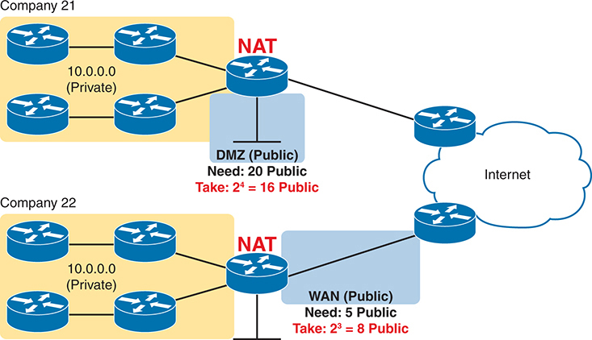
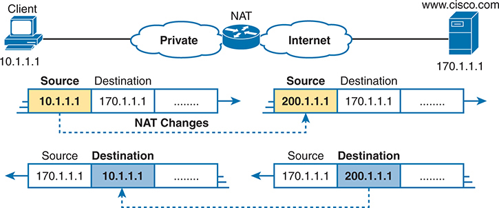
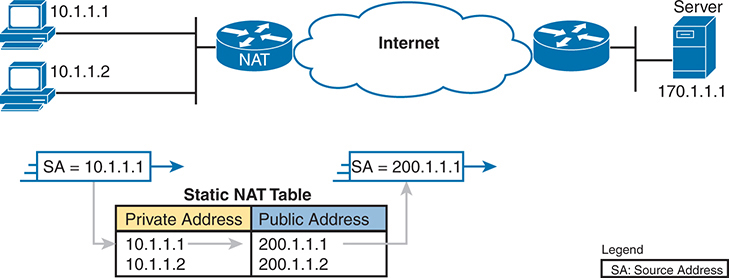
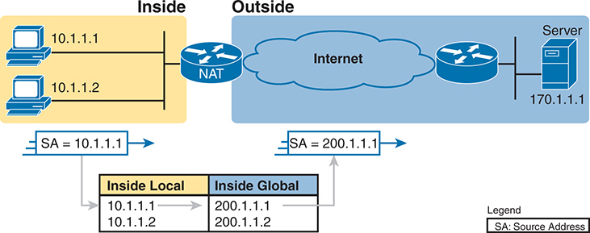
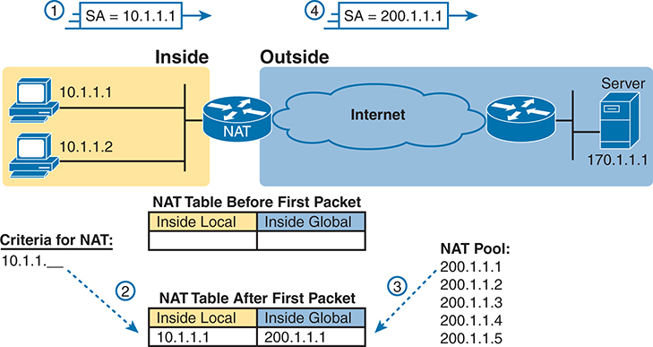
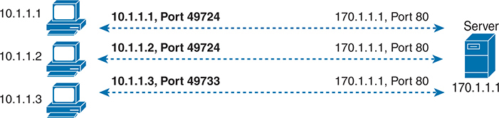
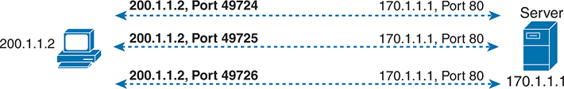
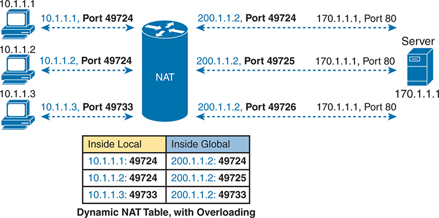
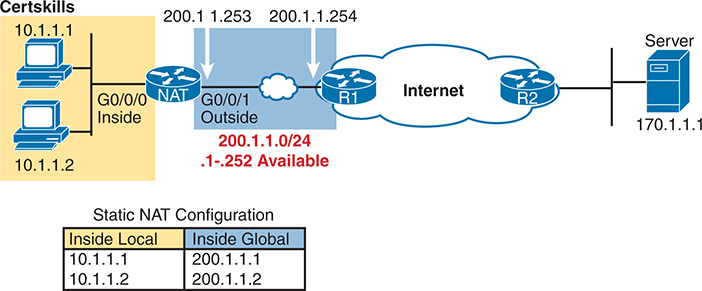
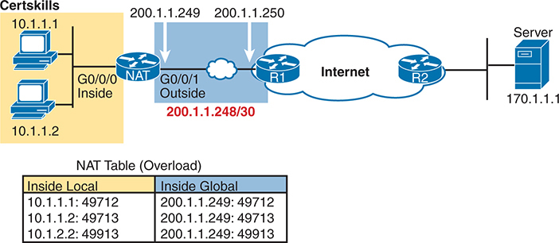

# Chapter 14


## Network Address Translation

This chapter covers the following exam topics:

1.0 Network Fundamentals

1.7 Describe private IPv4 addressing

4.0 IP Services

4.1 Configure and verify inside source NAT using static and pools

Most enterprises and small office/home office (SOHO) networks use Network Address Translation (NAT). NAT helped solve a big problem with IPv4: the IPv4 address space would have been completely assigned by the mid-1990s without it. If that had happened, Internet growth would have slowed significantly. NAT helped delay the exhaustion of the IPv4 public address space by several decades, giving time for the long-term solution--IPv6--to mature.

This chapter breaks the topics into two major sections. The first explains the basic concept behind NAT, how several variations of NAT work, and how the Port Address Translation (PAT) variation conserves the IPv4 address space. The final section shows how to configure NAT from the Cisco IOS Software command-line interface (CLI) and how to troubleshoot NAT.

### "Do I Know This Already?" Quiz

Take the quiz (either here or use the PTP software) if you want to use the score to help you decide how much time to spend on this chapter. The letter answers are listed at the bottom of the page following the quiz. [Appendix C](vol2_appc.md#appc), found both at the end of the book as well as on the companion website, includes both the answers and explanations. You can also find both answers and explanations in the PTP testing software.

**Table 14-1** "Do I Know This Already?" Foundation Topics Section-to-Question Mapping

| Foundation Topics Section | Questions |
| --- | --- |
| Network Address Translation Concepts | 1-3 |
| NAT Configuration and Troubleshooting | 4-6 |

**[1](vol2_ch14.md#ques14_1a).** Which of the following are not private addresses according to RFC 1918? (Choose two answers.)

1. 172.31.1.1
2. 172.33.1.1
3. 10.255.1.1
4. 10.1.255.1
5. 191.168.1.1

**[2](vol2_ch14.md#ques14_2a).** What causes the NAT router to create NAT table entries when using static NAT for inside addresses only?

1. The first packet from the inside network to the outside network
2. The first packet from the outside network to the inside network
3. Configuration using the **ip nat inside source** command
4. Configuration using the **ip nat outside source** command

**[3](vol2_ch14.md#ques14_3a).** What causes the NAT router to create NAT table entries when using dynamic NAT for inside addresses only?

1. The first packet from the inside network to the outside network
2. The first packet from the outside network to the inside network
3. Configuration using the **ip nat inside source** command
4. Configuration using the **ip nat outside source** command

**[4](vol2_ch14.md#ques14_4a).** An enterprise uses inside source NAT for packets that flow into the Internet, with a working NAT configuration that includes the command **ip nat inside source list alice pool barney**. Which statements must be true for the router to apply NAT to a packet entering an inside interface?

1. ACL alice must match the packet with a permit action.
2. ACL alice must match the packet with a deny action.
3. Pool barney must include the packet's source IP address.
4. Pool barney must include the packet's destination IP address.

**[5](vol2_ch14.md#ques14_5a).** An engineer created the incomplete configuration shown here. The configuration should achieve a typical router source NAT function at a router that connects an enterprise to the Internet and uses a single public IP address. Which answers list commands or parameters that would help complete the configuration? (Choose two answers.)

[Click here to view code image](vol2_ch14_images.md#f0299-01)

```
interface GigabitEthernet0/0/0
 description LAN interface (private)
 ip address 10.1.1.1 255.255.255.0
 ip nat inside
interface GigabitEthernet0/0/1
 description WAN interface (public)
 ip address 200.1.1.249 255.255.255.252
ip nat inside source list 1 interface GigabitEthernet0/0/1
access-list 1 permit 10.1.1.0 0.0.0.255
```

1. The **ip nat outside** command
2. The **ip nat pat** command
3. The **overload** keyword
4. The **ip nat pool** command
5. The **inside** keyword

**[6](vol2_ch14.md#ques14_6a).** Examine the following **show** command output on a router configured for dynamic NAT:

[Click here to view code image](vol2_ch14_images.md#f0300-01)

```
-- Inside Source
access-list 1 pool fred refcount 2288
 pool fred: netmask 255.255.255.240
 start 200.1.1.1 end 200.1.1.7
 type generic, total addresses 7, allocated 7 (100%), misses 965
```

Users are complaining about not being able to reach the Internet. Which of the following is the most likely cause?

1. The problem is not related to NAT, based on the information in the command output.
2. The NAT pool does not have enough entries to satisfy all requests.
3. Standard ACL 1 cannot be used; an extended ACL must be used.
4. The command output does not supply enough information to identify the problem.

Answers to the "Do I Know This Already?" quiz:

**[1](vol2_appc.md#ques14_1)** B, E

**[2](vol2_appc.md#ques14_2)** C

**[3](vol2_appc.md#ques14_3)** A

**[4](vol2_appc.md#ques14_4)** A

**[5](vol2_appc.md#ques14_5)** A, C

**[6](vol2_appc.md#ques14_6)** B

### Foundation Topics

### Network Address Translation Concepts

The original design for the Internet required every organization to ask for and receive one or more registered public classful IPv4 network numbers. However, the world would have run out of unique public IPv4 addresses decades ago following that plan. Network Address Translation (NAT) served as part of the short-term solution, delaying the day when the world ran out of public IPv4 addresses.

#### IPv4 Address Conservation with NAT

[Figure 14-1](vol2_ch14.md#ch14fig01) shows some examples of using private and public addresses in enterprises today and how they reduce the use of public IPv4 addresses. Each company uses NAT on a router connected to the Internet. With the original plan, both companies would have needed a public Class B IPv4 network containing 65,536 public IPv4 addresses each. Instead, one company uses a small Classless InterDomain Routing ([CIDR](vol2_gloss.md#gloss_067)) block of 16 public addresses, while the other uses only 8. For the addresses used internally by the computers, per their settings, both companies use any [private IP networks](vol2_gloss.md#gloss_268) they choose, making the most common choice: to use Class A private network 10.0.0.0.

The design uses NAT but relies on private networks and public CIDR blocks. To review from [Part IV](vol2_part04.md#part04) of the Volume 1 book, RFC 1918 reserves a set of networks never to be used as registered public IP networks. Companies and households can use these networks internally, as shown in [Figure 14-1](vol2_ch14.md#ch14fig01). (Much of the rest of the chapter explains how and why.) [Table 14-2](vol2_ch14.md#ch14tab02) shows the private address space.





Both companies have private networks using the I P address range 10 dot 0 dot 0 dot 0 slash 8. Company 21, depicted at the top, has its private network connected to a N A T device, which then connects to a Demilitarized Zone (D M Z) labeled Public. The D M Z requires 20 public I P addresses, but through the use of N A T, only 16 public addresses are utilized, as indicated by the note Take: 2 to the power of 4 equals 16 Public. The D M Z is connected to the Internet, represented by a cloud symbol on the right. Company 22, shown at the bottom, also has its private network connected to a N A T device, which then connects to a Wide Area Network (W A N) labeled Public. The W A N needs 5 public I P addresses, but by using N A T, only 8 public addresses are taken, as indicated by the note Take: 2 to the power of 3 equals 8 Public. This W A N is also connected to the Internet.

**Figure 14-1** *NAT with Small CIDR Blocks Saving IPv4 Addresses*


**Table 14-2** RFC 1918 Private Address Space

| Range of IP Addresses | Network(s) | Class of Networks | Number of Networks |
| --- | --- | --- | --- |
| 10.0.0.0 to 10.255.255.255 | 10.0.0.0 | A | 1 |
| 172.16.0.0 to 172.31.255.255 | 172.16.0.0 - 172.31.0.0 | B | 16 |
| 192.168.0.0 to 192.168.255.255 | 192.168.0.0 - 192.168.255.0 | C | 256 |

Any organization can use these network numbers. However, no organization can advertise these networks using a routing protocol on the Internet, and routers in the Internet will not attempt to forward packets sent to private addresses.

The short-term public address conservation plan combines NAT with CIDR blocks of public addresses, as shown in [Figure 14-1](vol2_ch14.md#ch14fig01). These *CIDR blocks* act like a public IP network, giving each company a consecutive set of public IPv4 addresses but allowing sizes of any power of 2. Internet routers will advertise routes for these public addresses so that the routers will forward those packets to the NAT router.

Comparing private and public addresses used with NAT, a company needs enough private IP addresses so all devices within the company have a unique address. However, companies require only a small set of public addresses when using NAT because the hosts inside the enterprise will share the public IP addresses. [Table 14-3](vol2_ch14.md#ch14tab03) summarizes these critical features that have helped extend the life of IPv4 by decades.


**Table 14-3** Three Important Functions That Extended the Life of IPv4

| Feature | RFC(s) | Main Benefits |
| --- | --- | --- |
| CIDR[\*](vol2_ch14.md#tfn14_3_1a) | 4632 | Assign more-specific public IPv4 address blocks to companies than Class A, B, and C networks.  Aggregate routes to public IPv4 addresses based on a worldwide address allocation plan. |
| NAT[\*](vol2_ch14.md#tfn14_3_1a) | 3022 | Enable approximately 65,000 TCP/UDP sessions to be supported by a single public IPv4 address. |
| Private Networks | 1918 | Enable the use of NAT for enterprise Internet connections, with private addresses used inside the enterprise. |

[\*](vol2_ch14.md#tfn14_3_1)CIDR and NAT may be better known for their original RFCs (1518, 1519 for CIDR; 1631 for NAT).

Note

This chapter shows NAT implemented on routers, but firewalls also support NAT.

#### Inside Source NAT

The NAT feature of routers and firewalls includes several variations. However, the one CCNA exam topic about NAT uses the phrase [inside source NAT](vol2_gloss.md#gloss_325), which refers to NAT as typically used at the edge of an enterprise, as shown in [Figure 14-1](vol2_ch14.md#ch14fig01). This next topic introduces the core concepts of inside source NAT, but be aware that all discussions in this chapter refer to only inside source NAT.

NAT, defined in RFC 3022, allows a host using a private IP address to communicate with other hosts through the Internet. NAT achieves its goal by using a valid registered public IP address to represent the private address to the rest of the Internet. The NAT function changes the private IP addresses to publicly registered IP addresses inside each IP packet, as shown in [Figure 14-2](vol2_ch14.md#ch14fig02).




The diagram is segmented into multiple T L V components, showing the structure and organization within an Ethernet frame. The entire frame is divided into sections, each representing a T L V element. Each T L V component consists of three fields: Type, Length, and Value. These fields are visually separated and color-coded to enhance clarity. Starting from the left, the diagram begins with an Ethernet header, followed by a series of T L V elements. The first T L V element is broken down into three parts: a yellow field labeled Type, a yellow field labeled Length, and a yellow field labeled Value. This pattern repeats for the subsequent T L V elements. The second T L V element is shown with blue fields for Type, Length, and Value, and the third T L V element returns to yellow fields. The Type field specifies the kind of information being conveyed, the Length field indicates the size of the Value field, and the Value field contains the actual information. This structure allows L L D P to be flexible and extensible, enabling the inclusion of various types of information within a single L L D P message.

**Figure 14-2** *NAT IP Address Swapping: Private Addressing*


Notice that the router, performing NAT, changes the packet's source IP address when the packet leaves the private organization. The router performing NAT also changes the destination address in each packet returned to the private network. (Network 200.1.1.0 is a registered network in [Figure 14-2](vol2_ch14.md#ch14fig02).) The NAT feature, configured in the router labeled NAT, performs the translation.

The next few pages discuss three variants of inside source NAT: static NAT, dynamic NAT, and [Port Address Translation (PAT)](vol2_gloss.md#gloss_257), also called [NAT overload](vol2_gloss.md#gloss_222). All translate the addresses as shown in [Figure 14-2](vol2_ch14.md#ch14fig02); however, most IPv4 networks use PAT because it is the only variant that conserves public IP addresses.

#### Static NAT

Static NAT works as shown in [Figure 14-2](vol2_ch14.md#ch14fig02) but with a static one-to-one mapping of private and public addresses. To help you understand the implications of static NAT and to explain several key terms, [Figure 14-3](vol2_ch14.md#ch14fig03) shows a similar example with more information.




At the top of the image, a network switch is depicted with three I P phones and three computers connected below it. The I P phones are categorized into three types: Old Cisco, New Cisco, and Non Cisco. The switch uses different protocols to communicate with these phones: C D P (Cisco Discovery Protocol) for Old Cisco phones, C D P and L L D P hyphen M E D (Link Layer Discovery Protocol - Media Endpoint Discovery) for New Cisco phones, and L L D P hyphen M E D for Non Cisco phones. The setup is divided into two V L A Ns: Voice V L A N and Data V L A N. The Voice V L A N is labeled as V L A N 20, and it is assigned to the I P phones. Below each I P phone, a corresponding computer is connected, all of which are assigned to the Data V L A N, labeled as V L A N 21. The diagram visually emphasizes the separation of voice and data traffic through V L A Ns, ensuring that voice traffic from the I P phones (V L A N 20) is segregated from data traffic from the computers (V L A N 21).

**Figure 14-3** *Static NAT Showing Inside Local and Global Addresses*

First, the concepts: The company's ISP has assigned it a registered public Class C network 200.1.1.0. The settings on all the computers inside the enterprise use addresses in private Class A network 10.0.0.0. Therefore, the NAT router must make the private IP addresses in packets appear as part of network 200.1.1.0. So, the NAT router changes the source IP addresses in the packets going from left to right in the figure.


Static NAT requires the direct configuration of the NAT table entries that tell NAT the addresses to change. In [Figure 14-3](vol2_ch14.md#ch14fig03), inside source NAT (as mentioned in the exam topics) relies on global command **ip nat inside source static 10.1.1.1 200.1.1.1** to add the first table entry. You could then add other static NAT table entries up to the number of available public addresses.

With a one-to-one mapping between private and public addresses, static NAT does not reduce the use of public IP addresses. In [Figure 14-3](vol2_ch14.md#ch14fig03), because the enterprise has a single registered Class C network, it can support at most 254 private IP addresses with NAT, with the usual two reserved numbers (the network number and network broadcast address).

#### Inside Local and Inside Global Addresses

The NAT table depicted in [Figure 14-3](vol2_ch14.md#ch14fig03) uses the terms *private address* and *public address* for clarity. However, Cisco commands use the terms [inside local](vol2_gloss.md#gloss_175) for the private addresses and [inside global](vol2_gloss.md#gloss_174) for the public addresses.

To better understand NAT terminology, first think of any network diagram that includes NAT. Separate it into two parts, on either side of the router performing NAT. One side contains the enterprise's network (or your home network with a SOHO router). The other side contains the Internet. In Cisco NAT terminology, *inside* refers to the enterprise side, and *outside* refers to the Internet side.

Two other terms refer to the address pair in a NAT table entry. For instance, [Figures 14-2](vol2_ch14.md#ch14fig02) and [14-3](vol2_ch14.md#ch14fig03) show a host with private address 10.1.1.1. Those figures also show NAT translating that address to public address 200.1.1.1. So NAT on Cisco routers refers to these associated addresses as follows:

**Inside local address:** The address which represents the inside host in packets that travel through the enterprise (local) network. You find this address in the host's settings. It is typically a private IP address when using inside source NAT. For example, address 10.1.1.1 in [Figure 14-4](vol2_ch14.md#ch14fig04).


**Inside global address:** The address represents the inside host in packets traveling over the global Internet. You do not find this address in a host's settings but rather in the NAT table. It is typically a public IP address, so Internet routers can forward the packet. For example, 200.1.1.1 in [Figure 14-4](vol2_ch14.md#ch14fig04).

[Figure 14-4](vol2_ch14.md#ch14fig04) repeats the same example as [Figure 14-3](vol2_ch14.md#ch14fig03), with some of the terminology shown.




The network topology is divided into two main sections: Inside and Outside. On the Inside section, there are two personal computers with I P addresses 10 dot 1 dot 1 dot 1 and 10 dot 1 dot 1 dot 2. These computers are connected to a router that performs N A T. The router is connected to the Internet, represented by a cloud symbol, which leads to another router on the Outside section. This second router is connected to a server with the I P address 170 dot 1 dot 1 dot 1. The Inside section is shaded yellow, and the Outside section is shaded blue. The image highlights the translation of source addresses (S A) as packets move from Inside to Outside. For instance, a packet originating from the computer with I P address 10 dot 1 dot 1 dot 1 has its source address (S A) translated to 200 dot 1 dot 1 dot 1 as it exits the N A T router towards the Internet. This is indicated by a blue arrow labeled S A equals 200 dot 1 dot 1 dot 1 pointing from the N A T router to the Internet. Below the main diagram, there is a table illustrating the relationship between Inside Local and Inside Global addresses. The Inside Local addresses are the original I P addresses of the devices within the internal network (10 dot 1 dot 1 dot 1 and 10 dot 1 dot 1 dot 2). The Inside Global addresses are the public I P addresses assigned by the N A T router for communication over the Internet (200 dot 1 dot 1 dot 1 and 200 dot 1 dot 1 dot 2). A legend at the bottom right corner explains that S A stands for Source Address.

**Figure 14-4** *Static NAT Terminology*


#### Dynamic NAT

Dynamic NAT is similar to static NAT but with one crucial difference. Like static NAT, the NAT router creates a one-to-one mapping between an inside local and inside global address and changes the IP addresses in packets as they exit and enter the inside network. Because of the one-to-one mappings, it also does not conserve public IPv4 addresses. But the name *dynamic NAT* gives away the big difference: it dynamically creates NAT table entries. That dynamic behavior also adds some protection against attackers in the Internet.

Dynamic NAT sets up a pool of possible inside global addresses and defines matching criteria to determine which inside local IP addresses should be translated with NAT. For example, in [Figure 14-5](vol2_ch14.md#ch14fig05), the NAT router has a pool of five inside global IP addresses: 200.1.1.1 through 200.1.1.5. Dynamic NAT also needs matching logic to initiate the translation of any inside local addresses that start with 10.1.1.





A diagram is divided into two main sections labeled Inside and Outside. On the left side, within the Inside segment, there are two personal computers with I P addresses 10 dot 1 dot 1 dot 1 and 10 dot 1 dot 1 dot 2, respectively. These devices are connected to a N A T router, which serves as the intermediary for translating local addresses to global addresses. The N A T router is positioned between the inside network and the internet, depicted as a cloud labeled Outside. On the right side, within the Outside segment, the internet connects to a remote server with the I P address 170 dot 1 dot 1 dot 1, illustrating a target server that internal clients may communicate with. Above the N A T router, a sequence of steps illustrates the translation process: An arrow labeled 1 shows the source address (S A) of the initial packet from the inside network as 10 dot 1 dot 1 dot 1. A section below the N A T router labeled N A T Table Before First Packet shows the table as empty. A second section labeled N A T Table After First Packet shows the entry after translation, where the Inside Local address 10 dot 1 dot 1 dot 1 is mapped to the Inside Global address 200 dot 1 dot 1 dot 1. An arrow labeled 4 shows the translated source address (S A) as 200 dot 1 dot 1 dot 1 when the packet exits to the outside network. To the right of the N A T table sections, there is a N A T Pool listing the available global I P addresses for translation: 200 dot 1 dot 1 dot 1, 200 dot 1 dot 1 dot 2, 200 dot 1 dot 1 dot 3, 200 dot 1 dot 1 dot 4, and 200 dot 1 dot 1 dot 5. The diagram indicates that the criteria for N A T includes the internal I P range 10 dot 1 dot 1 dot x.

**Figure 14-5** *Dynamic NAT*

The numbers 1, 2, 3, and 4 in the figure refer to the following sequence of events:

1. Host 10.1.1.1 sends its first packet to the server at 170.1.1.1.
2. As the packet enters the NAT router, the router matches packets with source addresses (inside local addresses) that begin with 10.1.1. Matched packets trigger a new NAT table entry as needed. In this case, a packet sourced from 10.1.1.1 causes a new NAT table entry.
3. To create the new NAT table entry, the NAT router must allocate an IP address from the valid inside global address pool. It picks the first one available (200.1.1.1, in this case) and adds it to the NAT table to complete the entry.
4. The NAT router translates the source IP address and forwards the packet.

The dynamic entry stays in the table as long as continuing packets match the NAT table entry. If no packets need a NAT table entry for a configured timeout value, the router will remove the dynamic entry. You can also manually clear the dynamic entries from the table using the **clear ip nat translation \*** command.

On an important security note, dynamic NAT allows new NAT table entries if initiated by inside hosts only. Dynamic NAT triggers new NAT table entries only for packets entering inside interfaces. For example, a PC user in the inside network can connect to a website in the Internet. The first packet it sends to the web server in the Internet enters the NAT router's inside interface, triggering a new entry. However, a PC user in the Internet cannot connect to a web server in the inside network. The first packet it sends would enter the outside interface and not trigger a new NAT table entry. That simple difference with dynamic NAT provides a primary security feature of only allowing new connections initiated by inside users.

Note that with predefined NAT table entries, static NAT has no restrictions for triggering new NAT table entries: a static NAT table entry would allow connections initiated by Internet users. So, engineers often use static NAT when that is the goal--to allow new connections from hosts in the Internet to a server inside the company.

By design, the NAT pool typically contains fewer addresses than the total number of hosts inside the enterprise. The router allocates addresses from the pool until none remain. If a new packet arrives, triggering the need for a new NAT table entry, but the pool has no unused addresses, the router simply discards the packet. The user must try again until a NAT entry times out, at which point the NAT function works for the next host that sends a packet. Essentially, the inside global address pool needs to be as large as the maximum number of concurrent hosts that need to use the Internet simultaneously--unless you use PAT, as explained in the next section.

#### Overloading NAT with Port Address Translation

Static NAT and dynamic NAT use one-to-one mappings between inside local and inside global addresses, so they do not reduce the number of public IPv4 addresses an enterprise needs. The NAT Overload feature, also called Port Address Translation (PAT), solves this problem. Overloading uses a one-to-many mapping, allowing NAT to scale to support many inside hosts with only a few public IP addresses.

PAT uses the transport layer protocols as a means to share public addresses. To see how, first consider the idea of three separate TCP connections to a web server, from three different hosts, as shown in [Figure 14-6](vol2_ch14.md#ch14fig06).




The first P C, with I P address 10 dot 1 dot 1 dot 1, is connected to the server at I P address 170 dot 1 dot 1 dot 1 using source port 49724. The connection is depicted by a dashed line from the P C to the server, labeled 10 dot 1 dot 1 dot 1, Port 49724 on the P C side and 170 dot 1 dot 1 dot 1, Port 80 on the server side. The second P C, with I P address 10 dot 1 dot 1 dot 2, also connects to the server at I P address 170 dot 1 dot 1 dot 1 using the same source port, 49724. This connection is similarly shown with a dashed line, labeled 10 dot 1 dot 1 dot 2, Port 49724 on the P C side and 170 dot 1 dot 1 dot 1, Port 80 on the server side. The third P C, with I P address 10 dot 1 dot 1 dot 3, establishes a connection to the server at I P address 170 dot 1 dot 1 dot 1 but uses a different source port, 49733. This connection is represented by another dashed line, labeled 10 dot 1 dot 1 dot 3, Port 49733 on the P C side and 170 dot 1 dot 1 dot 1, Port 80 on the server side.

**Figure 14-6** *Three TCP Connections from Three PCs*

Next, compare those three TCP connections in [Figure 14-6](vol2_ch14.md#ch14fig06) to three similar ones, now with all three TCP connections from one client, as shown in [Figure 14-7](vol2_ch14.md#ch14fig07). The server does realize a difference because the server sees the IP address and TCP port number used by the clients in both figures. However, the server does not care whether the TCP connections come from different hosts or the same host; the server just sends and receives data over each connection.




The diagram highlights the communication between a client with an I P address of 200 dot 1 dot 1 dot 2 and a server with an I P address of 170 dot 1 dot 1 dot 1. The connections are depicted as follows: The first T C P connection originates from the client at I P address 200 dot 1 dot 1 dot 2 using source port 49724 and connects to the server at I P address 170 dot 1 dot 1 dot 1 on destination port 80. The second T C P connection also originates from the client at I P address 200 dot 1 dot 1 dot 2 but uses a different source port, 49725, and connects to the same server at I P address 170 dot 1 dot 1 dot 1 on destination port 80. The third T C P connection, similar to the previous two, originates from the client at I P address 200 dot 1 dot 1 dot 2 using source port 49726 and connects to the server at I P address 170 dot 1 dot 1 dot 1 on destination port 80. Each connection is represented by dashed arrows pointing from the client to the server, emphasizing the use of different source ports for each session while maintaining the same destination I P address and port. This setup demonstrates how multiple T C P connections can be established simultaneously from a single device to a server, each identified uniquely by its source port number. The consistent use of destination port 80 indicates that all connections are likely intended for web traffic.

**Figure 14-7** *Three TCP Connections from One PC*

NAT takes advantage of the fact that, from a transport layer perspective, the server doesn't care whether it has one connection each to three different hosts or three connections to a single host IP address. PAT translates the IP address and the port number when necessary, making what looks like many TCP or UDP flows from different hosts (as in [Figure 14-6](vol2_ch14.md#ch14fig06)) look like the same number of flows from one host (as in [Figure 14-7](vol2_ch14.md#ch14fig07)). [Figure 14-8](vol2_ch14.md#ch14fig08) outlines the logic, with three TCP connections from three different hosts, with the NAT router making them appear as three TCP connections from a single host.





The diagram demonstrates how multiple devices within a local network can share a single public I P address by using different port numbers. On the left side, there are three computers with private I P addresses 10 dot 1 dot 1 dot 1, 10 dot 1 dot 1 dot 2, and 10 dot 1 dot 1 dot 3. Each of these computers is making a request to an external server with the I P address 170 dot 1 dot 1 dot 1 on port 80. The private I P addresses and port numbers of these requests are shown as follows: 10 dot 1 dot 1 dot 1 on port 49724, 10 dot 1 dot 1 dot 2 on port 49725, and 10 dot 1 dot 1 dot 3 on port 49733. These requests are routed through a N A T-enabled device, represented in the center of the diagram. The N A T device translates the private I P addresses and ports to a single public I P address, 200 dot 1 dot 1 dot 2, while preserving unique port numbers for each session. The translated public I P addresses and ports are as follows: 200 dot 1 dot 1 dot 2 on port 49724, 200 dot 1 dot 1 dot 2 on port 49725, and 200 dot 1 dot 1 dot 2 on port 49733. On the right side, the translated requests are directed to the server at 170 dot 1 dot 1 dot 1 on port 80. The arrows in the diagram depict the flow of traffic from the internal private addresses to the external public address through the N A T device, and finally to the server. Below the diagram, a Dynamic N A T Table with Overloading is displayed. This table has columns for Inside Local and Inside Global addresses, listing the mappings as follows: 10 dot 1 dot 1 dot 1 colon 49724 to 200 dot 1 dot 1 dot 2 colon 49724. 10 dot 1 dot 1 dot 2 colon 49725 to 200 dot 1 dot 1 dot 2 colon 49725. 10 dot 1 dot 1 dot 3 colon 49733 to 200 dot 1 dot 1 dot 2 colon 49733.

**Figure 14-8** *NAT Overload (PAT)*


Work through the specifics of the NAT table in [Figure 14-8](vol2_ch14.md#ch14fig08). The inside global column lists a single inside global (public) IP address. Look at the specific port numbers on the inside local side of the table: the TCP connections from 10.1.1.1 and 10.1.1.2 both use TCP ports 49,724. On those same table entries on the inside global side, NAT had to change one of the port numbers to make each address/port combination unique. For the third TCP connection, the port number used by the host (49,733) is not used with NAT inside global address 200.1.1.1, so the NAT router did not need to change the port number.

More generally, PAT works like dynamic NAT, but it uses both address and port numbers in the translation. When PAT creates the dynamic mapping, it notes the incoming packet's source IP address and source transport port for the inside local entry in the table. For a new dynamic table entry, it selects an inside global IP address from the pool and then a port number not already in use with the inside global address.

The NAT router keeps a NAT table entry for every unique combination of inside local IP address and port associated with an inside global address and a unique port. In addition, because the port number field has 16 bits, NAT overload can use 216 port numbers with each inside global (public) address. PAT scales well without needing many registered IP addresses--in many cases, requiring only one inside global IP address.

Real networks use PAT far more than the others of the three inside source NAT types discussed here. Static NAT and Dynamic NAT have their uses, but the fact that they do not reduce public IP address consumption makes them a poor option for the primary NAT feature between an enterprise and the Internet.

### NAT Configuration and Troubleshooting

The sections that follow describe how to configure the three most common variations of NAT: static NAT, dynamic NAT, and PAT, along with the **show** and **debug** commands used to troubleshoot NAT.

#### Static NAT Configuration

Static NAT configuration requires only a few configuration steps. The configuration must include each static mapping between an inside local (private) address and an inside global (public) address. Additionally, NAT must be enabled on the necessary interfaces, identifying the interface as inside or outside. The specific steps are as follows:


Step 1. Use the **ip nat inside** command in interface configuration mode to configure interfaces in the inside part of the NAT design.

Step 2. Use the **ip nat outside** command in interface configuration mode to configure interfaces in the outside part of the NAT design.

Step 3. Use the **ip address** *address mask* command in interface configuration mode to configure a subnet that includes the inside global (public) addresses intended for the design.

Step 4. Use the **ip nat inside source static** *inside-local inside-global* command in global configuration mode to configure the static mappings.

The upcoming examples use the familiar network design and addresses in [Figure 14-9](vol2_ch14.md#ch14fig09). You can see that Certskills has obtained Class C network 200.1.1.0 as a registered network number. That entire network, with mask 255.255.255.0, is configured on the Internet access link between Certskills and the Internet. The two routers on the link use two of the addresses, leaving 252 addresses for use by NAT. The NAT table shows two of those available addresses in static entries.




The network topology is divided into Inside and Outside sections. On the Inside section, there are two personal computers with I P addresses 10 dot 1 dot 1 dot 1 and 10 dot 1 dot 1 dot 2, connected to a router that performs N A T. This router is shown with interface G 0 slash 0 slash 0 connected to the internal network (Inside) and interface G 0 slash 0 slash 1 connected to the external network (Outside). The N A T router is assigned public I P addresses 200 dot 1 dot 1 dot 253 and 200 dot 1 dot 1 dot 254 on its G 0 slash 0 slash 1 interface, representing its connection to the Internet. The public I P address range 200 dot 1 dot 1 dot 0 slash 24 is highlighted, with addresses 200 dot 1 dot 1 dot 1 to 200 dot 1 dot 1 dot 252 available for use. The diagram indicates that I P addresses 200 dot 1 dot 1 dot 1 and 200 dot 1 dot 1 dot 2 are mapped to the internal I P addresses 10 dot 1 dot 1 dot 1 and 10 dot 1 dot 1 dot 2, respectively, as part of the Static N A T configuration. The N A T router connects to the Internet, represented by a cloud symbol, which leads to another router labeled R 1. Router R 1 is connected to Router R 2, which in turn is connected to a server with the I P address 170 dot 1 dot 1 dot 1. The image includes directional arrows showing the flow of traffic and the N A T process. At the bottom of the diagram, a table labeled Static N A T Configuration lists the Inside Local and Inside Global addresses. Inside Local addresses 10 dot 1 dot 1 dot 1 and 10 dot 1 dot 1 dot 2 are mapped to Inside Global addresses 200 dot 1 dot 1 dot 1 and 200 dot 1 dot 1 dot 2, respectively. The diagram uses standard network symbols for computers, routers, and servers, and color-coding to distinguish between the Inside (yellow) and Outside (blue) sections.

**Figure 14-9** *Sample Network for NAT Examples, with Public Class C 200.1.1.0/24*

[Example 14-1](vol2_ch14.md#exa14_1) lists the NAT configuration, using 200.1.1.1 and 200.1.1.2 for the two static NAT mappings.

**Example 14-1** *Static NAT Configuration*

[Click here to view code image](vol2_ch14_images.md#f0308-01)

```
NAT# show running-config
!
! Lines omitted for brevity
!
interface GigabitEthernet0/0/0
 ip address 10.1.1.3 255.255.255.0
 ip nat inside
!
interface GigabitEthernet0/0/1
 ip address 200.1.1.253 255.255.255.0
 ip nat outside
!
ip nat inside source static 10.1.1.2 200.1.1.2
ip nat inside source static 10.1.1.1 200.1.1.1
```

To further explore the configuration, these steps analyze the configuration using the same numbered steps as the configuration checklist just before the example:

1. Interface G0/0/0, connected to the enterprise network, shows an **ip nat inside** command, enabling NAT and identifying it as an inside interface.
2. Interface G0/0/1, connected to the enterprise network, shows an **ip nat outside** command, enabling NAT and identifying it as an outside interface.
3. Interface G0/0/1 uses command **ip address 200.1.1.251 255.255.255.0**, defining connecting subnet 200.1.1.0/24. Unused addresses in this subnet will be available for static mappings.
4. The **ip nat inside source static** global configuration command creates the static mappings, referring to the addresses of the two inside hosts and two addresses in subnet 200.1.1.0/24.

[Example 14-2](vol2_ch14.md#exa14_2) provides a couple of **show** commands listing essential NAT information. The **show ip nat translations** command lists the two static NAT entries created in the configuration. It shows the headings as Cisco terms inside local (with private addresses listed) and inside global (with public addresses listed). The **show ip nat statistics** command mentions the number of currently active translation table entries (with static NAT) that value matches the number of configured NAT table entries. The statistics also include the number of hits, which increments for every packet NAT must translate addresses.

**Example 14-2** *Static NAT Verification*

[Click here to view code image](vol2_ch14_images.md#f0309-01)

```
NAT# show ip nat translations
Pro Inside global      Inside local       Outside local       Outside global
--- 200.1.1.1          10.1.1.1           ---                 ---
--- 200.1.1.2          10.1.1.2           ---                 ---
NAT# show ip nat statistics
Total active translations: 2 (2 static, 0 dynamic; 0 extended)
Outside interfaces:
  GigabitEthernet0/0/1
Inside interfaces:
  GigabitEthernet0/0/0
Hits: 100 Misses: 0
Expired translations: 0
Dynamic mappings:
```

Before leaving static NAT, again consider the public addresses used by NAT. A typical NAT design relies on a subnet connected to the NAT router, with that connected subnet including all the inside global (public) addresses needed by NAT.

The example in this section shows a classic case of using the entire public address block, in this case, 200.1.1.0/24, on the Internet access link between the enterprise and the ISP. The routers on the link use addresses 200.1.1.253 and 200.1.1.254. The **ip address 200.1.1.253 255.255.255.0** command on router R1 in the enterprise results in a connected route for subnet 200.1.1.0/24. That subnet includes the two reserved values (200.1.1.0 and 200.1.1.255) and the two interface addresses (200.1.1.253 and 200.1.1.254). That leaves addresses 200.1.1.1-200.1.1.252 available for use by NAT on the router.

So, the configuration requires a familiar **ip address** interface subcommand, but the address planning requires some thought, with configuration to create a connected route that includes all the public addresses needed for NAT. Any interface on the NAT router will work for this purpose, with the link to the ISP being the most common. The NAT router can also use a loopback interface.

#### Dynamic NAT Configuration

Dynamic NAT configuration has a few similarities with static NAT configuration. You configure the inside and outside interfaces in the same way. You also need to configure a router interface with an IP address and mask so the connected subnet contains all the inside global addresses planned for the design. Unsurprisingly, the difference is that dynamic NAT requires no preconfigured static NAT table entries.

Instead, dynamic NAT monitors packets entering inside interfaces, matching the packets' source addresses with an access control list (ACL). Incoming packets matching an ACL with a permit action trigger the NAT process. Once triggered, the NAT router will create a new NAT table entry if needed. Additionally, the dynamic NAT configuration includes some inside global (public) addresses in the form of a NAT pool. The specific steps are as follows:

Step 1. Use the **ip nat inside** command in interface configuration mode to configure interfaces in the inside part of the NAT design (just like with static NAT).


Step 2. Use the **ip nat outside** command in interface configuration mode to configure interfaces in the outside part of the NAT design (just like with static NAT).

Step 3. Use the **ip address** *address mask* command in interface configuration mode to configure a subnet that includes the inside global (public) addresses intended for the design.

Step 4. Configure an ACL that matches, with a permit action, the packets entering inside interfaces for which the router should apply NAT.

Step 5. Use the **ip nat pool** *name first-address last-address* {**netmask** *subnet-mask* | **prefix-length** *length*} command in global configuration mode to configure the pool of public registered IP addresses.

Step 6. Use the **ip nat inside source list** *acl-number* **pool** *pool-name* command in global configuration mode to enable dynamic NAT. Note the command references the ACL and pool per the previous steps.

The following example shows a sample dynamic NAT configuration using the same network topology as the previous example (see [Figure 14-9](vol2_ch14.md#ch14fig09)). The two inside local addresses--10.1.1.1 and 10.1.1.2--need translation. Unlike the previous static NAT example, however, the configuration in [Example 14-3](vol2_ch14.md#exa14_3) places the public IP addresses (200.1.1.1 and 200.1.1.2) into a pool of dynamically assignable inside global addresses.

**Example 14-3** *Dynamic NAT Configuration*

[Click here to view code image](vol2_ch14_images.md#f0311-01)

```
NAT# show running-config
!
! Lines omitted for brevity
!
interface GigabitEthernet0/0/0
 ip address 10.1.1.3 255.255.255.0
 ip nat inside
!
interface GigabitEthernet0/0/1
 ip address 200.1.1.253 255.255.255.0
 ip nat outside
!
ip nat pool fred 200.1.1.1 200.1.1.2 netmask 255.255.255.252
ip nat inside source list 1 pool fred
!
access-list 1 permit 10.1.1.2
access-list 1 permit 10.1.1.1
```

Dynamic NAT configures the public (global) addresses pool with the **ip nat pool** command listing the first and last numbers in an inclusive range of inside global addresses. For example, if the pool needed 10 addresses, the command might have listed 200.1.1.1 and 200.1.1.10, which means that NAT can use 200.1.1.1 through 200.1.1.10.

Dynamic NAT also performs a verification check on the **ip nat pool** command with the required **netmask** parameter. The addresses in the pool should be in the same subnet, assuming you applied the **netmask** (or **prefix-length**) parameter as a subnet mask. If the addresses reside in different subnets per that math, IOS rejects the **ip nat pool** command. For example, as configured in [Example 14-3](vol2_ch14.md#exa14_3), IOS approves the values per this logic:

* 200.1.1.1 with mask 255.255.255.252 implies subnet 200.1.1.0, broadcast address 200.1.1.3.
* 200.1.1.2 with mask 255.255.255.252 implies subnet 200.1.1.0, broadcast address 200.1.1.3.

If the example had used addresses 200.1.1.1 and 200.1.1.6, with mask 255.255.255.252, IOS would reject that command per this logic:

* 200.1.1.1 with mask 255.255.255.252 implies subnet 200.1.1.0, broadcast address 200.1.1.3.
* 200.1.1.6 with mask 255.255.255.252 implies subnet 200.1.1.4, broadcast address 200.1.1.7.

Dynamic NAT also needs one **ip nat inside source** global command. The command refers to the name of the NAT pool it wants to use for inside global addresses--in this case, fred. It also refers to an IP ACL, which defines the matching logic for inside local IP addresses. So, the logic for the **ip nat inside source list 1 pool fred** command in this example is as follows:

Create NAT table entries that map between hosts matched by ACL 1, for packets entering any inside interface, allocating an inside global address from the pool called fred.

#### Dynamic NAT Verification

[Example 14-4](vol2_ch14.md#exa14_4) shows the NAT status on the NAT router before creating any dynamic NAT table entries, with [Example 14-5](vol2_ch14.md#exa14_5) showing the same commands after user traffic triggered dynamic NAT table entries. In [Example 14-4](vol2_ch14.md#exa14_4), the **show ip nat translations** command output shows a blank line, meaning no NAT table entries exist. The **show ip nat statistics** command shows a counter of the number of dynamic NAT table entries, showing zero active translations.

**Example 14-4** *Dynamic NAT Verifications Before Generating Traffic*

[Click here to view code image](vol2_ch14_images.md#f0312-01)

```
! The next command lists one empty line because NAT has not yet added table entries.
NAT# show ip nat translations

NAT# show ip nat statistics
Total active translations: 0 (0 static, 0 dynamic; 0 extended)
Peak translations: 8, occurred 00:02:44 ago
Outside interfaces:
  GigabitEthernet0/0/1
Inside interfaces:
  GigabitEthernet0/0/0
Hits: 0 Misses: 0
CEF Translated packets: 0, CEF Punted packets: 0
Expired translations: 0
Dynamic mappings:
-- Inside Source
[id 1] access-list 1 pool fred refcount 0
 pool fred: netmask 255.255.255.252
    start 200.1.1.1 end 200.1.1.2
    type generic, total addresses 2, allocated 0 (0%), misses 0
Total doors: 0
Appl doors: 0
Normal doors: 0
Queued Packets: 0
```

Before leaving [Example 14-4](vol2_ch14.md#exa14_4), look closely at the **show ip nat statistics** command at the end of the example. It lists some fascinating troubleshooting information with two different counters labeled "Misses," as highlighted in the example. The first occurrence of this counter, around the midpoint of the command's output, counts the number of times a new packet comes along, needing a NAT entry, but no matching entry exists. At that point, dynamic NAT reacts and builds an entry.

At the end of the command output, the second Misses counter relates to the pool. This counter increments only when dynamic NAT tries to allocate a new NAT table entry, looks for an unused address from the pool, but finds no available addresses. In that case, NAT cannot add the table entry, so the packet cannot be translated--probably resulting in an end user not getting to the application.

Next, [Example 14-5](vol2_ch14.md#exa14_5) updates the output of both commands from [Example 14-4](vol2_ch14.md#exa14_4), this time after the user of the host at 10.1.1.1 telnets to host 170.1.1.1.

**Example 14-5** *Dynamic NAT Verifications After Generating Traffic*

[Click here to view code image](vol2_ch14_images.md#f0313-01)

```
NAT# show ip nat translations
Pro Inside global      Inside local       Outside local       Outside global
--- 200.1.1.1          10.1.1.1           ---                  ---
NAT# show ip nat statistics
Total active translations: 1 (0 static, 1 dynamic; 0 extended)
Peak translations: 11, occurred 00:04:32 ago
Outside interfaces:
  GigabitEthernet0/0/1
Inside interfaces:
  GigabitEthernet0/0/0
Hits: 69 Misses: 1
Expired translations: 0
Dynamic mappings:
-- Inside Source
access-list 1 pool fred refcount 1
[eml fred: netmask 255.255.255.252
    start 200.1.1.1 end 200.1.1.2
    type generic, total addresses 2, allocated 1 (50%), misses 0
```

The example begins with host 10.1.1.1 telnetting to 170.1.1.1 (not shown), with the NAT router creating a NAT entry. The NAT table shows a single entry, mapping 10.1.1.1 to 200.1.1.1. And the first line in the output of the **show ip nat statistics** command lists a counter for 1 active translation, as shown in the NAT table at the top of the example.

Take an extra moment to consider the highlighted line, where the **show ip nat statistics** command lists 1 miss and 69 hits. The first miss counter, now at 1, means that one packet arrived that needed NAT, but there was no NAT table entry. NAT reacted and added a NAT table entry, so the hit counter of 69 means that the following 69 packets used the newly added NAT table entry.

At the bottom of the example, the second misses counter remains at 0. The counter did not increment because the NAT pool had enough inside global IP addresses to allocate the new NAT table entry. Also, note that the last line lists statistics on the number of pool members allocated (1) and the percentage of the pool currently in use (50%).

The dynamic NAT table entries time out after a period of inactivity, releasing the inside global addresses for future use. [Example 14-6](vol2_ch14.md#exa14_6) shows a sequence in which two different hosts use inside global address 200.1.1.1. Host 10.1.1.1 uses inside global address 200.1.1.1 at the beginning of the example. Then, instead of just waiting on the NAT entry to time out, the example clears the NAT table entry with the **clear ip nat translation \*** command. At that point, the user at 10.1.1.2 telnets to 170.1.1.1, and the new NAT table entry appears, using the same 200.1.1.1 inside global address.

**Example 14-6** *Example of Reuse of a Dynamic Inside Global IP Address*

[Click here to view code image](vol2_ch14_images.md#f0314-01)

```
! Host 10.1.1.1 currently uses inside global 200.1.1.1
NAT# show ip nat translations
Pro Inside global      Inside local       Outside local       Outside global
--- 200.1.1.1          10.1.1.1           ---                 ---
NAT# clear ip nat translation *
!
! telnet from 10.1.1.2 to 170.1.1.1 happened next; not shown
!
! Now host 10.1.1.2 uses inside global 200.1.1.1
NAT# show ip nat translations
Pro Inside global      Inside local       Outside local       Outside global
--- 200.1.1.1          10.1.1.2           ---                 ---
!
! Telnet from 10.1.1.1 to 170.1.1.1 happened next; not shown
!
NAT# debug ip nat
IP NAT debugging is on
Oct 20 19:23:03.263: NAT*: s=10.1.1.1->200.1.1.2, d=170.1.1.1 [348]
Oct 20 19:23:03.267: NAT*: s=170.1.1.1, d=200.1.1.2->10.1.1.1 [348]
Oct 20 19:23:03.464: NAT*: s=10.1.1.1->200.1.1.2, d=170.1.1.1 [349]
Oct 20 19:23:03.568: NAT*: s=170.1.1.1, d=200.1.1.2->10.1.1.1 [349]
```

Finally, at the end of [Example 14-6](vol2_ch14.md#exa14_6), you see that host 10.1.1.1 has telnetted to another host in the Internet, plus the **debug ip nat** command output. This **debug** command causes the router to issue a message every time a packet has its address translated for NAT. You generate the output results by entering a few lines from the Telnet connection from 10.1.1.1 to 170.1.1.1. The debug output tells you that host 10.1.1.1 uses inside global address 200.1.1.2 for this new connection.

#### NAT Overload (PAT) Configuration

The static and dynamic NAT configurations matter, but this section's NAT overload (PAT) configuration matters more. PAT allows NAT to support many inside local IP addresses with only one or a few inside global IP addresses. By translating the inside local address and port number to a single inside global address but with a unique port number, NAT can support many (over 65,000) concurrent TCP and UDP flows with only one public global address.

PAT configuration includes two variations:

* One with a pool of several addresses
* One with a single inside global address from an existing interface

PAT configuration that uses a pool of addresses looks exactly like dynamic NAT, except the **ip nat inside source list** global command has an **overload** keyword added to the end. Summarizing the configuration differences between PAT, when using a pool of addresses, and dynamic NAT:

Use the same steps for configuring dynamic NAT, as outlined in the previous section, but include the **overload** keyword at the end of the **ip nat inside source list** global command.


Alternatively, PAT can use a single inside global address effectively. Your router at home likely does that. It leases a single public IP address from your ISP and performs NAT using it as the inside global (public) address. An enterprise router can do the same and use a public IP address on an interface, typically the interface connecting the router to the Internet. With that single address, NAT can support over 65,000 concurrent flows. If each computer averaged 10 concurrent flows, one public IP address would support around 6500 inside hosts.

The following checklist details the configuration when using an interface IP address as the sole inside global IP address:

Step 1. As with dynamic and static NAT, configure the **ip nat inside** interface subcommand to identify inside interfaces.


Step 2. As with dynamic and static NAT, configure the **ip nat outside** interface subcommand to identify outside interfaces.

Step 3. As with dynamic and static NAT, use the **ip address** *address mask* command in interface configuration mode to configure a subnet that includes the inside global (public) addresses intended for the design.

Step 4. As with dynamic NAT, configure an ACL that matches the packets entering inside interfaces.

Step 5. Configure the **ip nat inside source list** *acl-number* **interface** *type/number* **overload** global configuration command, referring to the ACL from the previous step and to the interface whose connected subnet includes the NAT inside global addresses used for translations.

The vital difference between dynamic NAT versus PAT configuration comes from the use of the **overload** keyword. Step 5 notes the PAT version of the **ip nat inside source** command, which ends with **overload**. Dynamic NAT (without PAT) omits the **overload** keyword.

The following example demonstrates PAT configuration using a single interface IP address. [Figure 14-10](vol2_ch14.md#ch14fig10) shows the same familiar network with a few changes: CIDR block 200.1.1.248/30 instead of Class C network 200.1.1.0. The CIDR block has two usable addresses: 200.1.1.249 and 200.1.1.250. The NAT feature on the Certskills router translates all NAT addresses to its interface address: 200.1.1.249.





The diagram is divided into two main sections labeled Inside and Outside, connected via the internet. On the left side, within the Inside segment, there are two personal computers with I P addresses 10 dot 1 dot 1 dot 1 and 10 dot 1 dot 1 dot 2, respectively, connected to a N A T router via interface G 0 slash 0. This router is positioned between the inside network and the outside network, facilitating the translation of local addresses to global addresses. This section is labeled Certskills. In the center, the N A T router is connected to the internet via interface G 0 slash 1, which is labeled Outside. The router has a range of I P addresses 200 dot 1 dot 1 dot 248 slash 30 for its global interface, with specific addresses 200 dot 1 dot 1 dot 249 and 200 dot 1 dot 1 dot 250 shown. On the right side, within the Outside segment, the internet connects to a remote server with the I P address 170 dot 1 dot 1 dot 1, illustrating the target server that internal clients may communicate with. A N A T table is depicted at the bottom of the diagram, labeled N A T Table (Overload). This table shows the mapping of inside local addresses to inside global addresses with associated port numbers: 10 dot 1 dot 1 dot 1 colon 49712 is mapped to 200 dot 1 dot 1 dot 249 colon 49712. 10 dot 1 dot 1 dot 2 colon 49713 is mapped to 200 dot 1 dot 1 dot 249 colon 49713. 10 dot 2 dot 2 dot 2 colon 49913 is mapped to 200 dot 1 dot 1 dot 249 colon 49913.

**Figure 14-10** *PAT Example Using an Interface Inside Global Address*


In [Example 14-7](vol2_ch14.md#exa14_7), which shows the NAT overload configuration, NAT translates using inside global address 200.1.1.249 only, so the NAT pool is not required.

**Example 14-7** *NAT Overload Configuration*

[Click here to view code image](vol2_ch14_images.md#f0316-01)

```
NAT# show running-config
!
! Lines Omitted for Brevity
!
interface GigabitEthernet0/0/0
 ip address 10.1.1.3 255.255.255.0
 ip nat inside
!
interface GigabitEthernet0/0/1
 ip address 200.1.1.249 255.255.255.252
 ip nat outside
!
ip nat inside source list 1 interface GigabitEthernet0/0/1 overload
!
access-list 1 permit 10.1.1.2
access-list 1 permit 10.1.1.1
```

The **ip nat inside source list 1 interface gigabitethernet0/0/1 overload** command has several parameters, but if you understand the dynamic NAT configuration, the new parameters shouldn't be too hard to grasp. The **list 1** parameter means the same thing as for dynamic NAT: inside local IP addresses matching ACL 1 have their addresses translated. The **interface gigabitethernet 0/0/1** parameter indicates that the only inside global IP address available is the IP address of the NAT router's interface gigabitethernet 0/0/1. Finally, the **overload** parameter enables NAT overload (PAT). Without this parameter, the router does not perform overload, just dynamic NAT.

[Example 14-8](vol2_ch14.md#exa14_8) shows the NAT translation table after the two hosts created a total of three TCP connections. Take some time with the output of the **show ip nat translations** command. It shows the three dynamic entries in the table. Now the inside global and inside local columns list both an IP address and port number (with the numbers matching [Figure 14-10](vol2_ch14.md#ch14fig10)).

**Example 14-8** *NAT Overload Verification*

[Click here to view code image](vol2_ch14_images.md#f0317-01)

```
NAT# show ip nat translations
Pro  Inside global      Inside local       Outside local      Outside global
tcp  200.1.1.249:49712  10.1.1.1:49712     170.1.1.1:23       170.1.1.1:23
tcp  200.1.1.249:49713  10.1.1.2:49713     170.1.1.1:23       170.1.1.1:23
tcp  200.1.1.249:49913  10.1.1.2:49913     170.1.1.1:23       170.1.1.1:23

NAT# show ip nat statistics
Total active translations: 3 (0 static, 3 dynamic; 3 extended)
Peak translations: 12, occurred 00:01:11 ago
Outside interfaces:
  GigabitEthernet0/0/1
Inside interfaces:
  GigabitEthernet0/0/0
Hits: 103 Misses: 3
Expired translations: 0
Dynamic mappings:
-- Inside Source
access-list 1 interface GigabitEthernet0/0/1 refcount 3
```

Finally, in the output of the **show ip nat statistics** command, the hits and misses counters work as with dynamic NAT. The three misses count the first packet in each TCP connection, which triggered the creation of the NAT table entries. Later packets that arrive with a pre-existing NAT table entry cause an increment in the hits counter.

#### NAT Troubleshooting

The majority of NAT troubleshooting issues relate to getting the configuration correct. Inside source NAT has several configuration options--static, dynamic, and PAT--with several configuration commands for each. You should work hard at building skills with the configuration to quickly recognize configuration mistakes. The following troubleshooting checklist summarizes the most common source NAT issues, most of which relate to incorrect configuration.

* **Reversed inside and outside:** Ensure that the configuration includes the **ip nat inside** and **ip nat outside** interface subcommands and that the commands are not reversed (the **ip nat inside** command on outside interfaces, and vice versa). With source NAT, only the packets entering inside interfaces trigger new translations, so designating the correct inside interfaces is particularly important.
* **Static NAT:** Check the **ip nat inside source static** command to ensure it lists the inside local address first and the inside global IP address second.
* **Dynamic NAT (ACL):** Ensure that the ACL configured to match packets sent by the inside hosts match that host's packets before any NAT translation has occurred. For example, if an inside local address of 10.1.1.1 should be translated to 200.1.1.1, ensure that the ACL matches source address 10.1.1.1, not 200.1.1.1.
* **Dynamic NAT (pool):** For dynamic NAT without PAT, ensure the pool has enough IP addresses. When not using PAT, each inside host consumes one IP address from the pool. A large or growing value in the second misses counter in the **show ip nat statistics** command output can indicate this problem. Also, compare the configured pool to the list of addresses in the NAT translation table (**show ip nat translations**). Finally, if the pool is small, the problem may be that the configuration intended to use PAT and is missing the **overload** keyword (see the next item).
* **PAT:** It is easy to forget to add the **overload** option on the end of **ip nat inside source list** command. PAT configuration with a pool is identical to a valid dynamic NAT configuration, except that PAT requires the **overload** keyword. Without it, dynamic NAT works, but often with too few inside global addresses in the pool. The NAT router will not translate or forward traffic for hosts if there is no available pool IP address for their traffic, so some hosts experience an outage.
* **ACL:** As mentioned in [Chapter 8](vol2_ch08.md#ch08), "[Applied IP ACLs](vol2_ch08.md#ch08)," you can always add a check for ACLs that cause a problem. Perhaps NAT has been configured correctly, but an ACL exists on one of the interfaces, discarding the packets. Note that the order of operations inside the router matters in this case. For packets entering an interface, IOS processes ACLs before inside source NAT. For packets exiting an interface, IOS processes any outbound ACL after translating the addresses due to inside source NAT.
* **User traffic required:** Dynamic NAT and PAT react to user traffic. If you configure NAT in a lab, NAT does not act to create translations (**show ip nat translations**) until some user traffic enters the NAT router on an inside interface, triggering NAT to do a translation. The NAT configuration can be perfect, but if no inbound traffic occurs that matches the NAT configuration, NAT does nothing.
* **IPv4 routing:** IPv4 routing could prevent packets from arriving on either side of the NAT router. Note that the routing must work for the destination IP addresses used in the packets. For instance, routers in the Internet must have routes that match the public addresses used by NAT so that packets destined to those addresses arrive at the NAT router.

### Chapter Review

One key to doing well on the exams is to perform repetitive spaced review sessions. Review this chapter's material using either the tools in the book or interactive tools for the same material found on the book's companion website. Refer to the "[Your Study Plan](vol2_appf.md#appf)" element for more details. [Table 14-4](vol2_ch14.md#ch14tab04) outlines the key review elements and where you can find them. To better track your study progress, record when you completed these activities in the second column.

**Table 14-4** Chapter Review Tracking

| Review Element | Review Date(s) | Resource Used |
| --- | --- | --- |
| Review key topics |  | Book, website |
| Review key terms |  | Book, website |
| Answer DIKTA questions |  | Book, PTP |
| Review memory tables |  | Book, website |
| Review command tables |  | Book |
| Do labs |  | Blog |
| Watch video |  | Website |

### Review All the Key Topics


**Table 14-5** Key Topics for [Chapter 14](vol2_ch14.md#ch14)

| Key Topic Element | Description | Page Number |
| --- | --- | --- |
| [Table 14-2](vol2_ch14.md#ch14tab02) | List of private IP network numbers | [301](vol2_ch14.md#page_301) |
| [Figure 14-2](vol2_ch14.md#ch14fig02) | Main concept of NAT translating private IP addresses into publicly unique global addresses | [302](vol2_ch14.md#page_302) |
| [Figure 14-3](vol2_ch14.md#ch14fig03) | Static NAT showing inside local and global addresses | [303](vol2_ch14.md#page_303) |
| List | Terms: Inside local and inside global | [304](vol2_ch14.md#page_304) |
| [Figure 14-4](vol2_ch14.md#ch14fig04) | Typical NAT network diagram with key NAT terms listed | [304](vol2_ch14.md#page_304) |
| [Figure 14-8](vol2_ch14.md#ch14fig08) | Concepts behind address conservation achieved by NAT overload (PAT) | [307](vol2_ch14.md#page_307) |
| Paragraph | Summary of differences between dynamic NAT configuration and PAT using a pool | [315](vol2_ch14.md#page_315) |
| [Figure 14-10](vol2_ch14.md#ch14fig10) | Dynamic NAT with PAT (NAT Overload) example | [316](vol2_ch14.md#page_316) |

### Key Terms You Should Know

[CIDR](vol2_ch14.md#key_158)

[inside global](vol2_ch14.md#key_159)

[inside local](vol2_ch14.md#key_160)

[inside source NAT](vol2_ch14.md#key_161)

[NAT overload](vol2_ch14.md#key_162)

[Port Address Translation (PAT)](vol2_ch14.md#key_163)

[private IP network](vol2_ch14.md#key_164)

### Command References

[Tables 14-6](vol2_ch14.md#ch14tab06) and [14-7](vol2_ch14.md#ch14tab07) list configuration and verification commands used in this chapter. As an easy review exercise, cover the left column in a table, read the right column, and try to recall the command without looking. Then repeat the exercise, covering the right column, and try to recall what the command does.

**Table 14-6** [Chapter 14](vol2_ch14.md#ch14) Configuration Command Reference

| Command | Description |
| --- | --- |
| **ip nat** {**inside** | **outside**} | Interface subcommand to enable NAT and identify whether the interface is in the inside or outside of the network |
| **ip nat inside source** {**list** {*access-list-number* | *access-list-name*}} {**interface** *type number* | **pool** *pool-name*} [**overload**] | Global command that enables NAT globally, referencing the ACL that defines which source addresses to NAT, and the interface or pool from which to find global addresses |
| **ip nat pool** *name start-ip end-ip* {**netmask** *netmask* | **prefix-length** *prefix-length*} | Global command to define a pool of NAT addresses |
| **ip nat inside source** *inside-local inside-global* | Global command that lists the inside and outside address (or an outside interface whose IP address should be used) to be paired and added to the NAT translation table |


**Table 14-7** [Chapter 14](vol2_ch14.md#ch14) EXEC Command Reference

| Command | Description |
| --- | --- |
| **show ip nat statistics** | Lists counters for packets and NAT table entries, as well as basic configuration information |
| **show ip nat translations** [**verbose**] | Displays the NAT table |
| **clear ip nat translation** {**\*** | [**inside** *global-ip local-ip*] [**outside** *local-ip global-ip*]} | Clears all or some of the dynamic entries in the NAT table, depending on which parameters are used |
| **clear ip nat translation** *protocol* **inside** *global-ip global-port local-ip local-port* [**outside** *local-ip global-ip*] | Clears some of the dynamic entries in the NAT table, depending on which parameters are used |
| **debug ip nat** | Issues a log message describing each packet whose IP address is translated with NAT |