# Chapter 21


## Introduction to Controller-Based Networking

This chapter covers the following exam topics:

1.0 Network Fundamentals

1.1 Explain the role and function of network components

1.1.f Endpoints

1.1.g Servers

1.2 Describe characteristics of network topology architectures

1.2.c Spine-leaf

6.0 Automation and Programmability

6.1 Explain how automation impacts network management

6.2 Compare traditional networks with controller-based networking

6.3 Describe controller-based, software defined architecture (overlay, underlay, and fabric)

6.3.a Separation of control plane and data plane

6.3.b Northbound and Southbound APIs

The CCNA certification focuses on the traditional model for operating and controlling networks, a model that has existed for decades. You understand protocols that the devices use, along with the commands that can customize how those protocols operate. Then you plan and implement distributed configuration to the devices, device by device, to implement the network.

A new network operational model was introduced in the 2010s: Software-Defined Networking (SDN). SDN makes use of a controller that centralizes some network functions. The controller also creates many new capabilities to operate networks differently; in particular, controllers enable programs to automatically configure and operate networks through the power of application programming interfaces (APIs).

With traditional networking, the network engineer configured the various devices and changes requiring a long timeframe to plan and implement changes. With controller-based networking and SDN, network engineers and operators can implement changes more quickly, with better consistency, and often with better operational practices.

This chapter introduces the concepts of network programmability and SDN. Note that the topic area is large, with this chapter providing enough detail for you to understand the basics and to be ready for the other three chapters in this part.

The first major section of this chapter introduces the basic concepts of data and control planes, along with controllers and the related architecture. The second section then shows separate product examples of network programmability using controllers, all of which use different methods to implement networking features. The last section takes a little more exam-specific approach to these topics, comparing the benefits of traditional networking with the benefits of controller-based networking.

### "Do I Know This Already?" Quiz

Take the quiz (either here or use the PTP software) if you want to use the score to help you decide how much time to spend on this chapter. The letter answers are listed at the bottom of the page following the quiz. [Appendix C](vol2_appc.md#appc), found both at the end of the book as well as on the companion website, includes both the answers and explanations. You can also find both answers and explanations in the PTP testing software.

**Table 21-1** "Do I Know This Already?" Foundation Topics Section-to-Question Mapping

| Foundation Topics Section | Questions |
| --- | --- |
| SDN and Controller-Based Networks | 1-3 |
| Examples of Network Programmability and SDN | 4, 5 |
| Comparing Traditional Versus Controller-Based Networks | 6 |

**[1](vol2_ch21.md#ques21_1a).** A Layer 2 switch examines a frame's destination MAC address and chooses to forward that frame out port G0/1 only. That action occurs as part of which plane of the switch?

1. Data plane
2. Management plane
3. Control plane
4. Table plane

**[2](vol2_ch21.md#ques21_2a).** A router uses OSPF to learn routes and adds those to the IPv4 routing table. That action occurs as part of which plane of the router?

1. Data plane
2. Management plane
3. Control plane
4. Table plane

**[3](vol2_ch21.md#ques21_3a).** A network uses an SDN architecture with switches and a centralized controller. Which of the following terms describes a function or functions expected to be found on the switches but not on the controller?

1. A northbound interface
2. A southbound interface
3. Data plane functions
4. Control plane functions

**[4](vol2_ch21.md#ques21_4a).** Which of the following controllers (if any) uses a mostly centralized control plane model?

1. OpenDaylight Controller
2. Cisco Application Policy Infrastructure Controller (APIC)
3. Cisco Catalyst 9800 Series Controller
4. None of these controllers use a mostly centralized control plane.

**[5](vol2_ch21.md#ques21_5a).** To which types of nodes should an ACI leaf switch connect in a typical single-site design? (Choose two answers.)

1. All of the other leaf switches
2. A subset of the spine switches
3. All of the spine switches
4. Some of the endpoints
5. None of the endpoints

**[6](vol2_ch21.md#ques21_6a).** Which answers list an advantage of controller-based networks versus traditional networks? (Choose two answers.)

1. The ability to configure the features for the network rather than per device
2. The ability to have forwarding tables at each device
3. Programmatic APIs available per device
4. More consistent device configuration

Answers to the "Do I Know This Already?" quiz:

**[1](vol2_appc.md#ques21_1)** A

**[2](vol2_appc.md#ques21_2)** C

**[3](vol2_appc.md#ques21_3)** C

**[4](vol2_appc.md#ques21_4)** A

**[5](vol2_appc.md#ques21_5)** C, D

**[6](vol2_appc.md#ques21_6)** A, D

### Foundation Topics

### SDN and Controller-Based Networks

Networking devices forward data in the form of messages, typically data-link frames like Ethernet frames. You have learned about how switches and routers do that forwarding for the entire length of preparing for the CCNA exam.

Network programmability and Software-Defined Networking (SDN) take those ideas, analyze the pieces, find ways to improve them for today's needs, and reassemble those ideas into a new way of making networks work. At the end of that rearrangement, the devices in the network still forward messages, but the how and why have changed.

This first major section explains the most central concepts of SDN and network programmability. It starts by breaking down some of the components of what exists in traditional networking devices. Then this section explains how some centralized controller software, called a controller, creates an architecture for easier programmatic control of a network.

#### The Data, Control, and Management Planes

Stop and think about what networking devices do. What does a router do? What does a switch do?

Many ideas should come to mind. For instance, routers and switches physically connect to each other with cables, and with wireless, to create networks. They forward messages: switches forward Ethernet frames, and routers forward packets. They use many different protocols to learn useful information such as routing protocols for learning network layer routes.

Everything that networking devices do can be categorized as being in a particular plane. This section takes those familiar facts about how networking devices work and describes the three planes most often used to describe how network programmability works: the data plane, the control plane, and the management plane.

##### The Data Plane

The term [data plane](vol2_gloss.md#gloss_100) refers to the tasks that a networking device does to forward a message. In other words, anything to do with receiving data, processing it, and forwarding that same data--whether you call the data a frame, a packet, or, more generically, a message--is part of the data plane.

For example, think about how routers forward IP packets, as shown in [Figure 21-1](vol2_ch21.md#ch21fig01). If you focus on the Layer 3 logic for a moment, the host sends the packet (Step 1) to its default router, R1. R1 does some processing on the received packet, makes a forwarding (routing) decision, and forwards the packet (Step 2). Routers R3 and R4 also receive, process, and forward the packet (Steps 3 and 4).

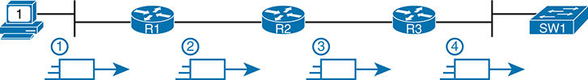


The source is a computer, labeled 1, and the data flow passes through three routers, R 1, R 2, R 3, each represented with typical router icons, before reaching the final destination, a network switch, S W 1. The image highlights four processing stages. Stage 1 involves the initial packet being sent from the source computer to the first router, R 1. In Stage 2, the packet is processed and forwarded by R 1 to the next router, R 2. Stage 3 sees the packet continue from R 2 to the third router, R 3. Finally, in Stage 4, the packet reaches the switch, S W 1, which directs it to the appropriate destination.

**Figure 21-1** *Data Plane Processing on Routers: Basics*

Now broaden your thinking for a moment and try to think of everything a router or switch might do when receiving, processing, and forwarding a message. Of course, the forwarding decision is part of the logic; in fact, the data plane is often called the *forwarding plane*. But think beyond matching the destination address to a table. For perspective, the following list details some of the more common actions that a networking device does that fit into the data plane:


* De-encapsulating and re-encapsulating a packet in a data-link frame (routers, Layer 3 switches)
* Adding or removing an 802.1Q trunking header (routers and switches)
* Matching an Ethernet frame's destination Media Access Control (MAC) address to the MAC address table (Layer 2 switches)
* Matching an IP packet's destination IP address to the IP routing table (routers, Layer 3 switches)
* Encrypting the data and adding a new IP header (for virtual private network [VPN] processing)
* Changing the source or destination IP address (for Network Address Translation [NAT] processing)
* Discarding a message due to a filter (access control lists [ACLs], port security)

All the items in the list make up the data plane, because the data plane includes all actions done per message.

##### The Control Plane

Next, take a moment to ponder the kinds of information that the data plane needs to know beforehand so that it can work properly. For instance, routers need IP routes in a routing table before the data plane can forward packets. Layer 2 switches need entries in a MAC address table before they can forward Ethernet frames out the one best port to reach the destination. Switches must use Spanning Tree Protocol (STP) to limit which interfaces can be used for forwarding so that the data plane works well and does not loop frames forever.

From one perspective, the information supplied to the data plane controls what the data plane does. For instance, a router needs a route that matches a packet's destination address for the router to know how to route (forward) the packet. When a router's data plane tries to match the routing table and finds no matching route, the router discards the packet. And what controls the contents of the routing table? Various control plane processes.

The term [control plane](vol2_gloss.md#gloss_063) refers to any action that controls the data plane. Most of these actions have to do with creating the tables used by the data plane, tables like the IP routing table, an IP Address Resolution Protocol (ARP) table, a switch MAC address table, and so on. By adding to, removing, and changing entries to the tables used by the data plane, the control plane processes control what the data plane does. You already know about many control plane protocols--for instance, all the IP routing protocols.

Traditional networks use both a distributed data plane and a distributed control plane. In other words, each device has a data plane and a control plane, and the network distributes those functions into each individual device, as shown in the example in [Figure 21-2](vol2_ch21.md#ch21fig02).

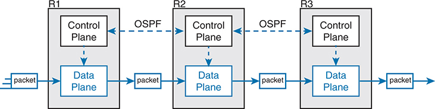


Each router has two main components: the Control Plane and the Data Plane. The Control Plane is responsible for the router's decision-making processes, such as routing protocols. In this diagram, the control planes of the routers communicate with each other using the O S P F, Open Shortest Path First, protocol, indicated by dashed lines connecting the control planes of R 1, R 2, and R 3. The Data Plane is responsible for the actual forwarding of packets based on the control plane's decisions. In the diagram, packets enter the data plane of R 1, are forwarded to R 2, and then to R 3, ultimately exiting the data plane of R 3.

**Figure 21-2** *Control and Data Planes of Routers--Conceptual*

In the figure, Open Shortest Path First (OSPF), the control plane protocol, runs on each router (that is, it is distributed among all the routers). OSPF on each router then adds to, removes from, and changes the IP routing table on each router. Once populated with useful routes, the data plane's IP routing table on each router can forward incoming packets, as shown from left to right across the bottom of the figure. The following list includes many of the more common control plane protocols:


* Routing protocols (OSPF, Enhanced Interior Gateway Routing Protocol [EIGRP], Routing Information Protocol [RIP], Border Gateway Protocol [BGP])
* IPv4 ARP
* IPv6 Neighbor Discovery Protocol (NDP)
* Switch MAC learning
* STP

Without the protocols and activities of the control plane, the data plane of traditional networking devices would not function well. Routers would be mostly useless without routes learned by a routing protocol. Without learning MAC table entries, a switch could still forward unicasts by flooding them, but doing that for all frames would create much more load on the local-area network (LAN) compared to normal switch operations. So the data plane must rely on the control plane to provide useful information.

##### The Management Plane

The control plane performs overhead tasks that directly impact the behavior of the data plane. The [management plane](vol2_gloss.md#gloss_202) performs overhead work as well, but that work does not directly impact the data plane. Instead, the management plane includes protocols that allow network engineers to manage the devices.

Telnet and Secure Shell (SSH) are two of the most obvious management plane protocols. To emphasize the difference with control plane protocols, think about two routers: one configured to allow Telnet and SSH into the router and one that does not. Both could still be running a routing protocol and routing packets, whether or not they support Telnet and SSH.

[Figure 21-3](vol2_ch21.md#ch21fig03) extends the example shown in [Figure 21-2](vol2_ch21.md#ch21fig02) by now showing the management plane, with several management plane protocols.

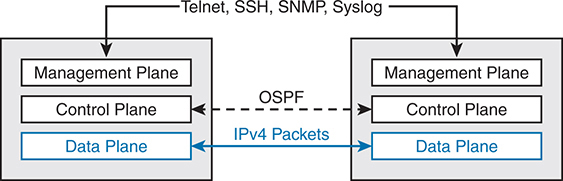


Two routers are depicted, each with three components: the Management Plane, the Control Plane, and the Data Plane. The Management Plane is responsible for the configuration and monitoring of the router. It uses protocols such as Telnet, S S H, Secure Shell, S N M P, Simple Network Management Protocol, and Syslog for remote management and logging. The Control Plane manages routing decisions and communicates with the control plane of the other router using O S P F. The Data Plane is responsible for the actual packet forwarding. In this diagram, I P v 4 packets are shown being forwarded between the data planes of the two routers.

**Figure 21-3** *Management Plane for Configuration of Control and Data Planes*

##### Cisco Switch Data Plane Internals

To better understand SDN and network programmability, it helps to think about the internals of switches. This next topic does just that.

From the very first days of devices called LAN switches, switches had to use specialized hardware to forward frames, because of the large number of frames per second (fps) required. To get a sense for the volume of frames a switch must be able to forward, consider the minimum frame size of an Ethernet frame, the number of ports on a switch, and the speeds of the ports; even low-end switches need to be able to forward millions of frames per second. For example, if a switch manufacturer wanted to figure out how fast its data plane needed to be in a new access layer switch with 24 ports, it might work through this bit of math:

* The switch has 24 ports.
* Each port runs at 1 Gbps.
* For this analysis, assume frames 125 bytes in length (to make the math easier, because each frame is 1000 bits long).
* With a 1000-bit-long frame and a speed of 1,000,000,000 bits/second, a port can send 1,000,000 frames per second (fps).
* Use full duplex on all ports, so the switch can expect to receive on all 24 ports at the same time.
* Result: Each port would be receiving 1,000,000 fps, for 24 million fps total, so the switch data plane would need to be ready to process 24 million fps.

Although 24 million fps may seem like a lot, the goal here is not to put an absolute number on how fast the data plane of a switch needs to be for any given era of switching technology. Instead, from their first introduction into the marketplace in the mid-1990s, LAN switches needed a faster data plane than a generalized CPU could process in software. As a result, hardware switches have always had specialized hardware to perform data plane processing.

First, the switching logic occurs not in the CPU with software, but in an [application-specific integrated circuit (ASIC)](vol2_gloss.md#gloss_039). An ASIC is a chip built for specific purposes, such as for message processing in a networking device.

Second, the ASIC needs to perform table lookup in the MAC address table, so for fast table lookup, the switch uses a specialized type of memory to store the equivalent of the MAC address table: [ternary content-addressable memory (TCAM)](vol2_gloss.md#gloss_339). TCAM memory does not require the ASIC to execute loops through an algorithm to search the table. Instead, the ASIC can feed the fields to be matched, like a MAC address value, into the TCAM, and the TCAM returns the matching table entry, without a need to run a search algorithm.

Note that a switch still has a general-purpose CPU and RAM as well, as shown in [Figure 21-4](vol2_ch21.md#ch21fig04). IOS runs in the CPU and uses RAM. Most of the control and management plane functions run in IOS. The data plane function (and the control plane function of MAC learning) happens in the ASIC.


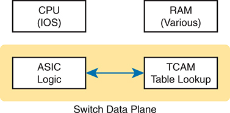


At the top, there are two boxes labeled C P U, I O S, and R A M, Various, representing the central processing unit running the Internetwork Operating System, I O S, and the different types of random access memory used in the switch. Below these components, within a yellow shaded area labeled Switch Data Plane, there are two interconnected boxes. The left box is labeled A S I C Logic, representing the Application-Specific Integrated Circuit responsible for handling data packet processing at high speeds. The right box is labeled T C A M Table Lookup, which stands for Ternary Content-Addressable Memory, a specialized memory used for fast lookups of routing and switching tables. An arrow between the A S I C Logic and T C A M Table Lookup indicates the bidirectional flow of information.

**Figure 21-4** *Key Internal Processing Points in a Typical Switch*

Note that some routers also use hardware for data plane functions, for the same kinds of reasons that switches use hardware. (For instance, check out the Cisco Quantum Flow Processor (QFP) for interesting reading about hardware data plane forwarding in Cisco routers.) The ideas of a hardware data plane in routers are similar to those in switches: use a purpose-built ASIC for the forwarding logic, and TCAM to store the required tables for fast table lookup.

#### Controllers and Software Defined Architecture

New approaches to networking emerged in the 2010s, approaches that change where some of the control plane functions occur. Many of those approaches move parts of the control plane work into software that runs as a centralized application called a *controller*. This next topic looks at controller concepts, and the interfaces to the devices that sit below the controller and to any programs that use the controller.

Note

The term *Software Defined Networking (SDN)* became common in the 2010s to refer to the types of controller-based networks described in the next few pages. More often today you might see terms like *software defined architecture* or [controller-based networking](vol2_gloss.md#gloss_094).

##### Controllers and Centralized Control

Most traditional control plane processes use a distributed architecture. For example, each router runs its own OSPF routing protocol process. To do their work, those distributed control plane processes use messages to communicate with each other, like OSPF protocol messages between routers. As a result, traditional networks are said to use a [distributed control plane](vol2_gloss.md#gloss_115).

The people who created today's control plane concepts, like STP, OSPF, EIGRP, and so on, could have chosen to use a [centralized control plane](vol2_gloss.md#gloss_063). That is, they could have put the logic in one place, running on one device, or on a server. Then the centralized software could have used protocol messages to learn information from the devices, but with all the processing of the information at a centralized location. But they instead chose a distributed architecture.

There are pros and cons to using distributed and centralized architectures to do any function in a network. Many control plane functions have a long history of working well with a distributed architecture. However, a centralized application can be easier to write than a distributed application, because the centralized application has all the data gathered into one place. And this emerging world of software defined architectures often uses a centralized architecture, with a centralized control plane, with its foundations in a service called a controller.

A *controller*, or *SDN controller*, centralizes the control of the networking devices. The degree of control--and the type of control--varies widely. For instance, the controller can perform all control plane functions, replacing the devices' distributed control plane. Alternately, the controller can simply be aware of the ongoing work of the distributed data, control, and management planes on the devices, without changing how those operate. And the list goes on, with many variations.

To better understand the idea of a controller, consider one specific case as shown in [Figure 21-5](vol2_ch21.md#ch21fig05), in which one SDN controller centralizes all important control plane functions. First, the controller sits anywhere in the network that has IP reachability to the devices in the network. Each of the network devices still has a data plane; however, note that not one of the devices has a control plane. In the variation of SDN as shown in [Figure 21-5](vol2_ch21.md#ch21fig05), the controller directly programs the data plane entries into each device's tables. The networking devices do not populate their forwarding tables with traditional distributed control plane processes.


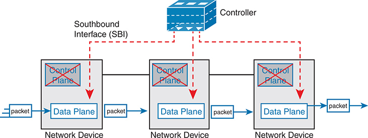


At the top, a box labeled Controller is shown, representing the central control plane responsible for managing network policies and decisions. The controller connects to multiple network devices through a Southbound Interface, S B I, represented by dashed red lines. Each network device is depicted as a box with two sections: the top section labeled Control Plane and the bottom section labeled Data Plane. In each network device, the control plane is crossed out, indicating that the control functionality is centralized in the controller, while the data plane remains active and distributed across the devices. Blue arrows labeled packet indicate the flow of data packets through the data planes of the network devices, from left to right, demonstrating how the data plane handles packet forwarding based on the instructions received from the centralized control plane.

**Figure 21-5** *Centralized Control Plane and a Distributed Data Plane*

Note

[Figure 21-5](vol2_ch21.md#ch21fig05) shows the model used by one of the original SDN implementations that uses an industry standard called [OpenFlow](vol2_gloss.md#gloss_238).

[Figure 21-5](vol2_ch21.md#ch21fig05) shows one model for network programmability and SDN, but not all. The figure does give us a great backdrop to discuss a few more important basic concepts, in particular, the idea of a southbound interface (SBI) and northbound interface (NBI).

##### The Southbound Interface

In a controller-based network architecture, the controller needs to communicate to the networking devices. In most network drawings and architecture drawings, those network devices typically sit below the controller, as shown in [Figure 21-5](vol2_ch21.md#ch21fig05). There is an interface between the controller and those devices, and given its location at the bottom part of drawings, the interface came to be known as the [southbound interface (SBI)](vol2_gloss.md#gloss_295), as labeled in [Figure 21-5](vol2_ch21.md#ch21fig05).

Note

In the context of this chapter's discussion of SDN, the word *interface* (including in the names of SBI, NBI, and API) refers to software interfaces unless otherwise noted.

Several different options exist for the SBI. The overall goal is network programmability, so the interface moves away from being only a protocol. An SBI often includes a protocol, so that the controller and devices can communicate, but it often includes an [application programming interface (API)](vol2_gloss.md#gloss_038). An API is a method for one application (program) to exchange data with another application. Rearranging the words to describe the idea, an API is an interface to an application program. Programs process data, so an API lets two programs 478exchange data. While a protocol exists as a document, often from a standards body, an API often exists as usable code--functions, variables, and data structures--that can be used by one program to communicate and copy structured data between the programs across a network.

So, back to the term *SBI*: it is an interface between a program (the controller) and a program (on the networking device) that lets the two programs communicate, with one goal being to allow the controller to program the data plane forwarding tables of the networking device.

Unsurprisingly, in a network architecture meant to enable network programmability, the capabilities of the SBIs and their APIs tell us a lot about what that particular architecture can and cannot do. For instance, some controllers might support one or a few SBIs, for a specific purpose, while others might support many more SBIs, allowing a choice of SBIs to use. The comparisons of SBIs go far beyond this chapter, but it does help to think about a few; the second major section gives three sample architectures that happen to show three separate SBIs, specifically:

* OpenFlow (from the ONF; [www.opennetworking.org](http://www.opennetworking.org))
* OpFlex (from Cisco; used with ACI)
* CLI (Telnet/SSH) and SNMP, and NETCONF (used with Cisco Software-Defined Access)

##### The Northbound Interface

Think about the programming required at the controller related to the example in [Figure 21-5](vol2_ch21.md#ch21fig05). The figure focuses on the fact that the controller can add entries to the networking device's forwarding tables; however, how does the controller know what to add? How does it choose? What kind of information would your program need to gather before it could attempt to add something like MAC table entries or IP routes to a network? You might think of these:

* A list of all the devices in the network
* The capabilities of each device
* The interfaces/ports on each device
* The current state of each port
* The topology--which devices connect to which, over which interfaces
* Device configuration--IP addresses, VLANs, and so on as configured on the devices

A controller does much of the work needed for the control plane in a centralized control model. It gathers all sorts of useful information about the network, like the items in the preceding list. The controller itself can create a centralized repository of all this useful information about the network.


A controller's [northbound interface (NBI)](vol2_gloss.md#gloss_231) opens the controller so its data and functions can be used by other programs, enabling network programmability, with much quicker development. Programs can pull information from the controller, using the controller's APIs. The NBIs also enable programs to use the controller's capabilities to program flows into the devices using the controller's SBIs.

To see where the NBI resides, first think about the controller itself. The controller is software, running on some server, which can be a VM or a physical server. An application can run on the same server as the controller and use an NBI, which is an API, so that two programs can communicate.

[Figure 21-6](vol2_ch21.md#ch21fig06) shows just such an example. The big box in the figure represents the system where the controller software resides. This particular controller happens to be written in Java and has a Java-based native API. Anyone--the same vendor as the controller vendor, another company, or even you--can write an app that runs on this same operating system that uses the controller's Java API. By using that API to exchange data with the controller, the application can learn information about the network. The application can also program flows in the network--that is, ask the controller to add the specific match/action logic (flows) into the forwarding tables of the networking devices.

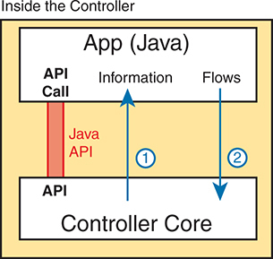


The diagram is titled Inside the Controller. At the top, there is a box labeled App, Java, representing a Java application. Within this box, an A P I Call is indicated in red, labeled Java A P I, showing the point where the application interfaces with the controller. Below this, a larger box labeled Controller Core represents the main functionality of the network controller. An arrow labeled Information points from the controller core to the Java application, indicating the flow of data from the controller to the application. Another arrow labeled Flows points from the Java application to the controller core, showing how the application sends flow information to the controller.

**Figure 21-6** *Java API: Java Applications Communicates with Controller*

Note

The northbound interface (NBI) gets its name from its normal location as shown above the controller--that is, in what would be north on a map.

Before we leave the topic of NBIs, let's close with a brief explanation of a REST API as used for a controller. REST (*REpresentational State Transfer*) describes a type of API that allows applications to sit on different hosts, using HTTP messages to transfer data over the API. When you see SDN figures like [Figure 21-6](vol2_ch21.md#ch21fig06), with the application running on the same system as the controller, the API does not need to send messages over a network because both programs run on the same system. But when the application runs on a different system somewhere else in the network other than running on the controller, the API needs a way to send the data back and forth over an IP network, and RESTful APIs meet that need.

[Figure 21-7](vol2_ch21.md#ch21fig07) shows the big ideas with a REST API. The application runs on a host at the top of the figure. In this case, at Step 1, it sends an HTTP GET request to a particular URI. The HTTP GET is like any other HTTP GET, even like those used to retrieve web pages. However, the URI is not for a web page, but rather identifies an object on the controller, typically a data structure that the application needs to learn and then process. For example, the URI might identify an object that is the list of physical interfaces on a specific device along with the status of each.


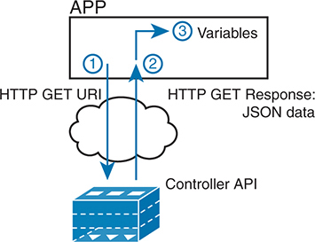


At the top, there is a box labeled A P P, representing an application. Below this, a box labeled Controller A P I represents the network controller's A P I. Between these two boxes, a cloud symbolizes the network communication medium. The process starts with an arrow labeled 1 pointing from the application to the controller A P I with the label H T T P G E T U R I, indicating the application sends a G E T request to the controller. The next step is represented by an arrow labeled 2 pointing from the controller A P I back to the application with the label H T T P G E T Response: J S O N data, indicating the controller responds to the G E T request with J S O N formatted data. The final step, indicated by an arrow labeled 3 pointing within the application box to Variables, shows the application processes and stores the retrieved data in variables.

**Figure 21-7** *Process Example of a GET Using a REST API*

At Step 2, the controller sends back an HTTP GET response message with the object. Most REST APIs will ask for and receive structured data. That is, instead of receiving data that is a web page, like a web browser would receive, the response holds variable names and their values, in a format that can be easily used by a program. The common formats for data used for network programmability are JavaScript Object Notation (JSON) and eXtensible Markup Language (XML), shown as Step 3.

#### Software Defined Architecture Summary

SDN and network programmability introduce a new way to build networks. The networking devices still exist and still forward data, but the control plane functions and locations can change dramatically. The centralized controller acts as the focal point, so that at least some of the control plane functions move from a distributed model to a centralized model.

However, the world of network programmability and SDN includes a wide array of options and solutions. Some options pull most control plane functions into the controller, whereas others pull only some of those functions into the controller. The next section takes a look at two different options, each of which takes a different approach to network programmability and the degree of centralized control.

### Examples of Network Programmability and SDN

This second of three major sections of the chapter introduces two different SDN and network programmability solutions available from Cisco. Others exist as well. These two were chosen because they give a wide range of comparison points:

* OpenDaylight Controller
* Cisco Application Centric Infrastructure (ACI)

#### OpenDaylight and OpenFlow

One common form of SDN comes from the Open Networking Foundation (ONF) and is billed as Open SDN. The ONF ([www.opennetworking.org](http://www.opennetworking.org)) acts as a consortium of users (operators) and vendors to help establish SDN in the marketplace. Part of that work defines protocols, SBIs, NBIs, and anything that helps people implement their vision of SDN.

The ONF model of SDN features OpenFlow. OpenFlow defines the concept of a controller along with an IP-based SBI between the controller and the network devices. Just as important, OpenFlow defines a standard idea of what a switch's capabilities are, based on the ASICs and TCAMs commonly used in switches today. (That standardized idea of what a switch does is called a *switch abstraction*.) An OpenFlow switch can act as a Layer 2 switch, a Layer 3 switch, or in different ways and with great flexibility beyond the traditional model of a Layer 2/3 switch.

The Open SDN model centralizes most control plane functions, with control of the network done by the controller plus any applications that use the controller's NBIs. In fact, [Figure 21-5](vol2_ch21.md#ch21fig05) (shown previously) showed the network devices without a control plane, which represents this mostly centralized OpenFlow model of SDN.

In the OpenFlow model, applications may use any APIs (NBIs) supported on the controller platform to dictate what kinds of forwarding table entries are placed into the devices; however, it calls for OpenFlow as the SBI protocol. Additionally, the networking devices need to be switches that support OpenFlow.

Because the ONF's Open SDN model has this common thread of a controller with an OpenFlow SBI, the controller plays a big role in the network. The next few pages provide a brief background about two such controllers.

##### The OpenDaylight Controller

First, if you were to look back at the history of OpenFlow, you could find information on dozens of different SDN controllers that support the OpenFlow SDN model. Some were more research oriented, during the years in which SDN was being developed and was more of an experimental idea. As time passed, more and more vendors began building their own controllers. And those controllers often had many similar features because they were trying to accomplish many of the same goals. As you might expect, some consolidation eventually needed to happen.

The OpenDaylight open-source SDN controller is one of the more successful SDN controller platforms to emerge from the consolidation process over the 2010s. OpenDaylight took many of the same open-source principles used with Linux, with the idea that if enough vendors worked together on a common open-source controller, then all would benefit. All those vendors could then use the open-source controller as the basis for their own products, with each vendor focusing on the product differentiation part of the effort, rather than the fundamental features. The result was that back in the mid-2010s, the *OpenDaylight SDN controller* ([www.opendaylight.org](http://www.opendaylight.org)) was born. OpenDaylight (ODL) began as a separate project but now exists as a project managed by the Linux Foundation.

[Figure 21-8](vol2_ch21.md#ch21fig08) shows a generalized version of the ODL architecture. In particular, note the variety of SBIs listed in the lower part of the controller box: OpenFlow, NetConf, PCEP, BGP-LS, and OVSDB; many more exist. The ODL project has enough participants so that it includes a large variety of options, including multiple SBIs, not just OpenFlow.

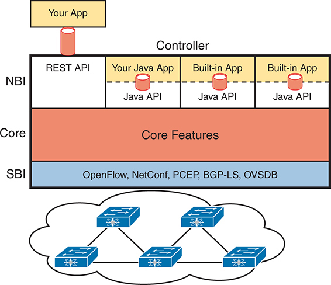


At the top, the image features a section labeled Your App connected to the Controller through the R E S T Application Programming Interface, A P I, indicating the application layer interaction with the controller. The controller is divided into three main layers: the N B I, Core, and S B I. The N B I consists of R E S T A P I and Java A P I, enabling external applications, including user-developed Java applications, and built-in applications to interact with the controller. The Core section is highlighted in orange and labeled Core Features, signifying the central functionalities of the controller. The S B I, shown in blue, lists various protocols such as OpenFlow, Network Configuration Protocol, NetConf, Path Computation Element Protocol, P C E P, Border Gateway Protocol Link-State, B G P dash L S, and Open vSwitch Database Management Protocol, O V S D B, which connect the controller to network devices. At the bottom of the image, a graphical representation of a network with interconnected switches and routers signifies the physical network infrastructure managed by the controller.

**Figure 21-8** *Architecture of NBI, Controller Internals, and SBI to Network Devices*

ODL has many features, with many SBIs, and many core features. A vendor can then take ODL, use the parts that make sense for that vendor, add to it, and create a commercial ODL controller.

##### The Cisco Open SDN Controller (OSC)

At one point back in the 2010s, Cisco offered a commercial version of the OpenDaylight controller called the Cisco *Open SDN Controller* (OSC). That controller followed the intended model for the ODL project: Cisco and others contributed labor and money to the ODL open-source project; once a new release was completed, Cisco took that release and built new versions of their product.

Cisco no longer produces and sells the Cisco OSC, but I decided to keep a short section about OSC here in this chapter for a couple of reasons. First, if you do any of your own research, you will find mention of Cisco OSC; however, well before this chapter was written, Cisco had made a strong strategic move toward different approaches to SDN using [intent-based networking (IBN)](vol2_gloss.md#gloss_176). That move took Cisco away from OpenFlow-based SDN. But because you might see references to Cisco OSC online, or in the previous edition of this book, I wanted to point out this transition in Cisco's direction.

This book describes two Cisco offerings that use an IBN approach to SDN. The next topic in this chapter examines one of those: Application Centric Infrastructure (ACI), Cisco's data center SDN product. [Chapter 22](vol2_ch22.md#ch22), "[Cisco Software-Defined Access (Cisco SD-Access)](vol2_ch22.md#ch22)," discusses yet another Cisco SDN option that uses intent-based networking: Software-Defined Access (Cisco SD-Access).

Note

Examples of specific products are used only to help readers internalize the concepts of SDN and controller-based networks. Examples of these products would include Cisco Application Centric Infrastructure (ACI) and Cisco Software-Defined Access with Cisco Catalyst Center (Cisco SD-Access).

#### Cisco Application Centric Infrastructure (ACI)

Interestingly, many SDN offerings began with research that discarded many of the old networking paradigms in an attempt to create something new and better. For instance, OpenFlow came to be from the Stanford University Clean Slate research project that had researchers reimagining (among other things) device architectures. Cisco took a similar research path, but Cisco's work happened to arise from different groups, each focused on different parts of the network: data center, campus, and WAN. That research resulted in Cisco's current SDN offerings of ACI in the data center: Software-Defined Access (Cisco SD-Access) in the enterprise campus and Software-Defined WAN (Cisco SD-WAN) in the enterprise WAN.

When reimagining networking for the data center, the designers of ACI focused on the applications that run in a data center and what they need. As a result, they built networking concepts around application architectures. Cisco made the network infrastructure become application centric, hence the name of the Cisco data center SDN solution: [Application Centric Infrastructure (ACI)](vol2_gloss.md#gloss_036).

For example, Cisco looked at the data center world beyond networking and saw lots of automation and control. As discussed in [Chapter 20](vol2_ch20.md#ch20), "[Cloud Architecture](vol2_ch20.md#ch20)," virtualization software routinely starts, moves, and stops VMs. Additionally, cloud software enables self-service for customers so they can enable and disable highly elastic services as implemented with VMs and containers in a data center. From a networking perspective, some of those VMs need to communicate, but some do not. And those VMs can move based on the needs of the virtualization and cloud systems.

ACI set about to create data center networking with the flexibility and automation built into the operational model. Old data center networking models with a lot of per-physical-interface configuration on switches and routers were just poor models for the rapid pace of change and automated nature of modern data centers. This section looks at some of the detail of ACI to give you a sense of how ACI creates a powerful and flexible network to support a modern data center in which VMs and containers are created, run, move, and are stopped dynamically as a matter of routine.

##### ACI Physical Design: Spine and Leaf

The Cisco ACI uses a specific physical switch topology called [spine](vol2_gloss.md#gloss_329) and [leaf](vol2_gloss.md#gloss_192). While the other parts of a network might need to allow for many different physical topologies, the data center could be made standard and consistent. But what particular standard and consistent topology? Cisco decided on the spine and leaf design, also called a Clos network after one of its creators.

With ACI, the physical network has a number of spine switches and a number of leaf switches, as shown in [Figure 21-9](vol2_ch21.md#ch21fig09). The figure shows the links between switches, which can be single links or multiple parallel links. Of note in this design (assuming a single-site design):


* Each leaf switch must connect to every spine switch.
* Each spine switch must connect to every leaf switch.
* Leaf switches cannot connect to each other.
* Spine switches cannot connect to each other.
* Endpoints connect only to the leaf switches.


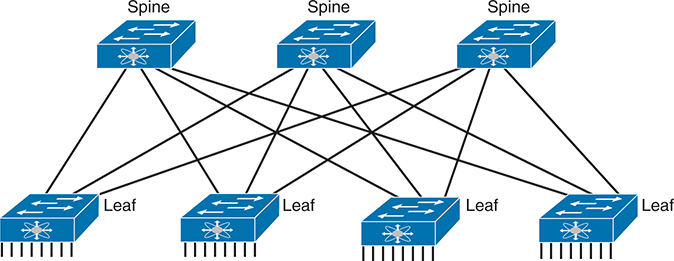


The spine-leaf design typically consists of spine switches and leaf switches interconnected to form a high-performance, scalable network architecture. This design ensures that each leaf switch connects to every spine switch, providing multiple paths for data traffic, enhancing redundancy, and reducing latency. The representation includes labels and arrows indicating the data flow between different network devices.

**Figure 21-9** *Spine-Leaf Network Design*

Endpoints connect only to leaf switches and never to spine switches. To emphasize the point, [Figure 21-10](vol2_ch21.md#ch21fig10) shows a more detailed version of [Figure 21-9](vol2_ch21.md#ch21fig09), this time with endpoints connected to the leaf switches. None of the endpoints connect to the spine switches; they connect only to the leaf switches. The endpoints can be connections to devices outside the data center, like the router on the left. By volume, most of the endpoints will be either physical servers running a native OS or servers running virtualization software with numbers of VMs and containers as shown in the center of the figure.


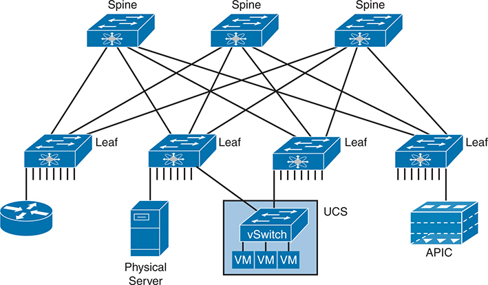


The diagram includes Spine Switches: Four spine switches at the top, interconnected with each other and to the leaf switches. Leaf Switches: Four leaf switches at the bottom, each connected to multiple spine switches, forming a high-bandwidth, low-latency fabric. Endpoints: Various devices and systems connected to the leaf switches, including a physical server, a virtualized server cluster labeled U C S, Unified Computing System, with a vSwitch and multiple V Ms, Virtual Machines, an A P I C, Application Policy Infrastructure Controller, and a router. This topology shows the leaf-spine architecture where all endpoints, servers, V Ms, A P I C, router, are connected to the leaf switches.

**Figure 21-10** *Endpoints Found on the Leaf Switches Only*

Also, note that the figure shows a typical design with multiple leaf switches connecting to a single hardware endpoint like a Cisco Unified Computing System (UCS) server. Depending on the design requirements, each UCS might connect to at least two leaf switches, both for redundancy and for greater capacity to support the VMs and containers running on the UCS hardware. (In fact, in a small design with UCS or similar server hardware, every UCS might connect to every leaf switch.)

##### ACI Operating Model with Intent-Based Networking

The model that Cisco defines for ACI uses a concept of endpoints and policies. The *endpoints* are the VMs, containers, or even traditional servers with the OS running directly on the hardware. ACI then uses several constructs as implemented via the [Application Policy Infrastructure Controller (APIC)](vol2_gloss.md#gloss_037), the software that serves as the centralized controller for ACI.

This section hopes to give you some insight into ACI, rather than touch on every feature. To do that, consider the application architecture of a typical enterprise web app for a moment. Most casual observers think of a web application as one entity, but one web app often exists as three separate servers:

* **Web server:** Users from outside the data center connect to a web server, which sends web page content to the user.
* **App (Application) server:** Because most web pages contain dynamic content, the app server does the processing to build the next web page for that particular user based on the user's profile and latest actions and input.
* **DB (Database) server:** Many of the app server's actions require data; the DB server retrieves and stores the data as requested by the app server.

To accommodate those ideas, ACI uses an intent-based networking (IBN) model. With that model, the engineer, or some automation program, defines the policies and intent for which endpoints should be allowed to communicate and which should not. Then the controller determines what that means for this network at this moment in time, depending on where the endpoints are right now.

For instance, when starting the VMs for this app, the virtualization software would create (via the APIC) several endpoint groups (EPGs) as shown in [Figure 21-11](vol2_ch21.md#ch21fig11). The controller must also be told the access polices, which define which EPGs should be able to communicate (and which should not), as implied in the figure with arrowed lines. For example, the routers that connect to the network external to the data center should be able to send packets to all web servers, but not to the app servers or DB servers.

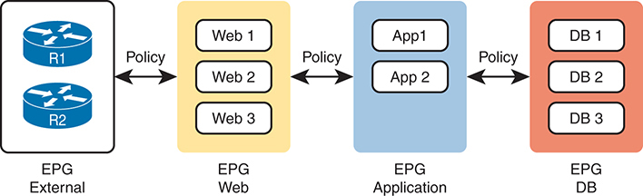


E P G External: Contains routers R 1 and R 2. This group represents external network connections. E P G Web: Contains three web servers, Web 1, Web 2, Web 3. Policies govern the interaction between the external E P G and the web servers. E P G Application: Contains two application servers, App 1, App 2. Policies regulate the communication between the web E P G and the application E P G. E P G D B: Contains three database servers, D B 1, D B 2, D B 3. Policies control the interaction between the application E P G and the database E P G. Arrows labeled Policy indicate the rules and configurations that manage traffic and security between the different E P Gs.

**Figure 21-11** *Endpoint Groups (EPGs) and Policies*

Note that at no point did the previous paragraph talk about which physical switch interfaces should be assigned to which VLAN or which ports are in an EtherChannel; the discussion moves to an application-centric view of what happens in the network. Once all the endpoints, policies, and related details are defined, the controller can then direct the network as to what needs to be in the forwarding tables to make it all happen--and to more easily react when the VMs start, stop, or move.

To make it all work, ACI uses a centralized controller called the Application Policy Infrastructure Controller (APIC), as shown in [Figure 21-12](vol2_ch21.md#ch21fig12). The name defines the function in this case: it is the controller that creates application policies for the data center infrastructure. The APIC takes the intent (EPGs, policies, and so on), which completely changes the operational model away from configuring VLANs, trunks, EtherChannels, ACLs, and so on.

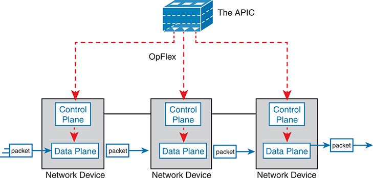


At the top of the diagram, the A P I C is shown as the central controller that manages policies and configurations across the network. It communicates with network devices using the OpFlex protocol, which is represented by red dashed lines connecting the A P I C to each network device. Each network device in the diagram has two distinct layers: the Control Plane and the Data Plane. The Control Plane is responsible for making routing decisions and handling network control functions, while the Data Plane manages the actual forwarding of packets based on the instructions from the Control Plane. The flow of packets through the Data Planes of the network devices is depicted with solid arrows, showing how the control plane influences packet forwarding.

**Figure 21-12** *Architectural View of ACI with APIC Pushing Intent to Switch the Control Plane*

The APIC, of course, has a convenient GUI, but the power comes in software control--that is, network programmability. The same virtualization software, or cloud or automation software, even scripts written by the network engineer, can define the endpoint groups, policies, and so on to the APIC. But all these players access the ACI system by interfacing to the APIC as depicted in [Figure 21-13](vol2_ch21.md#ch21fig13); the network engineer no longer needs to connect to each individual switch and configure CLI commands.


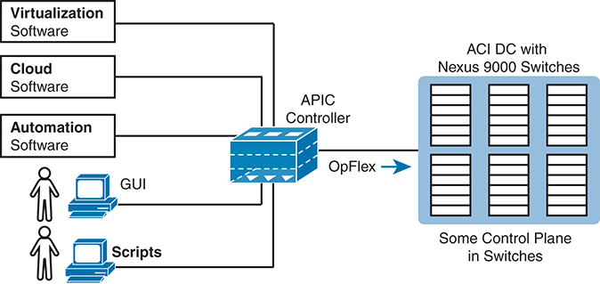


At the center of the diagram, the A P I C controller acts as the core management entity that oversees the entire network. It communicates with the A C I data center, comprising Nexus 9000 switches, through the OpFlex protocol, ensuring that the control plane functions are effectively managed. The diagram also displays the A P I C's integration with different types of software: Virtualization Software, Cloud Software, and Automation Software. These integrations allow the A P I C to manage virtualized environments, facilitate cloud-based services, and support automated network management and configuration. Users can interact with the A P I C via graphical user interfaces, G U I, or through scripts for automation tasks, providing flexibility in how the network is managed and configured.

**Figure 21-13** *Controlling the ACI Data Center Network Using the APIC*

For more information on Cisco ACI, go to [www.cisco.com/go/aci](http://www.cisco.com/go/aci).

#### Summary of the SDN Examples

The sample SDN architectures in this section of the book were chosen to provide a wide variety for the sake of learning. However, they differ to some degree in how much of the control plane work is centralized. [Table 21-2](vol2_ch21.md#ch21tab02) lists those and other comparison points taken from this section, for easy review and study.


**Table 21-2** Points of Comparison: OpenFlow and ACI

| Criteria | OpenFlow | ACI |
| --- | --- | --- |
| Changes how the device control plane works versus traditional networking | Yes | Yes |
| Creates a centralized point from which humans and automation control the network | Yes | Yes |
| Degree to which the architecture centralizes the control plane | Mostly | Partially |
| SBIs used | OpenFlow | OpFlex |
| Controllers mentioned in this chapter | OpenDaylight | APIC |
| Organization that is the primary definer/owner | ONF | Cisco |

If you want to learn more about the Cisco solutions, consider using both Cisco DevNet (the Cisco Developer Network) and dCloud (Demo cloud). Cisco provides its DevNet site (<https://developer.cisco.com>) for anyone interested in network programming, and the Demo Cloud site (<https://dcloud.cisco.com>) for anyone to experience or demo Cisco products. At the time this book went to press, DevNet had many REST API labs, while both sites had a variety of ACI-based labs.

### Comparing Traditional Versus Controller-Based Networks

Before finishing the chapter, this final topic turns directly toward the CCNA 200-301 V1.1 exam. Two of the CCNA 200-301 exam topics in domain 6.0, "Automation and Programmability," ask us to compare some aspect of traditional networks versus new networking using controllers and automation. Those exam topics include

6.1: Explain how automation impacts network management

6.2: Compare traditional networks with controller-based networking

First, the wording in both exam topics can be reduced to "compare and contrast." One uses the word *compare*. The other uses a longer phrase "explain how automation impacts…," which asks us to compare what was before to what happens now that automation has been added to the network.

Network management can be broken down into two distinct categories: configuration management and operational management.

Configuration management refers to any feature that changes device configuration, with automated configuration management doing so with software (program) control. For instance, Cisco's ACI uses the APIC controller. You do not configure the devices directly, but the APIC pushes configuration down to the ACI switches that it builds based on its interpretation of the policies configured by the engineer. With ACI, the configuration management occurs as a part of the overall system. Other configuration management tools can be more focused on automating traditional configuration processes, with tools like NETCONF/RESTCONF, Ansible, and Terraform, as discussed in [Chapter 23](vol2_ch23.md#ch23), "[Understanding REST and JSON](vol2_ch23.md#ch23)," and [Chapter 24](vol2_ch24.md#ch24), "[Understanding Ansible and Terraform](vol2_ch24.md#ch24)."

Operational network management includes monitoring, gathering operational data, reporting, and alerting humans to possible issues. For instance, [Cisco Catalyst Center](vol2_gloss.md#gloss_070) has a capability that checks the IOS images on Cisco devices to make sure only approved versions are used and that no changes have occurred to the images in comparison to the images created by Cisco.

Note

Cisco DNA Center was rebranded to Cisco Catalyst Center; however, all features and functionality remain the same. Please visit [www.cisco.com/go/catalystcenter](http://www.cisco.com/go/catalystcenter) for more information. Catalyst Center is used because it is an example of a commonly used campus controller.

The other exam topic (6.2) described in this section focuses on controller-based networking instead of network management. That exam topic includes any SDN network as characterized by the use of a controller. Today people might use that term or these other synonyms to describe some of the newer networking options that happen to use controllers:

* Software Defined Networking
* Software Defined Architecture
* Programmable Networks
* Controller-Based Networks

[Table 21-3](vol2_ch21.md#ch21tab03) summarizes the chapters that have content related to these two exam topics.

**Table 21-3** Exam Topics and Most Relevant Chapters

| Exam Topic | Exam Topic Text | Most Relevant Chapter(s) |
| --- | --- | --- |
| 6.1 | Explain how automation impacts network management | 21-24 |
| 6.2 | Compare traditional networks with controller-based networking | 21, 22 |

#### How Automation Impacts Network Management

This chapter introduces many of the features that enable automation in SDNs, but so far it has not made any overt statements about how automation impacts network management. This next topic works through a couple of examples that show the power of automation as enabled through controller-based networks.

First, centralized controllers formalize and define data models for the configuration and operational data about networks. We humans might be comfortable with visually scanning the output of **show** commands to find the tidbit of information we need. Programs need to be able to identify the specific fact. To build a controller-based network with APIs, all the data about the network needs to be defined in a data model so programs can use that data via API calls. Before using controllers, automation scripts often had to begin by processing the text output of a **show** command, but with controllers and the data models behind the APIs, the data can be readily available to any automation script or vendor application through a [northbound API](vol2_gloss.md#gloss_230).

For instance, [Example 21-1](vol2_ch21.md#exa21_1) shows some output from a command on a switch. With a northbound API on a controller, and the data model it supplies, an automation program could issue this command and begin by parsing this text. The goal: find the configuration setting on the **switchport mode** command and the current trunking state.

**Example 21-1** *Small Output from a Switch Command*

[Click here to view code image](vol2_ch21_images.md#f0490-01)

```
SW1# show interfaces gigabit 0/1 switchport
Name: Gi0/1
Switchport: Enabled
Administrative Mode: dynamic auto
Operational Mode: static access
Administrative Trunking Encapsulation: dot1q
Operational Trunking Encapsulation: native
Negotiation of Trunking: On
```

[Example 21-2](vol2_ch21.md#exa21_2) shows a simple example of the starting point for a program using a controller's northbound API. Instead of asking for the text from a **show** command, the API call will result in the program having a series of variables set. In this case, there are variables for that same interface that list the trunk configuration setting and the trunk operational state.

**Example 21-2** *Python Dictionary with Variables Set to Needed Values*

[Click here to view code image](vol2_ch21_images.md#f0490-02)

```
>>> interface1
{'trunk-config': 'dynamic auto', 'trunk-status': 'static access'}
>>>
```

Using a controller-based model not only supplies APIs that give us the exact same data a human could see in **show** commands, but often they also supply much more useful information. A controller collects data from the entire network; consequently, the controller can be written so that it analyzes and presents more useful data via the API. As a result, software that uses the APIs--whether automation written by local engineers or applications written by vendors--can be written more quickly and can often create features that would have been much more difficult without a controller.

For instance, Cisco Catalyst Center provides a path trace feature. The application shows the path of a packet from source to destination, with the forwarding logic used at each node.

Now imagine writing that application with either of these two approaches.

* One API call that returns a list of all devices and their running configuration, with other API calls to collect each device's MAC address tables and/or their IP routing tables. Then you have to process that data to find the end-to-end path.
* One API call to which you pass the source and destination IP addresses and TCP/UDP ports, and the API returns variables that describe the end-to-end path, including device hostnames and interfaces. The variables spell out the path the packet takes through the network.

The second option does most of the work, while the first option leaves most of the work to you and your program. But that second option becomes possible because of the centralized controller. The controller has the data if it at least collects configuration and forwarding table information. Going beyond that, Cisco controllers analyze the data to provide much more useful data. The power of these kinds of APIs is amazing, and this is just one example.

The following list summarizes a few of the comparison points for this particular exam topic:


* Northbound APIs and their underlying data models make it much easier to automate functions versus traditional networks.
* The robust data created by controllers makes it possible to automate functions that were not easily automated without controllers.
* The new reimagined software defined networks that use new operational models simplify operations, with automation resulting in more consistent configuration and fewer errors.
* Centralized collection of operational data at controllers allows the application of modern data analytics to networking operational data, providing actionable insights that were likely not noticeable with the former model.
* Time required to complete projects is reduced.
* New operational models use external inputs, like considering time of day, day of week, and network load.

#### Comparing Traditional Networks with Controller-Based Networks

As for exam topic 6.2, this entire chapter begins to show the advantages created by using controller-based networks. However, this chapter only begins to describe the possibilities. By centralizing some of the functions in the network and providing robust APIs, controllers enable a large number of new operational models. Those models include the three most likely to be seen from Cisco in an enterprise: Cisco Software-Defined Access (Cisco SD-Access), Cisco Software-Defined WAN (Cisco SD-WAN), and Cisco Application Centric Infrastructure (Cisco ACI). ([Chapter 22](vol2_ch22.md#ch22) introduces Cisco SD-Access.)

This changes the operating paradigm in many cases, with the controller determining many device-specific details:

* The network engineer does not need to think about every command on every device.
* The controller configures the devices with consistent and streamlined settings.
* The result: faster and more consistent changes with fewer issues.

As another example, just consider the ACI example from earlier in the chapter. Instead of configuring each port with an access VLAN, or making it a trunk, adding routing protocol configuration, and possibly updating IP ACLs, all you had to do was create some endpoint groups (EPGs) and policies. In that case, the orchestration software that started the VMs could automatically create the EPGs and policies. The new paradigm of intent-based networking was enabled through the controller-based architecture. Then the automation features enabled by the controller's northbound APIs allowed third-party applications to automatically configure the network to support the necessary changes.

Some of the advantages include the following:


* Uses new and improved operational models that allow the configuration of the network as a system rather than per-device configuration
* Enables automation through northbound APIs that provide robust methods and model-driven data
* Configures the network devices through [southbound APIs](vol2_gloss.md#gloss_326), resulting in more consistent device configuration, fewer errors, and less time spent troubleshooting the network
* Enables a DevOps approach to networks

[Chapter 22](vol2_ch22.md#ch22) goes into some depth comparing traditional networking with controller-based networks with descriptions of Cisco Software-Defined Access (Cisco SD-Access). Look throughout that chapter for some of the reasons and motivations for Cisco SD-Access and the features enabled by using the Cisco Catalyst Center controller.

### Chapter Review

One key to doing well on the exams is to perform repetitive spaced review sessions. Review this chapter's material using either the tools in the book or interactive tools for the same material found on the book's companion website. Refer to the "[Your Study Plan](vol2_appf.md#appf)" element for more details. [Table 21-4](vol2_ch21.md#ch21tab04) outlines the key review elements and where you can find them. To better track your study progress, record when you completed these activities in the second column.

**Table 21-4** Chapter Review Tracking

| Review Element | Review Date(s) | Resource Used |
| --- | --- | --- |
| Review key topics |  | Book, website |
| Review key terms |  | Book, website |
| Answer DIKTA questions |  | Book, PTP |
| Review memory tables |  | Book, app |
| Watch video |  | Website |

### Review All the Key Topics


**Table 21-5** Key Topics for [Chapter 21](vol2_ch21.md#ch21)

| Key Topic Element | Description | Page Number |
| --- | --- | --- |
| List | Sample actions of the networking device data plane | [473](vol2_ch21.md#page_473) |
| List | Sample actions of the networking device control plane | [474](vol2_ch21.md#page_474) |
| [Figure 21-4](vol2_ch21.md#ch21fig04) | Switch internals with ASIC and TCAM | [476](vol2_ch21.md#page_476) |
| [Figure 21-5](vol2_ch21.md#ch21fig05) | Basic SDN architecture, with the centralized controller programming device data planes directly | [478](vol2_ch21.md#page_478) |
| Paragraph | Description of the role and purpose of the NBI | [479](vol2_ch21.md#page_479) |
| [Figure 21-7](vol2_ch21.md#ch21fig07) | REST API basic concepts | [481](vol2_ch21.md#page_481) |
| List | Spine-leaf topology requirements | [484](vol2_ch21.md#page_484) |
| [Figure 21-10](vol2_ch21.md#ch21fig10) | Spine-leaf design | [485](vol2_ch21.md#page_485) |
| [Figure 21-13](vol2_ch21.md#ch21fig13) | Controlling the ACI data center network using APIC | [487](vol2_ch21.md#page_487) |
| [Table 21-2](vol2_ch21.md#ch21tab02) | Comparisons of Open SDN and Cisco ACI options | [488](vol2_ch21.md#page_488) |
| List | Comparisons of how automation improves network management | [491](vol2_ch21.md#page_491) |
| List | Comparisons of how controller-based networking works versus traditional networking | [492](vol2_ch21.md#page_492) |

### Key Terms You Should Know

[Application Centric Infrastructure (ACI)](vol2_ch21.md#key_297)

[Application Policy Infrastructure Controller (APIC)](vol2_ch21.md#key_298)

[application programming interface (API)](vol2_ch21.md#key_299)

[application-specific integrated circuit (ASIC)](vol2_ch21.md#key_300)

[centralized control plane](vol2_ch21.md#key_301)

[Cisco Catalyst Center](vol2_ch21.md#key_302)

[control plane](vol2_ch21.md#key_303)

[controller-based networking](vol2_ch21.md#key_304)

[data plane](vol2_ch21.md#key_305)

[distributed control plane](vol2_ch21.md#key_306)

[intent-based networking (IBN)](vol2_ch21.md#key_307)

[leaf](vol2_ch21.md#key_308)

[management plane](vol2_ch21.md#key_309)

[northbound API](vol2_ch21.md#key_310)

[northbound interface (NBI)](vol2_ch21.md#key_311)

[OpenFlow](vol2_ch21.md#key_312)

[Software Defined Networking (SDN)](vol2_ch21.md#key_313)

[southbound API](vol2_ch21.md#key_314)

[southbound interface (SBI)](vol2_ch21.md#key_315)

[spine](vol2_ch21.md#key_316)

[ternary content-addressable memory (TCAM)](vol2_ch21.md#key_317)