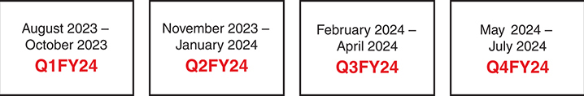
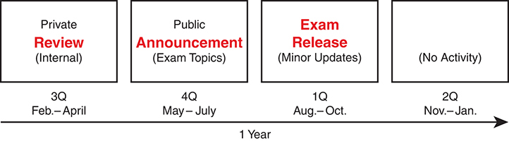
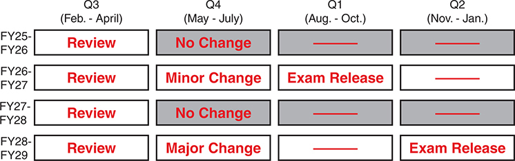

# Chapter 25

## *CCNA 200-301 Official Cert Guide, Volume 2,* Second Edition, Exam Updates

### The Purpose of This Chapter

For all the other chapters, the content should remain unchanged throughout this edition of the book. Instead, this chapter will change over time, with an updated online PDF posted so you can see the latest version of the chapter even after you purchase this book.

Why do we need a chapter that updates over time? For two reasons:

1. To add more technical content to the book before it is time to replace the current book edition with the next edition. This chapter will include additional technology content and possibly additional PDFs containing more content.
2. To communicate detail about the next version of the CCNA exam, to tell you about our publishing plans for that edition, and what that means to you.

To find the latest version of this chapter, follow the process below. Bookmark the link so that any time you refer to this chapter, begin by downloading a new copy. Use these steps:

If you have not yet accessed the companion website, follow these steps:

Step 1. Browse to [www.ciscopress.com/register](http://www.ciscopress.com/register).

Step 2. Enter the print book ISBN (even if you are using an eBook): **9780138214951**.

Step 3. After registering the book, go to your account page and select the **Registered Products** tab.

Step 4. Click the **Access Bonus Content** link to access the companion website. Select the link or scroll down to that section to check for updates.

[Table 25-1](vol2_ch25.md#ch25tab01) summarizes the information that this version of the chapter includes. Use the table as a quick reference for the detail to expect in the rest of the chapter.

**Table 25-1** Status for Available New Technical Content for This Edition

| Chapter Version | 1 |
| --- | --- |
| Most recent CCNA 200-301 blueprint version when this chapter was most recently released | 1.1 |
| Is there technology content in the latter part of this chapter? | No |
| Is there technology content in other downloadable files? | No |
| Links to other file downloads | N/A |
| Is there information about the specifics of the new exam? | No |

Any additional file downloads, or further instructions for file downloads, will be posted at this book's companion website. See the heading "[How to Access the Companion Website](vol2_pref08.md#pref08lev2sec9)" in the Introduction to this book for details on finding this book's companion website.

The following two sections give more detail about the primary purposes of the chapter. Any technical content or exam update detail follows later in the chapter.

#### Additional Technical Content

On rare occasions, the book author might want to add book content mid-edition. This chapter provides the means to do that, as we will publish updated versions of this chapter in PDF form at the publisher's website.

Several reasons exist for new content. It could just be the author looks at a chapter and feels like it needs more. It could be that the technology changes enough to warrant an update before the new edition. Cisco also can (and has) changed exam topic wording without a formal announcement or change to the blueprint version; any related new content would appear in this chapter.

You do not need to check frequently for a new PDF. You may want to check more regularly about exam updates, as discussed in the next section. But to check for new technical content, I suggest downloading the PDF at the beginning of the book and the end of the book. If you download it to begin, you can read content related to the chapters when you first read those chapters. Downloading at the end ensures you have seen the latest available version of this chapter.

Note

An equivalent chapter exists in the *CCNA 200-301 Official Cert Guide, Volume 1*, Second Edition. When doing your final study, check for a new version of that element.

Of course, if this chapter adds new technical content, treat it like any of the other chapters in the book, and study the content!

#### Official Blueprint Changes

Cisco introduced CCNA and CCNP in 1998. For the first 25 years of those certification tracks, Cisco updated the exams on average every 3-4 years. However, Cisco did not pre-announce the exam changes, so exam changes felt very sudden. Usually, a new exam would be announced, with new exam topics, giving you 3-6 months before your only option was to take the new exam. As a result, you could be studying with no idea about Cisco's plans, and the next day, you had a 3-6-month timeline to either pass the old exam or pivot to prepare for the new exam.

Thankfully, Cisco changed their exam release approach in 2023. Called the Cisco Certification Roadmap (<https://cisco.com/go/certroadmap>), the new plan includes these features:

1. Cisco considers changes to all exam tracks (CCNA, CCNP Enterprise, CCNP Security, and so on) annually.
2. Cisco uses a predefined annual schedule for each track, so you know the timing of possible changes to the exam you are studying for, even before any announcements.
3. The schedule moves in a quarterly sequence:

   1. Privately review the exam to consider what to change.
   2. Publicly announce if an exam is changing, and if so, announce details like exam topics and release date.
   3. Release the new exam.
4. Exam changes might not occur each year. If changes occur, Cisco characterizes them as minor (less than 20 percent change) or major (more than 20 percent change).

The specific dates for a given certification track can be confusing because Cisco organizes the work by fiscal year quarters. As an Example, [Figure 25-1](vol2_ch25.md#ch25fig01) shows the 2024 fiscal year. Their fiscal year begins in August, so, for example, the first quarter (Q1) of fiscal year (FY) 2024 began in August 2023.

The diagram divides the Cisco's fiscal year 2024 into four quarters. Each quarter is represented by a box specifies the months included in that quarter and the corresponding fiscal quarter label. The quarters are represented from left to right as Q1FY24 (August 2023 - October 2023), Q2FY24 (November 2023 - January 2024), Q3FY24 (February 2024 - April 2024), and Q4FY24 (May 2024 - July 2024).

**Figure 25-1** *Cisco Fiscal Year and Months Example (FY2024)*

Focus more on the sequence of the quarters to understand the plan. [Figure 25-2](vol2_ch25.md#ch25fig02) shows an example sequence in which Cisco updates the CCNA 200-301 exam, assuming a minor release (less than 20 percent change).

The horizontal timeline outlines the four main phases of the roadmap over one year. There are four boxes along the timeline representing different phases. The first box is labeled "Private Review (Internal)" and spans 3 months from February to April. The second box is labeled "Public Announcement (Exam Topics)" covering 4 months from May to July. The third box is labeled "Exam Release (Minor Updates)" for 1 month between August and October. The fourth box indicates "(No Activity)" spanning 2 months from November to January.

**Figure 25-2** *Cisco CCNA Annual Roadmap with a Minor Release*

Over time, Cisco might make no changes in some years and minor changes in others. For example, Cisco announced CCNA 200-301 version 1.1 in the FY24-FY25 cycle (February 2024-January 2025). [Figure 25-3](vol2_ch25.md#ch25fig03) shows what could happen in the next four years. It first shows a year with no changes, then a year with minor changes, another year with no changes, and a year with major changes.

[Figure 25-3](vol2_ch25.md#ch25fig03) shows an example and does not reveal any secret knowledge about Cisco's plans; however, it shows a volume of change that matches the rate of change to the exam over its long history.

The timeline diagram represents the review periods and changes in the C C N A exam from F Y 25 to F Y 29. Each fiscal year is divided into four quarters, Q 3, Q 4, Q 1, and Q 2 of the following year. The diagram shows a pattern where a Review takes place every year during Q 3 (Feb-Apr). Following the review, there are bars representing the outcome: "No Change" in F Y 25-26 and F Y 27-28, a "Minor Change" in F Y 26-27, and a "Major Change" in F Y 28-29, all occurring in Q 4 (May-Jul). An "Exam Release" is shown in Q 1 (Aug-Oct) in F Y 26-27, while other years are left blank. An "Exam Release" is shown in Q 2 (Nov-Jan) in F Y 28-29, while other years are left blank.

**Figure 25-3** *An Example of What Could Happen with CCNA over Four Years*

#### Impact on You and Your Study Plan

Cisco's new policy helps you plan, but it also means that the CCNA exam might change before you pass the current exam. That impacts you, affecting how we deliver this book to you. This chapter gives us a way to communicate in detail about those changes as they occur. But you should watch other spaces as well.

Your study plan ongoing should follow this general process:

Step 1. Continue to use the *CCNA 200-301 Official Cert Guides, Volumes 1 and 2*, Second Edition, as is.

Step 2. Monitor for updates to this Exam Updates chapter, plus the equivalent chapter in Volume 1, to find additional content for topics Cisco may add to the exam.

Step 3. To be aware of changes to the CCNA exam, monitor the information sources listed below.

For those other information sources to watch, bookmark and check these sites for news. In particular:

**Cisco:** Check their Certification Roadmap page: <https://cisco.com/go/certroadmap>. Make sure to sign up for automatic notifications from Cisco on that page.

**Publisher:** Check this page about new certification products, offers, discounts, and free downloads related to the more frequent exam updates: [www.ciscopress.com/newcert](http://www.ciscopress.com/newcert).

**Cisco Learning Network:** Subscribe to the CCNA Community at [learningnetwork.cisco.com](http://learningnetwork.cisco.com), where I expect ongoing discussions about exam changes over time. If you have questions, search for "roadmap" in the CCNA community, and if you do not find an answer, ask a new one!

**Author:** Look for blog posts labeled as News at [www.certskills.com](http://www.certskills.com). For every new edition, I post about the new exam, new topics, and how to manage the transition. I will continue to do so now with more detail about the new annual cycle. Watch that space and consider subscribing.

As changes arise, I will update this chapter with more detail about exam and book content. Given Cisco's certification roadmap, that means somewhere in each year's fiscal fourth quarter (May-July). At that point, I will publish an updated version of this chapter, listing our content plans. That detail will likely include the following:

* Content removed, so if you plan to take the new exam version, you can ignore those when studying
* New content planned per new exam topics, so you know what's coming

While I do not think Cisco will change CCNA every year--in my opinion, I predict Cisco will change it less than half the years--everyone needs to be aware of the possibility and timing of exam changes and new exam releases. I will use this chapter to communicate the exam and book content details. Look to the other sites from the previous list for brief news about plans, but look here for the detail.

The remainder of the chapter shows the new content that may change over time.

### News About the Next CCNA Exam Release

This statement was last updated in March 2024, before the publication of the *CCNA 200-301 Official Cert Guide, Volume 1,* Second Edition.

This version of this chapter has no news to share about the next CCNA exam release.

At the most recent version of this chapter, the CCNA 200-301 exam version number was Version 1.1.

### Updated Technical Content

The current version of this chapter has no additional technical content.