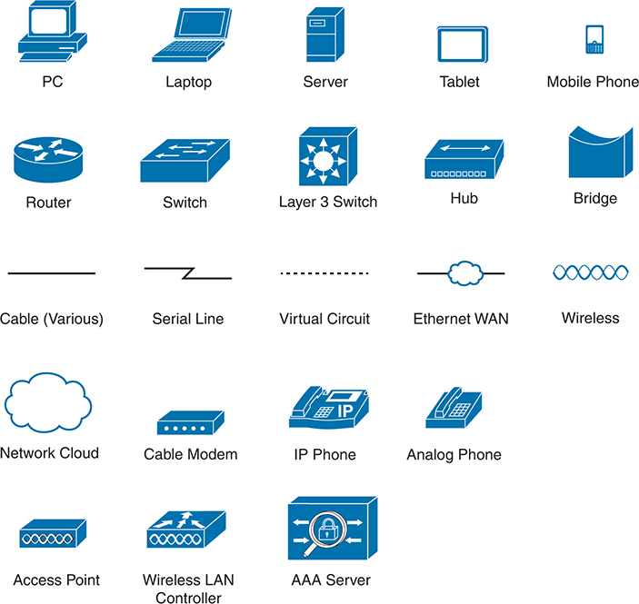

# Icons Used in This Book

Each icon is accompanied by a label describing its function. The icons include representations of a P C, laptop, server, tablet, mobile phone, router, switch, hub, bridge, various cables, serial line, virtual circuit, Ethernet W A N, wireless communication, network cloud, cable modem, I P phone, analog phone, access point, wireless L A N controller, and an A A A server.