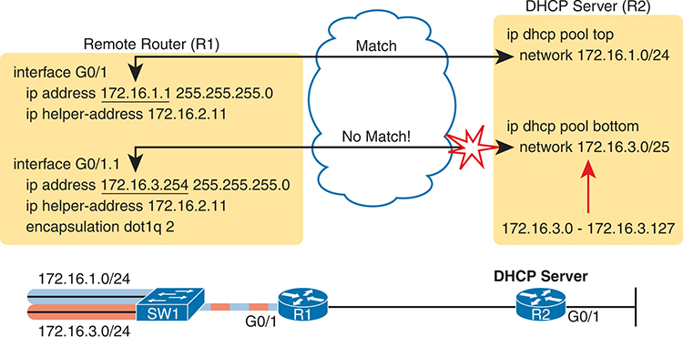
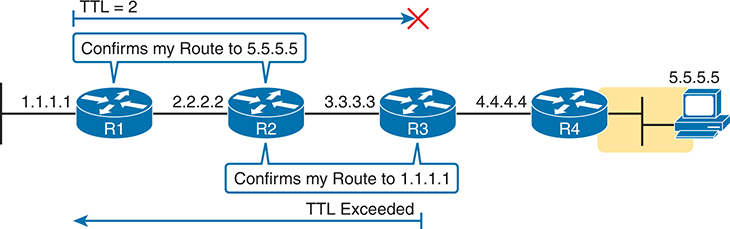

# Appendix K


## Topics from Previous Editions

We base the books' contents on the Cisco exam topics; that is, the books attempt to cover the topics Cisco lists as exam topics. However, the book authoring process does create some challenges, particularly with the balance of what to include in the books and what to leave out.

For instance, when I compared a new exam to the old, Cisco had removed some topics—and I might want to keep the content in the book. There are a few reasons why. Sometimes I just expect that some readers will still want to read about that technology. Also, more than a few schools use these books as textbooks, and including some of the older-but-still-relevant topics can be a help. And keeping the old material available on each book's companion website takes only a little extra work, so we do just that.

Some of the older topics that I choose to keep on the companion website are small, so I collect them into this appendix. Other topics happen to have been an entire chapter in a previous edition of the books, so we include those topics each as a separate appendix. Regardless, the material exists here in this appendix, and in the appendices that follow, for your use if you have a need. But do not feel as though you must read this appendix for the current exam.

The topics in this appendix are as follows:

* IPv4 Address Types
* Bandwidth and Clock Rate on Serial Interfaces
* Implementing DHCP
* Using traceroute to Isolate Problems on Two Routers
* Default Routes with SLAAC on Router Interfaces

Note

The content under the heading "[IPv4 Address Types](vol1_appk.xhtml#appklev1sec1)" was most recently published for the 100-105 Exam in 2016, in [Chapter 20](vol1_ch20.xhtml#ch20) of the *Cisco CCNA ICND1 100-105 Official Cert Guide*.

### IPv4 Address Types

The IPv4 address space includes three major categories of addresses: unicast, broadcast, and multicast. For the current exam, Cisco lists one exam topic that asks you to compare and contrast these address types. To help you make those comparisons, this section explains multicast addressing, while pulling together the key ideas about unicast and broadcast IP addresses that have already been introduced, to pull the ideas together.

#### Review of Unicast (Class A, B, and C) IP Addresses

Unicast IP addresses are those Class A, B, and C IP addresses assigned to hosts, router interfaces, and other networking devices. Because most discussions about IP addressing refer to unicast IP addresses, most of us just refer to them as IP addresses and leave out the word *unicast*.

Just to be complete and define the concept, unicast addresses identify one interface on one device to IP. Just like your postal address gives the post office an address to use to send letters to your one specific house or apartment, a unicast IP address gives the IP network an address to use to send packets to one specific host. However, with IP, instead of addressing the device, unicast addresses identify individual interfaces. For example:

* A router with four LAN interfaces and two WAN interfaces has six unicast addresses, each in a different subnet, one for each interface.
* A PC with both an Ethernet network interface card (NIC) and a wireless NIC would have two unicast IPv4 addresses, one for each interface.

#### IP Broadcast Addresses

Broadcast IPv4 addresses give IP a way to send one packet that the network delivers to multiple hosts. IPv4 defines several types of broadcast addresses, with each type being used to reach a different set of hosts. These different broadcast IP addresses give different overhead protocols like DHCP the ability to efficiently reach all hosts in a specific part of the network. The following list reviews the three IP broadcast address types:

**Local broadcast address:** 255.255.255.255. Used to send a packet on a local subnet, knowing that routers will not forward the packet as is. Also called a *limited broadcast*.

**Subnet broadcast address:** One reserved address for each subnet, namely the numerically highest number in the subnet, as discussed in [Chapter 13](vol1_ch13.xhtml#ch13), "[Analyzing Subnet Masks](vol1_ch13.xhtml#ch13)." A packet sent to a subnet broadcast address can be routed to the router connected to that subnet and then sent as a data link broadcast to all hosts in that one subnet. Also called an *all-hosts broadcast* to emphasize that all hosts in a subnet are reached, and also called a *directed broadcast*.

**Network broadcast address:** One reserved address for each classful network, namely the numerically highest number in the network. Used to send one packet to all hosts in that one network. Also called an *all-subnets broadcast*, referring to the fact that the packet reaches all subnets in a network.

This chapter has already shown how a local broadcast works, sending the message over the same subnet in which it was first transmitted, but no further. However, the other two types are a little more interesting.

Subnet and network broadcasts provide a way to send packets to all hosts in a subnet or network (respectively) while reducing waste. For instance, with a subnet broadcast, routers forward the packet just like any other IP packet going to that subnet. When that packet arrives at the router connected to that subnet, the last router then encapsulates the packet in a LAN broadcast, so that all hosts receive a copy. [Figure K-1](vol1_appk.xhtml#appkfig01) shows the idea.


**Figure K-1** *Example of a Subnet Broadcast to 10.1.1.255*

P C 1's network layer logic directs the packet to the nearest router, R 1. Router R 1 employs its network layer logic to determine the optimal route, forwarding the packet via a leased line to Router R 2. Router R 2's network layer logic comes into play, identifying the LAN link as the appropriate path to P C 2. Each step in this process underscores the essence of I P routing.

The figure shows two key points. R1 does not flood or broadcast the frame to all other routers, instead routing it to the next router (R2 in this case) so that the packet reaches subnet 10.1.1.0/24. R2, connected to subnet 10.1.1.0/24, forwards the packet onto the LAN, but encapsulates the packet in an Ethernet broadcast frame, so that it reaches all hosts in the subnet.

The figure shows the intended use of the subnet broadcast address; however, it presents a security issue today. Many attacks start with a ping to subnet broadcast addresses, hoping to get many hosts to reply. Cisco changed the IOS default many years ago to disable the forwarding of subnet broadcasts onto a connected subnet (that is, it disables Step 3 in [Figure K-1](vol1_appk.xhtml#appkfig01)). That default setting is based on the **no ip directed-broadcast** interface subcommand.

A network broadcast packet (a packet with a network broadcast address as the destination) works in a similar way. To reach all subnets, however, the routers create copies of the packet and flood it so it reaches all subnets inside the classful network. On any LAN interfaces, the packet is forwarded in a LAN broadcast, just as shown in Step 3 of [Figure K-1](vol1_appk.xhtml#appkfig01).

#### IPv4 Multicast Addresses (Class D Addresses)

Multicast IP addresses and the related protocols help solve a similar problem as compared to broadcast addresses, but mainly for applications, and without the same security issues experienced by broadcast addresses. To see how it works, consider this example. A video application may be designed to show live video feeds. If 10 people at the same remote site in the same subnet want to watch the same video at the same time, the application could be designed so that the application sent the same video data 10 times, once to each client in the same subnet. An application designed to use Class D multicast addresses could send 1 packet, which the routers would route across the WAN, and then deliver a copy to all 10 hosts in the destination subnet.

When using multicast, all the hosts still use their individual unicast IP address for their normal traffic, while also using the same multicast IPv4 address for the multicast application. Any server or client that happens to use an application designed to take advantage of IP multicast then also uses the Class D multicast addresses that the application chooses to use. You can think of a Class D address more as a multicast group—in fact, it is often called that—because hosts join the group so that they can receive the packets sent by the multicast application.

Class D addresses begin with a first octet of between 224 and 239, with some ranges reserved for various purposes. Much of the Class D address space is set aside for a company to deploy one of these multicast applications, and then pick an address from the Class D range, and configure it to be used by a multicast application.

As an example, imagine the video application uses Class D address 226.1.1.1. [Figure K-2](vol1_appk.xhtml#appkfig02) illustrates the process by which the application at the server on the left sends one multicast packet with destination address 226.1.1.1. Note that for this process to work, the hosts with \* beside them registered with their local routers to notify the routers that the host wants to receive packets destined to multicast address 226.1.1.1. When the action in this figure begins, the routers collectively know which subnets have hosts that want a copy of multicasts sent to 226.1.1.1 and which subnets do not.


**Figure K-2** *Example of a Multicast Packet Flow for Three Registered Hosts*

P C 1 encapsulates the I P packet within an Ethernet frame destined for Router R 1. Upon reception, Router R 1 de-encapsulates the I P packet from the Ethernet frame and re-encapsulates it into an H D L C frame, forwarding it to Router R 2. Router R 2 then de-encapsulates the packet from the H D L C frame and re-encapsulates it into an Ethernet frame addressed to P C 2.

Following the steps in the figure:

1. The server on the left generates and sends a multicast packet.
2. Router R1 replicates the packet to send a copy to both R2…
3. …and to R3. R1 does not replicate and send a copy to R4, because there are no hosts near R4 listening for packets sent to 226.1.1.1.
4. R2 processes the multicast packet received from R1, and because of the earlier host registration process, R2 knows that at least one host off both its LAN interfaces is listening for packets sent to 226.1.1.1. R2 therefore forwards a copy of the packet out each of its LAN interfaces.
5. R3 receives the multicast packet from R1 and uses the same kind of logic as R2. However, R3 knows from the earlier host registration process that only one of its LAN interfaces connects to a subnet with hosts listening for packets sent to 226.1.1.1, so R3 forwards a copy of the packet out that one interface only.

As you can see from this example, the server sent one packet, and the routers replicated the packet so it reached all the correct locations in the network.

As another comparison between unicast and multicast addresses, note that multicast addresses may be used as destination IP addresses only, whereas unicast addresses may be used as both the destination and source address. For instance, consider the packets in the example shown in [Figure K-2](vol1_appk.xhtml#appkfig02). All those packets flow from one host, so the packet uses a unicast IP address of that host's unicast IP address.

Finally, to complete one more comparison between unicast IP addressing and multicast IP addressing, think about that last hop router in the example shown in [Figure K-1](vol1_appk.xhtml#appkfig01). If a router such as R2 or R3 had forwarded a unicast IP packet, the router would look in its ARP cache to find the unicast IP address for the destination in that connected subnet and the associated unicast MAC address. That will not work when forwarding a multicast packet with a multicast (Class D) destination IP address.

To encapsulate a multicast IP packet over an Ethernet LAN, IP multicast calculates the destination MAC address with a simple process. The process copies the last 23 bits of the IP address behind a reserved 25-bit prefix to form the 48-bit destination MAC address. The resulting MAC address, called a multicast MAC address, begins with hex 01005E. So, the multicast IP packet, encapsulated in the multicast Ethernet frame, is forwarded out the router interface onto the LAN. At that point, the switches take one of the following approaches to forwarding the frame so that all hosts that want a copy of the frame get a copy:

* Flood the multicast frame as if it were a broadcast
* Use other Ethernet multicast features that flood the frame only to those same devices that registered to receive a copy

If you feel as though these few pages probably left out some detail, indeed, several books have been written about IP multicast all to itself. The topic is indeed large. For this book's purposes, know the main comparison points with unicast addressing. Multicast addressing gives applications that need to communicate the same data at the same time to multiple hosts a much more efficient way to do that. If the application is written to make use of IP multicast, the application can consume much less traffic in the network, as compared to using unicast IP addresses and sending every host a copy of the packet.

#### Comparing and Contrasting IP Address Types

The preceding pages reviewed unicast and broadcast addresses and explained the core concepts behind IP multicast addresses. [Table K-1](vol1_appk.xhtml#appktab01) summarizes the key comparison points mentioned throughout this section for convenient study.

**Table K-1** Comparisons of Unicast, Broadcast, and Multicast IP Addresses

|  | Unicast | Broadcast | Multicast |
| --- | --- | --- | --- |
| Primarily used for data sent by the most common user apps (web, email, chat, and so on) | Yes | No | No |
| Assigned to hosts with DHCP | Yes | No | No |
| Uses Class A, B, and C addresses | Yes | No | No |
| Primarily used by overhead protocols (DHCP, ARP) to send one message to more than one device | No | Yes | No |
| Used as destination IP address only | No | Yes | Yes |
| Primarily used by applications that send the same data at the same time to multiple clients | No | No | Yes |
| Uses Class D addresses | No | No | Yes |

Note

The content under the heading "[Bandwidth and Clock Rate on Serial Interfaces](vol1_appk.xhtml#appklev1sec2)" was most recently published for the 100-105 Exam in 2016, in [Chapter 17](vol1_ch17.xhtml#ch17) of the *CCENT/CCNA ICND1 100-105 Official Cert Guide*.

### Bandwidth and Clock Rate on Serial Interfaces

WAN serial links can run at a wide variety of speeds. To deal with the wide range of speeds, routers physically slave themselves to the speed as dictated by the CSU/DSU through a process called *clocking*. As a result, routers can use serial links without the need for additional configuration or autonegotiation to sense the serial link's speed. The CSU/DSU knows the speed, the CSU/DSU sends clock pulses over the cable to the router, and the router reacts to the clocking signal.

To build a serial link in a home lab, the routers can use serial interface cards that normally use an external CSU/DSU, and make a serial link, without requiring the expense of two CSU/DSUs. [Figure K-3](vol1_appk.xhtml#appkfig03) shows the concept. To make it work, the link uses two serial cables—one a DTE cable and the other a DCE cable—which swap the transmit and receive pair on the cables.


**Figure K-3** *Serial Link in Lab*

The schematic shows the connection between a Customer Premises Equipment (C P E) router at R 1's site and the service provider's WAN via a fiber Ethernet link. The connection extends from R 1's C P E router through the fiber Ethernet access link to the Service Provider Point of Presence (P o P) S P 1, representing the service provider's Ethernet WAN service. Similarly, another connection extends from Service Provider P o P S P 2 to R 2's C P E router at another customer site, also facilitated through a fiber Ethernet access link.

Using the correct cabling works, as long as you add one command: the **clock rate** interface subcommand. This command tells that router the speed at which to transmit bits on a serial link like the one shown in [Figure K-3](vol1_appk.xhtml#appkfig03). The **clock rate** command is not needed on real serial links, because the CSU/DSU provides the clocking. When you create a serial link in the lab using cables, without any real CSU/DSUs on the link, the router with the DCE cable must supply that clocking function, and the **clock rate** command tells the router to provide it.

Note

Newer router IOS versions automatically add a default **clock rate 2000000** command on serial interfaces that have a DCE cable connected to them. While helpful, this speed might be too high for some types of back-to-back serial cables, so consider using a lower speed in lab.

[Example K-1](vol1_appk.xhtml#exak_1) shows the configuration of the **clock rate** command. The end of the example verifies that this router can use the **clock rate** command with the **show controllers** command. This command confirms that R1 has a V.35 DCE cable connected.

**Example K-1** *Router R1 Configuration with the **clock rate** Command*

[Click here to view code image](vol1_appk_images.xhtml#appk-1)

```
R1# show running-config
! lines omitted for brevity
interface Serial0/0/0
   ip address 172.16.4.1 255.255.255.0
   clock rate 2000000
!
interface Serial0/0/1
   ip address 172.16.5.1 255.255.255.0
   clock rate 128000

! lines omitted for brevity

R1# show controllers serial 0/0/1
Interface Serial0
Hardware is PowerQUICC MPC860
DCE V.35, clock rate 128000
idb at 0x8169BB20, driver data structure at 0x816A35E4
! Lines omitted for brevity
```

Note

The **clock rate** command does not allow just any speed to be configured. However, the list of speeds does vary from router to router.

Some people confuse the router **bandwidth** command with the **clock rate** command. The **clock rate** command sets the actual Layer 1 speed used on the link, if no CSU/DSU is used, as just described. Conversely, every router interface has a bandwidth setting, either by default or configured. The bandwidth of the interface is the documented speed of the interface, which does not have to match the actual Layer 1 speed used on the interface.

That bandwidth setting does not impact how fast the interface transmits data. Instead, routers use the interface bandwidth setting as both documentation and as input to some other processes. For instance, the Open Shortest Path First (OSPF) and Enhanced Interior Gateway Routing Protocol (EIGRP) routing protocols base their routing protocol metrics on the bandwidth by default.

[Example K-2](vol1_appk.xhtml#exak_2) highlights the bandwidth setting on Router R1's S0/0/1 interface, as configured in the previous example. In that previous example, the **clock rate 128000** command sets the clock rate to 128 kbps, but it leaves the **bandwidth** command unset. As a result, IOS uses the default serial bandwidth setting of 1544, which means 1544 kbps—which is the speed of a T1 serial link.

**Example K-2** *Router Bandwidth Settings*

[Click here to view code image](vol1_appk_images.xhtml#appk-2)

```
R1# show interfaces s0/0/1
Serial0/0/1 is up, line protocol is up
   Hardware is WIC MBRD Serial
   Description: link to R3
   Internet address is 10.1.13.1/24
   MTU 1500 bytes, BW 1544 Kbit/sec, DLY 20000 usec,
      reliability 255/255, txload 1/255, rxload 1/255
   Encapsulation HDLC, loopback not set
```

The common mistake people make is to know about clock rate but mistakenly think that the bandwidth setting is just another term for "clock rate." It is not. Follow these rules to find these two interface settings:

To see the clock rate, look for the **clock rate** interface subcommand in the configuration, or use the **show controllers serial** *number* command (as shown in [Example K-1](vol1_appk.xhtml#exak_1)).

To see the bandwidth setting on an interface, look for the **bandwidth** interface subcommand in the configuration, or use the **show interfaces** [*type number*] command (as shown in [Example K-2](vol1_appk.xhtml#exak_2)).

Note that using default bandwidth settings on most router interfaces makes sense, with the exception of serial interfaces. IOS defaults to a bandwidth of 1544 (meaning 1544 kbps, or 1.544 Mbps) for serial interfaces, regardless of the speed dictated by the provider or by a **clock rate** command in the lab. Most engineers set the bandwidth to match the actual speed, for example, using the **bandwidth 128** interface subcommand on a link running at 128 kbps. On Ethernet 10/100 or 10/100/1000 interfaces, the router knows the speed used and dynamically sets the Ethernet interface's bandwidth to match.

Note

The content under the heading "[Implementing DHCP](vol1_appk.xhtml#appklev1sec3)" was most recently published for the 100-105 Exam in 2016, in [Chapter 20](vol1_ch20.xhtml#ch20) of the *Cisco CCNA ICND1 100-105 Official Cert Guide.*

### Implementing DHCP

This section includes DHCP implementation topics from an earlier edition of the book.

#### DHCP Server Configuration on Routers

A quick Google search on "DHCP server products" reveals that many companies offer DHCP server software. Cisco routers (and some Cisco switches) can also act as a DHCP server with just a little added configuration.

Configuring a Cisco router to act as a DHCP server uses a new configuration concept, one per subnet, called a *DHCP pool*. All the per-subnet settings go into a per-subnet DHCP pool. The only DHCP command that sits outside the pool is the command that defines the list of addresses excluded from being leased by DHCP. The Cisco IOS DHCP server configuration steps are as follows:

Step 1. Use the **ip dhcp excluded-address** *first last* command in global configuration mode to list addresses that should be excluded (that is, not leased by DHCP).

Step 2. Use the **ip dhcp pool** *name* command in global configuration mode to both create a DHCP pool for a subnet and to navigate into DHCP pool configuration mode. Then also

1. Use the **network** *subnet-ID mask* or **network** *subnet-ID prefix-length* command in DHCP pool configuration mode to define the subnet for this pool.
2. Use the **default-router** *address1 address2*… command in DHCP pool configuration mode to define default router IP address(es) in that subnet.
3. Use the **dns-server** *address1 address2*… command in DHCP pool configuration mode to define the list of DNS server IP addresses used by hosts in this subnet.
4. Use the **lease** *days hours minutes* command in DHCP pool configuration mode to define the length of the lease, in days, hours, and minutes.
5. Use the **domain-name** *name* command in DHCP pool configuration mode to define the DNS domain name.
6. Use the **next-server** *ip-address* command in DHCP pool configuration mode to define the TFTP server IP address used by any hosts (like phones) that need a TFTP server.

Of course, an example can help, particularly with so many configuration commands required. [Figure K-4](vol1_appk.xhtml#appkfig04) shows the organization of the configuration, while sticking to pseudocode rather than the specific configuration commands. (Upcoming [Example K-3](vol1_appk.xhtml#exak_3) shows a matching configuration.) Note that for each of the two LAN subnets, there is a global command to exclude addresses, and then a group of settings for each of two different DHCP pools.


**Figure K-4** *DHCP Server Configuration Pseudocode*

P C 1 is connected to R 1 via an Ethernet LAN, and R 1 is linked to R 2 through a fiber-optic Ethernet link on interface G 0/1. R 2 is connected to P C 2 via another Ethernet LAN.

**Example K-3** *R2 as a DHCP Server Per the Concepts in [Figure K-4](vol1_appk.xhtml#appkfig04)*

[Click here to view code image](vol1_appk_images.xhtml#appk-3)

```
ip dhcp excluded-address 172.16.1.1 172.16.1.50
ip dhcp excluded-address 172.16.2.1 172.16.2.100
!
ip dhcp pool subnet-left
 network 172.16.1.0 255.255.255.0
 dns-server 172.16.1.12
 default-router 172.16.1.1
 lease 0 23 59
 domain-name example.com
 next-server 172.16.2.5
!
ip dhcp pool subnet-right
 network 172.16.2.0 /24
 dns-server 172.16.1.12
 default-router 172.16.2.1
 lease 1 2 3
 next-server 172.16.2.5
```

Focus on subnet 172.16.1.0/24 for a moment: the subnet is configured as pool subnet-left. The subnet ID and mask match the subnet ID chosen for that subnet. Then the global **ip dhcp excluded-address** command, just above, reserves 172.16.1.1 through 172.16.1.50, so that this DHCP server will not lease these addresses. The server will automatically exclude the subnet ID (172.16.1.0) as well, so this DHCP server will begin leasing IP addresses starting with the .51 address.

Now look at the details for subnet-right. It uses a DHCP pool **network** command with a prefix-style mask. It defines the same DNS server, as does the pool for the other subnet, but a different default router setting, because, of course, the default router in each subnet is different. This pool includes a lease time of 1:02:03 (1 day, 2 hours, and 3 minutes) just as an example.

Also note that both subnets list a TFTP server IP address of the Unified Communications Manager (UCM) server with the **next-server** command. In most cases, you would find this setting in the pools for subnets in which phones reside.

Finally, note that configuring a router as a DHCP server does not remove the need for the **ip helper-address** command. If DHCP clients still exist on LANs that do not have a DHCP server, then the routers connected to those LANs still need the **ip helper-address** command. For example, in [Figure K-3](vol1_appk.xhtml#appkfig03), R1 would still need the **ip helper-address** command on its LAN interface. R2 would not need the command on its LAN interface, because R2 could service those requests, rather than needing to forward the DHCP messages to some other server.

#### IOS DHCP Server Verification

The IOS DHCP server function has several different **show** commands. These three commands list most of the details:

**show ip dhcp binding:** Lists state information about each IP address currently leased to a client

**show ip dhcp pool** [*poolname*]**:** Lists the configured range of IP addresses, plus statistics for the number of currently leased addresses and the high-water mark for leases from each pool

**show ip dhcp server statistics:** Lists DHCP server statistics

[Example K-4](vol1_appk.xhtml#exak_4) shows sample output from two of these commands, based on the configuration from [Figure K-4](vol1_appk.xhtml#appkfig04) and [Example K-3](vol1_appk.xhtml#exak_3). In this case, the DHCP server leased one IP address from each of the pools—one for host A and one for host B—as shown in the highlighted portions of the output.

**Example K-4** *Verifying Current Operation of a Router-Based DHCP Server*

[Click here to view code image](vol1_appk_images.xhtml#appk-4)

```
R2# show ip dhcp binding
Bindings from all pools not associated with VRF:
IP address          Client-ID/              Lease expiration        Type
                    Hardware address/
                    User name
172.16.1.51         0063.6973.636f.2d30.    Oct 12 2012 02:56 AM    Automatic
                    3230.302e.3131.3131.
                    2e31.3131.312d.4661.
                    302f.30
172.16.2.101        0063.6973.636f.2d30.    Oct 12 2012 04:59 AM    Automatic
                    3230.302e.3232.3232.
                    2e32.3232.322d.4769.
                    302f.30
R2# show ip dhcp pool subnet-right
Pool subnet-right :
 Utilization mark (high/low)    : 100 / 0
 Subnet size (first/next)       : 0 / 0
 Total addresses                : 254
 Leased addresses               : 1
 Pending event                  : none
 1 subnet is currently in the pool :
 Current index        IP address range                     Leased addresses
 172.16.2.102         172.16.2.1       - 172.16.2.254      1
```

Note that the output in [Example K-4](vol1_appk.xhtml#exak_4) does not happen to list the excluded addresses, but it does show the effects. The addresses assigned to the clients end with .51 (host A, subnet 172.16.1.0) and .101 (host B, subnet 172.16.2.0), proving that the server did exclude the addresses as shown in the configuration in [Example K-3](vol1_appk.xhtml#exak_3). The server avoided the .1 through .50 addresses in subnet 172.16.1.0, and the .1 through .100 addresses in subnet 172.16.2.0.

Note

The DHCP server keeps status (state) information about each DHCP client that leases an address. Specifically, it remembers the DHCP client ID and the IP address leased to the client. As a result, an IPv4 DHCP server can be considered to be a stateful DHCP server.

#### Troubleshooting DHCP Services

To be prepared for the CCNA Simlet questions, you have to be ready to predict what symptoms would occur when the network was misconfigured in particular ways. This next section takes a similar approach, pointing out the most typical issues that could be introduced through incorrect or missing configuration, and then discussing what symptoms should happen and how to recognize those problems.

This section begins with a typical look at configuration mistakes and the symptoms that occur with those mistakes. In particular, this section looks at problems with the relay agent's helper address as well as the IOS DHCP server configuration. This section then looks at non-DHCP problems related to that data plane, breaking the problem into issues between the client and relay agent, and between the relay agent and DHCP server. The final section takes a short look at how a DHCP server prevents duplicate IP addresses between hosts that use static IP addresses and those that use DHCP.

##### DHCP Relay Agent Configuration Mistakes and Symptoms

One configuration mistake that prevents a DHCP client from leasing an IP address is the misconfiguration or the omission of the **ip helper-address** interface subcommand on the router acting as the DHCP relay agent. The relay agent takes the incoming DHCP message, changes the destination address of the packet to be the address on the **ip helper-address** *address* command, and forwards the packet to that address. If the command is missing, the router does not attempt to forward the DHCP messages at all; if it is incorrect, the relay agent forwards the DHCP packets, but they never arrive at the actual DHCP server.

The main problem symptom in this case is the failure of a DHCP client to lease an address. If you can identify a client that has a problem, and you know what VLAN or subnet in which that host resides, you can then work to identify any routers connected to that subnet, to find and correct the **ip helper-address** subcommands.

Beyond that step, this list summarizes a few other related points.

* The DHCP relay agent feature is needed on interfaces only if the DHCP server is on a different subnet; it is not needed if the DHCP server is on the same subnet as the client.
* On routers with VLAN trunks (with a router-on-a-stick [ROAS] subinterface configuration), the subinterfaces also need an **ip helper-address** command (assuming they meet the first criteria in this list).
* If an exam question does not allow you to look at the configuration, use the **show ip interface** [*type number*] command to view the **ip helper-address** setting on an interface.

About that last point, [Example K-5](vol1_appk.xhtml#exak_5) shows an example of the **show ip interface g0/0** command. In this case, the interface has been configured with the **ip helper-address 172.16.2.11** command; the **show** command output basically restates that fact. Note that if there were no **ip helper-address** configured on the interface, the text would instead read "Helper address is not set."

**Example K-5** *Listing the Current Helper Address Setting with **show ip interface***

[Click here to view code image](vol1_appk_images.xhtml#appk-5)

```
R1# show ip interface g0/0
GigabitEthernet0/0 is up, line protocol is up
  Internet address is 182.16.1.1/24
  Broadcast address is 255.255.255.255
  Address determined by non-volatile memory
  MTU is 1500 bytes
  Helper address is 172.16.2.11
! Lines omitted for brevity (about 20 lines)
```

##### IOS DHCP Server Configuration Mistakes and Symptoms

When using an IOS DHCP server, from a troubleshooting perspective, break issues into two broad categories: those that prevent DHCP clients from leasing an address and those that allow the lease but provide incorrect settings to the client.

First, the primary configuration mistake that causes a failure in the DHCP lease process is the misconfiguration of the **network** command. The problem revolves around these key facts:

* The packet from the relay agent to the DHCP server uses the relay agent's interface IP address as the source IP address in the forwarded DHCP message.
* The DHCP server compares that source IP address in the received DHCP packet to the **network** commands in its DHCP pools to find the right pool.
* Each **network** *subnet mask* command implies a range of addresses, just like any other IP network or subnet shown with a subnet mask.
* If the source IP address of the packet is not in the range of addresses implied by any **network** command in all the pools, the DHCP server has no pool to use for that request. The DHCP server does not know how to respond, so it does not reply at all.

As an example of that failure, consider the configuration shown in [Figure K-5](vol1_appk.xhtml#appkfig05). The left side shows the configuration on R1, a DHCP relay agent that has two interfaces configured with the **ip helper-address 172.16.2.11** command. The DHCP server configuration on the right lists two pools, intended as one pool for each subnet off Router R1. However, the **network 172.16.3.0 /25** command implies an address range of 172.16.3.0 to 172.16.3.127, and the relay agent's interface address of 172.16.3.254 is not within that range of numbers. The solution would be to correct the DHCP server's **network** command to use a /24 mask.

Note

The **ip helper-address** configuration on the left is correct. The figure uses the ROAS configuration here just to reinforce the comment in the earlier section that ROAS subinterfaces also need an **ip helper-address** subcommand.




**Figure K-5** *A Sample Misconfiguration of a DHCP Pool **network** Command*

P C 1 encapsulates an I P packet within an Ethernet frame, incorporating an 802.3 header and trailer. The source MAC address is set to R 1's G 0/1 MAC, and the destination MAC address is R 2's G 0/0 MAC. Upon receiving the frame, R 1 re-encapsulates the packet with R 2's MAC as the destination and its own as the source, adding a new 802.3 header and trailer. R 1 then forwards this modified frame to R 2 over the Ethernet WAN service. R 2, upon reception, de-encapsulates the I P packet and encapsulates it into another Ethernet frame with P C 2's MAC as the destination, completing the routing process.

While you ultimately need to find this kind of problem and fix the configuration, on the exam you need to be ready to discover the root cause based on symptoms and **show** commands as well. So, when troubleshooting DHCP issues, and the client fails to lease an address, look at the IOS DHCP server's **network** commands. Calculate the range of IP addresses as if that command were defining a subnet. Then compare that range of addresses by the **network** command in each pool to the interface addresses on the DHCP relay agent routers. Every relay agent interface (that is, every interface with an **ip helper-address** command configured) should be included in a pool defined at the IOS DHCP server.

The DHCP server can also be misconfigured in a way that allows the lease of an address, but then causes other problems. If the lease process works, but the rest of the parameters given to the client are incorrect or missing, the client could operate, but operate poorly. This list summarizes the kinds of mistakes and the resulting symptoms:

* With the DNS server IP addresses incorrectly configured on the server (or omitted), hosts would fail to resolve hostnames into their associated IP addresses.
* With the default gateway IP address incorrectly configured on the server (or omitted), hosts could not communicate outside the local subnet.
* With the TFTP server IP address incorrectly configured (or omitted), an IP phone would fail to correctly load its configuration.

##### IP Connectivity from DHCP Relay Agent to DHCP Server

For the DHCP process to work with a centralized server, IP broadcast packets must flow between the client and relay agent, and IP unicast packets must flow between the relay agent and the DHCP server. Any problem that prevents the flow of these packets also prevents DHCP from working.

For perspective, consider the topology in [Figure K-6](vol1_appk.xhtml#appkfig06), which again shows the relay agent on the left and the DHCP server on the right. The server uses IP address 172.16.2.11, and the relay agent uses interface address 172.16.1.1. Any failure that prevents the flow of IP packets between those two IP addresses would prevent host A from leasing an IP address.


**Figure K-6** *Addresses Used Between Relay Agent and Server*

The process begins with P C 1, which intends to send an I P packet to P C 2, located in another group. P C 1 sends the packet to the nearby router, identified as 150.150.1.10. The I P packet is then routed through a series of routers. Router R 1 receives the packet and determines that it should be sent to Router R 2. Router R 2 receives the packet on its Serial 0 interface and determines it should be sent to Router R 3. Router R 3 receives the packet on its Ethernet interface (F 0/0) and decides to send it directly to P C 2, located at subnet 150.150.4.0 with the I P address 150.150.4.10. P C 2 receives the I P packet, completing the routing process.

Remember that the IP addresses are used on the packets between the relay agent and server, and know that you may need to troubleshoot IP routing to ensure those packets can be delivered.

##### LAN Connectivity Between the DHCP Client and Relay Agent

You might encounter a network environment where DHCP messages on the same LAN as the DHCP client all show a destination IP address of 255.255.255.255. What does that really mean? When a packet uses this 255.255.255.255 address:

* The address is called the *local broadcast address*.
* Packets sent to this address are not forwarded as-is by routers.
* On a LAN, the sender of an IP local broadcast packet encapsulates these IP packets in an Ethernet frame with an Ethernet broadcast destination address (FFFF.FFFF.FFFF), so the LAN broadcasts the frame.

As a result of the logic in these steps, the broadcast DHCP messages can easily flow between the client and router, as long as the LAN works.

##### Summary of DHCP Troubleshooting

In summary, as a study tool, the following list summarizes the key troubleshooting ideas from this section on troubleshooting DHCP:

Step 1. If you're using a centralized DHCP server, at least one router on each remote subnet that has DHCP clients must act as DHCP relay agent and have a correctly configured **ip helper-address** *address* subcommand on the interface connected to that subnet.

Step 2. If you're using a centralized IOS DHCP server, make sure the DHCP pools' **network** commands match the entire network's list of router interfaces that have an **ip helper-address** command pointing to this DHCP server.

Step 3. Troubleshoot for any IP connectivity issues between the DHCP relay agent and the DHCP server, using the relay agent interface IP address and the server IP address as the source and destination of the packets.

Step 4. Troubleshoot for any LAN issues between the DHCP client and the DHCP relay agent.

Also, as one final note about DHCP in the real world, DHCP might seem dangerous at this point, with all the focus on potential problems in this section, combined with the importance of DHCP and its use by most end-user devices. However, DHCP has some great availability features. First, most DHCP servers set their lease times for at least a few days, often a week, or maybe longer. Combined with that, the DHCP protocol has several processes through which the client reconfirms the existing lease with the server, and re-leases the same IP address in advance of the expiration of the lease. Clients do not simply wait until the moment the lease would expire to then contact the DHCP server, hoping it is available. So the network can have outages, and DHCP clients that have already leased an address can continue to work without any problem.

##### Detecting Conflicts with Offered Versus Used Addresses

Beyond troubleshooting the types of problems that would prevent DHCP from working, the IOS DHCP server tries to prevent another type of problem: assigning IP addresses with DHCP when another host tries to statically configure that same IP address. Although the DHCP server configuration clearly lists the addresses in the pool, plus those to be excluded from the pool, hosts can still statically configure addresses from the range inside the DHCP pool. In other words, no protocols prevent a host from statically configuring and using an IP address from within the range of addresses used by the DHCP server.

Knowing that some host might have statically configured an address from within the range of addresses in the DHCP pool, both DHCP servers and clients try to detect such problems, called *conflicts*, before the client uses a newly leased address.

DHCP servers detect conflicts by using pings. Before offering a new IP address to a client, the DHCP server first pings the address. If the server receives a response to the ping, some other host must already be using the address, which lets the server know a conflict exists. The server notes that particular address as being in conflict, and the server does not offer the address, moving on to the next address in the pool.

The DHCP client can also detect conflicts, but instead of using ping, it uses ARP. In the client case, when the DHCP client receives from the DHCP server an offer to use a particular IP address, the client sends an Address Resolution Protocol (ARP) request for that address. If another host replies, the DHCP client has found a conflict.

[Example K-6](vol1_appk.xhtml#exak_6) lists output from the router-based DHCP server on R2, after host B detected a conflict using ARP. Behind the scenes, host B used DHCP to request a lease, with the process working normally until host B used ARP and found some other device already used 172.16.2.102. At that point, host B then sent a DHCP message back to the server, rejecting the use of address 172.16.2.102. The example shows the router's log message related to host B's discovery of the conflict and a **show** command that lists all conflicted addresses.

**Example K-6** *Displaying Information About DHCP Conflicts in IOS*

[Click here to view code image](vol1_appk_images.xhtml#appk-6)

```
*Oct 16 19:28:59.220: %DHCPD-4-DECLINE_CONFLICT: DHCP address conflict:   client
0063.6973.636f.2d30.3230.302e.3034.3034.2e30.3430.342d.4769.302f.30     declined
172.16.2.102.
R2# show ip dhcp conflict
IP address        Detection method   Detection time          VRF
172.16.2.102      Gratuitous ARP     Oct 16 2012 07:28 PM
```

The **show ip dhcp conflict** command lists the method through which the server added each address to the conflict list: either gratuitous ARP, as detected by the client, or ping, as detected by the server. The server avoids offering these conflicted addresses to any future clients, until the engineer uses the **clear ip dhcp conflict** command to clear the list.

Note

The content under the heading "[Using traceroute to Isolate the Problem to Two Routers](vol1_appk.xhtml#appklev1sec4)" was most recently published for the 100-105 Exam in 2016, in [Chapter 23](vol1_ch23.xhtml#ch23) of the *Cisco CCNA ICND1 100-105 Official Cert Guide*.

### Using traceroute to Isolate the Problem to Two Routers

One of the best features of the **traceroute** command, as compared to ping, is that when it does not complete, it gives an immediate clue as to where to look next. With ping, when the ping fails, the next step is usually to use more **ping** commands. With traceroute, it tells you what router to try to connect and look at the routes and in which direction.

Note

As a reminder, this book uses the term *forward route* for routes that send the packets sent by the **ping** or **traceroute** command, and *reverse route* for the packets sent back.

When a problem exists, a **traceroute** command results in a partial list of routers. Then the command either finishes with an incomplete list, or it runs until the user must stop the command. In either case, the output does not list all routers in the end-to-end route because of the underlying problem.

Note

In addition, the **traceroute** command may not finish even though the network has no problems. Routers and firewalls may filter the messages sent by the **traceroute** command, or the TTL Exceeded messages, which would prevent the display of portions or all or part of the path.

The last router listed in the output of a **traceroute** command's output tells us where to look next to isolate the problem, as follows:

* Connect to the CLI of the last router listed, to look at forward route issues.
* Connect to the CLI of the next router that should have been listed, to look for reverse route issues.

To see why, consider an example based on the internetwork in [Figure K-7](vol1_appk.xhtml#appkfig07). In this case, R1 uses an extended traceroute to host 5.5.5.5, with source IP address 1.1.1.1. This command's output lists router 2.2.2.2, then 3.3.3.3, and then the command cannot complete.


**Figure K-7** *Messages That Cause the **traceroute** Command to List 2.2.2.2*

Step A: P C 1 with I P address 150.150.1.10 encapsulates an I P packet within an Ethernet frame. Step B: Router R 1 receives the Ethernet frame, encapsulates it in H D L C, and consults its routing table to determine the next hop for the packet, which is 150.150.2.7 via the Serial 0 interface. Step C: Router R 2 receives the H D L C frame, encapsulates it back into an Ethernet frame, and forwards it based on its routing table to 150.150.3.1 via Fast Ethernet 0/0 interface. Step D: Router R3 receives the Ethernet frame, forwards it, and routes the packet to P C 2 via the Gigabit Ethernet 0/0 interface. This step includes examining the routing table for the subnet 150.150.4.0 and the absence of a next hop. P C 2 resides within the same subnet, denoted by 150.150.4.0.

First, [Figure K-7](vol1_appk.xhtml#appkfig07) focuses on the first line of output: the line that lists first-hop router 2.2.2.2.

The figure shows the TTL=1 message at the top and the TTL Exceeded message back on the bottom. This first pair of messages in the figure must have worked, because without them, the **traceroute** command on R1 cannot have learned about a router with address 2.2.2.2. The first (top) message required R1 to have a route for 5.5.5.5, which sent the packets to R2 next. The TTL Exceeded message required that R2 have a route that matched address 1.1.1.1, to send the packets back to R1's LAN IP address.

Next, [Figure K-8](vol1_appk.xhtml#appkfig08) focuses on the messages that allow the second line of output on R1's sample **traceroute** command: the line that correctly lists 3.3.3.3 as the next router in the route.




**Figure K-8** *Messages That Cause the **traceroute** Command to List 3.3.3.3*

Layer 1 of the I P v 4 header comprises the version, length, D S field, and packet length, arranged into 4-byte segments. Layer 22 of the I P v 4 header comprises the identification, flags, and fragment offset, arranged into 4-byte segments. Layer 3 of the I P v 4 header comprises the time to live, protocol header, and checksum, arranged into 4-byte segments. Layers 4 and 5 comprise the source I P address and the destination I P address arranged into 4-byte segments.

Following the same logic, the **traceroute** output lists 3.3.3.3 because the messages in [Figure K-8](vol1_appk.xhtml#appkfig08) must have worked. For these messages to flow, the routes listed in [Figure K-7](vol1_appk.xhtml#appkfig07) must exist, plus new routes listed in K-8. Specifically, the TTL=2 packet at the top requires R2 to have a route for 5.5.5.5, which sends the packets to R3 next. The TTL Exceeded message requires that R3 have a route that matches address 1.1.1.1, to send the packets back toward R1's LAN IP address.

In this example, the **traceroute 5.5.5.5** command does not list any routers beyond 2.2.2.2 and 3.3.3.3 However, based on the figures, it is clear that 4.4.4.4 should be the next IP address listed. To help isolate the problem further, why might the next messages—the message with TTL=3 and the response—fail?

[Figure K-9](vol1_appk.xhtml#appkfig09) points out the routing issues that can cause this command to not be able to list 4.4.4.4 as the next router. First, R3 must have a forward route matching destination 5.5.5.5 and forwarding the packet to Router R4. The return message requires a reverse route matching destination 1.1.1.1 and forwarding the packet back to Router R3.


**Figure K-9** *Issues That Could Prevent **traceroute** from Listing 4.4.4.4*

At the bottom of the figure, Subnet 150.150.4.0 is shown as connected to Router R 3. Independently, R 3 adds a connected route for 150.150.4.0 to its I P routing table. R 3 then initiates a routing protocol message, a routing update, to inform Router R 2 about Subnet 150.150.4.0. Upon receipt, R 2 updates its routing table accordingly. Subsequently, R 2 forwards a similar routing update to Router R 1, enabling R 1 to learn about Subnet 150.150.4.0. Finally, R 1 adds a route for Subnet 150.150.4.0 to its routing table, indicating its own Serial 0 interface as the outgoing interface and designating R 2's I P address (150.150.2.7) as the next-hop router.

In conclusion, for this example, if a routing problem prevents the **traceroute** command from working, the problem exists in one of two places: the forward route to 5.5.5.5 on Router R3, or the reverse route to 1.1.1.1 on R4.

Note

The content under the heading "[Default Routes with SLAAC on Router Interfaces](vol1_appk.xhtml#appklev1sec5)" was most recently published in Chapter 32 of the *Cisco CCNA ICND1 100-105 Official Cert Guide*.

### Default Routes with SLAAC on Router Interfaces

Routers can use DHCP on their own interface and learn their IP address, mask, and even a default IPv4 route. In particular, that process can be useful on a router that connects to the Internet. The enterprise router uses DHCP as a client, learning its own IPv4 address with DHCP and adding a default route pointing to the ISP's router as the next-hop IPv4 address.

Routers can accomplish the same goals with IPv6, just with a few different protocols and methods. As with IPv4, the IPv6 enterprise router can dynamically learn its IPv6 address and dynamically create a default IPv6 route to the ISP's router. This section shows the details, with the enterprise router using SLAAC to learn its address and the information needed to create a default route.

First, the enterprise router that connects to the ISP, like Router R1 in [Figure K-10](vol1_appk.xhtml#appkfig10), requires the configuration of the interface subcommand **ipv6 address autoconfig default**. This command tells the router that, on that interface, use SLAAC to build its own IPv6 address. R1 would act like any host that uses SLAAC, as shown in Step 2 of the figure, and send an NDP RS message over the link. As noted at Step 3, the ISP router would send back an RA message, announcing router ISP1's IPv6 address and the IPv6 prefix used on the link.


**Figure K-10** *Enterprise Router Using SLAAC to Build IPv6 Address and Default IPv6 Route*

In a basic Domain Name System (D N S) name resolution request within a T C P/I P network, P C 11 initiates the process by querying for the I P address of Server 1. The D NS server, responsible for maintaining a database correlating domain names with I P addresses, receives the request. It consults its database, finding the corresponding entry for Server 1, associated with the I P address 10.1.2.3. It consults its database, which includes entries for Server1 and Server2, mapping to I P addresses 10.1.2.3 and 10.1.2.6, respectively. Upon resolution, the D N S server responds to P C 11, providing the requested I P address.

When R1 receives the NDP RA message, it does the following:

**Interface address:** Builds its own interface IPv6 address using the SLAAC process, based on the prefix in the RA.

**Local /128 route:** Adds a local (/128) IPv6 route for the address, as it would for any interface IPv6 address.

**Connected route for prefix:** Adds a connected (/64) route for the prefix learned in the NDP RA message.

**Default route:** R1 adds a default route, to destination ::/0, with the next-hop address of ISP's link-local address, as learned in the RA sent by router ISP1.

Note that the router can be configured to add this default route or not. As shown in the figure, the router builds a default route. Using the **ipv6 address autoconfig** subcommand without the **default** keyword causes the router to build its address with SLAAC but not add a default route.

[Example K-7](vol1_appk.xhtml#exak_7) shows the three IPv6 routes on Router R1 just mentioned in the list. In particular, note the codes for the connected route and the default route; both codes begin with ND, meaning the route was learned with NDP. In particular, as highlighted in the legend part of the output, *ND* refers to an NDP-learned default route, and *NDp* refers to an NDP-learned prefix (as listed in the NDP RA message in [Figure K-10](vol1_appk.xhtml#appkfig10) in this case). Note also that these same two routes have an administrative distance of 2, which is the default administrative distance of IPv6 routes learned with NDP.

**Example K-7** *Learning an Address and Default Static Route with DHCP*

[Click here to view code image](vol1_appk_images.xhtml#appk-7)

```
R1# show ipv6 route
IPv6 Routing Table - default - 4 entries
Codes: C - Connected, L - Local, S - Static, U - Per-user Static route
       B - BGP, HA - Home Agent, MR - Mobile Router, R - RIP
       H - NHRP, I1 - ISIS L1, I2 - ISIS L2, IA - ISIS interarea
       IS - ISIS summary, D - EIGRP, EX - EIGRP external, NM - NEMO
       ND - ND Default, NDp - ND Prefix, DCE - Destination, NDr - Redirect
       O - OSPF Intra, OI - OSPF Inter, OE1 - OSPF ext 1, OE2 - OSPF ext 2
       ON1 - OSPF NSSA ext 1, ON2 - OSPF NSSA ext 2, la - LISP alt
       lr - LISP site-registrations, ld - LISP dyn-eid, a - Application
ND ::/0 [2/0]
     via FE80::22FF:FE22:2222, Serial0/0/0
NDp 2001:DB8:1:12::/64 [2/0]
     via Serial0/0/0, directly connected
L 2001:DB8:1:12:32F7:DFF:FE29:8560/128 [0/0]
    via Serial0/0/0, receive
! lines omitted for brevity
```