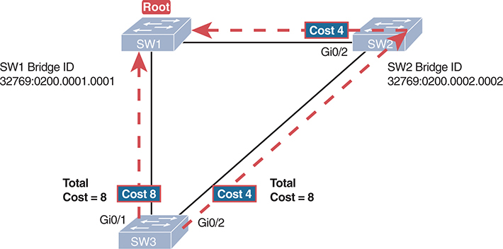
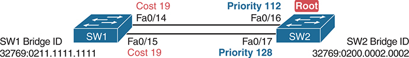
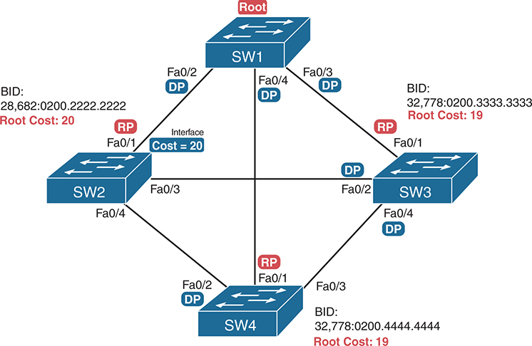
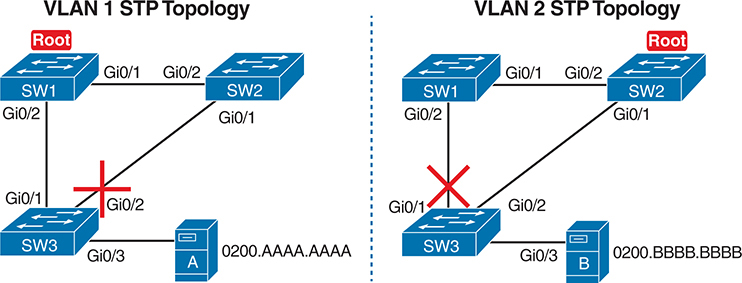
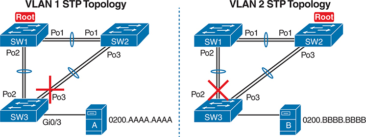

# Appendix L


## LAN Troubleshooting

Note

This appendix contains content that was published as a chapter in one of the past editions of this book or a related book. The author includes this appendix with the current edition as extra reading for anyone interested in learning more. However, note that the content in this appendix has not been edited since it was published in the earlier edition, so references to exams and exam topics, and to other chapters, will be outdated. This appendix was previously published as [Chapter 4](vol1_ch04.xhtml#ch04) of the book *CCNA Routing and Switching ICND2 200-105 Official Cert Guide*, published in 2016.

This chapter discusses the LAN topics discussed in depth in the first three chapters, plus a few prerequisite topics, from a troubleshooting perspective.

Troubleshooting for any networking topic requires a slightly different mindset as compared to thinking about configuration and verification. When thinking about configuration and verification, it helps to think about basic designs, learn how to configure the feature correctly, and learn how to verify the correct configuration is indeed working correctly. However, to learn how to troubleshoot, you need to think about symptoms when the design is incorrect, or if the configuration does not match the good design. What symptoms occur when you make one type of mistake or another? This chapter looks at the common types of mistakes, and works through how to look at the status with **show** commands to find those mistakes.

This chapter breaks the material into four major sections. The first section tackles the largest topic, STP troubleshooting. STP is not likely to fail as a protocol; instead, STP may not be operating as designed, so the task is to find how STP is currently working and discover how to then make the configuration implement the correct design. The second major section then moves on to Layer 2 EtherChannels, which have a variety of small potential problems that can prevent the dynamic formation of an EtherChannel.

The third major section of the chapter focuses on the data plane forwarding of Ethernet frames on LAN switches, in light of VLANs, trunks, STP, and EtherChannels. That same section reviews the Layer 2 forwarding logic of a switch in light of these features. The fourth and final major section then examines VLAN and trunking issues, and how those issues impact switch forwarding.

Note that a few of the subtopics listed within the exam topics at the beginning of this chapter are not discussed in this chapter. This chapter does not discuss VTP beyond its basic features or Layer 3 EtherChannels.

### Foundation Topics

### Troubleshooting STP

STP questions tend to intimidate many test takers. STP uses many rules, with tiebreakers in case one rule ends with a tie. Without much experience with STP, people tend to distrust their own answers. Also, even those of us with networking jobs already probably do not troubleshoot STP very often, because STP works well. Often, troubleshooting STP is not about STP failing to do its job but rather about STP working differently than designed, with a different root switch, or different root ports (RP), and so on. Seldom does STP troubleshooting begin with a case in which STP has failed to prevent a loop.

This section reviews the rules for STP, while emphasizing some important troubleshooting points. In particular, this section takes a closer look at the tiebreakers that STP uses to make decisions. It also makes some practical suggestions about how to go about answering exam questions such as "which switch is the root switch?"

#### Determining the Root Switch

Determining the STP root switch is easy if you know all the switches' BIDs: Just pick the lowest value. If the question lists the priority and MAC address separately, as is common in some **show** command output, pick the switch with the lowest priority, or in the case of a tie, pick the lower MAC address value.

And just to be extra clear, STP does not have nor need a tiebreaker for electing the root switch. The BID uses a switch universal MAC address as the last 48 bits of the BID. These MAC addresses are unique in the universe, so there should never be identical BIDs or the need for a tiebreaker.

For the exam, a question that asks about the root switch might not be so simple as listing a bunch of BIDs and asking you which one is "best." A more likely question is a simulator (sim) question in which you have to do any **show** commands you like or a multiple choice question that lists the output from only one or two commands. Then you have to apply the STP algorithm to figure out the rest.

When faced with an exam question using a simulator, or just the output in an exhibit, use a simple strategy of ruling out switches, as follows:

Step 1. Begin with a list or diagram of switches, and consider all as possible root switches.

Step 2. Rule out any switches that have an RP (**show spanning-tree**, **show spanning-tree root**), because root switches do not have an RP.

Step 3. Always try **show spanning-tree**, because it identifies the local switch as root directly: "This switch is the root" on the fifth line of output.

Step 4. Always try **show spanning-tree root**, because it identifies the local switch as root indirectly: The RP column is empty if the local switch is the root.

Step 5. When using a sim, rather than try switches randomly, chase the RPs. For example, if starting with SW1, and SW1's G0/1 is an RP, next try the switch on the other end of SW1's G0/1 port.

Step 6. When using a sim, use **show spanning-tree vlan** *x* on a few switches and record the root switch, RP, and designated port (DP). This strategy can quickly show you most STP facts.

The one step in this list that most people ignore is the idea of ruling out switches that have an RP. Root switches do not have an RP, so any switch with an RP can be ruled out as not being the root switch for that VLAN. [Example L-1](vol1_appl.xhtml#exal_1) shows two commands on switch SW2 in some LAN that confirms that SW2 has an RP and is therefore not the root switch.

**Example L-1** *Ruling Out Switches as Root Based on Having a Root Port*

[Click here to view code image](vol1_appl_images.xhtml#appl-1)

```
SW2# show spanning-tree vlan 20 root

                                           Root Hello Max Fwd
Vlan                   Root ID             Cost  Time Age Dly  Root Port
---------------- -------------------- --------- ----- --- ---  ------------
VLAN0020         32788 1833.9d7b.0e80         4    2   20  15  Gi0/2

SW2# show spanning-tree vlan 20

VLAN0020
  Spanning tree enabled protocol ieee
  Root ID    Priority    32788
             Address     1833.9d7b.0e80
             Cost        4
             Port        26 (GigabitEthernet0/2)
             Hello Time   2 sec  Max Age 20 sec  Forward Delay 15 sec

  Bridge ID  Priority    32788  (priority 32768 sys-id-ext 20)
             Address     1833.9d7b.1380
             Hello Time   2 sec  Max Age 20 sec  Forward Delay 15 sec
             Aging Time  15  sec

Interface           Role Sts Cost      Prio.Nbr Type
------------------- ---- --- --------- -------- --------------------------------
Gi0/1               Desg FWD 4         128.25   P2p
Gi0/2               Root FWD 4         128.26   P2p
```

Both commands identify SW2's G0/2 port as its RP, so if you follow the suggestions, the next switch to try in a sim question would be the switch on the other end of SW2's G0/2 interface.

#### Determining the Root Port on Nonroot Switches

Determining the RP of a switch when **show** command output is available is relatively easy. As shown recently in [Example L-1](vol1_appl.xhtml#exal_1), both **show spanning-tree** and **show spanning-tree root** list the root port of the local switch, assuming it is not the root switch. The challenge comes more when an exam question makes you think through how the switches choose the RP based on the root cost of each path to the root switch, with some tiebreakers as necessary.

As a review, each nonroot switch has one, and only one, RP for a VLAN. To choose its RP, a switch listens for incoming Hello bridge protocol data units (BPDU). For each received Hello, the switch adds the cost listed in the hello BPDU to the cost of the incoming interface (the interface on which the Hello was received). That total is the root cost over that path. The lowest root cost wins, and the local switch uses its local port that is part of the least root cost path as its root port.

Most humans can analyze what STP chooses by using a network diagram and a slightly different algorithm. Instead of thinking about Hello messages and so on, approach the question as this: the sum of all outgoing port costs between the nonroot switch and the root. Repeating a familiar example, with a twist, [Figure L-1](vol1_appl.xhtml#applfig01) shows the calculation of the root cost. Note that SW3's Gi0/1 port has yet again had its cost configured to a different value.




**Figure L-1** *SW3's Root Cost Calculation Ends in a Tie*

The sequence unfolds as follows: First, an A R P request is broadcasted over the Ethernet network by Router 3 (R 3). The sender's I P address and MAC address are set to R 3's respective identifiers, while the target I P address is specified as 150.150.4.10, although the target MAC address is yet to be determined. Subsequently, in response to the A R P request, an ARP reply is unicast back to R 3. The target I P and MAC addresses are now identified as R 3's, while the sender I P is set to 150.150.4.10, and the sender MAC is revealed as 0200.2222.2222.

##### STP Tiebreakers When Choosing the Root Port

[Figure L-1](vol1_appl.xhtml#applfig01) shows the easier process of adding the STP costs of the outgoing interfaces over each from SW3, a nonroot, to SW1, the root. It also shows a tie (on purpose), to talk about the tiebreakers.

When a switch chooses its root port, the first choice is to choose the local port that is part of the least root cost path. When those costs tie, the switch picks the port connected to the neighbor with the lowest BID. This tiebreaker usually breaks the tie, but not always. So, for completeness, the three tiebreakers are, in the order a switch uses them, as follows:

1. Choose based on the lowest neighbor bridge ID.
2. Choose based on the lowest neighbor port priority.
3. Choose based on the lowest neighbor internal port number.

(Note that the switch only considers the root paths that tie when thinking about these tiebreakers.)

For example, [Figure L-1](vol1_appl.xhtml#applfig01) shows that SW3 is not root and that its two paths to reach the root tie with their root costs of 8. The first tiebreaker is the lowest neighbor's BID. SW1's BID value is lower than SW2's, so SW3 chooses its G0/1 interface as its RP in this case.

The last two RP tiebreakers come into play only when two switches connect to each other with multiple links, as shown in [Figure L-2](vol1_appl.xhtml#applfig02). In that case, a switch receives Hellos on more than one port from the same neighboring switch, so the BIDs tie.




**Figure L-2** *Topology Required for the Last Two Tiebreakers for Root Port*

Hannah initiates a ping command directed towards Harold. The process involves the generation of an Ethernet frame encapsulating an Internet Protocol (I P) packet containing an Internet Control Message Protocol (I C M P) Echo Request by Hannah. This request is transmitted across the Ethernet network to reach Harold. Upon receiving the I C M P Echo Request, Harold responds with an I C M P Echo Reply, encapsulated within an I P packet and an Ethernet frame.

In this particular example, SW2 becomes root, and SW1 needs to choose its RP. SW1's port costs tie, at 19 each, so SW1's root cost over each path will tie at 19. SW2 sends Hellos over each link to SW1, so SW1 cannot break the tie based on SW1's neighbor BID because both list SW2's BID. So, SW1 has to turn to the other two tiebreakers.

Note

In real life, most engineers would put these two links into an EtherChannel.

The next tiebreaker is a configurable option: the neighboring switch's port priority on each neighboring switch interface. Cisco switch ports default to a setting of 128, with a range of values from 0 through 255, with lower being better (as usual). In this example, the network engineer has set SW2's F0/16 interface with the **spanning-tree vlan 10 port-priority 112** command. SW1 learns that the neighbor has a port priority of 112 on the top link and 128 on the bottom, so SW1 uses its top (F0/14) interface as the root port.

If the port priority ties, which it often does due to the default values, STP relies on an internal port numbering on the neighbor. Cisco switches assign an internal integer to identify each interface on the switch. The nonroot looks for the neighbor's lowest internal port number (as listed in the Hello messages) and chooses its RP based on the lower number.

Cisco switches use an obvious numbering, with Fa0/1 having the lowest number, then Fa0/2, then Fa0/3, and so on. So, in [Figure L-2](vol1_appl.xhtml#applfig02), SW2's Fa0/16 would have a lower internal port number than Fa0/17; SW1 would learn those numbers in the Hello; and SW1 would use its Fa0/14 port as its RP.

##### Suggestions for Attacking Root Port Problems on the Exam

Exam questions that make you think about the RP can be easy if you know where to look and the output of a few key commands is available. However, the more conceptual the question, the more you have to calculate the root cost over each path, correlate that to different **show** commands, and put the ideas together. The following list makes a few suggestions about how to approach STP problems on the exam:

1. If available, look at the **show spanning-tree** and **show spanning-tree root** commands. Both commands list the root port and the root cost (see [Example L-1](vol1_appl.xhtml#exal_1)).
2. The **show spanning-tree** command lists cost in two places: the root cost at the top, in the section about the root switch; and the interface cost, at the bottom, in the per-interface section. Be careful, though; the cost at the bottom is the interface cost, not the root cost!
3. For problems where you have to calculate a switch's root cost:

   1. Memorize the default cost values: 100 for 10 Mbps, 19 for 100 Mbps, 4 for 1 Gbps, and 2 for 10 Gbps.
   2. Look for any evidence of the **spanning-tree cost** configuration command on an interface, because it overrides the default cost. Do not assume default costs are used.
   3. When you know a default cost is used, if you can, check the current actual speed as well. Cisco switches choose STP cost defaults based on the current speed, not the maximum speed.

#### Determining the Designated Port on Each LAN Segment

Each LAN segment has a single switch that acts as the designated port (DP) on that segment. On segments that connect a switch to a device that does not even use STP—for example, segments connecting a switch to a PC or a router—the switch always wins, because it is the only device sending a Hello onto the link. However, links with two switches require a little more work to discover which should be the DP. By definition:

Step 1. For switches connected to the same LAN segment, the switch with the lowest cost to reach the root, as advertised in the Hello they send onto the link, becomes the DP on that link.

Step 2. In case of a tie, among the switches that tied on cost, the switch with the lowest BID becomes the DP.

For example, consider [Figure L-3](vol1_appl.xhtml#applfig03). This figure notes the root, RPs, and DPs and each switch's least cost to reach the root over its respective RP.




**Figure L-3** *Picking the DPs*

The Campus LAN encompasses networking infrastructure within a university, business campus, or similar environment, facilitating communication among devices such as computers and printers. The Data Center LAN focuses on networking infrastructure within a centralized data center facility, supporting the storage, processing, and distribution of data and applications.

Focus on the segments that connect the nonroot switches for a moment:

**SW2–SW4 segment:** SW4 wins because of its root cost of 19, compared to SW2's root cost of 20.

**SW2–SW3 segment:** SW3 wins because of its root cost of 19, compared to SW2's root cost of 20.

**SW3–SW4 segment:** SW3 and SW4 tie on root cost, both with root cost 19. SW3 wins due to its better (lower) BID value.

Interestingly, SW2 loses and does not become DP on the links to SW3 and SW4 even though SW2 has the better (lower) BID value. The DP tiebreaker does use the lowest BID, but the first DP criteria is the lowest root cost, and SW2's root cost happens to be higher than SW3's and SW4's.

Note

A single switch can connect two or more interfaces to the same collision domain, and compete to become DP, if hubs are used. In such cases, two different switch ports on the same switch tie, the DP choice uses the same two final tiebreakers as used with the RP selection: the lowest interface STP priority, and if that ties, the lowest internal interface number.

##### Suggestions for Attacking Designated Port Problems on the Exam

As with exam questions asking about the RP, exam questions that make you think about the DP can be easy if you know where to look and the output of a few key commands is available. However, the more conceptual the question, the more you have to think about the criteria for choosing the DP: first the root cost of the competing switches, and then the better BID if they tie based on root cost.

The following list gives some tips to keep in mind when digging into a given DP issue. Some of this list repeats the suggestions for finding the RP, but to be complete, this list includes each idea as well.

1. If available, look at the **show spanning-tree** commands, at the list of interfaces at the end of the output. Then, look for the Role column, and look for Desg, to identify any DPs.
2. Identify the root cost of a switch directly by using the **show spanning-tree** command. But be careful! This command lists the cost in two places, and only the mention at the top, in the section about the root, lists the root cost.
3. For problems where you have to calculate a switch's root cost, do the following:

   1. Memorize the default cost values: 100 for 10 Mbps, 19 for 100 Mbps, 4 for 1 Gbps, and 2 for 10 Gbps.
   2. Look for any evidence of the **spanning-tree cost** configuration command on an interface, because it overrides the default cost. Do not assume default costs are used.
   3. When you know a default cost is used, if you can, check the current actual speed as well. Cisco switches choose STP cost defaults based on the current speed, not the maximum speed.

#### STP Convergence

STP puts each RP and DP into a forwarding state, and ports that are neither RP nor DP into a blocking state. Those states may remain as is for days, weeks, or months. But at some point, some switch or link will fail, a link may change speeds (changing the STP cost), or the STP configuration may change. Any of these events can cause switches to repeat their STP algorithm, which may in turn change their own RP and any ports that are DPs.

When STP converges based on some change, not all the ports have to change their state. For instance, a port that was forwarding, if it still needs to forward, just keeps on forwarding. Ports that were blocking that still need to block keep on blocking. But when a port needs to change state, something has to happen, based on the following rules:

* For interfaces that stay in the same STP state, nothing needs to change.
* For interfaces that need to move from a forwarding state to a blocking state, the switch immediately changes the state to blocking.
* For interfaces that need to move from a blocking state to a forwarding state, the switch first moves the interface to listening state, then learning state, each for the time specified by the forward delay timer (default 15 seconds). Only then is the interface placed into forwarding state.

Because the transition from blocking to forwarding does require some extra steps, you should be ready to respond to conceptual questions about the transition.

### Troubleshooting Layer 2 EtherChannel

EtherChannels can prove particularly challenging to troubleshoot for a couple of reasons. First, you have to be careful to match the correct configuration, and there are many more incorrect configuration combinations than there are correct combinations. Second, many interface settings must match on the physical links, both on the local switch and on the neighboring switch, before a switch will add the physical link to the channel. This second major section in the chapter works through both sets of issues.

#### Incorrect Options on the channel-group Command

The rules for the small set of working configuration options on the **channel-group** command can be summarized as follows, for a single EtherChannel:

1. On the local switch, all the **channel-group** commands for all the physical interfaces must use the same channel-group number.
2. The channel-group number can be different on the neighboring switches.
3. If using the **on** keyword, you must use it on the corresponding interfaces of both switches.
4. If you use the **desirable** keyword on one switch, the switch uses PAgP; the other switch must use either **desirable** or **auto**.
5. If you use the **active** keyword on one switch, the switch uses LACP; the other switch must use either **active** or **passive**.

These rules summarize the correct configuration options, but the options actually leave many more incorrect choices. The following list shows some incorrect configurations that the switches allow, even though they would result in the EtherChannel not working. The list compares the configuration on one switch to another based on the physical interface configuration. Each lists the reasons why the configuration is incorrect.

* Configuring the **on** keyword on one switch, and **desirable**, **auto**, **active**, or **passive** on the other switch. The **on** keyword does not enable PAgP, and does not enable LACP, and the other options rely on PAgP or LACP.
* Configuring the **auto** keyword on both switches. Both use PAgP, but both wait on the other switch to begin negotiations.
* Configuring the **passive** keyword on both switches. Both use LACP, but both wait on the other switch to begin negotiations.
* Configuring the **active** keyword on one switch and either **desirable** or **auto** on the other switch. The **active** keyword uses LACP, whereas the other keywords use PAgP.
* Configuring the **desirable** keyword on one switch and either **active** or **passive** on the other switch. The **desirable** keyword uses PAgP, whereas the other keywords use LACP.

[Example L-2](vol1_appl.xhtml#exal_2) shows an example that matches the last item in the list. In this case, SW1's two ports (F0/14 and F0/15) have been configured with the **desirable** keyword, and SW2's matching F0/16 and F0/17 have been configured with the **active** keyword. The example lists some telling status information about the failure, with notes following the example.

**Example L-2** *Incorrect Configuration Using Mismatched PortChannel Protocols*

[Click here to view code image](vol1_appl_images.xhtml#appl-2)

```
SW1# show etherchannel summary
Flags:  D - down        P - bundled in port-channel
        I - stand-alone s - suspended
        H - Hot-standby (LACP only)
        R - Layer3      S - Layer2
        U - in use      f - failed to allocate aggregator

        M - not in use, minimum links not met
        u - unsuitable for bundling
        w - waiting to be aggregated
        d - default port


Number of channel-groups in use: 1
Number of aggregators:           1

Group  Port-channel  Protocol    Ports
------+-------------+-----------+-----------------------------------------------
1      Po1(SD)         PAgP      Fa0/14(I)   Fa0/15(I)

SW1# show interfaces status | include Po|14|15
Port      Name               Status       Vlan       Duplex  Speed Type
Fa0/14                       connected    301        a-full  a-100 10/100BaseTX
Fa0/15                       connected    301        a-full  a-100 10/100BaseTX
Po1                          notconnect   unassigned   auto   auto
```

Start at the top, in the legend of the **show etherchannel summary** command. The *D* code letter means that the channel itself is down, with *S* meaning that the channel is a Layer 2 EtherChannel. Code *I* means that the physical interface is working independently from the PortChannel (described as "stand-alone"). Then, the bottom of that command's output highlights PortChannel 1 (Po1) as Layer 2 EtherChannel in a down state (SD), with F0/14 and F0/15 as stand-alone interfaces (I).

Interestingly, because the problem is a configuration mistake, the two physical interfaces still operate independently, as if the PortChannel did not exist. The last command in the example shows that while the PortChannel 1 interface is down, the two physical interfaces are in a connected state.

Note

As a suggestion for attacking EtherChannel problems on the exam, rather than memorizing all the incorrect configuration options, concentrate on the list of correct configuration options. Then look for any differences between a given question's configuration as compared to the known correct configurations and work from there.

### Analyzing the Switch Data Plane Forwarding

STP and EtherChannel both have an impact on what a switch's forwarding logic can use. STP limits which interfaces the data plane even considers using by placing some ports in a blocking state (STP) or discarding state (RSTP), which in turn tells the data plane to simply not use that port. EtherChannel gives the data plane new ports to use in the switch's MAC address table—EtherChannels—while telling the data plane to not use the underlying physical interfaces in an EtherChannel in the MAC table.

This (short) third major section of the chapter explores the impact of STP and EtherChannel on data plane logic and a switch's MAC address table.

#### Predicting STP Impact on MAC Tables

Consider the small LAN shown in [Figure L-4](vol1_appl.xhtml#applfig04). The LAN has only three switches, with redundancy, just big enough to make the point for this next example. The LAN supports two VLANs, 1 and 2, and the engineer has configured STP such that SW3 blocks on a different port in each of the two VLANs. As a result, VLAN 1 traffic would flow from SW3 to SW1 next, and in VLAN 2, traffic would flow from SW3 to SW2 next instead.




**Figure L-4** *Two Different STP Topologies for Same Physical LAN, Two Different VLANs*

The frame consists of a header section comprising the Destination Address (6 bytes), Type (2 bytes), Start Frame Delimiter (S F D - 1 byte), and Source Address (6 bytes), preceded by a Preamble (7 bytes) for synchronization. Following the header is the Data and Pad section, ranging from 46 to 1500 bytes, accommodating payload data. Finally, the frame concludes with a Frame Check Sequence (F C S - 4 bytes) and Trailer, ensuring data integrity during transmission.

Looking at diagrams like those in [Figure L-4](vol1_appl.xhtml#applfig04) makes the forwarding path obvious. Although the figure shows the traffic path, that path is determined by switch MAC learning, which is then impacted by the ports on which STP has set a blocking or discarding state.

For example, consider VLAN 1's STP topology in [Figure L-4](vol1_appl.xhtml#applfig04). Remember, STP blocks on a port on one switch, not on both ends of the link. So, in the case of VLAN 1, SW3's G0/2 port blocks, but SW2's G0/1 does not. Even so, by blocking on a port on one end of the link, that act effectively stops any MAC learning from happening by either device on the link. That is, SW3 learns no MAC addresses on its G0/2 port, and SW2 learns no MAC addresses on its G0/1 port, for these reasons:

* **SW2 learns no MAC addresses on G0/1:** On the blocking (SW3) end of the SW3–SW2 trunk, SW3 will not send frames out that link to SW2, so SW2 will never receive frames from which to learn MAC addresses on SW2's G0/1.
* **SW3 learns no MAC addresses on G0/2:** On the not blocking (SW2) end of the SW3–SW2 trunk, SW2 will flood frames out that port. SW3 receives those frames, but because SW3 blocks, SW3 ignores those received frames and does not learn their MAC addresses.

Given that discussion, can you predict the MAC table entries on each of the three switches for the MAC addresses of servers A and B in [Figure L-4](vol1_appl.xhtml#applfig04)? On switch SW2, the entry for server A, in VLAN 1, should refer to SW2's G0/2 port, pointing to SW1 next, matching the figure. But SW2's entry for server B, in VLAN 2, references SW2's G0/1 port, again matching the figure. [Example L-3](vol1_appl.xhtml#exal_3) shows the MAC tables on SW1 and SW2 as a confirmation.

**Example L-3** *Examining SW1 and SW2 Dynamic MAC Address Table Entries*

[Click here to view code image](vol1_appl_images.xhtml#appl-3)

```
SW1# show mac address-table dynamic
          Mac Address Table
-------------------------------------------

Vlan    Mac Address       Type        Ports
----    -----------       --------    -----
  1     0200.AAAA.AAAA    DYNAMIC     Gi0/2
  2     0200.BBBB.BBBB    DYNAMIC     Gi0/1
```

```
SW2# show mac address-table dynamic
          Mac Address Table
-------------------------------------------

Vlan    Mac Address       Type        Ports
----    -----------       --------    -----
  1     0200.AAAA.AAAA    DYNAMIC     Gi0/2
  2     0200.BBBB.BBBB    DYNAMIC     Gi0/1
```

#### Predicting EtherChannel Impact on MAC Tables

Most designs use multiple links between switches, with those links configured to be part of an EtherChannel. What does that do to the MAC forwarding logic? In short, the switch uses the PortChannel interfaces, and not the physical interfaces bundled into the EtherChannel, in the MAC address table. Specifically:

**MAC learning:** Frames received in a physical interface that is part of a PortChannel are considered to arrive on the PortChannel interface. So, MAC learning adds the PortChannel interface rather than the physical interface to the MAC address table.

**MAC forwarding:** The forwarding process will find a PortChannel port as an outgoing interface when matching the MAC address table. Then the switch must take the additional step to choose the outgoing physical interface, based on the load-balancing preferences configured for that PortChannel.

For example, consider [Figure L-5](vol1_appl.xhtml#applfig05), which updates previous [Figure L-4](vol1_appl.xhtml#applfig04) with two-link PortChannels between each pair of switches. With VLAN 1 blocking again on switch SW3, but this time on SW3's PortChannel3 interface, what MAC table entries would you expect to see in each switch? Similarly, what MAC table entries would you expect to see for VLAN 2, with SW3 blocking on its PortChannel2 interface?

The logic of which entries exist on which ports mirrors the logic with the earlier example surrounding [Figure L-4](vol1_appl.xhtml#applfig04). In this case, the interfaces just happen to be PortChannel interfaces. [Example L-4](vol1_appl.xhtml#exal_4) shows the same command from the same two switches as [Example L-3](vol1_appl.xhtml#exal_3): **show mac address-table dynamic** from both SW1 and SW2. (Note that to save length, the MAC table output shows only the entries for the two servers in [Figure L-5](vol1_appl.xhtml#applfig05).)




**Figure L-5** *VLAN Topology with PortChannels Between Switches*

Fred, with the destination MAC address of 0200.2222.2222, arrives on port F0/1 and is subsequently forwarded out through port F0/2, while filtering prevents transmission on ports F0/3 and F0/4. Wilma and Barney, with MAC addresses 0200.3333.3333 and 0200.2222.2222 respectively, are forwarded out ports F0/4 and F0/2. Betty's MAC address, 0200.4444.4444, results in output through port F0/3. The MAC addresses and their corresponding output ports are detailed, demonstrating the switch's decision-making process for frame forwarding and filtering, crucial for efficient network traffic management.

**Example L-4** *SW1 and SW2 MAC Tables with PortChannel Ports Listed*

[Click here to view code image](vol1_appl_images.xhtml#appl-4)

```
SW1# show mac address-table dynamic
          Mac Address Table
-------------------------------------------

Vlan    Mac Address       Type        Ports
----    -----------       --------    -----
  1     0200.AAAA.AAAA    DYNAMIC     Po2
  2     0200.BBBB.BBBB    DYNAMIC     Po1
```

```
SW2# show mac address-table dynamic
          Mac Address Table
-------------------------------------------

Vlan    Mac Address       Type        Ports
----    -----------       --------    -----
  1     0200.AAAA.AAAA    DYNAMIC     Po1
  2     0200.BBBB.BBBB    DYNAMIC     Po3
```

Switches use one of many load-balancing options to then choose the physical interface to use after matching MAC table entries like those shown in [Example L-4](vol1_appl.xhtml#exal_4). By default, Cisco Layer 2 switches often default to use a balancing method based on the source MAC address. In particular, the switch looks at the low-order bits of the source MAC address (which are on the far right of the MAC address in written form). This approach increases the chances that the balancing will be spread somewhat evenly based on the source MAC addresses in use.

#### Choosing the VLAN of Incoming Frames

To wrap up the analysis of switch data plane forwarding, this section mostly reviews topics already discussed, but it serves to emphasize some important points. The topic is simply this: How does a switch know which VLAN a frame is a part of as the frame enters a switch? You have seen all the information needed to answer this question already, but take the time to review.

First, some interfaces trunk, and in those cases, the frame arrives with a VLAN ID listed in the incoming trunking header. In other cases, the frame does not arrive with a trunking header, and the switch must look at local configuration. But because the switch will match both the destination MAC address and the frame VLAN ID when matching the MAC address table, knowing how the switch determines the VLAN ID is important.

The following list reviews and summarizes the key points of how a switch determines the VLAN ID to associate with an incoming frame:

Step 1. If the port is an access port, associate the frame with the configured access VLAN (**switchport access vlan** *vlan\_id*).

Step 2. If the port is a voice port, or has both an IP Phone and PC (or other data device) connected to the phone:

1. Associate the frames from the data device with the configured access VLAN (as configured with the **switchport access vlan** *vlan\_id* command).
2. Associate the frames from the phone with the VLAN ID in the 802.1Q header (as configured with the **switchport voice vlan** *vlan\_id* command).

Step 3. If the port is a trunk, determine the frame's tagged VLAN, or if there is no tag, use that incoming interface's native VLAN ID (**switchport trunk native** *vlan\_id*).