# Chapter 1

## Introduction to TCP/IP Networking

This chapter covers the following exam topics:

1.0 Network Fundamentals

1.3 Compare physical interface and cabling types

1.3.a Single-mode fiber, multimode fiber, copper

1.3.b Connections (Ethernet shared media and point-to-point)

Welcome to the first chapter in your study for CCNA! This chapter begins [Part I](vol1_part01.xhtml#part01), which focuses on the basics of networking.

Networks work correctly because the various devices and software follow the rules. Those rules come in the form of standards and protocols, which are agreements of a particular part of how a network should work. However, the sheer number of standards and protocols available can make it difficult for the average network engineer to think about and work with networks—so the world of networking has used several networking models over time. Networking models define a structure and different categories (layers) of standards and protocols. As new standards and protocols emerge over time, networkers can think of those new details in the context of a working model.

You can think of a networking model as you think of a set of architectural plans for building a house. A lot of different people work on building your house, such as framers, electricians, bricklayers, painters, and so on. The blueprint helps ensure that all the different pieces of the house work together as a whole. Similarly, the people who make networking products, and the people who use those products to build their own computer networks, follow a particular networking model. That networking model defines rules about how each part of the network should work, as well as how the parts should work together so that the entire network functions correctly.

Today, TCP/IP rules as the most pervasive networking model in use. You can find support for TCP/IP on practically every computer operating system (OS) in existence today, from mobile phones to mainframe computers. Every network built using Cisco products today supports TCP/IP. And not surprisingly, the CCNA exam focuses heavily on TCP/IP. This chapter uses TCP/IP for one of its main purposes: to present various concepts about networking using the context of the different roles and functions in the TCP/IP model.

Note that most chapters cover topics about some specific CCNA exam topic. However, this chapter does not. Instead, it describes background information about the TCP/IP model and ideas you need to know about so you can better understand the detail included in CCNA.

### "Do I Know This Already?" Quiz

Take the quiz (either here or use the PTP software) if you want to use the score to help you decide how much time to spend on this chapter. The letter answers are listed at the bottom of the page following the quiz. [Appendix C](vol1_appc.xhtml#appc), found both at the end of the book as well as on the companion website, includes both the answers and explanations. You can also find both answers and explanations in the PTP testing software.

**Table 1-1** "Do I Know This Already?" Foundation Topics Section-to-Question Mapping

| Foundation Topics Section | Questions |
| --- | --- |
| Perspectives on Networking | None |
| TCP/IP Networking Model | 1–4 |
| Data Encapsulation Terminology | 5–6 |

**[1](vol1_ch01.xhtml#ques1_1a).** Which of the following protocols are examples of TCP/IP transport layer protocols? (Choose two answers.)

1. Ethernet
2. HTTP
3. IP
4. UDP
5. SMTP
6. TCP

**[2](vol1_ch01.xhtml#ques1_2a).** Which of the following protocols are examples of TCP/IP data-link layer protocols? (Choose two answers.)

1. Ethernet
2. HTTP
3. IP
4. UDP
5. SMTP
6. TCP
7. 802.11

**[3](vol1_ch01.xhtml#ques1_3a).** The process of HTTP asking TCP to send some data and making sure that it is received correctly is an example of what?

1. Same-layer interaction
2. Adjacent-layer interaction
3. TCP/IP model
4. All of these answers are correct.

**[4](vol1_ch01.xhtml#ques1_4a).** The process of TCP on one computer marking a TCP segment as segment 1 and the receiving computer then acknowledging the receipt of TCP segment 1 is an example of what?

1. Data encapsulation
2. Same-layer interaction
3. Adjacent-layer interaction
4. TCP/IP model
5. All of these answers are correct.

**[5](vol1_ch01.xhtml#ques1_5a).** The process of a web server adding a TCP header to the contents of a web page, followed by adding an IP header and then adding a data-link header and trailer, is an example of what?

1. Data encapsulation
2. Same-layer interaction
3. TCP/IP model
4. All of these answers are correct.

**[6](vol1_ch01.xhtml#ques1_6a).** Which of the following terms is used specifically to identify the entity created when encapsulating data inside data-link layer headers and trailers?

1. Data
2. Chunk
3. Segment
4. Frame
5. Packet

Answers to the "Do I Know This Already?" quiz:

**[1](vol1_appc.xhtml#ques1_1)** D and F

**[2](vol1_appc.xhtml#ques1_2)** A and G

**[3](vol1_appc.xhtml#ques1_3)** B

**[4](vol1_appc.xhtml#ques1_4)** B

**[5](vol1_appc.xhtml#ques1_5)** A

**[6](vol1_appc.xhtml#ques1_6)** D

### Foundation Topics

### Perspectives on Networking

So, you are new to networking. If you're like many people, your perspective about networks might be that of a user of the network, as opposed to the network engineer who builds networks. For some, your view of networking might be based on how you use the Internet, from home, using a high-speed Internet connection like fiber Ethernet or cable TV, as shown in [Figure 1-1](vol1_ch01.xhtml#ch01fig01).

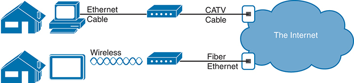

**Figure 1-1** *End-User Perspective on High-Speed Internet Connections*

A schematic illustrates two houses on the left representing end users with different devices, each connected to the internet represented by a cloud. The first device is connected to the router via an Ethernet Cable and the CATV cable connects the router with the internet. The second device utilizes Wireless technology to connect with the router represented by airwaves, and a Fiber Ethernet connects the router with the internet.

The top part of the figure shows a typical high-speed cable Internet user. The PC connects to a cable modem using an Ethernet cable. The cable modem then connects to a cable TV (CATV) outlet in the wall using a round coaxial cable—the same kind of cable used to connect your TV to the CATV wall outlet. Because cable Internet services provide service continuously, the user can just sit down at the PC and start sending email, browsing websites, making Internet phone calls, and using other tools and applications.

The lower part of the figure uses Ethernet between the home and service provider. First, the tablet computer uses wireless technology that goes by the name *wireless local-area* *network (wireless LAN)*. In this example, the router uses a different technology, Ethernet, using a fiber-optic cable, to communicate with the Internet.

Both home-based networks and networks built for use by a company make use of similar networking technologies. The Information Technology (IT) world refers to a network created by one corporation, or enterprise, for the purpose of allowing its employees to communicate, as an *enterprise network*. The smaller networks at home, when used for business purposes, often go by the name small office/home office (SOHO) networks.

Users of enterprise networks have some idea about the enterprise network at their company or school. People realize that they use a network for many tasks. PC users might realize that their PC connects through an Ethernet cable to a matching wall outlet, as shown at the top of [Figure 1-2](vol1_ch01.xhtml#ch01fig02). Those same users might use wireless LANs with their laptop when going to a meeting in the conference room as well. [Figure 1-2](vol1_ch01.xhtml#ch01fig02) shows these two end-user perspectives on an enterprise network.

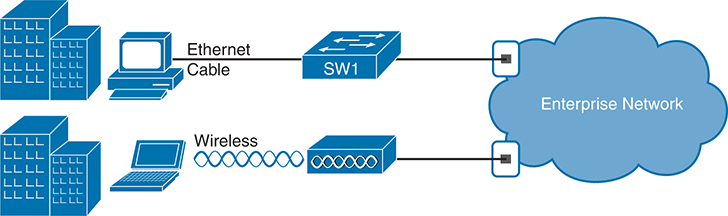

**Figure 1-2** *Example Representation of an Enterprise Network*

In the schematic, there are two devices; the top set is connected via an Ethernet cable to a switch labeled "S W 1," and the bottom set is connected wirelessly. Both the switch is then connected to Enterprise Network.

Note

In networking diagrams, a cloud represents a part of a network whose details are not important to the purpose of the diagram. In this case, [Figure 1-2](vol1_ch01.xhtml#ch01fig02) ignores the details of how to create an enterprise network.

Some users might not even have a concept of the network at all. Instead, these users just enjoy the functions of the network—the ability to post messages to social media sites, make phone calls, search for information on the Internet, listen to music, and download countless apps to their phones—without caring about how it works or how their favorite device connects to the network.

Regardless of how much you already know about how networks work, this book and the related certification help you learn how networks do their job. That job is simply this: moving data from one device to another. The rest of this chapter—and the rest of this first part of the book—reveals the basics of how to build enterprise networks so that they can deliver data between two devices.

### TCP/IP Networking Model

A [networking model](vol1_gloss.xhtml#gloss_281), sometimes also called either a *networking architecture* or *networking blueprint*, refers to a comprehensive set of documents. Individually, each document describes one small function required for a network; collectively, these documents define everything that should happen for a computer network to work. Some documents define a *protocol*, which is a set of logical rules that devices must follow to communicate. Other documents define some physical requirements for networking. For example, a document could define the voltage and current levels used on a particular cable when transmitting data.

You can think of a networking model as you think of an architectural blueprint for building a house. Sure, you can build a house without the blueprint. However, the blueprint can ensure that the house has the right foundation and structure so that it will not fall down, and it has the correct hidden spaces to accommodate the plumbing, electrical, gas, and so on. Also, the many different people who build the house using the blueprint—such as framers, electricians, bricklayers, painters, and so on—know that if they follow the blueprint, their part of the work should not cause problems for the other workers.

Similarly, you could build your own network—write your own software, build your own networking cards, and so on—to create a network. However, it is much easier to simply buy and use products that already conform to some well-known networking model or blueprint. Because the networking product vendors build their products with some networking model in mind, their products should work well together.

#### History Leading to TCP/IP

Today, the world of computer networking uses one networking model: TCP/IP. However, the world has not always been so simple. Once upon a time, networking protocols didn't exist, including TCP/IP. Vendors created the first networking protocols; these protocols supported only that vendor's computers.

For example, IBM, the computer company with the largest market share in many markets back in the 1970s and 1980s, published its Systems Network Architecture (SNA) networking model in 1974. Other vendors also created their own proprietary networking models. As a result, if your company bought computers from three vendors, network engineers often had to create three different networks based on the networking models created by each company, and then somehow connect those networks, making the combined networks much more complex. The left side of [Figure 1-3](vol1_ch01.xhtml#ch01fig03) shows the general idea of what a company's enterprise network might have looked like back in the 1980s, before TCP/IP became common in enterprise internetworks.

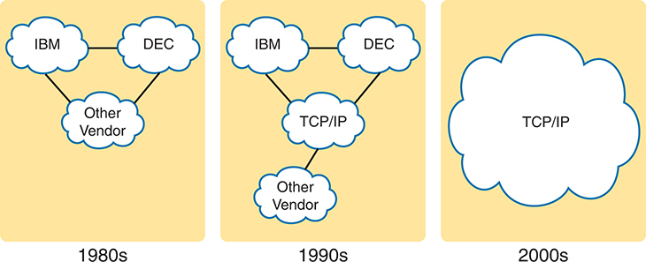

**Figure 1-3** *Historical Progression: Proprietary Models to the Open TCP/IP Model*

In the 1980s section, there are separate clouds labeled "I B M", "D E C", and "Other Vendor", representing proprietary networking models. The 1990s section shows a transition with the proprietary models connected to a larger cloud labeled "T C P/I P", indicating the emergence of open networking standards. By the 2000s, the schematic shows a single large cloud labeled "T C P/I P", signifying the complete shift to open standards in networking.

Although vendor-defined proprietary networking models often worked well, having an open, vendor-neutral networking model would aid competition and reduce complexity. The International Organization for Standardization (ISO) took on the task to create such a model, starting as early as the late 1970s, beginning work on what would become known as the Open Systems Interconnection (OSI) networking model. ISO had a noble goal for the OSI model: to standardize data networking protocols to allow communication among all computers across the entire planet. ISO worked toward this ambitious and noble goal, with participants from most of the technologically developed nations on Earth participating in the process.

A second, less-formal effort to create an open, vendor-neutral, public networking model sprouted forth from a U.S. Department of Defense (DoD) contract. Researchers at various universities volunteered to help further develop the protocols surrounding the original DoD work. These efforts resulted in a competing open networking model called TCP/IP.

During the 1990s, companies began adding OSI, TCP/IP, or both to their enterprise networks. However, by the end of the 1990s, TCP/IP had become the common choice, and OSI fell away. The center part of [Figure 1-3](vol1_ch01.xhtml#ch01fig03) shows the general idea behind enterprise networks in that decade—still with networks built upon multiple networking models but including TCP/IP.

Here in the twenty-first century, TCP/IP dominates. Some proprietary networking models still exist, but they have mostly been discarded in favor of TCP/IP. The OSI model, whose development suffered in part due to a standard-first-code-second approach, never succeeded in the marketplace. And TCP/IP, the networking model originally created almost entirely by a bunch of volunteers, with a code-first-standardize-second approach, has become the most prolific networking model ever, as shown on the right side of [Figure 1-3](vol1_ch01.xhtml#ch01fig03).

In this chapter, you will read about some of the basics of TCP/IP. Although you will learn some interesting facts about TCP/IP, the true goal of this chapter is to help you understand what a networking model or networking architecture really is and how it works.

Also in this chapter, you will learn about some of the jargon used with OSI. Will any of you ever work on a computer that is using the full OSI protocols instead of TCP/IP? Probably not. However, you will often use terms relating to OSI.

#### Overview of the TCP/IP Networking Model

The TCP/IP model both defines and references a large collection of protocols that allow computers to communicate. To define a protocol, TCP/IP uses documents called *Requests For Comments (RFC)*. (You can find these RFCs using any online search engine.) Each layer broadly defines a set of functions that helps create a working communication system, and each RFC gives the specifics about an option to implement one or more of the functions at some layer of the model.

The TCP/IP model also avoids repeating work already done by some other standards body or vendor consortium by simply referring to standards or protocols created by those groups. For example, the Institute of Electrical and Electronics Engineers (IEEE) defines Ethernet LANs; the TCP/IP model does not define Ethernet in RFCs, but refers to IEEE Ethernet as an option.

To help people understand a networking model, each model breaks the functions into a small number of categories called *layers*. Each layer includes protocols and standards that relate to that category of functions, as shown in [Figure 1-4](vol1_ch01.xhtml#ch01fig04).

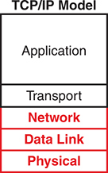

**Figure 1-4** *The TCP/IP Networking Model*

Note

The network layer, shown as the middle layer of the TCP/IP model in [Figure 1-4](vol1_ch01.xhtml#ch01fig04), may also be called the *Internet* layer in reference to its primary protocol, the Internet Protocol (IP).

On a single computer, different components implement different protocols and standards from different layers. Imagine buying a new computer and connecting it to either your home network or network at work using a cable or wireless. You would expect that you can open a web browser and connect to a website without much more effort. To make all that work, the network hardware in your computer—an integrated network interface card (NIC)—implements some physical layer standards to support physical communications. That NIC also supports the related data-link standards. The OS on the computer implements protocols from the network and transport layers. Finally, that web browser implements some application layer protocols (for instance, HTTP or HTTPS.)

More generally, the TCP/IP model in [Figure 1-4](vol1_ch01.xhtml#ch01fig04) shows the more common terms and layers used when people talk about TCP/IP today. The physical layer focuses on how to transmit bits over each link. The data-link layer focuses on the rules that control the use of the physical link, analogous to how we need standards for roads, cars, and traffic signals. The network layer focuses on delivering data over the entire path from the original sending computer to the final destination computer, analogous to how a national postal service arranges for unique postal addresses and a system to deliver mail to all those addresses. The top two layers focus more on the applications that need to send and receive data—for instance, how to identify data, how to ask for the data to be sent, and how to recover the data if lost in transmission.

Many of you will have already heard of several TCP/IP protocols, like the examples listed in [Table 1-2](vol1_ch01.xhtml#ch01tab02). Most of the protocols and standards in this table will be explained in more detail as you work through this book. Following the table, this section takes a closer look at the layers of the TCP/IP model.

**Table 1-2** TCP/IP Architectural Model and Example Protocols

| TCP/IP Architecture Layer | Example Protocols |
| --- | --- |
| Application | HTTPS, POP3, SMTP |
| Transport | TCP, UDP |
| Network | IP, ICMP |
| Data Link & Physical | Ethernet, 802.11 (Wi-Fi) |

#### TCP/IP Application Layer

TCP/IP application layer protocols provide services to the application software running on a computer. The application layer does not define the application itself, but it defines services that applications need. For example, application protocol HTTP defines how web browsers can pull the contents of a web page from a web server. In short, the application layer provides an interface between software running on a computer and the network itself.

Arguably, the most popular TCP/IP application today is the web browser. Many major software vendors either have already changed or are changing their application software to support access from a web browser. And thankfully, using a web browser is easy: You start a web browser on your computer and select a website by typing the name of the website, and the web page appears.

##### HTTP Overview

What really happens to allow that web page to appear on your web browser?

Imagine that Bob opens his browser. His browser has been configured to automatically ask for web server Larry's default web page, or *home page*. The general logic looks like [Figure 1-5](vol1_ch01.xhtml#ch01fig05).

**Figure 1-5** *Basic Application Logic to Get a Web Page*

The schematic with two main elements: a Web Server named Larry depicted by a server rack icon on the left, and a Web Browser named Bob represented by a computer icon on the right. Two arrows illustrate interaction between them: the first arrow labeled "Give me your webpage" points from Bob to Larry, indicating a webpage request, while the second arrow labeled "Here is the file home dot htm" points from Larry to Bob, indicating the delivery of the requested webpage.

So, what really happened? Bob's initial request actually asks Larry to send his home page back to Bob. Larry's web server software has been configured to know that the default web page is contained in a file called home.htm. Bob receives the file from Larry and displays the contents of the file in Bob's web browser window.

##### HTTP Protocol Mechanisms

Taking a closer look, this example shows how applications on each endpoint computer—specifically, the web browser application and web server application—use a TCP/IP application layer protocol. To make the request for a web page and return the contents of the web page, the applications use the Hypertext Transfer Protocol (HTTP).

HTTP did not exist until Tim Berners-Lee created the first web browser and web server in the early 1990s. Berners-Lee gave HTTP functionality to ask for the contents of web pages, specifically by giving the web browser the ability to request files from the server and giving the server a way to return the content of those files. The overall logic matches what was shown in [Figure 1-5](vol1_ch01.xhtml#ch01fig05); [Figure 1-6](vol1_ch01.xhtml#ch01fig06) shows the same idea, but with details specific to HTTP.

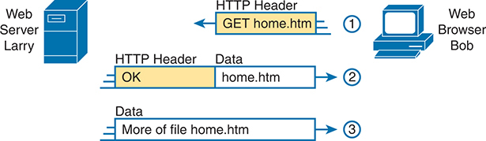

**Figure 1-6** *HTTP GET Request, HTTP Reply, and One Data-Only Message*

In the schematic, the H T T P GET request and response process unfolds in three steps: Step 1 involves the web browser, Bob, sending an H T T P GET request for the home dot htm page to the web server, Larry. In Step 2, Larry responds with an H T T P header marked 'OK', signaling a successful request and initiating the transfer of home dot htm data to Bob. Step 3 sees Larry sending additional data from the home dot htm file to Bob to finalize the webpage transfer.

Note

The full version of most web addresses—also called Uniform Resource Locators (URL) or Universal Resource Identifiers (URI)—begins with the letters *http*, which means that HTTP is used to transfer the web pages.

To get the web page from Larry, at Step 1, Bob sends a message with an HTTP header. Generally, protocols use headers as a place to put information used by that protocol. This HTTP header includes the request to "get" a file. The request typically contains the name of the file (home.htm, in this case), or if no filename is mentioned, the web server assumes that Bob wants the default web page.

Step 2 in [Figure 1-6](vol1_ch01.xhtml#ch01fig06) shows the response from web server Larry. The message begins with an HTTP header, with a return code (200), which means something as simple as "OK" returned in the header. HTTP also defines other return codes so that the server can tell the browser whether the request worked. (Here is another example: If you ever looked for a web page that was not found, and then received an HTTP 404 "not found" error, you received an HTTP return code of 404.) The second message also includes the first part of the requested file.

Step 3 in [Figure 1-6](vol1_ch01.xhtml#ch01fig06) shows another message from web server Larry to web browser Bob, but this time without an HTTP header. HTTP transfers the data by sending multiple messages, each with a part of the file. Rather than wasting space by sending repeated HTTP headers that list the same information, these additional messages simply omit the header.

[Chapter 5](vol1_ch05.xhtml#ch05) in *CCNA 200-301 Official Cert Guide, Volume 2*, revisits both HTTP going into more depth about HTTP, secure HTTP, and the various versions of HTTP.

#### TCP/IP Transport Layer

Although many TCP/IP application layer protocols exist, the TCP/IP transport layer includes a smaller number of protocols. The two most commonly used transport layer protocols are the Transmission Control Protocol (TCP) and the User Datagram Protocol (UDP).

Transport layer protocols provide services to the application layer protocols that reside one layer higher in the TCP/IP model. How does a transport layer protocol provide a service to a higher-layer protocol? This section introduces that general concept by focusing on a single service provided by TCP: error recovery. The *CCNA 200-301 Official Cert Guide*, *Volume 2*, Second Edition includes a chapter, "[Introduction to TCP/IP Transport and Applications](vol1_ch01.xhtml#ch01)," which examines the transport layer in more detail.

##### TCP Error Recovery Basics

To appreciate what the transport layer protocols do, you must think about the layer above the transport layer, the application layer. Why? Well, each layer provides a service to the layer above it, like the error-recovery service provided to application layer protocols by TCP.

For example, in [Figure 1-5](vol1_ch01.xhtml#ch01fig05), Bob and Larry used HTTP to transfer the home page from web server Larry to Bob's web browser. But what would have happened if Bob's HTTP GET request had been lost in transit through the TCP/IP network? Or, what would have happened if Larry's response, which included the contents of the home page, had been lost? Well, as you might expect, in either case, the page would not have shown up in Bob's browser.

TCP/IP needs a mechanism to guarantee delivery of data across a network. Because many application layer protocols probably want a way to guarantee delivery of data across a network, the creators of TCP included an error-recovery feature. To recover from errors, TCP uses the concept of acknowledgments. [Figure 1-7](vol1_ch01.xhtml#ch01fig07) outlines the basic idea behind how TCP notices lost data and asks the sender to try again.

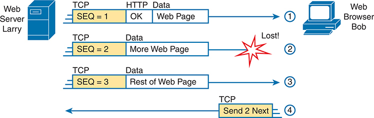

**Figure 1-7** *TCP Error-Recovery Services as Provided to HTTP*

In the schematic, the H T T P GET request and response process unfolds in three steps: Step 1 involves the web browser, Bob, sending an H T T P GET request for the home dot htm page to the web server, Larry. In Step 2, Larry responds with an H T T P header marked 'OK', signaling a successful request and initiating the transfer of home dot htm data to Bob. Step 3 sees Larry sending additional data from the home dot htm file to Bob to finalize the webpage transfer, as depicted by T C P above SEQ = 3, Data above 'Rest of Web page'.

[Figure 1-7](vol1_ch01.xhtml#ch01fig07) shows web server Larry sending a web page to web browser Bob, using three separate messages. Note that this figure shows the same HTTP headers as [Figure 1-6](vol1_ch01.xhtml#ch01fig06), but it also shows a TCP header. The TCP header shows a sequence number (SEQ) with each message. In this example, the network has a problem, and the network fails to deliver the TCP message (called a [segment](vol1_gloss.xhtml#gloss_361)) with sequence number 2. When Bob receives messages with sequence numbers 1 and 3, but does not receive a message with sequence number 2, Bob realizes that message 2 was lost. That realization by Bob's TCP logic causes Bob to send a TCP segment back to Larry, asking Larry to send message 2 again.

##### Same-Layer and Adjacent-Layer Interactions

[Figure 1-7](vol1_ch01.xhtml#ch01fig07) also demonstrates a function called [adjacent-layer interaction](vol1_gloss.xhtml#gloss_017), which refers to the concepts of how adjacent layers in a networking model, on the same computer, work together. In this example, the higher-layer protocol (HTTP) wants error recovery, so it uses the next lower-layer protocol (TCP) to perform the service of error recovery; the lower layer provides a service to the layer above it.

[Figure 1-7](vol1_ch01.xhtml#ch01fig07) also shows an example of a similar function called [same-layer interaction](vol1_gloss.xhtml#gloss_358)*.* When a particular layer on one computer wants to communicate with the same layer on another computer, the two computers use headers to hold the information that they want to communicate. For example, in [Figure 1-7](vol1_ch01.xhtml#ch01fig07), Larry set the sequence numbers to 1, 2, and 3 so that Bob could notice when some of the data did not arrive. Larry's TCP process created that TCP header with the sequence number; Bob's TCP process received and reacted to the TCP segments.

[Table 1-3](vol1_ch01.xhtml#ch01tab03) summarizes the key points about how adjacent layers work together on a single computer and how one layer on one computer works with the same networking layer on another computer.

**Table 1-3** Summary: Same-Layer and Adjacent-Layer Interactions

| Concept | Description |
| --- | --- |
| Same-layer interaction on different computers | The two computers use a protocol to communicate with the same layer on another computer. The protocol defines a header that communicates what each computer wants to do. |
| Adjacent-layer interaction on the same computer | On a single computer, one lower layer provides a service to the layer just above. The software or hardware that implements the higher layer requests that the next lower layer perform the needed function. |

#### TCP/IP Network Layer

The application layer includes many protocols. The transport layer includes fewer protocols, most notably, TCP and UDP. The TCP/IP network layer includes a small number of protocols, but only one major protocol: the Internet Protocol (IP). In fact, the name TCP/IP is simply the names of the two most common protocols (TCP and IP) separated by a /.

IP provides several features, most importantly, addressing and routing. This section begins by comparing IP's addressing and routing with another commonly known system that uses addressing and routing: the postal service. Following that, this section introduces IP addressing and routing. (More details follow in [Chapter 3](vol1_ch03.xhtml#ch03), "[Fundamentals of WANs and IP Routing](vol1_ch03.xhtml#ch03).")

##### Internet Protocol and the Postal Service

Imagine that you just wrote two letters: one to a friend on the other side of the country and one to a friend on the other side of town. You addressed the envelopes and put on the stamps, so both are ready to give to the postal service. Is there much difference in how you treat each letter? Not really. Typically, you would just put them in the same mailbox and expect the postal service to deliver both letters.

The postal service, however, must think about each letter separately, and then make a decision of where to send each letter so that it is delivered. For the letter sent across town, the people in the local post office probably just need to put the letter on another truck.

For the letter that needs to go across the country, the postal service sends the letter to another post office, then another, and so on, until the letter gets delivered across the country. At each post office, the postal service must process the letter and choose where to send it next.

To make it all work, the postal service has regular routes for small trucks, large trucks, planes, boats, and so on, to move letters between postal service sites. The service must be able to receive and forward the letters, and it must make good decisions about where to send each letter next, as shown in [Figure 1-8](vol1_ch01.xhtml#ch01fig08).

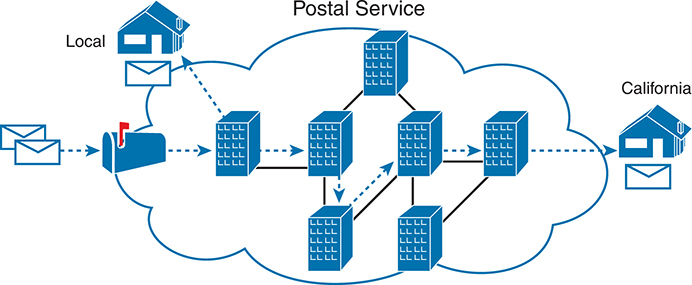

**Figure 1-8** *Postal Service Forwarding (Routing) Letters*

Still thinking about the postal service, consider the difference between the person sending the letter and the work that the postal service does. The person sending the letters expects that the postal service will deliver the letter most of the time. However, the person sending the letter does not need to know the details of exactly what path the letters take. In contrast, the postal service does not create the letter, but it accepts the letter from the customer. Then, the postal service must know the details about addresses and postal codes that group addresses into larger groups, and it must have the ability to deliver the letters.

The TCP/IP application and transport layers act like the person sending letters through the postal service. These upper layers work the same way regardless of whether the endpoint host computers are on the same LAN or are separated by the entire Internet. To send a message, these upper layers ask the layer below them, the network layer, to deliver the message.

The lower layers of the TCP/IP model act more like the postal service to deliver those messages to the correct destinations. To do so, these lower layers must understand the underlying physical network because they must choose how to best deliver the data from one host to another.

So, what does this all matter to networking? Well, the network layer of the TCP/IP networking model, primarily defined by the Internet Protocol (IP), works much like the postal service. IP defines that each host computer should have a different IP address, just as the postal service defines addressing that allows unique addresses for each house, apartment, and business. Similarly, IP defines the process of routing so that devices called routers can work like the post office, forwarding [packets](vol1_gloss.xhtml#gloss_296) of data so that they are delivered to the correct destinations. Just as the postal service created the necessary infrastructure to deliver letters—post offices, sorting machines, trucks, planes, and personnel—the network layer defines the details of how a network infrastructure should be created so that the network can deliver data to all computers in the network.

##### Internet Protocol Addressing Basics

IP defines addresses for several important reasons. First, each device that uses TCP/IP—each TCP/IP *host*—needs a unique address so that it can be identified in the network. IP also defines how to group addresses together, just like the postal system groups addresses based on postal codes (like ZIP codes in the United States).

To understand the basics, examine [Figure 1-9](vol1_ch01.xhtml#ch01fig09), which shows the familiar web server Larry and web browser Bob; but now, instead of ignoring the network between these two computers, part of the network infrastructure is included.

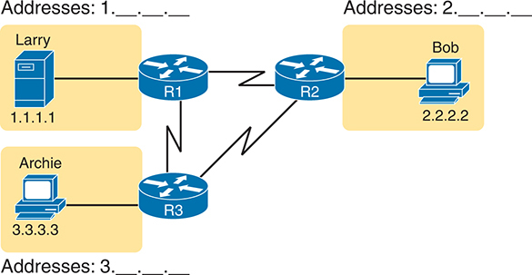

**Figure 1-9** *Simple TCP/IP Network: Three Routers with IP Addresses Grouped*

In the schematic, Larry's computer, with an I P address of 1 dot 1 dot 1 dot 1, is connected to Router R 1. Bob's computer, assigned the I P address 2 dot 2 dot 2 dot 2, is linked to Router R 2. Archie's computer is associated with the I P address 3 dot 3 dot 3 dot 3 and connects to Router R 3. The routers are interconnected, with R1 directly connected to R 2, and both R 1 and R 2 connected separately to R 3. Each set of addresses: Addresses 1, Addresses 2, and Addresses 3 is labeled next to their respective users.

First, note that [Figure 1-9](vol1_ch01.xhtml#ch01fig09) shows some sample IP addresses. Each IP address has four numbers, separated by periods. In this case, Larry uses IP address 1.1.1.1, and Bob uses 2.2.2.2. This style of number is called a dotted-decimal notation (DDN).

[Figure 1-9](vol1_ch01.xhtml#ch01fig09) also shows three groups of addresses. In this example, all IP addresses that begin with 1 must be on the upper left, as shown in shorthand in the figure as 1. . . . All addresses that begin with 2 must be on the right, as shown in shorthand as 2. . . . Finally, all IP addresses that begin with 3 must be at the bottom of the figure.

In addition, [Figure 1-9](vol1_ch01.xhtml#ch01fig09) introduces icons that represent IP routers. Routers are networking devices that connect the parts of the TCP/IP network together for the purpose of routing (forwarding) IP packets to the correct destination. Routers do the equivalent of the work done by each post office site: They receive IP packets on various physical interfaces, make decisions based on the IP address included with the packet, and then physically forward the packet out some other network interface.

##### IP Routing Basics

The TCP/IP network layer, using the IP protocol, provides a service of forwarding IP packets from one device to another. Any device with an IP address can connect to the TCP/IP network and send packets. This section shows a basic IP routing example for perspective.

Note

The term *IP host* refers to any device, regardless of size or power, that has an IP address and connects to any TCP/IP network.

[Figure 1-10](vol1_ch01.xhtml#ch01fig10) repeats the familiar case in which web server Larry wants to send part of a web page to Bob, but now with details related to IP. On the lower left, note that server Larry has the familiar application data, HTTP header, and TCP header ready to send. In addition, the message now contains an IP header. The IP header includes a source IP address of Larry's IP address (1.1.1.1) and a destination IP address of Bob's IP address (2.2.2.2).

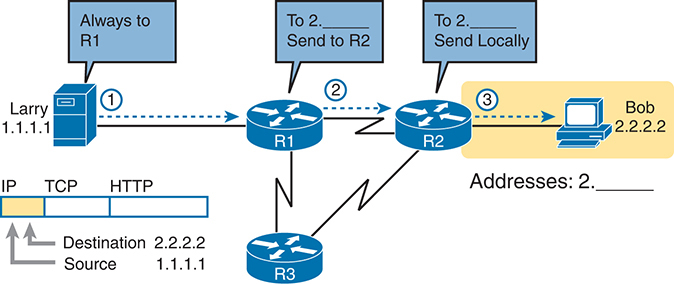

**Figure 1-10** *Basic Routing Example*

In the schematic, two computer icons represent Larry with an I P address of 1 dot 1 dot 1 dot 1 and Bob with an I P address of 2 dot 2 dot 2 dot 2. Larry is connected to router R 1 through I P, T C P, and H T T P protocols. Instructions such as "Always to R 1", "To Send to R2", and "To Send Locally" are depicted to illustrate the routing process. Router R 1 is connected to routers R 2 and R 3. For messages destined for Bob with an I P address 2 dot 2 dot 2 dot 2, they are routed through R 3.

Step 1, on the left of [Figure 1-10](vol1_ch01.xhtml#ch01fig10), begins with Larry being ready to send an IP packet. Larry's IP process chooses to send the packet to some router—a nearby router on the same LAN—with the expectation that the router will know how to forward the packet. (This logic is much like you or me sending all our letters by putting them in a nearby mailbox.) Larry doesn't need to know anything more about the topology or the other routers.

At Step 2, Router R1 receives the IP packet, and R1's IP process makes a decision. R1 looks at the destination address (2.2.2.2), compares that address to its known IP routes, and chooses to forward the packet to Router R2. This process of forwarding the IP packet is called *IP routing* (or simply *routing*).

At Step 3, Router R2 repeats the same kind of logic used by Router R1. R2's IP process will compare the packet's destination IP address (2.2.2.2) to R2's known IP routes and make a choice to forward the packet to the right, on to Bob.

You will learn IP to more depth than any other protocol while preparing for CCNA. More than half the chapters in this book discuss some feature that relates to addressing, IP routing, and how routers perform routing.

#### TCP/IP Data-Link and Physical Layers

The TCP/IP model's data-link and physical layers define the protocols and hardware required to deliver data across some physical network. The two work together quite closely; in fact, some standards define both the data-link and physical layer functions. The physical layer defines the cabling and energy (for example, electrical signals) that flow over the cables. Some rules and conventions exist when sending data over the cable, however; those rules exist in the data-link layer of the TCP/IP model.

Focusing on the data-link layer for a moment, just like every layer in any networking model, the TCP/IP data-link layer provides services to the layer above it in the model (the network layer). When a host's or router's IP process chooses to send an IP packet to another router or host, that host or router then uses link-layer details to send that packet to the next host/router.

Because each layer provides a service to the layer above it, take a moment to think about the IP logic related to [Figure 1-10](vol1_ch01.xhtml#ch01fig10). In that example, host Larry's IP logic chooses to send the IP packet to a nearby router (R1). However, while [Figure 1-10](vol1_ch01.xhtml#ch01fig10) shows a simple line between Larry and router R1, that drawing means that some Ethernet LAN sits between the two. [Figure 1-11](vol1_ch01.xhtml#ch01fig11) shows four steps of what occurs at the link layer to allow Larry to send the IP packet to R1.

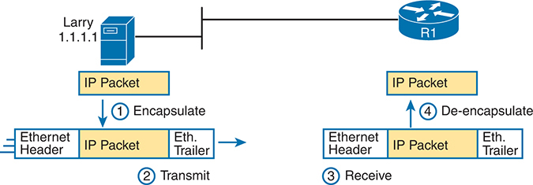

**Figure 1-11** *Larry Using Ethernet to Forward an IP Packet to Router R1*

The schematic features a computer icon labeled "Larry" with the I P address "1 dot 1 dot 1 dot 1" on the left side. Larry's "IP Packet" undergoes encapsulation with an "Ethernet Header" and 'Ethernet Trailer', forming an "Ethernet I P Packet", depicted as the first step. The second step illustrates transmission to router 'R1', represented by a circular icon on the right. Step three shows R1's reception of the packet. The fourth step displays R 1's de-encapsulation process, removing the "Ethernet Header" and "Ethernet Trailer" to reveal the original 'I P Packet'.

Note

[Figure 1-11](vol1_ch01.xhtml#ch01fig11) depicts the Ethernet as a series of lines. Networking diagrams often use this convention when drawing Ethernet LANs, in cases where the actual LAN cabling and LAN devices are not important to some discussion, as is the case here. The LAN would have cables and devices, like LAN switches, which are not shown in this figure.

[Figure 1-11](vol1_ch01.xhtml#ch01fig11) shows four steps. The first two occur on Larry, and the last two occur on Router R1, as follows:

Step 1. Larry encapsulates the IP packet between an Ethernet header and Ethernet trailer, creating an Ethernet [frame](vol1_gloss.xhtml#gloss_152).

Step 2. Larry physically transmits the bits of this Ethernet frame, using electricity flowing over the Ethernet cabling.

Step 3. Router R1 physically receives the electrical signal over a cable and re-creates the same bits by interpreting the meaning of the electrical signals.

Step 4. Router R1 [de-encapsulates](vol1_gloss.xhtml#gloss_089) the IP packet from the Ethernet frame by removing and discarding the Ethernet header and trailer.

By the end of this process, Larry and R1 have worked together to deliver the packet from Larry to Router R1.

Note

Protocols define both headers and trailers for the same general reason, but headers exist at the beginning of the message and trailers exist at the end.

The data-link and physical layers include a large number of protocols and standards. For example, the link layer includes all the variations of Ethernet protocols and wireless LAN protocols discussed throughout this book.

In short, the TCP/IP physical and data-link layers include two distinct functions, respectively: functions related to the physical transmission of the data, plus the protocols and rules that control the use of the physical media.

### Data Encapsulation Terminology

As you can see from the explanations of how HTTP, TCP, IP, and Ethernet do their jobs, when sending data, each layer adds its own header (and for data-link protocols, also a trailer) to the data supplied by the higher layer. The term [encapsulation](vol1_gloss.xhtml#gloss_121) refers to the process of putting headers (and sometimes trailers) around some data.

Many of the examples in this chapter show the encapsulation process. For example, web server Larry encapsulated the contents of the home page inside an HTTP header in [Figure 1-6](vol1_ch01.xhtml#ch01fig06). The TCP layer encapsulated the HTTP headers and data inside a TCP header in [Figure 1-7](vol1_ch01.xhtml#ch01fig07). IP encapsulated the TCP headers and the data inside an IP header in [Figure 1-10](vol1_ch01.xhtml#ch01fig10). Finally, the Ethernet link layer encapsulated the IP packets inside both a header and a trailer in [Figure 1-11](vol1_ch01.xhtml#ch01fig11).

The process by which a TCP/IP host sends data can be viewed as a five-step process. The first four steps relate to the encapsulation performed by the four TCP/IP layers, and the last step is the actual physical transmission of the data by the host. In fact, if you use the five-layer TCP/IP model, one step corresponds to the role of each layer. The steps are summarized in the following list:

Step 1. **Create and encapsulate the application data with any required application layer headers.** For example, the HTTP OK message can be returned in an HTTP header, followed by part of the contents of a web page.

Step 2. **Encapsulate the data supplied by the application layer inside a transport layer header.** For end-user applications, a TCP or UDP header is typically used.

Step 3. **Encapsulate the data supplied by the transport layer inside a network layer (IP) header.** IP defines the IP addresses that uniquely identify each computer.

Step 4. **Encapsulate the data supplied by the network layer inside a data-link layer header and trailer.** This layer uses both a header and a trailer.

Step 5. **Transmit the bits.** The physical layer encodes a signal onto the medium to transmit the frame.

The numbers in [Figure 1-12](vol1_ch01.xhtml#ch01fig12) correspond to the five steps in this list, graphically showing the same concepts. Note that because the application layer often does not need to add a header, the figure does not show a specific application layer header, but the application layer will also at times add a header as well.

#### Names of TCP/IP Messages

One reason this chapter takes the time to show the encapsulation steps in detail has to do with terminology. When talking and writing about networking, people use *segment*, *packet*, and *frame* to refer to the messages shown in [Figure 1-13](vol1_ch01.xhtml#ch01fig13) and the related list. Each term has a specific meaning, referring to the headers (and possibly trailers) defined by a particular layer and the data encapsulated following that header. Each term, however, refers to a different layer: segment for the transport layer, packet for the network layer, and frame for the link layer. [Figure 1-13](vol1_ch01.xhtml#ch01fig13) shows each layer along with the associated term.

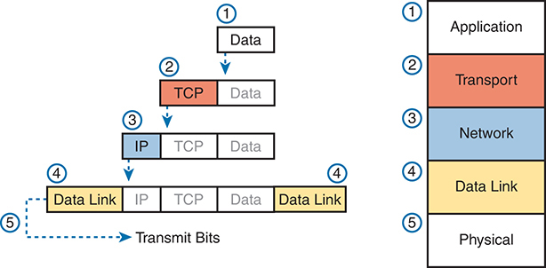

**Figure 1-12** *Five Steps of Data Encapsulation: TCP/IP*

The schematic illustrating the five steps of data encapsulation in T C P/I P. It shows the process of encapsulation on the left and the corresponding layers on the right. The encapsulation process is represented by rectangles labeled "Data," "TCP," "IP," and "Data Link," with downward arrows indicating how they are encapsulated step by step. The layers on the right are labeled as Application, Transport, Network, Data Link, and Physical.

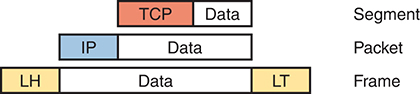

**Figure 1-13** *Perspectives on Encapsulation and "Data"[\*](vol1_ch01.xhtml#ffn1)*

The schematic showcasing the concept of data encapsulation in networking. Three blocks labeled "Data" represent different layers: the top block labeled "T C P" represents a Segment, the middle block labeled "IP" represents a Packet, and the bottom block divided into LH and LT halves represents a Frame. Each block is labeled with its corresponding term: "Segment" for T C P, "Packet" for IP, and "Frame" for L H/L T.

[\*](vol1_ch01.xhtml#ffn1a) The letters *LH* and *LT* stand for link header and link trailer, respectively, and refer to the data-link layer header and trailer.

[Figure 1-13](vol1_ch01.xhtml#ch01fig13) also shows the encapsulated data as simply "data." When you are focusing on the work done by a particular layer, the encapsulated data typically is unimportant. For example, an IP packet can indeed have a TCP header after the IP header, an HTTP header after the TCP header, and data for a web page after the HTTP header. However, when discussing IP, you probably just care about the IP header, so everything after the IP header is just called data. So, when you are drawing IP packets, everything after the IP header is typically shown simply as data.

Note

You will also see the generic term *protocol data unit*, or *PDU*, used to refer to any message defined by a protocol. A TCP segment, IP packet, and Ethernet frame are all PDUs, for instance.

#### OSI Networking Model and Terminology

At one point in the history of the OSI model, many people thought that OSI would win the battle of the networking models discussed earlier. If that had occurred, instead of running TCP/IP on every computer in the world, those computers would be running with OSI.

However, OSI did not win. In fact, OSI no longer exists as a networking model that could be used instead of TCP/IP, although some of the original protocols referenced by the OSI model still exist.

So, why is OSI even in this book? Terminology. During those years in which many people thought the OSI model would become commonplace in the world of networking (mostly in the late 1980s and early 1990s), many vendors and protocol documents started using terminology from the OSI model. That terminology remains today. So, while you will never need to work with a computer that uses OSI, to understand modern networking terminology, you need to understand something about OSI.

##### Comparing OSI and TCP/IP Layer Names and Numbers

The OSI model has many similarities to the TCP/IP model from a basic conceptual perspective. It has layers, and each layer defines a set of typical networking functions. As with TCP/IP, the OSI layers each refer to multiple protocols and standards that implement the functions specified by each layer. Just as for TCP/IP, the OSI committees did not create new protocols or standards in some cases, instead referencing other protocols that were already defined. For example, the IEEE defines Ethernet standards, so the OSI committees did not waste time specifying a new type of Ethernet; it simply referred to the IEEE Ethernet standards.

Today, the OSI model can be used as a standard of comparison to other networking models. [Figure 1-14](vol1_ch01.xhtml#ch01fig14) compares the seven-layer OSI model with the commonly used five-layer TCP/IP model and the old original four-layer TCP/IP model.

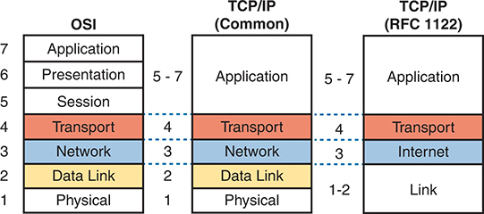

**Figure 1-14** *OSI Model Compared to the Two TCP/IP Models*

On the left, the O S I Model is detailed with seven layers: Application, Presentation, Session, Transport, Network, Data Link, and Physical, numbered from 7 to 1, starting from the top. In the middle, the common T C P/I P model condenses these into four layers: Application (combining Application, Presentation, Session), Transport, Network, Data Link, and Physical. On the right side is another version of T C P/I P model (R F C 1122) that has five layers: Application (combining Application, Presentation and Session), Transport, Internet (equivalent to Network in O S I), Link (combining Data Link & Physical of OSI).

Note

The CCNA exam topics no longer mention the OSI or TCP/IP models; however, you should know both and the related terminology for everyday network engineering discussions. While today you will see the five-layer model used throughout the industry, and in this book, the figure includes the original RFC 1122 four-layer model for perspective.

Note that the TCP/IP model in use today, in the middle of the figure, uses the exact same layer names as OSI at the lower layers. The functions generally match as well, so for the purpose of discussing networking, and reading networking documentation, think of the bottom four layers as equivalent, in name, in number, and in meaning.

Even though the world uses TCP/IP today rather than OSI, we tend to use the numbering from the OSI layer. For instance, when referring to an application layer protocol in a TCP/IP network, the world still refers to the protocol as a "Layer 7 protocol." Also, while TCP/IP includes more functions at its application layer, OSI breaks those into session, presentation, and application layers. Most of the time, no one cares much about the distinction, so you will see references like "Layer 5–7 protocol," again using OSI numbering.

For the purposes of this book, know the mapping between the five-layer TCP/IP model and the seven-layer OSI model shown in [Figure 1-14](vol1_ch01.xhtml#ch01fig14), and know that layer number references to Layer 7 really do match the application layer of TCP/IP as well.

### Chapter Review

The "[Your Study Plan](vol1_pref10.xhtml#pref10)" element, just before [Chapter 1](vol1_ch01.xhtml#ch01), discusses how you should study and practice the content and skills for each chapter before moving on to the next chapter. That element introduces the tools used here at the end of each chapter. If you haven't already done so, take a few minutes to read that section. Then come back here and do the useful work of reviewing the chapter to help lock into memory what you just read.

Review this chapter's material using either the tools in the book or the interactive tools for the same material found on the book's companion website. [Table 1-4](vol1_ch01.xhtml#ch01tab04) outlines the key review elements and where you can find them. To better track your study progress, record when you completed these activities in the second column.

**Table 1-4** Chapter Review Tracking

| Review Element | Review Date(s) | Resource Used |
| --- | --- | --- |
| Review key topics |  | Book, website |
| Review key terms |  | Book, website |
| Answer DIKTA questions |  | Book, PTP Online |

### Review All the Key Topics

**Table 1-5** Key Topics for [Chapter 1](vol1_ch01.xhtml#ch01)

| Key Topic Elements | Description | Page Number |
| --- | --- | --- |
| [Figure 1-10](vol1_ch01.xhtml#ch01fig10) | Shows the general concept of IP routing | [29](vol1_ch01.xhtml#page_29) |
| [Figure 1-11](vol1_ch01.xhtml#ch01fig11) | Depicts the data-link services provided to IP for the purpose of delivering IP packets from host to host | [30](vol1_ch01.xhtml#page_30) |
| [Figure 1-12](vol1_ch01.xhtml#ch01fig12) | Identifies the five steps to encapsulate data on the sending host | [32](vol1_ch01.xhtml#page_32) |
| [Figure 1-13](vol1_ch01.xhtml#ch01fig13) | Shows the meaning of the terms *segment*, *packet*, and *frame* | [32](vol1_ch01.xhtml#page_32) |
| [Figure 1-14](vol1_ch01.xhtml#ch01fig14) | Compares the OSI and TCP/IP networking models | [33](vol1_ch01.xhtml#page_33) |

### Key Terms You Should Know

[adjacent-layer interaction](vol1_ch01.xhtml#key_001)

[de-encapsulation](vol1_ch01.xhtml#key_002)

[encapsulation](vol1_ch01.xhtml#key_003)

[frame](vol1_ch01.xhtml#key_004)

[networking model](vol1_ch01.xhtml#key_005)

[packet](vol1_ch01.xhtml#key_006)

[same-layer interaction](vol1_ch01.xhtml#key_007)

[segment](vol1_ch01.xhtml#key_008)