# Chapter 4


## Using the Command-Line Interface

This chapter covers the following exam topics:

2.0 Network Access

2.8 Describe network device management access (Telnet, SSH, HTTP, HTTPS, console, TACACS+/RADIUS, and cloud managed)

The CCNA exam focuses on skills like understanding how LANs work, configuring different switch features, verifying that those features work correctly, and finding the root cause of the problem when a feature is not working correctly. Before doing the more important work, you must first learn how to access and use the user interface of the switch, called the [command-line interface (CLI)](vol1_gloss.xhtml#gloss_074).

This chapter begins that process by showing the basics of how to access the switch's CLI. These skills include how to access the CLI and how to issue verification commands to check on the status of the LAN. This chapter also includes the processes of how to configure the switch and how to save that configuration.

Note that this chapter focuses on processes that provide a foundation for the exam topics which include the verbs *identify*, *configure*, or *verify*. Most of the rest of the chapters in [Parts II](vol1_part02.xhtml#part02) and [III](vol1_part03.xhtml#part03) of this book then go on to include details of the particular commands you can use to verify and configure different switch features.

### "Do I Know This Already?" Quiz

Take the quiz (either here or use the PTP software) if you want to use the score to help you decide how much time to spend on this chapter. The letter answers are listed at the bottom of the page following the quiz. [Appendix C](vol1_appc.xhtml#appc), found both at the end of the book as well as on the companion website, includes both the answers and explanations. You can also find both answers and explanations in the PTP testing software.

**Table 4-1** "Do I Know This Already?" Foundation Topics Section-to-Question Mapping

| Foundation Topics Section | Questions |
| --- | --- |
| Accessing the Cisco Catalyst Switch CLI | 1–3 |
| Configuring Cisco IOS Software | 4–6 |

**[1](vol1_ch04.xhtml#ques4_1a).** In what modes can you type the command **show mac address-table** and expect to get a response with MAC table entries? (Choose two answers.)

1. User mode
2. Enable mode
3. Global configuration mode
4. Interface configuration mode

**[2](vol1_ch04.xhtml#ques4_2a).** In which of the following modes of the CLI could you type the command **reload** and expect the switch to reboot?

1. User mode
2. Enable mode
3. Global configuration mode
4. Interface configuration mode

**[3](vol1_ch04.xhtml#ques4_3a).** Which of the following is a difference between Telnet and SSH as supported by a Cisco switch?

1. SSH encrypts the passwords used at login, but not other traffic; Telnet encrypts nothing.
2. SSH encrypts all data exchange, including login passwords; Telnet encrypts nothing.
3. Telnet is used from Microsoft operating systems, and SSH is used from UNIX and Linux operating systems.
4. Telnet encrypts only password exchanges; SSH encrypts all data exchanges.

**[4](vol1_ch04.xhtml#ques4_4a).** What type of switch memory is used to store the configuration used by the switch when it is up and working?

1. RAM
2. ROM
3. Flash
4. NVRAM
5. Bubble

**[5](vol1_ch04.xhtml#ques4_5a).** What command copies the configuration from RAM into NVRAM?

1. **copy running-config tftp**
2. **copy tftp running-config**
3. **copy running-config start-up-config**
4. **copy start-up-config running-config**
5. **copy startup-config running-config**
6. **copy running-config startup-config**

**[6](vol1_ch04.xhtml#ques4_6a).** A switch user is currently in console line configuration mode. Which of the following would place the user in enable mode? (Choose two answers.)

1. Using the **exit** command once
2. Using the **end** command once
3. Pressing the Ctrl+Z key sequence once
4. Using the **quit** command

Answers to the "Do I Know This Already?" quiz:

**[1](vol1_appc.xhtml#ques4_1)** A, B

**[2](vol1_appc.xhtml#ques4_2)** B

**[3](vol1_appc.xhtml#ques4_3)** B

**[4](vol1_appc.xhtml#ques4_4)** A

**[5](vol1_appc.xhtml#ques4_5)** F

**[6](vol1_appc.xhtml#ques4_6)** B, C

### Foundation Topics

### Accessing the Cisco Catalyst Switch CLI

Cisco uses the concept of a command-line interface (CLI) with its router and LAN switch products. The CLI is a text-based interface in which the user, typically a network engineer, enters a text command and presses Enter. Pressing Enter sends the command to the switch, which tells the device to do something. The switch does what the command says, and in some cases, the switch replies with some messages stating the results of the command.

Cisco Catalyst switches also support other methods to both monitor and configure a switch. For example, a switch can provide a web interface so that an engineer can open a web browser to connect to a web server running in the switch. Switches also can be controlled and operated using network management software.

This book discusses only Cisco Catalyst enterprise-class switches, and in particular, how to use the Cisco CLI to monitor and control these switches. This first major section of the chapter first examines these Catalyst switches in more detail and then explains how a network engineer can get access to the CLI to issue commands.

#### Cisco Catalyst Switches

When I was updating this chapter for expected publication in the year 2023, Cisco LAN switches fell into three product families:

* **Cisco Catalyst switches**, which serve as typical enterprise switches for use throughout an enterprise.
* **Cisco Nexus switches**, which Cisco designs for use in data centers. In comparison to Catalyst switches, Nexus switches support faster ports and more high-speed ports on a single switch, plus other features optimized for data centers.
* **Cisco Meraki switches**, built for enterprises, meet a need for LAN switches (and other network devices) that use a simple, cloud-based management portal that provides easy onboarding of new devices.

Throughout its history, when the CCNA exam mentions *switches*, it refers to Cisco Catalyst switches, and not to Nexus or Meraki switches.

Within the Cisco Catalyst brand of LAN switches, Cisco produces a wide variety of switch series or families. Each switch series includes several specific models of switches that have similar features, similar price-versus-performance tradeoffs, and similar internal components.

For example, when I was writing the latest version of this chapter, Cisco offered the Cisco Catalyst 9000 switch family as its primary Enterprise switch family. That family includes series that go by numbers like 9200, 9300, 9400, and so on, with specific models within each series. For instance, Cisco positions the 9200 and 9300 series of switches as full-featured access layer switches for enterprises.

[Figure 4-1](vol1_ch04.xhtml#ch04fig01) shows two models of 9200 switches. The lower switch in the figure has 48 fixed RJ-45 unshielded twisted-pair (UTP) 10/100/1000 ports, meaning that these ports can autonegotiate the use of 10BASE-T (10 Mbps), 100BASE-T (100 Mbps), or 1000BASE-T (1 Gbps) Ethernet. The upper switch has 24 such ports.

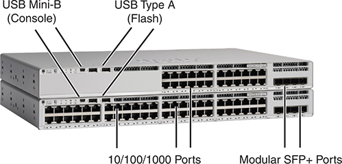


**Figure 4-1** *Cisco Catalyst 9200L Switch Models, Front View*

The model describes the physical appearance and key features. It includes details about the U S B Mini-B port, designated for console connections, and the U S B Type-A port, used for flash storage, both located on the front panel. The image highlights the presence of 10/100/1000 Ethernet ports and modular Small Form-factor Pluggable Plus (S F P plus) ports.

Cisco refers to a switch's physical connectors as either *interfaces* or *ports*, with an interface type and interface number. Switches use interface types such as Ethernet, FastEthernet, GigabitEthernet, TenGigabit, and so on for faster speeds. For Ethernet interfaces that support running at multiple speeds, the switch uses the interface type of the fastest supported speed. For example, the switch refers to a 10/100/1000 interface (that is, an interface that runs at 10 Mbps, 100 Mbps, or 1000 Mbps) as a GigabitEthernet port, no matter the current speed used on the interface.

LAN switches also use a numeric interface identifier (interface ID) to identify the specific port. Interface IDs can use one, two, or three digits, with the digits separated by a slash, as chosen by Cisco when they designed the switch. For instance, Cisco Catalyst 9000 switches typically use three-digit identifiers like GigabitEthernet 1/0/1 and GigabitEthernet 1/0/2. [Table 4-2](vol1_ch04.xhtml#ch04tab02) lists a few examples of interface identifiers and abbreviations for those identifiers based on the speeds supported by an interface.

**Table 4-2** LAN Switch Interface ID Examples with Abbreviations

| Speeds Supported | Common Name | Example Switch Interface ID | Valid Abbreviations |
| --- | --- | --- | --- |
| 10 Mbps | Ethernet | Ethernet0/0 | E0/0, Et0/0, Eth0/0 |
| 10/100 Mbps | 10/100 | FastEthernet 0/1 | F0/1, Fa0/1 |
| 10/100/1000 Mbps | 10/100/1000 | GigabitEthernet 1/0/1 | G1/0/1, Gi1/0/1 |
| 1G/2.5G/5G/10G | Multigig | TenGigabit 1/0/2 | T1/0/2, Te1/0/2 |

#### Accessing the Cisco IOS XE CLI

The operating system (OS) in Catalyst switches creates a human-focused interface in which you can type commands and see lines of text in response. The next topic introduces that interface, called the command-line interface (CLI), but first the text gives a few background details about the operating system itself.

##### The Operating System in Cisco Catalyst Switches

Initially in its history, Cisco switches used an OS called CatOS, short for Catalyst OS. Cisco did not develop its first switch family, instead purchasing a company (Crescendo Communications) in 1993—a company that had named its switch family "Catalyst," with the OS called CatOS.

When Cisco first got into the LAN switch business, Cisco routers used an OS written by Cisco, called Internetwork Operating System ([IOS](vol1_gloss.xhtml#gloss_201))—not IOS XE, simply IOS. Unsurprisingly, the router IOS CLI in Cisco routers worked differently than the switch CatOS CLI produced by the vendor that Cisco bought. Over time, Cisco created a switch OS based on IOS, so, mostly in the 1990s and 2000s, when Cisco released a new switch product family, it used IOS for Catalyst switches instead of CatOS. By moving its switches to use IOS, eventually all Cisco enterprise-class routers and switches used the same IOS CLI, making them easier to manage for networkers. [Figure 4-2](vol1_ch04.xhtml#ch04fig02) depicts the migration timeline in general terms.


**Figure 4-2** *Cisco Catalyst Operating System Long-Term Migration*

Cisco made yet another migration to a different OS for Catalyst switches, this time to use [IOS XE](vol1_gloss.xhtml#gloss_202). To create IOS XE, Cisco took IOS and modernized the internal software architecture. IOS XE, often referred to simply as XE, has features to improve uptime and the ability to maintain devices without requiring rebooting (reloading) the device. But it keeps the same familiar CLI; in fact, if you learned the CLI using a device running IOS, you might not even notice when later using a device running IOS XE.

For the purposes of CCNA, almost everything you see with commands and the CLI applies to older IOS-based switches as well as newer switches that use IOS XE. However, when a difference exists, the text will point out the difference.

Note

The book refers to IOS and IOS XE with the common term *IOS*, unless the need exists to differentiate between the two.

##### Accessing the IOS XE CLI

Cisco IOS Software for Catalyst switches implements and controls logic and functions performed by a Cisco switch. Besides controlling the switch's performance and behavior, Cisco IOS also defines an interface for humans called the CLI. The Cisco IOS CLI allows the user to use a terminal emulation program, which accepts text entered by the user. When the user presses Enter, the terminal emulator sends that text to the switch. The switch processes the text as if it is a command, does what the command says, and sends text back to the terminal emulator.

The switch CLI can be accessed through three popular methods: the console, [Telnet](vol1_gloss.xhtml#gloss_405), and [Secure Shell (SSH)](vol1_gloss.xhtml#gloss_360). Two of these methods (Telnet and SSH) use the IP network in which the switch resides to reach the switch. The console is a physical port built specifically to allow access to the CLI. [Figure 4-3](vol1_ch04.xhtml#ch04fig03) depicts the options.


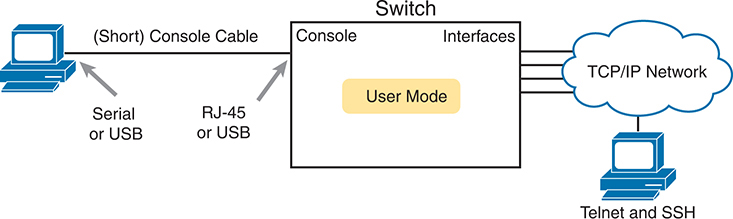


**Figure 4-3** *CLI Access Options*

Users connect to devices using P C Serial or U S B connections via a Console Cable, which typically utilizes an R J-45 connector. Alternatively, they can access devices through Switch Console User Mode Interfaces using T C P/I P Network connections, employing protocols such as Telnet and S S H.

Console access requires both a physical connection between a PC (or other user device) and the switch's console port, as well as some software on the PC. Telnet and SSH require software on the user's device, but they rely on the existing TCP/IP network to transmit data. The next few pages detail how to connect the console and set up the software for each method to access the CLI.

##### Cabling the Console Connection

The physical console connection, both old and new, uses three main components: the physical console port on the switch, a physical serial port on the PC, and a cable that works with the console and serial ports. However, the physical cabling details have changed slowly over time, mainly because of advances and changes with serial interfaces on PC hardware. For this next topic, the text looks at three cases: newer connectors on both the PC and the switch, older connectors on both, and a third case with the newer (USB) connector on the PC but with an older connector on the switch.

Most PCs today use a familiar standard USB connector for the console connection. Cisco has been including USB console ports in new router and switch models for well over a decade. All you have to do is look at the switch to make sure you have the correct style of USB connector to match the USB console port (often a USB mini-B connector.) In the simplest form, you can use any USB port on the PC, with a USB cable, connected to the USB console port on the switch or router, as shown on the far-right side of [Figure 4-4](vol1_ch04.xhtml#ch04fig04).


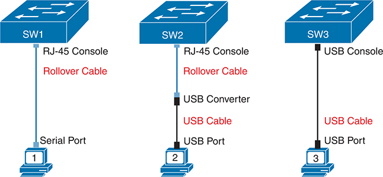


**Figure 4-4** *Console Connection to a Switch*

S W 1 utilizes an R J-45 Console port connected to P C 1 via a Rollover Cable through Serial Port 1. S W 2 employs an R J-45 Console port linked to P C 2 via a Rollover Cable, facilitated by a U S B Converter and U S B Cable connected to a U S B Port. S W 3 features a U S B Console port connected to P C 3 using a U S B Cable through a U S B Port.

The case on the far left in the figure shows an older console connection, typical of how you would have connected to a switch over ten years ago. Before PCs used USB ports, they used serial ports for serial communications. The PC serial port had a D-shell connector (roughly rectangular) with nine pins (often called a DB-9). The console port looks like any Ethernet RJ-45 port (but is typically colored in blue and with the word *console* beside it on the switch). The older-style cabling used a standard RJ-45 to DB-9 converter plug and a UTP [rollover cable](vol1_gloss.xhtml#gloss_338) with RJ-45 connectors on each end. The rollover pinout uses eight wires, rolling the wire at pin 1 to pin 8, pin 2 to pin 7, pin 3 to pin 6, and so on.

The center case in the figure shows a variation that you might use on occasion that combines the cabling concepts from the left and right cases in the figure. You use the USB port on your PC but the RJ-45 console port on the switch. In fact, for some very old switch models, the switch has only an RJ-45 console port but no USB console port, requiring this kind of console cabling. In this case, you need a USB converter plug that converts from the older rollover console cable (with RJ-45 connectors) to a USB connector, as shown in the middle of [Figure 4-4](vol1_ch04.xhtml#ch04fig04).

Note

When using the USB options, you typically also need to install a software driver so that your PC's OS knows that the device on the other end of the USB connection is the console of a Cisco device. Also, you can easily find photos of these cables and components online, with searches like "cisco console cable," "cisco usb console cable," or "console cable converter."

[Figure 4-5](vol1_ch04.xhtml#ch04fig05) shows a Cisco 9200L switch, rear view, which shows the RJ-45 console connector. The 9200L locates the USB console port (a mini-B USB port) on the front panel, as seen earlier in [Figure 4-1](vol1_ch04.xhtml#ch04fig01).

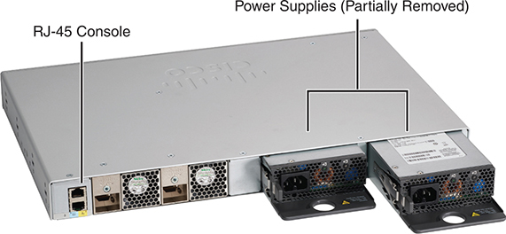


**Figure 4-5** *Cisco Catalyst 9200L Switch, Rear View*

##### Configuring a Terminal Emulator

After the PC is physically connected to the console port, a terminal emulator software package must be installed and configured on the PC. The terminal emulator software treats all data as text. It accepts the text typed by the user and sends it over the console connection to the switch. Similarly, any bits coming into the PC over the console connection are displayed as text for the user to read.

The emulator must be configured to use the PC's serial port to match the settings on the switch's console port settings. The default console port settings on a switch are as follows. Note that the last three parameters are referred to collectively as 8N1:


* 9600 bits/second
* No hardware flow control
* 8-bit ASCII
* No parity bits
* 1 stop bit

[Figure 4-6](vol1_ch04.xhtml#ch04fig06) shows one such terminal emulator. The image shows the window created by the emulator software in the background, with some output of a **show** command. The foreground, in the upper right, shows a settings window that lists the default console settings as listed just before this paragraph.

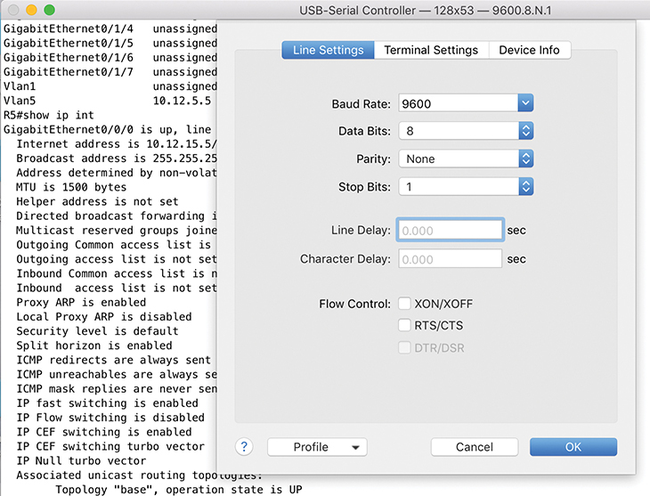


**Figure 4-6** *Terminal Settings for Console Access*

In the "Line Settings" tab, the Baud Rate is configured to 9600, Data Bits set to 8, Parity set to none, and Stop Bits set to 1. Both the Line and Character Delays are measured at 0 seconds, and flow control is unspecified. The Cancel and OK buttons are located at the bottom right corner of the screen.

##### Accessing the CLI with Telnet and SSH

For many years, terminal emulator applications have supported far more than the ability to communicate over a USB (or serial) port to a local device (like a switch's console). Terminal emulators support a variety of TCP/IP applications as well, including Telnet and SSH. Telnet and SSH both allow the user to connect to another device's CLI, but instead of connecting through a console cable to the console port, the traffic flows over the same IP network that the networking devices are helping to create.

Telnet uses the concept of a Telnet client (the terminal application) and a Telnet server (the switch in this case). A *Telnet client*, the device that sits in front of the user, accepts keyboard input and sends those commands to the *Telnet server*. The Telnet server accepts the text, interprets the text as a command, and replies back.

Cisco Catalyst switches enable a Telnet server by default, but switches need a few more configuration settings before you can successfully use Telnet to connect to a switch. [Chapter 6](vol1_ch06.xhtml#ch06), "[Configuring Basic Switch Management](vol1_ch06.xhtml#ch06)," covers switch configuration to support Telnet and SSH in detail.

Using Telnet in a lab today makes sense, but Telnet poses a significant security risk in production networks. Telnet sends all data (including any username and password for login to the switch) as clear-text data. SSH gives us a much better option.

Think of SSH as the much more secure Telnet cousin. Outwardly, you still open a terminal emulator, connect to the switch's IP address, and see the switch CLI, no matter whether you use Telnet or SSH. The differences exist behind the scenes: SSH encrypts the contents of all messages, including the passwords, avoiding the possibility of someone capturing packets in the network and stealing the password to network devices.

##### User and Enable (Privileged) Modes

All three CLI access methods covered so far (console, Telnet, and SSH) place the user in an area of the CLI called *user EXEC mode*. User EXEC mode, sometimes also called [user mode](vol1_gloss.xhtml#gloss_427), allows the user to look around but not break anything. The "EXEC mode" part of the name refers to the fact that in this mode, when you enter a command, the switch executes the command and then displays messages that describe the command's results.

Note

If you have not used the CLI before, you might want to experiment with the CLI from the Sim Lite product. You can find this resource on the companion website as mentioned in the Introduction.

Cisco IOS supports a more powerful EXEC mode called *privileged* mode (also known as [enable mode](vol1_gloss.xhtml#gloss_120)). The formal name, *privileged mode*, refers to the fact that IOS allows powerful (or privileged) commands from that mode. Informally, engineers refer to the mode as *enable mode* because of the **enable** EXEC command, which moves the user from user mode to enable mode, as shown in [Figure 4-7](vol1_ch04.xhtml#ch04fig07). For example, you can use the **reload** command, which tells the switch to reinitialize or reboot Cisco IOS, only from privileged mode.


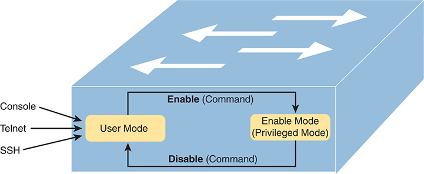


**Figure 4-7** *User and Privileged Modes*

Users can access the device via various methods such as Console, Telnet, or S S H, operating initially in User Mode. To access more advanced commands and configurations, users enter the "Enable" command, transitioning to Enable Mode, also known as Privileged Mode. Within Privileged Mode, users have elevated permissions to execute privileged commands for system configuration and management. Conversely, the "Disable" command reverts the device to User Mode, limiting the commands and configurations available.

Note

If the command prompt ends with a >, the user is in user mode; if it ends with a #, the user is in enable mode.

[Example 4-1](vol1_ch04.xhtml#exa4_1) demonstrates the differences between user and enable modes. The example shows the output that you could see in a terminal emulator window, for instance, when connecting from the console. In this case, the user sits at the user mode prompt ("Certskills1>") and tries the **reload** command. The **reload** command tells the switch to reinitialize or reboot Cisco IOS, so IOS allows this powerful command to be used only from enable mode. IOS rejects the **reload** command from user mode. Then the user moves to privileged (enable) mode using the **enable** EXEC command. At that point, IOS accepts the **reload** command now that the user is in enable mode.

**Example 4-1** *Example of Privileged Mode Commands Being Rejected in User Mode*

[Click here to view code image](vol1_ch04_images.xhtml#f0097-01)

```
Press RETURN to get started.

User Access Verification

Password:
Certskills1>
Certskills1> reload
Translating "reload"
% Unknown command or computer name, or unable to find computer address
Certskills1> enable
Password:
Certskills1#
Certskills1# reload

Proceed with reload? [confirm] y
00:08:42: %SYS-5-RELOAD: Reload requested by console. Reload Reason: Reload Command.
```

Note

The commands that can be used in either user (EXEC) mode or enable (EXEC) mode are called EXEC commands.

This example is the first instance of this book showing you the output from the CLI, so it is worth noting a few conventions. The bold text represents what the user typed, and the nonbold text is what the switch sent back to the terminal emulator. Also, the typed passwords do not show up on the screen for security purposes.

##### Password Security for CLI Access from the Console

A Cisco switch, with default settings, remains relatively secure when locked inside a wiring closet, because by default, a switch allows console access only. By default, the console requires no password at all, and no password to reach enable mode for users that happened to connect from the console. The reason is that if you have access to the physical console port of the switch, you already have pretty much complete control over the switch. You could literally get out your screwdriver, remove the switch from the rack, and walk off with it, or you could unplug the power, or follow well-published procedures to go through password recovery to break into the CLI and then configure anything you want to configure.

However, many people use simple password protection for console users. Simple passwords can be configured at two points in the login process from the console: when the user connects from the console, and when any user moves to enable mode (using the **enable** EXEC command). You may have noticed that back in [Example 4-1](vol1_ch04.xhtml#exa4_1), the user saw a password prompt at both points.

[Example 4-2](vol1_ch04.xhtml#exa4_2) shows the additional configuration commands that were configured prior to collecting the output in [Example 4-1](vol1_ch04.xhtml#exa4_1). The output holds an excerpt from the EXEC command **show running-config**, which lists the current configuration in the switch.

**Example 4-2** *Nondefault Basic Configuration*

[Click here to view code image](vol1_ch04_images.xhtml#f0098-01)

```
Certskills1# show running-config
! Output has been formatted to show only the parts relevant to this discussion
hostname Certskills1
!
enable secret love
!
line console 0
 login

password faith
! The rest of the output has been omitted
Certskills1#
```

Working from top to bottom, note that the first configuration command listed by the **show running-config** command sets the switch's hostname to Certskills1. The switch uses the hostname to begin the command prompt.

Next, note that the lines with a ! in them are comment lines, both in the text of this book and in the real switch CLI.

The **enable secret love** configuration command defines the password that all users must use to reach enable mode. So, no matter whether users connect from the console, Telnet, or SSH, they would use the password love when prompted for a password after typing the **enable** EXEC command.

Finally, the last three lines configure the console password. The first line (**line console 0**) is the command that identifies the console, basically meaning "these next commands apply to the console only." The **login** command tells IOS to perform simple password checking (at the console). Remember, by default, the switch does not ask for a password for console users. Finally, the **password faith** command defines the password the console user must type when prompted.

This example just scratches the surface of the kinds of security configuration you might choose to configure on a switch, but it does give you enough detail to configure switches in your lab and get started (which is the reason I put these details in this first chapter of [Part II](vol1_part02.xhtml#part02)). Note that [Chapter 6](vol1_ch06.xhtml#ch06) shows the configuration steps to add support for Telnet and SSH (including password security), and [Chapter 9](vol1_ch09.xhtml#ch09) of the *CCNA 200-301 Official Cert Guide*, *Volume 2*, Second Edition, "Securing Network Devices," shows additional security configuration as well.

##### Accessing the CLI with the WebUI

Engineers use SSH to access the network device CLI as a routine part of their daily work. Cisco also provides a graphical interface to manage individual Cisco switches and routers, referred to as the device's HTTP server or, in later years, as the WebUI (Web User Interface). Once configured, an engineer can use any web browser to connect to the IP address of the switch or router, supply the correct login information, and see web pages that allow management of that single device. That web interface also includes a method to access the CLI.

First, [Figures 4-8](vol1_ch04.xhtml#ch04fig08) and [4-9](vol1_ch04.xhtml#ch04fig09) show a couple of example pages of the graphical interface. [Figure 4-8](vol1_ch04.xhtml#ch04fig08) shows a screenshot of the web server dashboard's Switch View. This page shows an image representing the side of the switch, with all switch ports shown and colored lights representing the same status colors you would see on the physical switch.

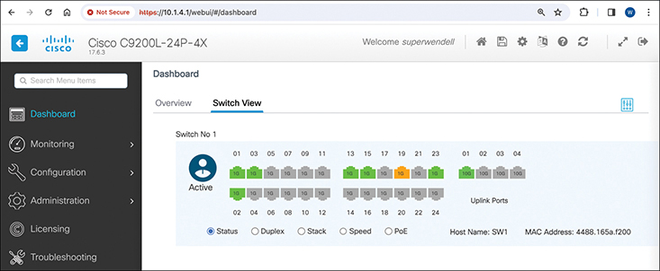


**Figure 4-8** *Cisco Switch Web Interface Dashboard: Switch View*

The switch view provides a detailed description of the dashboard's layout and functionality. It includes elements such as navigation menus, status indicators, configuration options, and monitoring tools. Users can access various features and settings, such as port configuration, V L A N management, device diagnostics, and system monitoring, through the intuitive graphical user interface. The active switches are marked for switch 1.

Note

The examples in this section come from a Cisco Catalyst 9200L switch running IOS XE Version 17.6.3, visible in the upper left of the screenshot in [Figure 4-8](vol1_ch04.xhtml#ch04fig08). However, the specifics of the user interface and available options in the left-side menus vary across device types, models, and IOS versions. So, use the figures in this section only to get a general idea of the functions of this tool.

The WebUI supports direct configuration and verification options that do not require knowledge of the CLI. For example, [Figure 4-9](vol1_ch04.xhtml#ch04fig09) shows a screenshot with the user's mouse hovering over the word "Configuration" in the left menu, causing the page to reveal various configuration options. Earlier, the user had chosen the STP option, so the background in the screenshot shows a partial view of the Spanning Tree Protocol (STP) configuration screen. So, you could point and click through the user interface to configure some of the options covered for CCNA.

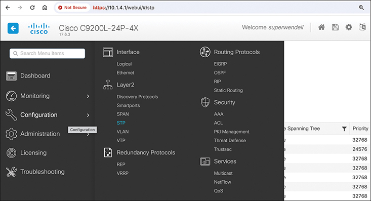


**Figure 4-9** *Configuration Options in the Switch Web Server Configuration Menu*

The Configuration Options menu displays several sub-menus, including Interface, Layer 2, Redundancy Protocols, Routing Protocols, Security, and Service. Within this menu, the Layer 2 submenu is highlighted, with the Spanning Tree Protocol (S T P) selected.

If you have a Cisco switch or router available, you should take the time to use the WebUI and look around at some of the configuration and verification options. Again, be aware that your device might show different layouts and options versus the screenshots shown here.

The more recent versions of the WebUI provide access to the CLI without your device needing to have an SSH or Telnet client installed, as seen in [Figure 4-10](vol1_ch04.xhtml#ch04fig10). Once you navigate to the correct page (**Administration > Command Line Interface**), you type the CLI command into the upper box, click a button to send it to the device, and the response messages appear in the lower box. The figure shows the output of the **show interfaces status** command.

The WebUI can be pretty useful when you do not have any of your devices with you. If your devices with SSH clients installed are back at your desk and you need to log in to a few network devices, borrow any device with a web browser, and connect to routers and switches. Although the WebUI is useful, most engineers prefer using an SSH client when working in the CLI because the clients are much more usable. For instance, in [Figure 4-10](vol1_ch04.xhtml#ch04fig10), note the poor column alignment of the command output. An SSH client would typically not have those kinds of alignment issues, which can make reading the output more difficult.


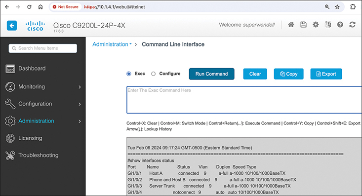


**Figure 4-10** *CLI Access from the Switch Web Server Interface*

Within the Administration Options menu, the Command Line Interface (C LI) section is visible. The "Exec" circle is checked, indicating the current selection. Several buttons are available, including options to run a command, clear the interface, copy content, and export data. Additionally, the bottom section of the menu displays code lines for accessing the CLI directly from the Switch Web Server Interface.

Note

On a related note, vendors like Cisco also sell sophisticated stand-alone network management applications. These typically have graphical interfaces and comprehensive management for all available features and support all devices using one user interface. In comparison, the WebUI provides basic features on a per-device basis. You will learn more about one such application, Cisco Catalyst Center, in [Chapter 22](vol1_ch22.xhtml#ch22), "[Cisco Software-Defined Access (Cisco SD-Access)](vol1_ch22.xhtml#ch22)," in the book *CCNA 200-301 Official Cert Guide, Volume 2*, Second Edition.

#### CLI Help Features

If you printed the Cisco IOS Command Reference documents, you would end up with a stack of paper several feet tall. No one should expect to memorize all the commands—and no one does. You can use several easy, convenient tools to help remember commands and save time typing. As you progress through your Cisco certifications, the exams will cover progressively more commands. However, you should know the methods of getting command help.

[Table 4-3](vol1_ch04.xhtml#ch04tab03) summarizes command-recall help options available at the CLI. Note that, in the first column, *command* represents any command. Likewise, *parm* represents a command's parameter. For example, the third row lists *command* **?**, which means that commands such as **show ?** and **copy ?** would list help for the **show** and **copy** commands, respectively.

**Table 4-3** Cisco IOS Software Command Help

| What You Enter | What Help You Get |
| --- | --- |
| **?** | This option provides help for all commands available in this mode. |
| *command* **?** | With a space between the command and the ?, the switch lists text to describe all the first parameter options for the command. |
| *com***?** | This option lists commands that start with **com**. |
| *command parm***?** | This option lists all parameters beginning with the **parameter typed so far**. (Notice that there is no space between *parm* and the **?**.) |
| *command parm*<Tab> | Pressing the Tab key causes IOS to spell out the rest of the word, assuming that you have typed enough of the word so there is only one option that begins with that string of characters. |
| *command parm1* **?** | If a space is inserted before the question mark, the CLI lists all the next parameters and gives a brief explanation of each. |

When you enter the **?**, the Cisco IOS CLI reacts immediately; that is, you don't need to press the Enter key or any other keys. The device running Cisco IOS also redisplays what you entered before the **?** to save you some keystrokes. If you press Enter immediately after the **?**, Cisco IOS tries to execute the command with only the parameters you have entered so far.

The information supplied by using help depends on the CLI mode. For example, when **?** is entered in user mode, the commands allowed in user mode are displayed, but commands available only in enable mode (not in user mode) are not displayed. Also, help is available in [configuration mode](vol1_gloss.xhtml#gloss_075), which is the mode used to configure the switch. In fact, configuration mode has many different subconfiguration modes, as explained in the section "[Configuration Submodes and Contexts](vol1_ch04.xhtml#ch04lev2sec5)," later in this chapter. So, you can get help for the commands available in each configuration submode as well. (Note that this might be a good time to use the free Sim Lite product on the companion website: to do so, open any lab, use the question mark, and try some commands.)

Cisco IOS stores the commands that you enter in a history buffer, storing ten commands by default. The CLI allows you to move backward and forward in the historical list of commands and then edit the command before reissuing it. These key sequences can help you use the CLI more quickly on the exams. [Table 4-4](vol1_ch04.xhtml#ch04tab04) lists the commands used to manipulate previously entered commands.

**Table 4-4** Key Sequences for Command Edit and Recall

| Keyboard Command | What Happens |
| --- | --- |
| Up arrow or Ctrl+P | This keyboard command displays the most recently used command. If you press it again, the next most recent command appears, until the history buffer is exhausted. (The *P* stands for previous.) |
| Down arrow or Ctrl+N | If you have gone too far back into the history buffer, these keys take you forward to the more recently entered commands. (The *N* stands for next.) |
| Left arrow or Ctrl+B | This keyboard command moves the cursor backward in the currently displayed command without deleting characters. (The *B* stands for back.) |
| Right arrow or Ctrl+F | This keyboard command moves the cursor forward in the currently displayed command without deleting characters. (The *F* stands for forward.) |
| Backspace | This keyboard command moves the cursor backward in the currently displayed command, deleting characters. |

#### The debug and show Commands

By far, the single most popular Cisco IOS command is the **show** command. The **show** command has a large variety of options, and with those options, you can find the status of almost every feature of Cisco IOS. Essentially, the **show** command lists the currently known facts about the switch's operational status.

For example, consider the output from the **show mac address-table dynamic** command listed in [Example 4-3](vol1_ch04.xhtml#exa4_3). This **show** command, issued from user mode, lists the table the switch uses to make forwarding decisions. A switch's MAC address table basically lists the data that a switch uses to do its primary job.

**Example 4-3** *Example MAC Address Table*

[Click here to view code image](vol1_ch04_images.xhtml#f0103-01)

```
Certskills1> show mac address-table dynamic
 Mac Address Table
-------------------------------------------

Vlan    Mac Address       Type        Ports
----    -----------       --------    -----
  31    0200.1111.1111    DYNAMIC     Gi0/1
  31    0200.3333.3333    DYNAMIC     Fa0/3
  31    1833.9d7b.0e9a    DYNAMIC     Gi0/1
  10    1833.9d7b.0e9a    DYNAMIC     Gi0/1
  10    30f7.0d29.8561    DYNAMIC     Gi0/1
   1    1833.9d7b.0e9a    DYNAMIC     Gi0/1
  12    1833.9d7b.0e9a    DYNAMIC     Gi0/1
Total Mac Addresses for this criterion: 7
Certskills1>
```

The **debug** command also tells the user details about the operation of the switch. However, while the **show** command lists status information at one instant of time—more like a photograph—the **debug** command acts more like a live video camera feed. Once you issue a **debug** command, IOS remembers, issuing messages over time as events continue to occur. Any switch user can choose to receive those messages, with the switch sending the messages to the console by default. Most of the commands used throughout this book to verify operation of switches and routers are **show** commands.

### Configuring Cisco IOS Software

You will want to configure every switch in an Enterprise network, even though the switches will forward traffic even with default configuration. This section covers the basic configuration processes, including the concept of a configuration file and the locations in which the configuration files can be stored. Although this section focuses on the configuration process, and not on the configuration commands themselves, you should know all the commands covered in this chapter for the exams, in addition to the configuration processes.

Configuration mode accepts *configuration commands*—commands that tell the switch the details of what to do and how to do it. User and privileged modes accept EXEC commands, which return output, or possibly take an action like reloading the switch, but commands in these modes do not change any configuration settings. [Figure 4-11](vol1_ch04.xhtml#ch04fig11) illustrates the navigation among configuration mode, user EXEC mode, and privileged EXEC mode.

Commands entered in configuration mode update the active configuration file. *These changes to the configuration occur immediately each time you press the Enter key at the end of a command.* Be careful when you enter a configuration command!


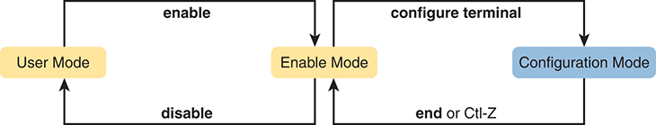


**Figure 4-11** *CLI Configuration Mode Versus EXEC Modes*

Users operate in User Mode. By executing the "enable" command, users enter Enable Mode, also known as Privileged Mode, granting access to more advanced configuration commands. Within Enable Mode, users can enter Configuration Mode using the "configure terminal" command, enabling direct configuration of device settings. Exiting Configuration Mode can be achieved by entering "end" or pressing Ctrl-Z, returning users to Enable Mode.

#### Configuration Submodes and Contexts

Configuration mode supports a multitude of commands. To help organize the configuration, IOS groups some kinds of configuration commands together. To do that, when using configuration mode, you move from the initial mode—global configuration mode—into subcommand modes. *Context-setting commands* move you from one configuration subcommand mode, or context, to another. These context-setting commands tell the switch the topic about which you will enter the next few configuration commands. More importantly, the context tells the switch the topic you care about right now, so when you use the **?** to get help, the switch gives you help about that topic only.

Note

*Context-setting* is not a Cisco term. It is just a description used here to help make sense of configuration mode.

The best way to learn about configuration submodes is to use them, but first, take a look at these upcoming examples. For instance, the **interface** command is one of the most commonly used context-setting configuration commands. For example, the CLI user could enter interface configuration mode by entering the **interface FastEthernet 0/1** configuration command. Asking for help in interface configuration mode displays only commands that are useful when configuring Ethernet interfaces. Commands used in this context are called *subcommands*—or, in this specific case, *interface subcommands*. When you begin practicing with the CLI using real equipment, the navigation between modes can become natural. For now, consider [Example 4-4](vol1_ch04.xhtml#exa4_4), which shows the following:

* Movement from enable mode to global configuration mode by using the **configure terminal** EXEC command.
* Use of a **hostname Fred** global configuration command to configure the switch's name. Using a global command from global configuration mode leaves you in global configuration mode.
* Movement from global configuration mode to console line configuration mode (using the **line console 0** command). The **line** command is another of the small set of context-setting commands that move you to another submode.
* Setting the console's simple password to **hope** (using the **password hope** line subcommand). Using a subcommand while in that submode leaves the command prompt in that submode.
* Movement from console configuration mode to interface configuration mode (using the **interface** *type number* command). The **interface** command is another of the small set of context-setting commands that move you to another submode.
* Setting the speed to 100 Mbps for interface Fa0/1 (using the **speed 100** interface subcommand).
* Movement from interface configuration mode back to global configuration mode (using the **exit** command).

**Example 4-4** *Navigating Between Different Configuration Modes*

[Click here to view code image](vol1_ch04_images.xhtml#f0105-01)

```
Switch# configure terminal
Switch(config)# hostname Fred
Fred(config)# line console 0
Fred(config-line)# password hope
Fred(config-line)# interface FastEthernet 0/1
Fred(config-if)# speed 100
Fred(config-if)# exit
Fred(config)#
```

The text inside parentheses in the command prompt identifies the configuration mode. For example, the first command prompt after you enter configuration mode lists (config), meaning global configuration mode. After the **line console 0** command, the text expands to (config-line), meaning line configuration mode. Each time the command prompt changes within config mode, you have moved to another configuration mode.

[Table 4-5](vol1_ch04.xhtml#ch04tab05) shows the most common command prompts in configuration mode, the names of those modes, and the context-setting commands used to reach those modes.


**Table 4-5** Common Switch Configuration Modes

| Prompt | Name of Mode | Context-Setting Command(s) to Reach This Mode |
| --- | --- | --- |
| hostname(config)# | Global | None—first mode after **configure terminal** |
| hostname(config-line)# | Line | **line console 0**  **line vty 0 15** |
| hostname(config-if)# | Interface | **interface** *type number* |
| hostname(config-vlan)# | VLAN | **vlan** *number* |

You should practice until you become comfortable moving between the different configuration modes, back to enable mode, and then back into the configuration modes. However, you can learn these skills just doing labs about the topics in later chapters of the book. For now, [Figure 4-12](vol1_ch04.xhtml#ch04fig12) shows most of the navigation between global configuration mode and the four configuration submodes listed in [Table 4-5](vol1_ch04.xhtml#ch04tab05).


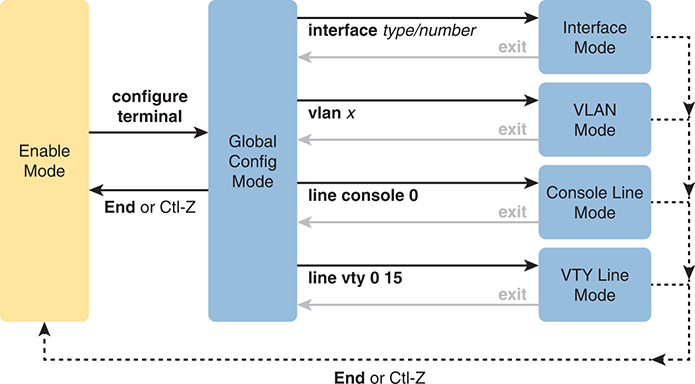


**Figure 4-12** *Navigation In and Out of Switch Configuration Modes*

Users enter Enable Mode, granting access to more advanced configuration commands. From Enable Mode, users can enter Global Configuration Mode using the "configure terminal" command, facilitating global device configuration. Exiting Global Configuration Mode can be achieved by entering "end" or pressing Ctrl-Z, returning users to Enable Mode. Additionally, from Global Configuration Mode, users can enter specific interface, V LAN, console line, or V T Y line modes using corresponding commands, enabling configuration at the respective levels. Exiting these modes returns users to Global Configuration Mode.

You really should stop and try navigating around these configuration modes. If you have not yet decided on a lab strategy, install the Pearson Sim Lite software from the companion website. It includes the simulator and a couple of lab exercises. Start any lab, ignore the instructions, and just get into configuration mode and move around between the configuration modes shown in [Figure 4-12](vol1_ch04.xhtml#ch04fig12).

No set rules exist for what commands happen to be global commands or subcommands. Instead, you learn new commands, see whether they are global commands, or if subcommands, you also learn the required mode. But generally, Cisco uses global commands for settings that apply to the entire switch and subcommands that apply to one component or feature. For example:

The global command **hostname** sets the one hostname for the entire switch.

The interface subcommand **speed** configures a setting for a specific interface, so it works only in interface configuration submode.

#### Storing Switch Configuration Files

When you configure a switch, it needs to use the configuration. It also needs to be able to retain the configuration in case the switch loses power. Cisco switches contain random-access memory (RAM) to store data while Cisco IOS is using it, but RAM loses its contents when the switch loses power or is reloaded. To store information that must be retained when the switch loses power or is reloaded, Cisco switches use several types of more permanent memory, none of which has any moving parts. By avoiding components with moving parts (such as traditional disk drives), switches can maintain better uptime and availability.

The following list details the four main types of memory found in Cisco switches, as well as the most common use of each type:

* **RAM:** Sometimes called DRAM, for dynamic random-access memory, RAM is used by the switch just as it is used by any other computer: for working storage. The running (active) configuration file is stored here.
* **Flash memory:** Either a chip inside the switch or a removable memory card, flash memory stores fully functional Cisco IOS images and is the default location where the switch gets its Cisco IOS at boot time. Flash memory also can be used to store any other files, including backup copies of configuration files.
* **ROM:** Read-only memory (ROM) stores a bootstrap (or boothelper) program that is loaded when the switch first powers on. This bootstrap program then finds the full Cisco IOS image and manages the process of loading Cisco IOS into RAM, at which point Cisco IOS takes over operation of the switch.
* **NVRAM:** Nonvolatile RAM (NVRAM) stores the initial or startup configuration file that is used when the switch is first powered on and when the switch is reloaded.

[Figure 4-13](vol1_ch04.xhtml#ch04fig13) summarizes this same information in a briefer and more convenient form for memorization and study.

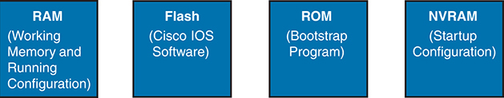


**Figure 4-13** *Cisco Switch Memory Types*

RAM, or Random Access Memory, serves as the working memory where the running configuration resides during device operation. Flash memory stores the Cisco I O S Software, the operating system of the switch. ROM, or Read-Only Memory, contains the Bootstrap Program, essential for booting the switch. NVRAM, or Non-Volatile RAM, holds the startup configuration, ensuring that configuration settings are retained even after a reboot.

Cisco IOS stores the collection of configuration commands in a *configuration file*. In fact, switches use multiple configuration files—one file for the initial configuration used when powering on, and another configuration file for the active, currently used running configuration as stored in RAM. [Table 4-6](vol1_ch04.xhtml#ch04tab06) lists the names of these two files, their purpose, and their storage location.


**Table 4-6** Names and Purposes of the Two Main Cisco IOS Configuration Files

| Configuration Filename | Purpose | Where It Is Stored |
| --- | --- | --- |
| startup-config | Stores the initial configuration used anytime the switch reloads Cisco IOS. | NVRAM |
| running-config | Stores the currently used configuration commands. This file changes dynamically when someone enters commands in configuration mode. | RAM |

Essentially, when you use configuration mode, you change only the [running-config file](vol1_gloss.xhtml#gloss_357). This means that the configuration example earlier in this chapter ([Example 4-4](vol1_ch04.xhtml#exa4_4)) updates only the running-config file. However, if the switch lost power right after that example, all that configuration would be lost. If you want to keep that configuration, you have to copy the running-config file into NVRAM, overwriting the old [startup-config file](vol1_gloss.xhtml#gloss_373).

[Example 4-5](vol1_ch04.xhtml#exa4_5) demonstrates that commands used in configuration mode change only the running configuration in RAM. The example shows the following concepts and steps:

Step 1. The example begins with both the running and startup-config having the same hostname, per the **hostname hannah** command.

Step 2. The hostname is changed in configuration mode using the **hostname harold** command.

Step 3. The **show running-config** and **show startup-config** commands show the fact that the hostnames are now different, with the **hostname harold** command found only in the running-config.

**Example 4-5** *How Configuration Mode Commands Change the Running-Config File, Not the Startup-Config File*

[Click here to view code image](vol1_ch04_images.xhtml#f0108-01)

```
! Step 1 next (two commands)
!
hannah# show running-config
! (lines omitted)
hostname hannah
! (rest of lines omitted)

hannah# show startup-config
! (lines omitted)
hostname hannah
! (rest of lines omitted)
! Step 2 next. Notice that the command prompt changes immediately after
! the hostname command.

hannah# configure terminal
hannah(config)# hostname harold
harold(config)# exit
! Step 3 next (two commands)
!
harold# show running-config
! (lines omitted) - just showing the part with the hostname command
hostname harold
!
harold# show startup-config
! (lines omitted) - just showing the part with the hostname command
hostname hannah
```

#### Copying and Erasing Configuration Files

The configuration process updates the running-config file, which is lost if the router loses power or is reloaded. Clearly, IOS needs to provide us a way to copy the running configuration so that it will not be lost, so it will be used the next time the switch reloads or powers on. For instance, [Example 4-5](vol1_ch04.xhtml#exa4_5) ended with a different running configuration (with the **hostname harold** command) versus the startup configuration.

In short, the EXEC command **copy running-config startup-config** backs up the running-config to the startup-config file. This command overwrites the current startup-config file with what is currently in the running-config file.

In addition, in the lab, you may want to just get rid of all existing configuration and start over with a clean configuration. To do that, you can erase the startup-config file using three different commands:

```
write erase
erase startup-config
erase nvram:
```

Once the startup-config file is erased, you can reload or power off/on the switch, and it will boot with the now-empty startup configuration.

Note that Cisco IOS does not have a command that erases the contents of the running-config file. To clear out the running-config file, simply erase the startup-config file, and then **reload** the switch, and the running-config will be empty at the end of the process.

Note

Cisco uses the term *reload* to refer to what most PC operating systems call rebooting or restarting. In each case, it is a re-initialization of the software. The **reload** EXEC command causes a switch to reload.

### Chapter Review

One key to doing well on the exams is to perform repetitive spaced review sessions. Review this chapter's material using either the tools in the book or on the book's companion website. Refer to the "[Your Study Plan](vol1_pref10.xhtml#pref10)" element section titled "[Step 2: Build Your Study Habits Around the Chapter](vol1_pref10.xhtml#pref10lev2sec2)" for more details. [Table 4-7](vol1_ch04.xhtml#ch04tab07) outlines the key review elements and where you can find them. To better track your study progress, record when you completed these activities in the second column.

**Table 4-7** Chapter Review Tracking

| Review Element | Review Date(s) | Resource Used |
| --- | --- | --- |
| Review key topics |  | Book, website |
| Review key terms |  | Book, website |
| Answer DIKTA questions |  | Book, PTP |
| Review memory tables |  | Book, website |
| Review command tables |  | Book |

### Review All the Key Topics


**Table 4-8** Key Topics for [Chapter 4](vol1_ch04.xhtml#ch04)

| Key Topic Element | Description | Page Number |
| --- | --- | --- |
| [Figure 4-3](vol1_ch04.xhtml#ch04fig03) | Three methods to access a switch CLI | [93](vol1_ch04.xhtml#page_93) |
| [Figure 4-4](vol1_ch04.xhtml#ch04fig04) | Cabling options for a console connection | [94](vol1_ch04.xhtml#page_94) |
| List | A Cisco switch's default console port settings | [95](vol1_ch04.xhtml#page_95) |
| [Figure 4-11](vol1_ch04.xhtml#ch04fig11) | Navigation between user, enable, and global config modes | [104](vol1_ch04.xhtml#page_104) |
| [Table 4-5](vol1_ch04.xhtml#ch04tab05) | A list of configuration mode prompts, the name of the configuration mode, and the command used to reach each mode | [105](vol1_ch04.xhtml#page_105) |
| [Figure 4-12](vol1_ch04.xhtml#ch04fig12) | Configuration mode context-setting commands | [106](vol1_ch04.xhtml#page_106) |
| [Table 4-6](vol1_ch04.xhtml#ch04tab06) | The names and purposes of the two configuration files in a switch or router | [107](vol1_ch04.xhtml#page_107) |

### Key Terms You Should Know

[command-line interface (CLI)](vol1_ch04.xhtml#key_057)

[configuration mode](vol1_ch04.xhtml#key_058)

[enable mode](vol1_ch04.xhtml#key_059)

[IOS](vol1_ch04.xhtml#key_060)

[IOS XE](vol1_ch04.xhtml#key_061)

[rollover cable](vol1_ch04.xhtml#key_062)

[running-config file](vol1_ch04.xhtml#key_063)

[Secure Shell (SSH)](vol1_ch04.xhtml#key_064)

[startup-config file](vol1_ch04.xhtml#key_065)

[Telnet](vol1_ch04.xhtml#key_066)

[user mode](vol1_ch04.xhtml#key_067)

### Command References

[Tables 4-9](vol1_ch04.xhtml#ch04tab09) and [4-10](vol1_ch04.xhtml#ch04tab10) list configuration and verification commands used in this chapter, respectively. As an easy review exercise, cover the left column in a table, read the right column, and try to recall the command without looking. Then repeat the exercise, covering the right column, and try to recall what the command does.

**Table 4-9** [Chapter 4](vol1_ch04.xhtml#ch04) Configuration Commands

| Command | Mode and Purpose |
| --- | --- |
| **line console 0** | Global command that changes the context to console configuration mode. |
| **login** | Line (console and vty) configuration mode. Tells IOS to prompt for a password (no username). |
| **password** *pass-value* | Line (console and vty) configuration mode. Sets the password required on that line for login if the **login** command (with no other parameters) is also configured. |
| **interface** *type port-number* | Global command that changes the context to interface mode—for example, **interface FastEthernet 0/1**. |
| **speed** *value* | Interface subcommand that sets the Ethernet interface speed on interfaces that support multiple speeds. |
| **hostname** *name* | Global command that sets this switch's hostname, which is also used as the first part of the switch's command prompt. |
| **exit** | Command that moves back to the next higher mode in configuration mode. |
| **end** | Command that exits configuration mode and goes back to enable mode from any of the configuration submodes. |
| Ctrl+Z | This is not a command, but rather a two-key combination (pressing the Ctrl key and the letter Z) that together do the same thing as the **end** command. |


**Table 4-10** [Chapter 4](vol1_ch04.xhtml#ch04) EXEC Command Reference

| Command | Purpose |
| --- | --- |
| **no debug all**  **undebug all** | Privileged mode EXEC command to disable all currently enabled debugs. |
| **reload** | Privileged mode EXEC command that reboots the switch or router. |
| **copy running-config startup-config** | Privileged mode EXEC command that saves the active config, replacing the startup-config file used when the switch initializes. |
| **copy startup-config running-config** | Privileged mode EXEC command that merges the startup-config file with the currently active config file in RAM. |
| **show running-config** | Privileged mode EXEC command that lists the contents of the running-config file. |
| **write erase**  **erase startup-config**  **erase nvram:** | Privileged mode EXEC command that erases the startup-config file. |
| **quit** | EXEC command that disconnects the user from the CLI session. |
| **show startup-config** | Privileged mode EXEC command that lists the contents of the startup-config (initial config) file. |
| **enable** | User mode EXEC command that moves the user from user mode to enable (privileged) mode and prompts for a password if one is configured. |
| **disable** | Privileged mode EXEC command that moves the user from privileged mode to user mode. |
| **configure terminal** | Privileged mode EXEC command that moves the user into configuration mode. |
| **show mac address-table** | EXEC command that lists the contents of a switch forwarding (MAC) table. |