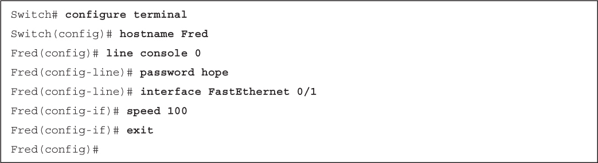

# Code Snippets

Many titles include programming code or configuration examples. To optimize the presentation of these elements, view the eBook in single-column, landscape mode and adjust the font size to the smallest setting. In addition to presenting code and configurations in the reflowable text format, we have included images of the code that mimic the presentation found in the print book; therefore, where the reflowable format may compromise the presentation of the code listing, you will see a "Click here to view code image" link. Click the link to view the print-fidelity code image. To return to the previous page viewed, click the Back button on your device or app.

