# Chapter 8


## Implementing Ethernet Virtual LANs

This chapter covers the following exam topics:

1.0 Network Fundamentals

1.13 Describe switching concepts

1.13.a MAC learning and aging

1.13.b Frame switching

1.13.c Frame flooding

1.13.d MAC address table

2.0 Network Access

2.1 Configure and verify VLANs (normal range) spanning multiple switches

2.1.a Access ports (data and voice)

2.1.b Default VLAN

2.1.c InterVLAN connectivity

2.2 Configure and verify interswitch connectivity

2.2.a Trunk ports

2.2.b 802.1Q

2.2.c Native VLAN

So far in this book, you have learned that Ethernet switches receive Ethernet frames, make decisions, and then forward (switch) those Ethernet frames. That core logic revolves around MAC addresses, the interface in which the frame arrives, and the interfaces out which the switch forwards the frame.

While true, that logic omits any consideration of virtual LANs (VLANs). VLANs impact the switching logic for each frame because each VLAN acts as a subset of the switch ports in an Ethernet LAN. Switches believe each Ethernet frame to be received in an identifiable VLAN, forwarded based on MAC table entries for that VLAN, and forwarded out ports in that VLAN. This chapter explores those concepts and others related to VLANs.

As for the organization of the chapter, the first major section of the chapter explains the core concepts. These concepts include how VLANs work on a single switch, how to use VLAN trunking to create VLANs that span across multiple switches, and how to forward traffic between VLANs using a router. The second major section shows how to configure VLANs and VLAN trunks: how to statically assign interfaces to a VLAN. The final major section discusses some issues that can arise when using VLANs and trunks and how to avoid those issues.

Also, this chapter goes beyond the normal chapter page length. If you want to break up your study into two reading sections, stop the first session when you reach the heading "[Implementing Interfaces Connected to Phones](vol1_ch08.xhtml#ch08lev2sec6)."

### "Do I Know This Already?" Quiz

Take the quiz (either here or use the PTP software) if you want to use the score to help you decide how much time to spend on this chapter. The letter answers are listed at the bottom of the page following the quiz. [Appendix C](vol1_appc.xhtml#appc), found both at the end of the book as well as on the companion website, includes both the answers and explanations. You can also find both answers and explanations in the PTP testing software.

**Table 8-1** "Do I Know This Already?" Foundation Topics Section-to-Question Mapping

| Foundation Topics Section | Questions |
| --- | --- |
| Virtual LAN Concepts | 1–3 |
| VLAN and VLAN Trunking Configuration and Verification | 4–6 |
| Troubleshooting VLANs and VLAN Trunks | 7–8 |

**[1](vol1_ch08.xhtml#ques8_1a).** In a LAN, which of the following terms best equates to the term *VLAN*?

1. Collision domain
2. Broadcast domain
3. Subnet
4. Single switch
5. Trunk

**[2](vol1_ch08.xhtml#ques8_2a).** Imagine a small lab network with one LAN switch, with the ports configured to be in three different VLANs. How many IP subnets do you need for the hosts connected to the switch ports, assuming that all hosts in all VLANs want to use TCP/IP?

1. 0
2. 1
3. 2
4. 3
5. You cannot tell from the information provided.

**[3](vol1_ch08.xhtml#ques8_3a).** Switch SW1 sends a frame to switch SW2 using 802.1Q trunking. Which of the answers describes how SW1 changes or adds to the Ethernet frame before forwarding the frame to SW2?

1. Inserts a 4-byte header and does change the MAC addresses.
2. Inserts a 4-byte header and does not change the MAC addresses.
3. Encapsulates the original frame behind an entirely new Ethernet header.
4. None of the other answers are correct.

**[4](vol1_ch08.xhtml#ques8_4a).** You are told that switch 1 is configured with the **switchport mode dynamic auto** command on its Fa0/5 interface, which is connected to switch 2. Which of the following settings on the **switchport mode** command on switch 2 would allow trunking to work? (Choose two answers.)

1. **trunk**
2. **dynamic auto**
3. **dynamic desirable**
4. **access**
5. None of the other answers are correct.

**[5](vol1_ch08.xhtml#ques8_5a).** A switch has just arrived from Cisco. The switch has never been configured with any VLANs, but VTP has been disabled. An engineer configures the **vlan 22** and **name Hannahs-VLAN** commands and then exits configuration mode. Which of the following are true? (Choose two answers.)

1. VLAN 22 is listed in the output of the **show vlan brief** command.
2. VLAN 22 is listed in the output of the **show running-config** command.
3. VLAN 22 is not created by this process.
4. VLAN 22 does not exist in that switch until at least one interface is assigned to that VLAN.

**[6](vol1_ch08.xhtml#ques8_6a).** Which of the following commands identify switch interfaces as being trunking interfaces—interfaces that currently operate as VLAN trunks? (Choose two answers.)

1. **show interfaces**
2. **show interfaces switchport**
3. **show interfaces trunk**
4. **show trunks**

**[7](vol1_ch08.xhtml#ques8_7a).** In a switch that disables VTP, an engineer configures the commands **vlan 30** and **shutdown vlan 30**. Which answers should be true about this switch? (Choose two answers.)

1. The **show vlan brief** command should list VLAN 30.
2. The **show running-config** command should list VLAN 30.
3. The switch should forward frames that arrive in access ports in VLAN 30.
4. The switch should forward frames that arrive in trunk ports tagged with VLAN 30.

**[8](vol1_ch08.xhtml#ques8_8a).** The **show interfaces g0/1 trunk** command provides three lists of VLAN IDs. Which items would limit the VLANs that appear in the first of the three lists of VLANs?

1. A **shutdown vlan 30** global command
2. A **switchport trunk allowed vlan** interface subcommand
3. An STP choice to block on G0/1
4. A **no vlan 30** global command

Answers to the "Do I Know This Already?" quiz:

**[1](vol1_appc.xhtml#ques8_1)** B

**[2](vol1_appc.xhtml#ques8_2)** D

**[3](vol1_appc.xhtml#ques8_3)** B

**[4](vol1_appc.xhtml#ques8_4)** A, C

**[5](vol1_appc.xhtml#ques8_5)** A, B

**[6](vol1_appc.xhtml#ques8_6)** B, C

**[7](vol1_appc.xhtml#ques8_7)** A, B

**[8](vol1_appc.xhtml#ques8_8)** B

### Foundation Topics

### Virtual LAN Concepts

Before understanding [VLANs](vol1_gloss.xhtml#gloss_431), you must first have a specific understanding of the definition of a LAN. For example, from one perspective, a LAN includes all the user devices, servers, switches, routers, cables, and wireless access points in one location. However, an alternative narrower definition of a LAN can help in understanding the concept of a virtual LAN:

A LAN includes all devices in the same broadcast domain.

A broadcast domain includes the set of all LAN-connected devices, so that when any of the devices sends a broadcast frame, all the other devices get a copy of the frame. So, from one perspective, you can think of a LAN and a broadcast domain as being basically the same thing.

Using only default settings, a switch considers all its interfaces to be in the same broadcast domain. That is, for one switch, when a broadcast frame entered one switch port, the switch forwarded that broadcast frame out all other ports. With that logic, to create two different LAN broadcast domains, you had to buy two different Ethernet LAN switches, as shown in [Figure 8-1](vol1_ch08.xhtml#ch08fig01).

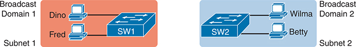


**Figure 8-1** *Creating Two Broadcast Domains with Two Physical Switches and No VLANs*

In Part 1, Dino, belonging to Broadcast Domain 1, and Fred, residing in Subnet 1, are both connected to switch S W 1. Meanwhile, in Part 2, Wilma, a member of Broadcast Domain 2, and Betty, associated with Subnet 2, are connected to switch S W 2. This setup effectively segregates the network traffic into two distinct broadcast domains without the need for V L A N configuration.

By using two VLANs, a single switch can accomplish the same goals of the design in [Figure 8-1](vol1_ch08.xhtml#ch08fig01)—to create two broadcast domains—with a single switch. With VLANs, a switch can configure some interfaces into one broadcast domain and some into another, creating multiple broadcast domains. These individual broadcast domains created by the switch are called *virtual LANs (VLANs)*.

For example, in [Figure 8-2](vol1_ch08.xhtml#ch08fig02), the single switch creates two VLANs, treating the ports in each VLAN as being completely separate. The switch would never forward a frame sent by Dino (in VLAN 1) over to either Wilma or Betty (in VLAN 2).


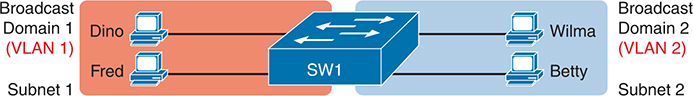


**Figure 8-2** *Creating Two Broadcast Domains Using One Switch and VLANs*

In Part 1, Dino, assigned to V L A N 1 (Broadcast Domain 1), and Fred, residing in Subnet 1, are both connected to switch S W 1. In Part 2, Wilma, allocated to V L A N 2 (Broadcast Domain 2), and Betty, associated with Subnet 2, are also connected to switch S W 1. By leveraging V L A Ns, the network traffic is effectively segmented into two separate broadcast domains within the same physical switch.

Designing campus LANs to use more VLANs, each with a smaller number of devices, often helps improve the LAN in many ways. For example, a broadcast sent by one host in a VLAN will be received and processed by all the other hosts in the VLAN—but not by hosts in a different VLAN. Limiting the number of hosts that receive a single broadcast frame reduces the number of hosts that waste effort processing unneeded broadcasts. It also reduces security risks because fewer hosts see frames sent by any one host. These are just a few reasons for separating hosts into different VLANs. The following list summarizes the most common reasons for choosing to create smaller broadcast domains (VLANs):


* To reduce CPU overhead on each device, improving host performance, by reducing the number of devices that receive each broadcast frame
* To reduce security risks by reducing the number of hosts that receive copies of frames that the switches flood (broadcasts, multicasts, and unknown unicasts)
* To improve security for hosts through the application of different security policies per VLAN
* To create more flexible designs that group users by department, or by groups that work together, instead of by physical location
* To solve problems more quickly, because the failure domain for many problems is the same set of devices as those in the same broadcast domain
* To reduce the workload for the Spanning Tree Protocol (STP) by limiting a VLAN to a single access switch

The rest of this chapter looks closely at the mechanics of how VLANs work across multiple Cisco switches, including the required configuration. To that end, the next section examines VLAN trunking, a feature required when installing a VLAN that exists on more than one LAN switch.

#### Creating Multiswitch VLANs Using Trunking

Configuring VLANs on a single switch requires only a little effort: you simply configure each port to tell it the VLAN number to which the port belongs. With multiple switches, you have to consider additional concepts about how to forward traffic between the switches.

When you are using VLANs in networks that have multiple interconnected switches, the switches need to use *VLAN trunking* on the links between the switches. VLAN trunking causes the switches to use a process called *VLAN tagging*, by which the sending switch adds another header to the frame before sending it over the [trunk](vol1_gloss.xhtml#gloss_412). This extra trunking header includes a *VLAN identifier* (VLAN ID) field so that the sending switch can associate the frame with a particular VLAN ID, and the receiving switch can then know in what VLAN each frame belongs.

[Figure 8-3](vol1_ch08.xhtml#ch08fig03) shows an example that demonstrates VLANs that exist on multiple switches, but it does not use trunking. First, the design uses two VLANs: VLAN 10 and VLAN 20. Each switch has two ports assigned to each VLAN, so each VLAN exists in both switches. To forward traffic in VLAN 10 between the two switches, the design includes a link between switches, with that link fully inside VLAN 10. Likewise, to support VLAN 20 traffic between switches, the design uses a second link between switches, with that link inside VLAN 20.

The design in [Figure 8-3](vol1_ch08.xhtml#ch08fig03) functions perfectly. For example, PC11 (in VLAN 10) can send a frame to PC14. The frame flows into SW1, over the top link (the one that is in VLAN 10) and over to SW2.

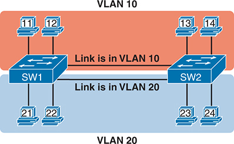


**Figure 8-3** *Multiswitch VLAN Without VLAN Trunking*

Switches S W 1 and S W 2 are segregated into V L A N 10 and V L A N 20. In V L A N 10, P Cs 11 and 12 are connected to S W 1, while P Cs 13 and 14 are connected to S W 2. The inter-switch link between S W 1 and S W 2 operates within V L A N 10. In V L A N 20, P Cs 21 and 22 are connected to S W 1, and P Cs 23 and 24 are connected to S W 2. The link between the switches is established within V L A N 20. This configuration allows for the segmentation of network traffic between the switches without the need for V L A N trunking.

The design shown in [Figure 8-3](vol1_ch08.xhtml#ch08fig03) works, but it simply does not scale very well. It requires one physical link between switches to support every VLAN. If a design needed 10 or 20 VLANs, you would need 10 or 20 links between switches, and you would use 10 or 20 switch ports (on each switch) for those links.

##### VLAN Tagging Concepts

VLAN trunking creates one link between switches that supports as many VLANs as you need. As a VLAN trunk, the switches treat the link as if it were a part of all the VLANs. At the same time, the trunk keeps the VLAN traffic separate, so frames in VLAN 10 would not go to devices in VLAN 20, and vice versa, because each frame is identified by VLAN number as it crosses the trunk. [Figure 8-4](vol1_ch08.xhtml#ch08fig04) shows the idea, with a single physical link between the two switches.

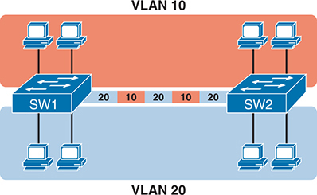


**Figure 8-4** *Multiswitch VLAN with Trunking*

Switches S W 1 and S W 2 are partitioned into V L A N 10 and V L A N 20. In V L A N 10, two users are connected to S W 1, while two more users are connected to S W 2. Similarly, in V L A N 20, two users are connected to S W 1, and two more users are connected to S W 2. The link between the switches operates as a trunk, carrying traffic for both V L A Ns. The trunk configuration is set to allow traffic for V L A Ns 20 and 10 in that order, ensuring proper communication between the switches while maintaining V L A N segregation.

The use of trunking allows switches to forward frames from multiple VLANs over a single physical connection by adding a small header to the Ethernet frame. For example, [Figure 8-5](vol1_ch08.xhtml#ch08fig05) shows PC11 sending a broadcast frame on interface Fa0/1 at Step 1. To flood the frame, switch SW1 needs to forward the broadcast frame to switch SW2. However, SW1 needs to let SW2 know that the frame is part of VLAN 10, so that after the frame is received, SW2 will flood the frame only into VLAN 10, and not into VLAN 20. So, as shown at Step 2, before sending the frame, SW1 adds a VLAN header to the original Ethernet frame, with the VLAN header listing a VLAN ID of 10 in this case.


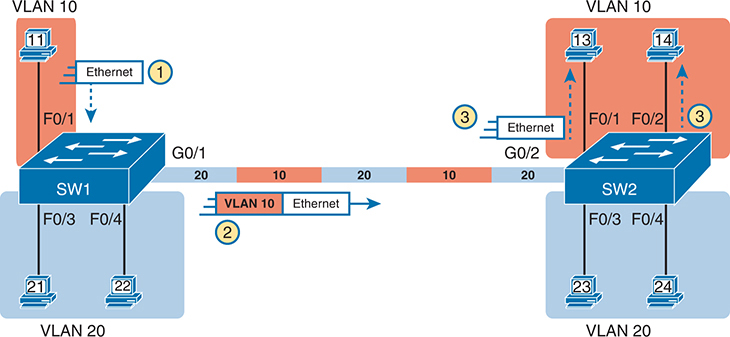


**Figure 8-5** *VLAN Trunking Between Two Switches*

Switches S W 1 and S W 2 are segmented into V L A N 10 and V L A N 20. In V L A N 10, P Cs 11, 21, and 22 are connected to S W 1 via interfaces F a 0/1, F a 0/3, and F a 0/4, respectively. P C 11 sends a broadcast frame on interface F a 0/1 via Ethernet. Before transmission, S W 1 encapsulates the frame with a V L A N header indicating V L A N I D 10. S W 1 connects to S W 2 through interfaces G 0/1 and G 0/22 with a trunk configured for V L A Ns 20 and 10. In V L A N 10, P Cs 13 and 14 are connected to S W 2 via interfaces F a 0/1 and F a 0/2, respectively, while P Cs 23 and 24 are connected to S W 2 via interfaces F a 0/3 and F a 0/4. The link between the switches operates within V L A N 10. In V L A N 20, P Cs 21 and 22 are connected to S W 1. P C 13 sends a broadcast frame on interface F a 0/1 via Ethernet.

When SW2 receives the frame, it understands that the frame is in VLAN 10. SW2 then removes the VLAN header, forwarding the original frame out its interfaces in VLAN 10 (Step 3).

For another example, consider the case when PC21 (in VLAN 20) sends a broadcast. SW1 sends the broadcast out port Fa0/4 (because that port is in VLAN 20) and out Gi0/1 (because it is a trunk, meaning that it supports multiple different VLANs). SW1 adds a trunking header to the frame, listing a VLAN ID of 20. SW2 strips off the trunking header after determining that the frame is part of VLAN 20, so SW2 knows to forward the frame out only ports Fa0/3 and Fa0/4, because they are in VLAN 20, and not out ports Fa0/1 and Fa0/2, because they are in VLAN 10.

##### The 802.1Q and ISL VLAN Trunking Protocols

Cisco has supported two different trunking protocols over the years: Inter-Switch Link (ISL) and IEEE [802.1Q](vol1_gloss.xhtml#gloss_007). Cisco created the ISL years before 802.1Q, in part because the IEEE had not yet defined a VLAN trunking standard. Today, 802.1Q has become the more popular trunking protocol, with Cisco not even bothering to support ISL in many of its switch models today.

While both ISL and 802.1Q tag each frame with the VLAN ID, the details differ. 802.1Q inserts an extra 4-byte 802.1Q VLAN header into the original frame's Ethernet header, as shown at the top of [Figure 8-6](vol1_ch08.xhtml#ch08fig06). As for the fields in the 802.1Q header, only the 12-bit VLAN ID field inside the 802.1Q header matters for topics discussed in this book. This 12-bit field supports a theoretical maximum of 212 (4096) VLANs, but in practice it supports a maximum of 4094. (Both 802.1Q and ISL use 12 bits to tag the VLAN ID, with two reserved values [0 and 4095].)

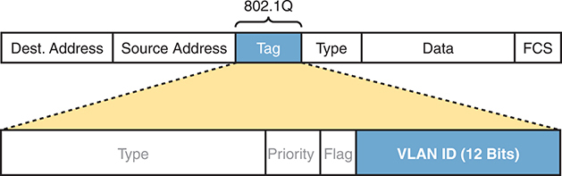


**Figure 8-6** *802.1Q Trunking*

Within the Ethernet frame structure, 802 dot 1 Q introduces a tag inserted between the source address and the type field. This tag consists of four components: Type, Priority, Flag, and V L A N I D (12 Bits). The Type field identifies the frame as an 802 dot 1 Q-tagged frame. Priority allows for the prioritization of frames, while the Flag field is reserved for future use. The V L A N I D, comprising 12 bits, specifies the V L A N to which the frame belongs, enabling the transmission of multiple V L A Ns over the same physical link.

Cisco switches break the range of VLAN IDs (1–4094) into two ranges: the normal range and the extended range. All switches can use normal-range VLANs with values from 1 to 1005. Only some switches can use extended-range VLANs with VLAN IDs from 1006 to 4094. The rules for which switches can use extended-range VLANs depend on the configuration of the VLAN Trunking Protocol ([VTP](vol1_gloss.xhtml#gloss_435)), which is discussed briefly in the section "[VLAN Trunking Configuration](vol1_ch08.xhtml#ch08lev2sec5)," later in this chapter.

802.1Q also defines one special VLAN ID on each trunk as the [native VLAN](vol1_gloss.xhtml#gloss_265) (defaulting to use VLAN 1). In a normally working 802.1Q trunk, both endpoints use trunking, and both use the same native VLAN. Neither end, when sending a frame assigned to this native VLAN, adds the 802.1Q header. Both switches, knowing that untagged frames mean that the frame is part of the native VLAN, treat untagged frames as being part of the native VLAN.

The IEEE included the native VLAN concept for cases in which one device operates as a trunk while the other side does not. The nontrunking endpoint may do so temporarily or permanently (typically because of misconfiguration or a lack of 802.1Q support). In such cases, the nontrunking device will be confused and discard any received frames that contain a trunking header. However, when the trunking side sends frames as part of the native VLAN—untagged—the nontrunking side will understand the frame and consider it to be part of the access VLAN assigned to the interface. So, the native VLAN gives engineers a tool to allow for cases of making one VLAN work over the link, even when some trunking issue might exist.

#### Forwarding Data Between VLANs

If you create a campus LAN that contains many VLANs, you typically still need all devices to be able to send data to all other devices. This next topic discusses some concepts about how to route data between those VLANs.

##### The Need for Routing Between VLANs

LAN switches that forward data based on Layer 2 logic, as discussed so far in this book, often go by the name *Layer 2 switch*. For example, [Chapter 5](vol1_ch05.xhtml#ch05), "[Analyzing Ethernet LAN Switching](vol1_ch05.xhtml#ch05)," discussed how LAN switches receive Ethernet frames (a Layer 2 concept), look at the destination Ethernet MAC address (a Layer 2 address), and forward the Ethernet frame out some other interface. All those concepts are defined by Layer 2 protocols, hence the name Layer 2 switch.

Layer 2 switches perform their logic per VLAN. For example, in [Figure 8-7](vol1_ch08.xhtml#ch08fig07), the two PCs on the left sit in VLAN 10, in subnet 10. The two PCs on the right sit in a different VLAN (20), with a different subnet (20). Note that the figure repeats earlier [Figure 8-2](vol1_ch08.xhtml#ch08fig02), but with the switch broken into halves, to emphasize the point that Layer 2 switches will not forward data between two VLANs.

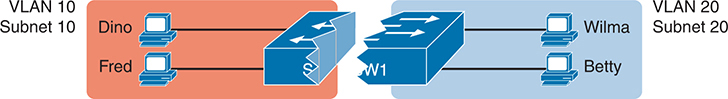


**Figure 8-7** *Layer 2 Switch Does Not Route Between the VLANs*

Switch S W 1 is divided into two halves. The first half accommodates users Dino and Fred, who are assigned to V L A N 10 with a subnet of 10. The second half accommodates users Wilma and Betty, who are assigned to V L A N 20 with a subnet of 20. Both halves connect to a broken switch. As a Layer 2 device, S W 1 operates at the data link layer and does not perform routing between the V L A Ns, limiting communication between users in different V L A Ns unless routed by a Layer 3 device.

As shown in the figure, when configured with some ports in VLAN 10 and others in VLAN 20, the switch acts like two separate switches in which it will forward traffic. In fact, one goal of VLANs is to separate traffic in one VLAN from another, preventing frames in one VLAN from leaking over to other VLANs. For example, when Dino (in VLAN 10) sends any Ethernet frame, if SW1 is a Layer 2 switch, that switch will not forward the frame to the PCs on the right in VLAN 20.

##### Routing Packets Between VLANs with a Router

When VLANs are included in a campus LAN design, the devices in a VLAN need to be in the same subnet. Following the same design logic, devices in different VLANs need to be in different subnets.

To forward packets between VLANs, the network must use a device that acts as a router. You can use an actual router or use a switch that can perform some functions like a router. These switches that also perform Layer 3 routing functions go by the name *multilayer switch* or [Layer 3 switch](vol1_gloss.xhtml#gloss_227). This section first discusses how to forward data between VLANs when using Layer 2 switches and ends with a brief discussion of how to use Layer 3 switches.

For example, [Figure 8-8](vol1_ch08.xhtml#ch08fig08) shows a router that can route packets between subnets 10 and 20. The figure shows the same Layer 2 switch as shown in [Figure 8-7](vol1_ch08.xhtml#ch08fig07), with the same perspective of the switch being split into parts with two different VLANs, and with the same PCs in the same VLANs and subnets. Now Router R1 has one LAN physical interface connected to the switch and assigned to VLAN 10, and a second physical interface connected to the switch and assigned to VLAN 20. With an interface connected to each subnet, the Layer 2 switch can keep doing its job—forwarding frames inside a VLAN, while the router can do its job—routing IP packets between the subnets.

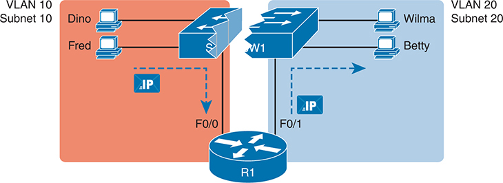


**Figure 8-8** *Routing Between Two VLANs on Two Physical Interfaces*

Switch S W 1 is divided into two halves. The first half hosts users Dino and Fred, assigned to V L A N 10 with a subnet of 10. The second half accommodates users Wilma and Betty, who belong to V L A N 20 with a subnet of 20. Both halves of S W 1 are connected to router R 1. The first half is connected to R 1 through interface Fast Ethernet 0/0, while the second half is connected to R 1 through interface Fast Ethernet 0/1. This setup allows for routing between the V L A Ns using router R 1, enabling communication between users in V L A N 10 and V L A N 20.

The figure shows an IP packet being routed from Fred, which sits in one VLAN/subnet, to Betty, which sits in the other. The Layer 2 switch forwards two different Layer 2 Ethernet frames: one in VLAN 10, from Fred to R1's F0/0 interface, and the other in VLAN 20, from R1's F0/1 interface to Betty. From a Layer 3 perspective, Fred sends the IP packet to its default router (R1), and R1 routes the packet out another interface (F0/1) into another subnet where Betty resides.

The design in [Figure 8-8](vol1_ch08.xhtml#ch08fig08) works, but there are several different solutions for routing packets between VLANs. This chapter shows the option of using a separate physical router, with a separate link per VLAN, because it can be the easiest of the options to understand and visualize. [Chapter 18](vol1_ch18.xhtml#ch18), "[IP Routing in the LAN](vol1_ch18.xhtml#ch18)," works through those other features for routing packets between VLANs.

### VLAN and VLAN Trunking Configuration and Verification

Cisco switches do not require any configuration to work. You can purchase Cisco switches, install devices with the correct cabling, turn on the switches, and they work. You would never need to configure the switch, and it would work fine, even if you interconnected switches, until you needed more than one VLAN. But if you want to use VLANs—and most enterprise networks do—you need to add some configuration.

This chapter separates the VLAN configuration details into two major sections. The first section looks at how to configure *static access interfaces*—switch interfaces configured to be in one VLAN only, therefore not using VLAN trunking. The second part shows how to configure interfaces that do use VLAN trunking.

#### Creating VLANs and Assigning Access VLANs to an Interface

This section shows how to create a VLAN, give the VLAN a name, and assign interfaces to a VLAN. To focus on these basic details, this section shows examples using a single switch, so VLAN trunking is not needed.

For a Cisco switch to forward frames in a particular VLAN, the switch must be configured to believe that the VLAN exists. In addition, the switch must have nontrunking interfaces (called [access interfaces](vol1_gloss.xhtml#gloss_011) or [static access interfaces](vol1_gloss.xhtml#gloss_377)) assigned to the VLAN and/or trunks that support the VLAN. The configuration steps for access interfaces are as follows:


Step 1. To configure a new VLAN, follow these steps:

1. From configuration mode, use the **vlan** *vlan-id* command in global configuration mode to create the VLAN and to move the user into VLAN configuration mode.
2. (Optional) Use the **name** *name* command in VLAN configuration mode to list a name for the VLAN. If not configured, the VLAN name is VLAN*ZZZZ*, where *ZZZZ* is the four-digit decimal VLAN ID.

Step 2. For each access interface, follow these steps:

1. Use the **interface** *type number* command in global configuration mode to move into interface configuration mode for each desired interface.
2. Use the **switchport access vlan** *id-number* command in interface configuration mode to specify the VLAN number associated with that interface.
3. (Optional) Use the **switchport mode access** command in interface configuration mode to make this port always operate in access mode (that is, to not trunk).

While the list might look a little daunting, the process on a single switch is actually pretty simple. For example, if you want to put the switch's ports in three VLANs—11, 12, and 13—you first add three **vlan** commands: **vlan 11**, **vlan 12**, and **vlan 13**. Then, for each interface, add a **switchport access vlan 11** (or **12** or **13**) command to assign that interface to the proper VLAN.

Note

The term [default VLAN](vol1_gloss.xhtml#gloss_093) (as shown in the exam topics) refers to the default setting on the **switchport access vlan** *vlan-id* command, and that default is VLAN ID 1. In other words, by default, each port is assigned to access VLAN 1.

##### VLAN Configuration Example 1: Full VLAN Configuration

[Examples 8-1](vol1_ch08.xhtml#exa8_1), [8-2](vol1_ch08.xhtml#exa8_2), and [8-3](vol1_ch08.xhtml#exa8_3) work through one scenario with VLAN configuration and verification. To begin, [Example 8-1](vol1_ch08.xhtml#exa8_1) begins by showing the VLANs in switch SW1 in [Figure 8-9](vol1_ch08.xhtml#ch08fig09), with all default settings related to VLANs.

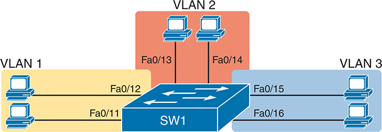


**Figure 8-9** *Network with One Switch and Three VLANs*

In V L A N 1, two P Cs are connected to switch S W 1 via interfaces Fast Ethernet 0/12 and Fast Ethernet 0/11. In V L A N 2, two P Cs connect to S W 1 through interfaces Fast Ethernet 0/13 and Fast Ethernet 0/14. Similarly, in V L A N 3, two P Cs are connected to S W 1 via interfaces Fast Ethernet 0/15 and Fast Ethernet 0/16. This setup effectively segregates network traffic into three distinct V L A Ns, enabling separate communication paths for devices within each V L A N.

**Example 8-1** *Configuring VLANs and Assigning VLANs to Interfaces*

[Click here to view code image](vol1_ch08_images.xhtml#f0198-01)

```
SW1# show vlan brief
VLAN Name                             Status     Ports
---- -------------------------------- --------- -------------------------------
1    default                           active    Fa0/1, Fa0/2, Fa0/3, Fa0/4
                                                 Fa0/5, Fa0/6, Fa0/7, Fa0/8
                                                 Fa0/9, Fa0/10, Fa0/11, Fa0/12
                                                 Fa0/13, Fa0/14, Fa0/15, Fa0/16
                                                 Fa0/17, Fa0/18, Fa0/19, Fa0/20
                                                 Fa0/21, Fa0/22, Fa0/23, Fa0/24
                                                 Gi0/1, Gi0/2
1002 fddi-default                      act/unsup
1003 token-ring-default                act/unsup
1004 fddinet-default                   act/unsup
1005 trnet-default                     act/unsup
```

The example begins with the **show vlan brief** command, confirming the default settings of five nondeletable VLANs, with all interfaces assigned to VLAN 1. VLAN 1 cannot be deleted but can be used. VLANs 1002–1005 cannot be deleted and cannot be used as access VLANs today. In particular, note that this switch has 24 Fast Ethernet ports (Fa0/1–Fa0/24) and two Gigabit Ethernet ports (Gi0/1 and Gi0/2), all of which are listed as being in VLAN 1 per that first command's output, confirming that by default, Cisco switches assign all ports to VLAN 1.

Next, [Example 8-2](vol1_ch08.xhtml#exa8_2) shows steps that mirror the VLAN configuration checklist, namely the configuration of VLAN 2, plus the assignment of VLAN 2 as the access VLAN on two ports: Fa0/13 and Fa0/14.

**Example 8-2** *Configuring VLANs and Assigning VLANs to Interfaces*

[Click here to view code image](vol1_ch08_images.xhtml#f0199-01)

```
SW1# configure terminal
Enter configuration commands, one per line. End with CNTL/Z.
SW1(config)# vlan 2
SW1(config-vlan)# name Freds-vlan
SW1(config-vlan)# exit
SW1(config)# interface range fastethernet 0/13 - 14
SW1(config-if)# switchport access vlan 2
SW1(config-if)# switchport mode access
SW1(config-if)# end

SW1# show vlan brief

VLAN Name                             Status    Ports
---- -------------------------------- --------- -------------------------------
1    default                          active    Fa0/1, Fa0/2, Fa0/3, Fa0/4
                                                Fa0/5, Fa0/6, Fa0/7, Fa0/8
                                                Fa0/9, Fa0/10, Fa0/11, Fa0/12
                                                Fa0/15, Fa0/16, Fa0/17, Fa0/18
                                                Fa0/19, Fa0/20, Fa0/21, Fa0/22
                                                Fa0/23, Fa0/24, Gi0/1, Gi0/2
2    Freds-vlan                       active    Fa0/13, Fa0/14
1002 fddi-default                  act/unsup
1003 token-ring-default            act/unsup
1004 fddinet-default               act/unsup
1005 trnet-default                 act/unsup
```

Take a moment to compare the output of the **show vlan brief** commands in [Example 8-2](vol1_ch08.xhtml#exa8_2) (after adding the configuration) versus [Example 8-1](vol1_ch08.xhtml#exa8_1). [Example 8-2](vol1_ch08.xhtml#exa8_2) shows new information about VLAN 2, with ports Fa0/13 and Fa0/14 no longer being listed with VLAN 1, but now listed as assigned to VLAN 2.

To complete this scenario, [Example 8-3](vol1_ch08.xhtml#exa8_3) shows a little more detail about the VLAN itself. First, the **show running-config** command lists both the **vlan 2** and **switchport access vlan 2** commands as configured in [Example 8-2](vol1_ch08.xhtml#exa8_2). Also, note that earlier [Example 8-2](vol1_ch08.xhtml#exa8_2) uses the **interface range** command, with one instance of the **switchport access vlan 2** interface subcommand. However, [Example 8-3](vol1_ch08.xhtml#exa8_3) shows how the switch actually applied that command to both Fa0/13 and Fa0/14. [Example 8-3](vol1_ch08.xhtml#exa8_3) ends with the **show vlan id 2** command, which confirms the operational status that ports Fa0/13 and Fa0/14 are assigned to VLAN 2.

**Example 8-3** *Configuring VLANs and Assigning VLANs to Interfaces*

[Click here to view code image](vol1_ch08_images.xhtml#f0200-01)

```
SW1# show running-config
! Many lines omitted for brevity
! Early in the output:
vlan 2
 name Freds-vlan
!
! more lines omitted for brevity
interface FastEthernet0/13
 switchport access vlan 2
 switchport mode access
!
interface FastEthernet0/14
 switchport access vlan 2
 switchport mode access
!

SW1# show vlan id 2
VLAN Name                             Status     Ports
---- -------------------------------- --------- -------------------------------
2    Freds-vlan                       active     Fa0/13, Fa0/14

VLAN Type  SAID       MTU   Parent RingNo BridgeNo Stp  BrdgMode Trans1 Trans2
---- ----- ---------- ----- ------ ------ -------- ---- -------- ------ ------
2    enet  100010     1500  -      -       -       -    -        0      0

Remote SPAN VLAN
----------------
Disabled

Primary Secondary Type              Ports
------- --------- ----------------- ------------------------------------------
```

The example surrounding [Figure 8-9](vol1_ch08.xhtml#ch08fig09) uses six switch ports, all of which need to operate as access ports. That is, each port should not use trunking but instead should be assigned to a single VLAN, as assigned by the **switchport access vlan** *vlan-id* command. For ports that should always act as access ports, add the optional interface subcommand **switchport mode access**. This command tells the switch to always be an access interface and disables the protocol that negotiates trunking (Dynamic Trunking Protocol [DTP]) with the device on the other end of the link. (The upcoming section "[VLAN Trunking Configuration](vol1_ch08.xhtml#ch08lev2sec5)" discusses more details about the commands that allow a port to negotiate whether it should use trunking.)

Note

The companion website for this book includes a video that works through a different VLAN configuration example.

##### VLAN Configuration Example 2: Shorter VLAN Configuration

[Example 8-2](vol1_ch08.xhtml#exa8_2) shows how to configure a VLAN and add two ports to the VLAN as access ports. [Example 8-4](vol1_ch08.xhtml#exa8_4) does the same, this time with VLAN 3, and this time with a much briefer alternative configuration. The configuration completes the configuration of the design shown in [Figure 8-9](vol1_ch08.xhtml#ch08fig09), by adding two ports to VLAN 3.

**Example 8-4** *Shorter VLAN Configuration Example (VLAN 3)*

[Click here to view code image](vol1_ch08_images.xhtml#f0201-01)

```
SW1# configure terminal
Enter configuration commands, one per line. End with CNTL/Z.
SW1(config)# interface range Fastethernet 0/15 - 16
SW1(config-if-range)# switchport access vlan 3
% Access VLAN does not exist. Creating vlan 3
SW1(config-if-range)# ^Z

SW1# show vlan brief

VLAN Name                             Status     Ports
---- -------------------------------- --------- -------------------------------
1 default                          active      Fa0/1, Fa0/2, Fa0/3, Fa0/4
                                               Fa0/5, Fa0/6, Fa0/7, Fa0/8
                                               Fa0/9, Fa0/10, Fa0/11, Fa0/12
                                               Fa0/17, Fa0/18, Fa0/19, Fa0/20
                                               Fa0/21, Fa0/22, Fa0/23, Fa0/24
                                               Gi0/1, Gi0/2
2 Freds-vlan                      active      Fa0/13, Fa0/14
3 VLAN0003                        active      Fa0/15, Fa0/16
1002 fddi-default                 act/unsup
1003 token-ring-default           act/unsup
1004 fddinet-default              act/unsup
1005 trnet-default                act/unsup
```

[Example 8-4](vol1_ch08.xhtml#exa8_4) shows how a switch can dynamically create a VLAN—the equivalent of the **vlan** *vlan-id* global config command—when the **switchport access vlan** interface subcommand refers to a currently unconfigured VLAN. This example begins with SW1 not knowing about VLAN 3. With the addition of the **switchport access vlan 3** interface subcommand, the switch realized that VLAN 3 did not exist, and as noted in the shaded message in the example, the switch created VLAN 3, using a default name (VLAN0003). The engineer did not need to type the **vlan 3** global command to create VLAN 3; the switch did that automatically. No other steps are required to create the VLAN. At the end of the process, VLAN 3 exists in the switch, and interfaces Fa0/15 and Fa0/16 are in VLAN 3, as noted in the shaded part of the **show vlan brief** command output.

#### VLAN Trunking Protocol

Before showing more configuration examples, you also need to know something about a Cisco protocol and tool called the VLAN Trunking Protocol (VTP). VTP is a Cisco proprietary tool on Cisco switches that advertises each VLAN configured in one switch (with the **vlan** *number* command) so that all the other switches in the campus learn about that VLAN.

This book does not discuss VTP as an end to itself for a few different reasons. First, the current CCNA 200-301 exam blueprint ignores VTP, as do the CCNP Enterprise Core and CCNP Enterprise Advanced Routing blueprints. Additionally, many enterprises choose to disable VTP.

Also, you can easily disable VTP so that it has no impact on your switches in the lab, which is exactly what I did when building all the examples in this book.

However, VTP has some small impact on how every Cisco Catalyst switch works, even if you avoid using VTP. This brief section introduces enough details of VTP so that you can understand the impact of VTP in a Cisco Catalyst switch.

First, all examples in this book (and in Volume 2) use switches that disable VTP in some way. Interestingly, for much of VTP's decades of existence, most switches did support an option to completely disable VTP. Instead, to effectively disable VTP, the engineer would set the switch to use [VTP transparent mode](vol1_gloss.xhtml#gloss_439) (with the **vtp mode transparent** global command). Many newer switches now have an option to disable VTP completely with the **vtp mode off** global command. For the purposes of this book, configuring a switch with either transparent mode or off mode disables VTP.

Note that both transparent and off modes prevent VTP from learning and advertising about VLAN configuration. Those modes allow a switch to configure all VLANs, including standard- and extended-range VLANs. Additionally, switches using transparent or off modes list the **vlan** configuration commands in the running-config file.

In contrast, switches in VTP server or client mode behave differently. Just in case you do lab exercises with real switches or with simulators, and you see unusual results with VLANs, check the VTP status with the **show vtp status** command. If your switch uses VTP server or client mode, you will find

* The server switches can configure VLANs in the standard range only (1–1005).
* The client switches cannot configure VLANs.
* Both servers and clients may be learning new VLANs from other switches and seeing their VLANs deleted by other switches because of VTP.
* The **show running-config** command does not list any **vlan** commands; you must use other **show** commands to find out about the configured VLANs.

If possible in the lab, disable VTP for your switch configuration practice until you decide to learn more about VTP for other purposes.

Note

Do not change VTP settings on any switch that also connects to the production network until you know how VTP works and you talk with experienced colleagues. Doing so can cause real harm to your LAN. For example, if the switch you configure connects to other switches, which in turn connect to switches used in the production LAN, you could accidentally change the VLAN configuration in other switches with serious impact to the operation of the network. You could delete VLANs and cause outages. Be careful and never experiment with VTP settings on a switch unless it and the other switches connected to it have absolutely no physical links connected to the production LAN.

#### VLAN Trunking Configuration

Trunking configuration between two Cisco switches can be simple if you just statically configure trunking. You could literally add one interface subcommand for the switch interface on each side of the link (**switchport mode trunk**), and you would create a VLAN trunk that supported all the VLANs known to each switch.

However, trunking configuration on Cisco switches includes many more options, including several options for dynamically negotiating various trunking settings. The configuration can either predefine different settings or tell the switch to negotiate the settings, as follows:

* **The type of trunking:** IEEE 802.1Q, ISL, or negotiate which one to use, on switches that support both types of trunking.
* **The administrative mode:** Whether to always trunk, always not trunk, or negotiate whether to trunk or not.

First, consider the type of trunking. For many years, Cisco has not bothered to include ISL support in new switch product families, preferring IEEE 802.1Q. On older switches that support both, use the **switchport trunk encapsulation** {**dot1q** | **isl** | **negotiate**} interface subcommand to either configure the type to use or to allow Dynamic Trunking Protocol (DTP) to negotiate the type (which prefers ISL if both support it).

DTP can also negotiate whether the two devices on the link agree to trunk at all, as guided by the local switch port's administrative mode. The [administrative mode](vol1_gloss.xhtml#gloss_415) refers to the configuration setting for whether trunking should be used. Cisco switches use the **switchport mode** interface subcommand to define the administrative trunking mode, as listed in [Table 8-2](vol1_ch08.xhtml#ch08tab02). The switch interface's [operational mode](vol1_gloss.xhtml#gloss_416) shows whether the interface operates as a trunk or an access port, which depends on the configuration on both switches plus other factors.


**Table 8-2** Trunking Administrative Mode Options with the **switchport mode** Command

| Command Option | Description |
| --- | --- |
| **access** | Always act as an access (nontrunk) port |
| **trunk** | Always act as a trunk port |
| **dynamic desirable** | Initiates negotiation messages and responds to negotiation messages to dynamically choose whether to start using trunking |
| **dynamic auto** | Passively waits to receive trunk negotiation messages, at which point the switch will respond and negotiate whether to use trunking |

For example, consider the two switches shown in [Figure 8-10](vol1_ch08.xhtml#ch08fig10). This figure expands the design shown earlier in [Figure 8-9](vol1_ch08.xhtml#ch08fig09), with a trunk to a new switch (SW2) and with parts of VLANs 1 and 3 on ports attached to SW2. The two switches use a Gigabit Ethernet link for the trunk. In this case, the trunk does not dynamically form by default because both switches default to an administrative mode of *dynamic auto*, meaning that neither switch initiates the trunk negotiation process. When one switch is changed to use *dynamic desirable* mode, which does initiate the negotiation, the switches negotiate to use trunking, specifically 802.1Q because the switches support only 802.1Q.

[Example 8-5](vol1_ch08.xhtml#exa8_5) begins with SW1 configured as shown in [Examples 8-2](vol1_ch08.xhtml#exa8_2) and [8-4](vol1_ch08.xhtml#exa8_4); that is, SW1 has two ports each assigned to VLANs 1, 2, and 3. However, both SW1 and SW2 currently have all default settings on the interfaces that connect the two switches. With the default setting of **switchport mode dynamic auto**, the two switches do not trunk.

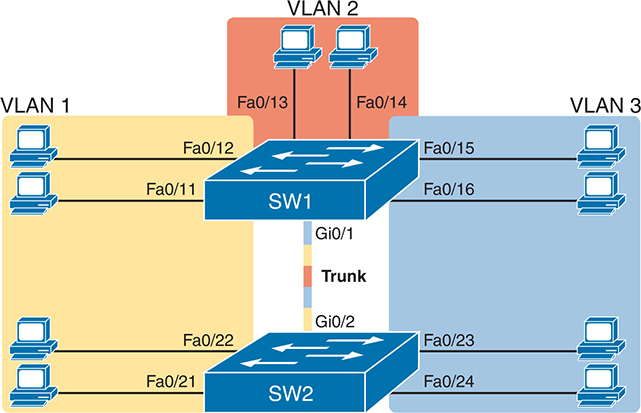


**Figure 8-10** *Network with Two Switches and Three VLANs*

In V L A N 1, two P Cs are connected to switch S W 1 via interfaces Fast Ethernet 0/12 and Fast Ethernet 0/11, while two other P Cs connect to switch S W 2 through interfaces Fast Ethernet 0/22 and Fast Ethernet 0/21. In V L A N 2, two P Cs connect to S W 1 through interfaces Fast Ethernet 0/13 and Fast Ethernet 0/14. In V L A N 3, two P Cs are connected to S W 1 via interfaces Fast Ethernet 0/15 and Fast Ethernet 0/16, while two additional P Cs connect to S W 2 through interfaces Fast Ethernet 0/23 and Fast Ethernet 0/24. S W 1 is connected to S W 2 via trunk interfaces Gigabit Ethernet 0/1 and Gigabit Ethernet 0/2, facilitating communication between the switches and V L A Ns.

**Example 8-5** *Initial (Default) State: Not Trunking Between SW1 and SW2*

[Click here to view code image](vol1_ch08_images.xhtml#f0204-01)

```
SW1# show interfaces gigabit 0/1 switchport
Name: Gi0/1
Switchport: Enabled
Administrative Mode: dynamic auto
Operational Mode: static access
Administrative Trunking Encapsulation: dot1q
Operational Trunking Encapsulation: native
Negotiation of Trunking: On
Access Mode VLAN: 1 (default)
Trunking Native Mode VLAN: 1 (default)
Administrative Native VLAN tagging: enabled
Voice VLAN: none
Access Mode VLAN: 1 (default)
Trunking Native Mode VLAN: 1 (default)
Administrative Native VLAN tagging: enabled
Voice VLAN: none
Administrative private-vlan host-association: none
Administrative private-vlan mapping: none
Administrative private-vlan trunk native VLAN: none
Administrative private-vlan trunk Native VLAN tagging: enabled
Administrative private-vlan trunk encapsulation: dot1q
Administrative private-vlan trunk normal VLANs: none
Administrative private-vlan trunk private VLANs: none
Operational private-vlan: none
Trunking VLANs Enabled: ALL
Pruning VLANs Enabled: 2-1001
Capture Mode Disabled
Capture VLANs Allowed: ALL

Protected: false
Unknown unicast blocked: disabled
Unknown multicast blocked: disabled
Appliance trust: none

! Note that the next command results in a single empty line of output.
SW1# show interfaces trunk
SW1#
```

First, focus on the highlighted items from the output of the **show interfaces switchport** command at the beginning of [Example 8-5](vol1_ch08.xhtml#exa8_5). The output lists the default administrative mode setting of dynamic auto. Because SW2 also defaults to dynamic auto, the command lists SW1's operational status as "access," meaning that it is not trunking. ("Dynamic auto" tells both switches to sit there and wait on the other switch to start the negotiations.) The third shaded line points out the only supported type of trunking (802.1Q). (On a switch that supports both ISL and 802.1Q, this value would by default list "negotiate," to mean that the type of encapsulation is negotiated.) Finally, the operational trunking type is listed as "native," which is a reference to the 802.1Q native VLAN.

The end of the example shows the output of the **show interfaces trunk** command, but with no output. This command lists information about all interfaces that currently operationally trunk; that is, it lists interfaces that currently use VLAN trunking. With no interfaces listed, this command also confirms that the link between switches is not trunking.

Next, consider [Example 8-6](vol1_ch08.xhtml#exa8_6), which shows the new configuration that enables trunking. In this case, SW1 is configured with the **switchport mode dynamic desirable** command, which asks the switch to both negotiate as well as to begin the negotiation process, rather than waiting on the other device. The example shows that as soon as the command is issued, log messages appear showing that the interface goes down and then back up again, which happens when the interface transitions from access mode to trunk mode.

**Example 8-6** *SW1 Changes from Dynamic Auto to Dynamic Desirable*

[Click here to view code image](vol1_ch08_images.xhtml#f0205-01)

```
SW1# configure terminal
Enter configuration commands, one per line. End with CNTL/Z.
SW1(config)# interface gigabit 0/1
SW1(config-if)# switchport mode dynamic desirable
SW1(config-if)# ^Z
SW1#
%LINEPROTO-5-UPDOWN: Line protocol on Interface GigabitEthernet0/1, changed state to
down
%LINEPROTO-5-UPDOWN: Line protocol on Interface GigabitEthernet0/1, changed state to
up
SW1# show interfaces gigabit 0/1 switchport
Name: Gi0/1
Switchport: Enabled
Administrative Mode: dynamic desirable
Operational Mode: trunk
Administrative Trunking Encapsulation: dot1q
Operational Trunking Encapsulation: dot1q
Negotiation of Trunking: On
Access Mode VLAN: 1 (default)
Trunking Native Mode VLAN: 1 (default)
! lines omitted for brevity
```

[Example 8-6](vol1_ch08.xhtml#exa8_6) repeats the **show interfaces gi0/1 switchport** command seen in [Example 8-5](vol1_ch08.xhtml#exa8_5), but after configuring VLAN trunking, so this time the output shows that SW1's G0/1 interface now operates as a trunk. Note that the command still lists the administrative settings, which denote the configured values along with the operational settings, which list what the switch is currently doing. SW1 now claims to be in an operational mode of *trunk*, with an operational trunking encapsulation of dot1Q.

[Example 8-7](vol1_ch08.xhtml#exa8_7) now repeats the same **show interfaces trunk** command that showed no output at all back in [Example 8-5](vol1_ch08.xhtml#exa8_5). Now that SW1 trunks on its G0/1 port, the output in [Example 8-7](vol1_ch08.xhtml#exa8_7) lists G0/1, confirming that G0/1 is now operationally trunking. The next section discusses the meaning of the output of this command. Also, note that the end of the example repeats the **show vlan id 2** command; of note, it includes the trunk port G0/1 in the output because the trunk port can forward traffic in VLAN 2.

**Example 8-7** *A Closer Look at SW1's G0/1 Trunk Port*

[Click here to view code image](vol1_ch08_images.xhtml#f0206-01)

```
SW1# show interfaces trunk

Port        Mode             Encapsulation  Status        Native vlan
Gi0/1       desirable        802.1q         trunking      1

Port        Vlans allowed on trunk
Gi0/1       1-4094

Port        Vlans allowed and active in management domain
Gi0/1       1-3

Port        Vlans in spanning tree forwarding state and not pruned
Gi0/1       1-3

SW1# show vlan id 2
VLAN Name                             Status    Ports
---- -------------------------------- --------- -------------------------------
2    Freds-vlan                       active    Fa0/13, Fa0/14, G0/1

VLAN Type  SAID       MTU   Parent RingNo BridgeNo Stp  BrdgMode Trans1 Trans2
---- ----- ---------- ----- ------ ------ -------- ---- -------- ------ ------
2    enet  100010     1500  -      -      -        -    -        0      0

Remote SPAN VLAN
----------------

Disabled
Primary Secondary Type              Ports
------- --------- ----------------- ------------------------------------------
```

For the exams, you should be ready to interpret the output of the **show interfaces switchport** command, realize the administrative mode implied by the output, and know whether the link should operationally trunk based on those settings. [Table 8-3](vol1_ch08.xhtml#ch08tab03) lists the combinations of the trunking administrative modes and the expected operational mode (trunk or access) resulting from the configured settings. The table lists the administrative mode used on one end of the link on the left and the administrative mode on the switch on the other end of the link across the top of the table.


**Table 8-3** Expected Trunking Operational Mode Based on the Configured Administrative Modes

| Administrative Mode | Access | Dynamic Auto | Trunk | Dynamic Desirable |
| --- | --- | --- | --- | --- |
| **access** | Access | Access | Do Not Use[\*](vol1_ch08.xhtml#tfn8_3a) | Access |
| **dynamic auto** | Access | Access | Trunk | Trunk |
| **trunk** | Do Not Use[\*](vol1_ch08.xhtml#tfn8_3a) | Trunk | Trunk | Trunk |
| **dynamic desirable** | Access | Trunk | Trunk | Trunk |

[\*](vol1_ch08.xhtml#tfn8_3) When two switches configure a mode of "access" on one end and "trunk" on the other, problems occur. Avoid this combination.

Finally, before we leave the discussion of configuring trunks, Cisco recommends disabling trunk negotiation on most ports for better security. The majority of switch ports on most switches will be used to connect to users and configured with the command **switchport mode access**, which also disables DTP. For ports without the **switchport mode access** command—for instance, ports statically configured to trunk with the **switchport mode trunk** command—DTP still operates, but you can disable DTP negotiations altogether using the **switchport nonegotiate** interface subcommand.

#### Implementing Interfaces Connected to Phones

This next topic is strange, at least in the context of access links and trunk links. In the world of IP telephony, telephones use Ethernet ports to connect to an Ethernet network so they can use IP to send and receive voice traffic sent via IP packets. To make that work, the switch's Ethernet port acts like an access port, but at the same time, the port acts like a trunk in some ways. This last topic of the chapter works through those main concepts.

##### Data and Voice VLAN Concepts

Before IP telephony, a PC could sit on the same desk as a phone. The phone happened to use UTP cabling, with that phone connected to some voice device (often called a *voice switch* or a *private branch exchange [PBX]*). The PC, of course, connected using a unshielded twisted-pair (UTP) cable to the usual LAN switch that sat in the wiring closet—sometimes in the same wiring closet as the voice switch. [Figure 8-11](vol1_ch08.xhtml#ch08fig11) shows the idea.

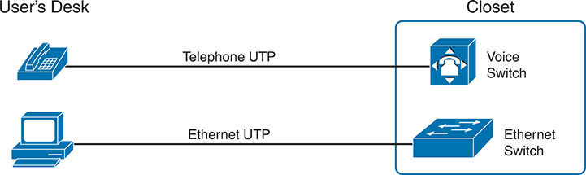


**Figure 8-11** *Before IP Telephony: PC and Phone, One Cable Each, Connect to Two Different Devices*

A telephone on the user's desk is connected to the voice switch in the closet through a telephone unshielded twisted pair (U T P) cable. A computer on the user's desk is connected to the Ethernet switch in the closet through an Ethernet U T P cable.

The term *IP telephony* refers to the branch of networking in which the telephones use IP packets to send and receive voice as represented by the bits in the data portion of the IP packet. The phones connect to the network like most other end-user devices, using either Ethernet or Wi-Fi. These new IP phones did not connect via cable directly to a voice switch, instead connecting to the IP network using an Ethernet cable and an Ethernet port built in to the phone. The phones then communicated over the IP network with software that replaced the call setup and other functions of the PBX. (The current products from Cisco that perform this IP telephony control function are called *Cisco Unified Communication Manager*.)

The migration from using the already-installed telephone cabling to these new IP phones that needed UTP cables that supported Ethernet caused some problems in some offices. In particular:

* The older non-IP phones used a category of UTP cabling that often did not support 100-Mbps or 1000-Mbps Ethernet.
* Most offices had a single UTP cable running from the wiring closet to each desk, but now two devices (the PC and the new IP phone) both needed a cable from the desktop to the wiring closet.
* Installing a new cable to every desk would be expensive; plus you would need more switch ports.

To solve this problem, Cisco embedded small three-port switches into each phone.

IP telephones have included a small LAN switch, on the underside of the phone, since the earliest IP telephone products. [Figure 8-12](vol1_ch08.xhtml#ch08fig12) shows the basic cabling, with the wiring closet cable connecting to one physical port on the embedded switch, the PC connecting with a short patch cable to the other physical port, and the phone's internal CPU connecting to an internal switch port.


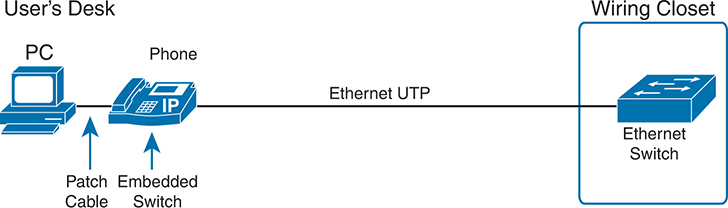


**Figure 8-12** *Cabling with an IP Phone, a Single Cable, and an Integrated Switch*

The P C is connected to the I P phone through a patch cable. The phone has an embedded switch. The phone connects to an Ethernet switch in the wiring closet through an Ethernet U T P.

Sites that use IP telephony, which includes most every company today, now have two devices off each access port. In addition, Cisco best practices for IP telephony design tell us to put the phones in one VLAN and the PCs in a different VLAN. To make that happen, the switch port acts a little like an access link (for the PC's traffic) and a little like a trunk (for the phone's traffic). The configuration defines two VLANs on that port, as follows:


**Data VLAN:** Same idea and configuration as the access VLAN on an access port but defined as the VLAN on that link for forwarding the traffic for the device connected to the phone on the desk (typically the user's PC).

**Voice VLAN:** The VLAN defined on the link for forwarding the phone's traffic. Traffic in this VLAN is typically tagged with an 802.1Q header.

[Figure 8-13](vol1_ch08.xhtml#ch08fig13) illustrates this design with two VLANs on access ports that support IP telephones.

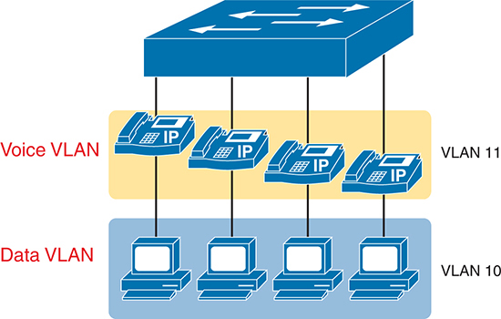


**Figure 8-13** *A LAN Design, with Data in VLAN 10 and Phones in VLAN 11*

##### Data and Voice VLAN Configuration and Verification

Configuring a switch port to support IP phones, once you know the planned voice and data VLAN IDs, requires just a few easy commands. Making sense of the **show** commands once it is configured, however, can be a challenge. The port acts like an access port in many ways. However, with most configuration options, the voice frames flow with an 802.1Q header so that the link supports frames in both VLANs on the link. But that makes for some different **show** command output.

[Example 8-8](vol1_ch08.xhtml#exa8_8) shows an example configuration. In this case, all four switch ports F0/1–F0/4 begin with a default configuration. The configuration adds the new data and [voice VLANs](vol1_gloss.xhtml#gloss_436). The example then configures all four ports as access ports and defines the access VLAN, which is also called the [data VLAN](vol1_gloss.xhtml#gloss_084) when discussing IP telephony. Finally, the configuration includes the **switchport voice vlan 11** command, which defines the voice VLAN used on the port. The example matches [Figure 8-13](vol1_ch08.xhtml#ch08fig13), using ports F0/1–F0/4.

**Example 8-8** *Configuring the Voice and Data VLAN on Ports Connected to Phones*

[Click here to view code image](vol1_ch08_images.xhtml#f0210-01)

```
SW1# configure terminal
Enter configuration commands, one per line. End with CNTL/Z.
SW1(config)# vlan 10
SW1(config-vlan)# vlan 11
SW1(config-vlan)# interface range FastEthernet0/1 - 4
SW1(config-if)# switchport mode access
SW1(config-if)# switchport access vlan 10
SW1(config-if)# switchport voice vlan 11
SW1(config-if)#^Z
SW1#
```

Note

Cisco phones exchange configuration data with the switch using the Cisco Discovery Protocol (CDP) or Link-Layer Discovery Protocol (LLDP). Switches enable CDP by default, so the configuration shows no specific configuration commands for it. *CCNA 200-301 Official Cert Guide, Volume 2*, Second Edition, [Chapter 13](vol1_ch13.xhtml#ch13), "[Device Management Protocols](vol1_ch13.xhtml#ch13)," discusses CDP concepts and configuration.

The following list details the configuration steps for easier review and study:


Step 1. Use the **vlan** *vlan-id* command in global configuration mode to create the data and voice VLANs if they do not already exist on the switch.

Step 2. Configure the data VLAN like an access VLAN, as usual:

1. Use the **interface** *type number* command in global configuration mode to move into interface configuration mode.
2. Use the **switchport access vlan** *id-number* command in interface configuration mode to define the data VLAN.
3. Use the **switchport mode access** command in interface configuration mode to make this port always operate in access mode (that is, to not trunk).

Step 3. Use the **switchport voice vlan** *id-number* command in interface configuration mode to set the voice VLAN ID.

Verifying the status of a switch port configured like [Example 8-8](vol1_ch08.xhtml#exa8_8) shows some different output compared to the pure access port and pure trunk port configurations seen earlier in this chapter. For example, the **show interfaces switchport** command shows details about the operation of an interface, including many details about access ports. [Example 8-9](vol1_ch08.xhtml#exa8_9) shows those details for port F0/4 after the configuration in [Example 8-8](vol1_ch08.xhtml#exa8_8) was added.

**Example 8-9** *Verifying the Data VLAN (Access VLAN) and Voice VLAN*

[Click here to view code image](vol1_ch08_images.xhtml#f0211-01)

```
SW1# show interfaces FastEthernet 0/4 switchport
Name: Fa0/4
Switchport: Enabled
Administrative Mode: static access
Operational Mode: static access
Administrative Trunking Encapsulation: dot1q
Operational Trunking Encapsulation: native
Negotiation of Trunking: Off
Access Mode VLAN: 10 (VLAN0010)
Trunking Native Mode VLAN: 1 (default)
Administrative Native VLAN tagging: enabled
Voice VLAN: 11 (VLAN0011)
! The rest of the output is omitted for brevity
```

Working through the first three highlighted lines in the output, all those details should look familiar for any access port. The **switchport mode access** configuration command statically configures the administrative mode to be an access port, so the port of course operates as an access port. Also, as shown in the third highlighted line, the **switchport access vlan 10** configuration command defined the access mode VLAN as highlighted here.

The fourth highlighted line shows the one small new piece of information: the voice VLAN ID, as set with the **switchport voice vlan 11** command in this case. This small line of output is the only piece of information in the output that differs from the earlier access port examples in this chapter.

These ports act more like access ports than trunk ports. In fact, the **show interfaces** *type number* **switchport** command boldly proclaims, "Operational Mode: static access." However, one other **show** command reveals just a little more about the underlying operation with 802.1Q tagging for the voice frames.

As mentioned earlier, the **show interfaces trunk** command—that is, the command that does not include a specific interface in the middle of the command—lists the operational trunks on a switch. With IP telephony ports, the ports do not show up in the list of trunks either—providing evidence that these links are *not* treated as trunks. [Example 8-10](vol1_ch08.xhtml#exa8_10) shows just such an example.

However, the **show interfaces trunk** command with the interface listed in the middle of the command, as is also shown in [Example 8-10](vol1_ch08.xhtml#exa8_10), does list some additional information. Note that in this case, the **show interfaces F0/4 trunk** command lists the status as not-trunking, but with VLANs 10 and 11 allowed on the trunk. (Normally, on an access port, only the access VLAN is listed in the "VLANs allowed on the trunk" list in the output of this command.)

**Example 8-10** *Allowed VLAN List and the List of Active VLANs*

[Click here to view code image](vol1_ch08_images.xhtml#f0212-01)

```
SW1# show interfaces trunk
SW1# show interfaces F0/4 trunk

Port        Mode             Encapsulation  Status        Native vlan
Fa0/4       off              802.1q         not-trunking  1

Port        Vlans allowed on trunk
Fa0/4       10-11

Port        Vlans allowed and active in management domain
Fa0/4       10-11

Port        Vlans in spanning tree forwarding state and not pruned
Fa0/4       10-11
```

##### Summary: IP Telephony Ports on Switches

It might seem as though this short topic about IP telephony and switch configuration includes a lot of small twists and turns and trivia, and it does. The most important items to remember are as follows:


* Configure these ports like a normal access port to begin: Configure it as a static access port and assign it an access VLAN.
* Add one more command to define the voice VLAN (**switchport voice vlan** *vlan-id*).
* Look for the mention of the voice VLAN ID, but no other new facts, in the output of the **show interfaces** *type number* **switchport** command.
* Look for both the voice and data (access) VLAN IDs in the output of the **show interfaces** *type number* **trunk** command.
* Do not expect to see the port listed in the list of operational trunks as listed by the **show interfaces trunk** command.

### Troubleshooting VLANs and VLAN Trunks

A switch's data plane forwarding processes depend in part on VLANs and VLAN trunking. This final section of the chapter focuses on issues related to VLANs and VLAN trunks that could prevent LAN switching from working properly, focusing on a few items not yet discussed in the chapter. In particular, this section examines these steps an engineer can take to avoid issues:

Step 1. Confirm that the correct access VLANs have been assigned.

Step 2. Confirm that all VLANs are both defined and active.

Step 3. Check the allowed VLAN lists on both ends of each trunk to ensure that all VLANs intended to be used are included.

Step 4. Check for incorrect trunk configuration settings that result in one switch operating as a trunk, with the neighboring switch not operating as a trunk.

Step 5. Check the native VLAN settings on both ends of the trunk to ensure the settings match.

#### Confirm the Correct Access VLAN Is Assigned

To ensure that each access interface has been assigned to the correct VLAN, engineers need to confirm an interface operates as an access interface (as opposed to a [trunk interface](vol1_gloss.xhtml#gloss_413)), determine the access VLAN assigned to the access interface, and compare the information to the documentation. The **show** commands listed in [Table 8-4](vol1_ch08.xhtml#ch08tab04) can be particularly helpful in this process.


**Table 8-4** Commands That Can Find Access Ports and VLANs

| EXEC Command | Description |
| --- | --- |
| **show vlan brief**  **show vlan** | Lists each VLAN and all interfaces assigned to that VLAN (but does not include operational trunks) |
| **show vlan id** *num* | Lists both access and trunk ports in the VLAN |
| **show interfaces status** | On ports operating as access ports, it lists the access VLAN, and on ports operating as trunk ports, it lists the word *trunk*. |
| **show interfaces** *type number* **switchport** | Identifies the interface's access VLAN and voice VLAN, plus the configured and operational mode (access or trunk) |
| **show mac address-table** | Lists MAC table entries, including the associated VLAN |

If possible, start this step with the **show vlan** and **show vlan brief** commands. Both commands list all known VLANs and all access interfaces assigned to each VLAN, whether the interface is in a working or nonworking state. Be aware, however, that these two commands do not list operational trunks, so if you want to also see the trunk ports that support a VLAN, use the **show vlan id** *number* command.

After you determine the access interfaces and associated VLANs, if the interface is assigned to the wrong VLAN, use the **switchport access vlan** *vlan-id* interface subcommand to assign the correct VLAN ID.

#### Access VLANs Undefined or Disabled

Switches do not forward frames for VLANs that are (a) not known because the VLAN is not configured or has not been learned with VTP or (b) the VLAN is known but is disabled (shut down). This next topic summarizes the best ways to confirm that a switch knows that a particular VLAN exists, and if it exists, determines the shutdown state of the VLAN.

First, on the issue of whether a VLAN exists on a switch, a VLAN can be defined to a switch in two ways: using the **vlan** *number* global configuration command, or it can be learned from another switch using VTP. As mentioned earlier in this chapter, the examples in this book assume that you are not using VTP. If you discover that a VLAN does not exist on a switch, simply configure the VLAN as discussed earlier in the section, "[Creating VLANs and Assigning Access VLANs to an Interface](vol1_ch08.xhtml#ch08lev2sec3)."

In addition to checking the configuration, you can check for the status of the VLAN (as well as whether it is known to the switch) using the **show vlan** command. No matter the VTP mode, this command will list all VLANs known to the switch, plus one of two VLAN state values, depending on the current state: either *active* or *act/lshut*. The second of these states means that the VLAN is shut down. Shutting down a VLAN disables the VLAN on that switch only, so *the switch will not forward frames in that VLAN*.

Switch IOS gives you two similar configuration methods with which to disable (**shutdown**) and enable (**no shutdown**) a VLAN. [Example 8-11](vol1_ch08.xhtml#exa8_11) shows how, first by using the global command [**no] shutdown vlan** *number* and then using the VLAN mode subcommand [**no**] **shutdown**. The example shows the global commands enabling and disabling VLANs 10 and 20, respectively, and using VLAN subcommands to enable and disable VLANs 30 and 40, respectively. The **show vlan brief** command at the end of the example confirms the shutdown (act/lshut) state of VLANs 10 and 30.

**Example 8-11** *Enabling and Disabling VLANs on a Switch*

[Click here to view code image](vol1_ch08_images.xhtml#f0214-01)

```
SW1# configure terminal
Enter configuration commands, one per line. End with CNTL/Z.
SW1(config)# no shutdown vlan 10
SW1(config)# shutdown vlan 20
SW1(config)# vlan 30
SW1(config-vlan)# no shutdown
SW1(config-vlan)# vlan 40
SW1(config-vlan)# shutdown
SW2(config-vlan)# end

SW1# show vlan brief

VLAN Name                             Status    Ports
---- -------------------------------- --------- -------------------------------
1    default                          active    Gi1/0/1, Gi1/0/2, Gi1/0/3
                                                Gi1/0/4, Gi1/0/5, Gi1/0/6
                                                Gi1/0/7, Gi1/0/8, Gi1/0/9
                                                Gi1/0/10, Gi1/0/11, Gi1/0/12
                                                Gi1/0/13, Gi1/0/14, Gi1/0/15
                                                Gi1/0/16, Gi1/0/17, Gi1/0/18
                                                Gi1/0/19, Gi1/0/20, Gi1/0/21
                                                Gi1/0/22, Gi1/0/23, Gi1/0/24
                                                Te1/1/1, Te1/1/2, Te1/1/3
                                                Te1/1/4
10   VLAN0010                         act/lshut
20   VLAN0020                         active
30   VLAN0030                         act/lshut
40   VLAN0040                         active
1002 fddi-default                     act/unsup
1003 token-ring-default               act/unsup
1004 fddinet-default                  act/unsup
1005 trnet-default                    act/unsup
```

Note

The output of the **show vlan brief** command also lists a state of "act/unsup" for the reserved VLAN IDs 1002–1005, with "unsup" meaning "unsupported."

[Example 8-12](vol1_ch08.xhtml#exa8_12) shows another way to find the access VLANs on different ports by using the **show interfaces status** command. The switch has been configured before gathering the output in [Example 8-12](vol1_ch08.xhtml#exa8_12). First, the switch configures the first three ports as access ports in VLAN 10 and the next three as access ports in VLAN 20. The switch also configures two TenGigabitEthernet interfaces as trunks; note the word *trunk* under the VLAN heading for those interfaces.

**Example 8-12** *Displaying Access Port VLANs with **show interfaces status***

[Click here to view code image](vol1_ch08_images.xhtml#f0215-01)

```
SW1# show interfaces status

Port      Name              Status       Vlan       Duplex  Speed Type
Gi1/0/1                     connected    10         a-full a-1000 10/100/1000BaseTX
Gi1/0/2                     connected    10         a-full a-1000 10/100/1000BaseTX
Gi1/0/3                     connected    10         a-full a-1000 10/100/1000BaseTX
Gi1/0/4                     connected    20         a-full a-1000 10/100/1000BaseTX
Gi1/0/5                     connected    20         a-full a-1000 10/100/1000BaseTX
Gi1/0/6                     connected    20         a-full a-1000 10/100/1000BaseTX
! Lines For G1/0/7 – G1/0/24 omitted for brevity
Te1/1/1                     connected    trunk        full    10G SFP-10Gbase-SR
Te1/1/2                     connected    trunk        full    10G SFP-10Gbase-SR
Te1/1/3                     notconnect   1            auto   auto unknown
Te1/1/4                     notconnect   1            auto   auto unknown
```

#### Mismatched Trunking Operational States

Trunking can be configured correctly so that both switches use trunking. However, trunks can also be misconfigured, with a couple of different results: either both switches do not trunk, or one switch trunks and the other does not. Both results cause problems.

The most common incorrect configuration—which results in both switches not trunking—is a configuration that uses the **switchport mode dynamic auto** command on both switches on the link. The word *auto* just makes us all want to think that the link would trunk automatically, but this command is both automatic and passive. As a result, both switches passively wait on the other device on the link to begin negotiations. [Example 8-13](vol1_ch08.xhtml#exa8_13) highlights those parts of the output from the **show interfaces switchport** command that confirm both the configured and operational states. Note that the output lists the operational mode as "static access" rather than "trunking."

**Example 8-13** *Operational Trunking State*

[Click here to view code image](vol1_ch08_images.xhtml#f0216-01)

```
SW1# show interfaces TenGigabitEthernet1/1/1 switchport
Name: Te1/1/1
Switchport: Enabled
Administrative Mode: dynamic auto
Operational Mode: static access
Administrative Trunking Encapsulation: dot1q
Operational Trunking Encapsulation: native
! lines omitted for brevity
```

A different incorrect trunking configuration has an even worse result: one switch trunks, sending tagged frames, but the neighboring switch does not trunk, so the neighboring switch discards any frames it receives that have a VLAN tag in the header. When this combination of events happens, the interface works in that the status on each end will be up/up or connected. Traffic in the native VLAN will actually cross the link successfully because those frames have no VLAN tags (headers). However, traffic in all the rest of the VLANs will not cross the link.

[Figure 8-14](vol1_ch08.xhtml#ch08fig14) shows the incorrect configuration along with which side trunks and which does not. The side that trunks (SW1 in this case) enables trunking using the command **switchport mode trunk** but also disables Dynamic Trunking Protocol (DTP) negotiations using the **switchport nonegotiate** command. SW2's configuration also helps create the problem, by using one of the two trunking options that rely on DTP. Because SW1 has disabled DTP, SW2's DTP negotiations fail, and SW2 chooses to not trunk.

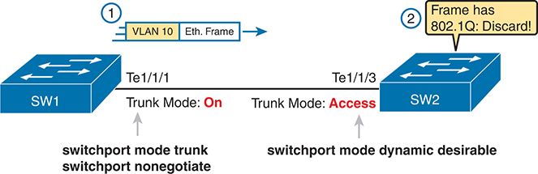


**Figure 8-14** *Mismatched Trunking Operational States*

On Switch 1, interface T e 1/1/1 is configured with trunk mode enabled, indicated by "switch port mode trunk" and "switch port nonegotiate" commands. This interface is designated for V L A N 10 Ethernet frames. Conversely, on Switch 2, interface T e 1/1/3 is configured in trunk mode but encounters a mismatch, as it receives an Ethernet frame with 802 dot 1 Q tagging, leading to frame discarding. This is indicated by the "switch port mode dynamic desirable" command.

The figure shows what happens when using this incorrect configuration. At Step 1, SW1 could (for example) forward a frame in VLAN 10. However, SW2 would view any frame that arrives with an 802.1Q header as illegal because the frame has an 802.1Q header, and SW2 treats its G0/2 port as an access port. So, SW2 discards any 802.1Q frames received on that port.

The trunking issues shown here can be easily avoided by checking the configuration and by checking the trunk's operational state (mode) on both sides of the trunk. The best commands to check trunking-related facts are **show interfaces trunk** and **show interfaces switchport**. Just be aware that the switches do not prevent you from making these configuration mistakes.

#### The Supported VLAN List on Trunks

A Cisco switch can forward traffic for all defined and active VLANs. However, a particular VLAN trunk may not forward traffic for a defined and active VLAN for a variety of other reasons. You should learn how to identify which VLANs a particular trunk port currently supports and the reasons why the switch might not be forwarding frames for a VLAN on that trunk port.

The first category in this step can be easily done using the **show interfaces** *interface-id* **trunk** command, which lists information only about currently operational trunks. The best place to begin with this command is the last section of output, which lists the VLANs whose traffic will be forwarded over the trunk. Any VLANs that make it to this final list of VLANs in the command output meet the following criteria:

* The VLAN has not been removed from the *allowed VLAN list* on the trunk (as configured with the **switchport trunk allowed vlan** interface subcommand).
* The VLAN exists and is active on the local switch (as seen in the **show vlan** command).
* The VLAN has not been VTP-pruned from the trunk because the switch has disabled VTP. The trunk is in an STP forwarding state in that VLAN (as also seen in the **show spanning-tree vlan** *vlan-id* command).

The **switchport trunk allowed vlan** interface subcommand gives the network engineer a method to administratively limit the VLANs whose traffic uses a trunk. If the engineer wants all defined VLANs to be supported on a trunk, the engineer simply does not configure this command. If the engineer would like to limit the trunk to support a subset of the VLANs known to the switch, however, the engineer can add one or more **switchport trunk allowed vlan** interface subcommands.

For instance, in a switch that has configured VLANs 1 through 100, but no others, by default the switch would allow traffic in all 100 VLANs. However, the trunk interface command **switchport trunk allowed vlan 1-60** would limit the trunk to forward traffic for VLANs 1 through 60, but not the rest of the VLANs. [Example 8-14](vol1_ch08.xhtml#exa8_14) shows a sample of the command output from the **show interfaces trunk** command, which confirms the first list of VLAN IDs now lists VLANs 1–60. Without the **switchport trunk allowed vlan** command, the first list would have included VLANs 1–4094.

**Example 8-14** *Allowed VLAN List and List of Active VLANs*

[Click here to view code image](vol1_ch08_images.xhtml#f0217-01)

```
SW1# show interfaces trunk

Port        Mode         Encapsulation   Status       Native vlan
Te1/1/1     desirable    802.1q          trunking     1

Port        Vlans allowed on trunk
Te1/1/1     1-60

Port        Vlans allowed and active in management domain
Te1/1/1     1-59

Port        Vlans in spanning tree forwarding state and not pruned
Te1/1/1     1-58
```

The output of the **show interfaces trunk** command creates three separate lists of VLANs, each under a separate heading. These three lists show a progression of reasons why a VLAN is not forwarded over a trunk. [Table 8-5](vol1_ch08.xhtml#ch08tab05) summarizes the headings that precede each list and the reasons why a switch chooses to include or not include a VLAN in each list. For instance, in [Example 8-14](vol1_ch08.xhtml#exa8_14), VLAN 60 has been shut down, and VLAN 59 happens to be in an STP blocking state. ([Chapter 9](vol1_ch09.xhtml#ch09), "[Spanning Tree Protocol Concepts](vol1_ch09.xhtml#ch09)," has more information about STP.)


**Table 8-5** VLAN Lists in the **show interfaces trunk** Command

| List Position | Heading | Reasons |
| --- | --- | --- |
| First | VLANs allowed | VLANs 1–4094, minus those removed by the **switchport trunk allowed** command |
| Second | VLANs allowed and active… | The first list, minus VLANs not defined to the local switch (that is, there is not a **vlan** global configuration command or the switch has not learned of the VLAN with VTP), and also minus those VLANs in shutdown mode |
| Third | VLANs in spanning tree… | The second list, minus VLANs in an STP blocking state for that interface, and minus VLANs VTP pruned from that trunk |

#### Mismatched Native VLAN on a Trunk

Unfortunately, it *is* possible to set the native VLAN ID to different VLANs on either end of the trunk, using the **switchport trunk native vlan** *vlan-id* command. If the native VLANs differ according to the two neighboring switches, the switches will cause frames sent in the native VLAN to jump from one VLAN to the other.

For example, if switch SW1 sends a frame using native VLAN 1 on an 802.1Q trunk, SW1 does not add a VLAN header, as is normal for the native VLAN. When switch SW2 receives the frame, noticing that no 802.1Q header exists, SW2 assumes that the frame is part of SW2's configured native VLAN. If SW2 has been configured to think VLAN 2 is the native VLAN on that trunk, SW2 will try to forward the received frame into VLAN 2. (This effect of a frame being sent in one VLAN but then being believed to be in a different VLAN is called *VLAN hopping*.)

### Chapter Review

Review this chapter's material using either the tools in the book or the interactive tools for the same material found on the book's companion website. [Table 8-6](vol1_ch08.xhtml#ch08tab06) outlines the key review elements and where you can find them. To better track your study progress, record when you completed these activities in the second column.

**Table 8-6** Chapter Review Tracking

| Review Element | Review Date(s) | Resource Used |
| --- | --- | --- |
| Review key topics |  | Book, website |
| Review key terms |  | Book, website |
| Answer DIKTA questions |  | Book, PTP |
| Review config checklists |  | Book, website |
| Review command tables |  | Book |
| Review memory tables |  | Website |
| Do labs |  | Sim Lite, blog |
| Watch Video |  | Website |

### Review All the Key Topics


**Table 8-7** Key Topics for [Chapter 8](vol1_ch08.xhtml#ch08)

| Key Topic Element | Description | Page Number |
| --- | --- | --- |
| [Figure 8-2](vol1_ch08.xhtml#ch08fig02) | Basic VLAN concept | [191](vol1_ch08.xhtml#page_191) |
| List | Reasons for using VLANs | [192](vol1_ch08.xhtml#page_192) |
| [Figure 8-5](vol1_ch08.xhtml#ch08fig05) | Diagram of VLAN trunking | [194](vol1_ch08.xhtml#page_194) |
| [Figure 8-6](vol1_ch08.xhtml#ch08fig06) | 802.1Q header | [195](vol1_ch08.xhtml#page_195) |
| [Table 8-2](vol1_ch08.xhtml#ch08tab02) | Options of the **switchport mode** command | [203](vol1_ch08.xhtml#page_203) |
| [Table 8-3](vol1_ch08.xhtml#ch08tab03) | Expected trunking results based on the configuration of the **switchport mode** command | [207](vol1_ch08.xhtml#page_207) |
| List | Definitions of data VLAN and voice VLAN | [209](vol1_ch08.xhtml#page_209) |
| List | Summary of data and voice VLAN concepts, configuration, and verification | [212](vol1_ch08.xhtml#page_212) |
| [Table 8-4](vol1_ch08.xhtml#ch08tab04) | Commands to find access ports and assigned VLANs | [213](vol1_ch08.xhtml#page_213) |
| [Table 8-5](vol1_ch08.xhtml#ch08tab05) | Analysis of the three VLAN lists in the output from the **show interfaces** *interface-id* **trunk** command | [218](vol1_ch08.xhtml#page_218) |

### Key Terms You Should Know

[802.1Q](vol1_ch08.xhtml#key_096)

[access interface](vol1_ch08.xhtml#key_097)

[data VLAN](vol1_ch08.xhtml#key_098)

[default VLAN](vol1_ch08.xhtml#key_099)

[Layer 3 switch](vol1_ch08.xhtml#key_100)

[native VLAN](vol1_ch08.xhtml#key_101)

[static access interface](vol1_ch08.xhtml#key_102)

[trunk](vol1_ch08.xhtml#key_103)

[trunk interface](vol1_ch08.xhtml#key_104)

[trunking administrative mode](vol1_ch08.xhtml#key_105)

[trunking operational mode](vol1_ch08.xhtml#key_106)

[VLAN](vol1_ch08.xhtml#key_107)

[voice VLAN](vol1_ch08.xhtml#key_108)

[VTP](vol1_ch08.xhtml#key_109)

[VTP transparent mode](vol1_ch08.xhtml#key_110)

### Do Labs

The Sim Lite software is a version of Pearson's full simulator learning product with a subset of the labs, included free with this book. The Sim Lite with this book includes a couple of labs about VLANs. Also, check the author's blog site pages for configuration exercises (Config Labs) at <https://www.certskills.com>.

### Command References

[Tables 8-8](vol1_ch08.xhtml#ch08tab08) and [8-9](vol1_ch08.xhtml#ch08tab09) list configuration and verification commands used in this chapter, respectively. As an easy review exercise, cover the left column in a table, read the right column, and try to recall the command without looking. Then repeat the exercise, covering the right column, and try to recall what the command does.


**Table 8-8** [Chapter 8](vol1_ch08.xhtml#ch08) Configuration Command Reference

| Command | Description |
| --- | --- |
| **vlan** *vlan-id* | Global config command that both creates the VLAN and puts the CLI into VLAN configuration mode. |
| **name** *vlan-name* | VLAN subcommand that names the VLAN. |
| [**no**] **shutdown** | VLAN mode subcommand that enables (**no shutdown**) or disables (**shutdown**) the VLAN. |
| [**no**] **shutdown vlan** *vlan-id* | Global config command that has the same effect as the [**no**] **shutdown** VLAN mode subcommands. |
| **vtp mode** {**server** | **client** | **transparent | off**} | Global config command that defines the VTP mode. |
| **switchport mode** {**access** | **dynamic** {**auto** | **desirable**} | **trunk**} | Interface subcommand that configures the trunking administrative mode on the interface. |
| **switchport access vlan** *vlan-id* | Interface subcommand that statically configures the interface into that one VLAN. |
| **switchport trunk encapsulation** {**dot1q** | **isl** | **negotiate**} | Interface subcommand that defines which type of trunking to use, assuming that trunking is configured or negotiated. |
| **switchport trunk native vlan** *vlan-id* | Interface subcommand that defines the native VLAN for a trunk port. |
| **switchport nonegotiate** | Interface subcommand that disables the negotiation of VLAN trunking. |
| **switchport voice vlan** *vlan-id* | Interface subcommand that defines the voice VLAN on a port, meaning that the switch uses 802.1Q tagging for frames in this VLAN. |
| **switchport trunk allowed vlan** *vlan-list* | Interface subcommand that defines the list of allowed VLANs. Ignores the existing list of allowed VLANs. |
| **switchport trunk allowed vlan** {**add** | **remove}** *vlan-list* | Interface subcommand that adds to or removes from the current set of allowed VLANs on a trunk, adjusting from the existing list of allowed VLANs. |
| **switchport trunk allowed vlan** {**all** | **none** | **except** *vlan-list*} | Interface subcommand that defines the allowed VLAN list as either all VLANs, no VLANs, or all except those in the configured list. Ignores the existing list of allowed VLANs. |


**Table 8-9** [Chapter 8](vol1_ch08.xhtml#ch08) EXEC Command Reference

| Command | Description |
| --- | --- |
| **show interfaces status** | On ports operating as access ports, it lists the access VLAN, and on ports operating as trunk ports, it lists the word *trunk*. |
| **show interfaces** *interface-id* **switchport** | Lists information about any interface regarding administrative settings and operational state. |
| **show interfaces trunk** | Lists information about all operational trunks (but no other interfaces), including the list of VLANs that can be forwarded over the trunk. |
| **show interfaces** *interface-id* **trunk** | Lists trunking status about the listed interface, regardless of whether the interface currently operates as a trunk. |
| **show vlan** [**brief**] | Lists each VLAN and all interfaces assigned to that VLAN (but does not include operational trunks). |
| **show vlan** {**id** *vlan-id* | **name** *vlan-name*} | Lists information about a specific VLAN by ID or name, and interfaces, including trunks. |
| **show vtp status** | Lists VTP configuration and status information. |