# Code Snippets

[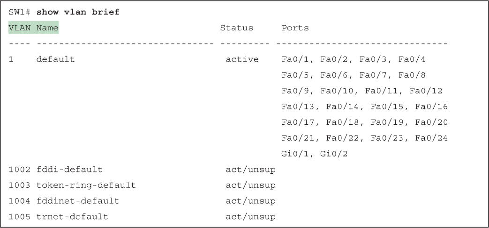](vol1_ch08.xhtml#f0198-01a)

[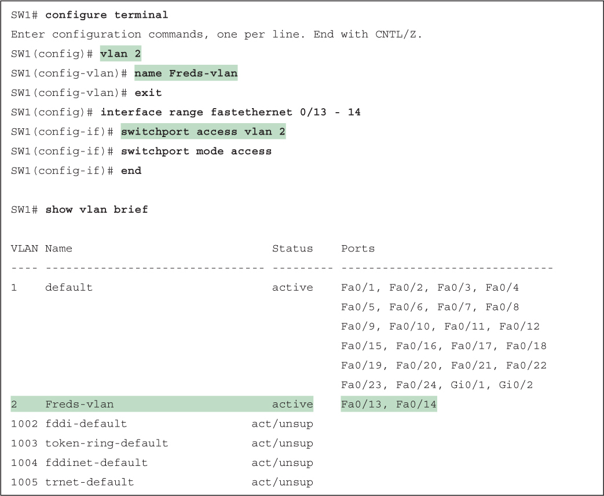](vol1_ch08.xhtml#f0199-01a)

[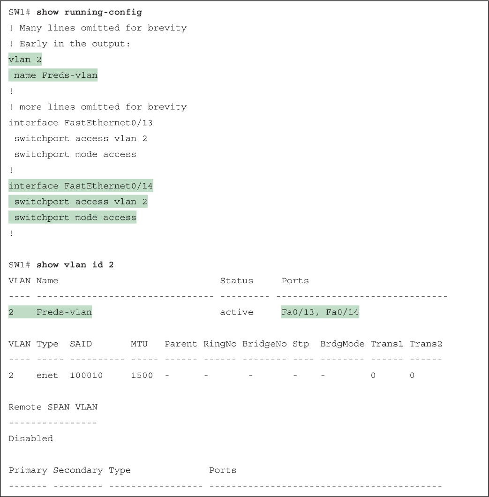](vol1_ch08.xhtml#f0200-01a)

[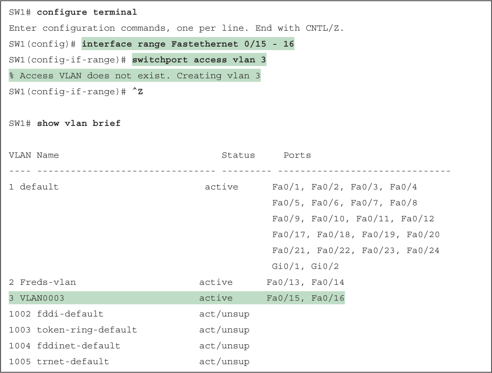](vol1_ch08.xhtml#f0201-01a)

[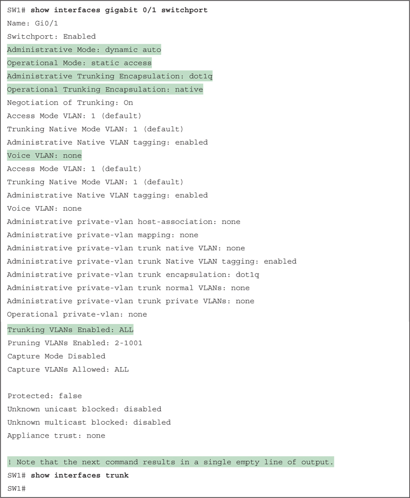](vol1_ch08.xhtml#f0204-01a)

[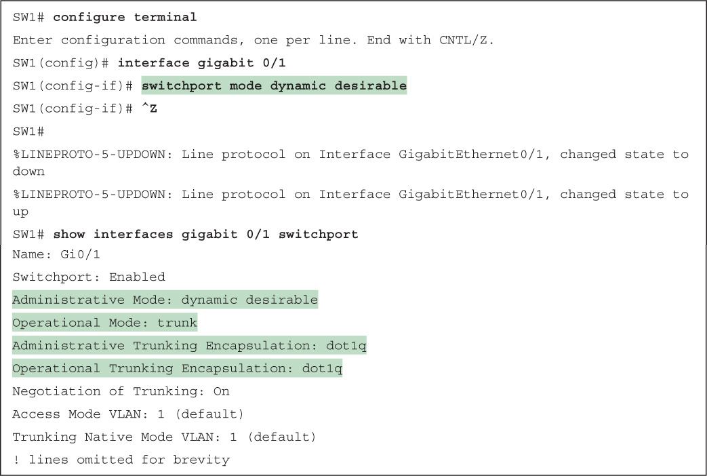](vol1_ch08.xhtml#f0205-01a)

[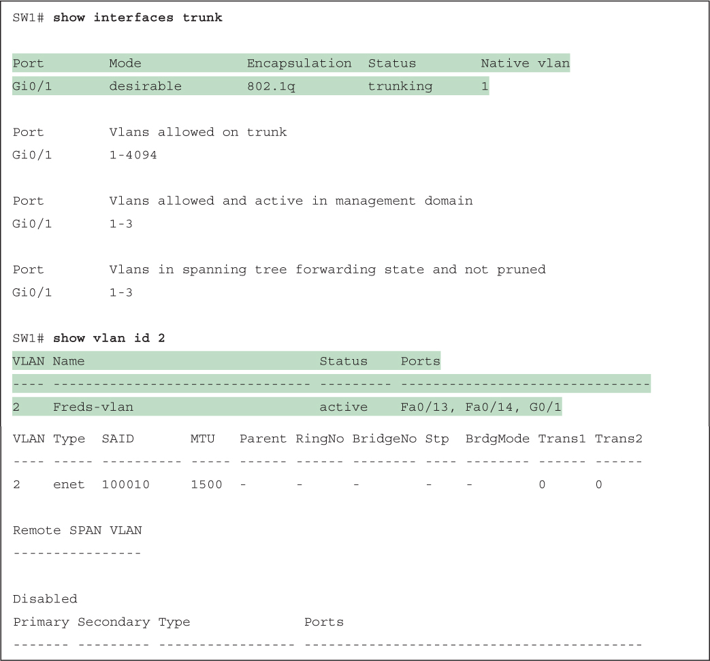](vol1_ch08.xhtml#f0206-01a)

[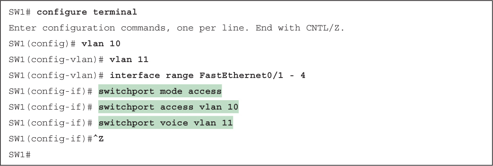](vol1_ch08.xhtml#f0210-01a)

[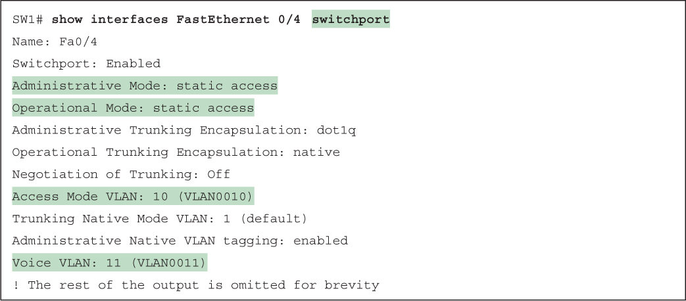](vol1_ch08.xhtml#f0211-01a)

[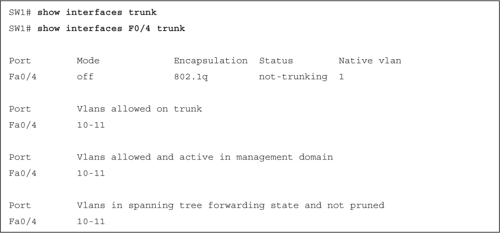](vol1_ch08.xhtml#f0212-01a)

[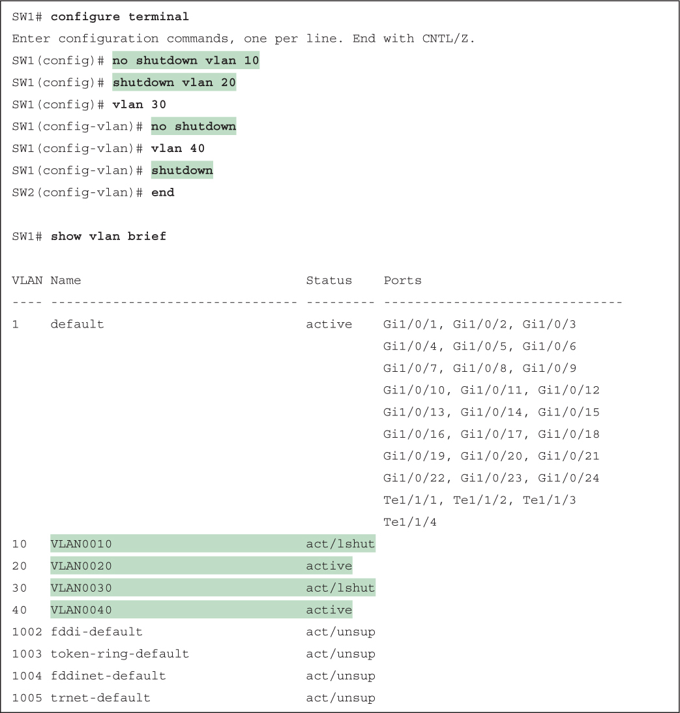](vol1_ch08.xhtml#f0214-01a)

[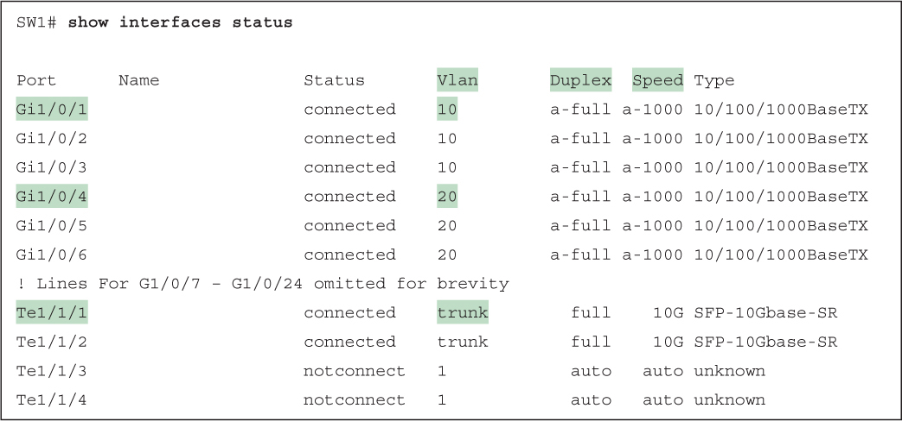](vol1_ch08.xhtml#f0215-01a)

[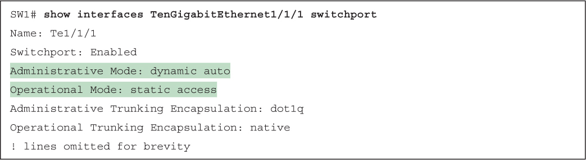](vol1_ch08.xhtml#f0216-01a)

[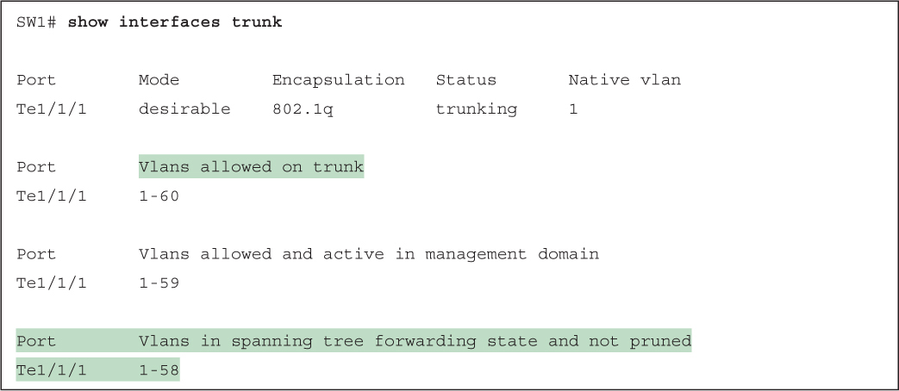](vol1_ch08.xhtml#f0217-01a)