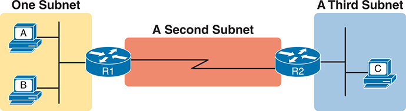
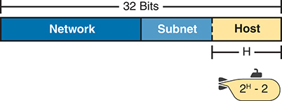
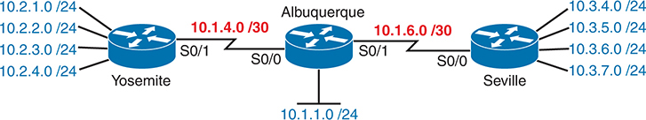

# Chapter 11

## Perspectives on IPv4 Subnetting

This chapter covers the following exam topics:

1.0 Network Fundamentals

1.6 Configure and verify IPv4 addressing and subnetting

1.7 Describe private IPv4 addressing

Most entry-level networking jobs require you to operate and troubleshoot a network using a preexisting IP addressing and subnetting plan. The CCNA exam assesses your readiness to use preexisting IP addressing and subnetting information to perform typical operations tasks, such as monitoring the network, reacting to possible problems, configuring addresses for new parts of the network, and troubleshooting those problems.

However, you also need to understand how networks are designed and why. Anyone monitoring a network must ask the question, "Is the network working *as designed*?" If a problem exists, you must consider questions such as "What happens when the network works normally, and what is different right now?" Both questions require you to understand the intended design of the network, including details of the IP addressing and subnetting design.

This chapter provides some perspectives and answers for the bigger issues in IPv4 addressing. What addresses can be used so that they work properly? What addresses should be used? When told to use certain numbers, what does that tell you about the choices made by some other network engineer? How do these choices impact the practical job of configuring switches, routers, hosts, and operating the network on a daily basis? This chapter helps to answer these questions while revealing details of how IPv4 addresses work.

### "Do I Know This Already?" Quiz

Take the quiz (either here or use the PTP software) if you want to use the score to help you decide how much time to spend on this chapter. The letter answers are listed at the bottom of the page following the quiz. [Appendix C](vol1_appc.xhtml#appc), found both at the end of the book as well as on the companion website, includes both the answers and explanations. You can also find both answers and explanations in the PTP testing software.

**Table 11-1** "Do I Know This Already?" Foundation Topics Section-to-Question Mapping

| Foundation Topics Section | Questions |
| --- | --- |
| Analyze Subnetting and Addressing Needs | 1–3 |
| Make Design Choices | 4–7 |

**[1](vol1_ch11.xhtml#ques11_1a).** Host A is a PC, connected to switch SW1 and assigned to VLAN 1. Which of the following are typically assigned an IP address in the same subnet as host A? (Choose two answers.)

1. The local router's WAN interface
2. The local router's LAN interface
3. All other hosts attached to the same switch
4. Other hosts attached to the same switch and also in VLAN 1

**[2](vol1_ch11.xhtml#ques11_2a).** Why does the formula for the number of hosts per subnet (2*H* – 2) require the subtraction of two hosts?

1. To reserve two addresses for redundant default gateways (routers)
2. To reserve the two addresses required for DHCP operation
3. To reserve addresses for the subnet ID and default gateway (router)
4. To reserve addresses for the subnet broadcast address and subnet ID

**[3](vol1_ch11.xhtml#ques11_3a).** A Class B network needs to be subnetted such that it supports 100 subnets and 100 hosts/subnet. Which of the following answers list a workable combination for the number of network, subnet, and host bits? (Choose two answers.)

1. Network = 16, subnet = 7, host = 7
2. Network = 16, subnet = 8, host = 8
3. Network = 16, subnet = 9, host = 7
4. Network = 8, subnet = 7, host = 17

**[4](vol1_ch11.xhtml#ques11_4a).** Which of the following are private IP networks? (Choose two answers.)

1. 172.31.0.0
2. 172.32.0.0
3. 192.168.255.0
4. 192.1.168.0
5. 11.0.0.0

**[5](vol1_ch11.xhtml#ques11_5a).** Which of the following are public IP networks? (Choose three answers.)

1. 9.0.0.0
2. 172.30.0.0
3. 192.168.255.0
4. 192.1.168.0
5. 1.0.0.0

**[6](vol1_ch11.xhtml#ques11_6a).** Before Class B network 172.16.0.0 is subnetted by a network engineer, what parts of the structure of the IP addresses in this network already exist, with a specific size? (Choose two answers.)

1. Network
2. Subnet
3. Host
4. Broadcast

**[7](vol1_ch11.xhtml#ques11_7a).** Consider the size of the network, subnet, and host parts of the address structure for Class B network 172.16.0.0 without any subnetting. Compare that to an updated plan that subnets the network using one mask for all subnets. Which answer describes what changed in the network, subnet, or host fields for the new plan that uses subnetting in comparison to the earlier plan that does not?

1. The subnet part got smaller.
2. The host part got smaller.
3. The network part got smaller.
4. The host part was removed.
5. The network part was removed.

Answers to the "Do I Know This Already?" quiz:

**[1](vol1_appc.xhtml#ques11_1)** B, D

**[2](vol1_appc.xhtml#ques11_2)** D

**[3](vol1_appc.xhtml#ques11_3)** B, C

**[4](vol1_appc.xhtml#ques11_4)** A, C

**[5](vol1_appc.xhtml#ques11_5)** A, D, E

**[6](vol1_appc.xhtml#ques11_6)** A, C

**[7](vol1_appc.xhtml#ques11_7)** B

### Foundation Topics

### Introduction to Subnetting

Say you just happened to be at the sandwich shop when it was selling the world's longest sandwich. You're pretty hungry, so you go for it. Now you have one sandwich, but because it's over 2 kilometers long, you realize it's a bit more than you need for lunch all by yourself. To make the sandwich more useful (and more portable), you chop the sandwich into meal-size pieces and give the pieces to other folks around you who are also ready for lunch.

Huh? Well, subnetting, at least the main concept, is similar to this sandwich story. You start with one network, but it is just one large network. As a single large entity, it might not be useful, and it is probably far too large. To make it useful, you chop it into smaller pieces, called [subnets](vol1_gloss.xhtml#gloss_382), and assign those subnets to be used in different parts of the enterprise internetwork.

This short first section of the chapter introduces IP subnetting. First, it shows the general ideas behind a completed subnet design that indeed chops (or subnets) one [network](vol1_gloss.xhtml#gloss_272) into subnets. The rest of this section describes the many design steps that you would take to create just such a subnet design. By the end of this section, you should have the right context to then read through the subnetting design steps introduced throughout the rest of this chapter.

Note

All the chapters from this chapter up until [Chapter 25](vol1_ch25.xhtml#ch25), "[Fundamentals of IP Version 6](vol1_ch25.xhtml#ch25)," focus on IPv4 rather than IPv6. All references to *IP* refer to IPv4 unless otherwise stated.

#### Subnetting Defined Through a Simple Example

An IP network—in other words, a Class A, B, or C network—is simply a set of consecutively numbered IP addresses that follow some preset rules. These Class A, B, and C rules define that for a given network, all the addresses in the network have the same value in some of the octets of the addresses. For example, Class B network 172.16.0.0 consists of all IP addresses that begin with 172.16: 172.16.0.0, 172.16.0.1, 172.16.0.2, and so on, through 172.16.255.255. Another example: Class A network 10.0.0.0 includes all addresses that begin with 10.

An IP subnet is simply a subset of a Class A, B, or C network. If fact, the word *subnet* is a shortened version of the phrase *subdivided network*. For example, one subnet of Class B network 172.16.0.0 could be the set of all IP addresses that begin with 172.16.1, and would include 172.16.1.0, 172.16.1.1, 172.16.1.2, and so on, up through 172.16.1.255. Another subnet of that same Class B network could be all addresses that begin with 172.16.2.

To give you a general idea, [Figure 11-1](vol1_ch11.xhtml#ch11fig01) shows some basic documentation from a completed subnet design that could be used when an engineer subnets Class B network 172.16.0.0.

**Figure 11-1** *Subnet Plan Document*

The network begins with 172.16.1., connected to a switch, which then passes through router R 1. This network then splits into two Class networks, 172.16.4. and 172.16.4. The 172.16.1. network proceeds through R 2 and reaches the network for Class 172.16.2. Similarly, the 172.16.5 network passes through R3 and reaches the network for Class 172.16.3 through R 2.

The design shows five subnets—one for each of the three LANs and one each for the two WAN links. The small text note shows the rationale used by the engineer for the subnets: each subnet includes addresses that have the same value in the first three octets. For example, for the LAN on the left, the number shows 172.16.1.\_\_, meaning "all addresses that begin with 172.16.1." Also, note that the design, as shown, does not use all the addresses in Class B network 172.16.0.0, so the engineer has left plenty of room for growth.

#### Operational View Versus Design View of Subnetting

Most IT jobs require you to work with subnetting from an operational view. That is, someone else, before you got the job, designed how IP addressing and subnetting would work for that particular enterprise network. You need to interpret what someone else has already chosen.

To fully understand IP addressing and subnetting, you need to think about subnetting from both a design and operational perspective. For example, [Figure 11-1](vol1_ch11.xhtml#ch11fig01) simply states that in all these subnets, the first three octets must be equal. Why was that convention chosen? What alternatives exist? Would those alternatives be better for your internetwork today? All these questions relate more to subnetting design rather than to operation.

To help you see both perspectives, this chapter focuses more on design issues by moving through the entire design process for the purpose of introducing the bigger picture of IP subnetting. The next three chapters each examine one topic from this chapter from an operational perspective, with the final chapter in this part returning to subnet design for a closer look.

The remaining three main sections of this chapter examine each of the steps listed in [Figure 11-2](vol1_ch11.xhtml#ch11fig02), in sequence.

**Figure 11-2** *Subnet Planning, Design, and Implementation Tasks*

The planning involves three main stages: analyzing needs, designing subnets, and planning implementation. During the analysis phase, factors like the number of subnets required, the number of hosts per subnet, and the size of each subnet are determined. In the design stage, decisions are made regarding the network to be used, selecting an appropriate subnet mask, and listing all the subnets needed based on the analysis. During implementation planning, considerations are made regarding the locations of the subnets, assigning static I P addresses, and defining D H C P ranges to efficiently manage and allocate I P addresses across the network infrastructure.

### Analyze Subnetting and Addressing Needs

This section discusses the meaning of four basic questions that can be used to analyze the addressing and subnetting needs for any new or changing enterprise network:

1. Which hosts should be grouped together into a subnet?
2. How many subnets does this internetwork require?
3. How many host IP addresses does each subnet require?
4. Will we use a single subnet size for simplicity, or not?

#### Rules About Which Hosts Are in Which Subnet

Every device that connects to an IP internetwork needs to have an IP address. These devices include computers used by end users, servers, mobile phones, laptops, IP phones, tablets, and networking devices like routers, switches, and firewalls. In short, any device that uses IP to send and receive packets needs an IP address.

Note

In a discussion of IP addressing, the term *network* has specific meaning: a Class A, B, or C IP network. To avoid confusion with that use of the term *network*, this book uses the terms *internetwork* and *enterprise network* when referring to a collection of hosts, routers, switches, and so on.

The IP addresses must be assigned according to some basic rules—and for good reasons. To make routing work efficiently, IP addressing rules group addresses into groups called subnets. The rules are as follows:

* Addresses in the same subnet are not separated by a router.
* Addresses in different subnets are separated by at least one router.

[Figure 11-3](vol1_ch11.xhtml#ch11fig03) shows the general concept, with hosts A and B in one subnet and host C in another. In particular, note that hosts A and B are not separated from each other by any routers. However, host C, separated from A and B by at least one router, must be in a different subnet.

**Figure 11-3** *PC A and B in One Subnet and PC C in a Different Subnet*

P C A and P C B are linked to router R 1, which bridges to a second subnet and subsequently to router R 2. Finally, router R 2 is connected to P C C in a third subnet. This configuration segregates P C A and P C B into one subnet while placing P C C in a different subnet.

The idea that hosts on the same link must be in the same subnet is much like the postal code concept. All mailing addresses in the same town use the same postal code (ZIP codes in the United States). Addresses in another town, whether relatively nearby or on the other side of the country, have a different postal code. The postal code gives the postal service a better ability to automatically sort the mail to deliver it to the right location. For the same general reasons, hosts on the same LAN are in the same subnet, and hosts in different LANs are in different subnets.

Note that the point-to-point WAN link in the figure also needs a subnet. [Figure 11-3](vol1_ch11.xhtml#ch11fig03) shows Router R1 connected to the LAN subnet on the left and to a WAN subnet on the right. Router R2 connects to that same WAN subnet. To do so, both R1 and R2 will have IP addresses on their WAN interfaces, and the addresses will be in the same subnet. (An Ethernet WAN link has the same IP addressing needs, with each of the two routers having an IP address in the same subnet.)

The Ethernet LANs in [Figure 11-3](vol1_ch11.xhtml#ch11fig03) also show a slightly different style of drawing, using simple lines with no Ethernet switch. Drawings of Ethernet LANs when the details of the LAN switches do not matter simply show each device connected to the same line, as shown in [Figure 11-3](vol1_ch11.xhtml#ch11fig03). (This kind of drawing mimics the original Ethernet cabling before switches and hubs existed.)

Finally, because the routers' main job is to forward packets from one subnet to another, routers typically connect to multiple subnets. For example, in this case, Router R1 connects to one LAN subnet on the left and one WAN subnet on the right. To do so, R1 will be configured with two different IP addresses, one per interface. These addresses will be in different subnets because the interfaces connect the router to different subnets.

#### Determining the Number of Subnets

To determine the number of subnets required, the engineer must think about the internetwork as documented and count the locations that need a subnet. To do so, the engineer requires access to network diagrams, VLAN configuration details, and details about WAN links. For the types of links discussed in this book, you should plan for one subnet for every one of the following:

* VLAN
* Point-to-point serial link
* Ethernet WAN (Ethernet Line Service)

Note

Other WAN technologies outside the scope of the CCNA exam topics allow subnetting options other than one subnet per pair of routers on the WAN (as shown here). However, this book only uses point-to-point WAN technologies—serial links and Ethernet WAN links—that have one subnet for each point-to-point WAN connection between two routers.

For example, imagine that the network planner has only [Figure 11-4](vol1_ch11.xhtml#ch11fig04) on which to base the subnet design.

**Figure 11-4** *Four-Site Internetwork with Small Central Site*

At the heart of the network, a switch links to the core router. The core router then divides the connection, branching out to router B1 and, through a cloud, to routers B2 and B3. These routers, B 1, B 2, and B 3, each connected to individual switches, establishing a network architecture that facilitates communication and data exchange across the four sites.

The number of subnets required cannot be fully predicted with only this figure. Certainly, three subnets will be needed for the WAN links, one per link. However, each LAN switch can be configured with a single VLAN or with multiple VLANs. You can be certain that you need at least one subnet for the LAN at each site, but you might need more.

Next, consider the more detailed version of the same figure as shown in [Figure 11-5](vol1_ch11.xhtml#ch11fig05). In this case, the figure shows VLAN counts in addition to the same Layer 3 topology (the routers and the links connected to the routers). It also shows that the central site has many more switches, but the key fact on the left, regardless of how many switches exist, is that the central site has a total of 12 VLANs. Similarly, the figure lists each branch as having two VLANs. Along with the same three WAN subnets, this internetwork requires 21 subnets.

**Figure 11-5** *Four-Site Internetwork with Larger Central Site*

The central site connects to a considerable number of switches, totaling 12 V L A Ns. Each branch site, on the other hand, is depicted with two V L A Ns. Despite variations in the number of switches, the essential structure remains consistent: a switch connects to the core router, which then branches out to routers B 1, B 2, and B 3 through a cloud. These routers, in turn, connect to individual switches at each branch, each supporting two V L A Ns. This comprehensive internetwork configuration necessitates a total of 21 subnets to accommodate its various network requirements.

Finally, in a real job, you would consider the needs today as well as how much growth you expect in the internetwork over time. Any subnetting plan should include a reasonable estimate of the number of subnets you need to meet future needs.

#### Determining the Number of Hosts per Subnet

Determining the number of hosts per subnet requires knowing a few simple concepts and then doing a lot of research and questioning. Every device that connects to a subnet needs an IP address. For a totally new network, you can look at business plans—numbers of people at the site, devices on order, and so on—to get some idea of the possible devices. When expanding an existing network to add new sites, you can use existing sites as a point of comparison and then find out which sites will get bigger or smaller. And don't forget to count the router interface IP address in each subnet and the switch IP address used to remotely manage the switch.

Instead of gathering data for each and every site, planners often just use a few typical sites for planning purposes. For example, maybe you have some large sales offices and some small sales offices. You might dig in and learn a lot about only one large sales office and only one small sales office. Add that analysis to the fact that point-to-point links need a subnet with just two addresses, plus any analysis of more one-of-a-kind subnets, and you have enough information to plan the addressing and subnetting design.

For example, in [Figure 11-6](vol1_ch11.xhtml#ch11fig06), the engineer has built a diagram that shows the number of hosts per LAN subnet in the largest branch, B1. For the two other branches, the engineer did not bother to dig to find out the number of required hosts. As long as the number of required IP addresses at sites B2 and B3 stays below the estimate of 50, based on larger site B1, the engineer can plan for 50 hosts in each branch LAN subnet and have plenty of addresses per subnet.

**Figure 11-6** *Large Branch B1 with 50 Hosts/Subnet*

The core router then bifurcates the connection, branching to routers B 1, B 2, and B 3 via a cloud network. Each of these routers, B 1, B 2, and B 3, connects to individual switches. The first switch, connected to router B1, is the largest, accommodating up to 50 hosts per subnet. The switches linked to routers B 2 and B 3 are smaller in scale.

#### One Size Subnet Fits All—Or Not

The final choice in the initial planning step is to decide whether you will use a simpler design by using a one-size-subnet-fits-all philosophy. A subnet's size, or length, is simply the number of usable IP addresses in the subnet. A subnetting design can either use one size subnet or varied sizes of subnets, with pros and cons for each choice.

##### Defining the Size of a Subnet

Before you finish this book, you will learn all the details of how to determine the size of the subnet. For now, you just need to know a few specific facts about the size of subnets. [Chapter 12](vol1_ch12.xhtml#ch12), "[Analyzing Classful IPv4 Networks](vol1_ch12.xhtml#ch12)," and [Chapter 13](vol1_ch13.xhtml#ch13), "[Analyzing Subnet Masks](vol1_ch13.xhtml#ch13)," give you a progressively deeper knowledge of the details.

The engineer assigns each subnet a [subnet mask](vol1_gloss.xhtml#gloss_388), and that mask, among other things, defines the size of that subnet. The mask sets aside a number of *host bits* whose purpose is to number different host IP addresses in that subnet. Because you can number 2*x* things with x bits, if the mask defines H host bits, the subnet contains 2*H* unique numeric values.

However, the subnet's size is not 2*H*. It's 2*H* – 2 because two numbers in each subnet are reserved for other purposes. Each subnet reserves the numerically lowest value for the *subnet number* and the numerically highest value as the *subnet broadcast address*. As a result, the number of usable IP addresses per subnet is 2*H* – 2.

Note

The terms *subnet number*, *subnet ID*, and *subnet address* all refer to the number that represents or identifies a subnet.

[Figure 11-7](vol1_ch11.xhtml#ch11fig07) shows the general concept behind the three-part structure of an IP address (as defined by the subnet mask), focusing on the host part and the resulting subnet size.

**Figure 11-7** *Subnet Size Concepts*

A 32-bit subnet is divided into three parts. The largest portion is occupied by the network, followed by the subnet, then the host. The host has a memory width of H, and each subnet in the host is represented as 2 superscript H minus 2.

##### One Size Subnet Fits All

To choose to use a single-size subnet in an enterprise network, you must use the same mask for all subnets because the mask defines the size of the subnet. But which mask?

One requirement to consider when choosing that one mask is this: that one mask must provide enough host IP addresses to support the largest subnet. To do so, the number of host bits (H) defined by the mask must be large enough so that 2*H* – 2 is larger than (or equal to) the number of host IP addresses required in the largest subnet.

For example, consider [Figure 11-8](vol1_ch11.xhtml#ch11fig08). It shows the required number of hosts per LAN subnet. (The figure ignores the subnets on the WAN links, which require only two IP addresses each.) The branch LAN subnets require only 50 host addresses, but the main site LAN subnet requires 200 host addresses. To accommodate the largest subnet, you need at least 8 host bits. Seven host bits would not be enough because 2*7* – 2 = 126. Eight host bits would be enough because 2*8* – 2 = 254, which is more than enough to support 200 hosts in a subnet.

**Figure 11-8** *Network Using One Subnet Size*

At the heart of the network, a P C group links to the core router. The group has 254 subnets and needs 200 addresses. The core router then divides the connection, branching out to router B1 and, through a cloud, to routers B2 and B3. These routers, B 1, B 2, and B 3, each connected to an individual group of P Cs, each with 254 subnets, and then need 50 addresses each.

What's the big advantage when using a single-size subnet? Operational simplicity. In other words, keeping it simple. Everyone on the IT staff who has to work with networking can get used to working with one mask—and one mask only. Staff members will be able to answer all subnetting questions more easily because everyone gets used to doing subnetting math with that one mask.

The big disadvantage for using a single-size subnet is that it wastes IP addresses. For example, in [Figure 11-8](vol1_ch11.xhtml#ch11fig08), all the branch LAN subnets support 254 addresses, while the largest branch subnet needs only 50 addresses. The WAN subnets need only two IP addresses, but each supports 254 addresses, again wasting more IP addresses.

The wasted IP addresses do not actually cause a problem in most cases, however. Most organizations use private IP networks in their enterprise internetworks, and a single Class A or Class B private network can supply plenty of IP addresses, even with the waste.

##### Multiple Subnet Sizes (Variable-Length Subnet Masks)

To create multiple sizes of subnets in one Class A, B, or C network, the engineer must create some subnets using one mask, some with another, and so on. Different masks mean different numbers of host bits, and a different number of hosts in some subnets based on the 2*H* – 2 formula.

For example, consider the requirements listed earlier in [Figure 11-8](vol1_ch11.xhtml#ch11fig08). It showed one LAN subnet on the left that needs 200 host addresses, three branch subnets that need 50 addresses, and three WAN links that need two addresses. To meet those needs, but waste fewer IP addresses, three subnet masks could be used, creating subnets of three different sizes, as shown in [Figure 11-9](vol1_ch11.xhtml#ch11fig09).

The smaller subnets now waste fewer IP addresses compared to the design shown earlier in [Figure 11-8](vol1_ch11.xhtml#ch11fig08). The subnets on the right that need 50 IP addresses have subnets with 6 host bits, for 2*6* – 2 = 62 available addresses per subnet. The WAN links use masks with 2 host bits, for 2*2* – 2 = 2 available addresses per subnet.

**Figure 11-9** *Three Masks, Three Subnet Sizes*

At the heart of the network, a P C group links to the core router. The group has 254 subnets and needs 200 addresses. The core router then divides the connection, branching out to router B1 and, through a cloud, to routers B2 and B3. Each connection implies 2 subnets. These routers, B 1, B 2, and B 3, each connected to an individual group of P Cs, each with 62 subnets, and then need 50 addresses each.

However, some are still wasted because you cannot set the size of the subnet as some arbitrary size. All subnets will be a size based on the 2*H* – 2 formula, with H being the number of host bits defined by the mask for each subnet.

##### One Mask for All Subnets, or More Than One

For the most part, this book explains subnetting using designs that use a single mask, creating a single subnet size for all subnets. Why? First, it makes the process of learning subnetting easier. Second, some types of analysis that you can do about a network—specifically, calculating the number of subnets in the classful network—make sense only when a single mask is used.

However, you still need to be ready to work with designs that use more than one mask in different subnets of the same Class A, B, or C network. In fact, a design that does just that is said to be using [variable-length subnet masks (VLSM)](vol1_gloss.xhtml#gloss_430). For example, the internetwork in [Figure 11-10](vol1_ch11.xhtml#ch11fig10) shows 11 subnets: two with a mask of /30 and nine with a mask of /24. By using more than one mask among all the subnets of one Class A network (10.0.0.0), the design uses VLSM.

**Figure 11-10** *Internetwork with VLSM: Network 10.0.0.0, >1 Mask*

The network employs multiple subnet masks for efficient address allocation. The Yosemite branch has four subnets, namely 10.2.1.0/24, 10.2.2.0/24, 10.2.3.0/24, and 10.2.4.0/24. The connectivity between Yosemite and Albuquerque is facilitated through serial interfaces S 0/1 and S 0/0, with subnet 10.1.4.0/30 assigned to the former and 10.1.1.0/24 to the latter. Albuquerque links to Seville via serial interfaces S0/1 and S0/0, with subnet 10.1.6.0/30 assigned to the former and subnets 10.3.4.0/24, 10.3.5.0/24, 10.3.6.0/24, and 10.3.7.0/24 to the latter.

Although VLSM causes problems when using some older IP routing protocols, the CCNA 200-301 V1.1 blueprint includes only the OSPF routing protocol, and VLSM causes no problems with OSPF. Just be aware of the term and what it means and that it should not impact the features included in the current CCNA exam.

Note

VLSM has been featured in the CCNA exam topics in the past. If you want to read a little more about VLSM, check out [Appendix M](vol1_appm.xhtml#appm), "[Variable-Length Subnet Masks](vol1_appm.xhtml#appm)," on the companion website for this book.

### Make Design Choices

Now that you know how to analyze the IP addressing and subnetting needs, the next major step examines how to apply the rules of IP addressing and subnetting to those needs and make some choices. In other words, now that you know how many subnets you need and how many host addresses you need in the largest subnet, how do you create a useful subnetting design that meets those requirements? The short answer is that you need to do the three tasks shown on the right side of [Figure 11-11](vol1_ch11.xhtml#ch11fig11).

**Figure 11-11** *Input to the Design Phase, and Design Questions to Answer*

The process begins with an analysis of requirements and the formulation of key questions to guide the subnet design process. This involves understanding the needs of the network and determining essential parameters to address during the design phase. Decisions are made regarding the network structure, subnet masks, and the comprehensive listing of all planned subnets.

#### Choose a Classful Network

In the original design for what we know of today as the Internet, companies used registered *public* [classful IP networks](vol1_gloss.xhtml#gloss_065) when implementing TCP/IP inside the company. By the mid-1990s, an alternative became more popular: [private IP networks](vol1_gloss.xhtml#gloss_318). This section discusses the background behind these two choices because it impacts the choice of what IP network a company will then subnet and implement in its enterprise internetwork.

##### Public IP Networks

The original design of the Internet required that any company that connected to the Internet had to use a *registered* [public IP network](vol1_gloss.xhtml#gloss_321). To do so, the company would complete some paperwork, describing the enterprise's internetwork and the number of hosts existing, plus plans for growth. After submitting the paperwork, the company would receive an assignment of either a Class A, B, or C network.

Public IP networks—and the administrative processes surrounding them—ensure that all the companies that connect to the Internet use unique IP addresses. In particular, after a public IP network is assigned to a company, only that company should use the addresses in that network. That guarantee of uniqueness means that Internet routing can work well because there are no duplicate public IP addresses.

For example, consider the example shown in [Figure 11-12](vol1_ch11.xhtml#ch11fig12). Company 1 has been assigned public Class A network 1.0.0.0, and company 2 has been assigned public Class A network 2.0.0.0. Per the original intent for public addressing in the Internet, after these public network assignments have been made, no other companies can use addresses in Class A networks 1.0.0.0 or 2.0.0.0.

**Figure 11-12** *Two Companies with Unique Public IP Networks*

This original address assignment process ensured unique IP addresses across the entire planet. The idea is much like the fact that your telephone number should be unique in the universe, your postal mailing address should also be unique, and your email address should also be unique. If someone calls you, your phone rings, but no one else's phone rings. Similarly, if company 1 is assigned Class A network 1.0.0.0, and the engineers at Company 1 assign address 1.1.1.1 to a particular PC, that address should be unique in the universe. A packet sent through the Internet to destination 1.1.1.1 should arrive only at this one PC inside company 1, instead of being delivered to some other host.

##### Growth Exhausts the Public IP Address Space

By the early 1990s, the world was running out of public IP networks that could be assigned. During most of the 1990s, the number of hosts newly connected to the Internet was growing at a double-digit pace *per month*. Companies kept following the rules, asking for public IP networks, and it was clear that the current address-assignment scheme could not continue without some changes. Simply put, the number of Class A, B, and C networks supported by the 32-bit address in IP version 4 (IPv4) was not enough to support one public classful network per organization, while also providing enough IP addresses in each company.

Note

The universe has run out of public IPv4 addresses in a couple of significant ways. IANA, which assigns public IPv4 address blocks to the five Regional Internet Registries (RIR) around the globe, assigned the last of the IPv4 address spaces in early 2011. By 2015, ARIN, the RIR for North America, exhausted its supply of IPv4 addresses, so companies must return unused public IPv4 addresses to ARIN before they have more to assign to new companies. Try an online search for "ARIN depletion" to see pages about the current status of available IPv4 address space for just one RIR example.

The Internet community worked hard during the 1990s to solve this problem, coming up with several solutions, including the following:

* A new version of IP (IPv6), with much larger addresses (128 bit)
* Assigning a subset of a public IP network to each company, instead of an entire public IP network, to reduce waste, using a feature called classless interdomain routing (CIDR)
* Network Address Translation (NAT), which allows the use of private IP networks

These three solutions matter to real networks today. However, to stay focused on the topic of subnet design, this chapter focuses on the third option, and in particular, the private IP networks that can be used by an enterprise when also using NAT. (Be aware that [Chapter 14](vol1_ch14.xhtml#ch14), "[Network Address Translation](vol1_ch14.xhtml#ch14)," in the *CCNA 200-301 Official Cert Guide, Volume 2*, Second Edition, gives more detail about the last two bullets in the list, while [Part VII](vol1_part07.xhtml#part07) of this book discusses the first bullet item (IPv6) in more depth.

Focusing on the third item in the bullet list, NAT allows multiple companies to use the exact same *private IP network*, using the same IP addresses as other companies while still connecting to the Internet. For example, [Figure 11-13](vol1_ch11.xhtml#ch11fig13) shows the same two companies connecting to the Internet as in [Figure 11-12](vol1_ch11.xhtml#ch11fig12), but now with both using the same private Class A network 10.0.0.0.

**Figure 11-13** *Reusing the Same Private Network 10.0.0.0 with NAT*

Both companies use the same classful IP network (10.0.0.0). Both companies can implement their subnet design internal to their respective enterprise internetworks, without discussing their plans. The two companies can even use the exact same IP addresses inside network 10.0.0.0. And amazingly, at the same time, both companies can even communicate with each other through the Internet.

The technology called Network Address Translation makes it possible for companies to reuse the same IP networks, as shown in [Figure 11-13](vol1_ch11.xhtml#ch11fig13). NAT does this by translating the IP addresses inside the packets as they go from the enterprise to the Internet, using a small number of public IP addresses to support tens of thousands of private IP addresses. That one bit of information is not enough to understand how NAT works; however, to keep the focus on subnetting, the book defers the discussion of how NAT works until *CCNA 200-301 Official Cert Guide, Volume 2*, Second Edition. For now, accept that most companies use NAT, and therefore, they can use private IP networks for their internetworks.

##### Private IP Networks

When using NAT—and almost every organization that connects to the Internet uses NAT—the company can simply pick one or more of the private IP networks from the list of reserved private IP network numbers. RFC 1918 defines the list of available private IP networks, which is summarized in [Table 11-2](vol1_ch11.xhtml#ch11tab02).

**Table 11-2** RFC 1918 Private Address Space

| Class of Networks | Private IP Networks | Number of Networks |
| --- | --- | --- |
| A | 10.0.0.0 | 1 |
| B | 172.16.0.0 through 172.31.0.0 | 16 |
| C | 192.168.0.0 through 192.168.255.0 | 256 |

Note

In each class I teach online, I survey students about who uses network 10.0.0.0 in their company, with an average response of 60–70 percent using private class A network 10.0.0.0.

From the perspective of making IPv4 work for the entire world, private IP networks have helped preserve and extend IPv4 and its use in every enterprise and throughout the Internet. In particular, private networks have improved IPv4's implementation worldwide by

* **Avoiding using another organization's public address range for private networks:** Some organizations have a part of their networks that need zero Internet access. The hosts in that part of their network need IP addresses. RFC 1918 suggests that truly private networks—that is, networks with no need for Internet connectivity—use addresses from the RFC 1918 list of private networks.
* **Delaying IPv4 address exhaustion:** To delay the day in which all public IPv4 addresses were assigned to organizations as public addresses, RFC 1918 calls for the use of NAT along with private networks for the addresses internal to an organization.
* **Reducing Internet routers' routing table size:** Using private networks also helps reduce the size of the IP routing tables in Internet routers. For instance, routers in the Internet do not need routes for the private IP networks used inside organizations (in fact, ISPs filter those routes).

##### Choosing an IP Network During the Design Phase

Today, most organizations use private IP networks along with NAT, which requires a small CIDR block of public addresses. Some companies use a public address block, like a public Class A, B, or C network, per the original plan that would allow each company to have its own unique public network. Some smaller number of companies might use a public CIDR block for all addresses—in effect a subset of a Class A, B, or C network—and subnet that block.

For the purposes of this book, most examples use private IP network numbers. For the design step to choose a network number, just choose a private Class A, B, or C network from the list of RFC 1918 private networks. Regardless, the subnetting math works the same whether you begin with a public or private IP network.

After the choice to use a private IP network has been made, just pick one that has enough IP addresses. You can have a small internetwork and still choose to use private Class A network 10.0.0.0. It might seem wasteful to choose a Class A network that has over 16 million IP addresses, especially if you need only a few hundred. However, there's no penalty or problem with using a private network that is too large for your current or future needs.

#### Choose the Mask

If design engineers followed the topics in this chapter so far, in order, they would know the following:

* The number of subnets required
* The number of hosts/subnet required
* That a choice was made to use only one mask for all subnets so that all subnets are the same size (same number of hosts/subnet)
* The classful IP network number that will be subnetted

This section completes the design process, at least the parts described in this chapter, by discussing how to choose that one mask to use for all subnets. First, this section examines default masks, used when a network is not subnetted, as a point of comparison. Next, the concept of borrowing host bits to create subnet bits is explored. Finally, this section ends with an example of how to create a subnet mask based on the analysis of the requirements.

##### Classful IP Networks Before Subnetting

Before an engineer subnets a classful network, the network is a single group of addresses. In other words, the engineer has not yet subdivided the network into many smaller subsets called *subnets*.

When thinking about an unsubnetted classful network, the addresses in a network have only two parts: the [network part](vol1_gloss.xhtml#gloss_279) and [host part](vol1_gloss.xhtml#gloss_173). Comparing any two addresses in the classful network:

* The addresses have the same value in the network part.
* The addresses have different values in the host part.

The actual sizes of the network and host parts of the addresses in a network can be easily predicted, as shown in [Figure 11-14](vol1_ch11.xhtml#ch11fig14).

**Figure 11-14** *Format of Unsubnetted Class A, B, and C Networks*

In [Figure 11-14](vol1_ch11.xhtml#ch11fig14), N and H represent the number of network and host bits, respectively. Class rules define the number of network octets (1, 2, or 3) for Classes A, B, and C, respectively; the figure shows these values as a number of bits. The number of host octets is 3, 2, or 1, respectively.

Continuing the analysis of a classful network before subnetting, the number of addresses in one classful IP network can be calculated with the same 2*H* – 2 formula previously discussed. In particular, the size of an unsubnetted Class A, B, or C network is as follows:

* **Class A:** 2*2**4* – 2 = 16,777,214
* **Class B:** 2*16* – 2 = 65,534
* **Class C:** 2*8* – 2 = 254

##### Borrowing Host Bits to Create Subnet Bits

To subnet a network, the designer thinks about the network and host parts, as shown in [Figure 11-15](vol1_ch11.xhtml#ch11fig15), and then the engineer adds a third part in the middle: the [subnet part](vol1_gloss.xhtml#gloss_390). However, the designer cannot change the size of the network part or the size of the entire address (32 bits). To create a subnet part of the address structure, the engineer borrows bits from the host part. [Figure 11-15](vol1_ch11.xhtml#ch11fig15) shows the general idea.

**Figure 11-15** *Concept of Borrowing Host Bits*

The N, S, and H values for class A are 8, not available, and not available, respectively. The division between N and S is locked and that between S and H is unlocked. The N, S, and H values for class B are 16, not available, and not available, respectively. The division between N and S is locked and that between S and H is unlocked. The N, S, and H values for class C are 24, not available, and not available, respectively. The division between N and S is locked and that between S and H is unlocked. The total bytes assigned to the network is N plus S plus H equals 32.

[Figure 11-15](vol1_ch11.xhtml#ch11fig15) shows a rectangle that represents the subnet mask. N, representing the number of network bits, remains locked at 8, 16, or 24, depending on the class. Conceptually, the designer moves a (dashed) dividing line into the host field, with subnet bits (S) between the network and host parts, and the remaining host bits (H) on the right. The three parts must add up to 32 because IPv4 addresses consist of 32 bits.

##### Choosing Enough Subnet and Host Bits

The design process requires a choice of where to place the dashed line shown in [Figure 11-15](vol1_ch11.xhtml#ch11fig15). But what is the right choice? How many subnet and host bits should the designer choose? The answers hinge on the requirements gathered in the early stages of the planning process:

* Number of subnets required
* Number of hosts/subnet

The bits in the subnet part create a way to uniquely number the different subnets that the design engineer wants to create. With 1 subnet bit, you can number 2*1* or 2 subnets. With 2 bits, 2*2* or 4 subnets; with 3 bits, 2*3* or 8 subnets; and so on. The number of subnet bits must be large enough to uniquely number all the subnets, as determined during the planning process.

At the same time, the remaining number of host bits must also be large enough to number the host IP addresses in the largest subnet. Remember, in this chapter, we assume the use of a single mask for all subnets. This single mask must support both the required number of subnets and the required number of hosts in the largest subnet. [Figure 11-16](vol1_ch11.xhtml#ch11fig16) shows the concept.

[Figure 11-16](vol1_ch11.xhtml#ch11fig16) shows the idea of the designer choosing a number of subnet (S) and host (H) bits and then checking the math. 2*S* must be more than the number of required subnets, or the mask will not supply enough subnets in this IP network. Also, 2*H* – 2 must be more than the required number of hosts/subnet.

**Figure 11-16** *Borrowing Enough Subnet and Host Bits*

The memory is divided into N, S, and H. N comprises the highest portion followed by H, and then S. respectively. The division between N and S is locked and that between S and H is unlocked. The N block is annotated as "Need X Subnets: 2 superscript S is greater than or equal to X?" The H block is annotated as "Need Y Subnets: 2 superscript H minus 2 is greater than or equal to Y?"

Note

The idea of calculating the number of subnets as 2*S* applies only in cases where a single mask is used for all subnets of a single classful network, as is being assumed in this chapter.

To effectively design masks, or to interpret masks that were chosen by someone else, you need a good working memory of the powers of 2. [Appendix A](vol1_appa.xhtml#appa), "[Numeric Reference Tables](vol1_appa.xhtml#appa)," lists a table with powers of 2 up through 2*32* for your reference.

##### Example Design: 172.16.0.0, 200 Subnets, 200 Hosts

To help make sense of the theoretical discussion so far, consider an example that focuses on the design choice for the subnet mask. In this case, the planning and design choices so far tell us the following:

* Use a single mask for all subnets.
* Plan for 200 subnets.
* Plan for 200 host IP addresses per subnet.
* Use private Class B network 172.16.0.0.

To choose the mask, the designer asks this question:

How many subnet (S) bits do I need to number 200 subnets?

You can see that S = 7 is not large enough (2*7* = 128), but S = 8 is enough (2*8* = 256). So, you need *at least* 8 subnet bits.

Next, the designer asks a similar question, based on the number of hosts per subnet:

How many host (H) bits do I need to number 200 hosts per subnet?

The math is basically the same, but the formula subtracts 2 when counting the number of hosts/subnet. You can see that H = 7 is not large enough (2*7* – 2 = 126), but H = 8 is enough (2*8* – 2 = 254).

Only one possible mask meets all the requirements in this case. First, the number of network bits (N) must be 16 because the design uses a Class B network. The requirements tell us that the mask needs at least 8 subnet bits and at least 8 host bits. The mask has only 32 bits in it; [Figure 11-17](vol1_ch11.xhtml#ch11fig17) shows the resulting mask.

**Figure 11-17** *Example Mask Choice, N = 16, S = 8, H = 8*

The N, S, and H values are 16, 8, and 8, respectively. The division between N and S is locked and that between S and H is unlocked. The X value of the subnets is 2 superscript S. The total memory assigned to subnets is 256. The needed amount is 200 and the excess amount is 56. The Y value of the hosts or subnets is 2 superscript H minus 2. The total memory assigned to subnets is 254. The needed amount is 200 and the excess amount is 54.

##### Masks and Mask Formats

Although engineers think about IP addresses in three parts when making design choices (network, subnet, and host), the subnet mask gives the engineer a way to communicate those design choices to all the devices in the subnet.

The subnet mask is a 32-bit binary number with a number of binary 1s on the left and with binary 0s on the right. By definition, the number of binary 0s equals the number of host bits; in fact, that is exactly how the mask communicates the idea of the size of the host part of the addresses in a subnet. The beginning bits in the mask equal binary 1, with those bit positions representing the combined network and subnet parts of the addresses in the subnet.

Because the network part always comes first, then the subnet part, and then the host part, the subnet mask, in binary form, cannot have interleaved 1s and 0s. Each subnet mask has one unbroken string of binary 1s on the left, with the rest of the bits as binary 0s.

After the engineer chooses the classful network and the number of subnet and host bits in a subnet, creating the binary subnet mask is easy. Just write down N 1s, S 1s, and then H 0s (assuming that N, S, and H represent the number of network, subnet, and host bits). [Figure 11-18](vol1_ch11.xhtml#ch11fig18) shows the mask based on the previous example, which subnets a Class B network by creating 8 subnet bits, leaving 8 host bits.

**Figure 11-18** *Creating the Subnet Mask—Binary—Class B Network*

In addition to the binary mask shown in [Figure 11-18](vol1_ch11.xhtml#ch11fig18), masks can also be written in two other formats: the familiar [dotted-decimal notation](vol1_gloss.xhtml#gloss_113) (DDN) seen in IP addresses and an even briefer *prefix* notation. [Chapter 13](vol1_ch13.xhtml#ch13) discusses these formats and how to convert between the different formats.

#### Build a List of All Subnets

Building a list of all subnets, the final task of the subnet design step, determines the actual subnets that can be used, based on all the earlier choices. The earlier design work determined the Class A, B, or C network to use, and the (one) subnet mask to use that supplies enough subnets and enough host IP addresses per subnet. But what are those subnets? How do you identify or describe a subnet? This section answers these questions.

A subnet consists of a group of consecutive numbers. Most of these numbers can be used as IP addresses by hosts. However, each subnet reserves the first and last numbers in the group, and these two numbers cannot be used as IP addresses. In particular, each subnet contains the following:

* **Subnet number:** Also called the *subnet ID* or *subnet address*, this number identifies the subnet. It is the numerically smallest number in the subnet. It cannot be used as an IP address by a host.
* **Subnet broadcast:** Also called the *subnet broadcast address* or *directed broadcast address*, this is the last (numerically highest) number in the subnet. It also cannot be used as an IP address by a host.
* **IP addresses:** All the numbers between the subnet ID and the subnet broadcast address can be used as a host IP address.

For example, consider the earlier case in which the design results were as follows:

Network 172.16.0.0 (Class B)

Mask 255.255.255.0 (for all subnets)

With some math, the facts about each subnet that exists in this Class B network can be calculated. In this case, [Table 11-3](vol1_ch11.xhtml#ch11tab03) shows the first ten such subnets. It then skips many subnets and shows the last two (numerically largest) subnets.

**Table 11-3** First Ten Subnets, Plus the Last Few, from 172.16.0.0, 255.255.255.0

| Subnet Number | IP Addresses | Broadcast Address | |
| --- | --- | --- | --- |
| 172.16.0.0 | 172.16.0.1 – 172.16.0.254 | 172.16.0.255 | |
| 172.16.1.0 | 172.16.1.1 – 172.16.1.254 | 172.16.1.255 | |
| 172.16.2.0 | 172.16.2.1 – 172.16.2.254 | 172.16.2.255 | |
| 172.16.3.0 | 172.16.3.1 – 172.16.3.254 | 172.16.3.255 | |
| 172.16.4.0 | 172.16.4.1 – 172.16.4.254 | 172.16.4.255 | |
| 172.16.5.0 | 172.16.5.1 – 172.16.5.254 | 172.16.5.255 | |
| 172.16.6.0 | 172.16.6.1 – 172.16.6.254 | 172.16.6.255 | |
| 172.16.7.0 | 172.16.7.1 – 172.16.7.254 | 172.16.7.255 | |
| 172.16.8.0 | 172.16.8.1 – 172.16.8.254 | 172.16.8.255 | |
| 172.16.9.0 | 172.16.9.1 – 172.16.9.254 | 172.16.9.255 | |
| Skipping many… | | | |
| 172.16.254.0 | 172.16.254.1 – 172.16.254.254 | | 172.16.254.255 |
| 172.16.255.0 | 172.16.255.1 – 172.16.255.254 | | 172.16.255.255 |

After you have the network number and the mask, calculating the subnet IDs and other details for all subnets requires some math. In real life, most people use subnet calculators or subnet-planning tools. For the CCNA exam, you need to be ready to find this kind of information, as discussed in [Chapter 15](vol1_ch15.xhtml#ch15), "[Subnet Design](vol1_ch15.xhtml#ch15)."

### Plan the Implementation

The next step, planning the implementation, is the last step before actually configuring the devices to create a subnet. The engineer first needs to choose where to use each subnet. For example, at a branch office in a particular city, which subnet from the subnet planning chart ([Table 11-3](vol1_ch11.xhtml#ch11tab03)) should be used for each VLAN at that site? Also, for any interfaces that require static IP addresses, which addresses should be used in each case? Finally, what range of IP addresses from inside each subnet should be configured in the DHCP server, to be dynamically leased to hosts for use as their IP address? [Figure 11-19](vol1_ch11.xhtml#ch11fig19) summarizes the list of implementation planning tasks.

**Figure 11-19** *Facts Supplied to the Plan Implementation Step*

The planning involves three main stages: analyzing needs, designing subnets, and planning implementation. During the analysis phase, factors like the number of subnets required, the number of hosts per subnet, and the size of each subnet are determined. In the design stage, decisions are made regarding the network to be used, selecting an appropriate subnet mask, and listing all the subnets needed based on the analysis. During implementation planning, considerations are made regarding the locations of the subnets, assigning static I P addresses, and defining D H C P ranges to efficiently manage and allocate I P addresses across the network infrastructure.

#### Assigning Subnets to Different Locations

The job is simple: Look at your network diagram, identify each location that needs a subnet, and pick one from the table you made of all the possible subnets. Then, track it so that you know which ones you use where, using a spreadsheet or some other purpose-built subnet-planning tool. That's it! [Figure 11-20](vol1_ch11.xhtml#ch11fig20) shows a sample of a completed design using [Table 11-3](vol1_ch11.xhtml#ch11tab03), which happens to match the initial design sample shown way back in [Figure 11-1](vol1_ch11.xhtml#ch11fig01).

**Figure 11-20** *Example of Subnets Assigned to Different Locations*

The network that begins with 172.16.1., is connected to a switch, which then passes through router R 1. This network then splits into two Class networks, 172.16.4. and 172.16.4. The 172.16.1. network proceeds through R 2 and reaches the network for Class 172.16.2. Similarly, the 172.16.5 network passes through R3 and reaches the network for Class 172.16.3 through R 2.

Although this design could have used any five subnets from [Table 11-3](vol1_ch11.xhtml#ch11tab03), in real networks, engineers usually give more thought to some strategy for assigning subnets. For example, you might assign all LAN subnets lower numbers and WAN subnets higher numbers. Or you might slice off large ranges of subnets for different divisions of the company. Or you might follow that same strategy but ignore organizational divisions in the company, paying more attention to geographies.

For example, for a U.S.-based company with a smaller presence in both Europe and Asia, you might plan to reserve ranges of subnets based on continent. This kind of choice is particularly useful when later trying to use a feature called route summarization. [Figure 11-21](vol1_ch11.xhtml#ch11fig21) shows the general benefit of placing addressing in the network for easier route summarization, using the same subnets from [Table 11-3](vol1_ch11.xhtml#ch11tab03) again.

**Figure 11-21** *Reserving 50 Percent of Subnets for North America and 25 Percent Each for Europe and Asia*

#### Choose Static and Dynamic Ranges per Subnet

Devices receive their IP address and mask assignment in one of two ways: dynamically by using Dynamic Host Configuration Protocol (DHCP) or statically through configuration. For DHCP to work, the network engineer must tell the DHCP server the subnets for which it must assign IP addresses. In addition, that configuration limits the DHCP server to only a subset of the addresses in the subnet. For static addresses, you simply configure the device to tell it what IP address and mask to use.

To keep things as simple as possible, most shops use a strategy to separate the static IP addresses on one end of each subnet, and the DHCP-assigned dynamic addresses on the other. It does not really matter whether the static addresses sit on the low end of the range of addresses or the high end.

For example, imagine that the engineer decides that, for the LAN subnets in [Figure 11-20](vol1_ch11.xhtml#ch11fig20), the DHCP pool comes from the high end of the range, namely, addresses that end in .101 through .254. (The address that ends in .255 is, of course, reserved.) The engineer also assigns static addresses from the lower end, with addresses ending in .1 through .100. [Figure 11-22](vol1_ch11.xhtml#ch11fig22) shows the idea.

**Figure 11-22** *Static from the Low End and DHCP from the High End*

The network starts with the subnet 172.16.1. Within this subnet, a server is configured with the static I P address .11 for input and .1 for output. This server is connected to Router R 1. R 1, in turn, connects to Router R 2, and subsequently to Router R3 via cloud connections. Router R 2 connects to a network for subnet 172.16.2., where two P Cs are assigned static I P addresses .1 for input and dynamic addresses .101 and .102 for output. Similarly, Router R3 connects to a network for subnet 172.16.3. with two P Cs assigned static I P addresses .1 for input and dynamic addresses .101 and .102 for output.

[Figure 11-22](vol1_ch11.xhtml#ch11fig22) shows all three routers with statically assigned IP addresses that end in .1. The only other static IP address in the figure is assigned to the server on the left, with address 172.16.1.11 (abbreviated simply as .11 in the figure).

On the right, each LAN has two PCs that use DHCP to dynamically lease their IP addresses. DHCP servers often begin by leasing the addresses at the bottom of the range of addresses, so in each LAN, the hosts have leased addresses that end in .101 and .102, which are at the low end of the range chosen by design.

### Chapter Review

One key to doing well on the exams is to perform repetitive spaced review sessions. Review this chapter's material using either the tools in the book or interactive tools for the same material found on the book's companion website. Refer to the "[Your Study Plan](vol1_pref10.xhtml#pref10)" element for more details. [Table 11-4](vol1_ch11.xhtml#ch11tab04) outlines the key review elements and where you can find them. To better track your study progress, record when you completed these activities in the second column.

**Table 11-4** Chapter Review Tracking

| Review Element | Review Date(s) | Resource Used |
| --- | --- | --- |
| Review key topics |  | Book, website |
| Review key terms |  | Book, website |
| Answer DIKTA questions |  | Book, PTP |
| Review memory tables |  | Website |

### Review All the Key Topics

**Table 11-5** Key Topics for [Chapter 11](vol1_ch11.xhtml#ch11)

| Key Topic Element | Description | Page Number |
| --- | --- | --- |
| List | Key facts about subnets | [304](vol1_ch11.xhtml#page_304) |
| List | Rules about what places in a network topology need a subnet | [305](vol1_ch11.xhtml#page_305) |
| [Figure 11-7](vol1_ch11.xhtml#ch11fig07) | Locations of the network, subnet, and host parts of an IPv4 address | [308](vol1_ch11.xhtml#page_308) |
| List | Features that extended the life of IPv4 | [312](vol1_ch11.xhtml#page_312) |
| List | Motivations for using private IP networks | [314](vol1_ch11.xhtml#page_314) |
| [Figure 11-14](vol1_ch11.xhtml#ch11fig14) | Formats of Class A, B, and C addresses when not subnetted | [315](vol1_ch11.xhtml#page_315) |
| [Figure 11-15](vol1_ch11.xhtml#ch11fig15) | Formats of Class A, B, and C addresses when subnetted | [316](vol1_ch11.xhtml#page_316) |
| [Figure 11-16](vol1_ch11.xhtml#ch11fig16) | General logic when choosing the size of the subnet and host parts of addresses in a subnet | [317](vol1_ch11.xhtml#page_317) |
| List | Items that together define a subnet | [319](vol1_ch11.xhtml#page_319) |

### Key Terms You Should Know

[classful IP network](vol1_ch11.xhtml#key_150)

[dotted-decimal notation](vol1_ch11.xhtml#key_151)

[host part](vol1_ch11.xhtml#key_152)

[network](vol1_ch11.xhtml#key_153)

[network part](vol1_ch11.xhtml#key_154)

[private IP network](vol1_ch11.xhtml#key_155)

[public IP network](vol1_ch11.xhtml#key_156)

[subnet](vol1_ch11.xhtml#key_157)

[subnet mask](vol1_ch11.xhtml#key_158)

[subnet part](vol1_ch11.xhtml#key_159)

[variable-length subnet masks (VLSM)](vol1_ch11.xhtml#key_160)