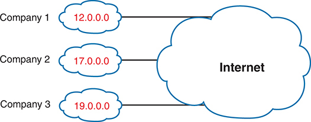
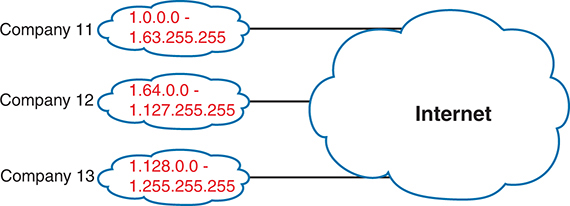
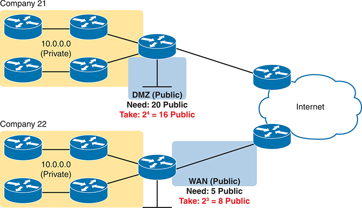
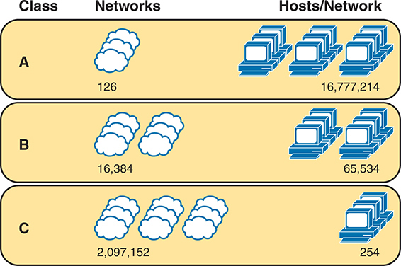
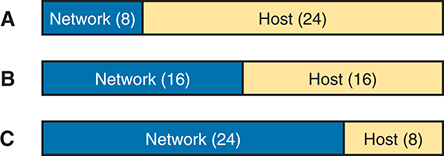
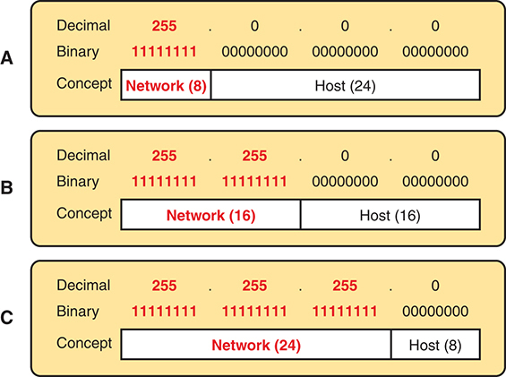
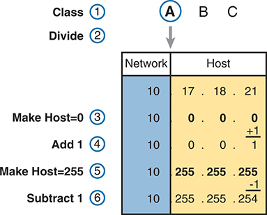
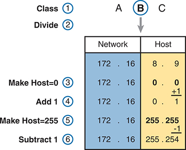

# Chapter 12

## Analyzing Classful IPv4 Networks

This chapter covers the following exam topics:

1.0 Network Fundamentals

1.6 Configure and verify IPv4 addressing and subnetting

1.7 Describe private IPv4 addressing

When operating a network, you often start investigating a problem based on an IP address and mask. Based on the IP address alone, you should be able to determine several facts about the Class A, B, or C network in which the IP address resides.

This chapter lists the key facts about classful IP networks and explains how to discover these facts. Following that, this chapter lists some practice problems. Before moving to the next chapter, you should practice until you can consistently determine all these facts, quickly and confidently, based on an IP address.

### "Do I Know This Already?" Quiz

Take the quiz (either here or use the PTP software) if you want to use the score to help you decide how much time to spend on this chapter. The letter answers are listed at the bottom of the page following the quiz. [Appendix C](vol1_appc.xhtml#appc), found both at the end of the book as well as on the companion website, includes both the answers and explanations. You can also find both answers and explanations in the PTP testing software.

**Table 12-1** "Do I Know This Already?" Foundation Topics Section-to-Question Mapping

| Foundation Topics Section | Questions |
| --- | --- |
| Classful Network Concepts | 1–5 |

**[1](vol1_ch12.xhtml#ques12_1a).** Which of the following are not valid Class A network IDs? (Choose two answers.)

1. 1.0.0.0
2. 130.0.0.0
3. 127.0.0.0
4. 9.0.0.0

**[2](vol1_ch12.xhtml#ques12_2a).** Which of the following are not valid Class B network IDs?

1. 130.0.0.0
2. 191.255.0.0
3. 128.0.0.0
4. 150.255.0.0
5. All are valid Class B network IDs.

**[3](vol1_ch12.xhtml#ques12_3a).** Which of the following are true about IP address 172.16.99.45's IP network? (Choose two answers.)

1. The network ID is 172.0.0.0.
2. The network is a Class B network.
3. The default mask for the network is 255.255.255.0.
4. The number of host bits in the unsubnetted network is 16.

**[4](vol1_ch12.xhtml#ques12_4a).** Which of the following are true about IP address 192.168.6.7's IP network? (Choose two answers.)

1. The network ID is 192.168.6.0.
2. The network is a Class B network.
3. The default mask for the network is 255.255.255.0.
4. The number of host bits in the unsubnetted network is 16.

**[5](vol1_ch12.xhtml#ques12_5a).** Which of the following is a network broadcast address?

1. 10.1.255.255
2. 192.168.255.1
3. 224.1.1.255
4. 172.30.255.255

Answers to the "Do I Know This Already?" quiz:

**[1](vol1_appc.xhtml#ques12_1)** B, C

**[2](vol1_appc.xhtml#ques12_2)** E

**[3](vol1_appc.xhtml#ques12_3)** B, D

**[4](vol1_appc.xhtml#ques12_4)** A, C

**[5](vol1_appc.xhtml#ques12_5)** D

### Foundation Topics

### Classful Network Concepts

Imagine that you have a job interview for your first IT job. As part of the interview, you're given an IPv4 address and mask: 10.4.5.99, 255.255.255.0. What can you tell the interviewer about the classful [network](vol1_gloss.xhtml#gloss_272) (in this case, the Class A network) in which the IP address resides?

This section, the first of two major sections in this chapter, reviews the concepts of [classful IP networks](vol1_gloss.xhtml#gloss_065) (in other words, Class A, B, and C networks). In particular, this chapter examines how to begin with a single IP address and then determine the following facts:

* Class (A, B, or C)
* Default mask
* Number of network octets/bits
* Number of host octets/bits
* Number of host addresses in the network
* Network ID
* Network broadcast address
* First and last usable address in the network

Before getting into this chapter's processes, the text first discusses the context. Analyzing Class A, B, and C networks has a valuable purpose, and it remains an important skill—but it might not be as useful in some networks. This section begins by setting that context regarding public networks, large public CIDR blocks, and small public CIDR blocks. Then the rest of the section dives into finding all the facts about the classful IP network an address would reside in if the assignment process still assigned the entire Class A, B, or C network.

#### Setting the Context of Public Networks and CIDR Blocks

As discussed in [Chapter 11](vol1_ch11.xhtml#ch11), "[Perspectives on IPv4 Subnetting](vol1_ch11.xhtml#ch11)," the original plan called for every organization to register for and use a public IP network of one of three classes: A, B, or C. That approach existed in the 1980s up through the 2010s when the Regional Internet Registries (RIRs) assigned their final IP [network numbers](vol1_gloss.xhtml#gloss_278). Even with the RIRs exhausting their supply of IPv4 addresses, companies that received assignments for a public Class A, B, or C network continue to use them. [Figure 12-1](vol1_ch12.xhtml#ch12fig01) shows a conceptual diagram with some Class A networks that could still be used today.

**Figure 12-1** *Concept: Companies Using Separate Public Class A Networks*

One of the address conservation options that emerged in the 1990s called for using more than the three set sizes of Class A, B, and C networks, instead allowing for any block size that is a power of 2. Starting in that decade, the Internet Assigned Numbers Authority (IANA), the global owner of the address space, along with the five RIRs, began assigning public *classless interdomain routing (CIDR) blocks*. Doing so allowed companies to receive assignments that did not waste as many addresses.

For instance, instead of assigning public network 1.0.0.0 to one company, an RIR could subdivide that network into smaller blocks that followed some simple rules. For instance, each block has to include a power of 2 number of addresses. [Figure 12-2](vol1_ch12.xhtml#ch12fig02) shows the concept, with three other companies receiving assignments of public CIDR blocks that look like subsets of former Class A network 1.0.0.0.

**Figure 12-2** *Concept: Companies Using Public CIDR Blocks*

A company using a large public [CIDR block](vol1_gloss.xhtml#gloss_059) implements it like a public Class A, B, or C network. Whether starting with a public Class A, B, or C network, or a public CIDR block, the company has one large block of public addresses. The company can then create a subnetting plan to subdivide the large block further, picking which subnets to use in each location. All the hosts in the network use an address from the large public address block.

Over time, a third option emerged that used even fewer public addresses—and it became the most popular option. A company uses a private IP network to address all the hosts within the company. The company also needs a small public CIDR block, while using NAT to translate addresses for packets that flow to and from the Internet. Often, a block of 4, 8, or 16 addresses gives even a large company plenty of public IP address capacity to use with NAT. All companies can use any private IP network for hosts inside the company, as shown in [Figure 12-3](vol1_ch12.xhtml#ch12fig03).

**Figure 12-3** *Concept: Small CIDR Block with Private IP Network*

Company 21 comprises four subnets with the I P range 10.0.0.0 (Private), each connected to Cluster Router 1. Cluster Router 1 serves as the Demilitarized Zone (D M Z) with a Public I P address requirement of 20 and utilizes 16 Public I P addresses. Company 22 also consists of four subnets with the I P range 10.0.0.0 (Private), connected to Cluster Router 2. Cluster Router 2 operates as the D M Z with a Public I P address requirement of 5, utilizing 8 Public I P addresses. Both Cluster Routers are interconnected to different routers on the internet.

Now back to the main point of this chapter, which focuses on processes to find key facts about Class A, B, and C networks, when starting with a [unicast IP address](vol1_gloss.xhtml#gloss_421). Regardless of whether the address happens to be from a public classful network, a public CIDR block, or a private classful network, learning the processes in this chapter will help you in your journey to understand networks and subnetting math. Most of you will use these foundational skills at your company or your clients' companies, and it helps prepare you for the exam.

To complete the discussion of the context, be aware that if you start with one public IP address, you cannot tell from that address whether it comes from a public classful network or a public CIDR block. However, this chapter focuses on determining the facts about a Class A, B, or C network, assuming it comes from a public IP network rather than a public CIDR block. Now on to the math and processes!

Note

You can discover if a public unicast address is part of a public classful network assignment, or a public CIDR block, with a search of WHOIS records. As for the process, go to ARIN's WHOIS search page (<https://search.arin.net/rdap/>), with a search for any public IP address. For example, on that page, a search for 17.1.1.1 reveals an address block of 17.0.0.0/8. As you will learn in this chapter and the next, the 17.0.0.0/8 notation represents Class A network 17.0.0.0, meaning that the 17.1.1.1 address comes from a public Class A assignment.

#### IPv4 Network Classes and Related Facts

IP version 4 (IPv4) defines five address classes. Three of the classes, Classes A, B, and C, consist of unicast IP addresses. Unicast addresses identify a single host or interface so that the address uniquely identifies the device. Class D addresses serve as multicast addresses, so that one packet sent to a Class D multicast IPv4 address can actually be delivered to multiple hosts. Finally, Class E addresses were originally intended for experimentation but were changed to simply be reserved for future use. The class can be identified based on the value of the first octet of the address, as shown in [Table 12-2](vol1_ch12.xhtml#ch12tab02).

**Table 12-2** IPv4 Address Classes Based on First Octet Values

| Class | First Octet Values | Purpose |
| --- | --- | --- |
| A | 1–126 | Unicast (large networks) |
| B | 128–191 | Unicast (medium-sized networks) |
| C | 192–223 | Unicast (small networks) |
| D | 224–239 | Multicast |
| E | 240–255 | Reserved (formerly experimental) |

After you identify the class of a unicast address as either A, B, or C, many other related facts can be derived just through memorization. [Table 12-3](vol1_ch12.xhtml#ch12tab03) lists that information for reference and later study; each of these concepts is described in this chapter.

**Table 12-3** Key Facts for Classes A, B, and C

|  | Class A | Class B | Class C |
| --- | --- | --- | --- |
| First octet range | 1–126 | 128–191 | 192–223 |
| Valid network numbers | 1.0.0.0–126.0.0.0 | 128.0.0.0–191.255.0.0 | 192.0.0.0–223.255.255.0 |
| Total networks | 2*7* – 2 = 126 | 2*14* = 16,384 | 2*21* = 2,097,152 |
| Hosts per network | 2*24* – 2 | 2*16* – 2 | 2*8* – 2 |
| Octets (bits) in network part | 1 (8) | 2 (16) | 3 (24) |
| Octets (bits) in host part | 3 (24) | 2 (16) | 1 (8) |
| Default mask | 255.0.0.0 | 255.255.0.0 | 255.255.255.0 |

Note that the address ranges of all addresses that begin with 0 and all addresses that begin with 127 are reserved. Had they not been reserved since the creation of Class A networks, as listed in RFC 791 (published in 1981), then they might have been known as Class A networks 0.0.0.0 and 127.0.0.0. Because they are reserved, however, the address space has 126 Class A networks, and not 128. Also, note that there are no similar reserved ranges to begin/end the Class B and C ranges.

In addition to the reservation of what would be Class A networks 0.0.0.0 and 127.0.0.0 for other purposes, other newer RFCs have also reserved small pieces of the Class A, B, and C address space. So, tables like [Table 12-3](vol1_ch12.xhtml#ch12tab03), with the count of the numbers of Class A, B, and C networks, are a good place to get a sense of the size of the number; however, the number of reserved networks does change slightly over time (albeit slowly) based on these other reserved address ranges.

Note

If you are interested in seeing all the reserved IPv4 address ranges, just do an Internet search on "IANA IPv4 special-purpose address registry."

##### The Number and Size of the Class A, B, and C Networks

[Table 12-3](vol1_ch12.xhtml#ch12tab03) lists the range of Class A, B, and C network numbers; however, some key points can be lost just referencing a table of information. This section examines the Class A, B, and C network numbers, focusing on the more important points and the exceptions and unusual cases.

First, the number of networks from each class significantly differs. Only 126 Class A networks exist: network 1.0.0.0, 2.0.0.0, 3.0.0.0, and so on, up through network 126.0.0.0. However, 16,384 Class B networks exist, with more than 2 million Class C networks.

Next, note that the size of networks from each class also significantly differs. Each Class A network is relatively large—over 16 million host IP addresses per network—so they were originally intended to be used by the largest companies and organizations. Class B networks are smaller, with over 65,000 hosts per network. Finally, Class C networks, intended for small organizations, have 254 hosts in each network. [Figure 12-4](vol1_ch12.xhtml#ch12fig04) summarizes those facts.

**Figure 12-4** *Numbers and Sizes of Class A, B, and C Networks*

Class A Networks accommodate 126 Hosts per Network, equating to 16,777,214 P Cs. Class B Networks support 16384 Hosts per Network, accommodating 65,534 P Cs. Class C Networks allow 2,097,152 Hosts per Network, providing connectivity for 254 P Cs.

##### Address Formats

In some cases, an engineer might need to think about a Class A, B, or C network as if the network has not been subdivided through the subnetting process. In such a case, the addresses in the classful network have a structure with two parts: the [network part](vol1_gloss.xhtml#gloss_279) (sometimes called the *prefix*) and the [host part](vol1_gloss.xhtml#gloss_173). Then, comparing any two IP addresses in one network, the following observations can be made:

The addresses in the same network have the same values in the network part.

The addresses in the same network have different values in the host part.

For example, in Class A network 10.0.0.0, by definition, the network part consists of the first octet. As a result, all addresses have an equal value in the network part, namely a 10 in the first octet. If you then compare any two addresses in the network, the addresses have a different value in the last three octets (the host octets). For example, IP addresses 10.1.1.1 and 10.1.1.2 have the same value (10) in the network part, but different values in the host part.

[Figure 12-5](vol1_ch12.xhtml#ch12fig05) shows the format and sizes (in number of bits) of the network and host parts of IP addresses in Class A, B, and C networks, before any subnetting has been applied.

**Figure 12-5** *Sizes (Bits) of the Network and Host Parts of Unsubnetted Classful Networks*

Each class is depicted as a rectangle divided into two parts, with measurements indicated. Class A Networks allocate 8 bits for hosts and 24 bits for network addresses. Class B Networks assign 16 bits for hosts and 16 bits for network addresses. Class C Networks designate 24 bits for hosts and 8 bits for network addresses.

##### Default Masks

Although we humans can easily understand the concepts behind [Figure 12-5](vol1_ch12.xhtml#ch12fig05), computers prefer numbers. To communicate those same ideas to computers, each network class has an associated [default mask](vol1_gloss.xhtml#gloss_091) that defines the size of the network and host parts of an unsubnetted Class A, B, and C network. To do so, the mask lists binary 1s for the bits considered to be in the network part and binary 0s for the bits considered to be in the host part.

For example, Class A network 10.0.0.0 has a network part of the first single octet (8 bits) and a host part of the last three octets (24 bits). As a result, the Class A default mask is 255.0.0.0, which in binary is

11111111 00000000 00000000 00000000

[Figure 12-6](vol1_ch12.xhtml#ch12fig06) shows default masks for each network class, both in binary and dotted-decimal format.

Note

Decimal 255 converts to the binary value 11111111. Decimal 0, converted to 8-bit binary, is 00000000. See [Appendix A](vol1_appa.xhtml#appa), "[Numeric Reference Tables](vol1_appa.xhtml#appa)," for a conversion table.

**Figure 12-6** *Default Masks for Classes A, B, and C*

Each class is depicted as a rectangle divided into two parts, showcasing their decimal and binary representations along with the conceptual breakdown. For Class A, the default mask is represented in decimal as 255.0.0.0 and in binary as 11111111 00000000 00000000 00000000, with the network portion allocated 8 bits and the host portion 24 bits. In Class B, the default mask is depicted as 255.255.0.0 in decimal and 11111111 11111111 00000000 00000000 in binary, with the network portion consisting of 16 bits and the host portion 16 bits. For Class C, the default mask is shown as 255.255.255.0 in decimal and 11111111 11111111 11111111 00000000 in binary, with the network portion containing 24 bits and the host portion 8 bits.

#### Number of Hosts per Network

Calculating the number of hosts per network requires some basic binary math. First, consider a case where you have a single binary digit. How many unique values are there? There are, of course, two values: 0 and 1. With 2 bits, you can make four combinations: 00, 01, 10, and 11. As it turns out, the total combination of unique values you can make with N bits is 2*N*.

Host addresses—the IP addresses assigned to hosts—must be unique. The host bits exist for the purpose of giving each host a unique IP address by virtue of having a different value in the host part of the addresses. So, with H host bits, 2*H* unique combinations exist.

However, the number of hosts in a network is not 2*H*; instead, it is 2*H* – 2. Each network reserves two numbers that would have otherwise been useful as host addresses but have instead been reserved for special use: one for the [network ID](vol1_gloss.xhtml#gloss_275) and one for the [network broadcast address](vol1_gloss.xhtml#gloss_274). As a result, the formula to calculate the number of host addresses per Class A, B, or C network is

2*H* – 2

where *H* is the number of host bits.

#### Deriving the Network ID and Related Numbers

Each classful network has four key numbers that describe the network. You can derive these four numbers if you start with just one IP address in the network. The numbers are as follows:

* Network number
* First (numerically lowest) usable address
* Last (numerically highest) usable address
* Network broadcast address

First, consider both the network number and first usable IP address. The *network number*, also called the *network ID* or [network address](vol1_gloss.xhtml#gloss_273), identifies the network. By definition, the network number is the numerically lowest number in the network. However, to prevent any ambiguity, the people who made up IP addressing added the restriction that the network number cannot be assigned as an IP address. So, the lowest number in the network is the network ID. Then, the first (numerically lowest) host IP address is *one larger than* the network number.

Next, consider the network broadcast address along with the last (numerically highest) usable IP address. The TCP/IP RFCs define a network broadcast address as a special address in each network. This broadcast address could be used as the destination address in a packet, and the routers would forward a copy of that one packet to all hosts in that classful network. Numerically, a network broadcast address is always the highest (last) number in the network. As a result, the highest (last) number usable as an IP address is the address that is *one less than* the network broadcast address.

Simply put, if you can find the network number and network broadcast address, finding the first and last usable IP addresses in the network is easy. For the exam, you should be able to find all four values with ease; the process is as follows:

Step 1. Determine the class (A, B, or C) based on the first octet.

Step 2. Mentally divide the network and host octets based on the class.

Step 3. To find the network number, change the IP address's host octets to 0.

Step 4. To find the first address, add 1 to the fourth octet of the network ID.

Step 5. To find the broadcast address, change the network ID's host octets to 255.

Step 6. To find the last address, subtract 1 from the fourth octet of the network broadcast address.

The written process actually looks harder than it is. [Figure 12-7](vol1_ch12.xhtml#ch12fig07) shows an example of the process, using Class A IP address 10.17.18.21, with the circled numbers matching the process.

**Figure 12-7** *Example of Deriving the Network ID and Other Values from 10.17.18.21*

Step 1. Identify the Class: Class A is chosen for this example. Step 2. Divide the address: Network: 10; Host: 17.18.21. Step 3. Set Host portion to 0: Network: 10; Host: 0.0.0. Step 4. Increment Host portion by 1: Network: 10; Host: 0. 0. 1. Step 5. Set Host portion to 255: Network: 10; Host: 255.255.255. Step 6. Decrement Host portion by 1: Network: 10; Host: 255. 255. 254.

[Figure 12-7](vol1_ch12.xhtml#ch12fig07) shows the identification of the class as Class A (Step 1) and the number of network/host octets as 1 and 3, respectively. So, to find the network ID at Step 3, the figure copies only the first octet, setting the last three (host) octets to 0. At Step 4, just copy the network ID and add 1 to the fourth octet. Similarly, to find the broadcast address at Step 5, copy the network octets but set the host octets to 255. Then, at Step 6, subtract 1 from the fourth octet to find the last (numerically highest) usable IP address.

Just to show an alternative example, consider IP address 172.16.8.9. [Figure 12-8](vol1_ch12.xhtml#ch12fig08) shows the process applied to this IP address.

**Figure 12-8** *Example Deriving the Network ID and Other Values from 172.16.8.9*

Step 1. Identify the Class: Class B is chosen for this example. Step 2. Divide the address: Network: 10; Host: 17.18.21. Step 3. Set Host portion to 0: Network: 10; Host: 0.0.0. Step 4. Increment Host portion by 1: Network: 10; Host: 0. 0. 1. Step 5. Set Host portion to 255: Network: 10; Host: 255.255.255. Step 6. Decrement Host portion by 1: Network: 10; Host: 255. 255. 254.

[Figure 12-8](vol1_ch12.xhtml#ch12fig08) shows the identification of the class as Class B (Step 1) and the number of network/host octets as 2 and 2, respectively. So, to find the network ID at Step 3, the figure copies only the first two octets, setting the last two (host) octets to 0. Similarly, Step 5 shows the same action, but with the last two (host) octets being set to 255.

#### Unusual Network IDs and Network Broadcast Addresses

Some of the more unusual numbers in and around the range of Class A, B, and C network numbers can cause some confusion. This section lists some examples of numbers that make many people make the wrong assumptions about the meaning of the number.

For Class A, the first odd fact is that the range of values in the first octet omits the numbers 0 and 127. As it turns out, what would be Class A network 0.0.0.0 was originally reserved for some broadcasting requirements, so all addresses that begin with 0 in the first octet are reserved. What would be Class A network 127.0.0.0 is still reserved because of a special address used in software testing, called the loopback address (127.0.0.1).

For Class B (and C), some of the network numbers can look odd, particularly if you fall into a habit of thinking that 0s at the end mean the number is a network ID, and 255s at the end mean it's a network broadcast address. First, Class B network numbers range from 128.0.0.0 to 191.255.0.0, for a total of 2*14* networks. However, even the first (lowest number) Class B network number (128.0.0.0) looks a little like a Class A network number because it ends with three 0s. However, the first octet is 128, making it a Class B network with a two-octet network part (128.0).

For another Class B example, the high end of the Class B range also might look strange at first glance (191.255.0.0), but this is indeed the numerically highest of the valid Class B network numbers. This network's broadcast address, 191.255.255.255, might look a little like a Class A broadcast address because of the three 255s at the end, but it is indeed the broadcast address of a Class B network.

Similarly to Class B networks, some of the valid Class C network numbers do look strange. For example, Class C network 192.0.0.0 looks a little like a Class A network because of the last three octets being 0, but because it is a Class C network, it consists of all addresses that begin with three octets equal to 192.0.0. Similarly, 223.255.255.0, another valid Class C network, consists of all addresses that begin with 223.255.255.

### Practice with Classful Networks

As with all areas of IP addressing and subnetting, you need to practice to be ready for the CCNA exam. You should practice some while reading this chapter to make sure that you understand the processes. At that point, you can use your notes and this book as a reference, with a goal of understanding the process. After that, keep practicing this and all the other subnetting processes. Before you take the exam, you should be able to always get the right answer, and with speed. [Table 12-4](vol1_ch12.xhtml#ch12tab04) summarizes the key concepts and suggestions for this two-phase approach.

**Table 12-4** Keep-Reading and Take-Exam Goals for This Chapter's Topics

| Time Frame | After Reading This Chapter | Before Taking the Exam |
| --- | --- | --- |
| **Focus on…** | Learning how | Being correct and fast |
| **Tools Allowed** | All | Your brain and a notepad |
| **Goal: Accuracy** | 90% correct | 100% correct |
| **Goal: Speed** | Any speed | 10 seconds |

#### Practice Deriving Key Facts Based on an IP Address

Practice finding the various facts that can be derived from an IP address, as discussed throughout this chapter. To do so, complete [Table 12-5](vol1_ch12.xhtml#ch12tab05).

**Table 12-5** Practice Problems: Find the Network ID and Network Broadcast

|  | IP Address | Class | Network Octets | Host Octets | Network ID | Network Broadcast Address |
| --- | --- | --- | --- | --- | --- | --- |
| 1 | 1.1.1.1 |  |  |  |  |  |
| 2 | 128.1.6.5 |  |  |  |  |  |
| 3 | 200.1.2.3 |  |  |  |  |  |
| 4 | 192.192.1.1 |  |  |  |  |  |
| 5 | 126.5.4.3 |  |  |  |  |  |
| 6 | 200.1.9.8 |  |  |  |  |  |
| 7 | 192.0.0.1 |  |  |  |  |  |
| 8 | 191.255.1.47 |  |  |  |  |  |
| 9 | 223.223.0.1 |  |  |  |  |  |

The answers are listed in the section "[Answers to Earlier Practice Problems](vol1_ch12.xhtml#ch12lev1sec9)," later in this chapter.

#### Practice Remembering the Details of Address Classes

[Tables 12-2](vol1_ch12.xhtml#ch12tab02) and [12-3](vol1_ch12.xhtml#ch12tab03), shown earlier in this chapter, summarized some key information about IPv4 address classes. [Tables 12-6](vol1_ch12.xhtml#ch12tab06) and [12-7](vol1_ch12.xhtml#ch12tab07) show sparse versions of these same tables. To practice recalling those key facts, particularly the range of values in the first octet that identifies the address class, complete these tables. Then, refer to [Tables 12-2](vol1_ch12.xhtml#ch12tab02) and [12-3](vol1_ch12.xhtml#ch12tab03) to check your answers. Repeat this process until you can recall all the information in the tables.

**Table 12-6** Sparse Study Table Version of [Table 12-2](vol1_ch12.xhtml#ch12tab02)

| Class | First Octet Values | Purpose |
| --- | --- | --- |
| A |  |  |
| B |  |  |
| C |  |  |
| D |  |  |
| E |  |  |

**Table 12-7** Sparse Study Table Version of [Table 12-3](vol1_ch12.xhtml#ch12tab03)

|  | Class A | Class B | Class C |
| --- | --- | --- | --- |
| First octet range |  |  |  |
| Valid network numbers |  |  |  |
| Total networks |  |  |  |
| Hosts per network |  |  |  |
| Octets (bits) in network part |  |  |  |
| Octets (bits) in host part |  |  |  |
| Default mask |  |  |  |

### Chapter Review

One key to doing well on the exams is to perform repetitive spaced review sessions. Review this chapter's material using either the tools in the book or interactive tools for the same material found on the book's companion website. Refer to the "[Your Study Plan](vol1_pref10.xhtml#pref10)" element for more details. [Table 12-8](vol1_ch12.xhtml#ch12tab08) outlines the key review elements and where you can find them. To better track your study progress, record when you completed these activities in the second column.

**Table 12-8** Chapter Review Tracking

| Review Element | Review Date(s) | Resource Used |
| --- | --- | --- |
| Review key topics |  | Book, website |
| Review key terms |  | Book, website |
| Answer DIKTA questions |  | Book, PTP |
| Review memory tables |  | Website |
| Practice analyzing classful IPv4 networks |  | Website, [Appendix D](vol1_appd.xhtml#appd) |
| Watch video |  | Website |

### Review All the Key Topics

**Table 12-9** Key Topics for [Chapter 12](vol1_ch12.xhtml#ch12)

| Key Topic Elements | Description | Page Number |
| --- | --- | --- |
| [Table 12-2](vol1_ch12.xhtml#ch12tab02) | Address classes | [328](vol1_ch12.xhtml#page_328) |
| [Table 12-3](vol1_ch12.xhtml#ch12tab03) | Key facts about Class A, B, and C networks | [328](vol1_ch12.xhtml#page_328) |
| List | Comparisons of network and host parts of addresses in the same classful network | [330](vol1_ch12.xhtml#page_330) |
| [Figure 12-6](vol1_ch12.xhtml#ch12fig06) | Default masks | [331](vol1_ch12.xhtml#page_331) |
| Paragraph | Function to calculate the number of hosts per network | [331](vol1_ch12.xhtml#page_331) |
| List | Steps to find information about a classful network | [332](vol1_ch12.xhtml#page_332) |

### Key Terms You Should Know

[CIDR block](vol1_ch12.xhtml#key_161)

[classful IP network](vol1_ch12.xhtml#key_162)

[default mask](vol1_ch12.xhtml#key_163)

[host part](vol1_ch12.xhtml#key_164)

[network](vol1_ch12.xhtml#key_165)

[network address](vol1_ch12.xhtml#key_166)

[network broadcast address](vol1_ch12.xhtml#key_167)

[network ID](vol1_ch12.xhtml#key_168)

[network number](vol1_ch12.xhtml#key_169)

[network part](vol1_ch12.xhtml#key_170)

[unicast IP address](vol1_ch12.xhtml#key_171)

### Additional Practice for This Chapter's Processes

For additional practice with analyzing classful networks, you may do a set of practice problems using your choice of tools:

**Application:** From the companion website, in the section titled "Memory Tables and Practice Exercises," use the "Practice Exercise: Analyzing Classful IPv4 Networks."

**PDF:** Practice the same problems using companion website [Appendix D](vol1_appd.xhtml#appd), "[Practice for Chapter 12: Analyzing Classful IPv4 Networks](vol1_appd.xhtml#appd)."

### Answers to Earlier Practice Problems

[Table 12-5](vol1_ch12.xhtml#ch12tab05), shown earlier, listed several practice problems. [Table 12-10](vol1_ch12.xhtml#ch12tab10) lists the answers.

**Table 12-10** Practice Problems: Find the Network ID and Network Broadcast

|  | IP Address | Class | Network Octets | Host Octets | Network ID | Network Broadcast |
| --- | --- | --- | --- | --- | --- | --- |
| 1 | 1.1.1.1 | A | 1 | 3 | 1.0.0.0 | 1.255.255.255 |
| 2 | 128.1.6.5 | B | 2 | 2 | 128.1.0.0 | 128.1.255.255 |
| 3 | 200.1.2.3 | C | 3 | 1 | 200.1.2.0 | 200.1.2.255 |
| 4 | 192.192.1.1 | C | 3 | 1 | 192.192.1.0 | 192.192.1.255 |
| 5 | 126.5.4.3 | A | 1 | 3 | 126.0.0.0 | 126.255.255.255 |
| 6 | 200.1.9.8 | C | 3 | 1 | 200.1.9.0 | 200.1.9.255 |
| 7 | 192.0.0.1 | C | 3 | 1 | 192.0.0.0 | 192.0.0.255 |
| 8 | 191.255.1.47 | B | 2 | 2 | 191.255.0.0 | 191.255.255.255 |
| 9 | 223.223.0.1 | C | 3 | 1 | 223.223.0.0 | 223.223.0.255 |

The class, number of network octets, and number of host octets all require you to look at the first octet of the IP address to determine the class. If a value is between 1 and 126, inclusive, the address is a Class A address, with one network and three host octets. If a value is between 128 and 191 inclusive, the address is a Class B address, with two network and two host octets. If a value is between 192 and 223, inclusive, it is a Class C address, with three network octets and one host octet.

The last two columns can be found based on [Table 12-3](vol1_ch12.xhtml#ch12tab03), specifically the number of network and host octets along with the IP address. To find the network ID, copy the IP address, but change the host octets to 0. Similarly, to find the network broadcast address, copy the IP address, but change the host octets to 255.

The last three problems can be confusing and were included on purpose so that you could see an example of these unusual cases, as follows.

### Answers to Practice Problem 7 (from Table 12-5)

Consider IP address 192.0.0.1. First, 192 is on the lower edge of the first octet range for Class C; as such, this address has three network octets and one host octet. To find the network ID, copy the address, but change the single host octet (the fourth octet) to 0, for a network ID of 192.0.0.0. It looks strange, but it is indeed the network ID.

The network broadcast address choice for problem 7 can also look strange. To find the broadcast address, copy the IP address (192.0.0.1), but change the last octet (the only host octet) to 255, for a broadcast address of 192.0.0.255. In particular, if you decide that the broadcast should be 192.255.255.255, you might have fallen into the trap of logic, like "Change all 0s in the network ID to 255s," which is not the correct logic. Instead, change all host octets in the IP address (or network ID) to 255s.

### Answers to Practice Problem 8 (from Table 12-5)

The first octet of problem 8 (191.255.1.47) sits on the upper edge of the Class B range for the first octet (128–191). As such, to find the network ID, change the last two octets (host octets) to 0, for a network ID of 191.255.0.0. This value sometimes gives people problems because they are used to thinking that 255 somehow means the number is a broadcast address.

The broadcast address, found by changing the two host octets to 255, means that the broadcast address is 191.255.255.255. It looks more like a broadcast address for a Class A network, but it is actually the broadcast address for Class B network 191.255.0.0.

### Answers to Practice Problem 9 (from Table 12-5)

Problem 9, with IP address 223.223.0.1, is near the high end of the Class C range. As a result, only the last (host) octet is changed to 0 to form the network ID 223.223.0.0. It looks a little like a Class B network number at first glance because it ends in two octets of 0. However, it is indeed a Class C network ID (based on the value in the first octet).