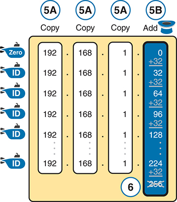

# Chapter 15


## Subnet Design

This chapter covers the following exam topics:

1.0 Network Fundamentals

1.6 Configure and verify IPv4 addressing and subnetting

So far in this book, most of the discussion about IPv4 used examples with the addresses and masks already given. This book has shown many examples already, but the examples so far do not ask you to pick the IP address or pick the mask. Instead, as discussed back in [Chapter 11](vol1_ch11.xhtml#ch11), "[Perspectives on IPv4 Subnetting](vol1_ch11.xhtml#ch11)," this book so far has assumed that someone else designed the IP addressing and subnetting plan, and this book shows how to implement it.

This chapter turns that model around. It goes back to the progression of building and implementing IPv4, as discussed in [Chapter 11](vol1_ch11.xhtml#ch11), as shown in [Figure 15-1](vol1_ch15.xhtml#ch15fig01). This chapter picks up the story right after some network engineer has chosen a Class A, B, or C network to use for the enterprise's IPv4 network. And then this chapter discusses the design choices related to picking one subnet mask to use for all subnets (the first major section) and what subnet IDs that choice creates (the second major section).


**Figure 15-1** *Subnet Design and Implementation Process from [Chapter 11](vol1_ch11.xhtml#ch11)*

The planning involves three main stages: analyzing needs, designing subnets, and planning implementation. During the analysis phase, factors like the number of subnets required, the number of hosts per subnet, and the size of each subnet are determined. In the design stage, decisions are made regarding the network to be used, selecting an appropriate subnet mask, and listing all the subnets needed based on the analysis. During implementation planning, considerations are made regarding the locations of the subnets, assigning static I P addresses, and defining D H C P ranges to efficiently manage and allocate I P addresses across the network infrastructure.

### "Do I Know This Already?" Quiz

Take the quiz (either here or use the PTP software) if you want to use the score to help you decide how much time to spend on this chapter. The letter answers are listed at the bottom of the page following the quiz. [Appendix C](vol1_appc.xhtml#appc), found both at the end of the book as well as on the companion website, includes both the answers and explanations. You can also find both answers and explanations in the PTP testing software.

**Table 15-1** "Do I Know This Already?" Foundation Topics Section-to-Question Mapping

| Foundation Topics Section | Questions |
| --- | --- |
| Choosing the Mask(s) to Meet Requirements | 1–3 |
| Finding All Subnet IDs | 4–6 |

**[1](vol1_ch15.xhtml#ques15_1a).** An IP subnetting design effort is under way at a company. So far, the senior engineer has decided to use private Class B network 172.23.0.0. The design calls for 100 subnets, with the largest subnet needing 500 hosts. Management requires that the design accommodate 50 percent growth in the number of subnets and the size of the largest subnet. The requirements also state that a single mask must be used throughout the Class B network. How many masks meet the requirements?

1. 0
2. 1
3. 2
4. 3+

**[2](vol1_ch15.xhtml#ques15_2a).** An IP subnetting design requires 200 subnets and 120 hosts/subnet for the largest subnets, and requires that a single mask be used throughout the one private IP network that will be used. The design also requires planning for 20 percent growth in the number of subnets and number of hosts/subnet in the largest subnet. Which of the following answers lists a private IP network and mask that, if chosen, would meet the requirements?

1. 10.0.0.0/25
2. 10.0.0.0/22
3. 172.16.0.0/23
4. 192.168.7.0/24

**[3](vol1_ch15.xhtml#ques15_3a).** An engineer has planned to use private Class B network 172.19.0.0 and a single subnet mask throughout the network. The answers list the masks considered by the engineer. Choose the mask that, among the answers, supplies the largest number of hosts per subnet, while also supplying enough subnet bits to support 1000 subnets.

1. 255.255.255.0
2. /26
3. 255.255.252.0
4. /28

**[4](vol1_ch15.xhtml#ques15_4a).** An engineer has calculated the list of subnet IDs, in consecutive order, for network 172.30.0.0, assuming that the /22 mask is used throughout the network. Which of the following are true? (Choose two answers.)

1. Any two consecutive subnet IDs differ by a value of 22 in the third octet.
2. Any two consecutive subnet IDs differ by a value of 16 in the fourth octet.
3. The list contains 64 subnet IDs.
4. The last subnet ID is 172.30.252.0.

**[5](vol1_ch15.xhtml#ques15_5a).** Which of the following are valid subnet IDs for private network 192.168.9.0, using mask /29, assuming that mask /29 is used throughout the network?

1. 192.168.9.144
2. 192.168.9.58
3. 192.168.9.242
4. 192.168.9.9

**[6](vol1_ch15.xhtml#ques15_6a).** Which of the following is not a valid subnet ID for private network 172.19.0.0, using mask /24, assuming that mask /24 is used throughout the network?

1. 172.19.0.0
2. 172.19.1.0
3. 172.19.255.0
4. 172.19.0.16

Answers to the "Do I Know This Already?" quiz:

**[1](vol1_appc.xhtml#ques15_1)** A

**[2](vol1_appc.xhtml#ques15_2)** B

**[3](vol1_appc.xhtml#ques15_3)** B

**[4](vol1_appc.xhtml#ques15_4)** C, D

**[5](vol1_appc.xhtml#ques15_5)** A

**[6](vol1_appc.xhtml#ques15_6)** D

### Foundation Topics

### Choosing the Mask(s) to Meet Requirements

This first major section examines how to find all the masks that meet the stated requirements for the number of subnets and the number of hosts per subnet. To that end, the text assumes that the designer has already determined these requirements and has chosen the network private number to be subnetted. The designer has also made the choice to use a single subnet mask value throughout the classful network.

Armed with the information in this chapter, you can answer questions such as the following, a question that matters both for real engineering jobs and the Cisco exams:

You are using Class B network 172.16.0.0. You need 200 subnets and 200 hosts/subnet. Which of the following subnet mask(s) meet the requirements? (This question is then followed by several answers that list different subnet masks.)

To begin, this section reviews the concepts in [Chapter 11](vol1_ch11.xhtml#ch11)'s section "[Choose the Mask](vol1_ch11.xhtml#ch11lev2sec8)." That section introduced the main concepts about how an engineer, when designing subnet conventions, must choose the mask based on the requirements.

After reviewing the related concepts from [Chapter 11](vol1_ch11.xhtml#ch11), this section examines this topic in more depth. In particular, this chapter looks at three general cases:

* No masks meet the requirements.
* One and only one mask meets the requirements.
* Multiple masks meet the requirements.

For this last case, the text discusses how to determine all masks that meet the requirements and the tradeoffs related to choosing which one mask to use.

#### Review: Choosing the Minimum Number of Subnet and Host Bits

The network designer must examine the requirements for the number of subnets and number of hosts/subnet, and then choose a mask. As discussed in detail in [Chapter 13](vol1_ch13.xhtml#ch13), "[Analyzing Subnet Masks](vol1_ch13.xhtml#ch13)," a classful view of IP addresses defines the three-part structure of an IP address: network, subnet, and host. The network designer must choose the mask so that the number of subnet and host bits (S and H, respectively, in [Figure 15-2](vol1_ch15.xhtml#ch15fig02)) meet the requirements.


**Figure 15-2** *Choosing the Number of Subnet and Host Bits*

Two individuals stand apart, one on each side. On the left, a person asks, 'Need X Subnets: 2 to the power of S is greater or equal to X question mark'. On the right, another asks, 'Need Y Hosts/Subnets: 2 to the power of H minus 2 is greater or equal to Y question mark'. A three-part structure of an IP address: network, subnet, and host with the boundary between N and S locked and the boundary between S and H unlocked, marked with interfacing symbols.

Basically, the designer must choose S subnet bits so that the number of subnets that can be uniquely numbered with S bits (2*S*) is at least as large as the required number of subnets. The designer applies similar logic to the number of host bits H, while noting that the formula is 2*H* – 2, because of the two reserved numbers in each subnet. So, keeping the powers of 2 handy, as shown in [Table 15-2](vol1_ch15.xhtml#ch15tab02), will be useful when working through these problems.

**Table 15-2** Powers of 2 Reference for Designing Masks

| Number of Bits | 2`X` | Number of Bits | 2`X` | Number of Bits | 2`X` | Number of Bits | 2`X` |
| --- | --- | --- | --- | --- | --- | --- | --- |
| 1 | 2 | 5 | 32 | 9 | 512 | 13 | 8192 |
| 2 | 4 | 6 | 64 | 10 | 1024 | 14 | 16,384 |
| 3 | 8 | 7 | 128 | 11 | 2048 | 15 | 32,768 |
| 4 | 16 | 8 | 256 | 12 | 4096 | 16 | 65,536 |

More formally, the process must determine the minimum values for both S and H that meet the requirements. The following list summarizes the initial steps to choose the mask:

Step 1. Determine the number of network bits (N) based on the class.

Step 2. Determine the smallest value of S, so that 2*S* => X, where X represents the required number of subnets.

Step 3. Determine the smallest value of H, so that 2*H* – 2 => Y, where Y represents the required number of hosts/subnet.

The next three sections examine how to use these initial steps to choose a subnet mask.

#### No Masks Meet Requirements

After you determine the required number of subnet and host bits, those bits might not fit into a 32-bit IPv4 subnet mask. Remember, the mask always has a total of 32 bits, with binary 1s in the network and subnet parts and binary 0s in the host part. For the exam, a question might provide a set of requirements that simply cannot be met with 32 total bits.

For example, consider the following sample exam question:

A network engineer is planning a subnet design. The engineer plans to use Class B network 172.16.0.0. The network has a need for 300 subnets and 280 hosts per subnet. Which of the following masks could the engineer choose?

The three-step process shown in the previous section shows that these requirements mean that a total of 34 bits will be needed, so no mask meets the requirements. First, as a Class B network, 16 network bits exist, with 16 host bits from which to create the subnet part and to leave enough host bits to number the hosts in each subnet. For the number of subnet bits, S=8 does not work, because 2*8* = 256 < 300. However, S=9 works, because 2*9* = 512 => 300. Similarly, because 2*8* – 2 = 254, which is less than 300, 8 host bits are not enough but 9 host bits (2*9* – 2 = 510) are just enough.

These requirements do not leave enough space to number all the hosts and subnet, because the network, subnet, and host parts add up to more than 32:

N=16, because as a Class B network, 16 network bits exist.

The minimum S=9, because S=8 provides too few subnets (2*8* = 256 < 300) but S=9 provides 2*9* = 512 subnets.

The minimum H=9, because H=8 provides too few hosts (2*8* – 2 = 254 < 280) but H=9 provides 2*9* – 2 = 510 hosts/subnet.

[Figure 15-3](vol1_ch15.xhtml#ch15fig03) shows the resulting format for the IP addresses in this subnet, after the engineer has allocated 9 subnet bits on paper. Only 7 host bits remain, but the engineer needs 9 host bits.


**Figure 15-3** *Too Few Bits for the Host Part, Given the Requirements*

An individual standing above the boundary between S and H of a three-part structure of an IP address says, 'Minimum: H equals to 9, Only 7 left' and 'Minimum: S equals to 9'. The structure below shows values of N equals 16, S equals 9, and H equals 7

#### One Mask Meets Requirements

The process discussed in this chapter in part focuses on finding the smallest number of subnet bits and the smallest number of host bits to meet the requirements. If the engineer tries to use these minimum values, and the combined network, subnet, and host parts add up to exactly 32 bits, exactly one mask meets the requirements.

For example, consider a revised version of the example in the previous section, with smaller numbers of subnets and hosts, as follows:

A network engineer is planning a subnet design. The engineer plans to use Class B network 172.16.0.0. The network has a need for 200 subnets and 180 hosts per subnet. Which of the following masks could the engineer choose?

The three-step process to determine the numbers of network, minimum subnet, and minimum host bits results in a need for 16, 8, and 8 bits, respectively. As before, with a Class B network, 16 network bits exist. With a need for only 200 subnets, S=8 does work, because 2*8* = 256 => 200; 7 subnet bits would not supply enough subnets (2*7* = 128). Similarly, because 2*8* – 2 = 254 => 180, 8 host bits meet the requirements; 7 host bits (for 126 total hosts/subnet) would not be enough.

[Figure 15-4](vol1_ch15.xhtml#ch15fig04) shows the resulting format for the IP addresses in this subnet.


**Figure 15-4** *One Mask That Meets the Requirements*

An individual standing above the boundary between S and H of a three-part structure of an IP address says, 'Minimum: H equals to 8' and 'Minimum: S equals to 8'. The structure below shows values of N equals 16, S equals 8, and H equals 8. The whole structure contains 32 Bits. The area between N and S is recorded with the mask in prefix format: /p equals N plus S equals /24.

[Figure 15-4](vol1_ch15.xhtml#ch15fig04) shows the mask conceptually. To find the actual mask value, simply record the mask in prefix format (/P), where P = N + S or, in this case, /24.

#### Multiple Masks Meet Requirements

Depending on the requirements and choice of network, several masks might meet the requirements for the numbers of subnets and hosts/subnet. In these cases, you need to find all the masks that could be used. Then, you have a choice, but what should you consider when choosing one mask among all those that meet your requirements? This section shows how to find all the masks, as well as the facts to consider when choosing one mask from the list.

##### Finding All the Masks: Concepts

To help you better understand how to find all the subnet masks in binary, this section uses two major steps. In the first major step, you build the 32-bit binary subnet mask on paper. You write down binary 1s for the network bits, binary 1s for the subnet bits, and binary 0s for the host bits, just as always. However, you will use the minimum values for S and H. And when you write down these bits, you will not have 32 bits yet!

For example, consider the following problem, similar to the earlier examples in this chapter but with some changes in the requirements:

A network engineer is planning a subnet design. The engineer plans to use Class B network 172.16.0.0. The network has a need for 50 subnets and 180 hosts per subnet. Which of the following masks could the engineer choose?

This example is similar to an earlier example, except that only 50 subnets are needed in this case. Again, the engineer is using private IP network 172.16.0.0, meaning 16 network bits. The design requires only 6 subnet bits in this case, because 2*6* = 64 => 50, and with only 5 subnet bits, 2*5* = 32 < 50. The design then requires a minimum of 8 host bits.

One way to discuss the concepts and find all the masks that meet these requirements is to write down the bits in the subnet mask: binary 1s for the network and subnet parts and binary 0s for the host part. However, think of the 32-bit mask as 32-bit positions, and when writing the binary 0s, *write them on the far right*. [Figure 15-5](vol1_ch15.xhtml#ch15fig05) shows the general idea.

[Figure 15-5](vol1_ch15.xhtml#ch15fig05) shows 30 bits of the mask, but the mask must have 32 bits. The 2 remaining bits might become subnet bits, being set to binary 1. Alternatively, these 2 bits could be made host bits, being set to binary 0. The engineer simply needs to choose based on whether he would like more subnet bits, to number more subnets, or more host bits, to number more hosts/subnet.


**Figure 15-5** *Incomplete Mask with N=16, S=6, and H=8*

Regardless of the requirements, when choosing any IPv4 subnet mask, you must always follow this rule:


A subnet mask begins with all binary 1s, followed by all binary 0s, with no interleaving of 1s and 0s.

With the example shown in [Figure 15-5](vol1_ch15.xhtml#ch15fig05), with 2 open bits, one value (binary 01) breaks this rule. However, the other three combinations of 2 bits (00, 10, and 11) do not break the rule. As a result, three masks meet the requirements in this example, as shown in [Figure 15-6](vol1_ch15.xhtml#ch15fig06).


**Figure 15-6** *Three Masks That Meet the Requirements*

An incomplete mask with N equals to 16, S equals to 6, and H equals to 8. The mask /22 meets the requirements with S equals to 6 and H equals to 10. The mask /23 meets the requirements with S equals to 7 and H equals to 9. The mask /24 meets the requirements with S equals to 8 and H equals to 8.

In the three masks, the first has the least number of subnet bits among the three masks, but therefore has the most number of host bits. So, the first mask maximizes the number of hosts/subnet. The last mask uses the minimum value for the number of host bits, therefore using the most number of subnet bits allowed while still meeting the requirements. As a result, the last mask maximizes the number of subnets allowed.

##### Finding All the Masks: Math

Although the concepts related to the example shown in [Figures 15-5](vol1_ch15.xhtml#ch15fig05) and [15-6](vol1_ch15.xhtml#ch15fig06) are important, you can find the range of masks that meets the requirements more easily just using some simple math. The process to find the masks requires only a few steps, after you know N and the minimum values of S and H. The process finds the value of /P when using the least number of subnet bits, and when using the least number of host bits, as follows:


Step 1. Calculate the shortest prefix mask (/P) based on the *minimum value of S*, where P = N + S.

Step 2. Calculate the longest prefix mask (/P) based on the *minimum value of H*, where P = 32 – H.

Step 3. The range of valid masks includes all /P values between the two values calculated in the previous steps.

For example, in the example shown in [Figure 15-6](vol1_ch15.xhtml#ch15fig06), N=16, the minimum S=6, and the minimum H=8. The first step identifies the shortest prefix mask (the /P with the smallest value of P) of /22 by adding N and S (16 + 6). The second step identifies the longest prefix mask that meets the requirements by subtracting the smallest possible value for H (8, in this case) from 32, for a mask of /24. The third step reminds us that the range is from /22 to /24, meaning that /23 is also an option.

##### Choosing the Best Mask

When multiple possible masks meet the stated requirements, the engineer has a choice of masks. That, of course, begs some questions: Which mask should you choose? Why would one mask be better than the other? The reasons can be summarized into three main options:


**To maximize the number of hosts/subnet:** To make this choice, use the shortest prefix mask (that is, the mask with the smallest /P value), because this mask has the largest host part.

**To maximize the number of subnets:** To make this choice, use the longest prefix mask (that is, the mask with the largest /P value), because this mask has the largest subnet part.

**To increase both the numbers of supported subnets and hosts:** To make this choice, choose a mask in the middle of the range, which gives you both more subnet bits and more host bits.

For example, in [Figure 15-6](vol1_ch15.xhtml#ch15fig06), the range of masks that meet the requirements is /22 – /24. The shortest mask, /22, has the least subnet bits but the largest number of host bits (10) of the three answers, maximizing the number of hosts/subnet. The longest mask, /24, maximizes the number of subnet bits (8), maximizing the number of subnets, at least among the options that meet the original requirements. The mask in the middle, /23, provides some growth in both subnets and hosts/subnet.

#### The Formal Process

Although this chapter has explained various steps in finding a subnet mask to meet the design requirements, it has not yet collected these concepts into a list for the entire process. The following list collects all these steps into one place for reference. Note that this list does not introduce any new concepts compared to the rest of this chapter; it just puts all the ideas in one place.


Step 1. Find the number of network bits (N) per class rules.

Step 2. Calculate the minimum number of subnet bits (S) so that 2*S* => the number of required subnets.

Step 3. Calculate the minimum number of host bits (H) so that 2*H* – 2 => the number of required hosts/subnet.

Step 4. If N + S + H > 32, no mask meets the need.

Step 5. If N + S + H = 32, one mask meets the need. Calculate the mask as /P, where P = N + S.

Step 6. If N + S + H < 32, multiple masks meet the need:

1. Calculate mask /P based on the minimum value of S, where P = N + S. This mask maximizes the number of hosts/subnet.
2. Calculate mask /P based on the minimum value of H, where P = 32 – H. This mask maximizes the number of possible subnets.
3. Note that the complete range of masks includes all prefix lengths between the two values calculated in Steps 6A and 6B.

#### Practice Choosing Subnet Masks

Take the usual two-phase approach to learning new subnetting math and processes. Take the time now to practice to make sure you understand the fundamentals, using the book and notes as needed. Then, sometime before taking the exam, practice until you can reach the goals in the right column of [Table 15-3](vol1_ch15.xhtml#ch15tab03).

**Table 15-3** Keep-Reading and Take-Exam Goals for Choosing a Subnet Mask

| Time Frame | Before Moving to the Next Chapter | Before Taking the Exam |
| --- | --- | --- |
| **Focus On…** | Learning how | Being correct and fast |
| **Tools Allowed** | All | Your brain and a notepad |
| **Goal: Accuracy** | 90% correct | 100% correct |
| **Goal: Speed** | Any speed | 15 seconds |

##### Practice Problems for Choosing a Subnet Mask

The following list shows three separate problems, each with a classful network number and a required number of subnets and hosts/subnet. For each problem, determine the minimum number of subnet and host bits that meet the requirements. If more than one mask exists, note which mask maximizes the number of hosts/subnet and which maximizes the number of subnets. If only one mask meets the requirements, simply list that mask. List the masks in prefix format:

1. Network 10.0.0.0, need 1500 subnets, need 300 hosts/subnet
2. Network 172.25.0.0, need 130 subnets, need 127 hosts/subnet
3. Network 192.168.83.0, need 8 subnets, need 8 hosts/subnet

[Table 15-8](vol1_ch15.xhtml#ch15tab08), found in the later section "[Answers to Earlier Practice Problems](vol1_ch15.xhtml#ch15lev1sec9)," lists the answers.

### Finding All Subnet IDs

After the person designing the IP subnetting plan has chosen the one mask to use throughout the Class A, B, or C network, that person will soon need to start assigning specific subnet IDs for use in specific VLANs, WAN links, and other places in the internetwork that need a subnet. But what are those subnet IDs? As it turns out, after the network ID and one subnet mask for all subnets have been chosen, finding all the subnet IDs just requires doing a little math. This second major section of this chapter focuses on that math, which focuses on a single question:

Given a single Class A, B, or C network, and the single subnet mask to use for all subnets, what are all the subnet IDs?

When learning how to answer this question, you can think about the problem in either binary or decimal. This chapter approaches the problem using decimal. Although the process itself requires only simple math, the process requires practice before most people can confidently answer this question.

The decimal process begins by identifying the first, or numerically lowest, subnet ID. After that, the process identifies a pattern in all subnet IDs for a given subnet mask so that you can find each successive subnet ID through simple addition. This section examines the key ideas behind this process first; then you are given a formal definition of the process.

Note

Some videos included on the companion website describe the same fundamental processes to find all subnet IDs. You can view those videos before or after reading this section, or even instead of reading this section, as long as you learn how to find all subnet IDs. The process step numbering in the videos might not match the steps shown in this edition of the book.

#### First Subnet ID: The Zero Subnet

The first step in finding all subnet IDs of one network is incredibly simple: Copy the network ID. That is, take the Class A, B, or C network ID—in other words, the classful network ID—and write it down as the first subnet ID. No matter what Class A, B, or C network you use, and no matter what subnet mask you use, the first (numerically lowest) subnet ID is equal to the network ID.

For example, if you begin with classful network 172.20.0.0, no matter what the mask is, the first subnet ID is 172.20.0.0.

This first subnet ID in each network goes by two special names: either [subnet zero](vol1_gloss.xhtml#gloss_393) or [zero subnet](vol1_gloss.xhtml#gloss_447). The origin of these names is related to the fact that a network's zero subnet, when viewed in binary, has a subnet part of all binary 0s. In decimal, the zero subnet can be easily identified, because the zero subnet always has the exact same numeric value as the network ID itself.

In the past, engineers avoided using zero subnets because of the ambiguity with one number that could represent the entire classful network, or it could represent one subnet inside the classful network. To help control that, IOS has a global command that can be set one of two ways:

**ip subnet-zero**, which allows the configuration of addresses in the zero subnet.

**no ip subnet-zero**, which prevents the configuration of addresses in the zero subnet.

Although most sites use the default setting to allow zero subnets, you can use the **no ip subnet-zero** command to prevent configuring addresses that are part of a zero subnet. [Example 15-1](vol1_ch15.xhtml#exa15_1) shows how a router rejects an **ip address** command after changing to use **no ip subnet-zero**. Note that the error message does not mention the zero subnet, instead simply stating "bad mask."

**Example 15-1** *Effects of **[no] ip subnet-zero** on a Local Router*

[Click here to view code image](vol1_ch15_images.xhtml#f0388-01)

```
R1# configure terminal
Enter configuration commands, one per line. End with CNTL/Z.
R1(config)# no ip subnet-zero 
R1(config)# interface g0/1
R1(config-if)# ip address 10.0.0.1 255.255.255.0
Bad mask /24 for address 10.0.0.1
```

Note that the **no ip subnet-zero** command affects the local router's **ip address** commands, as well as the local router's **ip route** commands (which define static routes). However, it does not affect the local router's routes as learned with a routing protocol.

#### Finding the Pattern Using the Magic Number

Subnet IDs follow a predictable pattern, at least when using our assumption of a single subnet mask for all subnets of a network. The pattern uses the *magic number*, as discussed in [Chapter 14](vol1_ch14.xhtml#ch14), "[Analyzing Existing Subnets](vol1_ch14.xhtml#ch14)." To review, the magic number is 256, minus the mask's decimal value, in a particular octet that this book refers to as the *interesting octet*.

[Figure 15-7](vol1_ch15.xhtml#ch15fig07) shows four examples of these patterns with four different masks. For example, just look at the top of the figure to start. It lists mask 255.255.128.0 on the left. The third octet is the interesting octet, with a mask value other than 0 or 255 in that octet. The left side shows a magic number calculated as 256 – 128 = 128. So, the pattern of subnet IDs is shown in the highlighted number line; that is, the subnet IDs when using this mask will have either a 0 or 128 in the third octet. For example, if using network 172.16.0.0, the subnet IDs would be 172.16.0.0 and 172.16.128.0.


**Figure 15-7** *Patterns with Magic Numbers for Masks /17 – /20*

The first row lists mask 255.255.128.0 on the left, over a magic number calculated as 256 – 128 equals to 128. The pattern of subnet I Ds is shown in the highlighted number line using a value of 0 or 128. The second row lists mask 255.255.192.0 on the left, over a magic number 256 minus 192 equals to 64. The pattern of subnet IDs is shown in the highlighted number line using a value of 0, 64, 128, or 192. The third row lists mask 255.255.224.0 on the left, over a magic number 256 minus 224 equals to 32. The pattern of subnet IDs is shown in the highlighted number line using a value of 0, 32, 64, 96, 128, 160, 192, or 224. The fourth row lists mask 255.255.240.0 on the left, over a magic number 256 minus 240 equals to 16. The pattern of subnet IDs is shown in the highlighted number line using a value of 0, 16, 32, 48, 64, 80, 96, 112, 128, 114, 160, 176, 192, 208, 224 or 240.

Now focus on the second row, with another example, with mask 255.255.192.0. This row shows a magic number of 64 (256 – 192 = 64), so the subnet IDs will use a value of 0, 64, 128, or 192 (multiples of 64) in the third octet. For example, if used with network 172.16.0.0, the subnet IDs would be 172.16.0.0, 172.16.64.0, 172.16.128.0, and 172.16.192.0.

Looking at the third row/example, the mask is 255.255.224.0, with a magic number of 256 – 224 = 32. So, as shown in the center of the figure, the subnet ID values will be multiples of 32. For example, if used with network 172.16.0.0 again, this mask would tell us that the subnet IDs are 172.16.0.0, 172.16.32.0, 172.16.64.0, 172.16.96.0, and so on.

Finally, for the bottom example, mask 255.255.240.0 makes the magic number, in the third octet, be 16. So, all the subnet IDs will be a multiple of 16 in the third octet, with those values shown in the middle of the figure.

#### A Formal Process with Fewer Than 8 Subnet Bits

Although it can be easy to see the patterns in [Figure 15-7](vol1_ch15.xhtml#ch15fig07), it might not be as obvious exactly how to apply those concepts to find all the subnet IDs in every case. This section outlines a specific process to find all the subnet IDs.

To simplify the explanations, this section assumes that fewer than 8 subnet bits exist. Later, the section "[Finding All Subnets with More Than 8 Subnet Bits](vol1_ch15.xhtml#ch15lev2sec11)," describes the full process that can be used in all cases.

First, to organize your thoughts, you might want to organize the data into a chart like [Table 15-4](vol1_ch15.xhtml#ch15tab04). This book refers to this chart as the list-all-subnets chart.

**Table 15-4** Generic List-All-Subnets Chart

| Octet | 1 | 2 | 3 | 4 |
| --- | --- | --- | --- | --- |
| Mask |  |  |  |  |
| Magic Number |  |  |  |  |
| Network Number/Zero Subnet |  |  |  |  |
| Next Subnet |  |  |  |  |
| Next Subnet |  |  |  |  |
| Next Subnet |  |  |  |  |
| Broadcast Subnet |  |  |  |  |
| Out of Range—Used by Process |  |  |  |  |

A formal process to find all subnet IDs, given a network and a single subnet mask, is as follows:


Step 1. Write down the subnet mask, in decimal, in the first empty row of the table.

Step 2. Identify the interesting octet, which is the one octet of the mask with a value other than 255 or 0. Draw a rectangle around the column of the interesting octet.

Step 3. Calculate and write down the magic number by subtracting the *subnet mask's interesting octet* from 256.

Step 4. Write down the classful network number, which is the same number as the zero subnet, in the next empty row of the list-all-subnets chart.

Step 5. To find each successive subnet number:

1. For the three uninteresting octets, copy the previous subnet number's values.
2. For the interesting octet, add the magic number to the previous subnet number's interesting octet.

Step 6. When the sum calculated in Step 5B reaches 256, stop the process. The number with the 256 in it is out of range, and the previous subnet number is the broadcast subnet.

Although the written process is long, with practice, most people can find the answers much more quickly with this decimal-based process than by using binary math. As usual, most people learn this process best by seeing it in action, exercising it, and then practicing it. To that end, review the two following examples, and watch the related videos on the companion website for additional examples.

##### Example 1: Network 172.16.0.0, Mask 255.255.240.0

To begin this example, focus on the first four of the six steps, when subnetting network 172.16.0.0 using mask 255.255.240.0. [Figure 15-8](vol1_ch15.xhtml#ch15fig08) shows the results of these first four steps:

Step 1. Record mask 255.255.240.0, which was given as part of the problem statement. ([Figure 15-8](vol1_ch15.xhtml#ch15fig08) also shows the network ID, 172.16.0.0, for easy reference.)

Step 2. The mask's third octet is neither 0 nor 255, which makes the third octet interesting.

Step 3. Because the mask's value in the third octet is 240, the magic number = 256 – 240 = 16.

Step 4. Because the network ID is 172.16.0.0, the first subnet ID, the zero subnet, is also 172.16.0.0.


**Figure 15-8** *Results of First Four Steps: 172.16.0.0, 255.255.240.0*

In the schematic, the problem statement highlights the 1st step showing the subnetting of network 172.16.0.0 by using mask 255.255.240.0. The 2nd step highlights list of subnet IDs, where the mask's third octet is 0. The 3rd step shows the magic number, 256 minus 240 equals to 16. The 4th step highlights the network ID 172.16.0.0.

These first four steps discover the first subnet (the zero subnet) and get you ready to do the remaining steps by identifying the interesting octet and the magic number. Step 5 in the process tells you to copy the three boring octets and add the magic number (16, in this case) in the interesting octet (octet 3, in this case). Keep repeating this step until the interesting octet value equals 256 (per Step 6). When the total is 256, you have listed all the subnet IDs, and the line with 256 on it is not a correct subnet ID. [Figure 15-9](vol1_ch15.xhtml#ch15fig09) shows the results of the Step 5 actions.


**Figure 15-9** *List of Subnet IDs: 172.16.0.0, 255.255.240.0*

A schematic of the 5th step showing the subnet IDs of 172.16.0.0 with octets 1, 2, and 4 repeated six times in a row, while octet 3 increases by the magic number 16 in each row until reaching 256, which is crossed.

Note

In any list of all the subnet IDs of a network, the numerically highest subnet ID is called the [broadcast subnet](vol1_gloss.xhtml#gloss_055). Decades ago, engineers avoided using the broadcast subnet. However, using the broadcast subnet causes no problems. The term *broadcast subnet* has its origins in the fact that if you determine the subnet broadcast address inside the broadcast subnet, it has the same numeric value as the network-wide broadcast address.

Note

People sometimes confuse the terms *broadcast subnet* and *subnet broadcast address*. The *broadcast subnet* is one subnet, namely the numerically highest subnet; only one such subnet exists per network. The term *subnet broadcast address* refers to the one number in each and every subnet that is the numerically highest number in that subnet.

##### Example 2: Network 192.168.1.0, Mask 255.255.255.224

With a Class C network and a mask of 255.255.255.224, this example makes the fourth octet the interesting octet. However, the process works the same, with the same logic, just with the interesting logic applied in a different octet. As with the previous example, the following list outlines the first four steps, with [Figure 15-10](vol1_ch15.xhtml#ch15fig10) showing the results of the first four steps:

Step 1. Record mask 255.255.255.224, which was given as part of the problem statement, and optionally record the network number (192.168.1.0).

Step 2. The mask's fourth octet is neither 0 nor 255, which makes the fourth octet interesting.

Step 3. Because the mask's value in the fourth octet is 224, the magic number = 256 – 224 = 32.

Step 4. Because the network ID is 192.168.1.0, the first subnet ID, the zero subnet, is also 192.168.1.0.


**Figure 15-10** *Results of First Four Steps: 192.168.1.0, 255.255.255.224*

In the schematic, the problem statement highlights the 1st step showing the subnetting of network 192.168.1.0 by using mask 255.255.255.224. The 2nd step highlights list of subnet IDs, where the mask's fourth octet is 0. The 3rd step shows the magic number, 256 minus 224 equals to 32. The 4th step highlights the network ID 192.168.1.0.

From this point, Step 5 in the process tells you to copy the values in the first three octets and then add the magic number (32, in this case) in the interesting octet (octet 4, in this case). Keep doing so until the interesting octet value equals 256 (per Step 6). When the total is 256, you have listed all the subnet IDs, and the line with 256 on it is not a correct subnet ID. [Figure 15-11](vol1_ch15.xhtml#ch15fig11) shows the results of these steps.




**Figure 15-11** *List of Subnet IDs: 192.168.1.0, 255.255.255.224*

A schematic of the 5th step showing the subnet I Ds of 192.168.1.0 with octets 1, 2, and 3 repeated six times in a row, while octet 4 increases by the magic number 32 in each row until reaching 256, which is crossed.

#### Finding All Subnets with Exactly 8 Subnet Bits

The formal process in the earlier section "[A Formal Process with Fewer Than 8 Subnet Bits](vol1_ch15.xhtml#ch15lev2sec9)" identified the interesting octet as the octet whose mask value is neither a 255 nor a 0. If the mask defines exactly 8 subnet bits, you must use a different logic to identify the interesting octet; otherwise, the same process can be used. In fact, the actual subnet IDs can be a little more intuitive.

Only two cases exist with exactly 8 subnet bits:

A Class A network with mask 255.255.0.0; the entire second octet contains subnet bits.

A Class B network with mask 255.255.255.0; the entire third octet contains subnet bits.

In each case, use the same process as with less than 8 subnet bits, but identify the interesting octet as the one octet that contains subnet bits. Also, because the mask's value is 255, the magic number will be 256 – 255 = 1, so the subnet IDs are each 1 larger than the previous subnet ID.

For example, for 172.16.0.0, mask 255.255.255.0, the third octet is the interesting octet and the magic number is 256 – 255 = 1. You start with the zero subnet, equal in value to network number 172.16.0.0, and then add 1 in the third octet. For example, the first four subnets are as follows:

172.16.0.0 (zero subnet)

172.16.1.0

172.16.2.0

172.16.3.0

#### Finding All Subnets with More Than 8 Subnet Bits

Earlier, the section "[A Formal Process with Fewer Than 8 Subnet Bits](vol1_ch15.xhtml#ch15lev2sec9)" assumed fewer than 8 subnet bits for the purpose of simplifying the discussions while you learn. In real life, you need to be able to find all subnet IDs with any valid mask, so you cannot assume fewer than 8 subnet bits.

The examples that have at least 9 subnet bits have a minimum of 512 subnet IDs, so writing down such a list would take a lot of time. To conserve space, the examples will use shorthand rather than list hundreds or thousands of subnet IDs.

The process with fewer than 8 subnet bits told you to count in increments of the magic number in one octet. With more than 8 subnet bits, the new expanded process must tell you how to count in multiple octets. So, this section breaks down two general cases: (a) when 9–16 subnet bits exist, which means that the subnet field exists in only two octets, and (b) cases with 17 or more subnet bits, which means that the subnet field exists in three octets.

##### Process with 9–16 Subnet Bits

To understand the process, you need to know a few terms that the process will use. [Figure 15-12](vol1_ch15.xhtml#ch15fig12) shows the details, with an example that uses Class B network 130.4.0.0 and mask 255.255.255.192. The lower part of the figure details the structure of the addresses per the mask: a network part of two octets because it is a Class B address, a 10-bit subnet part per the mask (/26), and 6 host bits.


**Figure 15-12** *Fundamental Concepts and Terms for the >8 Subnet Bit Process*

A schematic shows a 0-255 mask where the network part of two octets contains 255 and 255, just-left octet contains 255, and interesting octet contains 192. The lower part of the figure details the structure of the addresses per the mask/0-/32/26: the network part equals 16, subnet part equals 10, and 6 host bits.

In this case, subnet bits exist in two octets: octets 3 and 4. For the purposes of the process, the rightmost of these octets is the interesting octet, and the octet just to the left is the cleverly named *just-left* octet.

The updated process, which makes adjustments for cases in which the subnet field is longer than 1 octet, tells you to count in increments of the magic number in the interesting octet, but count by 1s in the just-left octet. Formally:


Step 1. Calculate subnet IDs using the 8-subnet-bits-or-less process. However, when the total adds up to 256, move to the next step; consider the subnet IDs listed so far as a *subnet block*.

Step 2. Copy the previous subnet block, but add 1 to the just-left octet in all subnet IDs in the new block.

Step 3. Repeat Step 2 until you create the block with a just-left octet of 255, but go no further.

To be honest, the formal concept can cause you problems until you work through some examples, so even if the process remains a bit unclear in your mind, you should work through the following examples instead of rereading the formal process.

First, consider an example based on [Figure 15-12](vol1_ch15.xhtml#ch15fig12), with network 130.4.0.0 and mask 255.255.255.192. [Figure 15-12](vol1_ch15.xhtml#ch15fig12) already showed the structure, and [Figure 15-13](vol1_ch15.xhtml#ch15fig13) shows the subnet ID block created at Step 1.


**Figure 15-13** *Step 1: Listing the First Subnet ID Block*

A block showing the subnet I Ds of 130.4.0.0 with octets 1, 2, and 3 repeated four times in a row, while interesting octet increases by the magic number 64 in each row until reaching 192.

The logic at Step 1, to create this subnet ID block of four subnet IDs, follows the same magic number process seen before. The first subnet ID, 130.4.0.0, is the zero subnet. The next three subnet IDs are each 64 bigger, because the magic number, in this case, is 256 – 192 = 64.

Steps 2 and 3 from the formal process tell you how to create 256 subnet blocks, and by doing so, you will list all 1024 subnet IDs. To do so, create 256 total subnet blocks: one with a 0 in the just-left octet, one with a 1 in the just-left octet, and another with a 2 in the just-left octet, up through 255. The process continues through the step at which you create the subnet block with 255 in the just-left octet (third octet, in this case). [Figure 15-14](vol1_ch15.xhtml#ch15fig14) shows the idea, with the addition of the first few subnet blocks.


**Figure 15-14** *Step 2: Replicating the Subnet Block with +1 in the Just-Left Octet*

The first block shows the subnet I Ds of 130.4.0.0 with octets 1, 2, and just-left repeated four times in a row, while interesting octet increases by the magic number 64 in each row until reaching 192. The second block shows the subnet I Ds of 130.4.1.0 with octets 1, 2, and just-left repeated four times in a row, while interesting octet increases by the magic number 64 in each row until reaching 192. The third block shows the subnet IDs of 130.4.2.0 with octets 1, 2, and just-left repeated four times in a row, while interesting octet increases by the magic number 64 in each row until reaching 192.

This example, with 10 total subnet bits, creates 256 blocks of four subnets each, for a total of 1024 subnets. This math matches the usual method of counting subnets, because 2*10* = 1024.

##### Process with 17 or More Subnet Bits

To create a subnet design that allows 17 or more subnet bits to exist, the design must use a Class A network. In addition, the subnet part will consist of the entire second and third octets, plus part of the fourth octet. That means a lot of subnet IDs: at least 2*17* (or 131,072) subnets. [Figure 15-15](vol1_ch15.xhtml#ch15fig15) shows an example of just such a structure, with a Class A network and a /26 mask.


**Figure 15-15** *Address Structure with 18 Subnet Bits*

A schematic shows a 0-255 mask where the network octet contains 255, subnet octets with two parts contains 255 and 255, and interesting octet contains 192. The lower part of the figure details the address structure per the mask/0-/32/26: the network part equals 8, subnet part equals 18, and 6 host bits.

To find all the subnet IDs in this example, you use the same general process as with 9–16 subnet bits, but with many more subnet blocks to create. In effect, you have to create a subnet block for all combinations of values (0–255, inclusive) in both the second and third octets. [Figure 15-16](vol1_ch15.xhtml#ch15fig16) shows the general idea. Note that with only 2 subnet bits in the fourth octet in this example, the subnet blocks will have four subnets each.


**Figure 15-16** *256 Times 256 Subnet Blocks of Four Subnets*

The first row shows three subnet blocks with subnet IDs of 10.0.0.0, 10.0.1.0, and 10.0.255.0 with octets 1, 2, and just-left repeated four times in a row, while interesting octet increases by the magic number 64 in each row until reaching 192. The second row shows three subnet blocks with subnet IDs of 10.1.0.0, 10.1.1.0, and 10.1.255.0 with octets 1, 2, and just-left repeated four times in a row, while interesting octet increases by the magic number 64 in each row until reaching 192. The third row shows three subnet blocks with subnet IDs of 10.255.0.0, 10.255.1.0, and 10.255.255.0 with octets 1, 2, and just-left repeated four times in a row, while interesting octet increases by the magic number 64 in each row until reaching 192.

#### Practice Finding All Subnet IDs

*Before moving to the next chapter*, practice until you get the right answer most of the time—but use any tools you want and take all the time you need. Then, you can move on with your reading. *Before taking the exam*, practice until you reach the goals in the right column of [Table 15-5](vol1_ch15.xhtml#ch15tab05), which summarizes the key concepts and suggestions for this two-phase approach.

**Table 15-5** Keep-Reading and Take-Exam Goals for This Chapter's Topics

| Time Frame | Before Moving to the Next Chapter | Before Taking the Exam |
| --- | --- | --- |
| **Focus On…** | Learning how | Being correct and fast |
| **Tools Allowed** | All | Your brain and a notepad |
| **Goal: Accuracy** | 90% correct | 100% correct |
| **Goal: Speed** | Any speed | 45 seconds |

##### Practice Problems for Finding All Subnet IDs

The following list shows three separate problems, each with a classful network number and prefix-style mask. Find all subnet IDs for each problem:

1. 192.168.9.0/27
2. 172.30.0.0/20
3. 10.0.0.0/17

The section "[Answers to Earlier Practice Problems](vol1_ch15.xhtml#ch15lev1sec9)," later in this chapter, lists the answers.

### Chapter Review

One key to doing well on the exams is to perform repetitive spaced review sessions. Review this chapter's material using either the tools in the book or interactive tools for the same material found on the book's companion website. Refer to the "[Your Study Plan](vol1_pref10.xhtml#pref10)" element for more details. [Table 15-6](vol1_ch15.xhtml#ch15tab06) outlines the key review elements and where you can find them. To better track your study progress, record when you completed these activities in the second column.

**Table 15-6** Chapter Review Tracking

| Review Element | Review Date(s) | Resource Used |
| --- | --- | --- |
| Review key topics |  | Book, website |
| Review key terms |  | Book, website |
| Answer DIKTA questions |  | Book, PTP |
| Practice subnet design |  | Website, [Appendix G](vol1_appg.xhtml#appg) |
| Watch video |  | Website |

### Review All the Key Topics


**Table 15-7** Key Topics for [Chapter 15](vol1_ch15.xhtml#ch15)

| Key Topic Element | Description | Page Number |
| --- | --- | --- |
| Definition | Facts about binary values in subnet masks | [384](vol1_ch15.xhtml#page_384) |
| List | The shorter three-step process to find all prefix masks that meet certain requirements | [384](vol1_ch15.xhtml#page_384) |
| List | Reasons to choose one subnet mask versus another | [385](vol1_ch15.xhtml#page_385) |
| Step list | The complete process for finding and choosing masks to meet certain requirements | [385](vol1_ch15.xhtml#page_385) |
| Step list | Formal steps to find all subnet IDs when fewer than 8 subnet bits exist | [389](vol1_ch15.xhtml#page_389) |
| [Figure 15-9](vol1_ch15.xhtml#ch15fig09) | An example of adding the magic number in the interesting octet to find all subnet IDs | [391](vol1_ch15.xhtml#page_391) |
| Step list | Formal steps to find all subnet IDs when more than 8 subnet bits exist | [394](vol1_ch15.xhtml#page_394) |

### Key Terms You Should Know

[broadcast subnet](vol1_ch15.xhtml#key_184)

[subnet zero](vol1_ch15.xhtml#key_185)

[zero subnet](vol1_ch15.xhtml#key_186)

### Additional Practice for This Chapter's Processes

For additional practice with subnet mask design and finding all subnet IDs, you may do the same set of practice problems using your choice of tools:

**PDF:** Practice using online [Appendix G](vol1_appg.xhtml#appg), "[Practice for Chapter 15: Subnet Design](vol1_appg.xhtml#appg)."

### Answers to Earlier Practice Problems

#### Answers to Practice Choosing Subnet Masks

The earlier section "[Practice Choosing Subnet Masks](vol1_ch15.xhtml#ch15lev2sec6)" listed three practice problems. The answers are listed here so that the answers are nearby but not visible from the list of problems. [Table 15-8](vol1_ch15.xhtml#ch15tab08) lists the answers, with notes related to each problem following the table.

**Table 15-8** Practice Problems: Find the Masks That Meet Requirements

| Problem | Class | Minimum Subnet Bits | Minimum Host Bits | Prefix Range | Prefix to Maximize Subnets | Prefix to Maximize Hosts |
| --- | --- | --- | --- | --- | --- | --- |
| 1 | A | 11 | 9 | /19 – /23 | /23 | /19 |
| 2 | B | 8 | 8 | /24 | — | — |
| 3 | C | 3 | 4 | /27 – /28 | /28 | /27 |

1. N=8, because the problem lists Class A network 10.0.0.0. With a need for 1500 subnets, 10 subnet bits supply only 1024 subnets (per [Table 15-2](vol1_ch15.xhtml#ch15tab02)), but 11 subnet bits (S) would provide 2048 subnets—more than the required 1500. Similarly, the smallest number of host bits would be 9, because 2*8* – 2 = 254, and the design requires 300 hosts/subnet. The shortest prefix mask would then be /19, found by adding N (8) and the smallest usable number of subnet bits S (11). Similarly, with a minimum H value of 9, the longest prefix mask, maximizing the number of subnets, is 32 – H = /23.
2. N=16, because the problem lists Class B network 172.25.0.0. With a need for 130 subnets, 7 subnet bits supply only 128 subnets (per [Table 15-2](vol1_ch15.xhtml#ch15tab02)), but 8 subnet bits (S) would provide 256 subnets—more than the required 130. Similarly, the smallest number of host bits would be 8, because 2*7* – 2 = 126—close to the required 127, but not quite enough, making H=8 the smallest number of host bits that meets requirements. Note that the network, minimum subnet bits, and minimum host bits add up to 32, so only one mask meets the requirements, namely /24, found by adding the number of network bits (16) to the minimum number of subnet bits (8).
3. N=24, because the problem lists Class C network 192.168.83.0. With a need for 8 subnets, 3 subnet bits supply enough, but just barely. The smallest number of host bits would be 4, because 2*3* – 2 = 6, and the design requires 8 hosts/subnet. The shortest prefix mask would then be /27, found by adding N (24) and the smallest usable number of subnet bits S (3). Similarly, with a minimum H value of 4, the longest prefix mask, maximizing the number of subnets, is 32 – H = /28.

#### Answers to Practice Finding All Subnet IDs

The earlier section "[Practice Finding All Subnet IDs](vol1_ch15.xhtml#ch15lev2sec12)" listed three practice problems. The answers are listed here so that they are not visible from the same page as the list of problems.

##### Answer, Practice Problem 1

Problem 1 lists network 192.168.9.0, mask /27. The mask converts to DDN mask 255.255.255.224. When used with a Class C network, which has 24 network bits, only 3 subnet bits exist, and they all sit in the fourth octet. So, this problem is a case of fewer than 8 subnet bits, with the fourth octet as the interesting octet.

To get started listing subnets, first write down the zero subnet and then start adding the magic number in the interesting octet. The zero subnet equals the network ID (192.168.9.0, in this case). The magic number, calculated as 256 – 224 = 32, should be added to the previous subnet ID's interesting octet. [Table 15-9](vol1_ch15.xhtml#ch15tab09) lists the results.

**Table 15-9** List-All-Subnets Chart: 192.168.9.0/27

| Octet | 1 | 2 | 3 | 4 |
| --- | --- | --- | --- | --- |
| Mask | 255 | 255 | 255 | 224 |
| Magic Number | — | — | — | 32 |
| Classful Network/Subnet Zero | 192 | 168 | 9 | 0 |
| First Nonzero Subnet | 192 | 168 | 9 | 32 |
| Next Subnet | 192 | 168 | 9 | 64 |
| Next Subnet | 192 | 168 | 9 | 96 |
| Next Subnet | 192 | 168 | 9 | 128 |
| Next Subnet | 192 | 168 | 9 | 160 |
| Next Subnet | 192 | 168 | 9 | 192 |
| Broadcast Subnet | 192 | 168 | 9 | 224 |
| Invalid—Used by Process | 192 | 168 | 9 | 256 |

##### Answer, Practice Problem 2

Problem 2 lists network 172.30.0.0, mask /20. The mask converts to DDN mask 255.255.240.0. When used with a Class B network, which has 16 network bits, only 4 subnet bits exist, and they all sit in the third octet. So, this problem is a case of fewer than 8 subnet bits, with the third octet as the interesting octet.

To get started listing subnets, first write down the zero subnet and then start adding the magic number in the interesting octet. The zero subnet equals the network ID (or 172.30.0.0, in this case). The magic number, calculated as 256 – 240 = 16, should be added to the previous subnet ID's interesting octet. [Table 15-10](vol1_ch15.xhtml#ch15tab10) lists the results.

**Table 15-10** List-All-Subnets Chart: 172.30.0.0/20

| Octet | 1 | 2 | 3 | 4 |
| --- | --- | --- | --- | --- |
| Mask | 255 | 255 | 240 | 0 |
| Magic Number | — | — | 16 | — |
| Classful Network/Subnet Zero | 172 | 30 | 0 | 0 |
| First Nonzero Subnet | 172 | 30 | 16 | 0 |
| Next Subnet | 172 | 30 | 32 | 0 |
| Next Subnet | 172 | 30 | Skipping… | 0 |
| Next Subnet | 172 | 30 | 224 | 0 |
| Broadcast Subnet | 172 | 30 | 240 | 0 |
| Invalid—Used by Process | 172 | 30 | 256 | 0 |

##### Answer, Practice Problem 3

Problem 3 lists network 10.0.0.0, mask /17. The mask converts to DDN mask 255.255.128.0. When used with a Class A network, which has 8 network bits, 9 subnet bits exist. Using the terms unique to this chapter, octet 3 is the interesting octet, with only 1 subnet bit in that octet, and octet 2 is the just-left octet, with 8 subnet bits.

In this case, begin by finding the first subnet block. The magic number is 256 – 128 = 128. The first subnet (zero subnet) equals the network ID. So, the first subnet ID block includes the following:

10.0.0.0

10.0.128.0

Then, you create a subnet block for all 256 possible values in the just-left octet, or octet 2 in this case. The following list shows the first three subnet ID blocks, plus the last subnet ID block, rather than listing page upon page of subnet IDs:

10.0.0.0 (zero subnet)

10.0.128.0

10.1.0.0

10.1.128.0

10.2.0.0

10.2.128.0

…

10.255.0.0

10.255.128.0 (broadcast subnet)