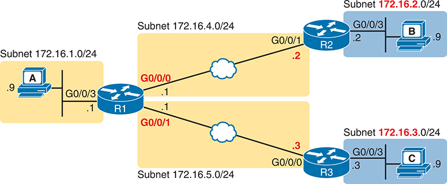

# Chapter 17


## Configuring IPv4 Addresses and Static Routes

This chapter covers the following exam topics:

1.0 Network Fundamentals

1.6 Configure and verify IPv4 addressing and subnetting

3.0 IP Connectivity

3.1 Interpret the components of routing table

3.1.a Routing protocol code

3.1.b Prefix

3.1.c Network mask

3.1.d Next hop

3.1.e Administrative distance

3.1.f Metric

3.1.g Gateway of last resort

3.2 Determine how a router makes a forwarding decision by default

3.2.a Longest prefix match

3.2.b Administrative distance

3.3 Configure and verify IPv4 and IPv6 static routing

3.3.a Default route

3.3.b Network route

3.3.c Host route

3.3.d Floating static

Routers route IPv4 packets. That simple statement actually carries a lot of hidden meaning. For routers to route packets, routers follow a routing process, and that routing process relies on information called IP routes. Each IP route lists a destination—an IP network, IP subnet, or some other group of IP addresses. Each route also lists instructions that tell the router where to forward packets sent to addresses in that IP network or subnet. For routers to do a good job of routing packets, routers need to have a detailed, accurate list of IP routes.

Routers use three methods to add IPv4 routes to their IPv4 routing tables. Routers first learn [connected routes](vol1_gloss.xhtml#gloss_077), which are routes for subnets attached to a router interface. Routers can also use [static routes](vol1_gloss.xhtml#gloss_378), which are routes created through a configuration command (**ip route**) that tells the router what route to put in the IPv4 [routing table](vol1_gloss.xhtml#gloss_354). And routers can use a routing protocol, in which routers tell each other about all their known routes, so that all routers can learn and build dynamic routes to all networks and subnets.

This chapter examines IP routing in depth with the most straightforward routes that can be added to a router's routing table. The router starts with a detailed look at the IP packet routing (forwarding process)—a process that relies on each router having useful IP routes in their routing tables. The second section then examines connected routes, which are routes to subnets that exist on the interfaces connected to the local router. The third section then examines static routes, which are routes the network engineer configures directly.

### "Do I Know This Already?" Quiz

Take the quiz (either here or use the PTP software) if you want to use the score to help you decide how much time to spend on this chapter. The letter answers are listed at the bottom of the page following the quiz. [Appendix C](vol1_appc.xhtml#appc), found both at the end of the book as well as on the companion website, includes both the answers and explanations. You can also find both answers and explanations in the PTP testing software.

**Table 17-1** "Do I Know This Already?" Foundation Topics Section-to-Question Mapping

| Foundation Topics Section | Questions |
| --- | --- |
| IP Routing | 1, 2 |
| Configuring IP Addresses and Connected Routes | 3 |
| Configuring Static Routes | 4–6 |

**[1](vol1_ch17.xhtml#ques17_1a).** Router R1 lists a route in its routing table. Which of the following answers list a fact from a route that the router uses when matching the packet's destination address? (Choose two answers.)

1. Mask
2. Next-hop router
3. Subnet ID
4. Outgoing interface

**[2](vol1_ch17.xhtml#ques17_2a).** PC1 sends an IP packet to PC2. To do so, PC1 sends the packet to Router R1, which routes it to Router R2, which routes it to Router R3, which routes it to the final destination (PC2). All links use Ethernet. How many routers de-encapsulate the IP packet from an Ethernet frame during its journey from PC1 to PC2?

1. 0
2. 1
3. 2
4. 3

**[3](vol1_ch17.xhtml#ques17_3a).** After configuring a working router interface with IP address/mask 10.1.1.100/26, which of the following routes would you expect to see in the output of the **show ip route** command? (Choose two answers.)

1. A connected route for subnet 10.1.1.64 255.255.255.192
2. A connected route for subnet 10.1.1.0 255.255.255.0
3. A local route for host 10.1.1.100 255.255.255.192
4. A local route for host 10.1.1.100 255.255.255.255
5. A local route for host 10.1.1.64 255.255.255.255

**[4](vol1_ch17.xhtml#ques17_4a).** Which of the following pieces of information could be listed in a correct **ip route** command on a local router? (Choose two answers.)

1. The local router's IP address on the link between the two routers
2. The next-hop router's IP address on the link between the two routers
3. The next-hop router's interface ID on the link between the two routers
4. The local router's interface ID on the link between the two routers

**[5](vol1_ch17.xhtml#ques17_5a).** Which of the following commands correctly configures a static route?

1. **ip route 10.1.3.0 255.255.255.0 10.1.130.253**
2. **ip route 10.1.3.0 serial 0**
3. **ip route 10.1.3.0 /24 10.1.130.253**
4. **ip route 10.1.3.0 /24 serial 0**

**[6](vol1_ch17.xhtml#ques17_6a).** A network engineer configures the **ip route 10.1.1.0 255.255.255.0 s0/0/0** command on a router and then issues a **show ip route** command from enable mode. No routes for subnet 10.1.1.0/24 appear in the output. Which of the following could be true?

1. The **ip route** command has incorrect syntax and was rejected in config mode.
2. Interface s0/0/0 is down.
3. The router has no up/up interfaces in Class A network 10.0.0.0.
4. The **ip route** command is missing a next-hop router IP address.

Answers to the "Do I Know This Already?" quiz:

**[1](vol1_appc.xhtml#ques17_1)** A, C

**[2](vol1_appc.xhtml#ques17_2)** D

**[3](vol1_appc.xhtml#ques17_3)** A, D

**[4](vol1_appc.xhtml#ques17_4)** B, C

**[5](vol1_appc.xhtml#ques17_5)** A

**[6](vol1_appc.xhtml#ques17_6)** B

### Foundation Topics

### IP Routing

IP routing—the process of forwarding IP packets—delivers packets across entire TCP/IP networks, from the device that originally builds the IP packet to the device that is supposed to receive the packet. In other words, IP routing delivers IP packets from the sending host to the destination host.

The complete end-to-end routing process relies on network layer logic on hosts and on routers. The sending host uses Layer 3 concepts to create an IP packet, forwarding the IP packet to the host's default gateway (default router). The process requires Layer 3 logic on the routers as well, by which the routers compare the destination address in the packet to their routing tables, to decide where to forward the IP packet next.

The routing process also relies on data-link and physical details at each link. IP routing relies on serial WAN links, Ethernet WAN links, Ethernet LANs, wireless LANs, and many other networks that implement data-link and physical layer standards. These lower-layer devices and protocols move the IP packets around the TCP/IP network by encapsulating and transmitting the packets inside data-link layer frames.

The previous two paragraphs summarize the key concepts about IP routing as introduced back in [Chapter 3](vol1_ch03.xhtml#ch03), "[Fundamentals of WANs and IP Routing](vol1_ch03.xhtml#ch03)." Next, this section reviews IP routing, while taking the discussion another step or two deeper, taking advantage of the additional depth of knowledge discussed in all the earlier chapters in this book.

#### IPv4 Routing Process Reference

Because you already saw the basics back in [Chapter 3](vol1_ch03.xhtml#ch03), this section collects the routing process into steps for reference. The steps use many specific Ethernet LAN terms discussed in [Parts II](vol1_part02.xhtml#part02) and [III](vol1_part03.xhtml#part03) of this book and some IP addressing terms discussed in [Part IV](vol1_part04.xhtml#part04). The upcoming descriptions and example then discuss these summaries of routing logic to make sure that each step is clear.

The routing process starts with the host that creates the IP packet. First, the host asks the question: Is the destination IP address of this new packet in my local subnet? The host uses its own IP address/mask to determine the range of addresses in the local subnet. Based on its own opinion of the range of addresses in the local subnet, a LAN-based host acts as follows:


Step 1. If the destination is local, send directly:

1. Find the destination host's MAC address. Use the already-known Address Resolution Protocol (ARP) table entry, or use ARP messages to learn the information.
2. Encapsulate the IP packet in a data-link frame, with the destination data-link address of the destination host.

Step 2. If the destination is not local, send to the default gateway:

1. Find the default gateway's MAC address. Use the already-known Address Resolution Protocol (ARP) table entry, or use ARP messages to learn the information.
2. Encapsulate the IP packet in a data-link frame, with the destination data-link address of the default gateway.

[Figure 17-1](vol1_ch17.xhtml#ch17fig01) summarizes these same concepts. In the figure, host A sends a local packet directly to host D. However, for packets to host B, on the other side of a router and therefore in a different subnet, host A sends the packet to its default router (R1). (As a reminder, the terms *default gateway* and *default router* are synonyms.)


**Figure 17-1** *Host Routing Logic Summary*

In the schematic, a P C representing host A sends a local packet through S W 1 to another P C representing host D. Again, host A sends the packet through S W 1 to its remote router (R 1), which sends the packets to host B, on the other side of the router.

Routers have a little more routing work to do as compared with hosts. While the host logic began with an IP packet sitting in memory, a router has some work to do before getting to that point. With the following five-step summary of a router's routing logic, the router takes the first two steps just to receive the frame and extract the IP packet, before thinking about the packet's destination address at Step 3. The steps are as follows:


1. For each received data-link frame, choose whether or not to process the frame. Process it if

   1. The frame has no errors (per the data-link trailer Frame Check Sequence [FCS] field).
   2. The frame's destination data-link address is the router's address (or an appropriate multicast or broadcast address).
2. If choosing to process the frame at Step 1, de-encapsulate the packet from inside the data-link frame.
3. Make a routing decision. To do so, compare the packet's destination IP address to the routing table and find the route that matches the destination address. This route identifies the [outgoing interface](vol1_gloss.xhtml#gloss_294) of the router and possibly the [next-hop router](vol1_gloss.xhtml#gloss_282).
4. Encapsulate the packet into a data-link frame appropriate for the outgoing interface. When forwarding out LAN interfaces, use ARP as needed to find the next device's MAC address.
5. Transmit the frame out the outgoing interface, as listed in the matched IP route.

This routing process summary lists many details, but sometimes you can think about the routing process in simpler terms. For example, leaving out some details, this paraphrase of the step list details the same big concepts:

The router receives a frame, removes the packet from inside the frame, decides where to forward the packet, puts the packet into another frame, and sends the frame.

To give you a little more perspective on these steps, [Figure 17-2](vol1_ch17.xhtml#ch17fig02) breaks down the same five-step routing process as a diagram. The figure shows a packet arriving from the left, entering a router Ethernet interface, with an IP destination of host C. The figure shows the packet arriving, encapsulated inside an Ethernet frame (both header and trailer).


**Figure 17-2** *Router Routing Logic Summary*

Step 1 shows Router R 1 noting the received Ethernet frame passes the F C S (Ethernet Trailer) check and the I P packet with data passes from inside the Ethernet frame's header and trailer. Step 2 de-encapsulates the I P packet. Step 3 compares the I P packet in the routing table. Step 4 encapsulates the I P packet inside a new data-link frame's header and trailer. Step 5 transmits the I P packet on the right.

Router R1 processes the frame and packet as shown with the numbers in the figure, matching the same five-step process described just before the figure, as follows:

1. Router R1 notes that the received Ethernet frame passes the FCS check and that the destination Ethernet MAC address is R1's MAC address, so R1 processes the frame.
2. R1 de-encapsulates the IP packet from inside the Ethernet frame's header and trailer.
3. R1 compares the IP packet's destination IP address to R1's IP routing table.
4. R1 encapsulates the IP packet inside a new data-link frame, in this case, inside a High-Level Data Link Control (HDLC) header and trailer.
5. R1 transmits the IP packet, inside the new HDLC frame, out the serial link on the right.

Note

This chapter uses several figures that show an IP packet encapsulated inside a data-link layer frame. These figures often show both the data-link header as well as the data-link trailer, with the IP packet in the middle. The IP packets all include the IP header, plus any encapsulated data.

#### An Example of IP Routing

The next several pages walk you through an example that discusses each routing step, in order, through multiple devices. The example uses a case in which host A (172.16.1.9) sends a packet to host B (172.16.2.9), with host routing logic and the five steps showing how R1 forwards the packet.

[Figure 17-3](vol1_ch17.xhtml#ch17fig03) shows a typical IP addressing diagram for an IPv4 network with typical address abbreviations. The diagram can get a little too messy if it lists the full IP address for every router interface. When possible, these diagrams usually list the subnet and then the last octet or two of the individual IP addresses—just enough so that you know the IP address but with less clutter. For example, host A uses IP address 172.16.1.9, taking from subnet 172.16.1.0/24 (in which all addresses begin 172.16.1) and the .9 beside the host A icon. As another example, R1 uses address 172.16.1.1 on its LAN interface, 172.16.4.1 on one serial interface, and 172.16.5.1 on an Ethernet WAN interface.


**Figure 17-3** *IPv4 Network Used to Show Five-Step Routing Example*

Host A with subnet 172.16.1.0/24 and the .9 beside the host A icon sends a packet to host B, through R 1, G0/0, and the .1 beside the icon. R 1 with subnet 172.16.4.0/24, S0/0/0, and .1, passes the packet to R 2, S0/0/1, and .2 through serial line. The R 2, G0/0, and .2 passes the packet to host B with Subnet 172.16.2.0/24 and the .9 beside the host B icon. Host A again sends a packet to host C, through R 1, G0/0, and the .1 beside the icon. R 1 with subnet 172.16.5.0/24, G0/1/0, and .1, passes the packet to R 3, G0/0/0, and .3 through Ethernet W A N. The R 3, G0/0, and .3 passes the packet to host C with Subnet 172.16.3.0/24 and the .9 beside the host C icon.

Now on to the example, with host A (172.16.1.9) sending a packet to host B (172.16.2.9).

##### Host Forwards the IP Packet to the Default Router (Gateway)

In this example, host A uses some application that sends data to host B (172.16.2.9). After host A has the IP packet sitting in memory, host A's logic reduces to the following:

* My IP address/mask is 172.16.1.9/24, so my local subnet contains numbers 172.16.1.0–172.16.1.255 (including the subnet ID and subnet broadcast address).
* The destination address is 172.16.2.9, which is clearly not in my local subnet.
* Send the packet to my default gateway, which is set to 172.16.1.1.
* To send the packet, encapsulate it in an Ethernet frame. Make the destination MAC address be R1's G0/0 MAC address (host A's default gateway).

[Figure 17-4](vol1_ch17.xhtml#ch17fig04) pulls these concepts together, showing the destination IP address and destination MAC address in the frame and packet sent by host A in this case. Note that the figure uses a common drawing convention in networking, showing an Ethernet as a few lines, hiding all the detail of the Layer 2 switches.


**Figure 17-4** *Host A Sends Packet Through Router R1 to Host B*

Host A with its I P address: 172.16.1.9/24 and gateway address: 172.16.1.1, contains an A R P table on its left showing its gateway address: 172.16.1.1 and destination M A C address: 0200.0101.0101. It sends the packet to R 1, G0/0, through encapsulating it in an Ethernet frame with the I P address 172.16.2.9 and M A C address 0200.0101.0101.

##### Routing Step 1: Decide Whether to Process the Incoming Frame

Routers receive many frames in an interface, particularly LAN interfaces. However, a router can and should ignore some of those frames. So, the first step in the routing process begins with a decision of whether a router should process the frame or silently discard (ignore) the frame.

First, the router does a simple but important check (Step 1A in the process summary) so that the router ignores all frames that had bit errors during transmission. The router uses the data-link trailer's FCS field to check the frame, and if errors occurred in transmission, the router discards the frame. (The router makes no attempt at error recovery; that is, the router does not ask the sender to retransmit the data.)

The router also checks the destination data-link address (Step 1B in the summary) to decide whether the frame is intended for the router. For example, frames sent to the router's unicast MAC address for that interface are clearly sent to that router. However, a router can actually receive a frame sent to some other unicast MAC address, and routers should ignore these frames.

For example, think back to how LAN switches forward unknown unicast frames—frames for which the switch does not list the destination MAC address in the MAC address table. The LAN switch floods those frames. The result? Routers sometimes receive frames destined for some other device, with some other device's MAC address listed as the destination MAC address. Routers should ignore those frames.

[Figure 17-5](vol1_ch17.xhtml#ch17fig05) shows a working example in which host A sends a frame destined for R1's MAC address. After receiving the frame, R1 confirms with the FCS that no errors occurred, and R1 confirms that the frame is destined for R1's MAC address (0200.0101.0101 in this case). All checks have been passed, so R1 will process the frame. (Note that the large rectangle in the figure represents the internals of Router R1.)


**Figure 17-5** *Routing Step 1, on Router R1: Checking FCS and Destination MAC*

The internal components of Router R 1. On the left side, there is G0/0 port with a gateway address of 172.16.1.1 and a M A C address of 0200.0101.0101. On the right side, there are G0/1/0 and S0/0/0 ports. The I P packet within the frame is highlighted with the notes '0200.0101.0101: Is this my G0/0 M A C question mark' on the left and 'F C S: Is this frame unchanged question mark' on the right."

##### Routing Step 2: De-encapsulation of the IP Packet

After the router knows that it ought to process the received frame (per Step 1), the next step is relatively simple: de-encapsulating the packet. In router memory, the router no longer needs the original frame's data-link header and trailer, so the router removes and discards them, leaving the IP packet, as shown in [Figure 17-6](vol1_ch17.xhtml#ch17fig06). Note that the destination IP address remains unchanged (172.16.2.9).


**Figure 17-6** *Routing Step 2 on Router R1: De-encapsulating the Packet*

The internal components of Router R 1. On the left side, there is G0/0 port and on the right side, there are G0/1/0 and S0/0/0 ports. The I P packet within the frame is De-encapsulated with its destination I P address: 172.16.2.9.

##### Routing Step 3: Choosing Where to Forward the Packet

While routing Step 2 required little thought, Step 3 requires the most thought of all the steps. At this point, the router needs to make a choice about where to forward the packet next. That process uses the router's IP routing table, with some matching logic to compare the packet's destination address with the table.

First, an IP routing table lists multiple routes. Each individual route contains several facts, which in turn can be grouped as shown in [Figure 17-7](vol1_ch17.xhtml#ch17fig07). Part of each route is used to match the destination address of the packet, while the rest of the route lists forwarding instructions: where to send the packet next.


**Figure 17-7** *Routing Step 3 on Router R1: Matching the Routing Table*

The internal components of Router R 1. On the left side are the G0/0 port and on the right side are the G0/1/0 and S0/0/0 ports. An I P packet with a destination IP address of 172.16.2.9 undergoes I P v 4 routing table processing. In the first block, the subnet matches with the second row of the subnet column while the mask is the same in all rows. Forwarding block directs I P address to second row of Next Router: 172.16.4.2 and Out Interface: S0/0/0 columns.

Focus on the entire routing table for a moment, and notice the fact that it lists five routes. Earlier, [Figure 17-3](vol1_ch17.xhtml#ch17fig03) showed the entire example network, with five subnets, so R1 has a route for each of the five subnets.

Next, look at the part of the five routes that Router R1 will use to match packets. To fully define each subnet, each route lists both the subnet ID and the subnet mask. When matching the IP packet's destination with the routing table, the router looks at the packet's destination IP address (172.16.2.9) and compares it to the range of addresses defined by each subnet. Specifically, the router looks at the subnet and mask information; with a little math, the router can figure out in which of these subnets 172.16.2.9 resides (the route for subnet 172.16.2.0/24).

Finally, look to the right side of the figure, to the forwarding instructions for these five routes. After the router matches a specific route, the router uses the forwarding information in the route to tell the router where to send the packet next. In this case, the router matched the route for subnet 172.16.2.0/24, so R1 will forward the packet out its own interface S0/0/0, to Router R2 next, listed with its next-hop router IP address of 172.16.4.2.

Note

Routes for remote subnets typically list both an outgoing interface and next-hop router IP address. Routes for subnets that connect directly to the router list only the outgoing interface because packets to these destinations do not need to be sent to another router.

##### Routing Step 4: Encapsulating the Packet in a New Frame

At this point, the router knows how it will forward the packet. However, routers cannot forward a packet without first wrapping a data-link header and trailer around it (encapsulation).

Encapsulating packets for serial links does not require a lot of thought, but the current CCNA exam does not require a lot from us. Point-to-point serial WAN links use either HDLC (the default) or PPP as the data-link protocol. However, we can ignore any data-link logic, even ignoring data-link addressing, because serial links have only two devices on the link: the sender and the then-obvious receiver; the data-link addressing does not matter. In this example, R1 forwards the packet out S0/0/0, after encapsulating the packet inside an HDLC frame, as shown in [Figure 17-8](vol1_ch17.xhtml#ch17fig08).


**Figure 17-8** *Routing Step 4 on Router R1: Encapsulating the Packet*

The internal components of Router R 1. On the left side are the G0/0 port and on the right side are the G0/1/0 and S0/0/0 ports. An I P packet with a destination IP address of 172.16.2.9 undergoes encapsulation inside the H D L C frame.

Note that with some other types of data links, the router has a little more work to do at this routing step. For example, sometimes a router forwards packets out an Ethernet interface. To encapsulate the IP packet, the router would need to build an Ethernet header, and that Ethernet header's destination MAC address would need to list the correct value.

For example, consider a packet sent by that same PC A (172.16.1.9) in [Figure 17-3](vol1_ch17.xhtml#ch17fig03) but with a destination of PC C (172.16.3.9). When R1 processes the packet, R1 matches a route that tells R1 to forward the packet out R1's G0/1/0 Ethernet interface to 172.16.5.3 (R3) next. R1 needs to put R3's MAC address in the header, and to do that, R1 uses its IP ARP table information, as shown in [Figure 17-9](vol1_ch17.xhtml#ch17fig09). If R1 did not have an ARP table entry for 172.16.5.3, R1 would first have to use ARP to learn the matching MAC address.


**Figure 17-9** *Routing Step 4 on Router R1 with a LAN Outgoing Interface*

Host A with subnet 172.16.1.0/24 and the .9 beside the host A icon sends a packet to host C, through R 1, G0/0, and the .1 beside the icon, which highlights an table consisting 172.16.5.3 and 0200.0303.9999. R 1 with subnet 172.16.5.0/24, G0/1/0, and .1, passes the packet to R 3, G0/0/0, and .3 through Ethernet W A N. The I P packet within the Ethernet frame is shows its destination I P address: 172.16.3.9 and a M A C address of 0200.0303.9999. The R 3, G0/0, and .3 passes the packet to host C with Subnet 172.16.3.0/24 and the .9 beside the host C icon.

##### Routing Step 5: Transmitting the Frame

After the frame has been prepared, the router simply needs to transmit the frame. The router might have to wait, particularly if other frames are already waiting their turn to exit the interface.

### Configuring IP Addresses and Connected Routes

Cisco routers enable IPv4 routing globally, by default. Then, to make the router be ready to route packets on a particular interface, the interface must be configured with an IP address and the interface must be configured such that it comes up, reaching a "line status up, line protocol up" state. Only at that point can routers route IP packets in and out a particular interface.

After a router can route IP packets out one or more interfaces, the router needs some routes. Routers can add routes to their routing tables through three methods:


**Connected routes:** Added because of the configuration of the **ip address** interface subcommand on the local router

**Static routes:** Added because of the configuration of the **ip route** global command on the local router

**Routing protocols:** Added as a function by configuration on all routers, resulting in a process by which routers dynamically tell each other about the network so that they all learn routes

This second of three sections discusses several variations on how to configure connected routes, while the next major section discusses static routes.

#### Connected Routes and the ip address Command

A Cisco router automatically adds a route to its routing table for the subnet connected to each interface, assuming that the following two facts are true:


* The interface is in a working state. In other words, the interface status in the **show interfaces** command lists a line status of up and a protocol status of up.
* The interface has an IP address assigned through the **ip address** interface subcommand.

The concept of connected routes is relatively basic. The router, of course, needs to know the subnet number connected to each of its interfaces, so the router can route packets to that subnet. The router does the math, taking the interface IP address and mask and calculating the subnet ID. However, the router only needs that route when the interface is up and working, so the router includes a connected route in the routing table only when the interface is working.

[Example 17-1](vol1_ch17.xhtml#exa17_1) shows the connected routes on Router R1 in [Figure 17-10](vol1_ch17.xhtml#ch17fig10). The first part of the example shows the configuration of IP addresses on all three of R1's interfaces. The end of the example lists the output from the **show ip route** command, which lists these routes with a C as the route code, meaning *connected*.


**Figure 17-10** *Sample Network to Show Connected Routes*

Host A with subnet 172.16.1.0/24 and the .9 beside the host A icon sends a packet to host B, through R 1, G0/0, and the .1 beside the icon. R 1 with subnet 172.16.4.0/24, S0/0/0, and .1, passes the packet to R 2, S0/0/1, and .2 through serial line. The R 2, G0/0, and .2 passes the packet to host B with Subnet 172.16.2.0/24 and the .9 beside the host B icon. Host A again sends a packet to host C, through R 1, G0/0, and the .1 beside the icon. R 1 with subnet 172.16.5.0/24, G0/1/0, and .1, passes the packet to R 3, G0/0/0, and .3 through Ethernet W A N. The R 3, G0/0, and .3 passes the packet to host C with Subnet 172.16.3.0/24 and the .9 beside the host C icon.

**Example 17-1** *Connected and Local Routes on Router R1*

[Click here to view code image](vol1_ch17_images.xhtml#f0437-01)

```
! Excerpt from show running-config follows...
!
interface GigabitEthernet0/0
 ip address 172.16.1.1 255.255.255.0
!
interface Serial0/0/0
 ip address 172.16.4.1 255.255.255.0
!
interface GigabitEthernet0/1/0
 ip address 172.16.5.1 255.255.255.0

R1# show ip route
Codes: L - local, C - connected, S - static, R - RIP, M - mobile, B - BGP
       D - EIGRP, EX - EIGRP external, O - OSPF, IA - OSPF inter area
       N1 - OSPF NSSA external type 1, N2 - OSPF NSSA external type 2
       E1 - OSPF external type 1, E2 - OSPF external type 2
       i - IS-IS, su - IS-IS summary, L1 - IS-IS level-1, L2 - IS-IS level-2
       ia - IS-IS inter area, * - candidate default, U - per-user static route
       o - ODR, P - periodic downloaded static route, H - NHRP, l - LISP
       a - application route
       + - replicated route, % - next hop override, p - overrides from PfR

Gateway of last resort is not set

      172.16.0.0/16 is variably subnetted, 6 subnets, 2 masks
C        172.16.1.0/24 is directly connected, GigabitEthernet0/0
L        172.16.1.1/32 is directly connected, GigabitEthernet0/0
C        172.16.4.0/24 is directly connected, Serial0/0/0
L        172.16.4.1/32 is directly connected, Serial0/0/0
C        172.16.5.0/24 is directly connected, GigabitEthernet0/1/0
L        172.16.5.1/32 is directly connected, GigabitEthernet0/1/0
```

Each time you do a lab or see an example with output from the **show ip route** command, look closely at the heading line for each classful network and the indented lines that follow. The indented lines list routes to specific subnets. In [Example 17-1](vol1_ch17.xhtml#exa17_1), the heading line shows Class B network 172.16.0.0 as "172.16.0.0/16", with /16 representing the default mask for a Class B network. Why? IOS groups the output by Class A, B, or C network. In this case, the output shows a heading line that tells us that the following indented lines have to do with network 172.16.0.0/16.

Take a moment to look closely at each of the three highlighted routes below the heading line that references Class B network 172.16.0.0. Each lists a C in the first column, and each has text that says "directly connected"; both identify the route as connected to the router. The early part of each route lists the matching parameters (subnet ID and mask), as shown in the earlier example in [Figure 17-7](vol1_ch17.xhtml#ch17fig07). The end of each of these routes lists the outgoing interface.

Note that the router also automatically produces a different kind of route, called a *local route*. The local routes define a route for the one specific IP address configured on the router interface. Each local route has a /32 prefix length, defining a *host route*, which defines a route just for that one IP address. For example, the last local route, for 172.16.5.1/32, defines a route that matches only the IP address of 172.16.5.1. Routers use these local routes that list their own local IP addresses to more efficiently forward packets sent to the router itself.

The **show ip route** command in the example reveals a few of the specific subitems within exam topic 3.1 (per CCNA 200-301 V1.1), with later examples in this chapter revealing even more details. This section shows details related to the following terms from the exam topics:

* **Routing Protocol Code:** The legend at the top of the **show ip route** output (about nine lines) lists all the routing protocol codes (exam topic 3.1.a). This book references the codes for connected routes (C), local (L), static (S), and OSPF (O).
* **Prefix:** The word *prefix* (exam topic 3.1.b) is just another name for subnet ID.
* **Mask:** Each route lists a prefix (subnet ID) and network mask (exam topic 3.1.c) in prefix format, for example, /24.

#### Common Mistakes with the ip address Subcommand

If you follow a correct IP address plan, the **ip address** commands on your routers should be accepted. They should also work correctly to support endpoint hosts in LANs in their roles as the default gateway. However, several mistakes are possible with this command, mistakes that might not be obvious at first glance.

This next topic examines a few of those mistakes, using [Figure 17-11](vol1_ch17.xhtml#ch17fig11) as a backdrop. The figure shows a more detailed view of the LAN connected to Router R1 in [Figure 17-10](vol1_ch17.xhtml#ch17fig10), now with two PCs in it.


**Figure 17-11** *More Detailed and Expanded View of Router R1 LAN*

The schematic illustrates two subnet hosts are connected to a router. The above information says that the subnet 172.16.1.0/24 has a subnet ID of 172.16.1.0, a lowest possible IP address of 172.16.1.1, a highest possible IP address of 172.16.1.254, and a broadcast address of 172.16.1.255. Host A 1 has an I P address of 172.16.1.9 and a gateway of 172.16.1.1. Host A 2 has an I P address of 172.16.1.10 and a gateway of 172.16.1.1. Both the hosts connects to the router at G0/0 and G0/1 ports, respectively.

First, IOS rejects the **ip address** command in configuration mode if it uses a reserved number in the subnet, such as the subnet ID or the subnet broadcast address. [Example 17-2](vol1_ch17.xhtml#exa17_2) shows three rejected **ip address** commands. The first attempts to configure the subnet ID as the address, while the second attempts to configure the subnet broadcast address. The final example shows the command with an invalid subnet mask (which is also rejected). Note that the error message does not reveal the specific reason, instead giving a cryptic reference to the idea that the values have a problem when using that mask.

**Example 17-2** *IOS Rejects **ip address** Commands with Reserved Addresses*

[Click here to view code image](vol1_ch17_images.xhtml#f0439-01)

```
R1# configure terminal
Enter configuration commands, one per line.  End with CNTL/Z.
R1(config)# interface gigabitEthernet 0/0
R1(config-if)# ip address 172.16.1.0 255.255.255.0
Bad mask /24 for address 172.16.1.0
R1(config-if)# ip address 172.16.1.255 255.255.255.0
Bad mask /24 for address 172.16.1.255
R1(config-if)# ip address 172.16.1.1 255.0.255.0
Bad mask 0xFF00FF00 for address 172.16.1.1
R1(config-if)#
```

You can also configure the **ip address** command with values that IOS accepts but that are incorrect per your address plan—resulting in problems in the network. For example, looking at [Figure 17-11](vol1_ch17.xhtml#ch17fig11), the default gateway setting on the two PCs implies that router R1's address should be 172.16.1.1. Router R1 would accept the **ip address 172.16.1.2 255.255.255.0** command on its G0/0 interface, setting the wrong address value—but the router has no mechanism to know that its address does not match the PC's default gateway settings. Instead, the PCs cannot communicate outside the subnet. The solution: Configure the correct address on Router R1.

As a third issue, one router may connect only one interface to a subnet. In [Figure 17-11](vol1_ch17.xhtml#ch17fig11), Router R1 has two interfaces (G0/0 and G0/1) connected to the same LAN. If you attempted to assign both interfaces an IP address in that same 172.16.1.0/24 subnet, and both interfaces were in an up/up state, IOS would reject the second **ip address** command. [Example 17-3](vol1_ch17.xhtml#exa17_3) shows that sequence, with R1's G0/0 configured first and R1's G0/1 configured second (with the rejection).

**Example 17-3** *IOS Rejects **ip address** Command for Second Interface in the Same Subnet*

[Click here to view code image](vol1_ch17_images.xhtml#f0439-02)

```
R1# configure terminal
Enter configuration commands, one per line.  End with CNTL/Z.
R1(config)# interface gigabitEthernet 0/0
R1(config-if)# ip address 172.16.1.1 255.255.255.0
R1(config)# interface gigabitEthernet 0/1
R1(config-if)# ip address 172.16.1.2 255.255.255.0
% 172.16.1.0 overlaps with GigabitEthernet0/0
R1(config-if)#
```

#### The ARP Table on a Cisco Router

After a router has added these connected routes, the router can route IPv4 packets between those subnets. To do so, the router makes use of its IP ARP table.

The IPv4 [ARP table](vol1_gloss.xhtml#gloss_026) lists the IPv4 address and matching MAC address of hosts connected to the same subnet as the router. When forwarding a packet to a host on the same subnet, the router encapsulates the packet, with a destination MAC address as found in the ARP table. If the router wants to forward a packet to an IP address on the same subnet as the router but does not find an ARP table entry for that IP address, the router will use ARP messages to learn that device's MAC address.

[Example 17-4](vol1_ch17.xhtml#exa17_4) shows R1's ARP table based on the previous example. The output lists R1's own IP address of 172.16.1.1, with an age of -, meaning that this entry does not time out. Dynamically learned ARP table entries have an upward counter, like the 35-minute value for the ARP table entry for IP address 172.16.1.9. By default, IOS will time out (remove) an ARP table entry after 240 minutes in which the entry is not used. (IOS resets the timer to 0 when an ARP table entry is used.) Note that to experiment in the lab, you might want to empty all dynamic entries (or a single entry for one IP address) using the **clear ip arp** [*ip-address*] EXEC command.

**Example 17-4** *Displaying a Router's IP ARP Table*

[Click here to view code image](vol1_ch17_images.xhtml#f0440-01)

```
R1# show ip arp
Protocol  Address        Age (min) Hardware Addr   Type   Interface
Internet  172.16.1.1            -  0200.0101.0101  ARPA   GigabitEthernet0/0
Internet  172.16.1.9           35  0200.aaaa.aaaa  ARPA   GigabitEthernet0/0
```

Thinking about how Router R1 forwards a packet to host A (172.16.1.9), over that final subnet, R1 does the following:

1. R1 looks in the ARP table for an entry for 172.16.1.9.
2. R1 encapsulates the IP packet in an Ethernet frame, adding destination 0200.aaaa.aaaa to the Ethernet header (as taken from the ARP table).
3. R1 transmits the frame out interface G0/0.

### Configuring Static Routes

In real networks, you will find connected routes on every router, which the routers create for subnets connected to their interfaces. You will use dynamic routing protocols like OSPF and EIGRP to learn routes for the rest of the subnets in the enterprise, routes for subnets remote from the local router.

Enterprises use static routes—that is, routes added to a routing table through direct configuration of the **ip route** command—much less often than connected routes and routes learned with dynamic routing protocols. However, static routes can be useful at times. Studying static routes also happens to be a wonderful learning tool as well. And, of course, the exam topics list several variations of static routes, so you need to learn the topic for the exam.

Note

The CCNA 200-301 exam V1.1, exam topic 3.3, subdivides IPv4 (and IPv6) static routes into four subtopics: network routes, default routes, host routes, and floating static routes. This section explains all four types for IPv4 as noted in the upcoming headings.

#### Static Network Routes

IOS allows the definition of individual static routes using the **ip route** global configuration command. Every **ip route** command defines a destination subnet with a subnet ID and mask. The command also lists the forwarding instructions, listing the outgoing interface or the next-hop router's IP address (or both). IOS then takes that information and adds that route to the IP routing table.

A static [network route](vol1_gloss.xhtml#gloss_280) defines either a subnet or an entire Class A, B, or C network in the **ip route** command. In contrast, a [default route](vol1_gloss.xhtml#gloss_092) defines the set of all destination IP addresses, while a [host route](vol1_gloss.xhtml#gloss_174) defines a single IP address (that is, an address of one host).

[Figure 17-12](vol1_ch17.xhtml#ch17fig12) shows a new network diagram to be used in the upcoming examples. Note that the design uses the same subnets as some previous figures in this chapter, but it uses two GigabitEthernet WAN links and no serial links.




**Figure 17-12** *Sample Network Used in Static Route Configuration Examples*

Host A with subnet 172.16.1.0/24 and the .9 beside the host A icon sends a packet to host B, through R 1, G0/0/3, and the .1 beside the icon. R 1 with subnet 172.16.4.0/24, G0/0/0, and .1, passes the packet to R 2, G0/0/1, and .2 through Ethernet W A N. The R 2, G0/0/3, and .2 passes the packet to host B with Subnet 172.16.2.0/24 and the .9 beside the host B icon. Host A again sends a packet to host C, through R 1, G0/0/3, and the .1 beside the icon. R 1 with subnet 172.16.5.0/24, G0/0/1, and .1, passes the packet to R 3, G0/0/0, and .3 through Ethernet W A N. The R 3, G0/0/3, and .3 passes the packet to host C with Subnet 172.16.3.0/24 and the .9 beside the host C icon.

[Figure 17-13](vol1_ch17.xhtml#ch17fig13) shows the concepts behind the potential network routes on Router R1 for the subnet to the right of Router R2 (subnet 172.16.2.0/24). To create that static network route on R1, R1 will configure the subnet ID and mask. For the forwarding instructions, R1 will configure either R1's outgoing interface (G0/0/0) or R2's IP address as the next-hop router IP address (172.16.4.2).


**Figure 17-13** *Static Route Configuration Concept*

Host 1 with Subnet 172.16.1.0/24 is connected to router R1. Router R1, with subnet 172.16.4.0/24, has two interfaces: G0/0, connected to Host 1, and G0/0/0, connected to Subnet 172.16.4.2 on another router, R2, via Ethernet WAN. Router R2, with interface G0/0, connects to Host 2 with Subnet 172.16.2.0/24. G0/0/0 is marked as 'Send out Here', 172.16.4.2 is marked as 'Send to There', and the routing process from R1 to Host 2 is marked as 'For Packets Destined to This Subnet'

[Example 17-5](vol1_ch17.xhtml#exa17_5) shows the configuration of a couple of sample static routes, using the three-router topology in [Figure 17-12](vol1_ch17.xhtml#ch17fig12). The example shows static routes on R1, one route for each of the two subnets on the right side of the figure. The first command defines a route for subnet 172.16.2.0 255.255.255.0, the subnet off Router R2. The forwarding instruction parameters list only R1's outgoing interface, G0/0/0. This route basically states: To send packets to the subnet off Router R2, send them out my local G0/0/0 interface.

**Example 17-5** *Static Routes Added to R1*

[Click here to view code image](vol1_ch17_images.xhtml#f0442-01)

```
ip route 172.16.2.0 255.255.255.0 G0/0/0
ip route 172.16.3.0 255.255.255.0 172.16.5.3
```

The second route has the same kind of logic, except listing the neighboring router's IP address on the WAN link as the next-hop router. This route basically says this: To send packets to the subnet off Router R3 (172.16.3.0 255.255.255.0), send the packets to R3's WAN IP address next (172.16.5.3).

##### Verifying Static Network Routes

Static routes, when seen in the IP routing table, list the same parameters included in the configuration command. To see how, closely compare the output in [Example 17-6](vol1_ch17.xhtml#exa17_6)'s **show ip route static** command. This command lists only static routes, in this case listing the two static routes configured in [Example 17-5](vol1_ch17.xhtml#exa17_5). First, the two lines listing the static routes begin with legend code S, meaning static. Both list the subnet and mask defined in the respective routes, although the output uses prefix-style masks. But note the key difference: for the route configured with only the outgoing interface, the route lists only the outgoing interface, and for the route configured with only the next-hop IP address, the output lists only the next-hop address.

**Example 17-6** *Static Routes Added to R1*

[Click here to view code image](vol1_ch17_images.xhtml#f0442-02)

```
R1# show ip route static
Codes: L - local, C - connected, S - static, R - RIP, M - mobile, B - BGP
! Legend lines omitted for brevity
      172.16.0.0/16 is variably subnetted, 8 subnets, 2 masks
S        172.16.2.0/24 is directly connected, GigabitEthernet0/0/0S
S        172.16.3.0/24 [1/0] via 172.16.5.3
```

Although statically configured, IOS adds and removes static routes from the routing table over time based on whether the outgoing interface is working or not. For example, in this case, if R1's G0/0/0 interface fails, R1 removes the static route to 172.16.2.0/24 from the IPv4 routing table. Later, when the interface comes up again, IOS adds the route back to the routing table.

[Examples 17-3](vol1_ch17.xhtml#exa17_3) and [17-4](vol1_ch17.xhtml#exa17_4) show how to configure static network routes to support left-to-right packet flow in [Figure 17-12](vol1_ch17.xhtml#ch17fig12), but routers need routes for all subnets to support packet flow in all directions. Even in a small lab used for CCNA learning, if you use only static routes, you need static routes for all subnets for both directions of packet flow. For instance, in [Figure 17-13](vol1_ch17.xhtml#ch17fig13), to support packet flow from PC A to PC B, you need:

A route on Router R1 for PC B's subnet 172.16.2.0/24

A route on Router R2 for PC A's subnet 172.16.1.0/24

##### Ethernet Outgoing Interfaces and Proxy ARP

While both styles of static routes in [Example 17-5](vol1_ch17.xhtml#exa17_5) work—with either next-hop IP address or outgoing interface—using the next-hop address is better. Both work, but using a next-hop address causes much less confusion when the staff begin to wonder about how those static routes work behind the scenes. In short, using the next-hop address does not force the use of proxy ARP on the neighboring router, but using an outgoing interface on an Ethernet link does require proxy ARP.

This section attempts to explain how proxy ARP works and how static routes make use of it. To begin, consider this general definition of proxy ARP:

1. A router receives in interface X an ARP request, whose target is not in the subnet connected to interface X.
2. The router has a route to forward packets to that target address, and that route should not forward the packet back out onto the same interface causing a loop. In other words, the router has a useful route to forward packets to the target.
3. The router is therefore willing and useful to act as a proxy for the target host. To do so, the router supplies its own MAC address in the ARP Reply.

While true, it helps to work through an example. Consider [Example 17-5](vol1_ch17.xhtml#exa17_5) again with the **ip route 172.16.2.0 255.255.255.0 G0/0/0** command. Imagine PC A sends a packet to PC B at address 172.16.2.9. The packet arrives at Router R1, R1 matches the packet to the static route for subnet 172.16.2.0/24, and now Router R1 must decide from the forwarding instructions how to forward the packet. Router R1 uses logic as follows:

1. The route's forwarding instructions show the destination subnet as connected to interface G0/0/0. That causes R1 to send an ARP Request looking for 172.16.2.9 as the target address. In effect, R1's route makes R1 behave as if the destination subnet 172.16.2.0/24 is connected to port G0/0/0. Of course, PC B will not receive the ARP Request, as it resides on the other side of a router.
2. R2 receives R1's ARP for target 172.16.2.9. The ARP meets the requirements of proxy ARP (an address not in the local subnet, but R2 has a useful route matching address 172.16.2.9). R2 sends an ARP reply listing R2's interface G0/0/1 MAC—a proxy ARP Reply.
3. R1 receives the ARP Reply, so R1 can now forward packets meant for 172.16.2.9. R1 forwards these packets encapsulated in an Ethernet frame, with R2's G0/0/1 MAC as the destination MAC address.
4. R2 receives the frame and routes the encapsulated packet to PC B, as with normal routing processes.

As you can understand from the previous page or so, the underlying logic behind using an outgoing Ethernet interface on a route requires quite a lot of analysis. For real-world applications, use static routes with a next-hop address instead.

#### Static Default Routes

When a router tries to route a packet, the router might not match the packet's destination IP address with any route. When that happens, the router normally just discards the packet.

Routers can use a *default route* to match all packets, so that if a packet does not match any other more specific route in the routing table, the router will forward the packet based on the default route. Routers can learn default routes with a routing protocol, or you can configure a default static route.

[Figure 17-14](vol1_ch17.xhtml#ch17fig14) shows one classic example in which a company has many branch office routers, like R2 and R3 in the figure, each of which has a single WAN connection. No matter how many routes a router might learn for specific subnets in those isolated branch offices, all the forwarding details in those routes would be the same for each route. For instance, all routes on Router R2, for remote subnets, would use outgoing interface G0/0/1 and next-hop address 172.16.4.1. Router R2 could instead use a default route, which matches all destinations, with the same forwarding instructions.


**Figure 17-14** *Example Use of Static Default Routes*

Subnet 172.16.1.0/24 is connected to router R 1, which has connections to R 2 and R 3. R 1 with I P route 172.16.4.1 connects to R 2, G0/0/1, which has the note: Send All Non-local Packets to Core. R 1 with subnet 172.16.5.0/24 connects to R 3, which is connected to subnet 172.16.3.0/24. The router connections are through the Ethernet W A N.

IOS allows the configuration of a static default route by using special values for the subnet and mask fields in the **ip route** command: 0.0.0.0 and 0.0.0.0. For example, the command **ip route 0.0.0.0 0.0.0.0 172.16.4.1** creates the static route depicted in [Figure 17-14](vol1_ch17.xhtml#ch17fig14) on Router R2—a route that matches all IP packets—and sends those packets to R1 (172.16.4.1). [Example 17-7](vol1_ch17.xhtml#exa17_7) shows that static default route, but take care to notice the unexpected location of the route for 0.0.0.0/0.

**Example 17-7** *Adding a Static Default Route on R2 ([Figure 17-14](vol1_ch17.xhtml#ch17fig14))*

[Click here to view code image](vol1_ch17_images.xhtml#f0444-01)

```
R2# configure terminal
Enter configuration commands, one per line. End with CNTL/Z.
R2(config)# ip route 0.0.0.0 0.0.0.0 172.16.4.1
R2(config)# ^Z
R2# show ip route
Codes: L - local, C - connected, S - static, R - RIP, M - mobile, B - BGP
       D - EIGRP, EX - EIGRP external, O - OSPF, IA - OSPF inter area
       N1 - OSPF NSSA external type 1, N2 - OSPF NSSA external type 2
       E1 - OSPF external type 1, E2 - OSPF external type 2
       i - IS-IS, su - IS-IS summary, L1 - IS-IS level-1, L2 - IS-IS level-2
       ia - IS-IS inter area, * - candidate default, U - per-user static route
       o - ODR, P - periodic downloaded static route, H - NHRP, l - LISP
       + - replicated route, % - next hop override

Gateway of last resort is 172.16.4.1 to network 0.0.0.0S*

S*    0.0.0.0/0 [1/0] via 172.16.4.1
      172.16.0.0/16 is variably subnetted, 4 subnets, 2 masks
C        172.16.2.0/24 is directly connected, GigabitEthernet0/0/0
L        172.16.2.2/32 is directly connected, GigabitEthernet0/0/0
C        172.16.4.0/24 is directly connected, GigabitEthernet0/0/1
L        172.16.4.2/32 is directly connected, GigabitEthernet0/0/1
```

The output of the **show ip route** command lists a few new and interesting facts. First, it lists the route as 0.0.0.0/0, another notation for a subnet and mask of 0.0.0.0 and 0.0.0.0. The output lists a code of S, meaning static, but also with a \*, meaning it is a *candidate default route*. (A router can learn about more than one default route, and the router then has to choose which one to use; the \* means that it is at least a candidate to become the default route.) Just above the list of routes, the "Gateway of Last Resort" line refers to the chosen default route; in this case, R2 has only one candidate, so the output shows the just-configured static default route with next-hop address 172.16.4.1.

Note

If you attempt to re-create some of the examples from the book as part of your lab practice, note that if you configure the network as shown in [Figures 17-13](vol1_ch17.xhtml#ch17fig13) and [17-14](vol1_ch17.xhtml#ch17fig14), with the configuration in [Examples 17-5](vol1_ch17.xhtml#exa17_5) and [17-7](vol1_ch17.xhtml#exa17_7), PCs A and B should be able to ping each other. As an exercise, you can think about what network or default static routes to add to R3 so that PC C can ping the other two PCs as well.

#### Static Host Routes

The term *network route* refers to a route that matches addresses in an entire IP network or subnet, while a default route refers to a route that matches all destinations. In contrast, the term *host route* defines a route to a single host address. To configure such a static route, the **ip route** command uses an IP address plus a mask of 255.255.255.255 so that the matching logic matches just that one address.

Why use a static host route? Honestly, it is the least likely style of static route to use because network engineers seldom need to solve some routing problem for which a static host route will help. However, just to get the gist of what it can do, consider the topology in [Figure 17-15](vol1_ch17.xhtml#ch17fig15), which expands the topology shown in the previous few figures.


**Figure 17-15** *An Example Possible Use for a Static Host Route*

In the schematic, router R 1 with ports G0/0/0 and G0/0/1 connects to R 2 (172.16.12.2) and R3 (172.16.13.3) respectively via Ethernet W A N. R 3 hosts subnet 172.16.10.0/26. R 2 and R 3 directly connect to R 4 through cables. R 4 (172.16.10.4) connects to host D with subnet 172.16.10.0/26.

First, imagine you run a dynamic routing protocol like OSPF, and Router R1 learns a route for subnet 172.16.10.0/26. Depending on the conditions of the network, R1's route for 172.16.10.0/26 may send packets to R2 next or R3 next. Most enterprises would be content in either case. The figure shows that route running through the lower router, R3.

Now imagine there was some unusual business reason such that all packets meant for host D must flow through Router R2 if it is working. The figure also shows that route, for host D only (172.16.10.4).

The preceding scenario creates a need for a static host route. For instance, all the routers use OSPF to dynamically learn network routes for all subnets in the design. However, the engineer also configures the one host route on R1 as discussed in the last few paragraphs, as seen at the top of [Example 17-8](vol1_ch17.xhtml#exa17_8).

**Example 17-8** *Host Route Configuration Versus an Overlapping Static Network Route*

[Click here to view code image](vol1_ch17_images.xhtml#f0446-01)

```
R1# configure terminal
! The static host route for one IP address within that same subnet
R1(config)# ip route 172.16.10.4 255.255.255.255 172.16.4.2
R1(config)# ^Z
R1# show ip route
! Irrelevant portions omitted for brevity

      172.16.0.0/16 is variably subnetted, 12 subnets, 4 masks
O IA     172.16.10.0/26 [110/3] via 172.16.5.3, 01:52:58, GigabitEthernet0/0/1
S        172.16.10.4/32 [1/0] via 172.16.4.2
```

Note that it is normal for a host route to overlap with some other network route as seen here. A router always attempts to place the best route for each prefix (subnet) into the IP routing table. However, the host route uses a mask of 255.255.255.255 (/32), and the dynamic route for the subnet that address resides in uses a different mask. Router R1 does not view those routes as routes for the same subnet, but as different routes, and places both into its routing table.

Once in the routing table, when a packet arrives for that one special host address (172.16.10.4), R1 uses the host route. Why? Routers use the most specific route (that is, the route with the longest prefix length) when the packet's destination address matches multiple routes in the routing table. So, a packet sent to 172.16.10.4 would match the host route because a /32 mask is longer and more specific than the route with a /26 mask. Router R1 will forward that packet to next-hop router 172.16.4.2 per the host route. Packets sent to other destinations in subnet 172.16.10.0/26 would be sent to next-hop router 172.16.5.3, because those match only one route.

Note that the section "[IP Forwarding with the Longest Prefix Match](vol1_ch24.xhtml#ch24lev2sec6)" near the end of [Chapter 25](vol1_ch25.xhtml#ch25), "[Fundamentals of IP Version 6](vol1_ch25.xhtml#ch25)," gets into more detail about how a router chooses a route when multiple routes match a packet destination.

#### Floating Static Routes

[Floating static routes](vol1_gloss.xhtml#gloss_146) exist in the configuration of a router, but the router floats the route into the routing table and out of the routing table based on certain conditions. Why? As part of a broader configuration that lets the router create a temporary WAN link when the primary WAN link fails.

To see how that works, consider the example illustrated in [Figure 17-16](vol1_ch17.xhtml#ch17fig16), which shows routers R1 and R2 from the previous few figures. The Ethernet WAN link serves as the only working WAN link most of the time, but now both routers have a cellular interface. The routers can connect to each other using a 4G/LTE/5G network when the primary link goes down.


**Figure 17-16** *Using a Floating Static Route to Key Subnet 172.16.2.0/24*

In the schematic, R 1 is connected to Subnet 172.16.1.0/24, and R 2 is connected to Subnet 172.16.2.0/24. Both routers are connected through their ports: G0/0/0 and G0/1/0, with their cellular interfaces labeled as cell0/1/0, respectively. The Ethernet W A N between the routers is labeled as Primary Routes (O S P F), and the bottom of the schematic highlights that the routers are connected to each other using a 5 G/4 G/L T E network when the primary link goes down.

Interestingly, the configuration to use the cellular network to back up the Ethernet WAN link hinges on the routes. Routers use a routing protocol like OSPF on the permanent links, so in this case, R1 learns an OSPF route to subnet 172.16.2.0/24 that uses the Ethernet WAN link. R1 also defines a floating static route for that same subnet that directs packets over the cellular interface to Router R2. Although configured, Router R1 then chooses to add that floating static route to the routing table *only when the OSPF route is not available*. If the Ethernet link is up, R1 routes packets over that link. If not, it routes packets over the cellular network.

To create a floating static route, you configure a route but assign it a higher (worse) administrative distance than the competing dynamically learned route. When a router learns of more than one route to the same subnet/mask combination, the router must first decide which routing source has the better [administrative distance](vol1_gloss.xhtml#gloss_018), with lower being better, and then use the route learned from the better source. Default settings make routers treat static routes as better than any routes learned by a dynamic routing protocol. A floating static route reverses that logic.

To implement a floating static route, you need to use a parameter on the **ip route** command that sets the administrative distance for just that route, making the value larger than the default administrative distance of the routing protocol. For example, the **ip route 172.16.2.0 255.255.255.0 cell0/1/0 130** command on R1 (in [Figure 17-15](vol1_ch17.xhtml#ch17fig15)) would do exactly that—setting the static route's administrative distance to 130. As long as the primary link stays up, and OSPF on R1 learns a route for 172.16.2.0/24, with a default OSPF administrative distance of 110, R1 ignores the floating static route. When the Ethernet WAN link fails, R1 loses its OSPF-learned route for that subnet, so R1 places the floating static route into the routing table. (The rest of the configuration, not shown here, tells the router how to make the call to create the backup link over the cellular network.)

Finally, note that while the **show ip route** command lists the administrative distance of most routes, as the first of two numbers inside two brackets, the **show ip route** *subnet* command plainly lists the administrative distance. [Example 17-9](vol1_ch17.xhtml#exa17_9) shows a sample, matching this most recent example.

**Example 17-9** *Displaying the Administrative Distance of the Static Route*

[Click here to view code image](vol1_ch17_images.xhtml#f0448-01)

```
R1# show ip route static
! Legend omitted for brevity
       172.16.0.0/16 is variably subnetted, 6 subnets, 2 masks
S         172.16.2.0/24 is directly connected, Cellular0/1/0

R1# show ip route 172.16.2.0
Routing entry for 172.16.2.0/24
  Known via "static", distance 130, metric 0 (connected)
  Routing Descriptor Blocks:
  * directly connected, via Cellular0/1/0
      Route metric is 0, traffic share count is 1
```

#### Troubleshooting Static Routes

These final few pages about IPv4 static routes examine some issues that can occur with static routes, both reviewing some reasons mentioned over the last few pages, while adding more detail. This topic breaks static route troubleshooting into three perspectives:

* The route is in the routing table but is incorrect.
* The route is not in the routing table.
* The route is in the routing table and is correct, but the packets do not arrive at the destination host.

##### Incorrect Static Routes That Appear in the IP Routing Table

This first troubleshooting item can be obvious, but it is worth pausing to think about. A static route is only as good as the input typed into the **ip route** command. IOS checks the syntax, and as mentioned earlier, makes a few other checks that this section reviews in the next heading. But once those checks are passed, IOS puts the route into the IP routing table, even if the route had poorly chosen parameters.

For instance, if you wanted to configure a static route for subnet 172.16.2.0/24, but configured the route for subnet 172.16.222.0/24, the router will accept the command—but it is for the wrong subnet. Or, when choosing the next-hop router address, you looked at a network diagram, and used the next-hop address of a router to the left—but the destination subnet was on the right side of the figure. Or you could look at documentation and choose the next-hop address for the command, and it is in the correct destination subnet—but it is not the address of the next-hop router. In all these cases, the router would accept the command and even add the route to the routing table, but the route would not be useful.

As another example, IOS will reject the **ip route** command if the first two parameters reveal the configuration of an IP address within the subnet rather than the subnet ID. For instance, back in [Example 17-5](vol1_ch17.xhtml#exa17_5), the commands used mask 255.255.255.0, with subnet IDs 172.16.2.0 and 172.16.3.0. [Example 17-10](vol1_ch17.xhtml#exa17_10) shows a repeat of those same commands, but now with addresses from within those subnets: 172.16.2.1 and 172.16.3.1. In both cases, IOS shows an error message and does not add the command to the configuration.

**Example 17-10** *IOS Rejects **ip route** Commands That Use an Address in the Subnet*

[Click here to view code image](vol1_ch17_images.xhtml#f0449-01)

```
R1# configure terminal
Enter configuration commands, one per line.  End with CNTL/Z.
R1-8200(config)# ip route 172.16.2.1 255.255.255.0 G0/0/0
%Inconsistent address and mask
R1-8200(config)# ip route 172.16.3.1 255.255.255.0 172.16.5.3
%Inconsistent address and mask
R1-8200(config)#
```

When you see an exam question that has static routes, and you see them in the output of **show ip route**, remember to check on these items:


* Are the subnet ID and mask correct?
* Is the next-hop IP address correct and referencing an IP address on a neighboring router?
* Does the next-hop IP address identify the correct router?
* Is the outgoing interface correct and referencing an interface on the local router (that is, the same router where the static route is configured)?

##### The Static Route Does Not Appear in the IP Routing Table

After configuring an **ip route** command, IOS might or might not add the route to the IP routing table. IOS also considers the following before adding the route to its routing table:


* For **ip route** commands that list an outgoing interface, that interface must be in an up/up state.
* For **ip route** commands that list a next-hop IP address, the local router must have a route to reach that next-hop address.

For example, earlier in [Example 17-5](vol1_ch17.xhtml#exa17_5), R1's command **ip route 172.16.3.0 255.255.255.0 172.16.5.3** defines a static route. Before adding the route to the IP routing table, R1 looks for an existing IP route to reach 172.16.5.3. In that case, R1 will find a connected route for subnet 172.16.5.0/24 as long as its Ethernet WAN link is up. As a result, R1 adds the static route to subnet 172.16.3.0/24. Later, if R1's G0/0/1 were to fail, R1 would remove its connected route to 172.16.5.0/24 from the IP routing table—an action that would also then cause R1 to remove its static route to 172.16.3.0/24.

You can configure a static route so that IOS ignores these basic checks, always putting the IP route in the routing table. To do so, just use the **permanent** keyword on the **ip route** command. For example, if you add the **permanent** keyword to the end of the two commands as demonstrated in [Example 17-11](vol1_ch17.xhtml#exa17_11), R1 would now add these routes, regardless of whether the two WAN links were up.

**Example 17-11** *Permanently Adding Static Routes to the IP Routing Table (Router R1)*

[Click here to view code image](vol1_ch17_images.xhtml#f0450-01)

```
ip route 172.16.2.0 255.255.255.0 G0/0/0 permanent
ip route 172.16.3.0 255.255.255.0 172.16.5.3 permanent
```

Note that although the **permanent** keyword lets the router keep the route in the routing table without checking the outgoing interface or route to the next-hop address, it does not magically fix a broken route. For example, if the outgoing interface fails, the route will remain in the routing table, but the router cannot forward packets because the outgoing interface is down.

##### The Correct Static Route Appears but Works Poorly

This last section is a place to make two points—one mainstream and one point to review a bit of trivia.

First, on the mainstream point, the static route can be perfect, but the packets might not arrive because of other problems. An incorrect static route is just one of many items to check when you're troubleshooting problems like "host A cannot connect to server B." The root cause may be the static route, or it may be something else. [Chapter 20](vol1_ch20.xhtml#ch20), "[Troubleshooting IPv4 Routing](vol1_ch20.xhtml#ch20)," goes into some depth about troubleshooting these types of problems.

On the more specific point, be wary of any **ip route** command with the **permanent** keyword. IOS puts these routes in the routing table with no checks for accuracy. You should check whether the outgoing interface is down and/or whether the router has a route to reach the next-hop address.

### Chapter Review

One key to doing well on the exams is to perform repetitive spaced review sessions. Review this chapter's material using either the tools in the book or interactive tools for the same material found on the book's companion website. Refer to the "[Your Study Plan](vol1_pref10.xhtml#pref10)" element for more details. [Table 17-2](vol1_ch17.xhtml#ch17tab02) outlines the key review elements and where you can find them. To better track your study progress, record when you completed these activities in the second column.

**Table 17-2** Chapter Review Tracking

| Review Element | Review Date(s) | Resource Used |
| --- | --- | --- |
| Review key topics |  | Book, website |
| Review key terms |  | Book, website |
| Answer DIKTA questions |  | Book, PTP |
| Review command tables |  | Book |
| Do labs |  | Blog |
| Watch video |  | Website |

### Review All the Key Topics


**Table 17-3** Key Topics for [Chapter 17](vol1_ch17.xhtml#ch17)

| Key Topic Element | Description | Page Number |
| --- | --- | --- |
| List | Steps taken by a host when forwarding IP packets | [429](vol1_ch17.xhtml#page_429) |
| List | Steps taken by a router when forwarding IP packets | [430](vol1_ch17.xhtml#page_430) |
| [Figure 17-2](vol1_ch17.xhtml#ch17fig02) | Diagram of five routing steps taken by a router | [430](vol1_ch17.xhtml#page_430) |
| [Figure 17-7](vol1_ch17.xhtml#ch17fig07) | Breakdown of IP routing table with matching and forwarding details | [434](vol1_ch17.xhtml#page_434) |
| List | Three common sources from which routers build IP routes | [435](vol1_ch17.xhtml#page_435) |
| List | Rules regarding when a router creates a connected route | [436](vol1_ch17.xhtml#page_436) |
| [Figure 17-13](vol1_ch17.xhtml#ch17fig13) | Static route configuration concept | [441](vol1_ch17.xhtml#page_441) |
| List | Troubleshooting checklist for routes that do appear in the IP routing table | [449](vol1_ch17.xhtml#page_449) |
| List | Troubleshooting checklist for static routes that do not appear in the IP routing table | [449](vol1_ch17.xhtml#page_449) |

### Key Terms You Should Know

[administrative distance](vol1_ch17.xhtml#key_193)

[ARP table](vol1_ch17.xhtml#key_194)

[connected route](vol1_ch17.xhtml#key_195)

[default route](vol1_ch17.xhtml#key_196)

[floating static route](vol1_ch17.xhtml#key_197)

[host route](vol1_ch17.xhtml#key_198)

[network route](vol1_ch17.xhtml#key_199)

[next-hop router](vol1_ch17.xhtml#key_200)

[outgoing interface](vol1_ch17.xhtml#key_201)

[routing table](vol1_ch17.xhtml#key_202)

[static route](vol1_ch17.xhtml#key_203)

### Command References

[Tables 17-4](vol1_ch17.xhtml#ch17tab04) and [17-5](vol1_ch17.xhtml#ch17tab05) list configuration and verification commands used in this chapter. As an easy review exercise, cover the left column in a table, read the right column, and try to recall the command without looking. Then repeat the exercise, covering the right column, and try to recall what the command does.

**Table 17-4** [Chapter 17](vol1_ch17.xhtml#ch17) Configuration Command Reference

| Command | Description |
| --- | --- |
| **ip address** *ip-address mask* | Interface subcommand that assigns the interface's IP address |
| **interface** *type number.subint* | Global command to create a subinterface and to enter configuration mode for that subinterface |
| [**no**] **ip routing** | Global command that enables (**ip routing**) or disables (**no ip routing**) the routing of IPv4 packets on a router or Layer 3 switch |
| **ip route** *prefix mask* {*ip-address* | *interface-type interface-number*} [*distance*] [**permanent**] | Global configuration command that creates a static route |


**Table 17-5** [Chapter 17](vol1_ch17.xhtml#ch17) EXEC Command Reference

| Command | Description |
| --- | --- |
| **show ip route** | Lists the router's entire routing table |
| **show ip route [connected | static | ospf]** | Lists a subset of the IP routing table |
| **show ip route** *ip-address* | Lists detailed information about the route that a router matches for the listed IP address |
| **show arp, show ip arp** | Lists the router's IPv4 ARP table |
| **clear ip arp [ip-address]** | Removes all dynamically learned ARP table entries, or if the command lists an IP address, removes the entry for that IP address only |