# Chapter 21

## Understanding OSPF Concepts

This chapter covers the following exam topics:

3.0 IP Connectivity

3.2 Determine how a router makes a forwarding decision by default

3.2.b Administrative distance

3.2.c Routing protocol metric

3.4 Configure and verify single area OSPFv2

3.4.a Neighbor adjacencies

3.4.b Point-to-point

3.4.c Broadcast (DR/BR selection)

3.4.d Router ID

Every enterprise uses some dynamic routing protocol inside their network so that the routers cooperatively learn routes to all subnets. But in the decades that led to TCP/IP becoming the common networking model used on all computers, several routing protocols emerged as candidates to be used by those enterprises. As a result, even today, enterprises choose from a small set of alternative routing protocols. Of those, Cisco includes Open Shortest Path First (OSPF) in the CCNA 200-301 V1.1 blueprint.

To establish come context, this chapter begins by examining the different routing protocols, their similar goals, and their differences in implementation. With that context in mind, the rest of the chapter then examines the basic concepts of how OSPF operates. The second major section of the chapter gets into the foundations of OSPF: running OSPF on each router, becoming neighbors, exchanging data about routes, and calculating IP routes to be used by the IP routing table. The final major section then looks more closely at how OSPF internally represents network topologies as a database of network links and their states—the OSPF link-state database (LSDB).

### "Do I Know This Already?" Quiz

Take the quiz (either here or use the PTP software) if you want to use the score to help you decide how much time to spend on this chapter. The letter answers are listed at the bottom of the page following the quiz. [Appendix C](vol1_appc.xhtml#appc), found both at the end of the book as well as on the companion website, includes both the answers and explanations. You can also find both answers and explanations in the PTP testing software.

**Table 21-1** "Do I Know This Already?" Foundation Topics Section-to-Question Mapping

| Foundation Topics Section | Questions |
| --- | --- |
| Comparing Dynamic Routing Protocol Features | 1–3 |
| OSPF Concepts and Operation | 4, 5 |
| OSPF Areas and LSAs | 6 |

**[1](vol1_ch21.xhtml#ques21_1a).** Which of the following routing protocols uses link-state logic?

1. RIPv1
2. RIPv2
3. EIGRP
4. OSPF

**[2](vol1_ch21.xhtml#ques21_2a).** Which of the following routing protocols use a metric that is, by default, at least partially affected by link bandwidth? (Choose two answers.)

1. RIPv1
2. RIPv2
3. EIGRP
4. OSPF

**[3](vol1_ch21.xhtml#ques21_3a).** Which of the following interior routing protocols support VLSM? (Choose three answers.)

1. RIPv1
2. RIPv2
3. EIGRP
4. OSPF

**[4](vol1_ch21.xhtml#ques21_4a).** Two routers using OSPFv2 have become neighbors and exchanged all LSAs. As a result, Router R1 now lists some OSPF-learned routes in its routing table. Which of the following best describes how R1 uses those recently learned LSAs to choose which IP routes to add to its IP routing table?

1. R1 copies a route from every LSA into its routing table.
2. R1 copies a route from certain types of LSAs into its routing table.
3. R1 runs SPF against the LSAs to calculate the routes.
4. R1 does not use the LSAs when choosing what routes to add.

**[5](vol1_ch21.xhtml#ques21_5a).** Which of the following OSPF neighbor states is expected when the exchange of topology information is complete between two OSPF neighbors?

1. 2-way
2. Full
3. Up/up
4. Final

**[6](vol1_ch21.xhtml#ques21_6a).** A company has a small/medium-sized network with 15 routers and 40 subnets and uses OSPFv2. Which of the following is considered an advantage of using a single-area design as opposed to a multiarea design?

1. It reduces the CPU processing overhead on most routers.
2. It reduces the frequency of running the SPF algorithm due to interface status changes.
3. It allows for simpler planning and operations.
4. It reduces memory consumption.

Answers to the "Do I Know This Already?" quiz:

**[1](vol1_appc.xhtml#ques21_1)** D

**[2](vol1_appc.xhtml#ques21_2)** C, D

**[3](vol1_appc.xhtml#ques21_3)** B, C, D

**[4](vol1_appc.xhtml#ques21_4)** C

**[5](vol1_appc.xhtml#ques21_5)** B

**[6](vol1_appc.xhtml#ques21_6)** C

### Foundation Topics

### Comparing Dynamic Routing Protocol Features

Routers add IP routes to their routing tables using three methods: connected routes, static routes, and routes learned by using dynamic routing protocols. Before we get too far into the discussion, however, it is important to define a few related terms and clear up any misconceptions about the terms *routing protocol*, *routed protocol*, and *routable protocol*. These terms are generally defined as follows:

* **Routing protocol:** A set of messages, rules, and algorithms used by routers for the overall purpose of learning routes. This process includes the exchange and analysis of routing information. Each router chooses the best route to each subnet (path selection) and finally places those best routes in its IP routing table. Examples include RIP, EIGRP, OSPF, and BGP.
* **Routed protocol and routable protocol:** Synonyms, both terms refer to a protocol that defines packets that can be routed (forwarded) by a router. Routers forward packets defined by routed protocols. Examples include IP Version 4 (IPv4) and IP Version 6 (IPv6).

Note

The term *path selection* sometimes refers to part of the job of a routing protocol, in which the routing protocol chooses the best route.

Even though routing protocols (such as OSPF) are different from routed protocols (such as IP), they do work together very closely. The routing process forwards IP packets, but if a router does not have any routes in its IP routing table that match a packet's destination address, the router discards the packet. Routers need routing protocols so that the routers can learn all the possible routes and add them to the routing table so that the routing process can forward (route) routable protocols such as IP.

#### Routing Protocol Functions

Cisco IOS software supports several IP routing protocols, performing the same general functions:

1. Learn routing information about IP subnets from neighboring routers.

   
2. Advertise routing information about IP subnets to neighboring routers.
3. If more than one possible route exists to reach one subnet, pick the best route based on a [metric](vol1_gloss.xhtml#gloss_256).
4. If the network topology changes—for example, a link fails—react by advertising that some routes have failed and pick a new currently best route. (This process is called [convergence](vol1_gloss.xhtml#gloss_080).)

Note

A neighboring router connects to the same link as another router, such as the same WAN link or the same Ethernet LAN.

[Figure 21-1](vol1_ch21.xhtml#ch21fig01) shows an example of three of the four functions in the list. Router R1, in the lower left of the figure, must choose the best route to reach the subnet connected off Router R2, on the bottom right of the figure. Following the steps in the figure:

Step 1. R2 advertises a route to the lower right subnet—172.16.3.0/24—to both Router R1 and R3.

Step 2. After R3 learns about the route to 172.16.3.0/24 from R2, R3 advertises that route to R1.

Step 3. R1 must choose between the two routes it learned about for reaching subnet 172.16.3.0/24—one with metric 1 from R2 and one with metric 2 from R3. R1 chooses the lower metric route through R2 (function 3).

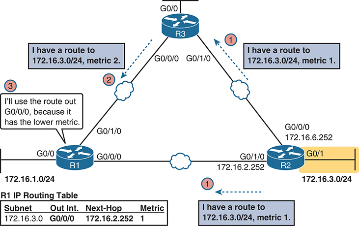

**Figure 21-1** *Three of the Four Basic Functions of Routing Protocols*

The network schematic shows a network of three routers labeled R1, R2, and R3, connected in a triangular formation. Each router is connected to a subnet with specific IP addresses. R1 is connected to the subnet 172.16.0/24 via the G0/0 interface, R2 is linked to the subnet 172.16.2/24 via the G0/1 interface, and R3 connects to the subnet 172.16.3/24 through the G0/0 and G0/1 interfaces respectively, each with different metrics (metric 2 and metric 1). The schematic includes a routing table for R1 showing the subnet (172.16.3.0), out interface (G0/0/0), next-hop (172.16.2.252), and metric details (1).

The other routing protocol function, *convergence*, occurs when the topology changes—that is, when either a router or link fails or comes back up again. When something changes, the best routes available in the network can change. Convergence simply refers to the process by which all the routers collectively realize something has changed, advertise the information about the changes to all the other routers, and all the routers then choose the currently best routes for each subnet. The ability to converge quickly, without causing loops, is one of the most important considerations when choosing which IP routing protocol to use.

In [Figure 21-1](vol1_ch21.xhtml#ch21fig01), convergence might occur if the link between R1 and R2 failed. In that case, R1 should stop using its old route for subnet 172.16.3.0/24 (directly through R2) and begin sending packets to R3.

#### Interior and Exterior Routing Protocols

IP routing protocols fall into one of two major categories: [interior gateway protocols (IGP)](vol1_gloss.xhtml#gloss_196) or *exterior gateway protocols* (EGP). The definitions of each are as follows:

* **IGP:** A routing protocol that was designed and intended for use inside a single autonomous system (AS)

  
* **EGP:** A routing protocol that was designed and intended for use between different autonomous systems

Note

The terms *IGP* and *EGP* include the word *gateway* because routers used to be called gateways.

These definitions use another new term: *autonomous system* (AS). An AS is a network under the administrative control of a single organization. For example, a network created and paid for by a single company is probably a single AS, and a network created by a single school system is probably a single AS. Other examples include large divisions of a state or national government, where different government agencies might be able to build their own networks. Each ISP is also typically a single different AS.

Some routing protocols work best inside a single AS by design, so these routing protocols are called IGPs. Conversely, routing protocols designed to exchange routes between routers in different autonomous systems are called EGPs. Today, Border Gateway Protocol (BGP) is the only EGP.

Each AS can be assigned a number called (unsurprisingly) an *AS number* (ASN). Like public IP addresses, the Internet Assigned Numbers Authority (IANA, [www.iana.org](http://www.iana.org)) controls the worldwide rights to assigning ASNs. It delegates that authority to other organizations around the world, typically to the same organizations that assign public IP addresses. For example, in North America, the American Registry for Internet Numbers (ARIN, [www.arin.net](http://www.arin.net)) assigns public IP address ranges and ASNs.

[Figure 21-2](vol1_ch21.xhtml#ch21fig02) shows a small view of the worldwide Internet. The figure shows two enterprises and three ISPs using IGPs (OSPF and EIGRP) inside their own networks and with BGP being used between the ASNs.

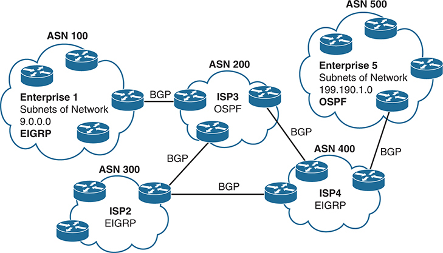

**Figure 21-2** *Comparing Locations for Using IGPs and EGPs*

In the schematic, each ASN is represented by a cloud shape with a label. ASN 100, labeled as "Enterprise 1", uses EIGRP and has subnets of network 9.0.0.0. ASN 200, labeled as "ISP3", employs OSPF. ASN 300, marked as "ISP2", and ASN 400, tagged as "ISP4", both use EIGRP. ASN 500, denoted as "Enterprise 5", uses OSPF and has subnets of network 199.190.1.0. The connections between ASNs are labeled with "BGP" to indicate the protocol.

#### Comparing IGPs

Before getting into the details of OSPF, it helps to consider some comparisons between OSPF and the other IGP options. This section takes a brief look at all three routing protocols.

##### IGP Routing Protocol Algorithms

A routing protocol's underlying algorithm determines how the routing protocol does its job. The term *routing protocol algorithm* simply refers to the logic and processes used by different routing protocols to solve the problem of learning all routes, choosing the best route to each subnet, and converging in reaction to changes in the internetwork. Three main branches of routing protocol algorithms exist for IGP routing protocols:

* [Distance vector](vol1_gloss.xhtml#gloss_106) (sometimes called Bellman-Ford after its creators)

  
* Advanced distance vector (sometimes called balanced hybrid)
* [Link-state](vol1_gloss.xhtml#gloss_237)

Historically speaking, distance vector protocols were invented first, mainly in the early 1980s. Routing Information Protocol (RIP) was the first popularly used IP distance vector protocol, with the Cisco-proprietary Interior Gateway Routing Protocol (IGRP) being introduced a little later.

By the early 1990s, distance vector protocols' somewhat slow convergence and potential for routing loops drove the development of new alternative routing protocols that used new algorithms. Link-state protocols—in particular, Open Shortest Path First (OSPF) and Integrated Intermediate System to Intermediate System (IS-IS)—solved the main issues. They also came with a price: they required extra CPU and memory on routers, with more planning required from the network engineers.

Note

All references to OSPF in this chapter refer to OSPF Version 2 (OSPFv2) unless otherwise stated.

Around the same time as the introduction of OSPF, Cisco created a proprietary routing protocol called Enhanced Interior Gateway Routing Protocol (EIGRP), which used some features of the earlier IGRP protocol. EIGRP solved the same problems as did link-state routing protocols, but EIGRP required less planning and less CPU/RAM overhead. As time went on, EIGRP was classified as a unique type of routing protocol. However, it used more distance vector features than link-state, so the industry refers to its algorithm as either an advanced distance vector protocol or as a balanced hybrid protocol.

##### Metrics

Routing protocols choose the best route to reach a subnet by choosing the route with the lowest metric. For example, RIP uses a counter of the number of routers (hops) between a router and the destination subnet, as shown in the example of [Figure 21-1](vol1_ch21.xhtml#ch21fig01). OSPF totals the cost associated with each interface in the end-to-end route, with the cost based on link bandwidth. [Table 21-2](vol1_ch21.xhtml#ch21tab02) lists the most common IP routing protocols and some details about the metric in each case.

**Table 21-2** IP IGP Metrics

| IGP | Metric | Description |
| --- | --- | --- |
| RIPv2 | Hop count | The number of routers (hops) between a router and the destination subnet |
| OSPF | Cost | The sum of all interface cost settings for all links in a route, with the cost default based on interface bandwidth |
| EIGRP | Calculation based on bandwidth and delay | Calculated based on the route's slowest link and the cumulative delay associated with each interface in the route |

A brief comparison of the metric used by the older RIP versus the metric used by OSPF shows some insight into why OSPF and EIGRP surpassed RIP. [Figure 21-3](vol1_ch21.xhtml#ch21fig03) shows an example in which Router B has two possible routes to subnet 10.1.1.0 on the left side of the network: a shorter route over a very slow serial link at 1544 Kbps, or a longer route over two Gigabit Ethernet WAN links.

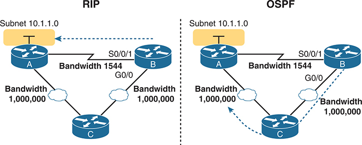

**Figure 21-3** *RIP and OSPF Metrics Compared*

The schematics feature three routers labeled A, B, and C. Both R I P and O S P F are connected to the same subnet "10.1.1.0". Routers A and B are connected by a line indicating a bandwidth of 1544 with interfaces labeled "S0/0/1" for router B. Router A and B are connected to another router labeled C via Ethernet W A Ns indicating bandwidth of 1,000,000. The difference captured is that in R I P, Router B sends the packet directly to router A but in O S P F Router B sends the packet to router A through router C.

The left side of the figure shows the results of RIP in this network. Using hop count, Router B learns of a one-hop route directly to Router A through B's S0/0/1 interface. B also learns of a two-hop route through Router C, through B's G0/0 interface. Router B chooses the lower hop count route, which happens to go over the slow-speed serial link.

The right side of the figure shows the better choice made by OSPF based on its better metric. To cause OSPF to make the right choice, the engineer could use default settings based on the correct interface bandwidth to match the actual link speeds, thereby allowing OSPF to choose the faster route. (The **bandwidth** interface subcommand does not change the actual physical speed of the interface. It just tells IOS what speed to assume the interface is using.)

##### Other IGP Comparisons

Routing protocols can be compared based on many features, some of which matter to the current CCNA exam, whereas some do not. [Table 21-3](vol1_ch21.xhtml#ch21tab03) introduces a few more points and lists the comparison points mentioned in this book for easier study, with a few supporting comments following the table.

**Table 21-3** Interior IP Routing Protocols Compared

| Feature | RIPv2 | EIGRP | OSPF |
| --- | --- | --- | --- |
| Classless/sends mask in updates/supports VLSM | Yes | Yes | Yes |
| Algorithm (DV, advanced DV, LS) | DV | Advanced DV | LS |
| Supports manual summarization | Yes | Yes | Yes |
| Cisco-proprietary | No | Yes[\*](vol1_ch21.xhtml#tfn21_3a) | No |
| Routing updates are sent to a multicast IP address | Yes | Yes | Yes |
| Convergence | Slow | Fast | Fast |
| Multicast addresses used | 224.0.0.9 | 224.0.0.10 | 224.0.0.5, 224.0.0.6 |

[\*](vol1_ch21.xhtml#tfn21_3) Although Cisco created EIGRP and has kept it as a proprietary protocol for many years, Cisco chose to publish EIGRP as an informational RFC in 2013. This allows other vendors to implement EIGRP, while Cisco retains the rights to the protocol.

Regarding the top row of the table, classless routing protocols support variable-length subnet masks (VLSM) as well as manual route summarization by sending routing protocol messages that include the subnet masks in the message. The older RIPv1 and IGRP routing protocols—both classful routing protocols—do not.

Also, note that the older routing protocols (RIPv1, IGRP) sent routing protocol messages to IP broadcast addresses, while the newer routing protocols in the table all use IP multicast destination addresses. The use of multicasts makes the protocol more efficient and causes less overhead and fewer issues with the devices in the subnet that are not running the routing protocol.

### OSPF Concepts and Operation

Routing protocols basically exchange information so routers can learn routes. The routers learn information about subnets, routes to those subnets, and metric information about how good each route is compared to others. The routing protocol can then choose the currently best route to each subnet, building the IP routing table.

Link-state protocols like OSPF take a little different approach to the particulars of what information they exchange and what the routers do with that information once learned. This next (second) major section narrows the focus to only link-state protocols, specifically OSPFv2.

This section begins with an overview of what OSPF does by exchanging data about the network in data structures called [link-state advertisements (LSAs)](vol1_gloss.xhtml#gloss_235). Then the discussion backs up a bit to provide more details about each of three fundamental parts of how OSPF operates: how OSPF routers use *neighbor* relationships, how routers exchange LSAs with neighbors, and then how routers calculate the best routes once they learn all the LSAs.

#### OSPF Overview

Link-state protocols build IP routes with a couple of major steps. First, the routers together build a lot of information about the network: routers, links, IP addresses, status information, and so on. Then the routers flood the information, so all routers know the same information. At that point, each router can calculate routes to all subnets, but from each router's own perspective.

##### Topology Information and LSAs

Routers using link-state routing protocols need to collectively advertise practically every detail about the internetwork to all the other routers. At the end of the process of *flooding* the information to all routers, every router in the internetwork has the exact same information about the internetwork. Flooding a lot of detailed information to every router sounds like a lot of work, and relative to distance vector routing protocols, it is.

Open Shortest Path First (OSPF), the most popular link-state IP routing protocol, organizes topology information using LSAs and the [link-state database (LSDB)](vol1_gloss.xhtml#gloss_236). [Figure 21-4](vol1_ch21.xhtml#ch21fig04) represents the ideas. Each LSA is a data structure with some specific information about the network topology; the LSDB is simply the collection of all the LSAs known to a router.

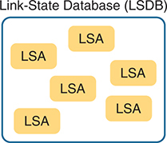

**Figure 21-4** *LSA and LSDB Relationship*

A large rectangle represents the Link-State Database (L S D B). Inside the L S D B, there are six smaller rectangles, each labeled "L S A", representing individual Link-State Advertisements, signifying that multiple L S As are contained within a single L S D B.

[Figure 21-5](vol1_ch21.xhtml#ch21fig05) shows the general idea of the flooding process, with R8 creating and flooding its *router LSA*. The router LSA for Router R8 describes the router itself, including the existence of subnet 172.16.3.0/24, as seen on the right side of the figure. (Note that [Figure 21-5](vol1_ch21.xhtml#ch21fig05) shows only a subset of the information in R8's router LSA.)

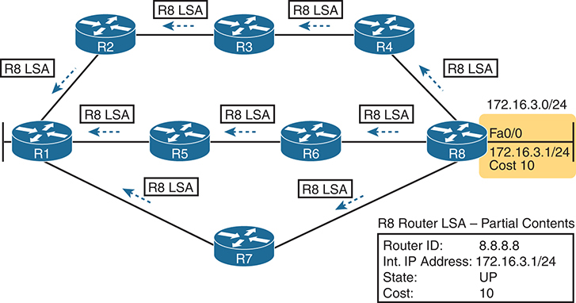

**Figure 21-5** *Flooding LSAs Using a Link-State Routing Protocol*

The central focus is on router R8, which is broadcasting Link-State Advertisements (L S As) to all other routers. Each L S A, represented by arrows, contains key information such as the Router ID (8.8.8.8), Interface IP Address (172.16.3.1/24), State (U P), and Cost (10). These details are crucial for maintaining updated and synchronized routing across the network.

[Figure 21-5](vol1_ch21.xhtml#ch21fig05) shows the rather basic flooding process, with R8 sending the original LSA for itself, and the other routers flooding the LSA by forwarding it until every router has a copy. The flooding process causes every router to learn the contents of the LSA while preventing the LSA from being flooded around in circles. Basically, before sending an LSA to yet another neighbor, routers communicate, asking "Do you already have this LSA?" and then sending the LSA to the next neighbor only if the neighbor has not yet learned about the LSA.

Once flooded, routers do occasionally reflood each LSA. Routers reflood an LSA when some information changes (for example, when a link goes up or comes down). They also reflood each LSA based on each LSA's separate aging timer (default 30 minutes).

##### Applying Dijkstra SPF Math to Find the Best Routes

The link-state flooding process results in every router having an identical copy of the LSDB in memory, but the flooding process alone does not cause a router to learn what routes to add to the IP routing table. Although incredibly detailed and useful, the information in the LSDB does not explicitly state each router's best route to reach a destination.

To build routes, link-state routers have to do some math. Thankfully, you and I do not have to know the math! However, all link-state protocols use a type of math algorithm, called the Dijkstra [Shortest Path First (SPF) algorithm](vol1_gloss.xhtml#gloss_363), to process the LSDB. That algorithm analyzes (with math) the LSDB and builds the routes that the local router should add to the IP routing table—routes that list a subnet number and mask, an outgoing interface, and a next-hop router IP address.

Now that you have the big ideas down, the next several topics walk through the three main phases of how OSPF routers accomplish the work of exchanging LSAs and calculating routes. Those three phases are

**Becoming neighbors:** A relationship between two routers that connect to the same data link, created so that the neighboring routers have a means to exchange their LSDBs.

**Exchanging databases:** The process of sending LSAs to neighbors so that all routers learn the same LSAs.

**Adding the best routes:** The process of each router independently running SPF, on their local copy of the LSDB, calculating the best routes, and adding those to the IPv4 routing table.

#### Becoming OSPF Neighbors

Of everything you learn about OSPF in this chapter, OSPF neighbor concepts have the most to do with how you will configure and troubleshoot OSPF in Cisco routers. You configure OSPF to cause routers to run OSPF and become neighbors with other routers. Once that happens, OSPF does the rest of the work to exchange LSAs and calculate routers in the background, with no additional configuration required. This section discusses the fundamental concepts of OSPF neighbors.

##### The Basics of OSPF Neighbors

Two routers must meet some compatibility requirements to become neighbors. First, they must both use OSPF and both connect to the same data link. Two routers can become OSPF neighbors if connected to the same VLAN, or same serial link, or same Ethernet WAN link.

Additionally, the two routers must send OSPF messages that declare some OSPF settings, and those settings must be compatible. To do so, the routers send OSPF Hello messages, introducing themselves to the potential neighbor. Assuming the two potential neighbors have compatible OSPF parameters, the two form an OSPF neighbor relationship, and would be displayed in the output of the **show ip ospf neighbor** command.

The OSPF neighbor relationship also lets OSPF know when a neighbor might not be a good option for routing packets right now. Imagine R1 and R2 form a neighbor relationship, learn LSAs, and calculate routes that send packets through the other router. Months later, R1 notices that the neighbor relationship with R2 fails. That failed neighbor connection to R2 makes R1 react: R1 refloods LSAs impacted by the failed link, and R1 runs SPF to recalculate its own routes.

Finally, the OSPF neighbor model allows new routers to be dynamically discovered. That means new routers can be added to a network without requiring every router to be reconfigured. Instead, OSPF routers listen for OSPF Hello messages from new routers and react to those messages, attempting to become neighbors and exchange LSDBs.

##### Meeting Neighbors and Learning Their Router ID

The OSPF neighbor relationship begins by exchanging OSPF *Hello* messages, which list each router's [router ID (RID)](vol1_gloss.xhtml#gloss_349). OSPF RIDs are 32-bit numbers, so most command output lists these as dotted-decimal numbers (DDN). By default, IOS chooses one of the router interface's IPv4 addresses to use as its OSPF RID. However, the OSPF RID can be directly configured, as covered in the section "[Configuring the OSPF Router ID](vol1_ch22.xhtml#ch22lev2sec5)" in [Chapter 22](vol1_ch22.xhtml#ch22), "[Implementing Basic OSPF Features](vol1_ch22.xhtml#ch22)."

As soon as a router has chosen its OSPF RID and some interfaces come up, the router is ready to meet its OSPF neighbors. OSPF routers can become neighbors if they are connected to the same subnet. To discover other OSPF-speaking routers, a router sends multicast OSPF Hello packets to each interface and hopes to receive OSPF Hello packets from other routers connected to those interfaces. [Figure 21-6](vol1_ch21.xhtml#ch21fig06) outlines the basic concept.

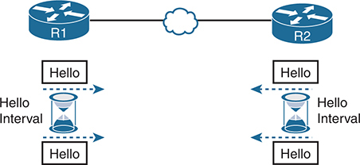

**Figure 21-6** *OSPF Hello Packets*

The routers, R1 and R2 are connected by an Ethernet W A N. Each router has an hourglass icon labeled "Hello Interval," representing the time interval at which Hello packets are sent. Bidirectional arrows between each hourglass icon signify the ongoing exchange of the packets, with the word "Hello" written next to each arrow.

Routers R1 and R2 both send Hello messages onto the link. They continue to send Hellos at a regular interval based on their Hello timer settings. The Hello messages themselves have the following features:

* The Hello message follows the IP packet header, with IP protocol type 89.
* Hello packets are sent to multicast IP address 224.0.0.5, a multicast IP address intended for all OSPF-speaking routers.
* OSPF routers listen for packets sent to IP multicast address 224.0.0.5, in part hoping to receive Hello packets and learn about new neighbors.

Taking a closer look, [Figure 21-7](vol1_ch21.xhtml#ch21fig07) shows several of the neighbor states used by the early formation of an OSPF neighbor relationship. The figure shows the Hello messages in the center and the resulting neighbor states on the left and right edges of the figure. Each router keeps an OSPF state variable for how it views the neighbor.

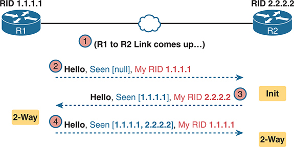

**Figure 21-7** *Early Neighbor States*

Two routers, R1 and R2, are connected through Ethernet W A N, with respective Router IDs (R I D) 1.1.1.1 and 2.2.2.2. The link between R1 and R2 comes up, marked as step 1. In step 2, R1 sends a Hello packet to R2 stating "Hello, Seen [null], My R I D 1.1.1.1." In response, R2 sends back an Init packet stating "Hello, Seen [1.1.1.1], My R I D 2.2.2.2." In step 3, both routers acknowledge each other's RIDs with the message "Hello, Seen [1.1.1.1, 2.2.2.2], My R I D 1.1.1.1."

Following the steps in the figure, the scenario begins with the link down, so the routers have no knowledge of each other as OSPF neighbors. As a result, they have no state (status) information about each other as neighbors, and they would not list each other in the output of the **show ip ospf neighbor** command. At Step 2, R1 sends the first Hello, so R2 learns of the existence of R1 as an OSPF router. At that point, R2 lists R1 as a neighbor, with an interim beginning state of init.

The process continues at Step 3, with R2 sending back a Hello. This message tells R1 that R2 exists, and it allows R1 to move through the init state and quickly to a 2-way state. At Step 4, R2 receives the next Hello from R1, and R2 can also move to a 2-way state.

The [2-way state](vol1_gloss.xhtml#gloss_006) is a particularly important OSPF state. At that point, the following major facts are true:

* The router received a Hello from the neighbor, with that router's own RID listed as being seen by the neighbor.

  
* The router has performed all checks of settings in the Hello and considers the potential neighbor to have passed all checks so they can become neighbors.
* If both routers reach a 2-way state with each other, they are neighbors and ready to exchange their LSDB with each other.

#### Exchanging the LSDB Between Neighbors

One purpose of forming OSPF neighbor relationships is to allow the two neighbors to exchange their databases. This next topic works through some of the details of OSPF database exchange.

##### Fully Exchanging LSAs with Neighbors

Once two routers on a link reach the 2-way state, they can immediately move on to the process of database exchange. The database exchange process can be quite involved, with several OSPF messages and several interim neighbor states. This chapter is more concerned with a few of the messages and the final state when database exchange has completed: the [full state](vol1_gloss.xhtml#gloss_155).

After two routers decide to exchange databases, they do not simply send the contents of the entire database. First, they tell each other a list of LSAs in their respective databases—not all the details of the LSAs, just a list. (Think of these lists as checklists.) Next, each router can check which LSAs it already has and then ask the other router for only the LSAs that are not known yet.

For instance, R1 might send R2 a checklist that lists ten LSAs (using an OSPF Database Description, or DD, packet). R2 then checks its LSDB and finds six of those ten LSAs. So, R2 asks R1 (using a Link-State Request packet) to send the four additional LSAs.

Thankfully, most OSPFv2 work does not require detailed knowledge of these specific protocol steps. However, a few of the terms are used quite a bit and should be remembered. In particular, the OSPF messages that actually send the LSAs between neighbors are called [link-state update](vol1_gloss.xhtml#gloss_238) (LSU) packets. That is, the LSU packet holds data structures called *link-state advertisements (LSAs)*. The LSAs are not packets, but rather data structures that sit inside the LSDB and describe the topology.

[Figure 21-8](vol1_ch21.xhtml#ch21fig08) pulls some of these terms and processes together, with a general example. The story picks up the example shown in [Figure 21-7](vol1_ch21.xhtml#ch21fig07), with [Figure 21-8](vol1_ch21.xhtml#ch21fig08) showing an example of the database exchange process between Routers R1 and R2. The center shows the protocol messages, and the outer items show the neighbor states at different points in the process. Focus on two items in particular:

* The routers exchange the LSAs inside LSU packets.
* When finished, the routers reach a full state, meaning they have fully exchanged the contents of their LSDBs.

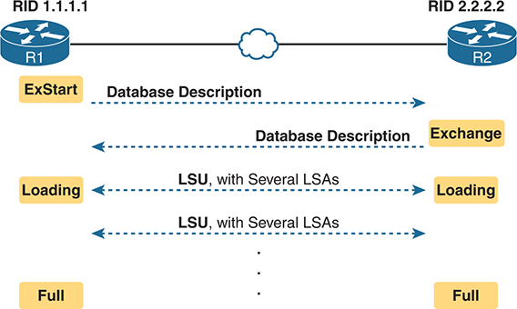

**Figure 21-8** *Database Exchange Example, Ending in a Full State*

Two routers, R1 and R2, are connected through Ethernet W A N, with respective Router I Ds (R I D) 1.1.1.1 and 2.2.2.2. The process begins with an "ExStart" state where the database description is initiated by R1. This progresses to an "Exchange" state, where the database description is shared by R2. In the "Loading" state, Link State Update (L S U) with several Link State Advertisements (L S As) are exchanged between both routers to update each other's database information. The process ends in a "Full" state, indicating exchange completion.

##### Maintaining Neighbors and the LSDB

Once two neighbors reach a full state, they have done all the initial work to exchange OSPF information between them. However, neighbors still have to do some small ongoing tasks to maintain the neighbor relationship.

First, routers monitor each neighbor relationship using Hello messages and two related timers: the [Hello interval](vol1_gloss.xhtml#gloss_167) and the [Dead interval](vol1_gloss.xhtml#gloss_087). Routers send Hellos every Hello interval to each neighbor. Each router expects to receive a Hello from each neighbor based on the Hello interval, so if a neighbor is silent for the length of the Dead interval (by default, four times as long as the Hello interval), the loss of Hellos means that the neighbor has failed.

Next, routers must react when the topology changes as well, and neighbors play a key role in that process. When something changes, one or more routers change one or more LSAs. Then the routers must flood the changed LSAs to each neighbor so that the neighbor can change its LSDB.

For example, imagine a LAN switch loses power, so a router's G0/0 interface fails from up/up to down/down. That router updates an LSA that shows the router's G0/0 as being down. That router then sends the LSA to its neighbors, and that neighbor in turn sends it to its neighbors, until all routers again have an identical copy of the LSDB. Each router's LSDB now reflects the fact that the original router's G0/0 interface failed, so each router will then use SPF to recalculate any routes affected by the failed interface.

A third maintenance task done by neighbors is to reflood each LSA occasionally, even when the network is completely stable. By default, each router that creates an LSA also has the responsibility to reflood the LSA every 30 minutes (the default), even if no changes occur. (Note that each LSA has a separate timer, based on when the LSA was created, so there is no single big event where the network is overloaded with flooding LSAs.)

The following list summarizes these three maintenance tasks for easier review:

* Maintain neighbor state by sending Hello messages based on the Hello interval and listening for Hellos before the Dead interval expires
* Flood any changed LSAs to each neighbor
* Reflood unchanged LSAs as their lifetime expires (default 30 minutes)

##### Using Designated Routers on Ethernet Links

OSPF behaves differently on some types of interfaces based on a per-interface setting called the OSPF *network type*. On Ethernet links, OSPF defaults to use a network type of *broadcast*, which causes OSPF to elect one of the routers on the same subnet to act as the [designated router (DR)](vol1_gloss.xhtml#gloss_095). The DR plays a key role in how the database exchange process works, with different rules than with point-to-point links.

To see how, consider the example that begins with [Figure 21-9](vol1_ch21.xhtml#ch21fig09). The figure shows five OSPFv2 routers on the same Ethernet VLAN. These five OSPF routers elect one router to act as the DR and one router to be a [backup designated router (BDR)](vol1_gloss.xhtml#gloss_039). The figure shows A and B as DR and BDR, for no other reason than the subnet with OSPF network type broadcast will have one of each.

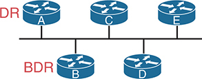

**Figure 21-9** *Routers A and B Elected as DR and BDR*

In the segment, router A is elected as the Designated Router (D R), and Router B is elected as the Backup Designated Router (B D R). All the routers are connected along a straight horizontal line, symbolizing a shared network segment.

The database exchange process on an Ethernet link does not happen between every pair of routers on the same VLAN/subnet. Instead, it happens between the DR and each of the other routers, with the DR making sure that all the other routers get a copy of each LSA. In other words, the database exchange happens over the flows shown in [Figure 21-10](vol1_ch21.xhtml#ch21fig10).

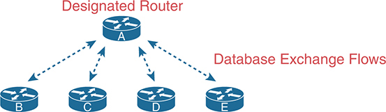

**Figure 21-10** *Database Exchange to and from the DR on an Ethernet*

The DR, labeled as ‘A', is positioned at the top center and is connected to four other routers labeled ‘B', ‘C', ‘D', and ‘E', arranged in a semi-circle below it. The exchange of data between the D R and the other routers is represented by bidirectional arrows, indicating a two-way database exchange flow of information.

OSPF defines the backup designated router (BDR) role so that some router can take over for the DR should it fail. When the DR fails, the BDR takes over as DR, and some other router is elected as the new BDR.

The use of a DR/BDR, along with the use of multicast IP addresses, makes the exchange of OSPF LSDBs more efficient on networks that allow more than two routers on the same link. The DR can send a packet to all OSPF routers in the subnet by using multicast IP address 224.0.0.5. IANA reserves this address as the "All SPF Routers" multicast address just for this purpose. For instance, in [Figure 21-10](vol1_ch21.xhtml#ch21fig10), the DR can send one set of messages to all the OSPF routers rather than sending one message to each router.

Similarly, any OSPF router needing to send a message to the DR and also to the BDR (so it remains ready to take over for the DR) can send those messages to the "All SPF DRs" multicast address 224.0.0.6. So, instead of having to send one set of messages to the DR and another set to the BDR, an OSPF router can send one set of messages, making the exchange more efficient.

You will see quite a bit of the DR and BDR theory in **show** commands on a router. Because the DR and BDR both do full database exchange with all the other OSPF routers in the LAN, they reach a full state with all neighbors. However, routers that are neither a DR nor a BDR—called *DROthers* by OSPF—never reach a full state because they do not exchange LSDBs directly with each other. As a result, the **show ip ospf neighbor** command on these DROther routers lists some neighbors in a 2-way state, remaining in that state under normal operation.

For instance, with OSPF working normally on the Ethernet LAN in [Figure 21-10](vol1_ch21.xhtml#ch21fig10), a **show ip ospf neighbor** command on Router C (which is a DROther router) would show the following:

* Two neighbors (A and B, the DR and BDR, respectively) with a full state (called *fully adjacent neighbors*)
* Two neighbors (D and E, which are DROthers) with a 2-way state (called [neighbors](vol1_gloss.xhtml#gloss_267))

OSPF requires some terms to describe all neighbors versus the subset of all neighbors that reach the full state. First, all OSPF routers on the same link that reach the 2-way state—that is, they send Hello messages and the parameters match—are called *neighbors*. The subset of neighbors for which the neighbor relationship reaches the full state are called *adjacent neighbors*. Additionally, OSPFv2 RFC 2328 emphasizes this point by defining two synonyms to the term *adjacent neighbor*: [fully adjacent](vol1_gloss.xhtml#gloss_157) and *fully adjacent neighbor*. Finally, while the terms so far refer to the neighbor, two other terms refer to the relationship: *neighbor relationship* refers to any OSPF neighbor relationship, while the term *adjacency* refers to neighbor relationships that reach a full state. [Table 21-4](vol1_ch21.xhtml#ch21tab04) details the terms.

**Table 21-4** Stable OSPF Neighbor States and Their Meanings

| Neighbor State | Term for Neighbor | Term for Relationship |
| --- | --- | --- |
| 2-way | Neighbor | Neighbor Relationship |
| Full | Adjacent Neighbor  Fully Adjacent Neighbor | Adjacency |

#### Calculating the Best Routes with SPF

OSPF LSAs contain useful information, but they do not contain the specific information that a router needs to add to its IPv4 routing table. In other words, a router cannot just copy information from the LSDB into a route in the IPv4 routing table. The LSAs individually are more like pieces of a jigsaw puzzle, with the picture shown by the completed puzzle showing a topology map of the entire network. So, to know what routes to add to the routing table, each router must do some SPF math to choose the best routes from that router's perspective. The router then adds each route to its routing table: a route with a subnet number and mask, an outgoing interface, and a next-hop router IP address.

Although engineers do not need to know the details of how SPF does the math, they do need to know how to predict which routes SPF will choose as the best route. The SPF algorithm calculates all the routes for a subnet—that is, all possible routes from the router to the destination subnet. If more than one route exists, the router compares the metrics, picking the best (lowest) metric route to add to the routing table. Although the SPF math can be complex, engineers with a network diagram, router status information, and simple addition can calculate the metric for each route, predicting what SPF will choose.

Once SPF has identified a route, OSPF calculates the metric for a route as follows:

The sum of the OSPF interface costs for all outgoing interfaces in the route.

[Figure 21-11](vol1_ch21.xhtml#ch21fig11) shows an example with three possible routes from R1 to Subnet X (172.16.3.0/24) at the bottom of the figure.

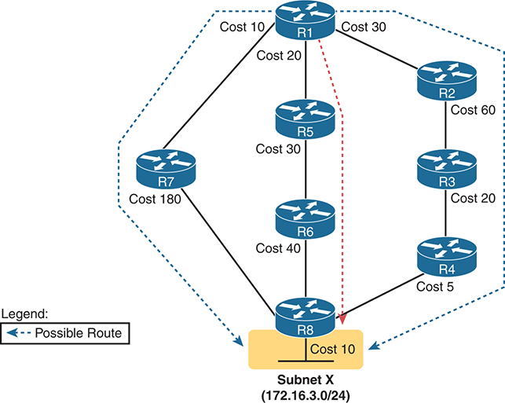

**Figure 21-11** *SPF Tree to Find R1's Route to 172.16.3.0/24*

The schematic consists of routers labeled R1 to R8. The routers are interconnected by cables, each with an associated cost. The route from R1 to R7 costs 10, R7 to R8 costs 180, R1 to R5 costs 20, R5 to R6 costs 40, R6 to R8 costs 40, R1 to R2 costs 30, R2 to R3 costs 60, R3 to R4 costs 20, and R4 to R8 costs . A dotted line highlights the shortest path from R1 to the subnet X (172.16.3.0/24) via R5, R6, and R8. Dotted lines represent Possible Routes as per the legend at the bottom left corner.

Note

OSPF considers the costs of the outgoing interfaces (only) in each route. It does not add the cost for incoming interfaces in the route.

[Table 21-5](vol1_ch21.xhtml#ch21tab05) lists the three routes shown in [Figure 21-11](vol1_ch21.xhtml#ch21fig11), with their cumulative costs, showing that R1's best route to 172.16.3.0/24 starts by going through R5.

**Table 21-5** Comparing R1's Three Alternatives for the Route to 172.16.3.0/24

| Route | Location in [Figure 21-11](vol1_ch21.xhtml#ch21fig11) | Cumulative Cost |
| --- | --- | --- |
| R1–R7–R8 | Left | 10 + 180 + 10 = 200 |
| R1–R5–R6–R8 | Middle | 20 + 30 + 40 + 10 = 100 |
| R1–R2–R3–R4–R8 | Right | 30 + 60 + 20 + 5 + 10 = 125 |

As a result of the SPF algorithm's analysis of the LSDB, R1 adds a route to subnet 172.16.3.0/24 to its routing table, with the next-hop router of R5.

In real OSPF networks, an engineer can do the same process by knowing the OSPF cost for each interface. Armed with a network diagram, the engineer can examine all routes, add the costs, and predict the metric for each route.

### OSPF Areas and LSAs

OSPF can be used in some networks with very little thought about design issues. You just turn on OSPF in all the routers, put all interfaces into the same area (usually area 0), and it works! [Figure 21-12](vol1_ch21.xhtml#ch21fig12) shows one such network example, with 11 routers and all interfaces in area 0.

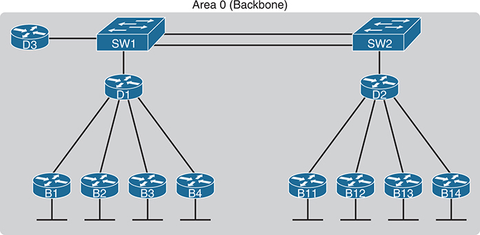

**Figure 21-12** *Single-Area OSPF*

The network comprises router D3 connected to SW1. The switches, SW1 and SW2, are interconnected while each connected to a router, D1 and D2, respectively. D1 and D2 routers are further connected to four routers. The routers connected to D1 are labeled B1, B2, B3, and B4, while those connected to D2 are labeled B11, B12, B13, and B14.

Using a single-area design works well in small- to medium-sized networks. In fact, the CCNA 200-301 V1.1 blueprint specifically mentions [single-area OSPF](vol1_gloss.xhtml#gloss_364), omitting [multiarea OSPF](vol1_gloss.xhtml#gloss_259). However, it helps to think through the concept of areas even for CCNA preparation. The next few pages look at how OSPF area design works, with more reasons as to why areas help make larger OSPF networks work better.

#### OSPF Areas

OSPF area design follows a couple of basic rules. To apply the rules, start with a clean drawing of the internetwork, with routers, and all interfaces. Then choose the area for each router interface, as follows:

* Put all interfaces connected to the same subnet inside the same area.

  
* An area should be contiguous.
* Some routers may be internal to an area, with all interfaces assigned to that single area.
* Some routers may be Area Border Routers (ABRs) because some interfaces connect to the backbone area, and some connect to nonbackbone areas.
* All nonbackbone areas must have a path to reach the backbone area (area 0) by having at least one ABR connected to both the backbone area and the nonbackbone area.

[Figure 21-13](vol1_ch21.xhtml#ch21fig13) shows one example. An engineer started with a network diagram that showed all 11 routers and their links. On the left, the engineer put four WAN links and the LANs connected to branch routers B1 through B4 into area 1. Similarly, he placed the links to branches B11 through B14 and their LANs in area 2. Both areas need a connection to the backbone area, area 0, so he put the LAN interfaces of D1 and D2 into area 0, along with D3, creating the backbone area.

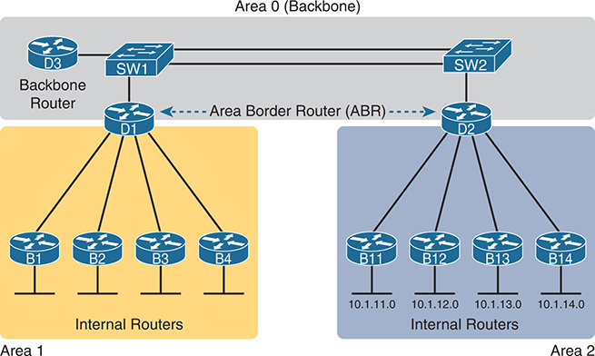

**Figure 21-13** *Three-Area OSPF with D1 and D2 as ABRs*

The network is divided into three distinct areas: Area 0 (Backbone), Area 1, and Area 2. In the Backbone area, there are two switches, SW1 and SW2 connected to the Backbone Router, D3. The A B Rs, D1 and D2, connect the Backbone area to Areas 1 and 2 respectively. Area 1 contains four internal routers labeled B1 to B4, and Area 2 contains four internal routers labeled B11 to B14, each with their respective IP addresses: 10.1.11.0, 10.1.12.0, 10.1.13.0, and 10.1.14.0.

The figure also shows a few important OSPF area design terms. [Table 21-6](vol1_ch21.xhtml#ch21tab06) summarizes the meaning of these terms, plus some other related terms, but pay closest attention to the terms from the figure.

**Table 21-6** OSPF Design Terminology

| Term | Description |
| --- | --- |
| [Area Border Router (ABR)](vol1_gloss.xhtml#gloss_024) | An OSPF router with interfaces connected to the backbone area and to at least one other area |
| *Backbone router* | A router connected to the backbone area (includes ABRs) |
| [Internal router](vol1_gloss.xhtml#gloss_199) | A router in one area (not the backbone area) |
| Area | A set of routers and links that shares the same detailed LSDB information, but not with routers in other areas, for better efficiency |
| [Backbone area](vol1_gloss.xhtml#gloss_037) | A special OSPF area to which all other areas must connect—area 0 |
| Intra-area route | A route to a subnet inside the same area as the router |
| Interarea route | A route to a subnet in an area of which the router is not a part |

#### How Areas Reduce SPF Calculation Time

[Figure 21-13](vol1_ch21.xhtml#ch21fig13) shows a sample area design and some terminology related to areas, but it does not show the power and benefit of the areas. To understand how areas reduce the work SPF has to do, you need to understand what changes about the LSDB inside an area, as a result of the area design.

SPF spends most of its processing time working through all the topology details, namely routers and the links that connect routers. Areas reduce SPF's workload because, for a given area, the LSDB lists only routers and links inside that area, as shown on the left side of [Figure 21-14](vol1_ch21.xhtml#ch21fig14).

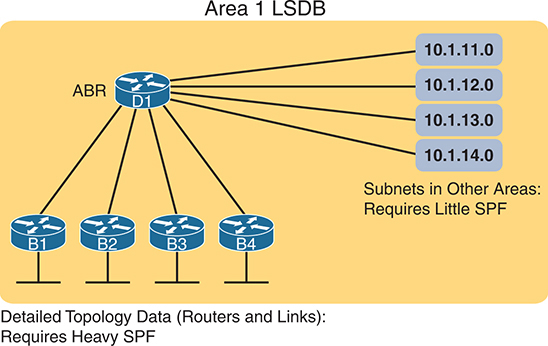

**Figure 21-14** *Smaller Area 1 LSDB Concept*

The schematic features an Area Border Router (ABR) labeled D1 at the top center, which is connected to four routers labeled B1, B2, B3, and B4. To the right of D1, there are four IP addresses: 10.1.11.0, 10.1.12.0, 10.1.13.0, and 10.1.14.0, representing subnets in other areas that require little SPF (Shortest Path First) computation. The bottom text indicates that detailed topology data( routers and links): requires heavy SPF.

While the LSDB has less topology information, it still needs information about all subnets in all areas so that each router can create IPv4 routes for all subnets. So, with an area design, OSPFv2 uses brief summary information about the subnets in other areas. These summary LSAs do not include topology information about the other areas; however, each summary LSA *does* list a subnet ID and mask of a subnet in some other area. Summary LSAs do not require SPF processing at all. Instead, these subnets all appear like subnets connected to the ABR (in [Figure 21-14](vol1_ch21.xhtml#ch21fig14), ABR D1).

Using multiple areas improves OSPF operations in many ways for larger networks. The following list summarizes some of the key points arguing for the use of multiple areas in larger OSPF networks:

* Routers require fewer CPU cycles to process the smaller per-area LSDB with the SPF algorithm, reducing CPU overhead and improving convergence time.
* The smaller per-area LSDB requires less memory.
* Changes in the network (for example, links failing and recovering) require SPF calculations only on routers in the area where the link changed state, reducing the number of routers that must rerun SPF.
* Less information must be advertised between areas, reducing the bandwidth required to send LSAs.

#### (OSPFv2) Link-State Advertisements

Many people tend to get a little intimidated by OSPF LSAs when first learning about them. Commands like **show ip ospf database** in its many variations list a lot of information about the LSDB. Those details appear to be in some kind of code, using lots of numbers. It can seem like a bit of a mess.

However, if you examine LSAs while thinking about OSPF areas and area design, some of the most common LSA types will make a lot more sense. For instance, think about the LSDB in one area. The topology in one area includes routers and the links between the routers. As it turns out, OSPF defines the first two types of LSAs to define those exact details, as follows:

* One *router LSA* for each router in the area
* One *network LSA* for each network that has a DR plus one neighbor of the DR

Next, think about the subnets in the other areas. The ABR creates summary information about each subnet in one area to advertise into other areas—basically just the subnet IDs and masks—as a third type of LSA:

* One *summary LSA* for each subnet ID that exists in a different area

The next few pages discuss these three LSA types in a little more detail; [Table 21-7](vol1_ch21.xhtml#ch21tab07) lists some information about all three for easier reference and study.

**Table 21-7** The Three OSPFv2 LSA Types Seen with a Multiarea OSPF Design

| LSA Name | LSA Type | Primary Purpose | Contents of LSA |
| --- | --- | --- | --- |
| Router | 1 | Describe a router | RID, interfaces, IP address/mask, current interface state (status) |
| Network | 2 | Describe a network that has a DR and BDR | DR and BDR IP addresses, subnet ID, mask |
| Summary | 3 | Describe a subnet in another area | Subnet ID, mask, RID of ABR that advertises the LSA |

##### Router LSAs Build Most of the Intra-Area Topology

OSPF needs very detailed topology information inside each area. The routers inside area X need to know all the details about the topology inside area X. And the mechanism to give routers all these details is for the routers to create and flood router (Type 1) and network (Type 2) LSAs about the routers and links in the area.

Router LSAs, also known as Type 1 LSAs, describe the router in detail. Each lists a router's RID, its interfaces, its IPv4 addresses and masks, its interface state, and notes about what neighbors the router knows about via each of its interfaces.

To see a specific instance, first review [Figure 21-15](vol1_ch21.xhtml#ch21fig15). It lists internetwork topology, with subnets listed. Because it's a small internetwork, the engineer chose a single-area design, with all interfaces in backbone area 0.

With the single-area design planned for this small internetwork, the LSDB will contain four router LSAs. Each router creates a router LSA for itself, with its own RID as the LSA identifier. The LSA lists that router's own interfaces, IP address/mask, with pointers to neighbors.

Once all four routers have copies of all four router LSAs, SPF can mathematically analyze the LSAs to create a model. The model looks a lot like the concept drawing in [Figure 21-16](vol1_ch21.xhtml#ch21fig16). Note that the drawing shows each router with an obvious RID value. Each router has pointers that represent each of its interfaces, and because the LSAs identify neighbors, SPF can figure out which interfaces connect to which other routers.

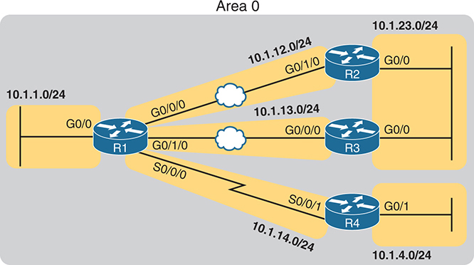

**Figure 21-15** *Enterprise Network with Six IPv4 Subnets*

The network infrastructure is composed of four routers, labeled R1 through R4. R1 is connected to two subnets with IP addresses 10.1.1.0/24 and 10.1.12.0/24 via interfaces G0/0 and G0/0/0 respectively. R2 connects to two subnets, one at 10.1.12.0/24 and another at 10.1.23.0/24 using interfaces G0/1/0 and G0/0 respectively. R1 links to R3 via interface G0/1/0 to G0/0/0 with 10.1.13.0/24 of R3. R1 uses interface S0/0/0, to connect S0/0/1 of R4 with subnet 10.1.14.0/24, and G0/1 of R4 connects to subnet 10.1.4.0/24.

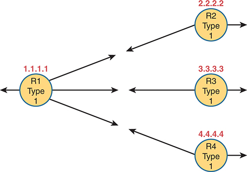

**Figure 21-16** *Type 1 LSAs, Assuming a Single-Area Design*

Four routers labeled R1, R2, R3, and R4, each represented by a circle. The routers are associated with specific IP addresses: 1.1.1.1 for R1, 2.2.2.2 for R2, 3.3.3.3 for R3, and 4.4.4.4 for R4. All routers are of Type 1 L S As (Link-State Advertisements), as indicated by the labels. An arrow from R1 indicates at the leftward while three arrows point to R2, R3, and R4 respectively. R2, R3, and R4 each have two arrows; one pointing to R1 and the other pointing rightward.

##### Network LSAs Complete the Intra-Area Topology

Whereas router LSAs define most of the intra-area topology, network LSAs define the rest. As it turns out, when OSPF elects a DR on some subnet *and* that DR has at least one neighbor, OSPF treats that subnet as another node in its mathematical model of the network. To represent that network, the DR creates and floods a network (Type 2) LSA for that network (subnet).

For instance, back in [Figure 21-15](vol1_ch21.xhtml#ch21fig15), one Ethernet LAN and two Ethernet WANs exist. The Ethernet LAN between R2 and R3 will elect a DR, and the two routers will become neighbors; so, whichever router is the DR will create a network LSA. Similarly, R1 and R2 connect with an Ethernet WAN, so the DR on that link will create a network LSA. Likewise, the DR on the Ethernet WAN link between R1 and R3 will also create a network LSA.

[Figure 21-17](vol1_ch21.xhtml#ch21fig17) shows the completed version of the intra-area LSAs in area 0 with this design. Note that the router LSAs reference the network LSAs when they exist, which lets the SPF processes connect the pieces together.

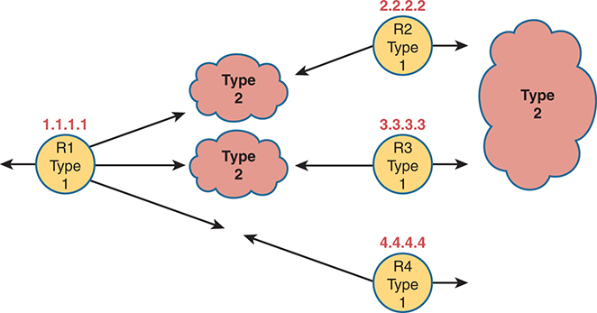

**Figure 21-17** *Type 1 and Type 2 LSAs in Area 0, Assuming a Single-Area Design*

Four routers labeled R1, R2, R3, and R4, each represented by a circle. The routers are associated with specific IP addresses: 1.1.1.1 for R1, 2.2.2.2 for R2, 3.3.3.3 for R3, and 4.4.4.4 for R4. All routers are of Type 1 LSAs (Link-State Advertisements), as indicated by the labels. An arrow from R1 indicates at the leftward while three arrows point to Type 2, Type 2, and R4 respectively. R2 and R3 each have two arrows; both pointing to Type 2 at right and leftwards. R4 has two arrows; one pointing to R1 and the other pointing rightward.

Finally, note that in this single-area design example, no summary (Type 3) LSAs exist at all. These LSAs represent subnets in other areas, and there are no other areas. Given that the CCNA 200-301 V1.1 exam blueprint refers specifically to single-area OSPF designs, this section stops at showing the details of the intra-area LSAs (Types 1 and 2).

### Chapter Review

One key to doing well on the exams is to perform repetitive spaced review sessions. Review this chapter's material using either the tools in the book or interactive tools for the same material found on the book's companion website. Refer to the "[Your Study Plan](vol1_pref10.xhtml#pref10)" element for more details. [Table 21-8](vol1_ch21.xhtml#ch21tab08) outlines the key review elements and where you can find them. To better track your study progress, record when you completed these activities in the second column.

**Table 21-8** Chapter Review Tracking

| Review Element | Review Date(s) | Resource Used: |
| --- | --- | --- |
| Review key topics |  | Book, website |
| Review key terms |  | Book, website |
| Answer DIKTA questions |  | Book, PTP |
| Review memory tables |  | Website |

### Review All the Key Topics

**Table 21-9** Key Topics for [Chapter 21](vol1_ch21.xhtml#ch21)

| Key Topic Element | Description | Page Number |
| --- | --- | --- |
| List | Functions of IP routing protocols | [541](vol1_ch21.xhtml#page_541) |
| List | Definitions of IGP and EGP | [542](vol1_ch21.xhtml#page_542) |
| List | Types of IGP routing protocols | [543](vol1_ch21.xhtml#page_543) |
| [Table 21-2](vol1_ch21.xhtml#ch21tab02) | IGP metrics | [544](vol1_ch21.xhtml#page_544) |
| List | Key facts about the OSPF 2-way state | [550](vol1_ch21.xhtml#page_550) |
| [Table 21-4](vol1_ch21.xhtml#ch21tab04) | Key OSPF neighbor states | [553](vol1_ch21.xhtml#page_553) |
| Item | Definition of how OSPF calculates the cost for a route | [554](vol1_ch21.xhtml#page_554) |
| [Figure 21-11](vol1_ch21.xhtml#ch21fig11) | Example of calculating the cost for multiple competing routes | [554](vol1_ch21.xhtml#page_554) |
| List | OSPF area design rules | [555](vol1_ch21.xhtml#page_555) |
| [Figure 21-13](vol1_ch21.xhtml#ch21fig13) | Sample OSPF multiarea design with terminology | [556](vol1_ch21.xhtml#page_556) |
| [Table 21-6](vol1_ch21.xhtml#ch21tab06) | OSPF design terms and definitions | [556](vol1_ch21.xhtml#page_556) |

### Key Terms You Should Know

[2-way state](vol1_ch21.xhtml#key_229)

[Area Border Router (ABR)](vol1_ch21.xhtml#key_230)

[backbone area](vol1_ch21.xhtml#key_231)

[backup designated router (BDR)](vol1_ch21.xhtml#key_232)

[convergence](vol1_ch21.xhtml#key_233)

[Dead interval](vol1_ch21.xhtml#key_234)

[designated router (DR)](vol1_ch21.xhtml#key_235)

[distance vector](vol1_ch21.xhtml#key_236)

[full state](vol1_ch21.xhtml#key_237)

[fully adjacent](vol1_ch21.xhtml#key_238)

[Hello interval](vol1_ch21.xhtml#key_239)

[interior gateway protocol (IGP)](vol1_ch21.xhtml#key_240)

[internal router](vol1_ch21.xhtml#key_241)

[link-state](vol1_ch21.xhtml#key_242)

[link-state advertisement (LSA)](vol1_ch21.xhtml#key_243)

[link-state database (LSDB)](vol1_ch21.xhtml#key_244)

[link-state update](vol1_ch21.xhtml#key_245)

[metric](vol1_ch21.xhtml#key_246)

[multiarea OSPF](vol1_ch21.xhtml#key_247)

[neighbor](vol1_ch21.xhtml#key_248)

[router ID (RID)](vol1_ch21.xhtml#key_249)

[Shortest Path First (SPF) algorithm](vol1_ch21.xhtml#key_250)

[single-area OSPF](vol1_ch21.xhtml#key_251)