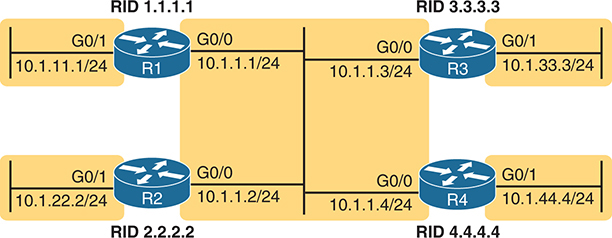
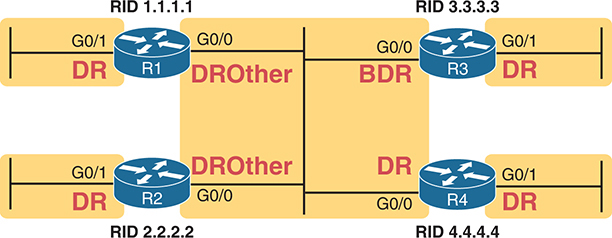
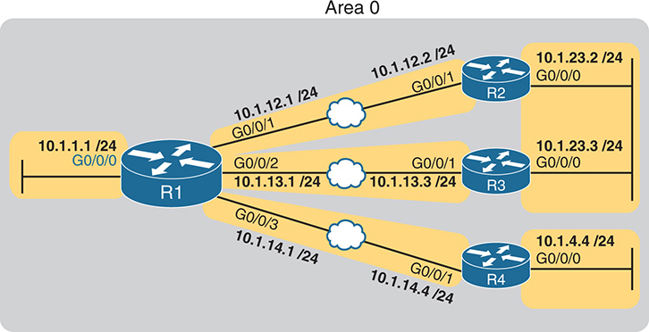
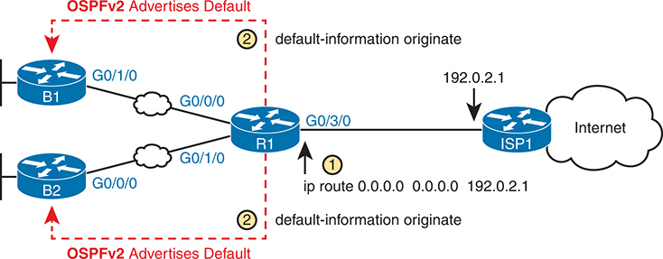
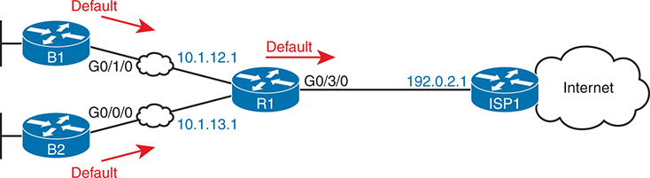
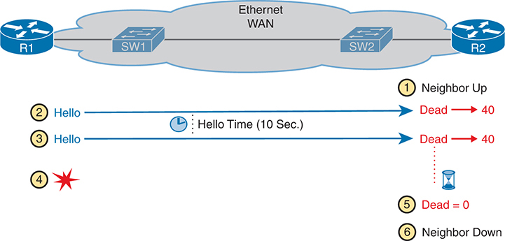

# Chapter 23


## Implementing Optional OSPF Features

This chapter covers the following exam topics:

3.0 IP Connectivity

3.2 Determine how a router makes a forwarding decision by default

3.2.b Administrative distance

3.2.c Routing protocol metric

3.4 Configure and verify single area OSPFv2

3.4.a Neighbor adjacencies

3.4.b Point-to-point

3.4.c Broadcast (DR/BR selection)

3.4.d Router ID

The previous chapter showed how to configure the core OSPF settings to make OSPF work. This chapter examines a variety of optional OSPF settings, chosen for two reasons. First, the CCNA exam topics mention or imply coverage of many of the optional features mentioned in this chapter. Second, the optional features listed here happen to be relatively popular in production networks.

The chapter begins with a section about OSPF network types. As a setting on each interface, the OSPF network type dictates whether the router attempts to dynamically discover neighbors, and once discovered, whether routers on the link use a designated router (DR) or not. The section also discusses how to influence which router wins the DR election using OSPF priority and router IDs (RIDs).

The final section then moves on to discuss a variety of smaller optional OSPF configuration topics. The features include topics such as how to use passive interfaces, how to change OSPF costs (which influences the routes OSPF chooses), and how to create a default route advertised by OSPF.

### "Do I Know This Already?" Quiz

Take the quiz (either here or use the PTP software) if you want to use the score to help you decide how much time to spend on this chapter. The letter answers are listed at the bottom of the page following the quiz. [Appendix C](vol1_appc.xhtml#appc), found both at the end of the book as well as on the companion website, includes both the answers and explanations. You can also find both answers and explanations in the PTP testing software.


**Table 23-1** "Do I Know This Already?" Foundation Topics Section-to-Question Mapping

| Foundation Topics Section | Questions |
| --- | --- |
| OSPF Network Types | 1–4 |
| Additional Optional OSPFv2 Features | 5–6 |

**[1](vol1_ch23.xhtml#ques23_1a).** Routers R1 and R2, with router IDs 1.1.1.1 and 2.2.2.2, connect over an Ethernet WAN link. If using all default OSPF settings, if the WAN link initializes for both routers at the same time, which of the following answers are true? (Choose two answers.)

1. Router R1 will become the DR.
2. Router R1 will dynamically discover the existence of Router R2.
3. Router R2 will be neither the DR nor the BDR.
4. Router R1's **show ip ospf neighbor** command will list R2 with a state of "FULL/DR."

**[2](vol1_ch23.xhtml#ques23_2a).** Routers R1 and R2, with router IDs 1.1.1.1 and 2.2.2.2, connect over an Ethernet WAN link. The configuration uses all defaults, except giving R1 an interface priority of 11 and changing both routers to use OSPF network type point-to-point. If the WAN link initializes for both routers at the same time, which of the following answers are true? (Choose two answers.)

1. Router R1 will become the DR.
2. Router R1 will dynamically discover the existence of Router R2.
3. Router R2 will be neither the DR nor the BDR.
4. Router R2's **show ip ospf neighbor** command will list R1 with a state of "FULL/DR."

**[3](vol1_ch23.xhtml#ques23_3a).** Per the command output, with how many routers is Router R9 fully adjacent over its Gi0/0 interface?

[Click here to view code image](vol1_ch23_images.xhtml#f0585-01)

```
R9# show ip ospf interface brief
Interface    PID   Area      IP Address/Mask   Cost  State Nbrs F/C
Gi0/0        1     0         10.1.1.1/24       1     DROTH 2/5
```

1. 7
2. 0
3. 5
4. 2

**[4](vol1_ch23.xhtml#ques23_4a).** Routers R1 and R2, which use default priority settings, become neighbors, with R1 as the DR and R2 as the BDR. The engineer then configures R2's interface to use OSPF priority 100. Which answers correctly predict any changes in the OSPF neighbor relationship?

1. Router R2 will immediately become the DR.
2. Router R2 will become the DR after the neighbor relationship fails.
3. Router R2 will immediately stop filling the BDR role.
4. Router R2 will become the DR after four OSPF Hello intervals.

**[5](vol1_ch23.xhtml#ques23_5a).** Which of the following configuration settings on a router does not influence which IPv4 route a router chooses to add to its IPv4 routing table when using OSPFv2?

1. **auto-cost reference-bandwidth**
2. **delay**
3. **bandwidth**
4. **ip ospf cost**

**[6](vol1_ch23.xhtml#ques23_6a).** A network engineer configures the **ip ospf hello-interval 15** subcommand under the interfaces that connect OSPF neighbors R1 and R2 but with no use of the **ip ospf dead-interval** subcommand. Eventually, Router R1's OSPF process fails, but the link between R1 and R2 remains working. How long after Router R1's last Hello does R2 consider its neighbor relationship with R1 to fail?

1. 10 seconds
2. 15 seconds
3. 40 seconds
4. 60 seconds

Answers to the "Do I Know This Already?" quiz:

**[1](vol1_appc.xhtml#ques23_1)** B, D

**[2](vol1_appc.xhtml#ques23_2)** B, C

**[3](vol1_appc.xhtml#ques23_3)** D

**[4](vol1_appc.xhtml#ques23_4)** B

**[5](vol1_appc.xhtml#ques23_5)** B

**[6](vol1_appc.xhtml#ques23_6)** D

### Foundation Topics

### OSPF Network Types

Two CCNA 200-301 V1.1 exam topics might be completely misunderstood without taking a closer look at some default OSPF settings. In particular, the following exam topics refer to a specific per-interface OSPF setting called the *network type*—even listing the keywords used to configure the setting in the exam topics:

3.4.b: **point-to-point**

3.4.c: **broadcast** (DR/BDR selection)

OSPF includes a small number of network types as a setting on each OSPF-enabled interface. The setting tells the router whether or not to dynamically discover OSPF neighbors (versus requiring the static configuration of the neighboring router's IP address) and whether or not the router should attempt to use a designated router (DR) and backup designated router (BDR) in the subnet. Of the two OSPF network types included in the CCNA exam topics, both cause routers to dynamically discover neighbors, but one calls for the use of a DR, whereas the other does not. [Table 23-2](vol1_ch23.xhtml#ch23tab02) summarizes the features of the two OSPF network types mentioned in the exam topics.


**Table 23-2** Two OSPF Network Types and Key Behaviors

| Network Type Keyword | Dynamically Discovers Neighbors | Uses a DR/BDR |
| --- | --- | --- |
| **broadcast** | Yes | Yes |
| **point-to-point** | Yes | No |

The rest of this first major section of the chapter explores each type.

#### The OSPF Broadcast Network Type

OSPF defaults to use a [broadcast network type](vol1_gloss.xhtml#gloss_054) on all types of Ethernet interfaces. Note that all the Ethernet interfaces in the examples in [Chapter 22](vol1_ch22.xhtml#ch22), "[Implementing Basic OSPF Features](vol1_ch22.xhtml#ch22)," relied on that default setting.

To see all the details of how the OSPF broadcast network type works, this chapter begins with a different design than the examples in [Chapter 22](vol1_ch22.xhtml#ch22), instead using a single-area design that connects four routers to the same subnet, as shown in [Figure 23-1](vol1_ch23.xhtml#ch23fig01). All links reside in area 0, making the design a single-area design.




**Figure 23-1** *The Single-Area Design Used in This Chapter*

The network design features four routers labeled R1, R2, R3, and R4, each with a unique Router ID (R I D): R I D 1.1.1.1 for R1, R I D 2.2.2.2 for R2, R I D 3.3.3.3 for R3, and R I D 4.4.4.4 for R4. The routers are interconnected via interfaces. R1 has subnet 10.1.11.1/24 connected via the G0/1 interface and subnet 10.1.1.1/24 connected via the G0/0 interface. R2 has subnet 10.1.22.2/24 connected via the G0/1 interface and subnet 10.1.1.2/24 connected via the G0/0 interface. R3 has subnet 10.1.1.3/24 connected via the G0/0 interface and subnet 10.1.33.3/24 connected via the G0/1 interface. R4 has subnet 10.1.1.4/24 connected via the G0/0 interface and subnet 10.1.44.4/24 connected via the G0/1 interface.

To get a sense for how OSPF operates with the broadcast network type, imagine that all four routers use a straightforward OSPF interface configuration like the Router R1 configuration shown in [Example 23-1](vol1_ch23.xhtml#exa23_1). Both GigabitEthernet interfaces on all four routers default to use network type broadcast. Note that the configuration on routers R2, R3, and R4 mirrors R1's configuration except that they use router IDs 2.2.2.2, 3.3.3.3, and 4.4.4.4, respectively, and they use the IP addresses shown in the figure.

**Example 23-1** *R1 OSPF Configuration to Match [Figure 23-1](vol1_ch23.xhtml#ch23fig01)*

[Click here to view code image](vol1_ch23_images.xhtml#f0587-01)

```
router ospf 1
 router-id 1.1.1.1
!
interface gigabitEthernet0/0
 ip ospf 1 area 0
!
interface gigabitEthernet0/1
 ip ospf 1 area 0
```

This simple design gives us a great backdrop from which to observe the results of the broadcast network type on each router. Both interfaces (G0/0 and G0/1) on each router use the broadcast network type and perform the following actions:

* Attempt to discover neighbors by sending OSPF Hellos to the 224.0.0.5 multicast address (an address reserved for sending packets to all OSPF routers in the subnet)
* Attempt to elect a DR and BDR on each subnet
* On the interface with no other routers on the subnet (G0/1), become the DR
* On the interface with three other routers on the subnet (G0/0), be either DR, BDR, or a DROther router
* When sending OSPF messages to the DR or BDR, send the messages to the all-OSPF-DRs multicast address 224.0.0.6

[Example 23-2](vol1_ch23.xhtml#exa23_2) shows some of the results using the **show ip ospf neighbor** command. Note that R1 lists R2, R3, and R4 as neighbors (based on their 2.2.2.2, 3.3.3.3, and 4.4.4.4 router IDs), confirming that R1 dynamically discovered the other routers. Also, note that the output lists 4.4.4.4 as the DR and 3.3.3.3 as the BDR.

**Example 23-2** *R1's List of Neighbors*

[Click here to view code image](vol1_ch23_images.xhtml#f0588-01)

```
R1# show ip ospf neighbor

Neighbor ID     Pri   State           Dead Time   Address       Interface
2.2.2.2           1   2WAY/DROTHER    00:00:35    10.1.1.2      GigabitEthernet0/0
3.3.3.3           1   FULL/BDR        00:00:33    10.1.1.3      GigabitEthernet0/0
4.4.4.4           1   FULL/DR         00:00:35    10.1.1.4      GigabitEthernet0/0
```

##### Verifying Operations with Network Type Broadcast

As discussed in the section "[Using Designated Routers on Ethernet Links](vol1_ch21.xhtml#ch21lev3sec10)" in [Chapter 21](vol1_ch21.xhtml#ch21), "[Understanding OSPF Concepts](vol1_ch21.xhtml#ch21)," all discovered routers on the link should become neighbors and at least reach the *2-way* state. For all neighbor relationships that include the DR and/or BDR, the neighbor relationship should further reach the *full* state. That section defined the term *fully adjacent* as a special term that refers to neighbors that reach this full state.

The design in [Figure 23-1](vol1_ch23.xhtml#ch23fig01), with four routers on the same LAN, provides just enough routers so that one neighbor relationship will remain in a 2-way state and not reach the full state, as a perfectly normal way for OSPF to operate. [Figure 23-2](vol1_ch23.xhtml#ch23fig02) shows the current conditions when the **show** commands in this chapter were gathered, with R4 as the DR, R3 as the BDR, and with R1 and R2 as DROther routers.




**Figure 23-2** *OSPF DR, BDR, and DROther Roles in the Network*

The schematic features four routers labeled R1, R2, R3, and R4, each with a unique Router I D (R I D): R I D 1.1.1.1 for R1, R I D 2.2.2.2 for R2, R I D 3.3.3.3 for R3, and R I D 4.4.4.4 for R4. The routers are interconnected via their interfaces G0/0 and G0/1. The roles assigned to each router are labeled: both R1 and R2 are designated as D R O there on their interface G0/0 and D R on interface G0/1, R3 is designated as B D R on interface G0/0 and D R on interface G0/1, and R4 is designated as D R on both its interfaces.

Now consider Router R1's neighbors as listed in [Example 23-2](vol1_ch23.xhtml#exa23_2). R1 has three neighbors, all reachable out its G0/0 interface. However, R1's **show ip ospf neighbor** command refers to the state of R1's relationship with the neighbor: 2-way with router 2.2.2.2. Because both R1 and R2 currently serve as DROther routers—that is, they wait ready to become the BDR if either the DR or BDR fails—their neighbor relationship remains in a 2-way state.

Examining [Example 23-2](vol1_ch23.xhtml#exa23_2) one last time, R1, as a DROther router itself, has two neighbor relationships that reach a full state: R1's neighbor adjacency with DR R4 and R1's neighbor adjacency with BDR R3. But R1 has a total of three neighbors, all reachable off R1's G0/0 interface.

The next example emphasizes that R1 has three neighbors off its G0/0 interface, with only two as fully adjacent. The far right of the **show ip ospf interface brief** command output in [Example 23-3](vol1_ch23.xhtml#exa23_3) shows "2/3." meaning two fully adjacent neighbors and three total neighbors on that interface. Also, note that this command's "State" column differs from the **show ip ospf neighbor** commands, because it lists the local router's role on the interface, with R1's G0/1 acting as DR and R1's G0/0 acting as a DROther router.


**Example 23-3** *Router R1 OSPF Interfaces: Local Role and Neighbor Counts*

[Click here to view code image](vol1_ch23_images.xhtml#f0589-01)

```
R1# show ip ospf interface brief
Interface    PID   Area            IP Address/Mask    Cost  State Nbrs F/C
Gi0/1        1     0               10.1.11.1/24       1     DR    0/0
Gi0/0        1     0               10.1.1.1/24        1     DROTH 2/3
```

So far, this topic has described the effect of the OSPF broadcast network type by taking advantage of the default setting on Ethernet interfaces. To see the setting, use the **show ip ospf interface** command, as shown in [Example 23-4](vol1_ch23.xhtml#exa23_4). The first highlighted item identifies the network type. However, this command's output restates many of the facts seen in both the **show ip ospf neighbor** and **show ip ospf interface brief** commands in [Examples 23-2](vol1_ch23.xhtml#exa23_2) and [23-3](vol1_ch23.xhtml#exa23_3), so take the time to browse through all of [Example 23-4](vol1_ch23.xhtml#exa23_4) and focus on the additional highlights to see those familiar items.

**Example 23-4** *Displaying OSPF Network Type Broadcast*

[Click here to view code image](vol1_ch23_images.xhtml#f0589-02)

```
R1# show ip ospf interface g0/0
GigabitEthernet0/0 is up, line protocol is up
  Internet Address 10.1.1.1/24, Area 0, Attached via Interface Enable
  Process ID 1, Router ID 1.1.1.1, Network Type BROADCAST, Cost: 1
  Topology-MTID    Cost    Disabled    Shutdown      Topology Name
        0           1         no          no            Base
  Enabled by interface config, including secondary ip addresses
  Transmit Delay is 1 sec, State DROTHER, Priority 1
  Designated Router (ID) 4.4.4.4, Interface address 10.1.1.4
  Backup Designated router (ID) 3.3.3.3, Interface address 10.1.1.3
  Timer intervals configured, Hello 10, Dead 40, Wait 40, Retransmit 5
    oob-resync timeout 40
    Hello due in 00:00:00
  Supports Link-local Signaling (LLS)
  Cisco NSF helper support enabled
  IETF NSF helper support enabled
  Index 1/1/1, flood queue length 0
  Next 0x0(0)/0x0(0)/0x0(0)
  Last flood scan length is 0, maximum is 1
  Last flood scan time is 0 msec, maximum is 0 msec
  Neighbor Count is 3, Adjacent neighbor count is 2
    Adjacent with neighbor 3.3.3.3  (Backup Designated Router)
    Adjacent with neighbor 4.4.4.4  (Designated Router)
  Suppress hello for 0 neighbor(s)
```

Although you would not need to configure an Ethernet interface to use the broadcast network type, for reference, IOS defaults to that setting on Ethernet interfaces per default command **ip ospf network broadcast**.

##### Using Priority and RID to Influence the DR/BDR Election

In some cases, you might want to influence the OSPF DR election. However, before deciding that makes sense in every case, note that OSPF DR/BDR election rules will not result in a specific router always being the DR, and another always being the BDR, assuming that each is up and working. In short, here are the rules once a DR and BDR have been elected:

* If the DR fails, the BDR becomes the DR, and a new BDR is elected.
* When a better router enters the subnet, no preemption of the existing DR or BDR occurs.

As a result of these rules, while you can configure a router to be the best (highest priority) router to become the DR in an election, doing so only increases that router's statistical chances of being the DR at a given point in time. If the router with the highest priority fails, other routers will become DR and BDR, and the best router will not be DR again until the current DR and BDR fail, causing new elections.

However, in some cases, you may want to influence the DR/BDR election. To do so, use these settings, listed here in order of precedence:

* **The highest OSPF interface priority:** The highest value wins during an election, with values ranging from 0 to 255. (A value of 0 prevents the router from ever becoming the DR.)

  
* **The highest OSPF Router ID:** If the priority ties, the election chooses the router with the highest OSPF RID.

For example, imagine all four routers in the design shown in [Figure 23-1](vol1_ch23.xhtml#ch23fig01) trying to elect the DR and BDR at the same time—for instance, after a power hit in which all four routers power off and back on again. No prior DR or BDR exists at this point. They all participate in the election. They all tie with default priority values of 1 (see [Example 23-4](vol1_ch23.xhtml#exa23_4) for R1's priority in the **show ip ospf interface** command output). In this case, R4 becomes the DR based on the numerically highest RID of 4.4.4.4, and R3 becomes the BDR based on the next highest RID of 3.3.3.3.

To influence the election, you could set the various RIDs with your preferred router with the highest RID value. However, many networks choose OSPF router IDs to help identify the router easily rather than choosing to make one value higher than its neighbor. Instead, using the [OSPF priority](vol1_gloss.xhtml#gloss_290) setting makes better sense. For instance, if an engineer preferred that R1 be the DR, the engineer could add the configuration in [Example 23-5](vol1_ch23.xhtml#exa23_5) to set R1's interface priority to 99.

**Example 23-5** *Influencing DR/BDR Election Using OSPF Priority*

[Click here to view code image](vol1_ch23_images.xhtml#f0591-01)

```
R1# configure terminal
Configuring from terminal, memory, or network [terminal]?
Enter configuration commands, one per line.  End with CNTL/Z.
R1(config)# interface g0/0
R1(config-if)# ip ospf priority 99
R1(config-if)# ^Z
R1#
R1# show ip ospf interface g0/0 | include Priority
  Transmit Delay is 1 sec, State DROTHER, Priority 99

R1# show ip ospf neighbor
Neighbor ID     Pri   State           Dead Time   Address         Interface
2.2.2.2           1   2WAY/DROTHER    00:00:36    10.1.1.2        GigabitEthernet0/0
3.3.3.3           1   FULL/BDR        00:00:30    10.1.1.3        GigabitEthernet0/0
4.4.4.4           1   FULL/DR         00:00:37    10.1.1.4        GigabitEthernet0/0

R1# show ip ospf interface brief
Interface    PID   Area            IP Address/Mask    Cost  State Nbrs F/C
Gi0/1        1     0               10.1.11.1/24       1     DR    0/0
Gi0/0        1     0               10.1.1.1/24        1     DROTH 2/3
```

The top of the example shows R1's interface priority value now as 99, and the **show ip ospf interface G0/0** command that follows confirms the setting. However, the last two commands confirm that OSPF does not preempt the existing DR or BDR. Note that the **show ip ospf neighbor** command still lists R4's state as DR, meaning R4 still acts as the DR, so R1, with a higher priority, did not take over. The final command, **show ip ospf interface brief**, lists R1's State (role) as DROTH.

Just to complete the process and show R1 winning a DR election, [Example 23-6](vol1_ch23.xhtml#exa23_6) shows the results after forcing a free election by failing the LAN switch that sits between the four routers. As expected, R1 wins and becomes DR due to its higher priority, with the other three routers tying based on priority. R4 wins between R2, R3, and R4 due to its higher RID to become the BDR.

**Example 23-6** *Results of a Completely New DR/BDR Election*

[Click here to view code image](vol1_ch23_images.xhtml#f0592-01)

```
! Not shown: LAN fails, and then recovers, causing a new OSPF Election
R1# show ip ospf neighbor

Neighbor ID     Pri   State           Dead Time   Address         Interface
2.2.2.2           1   FULL/DROTHER    00:00:37    10.1.1.2        GigabitEthernet0/0
3.3.3.3           1   FULL/DROTHER    00:00:38    10.1.1.3        GigabitEthernet0/0
4.4.4.4           1   FULL/BDR        00:00:38    10.1.1.4        GigabitEthernet0/0

R1# show ip ospf interface brief
Interface    PID   Area            IP Address/Mask    Cost  State Nbrs F/C
Gi0/1        1     0               10.1.11.1/24       1     DR    0/0
Gi0/0        1     0               10.1.1.1/24        1     DR    3/3
```

Note

If you have begun to mentally compare OSPF DR elections to STP elections, keep some key differences in mind. First, STP uses lowest-is-best logic, whereas OSPF uses highest-is-best. STP elections allow preemption—for instance, if a new switch appears with a superior (lower) bridge ID (BID) than the current root, the new switch becomes the root switch. OSPF does not preempt, so a new router on a link, with the highest priority, does not take over as DR or BDR. Instead, it wins future elections, eventually becoming the DR.

#### The OSPF Point-to-Point Network Type

The other OSPF network type mentioned in the CCNA 200-301 V1.1 blueprint, point-to-point, works well for data links that by their nature have just two routers on the link. For example, consider the topology in [Figure 23-3](vol1_ch23.xhtml#ch23fig03), which shows Router R1 with three WAN links—two Ethernet WAN links and one serial link.




**Figure 23-3** *Sample OSPF Design for Upcoming Examples*

The network infrastructure consists of four routers, labeled R1 through R4. R1, with interface G0/0/0, is connected to subnet 10.1.1.1/24. R1 also has subnet 10.1.12.1/24 with interface G0/0/1, which is connected to R2 with subnet 10.1.12.2/24 and interface G0/0/1 via Ethernet W A N. R2 is connected to subnet 10.1.23.2/24 through interface G0/0/0. Furthermore, R1, with subnet 10.1.13.1/24 and interface G0/0/2, is connected to R3 with subnet 10.1.13.3/24 and interface G0/0/1 via Ethernet W A N. R3 is connected to subnet 10.1.23.3/24 through interface G0/0/0. Lastly, R1, with subnet 10.1.14.1/24 and interface G0/0/3, is connected to R4 with subnet 10.1.14.4/24 and interface G0/0/1 via Ethernet W A N. R4 is connected to subnet 10.1.4.4/24 through interface G0/0/0.

First, consider the older-style serial links (not used in the figure). Serial links between routers do not support the capability to add a third router to the link. With only two devices on the link, using a DR/BDR provides no advantage; instead, it adds a little extra convergence time. Using a network type of point-to-point tells the router to not use a DR/BDR on the link, which makes sense on serial links. In fact, IOS defaults to a setting of **ip ospf network point-to-point** on serial interfaces.

While you might not see many serial links in networks today, some other point-to-point WAN topologies exist, including some Ethernet WAN links. All the Ethernet WAN links used in this book happen to use a point-to-point Ethernet WAN service called an Ethernet Private Wire Service or simply an Ethernet Line (E-Line). For that service, the service provider will send Ethernet frames between two devices (routers) connected to the service, but only those two devices. In other words, an E-Line is a point-to-point service in concept. So, like serial links, Ethernet WAN links with only two routers connected gain no advantage by using a DR/BDR. As a result, many engineers prefer to instead use an OSPF [point-to-point network type](vol1_gloss.xhtml#gloss_306) on Ethernet WAN links that in effect act as a point-to-point link.

[Example 23-7](vol1_ch23.xhtml#exa23_7) shows the configuration of Router R1's G0/0/1 interface in [Figure 23-3](vol1_ch23.xhtml#ch23fig03) to use OSPF network type point-to-point. R2, on the other end of the WAN link, would need the same configuration command on its matching interface.

**Example 23-7** *OSPF Network Type Point-to-Point on an Ethernet WAN Interface on R1*

[Click here to view code image](vol1_ch23_images.xhtml#f0593-01)

```
R1# configure terminal
Enter configuration commands, one per line.  End with CNTL/Z.
R1(config)# interface g0/0/1
R1(config-if)# ip ospf network point-to-point
R1(config-if)#

R1# show ip ospf interface g0/0/1
GigabitEthernet0/0/1 is up, line protocol is up
  Internet Address 10.1.12.1/24, Area 0, Attached via Interface Enable
  Process ID 1, Router ID 1.1.1.1, Network Type POINT_TO_POINT, Cost: 1
  Topology-MTID    Cost    Disabled    Shutdown      Topology Name
        0           4         no          no            Base
  Enabled by interface config, including secondary ip addresses
  Transmit Delay is 1 sec, State POINT_TO_POINT
  Timer intervals configured, Hello 10, Dead 40, Wait 40, Retransmit 5
    oob-resync timeout 40
    Hello due in 00:00:01
  Supports Link-local Signaling (LLS)
  Cisco NSF helper support enabled
  IETF NSF helper support enabled
  Index 1/3/3, flood queue length 0
  Next 0x0(0)/0x0(0)/0x0(0)
  Last flood scan length is 1, maximum is 3
  Last flood scan time is 0 msec, maximum is 0 msec
  Neighbor Count is 1, Adjacent neighbor count is 1
    Adjacent with neighbor 2.2.2.2
  Suppress hello for 0 neighbor(s)
```

Note the highlighted portions of the **show** command in [Example 23-7](vol1_ch23.xhtml#exa23_7). The first two highlights note the network type. The final highlight with two lines notes that R1 has one neighbor on the interface, a neighbor with which it has become fully adjacent per the output.

[Example 23-8](vol1_ch23.xhtml#exa23_8) closes this section with a confirmation of some of those facts with two more commands. Note that the **show ip ospf neighbor** command on R1 lists Router R2 (RID 2.2.2.2) with a full state, but with no DR or BDR designation, instead listing a -. The - acts as a reminder that the link does not use a DR/BDR. The second command, **show ip ospf interface brief**, shows the state (the local router's role) as P2P, which is short for point-to-point, with a counter of 1 for the number of fully adjacent neighbors and total number of neighbors.


**Example 23-8** *OSPF Network Type Point-to-Point on an Ethernet WAN Interface on R1*

[Click here to view code image](vol1_ch23_images.xhtml#f0594-01)

```
R1# show ip ospf neighbor

Neighbor ID     Pri   State           Dead Time   Address       Interface
2.2.2.2           0   FULL/  -        00:00:39    10.1.12.2     GigabitEthernet0/0/1
! lines omitted for brevity

R1# show ip ospf interface brief
Interface    PID   Area            IP Address/Mask    Cost  State Nbrs F/C
Gi0/0/1      1     0               10.1.12.1/24       4     P2P   1/1
! lines omitted for brevity
```

When using Ethernet WAN links that behave as a point-to-point link, consider using OSPF network type point-to-point rather than using the default broadcast type.

### Additional Optional OSPFv2 Features

This final major section of the chapter discusses some popular but optional OSPFv2 configuration features, as listed here in their order of appearance:

* Passive interfaces
* Default routes
* Metrics
* Hello and Dead intervals

#### OSPF Passive Interfaces

Once OSPF has been enabled on an interface, the router tries to discover neighboring OSPF routers and form a neighbor relationship. To do so, the router sends OSPF Hello messages on a regular time interval (called the Hello interval). The router also listens for incoming Hello messages from potential neighbors.

Sometimes, a router does not need to form neighbor relationships with neighbors on an interface. Often, no other routers exist on a particular link, so the router has no need to keep sending those repetitive OSPF Hello messages. In such cases, an engineer can make the interface passive, which means

* OSPF continues to advertise about the subnet that is connected to the interface.

  
* OSPF no longer sends OSPF Hellos on the interface.
* OSPF no longer processes any received Hellos on the interface.

The result of enabling OSPF on an interface but then making it passive is that OSPF still advertises about the connected subnet, but OSPF also does not form neighbor relationships over the interface.

To configure an interface as passive, two options exist. First, you can add the following command to the configuration of the OSPF process, in router configuration mode:

**passive-interface** *type number*

Alternately, the configuration can change the default setting so that all interfaces are passive by default and then add a **no passive-interface** command for all interfaces that need to not be passive:

**passive-interface default**

**no passive-interface** *type number*

For example, in the sample internetwork in [Figure 23-4](vol1_ch23.xhtml#ch23fig04), Router R1 connects to a LAN with its G0/0/0 interface. With no other OSPF routers on that LAN, R1 will never discover an OSPF neighbor on that interface. [Example 23-9](vol1_ch23.xhtml#exa23_9) shows two alternative configurations to make R1's G0/0/0 passive to OSPF.


**Figure 23-4** *Sample OSPF Design for Upcoming Examples*

The network infrastructure consists of four routers, labeled R1 through R4. R1, with interface G0/0/0, is connected to subnet 10.1.1.1/24. R1 also has subnet 10.1.12.1/24 with interface G0/0/1, which is connected to R2 with subnet 10.1.12.2/24 and interface G0/0/1 via Ethernet W A N. R2 is connected to subnet 10.1.23.2/24 through interface G0/0/0. Furthermore, R1, with subnet 10.1.13.1/24 and interface G0/0/2, is connected to R3 with subnet 10.1.13.3/24 and interface G0/0/1 via Ethernet W A N. R3 is connected to subnet 10.1.23.3/24 through interface G0/0/0. Lastly, R1, with subnet 10.1.14.1/24 and interface G0/0/3, is connected to R4 with subnet 10.1.14.4/24 and interface G0/0/1 via Ethernet W A N. R4 is connected to subnet 10.1.4.4/24 through interface G0/0/0.

**Example 23-9** *Configuring Passive Interfaces on R1 from [Figure 23-4](vol1_ch23.xhtml#ch23fig04)*

[Click here to view code image](vol1_ch23_images.xhtml#f0596-01)

```
! First, make each interface passive directly
router ospf 1
 passive-interface GigabitEthernet0/0/0

! Or, change the default to passive, and make the other interfaces not be passive
router ospf 1
 passive-interface default
 no passive-interface GigabitEthernet0/0/1
 no passive-interface GigabitEthernet0/0/2
 no passive-interface GigabitEthernet0/0/3
```

In real internetworks, use the configuration style that requires the least number of commands. For example, a router with 20 interfaces, 18 of which are passive to OSPF, has far fewer configuration commands when using the **passive-interface default** command to change the default to passive. If only two of those 20 interfaces need to be passive, use the default setting, in which all interfaces are not passive, to keep the configuration shorter.

Interestingly, OSPF makes it a bit of a challenge to use **show** commands to find out whether an interface is passive. The **show running-config** command lists the configuration directly, but if you cannot get into enable mode to use this command, note these two facts:

The **show ip ospf interface brief** command lists all interfaces on which OSPF is enabled, including [passive interfaces](vol1_gloss.xhtml#gloss_300).

The **show ip ospf interface** command lists several output lines per interface with a single line that mentions that the interface is passive.

[Example 23-10](vol1_ch23.xhtml#exa23_10) shows these commands on Router R1, based on the configuration shown in the top of [Example 23-9](vol1_ch23.xhtml#exa23_9). Note that passive interface G0/0/0 appears in the output of **show ip ospf interface brief**.

**Example 23-10** *Displaying Passive Interfaces*

[Click here to view code image](vol1_ch23_images.xhtml#f0596-02)

```
R1# show ip ospf interface brief
Interface    PID   Area            IP Address/Mask    Cost  State Nbrs F/C
Gi0/0/0      1     0               10.1.1.1/24        1     DR    0/0
Gi0/0/1      1     0               10.1.12.1/24       1     BDR   1/1
Gi0/0/2      1     0               10.1.13.1/24       1     BDR   1/1
Gi0/0/3      1     0               10.1.14.1/24       1     DR    1/1

R1# show ip ospf interface g0/0/0
GigabitEthernet0/0/0 is up, line protocol is up
  Internet Address 10.1.1.1/24, Area 0, Attached via Network Statement
  Process ID 1, Router ID 1.1.1.1, Network Type BROADCAST, Cost: 1
  Topology-MTID    Cost    Disabled    Shutdown      Topology Name
        0           1         no          no            Base
  Transmit Delay is 1 sec, State DR, Priority 1
  Designated Router (ID) 1.1.1.1, Interface address 10.1.1.1
  No backup designated router on this network
  Timer intervals configured, Hello 10, Dead 40, Wait 40, Retransmit 5
    oob-resync timeout 40
    No Hellos (Passive interface)
! Lines omitted for brevity
```

#### OSPF Default Routes

[Chapter 17](vol1_ch17.xhtml#ch17), "[Configuring IPv4 Addresses and Static Routes](vol1_ch17.xhtml#ch17)," showed some of the uses and benefits of default routes, with examples of static default routes. For those exact same reasons, networks can use OSPF to advertise default routes.

The most classic case for using a routing protocol to advertise a default route has to do with an enterprise's connection to the Internet. As a strategy, the enterprise engineer uses these design goals:

* All routers learn specific (nondefault) routes for subnets inside the company; a default route is not needed when forwarding packets to these destinations.
* One router connects to the Internet, and it has a default route that points toward the Internet.
* All routers should dynamically learn a default route, used for all traffic going to the Internet, so that all packets destined to locations in the Internet go to the one router connected to the Internet.

[Figure 23-5](vol1_ch23.xhtml#ch23fig05) shows the idea of how OSPF advertises the default route, with the specific OSPF configuration. In this case, a company connects to an ISP with its Router R1. That router has a static default route (destination 0.0.0.0, mask 0.0.0.0) with a next-hop address of the ISP router. Then the use of the OSPF **default-information originate** command (Step 2) makes the router advertise a default route using OSPF to the remote routers (B1 and B2).





**Figure 23-5** *Using OSPF to Create and Flood a Default Route*

The schematic features four routers: B1, B2, R1, and ISP1. Both B1 and B2 are labeled "OSPFv2 Advertises Default" and are connected to R1 via interfaces G0/1/0 and G0/0/0 respectively. R1 is connected to B1 and B2 via interfaces G0/0/0 and G0/1/0 respectively. R1 is connected to an ISP1 via interface G0/3/0 with an IP address of 192.0.2.1. ISP1 represents Internet through a cloud icon. Two commands are indicated in the schematic: "ip route 0.0.0.0 0.0.0 192.02.1" at interface G0/3/0 and "default-information originate", which represent the commands used in OSPF for creating and advertising default routes.

[Figure 23-6](vol1_ch23.xhtml#ch23fig06) shows the default routes that result from OSPF's advertisements in [Figure 23-5](vol1_ch23.xhtml#ch23fig05). On the far left, the branch routers all have OSPF-learned default routes, pointing to R1. R1 itself also needs a default route, pointing to the ISP router, so that R1 can forward all Internet-bound traffic to the ISP.




**Figure 23-6** *Default Routes Resulting from the **default-information originate** Command*

The schematic features four routers: B1, B2, R1, and ISP1. Both B1 and B2 are connected to R1 via interfaces G0/1/0 and G0/0/0 respectively, with IP addresses 10.1.12.1 and 10.1.13.1. Default routes point from both B1 and B2 towards R1. R1 is connected to an ISP1 via interface G0/3/0 with an IP address of 192.0.2.1. ISP1 represents Internet through a cloud icon.

[Example 23-11](vol1_ch23.xhtml#exa23_11) first highlights the two commands relevant to the default route on Router R1 in [Figure 23-6](vol1_ch23.xhtml#ch23fig06). The router has a default static route referring to the ISP router as the next-hop router (192.0.2.1). It also has a **default-information originate** command configured under the OSPF process, telling the router to advertise a default route to other OSPF routers—but only if the router currently has a default route.

**Example 23-11** *Relevant OSPF Configuration on Internet Edge Router R1*

[Click here to view code image](vol1_ch23_images.xhtml#f0598-01)

```
! Excerpt from a show running-config command on router R1
ip route 0.0.0.0 0.0.0.0 192.0.2.1
!
router ospf 1
  network 10.0.0.0 0.255.255.255 area 0
  router-id 1.1.1.1
  default-information originate
```

[Example 23-12](vol1_ch23.xhtml#exa23_12) shows the status based on the configuration shown in [Example 23-11](vol1_ch23.xhtml#exa23_11). First, the top of the example confirms that R1 has a default route—that is, a route to 0.0.0.0/0. The "Gateway of last resort," which refers to the default route currently used by the router, points to next-hop IP address 192.0.2.1, which is the ISP router's IP address.

**Example 23-12** *Default Routes on Routers R1 and B1*

[Click here to view code image](vol1_ch23_images.xhtml#f0598-02)

```
! The next command is from Router R1. Note the static code for the default route
R1# show ip route static
Codes: L - local, C - connected, S - static, R - RIP, M - mobile, B - BGP
! Rest of the legend omitted for brevity

Gateway of last resort is 192.0.2.1 to network 0.0.0.0

S*     0.0.0.0/0 [254/0] via 192.0.2.1
```

```
! The next command is from router B1; notice the External route code for the default
B1# show ip route ospf
Codes: L - local, C - connected, S - static, R - RIP, M - mobile, B - BGP
       D - EIGRP, EX - EIGRP external, O - OSPF, IA - OSPF inter area
       N1 - OSPF NSSA external type 1, N2 - OSPF NSSA external type 2
       E1 - OSPF external type 1, E2 - OSPF external type 2
! Rest of the legend omitted for brevity

Gateway of last resort is 10.1.12.1 to network 0.0.0.0

O*E2   0.0.0.0/0 [110/1] via 10.1.12.1, 00:20:51, GigabitEthernet0/1/0
       10.0.0.0/8 is variably subnetted, 6 subnets, 2 masks
O         10.1.3.0/24 [110/3] via 10.1.12.1, 00:20:51, GigabitEthernet0/1/0
O         10.1.13.0/24 [110/2] via 10.1.12.1, 00:20:51, GigabitEthernet0/1/0
```

The bottom half of the example shows router B1's OSPF-learned default route. B1 lists a route for 0.0.0.0/0 as well. The next-hop router in this case is 10.1.12.1, which is Router R1's IP address on the WAN link. The code on the far left is O\*E2, meaning an OSPF-learned route, which is a default route, and is specifically an external OSPF route. B1's gateway of last resort setting uses that one OSPF-learned default route, with next-hop router 10.1.12.1.

Finally, the OSPF subcommand **default-information originate** makes the logic conditional: only advertise a default route into OSPF if you already have some other default route. Adding the **always** keyword to the command (**default-information originate always)** tells OSPF to always advertise a default route into OSPF regardless of whether a default route currently exists.

#### OSPF Metrics (Cost)

The section "[Calculating the Best Routes with SPF](vol1_ch21.xhtml#ch21lev2sec7)" in [Chapter 21](vol1_ch21.xhtml#ch21) discussed how SPF calculates the metric for each route, choosing the route with the best metric for each destination subnet. OSPF routers can influence that choice by changing the OSPF interface cost using three different configuration options:

* Directly, using the interface subcommand **ip ospf cost** *x*.
* Using the default calculation per interface, and changing the [interface bandwidth](vol1_gloss.xhtml#gloss_193) setting, which changes the calculated value.
* Using the default calculation per interface, and changing the OSPF [reference bandwidth](vol1_gloss.xhtml#gloss_328) setting, which changes the calculated value.

##### Setting the Cost Directly

Setting the cost directly requires a simple configuration command, as shown in [Example 23-13](vol1_ch23.xhtml#exa23_13). The example sets the cost of two interfaces on Router R1. This example uses the [Figure 23-4](vol1_ch23.xhtml#ch23fig04) topology, with a single area, with OSPF enabled on all interfaces shown in the figure. The **show ip ospf interface brief** command that follows details the cost of each interface. Note that the **show** command confirms the cost settings.

**Example 23-13** *Confirming OSPF Interface Costs*

[Click here to view code image](vol1_ch23_images.xhtml#f0600-01)

```
R1# conf t
Enter configuration commands, one per line.  End with CNTL/Z.
R1(config)# interface g0/0/1
R1(config-if)# ip ospf cost 4
R1(config-if)# interface g0/0/2
R1(config-if)# ip ospf cost 5
R1(config-if)# ^Z
R1#
R1# show ip ospf interface brief
Interface    PID   Area            IP Address/Mask    Cost  State Nbrs F/C
Gi0/0/0      1     0               10.1.1.1/24        1     DR    0/0
Gi0/0/1      1     0               10.1.12.1/24       4     DR    1/1
Gi0/0/2      1     0               10.1.13.1/24       5     BDR   1/1
Gi0/0/3      1     0               10.1.14.1/24       1     DR    1/1
```

The output also shows a cost value of 1 for the other Gigabit interfaces, which is the default OSPF cost for any interface faster than 100 Mbps. The next topic discusses how IOS determines the default cost values.

##### Setting the Cost Based on Interface and Reference Bandwidth

Routers use a per-interface *bandwidth* setting to describe the speed of the interface. Note that the interface bandwidth setting does not influence the actual transmission speed. Instead, the interface bandwidth acts as a configurable setting to represent the speed of the interface, with the option to configure the bandwidth to match the actual transmission speed…or not. To support this logic, IOS sets a default interface bandwidth value that matches the physical transmission speed when possible, but also allows the configuration of the interface bandwidth using the **bandwidth** *speed* interface subcommand.

OSPF (as well as other IOS features) uses the interface bandwidth to make decisions, with OSPF using the interface bandwidth in its calculation of the default OSPF cost for each interface. IOS uses the following formula to choose an interface's OSPF cost for interfaces that do not have an **ip ospf cost** command configured. IOS puts the interface's bandwidth in the denominator and an OSPF setting called the *reference bandwidth* in the numerator:

Reference\_bandwidth / Interface\_bandwidth

Note that while you can change both the interface bandwidth and reference bandwidth via configuration, because several IOS features make use of the interface bandwidth setting, you should avoid changing the interface bandwidth to influence the default OSPF cost.

Today, most companies override the default IOS reference bandwidth setting. Cisco chose the default setting (100 Mbps) decades ago in an era with much slower links. As a result, when using that default, any interface bandwidth of 100 Mbps or faster results in a calculated OSPF cost of 1. So, when you re relying on the OSPF cost calculation, it helps to configure the reference bandwidth to a speed faster than the fastest speed link in the network.

To see the issue, consider [Table 23-3](vol1_ch23.xhtml#ch23tab03), which lists several types of interfaces, the default interface bandwidth on those interfaces, and the OSPF cost calculated with the default OSPF reference bandwidth of 100 Mbps (that is, 100,000 Kbps). (OSPF rounds up for these calculations, resulting in a lowest possible OSPF interface cost of 1.)


**Table 23-3** Faster Interfaces with Equal OSPF Costs

| Interface | Interface Default Bandwidth (Kbps) | Formula (Kbps) | OSPF Cost |
| --- | --- | --- | --- |
| Serial | 1544 Kbps | 100,000 / 1544 | 64 |
| Ethernet | 10,000 Kbps | 100,000 / 10,000 | 10 |
| Fast Ethernet | 100,000 Kbps | 100,000/100,000 | 1 |
| Gigabit Ethernet | 1,000,000 Kbps | 100,000/1,000,000 | 1 |
| 10 Gigabit Ethernet | 10,000,000 Kbps | 100,000/10,000,000 | 1 |
| 100 Gigabit Ethernet | 100,000,000 Kbps | 100,000/100,000,000 | 1 |

As you can see from the table, with a default reference bandwidth, all interfaces from Fast Ethernet's 100 Mbps and faster tie with their default OSPF cost. As a result, OSPF would treat a 100-Mbps link as having the same cost as a 10- or 100-Gbps link, which is probably not the right basis for choosing routes.

You can still use OSPF's default cost calculation (and many do) just by changing the reference bandwidth with the **auto-cost reference-bandwidth** *speed* OSPF mode subcommand. This command sets a value in a unit of megabits per second (Mbps). Set the reference bandwidth value to a value at least as much as the fastest link speed in the network, but preferably higher, in anticipation of adding even faster links in the future.

For instance, in an enterprise whose fastest links are 10 Gbps (10,000 Mbps), you could set all routers to use **auto-cost reference-bandwidth 10000**, meaning 10,000 Mbps or 10 Gbps. In that case, by default, a 10-Gbps link would have an OSPF cost of 1, while a 1-Gbps link would have a cost of 10, and a 100-MBps link a cost of 100.

Better still, in that same enterprise, use a reference bandwidth of a faster speed than the fastest interface in the network, to allow room for higher speeds. For instance, in that same enterprise, whose fastest link is 10 Gbps, set the reference bandwidth to 40 Gbps or even 100 Gbps to be ready for future upgrades to use 40-Gbps links, or even 100-Gbps links. (For example, use the **auto-cost reference-bandwidth 100000** command, meaning 100,000 Mbps or 100 Gbps.) That causes 100-Gbps links to have an OSPF cost of 1, 40-Gbps links to have a cost of 2, 10-Gbps links to have a cost of 10, and 1-Gbps links to have a cost of 100.

Note

Cisco recommends making the OSPF reference bandwidth setting the same on all OSPF routers in an enterprise network.

For convenient study, the following list summarizes the rules for how a router sets its OSPF interface costs:

1. Set the cost explicitly, using the **ip ospf cost** *x* interface subcommand, to a value between 1 and 65,535, inclusive.

   
2. Although it should be avoided, change the interface bandwidth with the **bandwidth** *speed* command, with *speed* being a number in kilobits per second (Kbps).
3. Change the reference bandwidth, using router OSPF subcommand **auto-cost reference-bandwidth** *ref-bw*, with a unit of megabits per second (Mbps).

#### OSPF Hello and Dead Intervals

OSPF does a lot of interesting work with the OSPF Hello message when initializing neighbors. As explained in the section, "[Meeting Neighbors and Learning Their Router ID](vol1_ch21.xhtml#ch21lev3sec7)," in [Chapter 21](vol1_ch21.xhtml#ch21), an OSPF router uses Hello messages to announce the router's presence on the link, with those messages sent to the 224.0.0.5 all-OSPF-routers multicast address. The router also listens for incoming Hello messages from potential neighbors. Upon hearing Hellos from each other, two routers check the settings revealed in the Hello, and if compatible, the two routers can proceed to become neighbors.

This section looks at the other end of the story: what happens when the neighbor relationship fails.

First, while the neighbor relationship continues to work, routers send Hello messages regularly per a per-interface [Hello interval](vol1_gloss.xhtml#gloss_167) (also called the *Hello timer*). Cisco IOS defaults to a 10-second Hello interval on all Ethernet interfaces. Why? When a router no longer receives the incoming Hello messages from a neighbor, the router believes the neighbor has failed, and takes the neighbor relationship down.

The process to decide when a neighbor fails uses the assumption on continual incoming Hello messages from the neighbor, combined with a second timer: the [Dead interval](vol1_gloss.xhtml#gloss_087) (also called the *Dead timer*). The Dead timer tells the interface how long to wait. That is, how long since receiving a Hello message should a router wait before deciding that the neighbor failed.

[Figure 23-7](vol1_ch23.xhtml#ch23fig07) shows an example of the interaction, focusing on what happens if Router R1 fails, and how Router R2 views the messages and timers. In this case, Router R1 loses power, but R2's Ethernet WAN link remains up because the link between R2 and the Ethernet WAN services does not have any problem. The sequence of events follows the circled step numbers as follows, using the default settings of a 10-second Hello timer and 40-second Dead timer:

1. Router R2 has a working neighbor relationship with R1 (full state).
2. R1 sends a Hello message, as usual; R2 resets its Dead timer to 40.
3. R1 sends another Hello message, 10 seconds later; R2 resets its Dead timer to 40.
4. R1 loses power; R2 receives no further Hellos from R1.
5. The Dead timer counts down to 0.
6. Router R2 changes the neighbor state for neighbor R1 to down and reconverges.

Under normal working conditions, with default settings, the Dead timer gets reset to 40, counts down to 30, and is reset to 40, over and over. However, the process also means that you might want to configure to use a lower Dead interval to improve the speed with which routers react to failures.

[Example 23-14](vol1_ch23.xhtml#exa23_14) shows the straightforward interface subcommands to set the Hello and Dead intervals. The example is based on the network in [Figure 23-4](vol1_ch23.xhtml#ch23fig04), showing the configuration in Router R1, with the three WAN interfaces that connect to routers R2, R3, and R4. Although not shown, the neighboring routers must also be configured with the same Hello and Dead timer settings.





**Figure 23-7** *An Example: R2's Use of the Hello and Dead Intervals*

A networking process between two routers, R1 and R2, connected via Ethernet WAN through switches SW1 and SW2. The process starts with the Neighbor Up (Step 1). During this phase, R1 sends a Hello message to R2, which resets its Dead timer to 40. R1 sends another Hello message, 10 seconds later; R2 resets its Dead timer to 40. Step 4 is marked with a red asterisk signifying power loss of R1. The Dead timer count reaches zero (Step 5), indicating no receipt of Hello packets. The Neighbor goes Down (Step 6).

**Example 23-14** *Configuring OSPF Hello and Dead Intervals*

[Click here to view code image](vol1_ch23_images.xhtml#f0603-01)

```
R1# conf t
Enter configuration commands, one per line.  End with CNTL/Z.
! Link connected to router R2
R1(config)# interface g0/0/1
R1(config-if)# ip ospf hello-interval 5
! Link connected to router R3
R1(config)# interface g0/0/2
R1(config-if)# ip ospf dead-interval 20
! Link connected to router R4
R1(config)# interface g0/0/3
R1(config-if)# ip ospf hello-interval 5
R1(config-if)# ip ospf dead-interval 15
R1(config-if)# Ctl-z
R1#
```

[Example 23-15](vol1_ch23.xhtml#exa23_15) confirms the settings configured in [Example 23-14](vol1_ch23.xhtml#exa23_14), but with a twist on interface G0/0/1. IOS uses a Hello interval default of 10 seconds on Ethernet interfaces, but a default of four times the Hello interval for the Dead interval. For interface G0/0/1, because only the Hello interval was configured, IOS uses a default dead interval based on 4 × Hello, or 20. However, the other two interfaces follow more predictable logic, summarized by this list, and then confirmed in the highlights in [Example 23-15](vol1_ch23.xhtml#exa23_15):

* G0/0/1: Hello = 5 (configured) and Dead = 20 (calculated by IOS as 4X Hello)
* G0/0/2: Hello = 10 (IOS default) and Dead = 20 (configured)
* G0/0/3: Hello = 5 and Dead = 15 (both configured)

**Example 23-15** *Confirming New OSPF Hello and Dead Intervals, Per Interface*

[Click here to view code image](vol1_ch23_images.xhtml#f0604-01)

```
R1# show ip ospf interface g0/0/1 | include Hello
  Timer intervals configured, Hello 5, Dead 20, Wait 20, Retransmit 5
    Hello due in 00:00:02

R1# show ip ospf interface g0/0/2 | include Hello
  Timer intervals configured, Hello 10, Dead 20, Wait 20, Retransmit 5
    Hello due in 00:00:04

R1# show ip ospf interface g0/0/3 | include Hello
  Timer intervals configured, Hello 5, Dead 15, Wait 15, Retransmit 5
    Hello due in 00:00:03
```

IOS enables us to make poor configuration choices with these two settings. As a fair warning, consider these points:

* The default settings create a 4:1 ratio between the dead:hello timers. That ratio requires four consecutive lost Hellos before the Dead timer would expire. No matter the numbers, consider using the same 4:1 ratio, or at least a 3:1 ratio for your chosen numbers.
* Two neighboring routers must use the same Dead and Hello timer settings. However, IOS allows you to configure different settings on potential neighbors, preventing them from becoming neighbors, so take care to ensure the settings match.
* IOS enables you to make a poor choice to configure a Dead interval smaller than the Hello interval. In that case, the Dead interval expires before a router receives the next Hello. The neighbor relationship fails and recovers repeatedly once per Hello interval. Instead, always set the Dead interval higher than the Hello interval.

### Chapter Review

One key to doing well on the exams is to perform repetitive spaced review sessions. Review this chapter's material using either the tools in the book or interactive tools for the same material found on the book's companion website. Refer to the "[Your Study Plan](vol1_pref10.xhtml#pref10)" element for more details. [Table 23-4](vol1_ch23.xhtml#ch23tab04) outlines the key review elements and where you can find them. To better track your study progress, record when you completed these activities in the second column.

**Table 23-4** Chapter Review Tracking

| Review Element | Review Date(s) | Resource Used |
| --- | --- | --- |
| Review key topics |  | Book, website |
| Review key terms |  | Book, website |
| Answer DIKTA questions |  | Book, PTP |
| Review Config Checklists |  | Book, website |
| Review command tables |  | Book |
| Do labs |  | Blog |
| Watch videos |  | Website |

### Review All the Key Topics


**Table 23-5** Key Topics for [Chapter 23](vol1_ch23.xhtml#ch23)

| Key Topic Element | Description | Page Number |
| --- | --- | --- |
| [Table 23-2](vol1_ch23.xhtml#ch23tab02) | Two OSPF network types and key behaviors | [586](vol1_ch23.xhtml#page_586) |
| [Example 23-3](vol1_ch23.xhtml#exa23_3) | OSPF interfaces, local roles, and neighbor counts | [589](vol1_ch23.xhtml#page_589) |
| List | Rules for electing OSPF DR/BDR | [590](vol1_ch23.xhtml#page_590) |
| [Example 23-8](vol1_ch23.xhtml#exa23_8) | Evidence of OSPF network type point-to-point | [594](vol1_ch23.xhtml#page_594) |
| List | Actions taken by OSPF when the interface is passive | [595](vol1_ch23.xhtml#page_595) |
| [Figure 23-5](vol1_ch23.xhtml#ch23fig05) | Using OSPF to create and flood a default route | [597](vol1_ch23.xhtml#page_597) |
| List | Rules for how OSPF sets its interface cost settings | [601](vol1_ch23.xhtml#page_601) |
| [Figure 23-7](vol1_ch23.xhtml#ch23fig07) | Conceptual view of OSPF Hello and Dead timers | [603](vol1_ch23.xhtml#page_603) |

### Key Terms You Should Know

[broadcast network type](vol1_ch23.xhtml#key_254)

[Dead interval](vol1_ch23.xhtml#key_255)

[Hello interval](vol1_ch23.xhtml#key_256)

[interface bandwidth](vol1_ch23.xhtml#key_257)

[OSPF priority](vol1_ch23.xhtml#key_258)

[passive interface](vol1_ch23.xhtml#key_259)

[point-to-point network type](vol1_ch23.xhtml#key_260)

[reference bandwidth](vol1_ch23.xhtml#key_261)

### Command References

[Tables 23-6](vol1_ch23.xhtml#ch23tab06) and [23-7](vol1_ch23.xhtml#ch23tab07) list configuration and verification commands used in this chapter. As an easy review exercise, cover the left column in a table, read the right column, and try to recall the command without looking. Then repeat the exercise, covering the right column, and try to recall what the command does.

**Table 23-6** [Chapter 23](vol1_ch23.xhtml#ch23) Configuration Command Reference

| Command | Description |
| --- | --- |
| **ip ospf network** {**broadcast** | **point-to-point**} | Interface subcommand used to set the OSPF network type on the interface |
| **ip ospf priority** *value* | Interface subcommand that sets the OSPF priority, used when electing a new DR or BDR |
| **passive-interface** *type number* | Router subcommand that makes the interface passive to OSPF, meaning that the OSPF process will not form neighbor relationships with neighbors reachable on that interface |
| **passive-interface** *default* | OSPF subcommand that changes the OSPF default for interfaces to be passive instead of active (not passive) |
| **no passive-interface** *type number* | OSPF subcommand that tells OSPF to be active (not passive) on that interface or subinterface |
| **default-information originate** [**always**] | OSPF subcommand to tell OSPF to create and advertise an OSPF default route, as long as the router has some default route (or to always advertise a default, if the **always** option is configured) |
| **ip ospf cost** *interface-cost* | Interface subcommand that sets the OSPF cost associated with the interface |
| **bandwidth** *bandwidth* | Interface subcommand that directly sets the interface bandwidth (Kbps) |
| **auto-cost reference-bandwidth** *number* | Router subcommand that tells OSPF the numerator in the Reference\_bandwidth / Interface\_bandwidth formula used to calculate the OSPF cost based on the interface bandwidth |
| **ip ospf hello-interval** *time* | Interface subcommand to set the OSPF Hello interval |
| **ip ospf dead-interval** *time* | Interface subcommand to set the OSPF Dead interval |


**Table 23-7** [Chapter 23](vol1_ch23.xhtml#ch23) EXEC Command Reference

| Command | Description |
| --- | --- |
| **show ip ospf interface brief** | Lists the interfaces on which the OSPF protocol is enabled (based on the **network** commands), including passive interfaces |
| **show ip ospf interface** [*type number*] | Lists a long section of settings, status, and counters for OSPF operation on all interfaces, or on the listed interface, including the Hello and Dead timers |
| **show ip ospf neighbor** [*type number*] | Lists brief output about neighbors, identified by neighbor router ID, including current state, with one line per neighbor; optionally, limits the output to neighbors on the listed interface |
| **show ip ospf neighbor** *neighbor-ID* | Lists the same output as the **show ip ospf neighbor** detail command, but only for the listed neighbor (by neighbor RID) |
| **show ip route** | Lists all IPv4 routes |
| **show ip route ospf** | Lists routes in the routing table learned by OSPF |