# Code Snippets

[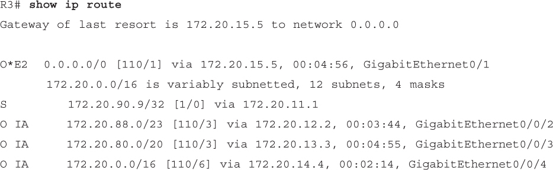](vol1_ch24.xhtml#f0610-01a)

[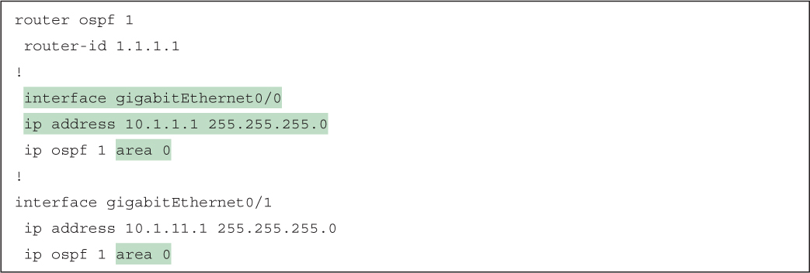](vol1_ch24.xhtml#f0613-01a)

[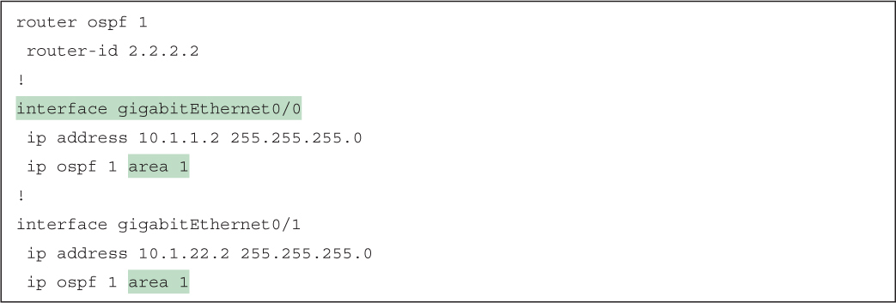](vol1_ch24.xhtml#f0613-02a)

[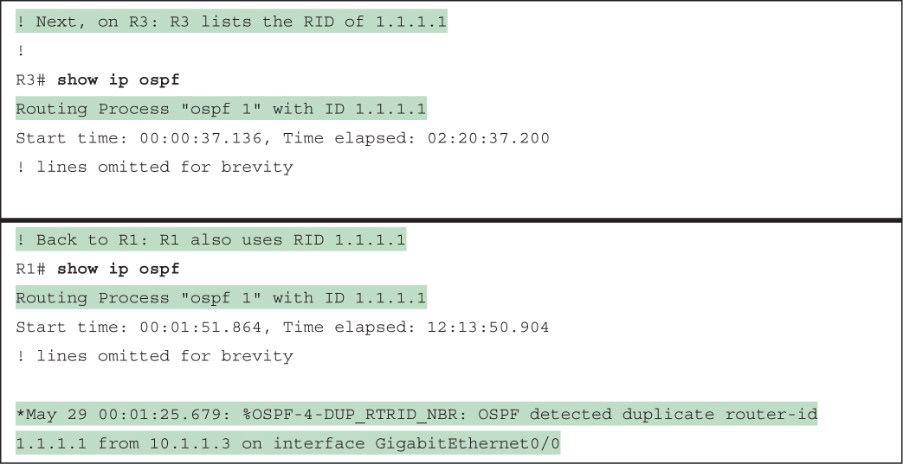](vol1_ch24.xhtml#f0614-01a)

[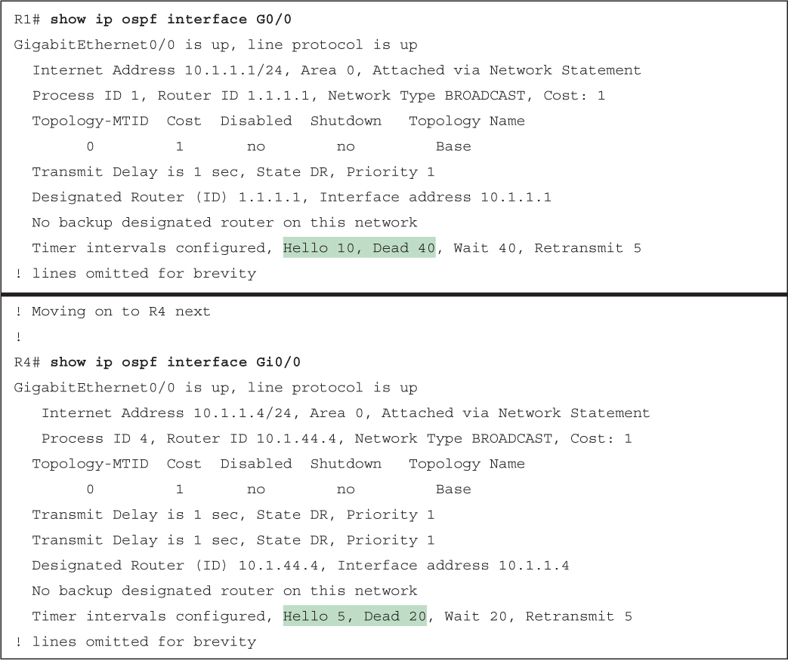](vol1_ch24.xhtml#f0615-01a)

[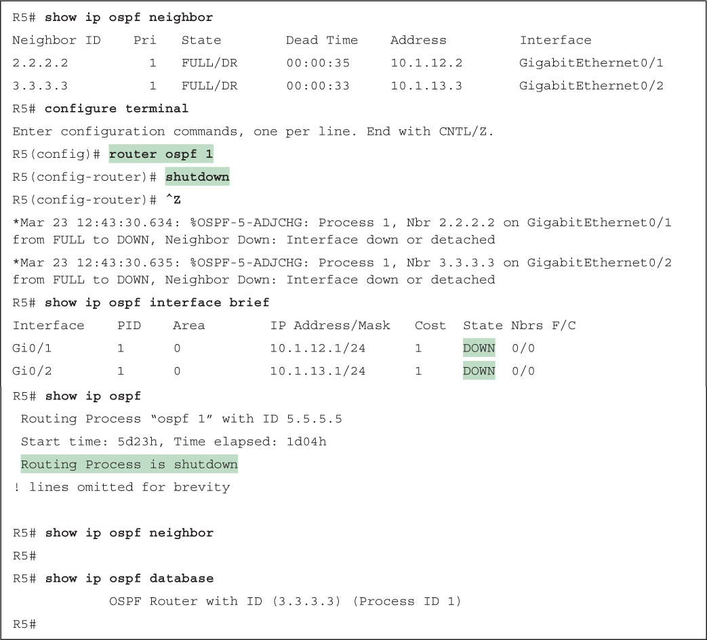](vol1_ch24.xhtml#f0616-01a)

[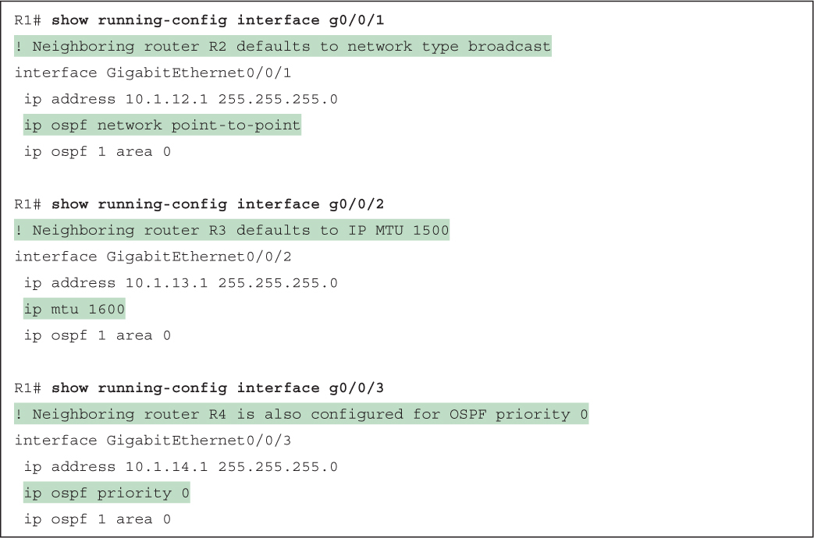](vol1_ch24.xhtml#f0620-01a)

[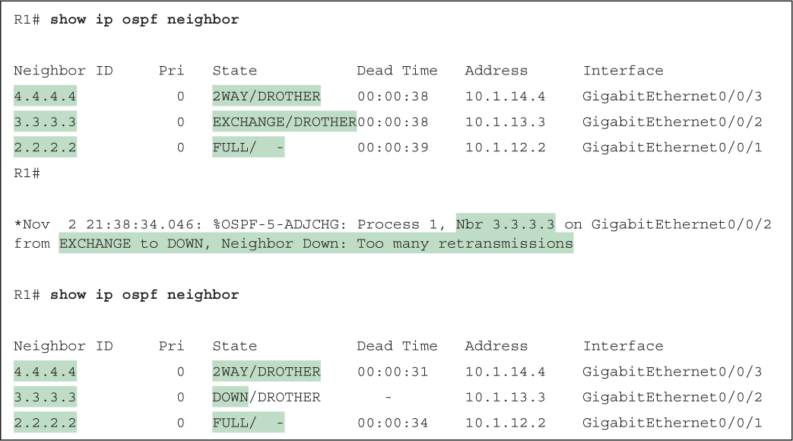](vol1_ch24.xhtml#f0620-02a)

[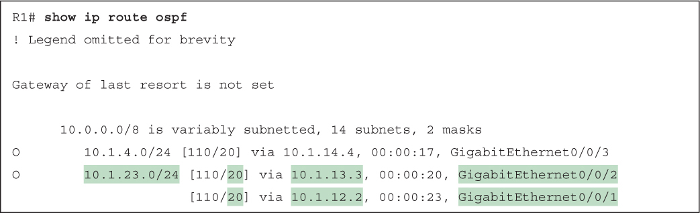](vol1_ch24.xhtml#f0622-01a)

[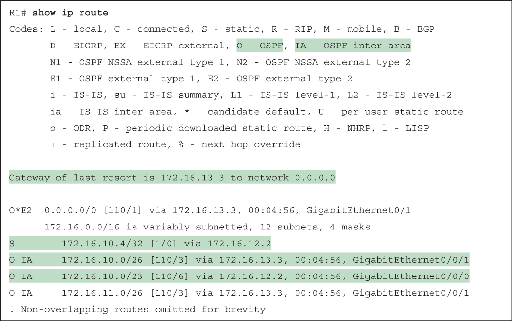](vol1_ch24.xhtml#f0627-01a)

[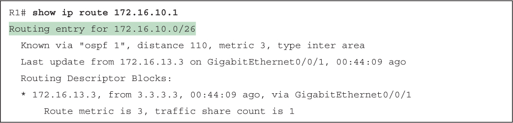](vol1_ch24.xhtml#f0628-01a)

[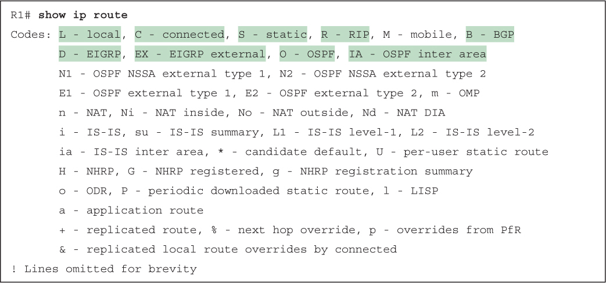](vol1_ch24.xhtml#f0630-01a)