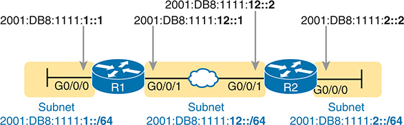
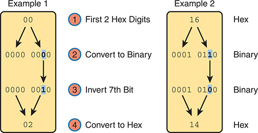

# Chapter 27


## Implementing IPv6 Addressing on Routers

This chapter covers the following exam topics:

1.0 Network Fundamentals

1.8 Configure and verify IPv6 addressing and prefix

1.9 Describe IPv6 address types

1.9.a Unicast (global, unique local, and link local)

1.9.b Anycast

1.9.c Multicast

1.9.d Modified EUI 64

With IPv4 addressing, some devices, like servers and routers, typically use static predefined IPv4 addresses. End-user devices do not mind if their address changes from time to time, and they typically learn an IPv4 address dynamically using DHCP. IPv6 uses the same approach, with servers, routers, and other devices in the control of the IT group often using predefined IPv6 addresses, and with end-user devices using dynamically learned IPv6 addresses.

This chapter focuses on IPv6 address configuration on routers, with the next chapter focusing on end-user devices. This chapter begins with the more obvious IPv6 addressing configuration, with features that mirror IPv4 features, showing how to configure interfaces with IPv6 addresses and view that configuration with **show** commands. The second half of the chapter introduces new IPv6 addressing concepts in comparison to IPv4, showing some other IPv6 addresses used by routers when doing different tasks.

### "Do I Know This Already?" Quiz

Take the quiz (either here or use the PTP software) if you want to use the score to help you decide how much time to spend on this chapter. The letter answers are listed at the bottom of the page following the quiz. [Appendix C](vol1_appc.xhtml#appc), found both at the end of the book as well as on the companion website, includes both the answers and explanations. You can also find both answers and explanations in the PTP testing software.

**Table 27-1** "Do I Know This Already?" Foundation Topics Section-to-Question Mapping

| Foundation Topics Section | Questions |
| --- | --- |
| Implementing Unicast IPv6 Addresses on Routers | 1–4 |
| Special Addresses Used by Routers | 5–8 |

**[1](vol1_ch27.xhtml#ques27_1a).** Router R1 has an interface named Gigabit Ethernet 0/1, whose MAC address has been set to 0200.0001.000A. Which of the following commands, added in R1's Gigabit Ethernet 0/1 configuration mode, gives this interface a unicast IPv6 address of 2001:1:1:1:1:200:1:A with a /64 prefix length?

1. **ipv6 address 2001:1:1:1:1:200:1:A/64**
2. **ipv6 address 2001:1:1:1:1:200:1:A/64 eui-64**
3. **ipv6 address 2001:1:1:1:1:200:1:A  /64 eui-64**
4. **ipv6 address 2001:1:1:1:1:200:1:A  /64**
5. None of the other answers are correct.

**[2](vol1_ch27.xhtml#ques27_2a).** Router R1 has an interface named Gigabit Ethernet 0/1, whose MAC address has been set to 5055.4444.3333. This interface has been configured with the **ipv6 address 2000:1:1:1::/64 eui-64** subcommand. What unicast address will this interface use?

1. 2000:1:1:1:52FF:FE55:4444:3333
2. 2000:1:1:1:5255:44FF:FE44:3333
3. 2000:1:1:1:5255:4444:33FF:FE33
4. 2000:1:1:1:200:FF:FE00:0

**[3](vol1_ch27.xhtml#ques27_3a).** Router R1 currently supports IPv4, routing packets in and out all its interfaces. R1's configuration must be migrated to support dual-stack operation, routing both IPv4 and IPv6. Which of the following tasks must be performed before the router can also support routing IPv6 packets? (Choose two answers.)

1. Enable IPv6 on each interface using an **ipv6 address** interface subcommand.
2. Enable support for both versions with the **ip versions 4 6** global command.
3. Enable IPv6 routing using the **ipv6 unicast-routing** global command.
4. Migrate to dual-stack routing using the **ip routing dual-stack** global command.

**[4](vol1_ch27.xhtml#ques27_4a).** On a router configured with an **ipv6 address** interface subcommand on its G0/0/0 interface, which of the following commands reveals the IPv6 prefix that the router computed based on the address/prefix-length? (Choose two answers.)

1. **show ipv6 address**
2. **show ipv6 route connected**
3. **show ipv6 interface brief**
4. **show ipv6 interface g0/0/0**

**[5](vol1_ch27.xhtml#ques27_5a).** Router R1 has an interface named Gigabit Ethernet 0/1, whose MAC address has been set to 0200.0001.000A. The interface is then configured with the **ipv6 address 2001:1:1:1:200:FF:FE01:B/64** interface subcommand; no other **ipv6 address** commands are configured on the interface. Which of the following answers lists the link-local address used on the interface?

1. FE80::FF:FE01:A
2. FE80::FF:FE01:B
3. FE80::200:FF:FE01:A
4. FE80::200:FF:FE01:B

**[6](vol1_ch27.xhtml#ques27_6a).** Which of the following multicast addresses is defined as the address for sending packets to only the IPv6 routers on the local link?

1. FF02::1
2. FF02::2
3. FF02::5
4. FF02::A

**[7](vol1_ch27.xhtml#ques27_7a).** Host C must forward a packet to its default gateway, 2001:db8:1:1::1234:5678. Host C does not yet have a neighbor table entry for that address. To which solicited-node multicast address will host C send its NDP neighbor solicitation (NS) request?

1. FF02::1:ff34:5678
2. FF02::1:ff12:3456
3. FF02::1ff:1234:5678
4. FF02::1ff:34:5678

**[8](vol1_ch27.xhtml#ques27_8a).** A router uses the **ipv6 enable** subcommand on interface G0/0/1, the **ipv6 address autoconfig** command on interface G0/0/2, and the **ipv6 address 2002:db8:1:1::1/64** command on interface G0/0/3. The commands succeed, dynamically or statically creating the expected addresses as typical for each command. Which answers are accurate about the link-local addresses (LLAs) on the various interfaces? (Choose two answers.)

1. G0/0/1 has no LLA.
2. G0/0/1 has an LLA.
3. G0/0/2 has an LLA and global unicast address with identical interface IDs.
4. G0/0/3 has a global unicast address but no LLA.

Answers to the "Do I Know This Already?" quiz:

**[1](vol1_appc.xhtml#ques27_1)** A

**[2](vol1_appc.xhtml#ques27_2)** B

**[3](vol1_appc.xhtml#ques27_3)** A, C

**[4](vol1_appc.xhtml#ques27_4)** B, D

**[5](vol1_appc.xhtml#ques27_5)** A

**[6](vol1_appc.xhtml#ques27_6)** B

**[7](vol1_appc.xhtml#ques27_7)** A

**[8](vol1_appc.xhtml#ques27_8)** B, C

### Foundation Topics

### Implementing Unicast IPv6 Addresses on Routers

Every company bases its enterprise network on one or more protocol models or protocol stacks. In the earlier days of networking, enterprise networks used one or more protocol stacks from different vendors, as shown on the left of [Figure 27-1](vol1_ch27.xhtml#ch27fig01). Over time, companies added TCP/IP (based on IPv4) to the mix. Eventually, companies migrated fully to TCP/IP as the only protocol stack in use.

IPv6 might fully replace IPv4 one day; however, for a long migration period, most enterprises will run IPv4 and IPv6 on hosts and routers simultaneously, effectively like in the old days, with multiple protocol stacks. Over time, hosts will use IPv6 more and more until one day, it might be possible to disable IPv4 and run with only IPv6, as shown in [Figure 27-2](vol1_ch27.xhtml#ch27fig02).


**Figure 27-1** *Migration of Enterprise Networks to Use TCP/IP Stack Only, IPv4*

In the 1980s, the schematic shows a network cloud connected to three distinct labels "IBM," "DEC," and "Other Vendor". In the 1990s, the schematic depicts a network cloud connected to four distinct labels "IBM," "DEC," "Other Vendor" and "TCP/IP IPv4". By the 2000s, the schematic simplifies to show a single large cloud labeled "TCP/IP IPv4" symbolizing the complete migration to this protocol in enterprise networking.


**Figure 27-2** *Possible Path Through a Dual Stack (IPv4 and IPv6) over a Long Period*

In the 2010s, the schematic shows two network clouds, one for TCP/IP IPv4 and one for TCP/IP IPv6. Moving to the 2020s, both versions are still present but with question marks, suggesting uncertainty. By the 2030s, the schematic shows a larger cloud representing TCP/IP IPv6, hinting at its possible dominance.

Using [dual stacks](vol1_gloss.xhtml#gloss_114)—that is, running both IPv4 and IPv6—makes great sense for today's enterprise networks. To do so, configure the routers to route IPv6 packets with IPv6 addresses on their interfaces, and advertise IPv6 routes with a routing protocol, while continuing to do the same with IPv4 addresses and routing protocols. On hosts and servers, implement IPv4 and IPv6 as well. The hosts have new methods to choose when to use IPv6 and when to use IPv4, giving preference to IPv6.

While using a dual-stack strategy works well, the configuration model for IPv6 works much as it does for IPv4. To that end, the first major section of this chapter shows how to configure and verify unicast IPv6 addresses on routers.

#### Static Unicast Address Configuration

Cisco routers give us two options for static configuration of IPv6 addresses. You configure the full 128-bit address and the standard /64 prefix length in one case. A second option allows you to configure a 64-bit prefix and let the router derive the second half of the address (the interface ID [IID]). The next few pages show both options.

##### Configuring the Full 128-Bit Address

To statically configure the full 128-bit unicast address—either global unicast address (GUA) or unique local address (ULA) —use the **ipv6 address** *address*/*prefix-length* interface subcommand. The command accepts abbreviated or expanded addresses, a slash, and then prefix length, with no spaces. [Examples 27-1](vol1_ch27.xhtml#exa27_1) and [27-2](vol1_ch27.xhtml#exa27_2) show the configuration of the IPv6 GUAs on routers R1 and R2 from [Figure 27-3](vol1_ch27.xhtml#ch27fig03), respectively.





**Figure 27-3** *Sample 128-bit IPv6 Addresses to Be Configured on Cisco Router Interfaces*

R1 and R2, each with two interfaces, G0/0/0 and G0/0/1. For R1, the IPv6 address "2001:DB8:1111:1::1" is configured on the G0/0/0 interface and "2001:DB8:111:12::1" on the G0/0/1 interface. For R2, the IPv6 address "2001:DB8:111:2::2" is configured on the G0/0/0 interface and "2001:DB8:111:12::2" on the G0/0/1 interface. Both the routers are connected through Ethernet W A N. The routers are connected by three subnets, each labeled with its respective IPv6 address.

**Example 27-1** *Configuring Static IPv6 Addresses on R1*

[Click here to view code image](vol1_ch27_images.xhtml#f0672-01)

```
ipv6 unicast-routing
!
interface GigabitEthernet0/0/0
 ipv6 address 2001:DB8:1111:1::1/64
!
! Below, note the expanded address. IOS will abbreviate the address for you.
interface GigabitEthernet0/0/1
 ipv6 address 2001:0db8:1111:0012:0000:0000:0000:0001/64
```

**Example 27-2** *Configuring Static IPv6 Addresses on R2*

[Click here to view code image](vol1_ch27_images.xhtml#f0672-02)

```
ipv6 unicast-routing
!
interface GigabitEthernet0/0/0
 ipv6 address 2001:DB8:1111:2::2/64
!
interface GigabitEthernet0/0/1
 ipv6 address 2001:db8:1111:12::2/64 
```

Note

The configuration on R1 in [Example 27-1](vol1_ch27.xhtml#exa27_1) shows the commands as typed. One **ipv6 address** command uses an abbreviated address with uppercase hex digits, while the other uses an expanded address with lowercase hex digits. IOS accepts both commands but then changes them to their abbreviated form with uppercase hex digits.

##### Enabling IPv6 Routing

Interestingly, Cisco routers enable IPv4 routing by default but not IPv6 routing. The global command **ip routing** (the default setting) enables the routing of IPv4 packets. To route IPv6 packets, you must also configure the **ipv6 unicast-routing** global command.

If you forget to configure the **ipv6 unicast-routing** global command, the router will still accept your **ipv6 address** interface subcommands. In that case, the router acts as an IPv6 host, so it can send IPv6 packets it generates. However, the router will not route IPv6 packets (that is, forward IPv6 packets received in an interface) until you configure the **ipv6 unicast-routing** global command.

##### Verifying the IPv6 Address Configuration

IPv6 uses many **show** commands that mimic the syntax of IPv4 **show** commands. For example:

* The **show ipv6 interface brief** command gives you interface IPv6 address info but not prefix length info, similar to the IPv4 **show ip interface brief** command.
* The **show ipv6 interface** command gives the details of IPv6 interface settings, much like the **show ip interface** command does for IPv4.

The one notable difference in the most common commands is that the **show interfaces** command still lists the IPv4 address and mask but tells us nothing about IPv6. So, to see IPv6 interface addresses, use commands that begin with **show ipv6**. [Example 27-3](vol1_ch27.xhtml#exa27_3) lists a few samples from Router R1, with the explanations following.

**Example 27-3** *Verifying Static IPv6 Addresses on Router R1*

[Click here to view code image](vol1_ch27_images.xhtml#f0673-01)

```
! The first interface is in subnet 1
R1# show ipv6 interface GigabitEthernet 0/0/0
GigabitEthernet0/0/0 is up, line protocol is up
  IPv6 is enabled, link-local address is FE80::11FF:FE11:1111
  No Virtual link-local address(es):
  Global unicast address(es):
    2001:DB8:1111:1::1, subnet is 2001:DB8:1111:1::/64 
  Joined group address(es):
    FF02::1
    FF02::2
    FF02::1:FF00:1
    FF02::1:FF11:1111
  MTU is 1500 bytes
  ICMP error messages limited to one every 100 milliseconds
  ICMP redirects are enabled
  ICMP unreachables are sent
  ND DAD is enabled, number of DAD attempts: 1
  ND reachable time is 30000 milliseconds (using 30000)
  ND advertised reachable time is 0 (unspecified)
  ND advertised retransmit interval is 0 (unspecified)
  ND router advertisements are sent every 200 seconds
  ND router advertisements live for 1800 seconds
  ND advertised default router preference is Medium
  Hosts use stateless autoconfig for addresses.

R1# show ipv6 interface brief
GigabitEthernet0/0/0     [up/up]
    FE80::11FF:FE11:1111
    2001:DB8:1111:1::1
GigabitEthernet0/0/1     [up/up]
    FE80::32F7:DFF:FE29:8568
    2001:DB8:1111:12::1
GigabitEthernet0/0/2     [administratively down/down]
    unassigned
GigabitEthernet0/0/3     [administratively down/down]
    unassigned
```

First, focus on the output of the **show ipv6 interface** command at the top of the example, which lists interface G0/0/0, showing output about that interface only. The output lists the configured IPv6 address and prefix length and the IPv6 subnet (2001:DB8:1111:1::/64), which the router calculated based on the IPv6 address.

To close the example, the **show ipv6 interface brief** command lists IPv6 addresses, not the prefix length or prefixes. Note that this command also lists all interfaces, whether configured with IPv6 addresses or not.

As with IPv4, the router adds IPv6 connected routes to the IPv6 routing table based on the IPv6 address configuration. Just as with IPv4, the router keeps these connected routes in the IPv6 routing table when the interface is working (up/up) and removes them when the interface is down. [Example 27-4](vol1_ch27.xhtml#exa27_4) shows the connected IPv6 on Router R1 from [Figure 27-3](vol1_ch27.xhtml#ch27fig03).

**Example 27-4** *Displaying Connected IPv6 Routes on Router R1*

[Click here to view code image](vol1_ch27_images.xhtml#f0674-01)

```
R1# show ipv6 route connected
IPv6 Routing Table - default - 5 entries
Codes: C - Connected, L - Local, S - Static, U - Per-user Static route
       B - BGP, R - RIP, H - NHRP, I1 - ISIS L1
       I2 - ISIS L2, IA - ISIS interarea, IS - ISIS summary, D - EIGRP
       EX - EIGRP external, ND - ND Default, NDp - ND Prefix, DCE - Destination
       NDr - Redirect, O - OSPF Intra, OI - OSPF Inter, OE1 - OSPF ext 1
       OE2 - OSPF ext 2, ON1 - OSPF NSSA ext 1, ON2 - OSPF NSSA ext 2
       a - Application, m – OMP
C   2001:DB8:1111:1::/64 [0/0]
     via GigabitEthernet0/0/0, directly connected
C   2001:DB8:1111:12::/64 [0/0]
     via GigabitEthernet0/0/1, directly connected
```

##### Generating a Unique Interface ID Using Modified EUI-64

IOS supports two methods to configure a permanent, stable router IPv6 interface address. [Examples 27-1](vol1_ch27.xhtml#exa27_1) and [27-2](vol1_ch27.xhtml#exa27_2) show the first method, in which you configure the entire 128-bit address. The second method uses the same **ipv6 address** command, but you configure only the 64-bit IPv6 prefix for the interface, letting the router automatically generate a unique IID.

To generate the second half of the address, this second method uses rules called *modified EUI-64* (extended unique identifier) or simply [EUI-64](vol1_gloss.xhtml#gloss_139). To use this method, add the **eui-64** keyword to the end of the command. The router then uses EUI-64 rules to create the IID part of the address, as follows:

1. Split the 6-byte (12-hex-digit) MAC address into two halves (6 hex digits each).

   
2. Insert FFFE between the two, making the interface ID 16 hex digits (64 bits).
3. Invert the seventh bit of the IID.

[Figure 27-4](vol1_ch27.xhtml#ch27fig04) shows a visual representation of the modified EUI-64 process.


**Figure 27-4** *IPv6 Address Format with Interface ID and EUI-64*

The bar is divided into two main sections: "Defined by Configuration" and "Calculated by Router Using EUI-64." The "Defined by Configuration" section contains a single component labeled "Subnet Prefix". The "Calculated by Router Using EUI-64" section is further divided into three components: "1st Half of MAC," "FFFE," and "2nd Half of MAC," which together form the Interface ID. An operation labeled "Invert 7th Bit, 1st Byte (Reading Left to Right)" indicates towards the "1st Half of MAC" component.

Note

You can find a video about the EUI-64 process on the companion website in the Chapter Review section for this chapter.

Although this process might seem a bit convoluted, it works. Also, with a little practice, you can look at an IPv6 address and quickly notice the FFFE in the middle of the IID and then easily find the two halves of the corresponding interface's MAC address. But you need to be ready to do the same math, in this case to predict the modified EUI-64 formatted IPv6 address on an interface.

Consider the two different examples in [Figure 27-5](vol1_ch27.xhtml#ch27fig05), one on the left and another on the right. Both show all the work except the step to invert the 7th bit. Both start with the MAC address, breaking it into two halves (Step 2). The third step inserts FFFE in the middle, and the fourth step inserts a colon every four hex digits, keeping with IPv6 conventions.


**Figure 27-5** *Two Partial Examples of the EUI-64 Interface ID Process*

In Example 1, the MAC address "0013.1234.ABCD" is split into two halves, "001312" and "34ABCD." The process then inserts "FFFE" in between these halves, resulting in "0013:12FF:FE34:ABCD." Similarly, in Example 2, the MAC address "1612.3456.789A" is divided into "161234" and "56789A." After inserting "FFFE" in the middle, the final Interface ID becomes "1612:34FF:FE56:789A."

To complete the modified EUI-64 process, invert the 7th bit. Following the logic in [Figure 27-6](vol1_ch27.xhtml#ch27fig06), convert the first byte (first two hex digits) from hex to binary. Then invert the seventh of the 8 bits: If it is a 0, make it a 1, or if it is a 1, make it a 0. Then convert the 8 bits back to two hex digits.





**Figure 27-6** *Inverting the Seventh Bit of an EUI-64 Interface ID Field*

In the first example, the hexadecimal ‘00' is converted to the binary ‘0000 0000'. The seventh bit is then inverted, resulting in ‘0000 0010', which is converted back to ‘02' in hexadecimal. The second example follows a similar process with ‘16' in hexadecimal, which is converted to ‘0001 0110' in binary. After inverting the seventh bit, it becomes ‘0001 0100', which is then converted back to ‘14' in hexadecimal. The steps include the initial hexadecimal digits, their binary equivalents, the inversion of the seventh bit, and the final hexadecimal result after the inversion.

Note

If you do not remember how to do hex-to-binary conversions, take a few moments to review the process. The conversion can be easy if you memorize the 16 hex values for digits 0 through F, with the corresponding binary values. If you do not have those handy in your memory, take a few moments to look at [Table A-2](vol1_appa.xhtml#appatab02) in [Appendix A](vol1_appa.xhtml#appa), "[Numeric Reference Tables](vol1_appa.xhtml#appa)."

For those who prefer decimal shortcuts, you can do the bit-flip math without doing any hex-binary conversions with a little memorization. First, note that the process to invert the seventh bit, when working with a hexadecimal IPv6 address, flips the third of four bits one hex digit. With only 16 possible hex digits, you could memorize what each hex digit becomes if its third bit is inverted, and you can quickly memorize those values with [Figure 27-7](vol1_ch27.xhtml#ch27fig07). To internalize the concepts, redraw the figure several times with these instructions. Just use any piece of scrap paper and use these steps:

Step 1. Write hex digits 0 through F, but arrange the digits as shown on the left of the figure, with spacing as shown. (You do not have to draw the arrow lines or the text "A Little Space"—those are instructions for you.)

Step 2. Draw lines to connect the nearby pairs of hex digits.


**Figure 27-7** *A Mnemonic Device to Help Memorize Bit Inversion Shortcut*

In Step 1, four rows of characters are displayed. The first row contains numbers from "0" to "3", the second row has numbers from "4" to "7", the third row has numbers from "8" to "9", followed by letters "A" and "B", and the fourth row consists of letters from "C" to "F". Arrows on the left side point towards each row with text reading "A Little Space" indicating separation between them. In Step 2, the schematic mirrors Step 1 with arrows indicating that elements within each row have swapped places.

When inverting the 7th bit, first remember that the 7th bit is in the 2nd hex digit. Then, refer to the right side of [Figure 27-7](vol1_ch27.xhtml#ch27fig07) (or your version), and change the 2nd hex digit based on those pairs of digits. That is, 0 converts to 2; 2 converts to 0; 1 converts to 3; 3 converts to 1; 4 converts to 6; 6 converts to 4; and so on. So, on the exam, if you can arrange the hex digits in the pattern of [Figure 27-7](vol1_ch27.xhtml#ch27fig07) on your notepad, you could avoid doing binary/hexadecimal conversion. Use whichever approach makes you more comfortable.

As usual, the best way to get comfortable forming these modified EUI-64 IIDs is to calculate some yourself. [Table 27-2](vol1_ch27.xhtml#ch27tab02) lists some practice problems, with an IPv6 64-bit prefix in the first column and the MAC address in the second column. Your job is to calculate the full (unabbreviated) IPv6 address using modified EUI-64 rules. The answers are at the end of the chapter, in the section "[Answers to Earlier Practice Problems](vol1_ch27.xhtml#ch27lev1sec10)."

**Table 27-2** IPv6 EUI-64 Address Creation Practice

| Prefix | MAC Address | Unabbreviated IPv6 Address |
| --- | --- | --- |
| `2001:DB8:1:1::/64` | `0013.ABAB.1001` |  |
| `2001:DB8:1:1::/64` | `AA13.ABAB.1001` |  |
| `2001:DB8:1:1::/64` | `000C.BEEF.CAFE` |  |
| `2001:DB8:1:1::/64` | `B80C.BEEF.CAFE` |  |
| `2001:DB8:FE:FE::/64` | `0C0C.ABAC.CABA` |  |
| `2001:DB8:FE:FE::/64` | `0A0C.ABAC.CABA` |  |

The **ipv6 address** *prefix/prefix-length* **eui-64** interface subcommand has two key differences with the earlier examples of the **ipv6 address** command. First, the **eui-64** keyword tells the router to build the IID using modified EUI-64 rules. Second, the command should not list an address but instead a prefix, because the router will calculate the IID.

[Example 27-5](vol1_ch27.xhtml#exa27_5) shows an example that converts Router R1 from earlier [Example 27-1](vol1_ch27.xhtml#exa27_1) to use EUI-64 for the interface IIDs. It uses the same subnet prefixes as per the earlier example (based on [Figure 27-3](vol1_ch27.xhtml#ch27fig03)).

**Example 27-5** *Configuring R1's IPv6 Interfaces Using EUI-64*

[Click here to view code image](vol1_ch27_images.xhtml#f0677-01)

```
ipv6 unicast-routing
!
! The ipv6 address command below lists a prefix, not the full address
interface GigabitEthernet0/0/0
 mac-address 0200.1111.1111
 ipv6 address 2001:DB8:1111:1::/64 eui-64
!
interface GigabitEthernet0/0/1
 ipv6 address 2001:DB8:1111:12::/64 eui-64

R1# show ipv6 interface brief
GigabitEthernet0/0/0   [up/up]
    FE80::11FF:FE11:1111

    2001:DB8:1111:1:0:11FF:FE11:1111
GigabitEthernet0/0/1   [up/up]
    FE80::32F7:DFF:FE29:8568
    2001:DB8:1111:12:32F7:DFF:FE29:8568
GigabitEthernet0/0/2   [administratively down/down]
    unassigned
GigabitEthernet0/0/3   [administratively down/down]
    unassigned
```

For this example, interface G0/0/1 uses its universal MAC address (its burned-in address), but interface G0/0/0 uses a configured MAC address. Following that math:

`G0/0/0 – MAC 0200.1111.1111` – IID `0000.11FF.FE11.1111`

`G0/0/1 – MAC 30F7.0D29.8568` – IID `32F7.0DFF.FE29.8568`

Also, be aware that for interfaces that do not have a MAC address, like serial interfaces, the router uses the MAC of the lowest-numbered router interface that does have a MAC.

Note

When you use modified EUI-64, the **ipv6 address** command should list a prefix rather than the full 128-bit IPv6 address. However, suppose you mistakenly type the complete address and still use the **eui-64** keyword. In that case, IOS accepts the command; however, it converts the address to the matching prefix before putting it into the running config file. For example, IOS converts **ipv6 address 2000:1:1:1::1/64 eui-64** to **ipv6 address 2000:1:1:1::/64 eui-64**.

##### IPv6 Address Attributes

IOS defines a set of attributes for some IPv6 addresses, displaying those with short all-caps codes in the output from commands like **show ipv6 interface** (but not listed in output from the **show ipv6 interface brief** command). The most common attributes include

**EUI:** The router generated the address using modified EUI-64.

**TEN:** Tentative. A temporary attribute that occurs while the router performs duplicate address detection (DAD).

**CAL:** Calendared. An address with a prescribed lifetime, including a valid and preferred lifetime. They are commonly listed when using DHCP and SLAAC.

**PRE:** Preferred. The preferred address to use on the interface that uses time-based (calendared) addresses. They are commonly listed when using DHCP and SLAAC.

[Example 27-6](vol1_ch27.xhtml#exa27_6) shows an example using R1's interface G0/0/0 in the previous example. The example shows two consecutive **show ipv6 interface g0/0/0** commands, the first issued immediately after the interface configuration in [Example 27-5](vol1_ch27.xhtml#exa27_5). At that time, the router had not completed DAD (which takes only a few seconds to complete), so the output lists the TEN attribute along with EUI. The subsequent repeat of the command no longer lists TEN, as DAD completed, but still lists EUI, confirming the router derived the address using EUI-64. (The section "[Discovering Duplicate Addresses Using NDP NS and NA](vol1_ch28.xhtml#ch28lev2sec4)" in [Chapter 28](vol1_ch28.xhtml#ch28), "[Implementing IPv6 Addressing on Hosts](vol1_ch28.xhtml#ch28)," explains DAD.)

**Example 27-6** *An Example of IPv6 Address Attributes in **show interfaces***

[Click here to view code image](vol1_ch27_images.xhtml#f0679-01)

```
R1# show interfaces g0/0/0
GigabitEthernet0/0/0 is up, line protocol is up
  IPv6 is enabled, link-local address is FE80::11FF:FE11:1111
  No Virtual link-local address(es):
  Global unicast address(es):
    2001:DB8:1111:1:0:11FF:FE11:1111, subnet is 2001:DB8:1111:1::/64 [EUI/TEN]
! Lines omitted for brevity
! Next command gathered seconds later...
R1# show interfaces g0/0/0
GigabitEthernet0/0/0 is up, line protocol is up
  IPv6 is enabled, link-local address is FE80::11FF:FE11:1111
  No Virtual link-local address(es):
  Global unicast address(es):
    2001:DB8:1111:1:0:11FF:FE11:1111, subnet is 2001:DB8:1111:1::/64 [EUI]
! Lines omitted for brevity
```

#### Dynamic Unicast Address Configuration

In most cases, network engineers will statically configure the IPv6 addresses of router interfaces so that the addresses do not change until the engineer changes the router configuration. However, routers can dynamically learn IPv6 addresses. These can be useful for routers connecting to the Internet through some types of Internet access technologies, like cable modems or fiber Internet.

Cisco routers support two ways for the router interface to dynamically learn an IPv6 address to use

* Stateful DHCP
* Stateless Address Autoconfiguration (SLAAC)

Both methods use the familiar **ipv6 address** command. Of course, neither option configures the actual IPv6 address; instead, the commands configure a keyword that tells the router which dynamic method to use to learn its IPv6 address. [Example 27-7](vol1_ch27.xhtml#exa27_7) shows the configuration, with one interface using stateful DHCP and one using SLAAC.

**Example 27-7** *Router Configuration to Learn IPv6 Addresses with DHCP and SLAAC*

[Click here to view code image](vol1_ch27_images.xhtml#f0679-02)

```
! This interface uses DHCP to learn its IPv6 address
interface GigabitEthernet0/0/0
 ipv6 address dhcp
!
! This interface uses SLAAC to learn its IPv6 address
interface GigabitEthernet0/0/1
 ipv6 address autoconfig
```

Endpoints often use one of the dynamic methods to learn their IPv6 address and related settings. [Chapter 28](vol1_ch28.xhtml#ch28), "[Implementing IPv6 Addresses on Hosts](vol1_ch28.xhtml#ch28)," discusses the specifics of DHCP and SLAAC.

### Special Addresses Used by Routers

IPv6 configuration on a router begins with the simple steps discussed in the first part of this chapter. After you configure the **ipv6 unicast-routing** global configuration command, to enable the function of IPv6 routing, the addition of a unicast IPv6 address on an interface causes the router to do the following:

* Gives the interface a unicast IPv6 address

  
* Enables the routing of IPv6 packets in/out that interface
* Defines the IPv6 prefix (subnet) that exists off that interface
* Tells the router to add a connected IPv6 route for that prefix, to the IPv6 routing table, when that interface is up/up

Note

In fact, if you pause and look at the list again, the same ideas happen for IPv4 when you configure an IPv4 address on a router interface.

While all the IPv6 features in this list work much like similar features in IPv4, IPv6 also has a number of additional functions not seen in IPv4. Often, these additional functions use other IPv6 addresses, many of which are multicast addresses. This second major section of the chapter examines the additional IPv6 addresses seen on routers, with a brief description of how they are used.

#### Link-Local Addresses

IPv6 uses [link-local addresses (LLA)](vol1_gloss.xhtml#gloss_232) as a special kind of unicast IPv6 address. Every interface that supports IPv6 must have an LLA. A small number of important IPv6 protocols then use LLAs to send and receive packets to help with overhead IPv6 functions, like neighbor and address discovery—sometimes even before the device has a GUA or ULA to use. This next topic first looks at how IPv6 uses LLAs and then how routers create them.

##### Link-Local Address Concepts

LLAs provide every device that supports IPv6 the capability to send and receive unicast packets on the local link, before dynamically learning or being configured with their routable IPv6 GUA or ULA. While hosts could send and receive application data using LLAs over a single subnet, LLAs do not exist to support normal application data. Instead, LLAs exist to support some overhead IPv6 protocols—protocols that need some working address to use.

The IPv6 designers wanted better options than IPv4 to support protocols that need to send packets before hosts have their normal unicast address assignment. For instance, before an IPv4 host leases an address with DHCP, it needs to send DHCP messages inside IP packets. To do that, IPv4 defines special addresses 0.0.0.0 and 255.255.255.255. The IPv6 designers looked for a better way, and LLAs provide a solution in some cases.

Hosts self-generate an LLA for themselves and can then use their LLA to send and receive IPv6 packets on the local link. All interfaces that use IPv6 must have an LLA, with the option for the device to dynamically create it without outside help. Once created, the host ensures no other hosts use the same LLA by using duplicate address detection (DAD). If unique, the host keeps using the LLA, but if DAD finds another host using the same LLA, the new host picks a different LLA. Some IPv6 protocols rely on using a host's LLA as the source of IPv6 protocol messages, including Neighbor Discovery Protocol (NDP, which replaces IPv4 ARP) and Dynamic Host Configuration Protocol (DHCP).

LLAs also appear in a surprising place: as the next-hop IPv6 addresses in IPv6 routes, as shown in [Figure 27-8](vol1_ch27.xhtml#ch27fig08). For routes learned by a routing protocol, the **show ipv6 route** command lists the LLA of the neighboring router, rather than the GUA or ULA. For the default router setting on a host, the host refers to the router's LLA.


**Figure 27-8** *IPv6 Using Link-Local Addresses as the Next-Hop Address*

A network setup involves two hosts, (PC1 and PC2) and two routers (R1 and R2). PC1 is connected to R1, denoted by an arrow labeled "1", with a label above it reading "Gw equals R1 Link Local". R1 is connected to R2 via a W A N line, labeled "2" and has labels above it reading "Prefix Subnet 2" and "Next-Hop R2 Link Local". Finally, R2 is connected to PC2 with Subnet 2 2001:DB8:1111:2::/64", indicating an IPv6 address.

The following list summarizes some key facts about link-local addresses:

**Unicast (not multicast):** LLAs represent a single host, and packets sent to a link-local address should be processed by only that one IPv6 host.


**Forwarding scope is the local link only:** Packets sent to a link-local address do not leave the local data link because routers do not forward packets with link-local destination addresses.

**Automatically self-generated:** Every IPv6 host interface (and router interface) can automatically create its own link-local address, solving some initialization problems for hosts before they learn a dynamically learned global unicast address.

**Common uses:** Link-local addresses are used for some overhead protocols that stay local to one subnet and as the next-hop address for IPv6 routes.

##### Creating Link-Local Addresses on Routers

By default, routers self-assign an LLA to each IPv6-enabled interface. To do so, the router sets the first half of the address to FE80:0000:0000:0000, as shown on the left side of [Figure 27-9](vol1_ch27.xhtml#ch27fig09). Then the router creates the IID using modified EUI-64 rules (see the earlier section "[Generating a Unique Interface ID Using Modified EUI-64](vol1_ch27.xhtml#ch27lev3sec4)" for a review of the process). As a result, a router's complete LLA should be unique because the MAC address that feeds into the EUI-64 process should be unique.


**Figure 27-9** *Link-Local Address Format*

The address is divided into two primary sections, each consisting of 64 bits. The left section shows a fixed prefix of "FE80" and three segments of zeros. The right section denotes the "Interface ID: EUI-64." Together, these two sections represent a complete IPv6 link-local address.

In practice, LLAs begin with FE80, but formally, RFC 4291 reserves prefix FE80::/10, which includes addresses that begin FE8, FE9, FEA, or FEB. However, that same RFC also dictates that the first 64 bits should be FE80:0000:0000:0000. So in practice, LLAs begin with FE80:0000:0000:0000.

When a router automatically generates an interface's LLA, it does not create a matching configuration command. To see the LLA, instead of the **show running-config** command, just use the usual commands that also list the unicast IPv6 address: **show ipv6 interface** and **show ipv6 interface brief**. [Example 27-8](vol1_ch27.xhtml#exa27_8) shows an example from Router R1 just after it was configured as shown in [Example 27-5](vol1_ch27.xhtml#exa27_5) (with the **eui-64** keyword on the **ipv6 address** commands).

**Example 27-8** *Comparing Link-Local Addresses with EUI-Generated Unicast Addresses*

[Click here to view code image](vol1_ch27_images.xhtml#f0682-01)

```
R1# show ipv6 interface brief
GigabitEthernet0/0/0   [up/up]
    FE80::11FF:FE11:1111
    2001:DB8:1111:1:0:11FF:FE11:1111
GigabitEthernet0/0/1   [up/up]
    FE80::32F7:DFF:FE29:8568
    2001:DB8:1111:12:32F7:DFF:FE29:8568
GigabitEthernet0/0/2   [administratively down/down]
    unassigned
GigabitEthernet0/0/3   [administratively down/down]
    unassigned
```

First, examine the two pairs of highlighted entries in the example. For each of the two interfaces that have a global unicast address (G0/0/0 and G0/0/1), the output lists the GUAs, which happen to begin with 2001 in this case. At the same time, the output also lists the LLAs for each interface, beginning with FE80.

Next, focus on the two addresses listed under interface G0/0/0. If you look closely, you will see that both addresses have the same IID value. Because the GUA configuration used the **ipv6 address 2001:DB8:1111:1::/64 eui-64** command, the router used modified EUI-64 logic to form the IID portion of both the GUA and LLA. For both addresses, the router used the interface MAC address of 0200.1111.1111 and calculated the IID portion of both addresses as 0000:11FF:FE11:1111 (unabbreviated). After abbreviation, Router R1's LLA on interface G0/0/0 becomes FE80::11FF:FE11:1111.

Note

While Cisco routers use the modified EUI-64 method to create the IID for LLAs, most end-user device OSs do not. Instead, to reduce security exposures, they randomly assign IPv6 address IIDs. [Chapter 28](vol1_ch28.xhtml#ch28), which focuses on host IPv6 address assignment, provides additional details and examples.

Cisco IOS also allows the direct configuration of the interface's LLA, with that configured LLA taking precedence, as follows:

* The **ipv6 address** *address* **link-local** interface subcommand configures the LLA; in this case, the router does not create an LLA using EUI-64 rules.
* If not configured, the IOS calculates the LLA using EUI-64 rules.

##### Routing IPv6 with Only Link-Local Addresses on an Interface

This chapter has shown four variations on the **ipv6 address** command to configure routable addresses (GUAs and ULAs) so far. To review:

**ipv6 address** *address/prefix-length*: Static configuration of the entire routable address and prefix length

**ipv6 address** *prefix/prefix-length* **eui-64**: Static configuration of the prefix and prefix length, with the router calculating the IID using EUI-64 rules

**ipv6 address dhcp**: Dynamic learning of the address and prefix length using DHCP

**ipv6 address autoconfig**: Dynamic learning of the prefix and prefix length, with the router calculating the IID using EUI-64 rules (SLAAC)

To complete the list, now consider the **ipv6 enable** interface subcommand. It enables IPv6 processing on the interface and causes the router to self-assign an LLA, but it leaves the interface with no routable (GUA or ULA) address.

The purpose of the **ipv6 enable** command will not make sense until you realize that some links, particularly WAN links, do not need a GUA or ULA. Using the backdrop of [Figure 27-10](vol1_ch27.xhtml#ch27fig10), think about the destination of packets sent by hosts like PC1 and PC2. When PC1 sends PC2 an IPv6 packet, the packet holds PC1's and PC2's IPv6 addresses and never contains the WAN link's IPv6 addresses. The hosts do not need to know the routers' WAN interface addresses. (That same logic applies with IPv4 as well.)


**Figure 27-10** *Typical Use of the **ipv6 enable** Command*

The network setup involves two hosts (PC1 and PC2) and two routers (R1 and R2). PC1 is connected to R1 with a Global Unicast Prefix of 2001:DB8:1111:1::/64, while PC2 is connected to R2 with a Global Unicast Prefix of 2001:DB8:1111:2::/64. Both routers are enabled with IPv6 and have addresses FE80::1 and FE80::2 respectively. The Ethernet W A N facilitates the connection between R1 and R2.

Additionally, the routers do not need GUAs or ULAs on the WAN links for routing to work; they only need LLAs. For instance, IPv6 routing protocols use LLAs as the next-hop address when dynamically building IPv6 routes. Additionally, as discussed in [Chapter 29](vol1_ch29.xhtml#ch29), "[Implementing IPv6 Routing](vol1_ch29.xhtml#ch29)," static routes can use LLAs for the next-hop address.

In short, IPv6 routing works on WAN links that use only LLAs, with no GUAs or ULAs. As a result, you would not even need to assign an IPv6 subnet prefix to each WAN link. Then to configure the WAN interfaces, use the **ipv6 enable** command, enabling IPv6 and giving each interface a generated link-local IPv6 address.

To use the command, just configure the **ipv6 enable** command on the interfaces on both ends of the WAN link.

#### IPv6 Multicast Addresses

IPv6 uses multicast IPv6 addresses for several purposes. Like IPv4, IPv6 includes a range of multicast addresses that can be used by multicast applications, with many of the same fundamental concepts as IPv4 multicasts. For instance, IANA defines the range FF30::/12 (all IPv6 addresses that begin with FF3) as the range of addresses used for multicast applications.

Additionally, different IPv6 RFCs reserve multicast addresses for specific purposes. For instance, OSPFv3 uses FF02::5 and FF02::6 as the all-OSPF-routers and all-DR-Routers multicast addresses, respectively, similar to how OSPFv2 uses IPv4 addresses 224.0.0.5 and 224.0.0.6. IANA and various RFCs use the term *well-known multicast address* to refer to these reserved predefined multicast addresses. IANA reserves address range FF00::/12 (all IPv6 addresses that begin FF0) for these addresses.

This next section focuses on the well-known permanent IPv6 multicast addresses. The first, [link-local multicast addresses](vol1_gloss.xhtml#gloss_233), have a scope that limits them to flow over a single link. The other type is a special overhead multicast address calculated for each host, called the [solicited-node multicast address](vol1_gloss.xhtml#gloss_368).

##### Well-Known Multicast Addresses

Stop for a moment and think about some of the control plane protocols discussed throughout this book so far. Some IPv4 control plane protocols use IPv4 broadcasts, meaning that the packet destination address was either 255.255.255.255 (the address for all hosts in the local subnet) or the subnet broadcast address (the address for all hosts in that specific subnet). The sender encapsulates the packet in an Ethernet broadcast frame, destined to the Ethernet broadcast address of FFFF.FFFF.FFFF.

While useful, the IPv4 approach of IPv4 broadcast and LAN broadcast requires every host in the VLAN to process the broadcast frame, even if only one other device needs to think about the message. LAN switches forward LAN broadcasts out every port in the same VLAN, so copies of each LAN broadcast arrive at each host in the subnet. As a result, each host has to process the frame, then the packet, read the type of message, and so on, before choosing to ignore the packet. For example, an IPv4 ARP Request—an IPv4 and LAN broadcast—requires a host to process the Ethernet and ARP details of the message before deciding whether to reply or not.

IPv6, instead of using Layer 3 and Layer 2 broadcasts, uses Layer 3 multicast addresses, which in turn causes Ethernet frames to use Ethernet multicast addresses. LAN switches can use a long-established multicast optimization feature that lets them forward multicast frames to only the hosts that care to receive a copy while not forwarding frames to disinterested hosts. As a result, the IPv6 protocols work more efficiently with fewer unnecessary interruptions to hosts.

For instance, OSPFv3 uses IPv6 multicast addresses FF02::5 and FF02::6. In a subnet, the OSPFv3 routers, when they initialize OSPF on an interface, send messages to register their interest in receiving packets sent to FF02::5 and FF02::6. However, hosts do not register an interest in receiving packets sent to those addresses. The LAN switches watch for those multicast registration messages and recall which ports connect to hosts interested in packets sent to each multicast address. When receiving frames sent to those multicast addresses, the switches forward them only to the OSPFv3 routers that preregistered to receive them, but no other hosts/routers.

All the IPv6 multicast addresses can benefit from the multicast optimizations. For reference, [Table 27-3](vol1_ch27.xhtml#ch27tab03) lists the most common well-known IPv6 multicast addresses.

**Table 27-3** Key IPv6 Local-Scope Multicast Addresses

| Short Name | Multicast Address | Meaning | IPv4 Equivalent |
| --- | --- | --- | --- |
| [All-nodes](vol1_gloss.xhtml#gloss_019) | FF02::1 | All-nodes (all interfaces that use IPv6 that are on the link) | 224.0.0.1 |
| [All-routers](vol1_gloss.xhtml#gloss_020) | FF02::2 | All-routers (all IPv6 router interfaces on the link) | 224.0.0.2 |
| All-OSPF, All-OSPF-DR | FF02::5, FF02::6 | All OSPF routers and all OSPF-designated routers, respectively | 224.0.0.5, 224.0.0.6 |
| RIPng Routers | FF02::9 | All RIPng routers | 224.0.0.9 |
| EIGRPv6 Routers | FF02::A | All routers using EIGRP for IPv6 (EIGRPv6) | 224.0.0.10 |
| DHCP Relay Agent | FF02::1:2 | All routers acting as a DHCPv6 relay agent | None |

Note

An Internet search of "IPv6 Multicast Address Space Registry" will show the IANA page that lists all the reserved values and the RFC that defines the use of each address.

[Example 27-9](vol1_ch27.xhtml#exa27_9) repeats the output of the **show ipv6 interface** command to show the multicast addresses used by Router R1 on its G0/0/0 interface. In this case, the highlighted lines show the all-nodes address (FF02::1), all-routers (FF02::2), and two for OSPFv3 (FF02::5 and FF02::6). The highlighted section beginning with the heading "Joined group address(es)" lists the multicast addresses joined by the router on this interface.

**Example 27-9** *Verifying Static IPv6 Addresses on Router R1*

[Click here to view code image](vol1_ch27_images.xhtml#f0685-01)

```
R1# show ipv6 interface GigabitEthernet 0/0/0
GigabitEthernet0/0/0 is up, line protocol is up
  IPv6 is enabled, link-local address is FE80::11FF:FE11:1111
  No Virtual link-local address(es):
  Global unicast address(es):
    2001:DB8:1111:1::1, subnet is 2001:DB8:1111:1::/64
  Joined group address(es):
    FF02::1
    FF02::2

    FF02::5
    FF02::6
    FF02::1:FF00:1
    FF02::1:FF11:1111
 ! Lines omitted for brevity
```

##### Multicast Address Scopes

IPv6 RFC 4291 defines IPv6 unicast and multicast addressing details, including the ideas of [IPv6 address scope](vol1_gloss.xhtml#gloss_215). Each scope defines a different set of rules about whether routers should or should not forward a packet, and how far routers should forward packets, based on those scopes.

For instance, an LLA—a unicast IPv6 address—has a [link-local scope](vol1_gloss.xhtml#gloss_234). The scope definition called "link-local" dictates that packets sent to a link-local unicast address should remain on the link and not be forwarded by any router.

Most of the scope discussion in RFC 4291 applies to multicast addresses, using the term *multicast scope*. Per that RFC, the fourth digit of the multicast address identifies the scope, as noted in [Table 27-4](vol1_ch27.xhtml#ch27tab04).


**Table 27-4** IPv6 Multicast Scope Terms

| Scope Name | Fourth Hex Digit | Scope Defined by… | Meaning |
| --- | --- | --- | --- |
| [Interface-Local](vol1_gloss.xhtml#gloss_195) | 1 | Derived by Device | The packet remains within the device. Useful for internally sending packets to services running on that same host. |
| Link-Local | 2 | Derived by Device | The host that creates the packet can send it onto the link, but no routers forward it. |
| [Site-Local](vol1_gloss.xhtml#gloss_366) | 5 | Configuration on Routers | Intended to be more than Link-Local, so routers forward, but must be less than Organization-Local; generally meant to limit packets so they do not cross WAN links. |
| [Organization-Local](vol1_gloss.xhtml#gloss_286) | 8 | Configuration on Routers | Intended to be broad, probably for an entire company or organization. Must be broader than Site-Local. |
| Global | E | No Boundaries | No boundaries. |

Breaking down the concepts a little further, packets sent to a multicast address with a link-local scope should stay on the local link, that is, the local subnet. Hosts know they can process a link-local packet if received, as do routers. However, routers know to not route the packet to other subnets because of the scope. Packets with an organization-local scope should be routed inside the organization but not out to the Internet or over a link to another company. (Note that routers can predict the boundaries of some scopes, like link-local, but they need configuration to know the boundaries of other scopes, for instance, organization-local.)

Comparing a few of the scopes in terms of where the packets can flow, the higher the value in the fourth hex digit, the further away from the sending host the scope allows the packet to be forwarded. [Table 27-4](vol1_ch27.xhtml#ch27tab04) shows that progression top to bottom, while [Figure 27-11](vol1_ch27.xhtml#ch27fig11) shows an example with three scopes: link-local, site-local, and organization-local. In the figure, site-local messages do not cross the WAN, and organization-local messages do not leave the organization over the link to the Internet.


**Figure 27-11** *IPv6 Multicast Scopes*

The schematic is divided into three sections: Link-local, Site-local, and Organization-local. The Link-local scope contains two routers, R1 and R2, with R1 connected to host 1 and R2 connected to host 2. The Site-local scope encompasses the Link-local scope and extends to include router R3. The Organization-local scope includes all elements in the schematic, linked with router R4 through Ethernet W A N. R4 is directly connected to the internet.

Finally, the term *link-local* has a couple of common uses in IPv6 and can be confusing. The following descriptions should clarify the different uses of the term:

**Link-local address:** A unicast IPv6 address that begins FE80 with a link-local scope. Devices create their own LLAs. A more complete term for comparison would be *link-local unicast address*.


**Link-local multicast address:** An IPv6 address that begins with FF02. These addresses serve as reserved multicast addresses to which devices apply a link-local scope.

**Link-local scope:** A reference to the scope itself, rather than an address. This scope defines that routers should not forward packets sent to an address in this scope.

##### Solicited-Node Multicast Addresses

IPv6 Neighbor Discovery Protocol (NDP) replaces IPv4 ARP, as discussed in [Chapter 28](vol1_ch28.xhtml#ch28). NDP improves the MAC-discovery process compared to IPv4 ARP by sending IPv6 multicast packets to communicate with a second host before the first host knows the second host's MAC address. The process uses the solicited-node multicast address associated with the unicast IPv6 address.

[Figure 27-12](vol1_ch27.xhtml#ch27fig12) shows how to determine the solicited-node multicast address associated with a unicast address. Start with the predefined /104 prefix (26 hex digits) shown in [Figure 27-12](vol1_ch27.xhtml#ch27fig12). In other words, all the solicited-node multicast addresses begin with the abbreviated FF02::1:FF. In the last 24 bits (6 hex digits), copy the last 6 hex digits of the unicast address into the solicited-node address.


**Figure 27-12** *Solicited-Node Multicast Address Format*

A bar is divided into two sections: "Defined by RFC" and "Last 6 Hex Digits of Unicast Address". The "Defined by RFC" section contains a long hexadecimal address "FF02:0000:0000:0000:0000:0001:FF". An abbreviation for this address, "FF02::1:FF", is provided below it. The second section represents the last 6 hex digits of the Unicast Address, depicted blank.

Note that a host or router calculates and uses a matching solicited-node multicast address for every unicast address (GUA, ULA, and LLA) on an interface. The device then registers to receive incoming multicast messages sent to that address. [Example 27-10](vol1_ch27.xhtml#exa27_10) shows an example in which the router interface has a GUA of 2001:DB8:1111:1::1/64 and an LLA of FE80::11FF:FE11:1111. (You saw these addresses earlier in [Examples 27-1](vol1_ch27.xhtml#exa27_1) and [27-3](vol1_ch27.xhtml#exa27_3).) As a result, the interface has two solicited-node multicast addresses, shown at the end of the output.

**Example 27-10** *Verifying Static IPv6 Addresses on Router R1*

[Click here to view code image](vol1_ch27_images.xhtml#f0688-01)

```
R1# show ipv6 interface GigabitEthernet 0/0/0
GigabitEthernet0/0/0 is up, line protocol is up
  IPv6 is enabled, link-local address is FE80::11FF:FE11:1111
  No Virtual link-local address(es):
  Global unicast address(es):
    2001:DB8:1111:1::1, subnet is 2001:DB8:1111:1::/64
  Joined group address(es):
    FF02::1
    FF02::2
    FF02::5
    FF02::1:FF00:1
    FF02::1:FF11:1111
 ! Lines omitted for brevity
```

Note that in this case, R1's expanded GUA ends with its last six hex digits as 00:0001, resulting in an unabbreviated solicited-node multicast address of FF02:0000:0000:0000:0000:0001:FF00:0001. This value begins with the 26-hex-digit prefix shown in [Figure 27-12](vol1_ch27.xhtml#ch27fig12), followed by 00:0001. The solicited-node multicast address corresponding to link-local address FE80::11FF:FE11:1111 ends in 11:1111, as shown in the last line of the example.

#### The Unspecified and Loopback Addresses

All IPv6 hosts can use two additional special addresses:

* The unspecified IPv6 address, ::, that is, all 0s

  
* The loopback IPv6 address, ::1, that is, 127 binary 0s with a single 1

Seldom used, a host can use the unspecified address when it has not yet learned a unicast address to use. The address can be used only as a source address, and only used before the host has an LLA or other unicast address to use.

The IPv6 loopback address gives each IPv6 host a way to test its protocol stack. Just like the IPv4 127.0.0.1 loopback address, packets sent to ::1 do not leave the host but are simply delivered down the stack to IPv6 and back up the stack to the application on the local host.

#### Anycast Addresses

Imagine that routers collectively need to implement some service. Rather than have one router supply that service, that service works best when implemented on several routers. But the hosts that use the service need to contact only the nearest such service, and the network wants to hide all these details from the hosts. Hosts can send just one packet to an IPv6 address, and the routers will forward the packet to the nearest router that supports that service by virtue of supporting that destination IPv6 address.

IPv6 [anycast addresses](vol1_gloss.xhtml#gloss_022) provide that exact function. The *any* part of the name refers to the fact that any of the instances of the service can be used. [Figure 27-13](vol1_ch27.xhtml#ch27fig13) shows this big concept, with two major steps:

Step 1. Two routers configure the exact same IPv6 address, designated as an anycast address, to support some service.

Step 2. In the future, when any router receives a packet for that anycast address, the other routers simply route the packet to the nearest of the routers that support the address.


**Figure 27-13** *IPv6 Anycast Addresses*

The configuration of identical any cast addresses on two routers, R1 and R2. Both routers are connected to three other routers each (R3 to R5 for R1 and R6 to R8 for R2), depicted by arrows indicating data flow or connections. A dotted line labeled with the number "1" connects routers R1 and R2, signifying a shared any cast address and the number "2" is placed beside these connections.

To make this anycast process work, the routers implementing the anycast address must be configured and then advertise a route for the anycast address. The addresses do not come from a special reserved range of addresses; instead, they are from the unicast address range. Often, the address is configured with a /128 prefix so that the routers advertise a host route for that one anycast address. At that point, the routing protocol advertises the route just like any other IPv6 route; the other routers cannot tell the difference.

[Example 27-11](vol1_ch27.xhtml#exa27_11) shows a sample configuration on a router. Note that the actual address (2001:1:1:2::99) looks like any other unicast address. However, note the different **anycast** keyword on the **ipv6 address** command, telling the local router that the address has a special purpose as an anycast address. Finally, note that the **show ipv6 interface** command does identify the address as an anycast address, but the **show ipv6 interface brief** command does not.

**Example 27-11** *Configuring and Verifying IPv6 Anycast Addresses*

[Click here to view code image](vol1_ch27_images.xhtml#f0690-01)

```
R1# configure terminal
Enter configuration commands, one per line. End with CNTL/Z.
R1(config)# interface gigabitEthernet 0/0/0
R1(config-if)# ipv6 address 2001:1:1:1::1/64
R1(config-if)# ipv6 address 2001:1:1:2::99/128 anycast
R1(config-if)# ^Z
R1#

R1# show ipv6 interface g0/0/0
GigabitEthernet0/0/0 is up, line protocol is up
    IPv6 is enabled, link-local address is FE80::11FF:FE11:1111
    No Virtual link-local address(es):
    Global unicast address(es):
       2001:1:1:1::1, subnet is 2001:1:1:1::/64
       2001:1:1:2::99, subnet is 2001:1:1:2::99/128 [ANY]
 ! Lines omitted for brevity
R1# show ipv6 interface brief g0/0/0
GigabitEthernet0/0/0 [up/up]
     FE80::11FF:FE11:1111
     2001:1:1:1::1
     2001:1:1:2::99 
```

Note

The term [subnet-router anycast address](vol1_gloss.xhtml#gloss_392) represents a different concept than the anycast address just discussed. Instead, the *subnet-router anycast address* is one special anycast address in each subnet. It is reserved for routers to send a packet to any router on the subnet. The address's value in each subnet is the same number as the subnet ID; the address has the same prefix value as the other addresses and all binary 0s in the interface ID.

#### IPv6 Addressing Configuration Summary

This chapter completes the discussion of various IPv6 address types while showing how to enable IPv6 on interfaces. Many implementations will use the **ipv6 address** command on each router LAN interface, and either that same command or the **ipv6 enable** command on the WAN interfaces. For exam prep, [Table 27-5](vol1_ch27.xhtml#ch27tab05) summarizes the various commands and the automatically generated IPv6 addresses in one place for review and study.


**Table 27-5** Summary of IPv6 Address Types and the Commands That Create Them

| Type | Prefix/Address Notes | Enabled with What Interface Subcommand |
| --- | --- | --- |
| Global unicast | Many prefixes | **ipv6 address** *address/prefix-length*  **ipv6 address** *prefix/prefix-length* **eui-64** |
| Unique local | FD00::/8 | **ipv6 address** *address/prefix-length*  **ipv6 address** *prefix/prefix-length* **eui-64** |
| Link local | FE80::/10 | **ipv6 address** *address* **link-local**  Autogenerated by all **ipv6 address** commands  Autogenerated by the **ipv6 enable** command |
| All hosts multicast | FF02::1 | Autogenerated by all **ipv6 address** commands |
| All routers multicast | FF02::2 | Autogenerated by all **ipv6 address** commands |
| Routing protocol multicasts | Various | Added to the interface when the corresponding routing protocol is enabled on the interface |
| Solicited-node multicast | FF02::1:FF /104 | Autogenerated by all **ipv6 address** commands |

### Chapter Review

One key to doing well on the exams is to perform repetitive spaced review sessions. Review this chapter's material using either the tools in the book or interactive tools for the same material found on the book's companion website. Refer to the "[Your Study Plan](vol1_pref10.xhtml#pref10)" element for more details. [Table 27-6](vol1_ch27.xhtml#ch27tab06) outlines the key review elements and where you can find them. To better track your study progress, record when you completed these activities in the second column.

**Table 27-6** Chapter Review Tracking

| Review Element | Review Date(s) | Resource Used |
| --- | --- | --- |
| Review key topics |  | Book, website |
| Review key terms |  | Book, website |
| Answer DIKTA questions |  | Book, PTP |
| Review command tables |  | Book |
| Review memory tables |  | Website |
| Do labs |  | Blog |
| Watch video |  | Website |

### Review All the Key Topics


**Table 27-7** Key Topics for [Chapter 27](vol1_ch27.xhtml#ch27)

| Key Topic Element | Description | Page Number |
| --- | --- | --- |
| [Figure 27-2](vol1_ch27.xhtml#ch27fig02) | Conceptual drawing about the need for dual stacks for the foreseeable future | [671](vol1_ch27.xhtml#page_671) |
| List | Rules for creating an IPv6 address using EUI-64 rules | [675](vol1_ch27.xhtml#page_675) |
| [Figure 27-4](vol1_ch27.xhtml#ch27fig04) | IPv6 EUI-64 Address Format and Rules | [675](vol1_ch27.xhtml#page_675) |
| [Figure 27-5](vol1_ch27.xhtml#ch27fig05) | Conceptual drawing of how to create an IPv6 address using EUI-64 rules | [675](vol1_ch27.xhtml#page_675) |
| [Figure 27-6](vol1_ch27.xhtml#ch27fig06) | Example of performing the bit inversion when using EUI-64 | [676](vol1_ch27.xhtml#page_676) |
| List | Functions IOS enables when an IPv6 address is configured on a working interface | [680](vol1_ch27.xhtml#page_680) |
| List | Key facts about IPv6 link-local addresses | [681](vol1_ch27.xhtml#page_681) |
| [Table 27-4](vol1_ch27.xhtml#ch27tab04) | Link-local scope terms and meanings | [686](vol1_ch27.xhtml#page_686) |
| List | Comparisons of the use of the term *link-local* | [687](vol1_ch27.xhtml#page_687) |
| [Figure 27-12](vol1_ch27.xhtml#ch27fig12) | Conceptual drawing of how to make a solicited-node multicast address | [688](vol1_ch27.xhtml#page_688) |
| List | Other special IPv6 addresses | [689](vol1_ch27.xhtml#page_689) |
| [Figure 27-13](vol1_ch27.xhtml#ch27fig13) | Concept of IPv6 anycast addresses | [689](vol1_ch27.xhtml#page_689) |
| [Table 27-5](vol1_ch27.xhtml#ch27tab05) | IPv6 address summary with the commands that enable each address type | [691](vol1_ch27.xhtml#page_691) |

### Key Terms You Should Know

[all-nodes multicast address](vol1_ch27.xhtml#key_281)

[all-routers multicast address](vol1_ch27.xhtml#key_282)

[anycast address](vol1_ch27.xhtml#key_283)

[dual stack](vol1_ch27.xhtml#key_284)

[EUI-64](vol1_ch27.xhtml#key_285)

[interface-local scope](vol1_ch27.xhtml#key_286)

[IPv6 address scope](vol1_ch27.xhtml#key_287)

[link-local address (LLA)](vol1_ch27.xhtml#key_288)

[link-local multicast address](vol1_ch27.xhtml#key_289)

[link-local scope](vol1_ch27.xhtml#key_290)

[organization-local scope](vol1_ch27.xhtml#key_291)

[site-local scope](vol1_ch27.xhtml#key_292)

[solicited-node multicast address](vol1_ch27.xhtml#key_293)

[subnet-router anycast address](vol1_ch27.xhtml#key_294)

### Additional Practice for This Chapter's Processes

For additional practice with IPv6 abbreviations, you may do the same set of practice problems using your choice of tools:

For additional practice with calculating IPv6 addresses using EUI-64 rules and finding the solicited-node multicast address based on a unicast address, use the exercises in [Appendix I](vol1_appi.xhtml#appi), "[Practice for Chapter 27: Implementing IPv6 Addressing on Routers](vol1_appi.xhtml#appi)." You have two options to use:

**PDF:** Navigate to the companion website and open the PDF for [Appendix I](vol1_appi.xhtml#appi).

**Application:** Navigate to the companion website and open the application "Practice Exercise: [EUI-64 and Solicited-Node Multicast Problems](vol1_appi.xhtml#appilev1sec1)."

Additionally, you can create your own problems using any real router or simulator: Get into the router CLI, into configuration mode, and configure the **mac-address** *address* and **ipv6 address** *prefix***/64 eui-64** command. Then predict the IPv6 unicast address, link-local address, and solicited-node multicast address; finally, check your predictions against the **show ipv6 interface** command.

### Command References

[Tables 27-8](vol1_ch27.xhtml#ch27tab08) and [27-9](vol1_ch27.xhtml#ch27tab09) list configuration and verification commands used in this chapter. As an easy review exercise, cover the left column in a table, read the right column, and try to recall the command without looking. Then repeat the exercise, covering the right column, and try to recall what the command does.

**Table 27-8** [Chapter 27](vol1_ch27.xhtml#ch27) Configuration Command Reference

| Command | Description |
| --- | --- |
| **ipv6 unicast-routing** | Global command that enables IPv6 routing on the router |
| **ipv6 address** *ipv6-address*/*prefix-length* | Interface subcommand that manually configures the entire interface IP address and prefix length |
| **ipv6 address** *ipv6-prefix*/*prefix-length* **eui-64** | Interface subcommand that manually configures an IPv6 prefix and prefix length, with the router building the EUI-64 format interface ID automatically |
| **ipv6 address** *ipv6-address*/*prefix-length* [**anycast**] | Interface subcommand that manually configures an address to be used as an anycast address |
| **ipv6 enable** | Command that enables IPv6 on an interface and generates a link-local address |
| **ipv6 address dhcp** | Interface subcommand that enables IPv6 on an interface, causes the router to use DHCP client processes to try to lease an IPv6 address, and creates a link-local address for the interface |
| **ipv6 address autoconfig** | Interface subcommand that tells the router to use SLAAC to find/build its interface IPv6 address |


**Table 27-9** [Chapter 27](vol1_ch27.xhtml#ch27) EXEC Command Reference

| Command | Description |
| --- | --- |
| **show ipv6 route [connected] [local]** | Lists all IPv6 routes, or the connected routes only, or the local routes only |
| **show ipv6 interface** [*type number*] | Lists IPv6 settings, including link-local and other unicast IP addresses, on all interfaces (or for the listed interface) |
| **show ipv6 interface brief [** *type number* **]** | Lists IPv6 interface status and unicast IPv6 addresses for all interfaces (or for only the listed interface if included) |

### Answers to Earlier Practice Problems

[Table 27-2](vol1_ch27.xhtml#ch27tab02), earlier in this chapter, listed several practice problems in which you needed to calculate the IPv6 address based on EUI-64 rules. [Table 27-10](vol1_ch27.xhtml#ch27tab10) lists the answers to those problems.


**Table 27-10** Answers to IPv6 EUI-64 Address Creation Practice

| Prefix | MAC Address | Unabbreviated IPv6 Address |
| --- | --- | --- |
| `2001:DB8:1:1::/64` | `0013.ABAB.1001` | `2001:0DB8:0001:0001:0213:ABFF:FEAB:1001` |
| `2001:DB8:1:1::/64` | `AA13.ABAB.1001` | `2001:0DB8:0001:0001:A813:ABFF:FEAB:1001` |
| `2001:DB8:1:1::/64` | `000C.BEEF.CAFE` | `2001:0DB8:0001:0001:020C:BEFF:FEEF:CAFE` |
| `2001:DB8:1:1::/64` | `B80C.BEEF.CAFE` | `2001:0DB8:0001:0001:BA0C:BEFF:FEEF:CAFE` |
| `2001:DB8:FE:FE::/64` | `0C0C.ABAC.CABA` | `2001:0DB8:00FE:00FE:0E0C:ABFF:FEAC:CABA` |
| `2001:DB8:FE:FE::/64` | `0A0C.ABAC.CABA` | `2001:0DB8:00FE:00FE:080C:ABFF:FEAC:CABA` |