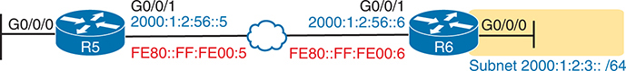
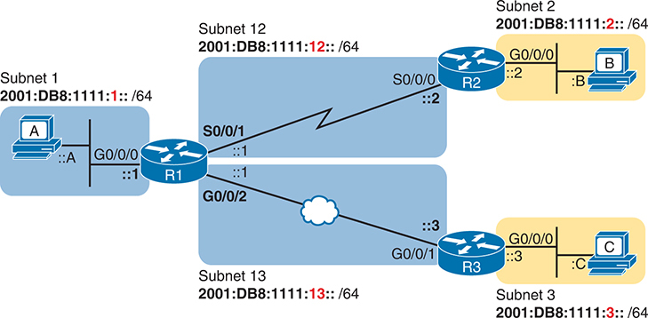
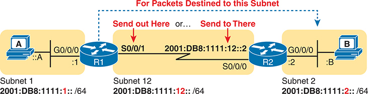
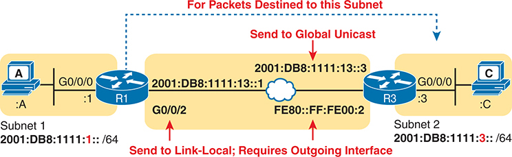
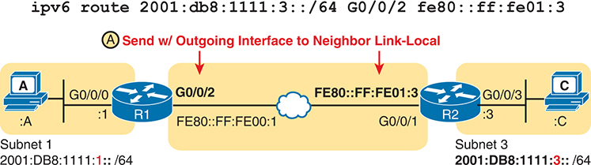
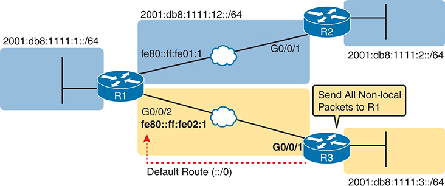
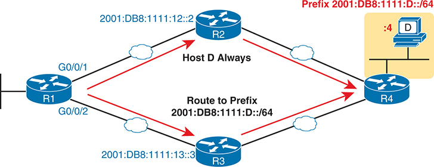
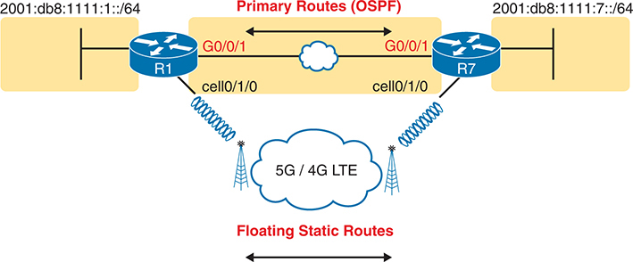
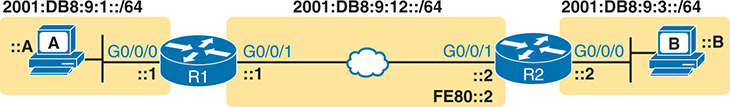

# Chapter 29


## Implementing IPv6 Routing

This chapter covers the following exam topics:

3.0 IP Connectivity

3.1 Interpret the components of routing table

3.1.a Routing protocol code

3.1.b Prefix

3.1.c Network mask

3.1.d Next hop

3.1.e Administrative distance

3.3 Configure and verify IPv4 and IPv6 static routing

3.3.a Default route

3.3.b Network route

3.3.c Host route

3.3.d Floating static

This last chapter in [Part VII](vol1_part07.xhtml#part07) of the book completes the materials about IPv6 by examining four major topics. The first section examines IPv6 connected and [local routes](vol1_gloss.xhtml#gloss_243)—the routes a router adds to its routing table in reaction to IPv6 address configuration. The second major section discusses static network routes, that is, routes configured by the **ipv6 route** command with a destination of an IPv6 prefix (subnet). The third major section examines other IPv6 static route topics, including default routes, host routes, and floating static routes, with some notes about troubleshooting all static IPv6 routes. The final short section discusses a few tools and tips to troubleshoot IPv6 static routes.

### "Do I Know This Already?" Quiz

Take the quiz (either here or use the PTP software) if you want to use the score to help you decide how much time to spend on this chapter. The letter answers are listed at the bottom of the page following the quiz. [Appendix C](vol1_appc.xhtml#appc), found both at the end of the book as well as on the companion website, includes both the answers and explanations. You can also find both answers and explanations in the PTP testing software.

**Table 29-1** "Do I Know This Already?" Foundation Topics Section-to-Question Mapping

| Foundation Topics Section | Questions |
| --- | --- |
| Connected and Local IPv6 Routes | 1, 2 |
| Static IPv6 Network Routes | 3, 4 |
| Static Default, Host, and Floating Static IPv6 Routes | 5, 6 |
| Troubleshooting Static IPv6 Routes | 7 |

Refer to the following figure for questions 1, 3, and 4.




Router R 5 is equipped with interfaces G 0/0/0 and G 0/0/1. Interface G 0/0/0 connects to a network with subnet address 2000:1:2:3: :/64, while G 0/0/1 is linked to a network with the subnet address F E 80: F F: F E 00:5. Router R 6 also has two interfaces, G 0/0/0 and G 0/0/1. G 0/0/0 is connected to the same network as G 0/0/1 on R 5, while G 0/0/1 is associated with a network featuring the subnet address 2000:1:2:56: :/64.

**[1](vol1_ch29.xhtml#ques29_1a).** Router R6 in the figure has been configured with the **ipv6 address 2000:1:2:3::1/64** command on its G0/0/0 interface. The router also creates a link-local address of FE80::FF:FE00:1. All router interfaces have an up/up status. Which of the following routes will R6 add to its IPv6 routing table? (Choose two answers.)

1. A route for 2000:1:2:3::/64
2. A route for FE80::FF:FE00:1/64
3. A route for 2000:1:2:3::1/128
4. A route for FE80::FF:FE00:1/128

**[2](vol1_ch29.xhtml#ques29_2a).** A router has been configured with the **ipv6 address 3111:1:1:1::1/64** command on its G0/0/0 interface and **ipv6 address 3222:2:2:2::1/64** on its G0/0/1 interface. Both interfaces have an up/up state. Which of the following routes would you expect to see in the output of the **show ipv6 route connected** command? (Choose two answers.)

1. A route for 3111:1:1:1::/64
2. A route for 3111:1:1:1::1/64
3. A route for 3222:2:2:2::/64
4. A route for 3222:2:2:2::2/128

**[3](vol1_ch29.xhtml#ques29_3a).** An engineer needs to add a static IPv6 route for prefix 2000:1:2:3::/64 to Router R5 in the figure. Which of the following **ipv6 route** commands would result in a working IPv6 route for this subnet prefix? (Choose two answers.)

1. **ipv6 route 2000:1:2:3::/64 G0/0/1 2000:1:2:56::6**
2. **ipv6 route 2000:1:2:3::/64 2000:1:2:56::6**
3. **ipv6 route 2000:1:2:3::/64 G0/0/1** 2001:1:2:56::5
4. **ipv6 route 2000:1:2:3::/64 G0/0/1**

**[4](vol1_ch29.xhtml#ques29_4a).** An engineer needs to add a static IPv6 route for prefix 2000:1:2:3::/64 to Router R5 in the figure. Which of the following answers shows a valid static IPv6 route for that subnet on Router R5?

1. **ipv6 route 2000:1:2:3::/64 2000:1:2:56::5**
2. **ipv6 route 2000:1:2:3::/64 2000:1:2:56::6**
3. **ipv6 route 2000:1:2:3::/64 FE80::FF:FE00:5**
4. **ipv6 route 2000:1:2:3::/64 FE80::FF:FE00:6**

**[5](vol1_ch29.xhtml#ques29_5a).** When displaying an IPv6 static default route, how does the **show ipv6 route** command represent the concept of the default destination?

1. With the phrase "Gateway of Last Resort" just above the list of routes
2. With a prefix value ::/0 in the line for the route
3. With a prefix value ::/128 in the line for the route
4. With a prefix value 2000::/3 in the line for the route
5. With the keyword "default" in the line for the route

**[6](vol1_ch29.xhtml#ques29_6a).** Router R1 has a useful IPv6 configuration so that Router R1 learns a route for subnet 2001:db8:1:2::/64 with OSPF. The route lists an outgoing interface that is an Ethernet WAN link. The engineer then installs cellular interfaces on both routers for WAN backup. As part of the configuration, the engineer configures the **ipv6 route 2001:db8:1:2::/64 cellular0/2/0 200** command. What does the router do in response?

1. It rejects the **ipv6 route** command because of the existing OSPF route for the same prefix.
2. It accepts the **ipv6 route** command into the configuration but does not add a route to the routing table.
3. It accepts the **ipv6 route** command into the configuration and adds the route to the routing table, but it leaves the OSPF-learned route in the routing table.
4. It accepts the **ipv6 route** command into the configuration, adds the route to the routing table, and removes the OSPF-learned route in the routing table.

**[7](vol1_ch29.xhtml#ques29_7a).** An engineer types the command **ipv6 route 2001:DB8:8:8::/64 2001:DB8:9:9::9 129** in configuration mode of Router R1 and presses Enter. Later, a **show ipv6 route** command lists no routes for subnet 2001:DB8:8:8::/64. Which of the following could have caused the route to not be in the IPv6 routing table?

1. The command uses a next-hop global unicast address, which is not allowed, preventing the router from adding a route.
2. The command must include an outgoing interface parameter, so IOS rejected the **ipv6 route** command.
3. The router has no routes that match the next-hop address 2001:DB8:9:9::9.
4. A route for 2001:DB8:8:8::/64 with administrative distance 110 already exists.

Answers to the "Do I Know This Already?" quiz:

**[1](vol1_appc.xhtml#ques29_1)** A, C

**[2](vol1_appc.xhtml#ques29_2)** A, C

**[3](vol1_appc.xhtml#ques29_3)** A, B

**[4](vol1_appc.xhtml#ques29_4)** B

**[5](vol1_appc.xhtml#ques29_5)** B

**[6](vol1_appc.xhtml#ques29_6)** B

**[7](vol1_appc.xhtml#ques29_7)** C

### Foundation Topics

### Connected and Local IPv6 Routes

A Cisco router adds IPv6 routes to its IPv6 routing table for several reasons. Many of you could predict those reasons at this point in your reading, in part because the logic mirrors the logic routers use for IPv4. Specifically, a router adds IPv6 routes based on the following:

* The configuration of IPv6 addresses on working interfaces (connected and local routes)

  
* The direct configuration of a static route (static routes)
* The configuration of a routing protocol, like OSPFv3, on routers that share the same data link (dynamic routes)

The first two sections of this chapter examine the first of these two topics, with discussions of IPv6 routing protocols residing in the CCNP Enterprise exams.

Also, as an early reminder of a few essential acronyms from earlier chapters, remember that GUA refers to global unicast addresses, the most common routable unicast address configured on Enterprise router interfaces. Unique local addresses (ULA) serve as private addresses. Finally, routes frequently use a neighboring router's link-local address (LLA), a unicast address that exists on every router and host interface, useful for sending packets over the local link.

#### Rules for Connected and Local Routes

Routers add and remove IPv6 connected and [IPv6 local routes](vol1_gloss.xhtml#gloss_218) based on the interface configuration and state. First, the router looks for configured unicast addresses on any interfaces by looking for the **ipv6 address** command. Then, if the interface is working—if the interface has a "line status is up, protocol status is up" notice in the output of the **show interfaces** command—the router adds both a connected and local route.

Note

Routers do not create connected or local IPv6 routes for link-local addresses.

The connected and local routes follow the same general logic as with IPv4. The connected route represents the subnet connected to the interface, whereas the local route is a host route for only the specific IPv6 address configured on the interface.

For example, consider a router configured with a working interface with the **ipv6 address 2000:1:1:1::1/64** command. The router will calculate the subnet ID based on this address and prefix length and place a connected route for that subnet (2000:1:1:1::/64) into the routing table. The router also takes the listed IPv6 address and creates a local route for that address, with a /128 prefix length. (With IPv4, local routes have a /32 prefix length, while IPv6 uses a /128 prefix length, meaning "exactly this one address.")

The following list summarizes the rules about how routers create routes based on the configuration of an interface IPv6 unicast address, for easier review and study:


1. Routers create IPv6 routes based on each unicast IPv6 address on an interface, as configured with the **ipv6 address** command, as follows:

   1. The router creates a route for the subnet (a connected route).
   2. The router creates a local route (/128 prefix length) for the router IPv6 address (a local route).
2. Routers do not create routes based on the link-local addresses associated with the interface.
3. Routers remove the connected and local routes for an interface if the interface fails, and they re-add these routes when the interface is again in a working (up/up) state.

#### Example of Connected IPv6 Routes

While the concept of connected and local IPv6 routes works much like IPv4 routes, seeing a few examples can certainly help. To show some sample routes, [Figure 29-1](vol1_ch29.xhtml#ch29fig01) details one sample internetwork used in this chapter. The figure shows the IPv6 subnet IDs. The upcoming examples focus on the connected and local routes on Router R1.





**Figure 29-1** *Sample Network Used to Show Connected and Local Routes*

The network consists of three routers labelled R 1, R 2, and R 3. Each router has two Gigabit Ethernet interfaces used for connecting multiple devices. A Serial interface labelled S 0/0/0 and S 0/0/1 on Router 1 and Router 2, used for point-to-point connections. The network is further divided into four subnets labelled Subnet 1, Subnet 2, Subnet 3, Subnet 12 and Subnet 13. Each subnet is connected to a router through an interface. The subnet mask for each subnet is also provided /64. A subnet mask is used to differentiate between the network part of an IP address and the host part.

To clarify the notes in [Figure 29-1](vol1_ch29.xhtml#ch29fig01), note that the figure shows IPv6 prefixes (subnets), with a shorthand notation for the interface IPv6 addresses. The figure shows only the abbreviated interface ID portion of each interface address near each interface. For example, R1's G0/0/0 interface address would begin with subnet ID value 2001:DB8:1111:1, added to ::1, for 2001:DB8:1111:1::1.

Now on to the example of connected routes. To begin, consider the configuration of Router R1 from [Figure 29-1](vol1_ch29.xhtml#ch29fig01), as shown in [Example 29-1](vol1_ch29.xhtml#exa29_1). The excerpt from the **show running-config** command on R1 shows three working interfaces. Also note that no static route or routing protocol configuration exists.

**Example 29-1** *IPv6 Addressing Configuration on Router R1*

[Click here to view code image](vol1_ch29_images.xhtml#f0726-01)

```
ipv6 unicast-routing
!
! Unused interfaces omitted
!
interface GigabitEthernet0/0/0
 ipv6 address 2001:DB8:1111:1::1/64
!
interface Serial0/0/1
 ipv6 address 2001:db8:1111:12::1/64
!
interface GigabitEthernet0/0/2
 ipv6 address 2001:db8:1111:13::1/64
```

Based on [Figure 29-1](vol1_ch29.xhtml#ch29fig01) and [Example 29-1](vol1_ch29.xhtml#exa29_1), R1 should have three connected IPv6 routes, as highlighted in [Example 29-2](vol1_ch29.xhtml#exa29_2).

**Example 29-2** *Routes on Router R1 Before Adding Static Routes or Routing Protocols*

[Click here to view code image](vol1_ch29_images.xhtml#f0727-01)

```
R1# show ipv6 route
IPv6 Routing Table - default - 7 entries
Codes: C - Connected, L - Local, S - Static, U - Per-user Static route
       B - BGP, HA - Home Agent, MR - Mobile Router, R - RIP
       H - NHRP, I1 - ISIS L1, I2 - ISIS L2, IA - ISIS interarea
       IS - ISIS summary, D - EIGRP, EX - EIGRP external, NM - NEMO
       ND - ND Default, NDp - ND Prefix, DCE - Destination, NDr - Redirect
       RL - RPL, O - OSPF Intra, OI - OSPF Inter, OE1 - OSPF ext 1
       OE2 - OSPF ext 2, ON1 - OSPF NSSA ext 1, ON2 - OSPF NSSA ext 2
       la - LISP alt, lr - LISP site-registrations, ld - LISP dyn-eid
       lA - LISP away, a - Application
C   2001:DB8:1111:1::/64 [0/0]
     via GigabitEthernet0/0/0, directly connected
L   2001:DB8:1111:1::1/128 [0/0]
     via GigabitEthernet0/0/0, receive
C   2001:DB8:1111:12::/64 [0/0]
     via Serial0/0/1, directly connected
L   2001:DB8:1111:12::1/128 [0/0]
     via Serial0/0/1, receive
C   2001:DB8:1111:13::/64 [0/0]
     via GigabitEthernet0/0/2, directly connected
L   2001:DB8:1111:13::1/128 [0/0]
     via GigabitEthernet0/0/2, receive
L   FF00::/8 [0/0]
     via Null0, receive
```

All three highlighted routes show the same basic kinds of information, so for discussion, focus on the first pair of highlighted lines, which details the connected route for subnet 2001:DB8:1111:1::/64. The first pair of highlighted lines states: The route is a "directly connected" route; the interface ID is GigabitEthernet0/0/0; and the prefix/length is 2001:DB8:1111:1::/64. At the far left, the code letter "C" identifies the route as a connected route (per the legend above). Also note that the numbers in brackets mirror the same ideas as IPv4's **show ip route** command: The first number represents the administrative distance, and the second is the metric.

#### Examples of Local IPv6 Routes

Continuing this same example, three local routes should exist on R1 for the same three interfaces as the connected routes. Indeed, that is the case, with one extra local route for other purposes. [Example 29-3](vol1_ch29.xhtml#exa29_3) shows only the local routes, as listed by the **show ipv6 route local** command, with highlights of one particular local route for discussion.

**Example 29-3** *Local IPv6 Routes on Router R1*

[Click here to view code image](vol1_ch29_images.xhtml#f0728-01)

```
R1# show ipv6 route local
! Legend omitted for brevity

L  2001:DB8:1111:1::1/128 [0/0]
    via GigabitEthernet0/0/0, receive
L  2001:DB8:1111:4::1/128 [0/0]
    via Serial0/0/1, receive
L  2001:DB8:1111:5::1/128 [0/0]
    via GigabitEthernet0/0/2, receive
L  FF00::/8 [0/0]
    via Null0, receive
```

For the highlighted local route, look for a couple of quick facts. First, look back to R1's configuration in [Example 29-1](vol1_ch29.xhtml#exa29_1), and note R1's IPv6 address on its G0/0/0 interface. This local route lists the exact same address. Also note the /128 prefix length, meaning this route matches packets sent to that address (2001:DB8:1111:1::1), and only that address.

Note

While the **show ipv6 route local** command shows all local IPv6 routes, the **show ipv6 route connected** command shows all connected routes.

### Static IPv6 Network Routes

IPv6 static routes require direct configuration with the **ipv6 route** command. Simply put, someone configures the command, and the router places the details from the command into a route in the IPv6 routing table.

The IPv6 network route is the most common type of static route among the types mentioned in the CCNA exam topics (network, host, default, and floating static). A network route, by definition, defines a route to the addresses in a subnet based on the listed prefix and prefix length. The **ipv6 route** global command also lists the forwarding instructions of how this router should forward packets toward that destination prefix by listing the outgoing interface or the address of the next-hop router.

[Figure 29-2](vol1_ch29.xhtml#ch29fig02) shows the general concepts behind a single **ipv6 route** command for a network route. The figure shows the ideas behind a static route on Router R1 for the subnet on the right (subnet 2, or 2001:DB8:1111:2::/64). The command begins with **ipv6 route 2001:DB8:1111:2::/64**, defining the destination subnet. The rest of the command defines the forwarding instructions—either the outgoing interface (S0/0/1), the next-hop IPv6 address, or both.

Now that you understand the big ideas with IPv6 static network routes, the next few pages walk you through a series of examples. In particular, the examples look at configuring static routes with an outgoing interface, then with a next-hop GUA, and then with a next-hop LLA.





**Figure 29-2** *Logic Behind IPv6 Static Route Commands (IPv6 Route)*

Router R 1 features interfaces G 0/0/0 and S0/0/1. Interface G 0/0/0 is connected to a network labeled subnet 1 with the subnet address 2000:D B 8:1111:1: :/64, while S 0/0/1 connects to subnet 12 with the subnet address 2000:D B 8:1111:12: :/64. Router R 2 possesses interfaces S 0/0/0 and G 0/0/0. Interface S 0/0/0 is linked to the same network as S 0/0/1 on R 1, whereas G 0/0/0 is associated with subnet 2, featuring the subnet address 2000:D B 8:1111:2: :/64. The schematic includes labels: Router R 1 is marked "for the packets destined to this subnet" towards Subnet 2, interface S 0/0/1 is labeled "send out here," and interface S 0/0/0 is marked "send to there.

#### Static Network Routes Using an Outgoing Interface

This first IPv6 static route example uses the outgoing interface option. As a reminder, for both IPv4 and IPv6 static routes, when the command references an interface, the interface is a local interface; that is, it is an interface on the router where the command is added. In this case, as shown in [Figure 29-2](vol1_ch29.xhtml#ch29fig02), R1's **ipv6 route** command would use interface S0/0/1, as shown in [Example 29-4](vol1_ch29.xhtml#exa29_4).

**Example 29-4** *Static IPv6 Routes on Router R1*

[Click here to view code image](vol1_ch29_images.xhtml#f0729-01)

```
! Static route on router R1
R1(config)# ipv6 route 2001:db8:1111:2::/64 S0/0/1
```

If you were attempting to support packet flow between all hosts, like PCs A and B in the figure, you need static routes on each router for each remote subnet. For example, to support traffic between hosts A and B, R1 is now prepared. Host A will forward all its IPv6 packets to its default router (R1), and R1 can now route those packets destined for host B's subnet out R1's S0/0/1 interface to R2 next. However, Router R2 does not yet have a route that matches addresses in host A's subnet (2001:DB8:1111:1::/64), so a complete static routing solution requires more routes.

[Example 29-5](vol1_ch29.xhtml#exa29_5) solves this problem by giving Router R2 a static route for subnet 1 (2001:DB8:1111:1::/64). After this route is added, hosts A and B should be able to ping each other.

**Example 29-5** *Static IPv6 Routes on Router R2*

[Click here to view code image](vol1_ch29_images.xhtml#f0729-02)

```
! Static route on router R2
R2(config)# ipv6 route 2001:db8:1111:1::/64 s0/0/0
```

Many options exist for verifying the existence of the static route and testing whether hosts can use the route. **ping** and **traceroute** can test connectivity. From the router command line, the **show ipv6 route** command will list all the IPv6 routes. The shorter output of the **show ipv6 route static** command, which lists only static routes, could also be used; [Example 29-6](vol1_ch29.xhtml#exa29_6) shows that output, with the legend omitted.

**Example 29-6** *Verification of Static Routes Only on R1*

[Click here to view code image](vol1_ch29_images.xhtml#f0730-01)

```
R1# show ipv6 route static
! Legend omitted for brevity
S   2001:DB8:1111:2::/64 [1/0]
     via Serial0/0/1, directly connected
```

This command lists many facts about the one static route on R1. First, the code "S" in the left column does identify the route as a static route. (However, the later phrase "directly connected" might mislead you to think this is a connected route; trust the "S" code.) Note that the prefix (2001:DB8:1111:2::/64) matches the configuration (in [Example 29-4](vol1_ch29.xhtml#exa29_4)), as does the outgoing interface (S0/0/1).

When working with IPv6 routes, you will often wonder which route the router will match for a given destination address. You should be ready to think through that question while examining a full IPv6 routing table, but if answering a lab question on the exam, you can use a command that tells you the specific route, as seen in [Example 29-7](vol1_ch29.xhtml#exa29_7). For example, if host A sent an IPv6 packet to host B (2001:DB8:1111:2::B), would R1 use this static route? As it turns out, R1 would use that route, as confirmed by the **show ipv6 route 2001:DB8:1111:2::B** command. This command asks the router to list the route that the router would use when forwarding packets to that particular address.

**Example 29-7** *Displaying the Route R1 Uses to Forward to Host B*

[Click here to view code image](vol1_ch29_images.xhtml#f0730-02)

```
R1# show ipv6 route 2001:db8:1111:2::b
Routing entry for 2001:DB8:1111:2::/64
  Known via "static", distance 1, metric 0
  Route count is 1/1, share count 0
  Routing paths:
    directly connected via Serial0/0/1
      Last updated 00:01:29 ago
```

Note

Only serial interfaces, and not Ethernet interfaces, support using an **ipv6 route** command with only an outgoing interface as the forwarding instructions. With Ethernet interfaces, the router will accept the command, but the router cannot forward packets using the route. See the later section, "[Troubleshooting Static IPv6 Routes](vol1_ch29.xhtml#ch29lev1sec6)," for more details on this case and other challenges with static IPv6 routes.

#### Static Network Routes Using Next-Hop IPv6 Address

IPv6 static route commands can use only the next-hop router address or a combination of the next-hop router address plus the outgoing interface. Note that these options work when the route forwards packets out any kind of interface, including Ethernet and serial links, but the upcoming examples show an Ethernet WAN link.

Interestingly, IPv6 supports using the neighbor's GUA, ULA, or LLA as the next-hop IPv6 address. The following list provides the working combinations, with [Figure 29-3](vol1_ch29.xhtml#ch29fig03) depicting the logic from R1's perspective for a route with R3 as the next-hop router:

* Next-hop GUA or ULA only
* Next-hop GUA or ULA and outgoing interface
* Next-hop LLA and outgoing interface




**Figure 29-3** *Using GUA or LLA as the Next-Hop Address for Static IPv6 Routes*

Router R 1 features interfaces G 0/0/0 and G 0/0/2. Interface G 0/0/0 is connected to a network labeled subnet 1 with the subnet address 2000:D B 8:1111:1: :/64, while G 0/0/2 connects to subnet address 2000:D B 8:1111:13: :1. Router R 3 possesses interfaces G 0/0/0 and F E 80: :F F:F E 00:2 is linked to the same network as G 0/0/2 on R 1, whereas G 0/0/0 is associated with subnet 2 featuring the subnet address 2000:D B 8:1111:3: :/64. The schematic includes labels: Router R 1 is marked "for the packets destined to this subnet" towards Subnet 2, interface G 0/0/2 is labeled "send to link-local" and subnet address 2000:D B 8:1111:3: :3 is marked "send to Global Unicast.

The next few pages walk you through examples, first with a GUA and then with an LLA as a next-hop router.

##### Example Static Network Route with a Next-Hop GUA

In [Example 29-8](vol1_ch29.xhtml#exa29_8), R1 adds a static route that refers to neighbor R3's GUA per [Figure 29-3](vol1_ch29.xhtml#ch29fig03). The command lists subnet 3 (2001:DB8:1111:3::/64), which exists on the far side of Router R3. The route then lists R3's GUA (ending in 13::3), the GUA on the shared subnet between R1 and R3, as the next-hop address.

**Example 29-8** *Static IPv6 Routes Using Global Unicast Addresses*

[Click here to view code image](vol1_ch29_images.xhtml#f0731-01)

```
!
R1(config)# ipv6 route 2001:db8:1111:3::/64 2001:DB8:1111:13::3
```

The first two commands in [Example 29-9](vol1_ch29.xhtml#exa29_9) list detail about the static route configured in [Example 29-8](vol1_ch29.xhtml#exa29_8). The first command lists all static routes on Router R1, currently just the one static route per [Example 29-8](vol1_ch29.xhtml#exa29_8). The second command, **show ipv6 route 2001:DB8:1111:3::33**, asks R1 to identify the route it would use to forward packets to the address listed in the command (Host C in the figure uses address **2001:DB8:1111:3::33**). The output details the just-configured static route, proving that R1 uses this new static route when forwarding packets to that host.

**Example 29-9** *Verification of Static Routes to a Next-Hop Global Unicast Address*

[Click here to view code image](vol1_ch29_images.xhtml#f0731-02)

```
R1# show ipv6 route static
! Legend omitted for brevity
S   2001:DB8:1111:3::/64 [1/0]
     via 2001:DB8:1111:13::3

R1# show ipv6 route 2001:db8:1111:3::33
Routing entry for 2001:DB8:1111:3::/64
  Known via "static", distance 1, metric 0
  Route count is 1/1, share count 0
  Routing paths:
    2001:DB8:1111:13::3
      Route metric is 0, traffic share count is 1
      Last updated 00:07:43 ago
```

Interestingly, the **ipv6 route 2001:db8:1111:3::/64 2001:db8:1111:13::3** command in [Example 29-8](vol1_ch29.xhtml#exa29_8) works, but you might wonder how the router knows what outgoing interface to use because the command does not list it. The router does need to identify the outgoing interface, so it uses an iterative process by finding the route to reach the next-hop GUA. The first iteration happens when the router matches the packet's destination address to the static route. The second iteration occurs when the router finds the route to use when forwarding packets to the next-hop address in the first route. That second iteration matches the route for the subnet to which both the local router and the next-hop router connect—in this case, subnet prefix 2001.db8:1111:13::/64 connected to R1's G0/0/2.

[Example 29-10](vol1_ch29.xhtml#exa29_10) shows some notes about the iterative lookup to find the outgoing interface. The first command lists the connected route that Router R1 uses that matches next-hop GUA 2002:db8:1111:13::3, namely the route for prefix 2001:db8:1111:13::/64. But the **show ipv6 static detail** command shows the results of the router's iterative route lookup, listing interface G0/0/2 as the outgoing interface. It also lists a code of \*, informing us that the router added the route to the Routing Information Base (RIB), referring to the IPv6 routing table.

**Example 29-10** *Understanding the Iterative Lookup to Find the Outgoing Interface*

[Click here to view code image](vol1_ch29_images.xhtml#f0732-01)

```
R1# show ipv6 route connected
! Lines omitted to reveal route to the subnet between R1 and R3
C   2001:DB8:1111:13::/64 [0/0]
     via GigabitEthernet0/0/2, directly connected

R1# show ipv6 static detail
IPv6 Static routes Table - default
Codes: * - installed in RIB, u/m - Unicast/Multicast only
Codes for []: P - permanent I - Inactive permanent
       U - Per-user Static route
       N - ND Static route
       M - MIP Static route
       P - DHCP-PD Static route
       R - RHI Static route
       V - VxLan Static route
*   2001:DB8:1111:3::/64 via 2001:DB8:1111:13::3, distance 1
     Resolves to 1 paths (max depth 1)
     via GigabitEthernet0/0/2
```

You can also configure a static IPv6 route with the next-hop GUA plus the outgoing interface (sometimes called a fully specified route). Doing so means that the router does not need to perform the iterative route lookup. [Example 29-11](vol1_ch29.xhtml#exa29_11) shows just such a case, replacing the static route in [Example 29-8](vol1_ch29.xhtml#exa29_8) with one that also lists both the next-hop GUA plus G0/0/2 as the outgoing interface. The end of the example confirms that the route listed in the IPv6 routing table lists the next-hop GUA and outgoing interface.

**Example 29-11** *Alternate IPv6 Static Route with Outgoing Interface and GUA*

[Click here to view code image](vol1_ch29_images.xhtml#f0733-01)

```
R1# show running-config | include ipv6 route
ipv6 route 2001:DB8:1111:3::/64 GigabitEthernet0/0/2 2001:DB8:1111:13::3

R1# show ipv6 route | section 2001:DB8:1111:3::/64
S   2001:DB8:1111:3::/64 [1/0]
     via 2001:DB8:1111:13::3, GigabitEthernet0/0/2

R1# show ipv6 static detail
! Legend omitted
*   2001:DB8:1111:3::/64 via 2001:DB8:1111:13::3, GigabitEthernet0/0/2, distance 1
```

##### Example Static Network Route with a Next-Hop LLA

Static routes that refer to a neighbor's LLA work a little like the preceding two styles of static routes. First, the **ipv6 route** command refers to a next-hop address, namely an LLA; however, the command must also refer to the router's local outgoing interface. Why both? The **ipv6 route** command cannot simply refer to an LLA next-hop address by itself because the iterative route lookup used with GUAs will not work with LLAs. There are no routes for LLAs, so there is no way for a router to use only the LLA as a static route's forwarding instructions. In short, if using the LLA, you also need to configure the outgoing interface.

[Figure 29-4](vol1_ch29.xhtml#ch29fig04) depicts the logic for using both the LLA and outgoing interface to replace the example static route configured in [Example 29-8](vol1_ch29.xhtml#exa29_8) and explained with [Examples 29-9](vol1_ch29.xhtml#exa29_9) and [29-10](vol1_ch29.xhtml#exa29_10). In this case, the R1 configuration refers to R1's outgoing interface and to Router R2's LLA. The figure also shows the global configuration command required on Router R1.




**Figure 29-4** *Example Using LLAs and Outgoing Interface for IPv6 Static Routes*

Node 'A' connects to router 'R 1' via interface 'G 0/0/0'. 'R 1' links to 'R 2' via 'G 0/0/2', traversing an external network represented by a cloud symbol. 'R 2' connects to node 'C' via 'G 0/0/3'. Nodes 'A' and 'C' belong to different subnets: 'Subnet 1' with I P version 6 address 2001:D B 8:1111:1: :/64 and 'Subnet 3' with I P version 6 address 2001:D B 8:1111:3: :/64, respectively. The schematic includes an I P version 6 route command with I P address, subnet mask, and outgoing interface to neighbor link-local address indicates data flow direction.

[Example 29-12](vol1_ch29.xhtml#exa29_12) shows the configuration of the LLA-based static route on Router R1, with some purposeful mistakes along the way. The first attempt with the **ipv6 route** command omits the outgoing interface, so IOS rejects the command. The second attempt shows the command after using the up-arrow to retrieve the command and then adding the outgoing interface (G0/0/2) to the end of the command, but that command uses incorrect syntax. The interface ID should *precede* the address. The final **ipv6 route** command shows the correct syntax with IOS accepting the command.

**Example 29-12** *Static IPv6 Network Route Using LLA*

[Click here to view code image](vol1_ch29_images.xhtml#f0734-01)

```
R1# configure terminal
Enter configuration commands, one per line.  End with CNTL/Z.
R1(config)# ipv6 route 2001:db8:1111:3::/64 fe80::ff:fe01:3
% Interface has to be specified for a link-local nexthop
R1(config)# ipv6 route 2001:db8:1111:3::/64 fe80::ff:fe00:2 g0/0/2
                                                           ^
% Invalid input detected at '^' marker.

R1(config)# ipv6 route 2001:db8:1111:3::/64 g0/0/2 fe80::ff:fe01:3
R1(config)#^Z
```

[Example 29-13](vol1_ch29.xhtml#exa29_13) verifies the configuration in [Example 29-12](vol1_ch29.xhtml#exa29_12) by repeating the **show ipv6 route static** and **show ipv6 route 2001:DB8:1111:3::33** commands used in [Example 29-9](vol1_ch29.xhtml#exa29_9). Note that the output from both commands differs slightly versus the earlier example. Because the new configuration commands list both the next-hop address and outgoing interface, the **show** commands in [Example 29-13](vol1_ch29.xhtml#exa29_13) also list both the next-hop (LLA) and the outgoing interface. If you refer back to [Example 29-9](vol1_ch29.xhtml#exa29_9), you will see only a next-hop address listed.

**Example 29-13** *Verification of Static Routes to a Next-Hop Link-Local Address*

[Click here to view code image](vol1_ch29_images.xhtml#f0734-02)

```
R1# show ipv6 route static
! Legend omitted for brevity

S   2001:DB8:1111:3::/64 [1/0]
      via FE80::FF:FE00:2, GigabitEthernet0/0/2

R1# show ipv6 route 2001:db8:1111:3::33
Routing entry for 2001:DB8:1111:3::/64
  Known via "static", distance 1, metric 0
  Route count is 1/1, share count 0
  Routing paths:
    FE80::FF:FE00:2, GigabitEthernet0/0/2
      Route metric is 0, traffic share count is 1
      Last updated 00:01:01 ago
```

In summary, IPv6 static network routes list a prefix/prefix-length along with forwarding instructions. The forwarding instructions allow for unicast address types—GUA, ULA, or even LLAs. However, there are some restrictions about which options you can use with forwarding instructions. [Table 29-2](vol1_ch29.xhtml#ch29tab02) summarizes the options.


**Table 29-2** Summary Table for IPv6 Network Route Configuration


| Forwarding Instructions | Serial | Ethernet |
| --- | --- | --- |
| Interface only | Yes | No*[\*](vol1_ch29.xhtml#tfn29_2a)* |
| GUA/ULA only | Yes | Yes |
| Interface plus GUA/ULA | Yes | Yes |
| Interface plus LLA | Yes | Yes |
| LLA only | No | No |

*[\*](vol1_ch29.xhtml#tfn29_2)* The **ipv6 route** command can be configured with an outgoing Ethernet interface but no next-hop address, but the route does not forward packets.

### Static Default, Host, and Floating Static IPv6 Routes

If you have been reading this book sequentially, the following topics should be relatively easy. Engineers use IPv6 default, host, and floating static routes for the same purposes as their IPv4 cousins. The only difference comes in the combinations of how to configure the next-hop addresses and outgoing interfaces for IPv6, a topic you just finished learning about in this chapter. Hopefully, most of the following few pages will be both a review of IPv4 default, host, and floating static concepts, along with helpful examples for IPv6 routes.

#### Static IPv6 Default Routes

IPv6 supports a default route concept, similar to IPv4. The default route tells the router what to do with an IPv6 packet when the packet matches no other IPv6 route. The straightforward router forwarding logic when no routes match a packet's destination is

* With no default route, the router discards the IPv6 packet.
* With a default route, the router forwards the IPv6 packet based on the default route.

Default routes can be beneficial in a couple of network design cases. For example, with an enterprise network design that uses a single router at each branch office, with one WAN link to each branch, the branch routers have only one possible path over which to forward packets. When using a routing protocol in a large network, the branch router could learn thousands of routes, all of which forward packets over that one WAN link.

Branch routers could use default routes instead of a routing protocol. The branch router would forward all traffic to the core of the network. [Figure 29-5](vol1_ch29.xhtml#ch29fig05) shows just such an example, with two sample branch routers on the right and a core site router on the left, with the default route shown as the dashed line.

To configure a static default route, use a specific value to note the route as a default route: ::/0. An entire prefix of a double colon (::) with no other digits represents an all 0s prefix, and the /0 prefix length signifies that zero of the initial bits must match to be part of the same group. So, ::/0 serves as the abbreviation of "all IPv6 addresses." This idea mirrors the IPv4 convention to refer to the default route as 0.0.0.0/0 in **show** command output or 0.0.0.0 0.0.0.0 in the **ip route** command.





**Figure 29-5** *Using Static Default Routes at Branch Routers*

Branch routers R 2 and R 3 are connected to a router R 1 through their G 0/0/1 interfaces. Router R 1 has a default route that points to 2001:D B 8:1111:1: :/64. Static routes are configured on R 2 and R 3 to send all non-local packets to router R 1. R 2's static route points to 2001:D B 8:1111:1: :/64 through interface G 0/0/1 and R 3's static route points to 2001:D B 8:1111:1: :/64 through interface G 0/0/1.

To configure a static default route, use ::/0 as the destination, and otherwise, just configure the **ipv6 route** command as normal, with the same conventions about forwarding instructions as discussed earlier in this chapter. [Example 29-14](vol1_ch29.xhtml#exa29_14) shows one such sample static default route on Router R3 from [Figure 29-5](vol1_ch29.xhtml#ch29fig05). The configuration uses next-hop LLA and, therefore, also requires the outgoing interface.

**Example 29-14** *Static Default Route for Branch Router R3*

[Click here to view code image](vol1_ch29_images.xhtml#f0736-01)

```
! Forward out R3's G0/0/1 local interface to R1's G0/0/2 LLA FE80::FF:FE02:1.
R3(config)# ipv6 route ::/0 g0/0/1 fe80::ff:fe02:1
```

Cisco IOS provides a simpler representation of IPv6 default routes compared to IPv4 default routes. For instance, the **show ipv6 route** command output does not list a "Gateway of Last Resort" as with IPv4. Instead, it lists the default route destination as ::/0, just as in the **ipv6 route** configuration command. [Example 29-15](vol1_ch29.xhtml#exa29_15) shows Router R3's routing table, with only the default route, plus the expected connected and local routes for its two working interfaces. The **show ipv6 route ::/0** command output, at the bottom of the example, shows more detail about the default route, including confirmation of the configured prefix of ::/0 and the next-hop LLA and outgoing interface.

**Example 29-15** *Router R3's Static Default Route (Using Outgoing Interface)*

[Click here to view code image](vol1_ch29_images.xhtml#f0737-01)

```
R3# show ipv6 route
IPv6 Routing Table - default - 6 entries
Codes: C - Connected, L - Local, S - Static, U - Per-user Static route
       B - BGP, R - RIP, H - NHRP, I1 - ISIS L1
       I2 - ISIS L2, IA - ISIS interarea, IS - ISIS summary, D - EIGRP
       EX - EIGRP external, ND - ND Default, NDp - ND Prefix, DCE - Destination
       NDr - Redirect, O - OSPF Intra, OI - OSPF Inter, OE1 - OSPF ext 1
       OE2 - OSPF ext 2, ON1 - OSPF NSSA ext 1, ON2 - OSPF NSSA ext 2
       a - Application, m - OMP
S   ::/0 [1/0]
     via FE80::FF:FE02:1, GigabitEthernet0/0/1

C   2001:DB8:1111:3::/64 [0/0]
     via GigabitEthernet0/0/0, directly connected
L   2001:DB8:1111:3::3/128 [0/0]
     via GigabitEthernet0/0/0, receive
C   2001:DB8:1111:13::/64 [0/0]
     via GigabitEthernet0/0/1, directly connected
L   2001:DB8:1111:13::3/128 [0/0]
     via GigabitEthernet0/0/1, receive
L   FF00::/8 [0/0]
     via Null0, receive

R3# show ipv6 route ::/0
Routing entry for ::/0
  Known via "static", distance 1, metric 0
  Route count is 1/1, share count 0
  Routing paths:
    FE80::FF:FE02:1, GigabitEthernet0/0/1
      Route metric is 0, traffic share count is 1
      Last updated 00:04:04 ago
```

#### Static IPv6 Host Routes

Both IPv4 and IPv6 allow the definition of static host routes—that is, a route to a single host IP address. With IPv4, those routes use a /32 mask, which identifies a single IPv4 address in the **ip route** command; with IPv6, a /128 mask identifies that single host in the **ipv6 route** command.

As for the syntax, an [IPv6 host route](vol1_gloss.xhtml#gloss_217) follows the same rules as an IPv6 network route regarding the forwarding instructions. The only difference comes in the configuration of a full 128-bit address along with a prefix length of /128 so that the route matches a single IPv6 address.

You might never need to use a host route in a real network, but the motivation usually comes from some business reason to forward packets to one host over a different route that the routing protocol would choose. [Figure 29-6](vol1_ch29.xhtml#ch29fig06) shows just such an example. The route for all hosts in the subnet flows over the lower part of the topology; however, you might have business reasons to forward traffic sent to host D over the upper path through Router R2, requiring a host route.

[Example 29-16](vol1_ch29.xhtml#exa29_16) shows the configuration based on [Figure 29-6](vol1_ch29.xhtml#ch29fig06), with the host route for host D using R2 as the next-hop router, and a static network route for host D's subnet using Router R3 as the next-hop router.





**Figure 29-6** *An Example Topology for an IPv6 Host Route*

A host route, designated for routing traffic to a specific host on a network, features host D. The topology comprises four routers: R 1, R 2, R 3, and R 4, interconnected by tunnels. These tunnels encapsulate I P version 6 packets within I P version 4 packets. Router R 1 holds a route to the prefix 2001:D B 8:1111:D::/64, where Host D resides. This route directs traffic to Router R 4, serving as the next hop router for reaching Host D. Router R 4 possesses an interface linked to Host D, configured with the IPv6 address 2001:D B 8:1111:13:3, where traffic destined for Host D is directed.

**Example 29-16** *Static Host IPv6 Routes on R1, for Host D*

[Click here to view code image](vol1_ch29_images.xhtml#f0738-01)

```
! The first command shows the host route, and the second shows the network route.
! Both use next-hop GUA and outgoing interface for clarity.
R1# configure terminal
Enter configuration commands, one per line.  End with CNTL/Z.
R1(config)# ipv6 route 2001:db8:1111:d::4/128 g0/0/1 2001:db8:1111:12::2
R1(config)# ipv6 route 2001:db8:1111:d::/64 g0/0/2 2001:db8:1111:13::3
R1(config)#^Z
R1#
```

Adding IPv6 host routes typically causes overlapping routes, as seen in this case. When choosing to place routes into the IPv6 routing table, a router always attempts to place the best route for each prefix (subnet) into the IP routing table. That rule applies to each subnet prefix, defined by each combination of prefix and prefix length. In this case, the two static routes have different prefix lengths, so it places both routes into the routing table, as seen in the output from the first command in [Example 29-17](vol1_ch29.xhtml#exa29_17).

**Example 29-17** *IPv6 Host Route for Host D with Overlapping Network Route*

[Click here to view code image](vol1_ch29_images.xhtml#f0738-02)

```
R1# show ipv6 route static
! Legend omitted
S   2001:DB8:1111:D::/64 [1/0]
     via 2001:DB8:1111:13::3, GigabitEthernet0/0/2
S   2001:DB8:1111:D::4/128 [1/0]
     via 2001:DB8:1111:12::2, GigabitEthernet0/0/1

R1# show ipv6 route 2001:db8:1111:d::4
Routing entry for 2001:DB8:1111:D::4/128
  Known via "static", distance 1, metric 0
  Route count is 1/1, share count 0
  Routing paths:
    2001:DB8:1111:12::2, GigabitEthernet0/0/1
      Route metric is 0, traffic share count is 1

      Last updated 00:02:28 ago

R1# show ipv6 route 2001:db8:1111:d::3
Routing entry for 2001:DB8:1111:D::/64
  Known via "static", distance 1, metric 0
  Route count is 1/1, share count 0
  Routing paths:
    2001:DB8:1111:13::3, GigabitEthernet0/0/2
      Route metric is 0, traffic share count is 1
      Last updated 00:00:43 ago
```

As with IPv4 routes, IPv6 matches a packet to the IPv6 routing table using longest-match logic. Packets sent to host D's address match both routes configured in [Example 29-16](vol1_ch29.xhtml#exa29_16), but the router chooses the longer prefix (more binary 1s in the prefix length) /128 host route. Stated differently, when matching more than one route, the router uses the route that defines the most specific set of addresses.

The final two **show** commands in [Example 29-17](vol1_ch29.xhtml#exa29_17) demonstrate Router R1's matching logic. The **show ipv6 route 2001:db8:1111:d::4** command asks the router what route it would use to match packets sent to host D's address, and the output describes the /128 host route, with R2's GUA as the next-hop address. Conversely, the final command lists a different IPv6 address in the same subnet as host D, so R1 will not match the host route. Instead, it matches the network route, listing outgoing interface G0/0/2 with R3's GUA as next-hop address.

#### Floating Static IPv6 Routes

Floating static routes are the last of the four specific static route types mentioned in the CCNA exam topics. The general concept works the same for both IPv4 and IPv6 floating static routes, so this section will provide a brief introduction. For more detail on the concepts, please refer to the section "[Floating Static Routes](vol1_ch17.xhtml#ch17lev2sec9)" in [Chapter 17](vol1_ch17.xhtml#ch17), "[Configuring IPv4 Addresses and Static Routes](vol1_ch17.xhtml#ch17)."

Floating static routes let a router direct traffic over a switched WAN connection, for instance, over a cellular interface—but only when the normally working WAN link fails. For instance, in [Figure 29-7](vol1_ch29.xhtml#ch29fig07), the Ethernet WAN link typically works for months. OSPF learns IPv6 routes using that link. During those same times, the cellular interfaces remain unused, with no cellular call/link between the routers, and no IPv6 routes that use the cellular interfaces.

Floating static routes provide a method to direct packets over the cellular link, which triggers a phone call to create a link between the two routers—but only when the routes that use the primary link fail. To do so, you configure a static route that uses the cellular interface, and the router stores that route in its configuration. However, the router does not add the route to the routing table because of the existing OSPF-learned route for the exact same prefix/length. Once the primary routes fail, the routers add the floating static routes to their routing tables, directing traffic over the cellular link. In this scenario, the cellular link and the floating static route get used only during outages to the primary link.





**Figure 29-7** *Using a Floating Static Route to Key Subnet 2001:DB8:1111:7::/64*

The schematic showing two routers, R 1 and R 7, connected via primary routes using O S P F. The I P addresses for this connection are ‘2001:d b 8:1111:1::/64' for R 1 and ‘2001:d b 8:1111:7::/64' for R 7. A floating static route connects the routers through a 5 G / 4 G L T E cloud. Interfaces involved are labeled as follows: R 1 – G 0/0/1 (connected to O S P F) and cell 0/1/0 (connected to the floating static route); R 7 - G0/0/1 (connected to OSPF) and cell 0/1/0 (connected to the floating static route).

Routers rely on each route's [IPv6 administrative distance](vol1_gloss.xhtml#gloss_216) (AD) parameter to judge between different sources of routing information (for example, OSPF, EIGRP, or static routes) for routes for the same prefix/length. For instance, in [Figure 29-7](vol1_ch29.xhtml#ch29fig07), an OSPF-learned route on R1, for prefix 2001:db8:1111:7::/64, would have a default AD of 110. Static routes default to an AD of 1, so Router R1 would normally prefer the static route configured with the **ipv6 route 2001:db8:1111:7::/64 cell0/1/0** command versus the OSPF-learned AD 110 route to that same subnet, and replace the OSPF-learned route with the static route.

Floating static routes remain out of the routing table by using a higher (worse) AD setting than the normally used routes. In the recent example, by setting the static route's AD to something higher than OSPF's 110—for instance, with the **ipv6 route 2001:db8:1111:7::/64 cell0/1/0 130** command—Router R1 will instead prefer the AD 110 OSPF-learned route instead of the AD 130 static route.

You can find the AD of a route in the routing table with the usual **show** commands. For instance, the **show ipv6 route** command lists each route's administrative distance as the first of the two numbers inside the brackets. The second number in brackets is the metric. Also, commands like **show ipv6 route** *prefix/length* give detail about one specific route; this command lists the AD simply as "distance."

[Table 29-3](vol1_ch29.xhtml#ch29tab03) lists the various default IPv6 AD values. These defaults mirror the same default AD settings for IPv4 as seen in [Table 24-4](vol1_ch24.xhtml#ch24tab04) in this book. Compared to [Table 24-4](vol1_ch24.xhtml#ch24tab04), this table adds the entry for NDP (which does not apply to IPv4) and removes the mention of the IPv4 DHCP-based default route (AD 254) because IPv6 does not advertise default routes with DHCP.


**Table 29-3** Default IPv6 Administrative Distances

| Route Type | Administrative Distance |
| --- | --- |
| Connected | 0 |
| Static | 1 |
| NDP default route | 2 |
| BGP (external routes [eBGP]) | 20 |
| EIGRP (internal routes) | 90 |
| IGRP | 100 |
| OSPF | 110 |
| IS-IS | 115 |
| RIP | 120 |
| EIGRP (external routes) | 170 |
| BGP (internal routes [iBGP]) | 200 |
| Unusable | 255 |

### Troubleshooting Static IPv6 Routes

IPv6 static routes have the same potential issues and mistakes as do static IPv4 routes, as discussed in [Chapter 17](vol1_ch17.xhtml#ch17). However, IPv6 static routes do have a few small differences. This last part of the static route content in the chapter looks at troubleshooting IPv6 static routes, reviewing many of the same troubleshooting rules applied to IPv4 static routes, while focusing on the details specific to IPv6.

This topic breaks static route troubleshooting into two perspectives: cases in which the router adds the route to the routing table but the route does not work, and cases in which the router does not add the route to the routing table.

#### Troubleshooting Incorrect Static Routes That Appear in the IPv6 Routing Table

A static route is only as good as the input typed into the **ipv6 route** command. IOS checks the syntax of the command, of course. However, IOS cannot tell if you choose the incorrect outgoing interface, next-hop address, or prefix/prefix-length in a static route. If the parameters pass the syntax checks, IOS places the **ipv6 route** command into the running-config file. Then, if no other problem exists (as discussed at the next heading), IOS puts the route into the IP routing table—even though the route may not work because of the poorly chosen parameters.

For instance, a static route that references a next-hop address should list the address of some other router on a subnet that connects the two routers. Imagine Router R1 uses an address 2001:1:1:1::1 on that subnet, with Router R2 using 2001:1:1:1::2. R1's **ipv6 route** command ought to refer to Router R2' 2001:1:1:1::2 address, but nothing prevents the mistake of configuring Router R1's 2001:1:1:1::1 address or any other address in that subnet other than 2001:1:1:1::/64. Router R1 allows the command and adds the route to the IPv6 routing table, but the route cannot possibly forward packets correctly.

When you see an exam question that has static routes, and you see them in the output of **show ipv6 route**, remember that the routes may have incorrect parameters. Mentally review this list of questions that confirm correct configuration and reveal common mistakes, ensuring an answer of yes to each relevant question.

Step 1. **Prefix/Length:** Does the **ipv6 route** command reference the correct subnet ID (prefix) and mask (prefix length)?


Step 2. **Next-hop LLA:** If configuring a next-hop LLA:

1. Does the command also include an outgoing interface?
2. Is the outgoing interface the correct interface (on the router on which the command is configured) based on the topology?
3. Is the configured LLA the LLA of the neighboring router on the same link as the listed outgoing interface?

Step 3. **Next-hop GUA/ULA only:** If configuring a next-hop GUA or ULA but no outgoing interface:

1. Does the configured GUA/ULA refer to the neighbor's address, specifically on the neighbor's interface that connects to the local router?
2. Does the local router have a working route that matches the next-hop GUA/ULA? (Usually a connected route.)

Step 4. **Outgoing Interface only:** If configuring an outgoing interface but no next-hop address:

1. Is the outgoing interface a serial interface—the only interface type that works in the **ipv6 route** command without also configuring a next-hop address?
2. Is the outgoing interface the correct interface (on the router on which the command is configured) based on the topology?

The preceding troubleshooting checklist works through the various cases in which IOS would accept the configuration of the static IPv6 route, but the route would not work because of the incorrect parameters in context. It helps to see a few examples. [Figure 29-8](vol1_ch29.xhtml#ch29fig08) shows a sample network to use for the examples; all the examples focus on routes added to Router R1, for the subnet on the far right (note that this network uses different IPv6 addresses than the earlier figures).




**Figure 29-8** *Sample Topology for Incorrect IPv6 Route Examples*

The network schematic has two routers, R 1 and R 2, connected via their G 0/0/1 interfaces. R 1 is connected to a device labeled ‘A' via its G 0/0/0 interface, and R 2 is connected to a device labeled ‘B' via its G 0/0/0 interface. The connection between R 1 and A is labeled with the I P version 6 address ‘2001:D B 8:9:1::/64', the connection between R 2 and B is labeled with ‘2001:D B 8:9:3::/64', and the connection between R 1 and R 2 is labeled with ‘2001:D B 8:9:12::/64' and ‘F E 80::2'.

[Example 29-18](vol1_ch29.xhtml#exa29_18) shows several **ipv6 route** commands. Of the commands shown, IOS rejects the second command in the example (step 2A), but it accepts and adds routes to the routing table for the others. However, the routes in the accepted commands all have some issue that prevents the route from working as designed. Look for the short comment at the end of each configuration command to see why each is incorrect, and the list following the example for more detail.

**Example 29-18** ***ipv6 route** Commands with Correct Syntax but Incorrect Ideas*

[Click here to view code image](vol1_ch29_images.xhtml#f0742-01)

```
ipv6 route 2001:DB8:9:33::/64 2001:DB8:9:12::2 ! Step 1: Wrong prefix
ipv6 route 2001:DB8:9:3::/64 FE80::2           ! Step 2A: Missing outgoing interface
ipv6 route 2001:DB8:9:3::/64 G0/0/0 FE80::2    ! Step 2B: Wrong interface on R1
ipv6 route 2001:DB8:9:3::/64 G0/0/1 FE80::1    ! Step 2C: Wrong neighbor link local
ipv6 route 2001:DB8:9:3::/64 2001:DB8:9:12::3  ! Step 3A: Wrong neighbor address
ipv6 route 2001:DB8:9:3::/64 G0/0/1            ! Step 4A: Also needs next-hop
```

Step 1. The prefix (2001:DB8:9:33::) has a typo in the fourth quartet (33 instead of 3). IOS accepts the command and now has a route for a nonexistent subnet.

Step 2A. The command uses the correct LLA as the next-hop address but fails to include any outgoing interface. IOS rejects the command.

Step 2B. The command uses the correct R2 LLA on the R1-R2 link (FE80::2 per the figure) but uses the incorrect R1 local interface of G0/0/0. (See the next example for more detail.)

Step 2C. The figure shows R2's G0/0/1 as using link-local address FE80::2, but the command uses FE80::1, R1's LLA.

Step 3A. The figure shows the subnet in the center as 2001:DB8:9:12::/64, with R1 using the ::1 address and R2 using ::2. This command uses a next-hop address ending in ::3 in that subnet that neither router uses.

Step 4A. The command lists only an outgoing interface of G0/0/1 (the correct interface), but no next-hop address. Only serial interfaces can be used with this syntax and have the route function correctly. Because it uses an Ethernet outgoing interface, the router needs the next-hop address in the command.

The key takeaway for this section is to know that a route in the IPv6 routing table might be incorrect due to poor choices for the parameters. The fact that a route is in the IPv6 routing table, particularly a static route, does not mean that it is correct.

#### The Static Route Does Not Appear in the IPv6 Routing Table

The preceding few pages focused on IPv6 static routes that show up in the IPv6 routing table but unfortunately have incorrect parameters. The next page looks at IPv6 routes that have correct parameters, but IOS does not place them into the IPv6 routing table.

When you add an **ipv6 route** command to the configuration, and the syntax is correct, IOS has a second step in which it considers whether to add that route to the IPv6 routing table. IOS makes the following checks before adding the route; note that IOS uses this same kind of logic for IPv4 static routes:

* For **ipv6 route** commands that list an outgoing interface, that interface must be in an up/up state.

  
* For **ipv6 route** commands that list a GUA or ULA (that is, not an LLA), the local router must have a route to reach that next-hop address.
* If another IPv6 route exists for that exact same prefix/prefix-length, the static route must have a better (lower) administrative distance than the competing route.

Note that the first two bullet items can change even without any configuration. For instance, as interfaces fail and recover, the interface state will change and the connected IPv6 routes will be removed and reappear in the IPv6 routing table. Depending on the current status, the static routes that rely on those interfaces and routes will be added and removed from the IPv6 routing table.

### Chapter Review

One key to doing well on the exams is to perform repetitive spaced review sessions. Review this chapter's material using either the tools in the book or interactive tools for the same material found on the book's companion website. Refer to the "[Your Study Plan](vol1_pref10.xhtml#pref10)" element for more details. [Table 29-4](vol1_ch29.xhtml#ch29tab04) outlines the key review elements and where you can find them. To better track your study progress, record when you completed these activities in the second column.

**Table 29-4** Chapter Review Tracking

| Review Element | Review Date(s) | Resource Used |
| --- | --- | --- |
| Review key topics |  | Book, website |
| Answer DIKTA questions |  | Book, PTP |
| Review command tables |  | Book |
| Review memory tables |  | Book, website |
| Do labs |  | Blog |
| Watch video |  | Website |

### Review All the Key Topics


**Table 29-5** Key Topics for [Chapter 29](vol1_ch29.xhtml#ch29)

| Key Topic Element | Description | Page Number |
| --- | --- | --- |
| List | Methods by which a router can build IPv6 routes | [724](vol1_ch29.xhtml#page_724) |
| List | Rules for IPv6 connected and local routes | [725](vol1_ch29.xhtml#page_725) |
| [Figure 29-2](vol1_ch29.xhtml#ch29fig02) | IPv6 static route concepts | [729](vol1_ch29.xhtml#page_729) |
| [Table 29-2](vol1_ch29.xhtml#ch29tab02) | Summary of IPv6 network route configuration | [735](vol1_ch29.xhtml#page_735) |
| [Table 29-3](vol1_ch29.xhtml#ch29tab03) | IPv6 default administrative distance values | [740](vol1_ch29.xhtml#page_740) |
| Checklist | List of reasons for IPv6 static route problems that result in a route in the routing table but the route does not work correctly | [741](vol1_ch29.xhtml#page_741) |
| Checklist | List of reasons for IPv6 static route problems that result in the route not appearing in the routing table | [743](vol1_ch29.xhtml#page_743) |

### Key Terms You Should Know

[IPv6 administrative distance](vol1_ch29.xhtml#key_311)

[IPv6 host route](vol1_ch29.xhtml#key_312)

[IPv6 local route](vol1_ch29.xhtml#key_313)

[local route](vol1_ch29.xhtml#key_314)

### Command References

[Tables 29-6](vol1_ch29.xhtml#ch29tab06) and [29-7](vol1_ch29.xhtml#ch29tab07) list configuration and verification commands used in this chapter. As an easy review exercise, cover the left column in a table, read the right column, and try to recall the command without looking. Then repeat the exercise, covering the right column, and try to recall what the command does.


**Table 29-6** [Chapter 29](vol1_ch29.xhtml#ch29) Configuration Command Reference

| Command | Description |
| --- | --- |
| **ipv6 route** *prefix/length outgoing-interface* | Global command to define an IPv6 static route, with packets forwarded out the local router interface listed in the command |
| **ipv6 route** *prefix/length outgoing-interface next-hop-lla* | Global command to define an IPv6 static route, with a next-hop link-local address and the required local router outgoing interface |
| **ipv6 route** *prefix/length [outgoing-interface] next-hop-gua* | Global command to define an IPv6 static route, with the next-hop global unicast address and the optional local router outgoing interface |
| **ipv6 route ::/0** *{[next-hop-address] [outgoing-interface]}* | Global command to define a default IPv6 static route |


**Table 29-7** [Chapter 29](vol1_ch29.xhtml#ch29) EXEC Command Reference

| Command | Description |
| --- | --- |
| **show ipv6 route** [**connected | local | static**] | Lists routes in the routing table. |
| **show ipv6 route** *address* | Displays detailed information about the router's route to forward packets to the IPv6 address listed in the command. If no route matches, it displays "No route found." |
| **show ipv6 route** *prefix/length* | If a route that matches the listed prefix/length exists, the router displays detailed information about the route. |
| **show ipv6 route | section** *prefix/length* | Displays an excerpt of the output from the **show ipv6 route** command of only the lines related to routes for the listed prefix/length. |
| **show ipv6 static detail** | Displays a static route legend with multiple output lines about each static route, noting whether it is installed in the routing table (RIB) and the administrative distance. |