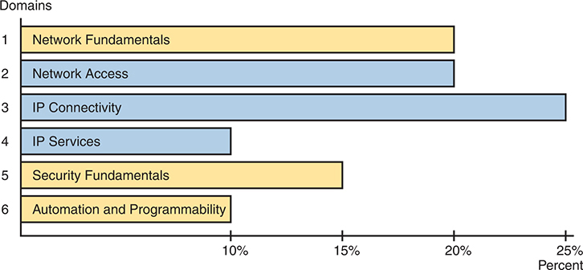

# Introduction

Do not skip the intro!

You are setting out on a journey to achieve your CCNA certification. For many, that step happens at the beginning of a new career path. For others, CCNA validates their knowledge and skills already learned on the job.

Regardless of your path, the journey takes some time and effort. I encourage you to spend some time in the Introduction to learn more about CCNA and the books so you can have the best experience preparing for CCNA! To that end, this introduction discusses these main points:

Cisco Certifications and the CCNA

Book Features

Book Elements (Reference)

About Getting Hands-on Skills

About IP Subnetting

### Cisco Certifications and the CCNA

Congratulations! If you're reading far enough to look at this book's Introduction, you've probably already decided to go for your Cisco certification. Cisco has been the dominant vendor in networking for decades. If you want to be taken seriously as a network engineer, building your Cisco skills using Cisco certifications makes perfect sense. Where to start? CCNA.

#### Cisco Certifications as of 2024

The changes Cisco made in 2020 consolidated the certification tracks from about ten tracks down to the five tracks shown in [Figure I-1](vol1_pref08.xhtml#ch00fig01). Cisco next made changes to various exams in 2023 and 2024; those changes updated the exams but maintained the same five tracks. The CCNA, CCNP, and CCIE certification levels progress through higher challenge levels, with CCNA as the foundation for all.

**Figure I-1** *Cisco CCNA, CCNP, and CCIE Certifications*

The following list gives a few details of the history of these certification tracks: They are

**CCNA – Cisco Certified Network Associate:** Cisco began CCNA with a single CCNA certification back in 1998. They later expanded CCNA to include ten different CCNA certifications about different technology areas. Cisco retired all the varieties of CCNA back in 2020, leaving us again with a single CCNA certification, now referred to as simply "CCNA."

**CCNP – Cisco Certified Network Professional:** Cisco followed the same progression with different CCNP certifications over time, starting with one in 1998. The big changes in 2020 consolidated the lineup to five CCNP certifications, all of which benefit from having knowledge of CCNA before moving on to CCNP.

**CCIE – Cisco Certified Internetwork Expert:** First introduced in 1993, these expert-level certifications require both a written exam plus a one-day practical exam with extensive hands-on lab challenges.

Beyond the CCNA, CCNP, and CCIE certifications, Cisco offers two other certification tracks, one for network automation and another for cybersecurity. The CCNA certification can be helpful as a foundation for those tracks as well. They are

**DevNet Certifications:** The DevNet Associate, DevNet Professional, and DevNet Expert certifications mirror the progression of CCNA/CCNP/CCIE, just without using those specific acronyms. The DevNet certifications focus on software development and APIs that matter to managing networks.

**CyberOps Certifications:** The CyberOps Associate and CyberOps Professional certifications mirror the progression of CCNA/CCNP. These security exams focus on security concepts, security monitoring, host-based analysis, network intrusion analysis, and security policies and procedures.

#### How to Get Your CCNA Certification

As you saw in [Figure I-1](vol1_pref08.xhtml#ch00fig01), all career certification paths now begin with CCNA. So how do you get the CCNA certification? Today, you have one and only one option to achieve CCNA certification:

Take and pass one exam: The Cisco 200-301 CCNA exam.

To take the 200-301 exam, or any Cisco exam, you will use the services of Pearson VUE. The process works something like this:

1. Establish a login at <https://vue.com/cisco> (or use your existing login).
2. Register for, schedule a time and place, and pay for the Cisco 200-301 exam, all from the VUE website.
3. Take the exam at the VUE testing center or from home with a video proctor watching to prevent cheating.
4. You will receive a notice of your score, and whether you passed, before you leave the testing center.

#### Content in the CCNA 200-301 Exam

We've all thought it, wondered, for almost every important test we ever took, and maybe even asked the teacher: "What's on the test?" For the CCNA exam, and for all Cisco certification exams, Cisco tells us.

Cisco publishes an exam blueprint for every Cisco exam, with the blueprint listing the exam topics for the exam. To find them, browse [www.cisco.com/go/certifications](http://www.cisco.com/go/certifications), look for the CCNA page, and navigate until you see the exam topics. And if you haven't already done so, create a bookmark folder for CCNA content in your web browser and bookmark a link to this page.

The exam blueprint organizes the exam topics into groups called domains. The document also tells us the percentage of points on the exam that come from each domain. For instance, every CCNA exam should score 25 percent of your points from the exam topics in the IP Connectivity domain. The exam does not tell you the domain associated with each question, but the percentages give us a better idea of the importance of the domains for the exam. [Figure I-2](vol1_pref08.xhtml#ch00fig02) shows the domains of the CCNA 200-301 Version 1.1 blueprint, the percentages, and the number of primary exam topics in each.

**Figure I-2** *CCNA 200-301 Domains and Percentage of Exam Score*

In the graph, the horizontal axis ranges from 0 to 25 percent, with each domain represented by a corresponding horizontal bar along the vertical axis. The domains and their respective percentages in the exam score are as follows: Network Fundamentals accounting for 20 percent, Network Access for 20 percent, I P Connectivity for 25 percent, I P Services for 10 percent, Security Fundamentals for 15 percent, and Automation and Programmability for 10 percent. Note that the values provided are approximate.

Within each domain, the exam topic document lists exam topics that follow two different styles of wording. The main exam topics use a verb in the phrase that tells you the level of mastery required; I call those primary exam topics. The exam topics document shows subtopics that I refer to as secondary exam topics. Those do not have a verb, but list more technology details (nouns), and assume the verb from the primary exam topic. For instance, the following excerpt from the exam topics document lists one primary exam topic with the *describe* verb, with more detail added by two secondary exam topics.

1.13 Describe switching concepts

1.13.a MAC learning and aging

1.13.b Frame switching

##### Exam Topic Verbs (Depth) and Nouns (Breadth)

Understanding an exam topic requires that you think about each exam topic wording, focusing on the verbs and nouns. The nouns identify the technical topics, such as LAN switching, IP routing, protocols like OSPF, and so on. The verbs in each primary exam topic inform us about the type and depth of knowledge and skill tested per the exam topics.

For example, consider the following primary exam topic:

**Describe** IPsec remote access and site-to-site VPNs

I'm sure you know what the word *describe* means in the normal use of the term. But for people who build exams, the verb has special meaning as to what the exam questions should and should not require of the test taker. For instance, you should be ready to describe whatever "IPsec remote access and site-to-site VPNs" are. But the exam should not ask you to perform higher performance verbs, like *analyze* or *configure*.

[Figure I-3](vol1_pref08.xhtml#ch00fig03) shows a pyramid with verbs found in Cisco exam blueprints. It shows the lower-skill verbs at the bottom and higher skills at the top. An exam topic with a lower verb should not be tested with questions from higher knowledge and skill levels. For instance, with the exam topic "describe…first hop redundancy protocols," you should not expect to need to configure, verify, or troubleshoot the feature.

**Figure I-3** *Cisco Exam Topic Verbs*

Knowing that, how should you study? Well, instead of a many-layer pyramid, think of it as two layers: Knowledge and Skill. When learning content whose exam topics use verbs from the lower three rows of the pyramid, study the same way no matter which of those verbs the exam topic uses. Learn the topic well. Be ready to describe it, explain it, and interpret the meaning. For content with exam topics with the verbs *configure* and *verify*, think of those as including the first level of knowledge, plus also requiring configuration and verification skills. Also, think about the common configuration mistakes so you can troubleshoot those mistakes.

##### Comparing the Exam and Exam Topics

Cisco tells us that the exam can include more technical topics than those listed as nouns in the exam topics. Cisco also tells us that the exam topics give us general guidance. Once you get into the content, you will understand what they mean: any noun listed in the exam topics has many related protocols, standards, features, concepts, or device commands that Cisco did not list in the exam topics. Let's explore that concept to give you some perspective.

First, to see what Cisco tells us about the exam versus the exam topics, return to cs.co/go/certifications or [cisco.com/go/ccna](http://cisco.com/go/ccna). Find the CCNA exam topics and open the PDF version (the text we need to consider is currently only in the PDF version). Open the PDF and spend 10–15 seconds scanning it.

Did you read the first two paragraphs, the ones before the list of exam topics? Or did you skip those and move straight to the long list of exam topics? Many people skip those paragraphs. One of those tells us much about the exam versus the exam topics, so I've copied it here, with emphasis added:

The following topics are ***general guidelines*** for the content likely to be included on the exam. However, ***other related topics may also appear on any specific delivery of the exam***. To better reflect the contents of the exam and for clarity purposes, the ***guidelines below may change at any time without notice***.

Together, the first two emphasized phrases tell us that the exam may go beyond the literal words in the exam topics. Let me give you a couple of examples. First, prerequisite knowledge must be inferred from the literal exam topics. For instance, consider this exam topic:

Configure and verify IPv4 addressing and subnetting

The skills to configure IPv4 addresses take only a few minutes to learn. Understanding what the numbers mean takes much longer. In fact, I'd say 95 percent of your work will be to understand the prerequisite knowledge—but the exam topics do not list those prerequisites, like understanding subnetting concepts, applying the subnet mask to an address, calculating the range of addresses in a subnet, and so on.

I develop the scope of the books with the preceding in mind. You will certainly read about all topics that appear in the exam topics. Consider that view a narrow interpretation of the exam topics. But you will also learn about terms, concepts, and product features not specifically mentioned in the exam topics, from my broad and deep interpretation of the exam topics, based on Cisco's approach to their exams. We try to predict what Cisco will include, starting from the exam topics. [Figure I-4](vol1_pref08.xhtml#ch00fig04) shows the idea.

**Figure I-4** *Scope Concept: Exam Versus Exam Topics*

Although we can build a book around the exam topics, we cannot predict every concept and command included in the actual CCNA exam. The general nature of the exam topics, the allowance of "other related topics," plus other factors, make predicting all exam content impossible. But we do promise to discuss 100 percent of the exam topic details and to diligently seek the right balance of a broad interpretation of those topics to make you well prepared for the exam.

##### How to Prepare for the Generalized Exam Topics

Given the possibility of topic areas not listed in the exam topics, how should you go about preparing for the CCNA exam? Let me give you a few suggestions.

1. Follow the suggestions in the upcoming section "[Your Study Plan](vol1_pref10.xhtml#pref10)" just before [Chapter 1](vol1_ch01.xhtml#ch01).
2. Practice hands-on Command Line Interface (CLI) skills. The later section of the Introduction titled "[About Building Hands-On Skills](vol1_pref08.xhtml#pref08lev1sec4)" discusses some ways to practice.
3. Pay close attention to troubleshooting topics in the book.
4. Practice all math-related skills, over time, until you master them.
5. Ensure you know all exam topic content as listed in the exam topics. Read the exam topics, consider your own literal interpretation, and when uncertain or confused, dig in and study further.
6. Trust that the book uses its broad interpretation of the exam topics to help you learn as much as possible that might be on the exam.

#### Types of Questions on the CCNA 200-301 Exam

You can expect the following kinds of questions on the exam; just be aware that the style of questions may change over time.

* Multiple-choice, single-answer
* Multiple-choice, multiple-answer
* Drag-and-drop
* Lab

For the multichoice questions, the exam software gives us a few important advantages:

* There is no penalty for guessing.
* Multichoice questions with a single correct answer require you to answer and allow only one answer.
* Multichoice questions with multiple correct answers tell you the number of correct answers and warn you if you have not selected that many answers.

For instance, if a question tells you there are two correct answers, and you select only one and then try to move to the next question, the app reminds you that you should choose another answer before moving on.

As for drag-and-drop, some questions use simple text blocks that you move from one list to another. However, you might see questions where you move items in a network diagram or some other creative use of drag-and-drop.

Finally, Cisco introduced lab questions (formally called performance-based questions) in 2022. Lab questions present you with a lab scenario with a lab pod of virtual routers and switches running in the background; you get console access to a few devices. Your job: find the missing or broken configuration and reconfigure the devices so that the lab scenario works. The best way to practice for these questions is to practice in the lab; more on that in the section titled "[About Building Hands-On Skills](vol1_pref08.xhtml#pref08lev1sec4)."

As an aside, prior Cisco exams had Sim questions instead of lab questions. Sim questions required the same from us: read the scenario and fix the configuration. However, Sim questions used simulated Cisco devices with limited command support, which frustrated some test takers. The lab questions use real Cisco operating systems running in a virtual environment, so they provide a much more realistic experience compared to old Sim questions.

### Book Features

This book includes many study features beyond the core explanations and examples in each chapter. This section acts as a reference to the various features in the book.

#### The CCNA Books: Volume 1 and Volume 2

The CCNA exam covers a large amount of content, and it does not fit in a single volume. As a result, Cisco Press has long published books for the CCNA exam as a two-book set. Volume 1 covers about half of the content, and Volume 2 covers the rest, as shown in [Figure I-5](vol1_pref08.xhtml#ch00fig05). To best use both books, start in Volume 1 and work through the book in order, and then do the same with Volume 2.

**Figure I-5** *Two Books for CCNA 200-301*

When you start each new chapter, review the list of exam topics that begins the chapter. The book does not follow the same order of exam topics in the blueprint, but instead follows a more effective order for learning the topics. For reference, look to [Appendix B](vol1_appb.xhtml#appb), "[Exam Topics Cross-Reference](vol1_appb.xhtml#appb)," in the back of the book. The appendix includes:

* A list of exam topics and the chapter(s) covering each topic
* A list of chapters and the exam topics covered in each chapter

##### Exam Blueprint Versions and Book Editions

Cisco made minor changes to the CCNA exam blueprint in 2024, the first change to the CCNA 200-301 exam since the year 2020. The much more important change (announced in 2023) had to do with the entire Cisco certification program about how Cisco announces and releases new exams and exam blueprints. Before 2023, when Cisco changed any CCNA or CCNP exam, they also changed the exam number, and the announcement was sudden. Those days are gone.

You should read and understand Cisco's long-term strategy for being more forthright about exam plans as detailed at [www.cisco.com/go/certroadmap](http://www.cisco.com/go/certroadmap). Summarizing some key points, when Cisco changes an exam in the future, Cisco will keep the same exam number. To identify the changes, they will use a major.minor version numbering plan for every exam blueprint. More importantly, Cisco tells us when they will consider changing CCNA each year, but we know when Cisco will announce changes and when the new exam will be released, within a few months' timing.

The exam blueprint version changes based on two determinations: 1) whether Cisco will change the exam that year at all, and 2) if so, whether Cisco considers the changes to be major or minor. For instance, Cisco considered making a change to CCNA during February–April 2023 but chose not to change it, announcing that fact in the May–July 2023 timeframe. In 2024, Cisco chose to make minor changes to the CCNA blueprint. As a result, the former CCNA blueprint version 1.0 (major version 1, minor version 0) changed to version 1.1, increasing the minor version by 1.

Looking forward, if the next three future CCNA blueprint changes are also minor, they would be blueprint versions 1.2, 1.3, and 1.4. However, if any of them are major, that version would move to the next major version (2.0), with subsequent minor version changes as 2.1, 2.2, and so on.

Cisco also tells us that each year, internally, Cisco considers what to do with CCNA in the February–April timeframe. They will announce their plans to us all between May–July, and they will release the new exam (if changes are being made) sometime in the six months or so following the announcement.

As for the publishing plans to support that new update cycle, you should read and monitor the publisher's web page at [www.ciscopress.com/newcerts](http://www.ciscopress.com/newcerts). Also, opt in for communications on that page so the publisher will email you about future plans and updates.

Summarizing a few key points about the publisher's plans, this book, the second edition, was written for version 1.1 of the CCNA 200-301 blueprint, but it should be the book used for CCNA for subsequent blueprint versions as well. During the life of this second edition book, Cisco may update the CCNA 200-301 exam blueprint a few times, while this book (plus the Volume 2 second edition book) may remain unchanged. New exam content may be made available as electronic downloads. At some point, a new edition will be appropriate. ([Figure I-6](vol1_pref08.xhtml#ch00fig06) shows one example of what might happen over time, with downloadable PDFs between editions.)

**Figure I-6** *Possible Progression of Book Editions, New Content Release, Versus Exams*

Note

I cannot stress enough: monitor both the Cisco Press and Cisco pages linked in the preceding paragraphs, and opt in for communications at those pages, to stay aware of any exam and publishing plans. Also, consider watching my blog ([www.certskills.com](http://www.certskills.com)), where I expect to post about changes.

When you finish the technology chapters in this book ([Chapters 1](vol1_ch01.xhtml#ch01)–[29](vol1_ch29.xhtml#ch29)), make sure to also read [Chapter 30](vol1_ch30.xhtml#ch30), "[Exam Updates](vol1_ch30.xhtml#ch30)." We post updated versions of that chapter online. We use that chapter to deliver small content updates to you as well as to inform you about future content updates. Make sure to read through that chapter and learn how to download the latest version of the chapter, discovering if new content has been posted after this book was published.

Also, just to reduce confusion about the book titles, note that the prior edition of this book is nearly identical to this book's title. Comparing the titles:

* *CCNA 200-301 Official Cert Guide, Volume 1* (the prior edition, published in 2019, for 200-301 exam blueprint version 1.0)
* *CCNA 200-301 Official Cert Guide, Volume 1*, Second Edition (this edition, published in 2024, for 200-301 exam blueprint version 1.1 and beyond)

##### Comparing This Edition to the Previous

This book replaces a similar book that applied to the former CCNA 200-301 exam blueprint 1.0. Some of you may buy this book but have already begun studying with the prior edition. The following list of major changes to this book versus the previous one may help you avoid rereading identical or similar content in this book.

**[Chapter 4](vol1_ch04.xhtml#ch04):** Added a short topic comparing Cisco switch operating systems. Also introduced the WebUI interface for Cisco routers and switches per an exam topic change.

**[Chapter 6](vol1_ch06.xhtml#ch06):** Explored the differences in the **transport input** configuration command based on device models and operating systems. Also showed how to configure the WebUI on a switch per an exam topic change.

**[Chapter 7](vol1_ch07.xhtml#ch07):** Revised and expanded sections about Ethernet autonegotiation concepts and auto-MDIX.

**[Chapter 8](vol1_ch08.xhtml#ch08):** Added a large closing section about troubleshooting VLANs and VLAN trunks.

**[Chapter 9](vol1_ch09.xhtml#ch09):** Removed EtherChannel load distribution concept details, and added concept details about BPDU Guard, BPDU filter, loop guard, and root guard.

**[Chapter 10](vol1_ch10.xhtml#ch10):** Expanded/revised the second half of the chapter (Layer 2 EtherChannels), and added a new middle section about verifying BPDU Guard, BPDU filter, loop guard, and root guard.

**[Chapter 12](vol1_ch12.xhtml#ch12):** Added a few pages comparing public IP networks and public CIDR blocks.

**[Chapter 15](vol1_ch15.xhtml#ch15):** Added an entire new chapter about subnetting design issues. The chapter was in the prior edition but as a PDF-only appendix.

**[Chapter 16](vol1_ch16.xhtml#ch16):** (Formerly [Chapter 15](vol1_ch15.xhtml#ch15)) Expanded the discussion of router interface autonegotiation and differences between IOS and IOS XE.

**[Chapter 17](vol1_ch17.xhtml#ch17):** (Formerly [Chapter 16](vol1_ch16.xhtml#ch16)) Added a small section discussing possible mistakes with the **ip address** interface subcommand.

**[Chapter 18](vol1_ch18.xhtml#ch18):** (Formerly [Chapter 17](vol1_ch17.xhtml#ch17)) Added two topics: SVI interface auto-state and the configuration of Ethernet switch ports in a router.

**[Chapter 19](vol1_ch19.xhtml#ch19):** (Formerly Volume 2, [Chapter 7](vol1_ch07.xhtml#ch07)) Moved the chapter to Volume 1 from Volume 2 and expanded the discussion of host commands.

**[Chapters 21](vol1_ch21.xhtml#ch21)–[24](vol1_ch24.xhtml#ch24):** (Formerly [Chapters 19](vol1_ch19.xhtml#ch19)–[21](vol1_ch21.xhtml#ch21)) [Chapters 21](vol1_ch21.xhtml#ch21)–[24](vol1_ch24.xhtml#ch24) reorganize and expand the OSPF topics. [Chapter 24](vol1_ch24.xhtml#ch24) closes with a revised section about route selection.

**[Chapter 28](vol1_ch28.xhtml#ch28):** This new chapter contains the final topic of former [Chapter 25](vol1_ch25.xhtml#ch25) (IPv6 NDP), unchanged. The second half of the chapter has new content about host IPv6 commands and IPv6 address attributes.

If you find the preceding information useful, consider looking in two other places that allow us to provide ongoing updates and to answer questions. First, I expect to post blog posts about the new CCNA exam changes, as always, at my blog ([www.certskills.com](http://www.certskills.com)). Look there for posts in the News section (click the General menu item and then News), for posts made around the time the new exams release.

Second, look to the companion website for this book for details about future exam revisions and publishing plans. The companion website gives the publisher a place to list details about changes moving forward. See this Introduction's later section titled "[The Companion Website for Online Content](vol1_pref08.xhtml#pref08lev2sec8)" for the instructions for finding the site.

#### Chapter Features

Beginning to study CCNA can be overwhelming at first due to the volume. The best way to overcome that reaction requires a change in mindset: *treat each chapter as a separate study task*. Breaking your study into manageable tasks helps a lot.

Each chapter of this book is a self-contained short course about one small topic area, organized for reading and study. I create chapters so they average about 20 pages to cover the technology so that no one chapter takes too long to complete. Each chapter breaks down as follows:

**"Do I Know This Already?" quizzes:** Each chapter begins with a pre-chapter quiz so you can self-assess how much you know coming into the chapter.

**Foundation Topics:** This is the heading for the core content section of the chapter, with average length of 20 pages.

**Chapter Review:** This section includes a list of study tasks useful to help you remember concepts, connect ideas, and practice skills-based content in the chapter.

Do not read the "Foundation Topics" section of chapter after chapter without pausing to review and study. Each "Chapter Review" section uses a variety of other book features to help you study and internalize that chapter's content, including the following:

* **Review Key Topics:** All the content in the books matters, but some matters more. Cisco Press certification guides use a Key Topic icon next to those items in the "Foundation Topics" section. The "Chapter Review" section lists the key topics in a table. You can scan the chapter to review them or review the Key Topics more conveniently using the companion website.
* **Complete Tables from Memory:** We convert some tables in the book to interactive study tables called memory tables. You access memory tables from the companion website. Memory tables repeat the table, but with parts of the table removed. You can then fill in the table to exercise your memory and click to check your work.
* **Key Terms You Should Know:** The "Chapter Review" section lists the key terminology from the chapter. For a manual process with the book, think about each term and use the Glossary to cross-check your own mental definitions. Alternately, review the key terms with the "Key Terms Flashcards" app on the companion website.
* **Labs:** You should practice hands-on skills for any exam topics with the *configure* and *verify* verbs. The upcoming section titled "[About Building Hands-On Skills](vol1_pref08.xhtml#pref08lev1sec4)" discusses your lab options. Also, the Chapter and Part Reviews refer you to lab exercises specific to the chapter or part.
* **Command References:** Some book chapters discuss the configure and verify exam topics, so they list various router and switch commands. The "Chapter Review" section of those chapters includes command reference tables, useful both for reference and for study. Just cover one column of the table and see how much you can remember and complete mentally.
* **Review DIKTA Questions:** Even if you used the DIKTA questions to begin the chapter, re-answering those questions can prove a useful way to review facts. By design, I do not mention the DIKTA questions in the "Chapter Review" sections but do suggest using them again for all chapters in a part during Part Review. Use the Pearson Test Prep (PTP) web app to easily use those questions any time you have a few minutes, a device, and Internet access.
* **Subnetting Exercises:** Several chapters ask you to perform some math processes related to either IPv4 or IPv6 addressing. The "Chapter Review" section asks you to do additional practice problems, where applicable. The problems can be found in Appendices D through I, in PDF form, on the companion website, along with those same exercises as interactive web apps.

#### Part Features

Your second mindset change: Use the book parts as major milestones in your study journey. Each part groups a small number of related chapters together. Take the time at the end of each part to review all topics in the part, effectively rewarding yourself with a chance to deepen your knowledge and internalize more of the content before moving to the next part. [Figure I-7](vol1_pref08.xhtml#ch00fig07) shows the concept.

**Figure I-7** *Part Review: The Second Review of Most Content*

The Part Review element at the end of each part suggests review and study activities. Spaced reviews—that is, reviewing content several times over the course of your study—help improve retention. Using the Chapter and Part Review process, the Part Review serves as your second review of the content in each chapter. The Part Review repeats some Chapter Review activities and offers some new ones, including a reminder to use practice questions set aside specifically for Part Review.

#### The Companion Website for Online Content

Some Chapter and Part Review tasks can be done from the book. However, several of them work better as an interactive online tool. For instance, you can take a "Do I Know This Already?" quiz by reading the pages of the book, but you can also use the PTP testing software. As another example, when you want to review the key terms from a chapter, you can find all those in electronic flashcards.

This book's companion website hosts all the electronic components of the book. The companion website gives you a big advantage: you can do most of your Chapter and Part Review work from anywhere using the interactive tools on the site. The advantages include

* **Easier to use:** Instead of having to print out copies of the appendices and do the work on paper, you can use these new apps, which provide you with an easy-to-use, interactive experience that you can easily run over and over.
* **Convenient:** When you have a spare 5–10 minutes, go to the book's website and review content from one of your recently finished chapters.
* **Good break from reading:** Sometimes looking at a static page after reading a chapter lets your mind wander. Breaking up your reading with some review from the keyboard can help keep you focused on the activity.

The interactive Chapter Review elements should improve your chances of passing as well. Our in-depth reader surveys over the years show that those who do the Chapter and Part Reviews learn more. Those who use the interactive review elements tend to do the review tasks more often. So, take advantage of the tools and maybe you will be more successful as well. [Table I-1](vol1_pref08.xhtml#ch101tab01) summarizes these interactive applications and the traditional book features that cover the same content.

**Table I-1** *Book Features with Both Traditional and App Options*

| Feature | Traditional | App |
| --- | --- | --- |
| Key Topic | The "Chapter Review" section lists the key topics. To review, flip pages in the chapter. | Key Topics Table app with links to view each key topic |
| Config Checklist | This list of steps, in text, describes how to configure a feature. | Config Checklist app, where you complete the checklist by adding commands |
| Key Terms | Terms are listed in each "Chapter Review" section; review using the end-of-book Glossary. | Key Terms Flash Cards app |
| Appendices Subnetting Practice | Appendices D–I provide static text practice problems and answers in the PDF appendices. | A variety of apps, one per problem type, in the "Memory Tables and Practice Exercises" section |
| In-chapter Subnetting practice | Look at the problems in the chapter and refer to the answer tables at the end of the chapter. | App that offers a fill-in-the-blank answer space and grades your answer |

The companion website also includes links to download, navigate, or stream for these types of content:

* Pearson Sim Lite Desktop App
* Pearson Test Prep (PTP) Desktop App
* Pearson Test Prep (PTP) Web App
* Videos

#### How to Access the Companion Website

To access the companion website, which gives you access to the electronic content with this book, start by establishing a login at [www.ciscopress.com](http://www.ciscopress.com) and register your book. To do so, simply go to [www.ciscopress.com/register](http://www.ciscopress.com/register) and enter the ISBN of the print book: 9780138229634. After you have registered your book, go to your account page and click the **Registered Products** tab. From there, click the **Access Bonus Content** link to get access to the book's companion website.

Note that if you buy the *Premium Edition eBook and Practice Test* version of this book from Cisco Press, your book will automatically be registered on your account page. Simply go to your account page, click the **Registered Products** tab, and select **Access Bonus Content** to access the book's companion website.

#### How to Access the Pearson Test Prep (PTP) App

You have two options for installing and using the Pearson Test Prep application: a web app and a desktop app. To use the Pearson Test Prep application, start by finding the registration code that comes with the book. You can find the code in these ways:

* You can get your access code by registering the print ISBN 9780138229634 on [ciscopress.com/register](http://ciscopress.com/register). Make sure to use the print book ISBN, regardless of whether you purchased an eBook or the print book. After you register the book, your access code will be populated on your account page under the Registered Products tab. Instructions for how to redeem the code are available on the book's companion website by clicking the Access Bonus Content link.
* If you purchase the Premium Edition eBook and Practice Test directly from the Cisco Press website, the code will be populated on your account page after purchase. Just log in at [ciscopress.com](http://ciscopress.com), click Account to see details of your account, and click the digital purchases tab.

Note

After you register your book, your code can always be found in your account under the Registered Products tab.

Once you have the access code, to find instructions about both the PTP web app and the desktop app, follow these steps:

**Step 1.** Open this book's companion website as shown earlier in this Introduction under the heading, "[How to Access the Companion Website](vol1_pref08.xhtml#pref08lev2sec9)."

**Step 2.** Click the **Practice Exams** button.

**Step 3.** Follow the instructions listed there for both installing the desktop app and using the web app.

Note that if you want to use the web app only at this point, just navigate to [pearsontestprep.com](http://pearsontestprep.com), log in using the same credentials used to register your book or purchase the Premium Edition, and register this book's practice tests using the registration code you just found. The process should take only a couple of minutes.

#### Feature Reference

The following list provides an easy reference to get the basic idea behind each book feature:

* **Practice exam:** The book gives you the rights to the Pearson Test Prep (PTP) testing software, available as a web app and a desktop app. Use the access code on a piece of cardboard in the sleeve in the back of the book, and use the companion website to download the desktop app or navigate to the web app (or just go to [www.pearsontestprep.com](http://www.pearsontestprep.com)).
* **eBook:** Pearson offers an eBook version of this book that includes extra practice tests as compared to the print book. The product includes two versions of the eBook: PDF (for reading on your computer) and EPUB (for reading on your tablet, mobile device, or Kindle, Nook, or other e-reader). It also includes additional practice test questions and enhanced practice test features, including links from each question to the specific heading in the eBook file.
* **Mentoring videos:** The companion website also includes a number of videos about other topics as mentioned in individual chapters. Some of the videos explain common mistakes made with CCNA topics, whereas others provide sample CCNA questions with explanations.
* **Subnetting videos:** The companion website contains a series of videos that show you how to calculate various facts about IP addressing and subnetting (in particular, using the shortcuts described in this book).
* **Subnetting practice appendices/web apps:** The companion website contains appendices with a set of subnetting practice problems and answers. This is a great resource to practice building subnetting skills. You can use these same practice problems with applications from the "Memory Tables and Practice Exercises" section of the companion website.
* **CCNA 200-301 Network Simulator Lite:** This lite version of the best-selling CCNA Network Simulator from Pearson provides you with a means, right now, to experience the Cisco command-line interface (CLI). No need to go buy real gear or buy a full simulator to start learning the CLI. Just install it from the companion website.
* **CCNA Simulator:** If you are looking for more hands-on practice, you might want to consider purchasing the CCNA Network Simulator. You can purchase a copy of this software from Pearson at <http://pearsonitcertification.com/networksimulator> or other retail outlets. To help you with your studies, Pearson has created a mapping guide that maps each of the labs in the simulator to the specific sections in each volume of the CCNA Cert Guide. You can get this mapping guide free on the Extras tab on the book product page: [www.ciscopress.com/title/9780138229634](http://www.ciscopress.com/title/9780138229634).
* **Author's websites:** The author maintains a blog site that has a large number of free lab exercises about CCNA content, additional sample questions, and other exercises. Additionally, the site indexes all content so you can study based on the book chapters and parts. To find it, navigate to [www.certskills.com](http://www.certskills.com). Additionally, look for CCNA activities and lectures at his YouTube channel ([www.youtube.com/@networkupskill](http://www.youtube.com/@networkupskill)).

### Book Organization, Chapters, and Appendices

This book contains 29 chapters about CCNA topics organized into seven parts. The core chapters cover the following topics:

* **[Part I](vol1_part01.xhtml#part01): [Introduction to Networking](vol1_part01.xhtml#part01)**

  * **[Chapter 1](vol1_ch01.xhtml#ch01), "[Introduction to TCP/IP Networking](vol1_ch01.xhtml#ch01),"** introduces the central ideas and terms used by TCP/IP and explains the TCP/IP networking model.
  * **[Chapter 2](vol1_ch02.xhtml#ch02), "[Fundamentals of Ethernet LANs](vol1_ch02.xhtml#ch02),"** introduces the concepts and terms used when building Ethernet LANs.
  * **[Chapter 3](vol1_ch03.xhtml#ch03), "[Fundamentals of WANs and IP Routing](vol1_ch03.xhtml#ch03),"** covers the basics of the data-link layer for WANs in the context of IP routing but emphasizes the main network layer protocol for TCP/IP. This chapter introduces the basics of IPv4, including IPv4 addressing and routing.
* **[Part II](vol1_part02.xhtml#part02): [Implementing Ethernet LANs](vol1_part02.xhtml#part02)**

  * **[Chapter 4](vol1_ch04.xhtml#ch04), "[Using the Command-Line Interface](vol1_ch04.xhtml#ch04),"** explains how to access the text-based user interface of Cisco Catalyst LAN switches.
  * **[Chapter 5](vol1_ch05.xhtml#ch05), "[Analyzing Ethernet LAN Switching](vol1_ch05.xhtml#ch05),"** shows how to use the Cisco CLI to verify the current status of an Ethernet LAN and how it switches Ethernet frames.
  * **[Chapter 6](vol1_ch06.xhtml#ch06), "[Configuring Basic Switch Management](vol1_ch06.xhtml#ch06),"** explains how to configure Cisco switches for basic management features, such as remote access using Telnet and SSH.
  * **[Chapter 7](vol1_ch07.xhtml#ch07), "[Configuring and Verifying Switch Interfaces](vol1_ch07.xhtml#ch07),"** shows how to configure a variety of switch features that apply to interfaces, including duplex/speed.
* **[Part III](vol1_part03.xhtml#part03): [Implementing VLANs and STP](vol1_part03.xhtml#part03)**

  * **[Chapter 8](vol1_ch08.xhtml#ch08), "[Implementing Ethernet Virtual LANs](vol1_ch08.xhtml#ch08),"** explains the concepts and configuration surrounding virtual LANs, including VLAN trunking.
  * **[Chapter 9](vol1_ch09.xhtml#ch09), "[Spanning Tree Protocol Concepts](vol1_ch09.xhtml#ch09),"** discusses the concepts behind IEEE Spanning Tree Protocol (STP), including Rapid STP (RSTP) and how they make some switch interfaces block frames to prevent frames from looping continuously around a redundant switched LAN.
  * **[Chapter 10](vol1_ch10.xhtml#ch10), "[RSTP and EtherChannel Configuration](vol1_ch10.xhtml#ch10),"** shows how to configure and verify RSTP and Layer 2 EtherChannels on Cisco switches.
* **[Part IV](vol1_part04.xhtml#part04): [IPv4 Addressing](vol1_part04.xhtml#part04)**

  * **[Chapter 11](vol1_ch11.xhtml#ch11), "[Perspectives on IPv4 Subnetting](vol1_ch11.xhtml#ch11),"** walks you through the entire concept of subnetting, from starting with a Class A, B, or C network to a completed subnetting design as implemented in an enterprise IPv4 network.
  * **[Chapter 12](vol1_ch12.xhtml#ch12), "[Analyzing Classful IPv4 Networks](vol1_ch12.xhtml#ch12),"** explains how IPv4 addresses originally fell into several classes, with unicast IP addresses being in Class A, B, and C. This chapter explores all things related to address classes and the IP network concept created by those classes.
  * **[Chapter 13](vol1_ch13.xhtml#ch13), "[Analyzing Subnet Masks](vol1_ch13.xhtml#ch13),"** shows how an engineer can analyze the key facts about a subnetting design based on the subnet mask. This chapter shows how to look at the mask and IP network to determine the size of each subnet and the number of subnets.
  * **[Chapter 14](vol1_ch14.xhtml#ch14), "[Analyzing Existing Subnets](vol1_ch14.xhtml#ch14),"** describes how most troubleshooting of IP connectivity problems starts with an IP address and mask. This chapter shows how to take those two facts and find key facts about the IP subnet in which that host resides.
  * **[Chapter 15](vol1_ch15.xhtml#ch15), "[Subnet Design](vol1_ch15.xhtml#ch15),"** discusses IPv4 subnetting from the perspective of creating a list of useful subnets, based on a subnet mask, from one Class A, B, or C network.
* **[Part V](vol1_part05.xhtml#part05): [IPv4 Routing](vol1_part05.xhtml#part05)**

  * **[Chapter 16](vol1_ch16.xhtml#ch16), "[Operating Cisco Routers](vol1_ch16.xhtml#ch16),"** is like [Chapter 8](vol1_ch08.xhtml#ch08), focusing on basic device management, but it focuses on routers instead of switches.
  * **[Chapter 17](vol1_ch17.xhtml#ch17), "[Configuring IPv4 Addresses and Static Routes](vol1_ch17.xhtml#ch17),"** discusses how to add IPv4 address configuration to router interfaces and how to configure static IPv4 routes.
  * **[Chapter 18](vol1_ch18.xhtml#ch18), "[IP Routing in the LAN](vol1_ch18.xhtml#ch18),"** shows to a configuration and troubleshooting depth different methods to route between VLANs, including Router-on-a-Stick (ROAS), Layer 3 switching with SVIs, Layer 3 switching with routed ports, and using Layer 3 EtherChannels.
  * **[Chapter 19](vol1_ch19.xhtml#ch19), "[IP Addressing on Hosts](vol1_ch19.xhtml#ch19),"** discusses how IP hosts receive their IPv4 settings from either static configuration or using DHCP.
  * **[Chapter 20](vol1_ch20.xhtml#ch20), "[Troubleshooting IPv4 Routing](vol1_ch20.xhtml#ch20),"** focuses on how to use two key troubleshooting tools to find routing problems: the **ping** and **traceroute** commands.
* **[Part VI](vol1_part06.xhtml#part06): [OSPF](vol1_part06.xhtml#part06)**

  * **[Chapter 21](vol1_ch21.xhtml#ch21), "[Understanding OSPF Concepts](vol1_ch21.xhtml#ch21),"** introduces the fundamental operation of the Open Shortest Path First (OSPF) protocol, focusing on link state fundamentals, neighbor relationships, flooding link state data, and calculating routes based on the lowest cost metric.
  * **[Chapter 22](vol1_ch22.xhtml#ch22), "[Implementing Basic OSPF Features](vol1_ch22.xhtml#ch22),"** shows the most basic OSPF configuration using two methods: OSPF router subcommands and interface subcommands.
  * **[Chapter 23](vol1_ch23.xhtml#ch23), "[Implementing Optional OSPF Features](vol1_ch23.xhtml#ch23),"** discusses a wide variety of OSPF configuration options.
  * **[Chapter 24](vol1_ch24.xhtml#ch24), "[OSPF Neighbors and Route Selection](vol1_ch24.xhtml#ch24),"** examines the conditions that must be true before two routers will succeed in becoming OSPF neighbors. It also takes a closer look at the choices a router makes when choosing between competing routes and how the router uses those routes.
* **[Part VII](vol1_part07.xhtml#part07): [IP Version 6](vol1_part07.xhtml#part07)**

  * **[Chapter 25](vol1_ch25.xhtml#ch25), "[Fundamentals of IP Version 6](vol1_ch25.xhtml#ch25),"** discusses the most basic concepts of IP version 6, focusing on the rules for writing and interpreting IPv6 addresses.
  * **[Chapter 26](vol1_ch26.xhtml#ch26), "[IPv6 Addressing and Subnetting](vol1_ch26.xhtml#ch26),"** works through the two branches of unicast IPv6 addresses—global unicast addresses and unique local addresses—that act somewhat like IPv4 public and private addresses, respectively.
  * **[Chapter 27](vol1_ch27.xhtml#ch27), "[Implementing IPv6 Addressing on Routers](vol1_ch27.xhtml#ch27),"** shows how to configure IPv6 routing and addresses on routers, while discussing a variety of special IPv6 addresses.
  * **[Chapter 28](vol1_ch28.xhtml#ch28), "[Implementing IPv6 Addressing on Hosts](vol1_ch28.xhtml#ch28),"** discusses how IPv6 hosts receive their IPv6 settings from either static configuration, DHCP, or SLAAC. It also discusses the NDP protocol suite.
  * **[Chapter 29](vol1_ch29.xhtml#ch29), "[Implementing IPv6 Routing](vol1_ch29.xhtml#ch29),"** shows how to add static routes to an IPv6 router's routing table.
* **[Part VIII](vol1_part08.xhtml#part08): [Exam Updates](vol1_part08.xhtml#part08)**

  * **[Chapter 30](vol1_ch30.xhtml#ch30), "[*CCNA 200-301 Official Cert Guide, Volume 1*, Second Edition, Exam Updates](vol1_ch30.xhtml#ch30),"** has two purposes. First, the author will update this appendix with new content mid-edition as needed. The appendix details the download instructions. Additionally, it discusses Cisco's open approach to exam revision and release, called the Cisco Certification Roadmap.
* **[Part IX](vol1_part09.xhtml#part09): [Appendixes](vol1_part09.xhtml#part09)**

  * **[Appendix A](vol1_appa.xhtml#appa), "[Numeric Reference Tables](vol1_appa.xhtml#appa),"** lists several tables of numeric information, including a binary-to-decimal conversion table and a list of powers of 2.
  * **[Appendix B](vol1_appb.xhtml#appb), "[Exam Topics Cross-Reference](vol1_appb.xhtml#appb),"** provides some tables to help you find where each exam objective is covered in the book.
  * **[Appendix C](vol1_appc.xhtml#appc), "[Answers to the ‘Do I Know This Already?' Quizzes](vol1_appc.xhtml#appc),"** includes the explanations to all the "Do I Know This Already" quizzes.
  * The [**Glossary**](vol1_gloss.xhtml#gloss) contains definitions for all the terms listed in the "Key Terms You Should Know" sections at the conclusion of the chapters.
* **Online Appendixes**
* **Practice Appendices**

  The following appendixes are available in digital format from the companion website. These appendixes provide additional practice for several networking processes that use some math.

  * **[Appendix D](vol1_appd.xhtml#appd), "[Practice for Chapter 12: Analyzing Classful IPv4 Networks](vol1_appd.xhtml#appd)"**
  * **[Appendix E](vol1_appe.xhtml#appe), "[Practice for Chapter 13: Analyzing Subnet Masks](vol1_appe.xhtml#appe)"**
  * **[Appendix F](vol1_appf.xhtml#appf), "[Practice for Chapter 14: Analyzing Existing Subnets](vol1_appf.xhtml#appf)"**
  * **[Appendix G](vol1_appg.xhtml#appg), "[Practice for Chapter 15: Subnet Design](vol1_appg.xhtml#appg)"**
  * **[Appendix H](vol1_apph.xhtml#apph), "[Practice for Chapter 25: Fundamentals of IP Version 6](vol1_apph.xhtml#apph)"**
  * **[Appendix I](vol1_appi.xhtml#appi), "[Practice for Chapter 27: Implementing IPv6 Addressing on Routers](vol1_appi.xhtml#appi)"**
* **Miscellaneous Appendices**

  * **[Appendix J](vol1_appj.xhtml#appj), "[Study Planner](vol1_appj.xhtml#appj),"** is a spreadsheet with major study milestones, where you can track your progress through your study.
* **Content from Previous Editions**

  From edition to edition, some readers have asked that we keep some select chapters with the book. Keeping content that Cisco removed from the exam, but that may still be useful, can help the average reader as well as instructors who use the materials to teach courses with this book. The following appendices hold this edition's content from previous editions:

  * **[Appendix K](vol1_appk.xhtml#appk), "[Topics from Previous Editions](vol1_appk.xhtml#appk),"** is a collection of small topics from prior editions. None of the topics justify a complete appendix by themselves, so we collect the small topics into this single appendix.
  * **[Appendix L](vol1_appl.xhtml#appl), "[LAN Troubleshooting](vol1_appl.xhtml#appl),"** examines the most common LAN switching issues and how to discover those issues when troubleshooting a network.
  * **[Appendix M](vol1_appm.xhtml#appm), "[Variable-Length Subnet Masks](vol1_appm.xhtml#appm),"** moves away from the assumption of one subnet mask per network to multiple subnet masks per network, which makes subnetting math and processes much more challenging. This appendix explains those challenges.

### About Building Hands-On Skills

To do well on the CCNA exam, you need skills in using Cisco routers and switches, specifically the Cisco command-line interface (CLI). The Cisco CLI is a text-based command-and-response user interface; you type a command, and the device (a router or switch) displays messages in response.

For the exam, CLI skills help you in a couple of ways. First, lab questions require CLI skills. Each lab question can take 7–8 minutes if you know the topic, so poor CLI skills can cost several minutes per lab question. Additionally, any question type can ask about CLI commands, so the more comfortable you are remembering commands, parameters, and what they do, the more points you will pick up on the exam.

This next section walks through the options of what is included in the book, with a brief description of lab options outside the book.

#### Config Lab Exercises

I created some lab exercises called Config Labs and put them on my blog. Each Config Lab details a straightforward lab exercise. It begins with a scenario, a topology, and existing configuration. You choose the configuration to add to each device to meet the goals of the scenario.

To make the labs accessible to all, the blog has no login requirements and no cost. You can do each lab just by viewing the page, reading, and writing your answer on paper or typing it in an editor. Optionally, you can attempt most labs in the Cisco Packet Tracer Simulator. In either case, the Config Lab page lists the intended answer, so you can check your work.

To find the Config Labs, first go to [www.certskills.com](http://www.certskills.com). Navigate from the top menus for "Labs." Alternatively, use the advanced search link, from which you can combine search parameters to choose a book chapter or part, and to search for Config Lab posts.

Note that the blog organizes these Config Lab posts by book chapter, so you can easily use them at both Chapter Review and Part Review. See the "[Your Study Plan](vol1_pref10.xhtml#pref10)" element that follows the Introduction for more details about those review sections.

#### A Quick Start with Pearson Network Simulator Lite

The decision of how to get hands-on skills can be a little scary at first. The good news: You have a free and simple first step to experience the CLI: install a desktop simulator app called Pearson Network Simulator Lite (or NetSim Lite) that comes with this book.

Pearson builds a CCNA Simulator app designed to help you learn most of the CCNA configure and verify exam topics. They also make a free lite version of the Simulator, included with this book. The lite version gives you the means to experience the Cisco CLI just after a 5–10-minute installation process. No need to go buy real gear or buy a full simulator to start learning the CLI. Just install the Sim Lite from the companion website.

This latest version of NetSim Lite includes labs associated with [Part II](vol1_part02.xhtml#part02) of this book, plus a few more from [Part III](vol1_part03.xhtml#part03). ([Part II](vol1_part02.xhtml#part02) is the first book part that includes any CLI commands.) So, make sure to use the NetSim Lite to learn the basics of the CLI to get a good start.

Of course, one reason that you get access to the NetSim Lite is that the publisher hopes you will buy the full product. However, even if you do not use the full product, you can still learn from the labs that come with NetSim Lite while deciding about what options to pursue.

#### The Pearson Network Simulator

The Config Labs and the Pearson Network Simulator Lite both fill specific needs, and they both come with the book. However, you need more than those two tools.

The single best option for lab work to do along with this book is the paid version of the Pearson Network Simulator. This simulator product simulates Cisco routers and switches so that you can learn for CCNA certification. But more importantly, it focuses on learning for the exam by providing a large number of useful lab exercises. Reader surveys tell us that those people who use the Simulator along with the book love the learning process and rave about how the book and Simulator work well together.

Of course, you need to make a decision for yourself and consider all the options. Thankfully, you can get a great idea of how the full Simulator product works by using the Pearson Network Simulator Lite product included with the book. Both have the same base code, same user interface, and same types of labs. Try the Lite version to decide if you want to buy the full product.

On a practical note, when you want to do labs when reading a chapter or doing Part Review, the Simulator organizes the labs to match the book. Just look for the Sort by Chapter tab in the Simulator's user interface.

At the time this book was published, Pearson had no plan to update its CCNA Simulator product to a new version, as the current edition covers the latest exam topics. A software update will be issued that maps the labs to the organization of the new Cert Guide chapter structure by the summer of 2024.

#### More Lab Options

Many other lab options exist. For instance, you can use real Cisco routers and switches. You can buy them, new or used, or borrow them at work. For example, you can buy routers and switches that are useful for CCNA learning but are two or three product generations old. You can also find sites from which you can rent time on real devices or virtual devices.

Cisco also makes a free simulator that works very well as a learning tool: Cisco Packet Tracer. Unlike the Pearson Network Simulator, it does not include lab exercises that direct you as to how to go about learning each topic. However, you can usually find lab exercises that rely on Packet Tracer, like the Config Labs at my blog. If interested in more information about Packet Tracer, check out [www.certskills.com/ptinstall](http://www.certskills.com/ptinstall).

Cisco offers a virtualization product that lets you run router and switch operating system (OS) images in a virtual environment on your PC. This tool, the Cisco Modeling Labs–Personal Edition (CML PE), lets you create a lab topology, start the operating system for each device, and connect to the CLI of real router and switch OS images. There is a fee, and you may need a PC hardware upgrade to use it effectively. Check out [www.cisco.com/go/cml](http://www.cisco.com/go/cml) for more information, and inquire for more information at the Cisco Learning Network's CML community ([learningnetwork.cisco.com](http://learningnetwork.cisco.com)).

The next two options work somewhat like CML PE, but with free software but no Cisco Operating Systems supplied. GNS3 ([gns3.com](http://gns3.com)) and EVE-NG (eve-ng.net) support creating topologies of virtual routers and switches that run real Cisco operating systems. Both have free options. However, both require that you provide the OS images. Also, as with CML PE, you may need to buy a small server or at least upgrade your personal computer to run more than a few routers and switches in a lab topology.

This book does not tell you what option to use, but you should plan on getting some hands-on practice somehow. For people starting with CCNA, many use some simulator like Pearson Sim Lite and the free Cisco Packet Tracer simulator. If you go far in your Cisco certification journey, you will likely try at least one of the virtualization options and also use real gear. The important thing to know is that most people need to practice using the Cisco CLI to be ready to pass these exams.

### About IP Subnetting

IP addressing and subnetting skills remain as one of the top five most important topics for real networking jobs and for the CCNA exam. This book devotes [Part IV](vol1_part04.xhtml#part04) to the topic, with several practice problem appendices to match. You can learn all you need for CCNA from those in-book chapters, and you can practice with the appendices. You can even use the interactive versions of the appendices on the companion website.

Because IP subnetting is so important, I created a video course called "IP Subnetting from Beginning to Mastery LiveLessons." You can buy the course outright from Cisco Press or access the course at O'Reilly Learning ([learning.oreilly.com](http://learning.oreilly.com)). This video course teaches IPv4 subnetting from start to finish. The course includes instruction on all aspects of IPv4 subnetting, many examples, and close to 100 video practice exercises.

However, to be clear, you do not need to buy the subnetting course; the book has all you need to learn subnetting well. But if you prefer to use the IP Subnetting video course, you do not have to use the course and read the chapters in this book's [Part IV](vol1_part04.xhtml#part04). Instead, use one of these plans if you get the video course:

* Learn from the first 19 lessons in the course, which cover the same content as [Part IV](vol1_part04.xhtml#part04) of this book—and again ignore the chapters in [Part IV](vol1_part04.xhtml#part04).
* Study primarily from the book chapters and supplement your reading with the video course. Because the course teaches the topics in a different order, use the information in [Table I-2](vol1_pref08.xhtml#ch101tab02) to decide what video course lessons to use.

**Table I-2** *Using the IP Subnetting Video Course Instead of Volume 1, [Part IV](vol1_part04.xhtml#part04)*

| Volume 1 Chapter | Video Course Lessons |
| --- | --- |
| 11 | 1–3, 10 |
| 12 | 11, 12 |
| 13 | 8, 9 |
| 14 | 4–7 |
| 15 | 13–19 |

### For More Information

If you have any comments about the book, submit them via [www.ciscopress.com](http://www.ciscopress.com). Just go to the website, select **Contact Us**, and type your message.

Cisco might make changes that affect the CCNA certification from time to time. You should always check [www.cisco.com/go/ccna](http://www.cisco.com/go/ccna) for the latest details.

*CCNA 200-301 Official Cert Guide*, *Volume 1*, Second Edition, helps you attain CCNA certification. This is the CCNA certification book from the only Cisco-authorized publisher. We at Cisco Press believe that this book certainly can help you achieve CCNA certification, but the real work is up to you! I trust that your time will be well spent.