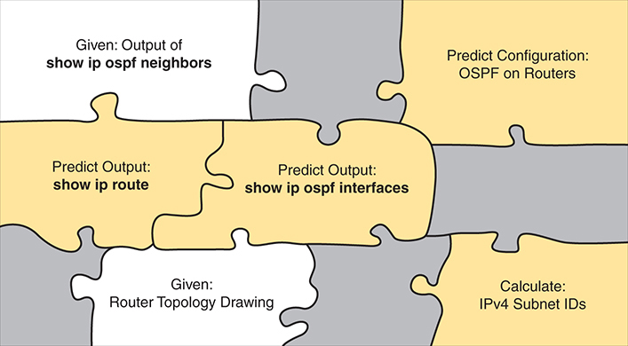
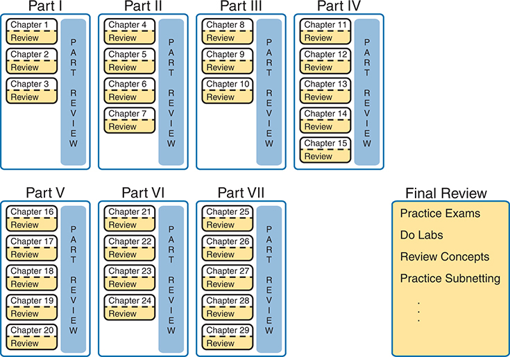
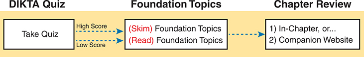
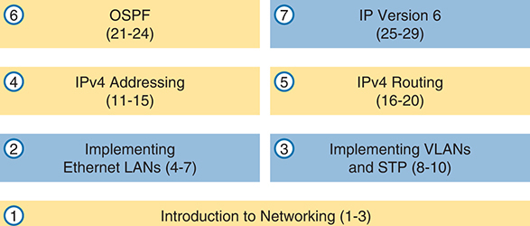
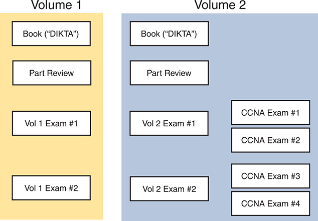
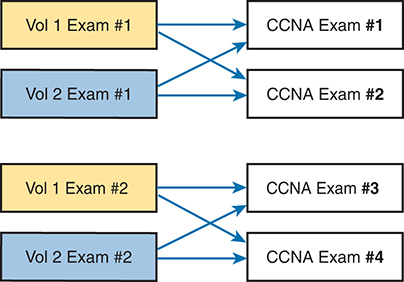
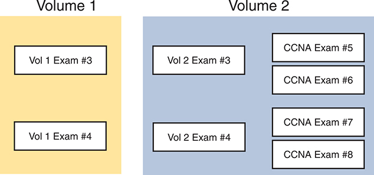
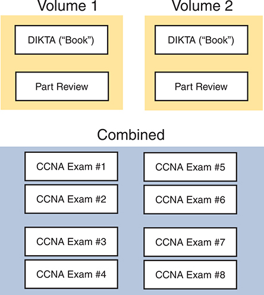

# Your Study Plan

You just got this book. You have probably already read (or quickly skimmed) the Introduction. You are probably now wondering whether to start reading here or skip ahead to [Chapter 1](vol1_ch01.xhtml#ch01), "[Introduction to TCP/IP Networking](vol1_ch01.xhtml#ch01)."

Stop to read this section about how to create your own study plan for the CCNA 200-301 exam. Your study will go much better if you take time (maybe 15 minutes) to think about a few key points about studying before starting this journey. That is what this section will help you do.

### A Brief Perspective on Cisco Certification Exams

Cisco sets the bar pretty high for passing the CCNA 200-301 exam. Most anyone can study and pass the exam, but it takes more than just a quick read through the book and the cash to pay for the exam.

The challenge of the exam comes from many angles. First, the exam covers many concepts and commands specific to Cisco devices. Beyond knowledge, all these Cisco exams also require deep skills. You must be able to analyze and predict what really happens in a network, configure Cisco devices to work correctly in those networks, and troubleshoot problems when the network does not work correctly.

The more challenging questions on these exams work a lot like a jigsaw puzzle, but with four out of every five puzzle pieces not even in the room. To solve the puzzle, you have to mentally re-create the missing pieces. To do that, you must know each networking concept and remember how the concepts work together.

For instance, you might encounter a question that asks you why two routers cannot exchange routing information using the OSPF routing protocol. The question would supply some of the information, like some jigsaw puzzle pieces, as represented with the white pieces in [Figure 1](vol1_pref10.xhtml#chyspfig01). You have to apply your knowledge of IPv4 routing, IPv4 addressing, and the OSPF protocol to the scenario in the question to come up with some of the other pieces of the puzzle. For a given question, some pieces of the puzzle might remain a mystery, but with enough of the puzzle filled in, you should be able to answer the question. And some pieces will just remain unknown for a given question.

**Figure 1** *Filling In Puzzle Pieces with Your Analysis Skills*

These skills require that you prepare by doing more than just reading and memorizing. Of course, you need to read many pages in this book to learn many individual facts and how these facts relate to each other. But a big part of this book lists exercises that require more than just simply reading, exercises that help you build the skills to solve these networking puzzles.

### Five Study Plan Steps

What do you need to do to be ready to pass, beyond reading and remembering all the facts? You need to develop skills. You need to mentally link each idea with other related ideas. Doing that requires additional work. To help you along the way, the next few pages give you five key planning steps to take so that you can more effectively build those skills and make those connections, before you dive into this exciting but challenging world of learning networking on Cisco gear.

#### Step 1: Think in Terms of Parts and Chapters

The first step in your study plan is to get the right mindset about the size and nature of the task you have set out to accomplish. This is a large book, and to be ready for the CCNA 200-301 exam, you need to complete it and then the *CCNA 200-301 Official Cert Guide, Volume 2*, Second Edition. You cannot think about these two books as one huge task, or you might get discouraged. So, break the task down into smaller tasks.

The good news here is that the book is designed with obvious breakpoints and built-in extensive review activities. In short, the book is more of a study system than a book.

The first step in your study plan is to visualize this book not as one large book but as components. First, visualize the book as seven smaller parts. Then, within each part, visualize each part as three-to-five chapters. Your study plan has you working through the chapters and then reviewing the material in that part before moving on, as shown in [Figure 2](vol1_pref10.xhtml#chyspfig02).

**Figure 2** *Seven Parts, with an Average of Four Chapters Each, with Part Reviews*

Now your plan has the following:

**1 large task:** Read and master all content in the book.

**7 medium tasks/book:** Read and master a part.

**4 small tasks/part:** Read and master a chapter.

#### Step 2: Build Your Study Habits Around the Chapter

For your second step, possibly the most important step, approach each chapter with the same process as shown in [Figure 3](vol1_pref10.xhtml#chyspfig03). The chapter pre-quiz (called a DIKTA quiz, or "Do I Know This Already?" quiz) helps you decide how much time to spend reading versus skimming the core of the chapter, called the "Foundation Topics." The "Chapter Review" section then gives instructions on studying and reviewing what you just read.

**Figure 3** *Suggested Approach to Each Chapter*

The book has no long chapters, on purpose. They average about 20 pages for the Foundation Topics (which is the part of the chapter with new content). Because we keep the size reasonable, you can complete all of a chapter in one or two short study sessions. For instance, when you begin a new chapter, if you have an hour or an hour and a half, you should be able to complete a first reading of the chapter and at least make a great start on it. And even if you do not have enough time to read the entire chapter, look for the major headings inside the chapter; each chapter has two to three major headings, and those make a great place to stop reading when you need to wait to complete the reading in the next study sessions.

The Chapter Review tasks are very important to your exam-day success. Doing these tasks after you've read the chapter really does help you get ready. Do not ignore Chapter Review! The chapter-ending review tasks help you with the first phase of deepening your knowledge and skills of the key topics, remembering terms, and linking the concepts together in your brain so that you can remember how it all fits together. The following list describes most of the activities you will find in the "Chapter Review" sections:

* Review key topics
* Review key terms
* Answer the DIKTA questions
* Re-create config checklists
* Review command tables
* Review memory tables
* Do lab exercises
* Watch video
* Do subnetting exercises

#### Step 3: Use Book Parts for Major Milestones

Studies show that to master a concept and/or skill, you should plan to go through multiple study sessions to review the concept and to practice the skill. The "Chapter Review" section at the end of each chapter is the first such review, while the Part Review acts as that second review at the end of each part.

Plan time to do the Part Review task at the end of each part, using the Part Review elements found at the end of each part. You should expect to spend about as much time on one Part Review as you would on one entire chapter. So, in terms of planning your time, think of the Part Review itself as another chapter.

[Figure 4](vol1_pref10.xhtml#chyspfig04) lists the names of the parts in this book. Note that [Parts II](vol1_part02.xhtml#part02) and [III](vol1_part03.xhtml#part03) are related (Ethernet), and [Parts IV](vol1_part04.xhtml#part04) through [VI](vol1_part06.xhtml#part06) discuss IP version 4 (IPv4). [Part VII](vol1_part07.xhtml#part07) then moves on to IP Version 6 (IPv6). Each part ends with a Part Review section of two to four pages, with notes about what tools and activities to use.

**Figure 4** *Parts as Major Milestones*

Also, consider setting a goal date for finishing each part of the book (and a reward, as well). Plan a break, some family time, some time out exercising, eating some good food, whatever helps you get refreshed and motivated for the next part.

#### Step 4: Use Volume 2's Final Review Chapter

Your fourth step has one overall task: perform the details outlined in the "Final Exam Review" chapter at the end of the *CCNA 200-301 Official Cert Guide*, *Volume 2*, Second Edition. Note that you have no exam to take at the end of this Volume 1 book, so keep working with Volume 2 when you complete this book. Once you're finished with both books, Volume 2's "Final Exam Review" will direct you.

#### Step 5: Set Goals and Track Your Progress

Your fifth study plan step spans the entire timeline of your study effort. Before you start reading the book and doing the rest of these study tasks, take the time to make a plan, set some goals, and be ready to track your progress.

While making lists of tasks may or may not appeal to you, depending on your personality, goal setting can help everyone studying for these exams. And to do the goal setting, you need to know what tasks you plan to do.

As for the list of tasks to do when studying, you do not have to use a detailed task list. (You could list every single task in every chapter-ending "Chapter Review" section, every task in the Part Reviews, and every task in the "Final Review" chapter.) However, listing the major tasks can be enough.

You should track at least two tasks for each typical chapter: reading the "Foundation Topics" section and doing the Chapter Review at the end of the chapter. And, of course, do not forget to list tasks for Part Reviews and Final Review. [Table 1](vol1_pref10.xhtml#chysptab01) shows a sample for [Part I](vol1_part01.xhtml#part01) of this book.

**Table 1** Sample Excerpt from a Planning Table

| Element | Task | Goal Date | First Date Completed | Second Date Completed (Optional) |
| --- | --- | --- | --- | --- |
| [Chapter 1](vol1_ch01.xhtml#ch01) | Read Foundation Topics |  |  |  |
| [Chapter 1](vol1_ch01.xhtml#ch01) | Do Chapter Review tasks |  |  |  |
| [Chapter 2](vol1_ch02.xhtml#ch02) | Read Foundation Topics |  |  |  |
| [Chapter 2](vol1_ch02.xhtml#ch02) | Do Chapter Review tasks |  |  |  |
| [Chapter 3](vol1_ch03.xhtml#ch03) | Read Foundation Topics |  |  |  |
| [Chapter 3](vol1_ch03.xhtml#ch03) | Do Chapter Review tasks |  |  |  |
| [Part I Review](vol1_part-p01.xhtml#part-p01) | Do Part Review activities |  |  |  |

Note

[Appendix J](vol1_appj.xhtml#appj), "[Study Planner](vol1_appj.xhtml#appj)," on the companion website, contains a complete planning checklist like [Table 1](vol1_pref10.xhtml#chysptab01) for the tasks in this book. This spreadsheet allows you to update and save the file to note your goal dates and the tasks you have completed.

Use your goal dates to manage your study, and not as a way to get discouraged if you miss a date. Pick reasonable dates that you can meet. When setting your goals, think about how fast you read and the length of each chapter's "Foundation Topics" section, as listed in the table of contents. Then, when you finish a task sooner than planned, move up the next few goal dates.

If you miss a few dates, do *not* start skipping the tasks listed at the ends of the chapters! Instead, think about what is impacting your schedule—real life, commitment, and so on—and either adjust your goals or work a little harder on your study.

### Things to Do Before Starting the First Chapter

Now that you understand the big ideas behind a good study plan for the book, take a few more minutes for a few overhead actions that will help. Before leaving this section, look at some other tasks you should do either now or around the time you read the first few chapters to help make a good start in the book.

#### Bookmark the Companion Website

The companion website contains links to all the tools you need for chapter and part review. In fact, it includes a chapter-by-chapter and part-by-part breakdown of all the review activities. Before you finish the first chapter, make sure and follow the instructions in the Introduction's section titled "[The Companion Website for Online Content](vol1_pref08.xhtml#pref08lev2sec8)," get access, and bookmark the page.

Also, if you did not yet read about the companion website in the Introduction or explore the site, take a few minutes to look at the resources available on the site.

#### Bookmark/Install Pearson Test Prep

Like many other Cisco Press books, this book includes the rights to use the Pearson Test Prep (PTP) software and the rights to use some exam questions related to this book. PTP has many useful study features:

* Both a web and desktop version for your convenience and choice
* History tracking of your simulated exam attempts, synchronized between web and desktop
* Study mode, which lets you see the correct answers with each question and the related explanations
* Practice exam mode, which simulates exam conditions, hiding answers/explanations and timing the exam event
* Filters to let you choose questions based on chapter(s) and/or part(s)

You should take a few minutes to set up your PTP installation. Refer to the Introduction's section titled "[How to Access the Pearson Test Prep (PTP) App](vol1_pref08.xhtml#pref08lev2sec10)" for details.

#### Understand This Book's PTP Databases and Modes

When you activate a product in PTP, you gain the rights to that product's exams. Understanding those exams helps you choose when to use them and when to delay using different exams to save those questions for later. The publisher includes different exams with different products, so this section works through the various options with you.

##### Exams in the Retail (Print) Editions

The retail edition—that is, the printed book—of Volume 1 comes with four exams, as shown on the left side of [Figure 5](vol1_pref10.xhtml#chyspfig05). Volume 2 comes with four similar exams, plus four exams described as CCNA exams. If you buy the retail edition of the CCNA Library, you receive all the exams shown in the figure.

**Figure 5** *PTP Exams/Exam Databases with the Retail (Print) Editions*

First, note that the exams found in both volumes contain only questions about that volume and not the other volume. For instance, the Part Review exam in Volume 1 has questions only about Volume 1, while the Part Review exam in Volume 2 has questions only about Volume 2. The CCNA exams have questions across the breadth of both books.

Use the book exams during chapter review for each chapter. Each chapter begins with a short pre-chapter quiz called a "Do I Know This Already?" or DIKTA quiz. You will likely read the DIKTA quizzes inside each chapter without using the PTP app; however, when reviewing the chapter after reading it, answer that chapter's DIKTA questions again using the PTP app. (The app refers to the exam with all that volume's DIKTA questions as the book exam.)

Use the Part Review exam during part review. Unlike the book exams, these questions exist only inside a PTP exam. In fact, we created them specifically as a review exercise at the end of each book part.

Use Volume 1 Exams 1 and 2 whenever you like. Those exams (and the similarly named exams for Volume 2) contain more unique questions, usually a little more than 90 per exam. Each question has an assigned objective, which matches the most relevant chapter. From the PTP app, you can use PTP questions for any combination of chapters, with any combination of these exams, for an impromptu study session. For example, after finishing the first 10 chapters of Volume 1, you could select both these exams, [Chapters 1](vol1_ch01.xhtml#ch01)–[10](vol1_ch10.xhtml#ch10), and answer those questions.

Use the exams called CCNA exams for timed practice exams. Volume 2 (but not Volume 1) includes four CCNA exams. Only the CCNA exams contain questions from Volumes 1 and 2, built to provide individual exams useful for a practice exam event. When ready, pick any CCNA exam (a little more than 90 questions), use them as a practice exam, and give yourself 120 minutes. You build your test-taking skills with time pressure, and later, you can return to the results, identify missed questions, and dig in to learn those topics.

Be aware that the exams labeled Volume X Exam Y contain the same questions used to create the CCNA exams. The questions in the CCNA exams come from the Volume 1 and 2 exams, as shown in [Figure 6](vol1_pref10.xhtml#chyspfig06).

**Figure 6** *Source of Questions for the CCNA Exams*

Some readers do not care about the overlaps shown in [Figure 6](vol1_pref10.xhtml#chyspfig06), but others do. Those who do care want to protect their timed practice exam events so that they do not see those questions before taking a timed practice exam event. If that sounds like you, choose now which exams to use and which to avoid using.

* If you do not plan on using timed practice exam events, use Volume 1 exams 1 and 2 plus Volume 2 exams 1 and 2, at any time, and ignore the CCNA exams.
* If you plan to use all four CCNA exams for timed practice exams, avoid using Volume 1 exams 1 and 2 plus Volume 2 exams 1 and 2, to avoid seeing the questions before the timed events.
* Split the difference. Use Volume 1 exam 1 and Volume 2 Exam 1 at any time. Later, use CCNA exams 3 and 4.

I recommend using study mode in all cases except for the timed practice exam, as follows:

**Study mode:** Study mode works best when you are still working on understanding and learning the content. In study mode, you can see the answers immediately, so you can study the topics more easily. Study mode also shows an "answer" button that reveals an explanation to each question, so you can get immediate insights into questions you miss.

**Practice mode:** This mode lets you practice an exam event somewhat like the actual exam. It gives you a preset number of questions from all chapters with a timed event. Practice exam mode also gives you a score for that timed event.

#### Exams with Individual Premium Edition eBooks

The publisher sells these related Premium Edition eBook and Practice Test products:

* *CCNA 200-301 Official Cert Guide, Volume 1 Premium Edition and Practice Test*, Second Edition
* *CCNA 200-301 Official Cert Guide, Volume 2 Premium Edition and Practice Test*, Second Edition
* *CCNA 200-301 Official Cert Guide Library Premium Edition eBook and Practice Test*, Second Edition

With the retail editions, purchasing the two volumes individually gives you the same PTP exams as purchasing the retail CCNA Library, which is a box with both volumes. With the Premium Edition eBooks, you see different exams depending on whether you buy each volume separately or as a two-book library. This section examines what you receive when you buy both individual volumes, with the following section detailing the exams that come with the Premium Edition Library.

##### Exams with Two Individual Premium Edition eBooks

If you purchase the Premium Edition eBook products for both Volumes 1 and 2, you get each in various formats (PDF, ePub). Also, owning the eBooks enables PTP to link all questions' explanations to a book page that gives more detail about the topics—a great study feature. So, if you are confused by an answer, just click that link in that question's explanation to open the PDF and read more.

As for the PTP exams, you receive all the exams shown earlier in [Figure 5](vol1_pref10.xhtml#chyspfig05), plus additional exams. The phrase "…and Practice Test" at the end of the long formal name of the products refers to the additional practice questions. [Figure 7](vol1_pref10.xhtml#chyspfig07) shows the additional exams you receive if you buy both the Volume 1 and Volume 2 Premium Edition products, adding more than 350 additional unique questions.

**Figure 7** *Exams Added: Volume 1 and Volume 2 Premium Edition vs. Print Edition*

As with the other CCNA exams listed in [Figure 6](vol1_pref10.xhtml#chyspfig06), the questions in CCNA exams 5–8 come from the Volume X Exam Y exams in [Figure 7](vol1_pref10.xhtml#chyspfig07). Volume 1 and 2 exams 3 feed into CCNA exams 5 and 6, with Volume 1 and 2 exams 4 feeding into CCNA exams 7 and 8. So, you have the same choices to make about avoiding using some exams—just with many more questions to use.

#### Exams with CCNA Premium Edition Library

If you do not yet own any Premium Edition eBooks but want to choose, the CCNA Premium Edition Library version makes more sense for most people. It is cheaper than buying both Volume 1 and Volume 2 Premium Editions. It also includes the same questions as when purchasing the two individual products, but organizes the questions differently.

The CCNA Premium Edition Library has the book and part review exams for both volumes—the same exams as the other options. Plus, it has the same eight CCNA exams as seen in the other options, with content spread across the breadth of CCNA exam topics, which you can use at any time, in study mode or practice exam mode, as shown in [Figure 8](vol1_pref10.xhtml#chyspfig08).

**Figure 8** *PTP Exams/Exam Databases with CCNA Library Premium Edition*

The CCNA Premium Edition Library includes all the same questions you would get if you bought the individual Volume 1 and Volume 2 Premium Edition products—it just doesn't have the exams labeled Vol 1 Exam N and Vol 2 Exam N. You do not lose any function, but be more thoughtful about using the exams. For example, you can use some CCNA exams in study mode for review any time. For example, you could take this approach:

* Use CCNA exams 1–5 in study mode throughout the study experience for extra practice during chapter review, part review, or any time.
* Reserve CCNA exams 6–8 for timed practice exam events at the end of your study.

If you have this product, take the time right now to choose an approach. How many timed practice CCNA exams do you expect to take? Choose which CCNA exams to reserve for that purpose and use the other CCNA exams in study mode. Then, experiment with the PTP app to get comfortable choosing the exams, the objectives, and the mode (study or practice exam).

If you like practice questions when studying, you should have enough. The retail product exams, per [Figure 5](vol1_pref10.xhtml#chyspfig05), have around 900 unique questions. Adding the CCNA Premium Edition Library bumps that to over 1200 unique questions.

#### Practice Viewing Per-Chapter Book (DIKTA) Questions

Take a few minutes to experiment with and understand how to use PTP to answer questions from a single chapter's book quiz, as follows:

Step 1. Start the PTP web or desktop app.

Step 2. From the main (home) menu, select the item for this product, with a name like *CCNA 200-301 Official Cert Guide, Volume 1*, Second Edition, and click **Open Exam**.

Step 3. The top of the next window that appears should list some exams. Check the **Book Questions** box, and uncheck the other boxes. This selects the "book" questions (that is, the DIKTA questions from the beginning of each chapter).

Step 4. On this same window, click at the bottom of the screen to deselect all objectives (chapters). Then select the box beside each chapter in the part of the book you are reviewing.

Step 5. Select any other options on the right side of the window.

Step 6. Click **Start** to start reviewing the questions.

#### Practice by Using Per-Part Review Questions

Your PTP access also includes a Part Review exam created solely for study during the Part Review process. To view these questions, follow the same process as you did with DIKTA/book questions, but select the Part Review database rather than the book database. PTP has a clear name for this database: Part Review Questions.

#### Join the Cisco Learning Network CCNA Community

Register (for free) at [learningnetwork.cisco.com](http://learningnetwork.cisco.com) (the Cisco Learning Network, or CLN) and join the CCNA community. This group allows you to both lurk and participate in discussions about topics related to the CCNA exam. Register (for free), join the group, and set up an email filter to redirect the messages to a separate folder. Even if you do not spend time reading all the posts yet, later, when you have time to read, you can browse through the posts to find interesting topics (or just search the posts).

Also, the CLN CCNA community, along with my blog and YouTube channel, are the best places to find me online.

### Getting Started: Now

Now dive in to your first of many short, manageable tasks: reading the relatively short [Chapter 1](vol1_ch01.xhtml#ch01). Enjoy!