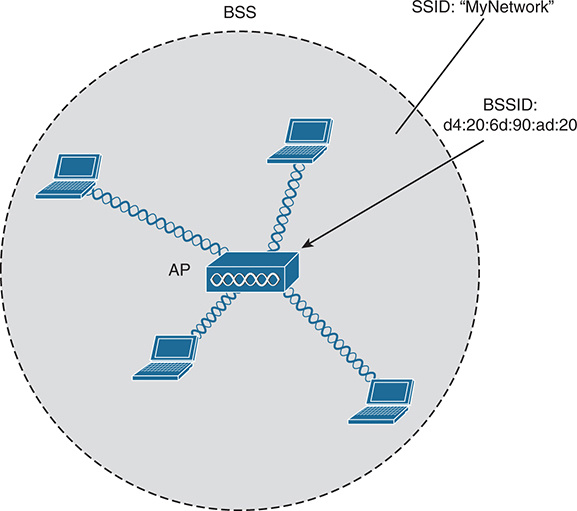
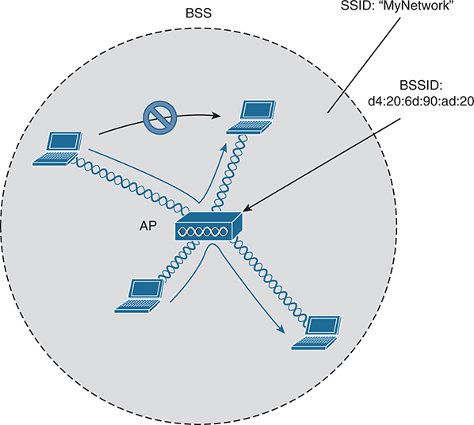
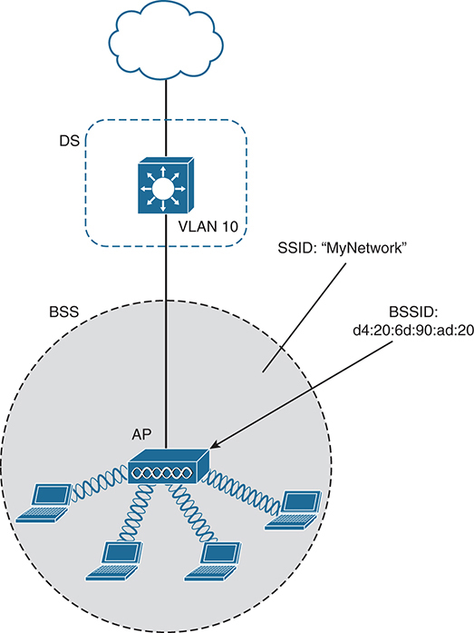
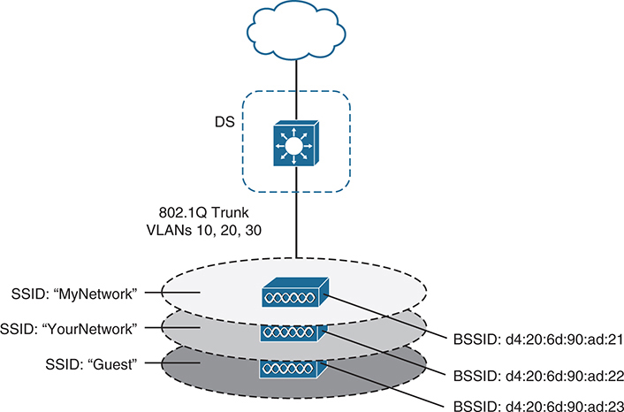
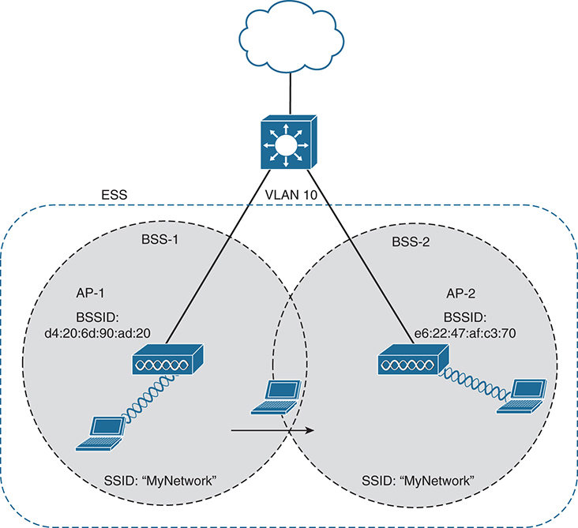
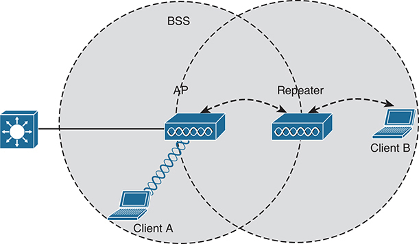
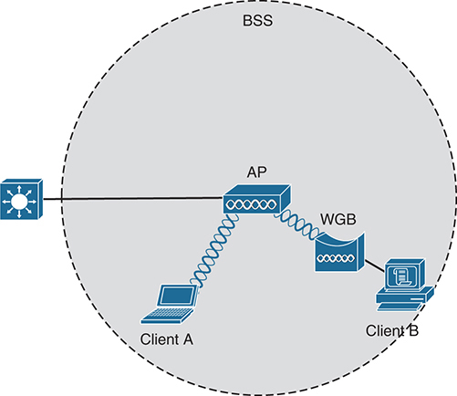
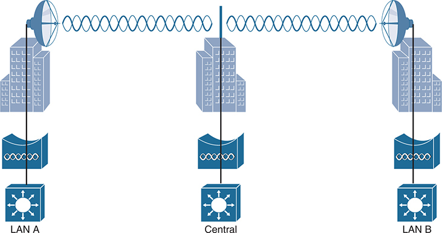
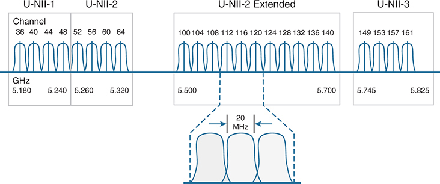

# Chapter 1

## Fundamentals of Wireless Networks

This chapter covers the following exam topics:

1.0 Network Fundamentals

1.1 Explain the role and function of network components

1.1.d Access Points

1.11 Describe wireless principles

1.11.a Non-overlapping Wi-Fi Channels

1.11.b SSID

1.11.c RF

Wireless communication usually involves a data exchange between two devices. A wireless LAN goes even further; many devices can participate in sharing the medium for data exchanges. Wireless LANs must transmit a signal over radio frequencies (RF) to move data from one device to another. Transmitters and receivers can be fixed in consistent locations, or they can be mobile and free to move around. This chapter explains the topologies that can be used to control access to the wireless medium and provide data exchange between devices.

### "Do I Know This Already?" Quiz

Take the quiz (either here or use the PTP software) if you want to use the score to help you decide how much time to spend on this chapter. The letter answers are listed at the bottom of the page following the quiz. [Appendix C](vol2_appc.xhtml#appc), found both at the end of the book as well as on the companion website, includes both the answers and explanations. You can also find both answers and explanations in the PTP testing software.

**Table 1-1** "Do I Know This Already?" Foundation Topics Section-to-Question Mapping

| Foundation Topics Section | Questions |
| --- | --- |
| Comparing Wired and Wireless Networks | 1 |
| Wireless LAN Topologies | 2–4 |
| Other Wireless Topologies | 5, 6 |
| Wireless Bands and Channels | 7, 8 |

**[1](vol2_ch01.xhtml#ques1_1a).** Wired Ethernet and Wi-Fi are based on which two IEEE standards, respectively?

1. 802.1, 802.3
2. 802.3, 802.1
3. 802.3, 802.11
4. 802.11, 802.3

**[2](vol2_ch01.xhtml#ques1_2a).** Devices using a wireless LAN must operate in which one of the following modes?

1. Round-robin access
2. Half duplex
3. Full duplex
4. None of these answers are correct

**[3](vol2_ch01.xhtml#ques1_3a).** An access point is set up to offer wireless coverage in an office. Which one of the following is the correct 802.11 term for the resulting standalone network?

1. BSA
2. BSD
3. BSS
4. IBSS

**[4](vol2_ch01.xhtml#ques1_4a).** Which one of the following is used to uniquely identify an AP and the basic service set it maintains with its associated wireless clients?

1. SSID
2. BSSID
3. Ethernet MAC address
4. Radio MAC address

**[5](vol2_ch01.xhtml#ques1_5a).** Which one of the following can be used to provide wireless connectivity to a nonwireless device?

1. Wireless repeater
2. Workgroup bridge
3. Transparent bridge
4. Adaptive bridge

**[6](vol2_ch01.xhtml#ques1_6a).** Which one of the following is not needed in a Cisco outdoor mesh network?

1. A BSS function
2. Ethernet cabling to each AP
3. A workgroup bridge
4. A backhaul network

**[7](vol2_ch01.xhtml#ques1_7a).** Which of the following are frequency bands commonly used for Wi-Fi? (Choose two answers.)

1. 2.5 KHz
2. 2.5 MHz
3. 5 MHz
4. 2.5 GHz
5. 5 GHz

**[8](vol2_ch01.xhtml#ques1_8a).** Which of the following are considered to be nonoverlapping channels? (Choose two answers.)

1. Channels 1, 2, and 3 in the 2.4-GHz band
2. Channels 1, 5, and 10 in the 2.4-GHz band
3. Channels 1, 6, and 11 in the 2.4-GHz band
4. Channels 40, 44, and 48 in the 5-GHz band

Answers to the "Do I Know This Already?" quiz:

**[1](vol2_appc.xhtml#ques1_1)** C

**[2](vol2_appc.xhtml#ques1_2)** B

**[3](vol2_appc.xhtml#ques1_3)** C

**[4](vol2_appc.xhtml#ques1_4)** B

**[5](vol2_appc.xhtml#ques1_5)** B

**[6](vol2_appc.xhtml#ques1_6)** B

**[7](vol2_appc.xhtml#ques1_7)** D, E

**[8](vol2_appc.xhtml#ques1_8)** C, D

### Foundation Topics

### Comparing Wired and Wireless Networks

In a wired network, any two devices that need to communicate with each other must be connected by a wire. (That was obvious!) The "wire" might contain strands of metal or fiber-optic material that run continuously from one end to the other. Data that passes over the wire is bounded by the physical properties of the wire. In fact, the IEEE 802.3 set of standards defines strict guidelines for the Ethernet wire itself, in addition to how devices may connect, send, and receive data over the wire.

Wired connections have been engineered with tight constraints and have few variables that might prevent successful communication. Even the type and size of the wire strands, the number of twists the strands must make around each other over a distance, and the maximum length of the wire must adhere to the standard.

Therefore, a wired network is essentially a bounded medium; data must travel over whatever path the wire or cable takes between two devices. If the cable goes around a corner or lies in a coil, the electrical signals used to carry the data must also go around a corner or around a coil. Because only two devices may connect to a wire, only those two devices may send or transmit data. Even better: the two devices may transmit data to each other simultaneously because they each have a private, direct path to each other—assuming there are enough wires dedicated to each direction within the cable.

Wired networks also have some shortcomings. When a device is connected by a wire, it cannot move around very easily or very far. Before a device can connect to a wired network, it must have a connector that is compatible with the one on the end of the wire. As devices get smaller and more mobile, it just is not practical to connect them to a wire.

As its name implies, a wireless network removes the need to be tethered to a wire or cable. Convenience and mobility become paramount, enabling users to move around at will while staying connected to the network. A user can (and often does) bring along many different wireless devices that can all connect to the network easily and seamlessly.

Wireless data must travel through free space, without the constraints and protection of a wire. In the free space environment, many variables can affect the data and its delivery. To minimize the variables, wireless engineering efforts must focus on two things:

* Wireless devices must adhere to a common standard (IEEE 802.11).
* Wireless coverage must exist in the area where devices are expected to use it.

As you study for the CCNA 200-301 exam, keep in mind that the exam is geared more toward a functional view of wireless technology. More detailed topics like RF characteristics, antenna performance, and so on are reserved for the Implementing Cisco Enterprise Network Core Technologies ENCOR 300-401 exam.

### Wireless LAN Topologies

Wireless communication takes place over free space through the use of RF signals. The signals are sent by one device, the transmitter, to another device, the receiver. As [Figure 1-1](vol2_ch01.xhtml#ch01fig01) shows, the transmitter can contact the receiver at any and all times, as long as both devices are tuned to the same frequency (or channel) and use the same scheme to carry the data between them. That all sounds simple, except that it is not really practical.

**Figure 1-1** *Unidirectional Communication*

To fully leverage wireless communication, data should travel in *both* directions, as shown in [Figure 1-2](vol2_ch01.xhtml#ch01fig02). Sometimes Device A needs to send data to Device B, while Device B would like to take a turn to send at other times.

**Figure 1-2** *Bidirectional Communication*

Because the two devices are using the same channel, two phrases in the preceding sentence become vitally important: *take a turn* and *send at other times*. With wireless communication, if multiple signals are received at the same time, they can interfere with each other. The likelihood of interference increases as the number of wireless devices grows. For example, [Figure 1-3](vol2_ch01.xhtml#ch01fig03) shows four devices tuned to the same channel and what might happen if some or all of them transmit at the same time.

**Figure 1-3** *Interference from Simultaneous Transmissions*

All this talk about waiting turns and avoiding interference might remind you of a traditional (nonswitched) Ethernet LAN, where multiple hosts can connect to a shared media and share a common bandwidth. To use the media effectively, all the hosts must operate in half-duplex mode so that they try to avoid colliding with other transmissions already in progress. The side effect is that no host can transmit and receive at the same time on a shared medium.

A wireless LAN is similar. Because multiple hosts can share the same channel, they also share the "airtime" or access to that channel at any given time. Therefore, to keep everything clean, only one device should transmit at any given time. To contend for use of the channel, devices based on the 802.11 standard have to determine whether the channel is clear and available before transmitting anything.

Note

IEEE 802.11 WLANs are always half duplex because transmissions between stations use the same frequency or channel. Only one station can transmit at any time; otherwise, collisions occur. To achieve full-duplex mode, one station's transmission would have to occur on one frequency while it receives over a different frequency—much like full-duplex Ethernet links work. Although this operation is certainly possible and practical, the 802.11 standard does not permit full-duplex operation. Some amendments to the standard do provide a means for multiple devices to transmit on the same channel at the same time, but this is beyond the scope of this book.

At the most basic level, there is no inherent organization to a wireless medium or any inherent control over the number of devices that can transmit and receive frames. Any device that has a wireless network adapter can power up at any time and try to communicate. At a minimum, a wireless network should have a way to make sure that every device using a channel can support a common set of parameters. Beyond that, there should be a way to control which devices (and users) are allowed to use the wireless medium and the methods that are used to secure the wireless transmissions.

#### Basic Service Set

The solution is to make every wireless service area a closed group of mobile devices that forms around a fixed device; before a device can participate, it must advertise its capabilities and then be granted permission to join. The 802.11 standard calls this a [basic service set (BSS)](vol2_gloss.xhtml#gloss_052). At the heart of every BSS is a wireless [access point (AP)](vol2_gloss.xhtml#gloss_021), as shown in [Figure 1-4](vol2_ch01.xhtml#ch01fig04). The AP operates in [infrastructure mode](vol2_gloss.xhtml#gloss_173), which means it offers the services that are necessary to form the infrastructure of a wireless network. The AP also establishes its BSS over a single wireless channel. The AP and the members of the BSS must all use the same channel to communicate properly.

Because the operation of a BSS hinges on the AP, the BSS is bounded by the area where the AP's signal is usable. This is known as the *basic service area* (BSA) or [cell](vol2_gloss.xhtml#gloss_062). In [Figure 1-4](vol2_ch01.xhtml#ch01fig04), the cell is shown as a simple shaded circular area that centers around the AP itself. Cells can have other shapes too, depending on the antenna that is connected to the AP and on the physical surroundings that might affect the AP's signals.

The AP serves as a single point of contact for every device that wants to use the BSS. It advertises the existence of the BSS by periodically transmitting an 802.11 [beacon](vol2_gloss.xhtml#gloss_054) frame so that devices can find it and try to join. Beacon frames contain a text string called a [Service Set Identifier (SSID)](vol2_gloss.xhtml#gloss_303), which identifies the BSS. Beacons are normally broadcast about ten times per second (100-ms intervals), and also contain information about the data rates to be used within the BSS and any vendor-specific information needed. If the AP supports multiple SSIDs, a different beacon is broadcast for each SSID.

Recall that wired Ethernet devices each have a unique MAC address to send frames from a source to a destination over a Layer 2 network. Wireless devices must also have unique MAC addresses to send wireless frames at Layer 2 over the air. When the AP transmits wireless frames, it uses a [Basic Service Set Identifier (BSSID)](vol2_gloss.xhtml#gloss_053) that is based on the AP's own radio MAC address.

The diagram representing an 802 dot 11 Basic Service Set (BSS) network shows a central Access Point (AP) labeled with a B S S I D of d 4:20:6 d:90:a d:20, connected to four different laptop devices. These connections are depicted as cross waveform, indicating wireless communication within the network labeled as S S I D: My Network. The entire network is enclosed within a large circle, symbolizing the coverage area of this B S S.

**Figure 1-4** *802.11 Basic Service Set*

Tip

Think of the BSSID as a machine-readable name tag that uniquely identifies the BSS ambassador (the AP), and the SSID as a nonunique, human-readable name tag that identifies the wireless service.

A wireless device can learn about BSSs within range by listening to the beacons that are received. This operation is known as [passive scanning](vol2_gloss.xhtml#gloss_244). Devices can also actively discover SSIDs that are within range by transmitting 802.11 [probe request](vol2_gloss.xhtml#gloss_269) frames. APs can answer the request by sending a probe response frame that contains most of the beacon information.

Membership with the BSS is called an *association*. A wireless device must send an 802.11 [association request](vol2_gloss.xhtml#gloss_044) frame to the AP, and the AP must either grant or deny the request by sending an *association response* frame. Once associated, a device becomes a client, or an 802.11 [station (STA)](vol2_gloss.xhtml#gloss_336), of the BSS.

What then? As long as a wireless client remains associated with a BSS, most communications to and from the client must pass *through* the AP, as indicated in [Figure 1-5](vol2_ch01.xhtml#ch01fig05). When the BSSID is used as a source or destination address, data frames can be relayed to or from the AP.

You might be wondering why all client traffic has to traverse the AP at all. Why can two clients not simply transmit data frames directly to each other and bypass the middleman? If clients are allowed to communicate directly, then the whole idea of organizing and managing a BSS is moot. By sending data through the AP first, the BSS remains stable and under control.

The diagram representing a Basic Service Set (BSS) network with a central Access Point (AP) labeled with a B S S I D of d 4:20:6 d:90:a d:20, connected to four different laptop devices. These connections are depicted as cross waveform, indicating wireless communication within the network labeled as S S I D: My Network. The entire network is enclosed within a large circle, symbolizing the coverage area of B S S. A prohibition sign above the AP representing the wireless signal's omnidirectional nature and arrows shows the directions.

**Figure 1-5** *Traffic Flows Within a BSS*

Tip

Even though data frames are meant to pass through an AP, keep in mind that other devices in the same general area that are listening on the same channel can overhear the transmissions. After all, wireless frames are not contained within a wire that connects a device to an AP. Instead, the frames are freely available over the air to anyone that is within range to receive them. If the frames are unencrypted, then anyone may inspect their contents. Only the BSSID value contained within the frames indicates that the intended sender or recipient is the AP.

#### Distribution System

Notice that a BSS involves a single AP and no explicit connection into a regular Ethernet network. In that setting, the AP and its associated clients make up a standalone network. But the AP's role at the center of the BSS does not just stop with managing the BSS; sooner or later, wireless clients will need to communicate with other devices that are not members of the BSS. Fortunately, an AP can also uplink into an Ethernet network because it has both wireless and wired capabilities. The 802.11 standard refers to the upstream wired Ethernet as the [distribution system (DS)](vol2_gloss.xhtml#gloss_120) for the wireless BSS, as shown in [Figure 1-6](vol2_ch01.xhtml#ch01fig06).

You can think of an AP as a translational bridge, where frames from two dissimilar media (802.11 wireless and 802.3 wired) are translated and then bridged at Layer 2. In simple terms, the AP is in charge of mapping a virtual local-area network (VLAN) to an SSID. In [Figure 1-6](vol2_ch01.xhtml#ch01fig06), the AP maps VLAN 10 to the wireless LAN using SSID "MyNetwork." Clients associated with the "MyNetwork" SSID will appear to be connected to VLAN 10.

In the diagram, a network cloud at the top connected to the access point via V LAN 10, a dashed rectangle surrounds the V LAN 10 labeled as "DS". In the bottom part, a Basic Service Set (BSS) network with the central Access Point (AP) labeled with a B S S I D of d 4:20:6 d:90:a d:20, connected to four different laptop devices. These connections are depicted as cross waveform, indicating wireless communication within the network labeled as S S I D: My Network. The entire network is enclosed within a large circle, symbolizing the coverage area of B S S.

**Figure 1-6** *Distribution System Supporting a BSS*

This concept can be extended so that multiple VLANs are mapped to multiple SSIDs. To do this, the AP must be connected to the switch by a trunk link that carries the VLANs. In [Figure 1-7](vol2_ch01.xhtml#ch01fig07), VLANs 10, 20, and 30 are trunked to the AP over the DS. The AP uses the 802.1Q tag to map the VLAN numbers to the appropriate SSIDs. For example, VLAN 10 is mapped to SSID "MyNetwork," VLAN 20 is mapped to SSID "YourNetwork," and VLAN 30 to SSID "Guest."

In effect, when an AP uses multiple SSIDs, it is trunking VLANs over the air, and over the same channel, to wireless clients. The clients must use the appropriate SSID that has been mapped to the respective VLAN when the AP was configured. The AP then appears as multiple logical APs—one per BSS—with a unique BSSID for each. With Cisco APs, this is usually accomplished by incrementing the last digit of the radio's MAC address for each SSID.

In the diagram, a network cloud at the top connected to the access point via layer 3 switch labeled as "802 dot 1 Q Trunk V LANs 10, 20, and 30", a dashed rectangle labeled as "DS" surrounds the layer 3 switch. In the bottom part, three Basic Service Set (BSS) network with the central Access Point indicating different S S I Ds: My Network, Your Network, and Guest" where each S S I D layer has a corresponding B S S I D: d 4:20:6 d:90:a d:21, d 4:20:6 d:90:a d:22, and d 4:20:6 d:90:a d:23 respectively.

**Figure 1-7** *Supporting Multiple SSIDs on One AP*

Even though an AP can advertise and support multiple logical wireless networks, each of the SSIDs covers the same geographic area. The reason is that the AP uses the same transmitter, receiver, antennas, and channel for every SSID that it supports. Beware of one misconception though: multiple SSIDs can give an illusion of scale. Even though wireless clients can be distributed across many SSIDs, all of those clients must share the same AP's hardware and must contend for airtime on the same channel.

#### Extended Service Set

Normally, one AP cannot cover the entire area where clients might be located. For example, you might need wireless coverage throughout an entire floor of a business, hotel, hospital, or other large building. To cover more area than a single AP's cell can cover, you simply need to add more APs and spread them out geographically.

When APs are placed at different geographic locations, they can all be interconnected by a switched infrastructure. The 802.11 standard calls this an [extended service set (ESS)](vol2_gloss.xhtml#gloss_138), as shown in [Figure 1-8](vol2_ch01.xhtml#ch01fig08).

The idea is to make multiple APs cooperate so that the wireless service is consistent and seamless from the client's perspective. Ideally, any SSIDs that are defined on one AP should be defined on all the APs in an ESS; otherwise, it would be very cumbersome and inconvenient for a client to be reconfigured each time it moves into a different AP's cell.

Notice that each cell in [Figure 1-8](vol2_ch01.xhtml#ch01fig08) has a unique BSSID, but both cells share one common SSID. Regardless of a client's location within the ESS, the SSID will remain the same, but the client can always distinguish one AP from another. Having a consistent SSID through the ESS is called an [Extended Service Set Identifier (ESSID)](vol2_gloss.xhtml#gloss_139).

In the diagram, the E S S consists of two Basic Service Sets B S S 1 and B S S 2, each with its own Access Point A P 1 and A P 2 and a laptop device connected wirelessly. A P 1 is part of B S S 1 and has a B S S I D of d 4:20:6 d:90:a d:20. It broadcasts an S S I D named "My Network" and A P 2 is part of B S S 2 and has a B S S I D of e 6:22:47:a f:c 3:70 which broadcasts an S S I D named "My Network". Both B S Ss overlap in the middle, allowing for seamless connectivity for devices within the coverage area with a network cloud at the top connected to V L A N 10.

**Figure 1-8** *Scaling Wireless Coverage with an 802.11 Extended Service Set*

In an ESS, a wireless client can associate with only one AP while it is physically located near that AP. If the client later moves to a different location, it can move its association to a different nearby AP by sending a [reassociation request](vol2_gloss.xhtml#gloss_283) frame to the new AP. That AP sends a reassociation response frame in return.

Passing from one AP to another is called [roaming](vol2_gloss.xhtml#gloss_293). Keep in mind that each AP offers its own BSS on its own channel, to prevent interference between the APs. As a client device roams from one AP to another, it must scan the available channels to find a new AP (and BSS) to roam toward. In effect, the client is roaming from BSS to BSS, and from channel to channel.

#### Independent Basic Service Set

Usually, a wireless network leverages APs for organization, control, and scalability. Sometimes that is not possible or convenient in an impromptu situation. For example, two people who want to exchange electronic documents at a meeting might not be able to find a BSS available or might want to avoid having to authenticate to a production network. In addition, many personal printers have the capability to print documents wirelessly, without relying on a regular BSS or AP.

The 802.11 standard allows two or more wireless clients to communicate directly with each other, with no other means of network connectivity. This is known as an [ad hoc wireless network](vol2_gloss.xhtml#gloss_028), or an [independent basic service set (IBSS)](vol2_gloss.xhtml#gloss_170), as shown in [Figure 1-9](vol2_ch01.xhtml#ch01fig09). For this connection to work, one of the devices must take the lead and begin advertising a network name and the necessary radio parameters, much like an AP would do. Any other device can then join as needed. IBSSs are meant to be organized in an impromptu, distributed fashion; therefore, they do not scale well beyond eight to ten devices.

**Figure 1-9** *802.11 Independent Basic Service Set*

### Other Wireless Topologies

Wireless APs can be configured to operate in noninfrastructure modes when a normal BSS cannot provide the functionality that is needed. The following sections cover the most common modes.

#### Repeater

Normally, each AP in a wireless network has a wired connection back to the DS or switched infrastructure. To extend wireless coverage beyond a normal AP's cell footprint, additional APs and their wired connections can be added. In some scenarios, it is not possible to run a wired connection to a new AP because the cable distance is too great to support Ethernet communication.

In that case, you can add an additional AP that is configured for *repeater mode*. A wireless [repeater](vol2_gloss.xhtml#gloss_288) takes the signal it receives and repeats or retransmits it in a new cell area around the repeater. The idea is to move the repeater out away from the AP so that it is still within range of both the AP and the distant client, as shown in [Figure 1-10](vol2_ch01.xhtml#ch01fig10).

If the repeater has a single transmitter and receiver, it must operate on the same channel that the AP is using. That can create the possibility that the AP's signal will be received and retransmitted by the repeater, only to be received again by the AP—halving the effective throughput because the channel will be kept busy twice as long as before. As a remedy, some repeaters can use two transmitters and receivers to keep the original and repeated signals isolated on different channels. One transmitter and receiver pair is dedicated to signals in the AP's cell, while the other pair is dedicated to signals in the repeater's own cell.

The diagram includes two circles represents the range of B S S. The left circle, labeled "B S S," contains an access point connected to a layer 3 switch and a laptop device labeled as "Client A". The right circle, labeled "Repeater," represents the extended range of the access point and includes another laptop device labeled as "Client B". A wireless repeater extend the range of the access point, allowing Client B to connect to the network outside of its immediate range is shown by arrows.

**Figure 1-10** *Extending the Range of an AP with a Wireless Repeater*

#### Workgroup Bridge

Suppose you have a device that supports a wired Ethernet link but is not capable of having a wireless connection. For example, some mobile medical devices might be designed with only a wired connection. While it is possible to plug the device into an Ethernet connection when needed, a wireless connection would be much more practical. You can use a [workgroup bridge (WGB)](vol2_gloss.xhtml#gloss_379) to connect the device's wired network adapter to a wireless network.

Rather than providing a BSS for wireless service, a WGB becomes a wireless client of a BSS. In effect, the WGB acts as an external wireless network adapter for a device that has none. In [Figure 1-11](vol2_ch01.xhtml#ch01fig11), an AP provides a BSS; Client A is a regular wireless client, while Client B is associated with the AP through a WGB.

The diagram shows a basic service set (B S S) represented by a dotted circle with an access point (A P) in the center wirelessly connected to a laptop device labeled as "Client A" and a workgroup bridge (W G B). The W G B is connected via a wire to a P C labeled as "Client B". A layer 3 switch is also connected with the access point which is out of the BSS range.

**Figure 1-11** *Nonwireless Device Connecting Through a Workgroup Bridge*

You might encounter two types of *workgroup bridges*:

* **Universal workgroup bridge (uWGB):** A single wired device can be bridged to a wireless network.
* **Workgroup bridge (WGB):** A Cisco-proprietary implementation that allows multiple wired devices to be bridged to a wireless network.

#### Outdoor Bridge

An AP can be configured to act as a bridge to form a single wireless link from one LAN to another over a long distance. Outdoor bridged links are commonly used for connectivity between buildings or between cities.

If the LANs at two locations need to be bridged, a [point-to-point bridged](vol2_gloss.xhtml#gloss_253) link can be used. One AP configured in bridge mode is needed on each end of the wireless link. Special-purpose antennas are normally used with the bridges to focus their signals in one direction—toward the antenna of the AP at the far end of the link. This configuration maximizes the link distance, as shown in [Figure 1-12](vol2_ch01.xhtml#ch01fig12).

In the diagram, two local area networks, labeled as LAN A and LAN B, are connected by two bridges. These bridges are connected to the towers located at the top of commercial buildings, indicating a wireless connection between them.

**Figure 1-12** *Point-to-Point Outdoor Bridge*

Sometimes the LANs at multiple sites need to be bridged together. A point-to-multipoint bridged link allows a central site to be bridged to several other sites. The central site bridge is connected to an omnidirectional antenna, such that its signal is transmitted equally in all directions so that it can reach the other sites simultaneously. The bridges at each of the other sites can be connected to a directional antenna aimed at the central site. [Figure 1-13](vol2_ch01.xhtml#ch01fig13) shows the point-to-multipoint scenario.

The diagram shows a central site labeled "Central" with a layer 3 switch connected to the commercial site via bridged links. Two other sites labeled "LAN A" on the left and "LAN B" on the right where each site is depicted a layer 3 switch connected to the commercial site via bridged links and a directional antenna on the top that indicating a wireless connection towards the central site.

**Figure 1-13** *Point-to-Multipoint Outdoor Bridge*

#### Mesh Network

To provide wireless coverage over a very large area, it is not always practical to run Ethernet cabling to every AP that would be needed. Instead, you could use multiple APs configured in mesh mode. In a mesh topology, wireless traffic is bridged from AP to AP, in a daisy-chain fashion, using another wireless channel.

Mesh APs can leverage dual radios—one using a channel in one range of frequencies and one a different range. Each mesh AP usually maintains a BSS on one channel, with which wireless clients can associate. Client traffic is then usually bridged from AP to AP over other channels as a backhaul network. At the edge of the [mesh network](vol2_gloss.xhtml#gloss_208), the backhaul traffic is bridged to the wired LAN infrastructure. [Figure 1-14](vol2_ch01.xhtml#ch01fig14) shows a typical mesh network. With Cisco APs, you can build a mesh network indoors or outdoors. The mesh network runs its own dynamic routing protocol to work out the best path for backhaul traffic to take across the mesh APs.

**Figure 1-14** *Typical Wireless Mesh Network*

### Wireless Bands and Channels

The electromagnetic waves involved in a wireless signal can be measured and described in several ways. One fundamental property is the frequency of the wave, or the number of times the signal oscillates or makes one complete positive and negative cycle in one second. One complete cycle within one second is known as one hertz (Hz). Wi-Fi signals use frequencies that oscillate more than one billion times per second, or one gigahertz (GHz).

One of the three main frequency ranges used for wireless LAN communication lies between 2.400 and 2.4835 GHz. This is usually called the *2.4-GHz* [band](vol2_gloss.xhtml#gloss_001), even though it does not encompass the entire range between 2.4 and 2.5 GHz. It is much more convenient to refer to the band name instead of the specific range of frequencies included. Another wireless LAN range is usually called the *5-GHz band* because it lies between 5.150 and 5.825 GHz. The 5-GHz band actually contains four smaller separate and distinct bands, with the possibility of more small bands being added in the future. The 6-GHz band lies between 5.925 and 7.125 GHz. It is broken up into four smaller bands too.

To keep everything orderly and compatible, bands are usually divided into a number of distinct [channels](vol2_gloss.xhtml#gloss_229). Each channel is known by a channel number and is assigned to a specific frequency. As long as the channels are defined by a national or international standards body, they can be used consistently in all locations. [Figures 1-15](vol2_ch01.xhtml#ch01fig15) and [1-16](vol2_ch01.xhtml#ch01fig16) show the channel layout for the 2.4- and 5-GHz bands, respectively.

The diagram features a horizontal line with channel numbers from 1 to 14 marked at regular intervals. Corresponding frequency values ranging from 2.412 gigahertz to 2.484 gigahertz are indicated below this line. Overlapping arcs above the line represent the range of each channel, shows the extension beyond their central frequency point to adjacent channels. Two types of modulation, D S S S at 22 megahertz and O F D M at 20 megahertz, are marked which ranges below the frequency values 2.427 to 2.447 gigahertz approximately shows its respective bandwidths across multiple frequencies.

**Figure 1-15** *Channel Layout in the 2.4-GHz Band*

The diagram features a horizontal line with channel numbers from 36 to 161 marked at regular intervals. Corresponding frequency values ranging from 5.180 gigahertz to 5.825 gigahertz are indicated below this line. A series of wavy structures above the line symbolizing signal oscillations, and peaks that represent individual channels divided into four sections U NII 1, U NII 2, U NII 2 Extended, and U NII 3, representing different parts of the 5-GHz band used in wireless LAN communication. An inset detail in the diagram provides an enlarged view of a single channel, emphasizing its 20 MHz width, which is a standard for Wi-Fi channels in the 5 GHz band.

**Figure 1-16** *Channel Layout in the 5-GHz Band*

You might assume that an AP can use any channel number without affecting any APs that use other channel numbers. In the 5-GHz band, this is the case because each channel is allocated a frequency range that does not encroach on or overlap the frequencies allocated for any other channel. In other words, the 5-GHz band consists of [nonoverlapping channels](vol2_gloss.xhtml#gloss_229). In [Figure 1-16](vol2_ch01.xhtml#ch01fig16) notice that the valid channel numbers are not incremental; instead, they increase by four. That means channel numbers in between, such as channels 37, 38, and 39, are not valid or used. Channels in the 6-GHz band are numbered in a similar fashion.

The same is *not* true of the 2.4-GHz band. Each of its channels is much too wide to avoid overlapping the next lower or upper channel number. In fact, each channel covers the frequency range that is allocated to more than four consecutive channels! Notice the width of the channel spacing in [Figure 1-15](vol2_ch01.xhtml#ch01fig15) as compared to the width of one of the shaded signals centered on channels 1, 6, and 11. The only way to avoid any overlap between adjacent channels is to configure APs to use only channels 1, 6, and 11. Even though there are 14 channels available to use, you should always strive for nonoverlapping channels in your network.

It might be obvious that wireless devices and APs should all be capable of operating on the same band. For example, a 5-GHz wireless phone can communicate only with an AP that offers Wi-Fi service on 5-GHz channels. In addition, the devices and APs must also share a compatibility with the parts of the 802.11 standard they support.

As the IEEE 802.11 Wi-Fi standard evolves and develops, new amendments with new functionality get proposed. These amendments are known by "802.11" followed by a one- or two-letter suffix until they are accepted and rolled up into the next generation of the complete 802.11 standard. Even then, it is common to see the amendment suffixes still used to distinguish specific functions.

You should be aware of several amendments that define important characteristics such as data rates, methods used to transmit and receive data, and so on. For the CCNA 200-301 exam, you should know which band each of the amendments listed in [Table 1-2](vol2_ch01.xhtml#ch01tab02) uses. The ENCOR 300-401 exam goes further into the data rates and modulation and coding schemes used by each.

**Table 1-2** Basic Characteristics of Some IEEE 802.11 Amendments

| Amendment | 2.4 GHz | 5 GHz | 6 GHz | Max Data Rate | Notes |
| --- | --- | --- | --- | --- | --- |
| 802.11-1997 | Yes | No | No | 2 Mbps | The original 802.11 standard ratified in 1997 |
| 802.11b | Yes | No | No | 11 Mbps | Introduced in 1999 |
| 802.11g | Yes | No | No | 54 Mbps | Introduced in 2003 |
| 802.11a | No | Yes | No | 54 Mbps | Introduced in 1999 |
| 802.11n | Yes | Yes | No | 600 Mbps | HT (high throughput), introduced in 2009 |
| 802.11ac | No | Yes | No | 6.93 Gbps | VHT (very high throughput), introduced in 2013 |
| 802.11ax | Yes | Yes | Yes | 4x 802.11ac | High Efficiency Wireless |

The 802.11 amendments are not mutually exclusive. Wireless client devices and APs can be compatible with one or more amendments; however, a client and an AP can communicate only if they both support and agree to use the same amendment.

When you look at the specifications for a wireless device, you may find supported amendments listed in a single string, separated by slashes. For example, a device that supports 802.11b/g will support both 802.11b and 802.11g. One that supports b/g/a/n/ac will support 802.11b, 802.11g, 802.11a, 802.11n, and 802.11ac. You should become familiar with [Table 1-2](vol2_ch01.xhtml#ch01tab02) so that you can know which bands a device can use based on its 802.11 amendment support.

If a device can operate on both bands, how does it decide which band to use? APs can usually operate on both bands simultaneously to support any clients that might be present on each band. However, wireless clients typically associate with an AP on one band at a time, while scanning for potential APs on both bands. The band used to connect to an AP is chosen according to the operating system, wireless adapter driver, and other internal configuration. A wireless client can initiate an association with an AP on one band and then switch to the other band if the signal conditions are better there.

Note

Cisco APs can have multiple radios (sets of transmitters and receivers) to support a BSS on each supported band. Some models have two 5-GHz radios that can be configured to operate BSSs on two different channels at the same time, providing wireless coverage to higher densities of users that are located in the same vicinity.

You can configure a Cisco AP to operate on a specific channel number. As the number of APs grows, manual channel assignment can become a difficult task. Fortunately, Cisco wireless architectures can automatically and dynamically assign each AP to an appropriate channel. The architecture is covered in [Chapter 2](vol2_ch02.xhtml#ch02), "[Analyzing Cisco Wireless Architectures](vol2_ch02.xhtml#ch02)," while dynamic channel assignment is covered on the ENCOR 300-401 exam.

In open space, usable RF signals can propagate or reach further on the 2.4-GHz band than on the 5-GHz or 6-GHz band. They also tend to penetrate indoor walls and objects more easily at 2.4 GHz than 5 or 6 GHz. However, the 2.4-GHz band is commonly more crowded with wireless devices. Remember that only three nonoverlapping channels are available, so the chances of other neighboring APs using the same channels are greater. In contrast, the 5- and 6-GHz bands have many more channels available to use, making channels less crowded and experiencing less interference.

As Wi-Fi has evolved, the 802.11 standard has grown and new amendments have been introduced, making it difficult to keep track. The Wi-Fi Alliance introduced a set of simplified names to identify each Wi-Fi generation, as listed in [Table 1-3](vol2_ch01.xhtml#ch01tab03). Wi-Fi 0 denotes the original 802.11 standard in its earliest form, followed by each generation, the supported bands, and the prominent 802.11 amendment used. Wireless products are often named or described by these generational names. For example, you might see APs or clients listed as "Wi-Fi 6E," which simply means they can operate in all three bands using IEEE 802.11ax.

**Table 1-3** Wi-Fi Alliance Generational Names

| Wi-Fi Alliance Designation | Bands Supported | IEEE 802.11 Amendments Supported |
| --- | --- | --- |
| Wi-Fi 0 | 2.4 | 802.11 (the original) |
| Wi-Fi 1 | 2.4 | 802.11b |
| Wi-Fi 2 | 5 | 802.11a |
| Wi-Fi 3 | 2.4 | 802.11g |
| Wi-Fi 4 | 2.4, 5 | 802.11n |
| Wi-Fi 5 | 5 | 802.11ac |
| Wi-Fi 6 | 2.4, 5 | 802.11ax |
| Wi-Fi 6E | 2.4, 5, 6 | 802.11ax |
| Wi-Fi 7 | 2.4, 5, 6 | 802.11be |

### Chapter Review

Review this chapter's material using either the tools in the book or the interactive tools for the same material found on the book's companion website. [Table 1-4](vol2_ch01.xhtml#ch01tab04) outlines the key review elements and where you can find them. To better track your study progress, record when you completed these activities in the second column.

**Table 1-4** Chapter Review Tracking

| Review Element | Review Date(s) | Resource Used |
| --- | --- | --- |
| Review key topics |  | Book, website |
| Review key terms |  | Book, website |
| Answer DIKTA questions |  | Book, PTP |
| Review memory tables |  | Website |

### Review All the Key Topics

**Table 1-5** Key Topics for [Chapter 1](vol2_ch01.xhtml#ch01)

| Key Topic Element | Description | Page Number |
| --- | --- | --- |
| [Figure 1-4](vol2_ch01.xhtml#ch01fig04) | Basic service set | [9](vol2_ch01.xhtml#page_9) |
| [Figure 1-7](vol2_ch01.xhtml#ch01fig07) | Multiple SSIDs | [12](vol2_ch01.xhtml#page_12) |
| [Figure 1-8](vol2_ch01.xhtml#ch01fig08) | Extended service set | [13](vol2_ch01.xhtml#page_13) |
| Paragraph | Nonoverlapping channels and bands | [18](vol2_ch01.xhtml#page_18) |
| [Table 1-2](vol2_ch01.xhtml#ch01tab02) | Basic Characteristics of Some 802.11 Amendments | [19](vol2_ch01.xhtml#page_19) |

### Key Terms You Should Know

[access point (AP)](vol2_ch01.xhtml#key_001)

[ad hoc wireless network](vol2_ch01.xhtml#key_002)

[association request](vol2_ch01.xhtml#key_003)

[band](vol2_ch01.xhtml#key_004)

[basic service set (BSS)](vol2_ch01.xhtml#key_005)

[Basic Service Set Identifier (BSSID)](vol2_ch01.xhtml#key_006)

[beacon](vol2_ch01.xhtml#key_007)

[cell](vol2_ch01.xhtml#key_008)

[channel](vol2_ch01.xhtml#key_009)

[distribution system (DS)](vol2_ch01.xhtml#key_010)

[extended service set (ESS)](vol2_ch01.xhtml#key_011)

[Extended Service Set Identifier (ESSID)](vol2_ch01.xhtml#key_012)

[independent basic service set (IBSS)](vol2_ch01.xhtml#key_013)

[infrastructure mode](vol2_ch01.xhtml#key_014)

[mesh network](vol2_ch01.xhtml#key_015)

[nonoverlapping channels](vol2_ch01.xhtml#key_016)

[passive scanning](vol2_ch01.xhtml#key_017)

[point-to-point bridge](vol2_ch01.xhtml#key_018)

[probe request](vol2_ch01.xhtml#key_019)

[reassociation request](vol2_ch01.xhtml#key_020)

[repeater](vol2_ch01.xhtml#key_021)

[roaming](vol2_ch01.xhtml#key_022)

[Service Set Identifier (SSID)](vol2_ch01.xhtml#key_023)

[station (STA)](vol2_ch01.xhtml#key_024)

[workgroup bridge (WGB)](vol2_ch01.xhtml#key_025)